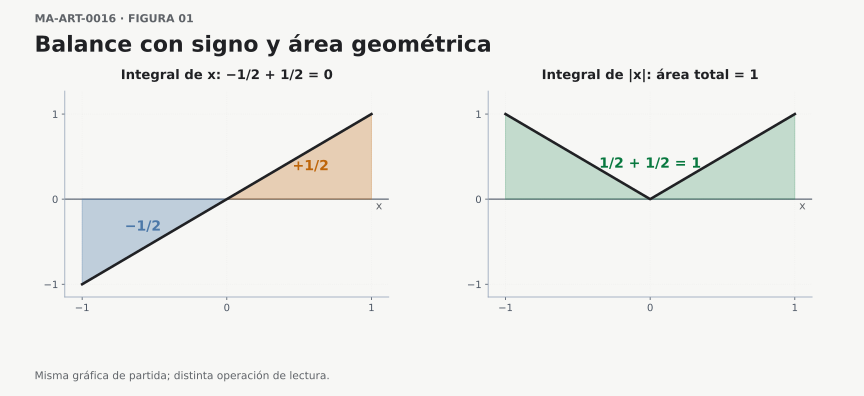
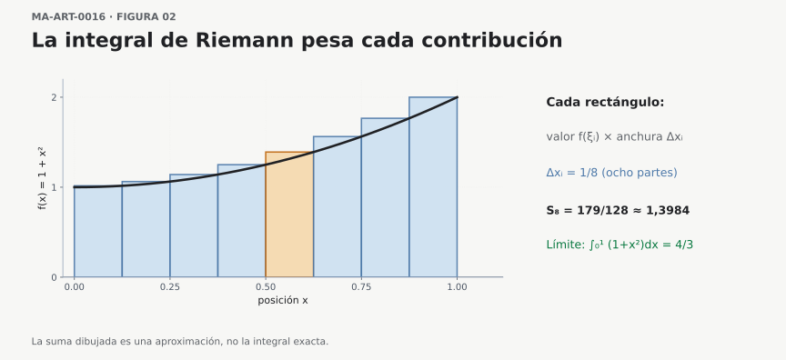
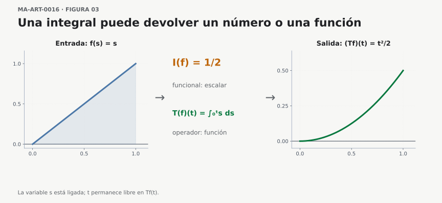
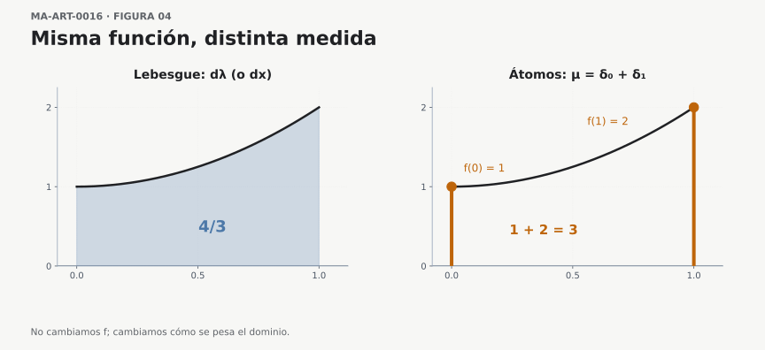
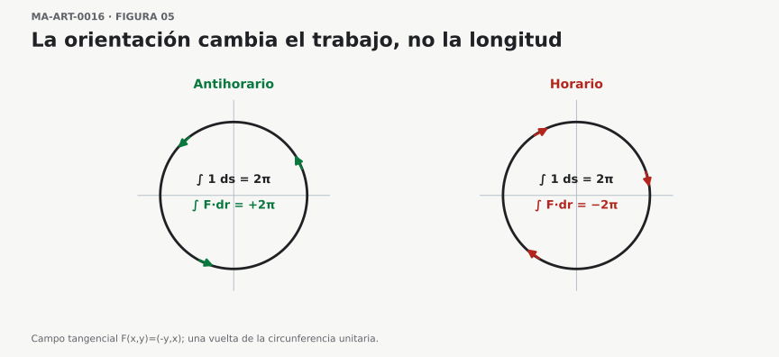
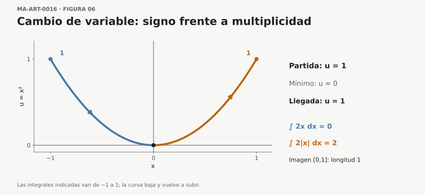
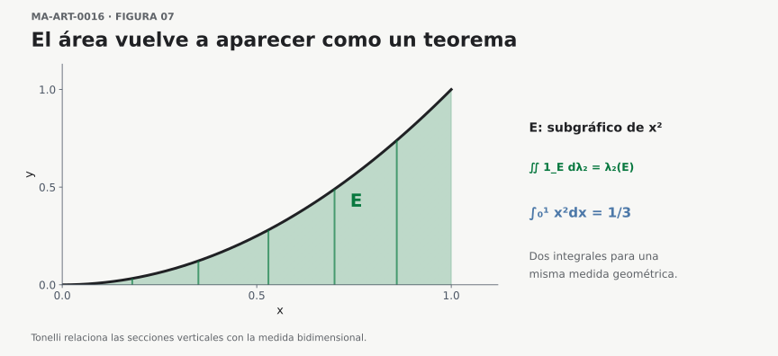

## Cómo leer las integrales en matemáticas avanzadas

La primera vez que encontramos una integral definida suele acompañarla un dibujo: una curva, un eje horizontal y una región sombreada. Aprendemos que integrar consiste en hallar el área bajo una gráfica. Esa imagen es extraordinariamente útil. Explica el origen de muchas fórmulas, permite anticipar resultados y proporciona una intuición para comprender por qué sumamos cantidades cada vez más pequeñas.

Pero llega un momento en que aparecen expresiones como

$$
\int_0^t v(s)\,ds,\qquad
\int_\Omega X\,dP,\qquad
\int_C \mathbf F\cdot d\mathbf r.
$$

La primera puede representar el desplazamiento neto de un móvil, si $v$ es su velocidad con signo respecto del tiempo; la segunda, el valor esperado de una variable aleatoria integrable; la tercera, el trabajo de una fuerza a lo largo de una trayectoria orientada. En cada caso, la interpretación exige hipótesis sobre los objetos y la existencia de la integral. Intentar dibujar en todos los casos una «región bajo la curva» dificulta la lectura. Las expresiones comparten algo más importante que una imagen: **integran contribuciones distribuidas sobre un dominio**.

La pregunta que guiará este artículo es, por tanto, muy concreta: cuando vemos un signo integral, ¿qué debemos identificar antes de intentar calcular?

## 1. El área es una interpretación, pero ya en cálculo aparece una dificultad

Consideremos la función $f(x)=x$ en el intervalo $[-1,1]$. Su integral es

$$
\int_{-1}^{1}x\,dx
=\left[\frac{x^2}{2}\right]_{-1}^{1}
=0.
$$

Sin embargo, las dos regiones triangulares comprendidas entre la gráfica y el eje horizontal tienen área positiva. Su área geométrica total es

$$
\int_{-1}^{1}|x|\,dx=1.
$$

¿Qué ha ocurrido? La integral ordinaria conserva el signo: las contribuciones negativas de $[-1,0]$ compensan las positivas de $[0,1]$. En cambio, el área geométrica suma magnitudes no negativas. Para una función continua en un intervalo, el área comprendida entre la gráfica y el eje es la integral de su valor absoluto; cuando la función es no negativa, ambas expresiones coinciden.

Esta pequeña diferencia cambia la forma de leer la notación. **La integral definida de una función real es, en general, una acumulación con signo**. La interpretación como área geométrica corresponde a un caso particular.

<figure class="ma-integrales-figure" id="fig-ma-art-0017-f01">
<picture>
  <source media="(max-width: 767px)" srcset="../assets/articles/ma-art-0017/MA-ART-0017-F01_balance-y-area-mobile.svg" type="image/svg+xml">
  
</picture>
<figcaption>

Figura MA-ART-0017-F01. <strong>Pregunta visual:</strong> ¿qué se
pierde al decir únicamente «área bajo la curva»? Ambos triángulos tienen
área geométrica \(1/2\); la integral de
\(f(x)=x\) les asigna signos opuestos,
mientras que la de \(|f|\) suma sus
magnitudes. <strong>Control matemático:</strong> \(\int_{-1}^1 x\,dx=0\) y \(\int_{-1}^1|x|\,dx=1\). Los colores y
tramados identifican regiones; ninguno de ellos constituye por sí solo
una demostración.

</figcaption>
</figure>

**Lectura inversa, de la fórmula al dibujo.** Si sustituimos $f$ por $-f$, la integral con signo cambia de signo, pero la integral de $|f|$ permanece igual. Esa observación permite predecir qué figura y qué cálculo deben conservarse al reflejar la gráfica respecto del eje horizontal. Conviene hacer la predicción antes de mirar un nuevo dibujo.

::: {.callout-tip title="Antes de continuar"}
Si una integral vale cero, ¿podemos concluir que la función integrada es idénticamente cero? El ejemplo $f(x)=x$ muestra inmediatamente por qué la respuesta es negativa: puede haber cancelación entre contribuciones de signos opuestos.
:::

### Del área positiva a una cantidad neta

La diferencia entre $\int f$ y $\int|f|$ no es solamente un accidente producido por el ejemplo elegido. Para una función real continua $f$ en $[a,b]$, podemos descomponerla en su parte positiva y su parte negativa:

$$
f^+(x)=\max\{f(x),0\},\qquad
f^-(x)=\max\{-f(x),0\}.
$$

Ambas funciones son no negativas, y satisfacen las identidades $f=f^+-f^-$ y $|f|=f^++f^-$. Por linealidad de la integral de Riemann,

$$
\int_a^b f(x)\,dx
=\int_a^b f^+(x)\,dx-\int_a^b f^-(x)\,dx,
$$

mientras que

$$
\int_a^b |f(x)|\,dx
=\int_a^b f^+(x)\,dx+\int_a^b f^-(x)\,dx.
$$

La primera expresión registra un **balance**; la segunda, una magnitud acumulada sin cancelaciones. De aquí obtenemos una desigualdad que conviene recordar:

$$
\boxed{\left|\int_a^b f(x)\,dx\right|
\leq\int_a^b |f(x)|\,dx.}
$$

**¿De dónde sale?** Puesto que $-|f(x)|\leq f(x)\leq|f(x)|$, la monotonía de la integral permite integrar ambas desigualdades; el resultado equivale a la cota anterior. Una explicación geométrica puede sugerirla, pero la justificación se apoya en propiedades de orden y linealidad que siguen teniendo sentido cuando ya no existe una gráfica plana.

Obsérvese además que *integral cero* y *área cero* son afirmaciones radicalmente distintas. Para una función continua y no negativa en un intervalo no degenerado $[a,b]$ con $a<b$, $\int_a^b f=0$ implica $f\equiv0$; para una función de signo variable, la integral puede anularse por compensación. En una teoría de medida esta última implicación positiva se modifica: una función no negativa puede tener integral cero sin ser idénticamente cero en todos los puntos, aunque sí debe anularse **casi en todas partes**.

### Demostración de la afirmación «integral positiva nula»

¿Por qué podemos deducir que una función continua no negativa con integral nula es la función cero? Supongamos que $f\in C([a,b])$, $a<b$, $f\geq0$ y $\int_a^b f(x)\,dx=0$. Si existiera un punto $c\in[a,b]$ con $f(c)>0$, la continuidad proporcionaría un intervalo $J\subseteq[a,b]$ de longitud positiva y un número $m>0$ tales que $f(x)\geq m$ para todo $x\in J$. Entonces, por monotonía y aditividad,

$$
\int_a^b f(x)\,dx\geq\int_J f(x)\,dx\geq m\,|J|>0,
$$

contradiciendo la hipótesis. En este argumento la continuidad realiza un trabajo decisivo: convierte un valor positivo aislado en valores positivos sobre todo un intervalo.

**¿Qué sucede si sólo suponemos integrabilidad?** En $[0,1]$, la función $g=\mathbf 1_{\{1/2\}}$ es no negativa, Riemann integrable y satisface $\int_0^1g(x)\,dx=0$, aunque $g(1/2)=1$. Un punto aislado no aporta área a la integral de Riemann. La versión apropiada en teoría de la medida es que una función medible no negativa tiene integral cero si y sólo si se anula casi en todas partes respecto de la medida fijada; más adelante demostraremos esta afirmación.

## 2. ¿Qué permanece cuando desaparece el dibujo?

Volvamos a las sumas que preceden a la integral de Riemann. Dividimos $[a,b]$ en pequeños intervalos de longitudes $\Delta x_i$ y elegimos un punto $\xi_i$ en cada uno. Formamos

$$
\sum_{i=1}^{n} f(\xi_i)\,\Delta x_i.
$$

Cada sumando contiene dos datos: el **valor de una función** en una parte del dominio y el **tamaño de esa parte**. Si $f$ es acotada y, cuando la máxima longitud $\max_i\Delta x_i$ tiende a cero, **todas** estas sumas convergen a un mismo número, cualquiera que sea la elección de los puntos $\xi_i$ en sus subintervalos, decimos que $f$ es integrable en el sentido de Riemann y obtenemos:

$$
\int_a^b f(x)\,dx.
$$

La condición puede expresarse sin ambigüedad: existe un número $I\in\mathbb R$ tal que, para todo $\varepsilon>0$, hay $\delta>0$ con la propiedad de que **para cualquier partición etiquetada** $P$ de $[a,b]$ con malla $\|P\|=\max_i\Delta x_i<\delta$, se cumple

$$
\left|\sum_{i=1}^n f(\xi_i)\,\Delta x_i-I\right|<\varepsilon.
$$

Es esencial el cuantificador «cualquier»: una sucesión particular de particiones puede producir un límite sin que exista la integral de Riemann. La función indicadora de los racionales, que examinaremos enseguida, permite observar exactamente ese fallo.

La forma de los sumandos explica por qué hay tantas interpretaciones posibles. Si $f(x)$ es una altura no negativa y $\Delta x_i$ una anchura, sumamos áreas aproximadas. Si $f(x)$ es densidad de masa por unidad de longitud, sumamos masas aproximadas. Si $f(t)$ es velocidad con signo y $\Delta t_i$ un intervalo temporal, sumamos pequeños desplazamientos.

Así aparece una lectura que conviene conservar:

$$
\boxed{\text{integral de Riemann} = \text{límite común de sumas ponderadas},}
$$

cuando estamos trabajando en el marco de las sumas de Riemann. Más adelante la teoría de la medida permitirá formular una idea análoga en dominios mucho más generales, sin depender de particiones en intervalos.

<figure class="ma-integrales-figure" id="fig-ma-art-0017-f02">
<picture>
  <source media="(max-width: 767px)" srcset="../assets/articles/ma-art-0017/MA-ART-0017-F02_riemann-pesos-mobile.svg" type="image/svg+xml">
  
</picture>
<figcaption>

Figura MA-ART-0017-F02. <strong>Pregunta visual:</strong> ¿qué dato
de cada rectángulo corresponde al integrando y cuál corresponde al
elemento de integración? Con ocho subintervalos iguales y extremos
derechos, la figura representa la suma \(S_8=\frac18\sum_{i=1}^8\bigl(1+(i/8)^2\bigr)=179/128\).
El número \(4/3\) es el límite de estas
sumas al refinar la partición, no el valor exacto de la aproximación
dibujada.

</figcaption>
</figure>

**Una prueba de consistencia para el lector.** La función $1+x^2$ es creciente en $[0,1]$, por lo que los rectángulos tomados en el extremo derecho quedan por encima de la curva, salvo en las fronteras. Debemos esperar una suma superior al valor exacto: en efecto, $179/128>4/3$. Si la figura hubiese mostrado una aproximación menor, habría que revisar la elección de puntos o la transcripción del cálculo.

### El valor de una suma depende de qué se está sumando

Podemos comprobar la diferencia sin salir de la matemática elemental. Supongamos que una barra ocupa el segmento de $0$ a $2\,\mathrm m$. Si $x$ es una posición expresada físicamente en metros, el modelo dimensionalmente consistente es

$$
\rho(x)=3\,\frac{\mathrm{kg}}{\mathrm m}
+\left(1\,\frac{\mathrm{kg}}{\mathrm m^2}\right)x,
\qquad 0\,\mathrm m\leq x\leq2\,\mathrm m.
$$

La constante $3$ lleva unidades de masa por longitud y el coeficiente que multiplica a $x$ lleva unidades de masa por longitud al cuadrado; no podemos sumar magnitudes de dimensiones diferentes. Al integrar, si usamos $z$ para el **valor numérico** de la posición en metros, obtenemos

$$
M=\int_{0\,\mathrm m}^{2\,\mathrm m}\rho(x)\,dx
=\left(\int_0^2(3+z)\,dz\right)\mathrm{kg}
=8\,\mathrm{kg}.
$$

La integral puede dibujarse como área bajo la gráfica de $\rho$, pero **sus unidades físicas son de masa**. Cada sumando $\rho(\xi_i)\Delta x_i$ aproxima la masa de un segmento, y $M$ reúne esas contribuciones. La imagen bidimensional sirve como instrumento de cálculo; las magnitudes que intervienen explican qué estamos calculando.

**Prueba de lectura.** Si $\rho$ fuese constante e igual a $3$, ¿qué cambio tendría la masa? ¿Y si duplicamos la longitud sin modificar la densidad? Antes de calcular, el modelo permite anticipar la respuesta.

### Nota conceptual — Darboux y Riemann: dos criterios para una misma integral

La definición de Riemann que acabamos de estudiar exige que las sumas obtenidas eligiendo **cualquier punto de muestra** en cada subintervalo se aproximen a un límite común cuando la malla tiende a cero. Existe una formulación equivalente que evita escoger esos puntos y pregunta directamente cuánto pueden oscilar los valores de la función en cada tramo. Es la formulación mediante **sumas superiores e inferiores de Darboux**. Conviene entender ambas porque la primera hace visible el proceso de acumulación y la segunda proporciona un criterio especialmente eficaz para demostrar integrabilidad.

Supongamos que $f:[a,b]\to\mathbb R$ es **acotada**, con $a<b$, y fijemos una partición $P=\{a=x_0<x_1<\cdots<x_n=b\}$. Para cada intervalo $I_i=[x_{i-1},x_i]$ definimos

$$
m_i=\inf_{x\in I_i}f(x),\qquad
M_i=\sup_{x\in I_i}f(x),\qquad
\Delta x_i=x_i-x_{i-1}.
$$

Como $f$ es acotada, todos estos ínfimos y supremos son números reales finitos, aunque no necesariamente se alcancen en puntos del intervalo. Las **sumas inferior y superior de Darboux** son

$$
\begin{aligned}
L(f,P)&=\sum_{i=1}^{n}m_i\,\Delta x_i,\
U(f,P)&=\sum_{i=1}^{n}M_i\,\Delta x_i.
\end{aligned}
$$

Si $\xi_i\in I_i$ son puntos de muestra arbitrarios, entonces $m_i\leq f(\xi_i)\leq M_i$ y, al sumar con los factores positivos $\Delta x_i$, obtenemos

$$
\boxed{L(f,P)\leq S(f,P,\xi)\leq U(f,P).}
$$

La diferencia entre las dos sumas mide la **oscilación ponderada por la longitud**:

$$
U(f,P)-L(f,P)=\sum_{i=1}^{n}(M_i-m_i)\,\Delta x_i\geq0.
$$

No presupone que $f$ sea positiva: una suma inferior o superior puede tener signo negativo. Los nombres «inferior» y «superior» describen la relación de orden entre las sumas, no dos áreas geométricas necesariamente positivas.

**El criterio de Darboux.** Escribimos $\underline I=\sup_P L(f,P)$ y $\overline I=\inf_P U(f,P)$, donde $P$ recorre todas las particiones finitas del intervalo. El refinamiento de una partición aumenta o mantiene las sumas inferiores y disminuye o mantiene las superiores. Gracias a las refinaciones comunes, $\underline I\leq\overline I$. Para una función acotada, son equivalentes las siguientes afirmaciones:

1. Todas las sumas etiquetadas de Riemann suficientemente finas convergen al mismo número, cualquiera que sea la elección de etiquetas.
2. Las integrales inferior y superior de Darboux coinciden: $\underline I=\overline I$.
3. Para cada $\varepsilon>0$ existe una partición finita $P$ tal que $U(f,P)-L(f,P)<\varepsilon$.

Cuando se cumplen, **el valor común es la integral de Riemann**. Es decir, Darboux no define aquí otra clase de funciones integrables ni asigna un segundo valor a la integral.

**Por qué hay equivalencia.** En una partición fija, las sumas de Riemann pueden aproximar por arriba y por abajo las sumas de Darboux tanto como se quiera: basta escoger etiquetas cuyos valores se acerquen a cada supremo o ínfimo. Por eso, si *todas* las sumas etiquetadas suficientemente finas se aproximan a $I$, también lo hacen las cotas de Darboux. Recíprocamente, supongamos que una partición $P_*$ tiene una separación $U(f,P_*)-L(f,P_*)$ muy pequeña. Una partición etiquetada cualquiera $Q$ puede compararse con la refinación común $R=P_*\cup Q$. Si $|f|\leq M$ y $P_*$ tiene $n-1$ puntos interiores, el posible cambio de las cotas al insertar esos puntos afecta subintervalos de $Q$ cuya longitud total no supera $(n-1)\|Q\|$. En consecuencia,

$$
0\leq U(f,Q)-L(f,Q)
\leq U(f,P_*)-L(f,P_*)+4M(n-1)\|Q\|.
$$

La última contribución tiende a cero cuando se refina *cualquier* partición $Q$. Así, todas sus sumas etiquetadas terminan encerradas en el mismo intervalo tan pequeño como queramos. Esta observación es la parte delicada de la equivalencia: no basta con que exista una partición favorable; hay que controlar también las particiones finas que no la refinan.

**Dos ejemplos que separan la intuición del criterio.** Sea $c\in(a,b)$ y consideremos la función escalonada

$$
h(x)=\begin{cases}0,&a\leq x<c,\1,&c\leq x\leq b.\end{cases}
$$

En cualquier partición, sólo el subintervalo que llega a $c$ desde la izquierda, o el que contiene a $c$ en su interior, puede contribuir a la separación entre sumas superiores e inferiores. Por ello

$$
0\leq U(h,P)-L(h,P)\leq\|P\|.
$$

Como la malla puede hacerse arbitrariamente pequeña, $h$ es integrable en ambos sentidos y $\int_a^b h(x)\,dx=b-c$. Una discontinuidad aislada no impide la integrabilidad. En cambio, para la indicadora $q=\mathbf1_{\mathbb Q\cap[0,1]}$ estudiada a continuación, se cumple $L(q,P)=0$ y $U(q,P)=1$ para **toda** partición $P$: no existe manera de cerrar la separación. La falla que muestran las sumas etiquetadas y la que detectan las cotas de Darboux son exactamente la misma.

::: {.callout-tip title="Comprobación de lectura"}
¿Por qué sería insuficiente exigir que exista *una sucesión de sumas etiquetadas* que converja? ¿Qué información adicional proporciona la condición $U(f,P)-L(f,P)<\varepsilon$? La respuesta exige distinguir la elección de una etiqueta favorable del control uniforme de todas las elecciones.
:::

En este punto conviene situar las teorías sin confundirlas: **Riemann y Darboux son equivalentes** en el marco que hemos fijado; la integral de Lebesgue, que introduciremos después, cambia de fundamento y admite funciones que no son integrables según Riemann. Esta distinción evita atribuir a Darboux el salto conceptual que corresponde a la teoría de la medida.

### Una frontera que las sumas de Riemann no atraviesan

Hay funciones acotadas para las cuales la suma de Riemann no conduce a un valor único. Sea

$$
q(x)=\begin{cases}
1,&x\in\mathbb Q\cap[0,1],\\
0,&x\in[0,1]\setminus\mathbb Q.
\end{cases}
$$

Cualquier subintervalo no degenerado contiene puntos racionales e irracionales. Por tanto, cada suma superior de Darboux de $q$ vale $1$ y cada suma inferior vale $0$, sea cual sea la partición. La función $q$ **no es integrable según Riemann**.

La medida de Lebesgue, sin embargo, asigna medida cero al conjunto numerable $\mathbb Q\cap[0,1]$; de ahí que

$$
\int_{[0,1]}q\,d\lambda=0,
$$

donde $\lambda$ es la medida de Lebesgue. Este ejemplo anticipa una distinción esencial: la integral de Lebesgue no es sencillamente «la suma de Riemann con particiones más pequeñas». Su construcción parte de medir conjuntos y aproximar funciones de otra manera.

### Una verificación de los cuantificadores mediante dos familias de sumas

La función indicadora de los racionales proporciona un diagnóstico aún más directo de la palabra **todas** en la definición de Riemann. Fijemos cualquier partición $P$ de $[0,1]$ con subintervalos de longitud positiva. Como cada subintervalo contiene racionales, podemos elegir todas las etiquetas $\xi_i$ racionales y obtener

$$
S(P,q;\xi_1,\ldots,\xi_n)=\sum_i 1\,\Delta x_i=1.
$$

Si elegimos, para *la misma partición*, todas las etiquetas irracionales, la suma es $0$. Esto sucede con particiones de malla tan pequeña como queramos. Por tanto, no existe un único límite válido para todas las particiones etiquetadas, aunque se puedan construir sucesiones concretas de sumas que valgan siempre $0$ o siempre $1$.

La dificultad no consiste en que falte precisión numérica: **ningún refinamiento de la malla elimina la dependencia respecto de las etiquetas**. La teoría de Lebesgue repara el problema cambiando la construcción de la integral y usando la medida nula de los racionales, no eligiendo una partición privilegiada.

## 3. Una expresión integral tiene una gramática

Antes de operar con

$$
\int_a^b f(x)\,dx,
$$

conviene reconocer cuatro componentes.

1. **Dominio de integración:** el intervalo $[a,b]$ determina dónde se acumulan contribuciones; en una expresión más general puede ser un conjunto, una curva o una superficie.
2. **Integrando:** $f(x)$ indica qué valor aporta cada punto, una vez fijado el contexto.
3. **Elemento de integración:** $dx$ identifica la variable respecto de la cual se integra y, en el caso elemental, recuerda las pequeñas anchuras de las sumas de Riemann.
4. **Resultado y variables libres:** debemos preguntar si la expresión produce un número o una función que todavía depende de parámetros.

Los símbolos no constituyen piezas intercambiables. Por ejemplo, $dx$, $ds$ y $d\mu$ pueden referirse a estructuras distintas. En una integral de Riemann, $dx$ marca la variable integrada y está ligado al paso al límite de las sumas con incrementos $\Delta x_i$; no se postula por ello un número real infinitesimal separado de la integral. En la notación usual de Lebesgue sobre $\mathbb R$, $dx$ abrevia la integración respecto de la medida de Lebesgue $\lambda$, mientras que $d\mu$ identifica explícitamente otra medida. En geometría diferencial, $dx$ designa también una **1-forma diferencial**, un objeto que actúa sobre vectores tangentes; su integración sobre curvas orientadas no se identifica sin más con una medida positiva. Son usos relacionados, pero su significado exacto depende de la teoría en que aparece la integral.

Tampoco el signo integral indica por sí solo una técnica de cálculo. Es una instrucción que sólo queda bien definida una vez que conocemos el objeto que se integra y el sentido de integración utilizado.

### Leer también las unidades y la orientación

La pregunta por el diferencial se vuelve más comprensible si añadimos una prueba dimensional. Cuando $v$ se expresa en metros por segundo y $t$ en segundos, $v(t)\,dt$ tiene unidades de metros. Por eso $\int v(t)\,dt$ puede proporcionar un desplazamiento. Si $\rho$ tiene unidades de kilogramos por metro, $\rho(x)\,dx$ tiene unidades de kilogramos; si $P$ es una probabilidad, $dP$ es adimensional y $\int X\,dP$ posee las unidades de $X$. Las unidades no prueban que una fórmula sea correcta, pero con frecuencia descubren lecturas equivocadas.

La orientación también merece atención. Para funciones integrables sobre un intervalo y cualesquiera extremos $a,b,c$ compatibles,

$$
\int_a^b f(x)\,dx=-\int_b^a f(x)\,dx,
\qquad
\int_a^c f=\int_a^b f+\int_b^c f.
$$

Las integrales de un intervalo orientado permiten sumar desplazamientos o cambios netos; en cambio, una medida positiva $\mu(A)$ de un conjunto $A$ no lleva por sí misma un sentido de recorrido. Es una primera razón para no equiparar sin reservas los símbolos $dx$, $ds$, $d\mu$ y $d\mathbf r$: la notación se interpreta dentro de una construcción matemática determinada.

### No todos los símbolos precedidos de $d$ designan lo mismo

Conviene precisar tres usos que comparten una apariencia tipográfica. En $\int_a^b f(x)\,dx$, el símbolo $dx$ pertenece a la notación de integración de una variable real; en la formulación con medidas puede leerse como abreviatura de $d\lambda(x)$. En $\int_X f\,d\mu$, la letra $\mu$ designa una **medida** definida sobre una $\sigma$-álgebra, y la integral se construye respecto de esa medida, no a partir de una división informal de $\mu$ en cantidades infinitesimales. En $\int_C\mathbf F\cdot d\mathbf r$, el objeto que se integra es la 1-forma $\mathbf F\cdot d\mathbf r$ a lo largo de una curva orientada, bajo las hipótesis ordinarias de regularidad.

Los diferenciales que se manipulan en las reglas usuales de sustitución son notación coherente con un teorema de cambio de variable; escribir $du=\varphi'(x)\,dx$ resulta eficaz, pero la igualdad debe entenderse en el marco apropiado. Para una integral de Lebesgue de funciones no negativas sobre conjuntos, el factor que transforma la medida de longitud es $|\varphi'|$ en la situación unidimensional regular correspondiente. Para una integral con extremos orientados, aparece la derivada con signo, junto con el orden de los extremos. Conservar esta diferencia evita convertir una convención notacional en una falsa identidad universal.

### Variables mudas, parámetros y captura de variables

Renombrar una variable ligada conserva la integral siempre que la nueva letra **no capture** otro parámetro que ya intervenía en la expresión. Por ejemplo,

$$
\int_0^t (t-s)f(s)\,ds
=\int_0^t(t-u)f(u)\,du,
$$

pero sustituir $s$ por $t$ *sin distinguir el parámetro existente* destruiría la información. Este detalle, familiar en lógica y programación como el cambio de nombre de una variable ligada, ayuda a leer expresiones largas sin confundir los papeles de sus símbolos.

### De una expresión simbólica a una oración matemática verificable

La interpretación de una fórmula debe funcionar como una oración completa: indica qué objeto se toma, cuál es la operación, cuáles son las condiciones y qué tipo de resultado cabe esperar. Comparemos tres lecturas que se parecen tipográficamente.

Si $f$ es continua en $[a,b]$, la escritura $\int_a^b f(x)\,dx$ puede leerse como «integrar $f$ sobre el intervalo orientado de $a$ a $b$ con respecto a la variable $x$». Su resultado es un número real y, si $a<b$, la interpretación mediante la medida de longitud coincide con la integral de Riemann. En cambio, escribir $\int_X f\,d\mu$ exige conocer previamente el espacio medible, la medida $\mu$ y las condiciones de medibilidad e integrabilidad: la notación por sí sola no dice si la integral es finita.

Finalmente, en $\int_C\mathbf F\cdot d\mathbf r$ debemos decir que integramos una 1-forma asociada a $\mathbf F$ **a lo largo de un recorrido orientado**. Leer solamente «sumamos valores del campo sobre la curva» omite la operación de producto escalar y la orientación, precisamente los datos que explican el signo del trabajo.

Una comprobación editorial útil consiste en preguntarnos: **¿podría alguien reconstruir el dominio, la variable ligada, las hipótesis y el codominio a partir de nuestra frase?** Si no puede, la paráfrasis ha perdido contenido matemático. Esta disciplina de lectura será la que apliquemos en los apartados siguientes.

## 4. Una integral puede devolver una función

Comparemos estas expresiones:

$$
A=\int_0^1 s^2\,ds,
\qquad
F(t)=\int_0^t s^2\,ds.
$$

La primera produce un número: $A=1/3$. La segunda produce una función de $t$:

$$
F(t)=\frac{t^3}{3}.
$$

Dentro de la segunda integral, $s$ es una **variable ligada** por la operación de integración. Podemos sustituirla sistemáticamente por otra letra sin modificar el resultado:

$$
\int_0^t s^2\,ds=\int_0^t u^2\,du.
$$

En cambio, $t$ es una **variable libre**: fija el extremo superior y determina cuál es el valor de $F(t)$. Esta distinción es indispensable para leer expresiones que combinan integración y parámetros.

Para hacer explícita la existencia de esta integral, fijemos $T>0$, supongamos $f\in C([0,T],\mathbb R)$ y consideremos, en primer término, $t\in[0,T]$. Fuera de este marco habría que comprobar que $f$ sea integrable en cada intervalo utilizado.

Un ejemplo algo más rico es

$$
G(t)=\int_0^t e^{t-s}f(s)\,ds.
$$

Si consideramos $t\geq0$, aquí $s$ recorre el intervalo $[0,t]$; $t$ permanece fijo durante cada integración, aunque se usa tanto en el límite superior como en el factor $e^{t-s}$. Para $t<0$ también puede definirse una integral con extremos orientados, pero el recorrido será de $0$ hacia $t$ y no el intervalo $[0,t]$ entendido con $0$ como extremo menor. Si cambiamos $t$, cambia el intervalo y también el peso asignado a cada $f(s)$. Esta expresión define una función nueva $G$ a partir de $f$.

No hace falta calcular la integral para comenzar a comprenderla. Primero hemos reconocido qué variable se integra, cuál permanece libre y cómo se combinan los valores de $f$.

### La integral indefinida y el teorema fundamental

La notación del cálculo elemental contiene una ambigüedad histórica que conviene resolver antes de seguir. Cuando escribimos

$$
\int f(x)\,dx,
$$

**sin límites de integración**, la lectura convencional en un primer curso es «hallar las primitivas de $f$», es decir, funciones $F$ tales que $F'=f$. No hemos fijado un dominio de acumulación ni un valor numérico. Si $f(x)=2x$, las primitivas en un intervalo son $x^2+C$, con $C$ constante.

Para relacionar ambas ideas, fijemos $a<b$ y supongamos que $f$ es continua en $[a,b]$. Definimos la **función de acumulación**

$$
F(t)=\int_a^t f(s)\,ds,\qquad a\leq t\leq b.
$$

El teorema fundamental del cálculo afirma que $F$ es derivable en $(a,b)$ y $F'(t)=f(t)$; también posee las derivadas laterales correspondientes en los extremos. ¿Por qué aparece $f(t)$? Para $h$ pequeño con $t+h\in[a,b]$,

$$
\frac{F(t+h)-F(t)}{h}
=\frac1h\int_t^{t+h}f(s)\,ds.
$$

La continuidad de $f$ en $t$ hace que ese promedio tienda a $f(t)$ cuando $h\to0$. De este modo se entiende qué relación precisa une acumulación y antiderivación: una función acumulada, bajo hipótesis adecuadas, tiene por derivada el integrando; y una primitiva permite evaluar integrales definidas mediante $\int_a^b f=H(b)-H(a)$.

Esta conexión tampoco significa que **toda integral deba resolverse encontrando una primitiva elemental**. Por ejemplo, $\int_0^1 e^{-x^2}\,dx$ existe y es positiva, aunque $e^{-x^2}$ no tiene primitiva expresable mediante una combinación finita de las funciones elementales habituales. Comprender una integral, aproximarla y expresarla a través de una función especial son actividades matemáticas legítimas sin una fórmula elemental para la primitiva.

### Contraejemplo: una función integrable sin primitiva

Conviene comprobar que las dos nociones no son equivalentes ni siquiera dentro del cálculo de Riemann. Definamos en $[-1,1]$ la función escalonada

$$
h(x)=\begin{cases}0,&-1\leq x<0,\\ 1,&0\leq x\leq1.\end{cases}
$$

La función $h$ es Riemann integrable y $\int_{-1}^1h(x)\,dx=1$. Sin embargo, **no existe ninguna función diferenciable $H$ en $(-1,1)$ cuya derivada sea $h$ en todos los puntos**. En efecto, si $H'=0$ en $(-1,0)$, el teorema del valor medio obliga a que $H$ sea constante a la izquierda de $0$. Si $H'=1$ en $(0,1)$, obliga a que $H(x)-x$ sea constante a la derecha. Como una función diferenciable es continua, las dos expresiones deben coincidir en $0$; pero entonces sus cocientes incrementales laterales allí son, respectivamente, $0$ y $1$. No puede existir $H'(0)$.

La función acumulada $A(t)=\int_{-1}^{t}h(s)\,ds$ sí está bien definida y es continua: vale $0$ para $t\leq0$ y $t$ para $t\geq0$. Precisamente falla su derivabilidad en el punto donde $h$ salta. Esta prueba de estrés muestra por qué el teorema fundamental necesita hipótesis y por qué «tiene integral definida» no implica «admite primitiva».

::: {.callout-important title="Una distinción que evita muchos malentendidos"}
«Calcular una integral indefinida» suele significar encontrar primitivas. «Definir una integral» exige especificar una operación y sus condiciones de existencia. «Interpretar una integral definida» exige identificar sus datos y el objeto que produce. El teorema fundamental del cálculo relaciona dos de estas operaciones en un marco específico; no las convierte en sinónimos universales.
:::

## 5. De cantidad acumulada a operador

Podemos fijar un intervalo y considerar la regla

$$
I(f)=\int_a^b f(x)\,dx.
$$

Ahora la integral se lee como una **operación aplicada a una función**: toma $f$ y le asigna un número. Si trabajamos, por ejemplo, con funciones reales continuas en $[a,b]$, esta operación es lineal. Para funciones $f,g$ y escalares $\alpha,\beta$,

$$
I(\alpha f+\beta g)=\alpha I(f)+\beta I(g).
$$

La explicación puede leerse directamente en las sumas de Riemann. Cada suma de $\alpha f+\beta g$ se separa en $\alpha$ veces la suma de $f$ más $\beta$ veces la suma de $g$. Al tomar los límites, se obtiene la identidad anterior.

También vale la positividad:

$$
f(x)\geq 0\ \text{para todo }x\in[a,b]
\quad\Longrightarrow\quad I(f)\geq 0.
$$

Esta perspectiva es el inicio de una lectura propia del análisis funcional: la integral es un **funcional lineal** sobre un espacio adecuado de funciones. La palabra *funcional* indica precisamente que el argumento de la operación es una función y que su resultado es un escalar.

Advertencia importante: la linealidad no significa que podamos integrar cualquier expresión formal. Es preciso trabajar con una clase de funciones para las que esas integrales existan y las operaciones estén justificadas.

### Dos maneras de actuar sobre funciones

La regla $I$ anterior es un **funcional**: entrega un escalar. Si dejamos libre el extremo superior, obtenemos en cambio un operador que produce funciones:

$$
(Tf)(t)=\int_a^t f(s)\,ds.
$$

Si fijamos $a<b$, la regla de integración definida es $I:C([a,b],\mathbb R)\to\mathbb R$; con la misma clase de entradas, el operador de acumulación puede definirse como $T:C([a,b],\mathbb R)\to C^1([a,b],\mathbb R)$, entendiendo las derivadas en los extremos de forma lateral. Ambos son lineales, pero sus **codominios** son distintos: el primero es el cuerpo de escalares $\mathbb R$ y el segundo es un espacio de funciones. Una función obtenida mediante un operador no recibe por ello el nombre de *funcional*. Además, $(Tf)(t)$ significa que primero aplicamos $T$ a la función $f$ y después evaluamos la función resultante en el punto $t$. Cuando hablamos de una *integral vectorial* con valores en un espacio vectorial o de Banach, es necesario especificar otra construcción (por ejemplo, Bochner); en ese contexto la salida tampoco tiene por qué ser escalar.

Hay, además, una estimación precisa detrás de la afirmación de que integrar es una operación bien comportada. Si $f$ es continua en $[a,b]$ con $a<b$ y

$$
\|f\|_\infty=\max_{x\in[a,b]}|f(x)|,
$$

entonces

$$
\boxed{|I(f)|\leq(b-a)\|f\|_\infty.}
$$

Para demostrarlo basta aplicar la desigualdad de la sección 1 y observar que $|f(x)|\leq\|f\|_\infty$ para cada $x$. Por tanto,

$$
|I(f)|\leq\int_a^b|f(x)|\,dx
\leq\int_a^b\|f\|_\infty\,dx
=(b-a)\|f\|_\infty.
$$

En el lenguaje del análisis funcional, esta cota afirma que $I$ es un **funcional lineal continuo** en el espacio normado $C([a,b])$ con la norma uniforme. La demostración, sin embargo, sólo utilizó desigualdades que el lector ya conoce. La abstracción organiza propiedades previas, en vez de reemplazarlas por palabras nuevas.

<figure class="ma-integrales-figure" id="fig-ma-art-0017-f03">
<picture>
  <source media="(max-width: 767px)" srcset="../assets/articles/ma-art-0017/MA-ART-0017-F03_funcional-operador-mobile.svg" type="image/svg+xml">
  
</picture>
<figcaption>

Figura MA-ART-0017-F03. <strong>Pregunta visual:</strong> cuando dos
integrales contienen la misma función, ¿por qué una devuelve un número y
la otra otra función? En el ejemplo \(f(s)=s\), el funcional \(I(f)=\int_0^1f(s)\,ds\) vale \(1/2\), mientras que \(t\mapsto(Tf)(t)=\int_0^t f(s)\,ds=t^2/2\).
La figura separa los <strong>tipos de salida</strong> y muestra que
\(s\) queda ligada al integrar,
mientras que \(t\) permanece libre.

</figcaption>
</figure>

**Precisión de lectura.** El término *operador* describe una regla entre espacios de funciones, mientras que *funcional* se reserva aquí para una regla con valores escalares. La integral es el mecanismo mediante el cual se definen ambas reglas. Al fijar un valor de $t$, $(Tf)(t)$ vuelve a ser un escalar, pero **$Tf$** considerado como un todo sigue siendo una función.

### Continuidad de los operadores y norma exacta

La estimación anterior puede afinarse para precisar qué significa la **norma de un funcional lineal**. Con la norma uniforme en el espacio $C([a,b])$, definimos

$$
\|I\|=\sup_{\|f\|_\infty\leq1}|I(f)|.
$$

La cota demostrada asegura $\|I\|\leq b-a$. Al escoger $f\equiv1$, para la que $\|f\|_\infty=1$ e $I(f)=b-a$, alcanzamos la cota. Por tanto,

$$
\boxed{\|I\|=b-a.}
$$

El operador de acumulación $T$ también satisface una estimación uniforme: para $a\leq t\leq b$,

$$
|(Tf)(t)|=\left|\int_a^t f(s)\,ds\right|
\leq(t-a)\|f\|_\infty\leq(b-a)\|f\|_\infty.
$$

En consecuencia, $\|Tf\|_\infty\leq(b-a)\|f\|_\infty$ cuando consideramos $T$ como operador con codominio $C([a,b])$. En cambio, si lo consideramos con codominio $C^1([a,b])$, es preciso **especificar una norma** en este nuevo espacio antes de hablar de continuidad o norma del operador. Por ejemplo, con $\|u\|_{C^1}=\|u\|_\infty+\|u'\|_\infty$, el teorema fundamental da

$$
\|Tf\|_{C^1}\leq\bigl((b-a)+1\bigr)\|f\|_\infty.
$$

Así distinguimos cuidadosamente la *linealidad* (propiedad algebraica), la *continuidad* (propiedad dependiente de las normas) y la *elección del codominio*.

### Un funcional como evaluación de un operador integral

La distinción anterior permite una relación adicional. Tomemos ahora $T:C([a,b])\to C([a,b])$, con $(Tf)(t)=\int_a^t f(s)\,ds$. Aunque toda función $Tf$ es de clase $C^1$, elegimos aquí el codominio $C([a,b])$ para componer aplicaciones del mismo tipo. Consideremos el **funcional de evaluación en el extremo $b$**,

$$
\operatorname{ev}_b:C([a,b])\longrightarrow\mathbb R,
\qquad \operatorname{ev}_b(u)=u(b).
$$

Este funcional es lineal y continuo para la norma uniforme, puesto que $|\operatorname{ev}_b(u)|\leq\|u\|_\infty$. Por la propia definición del operador de acumulación,

$$
(\operatorname{ev}_b\circ T)(f)
=\operatorname{ev}_b(Tf)
=(Tf)(b)
=\int_a^b f(s)\,ds=I(f).
$$

Por tanto, **$I=\operatorname{ev}_b\circ T$**: integrar una función sobre todo el intervalo equivale a construir primero su función de acumulación y después evaluar el resultado en el extremo. El dominio de $I$ sigue siendo un espacio de funciones y el codominio es $\mathbb R$. La igualdad es una composición de aplicaciones con tipos compatibles, no una igualdad entre un número y una función.

En general, un funcional lineal es un **caso particular de operador lineal**: la característica especial es su codominio escalar. En este artículo reservamos la palabra *funcional* para destacar ese caso, sin sostener que ambas clases sean disjuntas. Para profundizar en las normas que intervienen al hablar de continuidad de estos operadores puede consultarse el artículo de Matemática Abierta [La norma en matemáticas](norma-en-matematicas.qmd).

### La norma del operador de acumulación: una comprobación adicional

Las estimaciones obtenidas anteriormente admiten una precisión que muestra la importancia de declarar el **codominio normado**. Si $a<b$ y consideramos

$$
T:C([a,b])\longrightarrow C^1([a,b]),\qquad
(Tf)(t)=\int_a^t f(s)\,ds,
$$

con norma uniforme en el dominio y norma $\|u\|_{C^1}=\|u\|_\infty+\|u'\|_\infty$ en el codominio, la cota $\|Tf\|_{C^1}\leq (b-a+1)\|f\|_\infty$ es, de hecho, exacta. La función $f\equiv1$ tiene norma uniforme uno; su imagen es $(Tf)(t)=t-a$, cuya norma $C^1$ vale $(b-a)+1$. Por ello,

$$
\boxed{\|T\|_{C([a,b])\to C^1([a,b])}=b-a+1.}
$$

Con el mismo operador considerado como aplicación $C([a,b])\to C([a,b])$, la norma es $b-a$. La diferencia de valores no es contradictoria: hemos cambiado la norma con la que medimos **el tamaño de la salida**. Esta comparación da una razón concreta para exigir el dominio, el codominio y sus normas antes de anunciar «la norma de un operador».

## 6. El cambio decisivo: integrar respecto de una medida

Existe una notación que reúne muchos casos anteriores:

$$
\boxed{\int_X f\,d\mu.}
$$

Para interpretarla debemos conocer el conjunto $X$, una medida $\mu$ sobre una familia adecuada de subconjuntos de $X$ y una función medible $f$ para la cual la integral esté definida. La medida informa cuánto «pesa» cada conjunto medible, en el sentido matemático preciso de la teoría de la medida.

Para precisar esta notación, una **medida positiva** se define sobre un espacio medible $(X,\Sigma)$, donde $\Sigma$ es una colección de subconjuntos que contiene a $X$, es cerrada bajo complementos y uniones numerables, y por tanto también bajo intersecciones numerables. La medida es una función

$$
\mu:\Sigma\longrightarrow[0,+\infty]
$$

que satisface $\mu(\varnothing)=0$ y la **aditividad numerable**: para conjuntos medibles $A_1,A_2,\ldots$ dos a dos disjuntos,

$$
\mu\left(\bigcup_{n=1}^\infty A_n\right)
=\sum_{n=1}^\infty\mu(A_n).
$$

No estamos afirmando que la medida deba representar una longitud, una superficie o una probabilidad. La medida de conteo, la de longitud y la de Dirac satisfacen la misma estructura axiomática, aunque asignan pesos de maneras distintas. La **medibilidad** del integrando garantiza que los conjuntos con los que lo aproximamos pertenecen al dominio de $\mu$.

Una forma de comprender esta abstracción es empezar por una función muy simple. Si $A\subseteq X$ es medible y $\mathbf 1_A$ vale $1$ en $A$ y $0$ fuera de $A$, entonces

$$
\int_X \mathbf 1_A\,d\mu=\mu(A).
$$

La igualdad expresa exactamente qué hace la integral: asigna a la región $A$ su medida. Para una función simple no negativa

$$
f=\sum_{i=1}^{m}c_i\mathbf 1_{A_i},
\qquad c_i\geq 0,
$$

con conjuntos medibles $A_i$ disjuntos, la definición da

$$
\int_X f\,d\mu=\sum_{i=1}^{m}c_i\,\mu(A_i).
$$

Si $\mu(A_i)=+\infty$ y $c_i=0$, el sumando correspondiente se define como $0$; es la convención $0\cdot(+\infty)=0$ propia de la integración de funciones simples no negativas, que respeta el hecho de que un integrando nulo no aporta nada, aunque el conjunto tenga medida infinita. Para una función medible $f:X\to[0,+\infty]$, la construcción completa se formula mediante el supremo de las integrales de todas las funciones simples no negativas $\psi$ que no excedan a $f$:

$$
\boxed{\int_X f\,d\mu=\sup\left\{\int_X\psi\,d\mu:
0\leq\psi\leq f,\ \psi\ \text{simple y medible}\right\}.}
$$

Esta definición precisa en qué consiste pasar de sumas finitas ponderadas a una integral de Lebesgue, y por qué el valor $+\infty$ puede aparecer legítimamente.

Reconocemos la misma estructura de las sumas anteriores: valores multiplicados por pesos y luego sumados. La teoría de Lebesgue amplía esta construcción a funciones no negativas medibles mediante aproximaciones por funciones simples y, bajo las condiciones pertinentes, a funciones con signo. Es importante distinguir la **existencia de una integral extendida** y la **integrabilidad**: para $f:X\to[0,+\infty]$ medible se define $\int_X f\,d\mu\in[0,+\infty]$, valor que puede ser infinito; si $f$ es real y medible, decimos que es **integrable** (en el sentido usual $L^1$) cuando $\int_X|f|\,d\mu<\infty$. Una función con signo puede tener integral extendida $+\infty$ o $-\infty$ si sólo una de sus partes tiene integral infinita; cuando las dos partes tienen integral infinita, la diferencia $+\infty-(+\infty)$ no define una integral de Lebesgue. Cuando $f$ es integrable según Riemann en un intervalo compacto, la integral de Lebesgue de $f$ en ese intervalo existe y coincide con su integral de Riemann: la extensión no invalida la teoría elemental.

Hay dos ejemplos especialmente reveladores.

**Medida de longitud.** Cuando $X=[a,b]$ y $\mu$ es la medida de Lebesgue, escribimos habitualmente $\int_a^b f(x)\,dx$. La integral familiar aparece como un caso de la teoría general.

**Medida de conteo.** Si $X=\{1,2,\ldots,n\}$ y cada punto tiene medida $1$, la integral es una suma:

$$
\int_X f\,d\mu=\sum_{k=1}^{n}f(k).
$$

La misma notación comprende, así, sumas discretas e integrales continuas. La diferencia está en cómo medimos el dominio, no en la necesidad de imaginar superficies bajo una curva.

<figure class="ma-integrales-figure" id="fig-ma-art-0017-f04">
<picture>
  <source media="(max-width: 767px)" srcset="../assets/articles/ma-art-0017/MA-ART-0017-F04_medida-longitud-dirac-mobile.svg" type="image/svg+xml">
  
</picture>
<figcaption>

Figura MA-ART-0017-F04. <strong>Pregunta visual:</strong> ¿qué cambia
cuando conservamos el integrando y sustituimos la medida? Para \(f(x)=1+x^2\) sobre \([0,1]\) obtenemos \(\int_0^1 f(x)\,dx=4/3\) con la medida de
Lebesgue; con la medida positiva \(\mu=\delta_0+\delta_1\) obtenemos \(\int_{[0,1]}f\,d\mu=f(0)+f(1)=3\). Las
líneas verticales del segundo panel indican <strong>átomos</strong> de
medida uno, no franjas de anchura positiva ni superficies
geométricas.

</figcaption>
</figure>

La comparación obliga a formular una pregunta diferente de «¿qué figura estamos integrando?»: ¿**qué asignación de peso a los conjuntos** participa en la integral? Aunque los valores de $f$ se mantengan idénticos, la medida determina qué partes del dominio contribuyen al resultado. Esto explica por qué la palabra *peso* ayuda al comienzo, pero no debe sustituir la definición de medida y sus propiedades de aditividad.

### La integral de una función como una nueva medida

Existe una consecuencia estructural que muestra por qué la teoría de la medida es una generalización tan eficaz. Sea $f\geq0$ una función medible y definamos, para cada conjunto medible $A\subseteq X$,

$$
\nu(A)=\int_A f\,d\mu.
$$

La función $\nu$ de conjuntos es una medida positiva, posiblemente con valor infinito. Hemos cambiado la medida asignada a los conjuntos mediante la función no negativa $f$, que en este contexto es una **densidad de $\nu$ respecto de $\mu$**. En particular, si $f$ es constante igual a $c\geq0$, entonces $\nu(A)=c\mu(A)$ (con la convención habitual $0\cdot\infty=0$); si $f$ varía, las distintas partes del dominio reciben nuevos pesos. Esta construcción se escribe también $d\nu=f\,d\mu$, una abreviatura de la identidad para todas las integrales pertinentes, y da $\nu\ll\mu$ (continuidad absoluta de medidas: $\mu(A)=0$ implica $\nu(A)=0$). No debe interpretarse como el cociente numérico de dos «diferenciales» arbitrarios.

**Verificación de la aditividad numerable de $\nu$.** Para conjuntos disjuntos $A_1,A_2,\ldots$ de $\Sigma$, la sucesión de funciones $f\mathbf 1_{\cup_{k=1}^{n}A_k}$ crece puntualmente hacia $f\mathbf 1_{\cup_{k=1}^{\infty}A_k}$. Por el teorema de convergencia monótona y por aditividad de la integral para sumas finitas no negativas,

$$
\begin{aligned}
\nu\left(\bigcup_{k=1}^{\infty}A_k\right)
&=\lim_{n\to\infty}\int_X
f\mathbf 1_{\cup_{k=1}^{n}A_k}\,d\mu\\
&=\lim_{n\to\infty}\sum_{k=1}^{n}\int_Xf\mathbf 1_{A_k}\,d\mu\\
&=\sum_{k=1}^{\infty}\nu(A_k).
\end{aligned}
$$

Además, $\nu(\varnothing)=0$. Las condiciones de medida se verifican así directamente a partir de las propiedades de la integral; no son una mera analogía con pesos.

Esta observación distingue **valor del integrando** y **medida de base**. En una integral $\int_X f\,d\mu$, no basta con leer la función $f$; cambiar $\mu$ modifica lo que la operación hace, incluso cuando $f$ permanece intacta.

### Dos casos que obligan a abandonar la imagen continua

Supongamos primero que $X=\{a,b,c\}$ y que la medida satisface $\mu(\{a\})=2$, $\mu(\{b\})=1$ y $\mu(\{c\})=3$. Para $f(a)=4$, $f(b)=0$ y $f(c)=-1$,

$$
\int_X f\,d\mu=4\cdot2+0\cdot1+(-1)\cdot3=5.
$$

Ningún intervalo de anchuras infinitesimales intervino en el cálculo: lo decisivo fueron los pesos $2$, $1$ y $3$. Las medidas de conteo y las medidas ponderadas son casos genuinos de integración.

El segundo ejemplo es una **medida de Dirac** $\delta_{x_0}$, concentrada en un punto $x_0$. Definimos $\delta_{x_0}(A)=1$ si $x_0\in A$ y $0$ en caso contrario. Para una función medible $f$ definida en $x_0$ y finita allí,

$$
\boxed{\int_X f\,d\delta_{x_0}=f(x_0).}
$$

La integral respecto de esta **medida atómica de probabilidad** actúa como un dispositivo de **evaluación puntual**: para la medida $\delta_{x_0}$ importan los valores del integrando en $x_0$, aunque ese conjunto tenga medida de Lebesgue cero. Esta identidad es matemáticamente exacta, pero no autoriza a confundir la medida $\delta_{x_0}$ con una función ordinaria $\delta(x-x_0)$ multiplicada por $dx$. Esa otra escritura, habitual en física y teoría de distribuciones, exige una interpretación diferente: como distribución, la delta de Dirac actúa sobre funciones de prueba; como medida, puede integrarse contra funciones medibles.

### ¿Qué significa «casi en todas partes»?

Para la medida de Lebesgue, modificar una función en un conjunto de medida cero no altera su integral, cuando ésta está definida. Por ejemplo, la función indicadora de los racionales y la función idénticamente nula son distintas punto por punto, pero tienen la misma integral de Lebesgue en $[0,1]$. En este sentido decimos que son iguales *casi en todas partes respecto de la medida de Lebesgue*. En general, «$\mu$-casi en todas partes» ($\mu$-c.t.p.) significa «salvo en un conjunto de medida $\mu$ nula», y una afirmación válida para una medida puede fallar para otra; por ejemplo, $\{x_0\}$ es nulo para la medida de Lebesgue en $\mathbb R$, pero no para $\delta_{x_0}$. En $L^1(\mu)$ y en los otros espacios $L^p(\mu)$ se trabaja con **clases de equivalencia** de funciones iguales $\mu$-casi en todas partes, no con un único representante punto a punto.

**Criterio exacto de integral nula.** Si $f:X\to[0,+\infty]$ es medible, entonces

$$
\boxed{\int_X f\,d\mu=0\quad\Longleftrightarrow\quad
f=0\ \mu\text{-casi en todas partes}.}
$$

Para probar la implicación hacia la derecha, fijemos $E_n=\{x\in X:f(x)>1/n\}$. Como $f\geq (1/n)\mathbf 1_{E_n}$,

$$
0=\int_Xf\,d\mu\geq\frac1n\mu(E_n),
$$

por lo que $\mu(E_n)=0$ para cada $n\geq1$. Ahora bien, $\{f>0\}=\bigcup_{n=1}^{\infty}E_n$: todo número estrictamente positivo supera a $1/n$ para algún $n$. Una unión numerable de conjuntos nulos es nula. Recíprocamente, si $f=0$ fuera de un conjunto nulo, sus aproximaciones simples aportan integral cero y, por la definición anterior, $\int f\,d\mu=0$. Hemos identificado así el teorema abstracto que justifica la afirmación de la sección 1.

Una intuición construida sólo a partir de la altura de la gráfica difícilmente anticipa esta propiedad. La teoría hace intervenir la manera en que **pesamos conjuntos**, incluidos aquellos que son densos en el intervalo pero tienen medida cero.

## 7. Probabilidad: integrar sin dibujar un área

Sea $(\Omega,\mathcal F,P)$ un **espacio de probabilidad** —$\mathcal F$ es la $\sigma$-álgebra de sucesos— y sea $X: \Omega\to\mathbb R$ una variable aleatoria real, es decir, una función medible. Si $\mathbb E[|X|]=\int_\Omega |X|\,dP<\infty$, diremos que $X$ es integrable; su **esperanza matemática** (un número real finito) se escribe

$$
\mathbb E[X]=\int_\Omega X(\omega)\,dP(\omega).
$$

La operación tiene aquí el significado de un **promedio ponderado por probabilidades**. En ciertos modelos podemos dibujar áreas que ayudan a calcularlo, pero ninguna región plana es necesaria para definir esa esperanza.

Consideremos un experimento con dos resultados, $\Omega=\{a,b\}$, tales que

$$
P(\{a\})=\frac14,\qquad P(\{b\})=\frac34,
$$

y una variable aleatoria con $X(a)=0$ y $X(b)=4$. Su esperanza es

$$
\mathbb E[X]
=0\cdot\frac14+4\cdot\frac34
=3.
$$

El número $3$ no describe el área de una figura: es el promedio ponderado de los valores de $X$. Si una variable real tiene densidad $p$ y la esperanza existe, podemos escribir también

$$
\mathbb E[X]=\int_{\mathbb R}x\,p(x)\,dx.
$$

La fórmula vuelve a usar el símbolo $dx$, pero la función $p$ determina cómo se ponderan los distintos valores posibles. La integral resultante tiene una interpretación probabilística.

Este ejemplo permite aclarar algo: una integral puede ser un promedio, pero no **toda** integral es un promedio. Para obtener el promedio de una función en un intervalo de longitud positiva usamos

$$
\frac{1}{b-a}\int_a^b f(x)\,dx,
$$

mientras que en probabilidad la normalización ya está incluida en $P(\Omega)=1$.

### De un experimento a la distribución de sus valores

Conviene distinguir el espacio de resultados $\Omega$ de los valores numéricos tomados por $X$. La variable aleatoria $X:\Omega\to\mathbb R$ induce una medida de probabilidad sobre la recta real, llamada **distribución** de $X$:

$$
P_X(B)=P\bigl(X^{-1}(B)\bigr),
$$

para cada conjunto boreliano $B\subseteq\mathbb R$. Si $X$ es integrable, se cumple

$$
\boxed{\int_\Omega X(\omega)\,dP(\omega)
=\int_{\mathbb R}x\,dP_X(x).}
$$

A la izquierda integramos sobre los resultados del experimento; a la derecha, sobre los valores de la variable aleatoria. La igualdad explica por qué una misma esperanza admite escrituras que parecen referirse a dominios distintos. Cuando la distribución $P_X$ es **absolutamente continua respecto de la medida de Lebesgue** y admite una densidad de probabilidad $p$, se cumple $P_X(B)=\int_B p(x)\,dx$ para los conjuntos borelianos $B$; abreviamos esta relación como $dP_X(x)=p(x)\,dx$ dentro de las fórmulas de integración. Recuperamos entonces la fórmula del apartado anterior. Una variable aleatoria puede tener distribución discreta o singular y carecer de tal densidad; la esperanza definida mediante $dP$ o $dP_X$ sigue teniendo sentido cuando se cumple la integrabilidad exigida.

En el ejemplo de dos resultados, la distribución se puede escribir sin recurrir a una densidad respecto de la longitud:

$$
P_X=\frac14\,\delta_0+\frac34\,\delta_4,
\qquad
\int_{\mathbb R}x\,dP_X(x)
=0\cdot\frac14+4\cdot\frac34=3.
$$

La notación revela que esta distribución es **atómica**. No tiene densidad ordinaria respecto de la medida de Lebesgue: los puntos $0$ y $4$ tienen medida de Lebesgue nula, pero probabilidades respectivas $1/4$ y $3/4$. Se hace visible por qué la expresión $\int x\,p(x)\,dx$ necesita una hipótesis adicional que la formulación $\int x\,dP_X(x)$ no exige.

La versión general es la identidad de cambio de variable para medidas inducidas: si $\varphi$ es medible y no negativa, o si $\varphi$ es integrable respecto de $P_X$,

$$
\int_\Omega \varphi(X(\omega))\,dP(\omega)
=\int_{\mathbb R}\varphi(x)\,dP_X(x).
$$

No es necesario probar aquí la construcción completa de la integral de Lebesgue, pero sí conviene ver el mecanismo: la igualdad se verifica primero para indicadoras de conjuntos medibles, se extiende por linealidad a funciones simples, por aproximación monótona a funciones no negativas y finalmente, cuando procede, a funciones integrables con signo. Es un ejemplo de cómo una idea intuitiva se convierte en un resultado general sin perder el control de sus hipótesis.

### Segunda lectura del cambio de medida: demostrar la identidad de imagen

La igualdad anterior para la distribución $P_X$ pertenece a un resultado que no requiere probabilidades. Sean $(E,\mathcal E,\mu)$ un espacio de medida, $(Y,\mathcal B)$ un espacio medible y $\varphi:E\to Y$ una aplicación medible. Su **medida imagen** $\nu=\varphi_\#\mu$ se define mediante

$$
\nu(B)=\mu\bigl(\varphi^{-1}(B)\bigr),\qquad B\in\mathcal B.
$$

Entonces, para toda función $g:Y\to[0,+\infty]$ medible, o para toda función real o compleja $g$ integrable respecto de $\nu$, vale la identidad

$$
\boxed{\int_Y g(y)\,d(\varphi_\#\mu)(y)
=\int_E g(\varphi(x))\,d\mu(x).}
$$

**Demostración de la estructura.** Si $g=\mathbf1_B$, el miembro izquierdo es $\nu(B)$ y el derecho es $\mu(\varphi^{-1}(B))$: son iguales por definición. La linealidad positiva extiende la igualdad a las funciones simples no negativas. Una sucesión creciente de funciones simples permite obtenerla para cualquier $g\geq0$ medible por convergencia monótona. Aplicada a $|g|$, la misma igualdad demuestra que $g$ es $\nu$-integrable exactamente cuando $g\circ\varphi$ es $\mu$-integrable; entonces puede separarse en partes positiva y negativa, o real e imaginaria, para deducir la fórmula correspondiente. Esta demostración no exige que $\varphi$ tenga inversa, derivada ni jacobiano.

**Un ejemplo que cambia una medida, no sólo una letra.** Demos a $[0,1]$ la medida de longitud $\lambda$ y tomemos $\varphi(x)=x^2$. Si $\nu=\varphi_\#\lambda$, para $0\leq y\leq1$ resulta

$$
\nu([0,y])=\lambda([0,\sqrt y])=\sqrt y.
$$

La función $y\mapsto\sqrt y$ es absolutamente continua en $[0,1]$, y $\sqrt y=\int_0^y (2\sqrt u)^{-1}\,du$. Por tanto, $\nu$ tiene densidad $p(y)=1/(2\sqrt y)$ en $(0,1]$ respecto de $\lambda$, con cualquier valor asignado a $p(0)$, que no afecta a la medida. En particular, para $g\geq0$ medible, o $g$ integrable respecto de $\nu$,

$$
\int_0^1g(x^2)\,dx
=\int_0^1g(y)\,\frac{dy}{2\sqrt y}.
$$

Si $g(y)=y$, los dos lados valen $1/3$, mientras que $\int_0^1g(y)\,dy=1/2$. El integrando exterior $g$ no ha cambiado: **lo que cambió fue la distribución de masa sobre los valores de $y$**. Se trata de una distinción adicional respecto de la sustitución con extremos orientados que estudiaremos en la sección 10.

## 8. Integrar a lo largo de una curva

Las integrales de línea obligan a precisar aún más nuestra lectura. Una integral de la forma

$$
\int_C g\,ds
$$

acumula los valores de una función escalar $g$ a lo largo de un **recorrido parametrizado** $C$, ponderados por el **elemento de longitud de arco** $ds$. Si $g=1$, el resultado es la **longitud del recorrido, contando las repeticiones**, cuando éste es rectificable y se usa la integral de línea correspondiente. El mismo trazado geométrico puede recorrerse más de una vez; su longitud como conjunto y la longitud del recorrido parametrizado no deben confundirse.

Otra expresión es

$$
\int_C \mathbf F\cdot d\mathbf r.
$$

Cuando $\mathbf F$ representa una fuerza y $C$ una trayectoria orientada, esta integral calcula el trabajo de la fuerza a lo largo del recorrido. Si una parametrización de clase $C^1$ por tramos del recorrido es $\mathbf r:[a,b]\to\mathbb R^n$ y el campo $\mathbf F$ es continuo sobre su imagen, entonces

$$
\int_C \mathbf F\cdot d\mathbf r
=\int_a^b \mathbf F\bigl(\mathbf r(t)\bigr)\cdot\mathbf r'(t)\,dt.
$$

El producto escalar distingue la parte de la fuerza que contribuye en la dirección del desplazamiento. Si invertimos la orientación de la trayectoria, esta integral cambia de signo; en cambio, $\int_C g\,ds$ no cambia al invertir la orientación. El símbolo integral se mantiene, pero el objeto integrado y el papel de la orientación son distintos.

### Por qué $ds$ y $d\mathbf r$ son lecturas diferentes

Supondremos que $g$ es continua sobre la imagen del recorrido, de modo que la integral siguiente está bien definida; más generalmente, basta la integrabilidad de la función que aparece a la derecha.

Para una parametrización regular por tramos $\mathbf r:[a,b]\to\mathbb R^n$, la integral escalar de línea se define por

$$
\int_C g\,ds
=\int_a^b g\bigl(\mathbf r(t)\bigr)\,\|\mathbf r'(t)\|\,dt.
$$

Aquí aparece la **rapidez del recorrido parametrizado** $\|\mathbf r'(t)\|$, que nunca es negativa; su producto por $dt$ representa la longitud de arco recorrida durante el incremento del parámetro. En la integral de trabajo aparece, en cambio, el vector tangente o vector velocidad $\mathbf r'(t)$ con su dirección. Cuando un campo vectorial $\mathbf F$ se integra mediante $\mathbf F\cdot d\mathbf r$, la expresión es escalar porque ya se ha realizado el producto escalar; en el lenguaje de formas diferenciales, se integra una 1-forma. Si invertimos la parametrización mediante $\widetilde{\mathbf r}(t)=\mathbf r(a+b-t)$, entonces $\widetilde{\mathbf r}'(t)=-\mathbf r'(a+b-t)$. La norma de la derivada no cambia; la componente vectorial orientada sí cambia de signo.

Este cálculo justifica, en lugar de pedir que memoricemos, por qué $\int_C g\,ds$ es insensible al sentido del recorrido y $\int_C\mathbf F\cdot d\mathbf r$ depende de la orientación.

Para verlo en una trayectoria muy simple, tomemos el segmento horizontal de $(0,0)$ a $(1,0)$ y el campo constante $\mathbf F=(2,0)$. En el recorrido hacia la derecha,

$$
\int_C\mathbf F\cdot d\mathbf r=2;
$$

al recorrer el mismo segmento hacia la izquierda, obtenemos $-2$. En ambos sentidos, su longitud sigue siendo $\int_C1\,ds=1$.

<figure class="ma-integrales-figure" id="fig-ma-art-0017-f05">
<picture>
  <source media="(max-width: 767px)" srcset="../assets/articles/ma-art-0017/MA-ART-0017-F05_curva-orientacion-mobile.svg" type="image/svg+xml">
  
</picture>
<figcaption>

Figura MA-ART-0017-F05. <strong>Pregunta visual:</strong> ¿qué
conserva y qué altera una inversión del sentido de recorrido? Para el
campo \(\mathbf F(x,y)=(-y,x)\) y una
vuelta de la circunferencia unitaria, la integral escalar \(\int_C1\,ds\) vale \(2\pi\) en ambos sentidos; la integral
orientada \(\int_C\mathbf F\cdot d\mathbf
r\) vale \(2\pi\) en sentido
antihorario y \(-2\pi\) en sentido
horario. Las flechas indican la orientación y constituyen una parte
indispensable del dato geométrico.

</figcaption>
</figure>

**Verificación analítica de la figura.** Para $\gamma(t)=(\cos t,\sin t)$, $0\leq t\leq2\pi$, se tiene $\gamma'(t)=(-\sin t,\cos t)$, $\|\gamma'(t)\|=1$ y $\mathbf F(\gamma(t))=\gamma'(t)$. Por tanto, el trabajo es $\int_0^{2\pi}1\,dt=2\pi$. Al invertir el recorrido cambia el signo de la integral orientada; la longitud conserva su valor. Esta cuenta es la justificación que acompaña al dibujo.

### Recorrido, traza y multiplicidad

La palabra *curva* puede referirse coloquialmente al conjunto de puntos dibujados, pero una integral de línea requiere especificar además el **recorrido** o la **cadena orientada** pertinente. Si caminamos por el segmento de $(0,0)$ a $(1,0)$ y regresamos por el mismo segmento, el conjunto geométrico recorrido sigue siendo el segmento de longitud $1$; sin embargo, para esa trayectoria de ida y vuelta se obtiene

$$
\int_C1\,ds=2.
$$

Con el campo constante $\mathbf F=(2,0)$, las contribuciones orientadas de ida y vuelta se cancelan y $\int_C\mathbf F\cdot d\mathbf r=0$. La primera integral registra longitud **con multiplicidad**; la segunda, circulación o trabajo neto **con orientación**. Ambas magnitudes admiten parametrizaciones diferentes del mismo recorrido sin cambiar el valor, siempre que se respeten las condiciones correspondientes de regularidad y orientación. El ejemplo evita la imprecisión de hablar indistintamente de «longitud de la curva», «longitud de su imagen» e «integral de línea».

### Invariancia ante cambios admisibles de parametrización

Dos expresiones de una misma integral de línea pueden usar parámetros distintos. Supongamos que $\mathbf r:[a,b]\to\mathbb R^n$ es de clase $C^1$ por tramos y que $\theta:[c,d]\to[a,b]$ es una biyección $C^1$, creciente, con $\theta(c)=a$ y $\theta(d)=b$, y con regularidad suficiente para aplicar la sustitución. La nueva parametrización $\mathbf q=\mathbf r\circ\theta$ satisface $\mathbf q'(u)=\mathbf r'(\theta(u))\theta'(u)$. Como $\theta'(u)\geq0$, el cambio de variable demuestra

$$
\int_c^d g(\mathbf q(u))\|\mathbf q'(u)\|\,du
=\int_a^b g(\mathbf r(t))\|\mathbf r'(t)\|\,dt.
$$

Para la integral orientada se obtiene de manera análoga

$$
\int_c^d\mathbf F(\mathbf q(u))\cdot\mathbf q'(u)\,du
=\int_a^b\mathbf F(\mathbf r(t))\cdot\mathbf r'(t)\,dt.
$$

Si $\theta$ es decreciente, con $\theta(c)=b$ y $\theta(d)=a$, la integral escalar respecto de longitud conserva el mismo valor, mientras que la integral de la 1-forma cambia de signo. Esta deducción controla exactamente qué significa «el valor no depende de la parametrización»: deben mantenerse el recorrido con sus multiplicidades y la orientación que corresponda.

## 9. Un método para leer integrales que todavía no sabemos calcular

Cuando aparezca una expresión desconocida, conviene resistir el impulso de buscar de inmediato una primitiva. La siguiente lectura suele ser más útil:

1. **¿Dónde se integra?** Identificar el dominio: intervalo, conjunto medible, curva, superficie u otro objeto.
2. **¿Qué se integra?** Reconocer si el integrando es una función escalar, vectorial o alguna otra entidad matemática.
3. **¿Respecto de qué se integra?** Interpretar $dx$, $dt$, $d\mu$, $ds$ o $d\mathbf r$ según el contexto.
4. **¿Qué variables están ligadas y cuáles quedan libres?** Decidir si el resultado debe ser un número, una función de uno o más parámetros, o un objeto de otro tipo.
5. **¿Qué propiedad estructural es relevante?** Linealidad, positividad, cancelación, normalización, dependencia de la trayectoria o teoremas de convergencia.
6. **¿La integral está bien definida?** Las condiciones de integrabilidad y las hipótesis sobre el dominio no son detalles que podamos dar siempre por supuestos.

Podemos practicar esta gramática sin efectuar cálculos, comparando expresiones muy distintas:

| Expresión | Variable ligada | Dato que pondera | Objeto resultante |
|---|---|---|---|
| $\displaystyle\int_0^1 f(x)\,dx$ | $x$ | Longitud en $[0,1]$ | Un escalar si la integral existe |
| $\displaystyle\int_\Omega X\,dP$ | $\omega$ (implícita en $X$) | Probabilidad $P$ | Un escalar si $X$ es integrable |
| $\displaystyle\int_0^t K(t,s)f(s)\,ds$ | $s$ | Longitud; núcleo $K$ como parte del integrando | Una función de $t$ allí donde exista la integral |
| $\displaystyle\int_C\mathbf F\cdot d\mathbf r$ | Parámetro de una trayectoria | Desplazamiento orientado | Un escalar real si los datos son reales y la integral existe |

La tercera fila enseña una distinción que puede pasar inadvertida: *el núcleo $K$ no reemplaza al elemento de integración ni constituye necesariamente un peso positivo*: $K$ puede cambiar de signo o tomar valores complejos, y por eso pertenece al integrando, mientras que una medida positiva se define mediante otra estructura. El factor $K(t,s)$ forma parte del integrando, mientras que $ds$ y el dominio determinan cómo se integra. En la última fila, $d\mathbf r$ incorpora información direccional que una medida positiva de longitud, por sí sola, no conserva.

Esta secuencia enseña a reconocer el tipo de problema antes de aplicar una técnica. La habilidad adquirida se reutiliza tanto al estudiar ecuaciones integrales como al comenzar teoría de la probabilidad, análisis funcional o geometría diferencial.

### Una lectura completa antes del cálculo: tres microcasos

La técnica se consolida cuando el lector puede enunciar en prosa qué está haciendo una expresión. Probemos con tres casos deliberadamente distintos, sin utilizar primitivas.

**Microcaso A — Un valor dependiente del tiempo.** Fijemos $T>0$, $f\in C([0,T])$ y $t\in[0,T]$. En

$$
A(t)=\int_0^t e^{-(t-s)}f(s)\,ds,
$$

la variable de integración es $s$, mientras que $t$ permanece libre. El intervalo $[0,t]$ cambia con $t$ y el núcleo $e^{-(t-s)}$ pondera los valores anteriores de $f$, dando mayor peso a los tiempos cercanos a $t$. La continuidad de $f$ asegura la existencia de la integral para cada $t$ del intervalo indicado. **Lectura final:** la expresión define una función $A$ a partir de otra función $f$, y el peso exponencial forma parte del integrando; no es una medida de probabilidad normalizada, salvo que introduzcamos expresamente la normalización correspondiente.

**Microcaso B — Seleccionar un subconjunto medible.** Sean $(X,\mathcal A,\mu)$ un espacio de medida, $B\in\mathcal A$ y $\rho:X\to[0,\infty]$ medible. Entonces

$$
\int_X\mathbf1_B(x)\rho(x)\,d\mu(x)=\int_B\rho\,d\mu
$$

como igualdad de integrales no negativas extendidas. La indicadora selecciona $B$ y la función $\rho$ modifica cuánto aporta cada punto de la región según la medida inicial $\mu$. El resultado puede ser $+\infty$; para afirmar que es un número real finito hace falta una hipótesis adicional de integrabilidad en $B$. **Lectura final:** se integra una densidad sobre una región seleccionada, sin necesidad de dibujar una gráfica plana.

**Microcaso C — Un recorrido en el plano.** Supongamos una trayectoria $C$ dada por una parametrización $\mathbf r:[a,b]\to\mathbb R^2$ de clase $C^1$ por tramos y un campo continuo $\mathbf F$ definido en una vecindad de su imagen. La expresión

$$
\int_C\mathbf F\cdot d\mathbf r
$$

tiene una variable de integración implícita en la parametrización, contiene información direccional y entrega un escalar bajo esas hipótesis. Si cambiamos sólo el sentido de recorrido, el valor cambia de signo; si repetimos el camino dos veces en el mismo sentido, el aporte se cuenta dos veces. **Lectura final:** la integral describe un emparejamiento del campo con el desplazamiento tangencial orientado, no una longitud positiva.

**Control de transferencia.** En cada microcaso debemos poder nombrar el dato, la variable ligada, el peso o forma de integración, las hipótesis de existencia y el tipo de salida. Si una de estas respuestas falta, todavía no hemos terminado de leer la expresión.

## 10. Cambiar la variable también modifica los pesos

El cambio de variable suele enseñarse como una receta para hacer desaparecer símbolos complicados. En realidad, ofrece un ejemplo especialmente claro de **cómo debe leerse un diferencial**. Consideremos

$$
\int_0^2 e^{-u}\,du.
$$

Si introducimos $u=2x$, el intervalo $[0,2]$ corresponde a $x\in[0,1]$ y $du=2\,dx$; de ahí que

$$
\int_0^2 e^{-u}\,du
=\int_0^1 2e^{-2x}\,dx.
$$

¿Por qué hace falta el factor $2$? Porque un pequeño incremento $\Delta x$ corresponde aproximadamente a un incremento de $u$ de longitud $2\Delta x$. Si omitiéramos ese factor, habríamos cambiado la escala con la que ponderamos las contribuciones.

Una versión precisa y suficiente del teorema es la siguiente: sean $a<b$, sea $\varphi:[a,b]\to\mathbb R$ de clase $C^1$ y sea $f$ continua en **un intervalo que contenga toda la imagen $\varphi([a,b])$**. Esta hipótesis es más fuerte que exigir continuidad solamente entre $\varphi(a)$ y $\varphi(b)$, porque una función $\varphi$ no monótona puede alcanzar valores fuera del intervalo determinado por sus extremos. Bajo estas condiciones, incluso sin exigir monotonía a $\varphi$, la versión con extremos orientados del cambio de variable es

$$
\int_{\varphi(a)}^{\varphi(b)}f(u)\,du
=\int_a^b f\bigl(\varphi(x)\bigr)\varphi'(x)\,dx.
$$

**Demostración.** Por continuidad de $f$ en un intervalo que contiene $\varphi([a,b])$, existe una primitiva $F$ de $f$ en dicho intervalo. La regla de la cadena da

$$
\frac{d}{dx}F(\varphi(x))=f(\varphi(x))\varphi'(x).
$$

Aplicando el teorema fundamental del cálculo al lado derecho obtenemos

$$
\int_a^b f(\varphi(x))\varphi'(x)\,dx
=F(\varphi(b))-F(\varphi(a))
=\int_{\varphi(a)}^{\varphi(b)}f(u)\,du.
$$

La demostración aclara por qué **no aparece ninguna hipótesis de monotonía** en esta versión: los tramos recorridos en sentidos opuestos se compensan mediante el signo de $\varphi'$. También muestra exactamente dónde usamos la continuidad de $f$ y el hecho de que esté definida en la imagen completa.

**Una prueba de estrés con una transformación no inyectiva.** Tomemos $\varphi(x)=x^2$ en $[-1,1]$ y $f(u)=1$ en $[0,1]$. Los extremos transformados son ambos iguales a $1$ y, por la fórmula orientada,

$$
\int_{\varphi(-1)}^{\varphi(1)}1\,du
=\int_1^1 1\,du=0
=\int_{-1}^{1}2x\,dx.
$$

Sin embargo,

$$
\int_{-1}^{1}|\varphi'(x)|\,dx
=\int_{-1}^{1}2|x|\,dx=2,
\qquad
\lambda(\varphi([-1,1]))=\lambda([0,1])=1.
$$

El valor $2$ mide la longitud de la imagen **contando dos veces casi todos sus puntos**, ya que $x^2$ los alcanza desde dos lugares diferentes del intervalo de partida. El valor $1$ mide el conjunto imagen sin multiplicidad. El valor $0$ corresponde al balance orientado de un recorrido que empieza y termina en $1$. Esta distinción es una de las razones por las que no basta reemplazar mecánicamente $\varphi'$ por $|\varphi'|$ en cualquier integral.

<figure class="ma-integrales-figure" id="fig-ma-art-0017-f06">
<picture>
  <source media="(max-width: 767px)" srcset="../assets/articles/ma-art-0017/MA-ART-0017-F06_sustitucion-multiplicidad-mobile.svg" type="image/svg+xml">
  
</picture>
<figcaption>

Figura MA-ART-0017-F06. <strong>Pregunta visual:</strong> ¿por qué
las tres cantidades \(0\), \(2\) y \(1\) son matemáticamente compatibles? Para
\(\varphi(x)=x^2\) en \([-1,1]\), el recorrido de los valores de
\(u\) va de \(1\) a \(0\) y regresa a \(1\). El balance orientado \(\int_{-1}^1\varphi&#39;(x)\,dx=0\) registra
esa cancelación; la variación total \(\int_{-1}^1|\varphi&#39;(x)|\,dx=2\) cuenta
ambos tramos; el conjunto imagen \([0,1]\) posee longitud \(1\), sin multiplicidad.

</figcaption>
</figure>

**No confundir los niveles de información.** Una función puede recorrer un mismo intervalo más de una vez. La derivada con signo informa del cambio orientado; su valor absoluto informa de la variación acumulada, siempre que se cumplan las hipótesis necesarias; la medida de la imagen retiene el conjunto alcanzado, pero olvida cuántas veces se lo recorre. Las tres lecturas son distintas y ninguna debe sustituirse automáticamente por otra.

Para medir longitudes o volúmenes después de una transformación biyectiva suficientemente regular, el factor de escala es el **valor absoluto de la derivada** en dimensión uno y el **valor absoluto del determinante jacobiano** en dimensiones superiores, con las hipótesis del teorema correspondiente. Ese factor no negativo es diferente de la derivada con signo que aparece cuando calculamos una integral unidimensional con **extremos orientados** mediante una primitiva. En particular, si la función $\varphi$ invierte la orientación, la fórmula con extremos orientados lo registra por medio del signo; una fórmula de medida de conjuntos usa el valor absoluto para seguir dando medidas no negativas. Esta diferencia volverá a aparecer en las integrales de línea.

::: {.callout-tip title="Diagnóstico"}
¿Sería correcto escribir $\int_0^2e^{-u}\,du=\int_0^1e^{-2x}\,dx$? Identifica exactamente cuál de las dos contribuciones del sumando de Riemann se ha transformado de manera incorrecta.
:::

### Un mismo cambio de variable, tres preguntas diferentes

Conviene regresar por un momento a $\varphi(x)=x^2$ en $[-1,1]$. Para una función continua $g:[0,1]\to\mathbb R$, al separar los tramos $[-1,0]$ y $[0,1]$ y hacer $u=x^2$ en cada uno, obtenemos dos identidades de aspecto parecido:

$$
\int_{-1}^1g(x^2)\,2|x|\,dx
=2\int_0^1g(u)\,du,
$$

$$
\int_{-1}^1g(x^2)\,dx
=\int_0^1\frac{g(u)}{\sqrt u}\,du.
$$

La primera incorpora el factor $|\varphi'(x)|$ y **cuenta dos preimágenes** para casi todo $u\in(0,1)$; la segunda integra con la medida de longitud original en $[-1,1]$ y describe la medida imagen $\varphi_\#(\lambda|_{[-1,1]})$, cuya densidad es $u^{-1/2}$ en $(0,1]$. Su aparente singularidad en $u=0$ es integrable. Por último, la integral $\int_0^1g(u)\,du$ utiliza directamente la longitud sobre el conjunto imagen, **sin contar multiplicidad**. Las tres cantidades responden a preguntas diferentes.

Por ejemplo, con $g(u)=u$, la primera integral vale $1$, la segunda vale $2/3$ y la tercera vale $1/2$. Con $g\equiv1$, sus valores son $2$, $2$ y $1$, respectivamente. Este contraste muestra por qué una fórmula de sustitución necesita declarar no solamente una transformación, sino también **qué medida se transforma y qué multiplicidades se cuentan**.

No hemos invocado aquí la fórmula general de área para aplicaciones no inyectivas: las dos igualdades se han demostrado descomponiendo explícitamente la función $x^2$ en sus dos ramas monótonas. Para una transformación más general, el cómputo de preimágenes exige un teorema adicional y las hipótesis correspondientes.

## 11. Que exista el símbolo no garantiza que exista la integral

Hasta ahora hemos trabajado principalmente en intervalos compactos con funciones continuas o integrables, donde podemos atribuir un número real a la expresión. Al encontrar un dominio no acotado, una singularidad o un integrando de signo variable, esa suposición deja de ser automática.

Por ejemplo, las expresiones

$$
\int_0^{\infty}e^{-x}\,dx,
\qquad
\int_0^{\infty}\frac{1}{1+x}\,dx
$$

se parecen gráficamente: ambas integran funciones positivas sobre $[0,\infty)$. Sin embargo,

$$
\int_0^{\infty}e^{-x}\,dx
=\lim_{R\to\infty}(1-e^{-R})=1,
$$

mientras que

$$
\int_0^{\infty}\frac{1}{1+x}\,dx
=\lim_{R\to\infty}\log(1+R)=+\infty.
$$

En la primera encontramos una **integral impropia convergente con valor finito**; en la segunda, una **integral impropia divergente hacia $+\infty$**. Como integrales de Lebesgue de funciones medibles no negativas, ambas están definidas en $[0,+\infty]$, pero sólo la primera es finita y sólo la primera función pertenece a $L^1([0,+\infty))$. La palabra «existe» debe acompañarse de una convención: existir como número real finito, existir como valor extendido y converger como integral impropia son afirmaciones distintas. Preguntar «¿converge?» es parte de la lectura de la expresión, no una cuestión secundaria que se investiga al final.

**Relación exacta entre integral impropia no negativa e integral de Lebesgue.** Si $g\geq0$ es Riemann integrable en cada intervalo compacto $[a,R]$ y $g$ es medible, entonces, por convergencia monótona,

$$
\int_{[a,\infty)}g\,d\lambda
=\lim_{R\to\infty}\int_a^R g(x)\,dx
\in[0,+\infty].
$$

La igualdad es válida también cuando el límite es $+\infty$; en ese caso no afirmamos que la integral impropia converja a un número real. Para funciones con signo, en cambio, la convergencia de un límite impropio particular no garantiza integrabilidad $L^1$: el ejemplo oscilatorio siguiente es precisamente la prueba.

Hay una sutileza adicional cuando intervienen signos. La integral impropia $\int_1^{\infty}(\sin x)/x\,dx$ converge en el sentido de límite de integrales sobre $[1,R]$, pero $\int_1^{\infty}|\sin x|/x\,dx$ diverge. Por eso, con la medida de Lebesgue, la función $\sin x/x$ no pertenece a $L^1([1,\infty))$ y no tiene una integral de Lebesgue definida como valor extendido con signo: sus partes positiva y negativa tienen ambas integral $+\infty$. Lo que sí existe es el límite de las integrales **truncadas en el orden indicado**. Esta convergencia condicional no autoriza a efectuar reordenaciones arbitrarias de las contribuciones. La convergencia condicional de una integral impropia y la integrabilidad absoluta son condiciones distintas.

Podemos justificar ambas afirmaciones sin recurrir a un gráfico. Una integración por partes muestra que, para $R>1$,

$$
\int_1^R\frac{\sin x}{x}\,dx
=\left[-\frac{\cos x}{x}\right]_1^R
-\int_1^R\frac{\cos x}{x^2}\,dx.
$$

El primer término tiene límite finito cuando $R\to\infty$ y el segundo converge absolutamente, porque $|\cos x|/x^2\leq 1/x^2$. Para el valor absoluto, en cada $[k\pi,(k+1)\pi]$ con $k\geq1$ tenemos

$$
\int_{k\pi}^{(k+1)\pi}\frac{|\sin x|}{x}\,dx
\geq\frac{1}{(k+1)\pi}\int_{k\pi}^{(k+1)\pi}|\sin x|\,dx
=\frac{2}{(k+1)\pi}.
$$

La serie armónica diverge, así que la integral de $|\sin x|/x$ diverge. El ejemplo pone a prueba una intuición resistente: **una compensación oscilatoria puede hacer converger integrales impropias aun cuando el valor absoluto no sea integrable**.

Podemos contrastar la convergencia ordinaria con otra convención que aparece en análisis singular. La integral impropia de $1/x$ en $[-1,1]$ no converge, pues habría que exigir por separado límites finitos a cada lado de $0$. En cambio, si definimos expresamente el **valor principal de Cauchy** mediante truncaciones simétricas, obtenemos

$$
\operatorname{v.p.}\!\int_{-1}^{1}\frac{dx}{x}
:=\lim_{\varepsilon\downarrow0}
\left(\int_{-1}^{-\varepsilon}\frac{dx}{x}
+\int_{\varepsilon}^{1}\frac{dx}{x}\right)=0.
$$

La cancelación depende aquí de la manera precisa en que coordinamos las dos truncaciones. Un valor principal finito **no convierte** en convergente la integral impropia ordinaria ni en integrable a $1/x$ respecto de la medida de Lebesgue en $[-1,1]$. Por la misma razón, escribir únicamente $\int_{-1}^{1}1/x\,dx=0$ sin indicar el valor principal sería incorrecto.

Conviene, por tanto, añadir una pregunta a nuestra gramática: **¿qué noción de integral y qué noción de convergencia se están utilizando?** La respuesta modifica las operaciones que podemos justificar y las transformaciones que están permitidas.

## 12. Una integral doble no es sólo un dibujo tridimensional

La notación

$$
\int_{[0,1]^2} (x+y)\,d\lambda_2(x,y)
$$

integra una función definida sobre un cuadrado respecto de la medida de área bidimensional $\lambda_2$. Una interpretación geométrica mediante volúmenes puede ser útil porque $x+y\geq0$ en el dominio, pero la definición vuelve a combinar valores con el tamaño medido de porciones del cuadrado.

En este ejemplo podemos escribir una integral iterada y calcularla:

$$
\begin{aligned}
\int_0^1\left(\int_0^1(x+y)\,dy\right)dx
&=\int_0^1\left(x+\frac12\right)dx\\
&=1.
\end{aligned}
$$

**¿Se puede intercambiar siempre el orden?** No sin condiciones. En espacios de medida $\sigma$-finita y con la $\sigma$-álgebra producto, el teorema de **Tonelli** permite calcular la integral de una función medible no negativa por integración iterada, incluso si el valor común es $+\infty$; el teorema de **Fubini** permite hacerlo para funciones medibles integrables respecto de la medida producto, es decir, cuando $\int|h|\,d(\mu\otimes\nu)<\infty$. Esta última condición asegura integrabilidad de casi todas las secciones y la igualdad de ambas integrales iteradas, con las convenciones correspondientes. En el cuadrado y con el integrando continuo del ejemplo se cumplen las hipótesis sin dificultad.

### Una prueba de estrés de Fubini: las dos iteradas pueden diferir

Para comprender por qué la integrabilidad absoluta es una hipótesis sustantiva, consideremos en $(0,1]^2$ la función

$$
h(x,y)=\frac{x^2-y^2}{(x^2+y^2)^2}.
$$

Podemos extenderla con valor $0$ a los ejes sin alterar los cálculos siguientes. Para cada $x>0$ y cada $y>0$ se verifican las identidades

$$
\frac{\partial}{\partial y}\left(\frac{y}{x^2+y^2}\right)=h(x,y),
\qquad
\frac{\partial}{\partial x}\left(-\frac{x}{x^2+y^2}\right)=h(x,y).
$$

Al integrar sucesivamente, obtenemos valores distintos:

$$
\int_0^1\left(\int_0^1h(x,y)\,dy\right)dx
=\int_0^1\frac{dx}{1+x^2}=\frac\pi4,
$$

mientras que

$$
\int_0^1\left(\int_0^1h(x,y)\,dx\right)dy
=-\int_0^1\frac{dy}{1+y^2}=-\frac\pi4.
$$

¿Contradice esto el teorema de Fubini? No. Falta su hipótesis de integrabilidad absoluta. En la región $0<x\leq1$ y $0<y\leq x/2$ tenemos $x^2-y^2\geq3x^2/4$ y $(x^2+y^2)^2\leq25x^4/16$; por tanto,

$$
|h(x,y)|\geq\frac{12}{25x^2}.
$$

Integrando esta cota no negativa en la región indicada,

$$
\int_0^1\int_0^{x/2}|h(x,y)|\,dy\,dx
\geq\frac6{25}\int_0^1\frac{dx}{x}=+\infty.
$$

El uso de Tonelli para $|h|$ permite concluir que $\int_{[0,1]^2}|h|\,d\lambda_2=+\infty$. Así, $h\notin L^1([0,1]^2)$; las integrales iteradas pueden tener valores finitos y distintos sin que exista una integral de Lebesgue finita de $h$ en el producto. Esta comprobación enseña a reconocer una hipótesis antes de conmutar dos integrales.

### Por qué el contraejemplo tampoco tiene integral de Lebesgue con signo

Podemos fortalecer el diagnóstico: no sólo hemos encontrado $\int|h|=+\infty$, sino que **las partes positiva y negativa de $h$ tienen ambas integral infinita**. Recordemos que $h(x,y)=-h(y,x)$. Si escribimos $h=h^+-h^-$, al intercambiar las coordenadas se obtiene $h^+(y,x)=h^-(x,y)$. La medida de Lebesgue del cuadrado se conserva al permutar las coordenadas; para las funciones no negativas $h^+$ y $h^-$ esta simetría puede utilizarse sin aplicar indebidamente Fubini a la función con signo $h$. Por ello,

$$
\int_{[0,1]^2}h^+\,d\lambda_2
=\int_{[0,1]^2}h^-\,d\lambda_2.
$$

Ahora bien, $|h|=h^++h^-$ y ya demostramos que $\int|h|\,d\lambda_2=+\infty$. Como los dos sumandos no negativos tienen la misma integral extendida, necesariamente

$$
\int h^+\,d\lambda_2=\int h^-\,d\lambda_2=+\infty.
$$

En consecuencia, la expresión $\int h\,d\lambda_2$ **no está definida como integral de Lebesgue con signo, ni siquiera con valor extendido**: requeriría formar la diferencia indeterminada $+\infty-(+\infty)$. Los números $\pi/4$ y $-\pi/4$ pertenecen a **dos procedimientos de integración sucesiva distintos**. Esta distinción es la enseñanza matemática del contraejemplo y no debe reducirse a decir que «el orden importa».

Al observar una integral iterada, la gramática agrega un nuevo dato: **en qué orden se están ligando las variables**. En $\int_0^1\bigl(\int_0^1 h(x,y)\,dy\bigr)dx$, primero integramos respecto de $y$ con $x$ fijo y obtenemos una función de $x$; después integramos ese resultado respecto de $x$. Entender el orden lógico de estas operaciones es más importante que intentar imaginar un sólido.

## 13. Integrales que construyen transformaciones

La distinción entre un escalar y una función de parámetros vuelve a aparecer cuando la integral define un operador más sofisticado. Sea $K:[0,1]^2\to\mathbb R$ continua y $f:[0,1]\to\mathbb R$ continua. Definimos

$$
(Tf)(t)=\int_0^1K(t,s)f(s)\,ds.
$$

Aquí $K$ se denomina **núcleo**. Para cada $t$ fijo, multiplicamos $f(s)$ por el factor $K(t,s)$ e integramos respecto de $s$; al variar $t$ obtenemos otra función. La integral está bien definida por continuidad. Si $K(t,s)=t+s$, podemos desarrollar la expresión:

$$
(Tf)(t)
=t\int_0^1f(s)\,ds+\int_0^1s f(s)\,ds.
$$

La fórmula exhibe algo que el dibujo de un área oculta: a partir de $f$ calculamos **dos números** y los combinamos para obtener una nueva función afín de $t$. También muestra que $T$ es lineal; basta utilizar la linealidad de cada integral.

La expresión es además continua como función de $t$. En efecto, para $t,u\in[0,1]$,

$$
|(Tf)(t)-(Tf)(u)|
\leq\|f\|_\infty\sup_{s\in[0,1]}|K(t,s)-K(u,s)|,
$$

cantidad que tiende a $0$ al acercarse $u$ a $t$ por continuidad uniforme de $K$ en el cuadrado compacto. Así queda justificado el codominio natural $T:C([0,1])\to C([0,1])$. Si $K(t,s)=t+s$, la imagen de $T$ está contenida en el espacio de funciones afines $\operatorname{span}\{1,t\}$, de dimensión dos: el operador resume cada entrada mediante dos funcionales escalares antes de producir la salida.

Un segundo ejemplo, ya en el análisis armónico, es la transformada de Fourier de una función $f\in L^1(\mathbb R)$:

$$
\widehat f(\xi)=\int_{\mathbb R}f(x)e^{-2\pi i\xi x}\,dx.
$$

La variable $x$ está ligada; $\xi$ permanece libre. El factor exponencial complejo de módulo uno introduce una oscilación cuyo efecto depende de la **frecuencia** $\xi$ (ciclos por unidad de $x$ en esta convención de Fourier). Puesto que $|e^{-2\pi i\xi x}|=1$ y $f\in L^1(\mathbb R)$, la integral es absolutamente convergente para cada $\xi$, y obtenemos una función $\widehat f:\mathbb R\to\mathbb C$; además, $|\widehat f(\xi)|\leq\|f\|_{L^1}$. Para cada frecuencia obtenemos, en general, un número complejo. La integral no puede entenderse simplemente como «área positiva bajo una curva», aunque su construcción dependa de una teoría rigurosa de integración.

También puede probarse la **continuidad de $\widehat f$** sin conocer ninguna primitiva de $f$. Si $\xi_n\to\xi$, los integrandos $f(x)e^{-2\pi i\xi_n x}$ convergen puntualmente a $f(x)e^{-2\pi i\xi x}$ y están dominados en valor absoluto por $|f(x)|\in L^1(\mathbb R)$. El teorema de convergencia dominada proporciona $\widehat f(\xi_n)\to\widehat f(\xi)$. En consecuencia, la transformada de Fourier así definida asigna a cada clase de $L^1(\mathbb R)$ una función compleja continua y acotada de la variable $\xi$, sin depender de los valores que cambiemos en un conjunto de medida cero.

### Qué propiedades de la salida podemos demostrar sin calcular una primitiva

La continuidad demostrada arriba admite una mejora significativa: para toda $f\in L^1(\mathbb R)$, su transformada de Fourier es **uniformemente continua**. En efecto, para cualquier incremento $h\in\mathbb R$ y toda frecuencia $\xi$,

$$
\begin{aligned}
|\widehat f(\xi+h)-\widehat f(\xi)|
&\leq\int_{\mathbb R}|f(x)|\,
|e^{-2\pi ihx}-1|\,dx.
\end{aligned}
$$

La cota no depende de $\xi$. Cuando $h\to0$, el factor $|e^{-2\pi ihx}-1|$ tiende a cero para cada $x$ y está acotado por $2$. Como $2|f|$ es integrable, convergencia dominada hace tender a cero el miembro derecho. Así, la continuidad es uniforme, no sólo puntual en cada frecuencia.

De hecho, la transformada también satisface

$$
\boxed{\lim_{|\xi|\to\infty}\widehat f(\xi)=0,}
$$

resultado conocido como **lema de Riemann–Lebesgue**. Una demostración breve utiliza una propiedad de aproximación que conviene identificar: las combinaciones lineales finitas de indicadoras de intervalos acotados son densas en $L^1(\mathbb R)$. Para $g=\mathbf1_{[c,d]}$ y $\xi\neq0$,

$$
\widehat g(\xi)=\frac{e^{-2\pi i\xi c}-e^{-2\pi i\xi d}}{2\pi i\xi},
\qquad |\widehat g(\xi)|\leq\frac1{\pi|\xi|},
$$

que tiende a cero cuando $|\xi|\to\infty$; lo mismo sucede con las combinaciones lineales finitas. Dado $\varepsilon>0$, elegimos una de ellas, $g$, tal que $\|f-g\|_1<\varepsilon/2$. La desigualdad ya probada $\|\widehat f-\widehat g\|_\infty\leq\|f-g\|_1$ y la desaparición de $\widehat g$ en frecuencias grandes implican $|\widehat f(\xi)|<\varepsilon$ para $|\xi|$ suficientemente grande. La demostración depende de una **densidad en $L^1$** expresamente enunciada; no presupone que todas las funciones $L^1$ sean continuas.

La conclusión conjunta es que esta transformación lineal asigna funciones integrables a elementos de $C_0(\mathbb R;\mathbb C)$, el espacio de funciones continuas que tienden a cero en el infinito, con la estimación $\|\widehat f\|_\infty\leq\|f\|_1$. Nuevamente, hemos descrito el tipo y las propiedades de una salida integral antes de disponer de una fórmula cerrada para la función de entrada.

Estas operaciones se vuelven familiares si hemos practicado una pregunta previa: **¿qué objeto entra, qué datos quedan fijados durante la integración y qué clase de objeto sale?**

### Una generalización, con su advertencia

La imagen de «sumar valores con pesos» es valiosa y unifica numerosos ejemplos, pero no constituye por sí sola una definición universal de todas las integrales. Hay integrales respecto de medidas positivas, integrales orientadas de formas diferenciales e integraciones vectoriales con construcciones y condiciones distintas. La continuidad entre ellas se reconoce en propiedades como la aditividad y la linealidad allí donde estas propiedades están definidas; la notación compartida no borra las hipótesis ni la estructura de cada teoría.

## 14. Ejercicios de lectura y reconstrucción

**Ejercicio 1 — Distinguir las variables.** En

$$
H(t)=\int_0^t (t-s)f(s)\,ds,
$$

indica cuál es la variable de integración, cuál es el parámetro libre y qué sucede con el peso $t-s$ cuando $s$ se aproxima a $t$.

**Ejercicio 2 — Identificar una medida.** Para un subconjunto medible $A$ de un espacio de probabilidad, interpreta

$$
\int_\Omega \mathbf 1_A\,dP.
$$

¿En qué sentido el integrando selecciona una parte del dominio?

**Ejercicio 3 — Diagnosticar una lectura equivocada.** Una persona afirma que

$$
\int_{-1}^{1}f(x)\,dx=0
$$

significa que «no hay nada entre la curva y el eje». Construye un contraejemplo continuo y explica el papel del signo.

**Ejercicio 4 — Leer una integral antes de evaluarla (REP).** Sea

$$
J(t)=\int_0^1(t+s)f(s)\,ds,
$$

con $f$ continua. Identifica el dominio, la variable ligada, el parámetro libre, el objeto que resulta y una forma de reescribir $J(t)$ mediante dos integrales que ya no dependan de $t$.

**Ejercicio 5 — El peso cuenta (ERR).** Si $u=3x$, una persona transforma $\int_0^3u^2\,du$ en $\int_0^1(3x)^2\,dx$. Explica la omisión, repara la igualdad y comprueba numéricamente ambos lados.

**Ejercicio 6 — Una integral que evalúa una función (DEF/EX).** Calcula $\int_{\mathbb R}(x^2+1)\,d\delta_2(x)$ y explica por qué no necesitas calcular primitivas.

**Ejercicio 7 — Qué significa un cero (CEX).** Construye una función continua $f$ en $[-1,1]$ cuya integral sea cero pero cuya integral del valor absoluto sea positiva. Después explica por qué no puede ocurrir esto si $f$ es continua y no negativa, salvo que sea la función nula.

**Ejercicio 8 — Una hipótesis que hace trabajo (HYP).** ¿Por qué podemos intercambiar las dos integrales de la sección 12? Escribe una razón vinculada a las hipótesis de Fubini o Tonelli, en lugar de responder «porque ambas son integrales».

**Ejercicio 9 — Convergencia y valor principal (ERR/GEN).** Considera las expresiones $\int_{-1}^{1}dx/x$ y $\operatorname{v.p.}\!\int_{-1}^{1}dx/x$. Determina cuál está definida mediante el criterio de integral impropia ordinaria y cuál mediante truncaciones simétricas. Explica por qué es ilegítimo tratarlas como un mismo número.

**Ejercicio 10 — Imagen y recorrido (REP).** Un móvil recorre el segmento horizontal de $(0,0)$ a $(1,0)$ y vuelve al punto inicial. Compara $\int_C1\,ds$ y $\int_C(2,0)\cdot d\mathbf r$. ¿Cuál registra longitud con multiplicidad y cuál registra desplazamiento orientado ponderado por el campo?

**Ejercicio 11 — Hipótesis del cambio de variable (HYP/CEX).** Toma $\varphi(x)=x^2$ en $[-1,1]$. ¿Por qué la hipótesis «$f$ continua entre $\varphi(-1)$ y $\varphi(1)$» no basta para definir $f(\varphi(x))$? Calcula $\int_{-1}^1\varphi'(x)\,dx$ y $\int_{-1}^1|\varphi'(x)|\,dx$ y explica sus distintos significados.

**Ejercicio 12 — Poner a prueba Fubini (HYP/PRF-R).** En el contraejemplo de la sección 12, verifica por derivación las dos identidades de las primitivas parciales y explica por qué el valor $\pi/4$ de una iterada no demuestra que $h\in L^1([0,1]^2)$.

**Ejercicio 13 — Una integral sin primitiva (ERR/GEN).** Comprueba que la función escalonada de la sección 4 es integrable según Riemann y explica por qué no es la derivada de una función diferenciable en todo el intervalo. ¿Qué sucede con la derivabilidad de su función acumulada en el origen?

**Ejercicio 14 — Leer dos gráficos sin confundir signo y área (REP/ERR).** Apóyate en la Figura F01. Para $f(x)=2x$ en $[-1,1]$, predice y calcula $\int_{-1}^1f(x)\,dx$ y $\int_{-1}^1|f(x)|\,dx$. Explica por qué la segunda cantidad cambia al duplicar la altura y la primera permanece nula.

**Ejercicio 15 — Conservar el integrando y cambiar la medida (REP/HYP).** Sea $f(x)=1+x^2$ en $[0,1]$. Calcula $\int f\,d\lambda$, $\int f\,d(\delta_0+\delta_1)$ y $\int f\,d\delta_{1/2}$. Para cada caso, identifica qué conjuntos reciben peso y decide si la representación como área bajo una curva es pertinente.

**Ejercicio 16 — Orientación y multiplicidad (REP/VAR).** Recorre dos veces, en sentido antihorario, la circunferencia unitaria $\gamma(t)=(\cos t,\sin t)$ en el campo $\mathbf F(x,y)=(-y,x)$. ¿Cuánto valen $\int_C1\,ds$ y $\int_C\mathbf F\cdot d\mathbf r$? Compara los valores con una vuelta horaria. Distingue la traza geométrica del recorrido con multiplicidad.

**Ejercicio 17 — Reinterpretar la imagen final como teorema (PRF-R/GEN).** Dibuja el subgráfico de $f(x)=x$ para $x\in[0,1]$ y explica, identificando la función indicadora pertinente, por qué su medida bidimensional coincide con $\int_0^1x\,dx$. Señala la hipótesis de signo que permite hablar directamente de área geométrica y formula la corrección necesaria cuando la función cambia de signo.

**Ejercicio 18 — Componer tipos de salida (DEF/LINK).** Considera $T:C([a,b])\to C([a,b])$, $(Tf)(t)=\int_a^t f(s)\,ds$, y $\operatorname{ev}_b(u)=u(b)$. Demuestra, indicando el dominio y el codominio de cada aplicación, que $I=\operatorname{ev}_b\circ T$. ¿Por qué sería incorrecto escribir simplemente $Tf=I(f)$ sin especificar el argumento $t$?

**Ejercicio 19 — Reparar una frase sobre esperanza (ERR/REP).** Un lector afirma: «$\int_{\Omega}X\,dP$ es un área bajo la densidad de $X$». Explica dos dificultades independientes de esa frase y reescríbela correctamente para una variable aleatoria real integrable, primero en el espacio de probabilidad y después usando su distribución $P_X$.

**Ejercicio 20 — Auditar la definición de Riemann (HYP/ERR).** Para la función $q=\mathbf1_{\mathbb Q\cap[0,1]}$, construye dos familias de sumas de Riemann sobre *las mismas particiones* cuyos valores sean siempre $1$ y $0$. Explica por qué el refinamiento no resuelve el problema y qué cuantificador falla.

**Ejercicio 21 — Transportar una medida (REP/PRF-R).** Sea $U$ uniforme en $[0,1]$ y $Y=U^2$. Calcula $P(Y\leq y)$ para $0\leq y\leq1$; encuentra una densidad de $Y$ respecto de Lebesgue y calcula $\mathbb E[Y]$ primero en el dominio original y luego en el dominio transformado. ¿Qué diferencia hay entre integrar $y$ respecto de la distribución de $Y$ e integrarlo respecto de la longitud uniforme?

**Ejercicio 22 — Completar la prueba de estrés de Fubini (HYP/PRF-R).** Para $h(x,y)=(x^2-y^2)/(x^2+y^2)^2$ en $(0,1]^2$, utiliza la simetría $h(y,x)=-h(x,y)$ y la divergencia de $\int|h|$ para demostrar que $\int h^+=\int h^-=+\infty$. ¿Por qué no puede llamarse a $\pi/4$ «la integral de Lebesgue de $h$»?

**Ejercicio 23 — Propiedades del operador de Fourier (PRF-R/GEN).** Para $f\in L^1(\mathbb R)$, justifica que $\sup_\xi|\widehat f(\xi+h)-\widehat f(\xi)|$ tiende a cero cuando $h\to0$. Identifica en qué paso aparece la convergencia dominada y distingue esta propiedad de la desaparición de la transformada cuando $|\xi|\to\infty$.

**Ejercicio 24 — Darboux frente a Riemann (DEF/HYP/ERR).** Sea $c\in(a,b)$ y $h=\mathbf1_{[c,b]}$. Para cualquier partición $P$, justifica que $0\leq U(h,P)-L(h,P)\leq\|P\|$ y deduce su integrabilidad de Riemann. Compara el resultado con la función $q=\mathbf1_{\mathbb Q\cap[0,1]}$. ¿Por qué no sirve elegir sólo etiquetas racionales o sólo etiquetas irracionales para afirmar que $q$ tiene una integral de Riemann?

### Orientaciones para las respuestas

En el primer ejercicio, $s$ es la variable ligada y $t$ la libre; para cada $t$, el factor $t-s$ disminuye hasta cero al llegar al extremo superior. En el segundo, la integral vale $P(A)$: la función indicadora conserva el peso probabilístico de $A$ y anula el del complemento. En el tercero, sirve $f(x)=x$ en $[-1,1]$: hay dos regiones de área positiva, pero sus aportes con signo se cancelan.

En el cuarto, $s$ está ligada y $t$ permanece libre; como la dependencia en $t$ es lineal, $J(t)=t\int_0^1f(s)\,ds+\int_0^1sf(s)\,ds$. La salida es una función afín de $t$. En el quinto falta el jacobiano $du=3\,dx$, por lo que $\int_0^3u^2\,du=\int_0^1(3x)^2\,3\,dx=9$. El sexto vale $2^2+1=5$, porque la medida de Dirac concentra todo el peso en el punto $2$.

Para el séptimo puede retomarse $f(x)=x$: $\int_{-1}^1f=0$ y $\int_{-1}^1|f|=1$. Si $f\geq0$ es continua y en algún $x_0$ vale $f(x_0)>0$, la continuidad garantiza que $f$ permanece positiva en un subintervalo de longitud positiva (posiblemente lateral si $x_0$ es un extremo); su integral sería entonces estrictamente positiva. En el octavo, la función $h(x,y)=x+y$ es continua en el cuadrado compacto, de modo que es integrable y no negativa; se cumplen las hipótesis de Tonelli y de Fubini.

En el noveno, las dos integrales impropias a ambos lados de $0$ divergen y por ello la integral impropia ordinaria no converge, mientras que las truncaciones simétricas del valor principal se cancelan exactamente y dan $0$. En el décimo, el recorrido ida-vuelta tiene longitud $2$, por lo que $\int_C1\,ds=2$, mientras que el trabajo del campo constante $\mathbf F=(2,0)$ es $2-2=0$. El conjunto geométrico recorrido sigue teniendo longitud $1$; distinguirlo de la trayectoria parametrizada resuelve la aparente contradicción.

En el undécimo ejercicio, $\varphi(-1)=\varphi(1)=1$ pero $\varphi(0)=0$, fuera del conjunto de extremos $\{1\}$; una función definida únicamente en $1$ no puede evaluarse en $\varphi(0)$. Se tiene $\int_{-1}^1 2x\,dx=0$ y $\int_{-1}^1 2|x|\,dx=2$: la primera integral contiene el signo de la orientación, y la segunda cuenta la longitud recorrida con multiplicidad. En el duodécimo, las derivadas parciales producen el mismo integrando, pero la divergencia de $\int|h|$ impide aplicar Fubini. En el decimotercero, la función con salto es Riemann integrable porque es acotada y tiene una sola discontinuidad; no puede ser una derivada en todo el intervalo, y su acumulada tiene un ángulo en $0$.

Para el ejercicio 14, $\int_{-1}^1 2x\,dx=0$ por cancelación y $\int_{-1}^1|2x|\,dx=2$, ya que el factor $2$ duplica ambas áreas geométricas. El ejercicio 15 produce, respectivamente, $4/3$, $3$ y $1+(1/2)^2=5/4$. El último resultado integra frente a una única masa de Dirac, que evalúa la función en $x=1/2$; sólo el primero coincide aquí con el área ordinaria bajo la gráfica. En el ejercicio 16, dos vueltas antihorarias tienen longitud recorrida $4\pi$ y trabajo $4\pi$; una vuelta horaria tiene longitud $2\pi$ y trabajo $-2\pi$. La traza espacial continúa siendo la misma circunferencia, aunque cambie la multiplicidad de recorrido. En el ejercicio 17, $E=\{(x,y):0\leq x\leq1,\ 0\leq y\leq x\}$ es medible y Tonelli da $\iint\mathbf1_E\,d\lambda_2=\int_0^1x\,dx=1/2$. Para una función real de signo variable, el subgráfico no negativo ya no representa toda el área entre curva y eje, que exige integrar $|f|$.

En el ejercicio 18, $T$ lleva cada función continua $f$ a una nueva función continua $Tf$; $\operatorname{ev}_b$ toma esa salida y devuelve el escalar $(Tf)(b)=\int_a^b f(s)\,ds$. La identidad $I=\operatorname{ev}_b\circ T$ iguala aplicaciones con dominio $C([a,b])$ y codominio $\mathbb R$, mientras que $Tf=I(f)$ intentaría igualar una función con un escalar. En el ejercicio 19, no toda variable aleatoria posee una densidad respecto de Lebesgue y, aun cuando la posea, la esperanza de $X$ es la integral de la función $x\mapsto x$ **ponderada por su distribución**, no el área bajo la función de densidad $p$ (que vale uno al integrarla). La lectura exacta es $\mathbb E[X]=\int_\Omega X\,dP=\int_\mathbb R x\,dP_X(x)$ si $X$ es integrable; cuando existe densidad $p$, esta última igualdad toma la forma $\int_\mathbb R xp(x)\,dx$.

En el ejercicio 20, cada subintervalo de longitud positiva contiene puntos racionales e irracionales. Al elegir etiquetas racionales, todas las alturas de $q$ valen $1$ y la suma es $\sum\Delta x_i=1$; con etiquetas irracionales, vale $0$. Una definición que sólo exigiera convergencia para *alguna* familia de etiquetas aceptaría falsamente como integral cualquiera de estos dos resultados. El cuantificador correcto exige un límite común para **todas** las particiones etiquetadas suficientemente finas.

En el ejercicio 21, para $0\leq y\leq1$ tenemos $P(U^2\leq y)=P(U\leq\sqrt y)=\sqrt y$. Por tanto, la distribución de $Y$ tiene densidad $p(y)=1/(2\sqrt y)$ en $(0,1)$ y $\mathbb E[Y]=\int_0^1x^2\,dx=1/3=\int_0^1yp(y)\,dy$. La integral $\int_0^1y\,dy=1/2$ corresponde a otra medida y no representa la esperanza de $Y$.

En el ejercicio 22, la permutación $(x,y)\mapsto(y,x)$ intercambia $h^+$ con $h^-$ y conserva la medida del cuadrado. Ambas integrales no negativas son iguales; como su suma es la integral infinita de $|h|$, cada una vale $+\infty$. No se puede restar una de otra para definir una integral de Lebesgue con signo. El valor $\pi/4$ sólo describe uno de los órdenes de integración sucesiva considerados.

En el ejercicio 23, al restar las expresiones de Fourier para $\xi+h$ y $\xi$ y factorizar $e^{-2\pi i\xi x}$, su módulo uno deja la cota $\int|f(x)|\,|e^{-2\pi ihx}-1|\,dx$, independiente de $\xi$. El factor oscilatorio en esta cota converge puntualmente a cero con $h$ y se encuentra dominado por $2|f|\in L^1$, de modo que el supremo sobre las frecuencias tiende a cero. El lema de Riemann–Lebesgue es una afirmación adicional sobre $|\xi|\to\infty$ que exige un argumento distinto, como la aproximación en $L^1$ utilizada en la sección 13.

Para el ejercicio 24, $h$ sólo toma los valores $0$ y $1$. Los subintervalos situados por completo antes de $c$ o después de $c$ tienen oscilación cero. A lo sumo uno tiene oscilación $1$; si $c$ es un punto de la partición, es el subintervalo inmediatamente anterior a $c$, porque $h(c)=1$. Por tanto, $U(h,P)-L(h,P)$ está acotada por su longitud, y ésta no supera $\|P\|$. En consecuencia, el criterio de Darboux garantiza la integral $b-c$. Para $q$, todos los intervalos de longitud positiva contienen racionales e irracionales, y $U(q,P)-L(q,P)=1$ para cualquier $P$; la convergencia de una familia particular de etiquetas no satisface el cuantificador universal de Riemann.

**Autoexplicación final.** Las figuras no sustituyen el razonamiento. Conviene poder reconstruir cada respuesta nombrando la definición o el teorema que autoriza el paso, incluso cuando su valor numérico parece evidente al mirar el dibujo.

## 15. Vocabulario de control: términos que no deben intercambiarse

La lectura abstracta exige reconocer las diferencias siguientes. El propósito de este vocabulario no es memorizar definiciones aisladas, sino saber **qué afirmación matemática autoriza cada palabra**.

| Término | Uso preciso en este artículo | No debe confundirse con |
|---|---|---|
| **Integral definida de Riemann** | Límite común de las sumas etiquetadas bajo las hipótesis de integrabilidad de Riemann. | Hallar primitivas o tomar cualquier límite dependiente de una partición elegida. |
| **Suma de Darboux superior o inferior** | Cota calculada con los supremos o ínfimos de $f$ en los subintervalos de una partición; $L(f,P)\leq S(f,P,\xi)\leq U(f,P)$. | Una nueva integral diferente de Riemann o una suma con etiquetas arbitrarias. |
| **Integral impropia** | Límite de integrales propias al aproximarse a extremos infinitos o singularidades, según una prescripción explícita. | Integral de Lebesgue de una función integrable o valor principal de Cauchy. |
| **Valor principal de Cauchy** | Límite de truncaciones correlacionadas, cuando se define y se especifica ese procedimiento. | Convergencia ordinaria de una integral impropia; no se utilizará como sinónimo. |
| **Integral de Lebesgue no negativa** | Valor en $[0,+\infty]$ de una función medible no negativa. | Integrabilidad $L^1$, que requiere integral del valor absoluto finita. |
| **Integrable en $L^1(\mu)$** | Función medible (o su clase c.t.p.) para la que $\int|f|\,d\mu<\infty$. | Una expresión formal con símbolo $\int$, aunque su integral impropia converja condicionalmente. |
| **Medida positiva** | Función $\sigma$-aditiva de conjuntos medibles con valores en $[0,+\infty]$. | Densidad, función integranda o medida con signo. |
| **Medida de probabilidad** | Medida positiva con masa total $1$. | Densidad de probabilidad, que sólo existe en algunos modelos y siempre respecto de una medida de referencia. |
| **Densidad** | Función que permite expresar una medida mediante $\nu(A)=\int_A f\,d\mu$, respecto de una medida de referencia específica. | Un «peso» universal, independiente de la medida de referencia. |
| **Medida inducida o imagen** | $\varphi_\#\mu(B)=\mu(\varphi^{-1}(B))$, cuando $\varphi$ es medible. | La mera sustitución algebraica de letras dentro del integrando. |
| **Medida de Dirac** | Medida de probabilidad concentrada en un punto; su integral evalúa allí la función. | Una función ordinaria de altura infinita o la distribución delta sin interpretación adicional. |
| **Conjunto nulo y casi en todas partes** | Conjunto de medida cero; afirmación válida fuera de un conjunto así, siempre respecto de una medida concreta. | Una propiedad verdadera en todos los puntos. |
| **Variable ligada y libre** | La primera queda vinculada por el operador integral; la segunda puede parametrizar el resultado. | El uso accidental de una letra como mero nombre tipográfico. |
| **Funcional lineal** | Aplicación lineal definida sobre un espacio vectorial de funciones, con valores escalares. | Operador lineal cuyo codominio es otro espacio de funciones. |
| **Operador integral** | Aplicación definida mediante una expresión integral sobre una clase de entradas y con codominio especificado. | La integral indefinida entendida como familia de primitivas. |
| **Núcleo integral** | Función $K(t,s)$ que participa en la definición de un operador integral. | Medida positiva de integración: el núcleo puede cambiar de signo. |
| **Integral de línea escalar respecto del arco** | $\int_Cg\,ds$; suma valores con el elemento positivo de longitud del recorrido. | Integral orientada de una 1-forma o longitud de la traza sin multiplicidad. |
| **Integral de trabajo o circulación** | $\int_C\mathbf F\cdot d\mathbf r$; integral de una 1-forma asociada a un campo vectorial sobre recorrido orientado. | Integral vectorial que necesariamente produjera un vector o una medida positiva de longitud. |
| **Factor jacobiano** | Cambio local de volumen, usualmente $|\det D\varphi|$ para transformaciones regulares entre espacios de igual dimensión. | Derivada con signo de una sustitución con extremos orientados. |
| **Convergencia absoluta** | Integrabilidad del valor absoluto en el marco apropiado. | Convergencia meramente condicional de truncaciones impropias. |
| **Integral iterada** | Integración sucesiva de variables con hipótesis que justifican la existencia y, cuando proceda, el intercambio. | Una autorización incondicional para permutar símbolos $\int$. |
| **Orientación y multiplicidad** | Sentido de un recorrido y número de veces que se transita la misma parte de una trayectoria. | Conjunto geométrico de puntos por el que pasa la curva. |
| **Primitiva** | Función derivable $F$ cuya derivada coincide punto a punto con un integrando dado, en el intervalo considerado. | Existencia de integral definida o de función acumulada continua. |
| **Hipótesis sobre la imagen en sustitución** | El integrando exterior está definido y es continuo en un intervalo que contiene toda $\varphi([a,b])$. | Exigir continuidad sólo entre los valores de los extremos si $\varphi$ no es monótona. |
| **Integral sobre el conjunto imagen** | Integra respecto de una medida sobre el conjunto transformado; su fórmula depende de inyectividad y multiplicidad. | Integración con extremos orientados $\int_{\varphi(a)}^{\varphi(b)}$. |
| **Integral de área/longitud física** | La integral produce una magnitud cuyas unidades se deducen del integrando y del elemento de integración. | Sumas formales de coeficientes físicamente incompatibles. |

En particular, los términos **medible**, **integrable**, **convergente**, **finito** y **absolutamente convergente** describen propiedades diferentes. El texto empleará *acumulación* como intuición pedagógica general, *integral* para una operación definida dentro de una teoría concreta y *área* sólo cuando la interpretación geométrica esté justificada.

### La interpretación geométrica recuperada como teorema

La imagen inicial no queda descartada después de estudiar la teoría de la medida. Podemos reconstruirla matemáticamente. Sea $f:[a,b]\to[0,+\infty)$ continua y definamos su **subgráfico**

$$
S_f=\{(x,y)\in\mathbb R^2:a\leq x\leq b,\ 0\leq y\leq f(x)\}.
$$

Por Tonelli, aplicado a la función indicadora no negativa $\mathbf 1_{S_f}$,

$$
\begin{aligned}
\lambda_2(S_f)
&=\int_a^b\left(\int_{\mathbb R}\mathbf 1_{S_f}(x,y)\,dy\right)dx\\
&=\int_a^b f(x)\,dx.
\end{aligned}
$$

La igualdad dice que el área del subgráfico es la integral de su altura **cuando la altura es no negativa**. No estamos apelando a una figura como prueba: el área aparece como una interpretación deducida de una medida de producto. Si $f$ toma valores positivos y negativos, el área geométrica total entre la gráfica y el eje es $\int_a^b|f(x)|\,dx$, mientras que $\int_a^b f(x)\,dx$ mide el balance con signo.

<figure class="ma-integrales-figure" id="fig-ma-art-0017-f07">
<picture>
  <source media="(max-width: 767px)" srcset="../assets/articles/ma-art-0017/MA-ART-0017-F07_area-por-tonelli-mobile.svg" type="image/svg+xml">
  
</picture>
<figcaption>

Figura MA-ART-0017-F07. <strong>Pregunta visual:</strong> ¿cómo
recuperamos la imagen de «área bajo la curva» después de haber definido
la integración en términos de medidas? Para \(f(x)=x^2\) en \([0,1]\), el conjunto \(E=\{(x,y):0\leq x\leq1,\ 0\leq y\leq
x^2\}\) tiene medida bidimensional \(\lambda_2(E)=\iint\mathbf1_E\,d\lambda_2=\int_0^1x^2\,dx=1/3\).
Las líneas verticales muestran las secciones de altura \(f(x)\) que intervienen al aplicar
Tonelli.

</figcaption>
</figure>

Una enseñanza importante de esta última figura consiste en invertir el camino habitual: el dibujo introduce una pregunta geométrica, y la teoría general ofrece una respuesta justificada. No debemos confundir la franja representada ni el sombreado con la demostración del teorema; la igualdad se obtiene mediante medibilidad, integración de la indicadora y un intercambio permitido de integrales no negativas.

Así se cierra el recorrido que empezó con el dibujo escolar. La definición rigurosa permite **recuperar y precisar** aquella imagen, y también reconocer exactamente cuándo deja de servir como representación suficiente.

## 16. ¿En qué momento hay que dejar de ver áreas?

No existe un semestre, un capítulo ni una fórmula a partir de la cual la interpretación geométrica deba abandonarse. Sigue siendo fecunda siempre que responda a la pregunta matemática. De hecho, al estudiar integrales de funciones no negativas y regiones del plano, la geometría continúa proporcionando una comprensión poderosa.

La transición debe comenzar mucho antes de la teoría de la medida: **en el momento en que el estudiante reconoce que integrar significa combinar contribuciones según una regla definida, y que el área es solamente una de sus realizaciones**. La integral de una función con signo, el desplazamiento obtenido de una velocidad, la masa calculada a partir de una densidad y la esperanza de una variable aleatoria son oportunidades sucesivas para ampliar esa comprensión.

Una buena lectura de una integral comienza por precisar **qué noción de integración** se utiliza y después identifica dominio, integrando, medida o forma diferencial, variables ligadas, hipótesis y objeto resultante. La pregunta «¿qué área representa?» conserva su utilidad cuando esas condiciones permiten responderla geométricamente. Con esas preguntas podemos empezar a entender incluso expresiones que todavía no sabemos evaluar.

---

## Lecturas para profundizar

- Massachusetts Institute of Technology, *Fundamentals of Probability*, clase 7, «Abstract Integration I» (2018). Construcción de $\int f\,d\mu$ y relación con la esperanza: https://ocw.mit.edu/courses/6-436j-fundamentals-of-probability-fall-2018/9042f3ddd88971c6ce116e0a1d7faec4_MIT6_436JF18_lec07.pdf
- Massachusetts Institute of Technology, *Measure and Integration* (18.125, otoño de 2003, docente Jeff Viaclovsky; transcripción de Ethan Brown). Lecciones 1–4: definición de medida, funciones simples y comparación con Riemann; lecciones 18–20: Fubini y medidas producto: https://ocw.mit.edu/courses/18-125-measure-and-integration-fall-2003/pages/lecture-notes/
- Massachusetts Institute of Technology, *Multivariable Calculus*, unidad sobre campos vectoriales e integrales de línea (2010). Trabajo a lo largo de una trayectoria: https://ocw.mit.edu/courses/18-02sc-multivariable-calculus-fall-2010/pages/3.-double-integrals-and-line-integrals-in-the-plane/part-b-vector-fields-and-line-integrals/

- Massachusetts Institute of Technology, *Introduction to Functional Analysis* (18.102, primavera de 2021), lecciones 10–12. Construcción de la integral de Lebesgue, funciones simples y funciones integrables; material del curso que distingue las notas de Richard Melrose y Andrew Lin: https://ocw.mit.edu/courses/18-102-introduction-to-functional-analysis-spring-2021/pages/lecture-notes-and-readings/
- Universidad de São Paulo, *Probabilidade*, apéndice D.4, «Teoremas de Fubini e de Tonelli». Precisión sobre espacios de medida $\sigma$-finita e integración iterada: https://www.ime.usp.br/~leorolla/probabilidade/A4.S4.html

- John K. Hunter, University of California, Davis, *The Riemann Integral*, capítulo 1, §§1.1 y 1.11, especialmente el teorema 1.86. Definiciones de las sumas superior e inferior, criterio de Darboux y equivalencia con el límite de sumas etiquetadas de Riemann: https://www.math.ucdavis.edu/~hunter/m125b/ch1.pdf
- John K. Hunter, University of California, Davis, *An Introduction to Real Analysis* (2014), capítulos 11–12, especialmente §§11.7, 12.1, 12.4 y 12.5. Sumas de Riemann, teorema fundamental del cálculo, integrales impropias y valores principales: https://www.math.ucdavis.edu/~hunter/intro_analysis_pdf/intro_analysis.pdf
- Irvine Valley College / Mathematics LibreTexts, «Substution in Definite Integrals» (así aparece escrito el encabezado original). Sustitución en integrales definidas; para una sustitución no monótona, nuestra justificación completa se basa además en la regla de la cadena y el teorema fundamental: https://math.libretexts.org/Courses/Irvine_Valley_College/Analytic_Geometry_and_Calculus_1_%28IVC_Math_C2210_-_Huber%29/03%3A_The_Anatomy_of_a_Curve/3.08%3A_Substitution/3.8.02%3A_Substution_in_Definite_Integrals
- OpenStax, *Cálculo volumen 3*, §6.2, «Integrales de línea» (edición en español). Integrales escalares respecto de longitud de arco, trabajo, orientación y parametrizaciones: https://openstax.org/books/c%C3%A1lculo-volumen-3/pages/6-2-integrales-de-linea
- Hart Smith, University of Washington, *Lecture 1: Fourier Transform, $L^1$ Theory*, Math 526 (2013), pp. 1–6. Continuidad, estimación $L^1\to L^\infty$ y lema de Riemann–Lebesgue: https://sites.math.washington.edu/~hart/m526/Lecture1.pdf
- *Chapter 7: Product Measures*, notas universitarias de teoría de la medida. Construcción de la medida producto, Tonelli y Fubini: https://avocadoade.github.io/ma359/product-measures.html

- MIT Open Learning Library, *First Fundamental Theorem of Calculus*, apartado «Motivation» (18.01.2x). Interpretación de acumulación, desplazamiento y área con signo: https://openlearninglibrary.mit.edu/courses/course-v1%3AMITx%2B18.01.2x%2B3T2019/courseware/unit6/theory2-sequential/

### Criterios de lectura de las fuentes

Las notas de *Abstract Integration I* del MIT (6.436J, 2018) son particularmente adecuadas para la transición Riemann–Lebesgue: distinguen los límites de la integral de Riemann, la definición sobre funciones simples y el paso a funciones medibles. El curso *Measure and Integration* permite profundizar en el fundamento formal, mientras que *Multivariable Calculus* desarrolla la diferencia entre integrales escalares y de trabajo a lo largo de curvas. Las formulaciones pedagógicas y los ejemplos del presente artículo son independientes y deben cotejarse por sus propias hipótesis y demostraciones.

### Mapa de comprobación bibliográfica

La selección de fuentes responde a cuestiones localizables, sin suponer que todas las obras empleen la misma notación o el mismo nivel de generalidad.

| Pregunta del artículo | Apartados pertinentes | Fuente de control |
|---|---|---|
| ¿Cuándo existe el límite de las sumas de Riemann? | §§1–3 | Hunter, capítulo 11; MIT 18.125, lecciones 2–3. |
| ¿Cuándo son equivalentes las definiciones de Riemann y Darboux? | §2 y ejercicio 24 | Hunter, *The Riemann Integral*, §§1.1 y 1.11, teorema 1.86. |
| ¿Cuándo puede una integral representarse mediante una primitiva? | §4 | Hunter, §12.1; MIT 18.01.2x. |
| ¿Qué distingue un funcional escalar de un operador entre espacios de funciones? | §§5 y 13 | MIT 18.102, lecciones 1–2 (operadores); MIT 18.125, lección 10. |
| ¿Cómo se construye la integral respecto de una medida? | §§6–7 | MIT 6.436J, clase 7; MIT 18.125, lecciones 1–5. |
| ¿Qué depende de la orientación de una curva? | §8 | OpenStax, *Cálculo volumen 3*, §6.2; MIT 18.02SC, unidad de integrales de línea. |
| ¿Qué hipótesis autorizan intercambiar integrales? | §§12 y 15 | Universidad de São Paulo, apéndice D.4; MIT 18.125, lecciones 18–20. |
| ¿Cuándo una integral impropia difiere de una integral $L^1$ o un valor principal? | §11 | Hunter, §§12.4–12.5; MIT 18.125, lecciones 3–5. |

**Alcance del cotejo.** La fuente aporta definiciones y resultados cuya formulación se contrasta; los ejemplos particulares, las preguntas de lectura y las figuras de este manuscrito siguen sujetos a su propia verificación. Un enlace bibliográfico no constituye por sí solo una demostración de una igualdad concreta. Cuando exista una exigencia de hipótesis más fuerte que la de un ejemplo elemental, prevalece la formulación completa del texto matemático.

### Correspondencia con la biblioteca interna de Matemática Abierta

El artículo [La norma en matemáticas](norma-en-matematicas.qmd) complementa la discusión de continuidad y norma uniforme de la sección 5. La incorporación de nuevos enlaces a la teoría de integración y a un eventual tratamiento de medidas quedará supeditada a localizar sus **archivos canónicos exactos**, evitando atribuir contenido a notas no verificadas. Al preparar el derivado Quarto, los enlaces internos de Obsidian deberán convertirse a sus rutas web verificadas; no deben publicarse sin resolver.
