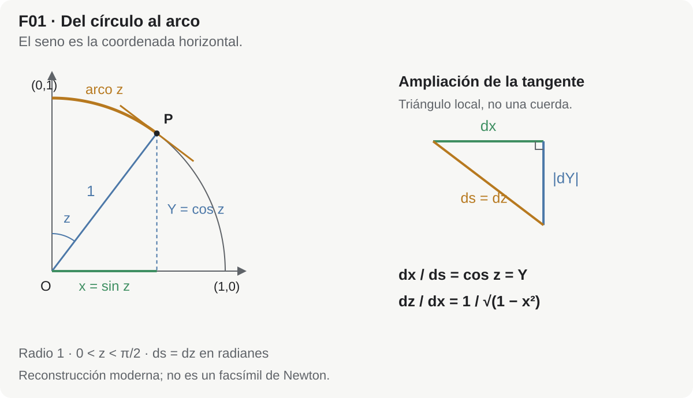
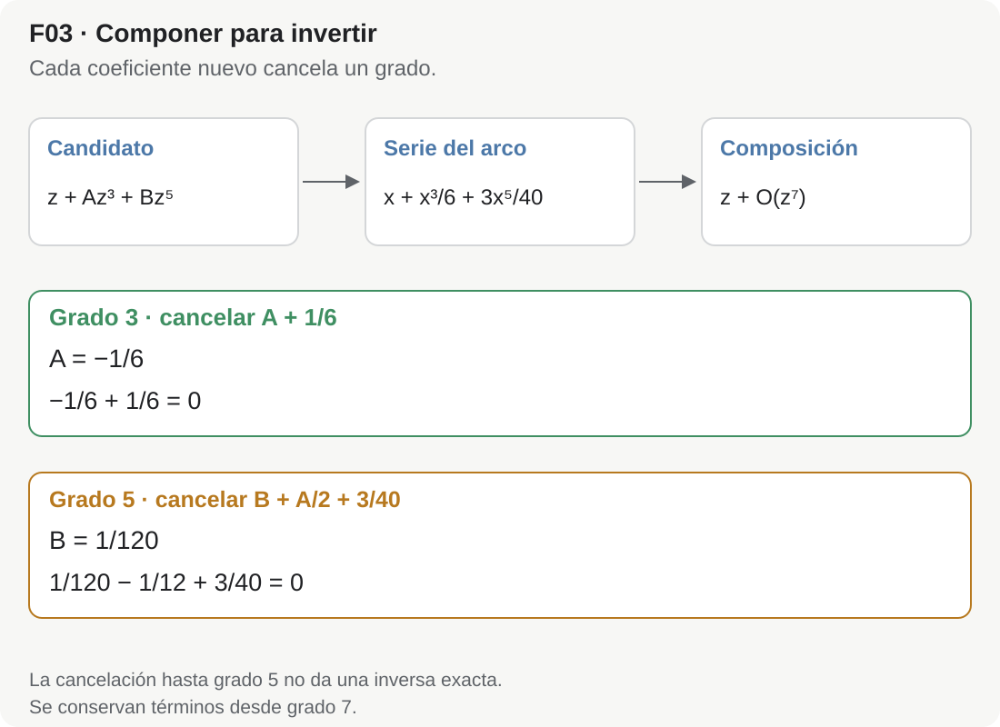
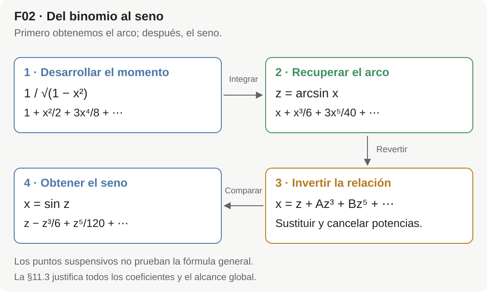

## Del círculo y los momentos de arco a la reversión de series

Hoy es habitual presentar la serie

$$
\sin z
=
z-\frac{z^3}{3!}+\frac{z^5}{5!}-\frac{z^7}{7!}+\cdots
$$

como una consecuencia casi automática de la fórmula de Taylor. Se calculan las derivadas sucesivas de $\sin z$, se observa el ciclo

$$
\sin z,
\quad
\cos z,
\quad
-\sin z,
\quad
-\cos z,
\quad\ldots,
$$

y los factoriales aparecen inmediatamente.

Ese camino es correcto, pero **no es el camino por el que Newton obtuvo la serie**.

En *De Analysi per aequationes numero terminorum infinitas*, manuscrito cuya portada registra el envío de Isaac Barrow a John Collins en una carta fechada el 31 de julio de 1669, Newton llega al seno por una ruta muy distinta. Parte de la geometría del círculo, traduce el incremento de un arco a una expresión algebraica, desarrolla esa expresión mediante su binomio generalizado, obtiene primero una serie para el **arco en función del seno** y, finalmente, invierte esa serie para obtener el **seno en función del arco**.[^newton-de-analysi]

La cadena siguiente resume nuestra reconstrucción del procedimiento documentado; no reproduce literalmente la disposición ni la notación del manuscrito. La fecha de 1669 identifica este testimonio, sin fijar por sí sola el día ni el año exacto del descubrimiento.

$$
\boxed{
\text{círculo}
\longrightarrow
\text{momento del arco}
\longrightarrow
\text{binomio generalizado}
\longrightarrow
\text{serie del arco}
\longrightarrow
\text{reversión de la serie}
\longrightarrow
\text{serie del seno}
}
$$

El recorrido muestra cómo una relación geométrica puede convertirse en un cálculo algebraico con series. La dificultad nueva será invertir ese cálculo: conocemos el arco a partir del seno y queremos recuperar el seno a partir del arco.

::: {.callout-important title="Idea central"}
El binomio generalizado **no entrega directamente** la serie de $\sin z$. Lo que produce de manera natural es la serie de $\arcsin x$. El paso específicamente newtoniano que completa el proceso es la **reversión de series**: si el arco $z$ está expresado como serie del seno $x$, se resuelve formalmente esa ecuación para expresar $x$ como serie de $z$.
:::

::: {.callout-note title="Cómo leer el artículo"}
Para seguir la derivación basta conocer el círculo trigonométrico, el binomio y las operaciones con polinomios; usaremos también la regla de integración de potencias. Las §§3–7 contienen el argumento principal. En §7 calcularemos despacio los dos primeros coeficientes y después retiraremos parte del acompañamiento. La §11.3 ofrece un complemento de rigor moderno que requiere series de potencias y ecuaciones diferenciales; puede reservarse para una segunda lectura. La §12 organiza lo aprendido y la §18 permite comprobarlo.
:::

---

## 1. El problema visto con ojos del siglo XVII

Para entender el argumento conviene suspender por un momento la notación moderna.

Newton no comienza preguntando por las derivadas de la función seno. Su problema pertenece a una familia mucho más amplia: **¿cómo medir curvas, áreas y longitudes cuando las ecuaciones que las describen pueden desarrollarse en series infinitas?**

En *De Analysi* establece reglas para trabajar con potencias, series y lo que llama *momentos*. En lenguaje moderno, una de sus reglas permite sumar término a término expresiones de la forma

$$
x^m,
$$

produciendo lo que hoy reconoceríamos como una integración de potencias. Pero el lenguaje histórico no es el de nuestra integral de Riemann ni el de una teoría de límites ya formalizada. Newton trabaja con momentos y proporciones entre magnitudes infinitamente pequeñas; el texto no ofrece una definición formal general de esos objetos.[^newton-de-analysi][^blaszczzyk]

La novedad metodológica puede resumirse así:

1. convertir un problema geométrico en una expresión algebraica;
2. desarrollar esa expresión como serie infinita;
3. operar con la serie término a término;
4. recuperar de ella la magnitud geométrica buscada;
5. si es necesario, **resolver la serie al revés**.

El círculo es un laboratorio perfecto para este programa.

---

## 2. Dos lenguajes: Newton y nuestra traducción moderna

Usaremos dos variables:

- $x$ será el seno de un arco;
- $z$ será la longitud del arco en un círculo de radio $1$.

Trabajaremos primero con $0\le z<\pi/2$ y $0\le x<1$; para la inversión alrededor del origen extendemos a $-\pi/2<z<\pi/2$ y $-1<x<1$. En todo el artículo $\arcsin$ designa la rama principal real, con valores en $[-\pi/2,\pi/2]$. La igualdad $z=\arcsin(\sin z)$ se usa sólo en ese intervalo, no para un arco arbitrario.

En nuestra notación,

$$
x=\sin z,
\qquad
z=\arcsin x.
$$

Como el radio es $1$, la longitud del arco coincide numéricamente con la medida angular en radianes. Ésta es precisamente la normalización en la que la serie moderna del seno adopta su forma habitual.

Newton no escribe $\arcsin$ como nosotros ni formula el argumento mediante la identidad

$$
\frac{d}{dx}\arcsin x=\frac1{\sqrt{1-x^2}}.
$$

Su proporción geométrica conduce a esa expresión. En la configuración de radio unidad, el manuscrito registra directamente la serie del arco; el cálculo intermedio con $(1-x^2)^{-1/2}$ se hace explícito aquí como reconstrucción moderna.

::: {.callout-note title="Regla de lectura histórica"}
En las secciones siguientes escribiremos derivadas e integrales para hacer transparente la estructura matemática. Cada vez que lo hagamos, debe entenderse como una **traducción moderna** de un procedimiento que Newton formuló mediante momentos, indivisibles y reglas algebraicas para series. No debemos atribuirle retrospectivamente una teoría de límites o un teorema fundamental del cálculo en la forma del siglo XIX.
:::

---

## 3. Del círculo al momento del arco

Consideremos el círculo unidad

$$
X^2+Y^2=1.
$$

Tomemos un punto del primer cuadrante cuya coordenada horizontal sea

$$
x=\sin z.
$$

Aquí el arco se mide desde el punto $(0,1)$ hacia $(1,0)$, de modo que el punto es $(\sin z,\cos z)$; esta elección explica que la coordenada horizontal sea el seno. Su otra coordenada vale

$$
\sqrt{1-x^2}=\cos z.
$$

Si el seno cambia una cantidad muy pequeña $dx$, el arco cambia una cantidad correspondiente $dz$. Para justificar modernamente la relación sin confundir incrementos finitos con diferenciales, escribimos $Y=\sqrt{1-x^2}$. Entonces $Y\prime=-x/\sqrt{1-x^2}$ y el elemento de longitud es $dz=\sqrt{1+(Y\prime)^2}\,dx$ para el recorrido creciente. La geometría local del círculo —que Newton expresa mediante segmentos y triángulos semejantes— da así la proporción

$$
\frac{dz}{dx}
=
\frac1{\sqrt{1-x^2}}.
$$

En notación moderna, esto equivale a escribir

$$
dz
=
\frac{dx}{\sqrt{1-x^2}}.
$$

<picture class="ma-newton-figure">
  <source media="(max-width: 600px)" srcset="../assets/articles/ma-art-0015/MA-ART-0015-F01_circulo-momento-mobile.svg">
  
</picture>

*Figura MA-ART-0015-F01. ¿Por qué el arco cambia más deprisa que su proyección horizontal? En el círculo unidad, el radio y la tangente son perpendiculares. Los triángulos correspondientes son semejantes, de modo que $dx/ds=\cos z=\sqrt{1-x^2}$. Como el radio es uno, $ds=dz$ y obtenemos la razón del texto. La ampliación representa diferenciales sobre la tangente: no afirma una igualdad exacta entre un arco finito y una cuerda. Es una reconstrucción moderna, no una reproducción del diagrama de Newton.*

La expresión decisiva es, por tanto,

$$
\boxed{
(1-x^2)^{-1/2}
}.
$$

Ahí entra el binomio generalizado.

### 3.1. La forma que aparece en el manuscrito

En el folio 6v Newton toma diámetro $AE=1$ y radio $AC=1/2$. Construye la tangente $DHT$ y un rectángulo infinitamente pequeño $HGBK$. Compara el momento de la base $BK$ con el momento del arco $DH$ y normaliza el primero como unidad. Esa unidad infinitesimal no es el diámetro geométrico, aunque ambos se representen por $1$.

Aquí «momento» no significa tiempo ni designa sin más un diferencial moderno. Newton compara magnitudes generadoras de incrementos: al tratar sólidos la unidad es una superficie; al tratar superficies, una línea; al tratar líneas, un punto o una línea infinitamente pequeña. Invoca expresamente los métodos de indivisibles, sin formular una teoría moderna de infinitesimales.[^newton-de-analysi]

En una etapa anterior del mismo desarrollo Newton trabaja con una configuración de círculo en la que aparece la expresión

$$
\frac{1}{2\sqrt{x-x^2}}.
$$

En esta configuración $x$ es una coordenada distinta del seno usado en la normalización posterior. La expresión es real para $0<x<1$, y el desarrollo siguiente vale en ese intervalo. Al desarrollarla obtiene una serie en potencias semienteras,

$$
\frac12x^{-1/2}
+
\frac14x^{1/2}
+
\frac3{16}x^{3/2}
+
\frac5{32}x^{5/2}
+
\frac{35}{256}x^{7/2}
+
\cdots,
$$

y de ella reconstruye la longitud del arco correspondiente. Inmediatamente después, en el folio 7r, pone $CB=x$ y radio $CA=1$, y registra $x+x^3/6+3x^5/40+5x^7/112+\cdots$ para el arco $LD$. El término $35x^9/1152$ que usamos es la continuación matemática del desarrollo; en ese pasaje de radio unidad Newton no lo escribe explícitamente, aunque sí escribe el coeficiente correspondiente en la serie semientera anterior.[^newton-de-analysi]

La versión con $(1-x^2)^{-1/2}$ que utilizaremos no sustituye ese argumento: **expone su estructura en las coordenadas trigonométricas que nos resultan familiares**.

---

## 4. El binomio generalizado como motor

El binomio finito conocido para un entero no negativo $n$ es

$$
(1+u)^n
=
\sum_{k=0}^{n}
\binom{n}{k}u^k.
$$

Presentamos en notación moderna el binomio generalizado de Newton, que permite tratar exponentes fraccionarios y negativos mediante una serie infinita. En *De Analysi*, la Regla III y sus ejemplos describen operaciones de división, extracción de raíces y resolución de ecuaciones; la fórmula general siguiente es nuestra herramienta expositiva, no una transcripción de ese pasaje:

$$
(1+u)^\alpha
=
1
+\alpha u
+\frac{\alpha(\alpha-1)}{2!}u^2
+\frac{\alpha(\alpha-1)(\alpha-2)}{3!}u^3
+\cdots.
$$

En nuestro problema necesitamos

$$
\alpha=-\frac12,
\qquad
u=-x^2.
$$

Por tanto,

$$
(1-x^2)^{-1/2}
=
1
+\left(-\frac12\right)(-x^2)
+\frac{\left(-\frac12\right)\left(-\frac32\right)}{2!}(-x^2)^2
+\cdots.
$$

Calculemos los primeros términos sin saltarnos el mecanismo.

### Primer término no constante

$$
\left(-\frac12\right)(-x^2)
=
\frac12x^2.
$$

### Segundo

$$
\frac{\left(-\frac12\right)\left(-\frac32\right)}{2!}x^4
=
\frac{3}{8}x^4.
$$

### Tercero

Ahora el coeficiente binomial contiene tres factores negativos,

$$
\frac{\left(-\frac12\right)
\left(-\frac32\right)
\left(-\frac52\right)}{3!},
$$

pero $(-x^2)^3=-x^6$, de modo que los signos vuelven a producir un término positivo:

$$
\frac5{16}x^6.
$$

Así,

$$
\boxed{
\frac1{\sqrt{1-x^2}}
=
1
+\frac12x^2
+\frac38x^4
+\frac5{16}x^6
+\frac{35}{128}x^8
+\cdots
}
$$

En notación combinatoria moderna, el patrón completo es

$$
\boxed{
\frac1{\sqrt{1-x^2}}
=
\sum_{n=0}^{\infty}
\frac{\binom{2n}{n}}{4^n}x^{2n}
}
\qquad (|x|<1).
$$

La condición $|x|<1$ pertenece a nuestra teoría moderna de convergencia. Newton opera algebraicamente con series y también señala cuándo sus primeros términos sirven como aproximaciones: en los ejemplos de división distingue valores pequeños y grandes de la variable. Esto no constituye una teoría moderna de convergencia, pero impide describir su cálculo como indiferente a la aproximación.

::: {.callout-tip title="¿Por qué aparecen sólo potencias pares?"}
Porque la variable que entra en el binomio es $u=-x^2$. Cada término contiene una potencia $(x^2)^n=x^{2n}$. Esta paridad tendrá una consecuencia inmediata: al reconstruir el arco aparecerán únicamente potencias impares de $x$.
:::

---

## 5. De los momentos a la serie del arco

La traducción moderna del siguiente paso es integrar término a término:

$$
z
=
\int_0^x\frac{dt}{\sqrt{1-t^2}}.
$$

Sustituyendo el desarrollo binomial,

$$
z
=
\int_0^x
\left(
1
+\frac12t^2
+\frac38t^4
+\frac5{16}t^6
+\frac{35}{128}t^8
+\cdots
\right)dt.
$$

Para cada $0<r<1$, la serie binomial converge uniformemente en $[-r,r]$; por eso puede integrarse término a término en cualquier segmento entre $0$ y $x$ contenido allí. Fijamos la constante mediante $z(0)=0$.

Ahora cada término se trata con la regla de las potencias:

$$
\int_0^x t^m\,dt
=
\frac{x^{m+1}}{m+1},\qquad m=0,1,2,\ldots.
$$

Por tanto,

$$
\boxed{
z
=
x
+\frac{x^3}{6}
+\frac{3x^5}{40}
+\frac{5x^7}{112}
+\frac{35x^9}{1152}
+\cdots
}
$$

Como $z$ es el arco cuyo seno es $x$, esto es

$$
\boxed{
\arcsin x
=
x
+\frac{x^3}{6}
+\frac{3x^5}{40}
+\frac{5x^7}{112}
+\frac{35x^9}{1152}
+\cdots
}
$$

Ésta es la serie que el binomio produce de manera natural.

El término general puede escribirse como

$$
\boxed{
\arcsin x
=
\sum_{n=0}^{\infty}
\frac{\binom{2n}{n}}{4^n(2n+1)}x^{2n+1}
}
$$

para $|x|<1$.

Equivalentemente,

$$
\arcsin x
=
\sum_{n=0}^{\infty}
\frac{(2n)!}{4^n(n!)^2(2n+1)}x^{2n+1}.
$$

### 5.1. Qué hizo Newton aquí

En el lenguaje de *De Analysi*, Newton no escribe una integral definida desde $0$ hasta $x$. Parte del **momento del arco**, lo desarrolla en una serie y aplica sus reglas para pasar de esos momentos a la magnitud completa. La operación corresponde, desde nuestro punto de vista, a una integración término a término. Sus Reglas I–II se enuncian primero para áreas: «cuadratura» significa determinar un área; Newton extiende después esas reglas a otras magnitudes a partir de sus momentos. No debemos llamar cuadratura del círculo al cálculo de la longitud del arco.[^newton-de-analysi][^blaszczzyk]

La diferencia histórica importa porque el orden conceptual es

$$
\text{geometría}
\to
\text{momento}
\to
\text{serie}
\to
\text{magnitud},
$$

no

$$
\text{función ya definida}
\to
\text{derivadas sucesivas}
\to
\text{Taylor}.
$$

---

## 6. El paso decisivo: dar vuelta la serie

Ahora llegamos al movimiento que transforma la serie del arco en la serie del seno.

Tenemos

$$
z
=
x
+\frac{x^3}{6}
+\frac{3x^5}{40}
+\frac{5x^7}{112}
+\frac{35x^9}{1152}
+\cdots.
$$

Pero queremos lo contrario: dado el arco $z$, encontrar su seno $x$.

En símbolos,

$$
z=\arcsin x
\qquad\Longrightarrow\qquad
x=\sin z.
$$

Newton trata esta tarea como un problema de **resolución de una ecuación infinita**. En términos actuales hablamos de **reversión de una serie de potencias**.

En los folios 7r–7v Newton desarrolla la extracción con sustituciones sucesivas para la relación procedente de una hipérbola, hoy vinculada al logaritmo. A continuación aplica el método al seno y registra el resultado, sin desplegar allí todas sus cuentas. Los coeficientes $A,B,C,D$, la comparación sistemática de potencias y la notación $O(z^n)$ de §§6–7 son nuestra reconstrucción del mecanismo, no una transcripción de un cálculo trigonométrico escrito línea por línea por Newton.

Supongamos que la serie inversa tiene la forma

$$
x
=
z
+A z^3
+B z^5
+C z^7
+D z^9
+\cdots.
$$

No estamos adivinando los coeficientes finales. Sólo usamos dos hechos estructurales:

1. cerca de $0$, seno y arco coinciden en primer orden, de modo que el término inicial es $z$;
2. la relación del arco es impar y su inversa local también lo es: si $f(-x)=-f(x)$ y $f(x)=z$, entonces $f(-x)=-z$. Por unicidad de la inversa, el valor correspondiente a $-z$ es $-x$. Así justificamos que sólo haya potencias impares sin usar de antemano la serie del seno.

Sustituiremos esta serie desconocida en la expresión de $z$ y obligaremos a que todos los términos posteriores al término lineal se cancelen.

---

## 7. Reversión explícita: coeficiente por coeficiente

Escribamos abreviadamente

$$
a=\frac16,
\qquad
b=\frac3{40},
\qquad
c=\frac5{112},
\qquad
d=\frac{35}{1152}.
$$

Entonces

$$
z=x+a x^3+b x^5+c x^7+d x^9+\cdots.
$$

Y proponemos

$$
x=z+A z^3+B z^5+C z^7+D z^9+\cdots.
$$

Antes de empezar, fijemos la notación de los términos que dejamos fuera. Escribir $R(z)=O(z^m)$ cuando $z\to0$ significa que existen constantes $K>0$ y $\delta>0$ tales que $|R(z)|\le K|z|^m$ para $|z|<\delta$. Aquí las funciones son analíticas cerca de $0$: al escribir, por ejemplo, $O(z^5)$ conservamos todos los términos de grado menor que cinco y agrupamos los restantes.

Cada coeficiente se determina imponiendo una identidad, no buscando una buena aproximación en un único punto. Después de sustituir, el miembro derecho debe tener coeficiente $1$ en $z$ y coeficiente $0$ en las demás potencias.

### 7.1. Hasta orden $z^3$

Para calcular el coeficiente cúbico basta observar que

$$
x^3=z^3+O(z^5).
$$

Entonces

$$
z
=
z+(A+a)z^3+O(z^5).
$$

El miembro izquierdo no tiene término cúbico, así que

$$
A+a=0.
$$

Por tanto,

$$
\boxed{A=-\frac16}.
$$

Ya tenemos

$$
x=z-\frac{z^3}{6}+O(z^5).
$$

### 7.2. Hasta orden $z^5$

Para formar un término de grado cinco en $x^3$, escogemos $Az^3$ de uno de los tres factores y $z$ de los otros dos. Hay tres elecciones; por eso aparece $3A$, no $A$ ni $A^3$. Necesitamos, por tanto,

$$
x^3
=
z^3+3Az^5+O(z^7),
$$

y

$$
x^5=z^5+O(z^7).
$$

Sustituyendo,

$$
z
=
z
+(A+a)z^3
+\left(B+3aA+b\right)z^5
+O(z^7).
$$

El término cúbico ya se anuló. Por tanto,

$$
B+3aA+b=0.
$$

Con

$$
a=\frac16,
\qquad
A=-\frac16,
\qquad
b=\frac3{40},
$$

obtenemos

$$
B
-
\frac1{12}
+
\frac3{40}
=0.
$$

Como

$$
-\frac1{12}+\frac3{40}
=-\frac1{120},
$$

resulta

$$
\boxed{B=\frac1{120}}.
$$

Así,

$$
x
=
z
-\frac{z^3}{6}
+\frac{z^5}{120}
+O(z^7).
$$

Los primeros factoriales ya comienzan a hacerse visibles:

$$
6=3!,
\qquad
120=5!.
$$

### 7.3. Hasta orden $z^7$

Ahora debemos conservar más términos:

$$
x^3
=
z^3+3Az^5+(3B+3A^2)z^7+O(z^9),
$$

$$
x^5
=
z^5+5Az^7+O(z^9),
$$

$$
x^7=z^7+O(z^9).
$$

El coeficiente de $z^7$ en la composición es

$$
C
+a(3B+3A^2)
+5bA
+c.
$$

Por tanto,

$$
C
+\frac16\left(3\frac1{120}+3\frac1{36}\right)
+5\frac3{40}\left(-\frac16\right)
+\frac5{112}
=0.
$$

Las tres contribuciones ya conocidas son $13/720$, $-1/16$ y $5/112$. Con denominador común,

$$
\frac{13}{720}-\frac1{16}+\frac5{112}
=\frac{91-315+225}{5040}
=\frac1{5040}.
$$

El coeficiente $C$ debe cancelar esa suma, así que

$$
C=-\frac1{5040}.
$$

Luego

$$
\boxed{
C=-\frac1{7!}
}.
$$

Tenemos ya

$$
x
=
z
-\frac{z^3}{3!}
+\frac{z^5}{5!}
-\frac{z^7}{7!}
+O(z^9).
$$

### 7.4. Hasta orden $z^9$

Para comprobar un orden adicional del patrón observado, conservemos un término más. Este cálculo verifica el grado nueve; la fórmula para todos los órdenes requiere la justificación moderna de §11.3. Se necesitan las expansiones

$$
x^3
=
z^3
+3Az^5
+(3B+3A^2)z^7
+(3C+6AB+A^3)z^9
+O(z^{11}),
$$

$$
x^5
=
z^5
+5Az^7
+(5B+10A^2)z^9
+O(z^{11}),
$$

$$
x^7
=
z^7+7Az^9+O(z^{11}),
$$

$$
x^9=z^9+O(z^{11}).
$$

Por consiguiente, el coeficiente de $z^9$ es

$$
D
+a(3C+6AB+A^3)
+b(5B+10A^2)
+7cA
+d.
$$

Al sustituir

$$
A=-\frac16,
\qquad
B=\frac1{120},
\qquad
C=-\frac1{5040},
$$

junto con los valores de $a,b,c,d$, las contribuciones conocidas suman

$$
-\frac{41}{18144}+\frac{23}{960}-\frac5{96}+\frac{35}{1152}
=-\frac1{362880}.
$$

Por eso $D$ debe ser el opuesto de esa suma:

$$
\boxed{
D=\frac1{362880}=\frac1{9!}
}.
$$

Así obtenemos

$$
\boxed{
\sin z
=
z
-\frac{z^3}{3!}
+\frac{z^5}{5!}
-\frac{z^7}{7!}
+\frac{z^9}{9!}
-\cdots
}
$$

Ésta no es una reconstrucción puramente hipotética: en *De Analysi*, después de escribir la serie que expresa el arco en función del seno, Newton indica el problema inverso —hallar el seno a partir del arco dado— y registra precisamente

$$
x
=
z
-\frac16z^3
+\frac1{120}z^5
-\frac1{5040}z^7
+\frac1{362880}z^9
+\cdots.
$$

Es decir, **la serie del seno aparece explícitamente en el manuscrito de 1669**.[^newton-de-analysi]

---

## 8. ¿De dónde salen los factoriales?

<picture class="ma-newton-figure">
  <source media="(max-width: 600px)" srcset="../assets/articles/ma-art-0015/MA-ART-0015-F03_composicion-cancelaciones-mobile.svg">
  
</picture>

*Figura MA-ART-0015-F03. ¿Cómo sabemos qué valores elegir para $A$ y $B$? En la composición, el grado tres obliga a $A+1/6=0$; una vez fijado $A=-1/6$, el grado cinco obliga a $B+A/2+3/40=0$. Por eso $B=1/120$. La salida $z+O(z^7)$ corresponde a esos valores y a las expresiones truncadas que muestra la figura: no es una identidad exacta entre polinomios.*

La forma final

$$
\sin z
=
\sum_{n=0}^{\infty}
(-1)^n\frac{z^{2n+1}}{(2n+1)!}
$$

hace que los factoriales parezcan inevitables. Pero desde el punto de vista del camino de Newton no estaban presentes al comienzo en esa forma.

La serie del arco contiene coeficientes como

$$
\frac16,
\qquad
\frac3{40},
\qquad
\frac5{112},
\qquad
\frac{35}{1152},
$$

que proceden de dos operaciones sucesivas:

1. coeficientes centrales del desarrollo binomial de $(1-x^2)^{-1/2}$;
2. división adicional por $2n+1$ al reconstruir el arco.

Los recíprocos factoriales emergen después, al **invertir la relación completa**.

En el folio 7v Newton propone prolongar estas series por analogía una vez conocidos cinco o seis términos. Escribe los productos de enteros consecutivos que permiten continuar seno y coseno, así como una regla multiplicativa para el arco. Es una pauta explícita de continuación, no una demostración moderna de convergencia ni la recurrencia diferencial de §11.3. En nuestra notación,

$$
\frac{1}{3!}
\longrightarrow
\frac{1}{5!}
\longrightarrow
\frac{1}{7!}
\longrightarrow
\frac{1}{9!}
$$

puede generarse sucesivamente mediante

$$
\frac1{3!}
\cdot\frac1{4\cdot5}
=
\frac1{5!},
$$

$$
\frac1{5!}
\cdot\frac1{6\cdot7}
=
\frac1{7!},
$$

etcétera, con signos alternantes.

::: {.callout-tip title="Dos explicaciones diferentes"}
Hoy podemos explicar los factoriales de la serie del seno usando la recurrencia de sus derivadas o la ecuación diferencial $y''=-y$. Esa explicación es más corta, pero es **una justificación moderna distinta** del argumento que estamos reconstruyendo. En Newton los factoriales aparecen como estructura descubierta dentro de la reversión de una serie nacida del círculo y del binomio.
:::

---

## 9. El coseno llega inmediatamente después

Una vez conocido

$$
x=\sin z,
$$

el círculo unidad da, para $|z|<\pi/2$,

$$
\cos z
=
\sqrt{1-x^2}.
$$

Fuera de ese intervalo la raíz real positiva representa $|\cos z|$, por lo que no puede identificarse globalmente con $\cos z$.

Como comprobación moderna de los coeficientes, con $u=x^2$ usamos

$$
\sqrt{1-u}=1-\frac{u}{2}-\frac{u^2}{8}-\frac{u^3}{16}-\frac{5u^4}{128}+O(u^5),
$$

junto con

$$
x^2=z^2-\frac{z^4}{3}+\frac{2z^6}{45}-\frac{z^8}{315}+O(z^{10}).
$$

La sustitución produce $1-z^2/2+z^4/24-z^6/720+z^8/40320+O(z^{10})$.

Newton escribe explícitamente la relación del coseno con $\sqrt{1-x^2}$ y su serie hasta el término $-z^{10}/3628800$ en el folio 7v. Nuestro desarrollo de la sustitución anterior verifica sus coeficientes; no reproduce cuentas que él exponga allí:

$$
\boxed{
\cos z
=
1
-\frac{z^2}{2!}
+\frac{z^4}{4!}
-\frac{z^6}{6!}
+\frac{z^8}{8!}
-\cdots
}
$$

En el manuscrito, seno y coseno aparecen así como resultados estrechamente conectados: la serie del seno se obtiene revirtiendo la serie del arco, y la del coseno se recupera a partir de la geometría del círculo.[^newton-de-analysi]

Esta secuencia histórica es muy distinta de la presentación moderna en la que seno y coseno suelen aparecer simultáneamente a través de derivadas, exponenciales complejas o ecuaciones diferenciales.

---

## 10. Una comprobación numérica

Tomemos

$$
z=0.5.
$$

Los primeros términos dan

$$
\sin(0.5)
\approx
0.5
-\frac{0.5^3}{6}
+\frac{0.5^5}{120}
-\frac{0.5^7}{5040}.
$$

Calculando,

$$
0.5
-0.020833333\ldots
+0.000260416\ldots
-0.000001550\ldots
$$

produce aproximadamente

$$
\boxed{0.47942553},
$$

mientras que $\sin(0.5)\approx0.479425538604203$. El polinomio calculado vale $0.479425533234127$; por el resto de una serie alternante con términos decrecientes, el error es positivo y menor que $0.5^9/9!\approx5.3823\times10^{-9}$.

El ejemplo permite ver por qué las series infinitas interesaban tanto a Newton: una función definida geométricamente puede convertirse en una sucesión de operaciones aritméticas.

---

## 11. Qué estamos modernizando y qué no

La reconstrucción puede inducir tres anacronismos si no separamos cuidadosamente los niveles.

### 11.1. No es una aplicación del teorema de Taylor

Brook Taylor publicó *Methodus incrementorum directa et inversa* en 1715, décadas después de este testimonio. Esa formulación histórica tampoco debe identificarse sin más con el teorema moderno de Taylor con resto. *De Analysi* ya documenta la serie del seno en 1669.[^taylor]

Por tanto, escribir hoy

$$
\sin z
=
\sum_{n=0}^{\infty}
\frac{\sin^{(n)}(0)}{n!}z^n
$$

es una **demostración moderna alternativa**, no una descripción histórica de cómo Newton obtuvo el resultado.

### 11.2. La integral es una traducción

Cuando escribimos

$$
\arcsin x
=
\int_0^x\frac{dt}{\sqrt{1-t^2}},
$$

hacemos visible con notación posterior lo que Newton organiza mediante momentos del arco y reglas para sumar series. La igualdad es matemáticamente correcta, pero no debe borrar el lenguaje operativo del manuscrito.

### 11.3. La convergencia necesita una teoría posterior

Hay tres preguntas distintas: dónde converge la serie del arco, por qué admite una inversa cerca de cero y por qué la serie final representa el seno para cualquier argumento. Resolver una de ellas no resuelve automáticamente las otras.

**Primero, el dominio de la serie del arco.** El desarrollo

$$
(1-x^2)^{-1/2}
=
\sum_{n=0}^{\infty}
\frac{\binom{2n}{n}}{4^n}x^{2n}
$$

converge para $|x|<1$. Dentro de ese intervalo podemos justificar rigurosamente la integración término a término con herramientas modernas de series de potencias.

La serie integrada tiene radio de convergencia $1$ y converge también absolutamente en $x=\pm1$: sus coeficientes son asintóticos a $1/(2\sqrt{\pi}\,n^{3/2})$. Por continuidad de la suma en $[-1,1]$, sus valores allí son $\pm\pi/2$. La serie binomial del integrando, en cambio, diverge en ambos extremos; las integrales hasta esos puntos son impropias y convergentes.

**Segundo, la inversión local.** La función $\arcsin x$ es analítica alrededor de $0$ y posee derivada $1$ en el origen, por lo que tiene una inversa analítica local. Esa inversa es $\sin z$, y la reversión formal coincide con su serie de potencias. Finalmente, la serie

$$
\sum_{n=0}^{\infty}(-1)^n\frac{z^{2n+1}}{(2n+1)!}
$$

converge para todo $z\in\mathbb R$ —e incluso para todo $z\in\mathbb C$—.

**Tercero, la fórmula general y su alcance global.** La convergencia de esta última serie no basta, por sí sola, para identificar su suma con el seno. Tampoco bastan los cinco coeficientes calculados. Cerramos ambos puntos con una justificación moderna, sin atribuírsela a Newton: si $x=g(z)$ es la inversa analítica local del arco, al derivar la identidad $\arcsin(g(z))=z$ obtenemos

$$
g\prime(z)=\sqrt{1-g(z)^2},\qquad g(0)=0,\qquad g\prime(0)=1.
$$

Derivamos la primera igualdad para obtener $g\prime\prime=-g\,g\prime/\sqrt{1-g^2}$. Al sustituir $g\prime=\sqrt{1-g^2}$, y puesto que esa raíz es positiva cerca de cero, queda $g\prime\prime=-g$. Si $g(z)=\sum_{k\ge0}c_kz^k$, comparar coeficientes da

$$
(k+2)(k+1)c_{k+2}=-c_k,\qquad c_0=0,\quad c_1=1.
$$

La recurrencia avanza de dos en dos: $c_0=0$ obliga a anular todos los coeficientes pares; a partir de $c_1=1$ obtenemos $c_3=-1/(2\cdot3)$, $c_5=1/(2\cdot3\cdot4\cdot5)$ y así sucesivamente. Por inducción, $c_{2n}=0$ y $c_{2n+1}=(-1)^n/(2n+1)!$. El criterio del cociente da radio infinito. Su suma y el seno geométrico satisfacen $y\prime\prime=-y$ con los mismos datos iniciales; la unicidad del problema inicial identifica ambas funciones para todo $z\in\mathbb R$. En el plano complejo, la identidad entre sus extensiones enteras sigue del principio de identidad. Así la fórmula global queda demostrada sin usar Taylor como explicación histórica.

Estas justificaciones pertenecen a la teoría moderna. Newton tenía el cálculo correcto mucho antes de que esa infraestructura analítica estuviera disponible en nuestra forma actual.

---

## 12. La misma derivación, condensada en seis movimientos

Una vez recorridos todos los pasos, podemos comprimir el argumento sin ocultar su lógica.

<picture class="ma-newton-figure">
  <source media="(max-width: 600px)" srcset="../assets/articles/ma-art-0015/MA-ART-0015-F02_binomio-arco-seno-mobile.svg">
  
</picture>

*Figura MA-ART-0015-F02. ¿En qué momento pasamos del arco al seno? El desarrollo binomial y la integración producen $z$ en función de $x$. Sólo la reversión cambia la dirección de la relación. Las expresiones mostradas son comienzos de series; el patrón completo y su alcance global se justifican en §11.3.*

### Movimiento 1. El círculo

Si $x$ es el seno del arco $z$ en el círculo unidad,

$$
z=\arcsin x.
$$

La razón de momentos correspondiente se traduce modernamente como

$$
\frac{dz}{dx}
=
\frac1{\sqrt{1-x^2}}.
$$

### Movimiento 2. El binomio

$$
(1-x^2)^{-1/2}
=
1+\frac12x^2+\frac38x^4+\frac5{16}x^6+\cdots.
$$

### Movimiento 3. Reconstruir el arco

$$
\arcsin x
=
x+\frac{x^3}{6}+\frac{3x^5}{40}+\frac{5x^7}{112}+\cdots.
$$

### Movimiento 4. Plantear la serie inversa

$$
x=z+Az^3+Bz^5+Cz^7+\cdots.
$$

### Movimiento 5. Componer y comparar coeficientes

La identidad

$$
z
=
x+\frac{x^3}{6}+\frac{3x^5}{40}+\cdots
$$

obliga a

$$
A=-\frac16,
\qquad
B=\frac1{120},
\qquad
C=-\frac1{5040},
\quad\ldots
$$

### Movimiento 6. Reconocer el seno

$$
\boxed{
\sin z
=
z-\frac{z^3}{3!}+\frac{z^5}{5!}-\frac{z^7}{7!}+\cdots
}
$$

Éste es el esqueleto matemático de la derivación.

---

## 13. Por qué el binomio de Newton fue mucho más que un binomio

En cursos elementales, el nombre «binomio de Newton» puede sugerir una fórmula para expandir algo como

$$
(a+b)^n.
$$

Pero el episodio que acabamos de reconstruir muestra una función histórica mucho más profunda.

Al permitir exponentes negativos y fraccionarios, el binomio transforma expresiones algebraicas en **series infinitas manipulables**. Por ejemplo,

$$
\frac1{\sqrt{1-x^2}}
$$

deja de ser un objeto rígido y se convierte en

$$
1+\frac12x^2+\frac38x^4+\cdots.
$$

A partir de ahí se puede:

- sumar término a término;
- integrar o, en el lenguaje newtoniano, reconstruir magnitudes a partir de momentos;
- multiplicar series;
- extraer raíces;
- resolver ecuaciones;
- invertir relaciones funcionales.

La serie del seno no es, entonces, un resultado aislado. Es una demostración espectacular de una nueva concepción del análisis:

$$
\boxed{
\text{funciones y curvas pueden someterse al álgebra de las series.}
}
$$

Esta idea será uno de los grandes motores de la matemática de los siglos XVII y XVIII.

---

## 14. La reversión de series como método general

El paso

$$
z=f(x)
\quad\longrightarrow\quad
x=f^{-1}(z)
$$

merece atención propia porque reaparece en muchas áreas.

Supongamos en general que

$$
y=x+a_2x^2+a_3x^3+\cdots,
$$

con término lineal $x$. Buscamos

$$
x=y+b_2y^2+b_3y^3+\cdots.
$$

La estrategia es siempre la misma:

1. proponer la forma de la serie inversa;
2. sustituirla en la serie original;
3. expandir las potencias necesarias;
4. comparar coeficientes de $y^n$;
5. resolver sucesivamente $b_2,b_3,b_4,\ldots$.

Como afirmación formal sobre series con coeficientes reales, el término constante debe ser cero y el coeficiente lineal debe ser distinto de cero. Estas condiciones aseguran una única inversa formal por composición, sin afirmar todavía convergencia. Si la serie original converge cerca del origen, el teorema de inversión analítica garantiza además una inversa analítica local, cuya serie coincide con la inversa formal. En la normalización anterior el coeficiente lineal es $1$.

El mecanismo es el que acabamos de usar: el coeficiente nuevo $b_n$ aparece una sola vez, procedente del término lineal $x$. En los términos $x^2,x^3,\ldots$, incluir $b_ny^n$ produce un grado mayor que $n$. Por eso la ecuación de grado $n$ contiene sólo $b_n$ y cantidades ya conocidas; podemos resolverla y pasar al grado siguiente.

La condición sobre el término lineal tiene una función concreta. Si $y=x^2$, ya no podemos empezar con $x=b_1y+b_2y^2+\cdots$: su cuadrado comienza en grado dos o mayor y nunca puede ser igual a $y$. Además, para $y>0$ hay dos valores reales, $x=\pm\sqrt y$. Al perder el término lineal no nulo, se pierde este procedimiento de inversión en potencias enteras y la unicidad local alrededor de cero.

En el caso trigonométrico la simetría impar simplifica todavía más el trabajo:

$$
\arcsin(-x)=-\arcsin x
$$

y

$$
\sin(-z)=-\sin z,
$$

de modo que nunca aparecen potencias pares.

Mucho más tarde, la teoría de inversión de series alcanzaría formulaciones generales, entre ellas la fórmula de inversión de Lagrange. Pero el cálculo de Newton muestra ya de manera concreta la potencia del método.

---

## 15. Un contraste útil: Newton frente a Taylor

Las dos rutas pueden colocarse una al lado de la otra.

| Ruta newtoniana de 1669 | Ruta moderna de Taylor |
|---|---|
| Parte del círculo | Parte de la función $\sin z$ |
| Relaciona el momento del arco con una expresión algebraica | Calcula derivadas sucesivas |
| Usa el binomio generalizado | Usa los valores de las derivadas en $0$ |
| Obtiene primero $\arcsin x$ | Obtiene directamente $\sin z$ |
| Revierte la serie | No necesita reversión |
| Los factoriales emergen al resolver la serie inversa | Los factoriales vienen incorporados en Taylor |

No hay que escoger cuál es «mejor». Responden a preguntas históricas y conceptuales distintas.

La ruta de Taylor es más eficiente si ya poseemos toda la maquinaria del cálculo diferencial moderno. La ruta de Newton revela, en cambio, **cómo pudo aparecer la serie antes de que existiera esa maquinaria en su formulación posterior**.

---

## 16. Una nota necesaria sobre prioridad histórica: Madhava y la escuela de Kerala

Que *De Analysi* documente la serie del seno en 1669 no significa que Newton fuera el primer matemático de la historia en conocerla.

La escuela matemática de Kerala, en India, había desarrollado siglos antes expansiones infinitas equivalentes a las series modernas del seno, coseno y arcotangente. La tradición las atribuye a **Madhava de Sangamagrama** (c. 1340–c. 1425), aunque buena parte de la evidencia textual conservada procede de autores posteriores de su escuela, entre ellos Jyeṣṭhadeva.[^madhava]

En notación moderna, la expansión atribuida a esa tradición es precisamente

$$
\sin z
=
z-\frac{z^3}{3!}+\frac{z^5}{5!}-\cdots.
$$

La referencia historiográfica consultada no acredita una transmisión de esos resultados a Newton. La independencia es la interpretación adoptada, no una imposibilidad de transmisión demostrada.[^roy]

Por eso, una formulación históricamente prudente es:

> **Newton documentó en *De Analysi* (1669) la serie del seno mediante extracción de una serie inversa; series equivalentes habían sido desarrolladas anteriormente en la escuela de Kerala, sin que las fuentes aquí consultadas acrediten una transmisión a Newton.**

Esta precisión no disminuye la importancia del argumento de Newton. Al contrario: permite estudiar qué tiene de particular **su método de derivación**, que es el verdadero tema de este artículo.

---

## 17. Prueba de estrés: ¿qué partes del argumento son indispensables?

Una buena forma de comprobar que hemos comprendido el mecanismo es retirar piezas y observar qué falla.

### ¿Podemos prescindir del círculo?

Para obtener la serie por este camino, no. El círculo suministra la relación entre seno y arco que produce $(1-x^2)^{-1/2}$. Con Taylor podríamos evitarlo, pero ya estaríamos usando otro método.

### ¿Podemos prescindir del binomio generalizado?

No en la derivación newtoniana. Sin él no tenemos el desarrollo en potencias que hace operable la expresión del momento del arco.

### ¿Podemos detenernos en la serie de $\arcsin x$?

Sí, pero entonces todavía no hemos obtenido la serie del seno. Ésta es precisamente una confusión frecuente al resumir demasiado el procedimiento.

### ¿Podemos reemplazar la reversión por diferenciación repetida?

Matemáticamente sí. Históricamente ya no estaríamos reconstruyendo el argumento de *De Analysi*.

### ¿Importa que el ángulo esté en radianes?

Sí. La expansión

$$
\sin z=z-\frac{z^3}{3!}+\cdots
$$

tiene estos coeficientes cuando $z$ mide la longitud del arco en el círculo unidad, es decir, cuando usamos radianes. Si empleamos grados aparece un factor de conversión en cada potencia.

---

## 18. Ejercicios de reconstrucción

Estos ejercicios pasan de reconstruir cálculos a verificar composiciones, variar la escala angular y distinguir convergencia de identificación de la suma. Intenta resolverlos antes de consultar las comprobaciones al final de la sección.

### Ejercicio 1. Completar el coeficiente de séptimo grado

Partiendo de

$$
z=x+\frac{x^3}{6}+\frac{3x^5}{40}+\frac{5x^7}{112}+O(x^9)
$$

y

$$
x=z+Az^3+Bz^5+Cz^7+O(z^9),
$$

reproduce el cálculo que conduce a

$$
C=-\frac1{5040}.
$$

### Ejercicio 2. Reconstruir el coseno

Trabaja cerca de $z=0$, con $|z|<\pi/2$. Usa

$$
\cos z=\sqrt{1-\sin^2z}
$$

y la serie del seno hasta orden $z^7$ para obtener la serie del coseno hasta orden $z^6$.

### Ejercicio 3. Verificar por composición

Toma

$$
s(z)=z-\frac{z^3}{6}+\frac{z^5}{120}
$$

y

$$
a(x)=x+\frac{x^3}{6}+\frac{3x^5}{40}.
$$

Calcula $a(s(z))$ y comprueba que

$$
a(s(z))=z+O(z^7).
$$

### Ejercicio 4. La escala angular

Si $\theta$ se mide en grados y

$$
z=\frac{\pi}{180}\theta,
$$

sustituye en la serie del seno para encontrar los primeros tres términos de $\sin(\theta^\circ)$ como serie en $\theta$. Explica por qué el coeficiente lineal deja de ser $1$.

### Ejercicio 5. Convergencia moderna

Usa el criterio del cociente para demostrar que

$$
\sum_{n=0}^{\infty}(-1)^n\frac{z^{2n+1}}{(2n+1)!}
$$

converge para todo número real $z$.

---

### Pistas y comprobaciones

1. **Coeficiente de grado siete.** La suma conocida es $13/720-1/16+5/112=1/5040$. Explica por qué $C$ debe tener signo opuesto.
2. **Coseno.** Basta calcular $\sin^2z=z^2-z^4/3+2z^6/45+O(z^8)$ y usar $\sqrt{1-u}=1-u/2-u^2/8-u^3/16+O(u^4)$. Debes obtener $1-z^2/2+z^4/24-z^6/720+O(z^8)$.
3. **Composición.** Los coeficientes de grados tres y cinco se anulan. Si conservas un orden más, obtendrás $a(s(z))=z-2z^7/45+O(z^9)$: la cancelación hasta grado cinco no hace de estos polinomios inversas exactas.
4. **Grados.** Los primeros términos son $(\pi/180)\theta-(\pi/180)^3\theta^3/6+(\pi/180)^5\theta^5/120$. El factor lineal convierte grados en longitud de arco en el círculo unidad.
5. **Convergencia.** Para $z\ne0$, el cociente de valores absolutos de términos consecutivos es $|z|^2/((2n+2)(2n+3))$, que tiende a cero; para $z=0$ todos los términos se anulan. Este cálculo prueba convergencia absoluta, pero la identificación de la suma con el seno necesita el argumento de §11.3.

---

## 19. Qué debemos recordar

El resultado final es célebre:

$$
\boxed{
\sin z
=
z-\frac{z^3}{3!}+\frac{z^5}{5!}-\frac{z^7}{7!}+\cdots
}
$$

Pero el resultado aislado oculta lo más interesante.

Newton no comenzó con el seno y preguntó por sus derivadas. Comenzó con el **círculo**. La geometría le dio una razón de momentos; el **binomio generalizado** convirtió esa razón en una serie; sus reglas para recuperar magnitudes a partir de momentos reconstruyeron el **arco**; y la resolución de la ecuación infinita, mediante **reversión de series**, devolvió el **seno**.

El movimiento intelectual completo es

$$
\boxed{
\text{geometría}
\longrightarrow
\text{álgebra infinita}
\longrightarrow
\text{longitud del arco}
\longrightarrow
\text{función inversa}
\longrightarrow
\text{trigonometría en series}
}
$$

Y ese movimiento deja ver uno de los rasgos fundamentales de la matemática de Newton: las series infinitas no son sólo aproximaciones numéricas. Son un lenguaje algebraico capaz de convertir problemas de curvas, áreas y funciones inversas en cálculos sistemáticos.

---

## Fuentes y bibliografía

[^newton-de-analysi]: Isaac Newton, *De Analysi per aequationes numero terminorum infinitas* (1669), MS/81/4, Royal Society Library. Se utilizó la transcripción normalizada del **Newton Project**, cotejada también con su versión diplomática: [NATP00204 normalizado](https://www.newtonproject.ox.ac.uk/view/texts/normalized/NATP00204) y [diplomático](https://www.newtonproject.ox.ac.uk/view/texts/diplomatic/NATP00204). Localizadores: fol. 1r, anotación de envío; 2r, Reglas I–II; 3r–4r, Regla III y operaciones algebraicas; 6v–7r, momentos e indivisibles y serie del arco; 7r–7v, extracción de la relación inversa; 7v, seno, coseno y continuación por analogía. Los coeficientes citados coinciden en ambas transcripciones.

[^blaszczzyk]: Piotr Błaszczyk, “Reading Newton’s *De Analysi* by Hyperfinite Sums”, *Foundations of Science* 31 (2026), pp. 287–320, DOI 10.1007/s10699-025-09991-2. [Artículo](https://doi.org/10.1007/s10699-025-09991-2), publicado en línea el 25 de junio de 2025 y asignado al volumen de 2026. Propone una interpretación mediante análisis no estándar y sumas hiperfinitas; ese formalismo es del intérprete, no de Newton. El cotejo de coeficientes se funda en NATP00204: la ecuación (20) del artículo contiene la errata $35/258$ donde corresponde $35/256$.

[^madhava]: J. J. O’Connor y E. F. Robertson, [“Madhava”](https://mathshistory.st-andrews.ac.uk/Biographies/Madhava/), *MacTutor History of Mathematics Archive*. Resume la atribución a Madhava y a la escuela de Kerala de series equivalentes a las expansiones modernas de seno, coseno y arcotangente, conservadas en textos de autores posteriores de la escuela.

[^roy]: Ranjan Roy, [“Power Series in Fifteenth-Century Kerala”](https://doi.org/10.1017/CBO9780511844195.002), capítulo 1 de *Sources in the Development of Mathematics: Series and Products from the Fifteenth to the Twenty-first Century*, Cambridge University Press, 2011, pp. 1–15; publicación digital en 2012. Se consultó el resumen editorial accesible, que señala la anterioridad de Kerala, la atribución en textos posteriores y la ausencia de conexión aparente con Newton. No se declara consulta íntegra del capítulo ni se lo confunde con la segunda edición de título diferente.

[^taylor]: Brook Taylor, *Methodus incrementorum directa et inversa*, Londres, 1715. [Registro bibliográfico de Folger Shakespeare Library](https://catalog.folger.edu/record/749251). Referencia de cronología, no fuente de la derivación newtoniana.

### Fuente primaria digital

- Newton Project, **NATP00204**, *De Analysi per aequationes numero terminorum infinitas*: transcripción normalizada y diplomática del manuscrito conservado en la Royal Society Library.

### Lecturas relacionadas en Matemática Abierta

- [La fórmula de Euler](formula-de-euler-historia-derivacion-geometria.qmd)
- [El teorema de De Moivre](../teoria/resultados/teorema-de-moivre.qmd)

---

