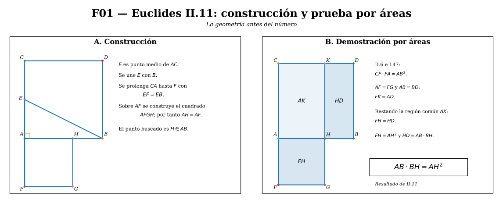
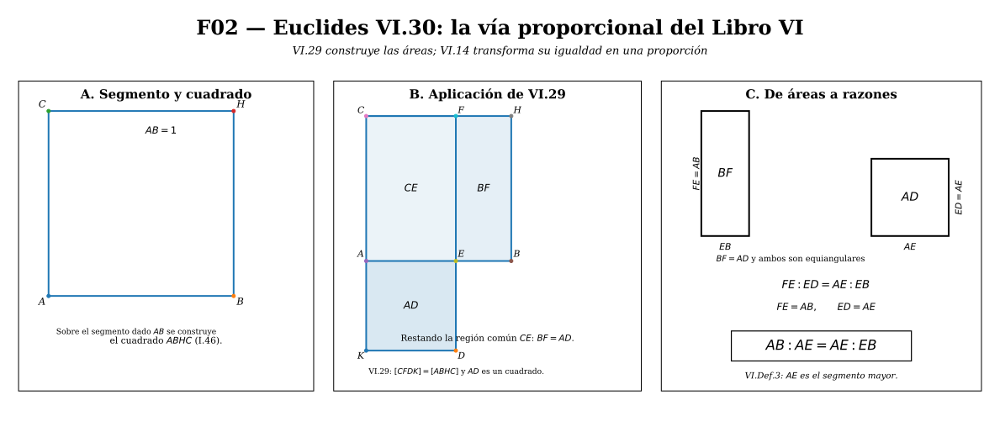
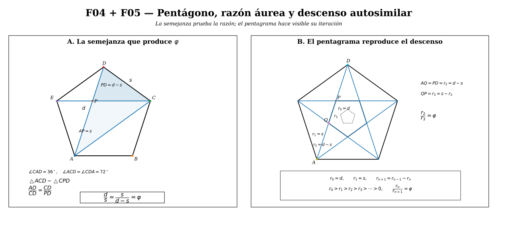
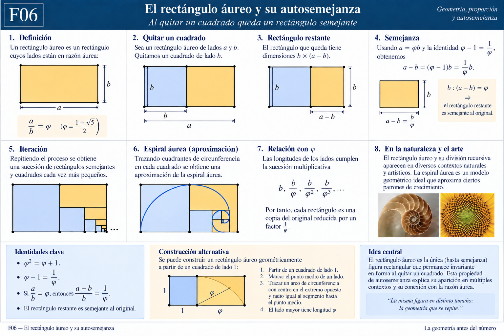
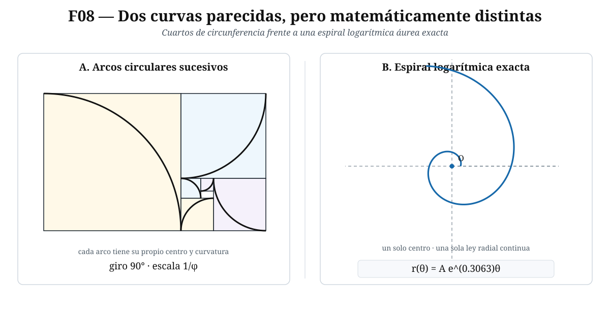
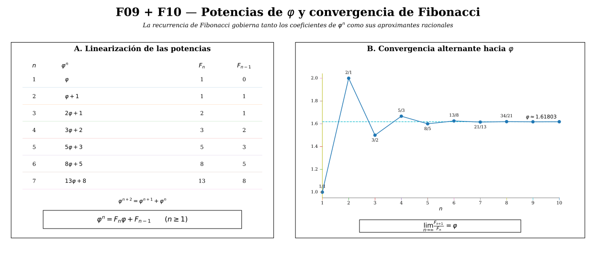
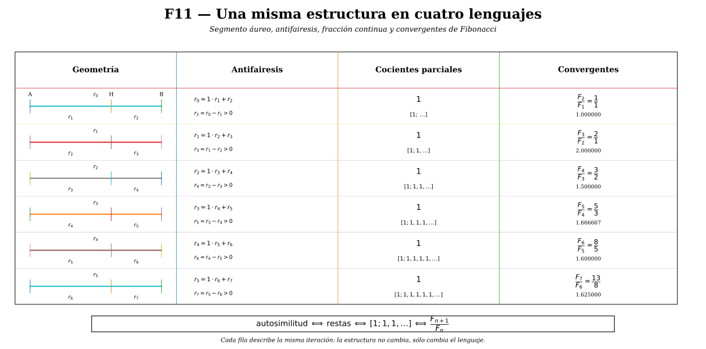
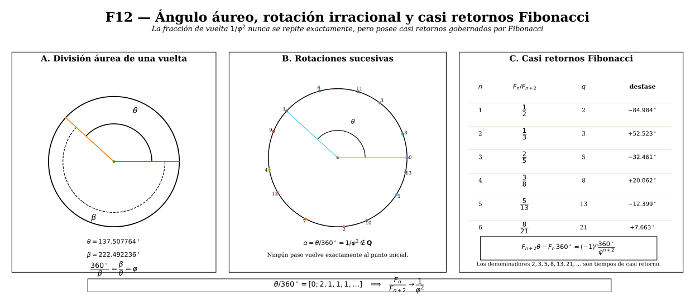

# La sección áurea

::: {.callout-note title="Idea central"}
La sección áurea no entra en la historia de la matemática como el decimal $1.618\ldots$, ni como una regla estética. Una de sus formulaciones antiguas conservadas más importantes es **constructiva**: dado un segmento, Euclides muestra cómo cortarlo de manera que el rectángulo contenido por el segmento entero y la parte menor sea igual al cuadrado construido sobre la parte mayor. Sólo después, mediante la teoría de razones, esa relación se expresa como «el todo es a la parte mayor como la parte mayor es a la menor». Este artículo seguirá deliberadamente ese camino: **construcción → proporción → ecuación → número**.
:::

Antes de escribir $\varphi$, conviene tomar regla y compás —al menos conceptualmente— y preguntar qué problema geométrico estamos resolviendo.

::: {.callout-note title="Terminología histórica"}
Euclides no habla de «número de oro» ni utiliza el símbolo $\varphi$. En los *Elementos* aparece la división de una recta en **extrema y media razón**. II.11 formula una construcción mediante igualdad de áreas; en el Libro VI, una vez desarrollada la teoría de proporciones, la misma estructura puede expresarse mediante razones y VI.30 vuelve a construir la división. La terminología «áurea» y la notación moderna son muy posteriores.
:::

## Antes del número: una construcción geométrica {#aurea-euclides-ii11}

Sea $AB$ un segmento cualquiera. El problema de *Elementos* II.11 puede formularse así:

> cortar $AB$ en un punto $H$ de manera que el rectángulo contenido por el segmento entero $AB$ y uno de los segmentos $BH$ tenga la misma área que el cuadrado construido sobre el segmento restante $AH$.

La condición buscada es, por tanto,

$$
\boxed{AB\cdot BH=AH^2.}
$$

No hemos introducido todavía ningún número especial. El problema es enteramente geométrico: **construir el punto $H$**.

### Construcción paso a paso {#aurea-euclides-construccion}

1. Sobre $AB$ construimos el cuadrado $ABDC$.
2. Bisecamos $AC$ en $E$.
3. Unimos $E$ con $B$.
4. Prolongamos $CA$ más allá de $A$ hasta un punto $F$ tal que
   $$
   EF=EB.
   $$
5. Sobre $AF$ construimos un cuadrado. Su lado determina sobre $AB$ el punto $H$ de modo que
   $$
   AH=AF.
   $$

Euclides demuestra que el punto así construido satisface exactamente

$$
AB\cdot BH=AH^2.
$$

La demostración completa quedará en §4. Hasta entonces utilizaremos esta igualdad como **resultado enunciado con demostración diferida**; no hay circularidad, porque la prueba de §4 depende sólo de resultados euclidianos anteriores y no de la deducción algebraica de §§1–3. Por ahora importa observar el orden lógico: **primero tenemos una construcción y una igualdad entre áreas; todavía no hemos calculado $\sqrt5$, no hemos escrito una ecuación cuadrática y no hemos definido $\varphi$**.

*Figura F01. Euclides II.11. A la izquierda, la construcción exacta del punto $H$ a partir del cuadrado $ABDC$, el punto medio $E$ de $AC$ y la condición $EF=EB$. A la derecha, la sustracción de áreas que conduce a $FH=HD$ y finalmente a $AB\cdot BH=AH^2$. La figura no presupone todavía la notación $\varphi$.*

::: {.callout-important title="Por qué comenzamos aquí"}
Históricamente, la estructura aparece en la geometría antes de adquirir su nombre moderno y antes de ser tratada como una constante numérica. Además, matemáticamente, este orden evita invertir la explicación: no construiremos una figura porque ya conocemos $\varphi$; veremos cómo $\varphi$ emerge de una construcción.
:::

## 1. De la construcción a la proporción {#aurea-problema}

Traduzcamos ahora la construcción a lenguaje moderno.

Sea

$$
AB=L>0
$$

y escribamos

$$
AH=x,
\qquad
BH=L-x.
$$

Como $H$ es un punto interior de $AB$,

$$
0<x<L
$$

y, por tanto,

$$
L-x>0.
$$

La igualdad de áreas producida por II.11,

$$
AB\cdot BH=AH^2,
$$

se escribe entonces

$$
\boxed{L(L-x)=x^2.}
$$

### 1.1. La igualdad de áreas contiene la proporción

Como $x>0$ y $L-x>0$, podemos dividir ambos miembros de

$$
L(L-x)=x^2
$$

por el producto positivo $x(L-x)$. Obtenemos

$$
\frac{L(L-x)}{x(L-x)}
=
\frac{x^2}{x(L-x)}.
$$

Cancelando únicamente factores no nulos,

$$
\boxed{\frac{L}{x}=\frac{x}{L-x}.}
$$

Leída verbalmente:

> el segmento entero es a una de las partes como esa parte es a la restante.

Todavía debemos comprobar cuál de las dos partes es la mayor. Como $L>x>0$,

$$
\frac{L}{x}>1.
$$

Pero

$$
\frac{L}{x}=\frac{x}{L-x},
$$

así que

$$
\frac{x}{L-x}>1.
$$

Como $L-x>0$, multiplicar por $L-x$ conserva la desigualdad:

$$
x>L-x.
$$

Por consiguiente, $x=AH$ es efectivamente la **parte mayor** y $L-x=BH$ la **parte menor**. Hemos recuperado exactamente la condición de división en extrema y media razón:

$$
\boxed{
\frac{L}{x}=\frac{x}{L-x}.
}
$$

La implicación inversa también vale. Si partimos de

$$
\frac{L}{x}=\frac{x}{L-x}
$$

con $x>0$ y $L-x>0$, multiplicamos por $x(L-x)$ y recuperamos

$$
L(L-x)=x^2.
$$

Por tanto,

$$
\boxed{
AB\cdot BH=AH^2
\iff
\frac{AB}{AH}=\frac{AH}{BH}.
}
$$

En §5 volveremos sobre esta equivalencia desde el lenguaje interno de los *Elementos*, mediante VI.17.

::: {.callout-tip title="Pregunta de control"}
¿Por qué hacemos explícita la positividad antes de dividir o cancelar? Porque una transformación algebraica sólo conserva la equivalencia cuando las operaciones efectuadas están definidas. Aquí $H$ es interior, de modo que $AH>0$ y $BH>0$.
:::

### 1.2. La razón que queremos calcular

La longitud $x$ depende del tamaño inicial $L$. Si duplicamos $L$, también se duplican ambas partes. Lo característico de la construcción no es una longitud absoluta, sino una **razón**.

Definimos ahora —y sólo ahora—

$$
\varphi:=\frac{L}{x}.
$$

Por la proporción que acabamos de deducir,

$$
\varphi
=
\frac{L}{x}
=
\frac{x}{L-x}.
$$

Como $L>x>0$,

$$
\varphi>1.
$$

La construcción geométrica nos ha conducido entonces a una pregunta numérica:

> ¿qué número mayor que $1$ puede ser simultáneamente la razón entre el todo y la parte mayor y la razón entre la parte mayor y la parte menor?

## 2. Derivación algebraica de la razón áurea {#aurea-derivacion}

Partimos de la proporción obtenida en §1 a partir de la construcción geométrica:

$$
\varphi=\frac{L}{x}=\frac{x}{L-x}.
$$

Como

$$
L=x+(L-x),
$$

podemos dividir esta igualdad por $x>0$:

$$
\frac{L}{x}
=
\frac{x+(L-x)}{x}.
$$

Distribuyendo el cociente,

$$
\frac{L}{x}
=
\frac{x}{x}+\frac{L-x}{x}.
$$

Por tanto,

$$
\frac{L}{x}
=
1+\frac{L-x}{x}.
$$

Ahora usamos las dos razones que ya conocemos. Por definición,

$$
\frac{L}{x}=\varphi.
$$

Y, puesto que

$$
\frac{x}{L-x}=\varphi,
$$

al tomar recíprocos —ambas cantidades son positivas— obtenemos

$$
\frac{L-x}{x}=\frac1\varphi.
$$

Sustituyendo estas dos expresiones en la igualdad anterior,

$$
\varphi=1+\frac1\varphi.
$$

Como $\varphi>0$, multiplicamos por $\varphi$:

$$
\varphi^2=\varphi+1.
$$

Reordenando,

$$
\boxed{\varphi^2-\varphi-1=0.}
$$

Hemos llegado a una ecuación cuadrática sin introducir ninguna hipótesis adicional: **la ecuación es una consecuencia directa de la relación geométrica obtenida a partir de la construcción**.

### 2.1. Resolver la ecuación

Aplicamos la fórmula general a

$$
x^2-x-1=0.
$$

Aquí

$$
a=1,\qquad b=-1,\qquad c=-1.
$$

Por tanto,

$$
x
=
\frac{-b\pm\sqrt{b^2-4ac}}{2a}.
$$

Sustituyendo los coeficientes,

$$
x
=
\frac{-(-1)\pm\sqrt{(-1)^2-4(1)(-1)}}{2(1)}.
$$

Simplificando paso a paso,

$$
x
=
\frac{1\pm\sqrt{1+4}}{2},
$$

$$
x
=
\frac{1\pm\sqrt5}{2}.
$$

La ecuación posee entonces dos raíces:

$$
x_1=\frac{1+\sqrt5}{2},
\qquad
x_2=\frac{1-\sqrt5}{2}.
$$

Como $\sqrt5>1$, la segunda raíz es negativa:

$$
\frac{1-\sqrt5}{2}<0.
$$

Pero nuestra razón $\varphi=L/x$ es positiva —de hecho, mayor que $1$—. Por consiguiente, la única raíz compatible con el problema geométrico es

$$
\boxed{
\varphi=\frac{1+\sqrt5}{2}
}
$$

y numéricamente

$$
\boxed{
\varphi\approx1.6180339887498948\ldots
}
$$

::: {.callout-important title="Qué hemos demostrado"}
No hemos definido la sección áurea diciendo «es el número $1.618\ldots$». Hemos demostrado que **si un segmento satisface la condición de extrema y media razón, la razón común debe ser necesariamente**
$$
\frac{1+\sqrt5}{2}.
$$
La unicidad positiva procede de la propia ecuación cuadrática.
:::

### 2.2. Recuperar las dos partes de un segmento

Conocida $\varphi$, también podemos determinar dónde debe producirse el corte de un segmento de longitud $L$.

De

$$
\frac{L}{x}=\varphi
$$

obtenemos, multiplicando por $x$ y dividiendo por $\varphi>0$,

$$
x=\frac{L}{\varphi}.
$$

En la sección siguiente probaremos que

$$
\frac1\varphi=\varphi-1.
$$

Por tanto,

$$
x=L(\varphi-1)
=
L\frac{\sqrt5-1}{2}.
$$

La parte menor es

$$
L-x
=
L-L\frac{\sqrt5-1}{2}.
$$

Sacando factor común $L$,

$$
L-x
=
L\left(1-\frac{\sqrt5-1}{2}\right).
$$

Escribimos $1=2/2$:

$$
L-x
=
L\left(\frac{2-(\sqrt5-1)}{2}\right),
$$

$$
L-x
=
L\frac{3-\sqrt5}{2}.
$$

Así, para un segmento de longitud $L$,

$$
\boxed{x=L\frac{\sqrt5-1}{2}}
$$

es la parte mayor y

$$
\boxed{L-x=L\frac{3-\sqrt5}{2}}
$$

es la parte menor.

Como comprobación,

$$
\frac{\sqrt5-1}{2}\approx0.6180339,
\qquad
\frac{3-\sqrt5}{2}\approx0.3819660,
$$

y las dos fracciones suman $1$.

## 3. La ecuación que genera las identidades fundamentales {#aurea-identidades}

La identidad

$$
\boxed{\varphi^2=\varphi+1}
$$

no es una propiedad secundaria. Es la forma algebraica condensada de la condición geométrica inicial. A partir de ella podemos producir las relaciones fundamentales de $\varphi$.

### 3.1. El recíproco de $\varphi$

Partimos de

$$
\varphi^2=\varphi+1.
$$

Como $\varphi>0$, podemos dividir ambos miembros por $\varphi$:

$$
\frac{\varphi^2}{\varphi}
=
\frac{\varphi+1}{\varphi}.
$$

Simplificando,

$$
\varphi
=
1+\frac1\varphi.
$$

Restando $1$ a ambos miembros,

$$
\boxed{\frac1\varphi=\varphi-1.}
$$

Usando la expresión radical de $\varphi$,

$$
\varphi-1
=
\frac{1+\sqrt5}{2}-1
=
\frac{\sqrt5-1}{2}.
$$

Por tanto,

$$
\boxed{
\frac1\varphi
=
\varphi-1
=
\frac{\sqrt5-1}{2}
}.
$$

Este resultado explica ya una primera autosimilitud numérica:

$$
\varphi\approx1.6180339\ldots,
\qquad
\frac1\varphi\approx0.6180339\ldots
$$

Los decimales coinciden después de desplazar la parte entera porque la igualdad exacta es $1/\varphi=\varphi-1$.

### 3.2. La otra raíz y el conjugado algebraico

La ecuación

$$
x^2-x-1=0
$$

posee también la raíz

$$
\psi:=\frac{1-\sqrt5}{2}.
$$

Aunque $\psi$ no puede representar la razón geométrica positiva de nuestro segmento, será algebraicamente muy útil.

Veamos su relación con $\varphi$. De

$$
\frac1\varphi=\frac{\sqrt5-1}{2}
$$

se sigue

$$
-\frac1\varphi
=
\frac{1-\sqrt5}{2}.
$$

Por tanto,

$$
\boxed{\psi=-\frac1\varphi.}
$$

Además,

$$
\varphi+\psi
=
\frac{1+\sqrt5}{2}+\frac{1-\sqrt5}{2}
=1,
$$

de modo que

$$
\boxed{\varphi+\psi=1.}
$$

Y

$$
\varphi\psi
=
\frac{(1+\sqrt5)(1-\sqrt5)}{4}
=
\frac{1-5}{4}
=-1,
$$

por lo cual

$$
\boxed{\varphi\psi=-1.}
$$

Estas dos identidades son también las relaciones de Viète para las raíces de $x^2-x-1$.

### 3.3. Reducir potencias de $\varphi$

La igualdad

$$
\varphi^2=\varphi+1
$$

permite reducir cualquier potencia de grado mayor a una expresión lineal en $\varphi$.

Por ejemplo,

$$
\varphi^3
=
\varphi\varphi^2.
$$

Sustituyendo $\varphi^2=\varphi+1$,

$$
\varphi^3
=
\varphi(\varphi+1).
$$

Distribuyendo,

$$
\varphi^3
=
\varphi^2+\varphi.
$$

Volvemos a sustituir $\varphi^2=\varphi+1$:

$$
\varphi^3
=
(\varphi+1)+\varphi,
$$

por tanto

$$
\boxed{\varphi^3=2\varphi+1.}
$$

Del mismo modo,

$$
\varphi^4
=
\varphi\varphi^3
=
\varphi(2\varphi+1)
=
2\varphi^2+\varphi.
$$

Sustituyendo otra vez,

$$
\varphi^4
=
2(\varphi+1)+\varphi
=
3\varphi+2.
$$

Así,

$$
\boxed{\varphi^4=3\varphi+2.}
$$

Y una iteración más da

$$
\varphi^5
=
\varphi(3\varphi+2)
=
3\varphi^2+2\varphi
=
3(\varphi+1)+2\varphi
=
5\varphi+3.
$$

Por tanto,

$$
\boxed{\varphi^5=5\varphi+3.}
$$

Los coeficientes que aparecen,

$$
1,1,2,3,5,\ldots,
$$

anticipan la sucesión de Fibonacci. Más adelante demostraremos, y no sólo observaremos, la fórmula general

$$
\varphi^n=F_n\varphi+F_{n-1}.
$$

Por ahora lo importante es el mecanismo: **cada vez que aparece $\varphi^2$, la ecuación definitoria permite reemplazarla por $\varphi+1$**.

### 3.4. Una forma recursiva de la propia razón

De

$$
\varphi=1+\frac1\varphi
$$

podemos sustituir el $\varphi$ del denominador por la misma expresión:

$$
\varphi
=
1+\frac1{1+\frac1\varphi}.
$$

Repitiendo formalmente el procedimiento,

$$
\varphi
=
1+\cfrac1{1+\cfrac1{1+\cfrac1{\ddots}}}.
$$

Esta expresión sugiere la fracción continua

$$
[1;1,1,1,\ldots].
$$

Todavía **no** hemos demostrado que la fracción continua infinita converja ni que su valor sea $\varphi$; hacerlo exigirá una sección independiente. Aquí sólo registramos que la ecuación

$$
\varphi=1+\frac1\varphi
$$

contiene de manera natural una estructura recursiva.

::: {.callout-important title="Balance del núcleo algebraico"}
Hemos partido de una única condición geométrica y hemos obtenido, en orden lógico,
$$
\frac{L}{x}=\frac{x}{L-x}
\iff
L(L-x)=x^2,
$$
$$
\varphi^2=\varphi+1,
$$
$$
\varphi=\frac{1+\sqrt5}{2},
$$
$$
\frac1\varphi=\varphi-1,
$$
y las primeras reducciones de potencias de $\varphi$.

Nada de esto requiere apelar todavía al pentágono, a Fibonacci, al arte ni a la naturaleza. Esas conexiones deberán justificarse por separado.
:::

## 4. Por qué funciona la construcción de II.11 {#aurea-euclides-prueba}

La construcción de II.11 abrió el artículo. Desde entonces hemos utilizado su conclusión

$$
AB\cdot BH=AH^2
$$

como punto de partida geométrico para obtener la proporción y, después, la ecuación de $\varphi$.

Ahora cerramos la deuda lógica: **demostraremos que la construcción inicial produce realmente esa igualdad**. Después leeremos la misma figura con longitudes modernas para ver dónde aparece $\sqrt5$.

::: {.callout-note title="Por qué Euclides trabaja con áreas"}
La teoría general de razones y proporciones de los *Elementos* se desarrolla en los Libros V y VI. II.11 pertenece al Libro II y formula el problema mediante rectángulos y cuadrados. En §5 veremos cómo VI.17 permite traducir rigurosamente esa igualdad de áreas a una igualdad de razones.
:::

### 4.1. Por qué funciona: la demostración de Euclides por áreas {#aurea-euclides-demostracion}

La demostración original encadena resultados ya establecidos en los *Elementos*. El paso decisivo utiliza II.6.

Como $AC$ está bisecado en $E$ y la recta se ha prolongado desde $A$ hasta $F$, II.6 da

$$
CF\cdot FA+AE^2=EF^2.
$$

Por construcción,

$$
EF=EB,
$$

así que podemos sustituir $EF^2$ por $EB^2$:

$$
CF\cdot FA+AE^2=EB^2.
$$

Ahora observamos el triángulo rectángulo $AEB$. El ángulo en $A$ es recto porque $AB$ y $AC$ son lados del cuadrado construido inicialmente. Por I.47, el teorema de Pitágoras,

$$
EB^2=AB^2+AE^2.
$$

Sustituyendo esta igualdad en la anterior obtenemos

$$
CF\cdot FA+AE^2=AB^2+AE^2.
$$

Restamos de ambos miembros el mismo cuadrado $AE^2$:

$$
\boxed{CF\cdot FA=AB^2.}
$$

Ahora debemos traducir esa igualdad a las regiones concretas de la figura de II.11.

Por construcción, el cuadrilátero $FH$ es un cuadrado sobre $AF$. En particular,

$$
AF=FG.
$$

Por eso, el rectángulo de lados $CF$ y $FA$ coincide en área con la región $FK$ de la figura. Del mismo modo, como $ABDC$ es un cuadrado, el cuadrado sobre $AB$ es la región $AD$. La igualdad anterior puede escribirse entonces como

$$
FK=AD.
$$

La región $AK$ está contenida en ambas. Sustraemos la misma región $AK$ de los dos miembros; por la noción común según la cual, si de iguales se sustraen iguales, los restos son iguales, obtenemos

$$
FH=HD.
$$

Identifiquemos ahora esos dos restos.

Como $FH$ es el cuadrado construido sobre $AF$ y, por construcción,

$$
AF=AH,
$$

su área es

$$
FH=AH^2.
$$

Por otra parte, $HD$ es un rectángulo cuya altura es $BH$ y cuya otra dimensión es $BD$. Como $ABDC$ es un cuadrado,

$$
BD=AB,
$$

de modo que

$$
HD=AB\cdot BH.
$$

Sustituyendo estas dos identificaciones en $FH=HD$, llegamos finalmente a

$$
\boxed{AH^2=AB\cdot BH.}
$$

Esto es justamente lo que se quería construir. $\square$

::: {.callout-note title="Dependencias explícitas de II.11"}
La construcción usa, entre otros resultados previos, I.46 para levantar el cuadrado, I.10 para bisecar $AC$ e I.3 para transportar una longitud. La demostración usa II.6 y I.47, además de las nociones comunes sobre sustitución y sustracción de iguales. El argumento no presupone la fórmula moderna de la ecuación cuadrática ni el valor de $\varphi$.
:::

### 4.2. La misma construcción leída con longitudes modernas {#aurea-euclides-lectura-moderna}

La prueba de Euclides establece la igualdad buscada sin calcular explícitamente la longitud de $AH$. Nosotros podemos volver sobre la misma figura y calcularla.

Sea

$$
AB=L.
$$

Como $ABDC$ es un cuadrado,

$$
AC=L.
$$

Y, puesto que $E$ es el punto medio de $AC$,

$$
AE=\frac L2.
$$

El triángulo $AEB$ es rectángulo en $A$. Por Pitágoras,

$$
EB^2=AB^2+AE^2.
$$

Sustituyendo $AB=L$ y $AE=L/2$,

$$
EB^2
=
L^2+\left(\frac L2\right)^2.
$$

Desarrollando el cuadrado,

$$
EB^2
=
L^2+\frac{L^2}{4}
=
\frac{5L^2}{4}.
$$

Como $EB>0$,

$$
EB=\frac{L\sqrt5}{2}.
$$

Por construcción $EF=EB$, luego

$$
EF=\frac{L\sqrt5}{2}.
$$

Los puntos $E,A,F$ están alineados en ese orden, de modo que

$$
EF=EA+AF.
$$

Despejando $AF$,

$$
AF=EF-EA.
$$

Sustituimos los valores ya obtenidos:

$$
AF
=
\frac{L\sqrt5}{2}-\frac L2
=
L\frac{\sqrt5-1}{2}.
$$

El cuadrado construido sobre $AF$ determina $H$ de manera que $AH=AF$. Por tanto,

$$
\boxed{AH=L\frac{\sqrt5-1}{2}.}
$$

Esta es exactamente la fórmula obtenida algebraicamente en §2.2 para la parte mayor.

Para comprobar que $H$ cae realmente **dentro** de $AB$, basta notar que

$$
1<\sqrt5<3.
$$

La desigualdad de la izquierda da $\sqrt5-1>0$, y la de la derecha da $\sqrt5-1<2$. Por consiguiente,

$$
0<\frac{\sqrt5-1}{2}<1,
$$

y, al multiplicar por $L>0$,

$$
0<AH<L=AB.
$$

Así $H$ es efectivamente un punto interior del segmento dado.

### 4.3. Qué añade la construcción al desarrollo {#aurea-euclides-verificacion}

En §1 ya habíamos traducido la igualdad de áreas de II.11 a la proporción

$$
\frac{AB}{AH}=\frac{AH}{BH},
$$

y en §2.2 habíamos deducido algebraicamente, para $AB=L$,

$$
AH=L\frac{\sqrt5-1}{2}.
$$

La lectura moderna de §4.2 ha recuperado **la misma longitud a partir de la figura**. No necesitamos volver a demostrar aquí ni la equivalencia de razones ni que $AH$ es la parte mayor: ambas cuestiones quedaron establecidas en §1.

Lo nuevo de §4 es otra cosa: hemos probado la **existencia constructiva**. Para todo segmento $AB$ de longitud positiva, el procedimiento de II.11 produce efectivamente un punto $H$ que satisface

$$
AB\cdot BH=AH^2.
$$

Además, la propia construcción explica geométricamente la aparición de $\sqrt5$: surge del triángulo rectángulo $AEB$, cuyos catetos miden $L$ y $L/2$.

::: {.callout-important title="Qué queda establecido hasta aquí"}
El recorrido inicial ya está cerrado sin circularidad:
$$
\text{construcción de II.11}
\Longrightarrow
AB\cdot BH=AH^2
\Longleftrightarrow
\frac{AB}{AH}=\frac{AH}{BH}
\Longrightarrow
\varphi^2=\varphi+1.
$$
La primera flecha se demuestra geométricamente en §4.1; la equivalencia central se traduce algebraicamente en §1 y se reconstruirá en lenguaje euclidiano mediante VI.17 en §5.
:::

Si II.11 ya construye la división correcta, queda una pregunta histórica y matemática natural: ¿por qué Euclides vuelve a tratar el problema en VI.30? La respuesta está en el cambio de lenguaje. El Libro II trabaja con áreas; el Libro VI dispone ya de una teoría general de razones y proporciones.

## 5. De II.11 a VI.30: de las áreas a las razones {#aurea-euclides-vi30}

La proposición II.11 resuelve el problema mediante una igualdad de áreas:

$$
AB\cdot BH=AH^2.
$$

Después de desarrollar la teoría de razones y proporciones en los Libros V y VI, Euclides puede formular la misma estructura de otra manera. En la numeración tradicional del Libro VI, la **Definición 3** establece que una recta queda dividida en extrema y media razón cuando

$$
\boxed{AB:AH=AH:HB,}
$$

siendo $AH$ el segmento mayor y $HB$ el menor.

::: {.callout-note title="Nota sobre la numeración editorial"}
En la numeración tradicional de los *Elementos* esta definición es VI.Def.3. La edición modernizada *Euclid's Elements Redux* utilizada como control reorganiza las definiciones del Libro VI y la presenta como definición 2. Conservaremos aquí la numeración tradicional cuando hablemos del texto euclidiano.
:::

El punto esencial es ahora demostrar que las dos formulaciones

$$
AB\cdot HB=AH^2
$$

y

$$
AB:AH=AH:HB
$$

no son sólo parecidas: **son equivalentes**.

### 5.1. VI.17: el puente exacto entre proporción y producto {#aurea-vi17}

La proposición VI.17 afirma, en su forma esencial:

> Si tres segmentos son proporcionales, el rectángulo contenido por los extremos es igual al cuadrado sobre el medio; y, recíprocamente, si ese rectángulo es igual al cuadrado sobre el medio, los tres segmentos son proporcionales.

Sean $a,b,c>0$. La condición de proporcionalidad es

$$
a:b=b:c.
$$

En notación moderna,

$$
\frac ab=\frac bc.
$$

Como $b>0$ y $c>0$, podemos multiplicar ambos miembros por $bc$:

$$
\frac ab\,bc
=
\frac bc\,bc.
$$

Cancelando los factores permitidos,

$$
ac=b^2.
$$

Así obtenemos

$$
\boxed{
\frac ab=\frac bc
\Longrightarrow
ac=b^2.
}
$$

Para la implicación recíproca, supongamos

$$
ac=b^2.
$$

Como $b>0$ y $c>0$, dividimos ambos miembros por $bc$:

$$
\frac{ac}{bc}
=
\frac{b^2}{bc}.
$$

Simplificando,

$$
\frac ab=\frac bc.
$$

Por tanto,

$$
\boxed{
ac=b^2
\Longrightarrow
\frac ab=\frac bc.
}
$$

Reuniendo ambas direcciones,

$$
\boxed{
\frac ab=\frac bc
\iff
ac=b^2.
}
$$

Esta equivalencia es la traducción algebraica moderna de VI.17.

::: {.callout-note title="Cómo procede Euclides"}
Euclides no escribe productos algebraicos ni realiza una «multiplicación cruzada» simbólica. Su demostración reduce VI.17 a VI.16: introduce un cuarto segmento igual al término medio y transforma la igualdad entre un rectángulo de extremos y un cuadrado sobre el medio en una igualdad entre dos rectángulos. Nuestra cadena de fracciones expresa en lenguaje moderno la misma relación lógica.
:::

### 5.2. Aplicar VI.17 al resultado de II.11 {#aurea-ii11-vi17}

Volvamos al punto $H$ construido en el preludio geométrico y cuya construcción demostramos en §4. II.11 nos dio

$$
AB\cdot HB=AH^2.
$$

Los tres segmentos relevantes son

$$
AB,
\qquad
AH,
\qquad
HB.
$$

Si en VI.17 tomamos

$$
a=AB,
\qquad
b=AH,
\qquad
c=HB,
$$

la igualdad de áreas se convierte exactamente en

$$
ac=b^2.
$$

Por la implicación recíproca de VI.17,

$$
\frac{AB}{AH}
=
\frac{AH}{HB}.
$$

Es decir,

$$
\boxed{AB:AH=AH:HB.}
$$

Como §1.1 ya estableció que

$$
AH>HB>0,
$$

se cumplen las dos partes de la definición tradicional VI.Def.3: $AH$ es el segmento mayor y la razón del todo al mayor coincide con la del mayor al menor.

Por consiguiente, **una vez disponible la teoría de proporciones**, la construcción de II.11 puede releerse inmediatamente como una construcción de la sección áurea.

### 5.3. El diccionario exacto entre ambos lenguajes {#aurea-equivalencia-completa}

A esta altura ya no necesitamos volver a resolver la ecuación cuadrática: eso quedó hecho en §2. Lo que aporta VI.17 es una justificación **interna al sistema euclidiano** de la equivalencia que §1 había escrito en lenguaje algebraico moderno.

Para los tres segmentos positivos

$$
AB,\qquad AH,\qquad HB,
$$

VI.17 da exactamente

$$
\boxed{
AB\cdot HB=AH^2
\iff
AB:AH=AH:HB.
}
$$

Y §§1–2 ya mostraron que, si llamamos $\varphi$ a esa razón común, entonces

$$
\boxed{
\varphi^2=\varphi+1,
\qquad
\varphi=\frac{1+\sqrt5}{2}.
}
$$

Por tanto podemos conservar, sin repetir las demostraciones anteriores, el siguiente diccionario:

$$
\boxed{
\text{igualdad de áreas de II.11}
\iff
\text{proporción de VI.17}
\iff
\text{extrema y media razón}.
}
$$

La ecuación $\varphi^2=\varphi+1$ es una consecuencia algebraica moderna de esa estructura; no reemplaza ni antecede lógicamente a la construcción geométrica.

### 5.4. Qué hace realmente VI.30 {#aurea-vi30-tradicional}

La proposición VI.30 lleva por problema:

> dividir una recta finita dada en extrema y media razón.

Sería tentador resumirla diciendo simplemente: «aplíquese II.11 y luego VI.17». Matemáticamente eso bastaría. Sin embargo, **no es exactamente la construcción que conserva el texto tradicional de VI.30**.

La demostración tradicional ofrece una segunda construcción. Su arquitectura es ésta:

1. sobre el segmento dado $AB$ se construye un cuadrado;
2. mediante VI.29 se aplica al cuadrado una figura semejante que excede por otro cuadrado;
3. de la igualdad de las áreas construidas se sustrae una región común;
4. quedan dos paralelogramos iguales;
5. como esos paralelogramos son además equiangulares, VI.14 permite concluir que los lados alrededor de los ángulos iguales son recíprocamente proporcionales;
6. las igualdades de lados de los cuadrados transforman esa proporción en
   $$
   AB:AE=AE:EB;
   $$
7. como $AB>AE$, también $AE>EB$, y por VI.Def.3 el punto $E$ divide $AB$ en extrema y media razón.

Así, VI.30 llega **directamente al lenguaje proporcional**, utilizando la maquinaria geométrica desarrollada en el propio Libro VI.

*Figura F02. Euclides VI.30. La construcción propia del Libro VI parte del cuadrado sobre $AB$, aplica VI.29 para obtener dos paralelogramos iguales y equiangulares, y usa VI.14 para convertir esa igualdad de áreas en la proporción $AB:AE=AE:EB$. Esta figura es deliberadamente distinta de F01/II.11.*

### 5.5. II.11 y VI.30: misma relación, dos arquitecturas {#aurea-ii11-vs-vi30}

Conviene distinguir tres afirmaciones.

**Primera.** II.11 construye un punto que satisface

$$
AB\cdot HB=AH^2.
$$

**Segunda.** VI.17 demuestra que esa igualdad de áreas equivale a

$$
AB:AH=AH:HB.
$$

**Tercera.** VI.30 construye directamente una división con esa razón, utilizando herramientas propias del Libro VI.

Por tanto, II.11 y VI.30 no son dos problemas matemáticos independientes. Resuelven la **misma estructura**, pero dentro de dos lenguajes geométricos distintos:

$$
\boxed{
\text{Libro II: igualdad de áreas}
\quad\longleftrightarrow\quad
\text{Libro VI: igualdad de razones}.
}
$$

La proposición VI.17 funciona como puente conceptual entre ambos lenguajes.

::: {.callout-warning title="No identificar las dos construcciones"}
Algunas modernizaciones simplifican VI.30 invocando directamente II.11 y traduciendo después la igualdad de áreas a una proporción. Esa demostración es correcta como atajo moderno, pero no debe confundirse con la construcción tradicional de VI.30, que pasa por VI.29 y VI.14. En este artículo conservamos ambas lecturas separadas.
:::

### 5.6. Una razón autosimilar {#aurea-autosimilitud}

La definición proporcional permite ver con especial claridad la propiedad que hace singular a la sección áurea.

Si

$$
\frac{AB}{AH}=\frac{AH}{HB}=\varphi,
$$

entonces el par de longitudes

$$
(AB,AH)
$$

tiene la misma razón que

$$
(AH,HB).
$$

Al pasar del segmento completo a su parte mayor, la relación entre «grande» y «pequeño» se reproduce a escala menor. No estamos afirmando todavía una autosimilitud de una figura completa; estamos señalando una **autosimilitud de razones**:

$$
\boxed{
\text{todo : mayor}
=
\text{mayor : menor}.
}
$$

Esta propiedad será el mecanismo geométrico detrás del pentagrama y del rectángulo áureo que estudiaremos más adelante.

La sección áurea está ahora construida y caracterizada tanto por áreas como por razones. Surge entonces un problema más profundo: ¿pueden la parte mayor y la menor medirse exactamente mediante una misma unidad de longitud? La respuesta es negativa y conduce a la **inconmensurabilidad** y, en lenguaje moderno, a la irracionalidad de $\varphi$.

## 6. Inconmensurabilidad e irracionalidad {#aurea-irracionalidad}

La autosimilitud proporcional descubierta en §5 tiene una consecuencia que no es visible a primera vista: las dos partes de una sección áurea **no poseen una unidad común de medida**.

En lenguaje geométrico clásico diremos que son **inconmensurables**. En lenguaje aritmético moderno diremos que el cociente entre ellas es **irracional**. Ambas afirmaciones están relacionadas, pero conviene no fundirlas sin explicación.

::: {.callout-note title="Conmensurabilidad"}
Dos segmentos positivos $a$ y $b$ son **conmensurables** si existe una longitud $u>0$ y enteros positivos $m,n$ tales que
$$
a=mu,
\qquad
b=nu.
$$
Entonces
$$
\frac ab=\frac mn\in\mathbb Q.
$$
Recíprocamente, en nuestra formulación moderna, si $a/b=m/n$ con $m,n\in\mathbb N$, entonces $u=a/m=b/n$ es una medida común. Por eso, para longitudes positivas, conmensurabilidad equivale a que su razón sea racional.
:::

### 6.1. El descenso que nunca termina {#aurea-descenso}

Sea un segmento $AB$ dividido en extrema y media razón en $H$, con

$$
AH>HB>0
$$

y

$$
\frac{AB}{AH}=\frac{AH}{HB}.
$$

Para abreviar escribamos

$$
M:=AH,
\qquad
m:=HB.
$$

Entonces

$$
AB=M+m,
$$

y la condición áurea se convierte en

$$
\frac{M+m}{M}=\frac{M}{m}.
$$

Multiplicando por $Mm>0$,

$$
m(M+m)=M^2.
$$

Desarrollamos:

$$
mM+m^2=M^2.
$$

Restamos $mM$ en ambos miembros:

$$
m^2=M^2-mM.
$$

Sacando factor común $M$ en el miembro derecho,

$$
\boxed{m^2=M(M-m).}
$$

Como $M>m$, el resto

$$
r:=M-m
$$

es positivo. Sustituyendo $r$ en la igualdad anterior,

$$
m^2=Mr.
$$

Por VI.17 —o, modernamente, dividiendo por $mr>0$— obtenemos

$$
\boxed{
\frac{M}{m}=\frac{m}{r}
}
$$

con

$$
r=M-m.
$$

Esto significa algo decisivo: **después de restar la parte menor a la parte mayor, el nuevo par vuelve a estar en sección áurea**.

La misma operación puede repetirse. Definamos

$$
r_0:=M,
\qquad
r_1:=m,
$$

y, para $n\ge1$,

$$
r_{n+1}:=r_{n-1}-r_n.
$$

La propiedad anterior garantiza sucesivamente

$$
\frac{r_0}{r_1}
=
\frac{r_1}{r_2}
=
\frac{r_2}{r_3}
=
\cdots
=
\varphi,
$$

con

$$
r_0>r_1>r_2>r_3>\cdots>0.
$$

En cada etapa obtenemos un resto **estrictamente positivo** y menor que el anterior. El procedimiento, por tanto, nunca llega a resto cero.

### 6.2. Por qué un proceso infinito implica inconmensurabilidad {#aurea-inconmensurable}

Supongamos, para obtener una contradicción, que $M$ y $m$ fueran conmensurables. Entonces existiría una longitud $u>0$ y enteros positivos $p>q$ tales que

$$
M=pu,
\qquad
m=qu.
$$

Al efectuar la primera resta,

$$
M-m=(p-q)u.
$$

El nuevo resto seguiría siendo un múltiplo entero de la misma unidad $u$.

En la etapa siguiente volveríamos a restar el menor del mayor. Por tanto, en términos de los coeficientes enteros, pasaríamos de

$$
(p,q)
$$

a

$$
(q,p-q),
$$

ordenando en cada etapa el mayor y el menor cuando sea necesario.

Pero cada resta disminuye estrictamente la suma de los dos enteros positivos. En efecto,

$$
p+q>q+(p-q)=p.
$$

No puede existir una sucesión infinita de enteros positivos cuya suma disminuya estrictamente en cada paso. Tarde o temprano el algoritmo tendría que alcanzar un resto nulo.

Sin embargo, §6.1 mostró que en una sección áurea cada resto vuelve a producir un nuevo par en la misma proporción y es siempre positivo. El proceso **no puede terminar**.

La hipótesis de una medida común conduce así a contradicción. Por tanto,

$$
\boxed{M\text{ y }m\text{ son inconmensurables}.}
$$

En particular,

$$
\boxed{AH\text{ y }HB\text{ son inconmensurables}.}
$$

Y, como

$$
AB=AH+HB,
$$

también $AB$ y $AH$ son inconmensurables.

::: {.callout-note title="Antifairesis y algoritmo euclidiano"}
El procedimiento de sustraer repetidamente la magnitud menor de la mayor es la forma geométrica de la **antifairesis**, estrechamente relacionada con el algoritmo euclidiano. Para magnitudes conmensurables el proceso termina; para la sección áurea se reproduce indefinidamente porque cada resto conserva la misma estructura proporcional.
:::

### 6.3. Qué pertenece a Euclides y qué estamos reconstruyendo {#aurea-historia-inconmensurabilidad}

La relación entre inconmensurabilidad, algoritmo euclidiano y pentágono pertenece al núcleo antiguo de la teoría de magnitudes. Sin embargo, conviene formular con cautela la historia concreta de la sección áurea.

Una modernización de los *Elementos* como *Euclid's Elements Redux* explicita, como corolario de II.11, el descenso indefinido que acabamos de reconstruir: al sustraer sucesivamente la parte menor de la mayor reaparece una división del mismo tipo, de modo que no se alcanza una medida común.

La historiografía moderna también vincula la antifairesis con el pentágono y el pentagrama. Scriba y Schreiber señalan que esta configuración proporciona una vía geométrica natural hacia razones inconmensurables. Pero la atribución de una demostración concreta a Hipaso de Metaponto es **reconstructiva e incierta**: no poseemos un texto suyo que permita afirmar qué figura o qué argumento utilizó.

::: {.callout-warning title="Cautela histórica"}
No escribiremos «Hipaso descubrió la irracionalidad mediante el pentagrama» como hecho documentado. Podemos decir que el pentágono ofrece una reconstrucción históricamente plausible del tipo de argumento antifairético que pudo estar implicado en los primeros estudios griegos de la inconmensurabilidad.
:::

### 6.4. La prueba moderna: primero, $\sqrt5$ es irracional {#aurea-raiz5-irracional}

La fórmula obtenida en §2,

$$
\varphi=\frac{1+\sqrt5}{2},
$$

permite demostrar la irracionalidad por una vía aritmética completamente distinta.

**Teorema.** $\sqrt5\notin\mathbb Q$.

**Demostración.** Supongamos, por contradicción, que $\sqrt5$ fuese racional. Entonces existirían enteros $p$ y $q$, con $q>0$, tales que

$$
\sqrt5=\frac pq.
$$

Podemos suponer además que la fracción está reducida, es decir,

$$
\gcd(p,q)=1.
$$

Elevando al cuadrado,

$$
5=\frac{p^2}{q^2}.
$$

Multiplicamos por $q^2>0$:

$$
5q^2=p^2.
$$

Por tanto,

$$
5\mid p^2.
$$

Necesitamos justificar que esto fuerza $5\mid p$. Si $5$ no dividiera a $p$, entonces el resto de $p$ al dividir por $5$ sería uno de

$$
1,2,3,4.
$$

Sus cuadrados módulo $5$ son

$$
1^2\equiv1,
\qquad
2^2\equiv4,
\qquad
3^2\equiv4,
\qquad
4^2\equiv1
\pmod5.
$$

Ninguno es congruente con $0$ módulo $5$. Por consiguiente,

$$
5\mid p^2
\Longrightarrow
5\mid p.
$$

Existe entonces un entero $k$ tal que

$$
p=5k.
$$

Sustituimos en

$$
5q^2=p^2:
$$

$$
5q^2=(5k)^2=25k^2.
$$

Dividiendo por $5$,

$$
q^2=5k^2.
$$

Luego

$$
5\mid q^2,
$$

y por el mismo argumento,

$$
5\mid q.
$$

Así, $5$ divide simultáneamente a $p$ y a $q$, contradiciendo

$$
\gcd(p,q)=1.
$$

La suposición inicial era falsa. Por tanto,

$$
\boxed{\sqrt5\notin\mathbb Q.}
$$

$\square$

### 6.5. De $\sqrt5$ a la irracionalidad de $\varphi$ {#aurea-phi-irracional}

Ahora la conclusión es inmediata, pero escribiremos todos los pasos.

Supongamos que

$$
\varphi\in\mathbb Q.
$$

Como los racionales son cerrados bajo multiplicación y resta,

$$
2\varphi-1\in\mathbb Q.
$$

Pero de

$$
\varphi=\frac{1+\sqrt5}{2}
$$

se obtiene, multiplicando por $2$,

$$
2\varphi=1+\sqrt5,
$$

y restando $1$,

$$
2\varphi-1=\sqrt5.
$$

Entonces $\sqrt5$ sería racional, contradiciendo §6.4. Por tanto,

$$
\boxed{\varphi\notin\mathbb Q.}
$$

$\square$

### 6.6. Dos pruebas, dos lenguajes {#aurea-dos-pruebas-irracionalidad}

Conviene comparar lo que hemos demostrado.

La **prueba geométrica** parte de la propiedad estructural

$$
\frac{M+m}{M}=\frac{M}{m}
$$

y muestra que el proceso de medición por restos reproduce indefinidamente la misma razón. Su conclusión natural es:

$$
\boxed{\text{las magnitudes son inconmensurables}.}
$$

La **prueba aritmética moderna** parte de

$$
\varphi=\frac{1+\sqrt5}{2}
$$

y usa divisibilidad de enteros para demostrar:

$$
\boxed{\varphi\text{ es irracional}.}
$$

En nuestro marco moderno ambas conclusiones son equivalentes para razones de longitudes, pero los mecanismos conceptuales son distintos. La primera pertenece al mundo de la medida geométrica; la segunda, al de los números racionales y la teoría elemental de divisibilidad.

::: {.callout-important title="Irracional no significa inconstruible"}
La sección áurea es irracional y, sin embargo, es construible con regla y compás. No hay contradicción: una longitud construible no tiene por qué ser racional. La construcción de §4 obtiene $\sqrt5$ como hipotenusa de un triángulo rectángulo y de ella produce
$$
\frac{1+\sqrt5}{2}.
$$
La irracionalidad impide expresar la razón como cociente de enteros; no impide construirla geométricamente.
:::

### 6.7. El algoritmo euclidiano ya anuncia la fracción continua {#aurea-puente-fraccion-continua}

El descenso anterior tiene una regularidad excepcional. Como

$$
1<\varphi<2,
$$

al dividir la magnitud mayor por la menor cabe **exactamente una vez** antes de aparecer el resto. Y el nuevo par vuelve a tener razón $\varphi$.

En lenguaje moderno,

$$
\varphi=1+\frac1\varphi.
$$

Podemos sustituir el $\varphi$ del denominador por la misma expresión, pero conviene mantener todavía una **cola finita** en lugar de escribir una fracción continua infinita cuyo valor aún no hemos demostrado. Por ejemplo,

$$
\varphi
=
1+\cfrac1{1+\frac1\varphi},
$$

y una sustitución más da

$$
\varphi
=
1+\cfrac1{1+\cfrac1{1+\frac1\varphi}}.
$$

En cada etapa aparece un nuevo cociente entero igual a $1$ y al final permanece la misma cola $\varphi$. Este patrón **anticipa** la expansión

$$
[1;1,1,1,\ldots],
$$

pero la igualdad entre esa fracción continua infinita y $\varphi$ se demostrará en §10, después de definir sus convergentes y probar que convergen.

La inconmensurabilidad puede parecer abstracta mientras sólo miramos un segmento. En el pentágono regular se vuelve visible: cada diagonal engendra un pentagrama y, dentro de él, reaparece un pentágono menor. Veremos ahora que
$$
\frac{\text{diagonal}}{\text{lado}}=\varphi,
$$
y que la autosimilitud del pentagrama reproduce geométricamente el descenso anterior.

## 7. El pentágono y el pentagrama: la sección áurea hecha figura {#aurea-pentagono}

La sección áurea aparece en un segmento aislado como una condición proporcional. En el pentágono regular esa condición se vuelve visible en una red completa de segmentos semejantes.

Sea $ABCDE$ un pentágono regular. Denotemos por

$$
s>0
$$

la longitud común de sus lados y por

$$
d>0
$$

la longitud común de sus diagonales. Como una diagonal une vértices no consecutivos, es mayor que un lado:

$$
d>s.
$$

Demostraremos, sin suponer previamente el valor de la razón, que

$$
\boxed{\frac ds=\varphi.}
$$

### 7.1. Los ángulos que genera un pentágono regular {#aurea-pentagono-angulos}

La suma de los ángulos interiores de un pentágono es

$$
(5-2)180^\circ=540^\circ.
$$

Como el pentágono es regular, sus cinco ángulos interiores son iguales. Por tanto cada uno mide

$$
\frac{540^\circ}{5}=108^\circ.
$$

Consideremos ahora el triángulo $ABC$. Como

$$
AB=BC=s,
$$

es isósceles, y su ángulo en $B$ coincide con el ángulo interior del pentágono:

$$
\angle ABC=108^\circ.
$$

Los otros dos ángulos son iguales. Como la suma de los ángulos de un triángulo es $180^\circ$,

$$
\angle BAC=\angle BCA
=
\frac{180^\circ-108^\circ}{2}
=36^\circ.
$$

Así, una diagonal del pentágono produce inmediatamente los ángulos fundamentales

$$
\boxed{36^\circ,\ 72^\circ,\ 108^\circ.}
$$

Miremos ahora el triángulo $ACD$. Los segmentos $AC$ y $AD$ son diagonales del mismo pentágono regular, luego

$$
AC=AD=d.
$$

Por tanto $ACD$ es isósceles. Además,

$$
\angle ACD
=
\angle BCD-\angle BCA
=108^\circ-36^\circ
=72^\circ.
$$

Por ser isósceles,

$$
\angle CDA=72^\circ,
$$

y queda

$$
\angle CAD
=180^\circ-72^\circ-72^\circ
=36^\circ.
$$

El triángulo $ACD$ tiene entonces ángulos

$$
36^\circ,\ 72^\circ,\ 72^\circ,
$$

con lados

$$
d,d,s.
$$

Este es el llamado **triángulo áureo agudo**. Todavía no hemos demostrado que su razón de lados sea áurea; eso será consecuencia de la semejanza siguiente.

### 7.2. Una diagonal biseca un ángulo de $72^\circ$ {#aurea-pentagono-bisectriz}

Tracemos la diagonal $CE$ y sea

$$
P:=CE\cap AD.
$$

Queremos conocer los dos ángulos en que $CE$ divide a $\angle ACD$.

El triángulo $CDE$ es isósceles porque

$$
CD=DE=s,
$$

y su ángulo en $D$ es el ángulo interior del pentágono:

$$
\angle CDE=108^\circ.
$$

Por tanto,

$$
\angle DCE=\angle CED=36^\circ.
$$

Además, en el ángulo interior $\angle BCD=108^\circ$ ya sabemos que

$$
\angle BCA=36^\circ
$$

y acabamos de obtener

$$
\angle ECD=36^\circ.
$$

El ángulo restante entre $CA$ y $CE$ es

$$
\angle ACE
=108^\circ-36^\circ-36^\circ
=36^\circ.
$$

Así,

$$
\angle ACE=\angle ECD=36^\circ.
$$

Por consiguiente, $CE$ biseca el ángulo

$$
\angle ACD=72^\circ.
$$

### 7.3. La semejanza que produce la razón áurea {#aurea-pentagono-semejanza}

Comparemos ahora los triángulos $ACD$ y $CPD$.

En el triángulo grande $ACD$ tenemos

$$
\angle CAD=36^\circ,
\qquad
\angle ACD=72^\circ,
\qquad
\angle CDA=72^\circ.
$$

En el triángulo pequeño $CPD$,

$$
\angle PCD=36^\circ
$$

porque $CP$ está sobre la diagonal $CE$. También

$$
\angle CDP=72^\circ
$$

porque $DP$ está contenido en la diagonal $DA$. Por tanto el tercer ángulo vale

$$
\angle CPD
=180^\circ-36^\circ-72^\circ
=72^\circ.
$$

Los dos triángulos tienen, pues, los mismos ángulos:

$$
\triangle ACD\sim\triangle CPD.
$$

La correspondencia es

$$
A\leftrightarrow C,
\qquad
C\leftrightarrow P,
\qquad
D\leftrightarrow D.
$$

De la semejanza se sigue

$$
\frac{AD}{CD}
=
\frac{CD}{PD}.
$$

Como

$$
AD=d,
\qquad
CD=s,
$$

obtenemos

$$
\boxed{\frac ds=\frac{s}{PD}.}
$$

Falta identificar $PD$ en función de $d$ y $s$.

El triángulo $ACP$ tiene

$$
\angle CAP=\angle CAD=36^\circ
$$

y

$$
\angle ACP=\angle ACE=36^\circ.
$$

Por tanto es isósceles y

$$
AP=CP.
$$

Por otra parte, en el triángulo $CPD$ ya vimos que

$$
\angle CPD=\angle CDP=72^\circ,
$$

luego también es isósceles y

$$
CP=CD=s.
$$

Por transitividad,

$$
\boxed{AP=s.}
$$

Como $P$ está sobre la diagonal $AD$,

$$
AD=AP+PD.
$$

Sustituyendo $AD=d$ y $AP=s$,

$$
d=s+PD,
$$

de donde

$$
\boxed{PD=d-s.}
$$

Volvemos ahora a la proporción obtenida por semejanza:

$$
\frac ds=\frac{s}{PD}.
$$

Sustituyendo $PD=d-s$,

$$
\boxed{
\frac ds=\frac{s}{d-s}.
}
$$

Esta es exactamente la condición de extrema y media razón aplicada a la diagonal $AD$: el todo es $d$, la parte mayor es $s$ y la parte menor es $d-s$.

Por tanto la diagonal queda dividida en sección áurea en $P$.

### 7.4. De la semejanza a $d/s=\varphi$ {#aurea-diagonal-lado}

La proporción anterior basta para determinar la razón entre diagonal y lado.

Definamos

$$
x:=\frac ds.
$$

Como $d>s>0$,

$$
x>1.
$$

Partimos de

$$
\frac ds=\frac{s}{d-s}.
$$

Multiplicamos ambos miembros por $s(d-s)>0$:

$$
d(d-s)=s^2.
$$

Desarrollando,

$$
d^2-ds=s^2.
$$

Dividimos por $s^2>0$:

$$
\frac{d^2}{s^2}-\frac{ds}{s^2}=1.
$$

Es decir,

$$
x^2-x=1.
$$

Reordenando,

$$
x^2-x-1=0.
$$

Ya resolvimos esta ecuación en §2. Sus raíces son

$$
\frac{1+\sqrt5}{2}
\qquad\text{y}\qquad
\frac{1-\sqrt5}{2}.
$$

Como $x>1$, sólo la raíz positiva es admisible. Por tanto,

$$
\boxed{
\frac{d}{s}
=
\varphi
=
\frac{1+\sqrt5}{2}.
}
$$

Equivalentemente,

$$
\boxed{d=\varphi s.}
$$

La aparición de $\varphi$ en el pentágono no es entonces una coincidencia numérica ni una medición aproximada: es una consecuencia necesaria de la semejanza interna de sus triángulos.

*Figura F04+F05. Panel A: la semejanza $\triangle ACD\sim\triangle CPD$ produce $d/s=s/(d-s)=\varphi$. Panel B: el pentagrama muestra sobre una misma diagonal los restos $r_0=d$, $r_1=s$, $r_2=d-s$, $r_3=s-r_2$ y hace visible la iteración antifairética dentro de pentágonos regulares sucesivos.*

### 7.5. La diagonal contiene literalmente una sección áurea {#aurea-diagonal-seccion}

El resultado anterior puede leerse de una manera más fuerte. No sólo tenemos

$$
\frac ds=\varphi.
$$

La diagonal completa $AD$ satisface

$$
AD=d,
\qquad
AP=s,
\qquad
PD=d-s,
$$

y hemos demostrado

$$
\frac{AD}{AP}=\frac{AP}{PD}.
$$

Por tanto,

$$
\boxed{AD:AP=AP:PD.}
$$

El punto $P$ divide la diagonal $AD$ en extrema y media razón. Además,

$$
PD=d-s=(\varphi-1)s=\frac{s}{\varphi}.
$$

Así, el primer resto del descenso de §6 aparece **como un segmento efectivo de la diagonal**. La iteración completa no la repetiremos aquí: se vuelve visible cuando dibujamos las cinco diagonales y aparece el pentágono interior.

### 7.6. El pentagrama reproduce el descenso de §6 {#aurea-pentagrama-descenso}

Dibujemos ahora **las cinco diagonales** del pentágono. Se forma el pentagrama y, en su centro, un pentágono regular más pequeño.

La regularidad del pentágono interior puede verse mediante la simetría rotacional: una rotación de $72^\circ$ alrededor del centro lleva cada diagonal a la siguiente y cada punto de intersección al siguiente. Los cinco puntos interiores quedan por tanto igualmente espaciados alrededor del mismo centro y forman otro pentágono regular.

Sea $Q$ la otra intersección de la diagonal $AD$ con una diagonal del pentagrama, situada cerca de $A$. Por simetría respecto de los extremos de las diagonales,

$$
AQ=PD=d-s.
$$

En §7.3 obtuvimos

$$
AP=s.
$$

El segmento central $QP$, que es un lado del pentágono interior, vale entonces

$$
QP=AP-AQ.
$$

Sustituyendo,

$$
QP=s-(d-s).
$$

Si escribimos

$$
r_0:=d,
\qquad
r_1:=s,
$$

entonces

$$
r_2:=d-s
$$

y

$$
r_3:=s-r_2.
$$

Así,

$$
PD=AQ=r_2,
$$

y

$$
QP=r_3.
$$

El pentágono interior tiene precisamente como **diagonal** una longitud $r_2$ y como **lado** una longitud $r_3$. Al ser regular, vuelve a satisfacer la misma relación:

$$
\frac{r_2}{r_3}=\varphi.
$$

Al dibujar las diagonales de ese pentágono interior aparece otro pentágono todavía menor, y el mismo razonamiento se repite indefinidamente.

Por tanto, la sucesión antifairética de §6,

$$
r_0>r_1>r_2>r_3>\cdots>0,
$$

no es aquí una abstracción añadida a la figura. Está **dibujada dentro del pentagrama**:

$$
\boxed{
\text{diagonal exterior},\
\text{lado exterior},\
\text{diagonal interior},\
\text{lado interior},\
\ldots
}
$$

son términos sucesivos del mismo descenso.

### 7.7. Una comprobación independiente mediante el teorema de Ptolomeo {#aurea-pentagono-ptolomeo}

La semejanza anterior es suficiente. Sin embargo, existe una verificación particularmente breve que sirve como prueba de control.

Tomemos cuatro vértices consecutivos $A,B,C,D$ del pentágono regular. Como pertenecen a la misma circunferencia, el cuadrilátero $ABCD$ es cíclico. El teorema de Ptolomeo afirma que, para un cuadrilátero cíclico,

$$
AC\cdot BD
=
AB\cdot CD+BC\cdot AD.
$$

En nuestro pentágono,

$$
AC=BD=AD=d
$$

y

$$
AB=BC=CD=s.
$$

Sustituyendo,

$$
d\cdot d
=
s\cdot s+s\cdot d.
$$

Por tanto,

$$
d^2=s^2+sd.
$$

Dividimos por $s^2>0$:

$$
\left(\frac ds\right)^2
=
1+\frac ds.
$$

Si $x=d/s$, reaparece

$$
x^2=x+1.
$$

Como $x>1$,

$$
\boxed{x=\varphi.}
$$

Esta segunda prueba llega a la misma ecuación por un camino distinto. La primera explica la **autosimilitud interna** del pentagrama; la de Ptolomeo proporciona un control algebraico muy compacto.

### 7.8. Cautela histórica {#aurea-pentagono-historia}

El pentágono y el pentagrama son centrales para la historia antigua de las magnitudes inconmensurables. La geometría que acabamos de desarrollar muestra por qué: diagonal y lado generan un proceso de sustracción que no termina y, al mismo tiempo, la figura contiene copias reducidas de sí misma.

Esto no autoriza, sin embargo, a convertir una reconstrucción plausible en un hecho documental. La historiografía ha relacionado tradicionalmente el pentagrama con los pitagóricos y con los primeros descubrimientos de inconmensurabilidad, pero no conservamos una demostración atribuible directamente a Hipaso que permita fijar con certeza qué figura utilizó.

Nuestro resultado matemático sí es inequívoco:

$$
\boxed{
\frac{\text{diagonal de un pentágono regular}}
{\text{lado del pentágono}}
=\varphi.
}
$$

Y el pentagrama hace visible, dentro de una sola figura, la misma estructura que ya apareció como proporción, ecuación cuadrática, algoritmo euclidiano y fracción continua.

En el pentagrama la autosimilitud aparece al pasar de un pentágono a otro pentágono menor. Existe otra figura en la que la misma propiedad se obtiene mediante una operación todavía más simple: retirar un cuadrado y recuperar un rectángulo semejante al original. Esa figura es el **rectángulo áureo**.

## 8. El rectángulo áureo y su autosimilitud {#aurea-rectangulo}

En el pentagrama, la razón áurea apareció porque una figura regular contenía otra copia reducida de la misma estructura. El rectángulo áureo realiza una idea todavía más simple: **si retiramos de él el mayor cuadrado posible, el rectángulo que queda es semejante al original**.

No partiremos de la afirmación de que sus lados están en razón $\varphi$. La deduciremos de esa condición de autosimilitud.

### 8.1. El problema de semejanza {#aurea-rectangulo-semejanza}

Consideremos un rectángulo cuyo lado menor mide $1$ y cuyo lado mayor mide $x$, con

$$
x>1.
$$

Retiramos un cuadrado de lado $1$. El rectángulo restante tiene lados

$$
1
\qquad\text{y}\qquad
x-1.
$$

Antes de escribir la proporción de semejanza debemos decidir cuál de esos dos lados es el mayor.

Supongamos primero que

$$
x\ge2.
$$

Entonces $x-1\ge1$, y la razón entre el lado mayor y el menor del rectángulo restante sería

$$
\frac{x-1}{1}=x-1.
$$

Si ese rectángulo fuera semejante al original, cuya razón de aspecto es $x$, tendría que cumplirse

$$
x=x-1,
$$

lo cual es imposible. Por tanto, la semejanza obliga a

$$
1<x<2.
$$

Así, en el rectángulo restante el lado mayor es $1$ y el menor es $x-1$. Como el rectángulo está girado $90^\circ$ respecto del original, la igualdad de razones de aspecto es

$$
\frac{x}{1}=\frac{1}{x-1}.
$$

Como $x-1>0$, multiplicamos ambos miembros por $x-1$:

$$
x(x-1)=1.
$$

Desarrollando,

$$
x^2-x=1,
$$

por lo que

$$
\boxed{x^2-x-1=0.}
$$

La ecuación es exactamente la misma que apareció en §§2, 5 y 7. Sus raíces son

$$
x=\frac{1\pm\sqrt5}{2}.
$$

La raíz negativa no puede ser una longitud ni una razón de aspecto positiva. Por tanto,

$$
\boxed{x=\frac{1+\sqrt5}{2}=\varphi.}
$$

Hemos demostrado:

::: {.callout-important title="Caracterización del rectángulo áureo"}
Un rectángulo es semejante al rectángulo que queda después de retirarle el mayor cuadrado posible **si y sólo si** la razón entre su lado mayor y su lado menor es $\varphi$.
:::

Falta verificar la implicación recíproca. Si un rectángulo tiene lados $\varphi$ y $1$, al retirar el cuadrado $1\times1$ queda un rectángulo de lados

$$
1
\qquad\text{y}\qquad
\varphi-1.
$$

Pero §3.1 dio

$$
\varphi-1=\frac1\varphi.
$$

Así, la razón de aspecto del rectángulo restante es

$$
\frac{1}{1/\varphi}=\varphi.
$$

Luego el rectángulo restante es efectivamente semejante al original.

*Figura F06. Rectángulo áureo y autosemejanza. La semejanza del rectángulo restante es exacta; los ejemplos naturales de la lámina son únicamente ilustrativos. En particular, el Nautilus no constituye una espiral áurea exacta; véase §13.6.*

### 8.2. La autosimilitud puede repetirse indefinidamente {#aurea-rectangulo-iteracion}

Sea ahora un rectángulo áureo de lado menor $w>0$. Su lado mayor es

$$
\varphi w.
$$

Retiramos el cuadrado de lado $w$. La longitud que queda sobre el lado mayor es

$$
\varphi w-w.
$$

Sacando factor común $w$,

$$
\varphi w-w=w(\varphi-1).
$$

Y como

$$
\varphi-1=\frac1\varphi,
$$

obtenemos

$$
\varphi w-w=\frac{w}{\varphi}.
$$

El rectángulo restante tiene por tanto lados

$$
w
\qquad\text{y}\qquad
\frac{w}{\varphi}.
$$

Su razón de aspecto es

$$
\frac{w}{w/\varphi}=\varphi.
$$

Es otro rectángulo áureo, reducido por un factor lineal

$$
\boxed{\frac1\varphi}
$$

y girado $90^\circ$ respecto del anterior.

Podemos repetir la operación. Los lados de los cuadrados retirados son

$$
w,
\qquad
\frac{w}{\varphi},
\qquad
\frac{w}{\varphi^2},
\qquad
\frac{w}{\varphi^3},
\qquad\ldots
$$

Cada paso aplica la misma transformación:

$$
\boxed{\text{giro de }90^\circ+\text{escala }\frac1\varphi.}
$$

La autosimilitud del rectángulo es, por tanto, exacta y recursiva.

### 8.3. Los cuadrados agotan exactamente el rectángulo {#aurea-rectangulo-areas}

La sucesión anterior permite comprobar la construcción mediante áreas.

El primer cuadrado tiene área

$$
w^2.
$$

El segundo tiene área

$$
\left(\frac{w}{\varphi}\right)^2
=
\frac{w^2}{\varphi^2},
$$

el tercero

$$
\frac{w^2}{\varphi^4},
$$

y así sucesivamente. La suma de las áreas de todos los cuadrados es

$$
w^2\left(
1+\frac1{\varphi^2}+\frac1{\varphi^4}+\cdots
\right).
$$

Es una serie geométrica de razón

$$
q=\frac1{\varphi^2},
$$

con $0<q<1$. Por tanto,

$$
1+\frac1{\varphi^2}+\frac1{\varphi^4}+\cdots
=
\frac{1}{1-1/\varphi^2}.
$$

Simplifiquemos el denominador:

$$
1-\frac1{\varphi^2}
=
\frac{\varphi^2-1}{\varphi^2}.
$$

Como

$$
\varphi^2=\varphi+1,
$$

se tiene

$$
\varphi^2-1=\varphi.
$$

Así,

$$
1-\frac1{\varphi^2}
=
\frac{\varphi}{\varphi^2}
=
\frac1\varphi.
$$

Por consiguiente,

$$
\frac{1}{1-1/\varphi^2}=\varphi.
$$

La suma de las áreas es entonces

$$
\boxed{\varphi w^2.}
$$

Pero el rectángulo original tiene lados $w$ y $\varphi w$, luego su área es precisamente

$$
w(\varphi w)=\varphi w^2.
$$

La descomposición infinita en cuadrados recupera exactamente toda el área del rectángulo.

::: {.callout-note title="Qué significa aquí «agotar»"}
Después de $n$ pasos queda todavía un rectángulo áureo, pero su escala lineal es $\varphi^{-n}$ respecto del original. Su área es, por tanto, proporcional a $\varphi^{-2n}$ y tiende a $0$. No estamos suponiendo que en algún paso finito desaparezca el rectángulo restante.
:::

### 8.4. Construcción clásica de un rectángulo áureo a partir de un cuadrado {#aurea-rectangulo-construccion}

La caracterización anterior nos dice qué razón necesitamos. Ahora mostraremos una construcción con regla y compás que produce exactamente esa razón.

Sea $ABCD$ un cuadrado de lado $a>0$, con $AB$ horizontal y $C$ el vértice situado sobre $B$. Sea $M$ el punto medio de $AB$.

Entonces

$$
AM=MB=\frac a2.
$$

Unimos $M$ con $C$. El triángulo $MBC$ es rectángulo en $B$, con catetos

$$
MB=\frac a2,
\qquad
BC=a.
$$

Por Pitágoras,

$$
MC^2
=
\left(\frac a2\right)^2+a^2.
$$

Por tanto,

$$
MC^2
=
\frac{a^2}{4}+a^2
=
\frac{5a^2}{4},
$$

y, como $MC>0$,

$$
MC=\frac{a\sqrt5}{2}.
$$

Prolongamos $AB$ más allá de $B$ hasta un punto $E$ tal que

$$
ME=MC.
$$

Como $A,M,E$ están alineados y $M$ queda entre $A$ y $E$,

$$
AE=AM+ME.
$$

Sustituyendo,

$$
AE
=
\frac a2+\frac{a\sqrt5}{2}
=
a\frac{1+\sqrt5}{2}.
$$

Luego

$$
\boxed{AE=a\varphi.}
$$

Si levantamos por $E$ una perpendicular de longitud $a$ y completamos el rectángulo con altura $a$, obtenemos un rectángulo cuyos lados son

$$
a\varphi
\qquad\text{y}\qquad
a.
$$

Por tanto,

$$
\boxed{\frac{AE}{a}=\varphi.}
$$

La construcción clásica no aproxima el rectángulo áureo: lo construye exactamente.

### 8.5. La sucesión de cuadrados y el centro de autosimilitud {#aurea-rectangulo-centro}

Al retirar cuadrados sucesivos, cada rectángulo restante es una copia del anterior rotada y reducida. Existe por ello un punto límite alrededor del cual se organiza la sucesión de giros.

No necesitamos todavía calcular sus coordenadas. Lo importante es la transformación geométrica:

$$
R_{n+1}
=
\text{rotación de }90^\circ
+
\text{homotecia de razón }\frac1\varphi
\text{ aplicada a }R_n.
$$

Los vértices relevantes se acercan indefinidamente a un único punto fijo de esta semejanza espiral. Ese punto es el centro natural para comparar las curvas que suelen dibujarse dentro de los cuadrados.

### 8.6. La «espiral de Fibonacci» de cuartos de círculo no es una espiral logarítmica {#aurea-espiral-cuartos}

Es habitual dibujar, dentro de cada cuadrado de la descomposición, un arco de cuarto de circunferencia y unir esos arcos. La curva resultante es visualmente suave y recuerda mucho a una espiral.

Pero debe hacerse una distinción matemática:

::: {.callout-warning title="Dos curvas diferentes"}
La curva formada por **cuartos de circunferencia sucesivos** es una curva compuesta, pieza a pieza, por arcos circulares. **No es exactamente una espiral logarítmica.** Una espiral logarítmica tiene una sola ley radial continua; los arcos circulares tienen, en cambio, centros y curvaturas distintos en cada cuadrado.
:::

La razón de la semejanza visual es profunda: al pasar de un cuadrado al siguiente, la figura gira $90^\circ$ y se reduce por $1/\varphi$. Una espiral logarítmica puede poseer exactamente la misma ley de autosimilitud.

Una espiral logarítmica centrada en el origen puede escribirse como

$$
r(\theta)=Ae^{b\theta},
$$

con $A>0$. Si queremos que, al aumentar el ángulo en un cuarto de vuelta, el radio se multiplique por $\varphi$, imponemos

$$
r\left(\theta+\frac\pi2\right)=\varphi\,r(\theta).
$$

Sustituyendo la expresión de $r$,

$$
Ae^{b(\theta+\pi/2)}
=
\varphi Ae^{b\theta}.
$$

Dividimos por $Ae^{b\theta}>0$:

$$
e^{b\pi/2}=\varphi.
$$

Tomando logaritmos naturales,

$$
\frac{b\pi}{2}=\ln\varphi,
$$

por lo que

$$
\boxed{b=\frac{2\ln\varphi}{\pi}.}
$$

Así, una **espiral áurea logarítmica exacta** puede expresarse como

$$
\boxed{
r(\theta)
=
Ae^{(2\ln\varphi/\pi)\theta}.
}
$$

En sentido inverso, cada giro de $90^\circ$ hacia el interior reduce el radio por

$$
\frac1\varphi.
$$

Esa es la misma razón de escala que aparece en la sucesión de rectángulos áureos.

*Figura F08. A la izquierda, la curva habitual construida con cuartos de circunferencia sucesivos: cada arco posee un centro distinto. A la derecha, una espiral logarítmica áurea exacta con un único centro $O$ y ley radial $r(\theta)=Ae^{(2\ln\varphi/\pi)\theta}$. Ambas comparten la misma autosimilitud discreta por cuartos de vuelta, pero no son la misma curva.*

### 8.7. Una misma ecuación, cuatro manifestaciones {#aurea-cuatro-manifestaciones}

Llegados a este punto podemos comparar cuatro construcciones distintas:

1. la división de un segmento en extrema y media razón;
2. la construcción euclidiana por áreas de II.11;
3. la razón diagonal/lado del pentágono regular;
4. el rectángulo que recupera su forma al retirar un cuadrado.

Las cuatro conducen a

$$
\boxed{x^2=x+1.}
$$

No se trata de cuatro coincidencias independientes. Todas expresan, bajo lenguajes geométricos diferentes, una misma estructura:

$$
\boxed{\text{una parte reproduce la relación del todo}.}
$$

En el segmento, la parte mayor reproduce la razón entre el todo y ella misma. En el pentagrama, el pentágono interior reproduce la figura exterior. En el rectángulo, el resto reproduce el rectángulo original después de una rotación y una reducción.

Hasta aquí la autosimilitud ha generado una sucesión geométrica de escalas $1,\varphi^{-1},\varphi^{-2},\ldots$. Esa misma estructura reaparece algebraicamente en las **potencias de $\varphi$**, que se reducen siempre a expresiones lineales en $\varphi$ con coeficientes de Fibonacci.

## 9. Potencias de $\varphi$ y números de Fibonacci {#aurea-fibonacci}

En §3 calculamos ya los primeros casos

$$
\varphi^2=\varphi+1,
\qquad
\varphi^3=2\varphi+1,
\qquad
\varphi^4=3\varphi+2,
\qquad
\varphi^5=5\varphi+3.
$$

Allí los coeficientes $1,1,2,3,5,\ldots$ aparecieron como una señal que todavía no habíamos explicado. Ahora convertiremos esa observación en un resultado general: primero identificaremos la recurrencia que satisfacen las potencias de $\varphi$ y después demostraremos que sus coeficientes son exactamente números de Fibonacci.

### 9.1. La sucesión de Fibonacci {#aurea-fibonacci-definicion}

Definimos

$$
F_0:=0,
\qquad
F_1:=1,
$$

y, para $n\ge0$,

$$
\boxed{F_{n+2}:=F_{n+1}+F_n.}
$$

Así,

$$
F_0=0,
\quad
F_1=1,
\quad
F_2=1,
\quad
F_3=2,
\quad
F_4=3,
\quad
F_5=5,
\quad
F_6=8,
\ldots
$$

Usamos el convenio $F_0=0$ porque hace que las identidades siguientes sean válidas desde los primeros índices sin excepciones artificiales.

### 9.2. La recurrencia de las potencias {#aurea-potencias-recurrencia}

Multiplicamos

$$
\varphi^2=\varphi+1
$$

por $\varphi^n$, con $n\ge0$:

$$
\boxed{\varphi^{n+2}=\varphi^{n+1}+\varphi^n.}
$$

Así, la sucesión

$$
1,\varphi,\varphi^2,\varphi^3,\ldots
$$

satisface la misma ley recursiva que Fibonacci. La diferencia está sólo en los valores iniciales: Fibonacci comienza con $0,1$, mientras que las potencias comienzan con $1,\varphi$.

Ésta es la razón estructural por la que los coeficientes observados en §3 obedecen la regla de suma de los dos anteriores.

### 9.3. Toda potencia de $\varphi$ se reduce a dos términos {#aurea-potencias-fibonacci}

**Teorema.** Para todo entero $n\ge1$,

$$
\boxed{\varphi^n=F_n\varphi+F_{n-1}.}
$$

**Demostración por inducción.** Para $n=1$,

$$
F_1\varphi+F_0
=1\cdot\varphi+0
=\varphi
=\varphi^1.
$$

Por tanto la fórmula vale en el caso inicial.

Supongamos ahora que, para cierto $n\ge1$,

$$
\varphi^n=F_n\varphi+F_{n-1}.
$$

Multiplicamos por $\varphi$:

$$
\varphi^{n+1}
=F_n\varphi^2+F_{n-1}\varphi.
$$

Usamos $\varphi^2=\varphi+1$:

$$
\varphi^{n+1}
=F_n(\varphi+1)+F_{n-1}\varphi.
$$

Distribuyendo y agrupando,

$$
\varphi^{n+1}
=(F_n+F_{n-1})\varphi+F_n.
$$

Por la recurrencia de Fibonacci,

$$
F_n+F_{n-1}=F_{n+1}.
$$

Luego

$$
\varphi^{n+1}=F_{n+1}\varphi+F_n,
$$

que es la fórmula requerida para $n+1$. Por inducción,

$$
\boxed{\varphi^n=F_n\varphi+F_{n-1}}
$$

para todo $n\ge1$. $\square$

::: {.callout-important title="Por qué aparecen los Fibonacci"}
La recurrencia no se añadió desde fuera: §9.2 mostró que está contenida en la propia ecuación $\varphi^2=\varphi+1$. El teorema identifica sus coeficientes con la sucesión definida en §9.1.
:::

### 9.4. El conjugado $\psi$ obedece la misma recurrencia {#aurea-psi-fibonacci}

En §3.2 definimos la otra raíz de

$$
x^2-x-1=0
$$

como

$$
\psi:=\frac{1-\sqrt5}{2}.
$$

Como $\psi$ satisface la misma ecuación cuadrática,

$$
\psi^2=\psi+1.
$$

Por exactamente la misma demostración inductiva,

$$
\boxed{\psi^n=F_n\psi+F_{n-1}}
$$

para todo $n\ge1$.

Restamos ahora las dos identidades:

$$
\varphi^n-\psi^n
=F_n\varphi+F_{n-1}-(F_n\psi+F_{n-1}).
$$

Los términos $F_{n-1}$ se cancelan:

$$
\varphi^n-\psi^n
=F_n(\varphi-\psi).
$$

Pero

$$
\varphi-\psi
=
\frac{1+\sqrt5}{2}-\frac{1-\sqrt5}{2}
=\sqrt5.
$$

Por tanto,

$$
\varphi^n-\psi^n=F_n\sqrt5.
$$

Dividiendo por $\sqrt5>0$ obtenemos

$$
\boxed{
F_n=\frac{\varphi^n-\psi^n}{\sqrt5}
}.
$$

Como $\psi=(1-\sqrt5)/2=-1/\varphi$, también puede escribirse

$$
\boxed{
F_n
=\frac1{\sqrt5}
\left(
\varphi^n-\left(-\frac1\varphi\right)^n
\right).
}
$$

Esta es la fórmula habitualmente llamada **fórmula de Binet**.

::: {.callout-note title="Sobre el nombre «fórmula de Binet»"}
El nombre es convencional y no implica prioridad histórica exclusiva. La identidad fue conocida antes de Binet en formas equivalentes. Para este artículo importa la derivación: aquí aparece directamente al comparar las potencias de las dos raíces de $x^2-x-1=0$.
:::

### 9.5. Por qué $F_n$ está tan cerca de $\varphi^n/\sqrt5$ {#aurea-fibonacci-aproximacion}

Como

$$
\psi=-\frac1\varphi
$$

y $\varphi>1$, tenemos

$$
|\psi|=\frac1\varphi<1.
$$

Por tanto,

$$
\psi^n\longrightarrow0
\qquad(n\to\infty).
$$

La fórmula de Binet da

$$
F_n
=
\frac{\varphi^n}{\sqrt5}
-
\frac{\psi^n}{\sqrt5}.
$$

El segundo término tiende a cero, de modo que

$$
\boxed{
F_n\sim\frac{\varphi^n}{\sqrt5}
}.
$$

Aquí el símbolo $\sim$ significa que el cociente de ambos miembros tiende a $1$. En efecto,

$$
\frac{F_n}{\varphi^n/\sqrt5}
=
1-\left(\frac{\psi}{\varphi}\right)^n.
$$

Como

$$
\left|\frac{\psi}{\varphi}\right|
=
\frac1{\varphi^2}<1,
$$

se sigue que

$$
\left(\frac{\psi}{\varphi}\right)^n\to0,
$$

y por tanto

$$
\frac{F_n}{\varphi^n/\sqrt5}\to1.
$$

### 9.6. Cocientes consecutivos: $F_{n+1}/F_n\to\varphi$ {#aurea-cocientes-fibonacci}

Ahora podemos demostrar la conexión más conocida entre Fibonacci y la sección áurea.

Para $n\ge1$, por Binet,

$$
F_{n+1}
=
\frac{\varphi^{n+1}-\psi^{n+1}}{\sqrt5}
$$

y

$$
F_n
=
\frac{\varphi^n-\psi^n}{\sqrt5}.
$$

Por tanto,

$$
\frac{F_{n+1}}{F_n}
=
\frac{\varphi^{n+1}-\psi^{n+1}}
{\varphi^n-\psi^n}.
$$

Dividimos numerador y denominador por $\varphi^n>0$:

$$
\frac{F_{n+1}}{F_n}
=
\frac{\varphi-\psi(\psi/\varphi)^n}
{1-(\psi/\varphi)^n}.
$$

Ya sabemos que

$$
\left|\frac{\psi}{\varphi}\right|=\frac1{\varphi^2}<1,
$$

luego

$$
\left(\frac{\psi}{\varphi}\right)^n\to0.
$$

Tomando límites en la expresión anterior,

$$
\boxed{
\lim_{n\to\infty}\frac{F_{n+1}}{F_n}=\varphi.
}
$$

Los primeros cocientes muestran la aproximación alternante:

$$
1,
\quad
2,
\quad
\frac32,
\quad
\frac53,
\quad
\frac85,
\quad
\frac{13}{8},
\quad
\frac{21}{13},
\ldots
$$

es decir,

$$
1,
2,
1.5,
1.666\ldots,
1.6,
1.625,
1.61538\ldots,
\ldots
$$

que se acercan a

$$
\varphi=1.6180339887\ldots
$$

### 9.7. Qué hemos demostrado realmente {#aurea-fibonacci-sintesis}

La relación entre $\varphi$ y Fibonacci puede resumirse ahora sin recurrir a ninguna coincidencia empírica:

1. La geometría conduce a
   $$
   \varphi^2=\varphi+1.
   $$
2. Al multiplicar por $\varphi^n$ obtenemos
   $$
   \varphi^{n+2}=\varphi^{n+1}+\varphi^n.
   $$
3. Esa es la recurrencia de Fibonacci.
4. Por inducción,
   $$
   \varphi^n=F_n\varphi+F_{n-1}.
   $$
5. Comparando con la otra raíz $\psi$ se obtiene Binet:
   $$
   F_n=\frac{\varphi^n-\psi^n}{\sqrt5}.
   $$
6. Como $|\psi|<1$, resulta
   $$
   F_n\sim\frac{\varphi^n}{\sqrt5}
   $$
   y finalmente
   $$
   \frac{F_{n+1}}{F_n}\to\varphi.
   $$

La dirección lógica es, por tanto,

$$
\boxed{
\text{sección áurea}
\longrightarrow
x^2=x+1
\longrightarrow
\text{recurrencia}
\longrightarrow
\text{Fibonacci}.
}
$$

*Figura F09+F10. Panel A: la identidad $\varphi^n=F_n\varphi+F_{n-1}$ hace visible que los coeficientes de cada potencia son números de Fibonacci. Panel B: los cocientes $F_{n+1}/F_n$ alternan alrededor de $\varphi$ y convergen a ella.*

Los cocientes
$$
1,\ 2,\ \frac32,\ \frac53,\ \frac85,\ldots
$$
no sólo convergen a $\varphi$: son precisamente los convergentes de la fracción continua
$$
[1;1,1,1,\ldots].
$$
Esta observación abre la puerta a una caracterización más fina de $\varphi$ mediante aproximación racional.

## 10. La fracción continua de $\varphi$ {#aurea-fraccion-continua}

En §6 apareció ya, de manera anticipada, la identidad

$$
\varphi=1+\frac1\varphi.
$$

En §9 demostramos además que los cocientes consecutivos de Fibonacci convergen a $\varphi$. Ahora uniremos ambos hechos: la repetición indefinida de la misma operación produce una **fracción continua simple infinita**, y sus truncamientos son exactamente esos cocientes de Fibonacci.

### 10.1. Qué es un convergente {#aurea-convergente-definicion}

Una fracción continua simple finita tiene la forma

$$
[a_0;a_1,a_2,\ldots,a_n]
:=
a_0+\cfrac1{a_1+\cfrac1{a_2+\cfrac1{\ddots+\cfrac1{a_n}}}},
$$

donde $a_0\in\mathbb Z$ y $a_1,\ldots,a_n$ son enteros positivos.

Si una fracción continua continúa indefinidamente,

$$
[a_0;a_1,a_2,\ldots],
$$

llamamos **convergente de orden $n$** al número racional obtenido al detenerla después de $a_n$. El **valor** de la fracción continua infinita, cuando existe, se define como el límite de esa sucesión de convergentes.

En nuestro caso todos los términos son iguales a $1$. Los primeros truncamientos son

$$
[1]=1,
$$

$$
[1;1]=1+\frac11=2,
$$

$$
[1;1,1]
=1+\frac1{1+\frac11}
=1+\frac12
=\frac32,
$$

$$
[1;1,1,1]
=1+\frac1{1+\frac1{1+\frac11}}
=\frac53.
$$

Aparece la sucesión

$$
1,
\quad
2,
\quad
\frac32,
\quad
\frac53,
\quad
\frac85,
\quad
\frac{13}{8},
\ldots
$$

que ya encontramos en §9.

### 10.2. De la ecuación autosimilar a los truncamientos {#aurea-fraccion-continua-phi}

Partimos de la identidad exacta

$$
\varphi=1+\frac1\varphi.
$$

En el denominador aparece otra vez $\varphi$. Podemos sustituir allí la misma igualdad:

$$
\varphi
=
1+\cfrac1{1+\frac1\varphi},
$$

y volver a hacerlo:

$$
\varphi
=
1+\cfrac1{1+\cfrac1{1+\frac1\varphi}}.
$$

Cada sustitución añade un cociente parcial igual a $1$ y deja al final la misma cola $\varphi$. Esto explica por qué la fracción continua candidata tiene la forma

$$
[1;1,1,1,\ldots].
$$

Pero una expresión infinita no queda justificada sólo porque podamos prolongar indefinidamente un patrón finito. Para afirmar

$$
\varphi=[1;1,1,1,\ldots]
$$

debemos demostrar que los truncamientos finitos convergen y que su límite es $\varphi$. Ése será precisamente el contenido de §10.3.

::: {.callout-note title="La misma estructura que en la antifairesis"}
En §6, al sustraer una vez la magnitud menor de la mayor, el nuevo par volvía a tener la misma razón. El cociente entero de cada etapa es $1$. La sucesión $1,1,1,\ldots$ que aparece aquí es la traducción aritmética de ese mismo descenso geométrico.
:::

### 10.3. Los convergentes son cocientes de Fibonacci {#aurea-convergentes-fibonacci}

Definamos

$$
c_n:=[\underbrace{1;1,\ldots,1}_{n\text{ términos}}],
\qquad n\ge1.
$$

Los primeros valores son

$$
c_1=1,
\qquad
c_2=2,
\qquad
c_3=\frac32,
\qquad
c_4=\frac53.
$$

La estructura de la fracción continua da la recurrencia

$$
\boxed{c_{n+1}=1+\frac1{c_n}.}
$$

Demostraremos que

$$
\boxed{c_n=\frac{F_{n+1}}{F_n}}
$$

para todo $n\ge1$.

**Demostración por inducción.** Para $n=1$,

$$
c_1=1=\frac{F_2}{F_1}=\frac11.
$$

Supongamos ahora que

$$
c_n=\frac{F_{n+1}}{F_n}.
$$

Entonces

$$
c_{n+1}
=1+\frac1{c_n}
=1+\frac{F_n}{F_{n+1}}.
$$

Escribimos $1$ con denominador $F_{n+1}$:

$$
c_{n+1}
=\frac{F_{n+1}}{F_{n+1}}+\frac{F_n}{F_{n+1}}.
$$

Sumando,

$$
c_{n+1}
=\frac{F_{n+1}+F_n}{F_{n+1}}.
$$

Por la recurrencia de Fibonacci,

$$
F_{n+2}=F_{n+1}+F_n,
$$

de modo que

$$
c_{n+1}=\frac{F_{n+2}}{F_{n+1}}.
$$

La fórmula queda demostrada por inducción. $\square$

Por tanto,

$$
\boxed{
[\underbrace{1;1,\ldots,1}_{n\text{ términos}}]
=\frac{F_{n+1}}{F_n}.
}
$$

En §9.6 demostramos independientemente que

$$
\lim_{n\to\infty}\frac{F_{n+1}}{F_n}=\varphi.
$$

Como acabamos de probar que $c_n=F_{n+1}/F_n$, la sucesión de convergentes $c_n$ posee límite y ese límite es $\varphi$. Por la definición del valor de una fracción continua infinita dada en §10.1, ahora sí podemos concluir rigurosamente

$$
\boxed{
[1;1,1,1,\ldots]=\varphi.
}
$$

### 10.4. El error exacto de cada convergente {#aurea-error-convergentes}

No basta con saber que los cocientes convergen. Podemos calcular exactamente de qué lado de $\varphi$ cae cada uno y cuánto se equivoca.

**Proposición.** Para todo $n\ge1$,

$$
\boxed{
F_n\varphi-F_{n+1}
=
\frac{(-1)^{n+1}}{\varphi^n}.
}
$$

**Demostración por inducción.** Para $n=1$,

$$
F_1\varphi-F_2
=\varphi-1.
$$

Por §3.1,

$$
\varphi-1=\frac1\varphi,
$$

y como $(-1)^{2}=1$,

$$
F_1\varphi-F_2
=\frac{(-1)^2}{\varphi}.
$$

Supongamos ahora

$$
F_n\varphi-F_{n+1}
=\frac{(-1)^{n+1}}{\varphi^n}.
$$

Para el índice siguiente,

$$
F_{n+1}\varphi-F_{n+2}
=F_{n+1}\varphi-(F_{n+1}+F_n).
$$

Agrupamos:

$$
F_{n+1}\varphi-F_{n+2}
=F_{n+1}(\varphi-1)-F_n.
$$

Como $\varphi-1=1/\varphi$,

$$
F_{n+1}\varphi-F_{n+2}
=\frac{F_{n+1}}\varphi-F_n.
$$

Sacamos el factor $-1/\varphi$:

$$
\frac{F_{n+1}}\varphi-F_n
=-\frac1\varphi\left(F_n\varphi-F_{n+1}\right).
$$

Aplicamos la hipótesis inductiva:

$$
F_{n+1}\varphi-F_{n+2}
=-\frac1\varphi\frac{(-1)^{n+1}}{\varphi^n}.
$$

Por tanto,

$$
F_{n+1}\varphi-F_{n+2}
=\frac{(-1)^{n+2}}{\varphi^{n+1}}.
$$

La inducción queda cerrada. $\square$

Dividiendo la identidad por $F_n>0$,

$$
\boxed{
\varphi-\frac{F_{n+1}}{F_n}
=
\frac{(-1)^{n+1}}{F_n\varphi^n}.
}
$$

Por tanto,

$$
\boxed{
\left|\varphi-\frac{F_{n+1}}{F_n}\right|
=
\frac1{F_n\varphi^n}.
}
$$

El signo alterna con $n$. Si $n$ es impar,

$$
\frac{F_{n+1}}{F_n}<\varphi,
$$

y si $n$ es par,

$$
\frac{F_{n+1}}{F_n}>\varphi.
$$

Esto demuestra exactamente la alternancia que en §9 sólo observamos numéricamente.

### 10.5. El error tiene escala $1/q^2$ {#aurea-error-cuadratico}

En aproximación racional es natural medir el error de $p/q$ no sólo por

$$
\left|\varphi-\frac pq\right|,
$$

sino compararlo con $1/q^2$. Para el convergente

$$
\frac{p}{q}=\frac{F_{n+1}}{F_n},
$$

tenemos $q=F_n$ y, por §10.4,

$$
F_n^2
\left|\varphi-\frac{F_{n+1}}{F_n}\right|
=
\frac{F_n}{\varphi^n}.
$$

En §9.5 demostramos

$$
F_n\sim\frac{\varphi^n}{\sqrt5}.
$$

Dividiendo por $\varphi^n$,

$$
\frac{F_n}{\varphi^n}\longrightarrow\frac1{\sqrt5}.
$$

Por consiguiente,

$$
\boxed{
\lim_{n\to\infty}
F_n^2
\left|\varphi-\frac{F_{n+1}}{F_n}\right|
=
\frac1{\sqrt5}.
}
$$

Equivalente asintóticamente,

$$
\boxed{
\left|\varphi-\frac{F_{n+1}}{F_n}\right|
\sim
\frac1{\sqrt5\,F_n^2}.
}
$$

Esta fórmula cuantifica la aproximación: en la escala asintótica $1/q^2$, **duplicar el denominador** reduce aproximadamente el error a la cuarta parte. Equivalentemente, aumentar en un orden decimal el tamaño de $q$ mejora en unos dos órdenes decimales la escala del error.

### 10.6. Por qué todos los cocientes parciales iguales a $1$ son especiales {#aurea-cocientes-parciales-unos}

En una fracción continua simple irracional,

$$
[a_0;a_1,a_2,\ldots],
$$

todos los cocientes parciales $a_n$ con $n\ge1$ son enteros positivos. Por tanto, el valor más pequeño que puede tomar cada uno es

$$
1.
$$

La sección áurea adopta ese valor mínimo en **todas** las etapas:

$$
\varphi=[1;1,1,1,\ldots].
$$

Los denominadores $q_n$ de los convergentes de cualquier fracción continua simple satisfacen la recurrencia

$$
q_{n+1}=a_{n+1}q_n+q_{n-1}.
$$

Como $a_{n+1}\ge1$,

$$
q_{n+1}\ge q_n+q_{n-1}.
$$

La igualdad se da exactamente cuando

$$
a_{n+1}=1.
$$

Por ello, entre las fracciones continuas simples, la sucesión con todos los cocientes parciales iguales a $1$ hace crecer los denominadores de sus convergentes tan lentamente como permite esta recurrencia. Con las condiciones iniciales correspondientes, esos denominadores son Fibonacci.

Este hecho explica la **estructura combinatoria** excepcional de $\varphi$, pero por sí solo no basta para formular un teorema de «peor aproximación racional». La afirmación cuantitativa requiere controlar el error en función del denominador. Eso ya comenzó en §10.5 y alcanza su formulación general en el teorema de Hurwitz de §10.7.

::: {.callout-warning title="«El número más irracional» no es una definición"}
La frase popular «$\varphi$ es el número más irracional» puede ser útil como intuición, pero sin especificar un criterio matemático es ambigua. Aquí sólo afirmaremos propiedades precisas de aproximación racional.
:::

### 10.7. El sentido diofántico: el umbral de Hurwitz {#aurea-hurwitz}

Existe una formulación más profunda. El **teorema de Hurwitz** afirma que para todo irracional $\alpha$ existen infinitos racionales $p/q$ tales que

$$
\boxed{
\left|\alpha-\frac pq\right|<\frac1{\sqrt5\,q^2}.
}
$$

La constante $1/\sqrt5$ es óptima como constante universal: no puede reemplazarse por una constante menor y conservar la afirmación para todos los irracionales.

La sección áurea ocupa el caso extremal de este fenómeno. Nuestros propios convergentes ya muestran la escala crítica, pues

$$
F_n^2
\left|\varphi-\frac{F_{n+1}}{F_n}\right|
\longrightarrow
\frac1{\sqrt5}.
$$

La teoría completa demuestra además que $\varphi$ y los números equivalentes a ella mediante transformaciones lineales fraccionarias enteras son precisamente los casos que alcanzan este umbral extremal en el sentido correspondiente.

::: {.callout-note title="Alcance de la demostración"}
En este artículo hemos demostrado directamente la expansión de $\varphi$, la forma de sus convergentes y su error exacto. El teorema general de Hurwitz y la clasificación completa de los casos extremales pertenecen a la teoría de aproximación diofántica y no se reprobarán aquí desde cero; se citan para precisar el significado técnico del carácter extremal de $\varphi$.
:::

Esta distinción evita un razonamiento circular: no usamos Hurwitz para demostrar que los cocientes de Fibonacci se aproximan a $\varphi$; esa aproximación y su error exacto ya fueron obtenidos independientemente.

### 10.8. Tres lenguajes para el mismo algoritmo {#aurea-tres-lenguajes-fraccion-continua}

Podemos ahora reconocer una misma estructura en tres formas distintas.

**Geometría.** En la antifairesis de §6, cada vez cabe una sola vez el segmento menor dentro del mayor antes de dejar un nuevo resto.

**Aritmética.** El algoritmo euclidiano registra por tanto la sucesión de cocientes

$$
1,1,1,1,\ldots
$$

sin terminar nunca.

**Fracciones continuas.** Esa sucesión se escribe

$$
[1;1,1,1,\ldots].
$$

Sus truncamientos generan

$$
\frac{F_{n+1}}{F_n}.
$$

Así podemos cerrar la cadena

$$
\boxed{
\text{autosimilitud geométrica}
\longleftrightarrow
\text{antifairesis}
\longleftrightarrow
[1;1,1,\ldots]
\longleftrightarrow
\frac{F_{n+1}}{F_n}.
}
$$

No son cuatro fenómenos independientes. Son cuatro descripciones de la misma estructura recursiva.

*Figura F11. Cada fila representa la misma iteración en cuatro lenguajes: un segmento se descompone como $r_n=r_{n+1}+r_{n+2}$; el cociente entero de la antifairesis es siempre $1$; la fracción continua acumula cocientes parciales $[1;1,1,\ldots]$; y sus truncamientos son $F_{n+1}/F_n$.*

La misma estructura puede trasladarse de las longitudes a la medida angular. Si una vuelta completa se divide en extrema y media razón, aparece el **ángulo áureo**
$$
\frac{360^\circ}{\varphi^2}
=360^\circ\left(2-\varphi\right)
\approx137.507764^\circ.
$$

## 11. El ángulo áureo {#aurea-angulo}

Hasta ahora hemos aplicado la sección áurea a longitudes, áreas y razones entre lados. La misma condición puede aplicarse a una **vuelta completa**.

Sea

$$
\Omega=360^\circ
$$

la medida de una vuelta. Queremos dividirla en dos ángulos positivos, uno mayor $\beta$ y otro menor $\theta$, de modo que la vuelta completa sea al ángulo mayor como el ángulo mayor es al menor:

$$
\boxed{
\frac{\Omega}{\beta}=\frac{\beta}{\theta}.
}
$$

Además,

$$
\Omega=\beta+\theta,
\qquad
\beta>\theta>0.
$$

Esta es exactamente la condición de extrema y media razón, ahora aplicada a una magnitud angular.

### 11.1. Derivación desde la definición {#aurea-angulo-derivacion}

Como la razón común es la razón áurea, escribimos

$$
\frac{\Omega}{\beta}
=
\frac{\beta}{\theta}
=
\varphi.
$$

De

$$
\frac{\Omega}{\beta}=\varphi
$$

se sigue, multiplicando por $\beta$ y dividiendo por $\varphi>0$,

$$
\beta=\frac{\Omega}{\varphi}.
$$

Como

$$
\theta=\Omega-\beta,
$$

sustituimos el valor de $\beta$:

$$
\theta
=
\Omega-\frac{\Omega}{\varphi}.
$$

Sacamos factor común $\Omega$:

$$
\theta
=
\Omega\left(1-\frac1\varphi\right).
$$

En §3 demostramos que

$$
\frac1\varphi=\varphi-1.
$$

Por tanto,

$$
1-\frac1\varphi
=1-(\varphi-1)
=2-\varphi.
$$

Así,

$$
\boxed{
\theta=\Omega(2-\varphi).
}
$$

Ahora mostraremos que esta expresión es también $\Omega/\varphi^2$.

De

$$
\frac1\varphi=\varphi-1
$$

obtenemos, elevando al cuadrado,

$$
\frac1{\varphi^2}=(\varphi-1)^2.
$$

Desarrollando,

$$
\frac1{\varphi^2}
=
\varphi^2-2\varphi+1.
$$

Como $\varphi^2=\varphi+1$,

$$
\frac1{\varphi^2}
=(\varphi+1)-2\varphi+1
=2-\varphi.
$$

Luego

$$
\boxed{
2-\varphi=\frac1{\varphi^2}
}
$$

y, en consecuencia,

$$
\boxed{
\theta=\frac{\Omega}{\varphi^2}.
}
$$

Para una vuelta completa $\Omega=360^\circ$,

$$
\boxed{
\theta
=
\frac{360^\circ}{\varphi^2}
=
360^\circ(2-\varphi).
}
$$

Éste es el **ángulo áureo menor**, llamado habitualmente simplemente *ángulo áureo*.

### 11.2. El ángulo mayor y la comprobación de la proporción {#aurea-angulo-mayor}

El ángulo complementario dentro de la vuelta es

$$
\beta=\Omega-\theta.
$$

Ya obtuvimos directamente

$$
\boxed{
\beta=\frac{\Omega}{\varphi}.
}
$$

Comprobemos que ambos ángulos satisfacen la proporción exigida.

Primero,

$$
\frac{\Omega}{\beta}
=
\frac{\Omega}{\Omega/\varphi}
=\varphi.
$$

Segundo,

$$
\frac{\beta}{\theta}
=
\frac{\Omega/\varphi}{\Omega/\varphi^2}.
$$

Cancelando $\Omega>0$,

$$
\frac{\beta}{\theta}
=
\frac{1/\varphi}{1/\varphi^2}
=\varphi.
$$

Por tanto,

$$
\boxed{
\frac{\Omega}{\beta}
=
\frac{\beta}{\theta}
=
\varphi.
}
$$

No hemos introducido una nueva constante: el ángulo áureo es simplemente la división áurea de una vuelta completa.

### 11.3. Formas exactas y valores numéricos {#aurea-angulo-formas}

Usando

$$
\varphi=\frac{1+\sqrt5}{2},
$$

tenemos

$$
2-\varphi
=
2-\frac{1+\sqrt5}{2}
=
\frac{3-\sqrt5}{2}.
$$

Por tanto,

$$
\boxed{
\theta
=180^\circ(3-\sqrt5).
}
$$

Numéricamente,

$$
\boxed{
\theta\approx137.5077640500^\circ.
}
$$

El ángulo mayor vale

$$
\beta
=
\frac{360^\circ}{\varphi}
=360^\circ\frac{\sqrt5-1}{2},
$$

de modo que

$$
\boxed{
\beta=180^\circ(\sqrt5-1)
\approx222.4922359500^\circ.
}
$$

Naturalmente,

$$
\theta+\beta=360^\circ.
$$

En radianes, la vuelta completa mide $2\pi$. Así,

$$
\theta
=
\frac{2\pi}{\varphi^2}
=2\pi(2-\varphi).
$$

Como $2-\varphi=(3-\sqrt5)/2$,

$$
\boxed{
\theta=\pi(3-\sqrt5)
\approx2.3999632297.
}
$$

Análogamente,

$$
\boxed{
\beta=\pi(\sqrt5-1)
\approx3.8832220775.
}
$$

::: {.callout-note title="Dos orientaciones para la misma separación"}
Girar $137.5077\ldots^\circ$ en un sentido equivale, módulo una vuelta, a girar $222.4922\ldots^\circ$ en el sentido contrario. Por eso ambas medidas aparecen en contextos geométricos de rotación, aunque por convención suele llamarse «ángulo áureo» al menor.
:::

### 11.4. Por qué una rotación áurea nunca se repite exactamente {#aurea-angulo-rotacion}

Normalicemos el ángulo por una vuelta completa:

$$
\alpha:=\frac{\theta}{\Omega}.
$$

Por §11.1,

$$
\boxed{
\alpha=\frac1{\varphi^2}=2-\varphi.
}
$$

Como $\varphi$ es irracional, también $2-\varphi$ es irracional. Por tanto,

$$
\alpha\notin\mathbb Q.
$$

Consideremos ahora los puntos obtenidos al girar sucesivamente un mismo ángulo $\theta$ alrededor de un círculo:

$$
0,\theta,2\theta,3\theta,\ldots
$$

siempre entendidos módulo $\Omega$.

**Proposición.** Ningún punto de esta sucesión vuelve exactamente a coincidir con uno anterior.

**Demostración.** Supongamos que dos iteraciones distintas, $m<n$, produjeran el mismo punto. Entonces existiría un entero $k$ tal que

$$
n\theta-m\theta=k\Omega.
$$

Factorizando,

$$
(n-m)\theta=k\Omega.
$$

Como $n-m>0$, dividimos por $(n-m)\Omega$:

$$
\frac{\theta}{\Omega}
=
\frac{k}{n-m}.
$$

El miembro derecho es racional. Esto contradice

$$
\frac{\theta}{\Omega}=\frac1{\varphi^2}\notin\mathbb Q.
$$

Por tanto no puede haber repetición exacta. $\square$

::: {.callout-important title="No repetirse no es todavía lo mismo que distribuirse uniformemente"}
La irracionalidad basta para demostrar que una rotación nunca cierra un polígono regular finito ni vuelve exactamente al punto inicial. La afirmación más fuerte de que las iteraciones de una rotación irracional se distribuyen uniformemente alrededor del círculo pertenece a un teorema adicional sobre rotaciones irracionales; no la deduciremos sólo de la no repetición.
:::

### 11.5. La fracción continua del ángulo áureo {#aurea-angulo-fraccion-continua}

La fracción de vuelta recorrida por el ángulo áureo es

$$
\alpha=\frac1{\varphi^2}.
$$

Como

$$
\varphi=[1;1,1,1,\ldots],
$$

tenemos

$$
\varphi^2=\varphi+1
=2+\frac1\varphi.
$$

Tomando recíprocos,

$$
\alpha
=
\frac1{2+\frac1\varphi}.
$$

Y sustituyendo de nuevo la expansión de $\varphi$,

$$
\boxed{
\alpha
=[0;2,1,1,1,\ldots].
}
$$

Sus primeros convergentes son

$$
\frac12,
\frac13,
\frac25,
\frac38,
\frac5{13},
\frac8{21},
\ldots
$$

Los numeradores y denominadores vuelven a ser Fibonacci. Con la convención $F_1=F_2=1$,

$$
\boxed{
\frac{F_n}{F_{n+2}}
}
$$

es el $n$-ésimo aproximante natural de $\alpha$.

Podemos verificarlo directamente mediante la recurrencia. Para $n=1$,

$$
\frac{F_1}{F_3}=\frac12.
$$

Si dos términos consecutivos son

$$
\frac{F_n}{F_{n+2}}
\quad\text{y}\quad
\frac{F_{n+1}}{F_{n+3}},
$$

la regla de convergentes con el siguiente cociente parcial igual a $1$ suma numeradores y denominadores:

$$
\frac{F_n+F_{n+1}}{F_{n+2}+F_{n+3}}.
$$

Por la recurrencia de Fibonacci,

$$
F_n+F_{n+1}=F_{n+2}
$$

y

$$
F_{n+2}+F_{n+3}=F_{n+4}.
$$

Así aparece el término siguiente

$$
\frac{F_{n+2}}{F_{n+4}}.
$$

La estructura Fibonacci se conserva en cada truncamiento.

### 11.6. Fibonacci como período de casi retorno {#aurea-angulo-casi-retorno}

La interpretación angular de esos convergentes es especialmente transparente.

Si

$$
\alpha=\frac{\theta}{\Omega}
\approx
\frac{F_n}{F_{n+2}},
$$

entonces, después de $F_{n+2}$ giros de tamaño $\theta$, el ángulo total recorrido es aproximadamente $F_n$ vueltas completas.

Podemos calcular el error exactamente. Partimos de

$$
\alpha=\frac1{\varphi^2}.
$$

Entonces

$$
\alpha-\frac{F_n}{F_{n+2}}
=
\frac{F_{n+2}-F_n\varphi^2}{F_{n+2}\varphi^2}.
$$

Como

$$
\varphi^2=\varphi+1
$$

y

$$
F_{n+2}=F_{n+1}+F_n,
$$

el numerador se reduce a

$$
F_{n+2}-F_n\varphi^2
=F_{n+1}-F_n\varphi.
$$

En §10.4 demostramos

$$
F_n\varphi-F_{n+1}
=
\frac{(-1)^{n+1}}{\varphi^n}.
$$

Por tanto,

$$
F_{n+1}-F_n\varphi
=
\frac{(-1)^n}{\varphi^n}.
$$

Sustituyendo,

$$
\boxed{
\alpha-\frac{F_n}{F_{n+2}}
=
\frac{(-1)^n}{F_{n+2}\varphi^{n+2}}.
}
$$

Multiplicando por $F_{n+2}$,

$$
\boxed{
F_{n+2}\alpha-F_n
=
\frac{(-1)^n}{\varphi^{n+2}}.
}
$$

En términos angulares, después de $F_{n+2}$ pasos el desfase respecto de $F_n$ vueltas completas es

$$
\boxed{
F_{n+2}\theta-F_n\Omega
=
(-1)^n\frac{\Omega}{\varphi^{n+2}}.
}
$$

Su valor absoluto es

$$
\boxed{
\left|F_{n+2}\theta-F_n\Omega\right|
=
\frac{360^\circ}{\varphi^{n+2}}.
}
$$

Así, los números de Fibonacci aparecen otra vez como **tiempos de casi retorno** de la dinámica angular. No hay retorno exacto —la razón es irracional—, pero existen aproximaciones cada vez mejores controladas precisamente por los convergentes de la fracción continua.

*Figura F12. Panel A: la vuelta completa se divide en ángulo mayor $\beta=360^\circ/\varphi$ y ángulo menor $\theta=360^\circ/\varphi^2$. Panel B: las rotaciones sucesivas por $\theta$ nunca retornan exactamente al origen porque $\theta/360^\circ$ es irracional. Panel C: los convergentes $F_n/F_{n+2}$ determinan los casi retornos y el desfase exacto $F_{n+2}\theta-F_n360^\circ=(-1)^n360^\circ/\varphi^{n+2}$.*

### 11.7. Qué demuestra el ángulo áureo —y qué no {#aurea-angulo-alcance}

La matemática establecida en esta sección es precisa:

1. dividir una vuelta en extrema y media razón produce
   $$
   \theta=\frac{360^\circ}{\varphi^2};
   $$
2. la fracción de vuelta $\theta/360^\circ$ es irracional;
3. las rotaciones sucesivas nunca se repiten exactamente;
4. sus aproximaciones racionales naturales están gobernadas por cocientes de Fibonacci;
5. los denominadores Fibonacci determinan escalas sucesivas de casi retorno.

Estas cinco conclusiones pertenecen al **modelo matemático de una rotación irracional**. No permiten, por sí solas, pasar de una propiedad exacta del círculo a una afirmación biológica sobre una planta concreta. Ese paso exige mediciones, un modelo de desarrollo y evidencia empírica. La aplicación a la filotaxis se examinará por separado en §13.

Con el núcleo matemático reconstruido desde Euclides hasta las fracciones continuas y el ángulo áureo, podemos separar ahora la matemática de su historia: qué dicen realmente las fuentes antiguas, cuándo aparecen expresiones como *divina proportione* y «sección áurea», cuándo comienza a usarse el símbolo $\varphi$ y qué atribuciones requieren cautela.

## 12. Historia y terminología: de la «extrema y media razón» a $\varphi$ {#aurea-historia-terminologia}

La historia de la sección áurea suele contarse al revés. Se parte del nombre moderno, se proyecta hacia la Antigüedad y después se atribuye el mismo concepto —con la misma carga estética— a autores que jamás utilizaron esa terminología.

Para evitar ese anacronismo conviene distinguir tres cosas:

1. la **estructura matemática**;
2. los **nombres** que recibió en distintas épocas;
3. las **interpretaciones estéticas, filosóficas o simbólicas** añadidas posteriormente.

La estructura matemática es antigua. La expresión «sección áurea» es moderna. El símbolo $\varphi$ es todavía más reciente.

### 12.1. Euclides: «extrema y media razón», no «número de oro» {#aurea-historia-euclides}

En los *Elementos*, Euclides estudia la relación que hoy asociamos con $\varphi$, pero no la llama «áurea» ni la presenta como una constante decimal.

Como vimos en el preludio geométrico y en §§4–5, aparecen dos formulaciones complementarias:

- en II.11, una construcción expresada mediante áreas;
- en el Libro VI, la división de una recta en **extrema y media razón**.

En notación moderna, la condición es

$$
\frac{AB}{AC}=\frac{AC}{CB}.
$$

El lenguaje de Euclides es geométrico: habla de segmentos, razones, rectángulos y cuadrados. La identificación con el número

$$
\frac{1+\sqrt5}{2}
$$

es una traducción algebraica posterior.

::: {.callout-important title="Regla historiográfica"}
Cuando describamos la matemática antigua, diremos «división en extrema y media razón» salvo cuando estemos explicando explícitamente que esa construcción corresponde a lo que hoy llamamos sección áurea. Esto evita atribuir a Euclides un vocabulario posterior.
:::

### 12.2. ¿Pitagóricos, Teodoro, Platón, Eudoxo? Lo que puede y no puede afirmarse {#aurea-historia-pre-euclidea}

Es razonable pensar que parte de la matemática recogida por Euclides es anterior a él. El pentágono regular, la inconmensurabilidad y las construcciones que desembocan en la extrema y media razón pertenecen a un horizonte matemático griego anterior a los *Elementos*.

Pero las atribuciones concretas son inciertas. Las fuentes historiográficas discuten si determinados resultados deben relacionarse con los pitagóricos, con Teodoro de Cirene, con el entorno platónico o con desarrollos posteriores asociados a Eudoxo.

Por tanto, no escribiremos como hecho demostrado frases del tipo:

> «Pitágoras descubrió la sección áurea»

ni

> «Hipaso descubrió $\varphi$ estudiando el pentagrama».

La formulación históricamente prudente es otra: **la geometría del pentágono y la división en extrema y media razón se inserta en una tradición griega anterior a Euclides, pero la prioridad individual no puede establecerse con seguridad a partir de las fuentes conservadas**.

### 12.3. De la geometría a los problemas algebraicos medievales {#aurea-historia-medieval}

Durante la transmisión medieval, ecuaciones cuadráticas equivalentes a la relación áurea fueron tratadas en tradiciones algebraicas árabes y latinas. Esa equivalencia moderna no debe confundirse con la identificación histórica de una constante especial llamada $\varphi$: el lenguaje, los problemas y las categorías eran otros.

Leonardo de Pisa —Fibonacci— pertenece a ese mundo de transmisión y desarrollo del álgebra y de problemas recursivos. Pero **Fibonacci no «descubrió» la sección áurea** ni llamó la atención sobre $\varphi$ como una constante distinguida. La asociación moderna entre su nombre y la razón áurea se debe a una relación matemática que demostramos en §9: la recurrencia de Fibonacci es la misma que satisfacen las potencias de $\varphi$.

La conexión matemática es profunda; la identificación histórica entre «Fibonacci» y «número áureo» es mucho más tardía.

### 12.4. Luca Pacioli y la *Divina proportione* {#aurea-historia-pacioli}

El gran cambio terminológico del Renacimiento llega con **Luca Pacioli**.

Pacioli preparó en Milán, hacia 1498, un tratado dedicado a esta proporción y a sus relaciones con la geometría. La obra fue impresa en Venecia en **1509** con el título *Divina proportione*. La edición contiene célebres ilustraciones de poliedros basadas en dibujos de **Leonardo da Vinci**.

Pacioli no utiliza la expresión «sección áurea». Su término característico es **proporción divina**. El calificativo forma parte de una interpretación matemática, filosófica y teológica propia del ambiente renacentista: la proporción adquiere un significado simbólico que no estaba presente en la terminología de Euclides.

Desde el punto de vista estrictamente matemático, Pacioli sistematiza y difunde resultados que proceden en gran medida de la tradición euclidiana. Su importancia para nuestra historia no consiste en haber descubierto la proporción, sino en haber contribuido decisivamente a su **recepción renacentista** y a la asociación entre proporción, geometría y teoría artística.

La colaboración con Leonardo documenta conocimiento y trabajo conjunto en torno a la obra; no decide por sí sola cómo fueron proporcionadas pinturas concretas. Esa cuestión se auditará con criterios propios en §13.

### 12.5. Mästlin, Kepler y la conexión con Fibonacci {#aurea-historia-kepler}

A finales del siglo XVI y comienzos del XVII, la proporción empieza a aparecer también como cantidad numérica explícita.

Una carta de **Michael Mästlin** a Johannes Kepler, fechada en 1597, contiene una aproximación decimal muy precisa del segmento correspondiente a la razón recíproca de $\varphi$.

Kepler, por su parte, conocía la relación entre esta proporción y sucesiones del tipo Fibonacci. En una carta de 1609 señala explícitamente que los cocientes de términos consecutivos se acercan a la proporción asociada a la división en extrema y media razón.

Esto anticipa exactamente la relación que demostramos en §9:

$$
\lim_{n\to\infty}\frac{F_{n+1}}{F_n}=\varphi.
$$

La conexión, por tanto, es anterior a muchas de las atribuciones modernas que suelen acompañar a la sucesión de Fibonacci.

### 12.6. Cuándo aparece realmente «sección áurea» {#aurea-historia-goldener-schnitt}

La expresión que hoy usamos es sorprendentemente tardía.

La primera aparición documentada que suele citar la historiografía se encuentra en la **segunda edición de 1835** de *Die reine Elementar-Mathematik*, de **Martin Ohm**. Allí aparece la expresión alemana *goldener Schnitt*, «sección áurea».

Pero hay una precisión decisiva: la propia formulación de Ohm indica que el término ya estaba en uso. Su primera edición, de 1826, empleaba todavía «proporción continua» y no incluía esa denominación.

Por tanto,

$$
\boxed{
\text{1835 es la primera aparición documentada conocida, no necesariamente la invención del nombre.}
}
$$

La persona que acuñó originalmente la expresión sigue sin identificarse con certeza.

::: {.callout-note title="Consecuencia terminológica"}
Expresiones como «número de oro», «razón áurea» o «sección áurea» no deben proyectarse hacia Grecia o el Renacimiento como si hubieran sido los nombres históricos ordinarios. Son denominaciones modernas aplicadas retrospectivamente a una estructura matemática mucho más antigua.
:::

### 12.7. La llegada del símbolo $\varphi$ {#aurea-historia-phi}

La letra griega $\varphi$ es aún más reciente que la expresión «sección áurea».

La evidencia impresa más clara procede de *The Curves of Life* de **Theodore Andrea Cook**, publicado en 1914. Cook atribuye a **Mark Barr** la propuesta de utilizar la letra griega phi para designar la proporción.

La bibliografía secundaria suele situar la propuesta alrededor de **1909–1910**, pero conviene distinguir entre la fecha aproximada de la sugerencia y la fecha de su testimonio impreso conservado.

Cook explica que Barr relacionaba la elección de $\varphi$ con **Fidias** (*Pheidias*). Ese dato pertenece a la historia moderna de la notación, no a la evidencia sobre la práctica artística de Fidias.

Por tanto, podemos escribir con seguridad:

$$
\boxed{
\text{el uso moderno de }\varphi\text{ procede de una propuesta de Mark Barr documentada por Cook en 1914.}
}
$$

::: {.callout-note title="$\varphi$, $\Phi$ y otras notaciones"}
La convención no ha sido completamente uniforme. Algunos autores han empleado $\Phi$ para la razón mayor y $\varphi$ para su recíproco; otros hacen exactamente lo contrario, y también se ha usado $\tau$. En este artículo fijamos desde el comienzo
$$
\varphi=\frac{1+\sqrt5}{2}>1.
$$
Toda fórmula posterior debe leerse con esa convención.
:::

### 12.8. Una cronología mínima {#aurea-historia-cronologia}

| Época | Hecho documentable | Qué no debemos inferir |
|---|---|---|
| Grecia antigua | Estudio de la división en extrema y media razón, pentágonos y magnitudes inconmensurables | Un «culto al número áureo» con terminología moderna |
| Euclides | II.11 y Libro VI contienen la construcción y la definición geométrica pertinente | Que Euclides usara el término «áureo» o el número decimal $1.618\ldots$ |
| Edad Media | Aparecen problemas algebraicos equivalentes; Fibonacci conoce problemas relacionados | Que Fibonacci inventara la sección áurea |
| c. 1498 / 1509 | Pacioli compone y luego publica *Divina proportione*; Leonardo aporta dibujos de poliedros | Que toda obra de Leonardo esté diseñada mediante $\varphi$ |
| 1597–1609 | Mästlin calcula una aproximación decimal; Kepler reconoce la relación con sucesiones tipo Fibonacci | Que la relación Fibonacci–$\varphi$ sea un descubrimiento moderno |
| 1835 | Primera aparición documentada conocida de *goldener Schnitt* en Martin Ohm | Que Ohm necesariamente acuñara el término |
| comienzos del siglo XX | Mark Barr propone $\varphi$; Cook documenta la propuesta en 1914 | Que la elección de la letra pruebe un uso de la proporción por Fidias |

### 12.9. Cierre historiográfico: del documento a la hipótesis {#aurea-historia-mitos}

La cronología anterior explica **cómo evolucionaron el concepto, los nombres y la notación**. No demuestra por sí sola que una obra antigua o renacentista haya sido diseñada mediante la razón áurea.

A partir de aquí cambia el tipo de pregunta. Para una afirmación sobre un edificio, una pintura, un cuerpo o un organismo habrá que separar al menos dos pruebas independientes: una **prueba métrica o empírica** —qué se mide y con qué tolerancia— y, cuando se atribuya intención humana, una **prueba histórica** —planos, textos, procedimientos o testimonios que justifiquen esa intención—. La sección siguiente aplicará ese criterio a los casos más repetidos.

## 13. Qué es verdadero y qué es mito en torno a la sección áurea {#aurea-mitos}

A estas alturas ya sabemos exactamente qué es la sección áurea y cómo reconocerla cuando aparece por necesidad matemática. El problema cambia cuando pasamos de un pentágono, una ecuación o una fracción continua a edificios, pinturas, cuerpos y organismos reales.

En esos casos conviene separar tres preguntas que con frecuencia se confunden:

1. **¿puede medirse una razón cercana a $\varphi$?**
2. **¿hay evidencia de que esa razón sea estructural y no una coincidencia producida por la elección de medidas?**
3. **si el objeto es una obra humana, hay evidencia de que su autor pretendiera usarla?**

Responder afirmativamente a la primera pregunta no basta para responder afirmativamente a las otras dos.

::: {.callout-important title="Regla de evidencia"}
En una figura matemática ideal, una igualdad como
$$
\frac ds=\varphi
$$
puede demostrarse exactamente. En un objeto físico sólo obtenemos medidas con tolerancias, deformaciones y decisiones acerca de qué puntos comparar. Y en una obra histórica la afirmación adicional «el autor quiso usar $\varphi$» exige documentación independiente.
:::

### 13.1. El problema de encontrar $1.618\ldots$ después de medir {#aurea-mitos-ajuste}

Supongamos que una fachada, un rostro o una concha proporciona muchas longitudes distintas. Si elegimos libremente qué dos distancias dividir, el número de cocientes posibles aumenta con rapidez.

Con sólo diez longitudes ya existen

$$
\binom{10}{2}=45
$$

pares no ordenados, y cada par puede producir dos cocientes recíprocos. Si además permitimos seleccionar puntos, recortar fotografías, combinar segmentos o cambiar la perspectiva, resulta fácil obtener algún valor próximo a

$$
1.6180339\ldots
$$

sin que esa proximidad revele una ley o una intención.

Por eso una identificación seria de la sección áurea requiere **criterios fijados antes de medir**: qué puntos son relevantes, por qué lo son, qué tolerancia se admite y qué predicción independiente hace la hipótesis.

### 13.2. El Partenón: una atribución célebre, pero no demostrada {#aurea-mitos-partenon}

El Partenón es probablemente el ejemplo histórico más repetido. Es frecuente superponer un rectángulo áureo a una fotografía de su fachada y concluir que los arquitectos Ictino y Calícrates diseñaron el edificio mediante $\varphi$.

El problema es doble.

Primero, el edificio ha sufrido transformaciones y destrucciones importantes. La elección de la línea de base, el remate superior y otros puntos de medición modifica el cociente obtenido.

Segundo, existen reconstrucciones historiográficas bien documentadas que explican dimensiones importantes del templo mediante **proporciones racionales modulares**, en particular relaciones $2:3$ y $4:9$. Esto ofrece una hipótesis constructiva positiva y verificable; no significa que exista una única lectura indiscutida de todas las proporciones del edificio.

La asociación explícita del Partenón con el «número de oro» aparece en la literatura moderna, no en una fuente constructiva griega conservada.

Por tanto, podemos afirmar:

- el Partenón contiene numerosas relaciones proporcionales deliberadas;
- algunas mediciones elegidas retrospectivamente pueden aproximarse a $\varphi$;
- **no disponemos de evidencia documental suficiente para afirmar que la sección áurea fuese el principio rector de su diseño**.

::: {.callout-warning title="Una fotografía no es un plano"}
Superponer un rectángulo de razón $\varphi$ sobre una imagen perspectivada no demuestra una proporción arquitectónica. Para una comparación significativa hacen falta dimensiones del edificio o una restitución geométrica controlada.
:::

### 13.3. Fidias: una asociación de notación, no una prueba histórica {#aurea-mitos-fidias}

En §12.7 ya fijamos el hecho relevante: Mark Barr propuso la letra $\varphi$ y Cook documentó que la elección se asociaba al nombre de **Fidias**.

Ese dato sólo explica una decisión de notación del siglo XX. No posee fuerza probatoria hacia atrás. Sin evidencia clásica independiente —textual, constructiva o métrica controlada— no inferiremos de la letra $\varphi$ que Fidias empleara conscientemente esa proporción en sus esculturas o en el programa del Partenón.

### 13.4. Leonardo da Vinci: colaboración documentada, composiciones áureas no demostradas {#aurea-mitos-leonardo}

Aquí existe un hecho histórico sólido: **Leonardo colaboró con Luca Pacioli** y realizó dibujos de poliedros para la *Divina proportione*.

De ese hecho no se sigue que la *Mona Lisa*, *La última cena*, el *Hombre de Vitruvio* u otras obras hayan sido construidas sistemáticamente mediante rectángulos áureos.

El problema metodológico es el mismo que en el Partenón. Sobre una pintura compleja pueden escogerse muchas líneas: límites de la cabeza, ojos, manos, mesa, marco arquitectónico, horizonte, pliegues, etc. Si el rectángulo se define **después** de ver la imagen, existen numerosas oportunidades para obtener una razón aproximada a $\varphi$.

Roger Fischler formuló este problema de manera general en sus estudios sobre la sección áurea en las artes visuales: sin evidencia documental, una proporción aproximada observada en una obra no permite concluir qué sistema proporcional utilizó su autor. Además, razones racionales sencillas pueden producir medidas visualmente casi indistinguibles de una aproximación decimal de $\varphi$.

El *Hombre de Vitruvio* merece una mención aparte porque suele presentarse casi como un diagrama de la sección áurea. Sin embargo, el texto autógrafo que acompaña el dibujo enumera proporciones expresadas mediante fracciones simples del cuerpo y no menciona la división en extrema y media razón. Análisis métricos del dibujo tampoco recuperan exactamente $1/\varphi$. Por tanto, su geometría debe leerse ante todo en relación con Vitruvio y con los estudios antropométricos de Leonardo, no como una demostración gráfica de $\varphi$.

La conclusión prudente es:

$$
\boxed{
\text{Leonardo conoció la proporción; su uso sistemático en pinturas concretas debe demostrarse obra por obra.}
}
$$

### 13.5. El cuerpo humano: no existe una única «proporción áurea del cuerpo» {#aurea-mitos-cuerpo}

Otro enunciado popular afirma que el ombligo divide la altura humana en sección áurea, o que el rostro, las falanges, los brazos y otras partes obedecen universalmente a $\varphi$.

El problema empieza por la propia definición. ¿Qué longitudes deben compararse exactamente? La respuesta cambia si medimos de la coronilla al ombligo, del ombligo al suelo, del xifoides al ombligo, del ombligo al pubis o a otra referencia anatómica.

Además, las proporciones corporales varían con sexo, edad, población, talla y composición corporal.

Estudios antropométricos contemporáneos muestran esa variabilidad. Por ejemplo, una muestra de 411 adultos kenianos publicada en noviembre de 2025 encontró para una razón abdominal estudiada una media de aproximadamente $1.69$, con dispersión considerable y diferencias asociadas a sexo e índice de masa corporal; los autores señalan además que estudios en otras poblaciones tampoco apoyan una constante universal de $1.62$.

Este estudio no pretende representar por sí solo a toda la especie humana. Su valor aquí es metodológico: muestra que una razón antropométrica concreta depende de la población y de variables corporales, precisamente lo contrario de lo que exigiría una ley anatómica universal fijada exactamente en $\varphi$.

Eso no impide que investigaciones de cirugía estética puedan preguntar qué posiciones o proporciones son preferidas por determinadas muestras de observadores. Pero una **preferencia estética experimental** y una **ley anatómica universal** son afirmaciones diferentes.

Por tanto:

$$
\boxed{
\text{el cuerpo humano contiene muchas razones variables; no existe evidencia de una ley universal que las fije en }\varphi.
}
$$

### 13.6. Conchas y espirales: logarítmica no significa áurea {#aurea-mitos-conchas}

Las conchas proporcionan una confusión especialmente instructiva.

Una **espiral logarítmica** tiene forma

$$
r(\theta)=Ae^{b\theta}
$$

y conserva su forma al escalarse. El parámetro $b$ puede tomar infinitos valores. La espiral áurea de §8 es sólo el caso particular para el cual un giro de $90^\circ$ multiplica el radio por $\varphi$:

$$
r\!\left(\theta+\frac\pi2\right)=\varphi r(\theta).
$$

Por tanto,

$$
\boxed{
\text{toda espiral áurea es logarítmica, pero no toda espiral logarítmica es áurea.}
}
$$

El **Nautilus** es el ejemplo icónico de esta confusión. Su sección transversal puede aproximarse mediante espirales de crecimiento cercano al logarítmico, pero las mediciones no coinciden con la espiral áurea.

Un estudio de 80 conchas de colecciones del Smithsonian encontró, para el género *Nautilus*, un factor medio de aspecto próximo a $1.310$. En el estudio de Bartlett ese factor se interpreta como la razón entre radios separados por un cuarto de vuelta.

Con la **convención de espiral áurea fijada en §8**, un cuarto de vuelta debe multiplicar el radio por

$$
\varphi\approx1.618.
$$

y una vuelta completa por

$$
\varphi^4\approx6.854.
$$

En cambio, el valor medio $1.310$ medido para *Nautilus* corresponde aproximadamente a

$$
1.310^4\approx2.94
$$

por vuelta completa. La diferencia es demasiado grande para identificar ambas espirales.

Así, el Nautilus puede servir para hablar de **crecimiento aproximadamente logarítmico**, pero no debe presentarse como una demostración natural de la sección áurea.

::: {.callout-note title="Tampoco todas las conchas son iguales"}
«Las conchas crecen en espiral» no define una única curva. Especies distintas —e incluso individuos de una misma especie— pueden mostrar parámetros de crecimiento diferentes. Ajustar una fotografía a una espiral escogida visualmente no sustituye la estimación del parámetro de crecimiento.
:::

### 13.7. Filotaxis: aquí sí existe una conexión matemática real {#aurea-mitos-filotaxis}

La **filotaxis** estudia la disposición de hojas, flores, escamas y otros órganos vegetales alrededor de un eje o meristemo.

En numerosas especies con filotaxis espiral se documenta, en el ápice del brote, un ángulo de divergencia entre primordios sucesivos próximo a

$$
\boxed{137.5^\circ,}
$$

es decir, del ángulo áureo derivado en §11:

$$
\theta_g
=
\frac{360^\circ}{\varphi^2}.
$$

Esta conexión no depende de una superposición estética. Se mide como **ángulo de divergencia entre órganos sucesivos** y forma parte de la literatura experimental de botánica del desarrollo.

Además, las familias visibles de espirales —las **parastiquias**— presentan con frecuencia números consecutivos de Fibonacci:

$$
5,8;
\qquad
8,13;
\qquad
13,21;
\qquad
21,34;
\qquad\ldots
$$

La razón matemática ya está preparada por §§10–11. Los convergentes

$$
\frac{F_n}{F_{n+2}}
$$

aproximan la fracción de vuelta

$$
\frac1{\varphi^2}.
$$

Por eso, después de $F_{n+2}$ inserciones, la dirección angular queda próxima a haber realizado $F_n$ vueltas completas. Los casi retornos generan familias naturales de vecinos y ayudan a explicar por qué aparecen números de Fibonacci en la geometría de patrones espirales.

### 13.8. Lo verdadero no es «las plantas conocen Fibonacci» {#aurea-mitos-filotaxis-mecanismo}

El hecho geométrico anterior no implica que una planta ejecute una sucesión numérica conscientemente ni que exista un único mecanismo universal de «optimización áurea».

Los modelos modernos de filotaxis estudian mecanismos físicos y bioquímicos locales en el meristemo. Un ingrediente central en muchas explicaciones contemporáneas es la distribución y el transporte de **auxina**, que favorece la iniciación de nuevos primordios en posiciones condicionadas por los ya existentes. Otros modelos expresan la misma dinámica en términos de campos inhibitorios, empaquetamiento o interacciones locales.

También se han propuesto principios de optimalidad. Existen resultados matemáticos según los cuales ángulos relacionados con la razón áurea producen distribuciones particularmente uniformes, y modelos biológicos en los que el ángulo próximo a $137.5^\circ$ minimiza determinados costes. Pero el significado biológico concreto de esa optimalidad depende del modelo.

Por ello distinguiremos:

- **patrón empírico frecuente y bien documentado**: en numerosas filotaxis espirales la divergencia se aproxima a $137.5^\circ$;
- **hecho matemático**: ese ángulo posee propiedades especiales de distribución y aproximación racional;
- **explicación mecanística**: debe formularse mediante desarrollo vegetal, transporte hormonal, geometría del meristemo y otros procesos observables;
- **afirmación excesiva**: «todas las plantas crecen según la sección áurea».

Hay filotaxis no espirales, secuencias anómalas y ángulos distintos del ángulo áureo. La regla es importante precisamente porque es biológicamente real, no porque sea universal sin excepciones.

### 13.9. ¿Y los girasoles, piñas y conos? {#aurea-mitos-girasoles}

En capítulos de divulgación suele afirmarse que un girasol «tiene 34 espirales en un sentido y 55 en el otro», o que una piña «siempre» presenta pares Fibonacci.

La formulación correcta es probabilística y morfológica: en muchas estructuras vegetales con filotaxis espiral, los números de parastiquias pertenecen con frecuencia a pares consecutivos de Fibonacci, pero pueden encontrarse otros pares y otras sucesiones.

Lo matemáticamente interesante no es memorizar una lista de números presentes en cada especie. Es comprender el mecanismo:

$$
\text{ángulo de divergencia próximo al áureo}
\longrightarrow
\text{aproximantes racionales Fibonacci}
\longrightarrow
\text{familias visibles de casi alineamientos}.
$$

Ésta es una conexión explicativa, no una búsqueda retrospectiva de números.

### 13.10. ¿Es $\varphi$ la proporción universal de la belleza? {#aurea-mitos-belleza}

Tampoco existe fundamento para convertir la sección áurea en una ley universal de la percepción estética.

Puede utilizarse deliberadamente como recurso compositivo, del mismo modo que pueden emplearse $1:1$, $2:3$, $3:4$, $\sqrt2:1$ u otros sistemas proporcionales. Que una razón sea matemáticamente interesante no implica que el sistema visual humano la prefiera de manera universal.

Los estudios de preferencia dependen del objeto, la tarea experimental, la población y el conjunto de alternativas. Incluso cuando una proporción próxima a $\varphi$ obtiene una valoración alta en un experimento particular, eso no establece una constante estética universal.

La distinción conceptual es:

$$
\boxed{
\text{estructura matemática}
\neq
\text{frecuencia natural}
\neq
\text{preferencia estética}
\neq
\text{intención histórica}.
}
$$

### 13.11. Tabla de control: afirmación, evidencia y conclusión {#aurea-mitos-tabla}

| Afirmación | Evidencia relevante | Conclusión que podemos sostener |
|---|---|---|
| El pentágono regular contiene $\varphi$ | Demostración exacta por semejanza o Ptolomeo (§7) | **Sí, exactamente** |
| El rectángulo áureo se reproduce al retirar un cuadrado | Demostración exacta (§8) | **Sí, exactamente** |
| Los cocientes de Fibonacci convergen a $\varphi$ | Demostración algebraica (§9) | **Sí, exactamente** |
| El Partenón fue diseñado con $\varphi$ | Ajustes retrospectivos; reconstrucciones racionales documentadas como $4:9$; falta documentación del uso de $\varphi$ | **No demostrado** |
| Fidias utilizó conscientemente $\varphi$ | Asociación moderna del símbolo $\varphi$ con su nombre | **No demostrado** |
| Leonardo conocía la proporción | Colaboración documentada con Pacioli | **Sí** |
| Leonardo compuso sistemáticamente sus pinturas con $\varphi$ | Superposiciones y mediciones retrospectivas, sin documentación general suficiente | **No demostrado** |
| El cuerpo humano obedece universalmente a $\varphi$ | Gran variabilidad antropométrica y dependencia de los puntos elegidos | **No** como ley universal |
| El Nautilus es una espiral áurea | Mediciones de conchas reales; razón radial media a $90^\circ$ próxima a $1.310$, no a $\varphi$ | **No como modelo del género medido**; su crecimiento puede aproximarse mediante otras espirales logarítmicas |
| Muchas plantas muestran divergencias próximas a $137.5^\circ$ | Observación y literatura experimental de filotaxis | **Sí, en numerosos casos de filotaxis espiral** |
| Todas las plantas siguen el ángulo áureo | Diversidad de patrones y secuencias | **No** |
| Fibonacci aparece en muchas parastiquias | Observaciones y teoría de aproximantes del ángulo áureo | **Sí, con excepciones y variantes** |
| $\varphi$ es una ley universal de belleza | Evidencia experimental e histórica heterogénea | **No establecido** |

### 13.12. Qué queda después de retirar los mitos {#aurea-mitos-balance}

La depuración no empobrece la sección áurea. Ocurre lo contrario.

Sin recurrir a afirmaciones dudosas hemos demostrado que una sola ecuación,

$$
\varphi^2=\varphi+1,
$$

organiza una red notable de hechos:

- división en extrema y media razón;
- construcción euclidiana;
- pentágono y pentagrama;
- inconmensurabilidad;
- rectángulo autosimilar;
- potencias y recurrencia de Fibonacci;
- fórmula de Binet;
- fracción continua $[1;1,1,\ldots]$;
- aproximación diofántica extrema;
- ángulo áureo y casi retornos Fibonacci;
- patrones reales de filotaxis en numerosos organismos vegetales.

Eso basta para hacer de $\varphi$ un objeto matemático extraordinario. No necesitamos convertir cada fachada, rostro o concha en una prueba de su presencia universal.

## Bibliografía y fuentes de control {#aurea-bibliografia}

### Fuentes primarias y ediciones de Euclides

- **Euclides**, *Elementos*, especialmente II.11, IV.11, VI.Def.3, VI.17 y VI.30.
- **David E. Joyce**, *Euclid's Elements*, edición web anotada, Clark University; utilizada para controlar el orden de las construcciones y las dependencias internas de II.11, VI.17 y VI.30.
- **Daniel Callahan**, *Euclid's Elements Redux* (2022), modernización de los *Elementos* con materiales de la tradición editorial de John Casey y T. L. Heath; utilizada como edición moderna de contraste.

### Estudios matemáticos e históricos

- **Hans Walser**, *The Golden Ratio: Geometric and Number Theoretical Considerations*, Springer, 2024.
- **R. A. Dunlap**, *The Golden Ratio and Fibonacci Numbers*, World Scientific, 1997.
- **N. N. Vorobiev**, *Fibonacci Numbers*, Birkhäuser, 2002.
- **Steven R. Finch**, *Mathematical Constants*, Cambridge University Press, 2003, especialmente el estudio de la media áurea y los resultados de aproximación diofántica relacionados.
- **Christoph J. Scriba y Peter Schreiber**, *5000 Years of Geometry*, Birkhäuser, 2015.
- **J. J. O'Connor y E. F. Robertson**, «The Golden Ratio» y «Mathematics and Architecture», *MacTutor History of Mathematics Archive*.
- **Jeff Miller**, *Earliest Uses of Symbols for Constants*, referencia histórica en línea para la adopción moderna de símbolos matemáticos.

### Renacimiento, terminología y recepción

- **Luca Pacioli**, *Divina proportione*, Venecia, 1509.
- **Theodore Andrea Cook**, *The Curves of Life*, Londres, Constable, 1914; testimonio impreso de la propuesta de Mark Barr para usar la letra phi.
- **Max Planck Institute for the History of Science**, *Leonardo and His Books*, catálogo utilizado para la cronología de los manuscritos de la *Divina proportione*, su impresión de 1509 y la participación de Leonardo en las láminas de poliedros.
- **Roger Fischler**, «On the Application of the Golden Ratio in the Visual Arts», *Leonardo* 14 (1981), 31–32, doi:10.2307/1574475; y discusión posterior con Rudolf Arnheim en el mismo volumen.

### Naturaleza, antropometría y filotaxis

- **Christopher Bartlett**, «Nautilus Spirals and the Meta-Golden Ratio Chi», *Nexus Network Journal* 21 (2019), 641–656, doi:10.1007/s00004-018-0419-3.
- **C. Marzec y J. Kappraff**, «Properties of maximal spacing on a circle related to phyllotaxis and to the golden mean», *Journal of Theoretical Biology* 103 (1983), 201–226, doi:10.1016/0022-5193(83)90025-5.
- **Cris Kuhlemeier**, «Phyllotaxis», *Trends in Plant Science* 12 (2007), 143–150, doi:10.1016/j.tplants.2007.03.004.
- **Takuya Okabe**, «Biophysical optimality of the golden angle in phyllotaxis», *Scientific Reports* 5 (2015), art. 15358, doi:10.1038/srep15358.
- **Farhad B. Naini**, «The golden ratio—dispelling the myth», *Maxillofacial Plastic and Reconstructive Surgery* 46 (2024), art. 2, doi:10.1186/s40902-024-00411-2.
- **Sama K. Fofung, Benjamin Wabwire y Joseph K. Wanjeri**, «Defining Umbilical Norms in Kenya: A Morphometric Analysis of 411 Adults», *Plastic and Reconstructive Surgery Global Open* 13 (2025), e7274, doi:10.1097/GOX.0000000000007274.

::: {.callout-note title="Criterio bibliográfico"}
La bibliografía anterior reúne fuentes con funciones diferentes: ediciones de control textual, estudios matemáticos, historia de la terminología y trabajos empíricos. Una fuente secundaria que documenta la historia de una atribución no se utiliza como sustituto de una demostración matemática ni como prueba experimental, y viceversa.
:::

