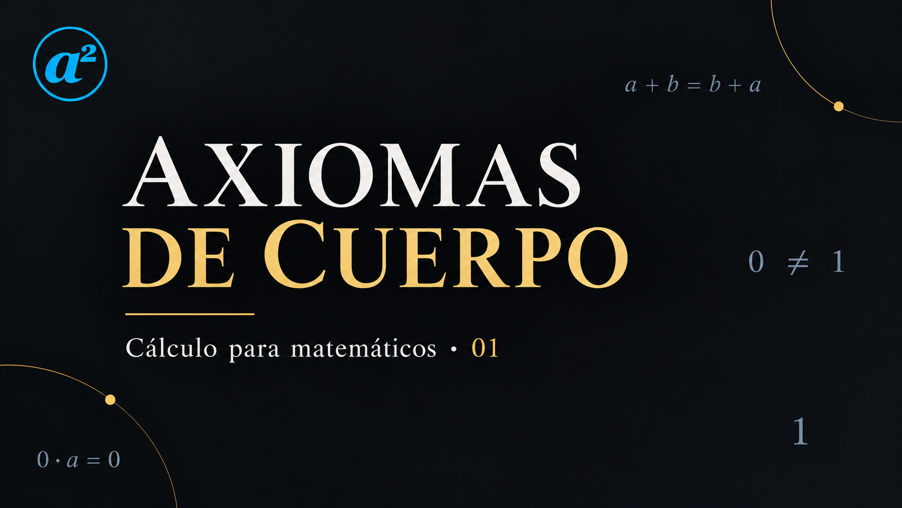
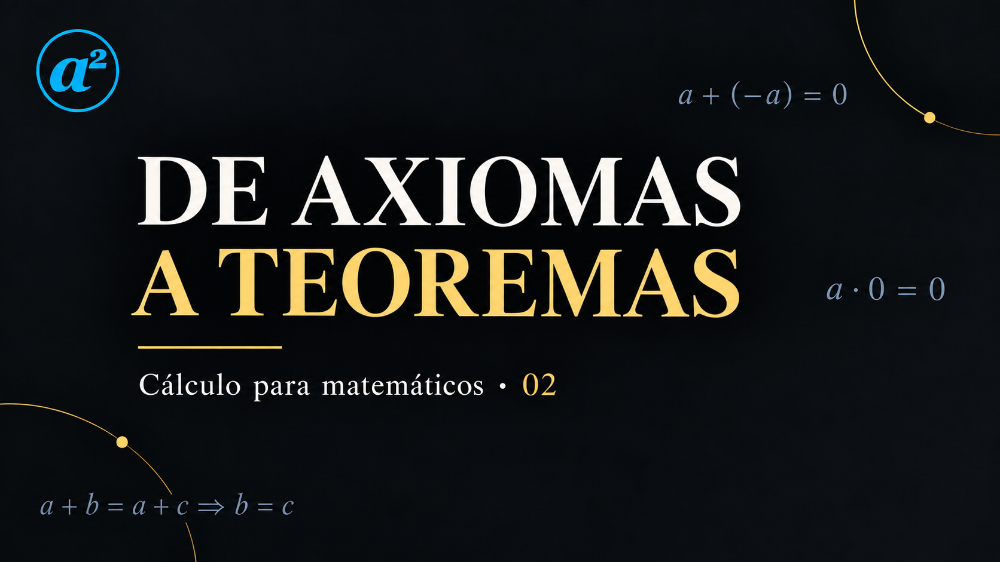

<a href="../../index.html">Matemática Abierta</a>→<a href="../index.html">Cursos</a>→Cálculo I

<h1>Cálculo para matemáticos</h1>

Un curso de cálculo de una variable construido desde sus fundamentos: <strong>axiomas, definiciones, teoremas, demostraciones y problemas</strong>, acompañados por animaciones que hacen visible la estructura matemática sin reemplazar el razonamiento.

Curso audiovisual · Cálculo I 2 clases publicadas

<a class="btn btn-primary" href="https://youtu.be/hzWhgY3R1Mc" target="_blank" rel="noopener noreferrer">Comenzar por la clase 01</a>
<a class="btn btn-outline-primary" href="../../libros/para-matematicos/calculo-para-matematicos.html">Abrir el libro base</a>

<nav class="ma-section-jump" aria-label="Accesos rápidos">
<a href="#clases">Ver las clases</a>
<a href="#presentacion">Presentación</a>
<a href="#recorrido">Recorrido</a>

<a href="#libro-base">Libro base</a>
<a href="#como-estudiar">Cómo estudiar</a>
</nav>

<section class="ma-section" id="clases">

<h2>Las clases</h2>

Sigue el recorrido en orden. Cada clase retoma las definiciones y los resultados de la anterior.

<article class="ma-lesson-card" id="clase-01">
<a class="ma-lesson-cover" href="https://youtu.be/hzWhgY3R1Mc" target="_blank" rel="noopener noreferrer" aria-label="Ver clase 01: Los axiomas de cuerpo">
13:41
</a>

Clase 01 · Los fundamentos

<h3>Los axiomas de cuerpo</h3>

De la aritmética familiar a las nueve leyes de suma y producto. Definimos qué es un cuerpo y comparamos los sistemas numéricos.

AxiomasEjemplos de cuerpos

<a class="btn btn-outline-primary" href="https://youtu.be/hzWhgY3R1Mc" target="_blank" rel="noopener noreferrer">Ver clase 01 ↗</a>

Reproducir aquí

<iframe loading="lazy" src="https://www.youtube-nocookie.com/embed/hzWhgY3R1Mc" title="Clase 01: Los axiomas de cuerpo" allow="accelerometer; autoplay; clipboard-write; encrypted-media; gyroscope; picture-in-picture; web-share" referrerpolicy="strict-origin-when-cross-origin" allowfullscreen></iframe>

</article>
<article class="ma-lesson-card" id="clase-02">
<a class="ma-lesson-cover" href="https://youtu.be/GyVTLGSK2N8" target="_blank" rel="noopener noreferrer" aria-label="Ver clase 02: Teoremas derivados de los axiomas de cuerpo">
34:31Última clase
</a>

Clase 02 · De axiomas a teoremas

<h3>Teoremas derivados de los axiomas de cuerpo</h3>

Demostramos la unicidad de neutros e inversos, el producto por cero y las leyes de cancelación, justificando cada paso a partir de los axiomas.

UnicidadProducto por ceroCancelación

<a class="btn btn-primary" href="https://youtu.be/GyVTLGSK2N8" target="_blank" rel="noopener noreferrer">Ver clase 02 ↗</a>

Reproducir aquí

<iframe loading="lazy" src="https://www.youtube-nocookie.com/embed/GyVTLGSK2N8" title="Clase 02: Teoremas derivados de los axiomas de cuerpo" allow="accelerometer; autoplay; clipboard-write; encrypted-media; gyroscope; picture-in-picture; web-share" referrerpolicy="strict-origin-when-cross-origin" allowfullscreen></iframe>

</article>

Para acompañar ambas clases: <a href="../../libros/capitulos/los-numeros-reales-orden-valor-absoluto-desigualdades-y-completitud.html">leer el capítulo sobre los números reales →</a>

<a class="btn btn-outline-primary" href="https://www.youtube.com/playlist?list=PLbRed7OVv4r0" target="_blank" rel="noopener noreferrer">Abrir la playlist completa ↗</a>

</section>

<h2>Construir el cálculo, no sólo aprender a usarlo</h2>

El curso parte de una pregunta elemental que suele quedar oculta detrás de las técnicas: <strong>¿qué propiedades estamos usando realmente cuando hacemos cálculo?</strong> Por eso el recorrido comienza antes de los límites y las derivadas, en la estructura de los números reales.

<article class="ma-card">

FundamentosCálculo I

<h3 class="ma-card-title">Axioma no es teorema</h3>

Separamos cuidadosamente lo que se supone de lo que debe demostrarse. Las reglas familiares de la aritmética aparecen como consecuencias de estructuras precisas.

</article>

<article class="ma-card">

DemostraciónCálculo I

<h3 class="ma-card-title">El razonamiento queda visible</h3>

Las demostraciones se desarrollan paso a paso, con sus hipótesis a la vista y sin ocultar los pasos que contienen la idea matemática central.

</article>

<article class="ma-card">

Vídeo + libroCálculo I

<h3 class="ma-card-title">Dos formatos, una misma matemática</h3>

El vídeo aporta voz, ritmo y visualización. El libro conserva el desarrollo extenso, las demostraciones completas, los ejercicios, las soluciones y las conexiones con el resto del proyecto.

</article>

<h2>Recorrido de Cálculo I</h2>

La serie audiovisual sigue el <strong>Tomo I de <em>Cálculo para matemáticos</em></strong>. El recorrido completo abarca veinte capítulos, desde los números reales hasta aplicaciones de la integral y ecuaciones diferenciales elementales.

1<strong>Estructura de los números reales</strong>
Cuerpo, consecuencias algebraicas, orden, desigualdades, valor absoluto y completitud.

2<strong>Límites y continuidad</strong>
Sucesiones, límites de funciones, continuidad, compacidad y los primeros teoremas globales del análisis.

3<strong>Cálculo diferencial</strong>
Derivada, aproximación lineal, regla de la cadena, funciones elementales, valor medio, Taylor, Newton y optimización.

4<strong>Integral y síntesis</strong>
Integral de Riemann, teorema fundamental del cálculo, técnicas y aplicaciones de integración y ecuaciones diferenciales elementales.

<h2>Libro base</h2>

El curso audiovisual nace del libro abierto <em>Cálculo para matemáticos</em>. El vídeo no reemplaza al texto: lo introduce, lo organiza visualmente y abre una ruta de lectura.

<article class="ma-card">

20 capítulos800 ejercicios con soluciones

<h3 class="ma-card-title"><a class="ma-card-link" href="../../libros/para-matematicos/calculo-para-matematicos.html">Cálculo para matemáticos — Tomo I</a></h3>

Fundamentos del cálculo de una variable, desde la estructura de los números reales hasta aplicaciones de la integral y ecuaciones diferenciales elementales.

<a class="ma-card-arrow" href="../../libros/para-matematicos/calculo-para-matematicos.html">Abrir el libro →</a>
</article>

<article class="ma-card">

Capítulo 1Base de las primeras clases

<h3 class="ma-card-title"><a class="ma-card-link" href="../../libros/capitulos/los-numeros-reales-orden-valor-absoluto-desigualdades-y-completitud.html">Los números reales: axiomas de cuerpo, orden y completitud</a></h3>

La primera unidad del curso audiovisual desarrolla progresivamente la estructura algebraica, el orden y la completitud que sostienen el análisis sobre \(\mathbb R\).

<a class="ma-card-arrow" href="../../libros/capitulos/los-numeros-reales-orden-valor-absoluto-desigualdades-y-completitud.html">Leer el capítulo →</a>
</article>

<h2>Cómo estudiar con el curso</h2>

La secuencia está pensada para que vídeo, lectura y trabajo propio se refuercen entre sí.

1<strong>Ver la clase</strong>
Usa el vídeo para obtener la arquitectura conceptual del tema y seguir el desarrollo visual de las ideas.

2<strong>Reconstruir</strong>
Vuelve sobre definiciones y demostraciones con lápiz y papel. No leas una prueba pasivamente: intenta anticipar el siguiente paso.

3<strong>Leer el capítulo</strong>
Profundiza en los ejemplos, las demostraciones y los resultados del tema.

4<strong>Resolver problemas</strong>
Trabaja los ejercicios antes de consultar las soluciones y usa los errores como diagnóstico de las hipótesis que todavía no controlas.

