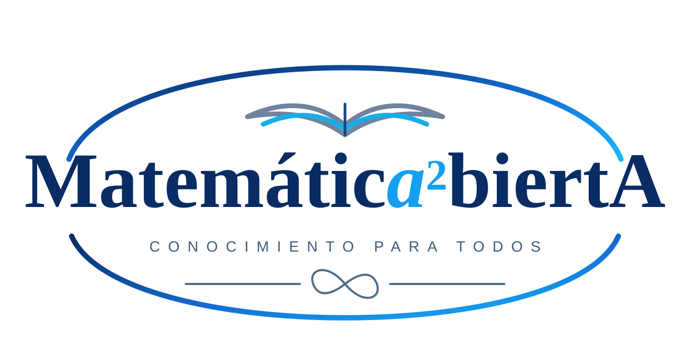

  
  

# Matemáticas para comprender, demostrar y resolver

**Matemática Abierta** es un proyecto público de estudio, escritura y enseñanza de las matemáticas en español. Su propósito no es reunir fórmulas aisladas ni ofrecer una enciclopedia de resultados sin contexto, sino construir recursos que permitan avanzar desde una pregunta matemática hasta su comprensión, su demostración y su uso efectivo en problemas.

La idea central puede resumirse así:

$$
\boxed{
\text{conceptos}
\longleftrightarrow
\text{resultados}
\longleftrightarrow
\text{métodos}
\longleftrightarrow
\text{problemas}
}
$$

Estas piezas se organizan después en **rutas de estudio, cursos y libros abiertos**.

## Qué encontrarás

### Teoría que explica de dónde salen las cosas

En [**Conceptos**](conceptos/index.qmd) desarrollamos definiciones, ideas y construcciones matemáticas de manera autocontenida. No queremos utilizar una propiedad sólo porque resulte familiar: buscamos identificar sus hipótesis, entender por qué es verdadera y saber con qué otras ideas se relaciona.

En [**Resultados y teoremas**](teoria/resultados/index.qmd) reunimos los resultados que estructuran el desarrollo: proposiciones, teoremas, corolarios y principios que reaparecen a lo largo de distintas áreas.

Los [**Mapas y conexiones**](teoria/mapas/index.qmd) muestran cómo se encadenan esas ideas. Por ejemplo, en el primer recorrido de análisis aparecen relaciones como

$$
\text{funciones}
\to
\text{límites}
\to
\text{continuidad}
\to
\text{completitud}
\to
\text{compacidad}
\to
\text{control global}.
$$

### Métodos y técnicas reutilizables

Saber un teorema no es todavía saber resolver un problema. Por eso [**Métodos y técnicas**](teoria/metodos/index.qmd) constituye una capa propia del proyecto.

Allí se reúnen procedimientos que pueden aprenderse una vez y reutilizarse muchas veces: análisis de signos, factorización, completación de cuadrados, estimaciones, inducción, técnicas de demostración, control de dominios, construcción de argumentos $\varepsilon$--$\delta$ y otras estrategias de resolución.

La pregunta característica de esta sección no es solamente

> ¿qué es verdadero?,

sino también

> **¿cómo puedo reconocer qué hacer ante este tipo de problema?**

### Problemas con solución completa

La sección de [**Problemas**](problemas/index.qmd) desarrolla ejercicios y problemas matemáticos con una exigencia editorial clara: un problema publicado como resuelto debe tener una solución completa y verificable.

Los problemas pueden explorarse [por área](problemas/por-area/index.qmd), [por dificultad](problemas/por-dificultad/index.qmd), [por técnica](problemas/por-tecnica/index.qmd) o por [colecciones](problemas/colecciones/index.qmd). Esto permite estudiar no sólo una materia, sino también entrenar una herramienta determinada en contextos diferentes.

En las soluciones procuramos hacer visibles:

- la estrategia antes de las cuentas;
- las hipótesis y restricciones de dominio;
- los pasos algebraicos que suelen ocultarse;
- las comprobaciones necesarias;
- los errores frecuentes;
- y la técnica general que puede extraerse del problema particular.

### Cursos y rutas de estudio

Los [**Cursos**](cursos/index.qmd) y las [**Rutas de estudio**](cursos/rutas/index.qmd) organizan el material para quien no quiere explorar piezas aisladas, sino seguir una progresión matemática coherente.

Una misma página conceptual o un mismo problema puede aparecer en varias rutas sin necesidad de duplicar el contenido. De ese modo, Matemática Abierta funciona como una red de recursos conectados y no como una sucesión rígida de capítulos independientes.

### Libros abiertos en construcción

La sección de [**Libros**](libros/index.qmd) reúne obras que pueden publicarse de manera progresiva: un capítulo puede aparecer cuando está editorialmente listo sin esperar a que el volumen completo haya terminado.

La colección [**Para matemáticos**](libros/para-matematicos/index.qmd) está pensada para recorridos sistemáticos y rigurosos en distintas áreas. Entre sus desarrollos se encuentra **Cálculo para matemáticos**, concebido como un estudio del cálculo que incorpora desde el comienzo lenguaje de demostración, estructura de los números reales, problemas, métodos y conexiones con el análisis.

## Una forma de estudiar matemáticas

El proyecto intenta mantener un mismo ciclo pedagógico en todos sus niveles:

$$
\boxed{
\begin{array}{c}
\text{pregunta}\\
\downarrow\\
\text{concepto}\\
\downarrow\\
\text{ejemplo y contraejemplo}\\
\downarrow\\
\text{teorema y demostración}\\
\downarrow\\
\text{método o técnica}\\
\downarrow\\
\text{ejercicios y problemas}\\
\downarrow\\
\text{conexiones y nuevas preguntas}
\end{array}}
$$

Esto significa que una regla como

$$
xy=0
\quad\Longrightarrow\quad
x=0\ \text{o}\ y=0
$$

no interesa solamente como una instrucción para resolver ecuaciones. También interesa saber **de qué estructura algebraica se deduce**, cómo se demuestra, cuándo puede utilizarse y en qué problemas vuelve a aparecer.

## Rigor sin compresión innecesaria

Matemática Abierta busca combinar dos exigencias que a veces se separan artificialmente:

- **rigor:** definiciones precisas, hipótesis explícitas, demostraciones cerradas y control de errores;
- **explicación:** intuición, motivación, desarrollo paso a paso y reconstrucción de las decisiones matemáticas importantes.

Una demostración rigurosa no necesita ser opaca. Una explicación accesible no necesita sacrificar precisión.

## Un proyecto abierto y progresivo

El contenido se construye de manera incremental. El estudio privado de libros, cursos y colecciones de problemas sirve como laboratorio de comprensión; el material público, en cambio, se redacta y organiza editorialmente como contenido propio, con atención a la procedencia y a los derechos de las fuentes.

Puedes consultar la [**política editorial**](proyecto/politica-editorial.qmd), la página de [**procedencia y derechos**](proyecto/procedencia-y-derechos.qmd), la [**licencia**](licencia.qmd) y el [**estado y hoja de ruta**](proyecto/estado-y-hoja-de-ruta.qmd) del proyecto.

## Por dónde empezar

Si quieres **estudiar teoría**, comienza por [Conceptos](conceptos/index.qmd) o por los [Mapas y conexiones](teoria/mapas/index.qmd).

Si quieres **aprender a resolver**, visita [Métodos y técnicas](teoria/metodos/index.qmd) y después [Problemas por técnica](problemas/por-tecnica/index.qmd).

Si prefieres **seguir un recorrido**, entra en [Cursos](cursos/index.qmd) o en [Libros](libros/index.qmd).

Y si simplemente quieres recorrer lo que ya existe por área o tema, utiliza [Explorar](explorar/index.qmd).
