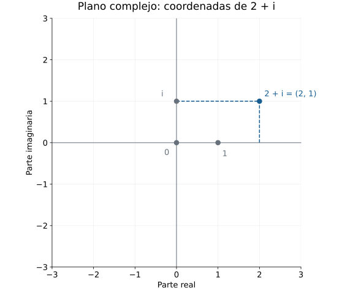
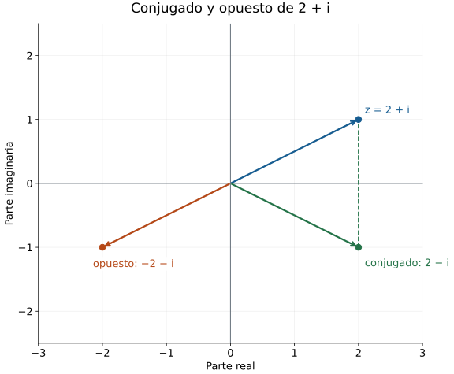
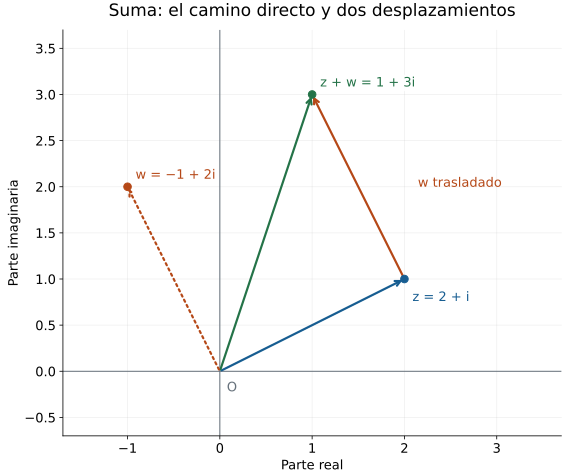
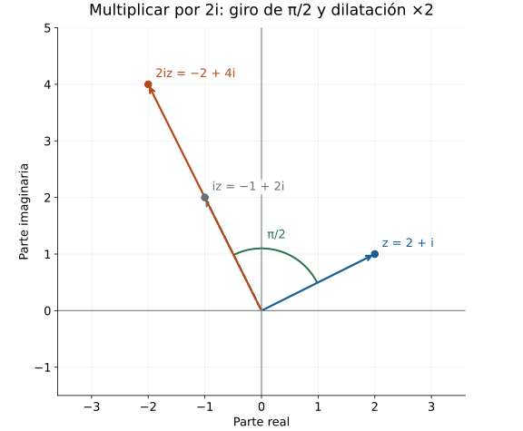
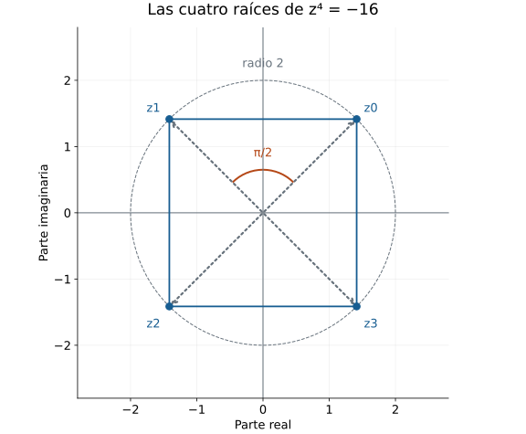

---
{
  "title": "Números complejos y el horizonte de las ecuaciones",
  "description": "Capítulo 26 del Tomo I de Álgebra para matemáticos, con 92 ejercicios y soluciones desarrolladas.",
  "content-id": "MA-BCH-0201",
  "content-type": "book-chapter",
  "collection": "PM-ALG",
  "book-id": "MA-BOK-0006",
  "source-id": "APM-T1-C26",
  "editorial-id": "MA-BCH-APM-01-022",
  "status": "published",
  "date-created": "2026-10-09",
  "date-modified": "2026-10-09",
  "areas": [
    "algebra",
    "fundamentos"
  ],
  "level": "fundamental",
  "topics": [
    "numeros-complejos-y-el-horizonte-de-las-ecuaciones"
  ],
  "prerequisites": [
    "MA-BCH-0200"
  ],
  "related": [
    "MA-BOK-0006"
  ],
  "provenance": {
    "type": "original",
    "sources": []
  },
  "license": "GFDL-1.3-or-later"
}
---

Una ecuación puede tener raíces en un sistema numérico y carecer de ellas en otro. En el capítulo anterior, $x^2-2$ mostró esa diferencia entre los racionales y los reales. Para estudiar ecuaciones como $x^2+1=0$ necesitamos examinar qué operaciones queremos conservar al ampliar el conjunto de números. Esa exigencia orientará la construcción de los complejos.

## 26.1. Extender el dominio de una ecuación {#apm-c26-s01}

### La misma expresión en distintos conjuntos

La ecuación $2x=1$ tiene una única solución racional, $x=1/2$, porque dividir por $2$ es una transformación reversible en $\mathbb Q$. En los enteros carece de solución: para todo entero $x$, el número $2x$ es par, mientras que $1$ es impar. La comprobación $2(1/2)=1$ sigue siendo válida en $\mathbb R$, donde $1/2$ conserva sus operaciones habituales.

Este ejemplo distingue dos decisiones que intervienen al resolver una ecuación. Primero se fija el conjunto en el que puede variar la incógnita; después se utilizan las operaciones y propiedades válidas en ese conjunto. Si el problema exige una solución entera, presentar $1/2$ cambia el problema. Si permite una solución racional, la misma fracción lo resuelve.

Para registrar esa diferencia, sea $P$ un polinomio cuyos coeficientes pueden interpretarse en un sistema numérico $D$. Su **conjunto de soluciones en $D$** es $S_D(P)=\{a\in D:P(a)=0\}$. La evaluación se efectúa con las operaciones de $D$. Así, para $P(x)=2x-1$, tenemos $S_{\mathbb Z}(P)=\varnothing$ y $S_{\mathbb Q}(P)=S_{\mathbb R}(P)=\{1/2\}$.

La notación separa el polinomio del lugar donde buscamos sus raíces. Un polinomio de coeficientes enteros puede evaluarse en racionales o reales, porque allí esos coeficientes siguen representando los mismos números. En C24 se construyeron los polinomios como objetos determinados por sus coeficientes; cambiar el conjunto de evaluación no cambia por sí solo esa lista.

### Qué se conserva al ampliar el sistema

La ecuación $x^2=2$ exige una ampliación diferente. En $\mathbb R$ sus soluciones son $\sqrt{2}$ y $-\sqrt{2}$, y ambas son irracionales, como se justificó en [§25.1](algebra-para-matematicos-capitulo-25-raices-factores-e-irreducibilidad-elemental.md#apm-c25-s01). La factorización $x^2-2=(x-\sqrt{2})(x+\sqrt{2})$ certifica que son todas las soluciones reales: un producto de dos reales es cero sólo si uno de sus factores lo es. Por tanto, $S_{\mathbb Q}(x^2-2)=\varnothing$ y $S_{\mathbb R}(x^2-2)=\{-\sqrt{2},\sqrt{2}\}$.

La comparación se organiza en la siguiente tabla. Cada fila mantiene la ecuación y cambia únicamente el conjunto de búsqueda.

| Ecuación | Soluciones en $\mathbb Z$ | Soluciones en $\mathbb Q$ | Soluciones en $\mathbb R$ |
|---|---|---|---|
| $2x=1$ | $\varnothing$ | $\{1/2\}$ | $\{1/2\}$ |
| $x^2=2$ | $\varnothing$ | $\varnothing$ | $\{-\sqrt{2},\sqrt{2}\}$ |
| $x^2=4$ | $\{-2,2\}$ | $\{-2,2\}$ | $\{-2,2\}$ |
| $x^2=-1$ | $\varnothing$ | $\varnothing$ | $\varnothing$ |

La tercera fila impide interpretar una ampliación como una máquina que necesariamente añade raíces a cada ecuación. La cuarta exige un argumento distinto del que excluyó las raíces racionales de $x^2=2$: para cualquier real $x$, se cumple $x^2\ge0$, de modo que $x^2=-1$ es imposible en $\mathbb R$.

Las soluciones antiguas se conservarán cuando los números y sus operaciones se conserven. Podemos expresar ese mecanismo sin depender de un ejemplo particular.

**Proposición.** Sean $D\subseteq E$ dos sistemas numéricos tales que la suma y el producto de elementos de $D$ efectuados en $E$ coincidan con sus operaciones en $D$, y que ambos sistemas compartan los mismos cero y uno. Si $P$ tiene coeficientes en $D$, entonces $S_D(P)=S_E(P)\cap D$. En particular, $S_D(P)\subseteq S_E(P)$.

**Demostración.** Para un elemento $a\in D$, cada potencia de $a$ y cada producto de esa potencia por un coeficiente de $P$ dan el mismo resultado en ambos sistemas. Lo mismo ocurre al sumar los términos. En consecuencia, la evaluación de $P$ en $a$ coincide en $D$ y en $E$, y es cero en uno de ellos si y sólo si es cero en el otro.

Así, pertenecer a $S_D(P)$ equivale a pertenecer a $D$ y a $S_E(P)$ a la vez. Esa equivalencia demuestra la igualdad con la intersección; de ella se deduce la inclusión. $\square$

La hipótesis sobre las operaciones permite conservar toda la evaluación, paso a paso. La pertenencia $D\subseteq E$ aislada no describe cómo se opera. Para construir una ampliación algebraica debemos especificar ambas cosas.

**Control 26.1.a — Lectura de la inclusión.** Si una ecuación polinomial con coeficientes racionales carece de soluciones reales, ¿puede tener una solución racional? Si carece de soluciones racionales, ¿puede tener una solución real? Justifica ambas respuestas.

**Solución.** Toda raíz racional sería también real por la inclusión demostrada para $\mathbb Q\subseteq\mathbb R$. Por eso la ausencia de raíces reales excluye las racionales. La segunda posibilidad sí ocurre: $x^2=2$ tiene las dos raíces reales indicadas y ninguna racional. La inclusión transmite una solución hacia el conjunto mayor; no obliga a que una raíz del conjunto mayor pertenezca al menor.

### La necesidad de un número cuyo cuadrado sea negativo

Para resolver $x^2+1=0$ fuera de $\mathbb R$, el nuevo sistema deberá contener un elemento cuyo cuadrado sea $-1$. La letra $i$ servirá para nombrarlo. La condición $i^2=-1$ expresa lo que queremos conseguir; todavía falta construir un conjunto, definir sus operaciones y verificar que esa condición sea compatible con las leyes algebraicas que necesitamos.

En particular, $i$ deberá ser distinto de todos los reales. Si fuera un real, su cuadrado sería no negativo y no podría valer $-1$. Deberemos conservar las igualdades reales como $(-1)(-1)=1$, aunque ya no podremos aplicar a todos los elementos nuevos el argumento real «todo cuadrado es no negativo».

Podemos anticipar una consecuencia con su dependencia explícita. **Si** se construye un sistema que contiene a $\mathbb R$, conserva sus operaciones, cumple las leyes habituales de suma y producto y tiene $i^2=-1$, entonces $i$ y $-i$ serán dos soluciones distintas de $x^2+1=0$. En efecto, $i^2+1=-1+1=0$ y $(-i)^2=i^2=-1$. Además, si $i=-i$, al sumar $i$ y multiplicar por el inverso real de $2$ resultaría $i=0$, lo cual contradice $i^2=-1$ y $0^2=0$.

La afirmación anterior es condicional. Las secciones siguientes construirán el sistema y probarán sus leyes. Tampoco hemos demostrado aquí que esas dos soluciones sean las únicas en el sistema nuevo: ese paso necesitará una propiedad del producto que aún debe verificarse.

**Control 26.1.b — Dos tareas diferentes.** Un estudiante propone: «Escribo $i^2=-1$; por tanto, ya existe un nuevo sistema numérico y cualquier polinomio tiene una raíz en él». Localiza las dos conclusiones que su argumento no justifica.

**Solución.** La igualdad propuesta fija una condición para un elemento, pero no especifica cuáles son los demás elementos, cómo se suman o multiplican ni si las operaciones satisfacen las leyes requeridas. La existencia del sistema necesita una construcción y verificaciones. Incluso después de construirlo y comprobar que $i$ resuelve $x^2+1=0$, esa evaluación sólo certifica una raíz de ese polinomio. Una afirmación sobre todos los polinomios no constantes exige un resultado general. El teorema fundamental del álgebra, cuyo estatuto se precisará en [§26.15](algebra-para-matematicos-capitulo-26-numeros-complejos-y-el-horizonte-de-las-ecuaciones.md#apm-c26-s15), responde a esa cuestión para los complejos; la introducción de una letra no lo demuestra.

### Ampliar sin perder las restricciones

Conservar la suma y el producto permite transportar evaluaciones polinomiales. Cuando una expresión contiene cocientes, también hay que verificar que sus denominadores sean distintos de cero en cada candidato. La restricción forma parte del conjunto de soluciones y permanece al pasar a un sistema mayor.

**Control 26.1.c — Un candidato excluido.** Resuelve $(x^2-1)/(x-1)=0$ en $\mathbb Q$ y en $\mathbb R$. Explica por qué ampliar el conjunto de búsqueda no autoriza a incorporar $x=1$.

**Solución.** La expresión exige $x\ne1$. En ese dominio, $x^2-1=(x-1)(x+1)$ y la fracción es igual a $x+1$. La ecuación se reduce a $x+1=0$, cuya única solución es $x=-1$. El candidato cumple la restricción y la comprobación en la expresión original da $((-1)^2-1)/(-1-1)=0/(-2)=0$. En ambos conjuntos la respuesta es $\{-1\}$. El valor $x=1$ anula el denominador original, tanto en $\mathbb Q$ como en $\mathbb R$, y por eso queda excluido. La cancelación es válida precisamente en el dominio que ya habíamos restringido.

Hay obstáculos que ninguna ampliación con las mismas leyes resolverá. En cualquier sistema con las leyes usuales de suma y distributividad, $0\cdot a=0$: de $(0+0)a=0a+0a$ y $(0+0)a=0a$, cancelar $0a$ da esa igualdad. Si además $0\ne1$, la ecuación $0x=1$ carece de soluciones. Esta imposibilidad depende de las leyes que queremos conservar, no del tamaño del conjunto de números.

**Control 26.1.d — Alcance de la ampliación.** Compara los obstáculos de $x^2=-1$ y $0x=1$. ¿Cuál permite buscar una solución nueva conservando las leyes usuales de suma y producto y la distinción entre cero y uno?

**Solución.** Para $x^2=-1$, la imposibilidad real se obtuvo usando el orden de $\mathbb R$ y la no negatividad de sus cuadrados. Podemos intentar conservar las leyes de suma y producto en un sistema más amplio, sin exigir ese orden para todos sus elementos; la construcción pendiente verificará que el intento funciona. En cambio, para $0x=1$ las propias leyes de suma y distributividad obligan a que el lado izquierdo sea cero. Resolverla exigiría abandonar alguna de esas condiciones o identificar cero y uno.

La construcción que necesitamos debe alojar a los reales, conservar sus cálculos e incorporar un elemento con cuadrado $-1$. Los pares de números reales proporcionan un conjunto concreto donde definir esas operaciones; allí podrá comprobarse cada una de las exigencias.

## 26.2. Construcción mediante pares y forma cartesiana {#apm-c26-s02}

### Un conjunto donde alojar la nueva unidad

Un par ordenado $(a,b)$ de números reales permite conservar dos datos independientes. La igualdad de pares, recuperada de C7, se define coordenada por coordenada: $(a,b)=(c,d)$ si y sólo si $a=c$ y $b=d$. El conjunto $\mathbb R^2=\mathbb R\times\mathbb R$ ya está disponible; para convertirlo en el sistema numérico que buscamos necesitamos darle operaciones.

La primera coordenada servirá para representar los reales mediante los pares $(a,0)$. El par $(0,1)$ será el candidato a unidad imaginaria. Queremos que su cuadrado sea $(-1,0)$, y por eso el producto coordenada por coordenada no sirve: esa regla produciría $(0,1)(0,1)=(0,1)$.

La notación provisional $a+bi$ sugiere una regla distinta. Si la distributividad fuera válida y $i^2=-1$, el desarrollo de $(a+bi)(c+di)$ produciría una parte $ac-bd$ y otra parte $(ad+bc)i$. Este cálculo orienta la elección del producto. A continuación lo definiremos directamente sobre pares; las leyes del nuevo producto se probarán a partir de esa definición, sin usar el cálculo provisional como demostración.

**Definición.** El conjunto de los **números complejos** es $\mathbb C=\mathbb R^2$, dotado de la suma y el producto siguientes:
$$
(a,b)+(c,d)=(a+c,b+d),\qquad
(a,b)(c,d)=(ac-bd,ad+bc).
$$
Los cálculos del lado derecho son operaciones reales.

Ambas reglas producen un par de reales para cualquier elección de $a,b,c,d\in\mathbb R$; por tanto, la suma y el producto son operaciones internas en $\mathbb C$. La igualdad de complejos sigue siendo la igualdad de pares. Las operaciones no cambian qué significa que dos elementos sean iguales.

Por ejemplo, $(2,1)+(-3,4)=(-1,5)$ y $(2,1)(-3,4)=(-10,5)$, porque las coordenadas del producto son $2(-3)-1(4)=-10$ y $2(4)+1(-3)=5$. Los signos de las dos coordenadas se controlan con reglas reales conocidas. Todavía no necesitamos una fórmula de división compleja.

### Cómo se conservan los reales

Los reales se representan mediante la función $j:\mathbb R\to\mathbb C$ dada por $j(a)=(a,0)$. Esta representación es inyectiva: si $j(a)=j(c)$, la igualdad de pares obliga a que $a=c$. Así, dos reales distintos no se identifican al representarlos dentro de $\mathbb C$.

Además, para cualesquiera reales $a,c$, la definición de las operaciones da $j(a)+j(c)=(a+c,0)=j(a+c)$ y $j(a)j(c)=(ac,0)=j(ac)$. La suma y el producto de los representantes reproducen exactamente la suma y el producto reales. También $j(0)=(0,0)$ y $j(1)=(1,0)$.

Los dos últimos pares actúan como neutros para todos los complejos. Para $z=(a,b)$ se comprueba $z+(0,0)=(a,b)$ y $z(1,0)=(a,b)$; en el otro orden, $(0,0)+z=(a,b)$ y $(1,0)z=(a,b)$. El opuesto de $(a,b)$ es $(-a,-b)$, porque la suma de esos pares, en cualquiera de los dos órdenes, es $(0,0)$.

En adelante identificaremos el real $a$ con su representante $(a,0)$ y escribiremos $0$ y $1$ para los neutros correspondientes. Esta identificación abrevia una función que ya hemos comprobado; el par $(a,0)$ es el objeto de la construcción que representa a $a$. Cuando haga falta distinguir las dos capas, podremos volver a escribir $j(a)$.

### La unidad imaginaria y la forma cartesiana

**Definición.** La **unidad imaginaria** es el complejo $i=(0,1)$.

Su cuadrado se calcula con el producto que acabamos de definir: $i^2=(0,1)(0,1)=(-1,0)=-1$. Aquí la última igualdad usa la identificación de los reales. El objetivo que motivó la ampliación se cumple para un elemento concreto.

El complejo $i$ no representa ningún real. Si se tuviera $(0,1)=(a,0)$ para algún $a\in\mathbb R$, la segunda coordenada obligaría a que $1=0$ en $\mathbb R$, lo cual es falso. La construcción permite comprobar esa diferencia sin recurrir a un orden entre complejos.

Cada par puede escribirse utilizando los reales identificados y la unidad imaginaria. En efecto, para $b\in\mathbb R$ tenemos $bi=(b,0)(0,1)=(0,b)$, y de aquí $a+bi=(a,0)+(0,b)=(a,b)$. También $ib=(0,1)(b,0)=(0,b)$, por lo que estas dos escrituras del segundo término coinciden.

**Proposición.** Todo complejo se expresa de manera única como $a+bi$, con $a,b\in\mathbb R$.

**Demostración.** Si $z=(a,b)$, los cálculos anteriores muestran que $z=a+bi$, lo cual prueba la existencia de la expresión. Para la unicidad, supongamos $a+bi=c+di$, con $a,b,c,d$ reales. Al traducir ambas expresiones a pares resulta $(a,b)=(c,d)$; por igualdad de coordenadas, $a=c$ y $b=d$. $\square$

La expresión $a+bi$ se llama **forma cartesiana** de $z$. El número real $a$ es su **parte real**, escrita $\operatorname{Re}(z)$, y el número real $b$ es su **parte imaginaria**, escrita $\operatorname{Im}(z)$. Ambas partes son números reales. En particular, $\operatorname{Im}(2-3i)=-3$; el término $-3i$ es la parte imaginaria multiplicada por la unidad $i$.

La igualdad de complejos tiene ahora una forma que permitirá resolver ecuaciones: $z=w$ si y sólo si $\operatorname{Re}(z)=\operatorname{Re}(w)$ y $\operatorname{Im}(z)=\operatorname{Im}(w)$. La unicidad garantiza que esos dos datos no dependen de cómo hayamos escrito inicialmente la expresión.

**Control 26.2.a — Comparar las coordenadas.** Encuentra todos los reales $u,v$ tales que $(u+1)+(2v-3)i=4-5i$. Verifica el resultado.

**Solución.** Como los coeficientes de la unidad imaginaria y los términos restantes son reales, la igualdad equivale a $u+1=4$ y $2v-3=-5$. La primera ecuación da $u=3$ y la segunda da $v=-1$. Al sustituir resulta $(3+1)+(2(-1)-3)i=4-5i$. Las dos ecuaciones reales tienen solución única, así que no existen otros pares reales $u,v$ que cumplan la igualdad. La hipótesis de que las incógnitas son reales permite usarlas como coordenadas cartesianas.

### Operar desde la definición

Las reglas de pares se traducen a la forma cartesiana sin una nueva elección de operaciones: $(a+bi)+(c+di)=(a+c)+(b+d)i$ y $(a+bi)(c+di)=(ac-bd)+(ad+bc)i$. Su justificación es la definición de suma y producto y la correspondencia $(a,b)=a+bi$ ya probada. La verificación de asociatividad, distributividad e inversos se desarrollará en [§26.3](algebra-para-matematicos-capitulo-26-numeros-complejos-y-el-horizonte-de-las-ecuaciones.md#apm-c26-s03).

Por ejemplo, $(2+i)(-3+4i)=-10+5i$, según el cálculo de pares anterior. Al multiplicar sólo reales, $b=d=0$ y la fórmula se reduce a $ac$; cuando ambos factores tienen una componente imaginaria, aparece el término real $-bd$. Éste es el cambio que hace posible $i^2=-1$.

**Control 26.2.b — Diagnóstico de un producto.** Un estudiante propone $(a,b)(c,d)=(ac,bd)$ y afirma que esa operación también cumple el objetivo de la construcción. Comprueba su afirmación usando $i=(0,1)$ y el representante de $1$.

**Solución.** Con la operación propuesta se obtiene $(0,1)(0,1)=(0,1)$, de modo que el cuadrado de $i$ sería $i$ en vez de $(-1,0)$. Además, $(a,b)(1,0)=(a,0)$: para $b\ne0$ ese resultado es distinto de $(a,b)$, y el representante de $1$ dejaría de ser neutro para todos los pares. La propuesta falla en dos exigencias concretas. Con nuestro producto, en cambio, $i^2=(-1,0)$ y $(a,b)(1,0)=(a,b)$, como ya se verificó.

Podemos determinar las soluciones de la ecuación que inició la ampliación usando sólo coordenadas reales.

**Control 26.2.c — Todas las soluciones de $z^2=-1$.** Resuelve la ecuación en $\mathbb C$ a partir de la definición del producto, sin usar una regla de factorización compleja todavía no demostrada.

**Solución.** Escribe $z=(a,b)$, con $a,b\in\mathbb R$. La ecuación equivale a $(a^2-b^2,2ab)=(-1,0)$, y por tanto a $a^2-b^2=-1$ y $2ab=0$. La segunda igualdad es real; como $2\ne0$, implica $ab=0$. En $\mathbb R$ esto obliga a $a=0$ o $b=0$.

Si $b=0$, la primera igualdad exigiría $a^2=-1$, imposible para un real. Si $a=0$, resulta $b^2=1$, cuyas soluciones reales son $b=1$ y $b=-1$. Los únicos candidatos complejos son, por tanto, $(0,1)=i$ y $(0,-1)=-i$. Sus cuadrados son $(-1,0)$ por la fórmula del producto, y sus segundas coordenadas son distintas. Hemos comprobado que ambos resuelven la ecuación y que todo complejo que la resuelva pertenece a esa lista.

El paso de un producto nulo a una alternativa se efectuó entre los números reales $a,b$. La solución no presupuso esa propiedad para productos de complejos.

### Coordenadas y representación en el plano

La identificación $\mathbb C=\mathbb R^2$ permite representar $a+bi$ mediante el punto de coordenadas $(a,b)$. El eje horizontal se llama **eje real** y el vertical **eje imaginario**. La palabra «imaginario» nombra una coordenada y una unidad algebraica precisas; el punto $(0,1)$ está tan determinado como cualquier otro par.

| Complejo | Par | Parte real | Parte imaginaria |
|---|---|---|---|
| $3$ | $(3,0)$ | $3$ | $0$ |
| $-2i$ | $(0,-2)$ | $0$ | $-2$ |
| $1+i$ | $(1,1)$ | $1$ | $1$ |
| $0$ | $(0,0)$ | $0$ | $0$ |

Un complejo representa un real si y sólo si su parte imaginaria es cero, porque los representantes reales son exactamente los pares $(a,0)$. Llamaremos **imaginario puro** a un complejo $bi$ con $b\in\mathbb R$ y $b\ne0$. Con esta convención, el cero es real y no es imaginario puro, aunque pertenece a ambos ejes como punto del plano.

**Figura 26.1.** El punto $2+i$ tiene coordenadas $(2,1)$. Las líneas discontinuas permiten leer cada componente sobre su eje. La unidad de longitud es la misma en ambos ejes; la coordenada vertical es el real $1$, mientras que el punto del eje vertical se escribe $i$.

**Control 26.2.d — Parte imaginaria y pertenencia.** Para $z=5-2i$, ¿cuáles son $\operatorname{Re}(z)$ y $\operatorname{Im}(z)$? ¿Es $z$ un imaginario puro? Explica también si un número real pertenece a $\mathbb C$ bajo la identificación adoptada.

**Solución.** La forma cartesiana da $\operatorname{Re}(z)=5$ y $\operatorname{Im}(z)=-2$. La parte imaginaria es el real $-2$, y no el complejo $-2i$. Como la parte real de $z$ es distinta de cero, $z$ no es imaginario puro; como su parte imaginaria es distinta de cero, tampoco representa un real. Todo real $r$ sí se representa en $\mathbb C$ mediante $(r,0)=r+0i$. Por eso «real» y «complejo» no designan aquí dos clases excluyentes: los reales están incluidos mediante esa representación.

El conjunto, las operaciones y la igualdad ya están definidos. La siguiente comprobación consistirá en demostrar que esas operaciones satisfacen las leyes necesarias para calcular con varios factores y dividir por un complejo no nulo.

## 26.3. Leyes algebraicas y división legítima {#apm-c26-s03}

Las operaciones de [§26.2](algebra-para-matematicos-capitulo-26-numeros-complejos-y-el-horizonte-de-las-ecuaciones.md#apm-c26-s02) están definidas para todos los pares de reales. Para transformar expresiones con varios complejos necesitamos saber, además, qué leyes cumplen. Por ejemplo, escribir $z(uw)=(zu)w$ permite cambiar una agrupación; cancelar un factor requiere una justificación diferente. Probaremos primero las leyes del cálculo y después construiremos el inverso de cada complejo no nulo.

### Las leyes se comprueban en las coordenadas reales

**Proposición.** Para cualesquiera $z,u,w\in\mathbb C$, la suma y el producto son conmutativos y asociativos, y el producto distribuye sobre la suma:
$$
\begin{gathered}
z+u=u+z,\qquad zu=uz,\\
(z+u)+w=z+(u+w),\qquad (zu)w=z(uw),\\
z(u+w)=zu+zw.
\end{gathered}
$$
También $(u+w)z=uz+wz$.

**Demostración.** Escribamos $z=(a,b)$, $u=(c,d)$ y $w=(e,f)$, con todas las coordenadas reales. La suma de los dos primeros pares es $(a+c,b+d)$. La conmutatividad real de cada coordenada muestra que coincide con $(c+a,d+b)=u+z$.

Para el producto, $zu=(ac-bd,ad+bc)$ y $uz=(ca-db,cb+da)$. La conmutatividad de los productos reales y de la suma real hace iguales las coordenadas correspondientes, por lo que $zu=uz$.

La asociatividad de la suma se obtiene comparando $((a+c)+e,(b+d)+f)$ con $(a+(c+e),b+(d+f))$. Cada igualdad de coordenadas es una instancia de la asociatividad real.

La asociatividad del producto exige desarrollar ambas agrupaciones. Con la definición de multiplicación de pares se obtiene:
$$
\begin{aligned}
(zu)w
 &=\bigl((ac-bd)e-(ad+bc)f,\ (ac-bd)f+(ad+bc)e\bigr)\\
 &=\bigl(ace-bde-adf-bcf,\ acf-bdf+ade+bce\bigr),\\
z(uw)
 &=\bigl(a(ce-df)-b(cf+de),\ a(cf+de)+b(ce-df)\bigr)\\
 &=\bigl(ace-adf-bcf-bde,\ acf+ade+bce-bdf\bigr).
\end{aligned}
$$
Las expresiones de cada coordenada tienen los mismos términos. Reordenarlos mediante las leyes reales demuestra la igualdad de los pares. En estos desarrollos, un producto como $ace$ es un producto de números reales, cuya agrupación ya puede omitirse.

Para la distributividad, $u+w=(c+e,d+f)$, y por tanto
$$
\begin{aligned}
z(u+w)
 &=\bigl(a(c+e)-b(d+f),\ a(d+f)+b(c+e)\bigr)\\
 &=\bigl(ac-bd+ae-bf,\ ad+bc+af+be\bigr)\\
 &=zu+zw.
\end{aligned}
$$
La última igualdad utiliza la definición de suma de pares. Finalmente, la conmutatividad del producto ya demostrada permite escribir $(u+w)z=z(u+w)=zu+zw=uz+wz$. $\square$

Los neutros $0=(0,0)$ y $1=(1,0)$, y el opuesto $-z=(-a,-b)$, se verificaron en [§26.2](algebra-para-matematicos-capitulo-26-numeros-complejos-y-el-horizonte-de-las-ecuaciones.md#apm-c26-s02). La igualdad $0\ne1$ se sigue de sus primeras coordenadas. Con estas propiedades podemos sumar un opuesto a ambos miembros de una igualdad y reagrupar: de $z+u=z+w$ resulta $u=w$. Ésta es la cancelación aditiva.

La resta $z-u$ significa $z+(-u)$. La distributividad justifica las expansiones en forma cartesiana que motivaron la construcción. También $z0=0$ para todo complejo: el cálculo directo $(a,b)(0,0)=(0,0)$ lo comprueba sin ninguna división.

**Control 26.3.a — Qué ley autoriza una transformación.** Un estudiante escribe $z(uw)=(zu)w$ y dice que ha usado la conmutatividad. Identifica la ley pertinente y explica cómo obtener $z(uw)=u(zw)$.

**Solución.** En la primera igualdad sólo cambia la agrupación de los factores; la ley pertinente es la asociatividad. Para la segunda transformación podemos escribir $z(uw)=(zu)w=(uz)w=u(zw)$. La primera y la tercera igualdades usan asociatividad, y la segunda usa conmutatividad para intercambiar $z$ y $u$. Distinguir esas funciones permite justificar cada paso incluso cuando una expresión contiene varios factores.

### Construir el inverso sin dividir por un complejo

Sea $z=(a,b)\ne0$. La condición $z\ne(0,0)$ significa que al menos una coordenada es distinta de cero. Como $a,b$ son reales, sus cuadrados son no negativos y al menos uno es positivo; de ahí $a^2+b^2>0$.

Ese número real proporciona un denominador legítimo. El par $(a,-b)$ tiene la propiedad $z(a,-b)=(a^2+b^2,0)$, porque la segunda coordenada es $-ab+ba=0$. Al dividir sus coordenadas por $a^2+b^2$ obtenemos un candidato a inverso.

**Proposición.** Todo complejo $z=a+bi\ne0$ tiene un único inverso multiplicativo, dado por
$$
z^{-1}=
\left(\frac{a}{a^2+b^2},-\frac{b}{a^2+b^2}\right)
=\frac{a}{a^2+b^2}-\frac{b}{a^2+b^2}i.
$$

**Demostración.** El denominador es un real positivo por el argumento anterior, así que las dos coordenadas definen un complejo $v$. El producto de pares da $zv=(1,0)$: su primera coordenada es $(a^2+b^2)/(a^2+b^2)=1$ y la segunda es $(-ab+ba)/(a^2+b^2)=0$. Por conmutatividad, también $vz=1$.

Para la unicidad, si otro complejo $t$ cumple $zt=1$, entonces $t=1t=(vz)t=v(zt)=v1=v$. La reagrupación central utiliza la asociatividad que acabamos de probar. $\square$

El cero no tiene inverso, pues $0v=0$ para todo $v$ y $0\ne1$. El procedimiento anterior utiliza divisiones reales ya conocidas; construir un inverso complejo no ha requerido suponer de antemano que se pueda dividir por un complejo.

Si $z=a$ es un real no nulo, la fórmula se reduce a $(a/a^2,0)=(1/a,0)$. Por tanto, el inverso construido conserva también la división real.

Las propiedades verificadas —suma con neutro y opuestos, producto con neutro, conmutatividad, asociatividad, distributividad e inversos para los elementos no nulos— constituyen las leyes de un **cuerpo**. En este sentido $\mathbb C$ es un cuerpo. Esa palabra resume las propiedades probadas; cada cálculo posterior deberá usar la propiedad que corresponda.

### Definir y comprobar un cociente

Para $u,z\in\mathbb C$ con $z\ne0$, definimos el **cociente** $u/z=uz^{-1}$. Se trata de la única solución de $zt=u$. En efecto, $z(uz^{-1})=u(zz^{-1})=u$, por asociatividad y conmutatividad. Si $zt=u$, multiplicar por $z^{-1}$ y reagrupar da $t=z^{-1}u=uz^{-1}$.

**Control 26.3.b — División y comprobación original.** Calcula $(3+2i)/(1-i)$ y comprueba el resultado multiplicándolo por el denominador.

**Solución.** El denominador corresponde al par $(1,-1)$ y no es cero. Su inverso, por la fórmula anterior, es $\frac12+\frac12 i$. Multiplicar por el numerador da $(3+2i)(\frac12+\frac12 i)=\frac12+\frac52 i$: la parte real es $\frac32-1=\frac12$ y la parte imaginaria es $\frac32+1=\frac52$. Para comprobarlo, $(1-i)(\frac12+\frac52 i)=3+2i$, ya que las partes resultan $\frac12+\frac52=3$ y $\frac52-\frac12=2$. La comprobación reconstruye el numerador, como exige la definición del cociente.

Si $z=0$, la ecuación $zt=u$ no define un cociente: para $u\ne0$ no tiene solución y para $u=0$ la satisface todo $t$. En ninguno de esos casos determina una solución única. Por eso tampoco se define $0/0$.

### Cancelación y producto nulo

**Corolario.** Si $z\ne0$ y $zu=zw$, entonces $u=w$.

**Demostración.** Multiplicamos ambos miembros por $z^{-1}$. La asociatividad permite escribir $(z^{-1}z)u=(z^{-1}z)w$, es decir, $1u=1w$. Los neutros dan $u=w$. $\square$

La condición $z\ne0$ es indispensable. Con $z=0$, la igualdad $zu=zw$ se cumple para cualesquiera $u,w$, incluso si son distintos.

**Proposición.** Para $z,w\in\mathbb C$, se cumple $zw=0$ si y sólo si $z=0$ o $w=0$.

**Demostración.** Si uno de los factores es cero, el producto es cero por la propiedad ya comprobada. Recíprocamente, supongamos $zw=0$. Si $z=0$, la alternativa requerida se cumple. Si $z\ne0$, tenemos $zw=z0$ y podemos cancelar $z$ mediante el corolario: resulta $w=0$. Los dos casos cubren todas las posibilidades. $\square$

Esta proposición permite usar en $\mathbb C$ el método de resolver una ecuación factorizada por sus factores. La conservación de las leyes reales, por sí sola, no había demostrado aún esa propiedad para los elementos nuevos; el inverso es la herramienta que la justifica.

**Control 26.3.c — Una raíz perdida por cancelación.** Resuelve $z(z-1)=0$ en $\mathbb C$ y diagnostica el paso «cancelar $z$ para obtener $z-1=0$».

**Solución.** El producto nulo implica $z=0$ o $z-1=0$. En el segundo caso, sumar $1$ da $z=1$. Ambos candidatos verifican la ecuación: $0(0-1)=0$ y $1(1-1)=0$. El conjunto solución es $\{0,1\}$. Cancelar $z$ sólo es legítimo después de separar el caso $z=0$; si se cancela sin esa condición se elimina precisamente una solución. En el caso $z\ne0$, el miembro derecho puede escribirse $z0$ y la cancelación sí da $z-1=0$.

**Control 26.3.d — Coeficiente cero o no nulo.** Dados $\alpha,\beta\in\mathbb C$, clasifica todas las soluciones de $\alpha z=\beta$, incluyendo los casos en que algún dato sea cero.

**Solución.** Si $\alpha\ne0$, el inverso de $\alpha$ existe y la solución única es $z=\alpha^{-1}\beta$. La comprobación $\alpha(\alpha^{-1}\beta)=(\alpha\alpha^{-1})\beta=\beta$ prueba existencia; si hubiera otra solución, multiplicar por $\alpha^{-1}$ daría la misma expresión, lo cual prueba unicidad. Este caso incluye $\beta=0$, para el cual la solución es $z=0$.

Si $\alpha=0$, el miembro izquierdo es cero para todo $z$. Con $\beta\ne0$ no hay soluciones; con $\beta=0$ todos los complejos son soluciones. Separar el coeficiente cero antes de intentar dividir evita tanto una operación indefinida como una conclusión falsa de unicidad.

Ya podemos reagrupar, desarrollar productos y resolver ecuaciones mediante transformaciones reversibles con sus condiciones expresas. En [§26.4](algebra-para-matematicos-capitulo-26-numeros-complejos-y-el-horizonte-de-las-ecuaciones.md#apm-c26-s04) estas leyes servirán para elegir entre cálculo cartesiano, comparación de partes y simplificación antes de efectuar operaciones largas.

## 26.4. Cálculo cartesiano y ecuaciones {#apm-c26-s04}

La forma cartesiana permite operar reduciendo cada resultado a dos coeficientes reales. Las leyes demostradas en [§26.3](algebra-para-matematicos-capitulo-26-numeros-complejos-y-el-horizonte-de-las-ecuaciones.md#apm-c26-s03) autorizan a desarrollar productos, reagrupar factores y usar inversos con sus restricciones. La elección de una forma de cálculo puede ahorrar operaciones y facilitar la comprobación.

### Elegir una forma antes de desarrollar

Para sumar o restar, conviene reunir por separado los términos reales y los coeficientes de $i$. Así, $(3-2i)-(1+4i)=2-6i$. En un producto se utiliza la distributividad y se sustituye $i^2$ por $-1$; por ejemplo, $(1+2i)(3-i)=3-i+6i-2i^2=5+5i$.

En un cociente podemos aplicar directamente el inverso de [§26.3](algebra-para-matematicos-capitulo-26-numeros-complejos-y-el-horizonte-de-las-ecuaciones.md#apm-c26-s03). Una forma equivalente consiste en multiplicar numerador y denominador por el factor que cambia el signo del coeficiente de $i$ en el denominador. Si éste es $c+di\ne0$, el factor $c-di$ también es no nulo: la igualdad $c-di=0$ obligaría a $c=d=0$. Además, $(c+di)(c-di)=c^2+d^2$, un real positivo. Por tanto,
$$
\frac{a+bi}{c+di}
=\frac{(a+bi)(c-di)}{(c+di)(c-di)}
=\frac{ac+bd}{c^2+d^2}+\frac{bc-ad}{c^2+d^2}i,
\qquad c+di\ne0.
$$
La primera igualdad usa que multiplicar numerador y denominador por un mismo factor no nulo conserva el cociente. En un cuerpo, esto se verifica porque $(wv)^{-1}=w^{-1}v^{-1}$ para $w,v\ne0$: el producto de $wv$ por $w^{-1}v^{-1}$ es $1$ por asociatividad y conmutatividad, y el inverso es único. Así, $(uv)/(wv)=u/w$.

Para calcular $(4+i)/(2-i)$ elegimos el factor $2+i$. El denominador se convierte en $5$ y el numerador en $(4+i)(2+i)=7+6i$. El resultado es $\frac75+\frac65i$. Multiplicarlo por $2-i$ devuelve $4+i$, lo que comprueba tanto la parte real como la imaginaria.

Cuando aparecen factores iguales o potencias, una identidad puede ser más útil que la expansión completa. Las leyes de cuerpo justifican $(1+i)^2=2i$ y, al volver a elevar al cuadrado, $(1+i)^4=(2i)^2=-4$. Reagrupar en cuadrados ha reducido el cálculo a dos pasos.

**Control 26.4.a — Simplificar por una identidad.** Calcula $(1+i)^4/(1-i)^2$ y comprueba el resultado sin expandir una cuarta potencia término por término.

**Solución.** El numerador vale $-4$, por el cálculo anterior. En el denominador, $(1-i)^2=1-2i+i^2=-2i$, que no es cero. Por tanto, el cociente es $2/i$. Como $i(-i)=1$, el inverso de $i$ es $-i$, y el resultado es $-2i$. La comprobación consiste en multiplicar por el denominador: $(-2i)(-2i)=4i^2=-4$, exactamente el numerador. El uso de un inverso se hizo sólo después de verificar que el denominador no se anula.

### Potencias de la unidad imaginaria

Para $z\in\mathbb C$, las potencias con exponente natural se definen por $z^0=1$ y $z^{n+1}=z^nz$. Como en C18, el exponente cero es una convención para productos vacíos, no una afirmación sobre un límite. Para $z\ne0$ y $n>0$, definimos $z^{-n}=(z^{-1})^n$. La condición no nula permite usar el inverso.

La asociatividad justifica concatenar los productos que representan potencias naturales. Para exponentes negativos, cada pareja $zz^{-1}$ se reduce a $1$; las mismas reglas de exponentes enteros siguen de esa cancelación y de la conmutatividad. En particular, $z^{m+n}=z^mz^n$ para $m,n\in\mathbb Z$ si $z\ne0$. No se está extendiendo aquí la definición de potencias a exponentes reales o complejos.

Para $i$ tenemos $i^0=1$, $i^1=i$, $i^2=-1$, $i^3=-i$ e $i^4=1$. La regla de exponentes da $i^{k+4}=i^k$ para todo entero $k$. Al dividir cualquier entero $n$ por $4$, obtenemos $n=4q+r$ con $q\in\mathbb Z$ y $r\in\{0,1,2,3\}$; entonces $i^n=(i^4)^qi^r=i^r$. La división euclidiana recuperada de C17 organiza el ciclo:
$$
i^n=
\begin{cases}
1,&n\equiv0\pmod4,\\
i,&n\equiv1\pmod4,\\
-1,&n\equiv2\pmod4,\\
-i,&n\equiv3\pmod4.
\end{cases}
$$
Por ejemplo, $2026\equiv2\pmod4$ y $-2027\equiv1\pmod4$, de modo que $i^{2026}+i^{-2027}=-1+i$. En la segunda congruencia el exponente es negativo, pero el resto sigue perteneciendo a $\{0,1,2,3\}$: $-2027=4(-507)+1$. El cálculo usa el inverso de un complejo no nulo y un argumento de aritmética entera ya conocido.

### Comparar partes cuando las incógnitas son reales

Si queremos resolver $(2-i)z=5$ con $z\in\mathbb C$, podemos dividir por $2-i\ne0$. El inverso es $(2+i)/5$ y la solución única es $z=2+i$. También podemos escribir $z=x+yi$ con $x,y\in\mathbb R$; el miembro izquierdo se convierte en $(2x+y)+(2y-x)i$. Comparar con $5+0i$ produce el sistema $2x+y=5$, $2y-x=0$. De la segunda igualdad, $x=2y$; sustituir en la primera da $5y=5$, luego $y=1$ y $x=2$.

Los dos procedimientos verifican la misma solución, $(2-i)(2+i)=5$. Dividir es más breve cuando ya conocemos un coeficiente no nulo. Comparar partes será especialmente útil cuando una condición se refiera a ser real o imaginario puro, o cuando intervengan parámetros reales.

**Control 26.4.b — Un parámetro y dos condiciones.** Sea $t\in\mathbb R$. Determina cuándo $(2+ti)(1-i)$ es real y cuándo es imaginario puro.

**Solución.** El producto es $(2+t)+(t-2)i$. Como $t$ es real, estos dos coeficientes son las partes cartesianas. El resultado es real si y sólo si $t-2=0$, es decir, $t=2$; en ese caso vale $4$.

Para que sea imaginario puro según la convención de [§26.2](algebra-para-matematicos-capitulo-26-numeros-complejos-y-el-horizonte-de-las-ecuaciones.md#apm-c26-s02), se necesita $2+t=0$ y $t-2\ne0$. La primera condición da $t=-2$, y la segunda queda verificada porque $t-2=-4$. El resultado es $-4i$. Anular la parte real no bastaría por sí solo para clasificar un cero como imaginario puro; aquí se verificó también la parte imaginaria no nula.

### Ecuaciones racionales y candidatos excluidos

En una ecuación con cocientes, los denominadores se examinan antes de efectuar cancelaciones. Multiplicar por ellos conserva la equivalencia sólo en el conjunto donde son no nulos. Después de resolver la ecuación transformada, los candidatos deben satisfacer ese dominio y la ecuación original.

**Control 26.4.c — Una raíz fuera del dominio.** Resuelve $(z^2+1)/(z-i)=0$ en $\mathbb C$ y explica por qué las dos raíces del numerador no dan dos soluciones de la ecuación.

**Solución.** La expresión exige $z\ne i$. En ese dominio, la igualdad con cero equivale a $z^2+1=0$, porque multiplicar por $z-i$ es reversible. El control 26.2.c demostró que las únicas raíces son $i$ y $-i$. El candidato $i$ está excluido por el denominador, y $-i$ sí está en el dominio, pues $-i-i=-2i\ne0$. La comprobación original da $((-i)^2+1)/(-i-i)=0/(-2i)=0$. La solución es, por tanto, $\{-i\}$.

También se puede usar $z^2+1=(z-i)(z+i)$, identidad autorizada por la distributividad y $i^2=-1$. Cancelar $z-i$ convierte la fracción en $z+i$ únicamente para $z\ne i$. La identidad sirve como segundo método sin ampliar el dominio original.

La misma disciplina se aplica a parámetros que puedan anular un coeficiente. Antes de dividir por una expresión del parámetro hay que localizar los valores excepcionales.

**Control 26.4.d — Dividir por un coeficiente variable.** Para $t\in\mathbb R$, clasifica todas las soluciones complejas de $(t-1)z=(t^2-1)(1+i)$.

**Solución.** El coeficiente $t-1$ es cero precisamente cuando $t=1$. Para $t\ne1$, factorizar $t^2-1=(t-1)(t+1)$ permite escribir $(t-1)z=(t-1)(t+1)(1+i)$ y cancelar el factor no nulo. La solución única es $z=(t+1)(1+i)$. Al sustituirla se recupera la igualdad original por la identidad de diferencia de cuadrados. Este caso incluye $t=-1$, para el cual la solución única es $z=0$.

Para $t=1$, la ecuación original es $0z=0$, que cumplen todos los complejos. La expresión $z=(t+1)(1+i)$ daría sólo $2+2i$ al sustituir ese valor; es una solución entre muchas y no describe el conjunto completo. La separación de casos debe preceder a la cancelación.

El factor $c-di$ que volvió real un denominador aparecerá repetidamente en estos cálculos. En [§26.5](algebra-para-matematicos-capitulo-26-numeros-complejos-y-el-horizonte-de-las-ecuaciones.md#apm-c26-s05) se estudiará como una operación sobre el complejo $c+di$, con propiedades que permiten reorganizar cálculos y reconocer partes reales e imaginarias.

## 26.5. Conjugación y partes real e imaginaria {#apm-c26-s05}

El factor que convirtió un denominador complejo en real en [§26.4](algebra-para-matematicos-capitulo-26-numeros-complejos-y-el-horizonte-de-las-ecuaciones.md#apm-c26-s04) merece un nombre. Cambiar el signo de la parte imaginaria deja fija la parte real y produce una operación que permite reconocer reales, recuperar coordenadas y simplificar cocientes. Sus propiedades se deducen de la construcción cartesiana.

### Una operación que refleja la parte imaginaria

Para $z=a+bi$, con $a,b\in\mathbb R$, definimos su **conjugado** por $\overline z=a-bi$. La unicidad de la forma cartesiana garantiza que la definición no depende de una elección de escritura. Por ejemplo, el conjugado de $3-2i$ es $3+2i$; el de $i$ es $-i$; y el de un real $a$ es el mismo $a$.

En el plano de pares, $(a,b)$ pasa a $(a,-b)$: la conjugación es la reflexión respecto del eje real. El opuesto, en cambio, es $-z=-a-bi$ y corresponde a cambiar ambos signos. Para $z=3-2i$, el conjugado es $3+2i$ mientras el opuesto es $-3+2i$. Sólo coinciden cuando la parte real se anula.

**Figura 26.2.** Para $z=2+i$, el conjugado $2-i$ conserva la coordenada horizontal y cambia la vertical. El opuesto $-2-i$ cambia ambas. La reflexión respecto del eje real y la simetría respecto del origen dan puntos diferentes porque $\operatorname{Re}(z)\ne0$.

Conjugar dos veces devuelve el número inicial, pues $\overline{\overline z}=a-(-b)i=a+bi=z$. Una operación con esta propiedad se llama **involución**. En particular, conjugar una igualdad conserva la igualdad y permite recuperarla conjugando otra vez.

Comparar $a+bi$ con $a-bi$ da $z=\overline z$ si y sólo si $b=-b$, es decir, $b=0$. Por tanto, los complejos que la conjugación deja fijos son exactamente los reales. Del mismo modo, $z=-\overline z$ equivale a $a=-a$, luego a $a=0$. Esta segunda igualdad caracteriza el eje imaginario, incluido el cero; para hablar de un imaginario puro según [§26.2](algebra-para-matematicos-capitulo-26-numeros-complejos-y-el-horizonte-de-las-ecuaciones.md#apm-c26-s02) se añade $z\ne0$.

**Control 26.5.a — Tres expresiones diferentes.** Para $z=-2+3i$, calcula $\overline z$, $-z$ e $i\operatorname{Im}(z)$. ¿Satisface $z=-\overline z$?

**Solución.** Se obtiene $\overline z=-2-3i$, $-z=2-3i$ e $i\operatorname{Im}(z)=3i$, porque $\operatorname{Im}(z)=3$ es un real. Además, $-\overline z=2+3i$ no es $z$. La parte real de $z$ es $-2$, de modo que no pertenece al eje imaginario. El cálculo distingue la operación de conjugación, el inverso aditivo y el término imaginario de la forma cartesiana.

### Cómo actúa sobre las operaciones

Sean $z=a+bi$ y $w=c+di$, con todas las coordenadas reales. La suma tiene conjugado $(a+c)-(b+d)i$, que coincide con $(a-bi)+(c-di)$. Por tanto, $\overline{z+w}=\overline z+\overline w$.

Para el producto conviene comparar las coordenadas completas. Como $zw=(ac-bd)+(ad+bc)i$, resulta
$$
\overline{zw}
=(ac-bd)-(ad+bc)i
=(a-bi)(c-di)
=\overline z\,\overline w.
$$
Así, la conjugación conserva suma y producto, aunque no deja fijo cada complejo. La distinción importa: conservar una operación significa que conjugar el resultado equivale a operar con los conjugados.

También $\overline{-z}=-\overline z$, como se comprueba cambiando los signos de las coordenadas; en consecuencia, $\overline{z-w}=\overline z-\overline w$. Un factor real $r$ satisface $\overline r=r$, y la ley del producto da $\overline{rz}=r\overline z$. Para un factor complejo general debe conjugarse también ese factor: $\overline{iz}=-i\overline z$.

Si $w\ne0$, entonces $\overline w\ne0$; de lo contrario, la involución daría $w=0$. Conjugar $ww^{-1}=1$ y usar la ley del producto produce $\overline w\,\overline{w^{-1}}=1$. Por unicidad del inverso, $\overline{w^{-1}}=(\overline w)^{-1}$. Finalmente,
$$
\overline{\left(\frac zw\right)}
=\overline{zw^{-1}}
=\overline z\,(\overline w)^{-1}
=\frac{\overline z}{\overline w},
\qquad w\ne0.
$$
La condición del denominador se conserva bajo conjugación. Por ejemplo, el cociente de [§26.4](algebra-para-matematicos-capitulo-26-numeros-complejos-y-el-horizonte-de-las-ecuaciones.md#apm-c26-s04), $(4+i)/(2-i)=\frac75+\frac65i$, se transforma en $(4-i)/(2+i)=\frac75-\frac65i$.

### Recuperar las partes sin introducir nuevas incógnitas

Sumar $z$ y su conjugado cancela el término imaginario; restarlos cancela el término real. Si $z=a+bi$, tenemos $z+\overline z=2a$ y $z-\overline z=2bi$. Dividir por los factores no nulos $2$ y $2i$ da
$$
\operatorname{Re}(z)=\frac{z+\overline z}{2},
\qquad
\operatorname{Im}(z)=\frac{z-\overline z}{2i}.
$$
Ambas expresiones representan números reales, aunque estén escritas mediante operaciones complejas. En cambio, $(z-\overline z)/2=bi=i\operatorname{Im}(z)$ es el término imaginario completo. Omitir el factor $i$ del denominador cambia lo que se recupera.

Las fórmulas permiten descomponer cualquier complejo como $z=(z+\overline z)/2+(z-\overline z)/2$, suma de un real y de un elemento del eje imaginario. La primera parte queda fija al conjugar; la segunda cambia de signo.

**Control 26.5.b — Una ecuación con conjugado.** Resuelve $z+2\overline z=3+4i$ y comprueba la solución.

**Solución.** Escribimos $z=x+yi$ con $x,y\in\mathbb R$. Entonces $z+2\overline z=(x+yi)+2(x-yi)=3x-yi$. La igualdad de partes exige $3x=3$ y $-y=4$, luego $x=1$ e $y=-4$. La única candidata es $z=1-4i$. Su conjugado es $1+4i$ y la sustitución da $(1-4i)+2(1+4i)=3+4i$, de modo que la candidata es solución. La comparación de coordenadas demuestra también que no hay otra.

Las partes real e imaginaria conservan sumas, pero no conservan productos por separado. Para $z=a+bi$ y $w=c+di$, la multiplicación cartesiana exige mezclar ambas coordenadas:
$$
\operatorname{Re}(zw)=ac-bd,
\qquad
\operatorname{Im}(zw)=ad+bc.
$$
Estas identidades explican por qué una operación sobre complejos no siempre puede aplicarse independientemente a cada parte.

**Control 26.5.c — Diagnosticar una falsa regla.** Se afirma que $\operatorname{Im}(zw)=\operatorname{Im}(z)\operatorname{Im}(w)$ para todos los complejos. Encuentra un contraejemplo y escribe la regla correcta mediante partes reales e imaginarias.

**Solución.** Tomemos $z=w=i$. El producto es $-1$, por lo que su parte imaginaria es $0$; el producto de las partes imaginarias es $1\cdot1=1$. La afirmación es falsa. La fórmula cartesiana anterior proporciona la regla correcta: $\operatorname{Im}(zw)=\operatorname{Re}(z)\operatorname{Im}(w)+\operatorname{Im}(z)\operatorname{Re}(w)$. En el ejemplo, ambos sumandos son cero. El contraejemplo refuta la regla propuesta y la expansión justifica su reemplazo para todos los complejos.

### Reconocer un real mediante conjugación

La caracterización $u\in\mathbb R$ si y sólo si $u=\overline u$ transforma una condición sobre partes en una igualdad algebraica. Puede ahorrar una división cartesiana larga, siempre que se conserve el dominio del cociente.

**Control 26.5.d — Un cociente real.** Determina todos los $z\ne0$ para los que $z/\overline z$ es real.

**Solución.** El dominio asegura $\overline z\ne0$. Por la ley del cociente y la involución, el conjugado de $z/\overline z$ es $\overline z/z$. Así, el cociente es real si y sólo si $z/\overline z=\overline z/z$. Multiplicar por $z\overline z\ne0$ es reversible y da $z^2=\overline z^{\,2}$. La diferencia de cuadrados produce $(z-\overline z)(z+\overline z)=0$.

La ley del producto nulo de [§26.3](algebra-para-matematicos-capitulo-26-numeros-complejos-y-el-horizonte-de-las-ecuaciones.md#apm-c26-s03) obliga a $z=\overline z$ o $z=-\overline z$. El primer caso comprende los reales no nulos y da cociente $1$. El segundo comprende los imaginarios puros y da cociente $-1$, pues $\overline z=-z$. En ambos casos el cociente es real, lo que prueba la suficiencia. El conjunto buscado son los dos ejes cartesianos con el origen excluido. El origen no se reincorpora al final porque la expresión original no está definida allí.

Por último, $z\overline z=(a+bi)(a-bi)=a^2+b^2$ es un real no negativo, y sólo se anula cuando $z=0$. Esta identidad explica el denominador que apareció al construir el inverso. En [§26.6](algebra-para-matematicos-capitulo-26-numeros-complejos-y-el-horizonte-de-las-ecuaciones.md#apm-c26-s06) su raíz cuadrada real no negativa definirá el módulo y permitirá relacionar las operaciones complejas con una medida de tamaño.

## 26.6. Módulo y sus leyes {#apm-c26-s06}

La forma cartesiana describe un complejo mediante dos números reales. Para medir su tamaño en el plano necesitamos combinar esas coordenadas en un único real no negativo. La identidad $z\overline z=a^2+b^2$ obtenida en [§26.5](algebra-para-matematicos-capitulo-26-numeros-complejos-y-el-horizonte-de-las-ecuaciones.md#apm-c26-s05) proporciona esa medida y permite demostrar cómo se comporta con la multiplicación y la división.

### Definición y primeros casos

Para $z=a+bi$, con $a,b\in\mathbb R$, definimos su **módulo** por $|z|=\sqrt{a^2+b^2}$. La raíz es la raíz cuadrada real no negativa estudiada en C18. Existe porque $a^2+b^2\ge0$, y la unicidad de las coordenadas garantiza que el módulo está bien definido.

En el plano, $|z|$ es la distancia euclídea del punto $(a,b)$ al origen: la expresión procede del teorema de Pitágoras aplicado a los desplazamientos de longitudes $|a|$ y $|b|$. La definición algebraica sigue siendo válida si una coordenada es cero, caso en que la distancia se mide sobre un eje.

Por definición, $|z|\ge0$ y $|z|^2=a^2+b^2=z\overline z$. Además, $|z|=0$ equivale a $a^2+b^2=0$. Como ambos sumandos son reales no negativos, esa igualdad obliga a $a=b=0$. Hemos probado que $|z|=0$ si y sólo si $z=0$; en particular, $z\ne0$ implica $|z|>0$.

Si $z=a$ es real, la definición da $|a|=\sqrt{a^2}$, que coincide con su valor absoluto real. La coincidencia incluye los reales negativos: $\sqrt{(-3)^2}=3$, no $-3$. La misma notación prolonga, por tanto, el valor absoluto ya conocido. Para un imaginario $bi$, se obtiene $|bi|=|b|$; en particular, $|i|=1$.

Cambiar el signo de una o de ambas coordenadas no cambia sus cuadrados. Así, $|\overline z|=|z|$ y $|-z|=|z|$. El módulo mide una longitud y pierde información sobre la posición: $3+4i$, $3-4i$ y $-3-4i$ tienen todos módulo $5$.

**Control 26.6.a — Un real obtenido de un complejo.** Calcula $|-3|$, $|-3i|$ y $|-3+4i|$. ¿Puede el módulo de un complejo no real ser real?

**Solución.** Los valores son $3$, $3$ y $\sqrt{9+16}=5$, respectivamente. Todo módulo es real no negativo por definición, con independencia de que el complejo original sea real. Por ejemplo, $-3+4i$ no es real, pero su módulo es el real $5$. No debe confundirse el tipo de número al que pertenece el argumento con el tipo de número que produce esta operación.

### Demostrar la ley del producto

Sean $z,w\in\mathbb C$. Para evitar desarrollar cuatro cuadrados, utilizamos la conjugación, que conserva productos. Las leyes de cuerpo permiten reagrupar:
$$
|zw|^2
=(zw)\overline{zw}
=(zw)(\overline z\,\overline w)
=(z\overline z)(w\overline w)
=|z|^2|w|^2
=(|z||w|)^2.
$$
Tanto $|zw|$ como $|z||w|$ son reales no negativos. La unicidad de la raíz cuadrada real no negativa permite concluir $|zw|=|z||w|$. La elección del signo se justifica con esa no negatividad; una igualdad de cuadrados entre reales cualesquiera no bastaría para igualarlos.

La prueba incluye $z=0$ o $w=0$, sin necesidad de dividir. Como consecuencia, para $r\in\mathbb R$ tenemos $|rz|=|r||z|$. Si $r<0$, sustituir $|r|$ por $r$ daría una cantidad negativa para $z\ne0$ y destruiría la igualdad.

La inducción y la ley del producto dan $|z^n|=|z|^n$ para todo entero $n\ge0$, con la convención de potencia cero de [§26.4](algebra-para-matematicos-capitulo-26-numeros-complejos-y-el-horizonte-de-las-ecuaciones.md#apm-c26-s04). Para exponentes negativos se necesita $z\ne0$ y la ley del inverso que probaremos a continuación.

### Inversos y cocientes con su dominio

Si $w\ne0$, la igualdad $ww^{-1}=1$ y la ley del producto dan $|w||w^{-1}|=|1|=1$. Como $|w|>0$, podemos dividir entre ese real y obtener $|w^{-1}|=1/|w|$. Aplicándola a $z/w=zw^{-1}$ resulta
$$
\left|\frac zw\right|=\frac{|z|}{|w|},
\qquad w\ne0.
$$
El numerador puede ser cero. El denominador no puede serlo, y la condición $w\ne0$ equivale a $|w|>0$. También se obtiene $|z^n|=|z|^n$ para todos los enteros $n$ cuando $z\ne0$, usando la definición de potencias negativas.

La fórmula del inverso admite ahora una escritura breve: $z^{-1}=\overline z/|z|^2$ para $z\ne0$. En efecto, $z\overline z=|z|^2>0$, por lo que multiplicar $z$ por esa expresión da $1$. Dividir por el módulo solo una vez produce otro objeto: $u=z/|z|$ tiene módulo $1$, pero en general no es el inverso de $z$.

**Control 26.6.b — Calcular el tamaño antes del cociente.** Determina el módulo de $(3-4i)/(1+i)$ sin desarrollar la división cartesiana. Compruébalo después mediante las coordenadas.

**Solución.** El denominador es no nulo y tiene módulo $\sqrt2$; el numerador tiene módulo $5$. La ley del cociente da $5/\sqrt2=5\sqrt2/2$. Para comprobarlo, multiplicamos numerador y denominador por $1-i$. El numerador es $(3-4i)(1-i)=-1-7i$ y el denominador es $2$. El cociente vale $-\frac12-\frac72i$, cuyo módulo es $\sqrt{1/4+49/4}=\sqrt{50}/2=5\sqrt2/2$. Ambos métodos conservan la restricción inicial.

### Cotas de las componentes y lo que el módulo no determina

Si $z=a+bi$, entonces $a^2\le a^2+b^2$ y $b^2\le a^2+b^2$. Como $|a|$, $|b|$ y $|z|$ son no negativos, comparar sus cuadrados da
$$
|\operatorname{Re}(z)|\le|z|,
\qquad
|\operatorname{Im}(z)|\le|z|.
$$
La primera cota es una igualdad exactamente cuando $b=0$, es decir, cuando $z$ es real. La segunda es una igualdad exactamente cuando $a=0$, es decir, en el eje imaginario, incluido cero. Las dos igualdades simultáneas sólo se dan para $z=0$.

Aquí el orden compara números reales: módulos y valores absolutos de componentes. Estas desigualdades no definen un orden entre los complejos. Tampoco la igualdad $|z|=|w|$ obliga a $z=w$, porque muchos puntos tienen la misma distancia al origen.

**Control 26.6.c — Recuperar una coordenada y todas las posibilidades.** Encuentra todos los complejos $z$ que satisfacen $|z|=5$ y $\operatorname{Re}(z)=3$.

**Solución.** La condición real permite escribir $z=3+bi$ con $b\in\mathbb R$. Entonces $|z|=5$ equivale a $\sqrt{9+b^2}=5$. Ambos miembros son no negativos, de modo que elevar al cuadrado es reversible: $9+b^2=25$, luego $b^2=16$. Las dos posibilidades son $b=4$ y $b=-4$. Se obtienen $3+4i$ y $3-4i$, ambos de módulo $5$ y parte real $3$. La ecuación real para $b$ prueba que la lista es exhaustiva. Los dos resultados son conjugados, y el dato del módulo no elige entre ellos.

**Control 26.6.d — Una igualdad que exige controlar el signo.** Clasifica los $z$ para los que $|z|=\operatorname{Re}(z)+\operatorname{Im}(z)$.

**Solución.** Escribimos $z=a+bi$ con $a,b\in\mathbb R$. La ecuación es $\sqrt{a^2+b^2}=a+b$, por lo que exige $a+b\ge0$. Con esa restricción, elevar al cuadrado es reversible y da $a^2+b^2=(a+b)^2$, equivalente a $2ab=0$. Así, $a=0$ o $b=0$.

Si $a=0$, la restricción exige $b\ge0$; si $b=0$, exige $a\ge0$. Recíprocamente, un real no negativo $a$ satisface $|a|=a$, y un imaginario $bi$ con $b\ge0$ satisface $|bi|=b$. El conjunto buscado es la unión del semieje real no negativo y del semieje imaginario no negativo, con el origen incluido. Si se hubiera omitido la restricción de signo, aparecerían candidatos falsos como $z=-1$: tiene módulo $1$, pero la suma de sus partes es $-1$.

Para el producto y el cociente, el módulo tiene leyes exactas. La suma requiere otra relación: por ejemplo, $|1+(-1)|=0$ mientras $|1|+|-1|=2$, por lo que no hay una ley aditiva general. En [§26.7](algebra-para-matematicos-capitulo-26-numeros-complejos-y-el-horizonte-de-las-ecuaciones.md#apm-c26-s07) estudiaremos la desigualdad que la sustituye y utilizaremos $|z-w|$ para medir la distancia entre dos complejos.

## 26.7. Distancia, lugares geométricos y desigualdad triangular {#apm-c26-s07}

El módulo mide la distancia al origen. Para comparar dos puntos basta trasladar uno de ellos al origen: si $z=a+bi$ y $w=c+di$, definimos $d(z,w)=|z-w|=\sqrt{(a-c)^2+(b-d)^2}$. Es la distancia euclídea entre sus pares cartesianos. Por las leyes del módulo, es no negativa, se anula exactamente cuando $z=w$ y satisface $d(z,w)=d(w,z)$. Falta demostrar que pasar por un tercer punto no acorta el camino directo.

### La desigualdad triangular por operaciones algebraicas

De [§26.6](algebra-para-matematicos-capitulo-26-numeros-complejos-y-el-horizonte-de-las-ecuaciones.md#apm-c26-s06) sabemos que $|\operatorname{Re}(u)|\le|u|$ para todo complejo $u$. Por tanto, $\operatorname{Re}(u)\le|u|$. La igualdad en esta última cota ocurre exactamente cuando $u$ es real no negativo: la igualdad de módulos obliga a que la parte imaginaria sea cero, y el signo debe ser no negativo.

Al desarrollar el producto de $z+w$ por su conjugado, los términos cruzados forman un complejo y su conjugado. Esto permite escribir
$$
|z+w|^2
=|z|^2+|w|^2+2\operatorname{Re}(z\overline w)
\le |z|^2+|w|^2+2|z||w|
=(|z|+|w|)^2.
$$
Se usaron $\operatorname{Re}(z\overline w)\le|z\overline w|$ y $|z\overline w|=|z||w|$. Como ambos miembros que queremos comparar son reales no negativos, la desigualdad entre cuadrados da la **desigualdad triangular** $|z+w|\le|z|+|w|$. La prueba no divide y vale también cuando alguno de los sumandos es cero.

Para distancias, tomemos $z-w=(z-v)+(v-w)$. La desigualdad anterior produce $d(z,w)\le d(z,v)+d(v,w)$. El cálculo justifica la interpretación de camino directo y camino que pasa por $v$ sin necesitar una figura como prueba.

**Figura 26.3.** Con $z=2+i$ y $w=-1+2i$, la suma es $1+3i$. La flecha de $w$ trasladada conserva sus componentes $(-1,2)$. El camino de dos desplazamientos mide $|z|+|w|=2\sqrt5$, mientras que el directo mide $|z+w|=\sqrt{10}<2\sqrt5$. La figura ilustra un caso estricto; el argumento anterior demuestra la cota para cualquier pareja.

### Cuándo se alcanza la igualdad

La única desigualdad utilizada en el desarrollo fue la cota de la parte real. Por ello, $|z+w|=|z|+|w|$ equivale a que $z\overline w$ sea real no negativo. Si $z=0$ o $w=0$, la igualdad se cumple.

Supongamos ahora que ambos son no nulos. Entonces $z\overline w\ne0$ y la condición equivale a que sea real positivo. Como $z/w=z\overline w/|w|^2$, el cociente es un real positivo $t$, y $z=tw$. Recíprocamente, si $z=tw$ con $t>0$, entonces $|z+w|=|(t+1)w|=(t+1)|w|=|z|+|w|$. Para dos sumandos no nulos, la igualdad significa que apuntan en la misma dirección desde el origen. Que pertenezcan a una misma recta no basta: un factor real negativo puede producir cancelación.

**Control 26.7.a — Alineación y signo.** Compara la desigualdad triangular para $z=1+i$, primero con $w=2+2i$ y después con $w=-2-2i$.

**Solución.** En el primer caso, $w=2z$, de modo que los sumandos tienen la misma dirección. Sus módulos son $\sqrt2$ y $2\sqrt2$, y la suma $3+3i$ tiene módulo $3\sqrt2$: hay igualdad. En el segundo caso, la suma es $-1-i$, de módulo $\sqrt2$, mientras que la suma de módulos sigue siendo $3\sqrt2$. La desigualdad es estricta. Los puntos están en la misma recta en ambos casos, pero sólo el factor positivo proporciona igualdad.

### La desigualdad inversa

Aplicar la triangular a $z=(z-w)+w$ da $|z|-|w|\le|z-w|$. Intercambiar $z$ y $w$ da $|w|-|z|\le|z-w|$. Reunir las dos cotas equivale a
$$
\bigl||z|-|w|\bigr|\le|z-w|.
$$
El valor absoluto exterior corresponde al real $|z|-|w|$. Esta **desigualdad triangular inversa** dice que la diferencia de distancias al origen no supera la distancia entre los puntos.

**Control 26.7.b — Acotar sin conocer las coordenadas.** Si $|z|=5$ y $|w|=2$, encuentra cotas para $|z-w|$ y determina si ambos extremos pueden alcanzarse.

**Solución.** La inversa da $3\le|z-w|$, y la triangular aplicada a $z+(-w)$ da $|z-w|\le7$. Las cotas son alcanzables: $z=5,w=2$ da distancia $3$; $z=5,w=-2$ da distancia $7$. Todos estos valores son complejos reales permitidos. Conocer sólo los módulos no determina una única distancia, pero sí el intervalo de posibilidades acotado por $3$ y $7$.

### Leer lugares geométricos y conservar dominios

Una condición sobre distancias describe un conjunto de puntos, llamado **lugar geométrico**. Para un centro $c=\alpha+\beta i$ y un real $R>0$, la igualdad $|z-c|=R$ equivale a $(a-\alpha)^2+(b-\beta)^2=R^2$, una circunferencia. Si $R=0$, el conjunto es sólo $\{c\}$; si $R<0$, es vacío. Las condiciones $|z-c|<R$ y $|z-c|\le R$, para $R>0$, describen el disco abierto y el disco cerrado, respectivamente.

La igualdad de distancias a dos puntos distintos describe su mediatriz. Por ejemplo, $|z-1|=|z+1|$ se convierte, al cuadrar miembros no negativos, en $(a-1)^2+b^2=(a+1)^2+b^2$. Se reduce a $a=0$, el eje imaginario.

**Control 26.7.c — Traducir una circunferencia.** Describe el conjunto $|z-(1-2i)|=3$ en coordenadas y encuentra sus intersecciones con los ejes.

**Solución.** Escribimos $z=a+bi$ y obtenemos $(a-1)^2+(b+2)^2=9$: centro $(1,-2)$ y radio $3$. En el eje real, $b=0$ y $(a-1)^2=5$, de donde $z=1+\sqrt5$ o $z=1-\sqrt5$. En el eje imaginario, $a=0$ y $(b+2)^2=8$, de donde $z=(-2+2\sqrt2)i$ o $z=(-2-2\sqrt2)i$. Sustituir estas coordenadas devuelve $9$ en la ecuación. Cada ecuación cuadrática real aporta todas las intersecciones de su eje.

Las transformaciones con cocientes añaden una obligación: examinar el dominio antes de traducir el lugar. Una ecuación sin denominadores puede describir candidatos que la expresión original excluye.

**Control 26.7.d — Distancias dentro de un cociente.** Describe el conjunto de soluciones de $|(z-1)/(z+1)|=1$.

**Solución.** Primero exigimos $z\ne-1$. En ese dominio, la ley del cociente da $|z-1|/|z+1|=1$, equivalente a $|z-1|=|z+1|$ porque $|z+1|>0$. El desarrollo anterior identifica el eje imaginario. Ningún punto de ese eje es $-1$, así que no hay que retirar un punto adicional: las soluciones son todos los $z=bi$ con $b\in\mathbb R$. Para comprobar suficiencia, las dos distancias tienen cuadrado $1+b^2$ y el denominador es no nulo. La comprobación del punto excluido sigue siendo necesaria aunque aquí la mediatriz no lo contenga.

Las ecuaciones de distancias se resuelven usando cuadrados reales y restricciones de signo. Para una ecuación como $z^2=w$ necesitamos otra comparación: la de las dos coordenadas del cuadrado complejo.

## 26.8. Raíces cuadradas y cuadráticas complejas {#apm-c26-s08}

Una raíz cuadrada de $w\in\mathbb C$ es un complejo $z$ que satisface $z^2=w$. Buscaremos todas las soluciones. La raíz cuadrada real no negativa continuará siendo una herramienta sobre reales no negativos; todavía no hemos definido una función que elija una sola raíz de cada complejo.

### Traducir el problema a dos ecuaciones reales

Sea $w=a+bi$ y escribamos la incógnita como $z=x+yi$, con $x,y\in\mathbb R$. Desarrollar el cuadrado y comparar partes da
$$
z^2=w
\quad\Longleftrightarrow\quad
x^2-y^2=a,\qquad 2xy=b.
$$
Además, si $r=|w|=\sqrt{a^2+b^2}$, la ley del producto da $|z|^2=|z^2|=r$. Como $|z|^2=x^2+y^2$, toda solución cumple $x^2+y^2=r$. Sumar y restar esta igualdad con $x^2-y^2=a$ produce
$$
x^2=\frac{r+a}{2},
\qquad
y^2=\frac{r-a}{2}.
$$
Los miembros derechos son no negativos porque $r\ge|a|$. Estas dos fórmulas determinan tamaños, pero la condición $2xy=b$ todavía debe fijar cómo se combinan los signos.

### Separar los casos que permiten dividir

Si $w=0$, la ley del producto nulo aplicada a $z^2=0$ obliga a $z=0$. Hay una sola raíz distinta.

Supongamos que $b\ne0$. Entonces $r>|a|$, porque $r^2=a^2+b^2>a^2$. En particular, $r+a>0$. Elegimos el real positivo $x=\sqrt{(r+a)/2}$ y definimos $y=b/(2x)$. El denominador no se anula, y $2xy=b$ por construcción. También
$$
y^2=\frac{b^2}{4x^2}
=\frac{b^2}{2(r+a)}
=\frac{r-a}{2},
$$
donde se usó $b^2=r^2-a^2=(r-a)(r+a)$. Por tanto, $x^2-y^2=a$ y $x+yi$ es raíz. Su opuesto también lo es.

Para demostrar que no falta ninguna, sea $x'+y'i$ otra raíz. La igualdad para $x'^2$ obliga a $x'=x$ o $x'=-x$, pues $x>0$. La condición $2x'y'=b$ fija entonces $y'=y$ o $y'=-y$, respectivamente. Las únicas raíces son $x+yi$ y $-x-yi$. Son distintas porque $x>0$. Si $b>0$, las partes de la raíz elegida tienen el mismo signo; si $b<0$, tienen signos contrarios.

Queda el caso $b=0$, es decir, $w=a$ real. La ecuación $2xy=0$ obliga a que alguna coordenada sea cero. Si $a>0$, no puede ser $x=0$, porque daría $-y^2=a>0$; así, $y=0$ y las raíces son $\pm\sqrt a$. Si $a<0$, no puede ser $y=0$; entonces $x=0$ y las raíces son $\pm i\sqrt{-a}$. El caso $a=0$ ya se trató.

Hemos probado existencia y exhaustividad: todo complejo no nulo tiene exactamente dos raíces cuadradas distintas y opuestas; el cero tiene sólo una. El argumento no utiliza el teorema fundamental del álgebra ni una forma polar.

**Control 26.8.a — Cero y un real negativo.** Resuelve $z^2=0$ y $z^2=-9$, indicando cuántas raíces distintas tiene cada ecuación.

**Solución.** La primera tiene únicamente $z=0$ por la ley del producto nulo. En la segunda, el caso real negativo da $z=3i$ y $z=-3i$. Ambos cuadrados son $-9$, y son distintos. La clasificación por coordenadas prueba que no hay otros. El signo $\pm$ no significa dos raíces distintas cuando ambas expresiones coinciden en cero.

**Control 26.8.b — Signos coordinados.** Encuentra todas las raíces cuadradas de $-7+24i$ y compruébalas.

**Solución.** Aquí $r=\sqrt{49+576}=25$. La fórmula da $x^2=(25-7)/2=9$ e $y^2=(25+7)/2=16$. Elegimos $x=3$ y calculamos $y=24/(2\cdot3)=4$. Las raíces son $3+4i$ y $-3-4i$. El cuadrado de la primera es $9-16+24i=-7+24i$; el opuesto tiene el mismo cuadrado. Las combinaciones $3-4i$ y $-3+4i$ producirían parte imaginaria $-24$, de modo que elegir los signos independientemente daría candidatos falsos.

### La fórmula cuadrática con una raíz elegida y su opuesta

Consideremos $Az^2+Bz+C=0$ con $A,B,C\in\mathbb C$ y $A\ne0$. Completar el cuadrado puede hacerse sin ordenar los coeficientes:
$$
(2Az+B)^2-(B^2-4AC)
=4A(Az^2+Bz+C).
$$
Como $4A\ne0$, la ecuación original equivale a $(2Az+B)^2=\Delta$, donde $\Delta=B^2-4AC$ es el **discriminante**. El apartado anterior garantiza una raíz $s$ de $\Delta$. Todas las soluciones son
$$
z=\frac{-B+s}{2A}
\quad\text{o}\quad
z=\frac{-B-s}{2A},
\qquad s^2=\Delta.
$$
La transformación $z\mapsto2Az+B$ es reversible, porque $2A\ne0$. Esto prueba que la fórmula proporciona todas las soluciones. Elegir $-s$ en lugar de $s$ sólo intercambia los resultados.

Si $\Delta\ne0$, entonces $s\ne0$ y las dos soluciones son distintas: su diferencia es $s/A\ne0$. Si $\Delta=0$, coinciden en $-B/(2A)$; además, el polinomio es $A(z+B/(2A))^2$, por lo que la raíz es doble. Por ejemplo, $z^2-2iz-1=(z-i)^2$ tiene una sola raíz distinta, $i$, de multiplicidad dos.

La condición $A\ne0$ distingue una cuadrática de una ecuación de grado menor. Si $A=0$, se resuelve $Bz+C=0$: para $B\ne0$ hay una solución $-C/B$; para $B=0,C=0$ todos los complejos son soluciones; para $B=0,C\ne0$ no hay ninguna.

**Control 26.8.c — Usar el discriminante sin imponer una rama.** Resuelve $z^2-(1+i)z+i=0$ mediante la fórmula cuadrática y verifica los resultados por factorización.

**Solución.** Tenemos $A=1$, $B=-(1+i)$ y $C=i$. El discriminante es $(1+i)^2-4i=-2i$. Una raíz es $s=1-i$, porque $(1-i)^2=-2i$. La fórmula da $((1+i)+(1-i))/2=1$ y $((1+i)-(1-i))/2=i$. La factorización $(z-1)(z-i)=z^2-(1+i)z+i$ comprueba ambas soluciones. Son distintas y exhaustivas por el discriminante no nulo y la equivalencia demostrada. Elegir $s=-1+i$ invertiría el orden de la lista.

**Control 26.8.d — Un parámetro que cambia el caso cero.** Para $t\in\mathbb R$, determina todas las soluciones de $z^2=ti$.

**Solución.** Si $t=0$, sólo aparece $z=0$. Si $t>0$, las fórmulas dan $x^2=y^2=t/2$, y el producto $2xy=t$ exige signos iguales. Las raíces son $\pm\sqrt{t/2}(1+i)$; al cuadrar, se obtiene $(t/2)\,2i=ti$.

Si $t<0$, se tiene $|ti|=-t$ y $x^2=y^2=-t/2$. Ahora los signos son contrarios. Las raíces son $\pm\sqrt{-t/2}(1-i)$, cuyo cuadrado es $(-t/2)(-2i)=ti$. Para los valores no nulos hay exactamente dos raíces distintas, mientras que en cero ambas se reúnen en una sola. La separación por el signo de $t$ mantiene reales no negativos los radicandos utilizados.

Las raíces cuadradas ya pueden calcularse por coordenadas. Para potencias y raíces de orden mayor, seguir expandiendo suele ocultar la organización de los resultados. El siguiente bloque construirá los ángulos y la forma polar que permiten verla, sin dar por supuesta una trigonometría aún no presentada.

## 26.9. Ángulos, radianes y círculo unitario {#apm-c26-s09}

Para describir la dirección de un complejo necesitamos una medida de giro. Introduciremos aquí la geometría y las identidades trigonométricas que se usarán después; no se presupone un curso de trigonometría.

### Medir un giro y conservar las vueltas

Tomamos como dirección inicial el semieje real positivo. Un giro antihorario tiene signo positivo y uno horario tiene signo negativo. Una vuelta completa devuelve la dirección inicial, pero el giro realizado puede registrar una o varias vueltas.

Un **radián** es el ángulo que, en un círculo de radio $R>0$, recorre un arco de longitud $R$. En general, la medida en radianes es la longitud orientada del arco dividida por el radio. Usamos la geometría euclídea del círculo: su circunferencia es $2\pi R$, y por ello una vuelta mide $2\pi$ radianes. Media vuelta mide $\pi$; un cuarto de vuelta, $\pi/2$. En grados, una vuelta mide $360^\circ$, así que $\theta$ grados equivalen a $\theta\pi/180$ radianes.

Dos giros terminan en la misma dirección exactamente cuando difieren en un número entero de vueltas: $\alpha-\beta=2\pi k$ con $k\in\mathbb Z$. Escribiremos $\alpha\equiv\beta\pmod{2\pi}$ para esta relación. Aquí no se afirma que los ángulos sean enteros: la notación indica que su diferencia es un múltiplo entero del periodo real $2\pi$.

**Control 26.9.a — Giro y dirección final.** Convierte $-450^\circ$ a radianes y encuentra la dirección equivalente entre $0$ y $2\pi$, sin incluir $2\pi$.

**Solución.** La medida es $-450\pi/180=-5\pi/2$. Sumando dos vueltas, es decir $4\pi$, se obtiene $3\pi/2$. El giro original es horario y contiene más de una vuelta; su dirección final coincide con la del giro antihorario $3\pi/2$. La equivalencia de direcciones no elimina esa diferencia entre los recorridos.

### Seno y coseno como coordenadas

En el círculo unitario $x^2+y^2=1$, partimos de $(1,0)$ y giramos un ángulo $\theta$. Definimos **coseno** y **seno** como las coordenadas del punto final:
$$
P_\theta=(\cos\theta,\sin\theta),
\qquad
\cos^2\theta+\sin^2\theta=1.
$$
Cada dirección determina un único punto de ese círculo, y cada punto determina una dirección módulo vueltas completas. Por tanto, $P_\alpha=P_\beta$ si y sólo si $\alpha\equiv\beta\pmod{2\pi}$. En particular, seno y coseno tienen periodo $2\pi$.

Los cuatro puntos sobre los ejes dan $P_0=(1,0)$, $P_{\pi/2}=(0,1)$, $P_\pi=(-1,0)$ y $P_{3\pi/2}=(0,-1)$. Reflejar respecto del eje horizontal invierte el giro: $\cos(-\theta)=\cos\theta$ y $\sin(-\theta)=-\sin\theta$.

Los cuadrantes I, II, III y IV tienen respectivamente signos $(+,+)$, $(-,+)$, $(-,-)$ y $(+,-)$ para las coordenadas. Sobre los ejes hay una coordenada cero, de modo que los signos de cuadrante sólo se aplican a sus interiores.

Un triángulo rectángulo isósceles da $\cos(\pi/4)=\sin(\pi/4)=1/\sqrt2=\sqrt2/2$. Al dividir un triángulo equilátero de lado $2$ por su altura, obtenemos un triángulo rectángulo con hipotenusa $2$, catetos $1$ y $\sqrt3$, y ángulos $\pi/6$ y $\pi/3$. En consecuencia, $(\cos(\pi/6),\sin(\pi/6))=(\sqrt3/2,1/2)$ y $(\cos(\pi/3),\sin(\pi/3))=(1/2,\sqrt3/2)$. Las reflexiones permiten trasladar estos valores a los otros cuadrantes.

**Control 26.9.b — Valor y signo.** Determina $P_{5\pi/6}$.

**Solución.** El ángulo $5\pi/6=\pi-\pi/6$ está en el segundo cuadrante. Su punto es la reflexión horizontal del correspondiente a $\pi/6$: cambia el signo de la coordenada real y conserva la vertical. Así, $P_{5\pi/6}=(-\sqrt3/2,1/2)$. El cuadrado de sus coordenadas suma $3/4+1/4=1$, como exige el círculo unitario.

### Justificar las fórmulas de adición por un giro

Sea $R_\alpha$ el giro geométrico de ángulo $\alpha$ alrededor del origen. El vector horizontal unitario pasa a $e=(\cos\alpha,\sin\alpha)$. El vertical unitario pasa a $f=(-\sin\alpha,\cos\alpha)$: es perpendicular a $e$, de longitud uno, y está un cuarto de vuelta por delante. Sus coordenadas se obtienen intercambiando las coordenadas de $e$ y cambiando el signo de la primera; esto conserva la longitud y da el perpendicular con la orientación requerida.

Para hallar la imagen de $(x,y)$, descomponemos el desplazamiento en uno horizontal de longitud orientada $x$ y otro vertical de longitud orientada $y$. Un giro rígido conserva longitudes, paralelismo y la construcción del paralelogramo de esos desplazamientos. Por ello, sus imágenes son $xe$ e $yf$, y la diagonal resultante es su suma. Los signos negativos invierten el sentido del lado correspondiente. Así,
$$
R_\alpha(x,y)
=(x\cos\alpha-y\sin\alpha,\ x\sin\alpha+y\cos\alpha).
$$
Este argumento es geométrico y cartesiano; no utiliza multiplicación polar ni De Moivre. Girar $P_\beta$ un ángulo $\alpha$ lleva al punto de ángulo $\alpha+\beta$, porque los recorridos orientados de giro se suman. Sustituir sus coordenadas en la fórmula anterior demuestra
$$
\cos(\alpha+\beta)=\cos\alpha\cos\beta-\sin\alpha\sin\beta,
\qquad
\sin(\alpha+\beta)=\sin\alpha\cos\beta+\cos\alpha\sin\beta.
$$
La interpretación por giros incluye ángulos negativos y vueltas completas. Sustituir $-\beta$ y usar las reflexiones da también las fórmulas de diferencia.

**Control 26.9.c — Un valor obtenido por adición.** Calcula el seno y el coseno de $5\pi/12$.

**Solución.** Escribimos $5\pi/12=\pi/4+\pi/6$. La fórmula del coseno da $(\sqrt2/2)(\sqrt3/2)-(\sqrt2/2)(1/2)=(\sqrt6-\sqrt2)/4$. La del seno da $(\sqrt2/2)(\sqrt3/2)+(\sqrt2/2)(1/2)=(\sqrt6+\sqrt2)/4$. Ambos son positivos porque el ángulo está en el primer cuadrante. Sus cuadrados suman $((8-4\sqrt3)+(8+4\sqrt3))/16=1$.

**Control 26.9.d — Girar un punto fuera del círculo.** Aplica un giro de $\pi/2$ a $(2,-1)$ y comprueba su distancia al origen.

**Solución.** Como $\cos(\pi/2)=0$ y $\sin(\pi/2)=1$, la fórmula da $R_{\pi/2}(2,-1)=(1,2)$. Antes y después, el cuadrado de la distancia es $5$. La fórmula del giro no exige que el punto esté en el círculo unitario; éste se utilizó para definir sus coeficientes.

## 26.10. Forma polar y argumentos {#apm-c26-s10}

Las coordenadas cartesianas dicen cuánto avanzar sobre cada eje. La descripción polar separa la distancia al origen y la dirección. La separación exige excluir el origen cuando se asigna una dirección.

### Existencia y elección de un argumento

Sea $z=a+bi\ne0$ y sea $r=|z|>0$. El punto $(a/r,b/r)$ pertenece al círculo unitario porque $(a/r)^2+(b/r)^2=1$. La parametrización geométrica de [§26.9](algebra-para-matematicos-capitulo-26-numeros-complejos-y-el-horizonte-de-las-ecuaciones.md#apm-c26-s09) garantiza un ángulo $\theta$ con $\cos\theta=a/r$ y $\sin\theta=b/r$. Así,
$$
z=r(\cos\theta+i\sin\theta).
$$
Esta es la **forma polar**. Definimos la abreviatura $\operatorname{cis}\theta=\cos\theta+i\sin\theta$, de modo que $z=r\operatorname{cis}\theta$. Su módulo es $r$, porque $\operatorname{cis}\theta$ tiene módulo uno. El radio polar se toma positivo para los complejos no nulos.

Todo ángulo que produce esa dirección se llama **argumento** de $z$. Si $\theta$ es uno, todos son $\theta+2\pi k$, con $k\in\mathbb Z$, y no hay otros: la igualdad de puntos del círculo se caracteriza exactamente por vueltas completas.

Fijamos el **argumento principal** $\operatorname{Arg}(z)$ como el único argumento en $[0,2\pi)$. Para obtenerlo se añaden o restan vueltas hasta entrar en ese intervalo; la elección existe y es única porque los intervalos consecutivos de longitud $2\pi$ cubren la recta sin compartir sus extremos derechos. En esta convención, un punto sobre el eje real positivo tiene argumento principal $0$, no $2\pi$.

El cero no tiene argumento. Aunque $0\operatorname{cis}\theta=0$ para cualquier $\theta$, esa igualdad no selecciona ninguna dirección, y la normalización por $|z|$ no está definida. No se asignará $\operatorname{Arg}(0)$.

**Control 26.10.a — Leer el cuadrante antes de elegir el ángulo.** Escribe $-\sqrt3+i$ en forma polar e indica todos sus argumentos.

**Solución.** El módulo es $\sqrt{3+1}=2$. Las coordenadas normalizadas son $(-\sqrt3/2,1/2)$, que corresponden a $5\pi/6$. Por tanto, $z=2\operatorname{cis}(5\pi/6)$, su argumento principal es $5\pi/6$ y sus argumentos son $5\pi/6+2\pi k$. Recuperar las coordenadas multiplicando por $2$ comprueba la forma polar.

### Cuadrantes, equivalencias y radios positivos

Los signos de $a$ y $b$ determinan el cuadrante del argumento principal, con los ejes tratados aparte. Si las coordenadas no corresponden a un valor angular conocido, se puede especificar el ángulo como el único del cuadrante que tiene coseno $a/r$ y seno $b/r$. La forma polar no requiere fingir un valor exacto sencillo ni introducir una función trigonométrica inversa sin definirla.

Para $r,s>0$, la igualdad $r\operatorname{cis}\alpha=s\operatorname{cis}\beta$ equivale a $r=s$ y $\alpha-\beta\in2\pi\mathbb Z$. La necesidad del primer dato se obtiene tomando módulos; después, dividir por el radio reduce al círculo unitario. La suficiencia sigue de la periodicidad.

**Control 26.10.b — Argumento negativo y rama fijada.** Un cálculo describe $-1-i$ mediante el ángulo $-\pi/4$. Diagnostica el resultado y proporciona un argumento correcto negativo y el principal.

**Solución.** El ángulo $-\pi/4$ tiene coseno positivo y seno negativo, por lo que pertenece al cuarto cuadrante y no describe $-1-i$. El módulo buscado es $\sqrt2$. Un argumento correcto negativo es $-3\pi/4$, cuyas dos coordenadas son $-\sqrt2/2$. Sumando $2\pi$ se obtiene el principal $5\pi/4$. Así, $-1-i=\sqrt2\operatorname{cis}(-3\pi/4)=\sqrt2\operatorname{cis}(5\pi/4)$.

**Control 26.10.c — Reparar un radio negativo.** Convierte $-2\operatorname{cis}(\pi/3)$ a una forma polar con radio positivo y verifica sus coordenadas.

**Solución.** Las coordenadas iniciales son $-1-\sqrt3 i$. Cambiar ambos signos equivale a añadir media vuelta: la fórmula de adición con $\pi$ da $\operatorname{cis}(\theta+\pi)=-\operatorname{cis}\theta$. Por tanto, la forma requerida es $2\operatorname{cis}(4\pi/3)$. Su radio es $2$ y su argumento principal $4\pi/3$; sus coordenadas son $2(-1/2,-\sqrt3/2)=(-1,-\sqrt3)$. Mantener el ángulo $\pi/3$ y cambiar solamente el radio a $2$ habría producido el opuesto del número original.

La conjugación refleja la dirección: de las identidades para ángulos negativos resulta $\overline{r\operatorname{cis}\theta}=r\operatorname{cis}(-\theta)$. El opuesto añade $\pi$. Cuando se pide el argumento principal, hay que reducir esos ángulos al intervalo fijado.

**Control 26.10.d — Conjugado y opuesto en la misma rama.** Para $z=-1+i$, encuentra los argumentos principales de $z$, $\overline z$ y $-z$.

**Solución.** El módulo común es $\sqrt2$. El número $z$ está en el segundo cuadrante con argumento principal $3\pi/4$. El conjugado tiene argumento $-3\pi/4$, que se reduce a $5\pi/4$; el opuesto tiene argumento $3\pi/4+\pi=7\pi/4$. Los resultados concuerdan con $\overline z=-1-i$ y $-z=1-i$. Reflejar y tomar el opuesto son operaciones diferentes también sobre los ángulos.

### Una dirección, muchos argumentos y una elección de rama

Para un complejo no nulo, la dirección queda determinada, pero sus argumentos difieren en vueltas completas. Elegir $\operatorname{Arg}$ en $[0,2\pi)$ es una convención adicional; no cambia el número. **Control resuelto:** dos factores de argumento principal $3\pi/2$ tienen producto de argumento $3\pi$, equivalente a $\pi$. Su argumento principal es $\pi$, no la suma sin reducir. En cambio, la suma cartesiana requiere sumar coordenadas: no se obtiene sumando argumentos. El cero puede resultar de una suma y entonces no tiene dirección. Separar radio, dirección y representante angular permite decidir qué regla se está usando y evita tratar la rama principal como si respetara todas las operaciones sin reducción.

## 26.11. Producto polar y fórmula de De Moivre {#apm-c26-s11}

Las fórmulas de adición ya están disponibles por un argumento geométrico. Ahora podemos combinarlas con la multiplicación cartesiana para ver qué hace un producto a módulos y direcciones.

### Multiplicar suma giros

Desarrollar por distributividad y agrupar partes da
$$
\operatorname{cis}\alpha\,\operatorname{cis}\beta
=(\cos\alpha\cos\beta-\sin\alpha\sin\beta)
+i(\sin\alpha\cos\beta+\cos\alpha\sin\beta)
=\operatorname{cis}(\alpha+\beta).
$$
En consecuencia, si $z=r\operatorname{cis}\alpha$ y $w=s\operatorname{cis}\beta$, con $r,s>0$, entonces $zw=rs\operatorname{cis}(\alpha+\beta)$. Cambiar cualquiera de los argumentos por una vuelta entera cambia la suma por otra vuelta entera, sin cambiar el producto.

Multiplicar un punto por $r\operatorname{cis}\alpha$ equivale a girarlo $\alpha$ y multiplicar su distancia al origen por $r$: la expansión cartesiana coincide con $rR_\alpha(x,y)$ de [§26.9](algebra-para-matematicos-capitulo-26-numeros-complejos-y-el-horizonte-de-las-ecuaciones.md#apm-c26-s09). El origen permanece fijo. Multiplicar por cero envía todos los puntos al origen; en ese caso no se atribuye un giro al factor.

**Figura 26.4.** La multiplicación por $2i$ se puede efectuar en dos pasos: $iz=-1+2i$ y $2iz=-2+4i$. El giro antihorario de $\pi/2$ conserva el módulo $\sqrt5$; la dilatación posterior lo duplica a $2\sqrt5$. El arco indica el giro, y las flechas radiales permiten comparar las distancias.

**Control 26.11.a — Producto y reducción de vueltas.** Calcula $(2\operatorname{cis}(5\pi/6))(3\operatorname{cis}(\pi/2))$ en forma polar principal y cartesiana.

**Solución.** El radio del producto es $6$ y la suma angular es $5\pi/6+\pi/2=4\pi/3$, que ya pertenece al intervalo principal. Así, el producto es $6\operatorname{cis}(4\pi/3)=-3-3\sqrt3 i$. Una comprobación cartesiana usa el primer factor $-\sqrt3+i$ y el segundo $3i$: su producto es $-3-3\sqrt3 i$.

Como $\operatorname{cis}\theta\,\operatorname{cis}(-\theta)=1$, el inverso de $r\operatorname{cis}\theta$ es $r^{-1}\operatorname{cis}(-\theta)$. Para un cociente con denominador no nulo se dividen radios y se restan argumentos:
$$
\frac{r\operatorname{cis}\alpha}{s\operatorname{cis}\beta}
=\frac rs\operatorname{cis}(\alpha-\beta),
\qquad r,s>0.
$$
Si el numerador es cero, el cociente es cero y se trata sin asignarle argumento.

### Potencias enteras mediante inducción e inverso

La **fórmula de De Moivre** afirma que $(\operatorname{cis}\theta)^n=\operatorname{cis}(n\theta)$ para todo entero $n$. Para $n=0$, ambos miembros son $1$. Si vale para un natural $n$, la ley del producto demuestra
$(\operatorname{cis}\theta)^{n+1}=\operatorname{cis}(n\theta)\operatorname{cis}\theta=\operatorname{cis}((n+1)\theta)$.
Esto prueba los exponentes naturales por inducción. Para $n=-m$ con $m>0$, el inverso es $\operatorname{cis}(-\theta)$, y aplicar el caso natural a ese inverso da $\operatorname{cis}(-m\theta)$.

Por tanto, para $z=r\operatorname{cis}\theta\ne0$,
$$
z^n=r^n\operatorname{cis}(n\theta),
\qquad n\in\mathbb Z.
$$
El radio $r^n$ sigue siendo positivo, incluso para exponentes negativos. Las potencias de cero con exponente positivo se calculan aparte; para exponente cero se conserva la convención de [§26.4](algebra-para-matematicos-capitulo-26-numeros-complejos-y-el-horizonte-de-las-ecuaciones.md#apm-c26-s04), y los negativos no están definidos en cero.

**Control 26.11.b — Una potencia que vuelve al eje real.** Calcula $(1+i)^8$ mediante De Moivre y comprueba el resultado cartesiano.

**Solución.** Escribimos $1+i=\sqrt2\operatorname{cis}(\pi/4)$. La octava potencia es $(\sqrt2)^8\operatorname{cis}(2\pi)=16$. Por coordenadas, $(1+i)^2=2i$, la cuarta potencia es $-4$ y la octava es $16$. Ambos cálculos coinciden; el giro de una vuelta completa devuelve la dirección real positiva.

### La suma de argumentos principales exige reducción

La ley angular del producto es una congruencia: para factores no nulos, $\operatorname{Arg}(zw)\equiv\operatorname{Arg}(z)+\operatorname{Arg}(w)\pmod{2\pi}$. No siempre es una igualdad literal de reales en el intervalo principal. También en potencias hay que reducir $n\operatorname{Arg}(z)$ para obtener $\operatorname{Arg}(z^n)$.

**Control 26.11.c — Corregir una falsa aditividad.** Se afirma que $\operatorname{Arg}(zw)=\operatorname{Arg}(z)+\operatorname{Arg}(w)$ sin reducción. Examina $z=w=-1$.

**Solución.** Cada factor tiene argumento principal $\pi$, pero el producto es $1$, de argumento principal $0$. La suma $2\pi$ no pertenece a $[0,2\pi)$ y debe reducirse a $0$. La igualdad propuesta es falsa, mientras que la congruencia módulo $2\pi$ se cumple. El ejemplo depende de la rama principal declarada; no cambia la ley del producto polar.

**Control 26.11.d — Una potencia negativa.** Calcula $(1-i)^{-3}$ y comprueba que multiplicarlo por $(1-i)^3$ da $1$.

**Solución.** Una forma polar es $1-i=\sqrt2\operatorname{cis}(-\pi/4)$. La potencia pedida es $(\sqrt2)^{-3}\operatorname{cis}(3\pi/4)=(1/(2\sqrt2))(-\sqrt2/2+i\sqrt2/2)=(-1+i)/4$. Por coordenadas, $(1-i)^2=-2i$ y $(1-i)^3=-2-2i$. El producto $((-1+i)/4)(-2-2i)=1$ comprueba el inverso. La base es no nula, condición necesaria para el exponente negativo.

Este desarrollo utiliza potencias enteras y funciones trigonométricas definidas geométricamente. No construye una exponencial compleja ni una potencia de exponente real o complejo. Con la ley de potencias disponible, podremos determinar todas las raíces de orden mayor y probar tanto su distinción como su exhaustividad.

## 26.12. Todas las raíces de un complejo {#apm-c26-s12}

De Moivre permite comprobar raíces de una potencia. Para resolver una ecuación debemos además demostrar que los candidatos son distintos y que no falta ninguno.

### Construir la lista y probar que es completa

Fijemos un entero $n\ge1$ y un complejo $w=r\operatorname{cis}\theta\ne0$, con $r>0$. Sea $\rho=r^{1/n}$ la raíz real positiva de $r$, disponible por C18. Definimos
$$
z_k=\rho\operatorname{cis}\left(\frac{\theta+2\pi k}{n}\right),
\qquad k=0,1,\ldots,n-1.
$$
De Moivre da $z_k^n=r\operatorname{cis}(\theta+2\pi k)=w$. Así, cada candidato es solución.

Si $z_j=z_k$, la igualdad polar con radios positivos exige $(2\pi(j-k))/n\in2\pi\mathbb Z$, luego $n$ divide $j-k$. Como $|j-k|<n$ para los índices de la lista, se tiene $j=k$. Hay exactamente $n$ candidatos distintos.

Sea ahora $z=s\operatorname{cis}\varphi$ cualquier solución. No es cero porque $w\ne0$. Comparar módulos da $s^n=r$, de donde $s=\rho$ por unicidad de la raíz real positiva. Comparar direcciones da $n\varphi=\theta+2\pi m$ para algún entero $m$. La división euclidiana escribe $m=nq+k$ con $0\le k<n$. Así, $\varphi=(\theta+2\pi k)/n+2\pi q$, y $z=z_k$. Esta prueba de exhaustividad completa la resolución.

Elegir otro argumento $\theta+2\pi h$ de $w$ sustituye el índice $k$ por $k+h$ módulo $n$. Como sumar $h$ permuta las clases de índices, el conjunto de raíces no cambia; sólo cambia cómo lo enumeramos.

### Cero, orden uno y disposición geométrica

Para $w=0$, la ecuación $z^n=0$ tiene sólo la raíz cero. Si $z$ fuera no nulo, su potencia sería no nula por las leyes del inverso, contradicción. En el polinomio $x^n$, esa raíz tiene multiplicidad $n$, aunque sea una sola raíz distinta. Para $n=1$, cualquier $w$ tiene una sola solución, $z=w$, incluida la situación $w=0$.

Cuando $w\ne0$, todas las raíces tienen radio $\rho$ y las direcciones consecutivas difieren en $2\pi/n$. Para $n\ge3$ son los vértices de un polígono regular centrado en el origen; para $n=2$ son puntos opuestos; para $n=1$ hay un punto. La simetría describe una lista cuya distinción y exhaustividad ya están probadas.

**Control 26.12.a — Tres raíces de un real.** Resuelve $z^3=8$.

**Solución.** Tomamos $r=8$, $\theta=0$ y $\rho=2$. Los ángulos son $0$, $2\pi/3$ y $4\pi/3$. Las soluciones son $2$, $-1+\sqrt3 i$ y $-1-\sqrt3 i$. Cada cubo es $8$ por De Moivre. La diferencia de índices prueba que son distintas y la demostración general prueba que no hay otras. La raíz real positiva es sólo una de las tres raíces complejas.

**Control 26.12.b — Una vuelta cambia la enumeración.** Calcula las raíces de $z^4=-16$ y explica qué ocurre si usas $3\pi$ en vez de $\pi$ como argumento del miembro derecho.

**Solución.** El radio de las raíces es $2$ y sus ángulos con $\theta=\pi$ son $\pi/4$, $3\pi/4$, $5\pi/4$ y $7\pi/4$. Las coordenadas son $\sqrt2+\sqrt2 i$, $-\sqrt2+\sqrt2 i$, $-\sqrt2-\sqrt2 i$ y $\sqrt2-\sqrt2 i$. La cuarta potencia tiene radio $16$ y dirección $\pi$ en los cuatro casos. Con $\theta=3\pi$, los ángulos empiezan en $3\pi/4$ y terminan en $9\pi/4$, equivalente a $\pi/4$: se recorre la misma lista comenzando en otro punto.

**Figura 26.5.** Las raíces de $z^4=-16$ del control anterior tienen módulo $2$ y argumentos $\pi/4$, $3\pi/4$, $5\pi/4$ y $7\pi/4$. Se enumeran en sentido antihorario desde $z_0=\sqrt2+\sqrt2 i$. La separación angular es $\pi/2$ y los cuatro puntos forman un cuadrado. La igualdad de escalas conserva esa forma; la exhaustividad proviene de la prueba de [§26.12](algebra-para-matematicos-capitulo-26-numeros-complejos-y-el-horizonte-de-las-ecuaciones.md#apm-c26-s12).

**Control 26.12.c — Distinción y multiplicidad.** Compara $z^5=0$ con $z^5=1$.

**Solución.** La primera tiene sólo $z=0$, de multiplicidad cinco en $x^5$. La segunda tiene cinco raíces distintas $\operatorname{cis}(2\pi k/5)$, con $0\le k<5$. No se puede trasladar al caso cero la afirmación de cinco raíces distintas: su prueba utilizó un radio positivo y la igualdad de direcciones de puntos no nulos.

**Control 26.12.d — Por qué no basta dividir un argumento.** Se propone que la única solución de $z^2=i$ es $\operatorname{cis}(\pi/4)$. Repara la resolución y compárala con el método cartesiano.

**Solución.** Los argumentos de $i$ son $\pi/2+2\pi m$. Al dividirlos por dos aparecen dos clases: $\pi/4$ y $5\pi/4$. Las raíces son $\pm(\sqrt2/2+i\sqrt2/2)$. Sus cuadrados tienen parte real cero e imaginaria uno. El método cartesiano de [§26.8](algebra-para-matematicos-capitulo-26-numeros-complejos-y-el-horizonte-de-las-ecuaciones.md#apm-c26-s08) da $x^2=y^2=1/2$ y $2xy=1$, por lo que los signos deben coincidir. Ambos métodos producen las dos raíces; dividir únicamente el argumento principal había omitido la opuesta.

## 26.13. Raíces de la unidad y simetrías {#apm-c26-s13}

Las raíces de $z^n=1$ organizan también las raíces de cualquier complejo no nulo. Su aritmética combina giros con congruencias enteras.

### Un generador y sus índices

Sea $\zeta=\operatorname{cis}(2\pi/n)$ para $n\ge1$. Las raíces de la unidad de orden $n$ son $1,\zeta,\ldots,\zeta^{n-1}$. Para cualquier entero $k$, De Moivre y la coincidencia de direcciones dan $\zeta^k=1$ si y sólo si $n$ divide $k$. En particular, los índices pueden reducirse módulo $n$ al multiplicar o invertir estas raíces.

Si $\alpha$ es una raíz de $w\ne0$, todas las raíces de $z^n=w$ son $\alpha\zeta^k$. Sus potencias son $w$, son distintas por cancelación de $\alpha\ne0$, y coinciden con la lista polar de [§26.12](algebra-para-matematicos-capitulo-26-numeros-complejos-y-el-horizonte-de-las-ecuaciones.md#apm-c26-s12). Multiplicar por $\zeta$ permuta cíclicamente los puntos.

El **orden** de $\zeta^j$ es el menor entero positivo $m$ para el que $(\zeta^j)^m=1$. La condición equivale a $n\mid jm$. Sea $d=\gcd(n,j)$; escribimos $n=dn'$ y $j=dj'$ con $\gcd(n',j')=1$. Entonces $n\mid jm$ equivale a $n'\mid j'm$, y el lema de divisibilidad de C16 equivale esto a $n'\mid m$. El menor valor positivo es
$$
\operatorname{ord}(\zeta^j)=\frac{n}{\gcd(n,j)}.
$$
Una raíz es **primitiva** de orden $n$ si su orden es $n$, lo que equivale a $\gcd(n,j)=1$. Para $n=1$, la única raíz es $1$, de orden uno; para $j=0$ se usa $\gcd(n,0)=n$, y el orden vuelve a ser uno.

**Control 26.13.a — Orden menor que el de la lista.** Para $n=12$, calcula los órdenes de $\zeta^8$ y $\zeta^5$.

**Solución.** Como $\gcd(12,8)=4$, el primer orden es $12/4=3$; efectivamente, $12\mid8\cdot3$, pero no divide $8$ ni $16$. Como $\gcd(12,5)=1$, el segundo orden es $12$. Sólo $\zeta^5$ es primitiva de orden doce. Pertenecer a la lista de raíces de $x^{12}-1$ no obliga a tener orden doce.

### Una suma que cancela por simetría algebraica

Para $n\ge2$, $\zeta\ne1$. La identidad de suma geométrica, obtenida por distributividad, da
$$
(\zeta-1)(1+\zeta+\cdots+\zeta^{n-1})=\zeta^n-1=0.
$$
Cancelar el factor no nulo demuestra que la suma de todas las raíces es cero. Para $n=1$, la suma es $1$ y ese argumento no se aplica. La misma cancelación da suma cero para todas las raíces de $w\ne0$ cuando $n\ge2$, al multiplicar por $\alpha$.

**Control 26.13.b — La excepción de una sola raíz.** Encuentra la suma de las raíces de $z^4=16$ y compárala con la de $z=16$.

**Solución.** Las cuatro raíces son $2$, $2i$, $-2$ y $-2i$, cuya suma es cero. La ecuación de orden uno tiene sólo la raíz $16$ y su suma es $16$. La ley de suma cero necesita al menos dos raíces de un miembro derecho no nulo.

### Factorizar antes del teorema fundamental

Podemos usar los argumentos polinómicos de C24–C25 sobre $\mathbb C$: sus pasos requieren distributividad, inversos de coeficientes no nulos y ausencia de divisores de cero, leyes ya demostradas en [§26.3](algebra-para-matematicos-capitulo-26-numeros-complejos-y-el-horizonte-de-las-ecuaciones.md#apm-c26-s03). En particular, la división por $x-a$ deja el resto constante $P(a)$; por tanto, una raíz permite extraer ese factor.

También sigue por inducción la cota de raíces: un polinomio no nulo de grado $d$ tiene a lo sumo $d$ raíces distintas. Si tiene una raíz $a$, escribimos $P=(x-a)Q$; cualquier otra raíz es raíz de $Q$ por producto nulo, y su grado es $d-1$. El grado cero inicia la inducción.

Los polinomios mónicos $x^n-1$ y $\prod_{k=0}^{n-1}(x-\zeta^k)$ tienen grado $n$ y se anulan en las mismas $n$ raíces. Su diferencia tiene grado a lo sumo $n-1$. Si no fuera cero, violaría la cota de raíces. Luego
$$
x^n-1=\prod_{k=0}^{n-1}(x-\zeta^k).
$$
No se invocó el TFA: las raíces fueron construidas y contadas explícitamente.

**Control 26.13.c — Certificado para orden cuatro.** Factoriza $x^4-1$ sobre $\mathbb C$ y agrupa factores reales.

**Solución.** Las raíces son $1,i,-1,-i$, de modo que $x^4-1=(x-1)(x+1)(x-i)(x+i)$. El par no real produce $x^2+1$, por lo que la agrupación real es $(x-1)(x+1)(x^2+1)$. Multiplicar da $(x^2-1)(x^2+1)=x^4-1$. Este producto verifica la factorización independientemente de cómo se enumeraron las raíces.

**Control 26.13.d — Raíces comunes y MCD.** Encuentra todos los complejos que satisfacen simultáneamente $z^6=1$ y $z^4=1$.

**Solución.** Ninguna solución es cero. Al dividir las dos igualdades obtenemos $z^2=1$, así que $z=1$ o $z=-1$. Ambos cumplen las dos ecuaciones porque los exponentes son pares. No hay otros por la deducción reversible hacia la condición necesaria y la comprobación final. El resultado corresponde al MCD de los exponentes, $\gcd(6,4)=2$.

## 26.14. Conjugación y factorización de polinomios reales {#apm-c26-s14}

Al resolver una ecuación real en los complejos aparecen raíces no reales, pero no aparecen de manera independiente: la conjugación obliga a emparejarlas.

### Qué se conserva al pasar a coeficientes complejos

Un polinomio complejo es una suma finita $P(x)=\sum_{j=0}^d a_jx^j$ con $a_j\in\mathbb C$. El producto sigue las mismas reglas distributivas de C24. Para polinomios no nulos, el coeficiente principal del producto es el producto de los principales y no se anula; así, los grados se suman.

La división por un polinomio no nulo funciona eliminando sucesivamente términos principales. Se puede dividir entre su coeficiente principal porque es complejo no nulo, y cada paso baja el grado del resto. La unicidad sigue de comparar grados en dos divisiones, como en C24. Esto habilita sobre $\mathbb C$ evaluación, resto, factor, multiplicidad y la cota de raíces utilizada en [§26.13](algebra-para-matematicos-capitulo-26-numeros-complejos-y-el-horizonte-de-las-ecuaciones.md#apm-c26-s13). La mera disponibilidad de estas herramientas no garantiza todavía que todo polinomio no constante tenga una raíz.

### Conjugar coeficientes y evaluar

Definimos $P^\ast(x)=\sum_{j=0}^d\overline{a_j}x^j$. Conjugar sumas y productos finitos, incluida cada potencia, demuestra $P^\ast(\overline z)=\overline{P(z)}$. También $(PQ)^\ast=P^\ast Q^\ast$, porque la conjugación conserva cada suma de productos de coeficientes. Si $P$ tiene coeficientes reales, $P^\ast=P$ y obtenemos
$$
P(\overline z)=\overline{P(z)}.
$$
En consecuencia, si $P(z)=0$, entonces $P(\overline z)=0$. La hipótesis real es esencial.

La igualdad de multiplicidades exige más que la igualdad de raíces. Supongamos $P=(x-z)^mQ$ con $Q(z)\ne0$, donde $m$ es la multiplicidad de $z$ en el polinomio real no nulo $P$. Conjugar coeficientes da
$$
P=(x-\overline z)^mQ^\ast,
\qquad
Q^\ast(\overline z)=\overline{Q(z)}\ne0.
$$
Por la definición de multiplicidad, $\overline z$ tiene exactamente la misma multiplicidad $m$.

Para $z=a+bi$ no real, $b\ne0$, el producto del par de factores es
$$
(x-z)(x-\overline z)=x^2-2ax+(a^2+b^2)=(x-a)^2+b^2.
$$
Este cuadrático tiene coeficientes reales y no se anula para ningún $x$ real, pues $b^2>0$. Es irreducible sobre $\mathbb R$: una factorización no trivial de grado dos tendría factores lineales y produciría una raíz real. Sobre $\mathbb C$ ya exhibimos sus dos factores.

**Control 26.14.a — Detectar la hipótesis que falta.** ¿Es cierto que toda raíz de un polinomio complejo viene con su conjugada?

**Solución.** No. El polinomio $P(x)=x-i$ tiene raíz $i$, pero $P(-i)=-2i\ne0$. Sus coeficientes no son todos reales. La identidad válida es $P^\ast(\overline z)=\overline{P(z)}$: aquí $P^\ast(x)=x+i$ tiene raíz $-i$. Para concluir que ambos son raíces del mismo polinomio se necesita $P^\ast=P$.

**Control 26.14.b — Reconstruir con multiplicidad.** Encuentra el polinomio real mónico de menor grado que tiene $2+i$ como raíz de multiplicidad dos.

**Solución.** La raíz $2-i$ debe tener también multiplicidad dos. Por tanto, el grado es al menos cuatro y el candidato mínimo es $((x-(2+i))(x-(2-i)))^2=(x^2-4x+5)^2$. Es real, mónico y de grado cuatro. Cada raíz tiene multiplicidad exactamente dos porque el otro factor lineal no se anula en ella. Cualquier otro polinomio mónico de ese grado con la condición tendría esos mismos cuatro factores y sería igual al candidato.

**Control 26.14.c — Del par a una factorización real.** Factoriza $x^3-3x^2+4x-2$ sabiendo que $1+i$ es raíz.

**Solución.** También es raíz $1-i$, y el par produce $x^2-2x+2$. Multiplicar $(x-1)(x^2-2x+2)$ da el polinomio indicado. Sus raíces son $1$, $1+i$ y $1-i$, distintas. El cuadrático es irreducible real porque vale $(x-1)^2+1$ en los reales, pero se divide en dos factores sobre $\mathbb C$. El producto explícito certifica que no queda un factor pendiente.

**Control 26.14.d — Una multiplicidad que restringe el grado.** ¿Puede un polinomio real de grado cinco tener una raíz no real de multiplicidad tres?

**Solución.** No. Su conjugada sería otra raíz, distinta por no ser real, también de multiplicidad tres. Los factores asociados exigirían grado al menos seis. Para justificar la extracción conjunta, al retirar los factores de una raíz el factor retirado no se anula en la otra, de modo que no cambia su multiplicidad. La suma de grados contradice el grado cinco.

## 26.15. El horizonte del teorema fundamental del álgebra {#apm-c26-s15}

Hemos resuelto binomios, cuadráticas y polinomios con factores certificados. Falta una afirmación general de existencia que esos ejemplos no demuestran.

### Un resultado admitido y sus consecuencias

El **teorema fundamental del álgebra (TFA)** afirma que todo polinomio complejo no constante tiene al menos una raíz compleja. En este tomo se admite como resultado externo; su demostración queda fuera de las herramientas desarrolladas. Construir $\mathbb C$, resolver $z^n=w$ o comprobar muchas ecuaciones no constituye una demostración del teorema.

A partir del TFA sí podemos demostrar la factorización completa. Sea $P$ de grado $d\ge1$, con coeficiente principal $a_d\ne0$. El teorema proporciona una raíz $z_1$ y el teorema del factor da $P=(x-z_1)Q$, con grado $d-1$. Si ese grado es positivo, aplicamos otra vez el TFA a $Q$. La inducción termina en un constante y produce
$$
P(x)=a_d\prod_{j=1}^d(x-z_j).
$$
Las raíces pueden repetirse. Reunir los factores de cada raíz distinta da $P=a_d\prod_{\ell=1}^s(x-u_\ell)^{m_\ell}$ con $\sum_{\ell=1}^s m_\ell=d$. El producto nulo asegura que no hay raíces fuera de la lista. Por ello, todo polinomio de grado $d$ tiene exactamente $d$ raíces contadas con multiplicidad, aunque pueda tener menos raíces distintas.

Los polinomios constantes no nulos tienen cero raíces; el polinomio cero se anula en todos los complejos y no tiene un grado finito que permita aplicar ese conteo. Estas excepciones conservan las restricciones de C25.

**Control 26.15.a — Qué garantiza la existencia.** ¿Qué permite concluir el TFA para $x^5-x-1$ y qué información no entrega por sí solo?

**Solución.** Garantiza al menos una raíz compleja y, combinado con extracción de factores e inducción, cinco raíces contadas con multiplicidad. El enunciado de existencia no proporciona sus valores, no afirma que sean todas reales ni que sean distintas, y no entrega una expresión por radicales. Para verificar un valor propuesto se necesita evaluar o exhibir un factor; la garantía de existencia no reemplaza esa comprobación.

### Factores irreducibles sobre los reales

Para un polinomio real no constante, la factorización compleja completa se puede agrupar en factores lineales correspondientes a raíces reales y en pares conjugados no reales con multiplicidades iguales. Cada par da el cuadrático real irreducible de [§26.14](algebra-para-matematicos-capitulo-26-numeros-complejos-y-el-horizonte-de-las-ecuaciones.md#apm-c26-s14). Así, admitido el TFA, todo polinomio real no constante es producto de factores reales de grados uno y dos.

Esto demuestra que los irreducibles reales no constantes tienen grado uno o dos. Los de grado uno son irreducibles por suma de grados; un cuadrático real es irreducible exactamente cuando no tiene raíces reales. Los de grado mayor que dos no son irreducibles porque la agrupación proporciona una factorización no trivial. Esta conclusión general depende del TFA; la irreducibilidad de un cuadrático concreto puede probarse directamente sin él.

**Control 26.15.b — Distintas y contadas.** Para $P=(x-1)^3(x^2+1)^2$, cuenta las raíces distintas y sus multiplicidades en $\mathbb R$ y en $\mathbb C$.

**Solución.** En $\mathbb R$ sólo aparece $1$, de multiplicidad tres. En $\mathbb C$, $x^2+1=(x-i)(x+i)$, así que las raíces distintas son $1,i,-i$, con multiplicidades $3,2,2$. La suma compleja es siete, igual al grado. La suma real es tres porque las otras raíces no pertenecen a ese dominio. La factorización explícita prueba estos datos sin necesitar el TFA como mecanismo de descubrimiento.

**Control 26.15.c — Un certificado explícito de grado cuatro.** Factoriza $x^4+1$ en irreducibles reales e identifica dónde se necesita el TFA.

**Solución.** La identidad $(x^2+\sqrt2 x+1)(x^2-\sqrt2 x+1)=(x^2+1)^2-2x^2=x^4+1$ da la factorización. Cada factor vale $(x\pm1/\sqrt2)^2+1/2$ y es positivo en $\mathbb R$, por lo que ambos cuadráticos son irreducibles reales. El certificado concreto y su irreducibilidad no necesitan el TFA. El teorema se necesita para la afirmación universal de que todos los polinomios reales se descomponen en grados uno y dos.

**Control 26.15.d — No aplicar el conteo al polinomio cero.** Se dice que $P(x)=0$ tiene exactamente cero raíces porque no se ve ningún término de grado positivo. Diagnostica el argumento.

**Solución.** El polinomio cero se anula para todo $x$, así que todos los complejos son raíces. No es un constante no nulo ni un polinomio de grado cero en el sentido usado para el conteo. La afirmación de exactamente $d$ raíces con multiplicidad se aplica a polinomios no nulos de grado $d\ge1$; no admite asignar artificialmente grado cero al polinomio cero.

## 26.16. Síntesis y cierre conceptual del Tomo I {#apm-c26-s16}

El recorrido del tomo ha unido lenguaje, demostración, aritmética y cálculo algebraico. Los complejos permiten volver a la pregunta inicial sobre las ecuaciones con un sistema construido, leyes demostradas y una separación precisa entre resultados propios y resultados admitidos.

### Dominio, existencia y certificado

El dominio fija dónde puede variar la incógnita y qué divisiones están permitidas. La existencia afirma que alguna solución pertenece a ese dominio. Un certificado concreto puede ser una sustitución, una identidad de factores o una demostración que enumera exhaustivamente las soluciones. Cada uno responde a una pregunta distinta.

Por ejemplo, $x^2-2$ es irreducible sobre $\mathbb Q$, pero se factoriza sobre $\mathbb R$ como $(x-\sqrt2)(x+\sqrt2)$. El polinomio $x^2+1$ carece de raíces reales, pero se factoriza sobre $\mathbb C$ como $(x-i)(x+i)$. Cambiar el sistema no cambia la identidad que verificamos; cambia qué coeficientes y candidatos están disponibles.

Ampliar el sistema conserva suma, producto y división por no nulos, pero no conserva todas las estructuras reales. No hay un orden total de cuerpo en $\mathbb C$ que haga compatibles suma, producto y positividad. En un cuerpo ordenado, todo cuadrado no nulo es positivo: si el número es negativo, su opuesto es positivo y tiene el mismo cuadrado. Por ello $1=1^2>0$ e $i^2>0$, mientras $i^2=-1<0$, contradicción. El orden que usamos en módulos, radicandos y coordenadas sigue siendo orden real.

### Integrar las herramientas sin perder casos

**Control 26.16.a — Potencia y conjugación.** Resuelve $z^3=\overline z$.

**Solución.** El cero es solución. Si $z\ne0$, tomar módulos da $|z|^3=|z|$; dividir por $|z|>0$ da $|z|^2=1$, luego $|z|=1$. Escribimos $z=\operatorname{cis}\theta$. La ecuación equivale a $\operatorname{cis}(3\theta)=\operatorname{cis}(-\theta)$, es decir $4\theta\in2\pi\mathbb Z$. Hay cuatro direcciones, $0,\pi/2,\pi,3\pi/2$. Las soluciones no nulas son $1,i,-1,-i$. Sus cubos son sus conjugados, y junto con cero forman la lista completa. Dividir antes de separar el cero habría perdido una solución.

**Control 26.16.b — Un factor que el dominio excluye.** Resuelve $(z^3-1)/(z-1)=0$.

**Solución.** El dominio exige $z\ne1$. Allí la ecuación equivale a $z^3=1$, cuyas raíces son $1$ y $\operatorname{cis}(2\pi/3),\operatorname{cis}(4\pi/3)$. Se excluye la primera; las otras son $-1/2+\sqrt3 i/2$ y $-1/2-\sqrt3 i/2$. Sus numeradores se anulan y sus denominadores no, lo que comprueba ambas. La identidad $(z^3-1)/(z-1)=z^2+z+1$ vale sólo en el dominio original y no permite recuperarlo después como si no hubiera restricción.

**Control 26.16.c — Comparar factorizaciones entre dominios.** Compara $x^2-2$ y $x^2+1$ sobre $\mathbb Q$, $\mathbb R$ y $\mathbb C$.

**Solución.** En $\mathbb Q$, ambos son irreducibles: el primero no tiene raíz racional por la irracionalidad de $\sqrt2$, y el segundo no tiene raíz racional porque tampoco tiene raíz real. En grado dos, carecer de raíces equivale a irreducibilidad. En $\mathbb R$, $x^2-2$ se divide en los dos factores lineales indicados; $x^2+1$ sigue irreducible. En $\mathbb C$, ambos se dividen en factores lineales, con raíces $\pm\sqrt2$ y $\pm i$, respectivamente. Cada afirmación de irreducibilidad lleva el dominio en el que es válida.

**Control 26.16.d — Evaluar una prueba de exhaustividad.** Una lista de seis números distintos satisface $z^6=1$. ¿Cómo certificar que no falta ninguna solución sin usar el TFA?

**Solución.** Basta aplicar la cota de raíces al polinomio no nulo $x^6-1$, de grado seis: una séptima raíz distinta sería imposible. También puede usarse la demostración polar de [§26.12](algebra-para-matematicos-capitulo-26-numeros-complejos-y-el-horizonte-de-las-ecuaciones.md#apm-c26-s12), que obliga a que cualquier solución tenga módulo uno y argumento $2\pi k/6$ módulo vueltas. Verificar seis potencias sólo prueba que son soluciones; verificar además distinción y utilizar uno de estos argumentos completa el certificado. Ninguno requiere el TFA.

### La pregunta que abre el siguiente recorrido

Las raíces de un binomio forman una configuración que un giro permuta; las de un polinomio real se emparejan por conjugación, con sus multiplicidades. Estas transformaciones conservan relaciones concretas entre soluciones. El paso posterior será estudiar sistemáticamente qué operaciones, conjuntos y transformaciones preservan una estructura algebraica.

Ese horizonte se apoya en lo aprendido: definir antes de operar, localizar los inversos permitidos, conservar el dominio y distinguir una conjetura de una prueba. La factorización completa de polinomios complejos queda disponible con su dependencia explícita del TFA. El cierre conceptual del tomo deja planteado cómo se relacionan el sistema donde viven las raíces y las simetrías que las enlazan.

### Qué certificado sobrevive al ampliar el sistema

Una identidad con coeficientes racionales conserva su validez en reales y complejos; la lista de factores disponibles puede crecer. Una inequación real no se traslada a los complejos como orden de cuerpo. **Control resuelto:** $x^2+1>0$ certifica ausencia de raíces reales, pero no excluye $i$ y $-i$, que son raíces complejas. La identidad $x^2+1=(x-i)(x+i)$ certifica esas raíces y, por el producto nulo, su exhaustividad. Si añadimos el dominio $x\ne i$ a una ecuación racional, solo queda $-i$ y la lista deja de ser estable por conjugación. El certificado polinómico, el dominio de la ecuación y la estructura de orden responden a preguntas diferentes; conservarlos explícitos permite integrar las herramientas del tomo.

## Ejercicios y soluciones

Intente resolver cada ejercicio antes de leer la solución que lo acompaña. Cuando se pida una lista completa, justifique también que no faltan soluciones y conserve las restricciones del dominio.

### A. Lectura y reconocimiento

#### Ejercicio 001. Coordenadas y operaciones

**Enunciado.** Para $z=-4+7i$, determine $\operatorname{Re}(z)$, $\operatorname{Im}(z)$, $\overline z$, $-z$ y $|z|$. Distinga la parte imaginaria del término imaginario.

**Solución.** La unicidad cartesiana da $\operatorname{Re}(z)=-4$ y $\operatorname{Im}(z)=7$; esta última es real, mientras que el término imaginario es $7i$. Cambiar sólo el signo imaginario da $\overline z=-4-7i$; cambiar ambos da $-z=4-7i$. El módulo es $\sqrt{(-4)^2+7^2}=\sqrt{65}$, real no negativo. Conjugado y opuesto conservan ese módulo porque no cambian los cuadrados de las coordenadas.

#### Ejercicio 002. Igualdad cartesiana

**Enunciado.** Encuentre $a,b\in\mathbb R$ si $(2a-1)+(b+3)i=5-2i$.

**Solución.** Las coordenadas de dos complejos iguales coinciden. Por ello, $2a-1=5$ y $b+3=-2$, de donde $a=3$ y $b=-5$. Al sustituir, las partes quedan $5$ y $-2$, como exige el miembro derecho. Ambas ecuaciones reales tienen solución única, así que la pareja encontrada también es única.

#### Ejercicio 003. Real e imaginario puro

**Enunciado.** Clasifique $0,-5,2i,1-i$ como reales, imaginarios puros o complejos con ambas partes no nulas, usando la convención del capítulo.

**Solución.** Los números $0$ y $-5$ son reales porque su parte imaginaria es cero. El número $2i$ es imaginario puro: su parte real es cero y no es el número cero. El número $1-i$ tiene ambas partes no nulas. Aunque cero pertenece también al eje imaginario, la convención de imaginario puro lo excluye; las etiquetas no deben confundirse con pertenencia a los ejes.

#### Ejercicio 004. Suma y diferencia

**Enunciado.** Para $z=-2+i$ y $w=3-4i$, calcule $z+w$ y $z-w$. Compruebe la diferencia sumándole $w$.

**Solución.** Agrupar coordenadas da $z+w=1-3i$. Para restar se cambian los dos signos de $w$: $z-w=(-2-3)+(1+4)i=-5+5i$. La comprobación $(-5+5i)+(3-4i)=-2+i=z$ recupera el minuendo. Cambiar únicamente el signo imaginario de $w$ habría producido una operación de conjugación, no una resta.

#### Ejercicio 005. Producto por el conjugado

**Enunciado.** Calcule $(2+i)(2-i)$ e interprete el resultado mediante el módulo.

**Solución.** La distributividad da $4-i^2=5$, porque los términos cruzados se cancelan e $i^2=-1$. El segundo factor es el conjugado del primero; por tanto, el resultado también es $|2+i|^2=2^2+1^2=5$. El producto es real positivo aunque cada factor sea no real.

#### Ejercicio 006. Dominio antes del valor

**Enunciado.** Indique el dominio de $1/(z-2i)$ y calcule su valor en $z=0$.

**Solución.** El denominador sólo se anula en $z=2i$, así que el dominio es $\mathbb C\setminus\{2i\}$. Cero pertenece al dominio porque $-2i\ne0$. Allí el valor es $1/(-2i)=i/2$: multiplicar $-2i$ por $i/2$ da $-i^2=1$. Que el argumento sea cero no impide un cociente; importa si es cero el denominador.

#### Ejercicio 007. Reducir un argumento

**Enunciado.** Encuentre el argumento principal de $\operatorname{cis}(7\pi/3)$ y sus coordenadas.

**Solución.** Restamos una vuelta: $7\pi/3-2\pi=\pi/3$, que está en $[0,2\pi)$. El argumento principal es $\pi/3$ y las coordenadas son $1/2+\sqrt3 i/2$. El ángulo inicial sigue siendo un argumento correcto; simplemente no es el representante principal. El módulo es uno por la identidad de seno y coseno.

#### Ejercicio 008. Número de raíces

**Enunciado.** Indique cuántas raíces distintas tienen $z^3=0$ y $z^3=-1$, y dé una lista polar en el segundo caso.

**Solución.** La primera ecuación tiene únicamente cero: una potencia de un no nulo no puede anularse. La segunda tiene tres raíces distintas, de radio uno y ángulos $\pi/3,\pi,5\pi/3$. Son $\operatorname{cis}(\pi/3),-1,\operatorname{cis}(5\pi/3)$. Sus cubos tienen dirección $\pi$; la distinción y exhaustividad siguen de [§26.12](algebra-para-matematicos-capitulo-26-numeros-complejos-y-el-horizonte-de-las-ecuaciones.md#apm-c26-s12). El conteo de tres raíces distintas requiere el miembro derecho no nulo.

#### Ejercicio 009. Lo que dice el TFA

**Enunciado.** ¿Obliga el TFA a que un polinomio de grado cuatro tenga cuatro raíces distintas? Dé un ejemplo que justifique su respuesta.

**Solución.** No. Con la factorización completa, el TFA garantiza cuatro raíces contadas con multiplicidad. El polinomio $(x-2)^4$ sólo se anula en $2$, y esa raíz tiene multiplicidad cuatro porque el residual es el constante uno. Hay una raíz distinta y cuatro contadas. El ejemplo satisface el teorema y refuta el cambio de significado del conteo.

#### Ejercicio 010. Consecuencia de una raíz no real

**Enunciado.** Si un polinomio real tiene raíz $2-i$, ¿qué otra raíz y qué factor cuadrático real quedan garantizados?

**Solución.** La conjugación de evaluación garantiza la raíz $2+i$. Son distintas y los factores lineales asociados se agrupan en $(x-(2-i))(x-(2+i))=x^2-4x+5$. Ese cuadrático divide al polinomio: al extraer el primer factor, la segunda raíz sigue anulando el residual porque el factor extraído no se anula allí. Si la multiplicidad inicial fuera $m$, ambas multiplicidades serían $m$; no puede asignarse un valor concreto sin otro dato.

### B. Cálculo y técnica

#### Ejercicio 011. Cociente cartesiano

**Enunciado.** Calcule $(5+2i)/(1-2i)$ y compruebe el resultado.

**Solución.** El denominador es no nulo. Multiplicamos numerador y denominador por $1+2i$. El numerador vale $5+10i+2i+4i^2=1+12i$ y el denominador $5$, así que el cociente es $1/5+12i/5$. La comprobación $(1+12i)(1-2i)/5=(25+10i)/5=5+2i$ devuelve el numerador original.

#### Ejercicio 012. Potencias con exponente negativo

**Enunciado.** Calcule $i^{205}+i^{-103}$ utilizando restos módulo cuatro.

**Solución.** Tenemos $205=4\cdot51+1$ y $-103=4(-26)+1$. Ambos exponentes tienen resto uno, por lo que las potencias son $i$ y la suma es $2i$. El ciclo es válido para exponentes negativos porque $i$ tiene inverso. Usar el valor absoluto del exponente negativo habría cambiado su resto y su potencia.

#### Ejercicio 013. Una ecuación lineal compleja

**Enunciado.** Resuelva $(3+i)z=4-2i$.

**Solución.** El coeficiente $3+i$ no es cero, así que dividir por él es reversible y asegura unicidad. Multiplicamos por su conjugado: $z=(4-2i)(3-i)/10=(10-10i)/10=1-i$. La sustitución $(3+i)(1-i)=4-2i$ comprueba la solución. No hay otras porque multiplicar por un no nulo es inyectivo.

#### Ejercicio 014. Incógnita y conjugado

**Enunciado.** Resuelva $z+3\overline z=8-6i$.

**Solución.** Escribimos $z=x+yi$ con coordenadas reales. El miembro izquierdo es $4x-2yi$, por lo que $4x=8$ y $-2y=-6$. Resulta $z=2+3i$. Su conjugado es $2-3i$ y la sustitución da $(2+3i)+3(2-3i)=8-6i$. Las dos ecuaciones de coordenadas son equivalentes al enunciado y tienen solución única.

#### Ejercicio 015. Un parámetro real

**Enunciado.** Para $t\in\mathbb R$, determine cuándo $(t+i)(2-i)$ es real y cuándo es imaginario puro.

**Solución.** El producto es $(2t+1)+(2-t)i$. Es real exactamente cuando $2-t=0$, es decir, $t=2$, y entonces vale $5$. Es imaginario puro cuando $2t+1=0$ y $2-t\ne0$. Esto da $t=-1/2$, con parte imaginaria $5/2$, no nula: el valor es $5i/2$. La realidad del parámetro permite interpretar estos coeficientes como las partes cartesianas.

#### Ejercicio 016. Distancia con una coordenada fijada

**Enunciado.** Encuentre todos los $z$ con $|z-(2+i)|=\sqrt5$ y $\operatorname{Re}(z)=1$.

**Solución.** La parte real fijada permite escribir $z=1+bi$. La ecuación de distancia da $1+(b-1)^2=5$, luego $(b-1)^2=4$ y $b=3$ o $b=-1$. Las soluciones son $1+3i$ y $1-i$. En ambos casos, la diferencia con $2+i$ tiene coordenadas $(-1,\pm2)$ y módulo $\sqrt5$. Cuadrar fue reversible porque ambos miembros originales son no negativos.

#### Ejercicio 017. Raíces cuadradas no reales

**Enunciado.** Encuentre todas las raíces cuadradas de $5-12i$.

**Solución.** El módulo del miembro derecho es $13$. Las fórmulas cartesianas dan $x^2=(13+5)/2=9$ e $y^2=(13-5)/2=4$. Como $2xy=-12$, los signos son opuestos. Elegimos $x=3$, $y=-2$; las raíces son $3-2i$ y $-3+2i$. El primer cuadrado es $9-4-12i=5-12i$ y el opuesto tiene el mismo cuadrado. Las condiciones sobre tamaños y producto excluyen las otras combinaciones.

#### Ejercicio 018. Cuadrática con coeficientes reales

**Enunciado.** Resuelva $z^2-4z+13=0$ en $\mathbb C$.

**Solución.** Completar el cuadrado da $(z-2)^2=-9$. Las únicas raíces de $-9$ son $\pm3i$, por lo que $z=2\pm3i$. La identidad $(z-(2+3i))(z-(2-3i))=(z-2)^2+9$ comprueba ambos resultados y la exhaustividad por producto nulo. El discriminante es $-36$, coherente con dos soluciones no reales distintas.

#### Ejercicio 019. Una potencia por forma polar

**Enunciado.** Calcule $(\sqrt3-i)^6$ en forma cartesiana.

**Solución.** La base tiene módulo $2$ y argumento $-\pi/6$, pues sus coordenadas normalizadas son $(\sqrt3/2,-1/2)$. De Moivre da $2^6\operatorname{cis}(-\pi)=-64$. Para comprobarlo, el cuadrado es $2-2\sqrt3 i$ y el cubo es $-8i$; elevar este último al cuadrado vuelve a dar $-64$. La forma polar reduce el cálculo sin cambiar las reglas enteras de potencia.

#### Ejercicio 020. Dos métodos para un cociente

**Enunciado.** Calcule $(1+i)/(1-i)$ por forma polar y por coordenadas.

**Solución.** Los radios de numerador y denominador son $\sqrt2$ y sus argumentos pueden elegirse $\pi/4$ y $-\pi/4$. El cociente tiene radio uno y argumento $\pi/2$, por lo que es $i$. Por coordenadas, multiplicar arriba y abajo por $1+i$ da $(1+i)^2/2=2i/2=i$. El denominador no se anula, y $i(1-i)=1+i$ verifica el cociente.

#### Ejercicio 021. Raíces cúbicas

**Enunciado.** Resuelva $z^3=-27$ y presente todas las raíces en coordenadas.

**Solución.** El radio de las raíces es $3$ y podemos usar argumento $\pi$ del miembro derecho. Los ángulos son $\pi/3,\pi,5\pi/3$, que dan $3/2+3\sqrt3 i/2$, $-3$ y $3/2-3\sqrt3 i/2$. De Moivre verifica los cubos y el teorema de [§26.12](algebra-para-matematicos-capitulo-26-numeros-complejos-y-el-horizonte-de-las-ecuaciones.md#apm-c26-s12) prueba distinción y exhaustividad. Elegir sólo la raíz real $-3$ no resuelve la ecuación en todo $\mathbb C$.

#### Ejercicio 022. Raíces cuartas en forma polar

**Enunciado.** Determine todas las raíces de $z^4=16i$ en forma polar.

**Solución.** El módulo del miembro derecho es $16$ y un argumento es $\pi/2$. El radio buscado es $2$ y los ángulos son $\pi/8+k\pi/2$ para $k=0,1,2,3$. La lista es $2\operatorname{cis}(\pi/8+k\pi/2)$. La cuarta potencia tiene radio $16$ y ángulo $\pi/2+2\pi k$, por lo que vale $16i$. Los cuatro índices producen puntos distintos y toda solución tiene uno de esos ángulos.

#### Ejercicio 023. Un lugar racional circular

**Enunciado.** Describa el lugar $|(z-2)/(z+2)|=2$, conservando su dominio.

**Solución.** Primero exigimos $z\ne-2$. Para $z=a+bi$, la ley del cociente y la positividad del denominador transforman la igualdad en $|z-2|=2|z+2|$. Cuadrar es reversible y da $(a-2)^2+b^2=4((a+2)^2+b^2)$. Simplificar y completar cuadrados produce $(a+10/3)^2+b^2=64/9$. Es una circunferencia de centro $(-10/3,0)$ y radio $8/3$. El punto excluido $-2$ no pertenece a ella: su distancia al centro es $4/3$. Por ello, toda la circunferencia, sin exclusiones adicionales, satisface la expresión original.

#### Ejercicio 024. Órdenes y primitivas

**Enunciado.** Sea $\zeta=\operatorname{cis}(2\pi/15)$. Halle los órdenes de $\zeta^6$ y $\zeta^4$, y enumere los índices primitivos entre $0$ y $14$.

**Solución.** La fórmula del orden da $15/\gcd(15,6)=5$ y $15/\gcd(15,4)=15$. Un índice es primitivo si es coprimo con $15$, es decir, si no es divisible por $3$ ni por $5$. En el intervalo dado son $1,2,4,7,8,11,13,14$. El criterio de divisibilidad prueba que no falta ningún índice. Sólo la segunda de las dos raíces consultadas es primitiva de orden quince.

#### Ejercicio 025. Reconstrucción mínima real

**Enunciado.** Encuentre el polinomio real mónico de menor grado que tiene raíces $-1$ y $2+i$.

**Solución.** La raíz no real obliga a incluir $2-i$. Son tres raíces distintas, así que el grado es al menos tres. El producto $(x+1)(x-(2+i))(x-(2-i))=(x+1)(x^2-4x+5)=x^3-3x^2+x+5$ tiene los coeficientes y raíces pedidos. Su grado es tres, así que alcanza el mínimo. La condición mónica fija el constante multiplicativo y asegura unicidad en ese grado.

#### Ejercicio 026. Una raíz excluida en una ecuación racional

**Enunciado.** Resuelva $(z^2+4)/(z+2i)=0$.

**Solución.** La expresión exige $z\ne-2i$. En ese dominio, la igualdad equivale a $z^2=-4$, cuyas únicas raíces son $2i$ y $-2i$. Se descarta la segunda y queda $z=2i$. Su denominador es $4i\ne0$ y su numerador cero, así que cumple la ecuación original. Cancelar usando $z^2+4=(z-2i)(z+2i)$ también da $z-2i=0$, pero sólo en el dominio indicado.

### C. Demostración

#### Ejercicio 027. Identidad del paralelogramo

**Enunciado.** Demuestre que $|z+w|^2+|z-w|^2=2|z|^2+2|w|^2$ para todos los complejos.

**Solución.** Usamos el cuadrado del módulo como producto por conjugado. Al desarrollar, $|z+w|^2=|z|^2+|w|^2+z\overline w+\overline z w$, mientras $|z-w|^2=|z|^2+|w|^2-z\overline w-\overline z w$. Sumar cancela exactamente los términos cruzados y produce la identidad. No hubo división ni elección de argumentos, por lo que incluye cualquier caso cero. La estrategia de sumar las dos expansiones aprovecha sus signos opuestos y evita calcular coordenadas individuales.

#### Ejercicio 028. Igualdad en una cota

**Enunciado.** Caracterice todos los pares $(z,w)$ que satisfacen $\operatorname{Re}(z\overline w)=|z||w|$.

**Solución.** El producto tiene módulo $|z||w|$. La cota $\operatorname{Re}(u)\le|u|$ se vuelve igualdad exactamente cuando $u$ es real no negativo. Si algún factor es cero, la igualdad se cumple. Si ambos son no nulos, $z\overline w$ debe ser real positivo; dividirlo por $|w|^2>0$ muestra que $z/w=t>0$, luego $z=tw$. Recíprocamente, para $z=tw$ con $t>0$ tenemos $z\overline w=t|w|^2=|z||w|$. La caracterización completa es: un factor cero o proporción real positiva entre factores no nulos.

#### Ejercicio 029. Una cota que garantiza un denominador

**Enunciado.** Demuestre que si $|z|<1$, entonces $1-z\ne0$ y $|1/(1-z)|\le1/(1-|z|)$.

**Solución.** La triangular inversa da $|1-z|\ge\bigl||1|-|z|\bigr|=1-|z|>0$. Esto prueba primero que $1-z$ es no nulo, habilitando el cociente. Para reales positivos, tomar recíprocos invierte la desigualdad, de modo que $1/|1-z|\le1/(1-|z|)$. La ley del módulo del inverso convierte el miembro izquierdo en $|1/(1-z)|$. La restricción estricta es esencial para que la cota tenga denominador positivo.

#### Ejercicio 030. Inverso y conjugado en el círculo

**Enunciado.** Para $z\ne0$, demuestre que $z^{-1}=\overline z$ si y sólo si $|z|=1$.

**Solución.** Si el inverso es el conjugado, multiplicar por $z$ da $z\overline z=1$, es decir $|z|^2=1$. Como el módulo es no negativo, resulta $|z|=1$. Recíprocamente, esa condición da $z\overline z=1$, por lo que la unicidad del inverso identifica $\overline z$ con $z^{-1}$. La condición no nula habilita el inverso; en la dirección inversa también se deduce de módulo uno.

#### Ejercicio 031. Transportar un conjunto de raíces

**Enunciado.** Sea $\alpha^n=w\ne0$, con $n\ge1$. Demuestre que multiplicar por $\alpha$ establece una correspondencia biyectiva entre las raíces de $v^n=1$ y las de $z^n=w$.

**Solución.** La hipótesis implica $\alpha\ne0$. Si $v^n=1$, las leyes de potencias dan $(\alpha v)^n=\alpha^nv^n=w$, así que la multiplicación envía raíces al conjunto buscado. Si $z^n=w$, el número $v=z/\alpha$ cumple $v^n=z^n/\alpha^n=1$ y recupera $z=\alpha v$. Este cociente es la transformación inversa, lo que prueba simultáneamente inyectividad y sobreyectividad. El argumento vale para $n=1$ y no utiliza el TFA.

#### Ejercicio 032. Una permutación por índices coprimos

**Enunciado.** Sean $n\ge1$ un entero y $j\in\mathbb Z$ con $\gcd(j,n)=1$, y sea $\zeta=\operatorname{cis}(2\pi/n)$. Demuestre que $1,\zeta^j,\zeta^{2j},\ldots,\zeta^{(n-1)j}$ enumera todas las raíces de $x^n-1$ sin repetición.

**Solución.** Cada elemento tiene potencia $n$ igual a uno. Si $\zeta^{aj}=\zeta^{bj}$, entonces $n\mid j(a-b)$. La coprimalidad permite cancelar $j$ en la divisibilidad: $n\mid a-b$. Para $0\le a,b<n$, esto obliga a $a=b$. Se obtienen $n$ raíces distintas dentro de un conjunto que tiene exactamente $n$ por [§26.12](algebra-para-matematicos-capitulo-26-numeros-complejos-y-el-horizonte-de-las-ecuaciones.md#apm-c26-s12), de modo que la lista es completa. Así se justifica que una raíz primitiva puede actuar como otro generador, sin introducir teoría de grupos.

#### Ejercicio 033. Sumas de potencias de raíces de la unidad

**Enunciado.** Para $\zeta=\operatorname{cis}(2\pi/n)$, $n\ge1$ y $m\in\mathbb Z$, demuestre que $\sum_{k=0}^{n-1}\zeta^{mk}$ vale $n$ si $n\mid m$ y cero en otro caso.

**Solución.** Si $n\mid m$, entonces $\zeta^m=1$ y cada uno de los $n$ sumandos vale uno. Si $n\nmid m$, ponemos $q=\zeta^m\ne1$. La identidad geométrica da $(q-1)\sum_{k=0}^{n-1}q^k=q^n-1=0$, porque $q^n=(\zeta^n)^m=1$. Cancelar $q-1\ne0$ da suma cero. Las potencias negativas están definidas porque $\zeta$ no es cero. Para $n=1$, todo entero es divisible por $n$ y sólo aparece el primer caso.

#### Ejercicio 034. Divisibilidad de binomios

**Enunciado.** Para enteros $m,n\ge1$, demuestre que $x^n-1$ divide a $x^m-1$ en $\mathbb C[x]$ si y sólo si $n$ divide a $m$.

**Solución.** Si $m=nq$, con $q\ge1$, la identidad geométrica proporciona $x^m-1=(x^n-1)(1+x^n+\cdots+x^{n(q-1)})$, que certifica divisibilidad. Para la necesidad, supongamos que existe tal división y evaluemos en $\zeta=\operatorname{cis}(2\pi/n)$. El factor $x^n-1$ se anula, así que $\zeta^m=1$. El criterio de orden de [§26.13](algebra-para-matematicos-capitulo-26-numeros-complejos-y-el-horizonte-de-las-ecuaciones.md#apm-c26-s13) obliga a $n\mid m$. Incluye $n=1$ y muestra cómo evaluar en una raíz especial convierte una divisibilidad polinómica en una divisibilidad entera.

#### Ejercicio 035. Conjugación y multiplicidad en dos polinomios

**Enunciado.** Sea $P$ un polinomio complejo no nulo y $P^\ast$ el obtenido conjugando sus coeficientes. Demuestre que si $a$ tiene multiplicidad $r$ en $P$, entonces $\overline a$ tiene multiplicidad $r$ en $P^\ast$.

**Solución.** La definición de multiplicidad permite escribir $P=(x-a)^rQ$ con $Q(a)\ne0$. Conjugar los coeficientes conserva productos y da $P^\ast=(x-\overline a)^rQ^\ast$. Además, $Q^\ast(\overline a)=\overline{Q(a)}\ne0$, pues la conjugación sólo envía cero a cero. El factor residual no nulo prueba que la multiplicidad es exactamente $r$, no meramente al menos $r$. No se exigieron coeficientes reales; esa hipótesis sólo sería necesaria para identificar $P^\ast$ con $P$.

#### Ejercicio 036. Grado impar y una raíz real

**Enunciado.** Usando el TFA admitido y la conjugación, demuestre que todo polinomio real de grado impar tiene una raíz real.

**Solución.** El TFA y la extracción de factores dan una lista completa de raíces complejas, cuya suma de multiplicidades es el grado. Si no hubiera raíces reales, todas quedarían agrupadas en pares no reales conjugados. Cada par tiene multiplicidades iguales y contribuye un número par al total. La suma de esos números sería par, contradiciendo el grado impar. Por tanto, existe una raíz real. El argumento utiliza explícitamente el TFA; no presupone continuidad ni el teorema del valor intermedio.

#### Ejercicio 037. Un cuadrático irreducible real

**Enunciado.** Para $a,b\in\mathbb R$ con $b\ne0$, demuestre que $x^2-2ax+a^2+b^2$ es irreducible sobre $\mathbb R$ y reducible sobre $\mathbb C$.

**Solución.** Sobre los reales, el polinomio vale $(x-a)^2+b^2>0$, por lo que no tiene raíces reales. Una factorización no trivial de grado dos tendría dos factores lineales, y el cero real de cualquiera sería raíz del producto; esto es imposible. Sobre los complejos, la identidad $(x-(a+bi))(x-(a-bi))=(x-a)^2+b^2$ exhibe dos factores lineales distintos porque $b\ne0$. Así, la misma expresión tiene distinta irreducibilidad según el dominio, sin necesitar el TFA para este ejemplo.

#### Ejercicio 038. Raíces simples sin derivadas

**Enunciado.** Para $w\ne0$ y $n\ge1$, demuestre sin derivadas ni TFA que todas las raíces de $x^n-w$ tienen multiplicidad uno.

**Solución.** [§26.12](algebra-para-matematicos-capitulo-26-numeros-complejos-y-el-horizonte-de-las-ecuaciones.md#apm-c26-s12) construye $n$ raíces distintas $a_0,\ldots,a_{n-1}$. El polinomio mónico $\prod_{k=0}^{n-1}(x-a_k)$ y $x^n-w$ tienen grado $n$ y se anulan en esos puntos. Su diferencia tiene grado a lo sumo $n-1$ y $n$ raíces; la cota de raíces obliga a que sea cero. Al retirar $x-a_j$, el residual evaluado en $a_j$ es $\prod_{k\ne j}(a_j-a_k)$, no nulo por distinción. Esto prueba multiplicidad uno. Para $n=1$, el residual es el producto vacío uno, y la conclusión sigue siendo válida.

### D. Diagnóstico y reparación de argumentos

#### Ejercicio 039. Conjugar no es tomar el opuesto

**Enunciado.** Se afirma que $\overline z=-z$ para todo complejo. Refute la afirmación y determine exactamente cuándo vale.

**Solución.** Para $z=1+i$, el conjugado es $1-i$ y el opuesto $-1-i$, por lo que la afirmación general es falsa. Si $z=a+bi$, la igualdad $a-bi=-a-bi$ equivale a $a=0$. Por tanto, vale exactamente en el eje imaginario, incluido cero. La condición no equivale a ser imaginario puro porque esa categoría excluye cero.

#### Ejercicio 040. La parte imaginaria es real

**Enunciado.** Un cálculo da $\operatorname{Im}(2-5i)=-5i$. Corríjalo y explique qué recuperan $(z-\overline z)/2$ y $(z-\overline z)/(2i)$.

**Solución.** La parte imaginaria es el coeficiente real $-5$, no el término $-5i$. Para $z=2-5i$, la resta con el conjugado es $-10i$. Dividir por $2$ produce $-5i$, el término imaginario; dividir por $2i$ produce $-5$, la coordenada imaginaria. Para cualquier $a+bi$, las mismas operaciones dan $bi$ y $b$, respectivamente. El factor $i$ del denominador distingue ambas extracciones.

#### Ejercicio 041. Sumar módulos como si fueran aditivos

**Enunciado.** Se usa $|z+w|=|z|+|w|$ sin hipótesis. Dé un contraejemplo no real y formule el criterio correcto de igualdad.

**Solución.** Tomemos $z=i$, $w=-i$. La suma tiene módulo cero, pero la suma de módulos es dos. Siempre vale la desigualdad triangular. Hay igualdad si algún sumando es cero o, cuando ambos son no nulos, si uno es un múltiplo real positivo del otro. El contraejemplo tiene factores sobre una misma recta, pero en direcciones opuestas; alineación sola no basta.

#### Ejercicio 042. Cuadrar y perder el signo

**Enunciado.** Al resolver $|z|=-\operatorname{Re}(z)$ se concluye que todos los reales son soluciones. Diagnostique el paso y encuentre el conjunto correcto.

**Solución.** Para $z=a+bi$, la ecuación exige primero $-a\ge0$, es decir $a\le0$. Cuadrar da $a^2+b^2=a^2$, luego $b=0$. Conservar ambas condiciones deja los reales no positivos. Recíprocamente, si $a\le0$, $|a|=-a$ y la igualdad se cumple. Los reales positivos aparecieron como candidatos espurios porque la ecuación cuadrada omitió el signo del miembro derecho.

#### Ejercicio 043. Un argumento principal fuera de la rama

**Enunciado.** Se escribe $\operatorname{Arg}(i^3)=3\operatorname{Arg}(i)=3\pi/2$ y se generaliza la igualdad literal a toda potencia. Determine si el ejemplo justifica la generalización y pruebe con $i^4$.

**Solución.** Para la tercera potencia, $3\pi/2$ pertenece a la rama y es correcto. Eso no justifica una ley literal general. Para $i^4=1$, el argumento principal es cero, mientras que $4\operatorname{Arg}(i)=2\pi$. La regla correcta es congruencia módulo $2\pi$, seguida de reducción a $[0,2\pi)$. Un caso en que no se cruza el extremo de la rama no elimina esa obligación.

#### Ejercicio 044. Una raíz principal no es toda la lista

**Enunciado.** Se resuelve $z^2=-4$ dando sólo $z=2i$. Repare la solución y precise si se ha definido aquí un radical complejo monovaluado.

**Solución.** La factorización $z^2+4=(z-2i)(z+2i)$ muestra dos raíces: $2i$ y $-2i$. Ambas tienen cuadrado $-4$, y el producto nulo prueba exhaustividad. En el capítulo se buscan todas las raíces; no se ha impuesto una función que elija una sola de ellas. Una elección particular, incluso si se llamara principal bajo otra convención, no resolvería el problema de enumerarlas todas.

#### Ejercicio 045. Cuatro signos para dos raíces

**Enunciado.** Para $z^2=8+6i$ se obtienen $x^2=9$ e $y^2=1$ y se aceptan las cuatro combinaciones de signos. Corrija la lista.

**Solución.** El módulo de $8+6i$ es $10$, así que los cuadrados de coordenadas indicados son correctos. Falta imponer $2xy=6$. Con $x=\pm3$ e $y=\pm1$, esa condición obliga a signos iguales. Las raíces son $3+i$ y $-3-i$. Los signos opuestos darían $8-6i$. Las fórmulas de tamaños no sustituyen la ecuación que coordina los signos.

#### Ejercicio 046. Contar raíces distintas como multiplicidades

**Enunciado.** Se dice que $(x^2+1)^3$ tiene seis raíces distintas. Dé el conteo correcto sobre $\mathbb C$ y sobre $\mathbb R$.

**Solución.** Sobre $\mathbb C$, la identidad $(x^2+1)^3=(x-i)^3(x+i)^3$ da dos raíces distintas, $i$ y $-i$, ambas de multiplicidad tres. La suma de multiplicidades es seis, igual al grado. Sobre $\mathbb R$ no hay raíces, porque $x^2+1>0$ para todo real. La palabra «distintas» y el dominio son parte del conteo, no precisiones opcionales.

#### Ejercicio 047. Una cancelación que elimina soluciones

**Enunciado.** Para resolver $z(z-i)=0$ se divide por $z$ y se obtiene sólo $i$. Diagnostique la pérdida y dé la solución completa.

**Solución.** Dividir por $z$ presupone que $z\ne0$, restricción que el enunciado no contiene. La ley del producto nulo da directamente $z=0$ o $z=i$. Ambos cumplen la ecuación. Si se quiere dividir, hay que separar primero el caso cero y resolver después el caso no nulo. Ese reparto conserva la solución que una división automática habría eliminado.

#### Ejercicio 048. Una supuesta demostración del TFA

**Enunciado.** Se argumenta: «De Moivre resuelve $z^n=w$; por tanto, todo polinomio complejo tiene una raíz». Explique el salto lógico.

**Solución.** De Moivre permite resolver binomios de la forma $x^n-w$, pero un polinomio general puede contener varios términos de grados intermedios. No se ha demostrado una transformación que convierta cualquier polinomio en ese binomio conservando sus raíces. La conclusión cuantifica sobre una clase mayor que la tratada por la premisa. En el capítulo, el TFA es un resultado externo admitido; sus consecuencias se deducen después, sin presentar el cálculo de binomios como prueba.

#### Ejercicio 049. Ordenar complejos como reales

**Enunciado.** Se propone un orden total de cuerpo en $\mathbb C$. Muestre la contradicción usando cuadrados no nulos.

**Solución.** En un cuerpo ordenado, para cada $u\ne0$ uno de $u$ o $-u$ es positivo, y el producto de positivos es positivo. Por tanto, $u^2>0$. En particular, $1=1^2>0$, luego $-1<0$. Pero $i\ne0$ exigiría $i^2>0$, mientras que $i^2=-1$. Esta contradicción impide tal orden compatible. No prohíbe ordenar las coordenadas y módulos reales, que es lo utilizado en las desigualdades.

#### Ejercicio 050. Un lugar sin el origen del cociente

**Enunciado.** Se resuelve $|z/z|=1$ y se incluye $z=0$ porque la ecuación simplificada es $1=1$. Repare el dominio y la conclusión.

**Solución.** El cociente original exige $z\ne0$. En ese dominio, $z/z=1$ y la igualdad se cumple para todos los puntos. El conjunto es $\mathbb C\setminus\{0\}$. La expresión simplificada tiene un dominio mayor, pero la identidad entre ambas sólo vale bajo la restricción inicial. Incluir cero no sería comprobar una solución adicional: sería evaluar una expresión que no está definida.

### E. Transferencia y elección de método

#### Ejercicio 051. Reconstruir un complejo

**Enunciado.** Determine todos los $z$ tales que $z+\overline z=6$ y $|z|=5$.

**Solución.** La suma con el conjugado recupera el doble de la parte real, así que escribimos $z=3+bi$ con $b$ real. El módulo exige $9+b^2=25$, luego $b=\pm4$. Resultan $3+4i$ y $3-4i$. Ambos tienen suma con su conjugado igual a seis y módulo cinco. La comparación de coordenadas y la ecuación real para $b$ prueban exhaustividad; el módulo no decide entre puntos reflejados.

#### Ejercicio 052. Clasificar una ecuación con parámetro

**Enunciado.** Para $t\in\mathbb R$, determine todas las soluciones de $(t+2)z=(t^2-4)i$.

**Solución.** El coeficiente se anula en $t=-2$, que debe tratarse antes de dividir. Para ese valor la ecuación es $0=0$, así que todo complejo es solución. Para $t\ne-2$, factorizar $t^2-4=(t+2)(t-2)$ y cancelar el factor no nulo da la solución única $z=(t-2)i$. Incluye $t=2$, donde la solución única es cero. Sustituir la expresión en la igualdad original verifica el caso ordinario; una fórmula particular en $t=-2$ no representaría sus infinitas soluciones.

#### Ejercicio 053. Dos distancias que fijan dos puntos

**Enunciado.** Resuelva $|z|=2$ y $|z-2|=2$, y explique la simetría entre las soluciones.

**Solución.** Escribimos $z=a+bi$. Las ecuaciones dan $a^2+b^2=4$ y $(a-2)^2+b^2=4$. Restar elimina los cuadrados comunes y da $-4a+4=0$, luego $a=1$. Entonces $b^2=3$ y las soluciones son $1\pm\sqrt3 i$. Ambas distancias se comprueban con cuadrados $1+3=4$. Son conjugadas, reflejadas en la recta que une los centros reales; la ecuación para $b$ demuestra que no falta otro punto.

#### Ejercicio 054. Un producto y su conjugado

**Enunciado.** Encuentre todos los $z$ que cumplen $z^2=z\overline z$.

**Solución.** Reunir los términos da $z(z-\overline z)=0$. La ley del producto nulo implica $z=0$ o $z=\overline z$. La segunda condición caracteriza los reales y ya incluye cero, por lo que el conjunto buscado es $\mathbb R$. Recíprocamente, cualquier real coincide con su conjugado y cumple la ecuación. La factorización evita una expansión cartesiana y también evita dividir por un candidato que podría ser cero.

#### Ejercicio 055. Una raíz por coordenadas y por ángulos

**Enunciado.** Resuelva $z^2=2i$ por dos métodos y explique por qué producen el mismo conjunto.

**Solución.** Por coordenadas, el módulo del miembro derecho es dos; $x^2=y^2=1$ y $2xy=2$, así que los signos coinciden y las raíces son $1+i$ y $-1-i$. Por forma polar, el radio es $\sqrt2$ y los ángulos son $\pi/4$ y $5\pi/4$, que producen esas mismas coordenadas. En ambos métodos, la elección de signos o de clases angulares demuestra exhaustividad. Sus cuadrados son $2i$.

#### Ejercicio 056. Una dirección que anula una parte

**Enunciado.** Describa todos los $z$ de módulo uno para los que $z^2$ es real no negativo.

**Solución.** Escribimos $z=\operatorname{cis}\theta$. Su cuadrado tiene módulo uno, así que ser real no negativo lo obliga a ser exactamente uno. La condición angular es $2\theta\in2\pi\mathbb Z$, de donde $\theta$ es múltiplo entero de $\pi$. Por tanto, $z=1$ o $z=-1$. Ambos cumplen. No se aceptan $\pm i$, porque sus cuadrados son reales pero negativos; la condición de signo altera la lista.

#### Ejercicio 057. Un lugar determinado por conjugación

**Enunciado.** Determine el lugar de $z-\overline z=4i$ e indique si contiene puntos reales.

**Solución.** Para $z=a+bi$, la resta con el conjugado es $2bi$. La ecuación equivale a $b=2$, mientras que $a$ puede ser cualquier real. El lugar es la recta horizontal $\{a+2i:a\in\mathbb R\}$. No contiene puntos reales porque su parte imaginaria no se anula. Cada punto de esa forma verifica la igualdad, lo que establece suficiencia además de la condición necesaria.

#### Ejercicio 058. Conjugación de un cociente

**Enunciado.** Para $z\ne1$, caracterice cuándo $(z+1)/(z-1)$ es real.

**Solución.** Un complejo es real si coincide con su conjugado. La ley del cociente transforma la condición en $(z+1)/(z-1)=(\overline z+1)/(\overline z-1)$. Ambos denominadores son no nulos. Multiplicar cruzado y desarrollar cancela $z\overline z$ y los constantes, dejando $2(\overline z-z)=0$. Así, $z$ debe ser real. Recíprocamente, cualquier real distinto de uno produce un cociente real. El conjunto es $\mathbb R\setminus\{1\}$.

#### Ejercicio 059. Raíces comunes sin construir dos listas

**Enunciado.** Encuentre todas las soluciones comunes de $z^{10}=1$ y $z^{15}=1$.

**Solución.** Las soluciones no son cero. Dividir las igualdades da $z^5=1$, por lo que toda solución común es una quinta raíz de la unidad. Recíprocamente, si $z^5=1$, elevar al cuadrado y al cubo verifica las dos ecuaciones. El conjunto completo es $\operatorname{cis}(2\pi k/5)$, $0\le k<5$. Trabajar con exponentes evita enumerar veinticinco candidatos de dos listas; la comprobación recíproca asegura que la condición obtenida es suficiente.

#### Ejercicio 060. Una ecuación recíproca

**Enunciado.** Resuelva $z+1/z=1$, conservando el dominio y dando todas las soluciones.

**Solución.** La expresión exige $z\ne0$. Multiplicar por $z$ en ese dominio da $z^2-z+1=0$. El discriminante es $-3$ y las soluciones son $(1\pm\sqrt3 i)/2$. Ambas son no nulas y tienen módulo uno, de modo que su inverso es su conjugado; la suma de cada una con su inverso es uno. Esto verifica la expresión original. La equivalencia con la cuadrática y su resolución completa excluyen otras soluciones.

### F. Integración de herramientas

#### Ejercicio 061. Evaluación y divisibilidad con cuatro direcciones

**Enunciado.** Para enteros $a,b,c,d\ge0$, demuestre que $x^3+x^2+x+1$ divide a $x^{4a}+x^{4b+1}+x^{4c+2}+x^{4d+3}$.

**Solución.** El divisor tiene como raíces $i,-1,-i$, las cuartas raíces de unidad distintas de uno. En cada una, reducir exponentes módulo cuatro convierte la evaluación del dividendo en $1+u+u^2+u^3=0$. Los tres factores lineales distintos asociados dividen conjuntamente al dividendo: al retirar uno, los otros puntos siguen siendo raíces porque el factor retirado no se anula allí. Su producto mónico es $x^3+x^2+x+1$, por la identidad de raíces de unidad. Esto prueba la división sin expandir exponentes grandes. El caso $a=b=c=d=0$ produce exactamente el divisor.

#### Ejercicio 062. Una suma ponderada

**Enunciado.** Sea $\zeta=\operatorname{cis}(2\pi/n)$ con $n\ge2$. Calcule $S=\sum_{k=0}^{n-1}k\zeta^k$ sin usar derivadas.

**Solución.** Restamos $\zeta S$ de $S$. En las potencias de uno a $n-1$, las diferencias de coeficientes son uno; en la potencia $n$, aparece $-(n-1)\zeta^n=-(n-1)$. Por tanto, $(1-\zeta)S=\sum_{k=1}^{n-1}\zeta^k-(n-1)=-1-(n-1)=-n$. Como $\zeta\ne1$, resulta $S=-n/(1-\zeta)$. La suma no ponderada se anulaba, pero los coeficientes $k$ impiden esa cancelación directa. Para $n=2$, $\zeta=-1$ y la fórmula da $-1$, que coincide con la suma.

#### Ejercicio 063. Una potencia frente a un conjugado cuadrado

**Enunciado.** Resuelva $z^4=\overline z^{\,2}$.

**Solución.** El cero es solución. Para $z\ne0$, tomar módulos da $|z|^4=|z|^2$, y dividir por $|z|^2>0$ obliga a $|z|=1$. Con $z=\operatorname{cis}\theta$, la ecuación se convierte en $\operatorname{cis}(4\theta)=\operatorname{cis}(-2\theta)$, luego $6\theta\in2\pi\mathbb Z$. Las soluciones no nulas son las seis raíces de unidad $\operatorname{cis}(2\pi k/6)$, $0\le k<6$. Cada una verifica la ecuación angular y son distintas; junto con cero hay siete soluciones. Separar el cero antes de cancelar evita perderlo.

#### Ejercicio 064. Mediatriz y circunferencia

**Enunciado.** Resuelva $|z-1|=|z+1|$ y $|z-i|=\sqrt2$.

**Solución.** La primera igualdad es la mediatriz del segmento entre $-1$ y $1$; por coordenadas obliga a $\operatorname{Re}(z)=0$. Escribimos $z=bi$. La segunda condición da $|b-1|=\sqrt2$, de donde $b=1+\sqrt2$ o $b=1-\sqrt2$. Ambos puntos tienen distancias iguales a $\pm1$ y distancia $\sqrt2$ a $i$. La reducción a una ecuación de valor absoluto real demuestra exhaustividad. No hay denominadores ni puntos que excluir.

#### Ejercicio 065. La ecuación lineal pierde rango

**Enunciado.** Para $t\in\mathbb R$, clasifique las soluciones de $z+t\overline z=2+i$.

**Solución.** Para $z=x+yi$, la ecuación equivale a $(1+t)x=2$ y $(1-t)y=1$. Si $t\ne\pm1$, tiene solución única $z=2/(1+t)+i/(1-t)$, verificada por sustitución. Para $t=1$, la segunda igualdad sería $0=1$, imposible. Para $t=-1$, la primera sería $0=2$, también imposible. No se puede sustituir esos valores en la fórmula porque sus denominadores se anulan; examinarlos en el sistema original da la clasificación completa.

#### Ejercicio 066. Reconstrucción y grado forzado

**Enunciado.** Un polinomio real mónico de grado seis tiene $1+2i$ como raíz doble y $-1$ como raíz doble. Determine el polinomio y todas sus raíces con multiplicidad.

**Solución.** La raíz conjugada $1-2i$ debe ser también doble. Esas tres raíces distintas ya aportan multiplicidad total seis, igual al grado, así que no queda factor no constante. La condición mónica fija $P=(x+1)^2((x-(1+2i))(x-(1-2i)))^2=(x+1)^2(x^2-2x+5)^2$. Las raíces y multiplicidades son $-1,1+2i,1-2i$, cada una doble. Los residuales no se anulan en sus respectivas raíces, lo que verifica el carácter exacto de las multiplicidades. La reconstrucción está forzada por los datos y los grados.

#### Ejercicio 067. Una división y un residual sin raíz real

**Enunciado.** Factorice sobre $\mathbb R$ y $\mathbb C$ el polinomio $(x-3)(x+1)(x^2+4x+8)$ e indique todas sus raíces.

**Solución.** El cuadrático vale $(x+2)^2+4$ y no tiene raíz real, así que la expresión dada ya es una factorización en irreducibles reales. En $\mathbb C$, resolver $(z+2)^2=-4$ da $z=-2\pm2i$. La factorización compleja es $(x-3)(x+1)(x-(-2+2i))(x-(-2-2i))$. Sus cuatro raíces son distintas y simples: cada residual es producto de diferencias no nulas. El producto explícito garantiza exhaustividad sin TFA.

#### Ejercicio 068. Una restricción de módulo y producto

**Enunciado.** Si $|z|=|w|=1$ y $z+w=0$, determine $z\overline w$ y $|z-w|$.

**Solución.** La suma obliga a $w=-z$. Entonces $z\overline w=z(-\overline z)=-|z|^2=-1$. Además, $z-w=2z$ y su módulo es $2|z|=2$. Ambas conclusiones valen para cualquier dirección de $z$ en el círculo; el dato no selecciona un punto concreto. El producto negativo muestra por qué la triangular aplicada a la suma es estricta aquí.

#### Ejercicio 069. Restos y evaluación

**Enunciado.** Sea $P(x)=x^{20}+2x^{13}-x^6+3$. Encuentre su resto al dividir por $x^2+1$ y evalúe $P(i)$ y $P(-i)$.

**Solución.** Módulo $x^2+1$ se tiene $x^2\equiv-1$. Así, $x^{20}\equiv1$, $x^{13}\equiv x$ y $x^6\equiv-1$. El resto es $1+2x+1+3=5+2x$, de grado menor que dos. Evaluar en las raíces del divisor da $P(i)=5+2i$ y $P(-i)=5-2i$. Son conjugados porque los coeficientes son reales. Un resto no nulo prueba además que el divisor no divide a $P$.

#### Ejercicio 070. Raíces de un polinomio compuesto

**Enunciado.** Encuentre todas las raíces de $x^6-8x^3+16$ y sus multiplicidades.

**Solución.** La expresión es $(x^3-4)^2$. Las raíces de $z^3=4$ son $\rho\operatorname{cis}(2\pi k/3)$, $k=0,1,2$, con $\rho=4^{1/3}>0$. Son tres raíces distintas y simples de $x^3-4$ por la prueba sin derivadas del ejercicio 038. Al elevar la factorización al cuadrado, cada una adquiere multiplicidad dos. La suma es seis y la identidad garantiza que no hay otra raíz. No deben contarse seis puntos distintos ni añadir raíces de una ecuación diferente, como $z^3=-4$.

#### Ejercicio 071. Del eje real al círculo y vuelta

**Enunciado.** Para $T(z)=(z-i)/(z+i)$, demuestre que $T$ establece una correspondencia biyectiva entre $\mathbb R$ y el círculo $|u|=1$ privado de $u=1$. Dé la inversa.

**Solución.** Para $z$ real, $z+i\ne0$ y los módulos de $z-i$ y $z+i$ coinciden, así que $|T(z)|=1$. La igualdad $T(z)=1$ implicaría $-i=i$, imposible. Resolver $u(z+i)=z-i$ para $u\ne1$ da $z=i(1+u)/(1-u)$. Si $|u|=1$, entonces $\overline u=1/u$ y conjugar esta expresión devuelve la misma: $-i(1+\overline u)/(1-\overline u)=i(1+u)/(1-u)$. Por tanto, $z$ es real. Sustituir en $T$ recupera $u$, y despejar desde $T(z)$ recupera $z$. Las dos transformaciones son inversas con sus dominios declarados.

#### Ejercicio 072. Una raíz y un parámetro libre

**Enunciado.** Determine todos los $t\in\mathbb R$ para que $2+i$ sea raíz de $P_t(x)=x^4-4x^3+(t+5)x^2-4tx+5t$. Para cada valor que cumpla la condición, factorice sobre $\mathbb R$.

**Solución.** Agrupar coeficientes muestra $P_t=(x^2-4x+5)(x^2+t)$. El primer factor se anula en $2+i$, independientemente de $t$, así que todos los reales $t$ cumplen la condición. Para factorizar en irreducibles reales se separa el segundo factor: si $t>0$, $x^2+t$ es irreducible real; si $t=0$, es $x^2$; si $t<0$, se divide como $(x-\sqrt{-t})(x+\sqrt{-t})$. El primer cuadrático es siempre irreducible real. La condición de una raíz no necesariamente determina un único parámetro: la identidad explica por qué aquí no lo hace.

### G. Síntesis avanzada

#### Ejercicio 073. Dos binomios y un MCD

**Enunciado.** Para enteros $m,n\ge1$ y $a,b\in\mathbb C$, clasifique las soluciones simultáneas de $z^m=a$ y $z^n=b$. En el caso no nulo, exprese la compatibilidad y las soluciones mediante $d=\gcd(m,n)$ y Bézout.

**Solución.** Si exactamente uno de $a,b$ es cero, no hay solución: la ecuación con miembro cero obligaría a $z=0$, incompatible con la otra. Si ambos son cero, sólo hay $z=0$.

Supongamos $a,b\ne0$. Escribimos $m=dm'$ y $n=dn'$ con $\gcd(m',n')=1$. Toda solución obliga a $a^{n'}=b^{m'}$, pues ambas potencias son $z^{dm'n'}$. Esta condición también es suficiente. Elijamos enteros $u,v$ con $um'+vn'=1$ y pongamos $c=a^ub^v$, usando inversos para exponentes negativos. La compatibilidad da $c^{m'}=a^{um'}b^{vm'}=a^{um'+vn'}=a$ y análogamente $c^{n'}=b$.

Así, las $d$ raíces de $z^d=c$ cumplen ambas ecuaciones. Recíprocamente, para cualquier solución, $y=z^d$ satisface $y^{m'}=a$ e $y^{n'}=b$, luego $y=a^ub^v=c$. Son exactamente esas $d$ raíces distintas. Cambiar los coeficientes de Bézout no cambia $c$: otra pareja tiene diferencias $u'-u=hn'$, $v'-v=-hm'$, y el cociente de las expresiones es $(a^{n'}/b^{m'})^h=1$. La compatibilidad, construcción y exhaustividad quedan demostradas sin TFA.

#### Ejercicio 074. Coeficientes agrupados por residuos

**Enunciado.** Sea $P(x)=\sum_{j=1}^N c_jx^{e_j}$, con $N\ge1$ entero, exponentes enteros $e_j\ge0$ y $c_j\in\mathbb C$, y sea $n\ge2$ un entero. Dé criterios por sumas de coeficientes para que $x^n-1$ y para que $1+x+\cdots+x^{n-1}$ dividan a $P$. Justifique también el segundo criterio mediante raíces de unidad.

**Solución.** Para cada resto $r$, definimos $C_r=\sum_{e_j\equiv r\pmod n}c_j$, con suma cero si no hay índices. Como $x^{e_j}\equiv x^r$ módulo $x^n-1$, el resto de $P$ es $R=\sum_{r=0}^{n-1}C_rx^r$. Así, $x^n-1$ divide a $P$ exactamente cuando todos los $C_r$ son cero.

Sea $Q=1+x+\cdots+x^{n-1}$. Puesto que $Q$ divide a $x^n-1$, se tiene $Q\mid P$ si y sólo si $Q\mid R$. Si $R=0$, es divisible por $Q$ y tiene la forma $R=0Q$. Si $R\ne0$, la cota $\deg R\le n-1=\deg Q$ obliga a que cualquier cociente sea constante. En ambos casos, la divisibilidad equivale a $R=cQ$ para un constante, incluido cero. Por tanto, el segundo criterio es $C_0=C_1=\cdots=C_{n-1}$.

También puede verse por raíces: $Q$ tiene las $n-1$ raíces de unidad distintas de uno. Si todas anulan $R$, sus factores lineales distintos dividen conjuntamente a $R$, y el grado obliga a que sea un múltiplo constante de $Q$. Recíprocamente, coeficientes iguales hacen $R=cQ$ y esas evaluaciones se anulan. La raíz $1$ distingue los dos criterios: $R(1)=nc$, que sólo se anula si $c=0$.

#### Ejercicio 075. Reconstrucción con dos simetrías

**Enunciado.** Encuentre el polinomio real mónico de menor grado que tiene $1+i$ como raíz doble, $\operatorname{cis}(2\pi/3)$ como raíz simple y $3$ como raíz doble. Calcule sus valores en $0$ y $2$, y pruebe que las multiplicidades pedidas son exactas.

**Solución.** La conjugación exige también $1-i$ doble y $\operatorname{cis}(4\pi/3)$ simple. Los cinco puntos distintos aportan multiplicidades $2+2+1+1+2=8$, así que el grado mínimo es ocho. Los pares conjugados dan
$P=((x-1)^2+1)^2(x^2+x+1)(x-3)^2$.
Es mónico, real y tiene ese grado.

Cada factor lineal complejo aparece con la potencia prescrita. Los restantes factores no se anulan en esa raíz porque los cinco puntos son distintos; por tanto, las multiplicidades son exactas. Cualquier polinomio mónico del grado mínimo con los datos contiene esos ocho factores y coincide con $P$. Evaluar la expresión agrupada da $P(0)=2^2\cdot1\cdot9=36$ y $P(2)=2^2\cdot7\cdot1=28$. Mantener los pares agrupados facilita el cálculo sin expandir un polinomio de grado ocho.

#### Ejercicio 076. Una familia de lugares con valores excepcionales

**Enunciado.** Clasifique para todo $\lambda\in\mathbb R$ el lugar $|(z-1)/(z+1)|=\lambda$. Dé centros y radios cuando sea circular y conserve las exclusiones originales.

**Solución.** El dominio es $z\ne-1$, y el módulo no puede ser negativo. Para $\lambda<0$, el conjunto es vacío; para $\lambda=0$, sólo aparece $z=1$, permitido.

Para $\lambda>0$, la condición equivale a $|z-1|=\lambda|z+1|$. Con $z=a+bi$, cuadrar miembros no negativos da
$(1-\lambda^2)(a^2+b^2+1)-2(1+\lambda^2)a=0$.
Si $\lambda=1$, resulta $a=0$, el eje imaginario. Si $\lambda\ne1$, completar cuadrados da centro real $h=(1+\lambda^2)/(1-\lambda^2)$ y radio $R=2\lambda/|1-\lambda^2|$, pues $h^2-1=4\lambda^2/(1-\lambda^2)^2$. El lugar es $(a-h)^2+b^2=R^2$.

El punto excluido $-1$ no pertenece a ninguno de los lugares obtenidos: en la igualdad de distancias daría $2=\lambda\cdot0$. La ecuación cuadrada y su raíz no negativa son equivalentes para $\lambda>0$, por lo que todos los puntos descritos cumplen la original. Separar $\lambda=1$ antes de dividir evita convertir la recta en una fórmula circular indefinida.

#### Ejercicio 077. Cuadráticas, signo y módulo con parámetro

**Enunciado.** Para $t\in\mathbb R$, clasifique todas las raíces de $z^2-2tz+t=0$: realidad, distinción y signos cuando sean reales. Determine además sus módulos cuando no sean reales.

**Solución.** Completar el cuadrado da $(z-t)^2=t(t-1)$. Si $t<0$ o $t>1$, el miembro derecho es positivo y hay dos raíces reales distintas $t\pm\sqrt{t(t-1)}$. Para $t<0$, su producto es $t<0$, por lo que tienen signos opuestos. Para $t>1$, el producto es positivo y la suma $2t$ positiva, por lo que ambas son positivas.

Para $0<t<1$, las raíces son $t\pm i\sqrt{t(1-t)}$, distintas y conjugadas. Su módulo al cuadrado es $t^2+t(1-t)=t$, así que ambas tienen módulo $\sqrt t$. En $t=0$, el polinomio es $z^2$ y tiene cero como raíz doble; en $t=1$, es $(z-1)^2$ y tiene uno doble. Estas listas son exhaustivas por la resolución de la ecuación cuadrada. El parámetro controla tanto la colisión de raíces como su paso al dominio no real.

#### Ejercicio 078. Binomio y sumas trigonométricas

**Enunciado.** Para un entero $n\ge1$ y $\theta\in\mathbb R$, calcule $\sum_{k=0}^n\binom nk\cos(k\theta)$ y $\sum_{k=0}^n\binom nk\sin(k\theta)$. Incluya los ángulos para los que $\cos(\theta/2)=0$ y no use exponencial compleja.

**Solución.** Reunimos las dos sumas como partes de $\sum_{k=0}^n\binom nk(\operatorname{cis}\theta)^k=(1+\operatorname{cis}\theta)^n$. Las fórmulas de adición dan la identidad
$1+\operatorname{cis}\theta=2\cos(\theta/2)\operatorname{cis}(\theta/2)$.
Por ejemplo, sus partes son $2\cos^2(\theta/2)=1+\cos\theta$ y $2\cos(\theta/2)\sin(\theta/2)=\sin\theta$.

Elevar al entero $n$ y usar De Moivre produce
$(2\cos(\theta/2))^n\operatorname{cis}(n\theta/2)$.
Por tanto, las sumas son respectivamente $(2\cos(\theta/2))^n\cos(n\theta/2)$ y $(2\cos(\theta/2))^n\sin(n\theta/2)$. El factor real puede ser negativo; aquí se usa una identidad algebraica, no un radio polar negativo. Si el coseno de medio ángulo es cero, $1+\operatorname{cis}\theta=0$ y ambas sumas son cero porque $n\ge1$. No hubo división por ese factor, así que la fórmula incluye esos ángulos.

#### Ejercicio 079. Dos polinomios y tres dominios

**Enunciado.** Factorice $x^4+4$ y $x^4-4$ en irreducibles sobre $\mathbb Q$, $\mathbb R$ y $\mathbb C$. Justifique las afirmaciones de irreducibilidad y enumere las raíces complejas.

**Solución.** Para el primero, la diferencia de cuadrados da
$x^4+4=(x^2-2x+2)(x^2+2x+2)$.
Cada cuadrático es $(x\mp1)^2+1$, sin raíz real. Son irreducibles sobre $\mathbb R$ y, por tanto, también sobre $\mathbb Q$: una factorización racional sería una real. En $\mathbb C$ se dividen en factores lineales con raíces $1+i,1-i,-1+i,-1-i$, todas distintas.

Para el segundo,
$x^4-4=(x^2-2)(x^2+2)$.
Sobre $\mathbb Q$, ambos cuadráticos son irreducibles: el primero no tiene raíz racional por la irracionalidad de $\sqrt2$; el segundo no tiene siquiera raíz real. Sobre $\mathbb R$, la factorización irreducible es $(x-\sqrt2)(x+\sqrt2)(x^2+2)$. Sobre $\mathbb C$, las cuatro raíces son $\sqrt2,-\sqrt2,i\sqrt2,-i\sqrt2$ y dan los cuatro factores lineales.

Los productos escritos verifican todas las factorizaciones. La ausencia de raíces se usó sólo para factores de grado dos; no se aplicó indebidamente como criterio de irreducibilidad a los cuárticos.

#### Ejercicio 080. Un certificado completo y un dominio que rompe la simetría

**Enunciado.** Encuentre el polinomio real mónico de menor grado que se anula en todas las soluciones de $z^3=i$. Determine después todas las soluciones de $P(z)/(z-i)=0$ y explique si siguen agrupadas en pares conjugados.

**Solución.** Las tres raíces de $z^3=i$ tienen módulo uno y ángulos $\pi/6,5\pi/6,3\pi/2$. Su conjugación produce las tres raíces de $z^3=-i$. Los conjuntos son disjuntos porque un mismo cubo no puede valer $i$ y $-i$. Un polinomio real con los datos debe tener al menos esas seis raíces distintas, por lo que su grado es al menos seis.

El producto $(x^3-i)(x^3+i)=x^6+1$ es real, mónico y alcanza el mínimo. Es único en ese grado: la diferencia con otro candidato mónico tendría grado menor que seis y seis raíces. No se necesita TFA, porque ambas listas fueron construidas por De Moivre.

Las seis raíces de $P$ tienen ángulos $\pi/6,\pi/2,5\pi/6,7\pi/6,3\pi/2,11\pi/6$. La ecuación racional exige $z\ne i$, así que se elimina el ángulo $\pi/2$ y quedan las otras cinco raíces. Cada numerador se anula y cada denominador es no nulo. El conjunto ya no está cerrado bajo conjugación: conserva $-i$ pero excluye $i$. No contradice el teorema de pares conjugados, que se refiere a las raíces del polinomio real; aquí se añadió una restricción de dominio a una expresión racional.

### H. Profundización y reconstrucción

Intente el enunciado antes de leer la solución que lo acompaña. Las tareas mantienen separados dominio, certificado y cobertura.

#### Ejercicio 081. Elegir coordenadas para una ecuación con conjugado

Para $w=u+vi$, $u,v\in\mathbb R$, resuelva $z+2\overline z=w$. Explique por qué la forma cartesiana es adecuada.

#### Solución 081

Escribimos $z=a+bi$ y $\overline z=a-bi$. La ecuación queda $3a-bi=u+vi$, equivalente a $3a=u$ y $-b=v$. Hay una única solución $z=u/3-vi$. Sustituir da $u/3-vi+2(u/3+vi)=u+vi$. La conjugación actúa separadamente sobre las coordenadas; la forma polar introduciría ángulos sin facilitar este sistema lineal. No se divide por una expresión compleja dependiente de la incógnita.

#### Ejercicio 082. Elegir polar para una potencia y certificar por módulo

Resuelva $z^6=-64$ y pruebe que su lista tiene exactamente seis elementos.

#### Solución 082

Todo candidato tiene módulo $|z|^6=64$, luego $|z|=2$. Como $-64=64\operatorname{cis}\pi$, De Moivre da $z_k=2\operatorname{cis}((\pi+2\pi k)/6)$, $k=0,\ldots,5$. Elevar cada uno a seis da $64\operatorname{cis}(\pi+2\pi k)=-64$. Dos índices de esa lista producen ángulos cuya diferencia es $2\pi(k-l)/6$, no una vuelta completa salvo $k=l$. Toda solución tiene un argumento de esa forma, reducido a uno de los seis residuos. No se necesita TFA para esta enumeración construida.

#### Ejercicio 083. La operación duplica direcciones pero conserva un círculo

Para $w\ne0$, estudie $T(w)=w/\overline w$. Determine su imagen y todos los $w$ que producen un punto dado $\operatorname{cis}\phi$ del círculo unitario. Compare coordenadas y forma polar.

#### Solución 083

Con $w=r\operatorname{cis}\theta$, $r>0$, se obtiene $T(w)=\operatorname{cis}(2\theta)$, así la imagen está en el círculo unitario y lo cubre tomando $\theta=\phi/2$. La preimagen completa es $w=r\operatorname{cis}(\phi/2+\pi k)$, $r>0$, $k=0,1$: duplicar el ángulo identifica direcciones opuestas y el radio es libre. En coordenadas $w=a+bi$, el cociente es $[(a^2-b^2)+2abi]/(a^2+b^2)$, cuyo módulo es uno porque $(a^2-b^2)^2+4a^2b^2=(a^2+b^2)^2$. El origen queda excluido. Las dos representaciones certifican imagen y preimágenes, no solo un valor.

#### Ejercicio 084. Una familia de lugares que cambia de tipo

Para $\lambda>0$, determine el lugar $|z-1|=\lambda|z+1|$. Clasifique $\lambda=1$ y dé centro y radio en los demás casos.

#### Solución 084

Con $z=x+yi$, cuadrar es reversible por no negatividad. Se obtiene $(1-\lambda^2)(x^2+y^2)-2(1+\lambda^2)x+(1-\lambda^2)=0$. Si $\lambda=1$, queda $x=0$, la mediatriz. Si $\lambda\ne1$, completar cuadrado da centro real $h=(1+\lambda^2)/(1-\lambda^2)$ y radio $r=2\lambda/|1-\lambda^2|$, porque $h^2-1=4\lambda^2/(1-\lambda^2)^2$. Todos los puntos del círculo satisfacen la ecuación original por la equivalencia de cuadrados. La familia cambia de circunferencia a recta, por lo que no se puede sustituir uno en la fórmula genérica del centro.

#### Ejercicio 085. Una condición racional produce un círculo perforado

Determine los $z$ para los que $(z-1)/(z+1)$ es puramente imaginario, admitiendo cero como tal. Conserve el dominio.

#### Solución 085

Se exige $z\ne-1$. Para $z=x+yi$, multiplicar por el conjugado del denominador da parte real $(x^2+y^2-1)/[(x+1)^2+y^2]$. El denominador es positivo en el dominio, así la condición es $x^2+y^2=1$. El lugar es el círculo unitario sin el punto $-1$. En $z=1$ el cociente es cero y se admite según la convención del enunciado. Cada punto restante tiene parte real cero y denominador no nulo, lo que certifica el lugar completo.

#### Ejercicio 086. Un lugar lineal leído mediante conjugación

Para $c\in\mathbb R$, determine todos los complejos $z$ que satisfacen $z-\overline z=2ci$ y $|z-1|=2$.

#### Solución 086

Con $z=x+yi$, la primera ecuación fuerza $y=c$. La segunda da $(x-1)^2+c^2=4$. Si $|c|>2$, no hay soluciones. Si $|c|=2$, hay una, $1+ci$. Si $|c|<2$, hay dos, $1\pm\sqrt{4-c^2}+ci$. Sustituir comprueba las dos condiciones. La clasificación corresponde a intersecar una recta horizontal con una circunferencia; el signo $\pm$ modifica solo la coordenada real, no el valor fijado de la imaginaria.

#### Ejercicio 087. Una restricción rompe la conjugación de las soluciones

Para real $t$, resuelva $(z^2+1)/(z-ti)=0$ y determine cuándo su conjunto solución es estable por conjugación.

#### Solución 087

El dominio es $z\ne ti$. El numerador tiene exactamente las raíces $i,-i$, por $(z-i)(z+i)$. Si $t=1$, queda solo $-i$; si $t=-1$, solo $i$; para los otros valores quedan ambas. Las dos listas de un elemento no son estables por conjugación, y la lista de dos sí. La verificación exige denominador no nulo en cada candidato. No contradice el emparejamiento de raíces de un polinomio real: la restricción proviene de la expresión racional, cuyo conjunto solución es otro objeto.

#### Ejercicio 088. Un círculo de raíces y una exclusión paramétrica

Para $a\in\mathbb C$, resuelva $(z^4-1)/(z-a)=0$ y clasifique el número de soluciones distintas.

#### Solución 088

El dominio excluye $a$. De Moivre o la factorización $(z^2-1)(z^2+1)$ da las cuatro raíces distintas $U=\{1,-1,i,-i\}$. El conjunto solución es $U\setminus\{a\}$. Tiene tres elementos si $a\in U$ y cuatro si $a\notin U$. Cada elemento conservado anula el numerador y no el denominador, y el producto nulo prueba exhaustividad. La simetría por giros del polinomio puede perderse al quitar un punto; la ecuación racional no hereda automáticamente todas sus simetrías.

#### Ejercicio 089. Dos listas construidas fuerzan un polinomio real mínimo

Construya el polinomio real mónico de menor grado que se anula en todas las soluciones de $z^3=i$ y de $z^2=i$. Resuelva después $P(z)/(z-i)=0$ y examine la conjugación.

#### Solución 089

Las raíces cúbicas de $i$ y sus conjugadas forman las seis raíces de $x^6+1$; las cuadradas de $i$ y sus conjugadas forman las cuatro raíces de $x^4+1$. Las listas son disjuntas: si $z^6=z^4=-1$, dividir da $z^2=1$ y por tanto $z^4=1$, contradicción. Un polinomio real necesita las diez raíces, así el grado mínimo es diez y lo alcanza $P=(x^6+1)(x^4+1)$. Es único mónico de ese grado por la cota de raíces de su diferencia con otro. Como $i^6=-1$, $i$ es una de las diez; la ecuación racional excluye solo esa raíz y conserva nueve, entre ellas $-i$. Por eso el conjunto solución no es estable por conjugación. Las listas y el certificado se construyeron sin TFA.

#### Ejercicio 090. Una familia resuelta sin TFA y sus multiplicidades

Para $n\ge1$ y $t\in\mathbb C$, enumere todas las raíces de $P_t(z)=z^n-t$. Certifique sus multiplicidades sin derivadas y explique el alcance frente al TFA.

#### Solución 090

Si $t=0$, solo hay raíz cero, de multiplicidad $n$. Si $t\ne0$, escriba $t=r\operatorname{cis}\theta$: las raíces son $a_k=r^{1/n}\operatorname{cis}((\theta+2\pi k)/n)$, $0\le k<n$. De Moivre comprueba cada una y demuestra que la lista es distinta y exhaustiva. En la identidad $z^n-a_k^n=(z-a_k)\sum_{j=0}^{n-1}z^{n-1-j}a_k^j$, el residual evaluado en $a_k$ es $n a_k^{n-1}\ne0$, así cada raíz es simple. Se resolvió toda esta familia binómica, incluidos multiplicidades y degeneración; no se ha demostrado existencia de raíces para todos los polinomios, que es el alcance más amplio del TFA admitido.

#### Ejercicio 091. Una existencia sin fórmula y una cota con multiplicidades

Sea $R\in\mathbb R[x]$ mónico de grado cinco, con raíz $2$ de multiplicidad exactamente dos y sin ninguna otra raíz real conocida. Suponiendo el TFA, pruebe que tiene al menos otra raíz real. Explique qué puede afirmarse sin inventar fórmulas para ella.

#### Solución 091

Dividimos $R=(x-2)^2S$, con $S$ real mónico de grado tres y $S(2)\ne0$. Por TFA, $S$ tiene tres raíces complejas contadas con multiplicidad. Sus raíces no reales se emparejan con conjugadas de igual multiplicidad; esas contribuciones suman un número par. Como tres es impar, alguna raíz debe ser real y, por $S(2)\ne0$, distinta de dos. Esto certifica existencia de otra raíz real, sin identificarla ni afirmar que sea única. No se supuso una lista explícita ni se aplicó De Moivre a un cúbico general.

#### Ejercicio 092. Separar una prueba algebraica de una existencia admitida

Pruebe que $x^{2n}-1=(x^n-1)(x^n+1)$ para $n\ge1$, enumere sus raíces complejas sin TFA y compare con una factorización de un polinomio general.

#### Solución 092

La identidad es una diferencia de cuadrados y se verifica distribuyendo. Las raíces son $\operatorname{cis}(\pi k/n)$, $k=0,\ldots,2n-1$, porque elevar a $2n$ da uno; la comparación de ángulos prueba que son distintas y exhaustivas. Los índices pares satisfacen $z^n=1$ y los impares $z^n=-1$, certificando las dos listas de factores. Esta construcción usa De Moivre, no TFA. Para un polinomio general sin una reducción explícita a binomios, la existencia de una factorización lineal completa se apoya en el TFA admitido; verificar un producto propuesto sigue siendo una comprobación algebraica independiente.

***

[← Capítulo 25](algebra-para-matematicos-capitulo-25-raices-factores-e-irreducibilidad-elemental.md) · [Tomo I](../para-matematicos/algebra-para-matematicos.md)
