[Índice del libro](../para-matematicos/analisis-para-matematicos.md) · [Capítulo 0](analisis-para-matematicos-capitulo-0-construir-los-numeros-reales.md) · [Ejercicios](analisis-para-matematicos-capitulo-0-construir-los-numeros-reales-ejercicios.md) · [Soluciones](analisis-para-matematicos-capitulo-0-construir-los-numeros-reales-soluciones.md) · [Soluciones de microcontroles](analisis-para-matematicos-capitulo-0-construir-los-numeros-reales-microcontroles.md)

*De los racionales a la recta completa*

Los números reales suelen entrar en un curso de análisis como si ya estuvieran esperándonos. Escribimos $\mathbb R$, dibujamos una recta, colocamos sobre ella números racionales e irracionales y empezamos a hablar de límites, continuidad o derivadas. La notación funciona tan bien y la imagen de la recta es tan familiar que resulta fácil olvidar una pregunta anterior a todas esas técnicas:

> **¿Por qué tenemos derecho a suponer que existe un sistema numérico con todas las propiedades que atribuimos a los números reales?**

La pregunta no es filosófica en un sentido vago. Es una pregunta matemática muy concreta. Podemos escribir una lista de propiedades que quisiéramos que cumpliera un sistema numérico; otra cosa es demostrar que esas propiedades son compatibles y que hay, efectivamente, algún objeto matemático que las satisface todas a la vez.

Ése será el problema fundacional de este capítulo.

Nuestro punto de partida no será una definición ya terminada de $\mathbb R$. Tampoco reconstruiremos toda la aritmética desde los axiomas de la teoría de conjuntos. Tomaremos como disponibles los lenguajes elementales de conjuntos y funciones, junto con los sistemas $\mathbb N$, $\mathbb Z$ y $\mathbb Q$ y su aritmética usual. A partir de ahí construiremos, paso a paso, un sistema que satisfaga las exigencias que queremos imponer a los reales.

Esto es lo que aquí significa una **construcción acotada**: construiremos explícitamente el nuevo objeto, pero no convertiremos el capítulo en una reconstrucción de toda la matemática desde ZF/ZFC. Trabajaremos dentro del marco clásico habitual; no estamos usando la palabra «constructivo» en el sentido técnico de la matemática constructivista.

La estrategia será deliberadamente lenta. Primero fijaremos la especificación: qué tendría que cumplir un candidato a «sistema de números reales». Después veremos por qué los racionales no bastan. Sólo entonces tendrá sentido preguntarnos cómo reparar exactamente ese defecto.

Hay además una segunda cuestión que quedará esperando detrás de la primera. Incluso si logramos construir un sistema con las propiedades deseadas, todavía habrá que preguntarse si otro sistema construido de manera distinta podría representar una estructura esencialmente diferente. No abriremos todavía ese problema. Primero debemos resolver el más básico:

$$
\boxed{\text{¿existe algún sistema que merezca llamarse sistema de números reales?}}
$$

## 0.1. ¿Existen los números reales?

Para responder a una pregunta de existencia necesitamos saber antes qué estamos buscando. Decir simplemente «queremos construir $\mathbb R$» no sirve, porque el símbolo $\mathbb R$ ya presupone el objeto cuya existencia queremos justificar.

Así que, por el momento, olvidemos ese símbolo y llamemos $F$ a un candidato desconocido. No sabemos todavía si existe. Lo único que podemos hacer es redactar una lista de requisitos.

### Primera exigencia: una aritmética suficientemente rica

Queremos poder sumar, restar, multiplicar y dividir por elementos no nulos. No basta con que esas operaciones estén definidas de cualquier manera: deben obedecer las leyes algebraicas que hacen posible la aritmética ordinaria.

La estructura adecuada es la de **cuerpo**. Esto significa, entre otras cosas, que en $F$ tenemos dos operaciones,

$$
+,\qquad \cdot,
$$

dos elementos distinguidos,

$$
0,\qquad 1,
$$

con $0\ne1$, y que se cumplen las leyes habituales de asociatividad, conmutatividad y distributividad. Cada elemento tiene un opuesto aditivo, y cada elemento distinto de cero tiene un inverso multiplicativo.

No necesitamos volver a enumerar aquí todos los axiomas como una lista aislada. Lo importante es reconocer lo que esta primera exigencia garantiza: si nuestro candidato existe, su aritmética tendrá la misma arquitectura básica que la aritmética racional.

Pero un cuerpo, por sí solo, todavía no se parece necesariamente a una recta.

### Segunda exigencia: un orden compatible con la aritmética

Queremos poder comparar dos elementos de $F$. Para cualesquiera $x,y\in F$, debe tener sentido preguntar si

$$
x<y,\qquad x=y,\qquad y<x.
$$

Ese orden debe ser lineal: dos elementos siempre son comparables. Y, además, debe cooperar con las operaciones.

Las compatibilidades fundamentales son:

$$
x\le y
\quad\Longrightarrow\quad
x+z\le y+z
$$

para todo $z\in F$, y

$$
0\le x,\qquad 0\le y
\quad\Longrightarrow\quad
0\le xy.
$$

Estas dos reglas condensan una enorme cantidad de aritmética ordenada. La primera dice que trasladar dos números por la misma cantidad no cambia cuál es menor. La segunda dice que el producto de dos elementos no negativos sigue siendo no negativo.

Un cuerpo equipado con un orden lineal compatible de esta manera se llama **cuerpo ordenado**.

Hasta aquí ya tenemos una estructura bastante rica. Podemos hacer álgebra y podemos hablar de izquierda y derecha en una representación ordenada. Sin embargo, todavía falta exactamente la propiedad que hará posible gran parte del análisis.

### Tercera exigencia: que las barreras necesarias existan dentro del sistema

Supongamos que $A\subseteq F$ es un conjunto no vacío y que está acotado superiormente. Esto significa que existe algún $u\in F$ tal que

$$
a\le u
$$

para todo $a\in A$.

Podemos entonces preguntar si existe una **menor cota superior**: una cota $s$ que siga estando por encima de todos los elementos de $A$, pero que no pueda reemplazarse por ninguna cota superior más pequeña.

Formalmente, queremos un elemento $s\in F$ tal que:

1. para todo $a\in A$,
   $$
   a\le s;
   $$
2. si $u\in F$ es cualquier cota superior de $A$, entonces
   $$
   s\le u.
   $$

Si ese elemento existe, lo llamamos **supremo** de $A$ y escribimos

$$
s=\sup A.
$$

Ahora podemos formular la tercera exigencia:

> Todo subconjunto no vacío de $F$ que esté acotado superiormente debe poseer un supremo en $F$.

Ésta es la forma de completitud que utilizaremos en este capítulo. Más precisamente, se trata de **completitud de orden mediante la propiedad del supremo**.

No estamos hablando todavía de sucesiones de Cauchy ni de convergencia. Esas formulaciones aparecerán mucho más adelante. Aquí la completitud significa algo muy concreto: cuando el orden exige una mejor barrera para un conjunto no vacío y acotado superiormente, esa barrera existe dentro del propio sistema.

### La especificación completa

Podemos reunir ahora las tres exigencias.

Buscamos un sistema $F$ que sea:

$$
\boxed{
\text{cuerpo}
+
\text{orden lineal compatible}
+
\text{propiedad del supremo}.
}
$$

A una estructura así la llamaremos **cuerpo ordenado completo**.

Hay además una exigencia de continuidad histórica y aritmética que pronto tendremos que precisar: queremos que los números racionales aparezcan dentro de nuestro sistema sin perder su aritmética ni su orden. Pero incluso la frase «los racionales están dentro de $F$» necesita una formulación rigurosa. ¿Significa inclusión literal? ¿Significa que hay una copia de $\mathbb Q$ que conserva la estructura? Ésa será precisamente la pregunta de la sección siguiente.

Por ahora basta con registrar la especificación central:

$$
\boxed{\text{Queremos un cuerpo ordenado completo que prolongue la aritmética racional.}}
$$

La figura C00-F01 concentra esta lectura en un único mapa visual.

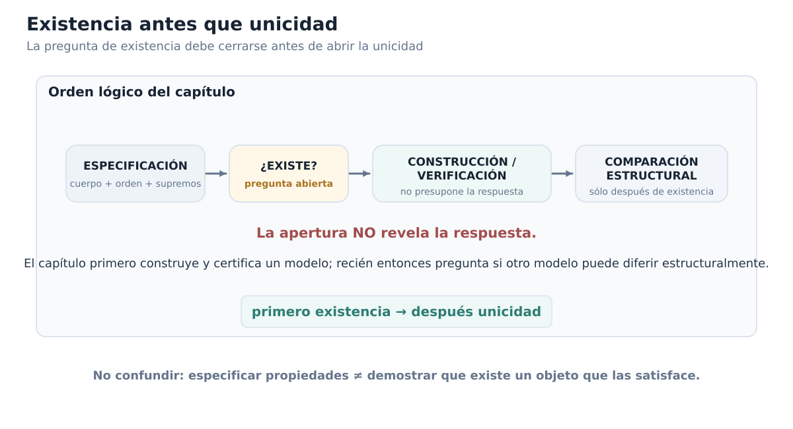

*Figura C00-F01. La especificación abre la pregunta de existencia; la comparación estructural sólo aparece después de construir y verificar un modelo.*

### Especificar no es demostrar que existe

Aquí aparece el paso lógico que suele quedar oculto.

Hemos descrito con bastante precisión qué queremos. Eso no demuestra que podamos tenerlo.

En matemáticas es posible escribir sistemas de condiciones incompatibles. Por ejemplo, podríamos pedir un número $x$ que satisficiera simultáneamente

$$
x<0
$$

y

$$
x>1.
$$

La frase está perfectamente formada, pero no por eso existe un objeto que la satisfaga.

Con una estructura axiomática ocurre lo mismo a otra escala. Podemos enumerar propiedades deseables y estudiar qué consecuencias tendrían **si** algún sistema las cumpliera. Pero mientras no construyamos al menos un modelo, sigue abierta la cuestión de si todas esas propiedades pueden coexistir.

Por eso la afirmación

> «Sea $F$ un cuerpo ordenado completo»

tiene dos usos muy distintos.

En una demostración posterior, cuando la existencia ya esté establecida, puede funcionar como una hipótesis perfectamente legítima. En este punto del libro, en cambio, no podemos usarla para resolver la pregunta fundacional. Si queremos justificar la existencia de los reales, necesitamos exhibir un sistema y demostrar que cumple lo que acabamos de exigir.

La distinción puede resumirse así:

$$
\boxed{
\text{definir la clase de objetos que buscamos}
\;\not\Rightarrow\;
\text{probar que esa clase contiene algún objeto}.
}
$$

Ésta será una regla importante durante todo el capítulo. Cada vez que introduzcamos una nueva construcción, preguntaremos no sólo qué pretende representar, sino qué falta todavía por verificar antes de poder afirmar que hemos construido realmente un cuerpo ordenado completo.

### ¿Por qué no basta con los racionales?

Una reacción natural sería pensar que quizá ya tenemos lo que necesitamos. Después de todo, $\mathbb Q$ posee una aritmética muy rica y un orden perfectamente bien comportado. Podemos sumar, restar, multiplicar, dividir por elementos no nulos y comparar racionales.

Entonces, antes de inventar nada nuevo, la pregunta correcta es:

> **¿Satisface ya $\mathbb Q$ nuestra especificación?**

No responderemos todavía. Hacerlo bien requiere localizar una familia racional concreta para la cual la propiedad del supremo falle dentro de $\mathbb Q$, y esa demostración merece una sección propia.

Lo importante aquí es advertir cómo ha cambiado el problema. Ya no estamos preguntando vagamente si a los racionales «les faltan números». Tenemos un criterio exacto que podemos auditar:

1. ¿es $\mathbb Q$ un cuerpo?;
2. ¿está linealmente ordenado de manera compatible con su aritmética?;
3. ¿todo subconjunto racional no vacío y acotado superiormente tiene un supremo racional?

Las dos primeras preguntas tienen respuesta afirmativa. La tercera será el punto decisivo.

### Una segunda pregunta queda en espera

Aunque todavía no podamos responder la pregunta de existencia, conviene distinguirla de otra que aparecerá más adelante.

Supongamos, sólo de manera hipotética, que lográramos construir un cuerpo ordenado completo $F$. Y supongamos que otra construcción produjera un cuerpo ordenado completo $G$.

Aun entonces habría que decidir qué significa que ambos representen «los mismos números reales».

No exigiríamos necesariamente que $F$ y $G$ fueran literalmente el mismo conjunto. Dos realizaciones matemáticas pueden tener elementos subyacentes distintos y, sin embargo, poseer exactamente la misma estructura relevante. La noción precisa que permitirá comparar esos modelos será la de **isomorfismo de cuerpos ordenados**.

Pero no abriremos todavía esa investigación. Sería prematuro discutir cuántos modelos puede haber cuando aún no hemos demostrado que haya siquiera uno.

El orden lógico del capítulo será, por tanto:

$$
\boxed{
\text{primero existencia;}
\qquad
\text{después, y sólo después, comparación estructural}.
}
$$

En este momento sólo la primera pregunta está activa:

$$
\boxed{\text{¿Existe algún cuerpo ordenado completo?}}
$$

### Antes de seguir

[]{#MA-MIC-ANM-01-000-001}

1. ¿Por qué escribir una lista de axiomas para un cuerpo ordenado completo no demuestra, por sí solo, que exista uno?
[]{#MA-MIC-ANM-01-000-002}

2. ¿Qué parte de la especificación pertenece al álgebra, cuál al orden y cuál a la completitud?
[]{#MA-MIC-ANM-01-000-003}

3. Si $A\subseteq F$ tiene una cota superior, ¿qué condición adicional debe satisfacer una cota $s$ para ser $\sup A$?
[]{#MA-MIC-ANM-01-000-004}

4. ¿En qué se diferencian las afirmaciones «$A$ está acotado superiormente» y «$A$ tiene supremo en $F$»?
[]{#MA-MIC-ANM-01-000-005}

5. ¿Por qué la frase «$\mathbb Q$ está contenido en $F$» necesitará una explicación estructural y no sólo una notación de inclusión?
[]{#MA-MIC-ANM-01-000-006}

6. Si algún día construimos dos candidatos $F$ y $G$, ¿por qué no sería razonable exigir desde el comienzo que sean literalmente el mismo conjunto?

La sección siguiente se ocupará de la quinta pregunta. Antes de decidir cómo construir un sistema nuevo, necesitamos comprender con precisión qué significa **extender** un sistema numérico sin destruir la estructura que ya posee. Ese análisis nos llevará desde $\mathbb N$ hasta $\mathbb Q$ y dejará preparado el lenguaje con el que, más adelante, podremos preguntar qué significa que los racionales estén incorporados en un sistema mayor.

## 0.2. Extender sin perder estructura: de $\mathbb N$ a $\mathbb Q$

La sección anterior dejó pendiente una frase que solemos escribir sin pensarlo demasiado:

$$
\mathbb Q\subseteq F.
$$

A primera vista parece una afirmación inocente: queremos que el sistema numérico que eventualmente construyamos «contenga» a los racionales. Pero, si estamos tratando de justificar desde el principio qué significa construir una nueva estructura numérica, la palabra **contener** merece una explicación.

No siempre dos sistemas numéricos han sido construidos de modo que uno sea literalmente un subconjunto del otro. Incluso cuando elegimos implementaciones conjuntistas que permiten escribir una inclusión literal, esa inclusión concreta no es lo que realmente importa para el álgebra y el orden. Lo esencial es que los números antiguos puedan aparecer dentro del sistema nuevo **sin que cambien las relaciones y operaciones que ya tenían**.

Ésa es la idea de una **incrustación estructural**.

### Una copia que conserva lo importante

Supongamos que $A$ y $B$ son dos sistemas dotados de cierta estructura y que queremos representar a $A$ dentro de $B$. Una aplicación

$$
\iota:A\longrightarrow B
$$

será una incrustación, al nivel estructural que corresponda, si cumple dos requisitos generales:

1. es **inyectiva**, de modo que elementos distintos de $A$ siguen siendo distintos después de transportarlos a $B$;
2. conserva las operaciones y relaciones relevantes de $A$.

La palabra «relevantes» importa. No todos los sistemas poseen exactamente la misma clase de estructura. $\mathbb N$ no es un cuerpo y $\mathbb Z$ tampoco. Por eso sería incorrecto llamar uniformemente «incrustaciones de cuerpos» a todas las flechas de la cadena

$$
\mathbb N\hookrightarrow\mathbb Z\hookrightarrow\mathbb Q.
$$

Lo correcto es preguntar, en cada etapa, **qué estructura existe ya y qué debe preservarse al pasar al sistema mayor**.

Por ejemplo, si una incrustación entre dos sistemas ordenados con suma y producto se denota por $\iota$, esperamos relaciones como

$$
\iota(m+n)=\iota(m)+\iota(n),
$$

$$
\iota(mn)=\iota(m)\iota(n),
$$

y, para el orden,

$$
m<n
\quad\Longleftrightarrow\quad
\iota(m)<\iota(n).
$$

También queremos que los elementos distinguidos se transporten correctamente cuando formen parte de la estructura:

$$
\iota(0)=0,
\qquad
\iota(1)=1.
$$

Así, la imagen $\iota(A)$ dentro de $B$ no es sólo una colección de puntos que lleva las mismas etiquetas. Es una **copia estructural** de $A$.

### Primer paso: de $\mathbb N$ a $\mathbb Z$

Los naturales sirven muy bien para contar y multiplicar cantidades no negativas. Pero su aritmética tiene una limitación inmediata: la resta no siempre puede resolverse dentro de $\mathbb N$.

Por ejemplo, la ecuación

$$
x+3=1
$$

no tiene solución natural.

Los enteros amplían el sistema incorporando opuestos aditivos. La idea importante para nosotros no es reconstruir aquí $\mathbb Z$ como clases de pares de naturales; esa construcción pertenece a un nivel fundacional más profundo que estamos tomando como disponible. Lo que sí necesitamos entender es cómo los naturales sobreviven dentro de los enteros.

Existe una aplicación canónica

$$
\iota_{\mathbb N\mathbb Z}:\mathbb N\longrightarrow\mathbb Z
$$

que envía cada natural al entero correspondiente. Bajo la notación usual escribimos simplemente

$$
0\mapsto0,
\quad
1\mapsto1,
\quad
2\mapsto2,
\quad\ldots
$$

pero lo que debemos recordar es la estructura que esa escritura comprime. Para $m,n\in\mathbb N$:

$$
\iota_{\mathbb N\mathbb Z}(m+n)
=
\iota_{\mathbb N\mathbb Z}(m)+\iota_{\mathbb N\mathbb Z}(n),
$$

$$
\iota_{\mathbb N\mathbb Z}(mn)
=
\iota_{\mathbb N\mathbb Z}(m)\,\iota_{\mathbb N\mathbb Z}(n),
$$

y

$$
m<n
\quad\Longleftrightarrow\quad
\iota_{\mathbb N\mathbb Z}(m)<\iota_{\mathbb N\mathbb Z}(n).
$$

La aplicación es inyectiva. Por tanto, $\mathbb N$ no desaparece cuando pasamos a $\mathbb Z$: reaparece como una copia estructural dentro del sistema mayor.

El sistema nuevo resuelve además problemas que antes no podían plantearse internamente. En $\mathbb Z$ la ecuación anterior sí tiene solución:

$$
x=-2.
$$

Podemos resumir la transición así:

$$
\boxed{
\mathbb N
\overset{\ \iota_{\mathbb N\mathbb Z}\}{\hookrightarrow}
\mathbb Z
}
$

Preservando suma, producto y orden, y añadiendo opuestos aditivos.

### Segundo paso: de $\mathbb Z$ a $\mathbb Q$

Los enteros reparan el problema de la resta, pero todavía no permiten resolver toda división.

La ecuación

$$
2x=1
$$

no tiene solución entera.

Los racionales amplían el sistema incorporando cocientes. De nuevo, no necesitamos reconstruir aquí $\mathbb Q$ como clases de equivalencia de pares de enteros. Basta recordar la forma canónica en que los enteros se representan entre los racionales:

$$
\iota_{\mathbb Z\mathbb Q}:\mathbb Z\longrightarrow\mathbb Q,
\qquad
n\longmapsto\frac n1.
$$

Esta vez la estructura disponible en el dominio es más rica: $\mathbb Z$ es un anillo ordenado. La aplicación conserva la suma,

$$
\iota_{\mathbb Z\mathbb Q}(m+n)
=
\iota_{\mathbb Z\mathbb Q}(m)
+
\iota_{\mathbb Z\mathbb Q}(n),
$$

el producto,

$$
\iota_{\mathbb Z\mathbb Q}(mn)
=
\iota_{\mathbb Z\mathbb Q}(m)
\iota_{\mathbb Z\mathbb Q}(n),
$$

el cero y la unidad,

$$
\iota_{\mathbb Z\mathbb Q}(0)=0,
\qquad
\iota_{\mathbb Z\mathbb Q}(1)=1,
$$

y el orden:

$$
m<n
\quad\Longleftrightarrow\quad
\frac m1<\frac n1.
$$

Además es inyectiva. Por eso podemos decir con precisión que $\mathbb Z$ se incrusta como anillo ordenado en $\mathbb Q$.

El nuevo sistema permite resolver, entre muchas otras, la ecuación

$$
2x=1,
$$

porque ahora

$$
x=\frac12
$$

pertenece al dominio.

La segunda ampliación puede resumirse así:

$$
\boxed{
\mathbb Z
\overset{\ \iota_{\mathbb Z\mathbb Q}\}{\hookrightarrow}
\mathbb Q
}
$

Preservando la estructura de anillo ordenado y añadiendo cocientes.

### Una ampliación no borra el sistema anterior

Estas dos etapas comparten una misma forma lógica. Primero tenemos un sistema en el que cierta operación no siempre puede resolverse. Después construimos o adoptamos un sistema más amplio en el que esa operación sí puede realizarse, pero exigimos que la aritmética anterior permanezca reconocible.

Podemos verlo como una cadena:

$$
\mathbb N
\hookrightarrow
\mathbb Z
\hookrightarrow
\mathbb Q.
$$

Cada flecha significa algo más fuerte que «hay una función de un conjunto a otro». Significa que la estructura disponible antes de la ampliación se transporta sin colapsos.

Ésta es precisamente la función de la inyectividad. Si dos elementos distintos $a,b\in A$ fueran enviados al mismo punto,

$$
\iota(a)=\iota(b),
$$

el sistema mayor habría perdido la capacidad de distinguirlos. Ya no tendríamos una copia fiel del sistema original.

Y ésta es la función de las identidades de preservación. Si, por ejemplo,

$$
\iota(a+b)\ne\iota(a)+\iota(b),
$$

entonces calcular primero en $A$ y transportar el resultado no coincidiría con transportar los datos y calcular después en $B$. La vieja aritmética habría cambiado durante el traslado.

Una buena incrustación evita ambos problemas.

### Incrustar no significa identificar literalmente

Ahora podemos precisar por qué la notación

$$
\mathbb N\subseteq\mathbb Z\subseteq\mathbb Q
$$

es útil y, al mismo tiempo, conceptualmente peligrosa si se toma demasiado literalmente.

Supongamos que tenemos una incrustación

$$
\iota:A\hookrightarrow B.
$$

Su imagen es el subconjunto

$$
\iota(A)=\{\iota(a):a\in A\}\subseteq B.
$$

Como $\iota$ es inyectiva y preserva la estructura pertinente, $A$ y $\iota(A)$ son estructuralmente indistinguibles para las operaciones y relaciones que estamos considerando. Podemos entonces adoptar una convención muy cómoda: **identificar $A$ con su imagen**.

Después de hacer esa identificación, dejamos de escribir constantemente $\iota(a)$ y escribimos simplemente $a$. La flecha

$$
A\hookrightarrow B
$$

queda comprimida en la notación familiar

$$
A\subseteq B.
$$

Pero el orden lógico es importante:

$$
\boxed{
\text{primero construimos una incrustación}
\;\longrightarrow\;
\text{después identificamos el dominio con su imagen}.
}
$$

No al revés.

Esto explica por qué una implementación conjuntista concreta no es esencial. En una construcción posible de los enteros, un entero puede estar representado por una clase de equivalencia de pares de naturales; en una construcción posible de los racionales, un racional puede estar representado por una clase de equivalencia de pares de enteros. En ese nivel, el objeto llamado $2\in\mathbb N$ no tiene por qué ser literalmente el mismo conjunto que el objeto que representa $2\in\mathbb Z$ o $2\in\mathbb Q$.

Sin embargo, las incrustaciones canónicas permiten transportar el $2$ natural al $2$ entero y después al $2$ racional preservando toda la estructura relevante. Para el trabajo matemático ordinario, identificamos esas copias y escribimos simplemente

$$
2.
$$

La notación inclusiva es, por tanto, una **economía estructural**.

La figura C00-F02 concentra esta lectura en un único mapa visual.

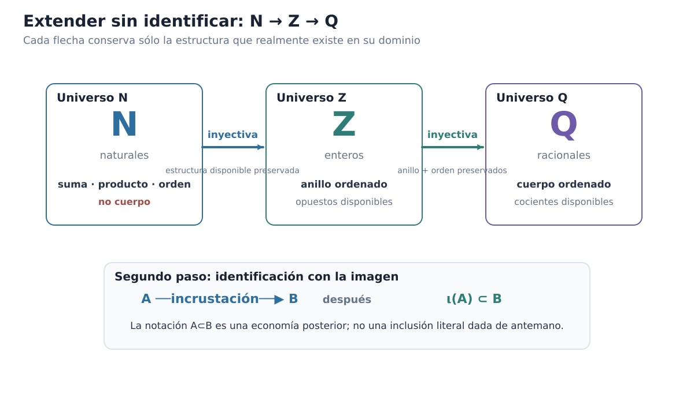

*Figura C00-F02. Las ampliaciones se realizan mediante incrustaciones tipadas; identificar un sistema con su imagen es un segundo paso, no una inclusión literal previa.*

### El diagrama que realmente debemos leer

Cuando escribamos en adelante

$$
\mathbb N\subseteq\mathbb Z\subseteq\mathbb Q,
$$

conviene que mentalmente veamos detrás el diagrama más preciso

$$
\mathbb N
\overset{\ \iota_{\mathbb N\mathbb Z}\}{\hookrightarrow}
\mathbb Z
\overset{\ \iota_{\mathbb Z\mathbb Q}\}{\hookrightarrow}
\mathbb Q,
$$

seguido de dos identificaciones con las imágenes correspondientes.

Esto nos permite distinguir tres afirmaciones que suelen confundirse:

1. **hay una aplicación** entre dos sistemas;
2. **hay una incrustación estructural**, es decir, una aplicación inyectiva que conserva la estructura pertinente;
3. **adoptamos la convención de identificar el sistema menor con su imagen** y, sólo entonces, usamos notación de inclusión.

La segunda afirmación es matemática. La tercera es una decisión notacional sustentada por la segunda.

### ¿Y qué ocurrirá con los racionales?

La pregunta que motivó esta sección puede formularse ahora con mucha más precisión.

En §0.1 dijimos que buscamos un sistema que prolongue la aritmética racional. Ya sabemos qué debe significar la palabra «prolongar»: no bastará con encontrar dentro del sistema nuevo algunos elementos que llamemos racionales. Tendrá que existir una copia de $\mathbb Q$ que conserve su suma, su producto, su cero, su unidad y su orden.

Pero no construiremos todavía esa flecha. Hacerlo antes de tener un candidato concreto sería adelantarnos al problema.

Por ahora sólo hemos establecido el lenguaje con el que podremos formular la exigencia cuando llegue el momento.

Lo que sí podemos hacer inmediatamente es mirar el último sistema de la cadena que ya poseemos:

$$
\mathbb Q.
$$

Los racionales son un cuerpo ordenado. Por tanto, satisfacen las dos primeras exigencias de §0.1. La pregunta decisiva es si satisfacen también la tercera:

$$
\boxed{
\text{¿todo subconjunto no vacío de }\mathbb Q
\text{ acotado superiormente posee un supremo racional?}
}
$$

Si la respuesta fuera afirmativa, quizá no necesitaríamos ampliar nada más. Si fuera negativa, la cadena

$$
\mathbb N\hookrightarrow\mathbb Z\hookrightarrow\mathbb Q
$$

no habría terminado todavía.

### Antes de seguir

[]{#MA-MIC-ANM-01-000-007}

1. ¿Por qué la inyectividad es indispensable si queremos considerar a $A$ como una copia dentro de $B$?
[]{#MA-MIC-ANM-01-000-008}

2. ¿Qué significa que una incrustación conserve la suma? Explica la igualdad $\iota(a+b)=\iota(a)+\iota(b)$ como dos caminos que deben dar el mismo resultado.
[]{#MA-MIC-ANM-01-000-009}

3. ¿Qué nueva clase de ecuaciones puede resolverse al pasar de $\mathbb N$ a $\mathbb Z$? ¿Y al pasar de $\mathbb Z$ a $\mathbb Q$?
[]{#MA-MIC-ANM-01-000-010}

4. ¿Por qué es incorrecto llamar «incrustación de cuerpos» a la flecha $\mathbb N\hookrightarrow\mathbb Z$?
[]{#MA-MIC-ANM-01-000-011}

5. Explica la diferencia entre $A\hookrightarrow B$, $\iota(A)\subseteq B$ y la convención de escribir $A\subseteq B$ después de identificar $A$ con $\iota(A)$.
[]{#MA-MIC-ANM-01-000-012}

6. ¿Qué propiedades tendría que conservar una futura copia de $\mathbb Q$ dentro de un sistema candidato para que pudiéramos decir que éste prolonga la aritmética racional?

Ya estamos en condiciones de hacer la primera prueba real del capítulo. No construiremos todavía un sistema nuevo. Antes examinaremos si el último sistema disponible, $\mathbb Q$, satisface la especificación completa. La próxima sección localizará con precisión el punto en que falla.

## 0.3. El obstáculo: $\mathbb Q$ no está completo

La cadena

$$
\mathbb N\hookrightarrow\mathbb Z\hookrightarrow\mathbb Q
$$

nos ha llevado hasta un sistema numérico muy poderoso. Los racionales forman un cuerpo ordenado: podemos sumar, restar, multiplicar, dividir por elementos no nulos y comparar cualquier par de números. Además, entre dos racionales distintos siempre hay otro racional.

A primera vista podría parecer que ya tenemos todo lo necesario. Pero la especificación de §0.1 incluía una tercera exigencia que todavía no hemos auditado:

> **¿Todo subconjunto no vacío de $\mathbb Q$ que esté acotado superiormente posee un supremo racional?**

Para responder no basta con decir que «faltan irracionales». Esa frase supone demasiado pronto que ya sabemos qué objetos faltan. Necesitamos exhibir, usando sólo aritmética racional, un conjunto para el cual la mejor barrera requerida por el orden no exista dentro de $\mathbb Q$.

### Un conjunto racional que exige una frontera

Consideremos

$$
S_2=\{q\in\mathbb Q:q\ge0,\ q^2<2\}.
$$

Todo lo que aparece en esta definición pertenece a $\mathbb Q$. No hemos introducido ningún número real nuevo ni hemos supuesto la existencia de un elemento cuyo cuadrado sea $2$.

Primero verifiquemos las dos hipótesis que harían aplicable la propiedad del supremo si $\mathbb Q$ fuera completo.

El conjunto no es vacío, porque

$$
1\in S_2.
$$

También está acotado superiormente. En efecto, $2$ es una cota superior: si $q\in S_2$ y ocurriera $q\ge2$, entonces, como $q\ge0$,

$$
q^2\ge4>2,
$$

contradiciendo la condición $q^2<2$. Por tanto todo $q\in S_2$ satisface $q<2$.

Así tenemos, enteramente dentro de los racionales,

$$
S_2\ne\varnothing
\qquad\text{y}\qquad
S_2\text{ está acotado superiormente en }\mathbb Q.
$$

Si $\mathbb Q$ satisficiera nuestra tercera exigencia, debería existir un racional

$$
s=\sup_{\mathbb Q}S_2.
$$

Vamos a demostrar que tal $s$ no puede existir.

### Qué tendría que satisfacer un supuesto supremo racional

Supongamos, para obtener una contradicción, que existe

$$
s\in\mathbb Q
$$

que es el supremo de $S_2$ dentro de $\mathbb Q$.

Como $1\in S_2$, necesariamente

$$
s\ge1.
$$

Y como $2$ es una cota superior,

$$
s\le2.
$$

En particular, $s>0$. Ahora comparemos $s^2$ con $2$.

Hay tres posibilidades:

$$
s^2<2,
\qquad
s^2=2,
\qquad
s^2>2.
$$

Mostraremos que las tres son imposibles.

### Si $s^2<2$, todavía podemos avanzar hacia la derecha

Supongamos primero

$$
s^2<2.
$$

Como $s$ es racional, también lo es

$$
\delta=\frac{2-s^2}{2s+2}.
$$

Además $\delta>0$. Como $s\ge1$, tenemos $2-s^2\le1$ y $2s+2\ge4$, de modo que

$$
0<\delta<1.
$$

Consideremos el racional $s+\delta$. Claramente

$$
s+\delta>s.
$$

Veamos, sin aproximaciones decimales, que sigue perteneciendo a $S_2$. Tenemos

$$
(s+\delta)^2
=s^2+2s\delta+\delta^2.
$$

Como $0<\delta<1$, se cumple $\delta^2<\delta$. Por tanto

$$
(s+\delta)^2
< s^2+(2s+1)\delta.
$$

Pero

$$
(2s+1)\delta
=(2-s^2)\frac{2s+1}{2s+2}
<2-s^2,
$$

porque

$$
\frac{2s+1}{2s+2}<1.
$$

Así,

$$
(s+\delta)^2<2.
$$

Como $s+\delta>0$, obtenemos

$$
s+\delta\in S_2.
$$

Esto contradice que $s$ sea una cota superior de $S_2$, pues hemos encontrado un elemento del conjunto estrictamente mayor que $s$.

Luego no puede ocurrir

$$
s^2<2.
$$

### Si $s^2>2$, podemos mejorar la cota hacia la izquierda

Supongamos ahora

$$
s^2>2.
$$

Definamos el racional positivo

$$
\delta=\frac{s^2-2}{4s}.
$$

Como $s>0$, tenemos $\delta>0$. Además $\delta<s$, pues

$$
s^2-2<4s^2.
$$

Por tanto

$$
t=s-\delta
$$

es un racional positivo y satisface $t<s$.

Calculemos su cuadrado:

$$
\begin{aligned}
t^2
&=(s-\delta)^2\\
&=s^2-2s\delta+\delta^2\\
&>s^2-2s\delta\\
&=s^2-\frac{s^2-2}{2}\\
&=\frac{s^2+2}{2}\\
&>2.
\end{aligned}
$$

Ahora tomemos cualquier $q\in S_2$. Si ocurriera $q\ge t$, como ambos son no negativos tendríamos

$$
q^2\ge t^2>2,
$$

lo cual contradice $q^2<2$. Por tanto

$$
q<t
$$

para todo $q\in S_2$.

Eso significa que $t$ es también una cota superior de $S_2$. Pero

$$
t<s,
$$

contradiciendo que $s$ sea la **menor** cota superior.

Luego tampoco puede ocurrir

$$
s^2>2.
$$

### ¿Podría ocurrir $s^2=2$?

Sólo queda la posibilidad

$$
s^2=2.
$$

Pero ningún racional tiene cuadrado igual a $2$.

Para comprobarlo, supongamos que

$$
s=\frac mn
$$

con $m,n\in\mathbb Z$, $n>0$ y la fracción escrita en términos mínimos. Si $s^2=2$, entonces

$$
m^2=2n^2.
$$

De aquí $m^2$ es par, luego $m$ es par. Escribamos

$$
m=2k.
$$

Sustituyendo,

$$
4k^2=2n^2,
$$

y por tanto

$$
n^2=2k^2.
$$

Así $n^2$ es par y, en consecuencia, $n$ también es par. Pero entonces $m$ y $n$ tienen al menos el factor común $2$, contradiciendo que $m/n$ estuviera en términos mínimos.

Por tanto

$$
\boxed{\text{no existe }s\in\mathbb Q\text{ tal que }s^2=2.}
$$

### La contradicción está cerrada

Las tres posibilidades para $s^2$ han quedado descartadas:

- si $s^2<2$, existe un racional mayor que $s$ que todavía pertenece a $S_2$;
- si $s^2>2$, existe una cota superior racional de $S_2$ menor que $s$;
- si $s^2=2$, contradicimos la aritmética racional elemental.

Luego el supuesto inicial era imposible:

$$
\boxed{S_2\text{ no posee supremo en }\mathbb Q.}
$$

Y, como $S_2$ es no vacío y está acotado superiormente, concluimos:

$$
\boxed{\mathbb Q\text{ no es completo en el sentido de la propiedad del supremo}.}
$$

Éste es el primer resultado negativo verdaderamente estructural del capítulo.

### Densidad no significa completitud

Vale la pena detenernos en una posible confusión. Los racionales son densos: entre dos racionales distintos siempre podemos encontrar otro racional. Sin embargo, acabamos de demostrar que $S_2$ no tiene supremo racional.

No hay contradicción. Las dos propiedades responden preguntas diferentes.

La densidad dice, esquemáticamente,

$$
p<q
\quad\Longrightarrow\quad
\exists r\in\mathbb Q:\ p<r<q.
$$

Es una afirmación sobre lo que ocurre **entre dos puntos que ya pertenecen al sistema**.

La completitud mediante supremos dice algo distinto: si un conjunto no vacío está acotado superiormente, debe existir **dentro del sistema** la mejor de todas sus cotas superiores.

Así puede ocurrir que haya racionales arbitrariamente intercalados y, aun así, falte exactamente la frontera que una familia racional necesita.

Ésta es la razón por la que no conviene representar $\mathbb Q$ como una recta con un agujero grande y visible. Su defecto no es macroscópico. Podemos acercarnos racionalmente tanto como queramos a ciertas fronteras y, sin embargo, la frontera requerida no pertenece al sistema.

La figura C00-F03 concentra esta lectura en un único mapa visual.

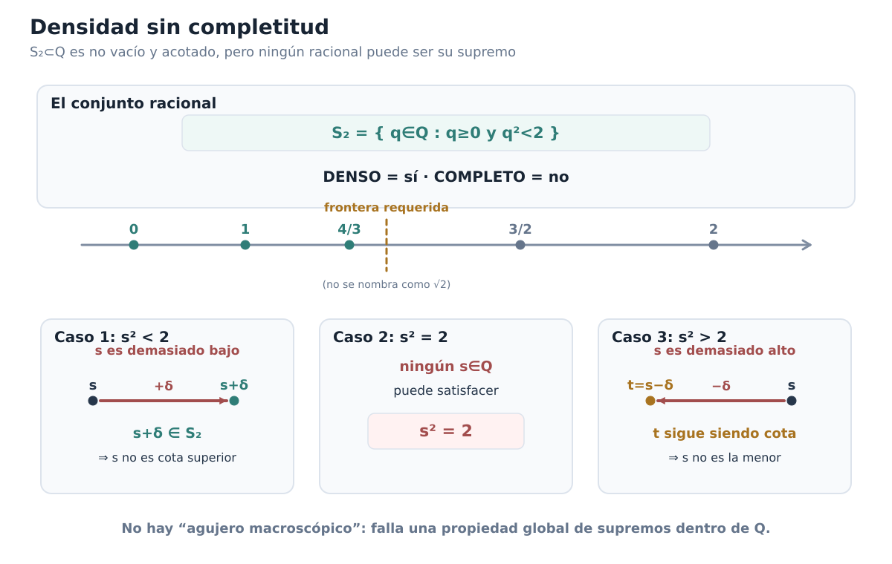

*Figura C00-F03. S₂ es no vacío y acotado en Q, pero todo candidato racional a supremo falla por uno de tres mecanismos.*

### El defecto está localizado

La comparación con la especificación de §0.1 queda ahora muy limpia.

Los racionales satisfacen:

$$
\boxed{\text{estructura de cuerpo ordenado}.}
$$

Pero fallan en:

$$
\boxed{\text{propiedad del supremo}.}
$$

Por tanto, si queremos justificar la existencia de los números reales, no necesitamos abandonar la aritmética racional ni sustituirla por otra irreconocible. Necesitamos **extenderla sin perderla** y, al mismo tiempo, añadir las fronteras que $\mathbb Q$ no puede contener por sí solo.

La pregunta constructiva aparece ahora de manera natural:

$$
\boxed{
\text{Si una frontera no pertenece a }\mathbb Q,
\text{ ¿podemos describir su posición usando sólo información racional?}
}
$$

No responderemos aún con un nombre. La sección siguiente construirá el objeto que hace posible esa idea.

### Antes de seguir

[]{#MA-MIC-ANM-01-000-013}

1. Verifica directamente que $1\in S_2$ y que $2$ es una cota superior de $S_2$ en $\mathbb Q$.
[]{#MA-MIC-ANM-01-000-014}

2. ¿Por qué no basta con demostrar que ningún racional satisface $s^2=2$ para concluir inmediatamente que $S_2$ no tiene supremo racional? ¿Qué aportan los dos argumentos de perturbación?
[]{#MA-MIC-ANM-01-000-015}

3. En el caso $s^2<2$, identifica exactamente qué propiedad del supuesto supremo contradice el racional $s+\delta$.
[]{#MA-MIC-ANM-01-000-016}

4. En el caso $s^2>2$, identifica exactamente qué propiedad del supuesto supremo contradice el racional $t=s-\delta$.
[]{#MA-MIC-ANM-01-000-017}

5. Explica con tus palabras la diferencia lógica entre densidad y completitud.
[]{#MA-MIC-ANM-01-000-018}

6. ¿Por qué esta demostración no necesita suponer de antemano la existencia de un número real cuyo cuadrado sea $2$?

Hemos llegado al punto en que la necesidad de una construcción ya no es una intuición. Es una consecuencia demostrada: el último sistema de nuestra cadena disponible, $\mathbb Q$, posee la aritmética y el orden que queremos conservar, pero no la completitud que necesitamos añadir. El siguiente paso será diseñar una manera de representar una frontera ausente **sin usar todavía el punto que falta**.
## 0.4. Construir una frontera sin tener el punto

La sección anterior terminó con una situación incómoda. El conjunto

$$
S_2=\{q\in\mathbb Q:q\ge0,\ q^2<2\}
$$

está formado enteramente por racionales, es no vacío y está acotado superiormente, pero no tiene supremo en $\mathbb Q$. Sabemos, por tanto, qué clase de objeto falta: necesitamos incorporar una frontera que el orden racional exige, aunque esa frontera no sea todavía un elemento de nuestro sistema.

¿Cómo podemos construir algo que represente esa posición **sin suponer de antemano que el punto ya existe**?

La idea de Dedekind consiste en cambiar la pregunta. En vez de intentar nombrar directamente la frontera ausente, preguntaremos:

> **¿Qué racionales quedarían a su izquierda?**

Esa información sí vive por completo dentro de $\mathbb Q$. Si logramos caracterizar qué propiedades debe tener el conjunto de todos esos racionales, podremos usar el propio conjunto como código de la posición que buscamos.

### De una frontera a su lado izquierdo

Imaginemos por un momento una posición determinada por un racional $c$. Sin introducir todavía ninguna notación especial, el conjunto natural de racionales que quedan antes de $c$ es

$$
L_c=\{q\in\mathbb Q:q<c\}.
$$

Este conjunto tiene cuatro rasgos simples.

Primero, no es vacío. Por ejemplo,

$$
c-1\in L_c.
$$

Segundo, no contiene a todos los racionales, porque

$$
c\notin L_c.
$$

Tercero, si un racional pertenece a $L_c$, entonces todo racional menor también pertenece. En efecto, si

$$
q<c
\qquad\text{y}\qquad
r<q,
$$

entonces, por transitividad del orden,

$$
r<c.
$$

Finalmente, $L_c$ no tiene un elemento mayor que todos los demás. Si $q\in L_c$, entonces $q<c$ y el racional

$$
r=\frac{q+c}{2}
$$

satisface

$$
q<r<c.
$$

Por tanto $r\in L_c$ y $r>q$.

Estas propiedades no dependen de dibujar una recta real ni de poseer ya un objeto situado en la frontera. Se expresan exclusivamente mediante pertenencia, subconjuntos y el orden de $\mathbb Q$.

Eso sugiere tomar esas propiedades como definición.

### Definición: cortadura de Dedekind

> **Definición.** Una **cortadura de Dedekind** es un subconjunto propio $A\subsetneq\mathbb Q$ que satisface:
>
> 1. $A\ne\varnothing$;
> 2. si $q\in A$ y $r<q$, entonces $r\in A$;
> 3. $A$ no tiene máximo: para todo $q\in A$ existe $r\in A$ tal que $q<r$.

La segunda condición suele describirse diciendo que $A$ es **cerrado hacia abajo**. Una vez que un racional entra en $A$, todos los racionales menores entran con él.

La tercera condición merece más atención. No es un adorno técnico. Es la condición que decide de qué lado de una frontera racional colocamos la frontera misma.

### Por qué prohibimos un máximo

Supongamos otra vez que $c\in\mathbb Q$. Si sólo exigiéramos que el conjunto fuera no vacío, propio y cerrado hacia abajo, entonces los dos conjuntos

$$
\{q\in\mathbb Q:q<c\}
$$

y

$$
\{q\in\mathbb Q:q\le c\}
$$

serían admisibles.

Los dos describen la misma separación intuitiva de los racionales alrededor de $c$, pero serían dos objetos distintos. El segundo contiene un máximo, precisamente $c$; el primero no.

La convención de exigir **ausencia de máximo** elimina esa duplicación. Cuando la frontera corresponde a un racional, la codificamos siempre mediante los racionales estrictamente menores que ella.

Así, una cortadura no es «la frontera más todo lo que queda a la izquierda». Es solamente el lado izquierdo, sin último elemento.

Este detalle será crucial más adelante: queremos que una posición tenga un solo código.

### Una cortadura cuya frontera no hemos construido

El ejemplo racional $L_c$ podría dar la impresión de que las cortaduras sólo sirven para volver a escribir racionales que ya conocemos. Pero el problema de §0.3 apunta exactamente en la dirección contraria.

Consideremos ahora el subconjunto

$$
A_2=\{q\in\mathbb Q:q<0\ \text{o}\ q^2<2\}.
$$

Esta definición usa únicamente números racionales, desigualdades racionales y multiplicación racional. No hemos introducido ningún número cuyo cuadrado sea $2$.

Vamos a comprobar que $A_2$ es una cortadura.

Es no vacío, porque

$$
0\in A_2.
$$

Es propio, porque

$$
2\notin A_2:
\qquad
2\not<0
\quad\text{y}\quad
2^2=4\not<2.
$$

Veamos ahora la clausura hacia abajo. Sea $q\in A_2$ y sea $r<q$.

Si $q<0$, entonces también $r<0$, de modo que $r\in A_2$.

Si $q\ge0$, la pertenencia $q\in A_2$ obliga a que

$$
q^2<2.
$$

Si $r<0$, ya sabemos que $r\in A_2$. Si, en cambio,

$$
0\le r<q,
$$

entonces

$$
r^2<q^2<2,
$$

y nuevamente $r\in A_2$.

Por tanto $A_2$ es cerrado hacia abajo.

Falta demostrar que no tiene máximo. Tomemos $q\in A_2$.

Si $q<0$, basta considerar

$$
r=\frac q2.
$$

Como $q<0$, tenemos

$$
q<\frac q2<0,
$$

de modo que $r\in A_2$ y $r>q$.

Queda el caso $q\ge0$. Entonces $q^2<2$. Definamos

$$
\delta=\frac{2-q^2}{2q+3}.
$$

El número $\delta$ es racional y positivo. Además,

$$
0<\delta<1,
$$

porque $2-q^2\le2$ y $2q+3\ge3$. Por tanto $\delta^2<\delta$. Ahora

$$
\begin{aligned}
(q+\delta)^2
&=q^2+2q\delta+\delta^2\\
&<q^2+(2q+1)\delta\\
&=q^2+(2-q^2)\frac{2q+1}{2q+3}\\
&<q^2+(2-q^2)\\
&=2.
\end{aligned}
$$

Así,

$$
q+\delta\in A_2
\qquad\text{y}\qquad
q+\delta>q.
$$

Ningún elemento de $A_2$ puede ser máximo.

Hemos demostrado, sin introducir ningún irracional preexistente, que

$$
\boxed{A_2\text{ es una cortadura de Dedekind}.}
$$

Éste es el punto conceptual decisivo. En §0.3 encontramos una frontera que $\mathbb Q$ necesitaba pero no podía proporcionar como elemento. Ahora hemos construido, usando sólo racionales, un objeto que registra exactamente un **lado izquierdo racional** asociado a esa frontera.

No diremos todavía que $A_2$ «es» un número real. Por ahora es un subconjunto de $\mathbb Q$ con propiedades precisas. Primero construiremos el sistema formado por todos esos objetos y veremos qué estructura posee.

### El nuevo dominio: todas las cortaduras

Denotemos por

$$
\mathcal D
=
\{A\subseteq\mathbb Q:A\text{ es una cortadura de Dedekind}\}.
$$

Cada elemento de $\mathcal D$ es, por definición, un **conjunto de racionales**.

Desde el punto de vista conjuntista, no hay aquí una nueva suposición misteriosa. Todo subconjunto de $\mathbb Q$ pertenece al conjunto potencia $\mathcal P(\mathbb Q)$, y la propiedad de ser cortadura selecciona algunos de esos subconjuntos. En el marco clásico que adoptamos al comienzo del capítulo podemos escribir

$$
\boxed{\mathcal D\subseteq\mathcal P(\mathbb Q)}
$$

y considerar $\mathcal D$ como un conjunto bien definido. Una formalización axiomática completa expresaría esta selección mediante los principios usuales de teoría de conjuntos; no necesitamos abrir aquí una reconstrucción de ZF/ZFC.

La pregunta cambia entonces de forma. Ya no preguntamos dónde está una frontera ausente en una recta que todavía no poseemos. Tenemos un nuevo dominio concreto, $\mathcal D$, y podemos preguntar qué relaciones y operaciones admite.

La primera estructura aparece inmediatamente.

### Ordenar posiciones por inclusión

Si una posición queda más a la derecha que otra, debería dejar **más racionales** a su izquierda. En el lenguaje de cortaduras, «tener más racionales a la izquierda» significa simplemente contener al otro conjunto.

Esto motiva la definición

$$
A\le_{\mathcal D}B
\quad\Longleftrightarrow\quad
A\subseteq B.
$$

Y, para el orden estricto,

$$
A<_{\mathcal D}B
\quad\Longleftrightarrow\quad
A\subsetneq B.
$$

La inclusión ya es reflexiva y transitiva. Además, si

$$
A\subseteq B
\qquad\text{y}\qquad
B\subseteq A,
$$

entonces $A=B$. Por tanto $\le_{\mathcal D}$ es al menos un orden parcial.

Pero necesitamos algo más: queremos poder comparar **cualesquiera dos** cortaduras. Sorprendentemente, la clausura hacia abajo fuerza exactamente esa comparabilidad.

> **Proposición.** Si $A,B\in\mathcal D$, entonces
>
> $$
> A\subseteq B
> \qquad\text{o}\qquad
> B\subseteq A.
> $$
>
> En consecuencia, la inclusión define un orden lineal sobre $\mathcal D$.

**Demostración.** Si $A\subseteq B$, no hay nada que probar. Supongamos entonces que

$$
A\not\subseteq B.
$$

Existe por tanto algún

$$
a\in A\setminus B.
$$

Tomemos un elemento cualquiera $b\in B$. No puede ocurrir que $a<b$, porque entonces, como $b\in B$ y $B$ es cerrado hacia abajo, tendríamos $a\in B$, contradicción. Tampoco puede ocurrir $a=b$, porque $a\notin B$ y $b\in B$.

Por la tricotomía del orden racional, necesariamente

$$
b<a.
$$

Pero $a\in A$ y $A$ es cerrado hacia abajo, de modo que

$$
b\in A.
$$

Como $b\in B$ era arbitrario, concluimos

$$
B\subseteq A.
$$

Así, para cualesquiera $A,B\in\mathcal D$, una de las dos inclusiones se cumple. Junto con reflexividad, antisimetría y transitividad, esto demuestra que $\le_{\mathcal D}$ es un orden lineal. $\square$

La prueba merece ser leída estructuralmente. No hemos comparado supuestos puntos frontera. Hemos comparado **información racional**. Si un racional pertenece a $A$ pero no a $B$, la clausura hacia abajo obliga a que todos los racionales de $B$ queden por debajo de ese testigo y, por tanto, también pertenezcan a $A$.

### Una posición codificada desde la izquierda

Podemos resumir la idea construida hasta aquí así:

$$
\boxed{
\text{posición buscada}
\quad\rightsquigarrow\quad
\text{conjunto de racionales que quedan a su izquierda}.
}
$$

La flecha no significa todavía que hayamos construido los números reales. Sólo hemos encontrado un tipo de objeto capaz de registrar posiciones que $\mathbb Q$ no puede contener como elementos.

Cuanto mayor es una cortadura por inclusión, más racionales registra a su izquierda y, por tanto, más a la derecha queda la posición codificada.

Es importante mantener los tipos separados:

$$
A\in\mathcal D,
\qquad
A\subseteq\mathbb Q,
\qquad
q\in\mathbb Q.
$$

Una cortadura no es un racional, ni es todavía un «punto de la recta real» previamente existente. Es un conjunto de racionales con una estructura de orden que acabamos de construir.

La figura C00-F04 concentra esta lectura en un único mapa visual.

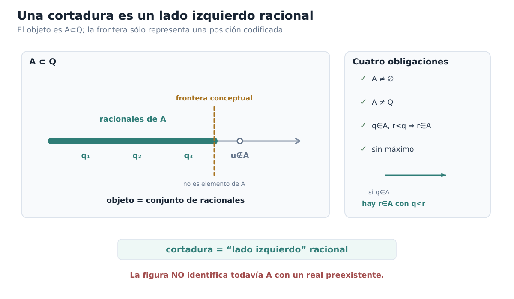

*Figura C00-F04. La cortadura es un subconjunto de Q; la frontera sólo codifica una posición y no es un punto primitivo del sistema.*

### Lo que todavía falta

Tenemos un conjunto $\mathcal D$ y hemos demostrado que sus elementos están linealmente ordenados por inclusión. Esto ya reproduce una parte esencial de la idea de posición, pero está muy lejos de cerrar nuestra especificación inicial.

Todavía no sabemos sumar dos cortaduras. No sabemos multiplicarlas. No hemos construido un cero, un uno, opuestos ni inversos. Mucho menos hemos demostrado que $\mathcal D$ sea completo.

Antes de intentar esa aritmética necesitamos resolver una cuestión más básica. El sistema nuevo debe **extender sin destruir** al sistema racional, tal como $\mathbb Z$ extendía a $\mathbb N$ y $\mathbb Q$ extendía a $\mathbb Z$.

La pregunta inmediata es, por tanto:

$$
\boxed{
\text{¿cómo reconocemos dentro de }\mathcal D
\text{ una copia fiel de }\mathbb Q\text{?}
}
$$

La respuesta comenzará observando que cada racional ya determina una cortadura natural. Construiremos esa correspondencia en la sección siguiente y comprobaremos primero que preserva el orden; la certificación algebraica completa tendrá que esperar hasta que hayamos definido las operaciones de $\mathcal D$.

### Antes de seguir

[]{#MA-MIC-ANM-01-000-019}

1. Verifica directamente que, para cada $c\in\mathbb Q$, el conjunto $L_c=\{q\in\mathbb Q:q<c\}$ es una cortadura de Dedekind.
[]{#MA-MIC-ANM-01-000-020}

2. Explica por qué $\{q\in\mathbb Q:q\le c\}$ queda excluido por la condición «sin máximo» y qué duplicación evitaríamos de no imponerla.
[]{#MA-MIC-ANM-01-000-021}

3. En la comprobación de $A_2$, ¿por qué hay que separar los casos $q<0$ y $q\ge0$ al demostrar que no existe máximo?
[]{#MA-MIC-ANM-01-000-022}

4. ¿En qué paso de la prueba de linealidad usamos que el orden de $\mathbb Q$ satisface tricotomía?
[]{#MA-MIC-ANM-01-000-023}

5. Si $A\subsetneq B$, ¿qué interpretación tiene esa inclusión en términos de los racionales situados «a la izquierda» de las posiciones codificadas?
[]{#MA-MIC-ANM-01-000-024}

6. ¿Por qué la existencia del conjunto $\mathcal D\subseteq\mathcal P(\mathbb Q)$ no demuestra todavía que hayamos construido un cuerpo ordenado completo?

Ya tenemos el primer objeto nuevo del capítulo. No nació de dibujar un punto ausente, sino de registrar qué racionales deberían quedar antes de él. El próximo paso será comprobar que los racionales mismos reaparecen dentro de este lenguaje sin perder su orden.

## 0.5. Una copia de $\mathbb Q$ dentro del nuevo sistema

En §0.4 construimos un nuevo dominio, $\mathcal D$, cuyos elementos son cortaduras de Dedekind. Sabemos además que $\mathcal D$ está linealmente ordenado por inclusión. Pero la construcción sólo será útil para nuestro problema original si el sistema racional que ya conocemos reaparece dentro de ella sin perder su orden.

La situación es análoga a la de §0.2. Cuando pasamos de $\mathbb Z$ a $\mathbb Q$, no nos conformamos con encontrar dentro del sistema mayor objetos que pudiéramos etiquetar informalmente como enteros. Construimos una aplicación inyectiva que conservaba la estructura disponible. Ahora debemos hacer lo mismo con los racionales y las cortaduras.

La diferencia es que todavía no hemos definido suma ni producto en $\mathcal D$. Por tanto, en esta sección sólo podemos aspirar a una primera certificación:

$$
\boxed{
\mathbb Q
\longrightarrow
\mathcal D
\qquad
\text{preservando exactamente el orden.}
}
$$

La certificación algebraica tendrá que esperar.

### La cortadura determinada por un racional

En la sección anterior apareció ya una familia natural de cortaduras. Para cada $q\in\mathbb Q$, definimos

$$
q^*=\{r\in\mathbb Q:r<q\}.
$$

El símbolo $q^*$ no significa una nueva operación sobre racionales. Es simplemente un nombre para el subconjunto de $\mathbb Q$ formado por todos los racionales estrictamente menores que $q$.

Antes de usarlo como elemento de $\mathcal D$, debemos comprobar que satisface la definición completa de cortadura.

> **Proposición.** Para todo $q\in\mathbb Q$, el conjunto
>
> $$
> q^*=\{r\in\mathbb Q:r<q\}
> $$
>
> es una cortadura de Dedekind.

**Demostración.** Verificamos las cuatro condiciones.

Primero, $q^*$ no es vacío. Por ejemplo,

$$
q-1<q,
$$

luego

$$
q-1\in q^*.
$$

Segundo, $q^*$ es propio. El propio $q$ no pertenece a $q^*$, porque $q<q$ es falso. Por tanto

$$
q^*\ne\mathbb Q.
$$

Tercero, $q^*$ es cerrado hacia abajo. Si $r\in q^*$ y $s<r$, entonces

$$
s<r<q,
$$

y por transitividad

$$
s<q.
$$

Así $s\in q^*$.

Cuarto, $q^*$ no tiene máximo. Si $r\in q^*$, entonces $r<q$. El racional

$$
t=\frac{r+q}{2}
$$

satisface

$$
r<t<q.
$$

Por tanto $t\in q^*$ y $t>r$. Ningún elemento de $q^*$ puede ser el último.

Hemos verificado todas las condiciones, de modo que

$$
\boxed{q^*\in\mathcal D\qquad\text{para todo }q\in\mathbb Q.}
$$

$\square$

La ausencia de máximo vuelve a desempeñar aquí un papel preciso. La posición racional $q$ queda codificada por los racionales **estrictamente** menores que $q$, no por un conjunto que incluya también a $q$. Así todas las posiciones racionales obedecen la misma convención que fijamos al definir las cortaduras.

### La aplicación racional

Podemos definir ahora

$$
\iota_{\mathbb Q}:\mathbb Q\longrightarrow\mathcal D,
\qquad
\iota_{\mathbb Q}(q)=q^*.
$$

La pregunta decisiva es si esta aplicación conserva la disposición de los racionales. Si $p<q$, esperamos que todos los racionales situados a la izquierda de $p$ estén también a la izquierda de $q$, pero no al revés. En el lenguaje de $\mathcal D$, eso debería expresarse como

$$
p^*\subsetneq q^*.
$$

No es sólo una intuición. Es una equivalencia exacta.

> **Proposición.** Para cualesquiera $p,q\in\mathbb Q$,
>
> $$
> \boxed{
> p<q
> \quad\Longleftrightarrow\quad
> p^*\subsetneq q^*.
> }
> $$

**Demostración.** Supongamos primero que

$$
p<q.
$$

Si $r\in p^*$, entonces $r<p$, y por transitividad

$$
r<p<q.
$$

Por tanto $r\in q^*$. Hemos demostrado

$$
p^*\subseteq q^*.
$$

La inclusión es estricta porque

$$
p<q
$$

implica

$$
p\in q^*,
$$

mientras que

$$
p\notin p^*.
$$

Luego

$$
p^*\subsetneq q^*.
$$

Para la implicación recíproca, supongamos

$$
p^*\subsetneq q^*.
$$

Como la inclusión es estricta, existe algún racional

$$
r\in q^*\setminus p^*.
$$

De $r\in q^*$ obtenemos

$$
r<q.
$$

Y de $r\notin p^*$ obtenemos que no es cierto $r<p$. Por tricotomía en $\mathbb Q$,

$$
p\le r.
$$

Así

$$
p\le r<q,
$$

y en particular

$$
p<q.
$$

Quedan demostradas ambas implicaciones. $\square$

Esta proposición concentra exactamente la relación que buscábamos. La aplicación $\iota_{\mathbb Q}$ no sólo **preserva** el orden estricto; también lo **refleja**:

$$
p<q
\quad\Longleftrightarrow\quad
\iota_{\mathbb Q}(p)<_{\mathcal D}\iota_{\mathbb Q}(q).
$$

En otras palabras, mirar las imágenes dentro de $\mathcal D$ permite recuperar por completo el orden racional original.

### La inyectividad no necesita una prueba separada larga

La preservación y reflexión del orden ya contienen casi toda la información necesaria para demostrar que no colapsamos racionales distintos.

Supongamos

$$
p^*=q^*.
$$

Si $p<q$, la proposición anterior obligaría a

$$
p^*\subsetneq q^*,
$$

contradicción. Si $q<p$, obtendríamos análogamente

$$
q^*\subsetneq p^*,
$$

también imposible. Por tricotomía sólo queda

$$
p=q.
$$

Por tanto

$$
\boxed{
\iota_{\mathbb Q}\text{ es inyectiva.}
}
$$

Hemos obtenido así una **incrustación de órdenes lineales**:

$$
\boxed{
\iota_{\mathbb Q}:\mathbb Q\hookrightarrow\mathcal D,
\qquad
q\longmapsto q^*,
}
$$

con

$$
p<q
\quad\Longleftrightarrow\quad
p^*\subsetneq q^*.
$$

No hemos hecho todavía ninguna afirmación sobre suma o producto en $\mathcal D$.

### Cómo reaparecen las posiciones racionales

Algunos ejemplos ayudan a leer la construcción:

$$
0^*=\{r\in\mathbb Q:r<0\},
$$

$$
1^*=\{r\in\mathbb Q:r<1\},
$$

y

$$
\left(\frac32\right)^*
=
\left\{r\in\mathbb Q:r<\frac32\right\}.
$$

Como

$$
0<1<\frac32,
$$

la proposición anterior se traduce exactamente en

$$
0^*\subsetneq1^*\subsetneq\left(\frac32\right)^*.
$$

La geometría del orden racional se ha convertido en una geometría de inclusión entre conjuntos.

Podemos volver incluso a la cortadura $A_2$ de §0.4. Recordemos

$$
A_2=\{q\in\mathbb Q:q<0\ \text{o}\ q^2<2\}.
$$

Sin introducir ninguna frontera real preexistente, podemos situarla entre dos posiciones racionales conocidas:

$$
\boxed{1^*\subsetneq A_2\subsetneq2^*.}
$$

En efecto, si $r<1$, entonces o bien $r<0$, o bien $0\le r<1$, y en este último caso $r^2<1<2$; por tanto $r\in A_2$. Además

$$
1\in A_2
\qquad\text{pero}\qquad
1\notin1^*,
$$

así que la primera inclusión es estricta.

Por otro lado, todo $r\in A_2$ satisface $r<2$. Si $r<0$, esto es inmediato; si $r\ge0$ y $r^2<2$, no puede ocurrir $r\ge2$, porque entonces $r^2\ge4$. Por consiguiente

$$
A_2\subseteq2^*.
$$

La inclusión vuelve a ser estricta, pues

$$
\frac32<2,
$$

de modo que

$$
\frac32\in2^*,
$$

pero

$$
\left(\frac32\right)^2=\frac94>2,
$$

y por tanto

$$
\frac32\notin A_2.
$$

Así $A_2$ ocupa, dentro del orden de $\mathcal D$, una posición estrictamente intermedia entre $1^*$ y $2^*$. Ésta es ya una manifestación concreta de que $\mathcal D$ contiene más posiciones ordenadas que las provenientes directamente de racionales.

No necesitamos todavía dar un nombre numérico a la posición codificada por $A_2$. La relación de orden basta.

### Copia, imagen e identificación

Conviene recuperar ahora la distinción de §0.2.

La aplicación

$$
\iota_{\mathbb Q}:\mathbb Q\hookrightarrow\mathcal D
$$

produce la imagen

$$
\iota_{\mathbb Q}(\mathbb Q)
=
\{q^*:q\in\mathbb Q\}
\subseteq\mathcal D.
$$

Como $\iota_{\mathbb Q}$ es inyectiva y conserva y refleja el orden, $\mathbb Q$ y $\iota_{\mathbb Q}(\mathbb Q)$ son indistinguibles **como conjuntos linealmente ordenados**. En ese sentido preciso, ya podemos decir que $\mathcal D$ contiene una copia ordenada de los racionales.

Pero todavía no debemos afirmar algo más fuerte de lo que hemos demostrado.

En $\mathbb Q$ disponemos de suma y producto. En $\mathcal D$, por ahora, sólo hemos construido el orden por inclusión. Aún no existen en nuestro desarrollo operaciones

$$
\mathcal D\times\mathcal D\longrightarrow\mathcal D
$$

que podamos comparar con la aritmética racional.

Por eso el certificado actual es

$$
\boxed{
\text{INJECTIVE = VERIFIED}
\qquad
\text{ORDER = PRESERVED AND REFLECTED}
}
$$

mientras que permanece pendiente

$$
\boxed{
\text{ORDERED-FIELD EMBEDDING = NOT YET CERTIFIED}.
}
$$

Sólo después de definir suma y producto en $\mathcal D$ podremos preguntar y demostrar si

$$
p^*+q^*=(p+q)^*
$$

y

$$
p^*q^*=(pq)^*.
$$

Esas igualdades no se usan aquí: son obligaciones futuras.

Por la misma razón, aunque podemos trabajar sin ambigüedad con la imagen $\iota_{\mathbb Q}(\mathbb Q)\subseteq\mathcal D$, aplazaremos la abreviatura no cualificada

$$
\mathbb Q\subseteq\mathcal D
$$

hasta haber certificado también la estructura de cuerpo. Queremos que la notación inclusiva signifique al final exactamente lo mismo que significó en §0.2: una identificación sustentada por toda la estructura que pretendemos conservar, no sólo por una semejanza parcial.

La figura C00-F05 concentra esta lectura en un único mapa visual.

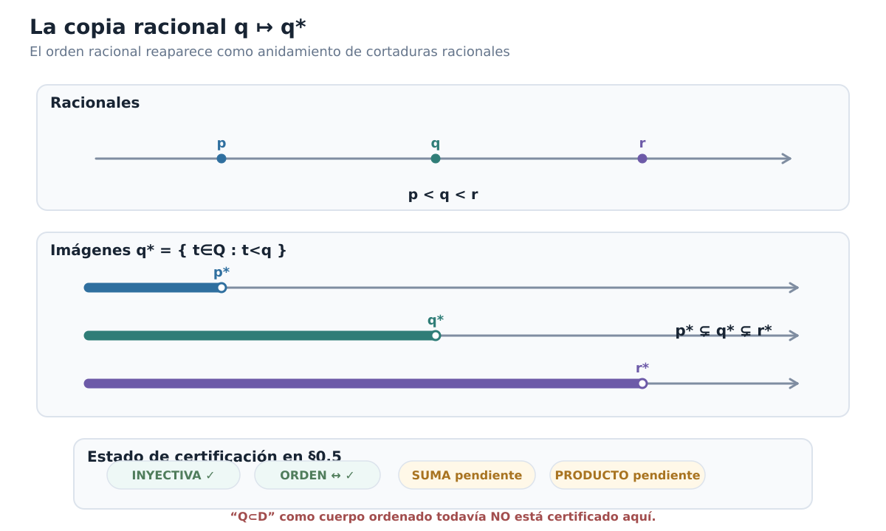

*Figura C00-F05. El orden p<q<r se recupera como anidamiento p*⊊q*⊊r*, mientras la certificación algebraica permanece pendiente en §0.5.*

### Lo que hemos ganado y lo que falta

La construcción ha superado ya una prueba importante. El nuevo dominio no coloca los racionales en un rincón irreconocible ni altera su orden. Cada racional $q$ determina canónicamente una cortadura $q^*$, y la posición relativa de dos racionales queda reproducida exactamente por la inclusión de sus cortaduras.

Podemos resumir el resultado de esta sección como

$$
\boxed{
\mathbb Q
\overset{\ \iota_{\mathbb Q}\}{\hookrightarrow}
(\mathcal D,\subseteq)
\qquad
\text{como orden lineal.}
}
$$

Esto resuelve sólo la parte **ordinal** de la extensión. Para convertir $\mathcal D$ en un candidato serio a sistema de números reales necesitamos transportar también la aritmética.

La siguiente pregunta es inevitable:

$$
\boxed{
\text{¿cómo podemos sumar dos lados izquierdos racionales}
\\
\text{de modo que el resultado vuelva a ser una cortadura?}
}
$$

Ése será el primer paso hacia la estructura algebraica de $\mathcal D$.

### Antes de seguir

[]{#MA-MIC-ANM-01-000-025}

1. Demuestra directamente que $(-2)^*\subsetneq0^*\subsetneq3^*$ sin apelar a la proposición general.
[]{#MA-MIC-ANM-01-000-026}

2. Si $p^*\subsetneq q^*$, ¿por qué un elemento de $q^*\setminus p^*$ permite concluir $p<q$?
[]{#MA-MIC-ANM-01-000-027}

3. Explica por qué la equivalencia $p<q\Longleftrightarrow p^*\subsetneq q^*$ contiene más información que la sola implicación $p<q\Rightarrow p^*\subsetneq q^*$.
[]{#MA-MIC-ANM-01-000-028}

4. ¿Cómo se deduce la inyectividad de $\iota_{\mathbb Q}$ a partir de la preservación y reflexión del orden?
[]{#MA-MIC-ANM-01-000-029}

5. Verifica con detalle las inclusiones $1^*\subsetneq A_2\subsetneq2^*$ sin introducir un número cuyo cuadrado sea $2$.
[]{#MA-MIC-ANM-01-000-030}

6. ¿Por qué todavía no podemos llamar a $\iota_{\mathbb Q}$ «incrustación de cuerpos ordenados»?
[]{#MA-MIC-ANM-01-000-031}

7. ¿Qué dos identidades tendrán que verificarse más adelante para demostrar que la suma y el producto racionales se conservan dentro de $\mathcal D$?

La copia racional ya está situada en el nuevo orden. Ahora debemos darle al resto de $\mathcal D$ una aritmética compatible con ella.

## 0.6. Dar aritmética a las cortaduras I: suma y opuesto

En §0.5 conseguimos que los racionales reaparecieran dentro de $\mathcal D$ sin perder su orden. Pero un sistema de números reales no puede limitarse a ordenar posiciones: debe permitir operar con ellas.

La primera pregunta algebraica es la más natural:

$$
\boxed{
\text{dados }A,B\in\mathcal D,
\text{ ¿cómo construir una cortadura que represente su suma?}
}
$$

La idea debe nacer de la aritmética racional que ya poseemos. Si $a\in A$ y $b\in B$ son racionales situados a la izquierda de las posiciones codificadas por $A$ y $B$, entonces $a+b$ debería quedar a la izquierda de la posición suma. Esto sugiere definir el nuevo lado izquierdo usando precisamente todas esas sumas racionales.

### Sumar dos cortaduras

Para $A,B\in\mathcal D$, definimos

$$
\boxed{
A+B
=
\{a+b:a\in A,\ b\in B\}.
}
$$

Equivalentemente, para $x\in\mathbb Q$,

$$
x\in A+B
\quad\Longleftrightarrow\quad
\exists a\in A\ \exists b\in B:
x=a+b.
$$

La fórmula es sencilla. Lo que todavía no sabemos es si el conjunto obtenido vuelve a pertenecer a $\mathcal D$. Esa verificación es parte de la definición efectiva de la operación: no basta con escribir una regla y esperar que el resultado sea una cortadura.

> **Proposición.** Si $A,B\in\mathcal D$, entonces $A+B\in\mathcal D$.

**Demostración.** Verificamos las cuatro condiciones de cortadura.

Como $A$ y $B$ son no vacíos, podemos elegir

$$
a_0\in A,
\qquad
b_0\in B.
$$

Entonces

$$
a_0+b_0\in A+B,
$$

de modo que $A+B$ no es vacío.

Para ver que es propio, elijamos racionales exteriores

$$
u\notin A,
\qquad
v\notin B.
$$

Todo elemento de una cortadura está estrictamente por debajo de cualquier racional exterior. En efecto, si $a\in A$ y $u\notin A$, no puede ocurrir $u\le a$, porque la clausura hacia abajo obligaría a $u\in A$. Por tanto

$$
a<u.
$$

Análogamente, $b<v$ para todo $b\in B$. Así, para cualesquiera $a\in A$ y $b\in B$,

$$
a+b<u+v.
$$

En particular,

$$
u+v\notin A+B,
$$

y por tanto $A+B\ne\mathbb Q$.

Comprobemos la clausura hacia abajo. Sea

$$
x=a+b\in A+B
$$

y sea $y<x$. Definimos

$$
a'=y-b.
$$

Como $y<a+b$, tenemos

$$
a'<a.
$$

La clausura inferior de $A$ implica $a'\in A$, y entonces

$$
y=a'+b\in A+B.
$$

Finalmente, $A+B$ no tiene máximo. Si

$$
x=a+b\in A+B,
$$

la ausencia de máximo en $A$ proporciona $a'\in A$ con

$$
a<a'.
$$

Entonces

$$
x=a+b<a'+b,
$$

y $a'+b\in A+B$.

Las cuatro condiciones quedan verificadas. Por tanto

$$
\boxed{A+B\in\mathcal D.}
$$

$\square$

La suma es, pues, una operación interna bien definida:

$$
+:\mathcal D\times\mathcal D\longrightarrow\mathcal D.
$$

### La suma racional reaparece exactamente

La definición no sólo produce una operación. Debe ser compatible con la copia de $\mathbb Q$ construida en §0.5.

Tomemos $p,q\in\mathbb Q$. Afirmamos que

$$
\boxed{
p^*+q^*=(p+q)^*.
}
$$

Si $x\in p^*+q^*$, existen $a<p$ y $b<q$ tales que

$$
x=a+b.
$$

Entonces

$$
x=a+b<p+q,
$$

de modo que

$$
x\in(p+q)^*.
$$

Así,

$$
p^*+q^*\subseteq(p+q)^*.
$$

Para la inclusión contraria, sea

$$
x<p+q.
$$

Definamos

$$
\varepsilon=\frac{p+q-x}{2}>0,
$$

y tomemos

$$
a=p-\varepsilon,
\qquad
b=q-\varepsilon.
$$

Entonces $a<p$, $b<q$ y

$$
a+b
=
p+q-2\varepsilon
=
x.
$$

Por tanto $a\in p^*$, $b\in q^*$ y

$$
x\in p^*+q^*.
$$

Concluimos

$$
\boxed{
p^*+q^*=(p+q)^*.
}
$$

Ésta es la primera certificación algebraica de la aplicación racional:

$$
\iota_{\mathbb Q}(p+q)
=
\iota_{\mathbb Q}(p)+\iota_{\mathbb Q}(q).
$$

Todavía no hemos certificado el producto, de modo que la incrustación de **cuerpos** sigue pendiente.

### Asociatividad y conmutatividad

La suma de cortaduras hereda estas dos leyes de la suma racional, pero conviene verificar por qué.

Para $A,B,C\in\mathcal D$, un racional $x$ pertenece a $(A+B)+C$ exactamente cuando existen

$$
a\in A,\qquad b\in B,\qquad c\in C
$$

tales que

$$
x=(a+b)+c.
$$

Por asociatividad en $\mathbb Q$,

$$
(a+b)+c=a+(b+c),
$$

y esta última expresión caracteriza precisamente la pertenencia a $A+(B+C)$. Por extensionalidad,

$$
\boxed{(A+B)+C=A+(B+C).}
$$

Del mismo modo,

$$
x=a+b=b+a
$$

muestra que

$$
\boxed{A+B=B+A.}
$$

No estamos trasladando mecánicamente las leyes de $\mathbb Q$: estamos usando la definición de la nueva operación para reducir la igualdad de cortaduras a igualdades racionales entre sus testigos.

### El cero aditivo

La cortadura racional asociada a $0$ es

$$
0^*=\{r\in\mathbb Q:r<0\}.
$$

Afirmamos que actúa como neutro para la nueva suma.

Sea $x\in A+0^*$. Entonces

$$
x=a+b
$$

para algún $a\in A$ y algún $b<0$. Por tanto

$$
x<a.
$$

Como $A$ es cerrado hacia abajo,

$$
x\in A.
$$

Así,

$$
A+0^*\subseteq A.
$$

Para la inclusión contraria, sea $x\in A$. Como $A$ no tiene máximo, existe $a\in A$ con

$$
x<a.
$$

Definamos

$$
b=x-a.
$$

Entonces $b<0$, es decir, $b\in0^*$, y

$$
x=a+b.
$$

Por tanto $x\in A+0^*$. Hemos probado

$$
A\subseteq A+0^*.
$$

En consecuencia,

$$
\boxed{A+0^*=A.}
$$

Por conmutatividad,

$$
0^*+A=A.
$$

Podemos escribir

$$
0_{\mathcal D}:=0^*
$$

si queremos enfatizar su función dentro del nuevo sistema. Pero no es un objeto elegido arbitrariamente: es exactamente la cortadura que ya representa al racional $0$.

### Por qué el opuesto no es un simple reflejo

La suma fue relativamente directa. El opuesto contiene el primer obstáculo serio.

Si imagináramos una cortadura como una región situada a la izquierda de una frontera, podríamos sentir la tentación de «reflejarla» respecto de cero. Pero hay que recordar que una cortadura no contiene su frontera.

Consideremos el corte racional

$$
q^*=\{r\in\mathbb Q:r<q\}.
$$

Su complemento es

$$
\mathbb Q\setminus q^*
=
\{r\in\mathbb Q:r\ge q\}.
$$

Si simplemente negáramos sus elementos obtendríamos

$$
\{-r:r\notin q^*\}
=
\{s\in\mathbb Q:s\le -q\}.
$$

Este conjunto tiene máximo, precisamente $-q$. Por tanto **no es una cortadura**.

El dibujo de un reflejo capta una intención geométrica, pero no la definición correcta. Debemos volver a imponer la convención de lado izquierdo **sin punto final**.

La forma adecuada es tomar todos los racionales que quedan estrictamente por debajo de algún negativo de un punto exterior de $A$.

> **Definición.** Para $A\in\mathcal D$, definimos su **opuesto** por
>
> $$
> \boxed{
> -A
> =
> \{q\in\mathbb Q:
> \exists s\notin A\text{ tal que }q<-s\}.
> }
> $$

Esta definición puede leerse como la clausura inferior de los negativos del complemento de $A$.

### El opuesto vuelve a ser una cortadura

> **Proposición.** Si $A\in\mathcal D$, entonces $-A\in\mathcal D$.

**Demostración.** Como $A$ es propio, existe algún racional

$$
s\notin A.
$$

Entonces

$$
-s-1<-s,
$$

de modo que

$$
-s-1\in -A.
$$

Así $-A$ no es vacío.

Como $A$ no es vacío, tomemos $a\in A$. Afirmamos que

$$
-a\notin -A.
$$

Si ocurriera lo contrario, existiría $s\notin A$ tal que

$$
-a<-s,
$$

es decir,

$$
s<a.
$$

Pero $a\in A$ y $A$ es cerrado hacia abajo, por lo que $s\in A$, contradicción. Por tanto $-A$ es propio.

La clausura hacia abajo es inmediata. Si $q\in-A$, existe $s\notin A$ con

$$
q<-s.
$$

Si $p<q$, entonces

$$
p<q<-s,
$$

y el mismo $s$ demuestra que $p\in-A$.

Finalmente, tomemos $q\in-A$. Existe $s\notin A$ tal que

$$
q<-s.
$$

Por densidad de $\mathbb Q$, el racional

$$
q'=\frac{q-s}{2}
$$

satisface

$$
q<q'<-s.
$$

Así $q'\in-A$ y $q'>q$. Por tanto $-A$ no tiene máximo.

Concluimos

$$
\boxed{-A\in\mathcal D.}
$$

$\square$

Obsérvese el detalle técnico:

$$
\frac{q-s}{2}
=
\frac{q+(-s)}{2}.
$$

Es simplemente el punto medio racional entre $q$ y $-s$; no interviene ninguna aritmética real todavía.

### Un lema para aproximarnos a la frontera desde dentro

Para demostrar que $-A$ es realmente el inverso aditivo de $A$ necesitaremos una propiedad que conviene aislar.

> **Lema de aproximación racional.** Si $A\in\mathcal D$ y $h\in\mathbb Q$ satisface $h>0$, entonces existe $a\in A$ tal que
>
> $$
> a+h\notin A.
> $$

**Demostración.** Elijamos

$$
a_0\in A
\qquad\text{y}\qquad
u\notin A.
$$

Como $a_0<u$, la propiedad arquimediana de $\mathbb Q$ permite elegir $n\in\mathbb N$ tal que

$$
nh>u-a_0.
$$

Entonces

$$
a_0+nh>u.
$$

Ese racional no puede pertenecer a $A$: si perteneciera, la clausura hacia abajo y $u<a_0+nh$ obligarían a $u\in A$.

Por tanto, en la lista finita

$$
a_0,\ a_0+h,\ a_0+2h,\ldots,a_0+nh
$$

el primer término pertenece a $A$ y el último no. Existe entonces un primer índice $k\ge1$ para el que

$$
a_0+kh\notin A.
$$

Por minimalidad,

$$
a:=a_0+(k-1)h\in A,
$$

mientras que

$$
a+h=a_0+kh\notin A.
$$

Esto demuestra el lema. $\square$

El lema formaliza una intuición importante: por pequeño que sea un paso racional positivo $h$, no puede ocurrir que podamos avanzar indefinidamente dentro de una cortadura en saltos de tamaño $h$. En algún punto, uno de esos saltos cruza su frontera codificada.

### El opuesto es realmente el inverso aditivo

Ya podemos demostrar la identidad central.

> **Proposición.** Para todo $A\in\mathcal D$,
>
> $$
> \boxed{A+(-A)=0^*.}
> $$

**Demostración.** Empecemos por una inclusión.

Sea

$$
x=a+b\in A+(-A),
$$

con $a\in A$ y $b\in-A$. Por definición de $-A$, existe $s\notin A$ tal que

$$
b<-s.
$$

Como $a\in A$ y $s\notin A$, necesariamente

$$
a<s.
$$

Por tanto

$$
x=a+b<a-s<0.
$$

Así $x\in0^*$, y hemos probado

$$
A+(-A)\subseteq0^*.
$$

Para la inclusión contraria, tomemos

$$
x\in0^*.
$$

Entonces $x<0$. Definamos

$$
h=-\frac{x}{2}>0.
$$

Por el lema de aproximación racional, existe $a\in A$ tal que

$$
a+h\notin A.
$$

Escribamos

$$
s=a+h
$$

y

$$
b=x-a.
$$

Como $x=-2h$,

$$
b=-2h-a.
$$

Luego

$$
b<-h-a=-s.
$$

Tenemos $s\notin A$, así que la desigualdad $b<-s$ demuestra

$$
b\in-A.
$$

Finalmente,

$$
x=a+b,
$$

con $a\in A$ y $b\in-A$. Por tanto

$$
x\in A+(-A).
$$

Hemos obtenido

$$
0^*\subseteq A+(-A).
$$

Las dos inclusiones dan

$$
\boxed{A+(-A)=0^*.}
$$

$\square$

Ahora sí la notación $-A$ está justificada algebraicamente: no sólo hemos construido otra cortadura, sino la única que, al sumarse con $A$, produce el neutro aditivo.

### La estructura aditiva de $\mathcal D$

Podemos reunir lo demostrado.

Para cualesquiera $A,B,C\in\mathcal D$:

$$
(A+B)+C=A+(B+C),
$$

$$
A+B=B+A,
$$

$$
A+0^*=A,
$$

y existe $-A\in\mathcal D$ tal que

$$
A+(-A)=0^*.
$$

Por tanto

$$
\boxed{
(\mathcal D,+,0^*)
\text{ es un grupo abeliano}.
}
$$

La unicidad del opuesto se deduce ahora como en cualquier grupo. Si $B$ y $C$ satisfacen

$$
A+B=0^*
\qquad\text{y}\qquad
A+C=0^*,
$$

entonces

$$
B
=
B+0^*
=
B+(A+C)
=
(B+A)+C
=
0^*+C
=
C.
$$

En particular, la definición complicada del opuesto no genera ambigüedad: cada cortadura tiene un único inverso aditivo.

### El orden es compatible con la suma

Nos falta verificar que la nueva aritmética respeta el orden por inclusión.

Si

$$
A\subseteq B,
$$

entonces cualquier elemento de $A+C$ tiene la forma $a+c$ con $a\in A\subseteq B$ y $c\in C$. Por tanto

$$
A+C\subseteq B+C.
$$

Así la suma preserva el orden.

Una vez disponibles los opuestos, podemos demostrar también la recíproca. Si

$$
A+C\subseteq B+C,
$$

sumamos $-C$ a ambos lados. La monotonía recién demostrada da

$$
(A+C)+(-C)
\subseteq
(B+C)+(-C).
$$

Por asociatividad,

$$
A+(C+(-C))
\subseteq
B+(C+(-C)),
$$

y como

$$
C+(-C)=0^*,
$$

obtenemos

$$
A\subseteq B.
$$

Por consiguiente,

$$
\boxed{
A\subseteq B
\quad\Longleftrightarrow\quad
A+C\subseteq B+C.
}
$$

Y para el orden estricto,

$$
\boxed{
A\subsetneq B
\quad\Longleftrightarrow\quad
A+C\subsetneq B+C.
}
$$

La traducción por una cortadura conserva y refleja la posición relativa, exactamente como esperamos de un grupo ordenado.

Podemos resumir el estado alcanzado:

$$
\boxed{
(\mathcal D,+,\le_{\mathcal D})
\text{ es un grupo abeliano linealmente ordenado}.
}
$$

### El opuesto racional también coincide

La compatibilidad con la copia racional puede afinarse todavía más. Para $q\in\mathbb Q$,

$$
\boxed{
-(q^*)=(-q)^*.
}
$$

En efecto, si $x\in-(q^*)$, existe $s\notin q^*$ con

$$
x<-s.
$$

La condición $s\notin q^*$ significa $s\ge q$. Entonces

$$
-s\le -q,
$$

y por tanto

$$
x<-q.
$$

Así $x\in(-q)^*$.

Recíprocamente, si $x<-q$, tomamos $s=q$. Como $q\notin q^*$ y

$$
x<-q=-s,
$$

la definición del opuesto da

$$
x\in-(q^*).
$$

Por tanto la copia racional conserva ya toda su estructura aditiva:

$$
\boxed{
\begin{aligned}
(p+q)^*&=p^*+q^*,\\
0_{\mathcal D}&=0^*,\\
(-q)^*&=-(q^*).
\end{aligned}
}
$$

El certificado parcial de §0.5 ha crecido:

```text
INJECTIVE = VERIFIED
ORDER = PRESERVED_AND_REFLECTED
ADDITION = PRESERVED
ZERO = PRESERVED
ADDITIVE_INVERSES = PRESERVED
MULTIPLICATION = NOT_YET_DEFINED
ORDERED_FIELD_EMBEDDING = NOT_YET_CERTIFIED
```

Todavía no podemos llamar a $\iota_{\mathbb Q}$ una incrustación de cuerpos ordenados. Falta construir el producto en $\mathcal D$, demostrar sus leyes, identificar la unidad y construir los inversos multiplicativos.

La figura C00-F06 concentra esta lectura en un único mapa visual.

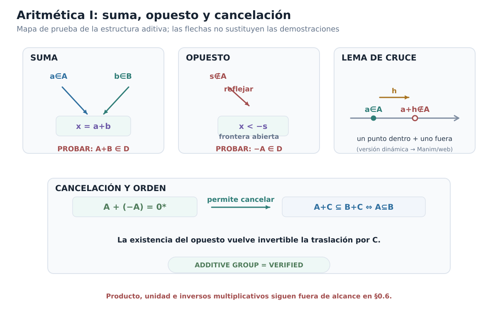

*Figura C00-F06. La estructura aditiva se construye por testigos racionales, racionales exteriores y el lema de cruce; el opuesto permite cancelar traslaciones.*

### Lo que hemos construido

El paso de §0.5 a §0.6 es sustancial. Allí $\mathcal D$ era sólo un conjunto linealmente ordenado que contenía una copia ordenada de $\mathbb Q$. Ahora sus elementos pueden sumarse, poseen un cero y un opuesto, y la suma es compatible con el orden.

Además, cuando restringimos esta suma a las cortaduras racionales, recuperamos exactamente la suma que ya conocíamos en $\mathbb Q$.

Pero un cuerpo necesita más.

Todavía debemos responder:

$$
\boxed{
\text{¿cómo multiplicar cortaduras y cómo invertir una cortadura no nula?}
}
$$

El producto será más delicado que la suma porque el signo importa. Primero tendremos que entender qué significa positividad dentro de $\mathcal D$, definir el producto en el sector positivo y sólo después extenderlo coherentemente a todos los casos.

### Antes de seguir

[]{#MA-MIC-ANM-01-000-032}

1. En la prueba de clausura de $A+B$, explica por qué cualquier racional exterior $u\notin A$ domina estrictamente a todo $a\in A$.
[]{#MA-MIC-ANM-01-000-033}

2. Demuestra de nuevo $p^*+q^*=(p+q)^*$ buscando explícitamente, para $x<p+q$, dos racionales $a<p$ y $b<q$ cuya suma sea exactamente $x$.
[]{#MA-MIC-ANM-01-000-034}

3. ¿Por qué el conjunto $\{-s:s\notin A\}$ no sirve en general como definición de $-A$? Examina el caso $A=q^*$.
[]{#MA-MIC-ANM-01-000-035}

4. En el lema de aproximación racional, ¿dónde se usa la propiedad arquimediana de $\mathbb Q$?
[]{#MA-MIC-ANM-01-000-036}

5. Sigue con detalle la inclusión $0^*\subseteq A+(-A)$ e identifica para qué se introduce $h=-x/2$.
[]{#MA-MIC-ANM-01-000-037}

6. Demuestra que $A\subseteq B$ si y sólo si $A+C\subseteq B+C$ usando el opuesto de $C$.
[]{#MA-MIC-ANM-01-000-038}

7. Verifica directamente que $-(q^*)=(-q)^*$.
[]{#MA-MIC-ANM-01-000-039}

8. ¿Qué parte exacta de la estructura de cuerpo falta todavía antes de poder certificar $\mathbb Q\hookrightarrow\mathcal D$ como incrustación de cuerpos ordenados?

La estructura aditiva está cerrada. En la próxima sección construiremos la multiplicación, la unidad y los inversos multiplicativos; sólo entonces podremos decidir si $\mathcal D$ es realmente un cuerpo ordenado.

## 0.7. Dar aritmética a las cortaduras II: producto e inverso

La suma pudo construirse directamente a partir de sumas racionales. Para el producto aparece una dificultad nueva: **el signo importa**.

Si intentáramos copiar sin más la receta aditiva y definiéramos un producto usando todos los números $ab$ con $a\in A$ y $b\in B$, fracasaríamos incluso antes de estudiar las leyes algebraicas. Toda cortadura contiene racionales negativos arbitrariamente pequeños. Si $a$ y $b$ son muy negativos, el producto $ab$ puede ser positivo y arbitrariamente grande. El conjunto generado de esa manera dejaría de representar la frontera que buscamos.

La salida correcta será gradual:

$$
\boxed{
\text{producto positivo}
\longrightarrow
\text{todos los signos}
\longrightarrow
\text{unidad}
\longrightarrow
\text{inversos}
\longrightarrow
\text{leyes de cuerpo}.
}
$$

No vamos a suponer ninguna multiplicación real previa. Cada paso se construirá usando únicamente la aritmética racional y la estructura aditiva de $\mathcal D$ obtenida en §0.6.

### Positividad dentro de $\mathcal D$

Recordemos que

$$
0^*=\{q\in\mathbb Q:q<0\}.
$$

Como el orden de $\mathcal D$ es la inclusión, diremos que una cortadura $A$ es **estrictamente positiva** cuando

$$
0^*\subsetneq A.
$$

Esta condición tiene dos formas equivalentes muy útiles.

> **Lema.** Para $A\in\mathcal D$, son equivalentes:
>
> 1. $0^*<_{\mathcal D}A$;
> 2. $0\in A$;
> 3. existe $a\in A$ con $a>0$.

**Demostración.** Si $0^*\subsetneq A$, existe $x\in A\setminus0^*$. Entonces $x\ge0$. Si $x=0$, ya tenemos $0\in A$; si $x>0$, la clausura hacia abajo de $A$ da igualmente $0\in A$.

Si $0\in A$, la ausencia de máximo proporciona $a\in A$ con $0<a$.

Finalmente, si $a\in A$ y $a>0$, todo $q<0$ satisface $q<a$, luego $q\in A$. Así $0^*\subseteq A$, y la inclusión es estricta porque $a\in A\setminus0^*$. $\square$

Escribiremos

$$
A_{>0}:=\{a\in A:a>0\}.
$$

Cuando $A>0^*$, el lema garantiza que $A_{>0}$ no es vacío.

### El producto de dos cortaduras positivas

Sean $A,B>0^*$. Definimos primero

$$
\boxed{
A\cdot_+B
=
\{x\in\mathbb Q:
\exists a\in A_{>0}\ \exists b\in B_{>0}
\text{ tales que }x<ab\}.
}
$$

La desigualdad estricta $x<ab$ es deliberada. No tomamos sólo los productos $ab$; tomamos todo el lado racional situado por debajo de alguno de esos productos.

> **Proposición.** Si $A,B>0^*$, entonces $A\cdot_+B$ es una cortadura estrictamente positiva.

**Demostración.** Como $A$ y $B$ son positivos, existen $a\in A$ y $b\in B$ con $a,b>0$. Entonces

$$
0<ab,
$$

de modo que $0\in A\cdot_+B$. El conjunto es no vacío y, una vez verificada la condición de cortadura, será positivo.

Para probar que es propio, elijamos racionales exteriores

$$
u\notin A,
\qquad
v\notin B.
$$

Como $A$ y $B$ contienen racionales positivos, todo racional exterior está por encima de esos elementos y, en particular,

$$
u>0,
\qquad
v>0.
$$

Si $a\in A_{>0}$ y $b\in B_{>0}$, entonces

$$
a<u,
\qquad
b<v,
$$

y por compatibilidad del orden racional con el producto positivo,

$$
ab<ub<uv.
$$

Por tanto ningún par de testigos puede satisfacer $uv<ab$. Así

$$
uv\notin A\cdot_+B,
$$

y el conjunto es propio.

La clausura hacia abajo es inmediata: si $x<ab$ y $y<x$, entonces

$$
y<x<ab,
$$

y los mismos $a,b$ prueban $y\in A\cdot_+B$.

Para la ausencia de máximo, si $x\in A\cdot_+B$, existen $a\in A_{>0}$ y $b\in B_{>0}$ con $x<ab$. Por densidad de $\mathbb Q$ existe $y$ tal que

$$
x<y<ab.
$$

Los mismos testigos muestran $y\in A\cdot_+B$. Ningún elemento puede ser máximo.

Hemos obtenido una cortadura y, como contiene $0$, es estrictamente positiva. Por tanto

$$
\boxed{A\cdot_+B\in\mathcal D\quad\text{y}\quad A\cdot_+B>0^*.}
$$

$\square$

### El producto racional positivo reaparece

Antes de extender el producto a signos arbitrarios, comprobemos que la nueva regla hace lo correcto sobre los racionales positivos.

> **Proposición.** Si $p,q\in\mathbb Q$ y $p,q>0$, entonces
>
> $$
> \boxed{p^*\cdot_+q^*=(pq)^*.}
> $$

**Demostración.** Si $x\in p^*\cdot_+q^*$, existen

$$
0<a<p,
\qquad
0<b<q,
$$

con $x<ab$. Como

$$
ab<pb<pq,
$$

tenemos $x<pq$, luego $x\in(pq)^*$.

Recíprocamente, sea $x<pq$. Si $x\le0$, elegimos racionales

$$
0<a<p,
\qquad
0<b<q.
$$

Entonces $x\le0<ab$, de modo que $x\in p^*\cdot_+q^*$.

Supongamos ahora

$$
0<x<pq.
$$

Como $q>0$,

$$
\frac{x}{q}<p.
$$

Por densidad de $\mathbb Q$ elegimos $a$ con

$$
\frac{x}{q}<a<p.
$$

Entonces $a>0$ y $x<aq$, por lo que

$$
\frac xa<q.
$$

Otra aplicación de la densidad proporciona $b$ tal que

$$
\frac xa<b<q.
$$

Así $0<a<p$, $0<b<q$ y $x<ab$. Por tanto $x\in p^*\cdot_+q^*$.

La doble inclusión prueba

$$
\boxed{p^*\cdot_+q^*=(pq)^*.}
$$

$\square$

### Extender el producto a todos los signos

En §0.6 demostramos que $(\mathcal D,+,0^*)$ es un grupo abeliano ordenado. De ahí obtenemos inmediatamente dos hechos.

Primero, el opuesto es involutivo:

$$
\boxed{-(-A)=A.}
$$

En efecto, $A$ y $-(-A)$ son ambos inversos aditivos de $-A$, y el inverso aditivo es único.

Segundo, el opuesto invierte el signo. Si $A<0^*$, al sumar $-A$ a ambos lados obtenemos

$$
0^*<-A.
$$

Análogamente,

$$
A>0^*
\quad\Longleftrightarrow\quad
-A<0^*.
$$

Como el orden de $\mathcal D$ es lineal, toda cortadura cae exactamente en uno de los tres casos

$$
A<0^*,
\qquad
A=0^*,
\qquad
A>0^*.
$$

Ya podemos definir el producto general.

> **Definición.** Para $A,B\in\mathcal D$, definimos
>
> $$
> \boxed{
> A\cdot B=
> \begin{cases}
> 0^*,&A=0^*\text{ o }B=0^*,\\[1ex]
> A\cdot_+B,&A>0^*,\ B>0^*,\\[1ex]
> (-A)\cdot_+(-B),&A<0^*,\ B<0^*,\\[1ex]
> -\bigl(A\cdot_+(-B)\bigr),&A>0^*>B,\\[1ex]
> -\bigl((-A)\cdot_+B\bigr),&B>0^*>A.
> \end{cases}
> }
> $$

Los cinco casos son exhaustivos y disjuntos. En cada aparición de $\cdot_+$ los argumentos son estrictamente positivos, y por la proposición anterior el resultado vuelve a ser una cortadura. Por tanto

$$
\boxed{
\cdot:\mathcal D\times\mathcal D\longrightarrow\mathcal D
}
$$

es una operación bien definida.

La regla de signos queda incorporada en la propia definición: el producto de dos cortaduras no nulas del mismo signo es positivo; el de signos opuestos es negativo.

Éste es uno de los puntos donde usamos explícitamente el marco clásico fijado al comienzo del capítulo: el orden lineal permite decidir conceptualmente entre los tres casos de signo. No estamos afirmando que esa separación constituya un algoritmo efectivo para una representación arbitraria de cortaduras.

### El producto racional se conserva para todos los signos

La verificación positiva ya está hecha. Los otros signos se reducen a ella mediante

$$
-(q^*)=(-q)^*.
$$

Si $p,q<0$, entonces $-p,-q>0$ y

$$
\begin{aligned}
p^*\cdot q^*
&=(-p)^*\cdot_+(-q)^*\\
&=((-p)(-q))^*\\
&=(pq)^*.
\end{aligned}
$$

Si $p>0>q$, entonces

$$
\begin{aligned}
p^*\cdot q^*
&=-\bigl(p^*\cdot_+(-q)^*\bigr)\\
&=-\bigl(p(-q)\bigr)^*\\
&=(pq)^*.
\end{aligned}
$$

El caso $q>0>p$ es simétrico, y si alguno es cero ambos miembros son $0^*$.

Por tanto, para **todos** $p,q\in\mathbb Q$,

$$
\boxed{
 p^*\cdot q^*=(pq)^*.
}
$$

La segunda gran obligación algebraica de la copia racional queda cerrada.

### La unidad multiplicativa

Definimos

$$
1_{\mathcal D}:=1^*.
$$

Como $0<1$, §0.5 da

$$
0^*<1^*.
$$

En particular,

$$
0^*\ne1^*.
$$

Veamos primero cómo actúa $1^*$ sobre una cortadura positiva $A$.

> **Proposición.** Si $A>0^*$, entonces
>
> $$
> \boxed{A\cdot_+1^*=A=1^*\cdot_+A.}
> $$

**Demostración.** Sea $x\in A\cdot_+1^*$. Existen $a\in A$ y $b\in\mathbb Q$ con

$$
0<a,
\qquad
0<b<1,
\qquad
x<ab.
$$

Como $ab<a$, tenemos $x<a$, y la clausura hacia abajo de $A$ da $x\in A$. Así

$$
A\cdot_+1^*\subseteq A.
$$

Para la inclusión inversa, sea $x\in A$. Si $x\le0$, elegimos cualquier $a\in A$ positivo y cualquier racional $b$ con $0<b<1$; entonces $x<ab$, de modo que $x\in A\cdot_+1^*$.

Si $x>0$, la ausencia de máximo proporciona $a\in A$ con $x<a$. Entonces

$$
0<\frac xa<1.
$$

Por densidad elegimos $b$ tal que

$$
\frac xa<b<1.
$$

Así $b\in1^*$, $b>0$ y $x<ab$. Por tanto $x\in A\cdot_+1^*$.

La identidad por la izquierda se obtiene con los mismos testigos, intercambiados. $\square$

Si $A=0^*$, la identidad es inmediata por definición del producto general. Si $A<0^*$, entonces $-A>0^*$ y

$$
A\cdot1^*
=
-\bigl((-A)\cdot_+1^*\bigr)
=
-(-A)
=
A.
$$

Análogamente $1^*\cdot A=A$. Hemos demostrado

$$
\boxed{A\cdot1^*=A=1^*\cdot A\qquad(A\in\mathcal D).}
$$

### Construir el recíproco positivo

La unidad no basta: para obtener un cuerpo, toda cortadura no nula debe poseer inverso multiplicativo.

Comencemos otra vez en el sector positivo. Sea $A>0^*$. Los racionales positivos exteriores $s\notin A$ quedan por encima de todos los racionales positivos interiores de $A$. Sus recíprocos, por tanto, apuntan hacia la frontera inversa.

Definimos

$$
\boxed{
A^{-1,+}
=
\left\{
q\in\mathbb Q:
q\le0
\text{ o }
\exists s>0\;
\bigl(s\notin A\ \text{y}\ q<s^{-1}\bigr)
\right\}.
}
$$

> **Proposición.** Si $A>0^*$, entonces $A^{-1,+}$ es una cortadura estrictamente positiva.

**Demostración.** Como $0\le0$, tenemos

$$
0\in A^{-1,+}.
$$

Así el conjunto es no vacío.

Como $A$ es positiva, existe $a\in A$ con $a>0$. Afirmamos que

$$
a^{-1}\notin A^{-1,+}.
$$

No pertenece por la primera cláusula porque $a^{-1}>0$. Si perteneciera por la segunda, existiría $s>0$ con

$$
s\notin A
\qquad\text{y}\qquad
a^{-1}<s^{-1}.
$$

Para racionales positivos, invertir revierte el orden; por tanto

$$
s<a.
$$

Pero $a\in A$ y $A$ es cerrado hacia abajo, así que $s\in A$, contradicción. El conjunto es propio.

La clausura hacia abajo se verifica directamente. Si $q\le0$ y $r<q$, entonces $r\le0$. Si, en cambio, $q<s^{-1}$ para algún $s>0$ exterior y $r<q$, entonces

$$
r<q<s^{-1},
$$

y el mismo $s$ demuestra $r\in A^{-1,+}$.

Falta la ausencia de máximo. Si $q<0$, entonces

$$
q<0\in A^{-1,+}.
$$

Si $q=0$, como $A$ es propio existe $s\notin A$; además $s>0$, pues $0\in A$ y cualquier $s\le0$ pertenecería a $A$. Por densidad elegimos

$$
0<r<s^{-1}.
$$

Entonces $r\in A^{-1,+}$ y $r>q$.

Finalmente, si $q>0$ pertenece a $A^{-1,+}$, existe $s>0$, $s\notin A$, con

$$
q<s^{-1}.
$$

Por densidad elegimos

$$
q<r<s^{-1}.
$$

El mismo $s$ muestra $r\in A^{-1,+}$.

Así $A^{-1,+}$ es una cortadura. Como contiene $0$, es estrictamente positiva. $\square$

### El recíproco positivo cumple la ley del inverso

La construcción anterior sólo merece llamarse recíproco si su producto con $A$ es exactamente $1^*$.

> **Teorema.** Si $A>0^*$, entonces
>
> $$
> \boxed{
> A\cdot_+A^{-1,+}=1^*=A^{-1,+}\cdot_+A.
> }
> $$

**Demostración.** Probemos primero

$$
A\cdot_+A^{-1,+}\subseteq1^*.
$$

Sea $x\in A\cdot_+A^{-1,+}$. Existen $a\in A$, $a>0$, y $b\in A^{-1,+}$, $b>0$, tales que

$$
x<ab.
$$

Como $b>0$, su pertenencia al recíproco no puede venir de la cláusula $b\le0$. Existe entonces $s>0$, $s\notin A$, con

$$
b<s^{-1}.
$$

Todo elemento de $A$ está estrictamente por debajo de todo racional exterior, de modo que

$$
a<s.
$$

Por tanto

$$
x<ab<a\,s^{-1}=\frac as<1.
$$

Así $x\in1^*$.

Para la inclusión inversa, sea

$$
x<1.
$$

Si $x\le0$, basta elegir $a\in A$ positivo y $b\in A^{-1,+}$ positivo; entonces $x<ab$, y por tanto $x\in A\cdot_+A^{-1,+}$.

Supongamos

$$
0<x<1.
$$

Elijamos $c\in A$ con $c>0$. Como $(1-x)c>0$, por densidad de $\mathbb Q$ elegimos

$$
0<h<(1-x)c.
$$

Aplicamos ahora el lema de aproximación racional de §0.6: existe $a\in A$ tal que

$$
s:=a+h\notin A.
$$

Como $c\in A$ y $s\notin A$, necesariamente $c<s=a+h$, de donde

$$
a>c-h>0.
$$

Además,

$$
(1-x)(c-h)-xh=(1-x)c-h>0.
$$

Como $a>c-h$ y $1-x>0$,

$$
(1-x)a>xh.
$$

Reordenando,

$$
a>x(a+h)=xs.
$$

Por tanto

$$
\frac xa<\frac1s.
$$

La densidad racional permite elegir $b$ con

$$
\frac xa<b<\frac1s.
$$

Tenemos $b>0$, y como $s>0$, $s\notin A$ y $b<s^{-1}$,

$$
b\in A^{-1,+}.
$$

Además $x<ab$. Luego

$$
x\in A\cdot_+A^{-1,+}.
$$

Así $1^*\subseteq A\cdot_+A^{-1,+}$, y la igualdad queda demostrada.

La igualdad con los factores intercambiados se obtiene con los mismos testigos, usando la conmutatividad de la multiplicación racional $ab=ba$ dentro de la definición de $\cdot_+$. $\square$

El punto técnico más delicado ha sido obtener simultáneamente un racional interior $a$ y uno exterior $s=a+h$ suficientemente próximos para que entre $x/a$ y $1/s$ quede espacio racional. Ése es exactamente el motivo por el que el lema de aproximación de §0.6 era necesario.

### El inverso de una cortadura no nula

Sea ahora $A\ne0^*$. Por tricotomía, $A$ es positiva o negativa. Definimos

$$
\boxed{
A^{-1}
=
\begin{cases}
A^{-1,+},&A>0^*,\\[1ex]
-\bigl((-A)^{-1,+}\bigr),&A<0^*.
\end{cases}
}
$$

Si $A>0^*$, la ley del inverso ya está demostrada. Supongamos $A<0^*$ y pongamos

$$
B=-A>0^*.
$$

Entonces

$$
A^{-1}=-B^{-1,+}.
$$

Los dos factores $A$ y $A^{-1}$ son negativos. Por la definición signada del producto y la involutividad del opuesto,

$$
\begin{aligned}
A\cdot A^{-1}
&=(-A)\cdot_+(-A^{-1})\\
&=B\cdot_+B^{-1,+}\\
&=1^*.
\end{aligned}
$$

El producto en el orden inverso se demuestra igual. Por tanto

$$
\boxed{
A\cdot A^{-1}=1^*=A^{-1}\cdot A
\qquad(A\ne0^*).
}
$$

Todo elemento no nulo de $\mathcal D$ posee ya inverso multiplicativo.

### Conmutatividad y asociatividad del producto

Para el producto positivo, la conmutatividad es inmediata a partir de los testigos:

$$
x<ab
\quad\Longleftrightarrow\quad
x<ba.
$$

Por tanto

$$
\boxed{A\cdot_+B=B\cdot_+A}
$$

para $A,B>0^*$.

La asociatividad requiere una verificación ligeramente más cuidadosa porque la definición usa desigualdades, no productos frontera exactos.

> **Proposición.** Si $A,B,C>0^*$, entonces
>
> $$
> \boxed{(A\cdot_+B)\cdot_+C=A\cdot_+(B\cdot_+C).}
> $$

**Demostración.** Sea

$$
x\in(A\cdot_+B)\cdot_+C.
$$

Existen $u>0$ y $c\in C_{>0}$ tales que

$$
u\in A\cdot_+B,
\qquad
x<uc.
$$

A su vez existen $a\in A_{>0}$ y $b\in B_{>0}$ con

$$
u<ab.
$$

Como $c>0$,

$$
x<uc<abc.
$$

Si $x\le0$, elegimos por densidad cualquier $v$ con

$$
0<v<bc.
$$

Entonces $v\in B\cdot_+C$ y $x<0<av$, de modo que $x\in A\cdot_+(B\cdot_+C)$.

Si $x>0$, de $x<abc$ obtenemos

$$
\frac xa<bc.
$$

Por densidad elegimos

$$
\frac xa<v<bc.
$$

Entonces $v>0$, $v\in B\cdot_+C$ y $x<av$. Así

$$
(A\cdot_+B)\cdot_+C
\subseteq
A\cdot_+(B\cdot_+C).
$$

Para la inclusión inversa, partimos de

$$
x\in A\cdot_+(B\cdot_+C).
$$

Existen $a\in A_{>0}$ y $v>0$ con

$$
v\in B\cdot_+C,
\qquad
x<av.
$$

Escogemos $b\in B_{>0}$ y $c\in C_{>0}$ tales que $v<bc$. Así

$$
x<av<abc.
$$

Si $x\le0$, elegimos $u$ con $0<u<ab$ y obtenemos $x<0<uc$. Si $x>0$, elegimos por densidad

$$
\frac xc<u<ab.
$$

En ambos casos $u\in A\cdot_+B$ y $x<uc$, por lo que

$$
x\in(A\cdot_+B)\cdot_+C.
$$

La doble inclusión prueba la asociatividad positiva. $\square$

Para extender estas leyes a todos los signos, cada cortadura no nula puede escribirse como una **parte positiva** acompañada de un signo: si $A>0^*$ usamos $A$; si $A<0^*$ usamos $-A>0^*$. La definición del producto dice exactamente que el núcleo positivo se multiplica mediante $\cdot_+$ y aparece un opuesto exterior si y sólo si hay un número impar de factores negativos.

De aquí se obtiene, sin dejar casos sin cubrir:

$$
\boxed{A\cdot B=B\cdot A}
$$

y

$$
\boxed{(A\cdot B)\cdot C=A\cdot(B\cdot C)}
$$

para cualesquiera $A,B,C\in\mathcal D$: si alguno es cero, ambos miembros son $0^*$; si ninguno es cero, los dos lados poseen el mismo signo y el mismo núcleo positivo, iguales por conmutatividad y asociatividad de $\cdot_+$.

### La distributividad positiva

Nos falta la ley que conecta las dos operaciones.

> **Proposición.** Si $A,B,C>0^*$, entonces
>
> $$
> \boxed{A\cdot_+(B+C)=(A\cdot_+B)+(A\cdot_+C).}
> $$

**Demostración.** Primero observemos que $B+C$ es positiva: como $0\in B$ y $0\in C$,

$$
0=0+0\in B+C.
$$

Sea

$$
x\in A\cdot_+(B+C).
$$

Existen $a\in A_{>0}$ y $u\in(B+C)_{>0}$ tales que

$$
x<au.
$$

Por definición de suma,

$$
u=b_0+c_0
$$

para ciertos $b_0\in B$ y $c_0\in C$. Como $u>0$, podemos reemplazar esta representación por otra

$$
u=b+c
$$

con $b\in B_{>0}$ y $c\in C_{>0}$. En efecto, si ya $b_0,c_0>0$ no hay nada que hacer. Si, por ejemplo, $b_0\le0$, entonces $c_0>0$. Elegimos algún $d\in B$ positivo y luego un racional

$$
0<b<\min\{u,d\}.
$$

Así $b\in B$, y definiendo $c=u-b$ tenemos $c>0$ y, como $b>b_0$,

$$
c=u-b<u-b_0=c_0,
$$

por lo que $c\in C$. El otro caso es simétrico.

Tenemos entonces

$$
x<a(b+c)=ab+ac.
$$

Como $x-ac<ab$, por densidad elegimos $y$ con

$$
x-ac<y<ab.
$$

Definimos

$$
z=x-y.
$$

Entonces $y\in A\cdot_+B$, mientras que

$$
z=x-y<ac
$$

implica $z\in A\cdot_+C$. Como $x=y+z$,

$$
x\in(A\cdot_+B)+(A\cdot_+C).
$$

Esto prueba una inclusión.

Recíprocamente, sea

$$
x\in(A\cdot_+B)+(A\cdot_+C).
$$

Existen $y,z$ tales que

$$
x=y+z,
\qquad
y\in A\cdot_+B,
\qquad
z\in A\cdot_+C.
$$

Podemos escoger

$$
a_1,a_2\in A_{>0},
\qquad
b\in B_{>0},
\qquad
c\in C_{>0}
$$

con

$$
y<a_1b,
\qquad
z<a_2c.
$$

Sea $m=\max\{a_1,a_2\}$. Como $m\in A$ y $A$ no tiene máximo, existe $a\in A$ con

$$
m<a.
$$

Entonces $a>0$, $a_1<a$ y $a_2<a$. Como $b,c>0$,

$$
\begin{aligned}
x
&=y+z\\
&<a_1b+a_2c\\
&<ab+ac\\
&=a(b+c).
\end{aligned}
$$

Además $b+c\in B+C$ y $b+c>0$. Por tanto

$$
x\in A\cdot_+(B+C).
$$

La doble inclusión demuestra la distributividad positiva. $\square$

### Reglas de signo y distributividad general

De la definición signada del producto se deducen, para cualesquiera $A,B\in\mathcal D$,

$$
\boxed{(-A)\cdot B=-(A\cdot B),}
$$

$$
\boxed{A\cdot(-B)=-(A\cdot B),}
$$

y

$$
\boxed{(-A)\cdot(-B)=A\cdot B.}
$$

Si alguno de los factores es cero, las identidades son inmediatas. Si ambos son no nulos, la tricotomía de signos reduce cada miembro al mismo producto positivo, con exactamente el mismo número de opuestos exteriores. La involutividad $-(-A)=A$ cierra los casos.

Ahora fijemos $A>0^*$ y permitamos que $B,C$ tengan cualquier signo. Si $B$ y $C$ son ambos positivos, ya tenemos la distributividad. Si ambos son negativos, escribimos

$$
B=-B_0,
\qquad
C=-C_0
$$

con $B_0,C_0>0^*$. Entonces

$$
B+C=-(B_0+C_0),
$$

y las reglas de signo junto con la distributividad positiva producen

$$
A(B+C)=AB+AC.
$$

Queda el caso de signos opuestos. Supongamos, por ejemplo,

$$
B>0^*>C,
$$

y pongamos $C_0=-C>0^*$. Por linealidad del orden, exactamente una de las tres relaciones

$$
B=C_0,
\qquad
C_0<B,
\qquad
B<C_0
$$

se cumple.

Si $B=C_0$, entonces $B+C=0^*$ y ambos miembros de la distributividad son $0^*$.

Si $C_0<B$, definimos

$$
D=B-C_0=B+(-C_0).
$$

Por compatibilidad del orden con las traslaciones, $D>0^*$ y

$$
C_0+D=B.
$$

La distributividad positiva da

$$
AB=AC_0+AD.
$$

Cancelando $AC_0$ en el grupo aditivo,

$$
AD=AB-AC_0=AB+AC.
$$

Pero $D=B+C$. Luego

$$
A(B+C)=AB+AC.
$$

Si $B<C_0$, definimos

$$
D=C_0-B>0^*.
$$

Entonces $C_0=B+D$, de modo que la distributividad positiva da

$$
AC_0=AB+AD.
$$

Tras cancelar $AB$ obtenemos

$$
AB-AC_0=-AD.
$$

Como $B+C=-D$ y $AC=-AC_0$, esto vuelve a ser exactamente

$$
A(B+C)=AB+AC.
$$

El caso $B<0^*<C$ se obtiene intercambiando $B$ y $C$ y usando la conmutatividad de la suma.

Así, para **todo** $A>0^*$ y todos $B,C\in\mathcal D$,

$$
A(B+C)=AB+AC.
$$

Si ahora $A<0^*$, escribimos $A=-A_0$ con $A_0>0^*$. Entonces

$$
\begin{aligned}
A(B+C)
&=-\bigl(A_0(B+C)\bigr)\\
&=-(A_0B+A_0C)\\
&=(-A_0B)+(-A_0C)\\
&=AB+AC.
\end{aligned}
$$

Si $A=0^*$ la identidad es inmediata. Hemos demostrado la distributividad general:

$$
\boxed{A(B+C)=AB+AC.}
$$

La distributividad por la derecha se sigue de la conmutatividad del producto:

$$
\boxed{(B+C)A=BA+CA.}
$$

No quedan casos de signo abiertos.

### Compatibilidad del orden con el producto

La compatibilidad con la suma ya quedó demostrada en §0.6:

$$
A\le_{\mathcal D}B
\quad\Longrightarrow\quad
A+C\le_{\mathcal D}B+C.
$$

Para la multiplicación basta verificar la positividad del producto de elementos no negativos. Si

$$
0^*\le A,
\qquad
0^*\le B,
$$

cada factor es cero o estrictamente positivo. Si alguno es cero,

$$
AB=0^*.
$$

Si ambos son positivos, la construcción de $\cdot_+$ demostró que

$$
AB>0^*.
$$

Por tanto

$$
\boxed{
0^*\le A,\ 0^*\le B
\quad\Longrightarrow\quad
0^*\le AB.
}
$$

Ésta es exactamente la compatibilidad multiplicativa que exige un cuerpo ordenado.

### Ya tenemos un cuerpo ordenado

Podemos reunir todas las verificaciones.

De §0.6 sabemos que

$$
(\mathcal D,+,0^*)
$$

es un grupo abeliano.

En esta sección hemos demostrado que:

- el producto es una operación interna en $\mathcal D$;
- es conmutativo y asociativo;
- $1^*$ es unidad y $1^*\ne0^*$;
- todo $A\ne0^*$ posee un inverso multiplicativo $A^{-1}$;
- el producto distribuye respecto de la suma;
- el orden lineal por inclusión es compatible con suma y producto de elementos no negativos.

Por tanto

$$
\boxed{
(\mathcal D,+,\cdot,\le_{\mathcal D})
\text{ es un cuerpo ordenado}.
}
$$

Éste es el primer cierre estructural completo de la construcción.

Pero **todavía no** hemos demostrado completitud. No podemos cerrar aún la pregunta de existencia formulada en §0.1, porque nuestra especificación pedía un **cuerpo ordenado completo**, no sólo un cuerpo ordenado.

### La copia racional queda finalmente certificada como cuerpo ordenado

Regresemos ahora a la aplicación construida en §0.5:

$$
\iota_{\mathbb Q}(q)=q^*.
$$

Ya habíamos probado:

$$
p<q
\quad\Longleftrightarrow\quad
p^*\subsetneq q^*,
$$

la inyectividad, y en §0.6:

$$
(p+q)^*=p^*+q^*,
\qquad
0_{\mathcal D}=0^*,
\qquad
(-q)^*=-(q^*).
$$

Ahora añadimos

$$
(pq)^*=p^*\cdot q^*,
$$

y por definición

$$
1_{\mathcal D}=1^*.
$$

Así quedan preservados suma, producto, cero, uno y orden. En consecuencia,

$$
\boxed{
\iota_{\mathbb Q}:\mathbb Q\hookrightarrow\mathcal D
\text{ es una incrustación de cuerpos ordenados}.
}
$$

La identificación habitual queda ahora plenamente autorizada: cuando no haya peligro de confundir objetos con sus códigos, podremos escribir

$$
\mathbb Q\subseteq\mathcal D
$$

entendiendo que hemos identificado cada racional $q$ con su imagen $q^*$.

También los inversos racionales se conservan. Si $q\ne0$, entonces

$$
q^*\cdot(q^{-1})^*=(qq^{-1})^*=1^*.
$$

Por unicidad del inverso multiplicativo,

$$
\boxed{(q^{-1})^*=(q^*)^{-1}.}
$$

El certificado pendiente de §0.5 queda, por fin, completo:

```text
RATIONAL_EMBEDDING = ORDERED_FIELD_EMBEDDING_ESTABLISHED
INJECTIVE = VERIFIED
ORDER = PRESERVED_AND_REFLECTED
ADDITION = PRESERVED
MULTIPLICATION = PRESERVED
ZERO_ONE = PRESERVED
ADDITIVE_MULTIPLICATIVE_INVERSES = PRESERVED
```

La figura C00-F11 reúne ahora la arquitectura multiplicativa completa, ya demostrada, y hace visible dónde intervienen el cono positivo, los signos y el inverso.

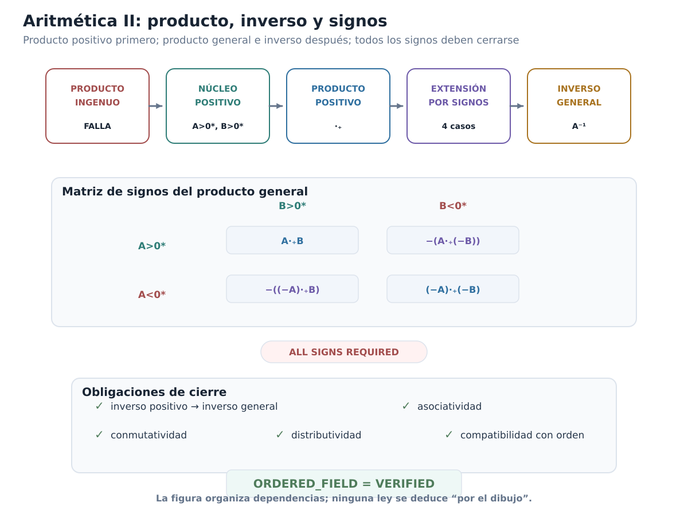

*Figura C00-F11. El producto ingenuo falla; la construcción pasa al cono positivo, se extiende a todos los signos y sólo después cierra la estructura de cuerpo ordenado.*

### Qué falta para responder «sí existen»

La construcción ha avanzado mucho. Tenemos un cuerpo ordenado concreto, formado enteramente por subconjuntos racionales, y dentro de él aparece una copia fiel de $\mathbb Q$.

Sin embargo, la especificación de §0.1 contenía una última exigencia:

$$
\boxed{\text{toda parte no vacía y acotada superiormente debe tener supremo}.}
$$

No hemos demostrado todavía esa propiedad para $\mathcal D$.

El próximo paso será sorprendentemente sencillo de formular. Si $\mathscr A\subseteq\mathcal D$ es una familia no vacía de cortaduras, el candidato natural a reunir toda la información racional situada a la izquierda de sus miembros es

$$
\bigcup_{A\in\mathscr A}A.
$$

La pregunta decisiva será si esa unión es otra cortadura y, cuando la familia está acotada superiormente, si es precisamente su menor cota superior.

### Antes de seguir

[]{#MA-MIC-ANM-01-000-040}

1. Explica por qué $\{ab:a\in A,b\in B\}$ no puede usarse como producto ingenuo de dos cortaduras arbitrarias.
[]{#MA-MIC-ANM-01-000-041}

2. Demuestra las equivalencias $A>0^*\Longleftrightarrow0\in A\Longleftrightarrow\exists a\in A$ con $a>0$.
[]{#MA-MIC-ANM-01-000-042}

3. En la clausura de $A\cdot_+B$, ¿por qué un racional exterior $u\notin A$ debe ser positivo cuando $A>0^*$?
[]{#MA-MIC-ANM-01-000-043}

4. Verifica directamente $p^*\cdot_+q^*=(pq)^*$ para $p,q>0$ y localiza dónde se usa la densidad de $\mathbb Q$.
[]{#MA-MIC-ANM-01-000-044}

5. Recorre los cinco casos de la definición del producto general y comprueba que todos los argumentos enviados a $\cdot_+$ son positivos.
[]{#MA-MIC-ANM-01-000-045}

6. ¿Por qué la definición de $A^{-1,+}$ incluye automáticamente todos los racionales $q\le0$?
[]{#MA-MIC-ANM-01-000-046}

7. En la prueba $A\cdot_+A^{-1,+}=1^*$, explica qué papel cumplen el lema de aproximación racional y la elección de $h<(1-x)c$.
[]{#MA-MIC-ANM-01-000-047}

8. Reconstruye la asociatividad positiva mostrando por qué la desigualdad $x<abc$ permite fabricar el testigo intermedio necesario en cada agrupación.
[]{#MA-MIC-ANM-01-000-048}

9. En la distributividad con signos opuestos, ¿por qué es necesario comparar $B$ con $-C$ antes de aplicar la distributividad positiva?
[]{#MA-MIC-ANM-01-000-049}

10. Enumera exactamente qué propiedades hacen ahora de $\mathcal D$ un cuerpo ordenado y cuál sigue faltando para que sea un sistema de números reales según §0.1.
[]{#MA-MIC-ANM-01-000-050}

11. Explica por qué sólo ahora queda plenamente justificada la abreviatura $\mathbb Q\subseteq\mathcal D$.

La aritmética está cerrada. Falta comprobar si el nuevo cuerpo ordenado tiene la propiedad que motivó toda la construcción: la completitud.

## 0.8. Sí existen: el supremo como unión

Volvamos a la pregunta con la que comenzó el capítulo.

En §0.1 no preguntamos simplemente si podíamos fabricar un conjunto más grande que $\mathbb Q$. Pedimos algo mucho más preciso: un sistema que fuera a la vez un cuerpo ordenado y que además tuviera la propiedad del supremo.

Después de §0.7 ya poseemos la primera mitad:

$$
\boxed{
(\mathcal D,+,\cdot,\le_{\mathcal D})
\text{ es un cuerpo ordenado}.
}
$$

También sabemos que contiene una copia de $\mathbb Q$ como subcuerpo ordenado, mediante

$$
q\longmapsto q^*.
$$

Pero la pregunta de existencia sigue incompleta mientras no respondamos:

> **Ya tenemos un cuerpo ordenado que contiene una copia de $\mathbb Q$. ¿Es completo?**

Éste es el último requisito de la especificación inicial.

Y aquí la construcción por cortaduras revela la razón profunda por la que el orden por inclusión era tan natural.

### Si queremos una frontera superior, reunamos toda la información situada a la izquierda

Sea

$$
\mathscr A\subseteq\mathcal D
$$

una familia **no vacía** de cortaduras y supongamos que está **acotada superiormente** en $\mathcal D$.

Esto significa que existe alguna cortadura

$$
U\in\mathcal D
$$

tal que

$$
A\subseteq U
\qquad
\text{para todo }A\in\mathscr A.
$$

Recordemos que en $\mathcal D$ el orden es la inclusión. Por tanto decir que $U$ es una cota superior no introduce una noción nueva: significa exactamente que $U$ contiene toda la información racional contenida en cada miembro de $\mathscr A$.

Si buscamos la **menor** cortadura con esa propiedad, parece natural no añadir ninguna información racional innecesaria. Debemos reunir solamente los racionales que ya aparecen en alguno de los miembros de la familia.

Esto conduce al candidato

$$
\boxed{
S=\bigcup_{A\in\mathscr A}A.
}
$$

Equivalentemente,

$$
q\in S
\quad\Longleftrightarrow\quad
\text{existe }A\in\mathscr A\text{ tal que }q\in A.
$$

La fórmula es sencilla. Pero todavía no podemos llamarla supremo.

Primero hay dos tareas distintas:

1. demostrar que $S$ vuelve a ser una cortadura, es decir, que $S\in\mathcal D$;
2. demostrar que $S$ es realmente la menor cota superior de $\mathscr A$.

No confundiremos ambas.

### Primer bloque: la unión vuelve a ser una cortadura

> **Proposición.** Sea $\mathscr A\subseteq\mathcal D$ no vacía y acotada superiormente. Entonces
>
> $$
> S=\bigcup_{A\in\mathscr A}A
> $$
>
> es una cortadura de Dedekind.

**Demostración.** Debemos verificar, una vez más, las cuatro condiciones de la definición.

#### 1. La unión no es vacía

Como $\mathscr A$ no es vacía, existe algún

$$
A_0\in\mathscr A.
$$

Y como $A_0$ es una cortadura, tampoco es vacía. Por tanto existe algún racional

$$
q\in A_0.
$$

Pero $A_0$ es uno de los conjuntos cuya unión forma $S$, luego

$$
q\in S.
$$

Así

$$
\boxed{S\ne\varnothing.}
$$

No hemos elegido un elemento de cada cortadura de la familia. Sólo hemos utilizado un miembro $A_0$ de la familia y un elemento suyo. No aparece aquí ninguna función de elección global.

#### 2. La unión no es todo $\mathbb Q$

Aquí se usa exactamente la hipótesis de acotación superior.

Sea $U\in\mathcal D$ una cota superior de $\mathscr A$. Entonces

$$
A\subseteq U
\qquad
\text{para todo }A\in\mathscr A.
$$

Si $q\in S$, por definición de unión existe $A\in\mathscr A$ tal que $q\in A$. Como $A\subseteq U$,

$$
q\in U.
$$

Luego

$$
S\subseteq U.
$$

Pero $U$ es una cortadura, así que

$$
U\ne\mathbb Q.
$$

Por consiguiente $S$ tampoco puede ser todo $\mathbb Q$. En efecto, si $S=\mathbb Q$, de

$$
S\subseteq U\subseteq\mathbb Q
$$

se seguiría $U=\mathbb Q$, contradicción.

Por tanto

$$
\boxed{S\ne\mathbb Q.}
$$

Obsérvese dónde se gastó la hipótesis de acotación: precisamente para impedir que la unión creciera hasta ocupar todos los racionales.

#### 3. La unión es cerrada hacia abajo

Sea

$$
q\in S
$$

y tomemos un racional $r<q$.

Como $q\in S$, existe alguna cortadura

$$
A\in\mathscr A
$$

tal que

$$
q\in A.
$$

Pero $A$ es cerrada hacia abajo. De $r<q$ y $q\in A$ obtenemos

$$
r\in A.
$$

Entonces, por definición de unión,

$$
r\in S.
$$

Así $S$ es cerrada hacia abajo.

#### 4. La unión no tiene máximo

Sea nuevamente

$$
q\in S.
$$

Existe $A\in\mathscr A$ con $q\in A$.

Como $A$ no tiene máximo, existe un racional $r\in A$ tal que

$$
q<r.
$$

Y como $A\subseteq S$,

$$
r\in S.
$$

Por tanto ningún elemento de $S$ puede ser máximo.

Hemos comprobado las cuatro condiciones:

$$
S\ne\varnothing,
\qquad
S\ne\mathbb Q,
$$

$S$ es cerrada hacia abajo y $S$ no tiene máximo. Luego

$$
\boxed{
S=\bigcup_{A\in\mathscr A}A\in\mathcal D.
}
$$

$\square$

Éste es el primer cierre. La unión no es sólo un subconjunto de $\mathbb Q$: es nuevamente un **elemento del mismo sistema ordenado** que estamos construyendo.

### Segundo bloque: la unión es el supremo

Ahora sí podemos preguntar qué posición ocupa $S$ dentro del orden de $\mathcal D$.

> **Teorema.** Si $\mathscr A\subseteq\mathcal D$ es no vacía y está acotada superiormente, entonces
>
> $$
> \boxed{
> \sup_{\mathcal D}\mathscr A
> =
> \bigcup_{A\in\mathscr A}A.
> }
> $$

**Demostración.** Un supremo debe satisfacer dos propiedades:

1. ser cota superior;
2. estar por debajo de cualquier otra cota superior.

Verifiquemos ambas.

#### La unión es una cota superior

Sea $A\in\mathscr A$.

Todo elemento de $A$ pertenece, por definición, a la unión de todos los miembros de $\mathscr A$. Por tanto

$$
A\subseteq S.
$$

Como el orden de $\mathcal D$ es la inclusión,

$$
A\le_{\mathcal D}S.
$$

Esto vale para todo $A\in\mathscr A$. Así $S$ es una cota superior de la familia.

#### La unión es la menor cota superior

Sea ahora $V\in\mathcal D$ cualquier cota superior de $\mathscr A$.

Entonces

$$
A\subseteq V
\qquad
\text{para todo }A\in\mathscr A.
$$

Tomemos un racional cualquiera

$$
q\in S.
$$

Por definición de unión existe algún $A\in\mathscr A$ con

$$
q\in A.
$$

Como $V$ es cota superior,

$$
A\subseteq V,
$$

y por tanto

$$
q\in V.
$$

Hemos demostrado

$$
S\subseteq V.
$$

En el orden de $\mathcal D$ esto significa

$$
S\le_{\mathcal D}V.
$$

Por tanto $S$ es menor o igual que cualquier cota superior de $\mathscr A$.

Las dos condiciones juntas prueban

$$
\boxed{
S=\sup_{\mathcal D}\mathscr A.
}
$$

$\square$

La identidad merece quedar aislada:

$$
\boxed{
\sup_{\mathcal D}\mathscr A
=
\bigcup\mathscr A.
}
$$

No es una analogía ni una regla mnemotécnica. Es literalmente la fórmula del supremo en el modelo de Dedekind.

### Por qué la fórmula es tan natural

Una cortadura codifica una posición mediante todos los racionales que quedan a su izquierda.

Si $\mathscr A$ es una familia de posiciones y queremos una posición que quede por encima de todas ellas, deberá contener todos los racionales que aparecen a la izquierda de cualquiera de sus miembros. Eso obliga a incluir

$$
\bigcup\mathscr A.
$$

Pero si añadimos un racional que no aparece en ninguno de los miembros, estaremos introduciendo información que no es necesaria para ser cota superior.

Por eso la unión cumple simultáneamente las dos exigencias:

$$
\boxed{
\text{contiene a todos}
\quad+\quad
\text{no contiene más de lo necesario}.
}
$$

En el orden por inclusión, esas dos frases son exactamente

$$
\text{cota superior}
\quad+\quad
\text{menor cota superior}.
$$

La completitud no ha sido añadida desde fuera. Ha emergido de la propia forma en que codificamos las posiciones.

### La propiedad del supremo queda demostrada

La familia $\mathscr A$ fue arbitraria, salvo por las dos hipótesis que aparecen en la definición de completitud:

$$
\mathscr A\ne\varnothing
$$

y

$$
\mathscr A\text{ está acotada superiormente}.
$$

Hemos demostrado que para toda familia de ese tipo existe un elemento de $\mathcal D$ que es su supremo.

Por tanto

$$
\boxed{
(\mathcal D,\le_{\mathcal D})
\text{ satisface la propiedad del supremo}.
}
$$

En el lenguaje del estado interno del capítulo:

```text
SUPREMUM_PROPERTY = VERIFIED
```

Conviene notar algo fundacionalmente preciso. Para una familia $\mathscr A$ ya dada como conjunto, el candidato anterior es simplemente su unión conjuntista. No hemos supuesto ningún «supremo real» previo para construirla. Tampoco hemos usado el axioma de elección. Y la fórmula extensional

$$
\sup_{\mathcal D}\mathscr A=\bigcup\mathscr A
$$

no debe confundirse con la afirmación de que exista un algoritmo capaz de calcular el supremo a partir de una presentación arbitraria de una familia. Aquí estamos demostrando existencia matemática dentro del marco clásico fijado al comienzo del capítulo.

### El cierre que faltaba

Ahora podemos juntar por primera vez los dos certificados necesarios.

De §0.7:

```text
ORDERED_FIELD = VERIFIED
```

De la prueba recién terminada:

```text
SUPREMUM_PROPERTY = VERIFIED
```

Por definición de cuerpo ordenado completo, obtenemos:

> **Teorema de existencia.**
>
> La estructura de cortaduras de Dedekind
>
> $$
> (\mathcal D,+,\cdot,\le_{\mathcal D})
> $$
>
> es un cuerpo ordenado completo.

Es decir,

$$
\boxed{
\mathcal D
\text{ es un cuerpo ordenado completo}.
}
$$

Además, por §0.7,

$$
\iota_{\mathbb Q}:\mathbb Q\hookrightarrow\mathcal D
$$

es una incrustación de cuerpos ordenados.

Por tanto hemos construido explícitamente un sistema que satisface toda la especificación de §0.1.

La pregunta inicial recibe, por fin, una respuesta matemática:

$$
\boxed{\text{SÍ: los sistemas de números reales existen}.}
$$

Más precisamente,

$$
\boxed{
\text{existe al menos un cuerpo ordenado completo}
\text{ que contiene una copia ordenada de }\mathbb Q.
}
$$

Ésta es una afirmación de existencia, no una convención terminológica.

Hasta ahora habíamos hablado de $\mathcal D$ como un candidato construido a partir de cortaduras. Desde este momento queda autorizado decir:

$$
\boxed{
\mathcal D\text{ es un modelo de los números reales}.
}
$$

No estamos afirmando que «un número real sea, por esencia, un conjunto de racionales». Estamos diciendo que los conjuntos racionales llamados cortaduras, con las operaciones y el orden que construimos, realizan exactamente la estructura que pedíamos.

La diferencia es importante:

$$
\boxed{
\text{modelo concreto}
\neq
\text{ontología obligatoria}.
}
$$

Las cortaduras han demostrado que la especificación es realizable: existe una estructura que la satisface.

### La cortadura que antes era sólo una frontera codificada

Podemos mirar retrospectivamente a $A_2$.

En §0.4 construimos

$$
A_2=\{q\in\mathbb Q:q<0\ \text{o}\ q^2<2\}
$$

sin presuponer ningún irracional. Demostramos que era una cortadura y que no coincidía con ninguna cortadura racional $q^*$.

En aquel momento nos negamos deliberadamente a llamarla «número real»: aún no habíamos probado que el sistema de todas las cortaduras tuviera la estructura requerida.

Ahora la situación ha cambiado. Como

$$
A_2\in\mathcal D
$$

y $\mathcal D$ es un modelo de los reales, $A_2$ es legítimamente un elemento de un sistema de números reales; además no pertenece a la copia racional

$$
\iota_{\mathbb Q}(\mathbb Q).
$$

No necesitamos identificar todavía qué operación algebraica especial satisface $A_2$. Lo importante para el arco de existencia es más básico: la «posición faltante» de §0.3 ya vive dentro de un cuerpo ordenado completo que hemos construido sin asumir previamente los reales.

### La figura lógica del cierre de existencia

La figura C00-F07 concentra esta lectura en un único mapa visual.

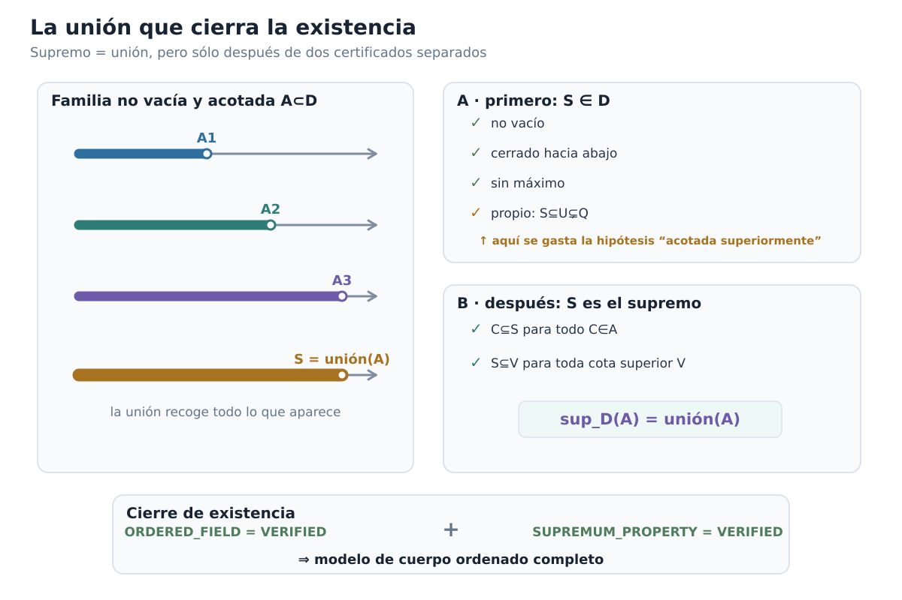

*Figura C00-F07. La unión es candidata a supremo sólo tras verificar por separado que pertenece a D y que es la menor cota superior.*

El orden de lectura de este cierre debe quedar muy claro:

$$
\boxed{
\begin{array}{c}
\mathcal D\text{ es cuerpo ordenado}\\
+\\
\text{toda familia no vacía y acotada tiene supremo}\\
\hline
\mathcal D\text{ es cuerpo ordenado completo}\\
\Downarrow\\
\text{existe un modelo de los números reales}.
\end{array}
}
$$

La unión no prueba por sí sola la existencia de los reales. La unión completa una construcción algebraica y ordenada que ya habíamos verificado.

El estado narrativo cambia aquí:

```text
EXISTENCE_QUESTION = CLOSED
```

### Pero aparece inmediatamente una nueva pregunta

Hemos construido **un** cuerpo ordenado completo.

¿Eso basta para hablar de **los** números reales?

Podría ocurrir, al menos en principio, que otra persona siguiera una construcción completamente distinta y obtuviera otro cuerpo ordenado completo, con elementos literalmente diferentes de nuestras cortaduras.

Entonces tendríamos que preguntar si ambos sistemas representan realmente la misma estructura matemática o si la especificación de §0.1 admite varias estructuras esencialmente distintas.

Éste es un problema diferente del que acabamos de resolver.

La pregunta de existencia era:

$$
\boxed{\text{¿hay al menos uno?}}
$$

La respuesta es sí.

La nueva pregunta es:

$$
\boxed{
\text{si hay dos, ¿pueden ser esencialmente diferentes?}
}
$$

Dicho de otra manera:

> **Hemos construido uno. ¿Pero hemos construido los reales, o sólo unos reales posibles?**

Para responder tendremos que abandonar por un momento la implementación concreta mediante cortaduras y estudiar cuerpos ordenados completos arbitrarios. El puente entre modelos volverá a ser el sistema racional que ambos deben contener.

### Antes de seguir

[]{#MA-MIC-ANM-01-000-051}

1. Sea $\mathscr A\subseteq\mathcal D$ no vacía. Explica por qué la unión $\bigcup\mathscr A$ es automáticamente cerrada hacia abajo, incluso antes de usar la hipótesis de acotación superior.
[]{#MA-MIC-ANM-01-000-052}

2. ¿En qué paso exacto se necesita que $\mathscr A$ esté acotada superiormente?
[]{#MA-MIC-ANM-01-000-053}

3. ¿Por qué una cota superior $U$ de $\mathscr A$ garantiza $\bigcup\mathscr A\subseteq U$?
[]{#MA-MIC-ANM-01-000-054}

4. Demuestra directamente que $\bigcup\mathscr A$ no tiene máximo usando sólo que cada miembro de $\mathscr A$ no tiene máximo.
[]{#MA-MIC-ANM-01-000-055}

5. Separa con tus propias palabras las dos afirmaciones «$S$ es una cortadura» y «$S$ es el supremo». ¿Por qué ninguna de ellas contiene automáticamente a la otra?
[]{#MA-MIC-ANM-01-000-056}

6. Si $V$ es otra cota superior, explica por qué cada $q\in S$ debe pertenecer a $V$.
[]{#MA-MIC-ANM-01-000-057}

7. ¿Por qué la identidad $\sup_{\mathcal D}\mathscr A=\bigcup\mathscr A$ no presupone la existencia previa de números reales?
[]{#MA-MIC-ANM-01-000-058}

8. ¿Qué dos certificados distintos se combinan para concluir que $\mathcal D$ es un cuerpo ordenado completo?
[]{#MA-MIC-ANM-01-000-059}

9. ¿Por qué sólo ahora queda autorizado llamar a $\mathcal D$ «un modelo de los números reales»?
[]{#MA-MIC-ANM-01-000-060}

10. Explica la diferencia entre «hemos demostrado que existe un modelo» y «hemos demostrado que el modelo es único».
[]{#MA-MIC-ANM-01-000-061}

11. ¿Por qué la existencia de $A_2\in\mathcal D$ muestra ahora algo más fuerte que lo que sabíamos de $A_2$ al terminar §0.4?

La existencia está resuelta. El próximo problema ya no consiste en fabricar un candidato, sino en determinar cuánto depende la estructura obtenida del modo concreto en que la construimos.

## 0.9. ¿Podría haber otros reales?

La pregunta de existencia ya está cerrada.

Construimos un cuerpo ordenado completo concreto, $\mathcal D$, formado por cortaduras de Dedekind. Por tanto sabemos que la especificación de §0.1 es realizable.

Pero una construcción concreta nunca responde por sí sola a una pregunta de **unicidad estructural**.

Podríamos haber elegido otra representación de las posiciones faltantes. Podríamos haber construido objetos cuyos elementos no fueran subconjuntos de $\mathbb Q$. Incluso podríamos encontrar un cuerpo ordenado completo cuyo conjunto subyacente no se pareciera en absoluto a $\mathcal D$.

La pregunta que queda es entonces:

$$
\boxed{
\text{¿todos los cuerpos ordenados completos}
\\
\text{representan esencialmente la misma estructura?}
}
$$

No intentaremos responderla comparando directamente dos codificaciones. Eso volvería a privilegiar las cortaduras.

Abandonaremos ahora la implementación concreta.

Sea

$$
F=(F,+,\cdot,0_F,1_F,\le_F)
$$

un **cuerpo ordenado completo arbitrario**.

No suponemos que sus elementos sean cortaduras. No suponemos que $F=\mathcal D$. No suponemos siquiera que sepamos cómo fueron construidos sus elementos.

Usaremos únicamente:

1. las leyes de cuerpo;
2. el orden compatible;
3. la propiedad del supremo.

La estrategia será descubrir cuánto de la estructura de $F$ queda forzado por esas tres propiedades.

El hilo conductor será el mismo sistema que nos acompañó durante toda la construcción:

$$
\boxed{\mathbb Q.}
$$

Si cualquier cuerpo ordenado completo contiene una copia canónica y densa de los racionales, entonces los racionales pueden funcionar como un **lenguaje común** para describir posiciones en modelos distintos.

Ésa será la idea central de esta sección.

### Primer paso: un cuerpo ordenado no puede tener característica positiva

La unidad de un cuerpo ordenado satisface

$$
0_F<1_F.
$$

Por invariancia del orden bajo traslación,

$$
0_F<1_F<1_F+1_F<1_F+1_F+1_F<\cdots.
$$

Formalmente, definamos los numerales de $F$ mediante

$$
\nu_F(0)=0_F,
\qquad
\nu_F(n+1)=\nu_F(n)+1_F.
$$

Por inducción,

$$
m<n
\quad\Longrightarrow\quad
\nu_F(m)<\nu_F(n).
$$

En particular,

$$
n>0
\quad\Longrightarrow\quad
\nu_F(n)>0_F,
$$

de modo que

$$
\nu_F(n)\ne0_F.
$$

Por tanto no existe entero positivo $n$ tal que

$$
\underbrace{1_F+\cdots+1_F}_{n\text{ veces}}=0_F.
$$

Esto demuestra:

$$
\boxed{\operatorname{char}F=0.}
$$

La conclusión es más importante de lo que parece. Significa que los numerales naturales no colapsan dentro de $F$ y que podemos prolongar esa copia a los enteros y luego a los racionales.

### La copia canónica de $\mathbb Z$

Los enteros no se introducen en $F$ mediante una identificación literal. Construimos una aplicación.

Si un entero está representado por la diferencia formal $m-n$, definimos

$$
\jmath_{\mathbb Z}^F(m-n)
=
\nu_F(m)-\nu_F(n).
$$

La definición es independiente de la representación.

En efecto, si

$$
m-n=p-q
$$

como enteros, entonces

$$
m+q=n+p.
$$

Aplicando la compatibilidad aditiva de $\nu_F$,

$$
\nu_F(m)+\nu_F(q)
=
\nu_F(n)+\nu_F(p),
$$

y tras trasladar términos obtenemos

$$
\nu_F(m)-\nu_F(n)
=
\nu_F(p)-\nu_F(q).
$$

Así queda bien definida una aplicación

$$
\jmath_{\mathbb Z}^F:\mathbb Z\longrightarrow F.
$$

Además preserva suma, producto, cero, uno y opuesto. La preservación y reflexión del orden se deducen del hecho de que los numerales preservan estrictamente el orden y de la aritmética ordenada de $F$.

En particular,

$$
\jmath_{\mathbb Z}^F
$$

es inyectiva.

Éste es otro modo de leer la característica cero: dentro de cualquier cuerpo ordenado aparece canónicamente una copia ordenada de $\mathbb Z$.

### La copia canónica de $\mathbb Q$

Ahora podemos incorporar divisiones.

Sea

$$
q=\frac ab\in\mathbb Q,
\qquad
a,b\in\mathbb Z,
\qquad
b\ne0.
$$

Definimos

$$
\boxed{
\iota_F(q)
=
\jmath_{\mathbb Z}^F(a)
\bigl(\jmath_{\mathbb Z}^F(b)\bigr)^{-1}.
}
$$

El inverso existe porque $b\ne0$ y $\jmath_{\mathbb Z}^F$ es inyectiva.

Debemos verificar que el valor no depende de la fracción elegida.

Si

$$
\frac ab=\frac cd,
$$

entonces

$$
ad=bc
$$

en $\mathbb Z$. Aplicando la multiplicatividad de $\jmath_{\mathbb Z}^F$,

$$
\jmath_{\mathbb Z}^F(a)\jmath_{\mathbb Z}^F(d)
=
\jmath_{\mathbb Z}^F(b)\jmath_{\mathbb Z}^F(c).
$$

Como los denominadores tienen imágenes no nulas, podemos multiplicar por sus inversos y obtenemos

$$
\jmath_{\mathbb Z}^F(a)
\bigl(\jmath_{\mathbb Z}^F(b)\bigr)^{-1}
=
\jmath_{\mathbb Z}^F(c)
\bigl(\jmath_{\mathbb Z}^F(d)\bigr)^{-1}.
$$

Por tanto $\iota_F$ está bien definida.

Las mismas fórmulas racionales muestran que

$$
\iota_F(p+q)=\iota_F(p)+\iota_F(q),
$$

$$
\iota_F(pq)=\iota_F(p)\iota_F(q),
$$

$$
\iota_F(0)=0_F,
\qquad
\iota_F(1)=1_F.
$$

Y el orden también se conserva y refleja:

$$
\boxed{
p<q
\quad\Longleftrightarrow\quad
\iota_F(p)<\iota_F(q).
}
$$

En consecuencia,

$$
\boxed{
\iota_F:\mathbb Q\hookrightarrow F
}
$$

es una incrustación de cuerpos ordenados.

No hemos usado completitud para construir esta copia. Todo cuerpo ordenado contiene ya una copia canónica de $\mathbb Q$.

Más aún, esa copia no depende de una elección arbitraria. Una incrustación de cuerpos ordenados $\mathbb Q\to F$ debe enviar $1$ a $1_F$, por lo que fija los numerales, después los enteros y finalmente las fracciones. Así, si existe una incrustación racional, es ésta.

Por eso podemos hablar con propiedad de **la** copia canónica de $\mathbb Q$ en $F$.

A partir de ahora mantendremos visible la aplicación $\iota_F$ cuando sea importante distinguir universos.

### Dónde empieza a trabajar la completitud

Hasta aquí sólo hemos usado que $F$ es un cuerpo ordenado.

Ahora gastaremos por primera vez la hipótesis adicional:

$$
\boxed{F\text{ es completo}.}
$$

La consecuencia inmediata será la propiedad arquimediana.

> **Teorema.** Todo cuerpo ordenado completo es arquimediano.

**Demostración.** Supongamos, por contradicción, que los numerales de $F$ estuvieran acotados superiormente. Es decir, que el conjunto

$$
N_F=\{\nu_F(n):n\in\mathbb N\}
$$

tuviera alguna cota superior.

Como $N_F$ es no vacío y $F$ es completo, existiría

$$
s=\sup N_F.
$$

Puesto que

$$
s-1_F<s,
$$

el elemento $s-1_F$ no puede ser también cota superior de $N_F$: de serlo, sería una cota superior estrictamente menor que el supremo.

Por tanto existe algún $n\in\mathbb N$ tal que

$$
s-1_F<\nu_F(n).
$$

Sumando $1_F$,

$$
s<\nu_F(n)+1_F
=
\nu_F(n+1).
$$

Pero $\nu_F(n+1)\in N_F$, contradiciendo que $s$ sea cota superior.

Luego los numerales no están acotados superiormente. Equivalentemente, para todo $x\in F$ existe $n\in\mathbb N$ tal que

$$
x<\nu_F(n).
$$

Por tanto

$$
\boxed{F\text{ es arquimediano}.}
$$

$\square$

Aquí la completitud tuvo un gasto preciso: produjo el supremo de la supuesta colección acotada de numerales. Sin ese supremo, la contradicción no podría formularse de esta manera.

### No saltaremos directamente a «los racionales son densos»

La arquimedianidad nos dice que los enteros alcanzan cualquier escala. Todavía necesitamos convertir esa propiedad global en una herramienta de **localización**.

Primero localizaremos cualquier elemento entre dos enteros consecutivos.

> **Lema de localización entera.** Para todo $x\in F$ existe $m\in\mathbb Z$ tal que
>
> $$
> \boxed{
> \iota_F(m-1)\le x<\iota_F(m).
> }
> $$

Aquí usamos $\iota_F(m)$, para $m\in\mathbb Z$, como abreviatura de

$$
\iota_F\bigl(\iota_{\mathbb Z\mathbb Q}(m)\bigr),
$$

es decir, de la composición

$$
\mathbb Z
\overset{\ \iota_{\mathbb Z\mathbb Q}\}{\hookrightarrow}
\mathbb Q
\overset{\ \iota_F\}{\hookrightarrow}
F.
$$

No se trata de una restricción literal salvo después de la identificación notacional explicada en §0.2.

**Demostración.** Por arquimedianidad podemos elegir $n\in\mathbb N$ tal que

$$
|x|<\nu_F(n).
$$

Si fuese necesario aumentar $n$, podemos suponer $n>0$.

Entonces

$$
-\nu_F(n)<x<\nu_F(n).
$$

Consideremos el conjunto de naturales

$$
K=
\left\{
k\in\mathbb N:
x<-\nu_F(n)+\nu_F(k)
\right\}.
$$

Este conjunto no es vacío. Por ejemplo, si tomamos $k=2n+1$, entonces

$$
-\nu_F(n)+\nu_F(2n+1)
=
\nu_F(n+1)
>
x.
$$

Por el buen orden de $\mathbb N$, $K$ tiene un elemento mínimo; llamémoslo $k_0$.

No puede ser $k_0=0$, porque

$$
-\nu_F(n)<x.
$$

Por tanto

$$
k_0=k+1
$$

para algún $k\in\mathbb N$.

La minimalidad de $k_0$ implica que $k\notin K$, es decir, no ocurre

$$
x<-\nu_F(n)+\nu_F(k).
$$

Por totalidad del orden,

$$
-\nu_F(n)+\nu_F(k)\le x.
$$

En cambio, como $k_0\in K$,

$$
x<
-\nu_F(n)+\nu_F(k+1).
$$

Definamos el entero

$$
m=-n+(k+1).
$$

Entonces su predecesor es

$$
m-1=-n+k,
$$

y las dos desigualdades anteriores se escriben exactamente como

$$
\iota_F(m-1)\le x<\iota_F(m).
$$

$\square$

Éste es el eslabón que no debe quedar oculto detrás de la palabra «arquimediano».

La propiedad arquimediana dice que la rejilla entera llega suficientemente lejos; el lema anterior dice algo más operativo: **todo elemento queda atrapado en una celda de anchura uno de esa rejilla**.

### De la rejilla entera a la rejilla racional

Ahora podemos refinar la escala.

Sean

$$
x<y
$$

en $F$.

Queremos encontrar un racional $q$ cuya imagen quede estrictamente entre ambos.

La diferencia

$$
y-x
$$

es positiva. Por tanto $(y-x)^{-1}>0$. La arquimedianidad proporciona $n\in\mathbb N$ tal que

$$
(y-x)^{-1}<\nu_F(n).
$$

Esta desigualdad obliga a $n>0$. Como ambos miembros son positivos, al invertir se revierte el orden:

$$
0<\nu_F(n)^{-1}<y-x.
$$

La compatibilidad de la copia racional con los inversos identifica

$$
\nu_F(n)^{-1}
=
\iota_F\!\left(\frac1n\right).
$$

Así,

$$
0<\iota_F\!\left(\frac1n\right)<y-x.
$$

Multipliquemos $x$ por el entero positivo $\iota_F(n)$. El lema de localización entera proporciona un entero $m$ tal que

$$
\iota_F(m-1)
\le
x\,\iota_F(n)
<
\iota_F(m).
$$

Como $\iota_F(n)>0$, dividimos por ella y obtenemos

$$
\iota_F\!\left(\frac{m-1}{n}\right)
\le
x
<
\iota_F\!\left(\frac mn\right).
$$

La primera desigualdad también implica

$$
\iota_F(m)
\le
x\,\iota_F(n)+1_F,
$$

y, dividiendo otra vez por $\iota_F(n)$,

$$
\iota_F\!\left(\frac mn\right)
\le
x+\iota_F\!\left(\frac1n\right)
<
x+(y-x)
=
y.
$$

Por tanto, para

$$
q=\frac mn\in\mathbb Q,
$$

tenemos

$$
\boxed{
x<\iota_F(q)<y.
}
$$

Hemos demostrado:

> **Teorema de densidad racional.** Para cualesquiera $x,y\in F$ con $x<y$, existe $q\in\mathbb Q$ tal que
>
> $$
> \boxed{x<\iota_F(q)<y.}
> $$

La cadena lógica queda ahora visible:

$$
\boxed{
\text{completitud}
\Rightarrow
\text{arquimedianidad}
\Rightarrow
\text{localización entera}
\Rightarrow
\text{localización racional}
\Rightarrow
\text{densidad de }\iota_F(\mathbb Q).
}
$$

No hemos usado ninguna imagen intuitiva de «racionales muy juntos». La densidad se dedujo de propiedades estructurales precisas.

La figura C00-F08 concentra esta lectura en un único mapa visual.

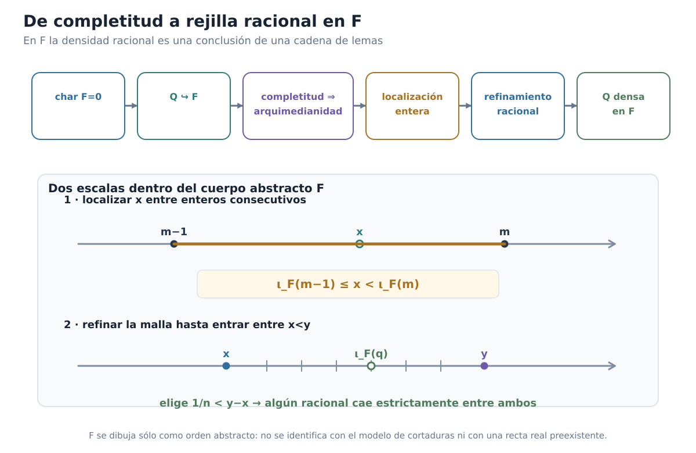

*Figura C00-F08. La densidad racional en un cuerpo completo es una conclusión de característica cero, copia racional, arquimedianidad y localización.*

### La información racional situada debajo de un elemento

Ya estamos preparados para el objeto que permitirá comparar modelos.

Sea

$$
x\in F.
$$

Definimos su **traza racional inferior**:

$$
\boxed{
A_x
=
\{q\in\mathbb Q:\iota_F(q)<x\}.
}
$$

Es importante mantener los tipos separados:

$$
x\in F,
\qquad
q\in\mathbb Q,
\qquad
A_x\subseteq\mathbb Q.
$$

La traza no vive en $F$. Es un subconjunto de los racionales que registra cuáles elementos de la rejilla racional canónica quedan por debajo de $x$.

Si esta información es suficientemente rica para reconstruir $x$, entonces tendremos un lenguaje común independiente de la implementación concreta de $F$.

Pero antes debemos demostrar que $A_x$ tiene exactamente la forma de una cortadura.

### La traza racional es una cortadura de Dedekind

> **Proposición.** Para todo $x\in F$, el conjunto
>
> $$
> A_x=\{q\in\mathbb Q:\iota_F(q)<x\}
> $$
>
> es una cortadura de Dedekind de $\mathbb Q$.

**Demostración.**

#### 1. $A_x$ es no vacío

Como

$$
x-1_F<x,
$$

la densidad racional proporciona $q_-\in\mathbb Q$ tal que

$$
x-1_F
<
\iota_F(q_-)
<
x.
$$

Por definición,

$$
q_-\in A_x.
$$

Así $A_x\ne\varnothing$.

#### 2. $A_x$ es propio

Como

$$
x<x+1_F,
$$

la densidad racional proporciona $q_+\in\mathbb Q$ tal que

$$
x
<
\iota_F(q_+)
<
x+1_F.
$$

Entonces no puede cumplirse $\iota_F(q_+)<x$. Por tanto

$$
q_+\notin A_x,
$$

y así

$$
A_x\ne\mathbb Q.
$$

#### 3. $A_x$ es cerrado hacia abajo

Sea $q\in A_x$ y sea $p<q$ racional.

Como $\iota_F$ preserva estrictamente el orden,

$$
\iota_F(p)<\iota_F(q).
$$

Y como $q\in A_x$,

$$
\iota_F(q)<x.
$$

Por transitividad,

$$
\iota_F(p)<x.
$$

Luego

$$
p\in A_x.
$$

#### 4. $A_x$ no tiene máximo

Sea $q\in A_x$. Entonces

$$
\iota_F(q)<x.
$$

Por densidad racional existe $r\in\mathbb Q$ tal que

$$
\iota_F(q)
<
\iota_F(r)
<
x.
$$

Como $\iota_F$ refleja el orden,

$$
q<r.
$$

Y como $\iota_F(r)<x$,

$$
r\in A_x.
$$

Por tanto ningún elemento de $A_x$ es máximo.

Hemos verificado las cuatro condiciones. Así

$$
\boxed{
A_x\in\mathcal D.
}
$$

$\square$

La construcción por cortaduras reaparece aquí de una manera nueva. Ya no estamos usando $\mathcal D$ para **fabricar** los reales. Estamos usando la noción de cortadura como un **código racional de posición** que puede asociarse a un elemento de cualquier cuerpo ordenado completo.

### ¿La traza recuerda realmente al elemento?

Ahora llega el punto decisivo.

La traza $A_x$ registra todos los racionales cuyas imágenes están por debajo de $x$. ¿Podrían dos posiciones diferentes compartir exactamente la misma información racional?

Antes de comparar dos modelos, demostraremos algo más básico: dentro de un mismo modelo, la traza permite reconstruir al elemento.

Consideremos el subconjunto de $F$

$$
\iota_F(A_x)
=
\{\iota_F(q):q\in A_x\}.
$$

Es no vacío porque $A_x$ lo es.

Además está acotado superiormente por $x$, ya que para todo $q\in A_x$,

$$
\iota_F(q)<x.
$$

Aquí gastamos nuevamente la completitud de $F$. Existe por tanto

$$
s
=
\sup_F\iota_F(A_x).
$$

Afirmamos que

$$
\boxed{s=x.}
$$

Como $x$ es una cota superior de $\iota_F(A_x)$, por minimalidad del supremo,

$$
s\le x.
$$

Supongamos que la desigualdad fuese estricta:

$$
s<x.
$$

Por densidad racional existiría $q\in\mathbb Q$ tal que

$$
s<\iota_F(q)<x.
$$

La segunda desigualdad implica

$$
q\in A_x.
$$

Entonces

$$
\iota_F(q)\in\iota_F(A_x),
$$

pero la primera desigualdad afirma

$$
s<\iota_F(q),
$$

contradiciendo que $s$ sea una cota superior de ese conjunto.

Por tanto no puede ocurrir $s<x$. Como ya sabemos $s\le x$, concluimos

$$
s=x.
$$

Así obtenemos la fórmula de reconstrucción:

$$
\boxed{
x
=
\sup_F
\{\iota_F(q):q\in A_x\}.
}
$$

La interpretación es fundamental:

$$
\boxed{
\text{un elemento de }F
\text{ queda determinado por los racionales que están debajo de él}.
}
$$

La figura C00-F09 concentra esta lectura en un único mapa visual.

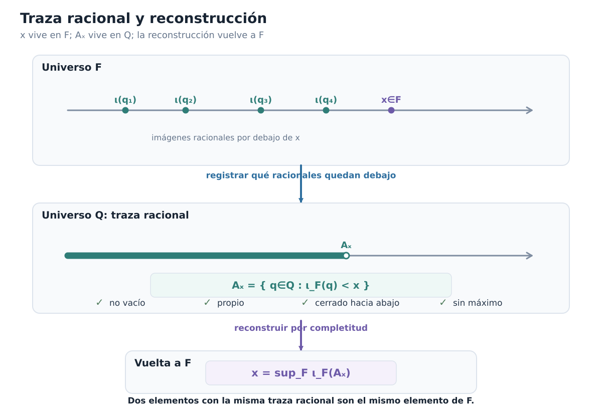

*Figura C00-F09. x vive en F y Aₓ vive en Q; la traza racional registra la posición de x y la completitud permite reconstruirlo.*

### Dos elementos distintos no pueden tener la misma traza

La fórmula anterior tiene una consecuencia inmediata.

Si

$$
A_x=A_y,
$$

entonces

$$
\iota_F(A_x)=\iota_F(A_y),
$$

y por reconstrucción

$$
x
=
\sup_F\iota_F(A_x)
=
\sup_F\iota_F(A_y)
=
y.
$$

Por tanto la aplicación

$$
x\longmapsto A_x
$$

es inyectiva.

También el orden queda registrado por las trazas.

Si

$$
x\le y,
$$

entonces todo racional situado debajo de $x$ está también debajo de $y$, de modo que

$$
A_x\subseteq A_y.
$$

Y si

$$
x<y,
$$

la densidad racional proporciona un $q$ con

$$
x<\iota_F(q)<y.
$$

Ese racional pertenece a $A_y$ pero no a $A_x$. Por tanto

$$
A_x\subsetneq A_y.
$$

Así la posición en $F$ puede leerse enteramente a través de información racional:

$$
\boxed{
x<y
\quad\Longrightarrow\quad
A_x\subsetneq A_y.
}
$$

Para la recíproca no necesitamos introducir todavía el transporte entre modelos. Si $A_x\subseteq A_y$, entonces

$$
\iota_F(A_x)\subseteq\iota_F(A_y).
$$

Por reconstrucción,

$$
y=\sup_F\iota_F(A_y),
$$

de modo que $y$ es una cota superior de $\iota_F(A_x)$. Pero también

$$
x=\sup_F\iota_F(A_x).
$$

Por la minimalidad del supremo,

$$
x\le y.
$$

En consecuencia,

$$
\boxed{
x\le y
\quad\Longleftrightarrow\quad
A_x\subseteq A_y.
}
$$

Y, combinando esta equivalencia con la inyectividad de $x\mapsto A_x$,

$$
\boxed{
x<y
\quad\Longleftrightarrow\quad
A_x\subsetneq A_y.
}
$$

La traza racional no es una mera etiqueta. Conserva toda la posición ordenada del elemento.

### El lenguaje común entre modelos

Ya podemos ver por qué hemos hecho todo este trabajo.

Sea $F$ cualquier cuerpo ordenado completo.

A cada elemento

$$
x\in F
$$

le hemos asociado una cortadura

$$
A_x\subseteq\mathbb Q.
$$

Y hemos demostrado que $x$ se recupera exactamente a partir de esa información:

$$
x
=
\sup_F\iota_F(A_x).
$$

Nada de esta descripción depende de que $F$ esté construido mediante cortaduras.

Por tanto, si mañana tomamos otro cuerpo ordenado completo $G$, podremos repetir exactamente el mismo procedimiento:

$$
y\in G
\longmapsto
A_y\subseteq\mathbb Q.
$$

Los elementos de $F$ y $G$ pueden ser objetos conjuntistas completamente diferentes. Pero sus **trazas racionales viven en el mismo conjunto $\mathbb Q$**.

Ése es el puente que necesitábamos.

$$
\boxed{
\mathbb Q
\text{ es el lenguaje común para comparar modelos completos distintos}.
}
$$

El objetivo ya no será comparar directamente $x\in F$ con un supuesto elemento correspondiente de $G$.

La estrategia será:

1. registrar la posición de $x$ mediante $A_x\subseteq\mathbb Q$;
2. transportar esa misma información racional a $G$;
3. reconstruir allí la posición correspondiente mediante un supremo.

Éste será el mecanismo de la última sección.

El estado narrativo permanece:

```text
UNIQUENESS_QUESTION = OPEN
```

Pero ahora disponemos de todas las piezas conceptuales para atacarla.

### Antes de seguir

[]{#MA-MIC-ANM-01-000-062}

1. ¿Por qué un cuerpo ordenado debe tener característica cero?
[]{#MA-MIC-ANM-01-000-063}

2. Explica por qué la definición de $\jmath_{\mathbb Z}^F(m-n)$ no depende de la diferencia formal elegida.
[]{#MA-MIC-ANM-01-000-064}

3. Para $q=a/b$, ¿qué propiedad garantiza que $\iota_F(q)$ no depende del representante racional?
[]{#MA-MIC-ANM-01-000-065}

4. ¿En qué momento exacto de esta sección se usa por primera vez la completitud de $F$?
[]{#MA-MIC-ANM-01-000-066}

5. Reconstruye la contradicción que demuestra que un cuerpo ordenado completo es arquimediano.
[]{#MA-MIC-ANM-01-000-067}

6. En el lema de localización entera, ¿por qué no basta con saber simplemente que existe algún entero mayor que $x$?
[]{#MA-MIC-ANM-01-000-068}

7. Explica el papel del mínimo de $K$ en la producción de
   $$
   m-1\le x<m.
   $$
[]{#MA-MIC-ANM-01-000-069}

8. Para $x<y$, ¿por qué elegir $1/n<y-x$ y localizar $nx$ produce un racional entre ambos?
[]{#MA-MIC-ANM-01-000-070}

9. Verifica las cuatro condiciones que hacen de $A_x$ una cortadura y señala en cuáles se usa la densidad racional.
[]{#MA-MIC-ANM-01-000-071}

10. ¿Dónde se gasta la completitud por segunda vez al reconstruir $x$ desde $A_x$?
[]{#MA-MIC-ANM-01-000-072}

11. ¿Por qué la igualdad $A_x=A_y$ obliga a $x=y$?
[]{#MA-MIC-ANM-01-000-073}

12. Explica por qué $\mathbb Q$ puede servir como interfaz común entre dos cuerpos ordenados completos cuyos elementos sean literalmente distintos.

Ya no dependemos de la codificación por cortaduras para hablar de la posición de un real abstracto. La posición puede registrarse racionalmente en cualquier modelo completo. La pregunta final es ahora concreta:

> **Si $F$ y $G$ asignan la misma información racional a sus elementos, ¿podemos reconstruir uno dentro del otro?**

## 0.10. Únicos hasta isomorfismo

Estamos en condiciones de responder la última pregunta del capítulo.

En §0.8 demostramos **existencia**: el modelo de Dedekind $\mathcal D$ es un cuerpo ordenado completo.

En §0.9 dejamos de mirar su codificación particular y tomamos un cuerpo ordenado completo arbitrario $F$. Allí demostramos que cada elemento

$$
x\in F
$$

queda determinado por su traza racional inferior

$$
A_x
=
\{q\in\mathbb Q:\iota_F(q)<x\},
$$

y que puede reconstruirse mediante

$$
x
=
\sup_F\iota_F(A_x).
$$

Ahora tomemos dos cuerpos ordenados completos arbitrarios:

$$
F
\qquad\text{y}\qquad
G.
$$

Cada uno contiene su copia racional canónica:

$$
\iota_F:\mathbb Q\hookrightarrow F,
\qquad
\iota_G:\mathbb Q\hookrightarrow G.
$$

Queremos construir una correspondencia

$$
F\longrightarrow G
$$

sin mirar cómo fueron construidos sus elementos.

La idea ya está preparada. Para $x\in F$:

1. registramos su posición mediante $A_x\subseteq\mathbb Q$;
2. interpretamos esos mismos racionales dentro de $G$;
3. tomamos allí la frontera que determina esa información.

Es decir,

$$
\boxed{
F
\longrightarrow
A_x\subseteq\mathbb Q
\longrightarrow
\iota_G(A_x)\subseteq G
\longrightarrow
\sup_G
\longrightarrow
G.
}
$$

Éste será el transporte canónico entre los dos modelos.

### Antes de escribir el supremo: buena definición

Sería un error escribir inmediatamente

$$
\phi(x)=\sup_G\iota_G(A_x)
$$

sin verificar las hipótesis que permiten tomar ese supremo.

Fijemos

$$
x\in F.
$$

Por §0.9, $A_x$ es una cortadura de Dedekind. En particular,

$$
A_x\ne\varnothing
\qquad\text{y}\qquad
A_x\ne\mathbb Q.
$$

La imagen

$$
\iota_G(A_x)
=
\{\iota_G(q):q\in A_x\}
$$

es no vacía: basta tomar cualquier $r\in A_x$; entonces

$$
\iota_G(r)\in\iota_G(A_x).
$$

Debemos además exhibir una cota superior.

Como $A_x$ es propio, existe algún racional

$$
u\notin A_x.
$$

Afirmamos que todo $q\in A_x$ satisface

$$
q<u.
$$

En efecto, si $q=u$, tendríamos $u\in A_x$. Y si $u<q$, como $q\in A_x$ y $A_x$ es cerrado hacia abajo, también obtendríamos $u\in A_x$. Ambas posibilidades son imposibles. Por tricotomía racional queda

$$
q<u.
$$

Como $\iota_G$ preserva el orden,

$$
\iota_G(q)<\iota_G(u)
\qquad
(q\in A_x).
$$

Por tanto

$$
\iota_G(u)
$$

es una cota superior de $\iota_G(A_x)$.

Ahora sí hemos verificado:

$$
\iota_G(A_x)\ne\varnothing
$$

y

$$
\iota_G(A_x)\text{ está acotado superiormente en }G.
$$

Aquí aparece el primer gasto de completitud de esta sección. Como $G$ es completo, existe el supremo de ese conjunto.

Podemos definir, legítimamente,

$$
\boxed{
\phi:F\longrightarrow G,
\qquad
\phi(x)
=
\sup_G\{\iota_G(q):q\in A_x\}.
}
$$

No estamos escogiendo uno entre varios candidatos. El supremo, cuando existe, es único. El valor $\phi(x)$ queda determinado por la estructura.

### El transporte conserva exactamente la traza racional

La propiedad decisiva de $\phi$ es más fuerte que una simple monotonicidad.

> **Proposición.** Para todo $x\in F$,
>
> $$
> \boxed{
> A_{\phi(x)}^{\,G}=A_x^{\,F}.
> }
> $$

Los superíndices sólo recuerdan en qué cuerpo se calcula cada traza.

**Demostración.** Escribamos

$$
S_x=\iota_G(A_x)
$$

y

$$
\phi(x)=\sup_G S_x.
$$

Probemos primero

$$
A_x\subseteq A_{\phi(x)}.
$$

Sea $q\in A_x$. Como $A_x$ no tiene máximo, existe $r\in A_x$ con

$$
q<r.
$$

La copia racional de $G$ preserva el orden:

$$
\iota_G(q)<\iota_G(r).
$$

Además,

$$
\iota_G(r)\in S_x,
$$

de modo que

$$
\iota_G(r)\le\sup_GS_x=\phi(x).
$$

Así

$$
\iota_G(q)<\phi(x),
$$

y por definición

$$
q\in A_{\phi(x)}.
$$

Por tanto

$$
A_x\subseteq A_{\phi(x)}.
$$

Para la inclusión inversa, sea

$$
q\in A_{\phi(x)}.
$$

Entonces

$$
\iota_G(q)<\phi(x).
$$

Supongamos que $q\notin A_x$. Como acabamos de observar al demostrar la acotación, todo $r\in A_x$ satisface

$$
r<q.
$$

Por tanto

$$
\iota_G(r)<\iota_G(q)
\qquad
(r\in A_x).
$$

Así $\iota_G(q)$ es una cota superior de $S_x$. Por minimalidad del supremo,

$$
\phi(x)=\sup_GS_x\le\iota_G(q),
$$

contradicción con

$$
\iota_G(q)<\phi(x).
$$

Luego necesariamente

$$
q\in A_x.
$$

Hemos obtenido la segunda inclusión y, por tanto,

$$
\boxed{
A_{\phi(x)}=A_x.
}
$$

$\square$

Este resultado explica exactamente qué hace $\phi$. No transporta la representación conjuntista de $x$; transporta su **posición racional**.

### El orden queda transportado sin deformación

En §0.9 demostramos que, en cualquier cuerpo ordenado completo,

$$
x\le y
\quad\Longleftrightarrow\quad
A_x\subseteq A_y
$$

y

$$
x<y
\quad\Longleftrightarrow\quad
A_x\subsetneq A_y.
$$

Usando la identidad de trazas recién obtenida,

$$
\begin{aligned}
x\le y
&\Longleftrightarrow
A_x\subseteq A_y\\
&\Longleftrightarrow
A_{\phi(x)}\subseteq A_{\phi(y)}\\
&\Longleftrightarrow
\phi(x)\le\phi(y).
\end{aligned}
$$

Del mismo modo,

$$
\boxed{
x<y
\quad\Longleftrightarrow\quad
\phi(x)<\phi(y).
}
$$

Por tanto $\phi$ preserva y refleja el orden.

En particular es inyectiva: si

$$
\phi(x)=\phi(y),
$$

las dos imágenes tienen la misma traza; pero

$$
A_{\phi(x)}=A_x,
\qquad
A_{\phi(y)}=A_y,
$$

de modo que $A_x=A_y$, y §0.9 da

$$
x=y.
$$

### La función simétrica proporciona la inversa

Todavía no hemos demostrado que todo elemento de $G$ sea imagen de alguno de $F$.

No lo haremos por cardinalidad ni escogiendo preimágenes.

Repetimos exactamente la misma construcción con los cuerpos intercambiados:

$$
\boxed{
\psi:G\longrightarrow F,
\qquad
\psi(y)
=
\sup_F\{\iota_F(q):q\in A_y^{\,G}\}.
}
$$

La buena definición de $\psi$ gasta ahora la completitud de $F$, del mismo modo que la de $\phi$ gastó la completitud de $G$.

Además,

$$
\boxed{
A_{\psi(y)}^{\,F}=A_y^{\,G}.
}
$$

Tomemos $x\in F$. Entonces

$$
A_{\psi(\phi(x))}^{\,F}
=
A_{\phi(x)}^{\,G}
=
A_x^{\,F}.
$$

Como la traza determina al elemento dentro de $F$,

$$
\boxed{\psi(\phi(x))=x.}
$$

Simétricamente, para todo $y\in G$,

$$
\boxed{\phi(\psi(y))=y.}
$$

Así,

$$
\boxed{
\psi=\phi^{-1}.
}
$$

En particular,

$$
\boxed{
\phi:F\longrightarrow G
\text{ es biyectiva}.
}
$$

La sobreyectividad no proviene de contar elementos ni de una elección sobre fibras. La preimagen de $y$ está dada canónicamente por $\psi(y)$.

Además, como $\psi$ se construye por el mismo procedimiento, también preserva y refleja el orden. Por tanto $\phi$ ya es un isomorfismo de los órdenes lineales subyacentes.

Falta demostrar que conserva la aritmética.

### Primero: el transporte fija la copia racional

Sea $q\in\mathbb Q$.

La traza racional de $\iota_F(q)$ es

$$
A_{\iota_F(q)}
=
\{r\in\mathbb Q:r<q\}
=
q^*.
$$

En efecto,

$$
r\in A_{\iota_F(q)}
\Longleftrightarrow
\iota_F(r)<\iota_F(q)
\Longleftrightarrow
r<q.
$$

De la misma manera,

$$
A_{\iota_G(q)}=q^*.
$$

Pero $\phi$ conserva la traza:

$$
A_{\phi(\iota_F(q))}
=
A_{\iota_F(q)}
=
q^*
=
A_{\iota_G(q)}.
$$

La traza determina al elemento en $G$. Por tanto

$$
\boxed{
\phi(\iota_F(q))=\iota_G(q)
\qquad(q\in\mathbb Q).
}
$$

Es decir,

$$
\boxed{
\phi\circ\iota_F=\iota_G.
}
$$

En particular,

$$
\boxed{
\phi(0_F)=0_G,
\qquad
\phi(1_F)=1_G.
}
$$

### Leer una suma mediante racionales

Para demostrar que $\phi$ conserva la suma evitaremos intentar calcular directamente el supremo de $A_{x+y}$.

Primero caracterizaremos esa traza usando sólo $A_x$ y $A_y$.

> **Lema.** Sean $x,y\in F$ y $q\in\mathbb Q$. Entonces
>
> $$
> \boxed{
> q\in A_{x+y}
> \Longleftrightarrow
> \exists r\in A_x\;\exists s\in A_y:
> q<r+s.
> }
> $$

**Demostración.** Supongamos primero

$$
q\in A_{x+y}.
$$

Entonces

$$
\iota_F(q)<x+y.
$$

Trasladando $-y$,

$$
\iota_F(q)-y<x.
$$

La copia racional es densa en $F$, de modo que existe $r\in\mathbb Q$ con

$$
\iota_F(q)-y
<
\iota_F(r)
<
x.
$$

La segunda desigualdad dice

$$
r\in A_x.
$$

La primera equivale a

$$
\iota_F(q)-\iota_F(r)<y.
$$

Aplicando de nuevo densidad, existe $s\in\mathbb Q$ tal que

$$
\iota_F(q)-\iota_F(r)
<
\iota_F(s)
<
y.
$$

Entonces

$$
s\in A_y
$$

y

$$
\iota_F(q)
<
\iota_F(r)+\iota_F(s)
=
\iota_F(r+s).
$$

Como $\iota_F$ refleja el orden,

$$
q<r+s.
$$

Esto prueba la implicación directa.

Recíprocamente, supongamos que existen

$$
r\in A_x,
\qquad
s\in A_y,
\qquad
q<r+s.
$$

Entonces

$$
\iota_F(r)<x,
\qquad
\iota_F(s)<y.
$$

Sumando,

$$
\iota_F(r)+\iota_F(s)<x+y.
$$

Además,

$$
\iota_F(q)
<
\iota_F(r+s)
=
\iota_F(r)+\iota_F(s).
$$

Por transitividad,

$$
\iota_F(q)<x+y,
$$

es decir,

$$
q\in A_{x+y}.
$$

$\square$

El lado derecho del criterio depende solamente de las dos trazas racionales.

Como

$$
A_{\phi(x)}=A_x,
\qquad
A_{\phi(y)}=A_y,
$$

el mismo criterio aplicado en $G$ da, para todo $q\in\mathbb Q$,

$$
q\in A_{x+y}
\Longleftrightarrow
q\in A_{\phi(x)+\phi(y)}.
$$

Por otro lado,

$$
A_{\phi(x+y)}=A_{x+y}.
$$

Luego

$$
A_{\phi(x+y)}
=
A_{\phi(x)+\phi(y)}.
$$

La traza determina al elemento en $G$. Concluimos

$$
\boxed{
\phi(x+y)=\phi(x)+\phi(y).
}
$$

La preservación del cero implica ahora automáticamente la del opuesto. Como

$$
x+(-x)=0_F,
$$

aplicamos $\phi$:

$$
\phi(x)+\phi(-x)=0_G.
$$

Por unicidad del inverso aditivo,

$$
\boxed{
\phi(-x)=-\phi(x).
}
$$

Así también se conserva la resta.

### Leer el producto cuando los factores son no negativos

La multiplicación exige una precaución adicional: el orden del producto se comporta limpiamente al trabajar primero con factores no negativos.

Sean

$$
0_F\le x,
\qquad
0_F\le y.
$$

Para $q\in\mathbb Q$ tenemos la siguiente caracterización.

> **Lema.**
>
> $$
> \boxed{
> \begin{aligned}
> q\in A_{xy}
> \Longleftrightarrow{}&
> q<0\\
> &\text{o existen }r,s\in\mathbb Q
> \text{ tales que}\\
> &0<r,\quad 0<s,\quad
> r\in A_x,\quad s\in A_y,\quad q<rs.
> \end{aligned}
> }
> $$

**Demostración.** Supongamos primero

$$
q\in A_{xy},
$$

de modo que

$$
\iota_F(q)<xy.
$$

Si $q<0$, ya estamos en la primera alternativa.

Supongamos entonces

$$
q\ge0.
$$

Como $x,y\ge0$ y

$$
0\le\iota_F(q)<xy,
$$

el producto $xy$ es positivo; por tanto $x>0$ y $y>0$.

Multiplicando la desigualdad

$$
\iota_F(q)<xy
$$

por $y^{-1}>0$, obtenemos

$$
\iota_F(q)y^{-1}<x.
$$

Por densidad racional existe $r\in\mathbb Q$ tal que

$$
\iota_F(q)y^{-1}
<
\iota_F(r)
<
x.
$$

Como el extremo izquierdo es no negativo,

$$
r>0,
$$

y además

$$
r\in A_x.
$$

La primera desigualdad da

$$
\iota_F(q)<\iota_F(r)y.
$$

Como $\iota_F(r)>0$, multiplicamos por su inverso:

$$
\iota_F(q)\iota_F(r)^{-1}<y.
$$

Aplicando otra vez densidad, existe $s\in\mathbb Q$ con

$$
\iota_F(q)\iota_F(r)^{-1}
<
\iota_F(s)
<
y.
$$

Entonces

$$
s>0,
\qquad
s\in A_y,
$$

y

$$
\iota_F(q)
<
\iota_F(r)\iota_F(s)
=
\iota_F(rs).
$$

Por reflexión del orden,

$$
q<rs.
$$

Recíprocamente, si $q<0$, entonces

$$
\iota_F(q)<0_F\le xy,
$$

de modo que $q\in A_{xy}$.

Si existen $r,s>0$ con

$$
r\in A_x,
\qquad
s\in A_y,
\qquad
q<rs,
$$

entonces

$$
0<\iota_F(r)<x,
\qquad
0<\iota_F(s)<y.
$$

La monotonía del producto por factores positivos da

$$
\iota_F(r)\iota_F(s)<xy.
$$

Y de $q<rs$ obtenemos

$$
\iota_F(q)
<
\iota_F(rs)
=
\iota_F(r)\iota_F(s).
$$

Por transitividad,

$$
\iota_F(q)<xy.
$$

Así $q\in A_{xy}$.

$\square$

Como $\phi$ preserva el orden y el cero,

$$
x,y\ge0
\quad\Longrightarrow\quad
\phi(x),\phi(y)\ge0.
$$

El criterio anterior depende únicamente de $A_x$ y $A_y$. Usando otra vez

$$
A_{\phi(x)}=A_x,
\qquad
A_{\phi(y)}=A_y,
$$

concluimos

$$
A_{\phi(xy)}
=
A_{\phi(x)\phi(y)}.
$$

Por reconstrucción desde la traza,

$$
\boxed{
\phi(xy)=\phi(x)\phi(y)
\qquad
(x,y\ge0).
}
$$

### El producto para todos los signos

No dejaremos la multiplicatividad restringida al cono positivo.

Sean $x,y\in F$ arbitrarios.

Si ambos son no negativos, el resultado ya está probado.

Supongamos

$$
x<0\le y.
$$

Entonces $-x>0$ y

$$
xy=-((-x)y).
$$

Usando la preservación del opuesto y el caso no negativo,

$$
\begin{aligned}
\phi(xy)
&=
-\phi((-x)y)\\
&=
-\bigl(\phi(-x)\phi(y)\bigr)\\
&=
-\bigl((-\phi(x))\phi(y)\bigr)\\
&=
\phi(x)\phi(y).
\end{aligned}
$$

El caso

$$
x\ge0>y
$$

es simétrico.

Finalmente, si

$$
x<0,
\qquad
y<0,
$$

entonces

$$
-x>0,
\qquad
-y>0,
$$

y

$$
xy=(-x)(-y).
$$

Por tanto

$$
\begin{aligned}
\phi(xy)
&=
\phi((-x)(-y))\\
&=
\phi(-x)\phi(-y)\\
&=
(-\phi(x))(-\phi(y))\\
&=
\phi(x)\phi(y).
\end{aligned}
$$

Hemos cerrado todos los casos:

$$
\boxed{
\phi(xy)=\phi(x)\phi(y)
\qquad
\text{para todos }x,y\in F.
}
$$

Como además

$$
\phi(1_F)=1_G,
$$

los inversos también se preservan. Si $x\ne0_F$,

$$
xx^{-1}=1_F,
$$

luego

$$
\phi(x)\phi(x^{-1})=1_G.
$$

La inyectividad y la preservación de cero garantizan $\phi(x)\ne0_G$, y por unicidad del inverso,

$$
\boxed{
\phi(x^{-1})=\phi(x)^{-1}.
}
$$

La figura C00-F12 resume por qué la misma traza racional obliga a transportar también la aritmética, una vez cerrados suma, producto y todos los casos de signo.

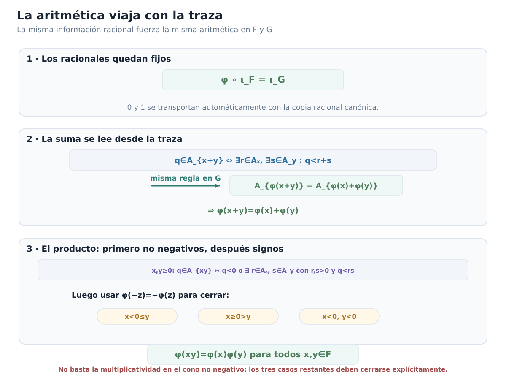

*Figura C00-F12. La misma traza racional obliga a que φ fije Q y preserve suma y producto; el producto se demuestra primero en no negativos y luego se cierran los tres casos de signo.*

### Ya tenemos un isomorfismo de cuerpos ordenados

Podemos reunir el tablero de obligaciones.

La función

$$
\phi:F\longrightarrow G
$$

es:

- bien definida;
- biyectiva;
- preserva y refleja el orden;
- preserva $0$ y $1$;
- preserva la suma;
- preserva los opuestos;
- preserva el producto para todos los signos;
- preserva inversos;
- satisface
  $$
  \phi\circ\iota_F=\iota_G.
  $$

Por tanto

$$
\boxed{
\phi:F\longrightarrow G
\text{ es un isomorfismo de cuerpos ordenados}.
}
$$

La existencia de un isomorfismo está demostrada.

Pero todavía debemos responder una última cuestión: ¿podría existir otro?

### Cualquier isomorfismo ordenado está obligado a fijar los racionales

Sea

$$
T:F\longrightarrow G
$$

un isomorfismo de cuerpos ordenados cualquiera.

La composición

$$
T\circ\iota_F:\mathbb Q\longrightarrow G
$$

es también una incrustación de cuerpos ordenados: $T$ preserva $0$, $1$, suma, producto y orden.

Pero en §0.9 demostramos que la copia racional en un cuerpo ordenado es **canónica y única**.

Por tanto

$$
\boxed{
T\circ\iota_F=\iota_G.
}
$$

Así todo isomorfismo de cuerpos ordenados entre $F$ y $G$ fija automáticamente la copia racional, en el sentido estructural correcto.

### La traza fuerza la unicidad punto por punto

Fijemos $x\in F$.

Para cualquier $q\in\mathbb Q$,

$$
\begin{aligned}
q\in A_x
&\Longleftrightarrow
\iota_F(q)<x\\
&\Longleftrightarrow
T(\iota_F(q))<T(x)\\
&\Longleftrightarrow
\iota_G(q)<T(x)\\
&\Longleftrightarrow
q\in A_{T(x)}.
\end{aligned}
$$

Por tanto

$$
\boxed{
A_{T(x)}=A_x.
}
$$

Pero el transporte canónico también satisface

$$
\boxed{
A_{\phi(x)}=A_x.
}
$$

Luego

$$
A_{T(x)}=A_{\phi(x)}.
$$

La traza racional determina al elemento de $G$. En consecuencia,

$$
T(x)=\phi(x).
$$

Como esto vale para todo $x\in F$,

$$
\boxed{
T=\phi.
}
$$

Hemos demostrado la conclusión fuerte:

> **Teorema de unicidad.** Si $F$ y $G$ son cuerpos ordenados completos, existe un único isomorfismo de cuerpos ordenados
>
> $$
> \boxed{
> \phi:F\longrightarrow G.
> }
> $$

Ese isomorfismo es el transporte canónico determinado por las trazas racionales.

Tomando $F=G$, obtenemos además una rigidez importante:

$$
\boxed{
\text{todo automorfismo de cuerpo ordenado de }F
\text{ es la identidad}.
}
$$

En efecto, necesariamente fija la copia racional y, por la misma prueba, fija cada traza y por tanto cada elemento.

### Qué significa realmente «únicos»

Podemos cerrar ahora la distinción que quedó pendiente desde §0.1.

Sean $F$ y $G$ dos sistemas que satisfacen la especificación de los números reales.

No hemos demostrado

$$
F=G
$$

como conjuntos.

Sus elementos pueden ser objetos literalmente distintos. Un modelo puede estar construido con cortaduras; otro podría usar una codificación completamente diferente.

Lo que hemos probado es:

```text
LITERAL_EQUALITY = NOT_REQUIRED
EXISTS_AN_ORDERED_FIELD_ISOMORPHISM = YES
UNIQUE_ORDERED_FIELD_ISOMORPHISM = YES
```

Es decir,

$$
\boxed{
F\cong G
\quad
\text{mediante un único isomorfismo de cuerpos ordenados}.
}
$$

La estructura no depende de la implementación.

También conviene distinguir otra idea:

$$
\boxed{
\text{canónico por unicidad}
\neq
\text{computable}.
}
$$

La fórmula de $\phi$ mediante trazas racionales y supremos determina una función matemática única. Eso no afirma que, dada una representación arbitraria de elementos de $F$ y $G$, exista automáticamente un algoritmo que calcule sus imágenes.

Nuestra cuestión aquí era estructural, y esa cuestión queda completamente resuelta.

### El cierre de las dos preguntas

Podemos volver finalmente a la apertura del capítulo.

Primera pregunta:

$$
\boxed{\text{¿existe un cuerpo ordenado completo?}}
$$

Respuesta de §§0.4–0.8:

$$
\boxed{\text{sí}.}
$$

Las cortaduras de Dedekind proporcionan uno.

Segunda pregunta:

$$
\boxed{
\text{si existen dos, ¿pueden ser esencialmente distintos?}
}
$$

Respuesta de §§0.9–0.10:

$$
\boxed{\text{no}.}
$$

Cualesquiera dos cuerpos ordenados completos están relacionados por un único isomorfismo de cuerpos ordenados.

Podemos condensar el resultado central del capítulo:

$$
\boxed{
\text{EXISTENCIA}
+
\text{UNICIDAD HASTA ÚNICO ISOMORFISMO}
=
\text{JUSTIFICACIÓN ESTRUCTURAL DE }\mathbb R.
}
$$

Desde el punto de vista matemático, esto es lo que autoriza hablar de **los números reales** sin convertir una construcción concreta en una definición ontológica obligatoria.

Las cortaduras son una realización.

La estructura de cuerpo ordenado completo es lo que todas las realizaciones comparten.

La figura C00-F10 concentra esta lectura en un único mapa visual.

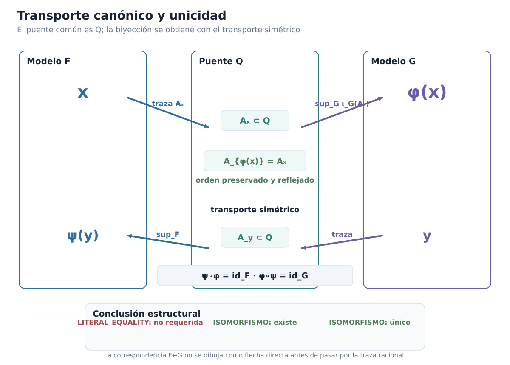

*Figura C00-F10. El transporte F→G pasa por la traza racional común; el transporte simétrico produce la inversa y fuerza la unicidad del isomorfismo.*

El estado narrativo final es:

```text
EXISTENCE_QUESTION = CLOSED
UNIQUENESS_QUESTION = CLOSED
REAL_NUMBER_STRUCTURE = CANONICAL_UP_TO_UNIQUE_ORDERED_FIELD_ISOMORPHISM
```

### Antes de cerrar el manuscrito del capítulo

[]{#MA-MIC-ANM-01-000-074}

1. ¿Por qué no está bien definida $\phi(x)=\sup_G\iota_G(A_x)$ hasta comprobar no vaciedad y acotación de $\iota_G(A_x)$?
[]{#MA-MIC-ANM-01-000-075}

2. ¿Dónde se usa exactamente la completitud de $G$ al construir $\phi$?
[]{#MA-MIC-ANM-01-000-076}

3. Demuestra que $A_{\phi(x)}=A_x$ y explica por qué la ausencia de máximo de $A_x$ es necesaria para una de las inclusiones.
[]{#MA-MIC-ANM-01-000-077}

4. ¿Por qué la igualdad de trazas implica que $\phi$ preserva y refleja el orden?
[]{#MA-MIC-ANM-01-000-078}

5. Explica por qué la construcción simétrica $\psi:G\to F$ demuestra sobreyectividad sin elegir preimágenes.
[]{#MA-MIC-ANM-01-000-079}

6. ¿Por qué $\phi(\iota_F(q))=\iota_G(q)$ para todo racional $q$?
[]{#MA-MIC-ANM-01-000-080}

7. Reconstruye la caracterización racional de $A_{x+y}$ y señala las dos aplicaciones de densidad.
[]{#MA-MIC-ANM-01-000-081}

8. ¿Por qué la caracterización de $A_{xy}$ se formula primero para $x,y\ge0$?
[]{#MA-MIC-ANM-01-000-082}

9. Recorre los tres casos adicionales de signo necesarios para extender la multiplicatividad a todo $F$.
[]{#MA-MIC-ANM-01-000-083}

10. ¿Por qué cualquier isomorfismo de cuerpos ordenados $T:F\to G$ debe enviar la copia racional canónica de $F$ a la de $G$?
[]{#MA-MIC-ANM-01-000-084}

11. Explica por qué conservar la misma traza racional fuerza $T(x)=\phi(x)$.
[]{#MA-MIC-ANM-01-000-085}

12. Distingue cuidadosamente:
    - igualdad literal;
    - existencia de un isomorfismo;
    - existencia de un único isomorfismo de cuerpos ordenados.
[]{#MA-MIC-ANM-01-000-086}

13. ¿Por qué la unicidad estructural no implica por sí sola computabilidad del transporte?
[]{#MA-MIC-ANM-01-000-087}

14. Explica en qué sentido las cortaduras de Dedekind son una realización de los reales, pero no su «esencia conjuntista».

Con esto, el arco matemático del capítulo queda completo. Construimos un modelo, demostramos que satisface la especificación y después demostramos que cualquier otro modelo con la misma especificación posee exactamente la misma estructura.

A partir del capítulo siguiente podremos trabajar con $\mathbb R$ sin ocultar qué justifica ese símbolo: existe un cuerpo ordenado completo y su estructura está determinada, hasta único isomorfismo, por esas propiedades.

[Índice del libro](../para-matematicos/analisis-para-matematicos.md) · [Capítulo 0](analisis-para-matematicos-capitulo-0-construir-los-numeros-reales.md) · [Ejercicios](analisis-para-matematicos-capitulo-0-construir-los-numeros-reales-ejercicios.md) · [Soluciones](analisis-para-matematicos-capitulo-0-construir-los-numeros-reales-soluciones.md) · [Soluciones de microcontroles](analisis-para-matematicos-capitulo-0-construir-los-numeros-reales-microcontroles.md)
