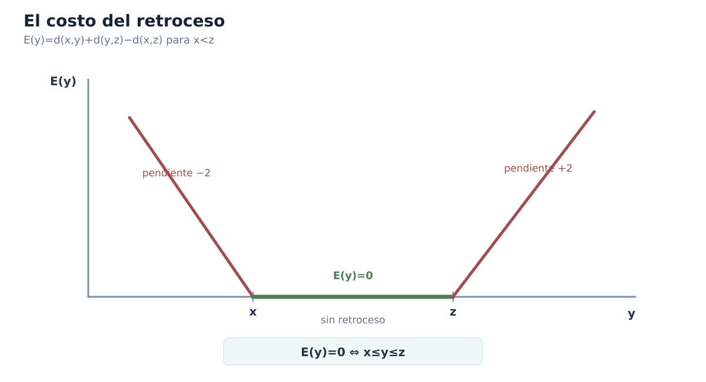
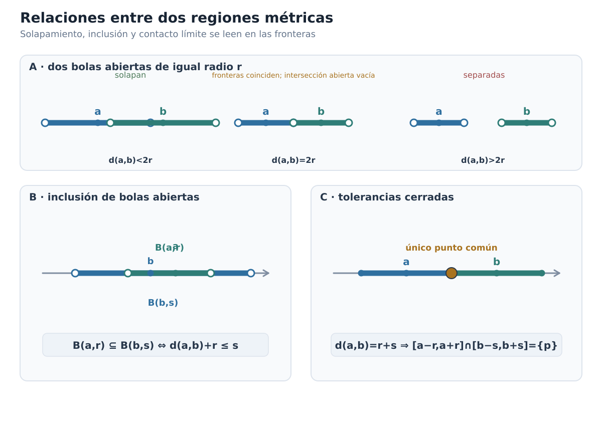
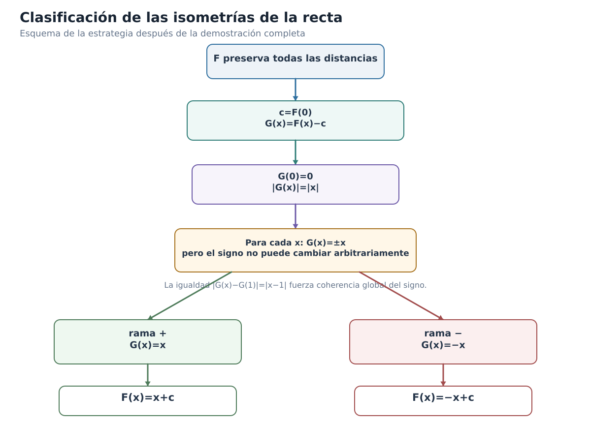

[Capítulo 1](analisis-para-matematicos-capitulo-1-recta-real-ordenada-y-metrica.md) · [Índice del libro](../para-matematicos/analisis-para-matematicos.md) · [Ejercicios](analisis-para-matematicos-capitulo-1-recta-real-ordenada-y-metrica-ejercicios.md) · [Soluciones](analisis-para-matematicos-capitulo-1-recta-real-ordenada-y-metrica-soluciones.md) · [Soluciones de microcontroles](analisis-para-matematicos-capitulo-1-recta-real-ordenada-y-metrica-microcontroles.md)

# Soluciones — Capítulo 1

## §1.1. La misma recta, varias estructuras

[]{#MA-SOL-ANM-01-001-001}

### 1. Lo que el orden no dice

La afirmación es falsa. Saber que

$$
x<y<z
$$

nos informa de la posición relativa de los tres puntos: $x$ está a la izquierda de $y$, $y$ está a la izquierda de $z$ y, por tanto, $y$ queda entre los extremos. No nos dice cuánto separa a cada par.

Por ejemplo, con

$$
x=0,\qquad y=2,\qquad z=4,
$$

se cumple $0<2<4$ y las separaciones desde $y$ a los extremos son ambas $2$.

En cambio, con

$$
x=0,\qquad y=1,\qquad z=4,
$$

seguimos teniendo $0<1<4$, pero ahora $y$ está a $1$ unidad de $x$ y a $3$ unidades de $z$.

El patrón de orden es idéntico en las dos ternas; las separaciones no. **El orden determina quién está antes, después o entre quiénes, pero no determina por sí solo las distancias.**

[]{#MA-SOL-ANM-01-001-002}

### 2. Reflejar no destruye toda la información

Al reflejar respecto del origen, cada número cambia de signo:

$$
-2\mapsto2,\qquad 1\mapsto-1,\qquad 5\mapsto-5.
$$

Antes de la reflexión el orden es

$$
-2<1<5,
$$

mientras que, después de reflejar, los puntos ordenados de menor a mayor son

$$
-5<-1<2.
$$

La orientación de la configuración se ha invertido. Comparemos ahora las separaciones entre pares:

$$
|1-(-2)|=3,\qquad |5-1|=4,\qquad |5-(-2)|=7.
$$

Después de reflejar:

$$
|-1-2|=3,\qquad |-5-(-1)|=4,\qquad |-5-2|=7.
$$

Las tres separaciones permanecen exactamente iguales.

Por tanto, la conclusión del estudiante mezcla dos clases de información. Es correcto decir que cambió la información de **orientación**: izquierda y derecha se intercambiaron. Es falso concluir que cambió toda la información geométrica: las **separaciones entre los puntos** se conservaron.

La lección es precisamente la de §1.1: una transformación puede alterar lo que ve el orden sin alterar lo que ve la distancia.

[]{#MA-SOL-ANM-01-001-003}

### 3. Un orden fijo, separaciones variables

Mientras $t$ satisfaga

$$
0<t<1,
$$

su posición de orden no cambia: permanece estrictamente entre $0$ y $1$. Variar $t$ dentro del intervalo no altera ese patrón.

Las separaciones a los extremos son

$$
t-0=t
$$

y

$$
1-t.
$$

Ahora comparamos esas dos cantidades.

Si $0<t<\tfrac12$, entonces

$$
t<1-t,
$$

así que $t$ está más cerca de $0$ que de $1$.

Si $t=\tfrac12$, entonces

$$
t=1-t=\frac12,
$$

y las separaciones son iguales.

Si $\tfrac12<t<1$, entonces

$$
1-t<t,
$$

por lo que $t$ está más cerca de $1$ que de $0$.

Así, al variar $t$ permanece la información de orden

$$
0<t<1,
$$

pero cambia la información métrica: las dos separaciones varían continuamente y puede cambiar incluso cuál de los dos extremos está más cerca.

Este ejemplo muestra por qué no debemos leer una relación de orden como si contuviera automáticamente información cuantitativa sobre distancias.

[]{#MA-SOL-ANM-01-001-004}

### 4. Tres capas sobre los mismos números

**Estrategia.** Necesitamos conservar simultáneamente las dos condiciones

$$
a+b=c,\qquad a<b,
$$

pero hacer que cambie cuál de $a$ o $b$ queda más cerca de $c$. Esto probará que la información algebraica y de orden dada no determina por sí sola la comparación métrica.

Para el primer caso podemos tomar

$$
a=1,\qquad b=2,\qquad c=3.
$$

Se cumple

$$
a+b=1+2=3=c
$$

y también $a<b$. Las separaciones respecto de $c$ son

$$
|c-a|=|3-1|=2,
$$

mientras que

$$
|c-b|=|3-2|=1.
$$

Por tanto, $b$ está más cerca de $c$ que $a$.

Para invertir la comparación, tomemos

$$
a=-5,\qquad b=-2,\qquad c=-7.
$$

De nuevo,

$$
a+b=-5+(-2)=-7=c
$$

y $a<b$. Pero ahora

$$
|c-a|=|-7-(-5)|=2,
$$

y

$$
|c-b|=|-7-(-2)|=5.
$$

Así que en esta segunda configuración $a$ está más cerca de $c$ que $b$.

Podemos separar ahora las tres capas del problema:

- $a+b=c$ es información **algebraica**, porque relaciona los números mediante una operación;
- $a<b$ es información de **orden**, porque decide su posición relativa;
- comparar $|c-a|$ y $|c-b|$ es información **métrica**, porque pregunta por separaciones.

Los dos ejemplos satisfacen exactamente la misma clase de condición algebraica y la misma relación de orden, pero producen respuestas métricas opuestas. Por eso aquellas dos capas no bastan para determinar ésta.

La idea transferible es que **usar los mismos números no convierte en equivalentes las estructuras que colocamos sobre ellos**. Antes de concluir algo, conviene identificar qué clase de información tenemos y qué clase de información estamos intentando obtener.

## §1.2. Orden: izquierda, derecha y estar entre

[]{#MA-SOL-ANM-01-001-005}

### 5. Una condición, tres escrituras

La desigualdad

$$
-4\le x<3
$$

selecciona todos los reales situados desde $-4$ hasta $3$, incluyendo el extremo izquierdo pero excluyendo el derecho. Por tanto,

$$
x\in[-4,3).
$$

En palabras: tomamos todos los puntos entre $-4$ y $3$; $-4$ pertenece al conjunto porque se permite la igualdad $x=-4$, mientras que $3$ no pertenece porque la condición exige $x<3$.

Comprobemos los tres puntos pedidos directamente en la desigualdad:

- para $x=-4$, se cumple $-4\le-4<3$, así que $-4$ pertenece;
- para $x=0$, se cumple $-4\le0<3$, así que $0$ pertenece;
- para $x=3$, la segunda desigualdad se convierte en $3<3$, que es falsa; por tanto, $3$ no pertenece.

La notación de intervalo no añade información nueva: comprime exactamente las mismas decisiones de inclusión y exclusión que ya estaban en los signos de desigualdad.

[]{#MA-SOL-ANM-01-001-006}

### 6. Dos fronteras, cuatro regiones

Las cuatro traducciones son

$$
a<x<b
\iff
x\in(a,b),
$$

$$
a\le x<b
\iff
x\in[a,b),
$$

$$
a<x\le b
\iff
x\in(a,b],
$$

$$
a\le x\le b
\iff
x\in[a,b].
$$

El centro de la descripción no cambia: en los cuatro casos estamos seleccionando puntos situados entre las mismas dos fronteras $a$ y $b$. Lo único que cambia es si admitimos o no cada frontera.

En el extremo izquierdo:

- $a<x$ excluye $a$;
- $a\le x$ incluye $a$.

En el extremo derecho:

- $x<b$ excluye $b$;
- $x\le b$ incluye $b$.

Así, paréntesis y corchetes no son cuatro convenciones desconectadas. Cada símbolo registra localmente la decisión que ya tomó la desigualdad correspondiente.

[]{#MA-SOL-ANM-01-001-007}

### 7. ¿Puede incluirse el infinito?

La escritura

$$
[2,\infty]
$$

es incorrecta en la notación usual de intervalos reales. El problema no está en querer «incluir todos los valores hacia la derecha», sino en tratar $\infty$ como si fuera un número real situado al final de la recta.

La condición

$$
x\ge2
$$

se escribe correctamente como

$$
[2,\infty).
$$

El corchete en $2$ indica que $2$ pertenece al conjunto. En cambio, $\infty$ no es un punto de $\mathbb R$ que pueda pertenecer o no pertenecer al intervalo; es un símbolo que expresa que la región no tiene una frontera real superior. Por eso se escribe siempre paréntesis junto a $\infty$ o $-\infty$.

De manera análoga,

$$
x<2
$$

se representa por

$$
(-\infty,2).
$$

Aquí $2$ queda excluido por la desigualdad estricta y, nuevamente, $-\infty$ no es un número real que pueda incluirse.

La idea que corrige el error es ésta: **los corchetes deciden si pertenece un extremo real; $\pm\infty$ no son extremos reales del conjunto.**

[]{#MA-SOL-ANM-01-001-008}

### 8. El mismo tramo sin elegir orientación

La condición

$$
\min\{p,q\}\le x\le\max\{p,q\}
$$

selecciona todos los puntos del tramo cerrado comprendido entre $p$ y $q$, incluyendo ambos extremos. Sin decidir cuál de los dos está a la izquierda, podemos escribirlo como

$$
x\in[\min\{p,q\},\max\{p,q\}].
$$

Ahora separemos los dos órdenes posibles.

Si

$$
p\le q,
$$

entonces

$$
\min\{p,q\}=p,
\qquad
\max\{p,q\}=q,
$$

y la condición se reduce a

$$
p\le x\le q.
$$

Si, en cambio,

$$
q\le p,
$$

entonces

$$
\min\{p,q\}=q,
\qquad
\max\{p,q\}=p,
$$

y obtenemos

$$
q\le x\le p.
$$

Por tanto, la formulación con mínimo y máximo encapsula en una sola expresión los dos órdenes posibles de los extremos. Su ventaja no es meramente abreviar: permite hablar del tramo entre $p$ y $q$ de una forma que no depende del orden en que hayamos nombrado esos puntos.

[]{#MA-SOL-ANM-01-001-009}

### 9. Dos formas equivalentes de «estar entre»

**Estrategia.** La expresión con mínimo y máximo está diseñada precisamente para evitar elegir una orientación. Para demostrar la equivalencia, basta separar los dos órdenes posibles entre los extremos $x$ y $z$.

Supongamos primero que

$$
\min\{x,z\}\le y\le\max\{x,z\}.
$$

Como el orden de los reales es total, entre $x$ y $z$ sólo pueden darse dos posibilidades:

$$
x\le z
$$

o

$$
z\le x.
$$

Si $x\le z$, entonces

$$
\min\{x,z\}=x,
\qquad
\max\{x,z\}=z,
$$

de modo que nuestra hipótesis se convierte en

$$
x\le y\le z.
$$

Si $z\le x$, obtenemos en cambio

$$
\min\{x,z\}=z,
\qquad
\max\{x,z\}=x,
$$

y por tanto

$$
z\le y\le x.
$$

Esto prueba una dirección.

Para la conversa, supongamos primero que

$$
x\le y\le z.
$$

Entonces necesariamente $x\le z$, por lo que

$$
\min\{x,z\}=x,
\qquad
\max\{x,z\}=z.
$$

Así,

$$
\min\{x,z\}\le y\le\max\{x,z\}.
$$

El caso

$$
z\le y\le x
$$

es análogo: ahora $z\le x$, de modo que el mínimo es $z$ y el máximo es $x$, y se obtiene la misma desigualdad con mínimo y máximo.

Hemos demostrado, por tanto,

$$
\boxed{
\min\{x,z\}\le y\le\max\{x,z\}
\iff
\bigl(x\le y\le z\bigr)\ \text{o}\ \bigl(z\le y\le x\bigr).
}
$$

No hace falta una tercera posibilidad porque el orden de $\mathbb R$ compara siempre dos números reales: para $x$ y $z$, uno satisface $x\le z$ o el otro satisface $z\le x$ —y si son iguales, ambos casos son compatibles.

La idea transferible es que la fórmula con $\min$ y $\max$ no introduce una nueva noción de «estar entre»: comprime en una expresión simétrica los dos órdenes posibles de los extremos.

## §1.3. Valor absoluto: distancia al origen

[]{#MA-SOL-ANM-01-001-010}

### 10. Una distancia con centro desplazado

La expresión

$$
|x-3|
$$

mide la separación entre $x$ y el centro $3$. Por tanto,

$$
|x-3|=5
$$

significa: «$x$ está exactamente a $5$ unidades de $3$».

En una recta hay dos puntos a esa distancia del centro: uno a la derecha y otro a la izquierda. Son

$$
x=3+5=8
$$

y

$$
x=3-5=-2.
$$

Podemos comprobarlo directamente:

$$
|8-3|=5,
\qquad
|-2-3|=|-5|=5.
$$

Aparecen exactamente dos soluciones porque una distancia positiva no registra orientación. Los desplazamientos $5$ y $-5$ son distintos, pero sus valores absolutos coinciden.

[]{#MA-SOL-ANM-01-001-011}

### 11. Del valor absoluto a una región de la recta

Primero reescribimos

$$
|x+2|=|x-(-2)|.
$$

Así vemos que el centro es $-2$. La condición

$$
|x+2|<4
$$

significa que $x$ está a menos de $4$ unidades de $-2$.

Los puntos situados exactamente a $4$ unidades del centro son

$$
-2-4=-6
$$

y

$$
-2+4=2.
$$

Como la desigualdad es estricta, la región buscada queda entre esas dos fronteras sin incluirlas:

$$
-6<x<2.
$$

Comprobemos ahora los tres puntos pedidos en la condición original.

Para $x=-6$,

$$
|-6+2|=|-4|=4,
$$

que no es menor que $4$. Por tanto, $-6$ no pertenece.

Para $x=-2$,

$$
|-2+2|=0<4,
$$

así que $-2$ sí pertenece.

Para $x=2$,

$$
|2+2|=4,
$$

y tampoco pertenece.

La lectura geométrica y la desigualdad de orden describen la misma región, pero la comprobación directa confirma que no hemos perdido la información sobre la frontera.

[]{#MA-SOL-ANM-01-001-012}

### 12. Desplazamiento no es lo mismo que distancia

La afirmación confunde **desplazamiento orientado** con **distancia**. La cantidad

$$
x-a
$$

puede ser positiva, negativa o cero: su signo indica a qué lado de $a$ se encuentra $x$. En cambio,

$$
|x-a|
$$

es siempre no negativa y conserva sólo el tamaño del desplazamiento.

Tomemos, por ejemplo,

$$
x=1,
\qquad
 a=4.
$$

Entonces $x<a$ y

$$
x-a=1-4=-3,
$$

mientras que

$$
|x-a|=|-3|=3.
$$

Por tanto,

$$
|x-a|\ne x-a.
$$

Al pasar de $x-a$ a $|x-a|$ perdemos la orientación: ya no sabemos si $x$ está a la izquierda o a la derecha de $a$.

La igualdad

$$
|x-a|=x-a
$$

sí se cumple exactamente cuando

$$
x-a\ge0,
$$

es decir, cuando

$$
x\ge a.
$$

El valor absoluto no «se quita» por costumbre; se elimina sólo después de controlar el signo de la expresión interior.

[]{#MA-SOL-ANM-01-001-013}

### 13. Dos puntos simétricos respecto de un centro

Tenemos

$$
x_+-a=(a+t)-a=t
$$

y

$$
x_--a=(a-t)-a=-t.
$$

Los desplazamientos tienen el mismo tamaño y signos opuestos. Al tomar valor absoluto,

$$
|x_+-a|=|t|=t
$$

y

$$
|x_--a|=|-t|=t,
$$

porque $t>0$.

Así, ambos puntos están exactamente a distancia $t$ del centro $a$, aunque uno se encuentre a la derecha y el otro a la izquierda.

Si sustituimos $t$ por otro número positivo $s$, las posiciones pasan a ser

$$
a+s
\qquad\text{y}\qquad
 a-s,
$$

y la distancia común al centro pasa de $t$ a $s$. Lo que permanece es la simetría respecto de $a$: los desplazamientos siguen siendo opuestos y las separaciones siguen siendo iguales.

Por eso conocer únicamente

$$
|x-a|=t
$$

no permite decidir de qué lado del centro está $x$. La distancia conserva el tamaño; el signo del desplazamiento conserva la orientación.

[]{#MA-SOL-ANM-01-001-014}

### 14. Un centro común para dos puntos equidistantes

**Estrategia.** La igualdad de valores absolutos puede ocurrir porque las cantidades interiores son iguales o porque son opuestas. Eso corresponde exactamente a las dos posibilidades geométricas: los puntos coinciden o quedan a lados opuestos del centro con la misma separación.

Partimos de

$$
|x-a|=|y-a|.
$$

Para justificar ese paso sin usar resultados posteriores, sean $u,v\in\mathbb R$ con $|u|=|v|$. Al elevar al cuadrado obtenemos

$$
u^2=v^2,
$$

y por tanto

$$
(u-v)(u+v)=0.
$$

Así, necesariamente

$$
u=v
\qquad\text{o}\qquad
u=-v.
$$

Aplicamos esto a

$$
u=x-a,
\qquad
v=y-a.
$$

En el primer caso,

$$
x-a=y-a,
$$

y por tanto

$$
x=y.
$$

En el segundo caso,

$$
x-a=-(y-a).
$$

Desarrollando,

$$
x-a=-y+a,
$$

de donde

$$
x+y=2a.
$$

Hemos probado que necesariamente

$$
x=y
\qquad\text{o}\qquad
x+y=2a.
$$

Si además sabemos que $x\ne y$, el primer caso queda excluido y sólo puede ocurrir

$$
x+y=2a.
$$

Dividiendo por $2$,

$$
\boxed{a=\frac{x+y}{2}}.
$$

Geométricamente, $a$ es el punto medio entre $x$ e $y$: los dos puntos distintos se encuentran a lados opuestos de $a$ y a la misma separación de él.

Este problema conecta tres lenguajes del capítulo. La igualdad de valores absolutos expresa información métrica; la ecuación $x+y=2a$ la traduce algebraicamente; y la interpretación final sitúa a $a$ entre los dos puntos de manera simétrica.

## §1.4. Distancia entre dos puntos reales

[]{#MA-SOL-ANM-01-001-015}

### 15. Tres propiedades que salen de la definición

Partimos siempre de

$$
d(x,y)=|x-y|.
$$

Para la **no negatividad**, usamos que el valor absoluto de cualquier número real es no negativo. Como $x-y\in\mathbb R$,

$$
d(x,y)=|x-y|\ge0.
$$

Para la **identidad de los puntos a distancia cero**, recordamos que

$$
|u|=0\iff u=0.
$$

Aplicándolo a $u=x-y$,

$$
\begin{aligned}
d(x,y)=0
&\iff |x-y|=0\\
&\iff x-y=0\\
&\iff x=y.
\end{aligned}
$$

Finalmente, para la **simetría**, usamos que $|-u|=|u|$:

$$
\begin{aligned}
d(y,x)
&=|y-x|\\
&=|-(x-y)|\\
&=|x-y|\\
&=d(x,y).
\end{aligned}
$$

Las tres propiedades no se han supuesto a partir de una teoría abstracta de métricas: se han derivado de propiedades elementales del valor absoluto y de la definición concreta de $d$ sobre $\mathbb R$.

[]{#MA-SOL-ANM-01-001-016}

### 16. Reconstruir la desigualdad triangular

**Estrategia.** Queremos controlar $|x-z|$. La identidad

$$
x-z=(x-y)+(y-z)
$$

sugiere que primero necesitamos una desigualdad para el valor absoluto de una suma.

Para cualquier $u\in\mathbb R$,

$$
-|u|\le u\le |u|,
$$

y para cualquier $v\in\mathbb R$,

$$
-|v|\le v\le |v|.
$$

Sumando miembro a miembro,

$$
-(|u|+|v|)\le u+v\le |u|+|v|.
$$

Como $|u|+|v|\ge0$, esta doble desigualdad equivale a

$$
|u+v|\le |u|+|v|.
$$

Elegimos ahora

$$
u=x-y,
\qquad
v=y-z.
$$

Entonces

$$
u+v=(x-y)+(y-z)=x-z.
$$

Sustituyendo en la desigualdad anterior,

$$
|x-z|\le |x-y|+|y-z|.
$$

Por definición de $d$,

$$
\boxed{d(x,z)\le d(x,y)+d(y,z)}.
$$

La idea transferible es que la desigualdad triangular aparece al **descomponer un desplazamiento total en dos desplazamientos parciales** y controlar el valor absoluto de su suma.

[]{#MA-SOL-ANM-01-001-017}

### 17. De la desigualdad triangular a una cota inversa

Partimos de la identidad

$$
x=(x-y)+y.
$$

Aplicando la desigualdad triangular al valor absoluto,

$$
|x|\le |x-y|+|y|.
$$

Restamos $|y|$ en ambos lados:

$$
|x|-|y|\le |x-y|.
$$

Ahora intercambiamos $x$ e $y$. Del mismo argumento obtenemos

$$
|y|-|x|\le |y-x|.
$$

Como $|y-x|=|x-y|$,

$$
|y|-|x|\le |x-y|.
$$

Las dos desigualdades dicen que la diferencia $|x|-|y|$ está acotada por $|x-y|$ tanto por arriba como por abajo:

$$
-|x-y|\le |x|-|y|\le |x-y|.
$$

Esto equivale a

$$
\bigl||x|-|y|\bigr|\le |x-y|.
$$

Finalmente, $|x-y|=d(x,y)$, de modo que

$$
\boxed{\bigl||x|-|y|\bigr|\le d(x,y)}.
$$

La desigualdad controla cuánto pueden diferir las distancias de dos puntos al origen a partir de la distancia que hay entre esos mismos puntos.

[]{#MA-SOL-ANM-01-001-018}

### 18. Una igualdad demasiado fuerte

El primer paso

$$
x-z=(x-y)+(y-z)
$$

es correcto. El error aparece al pasar de ahí a

$$
|(x-y)+(y-z)|=|x-y|+|y-z|.
$$

Para números reales $u$ y $v$, no vale en general

$$
|u+v|=|u|+|v|.
$$

Lo que siempre vale es la desigualdad

$$
|u+v|\le |u|+|v|.
$$

Por tanto, la afirmación universal correcta es

$$
\boxed{d(x,z)\le d(x,y)+d(y,z)}.
$$

Como contraejemplo a la igualdad tomemos

$$
x=0,
\qquad y=3,
\qquad z=1.
$$

Entonces

$$
d(x,z)=|0-1|=1,
$$

mientras que

$$
d(x,y)+d(y,z)=|0-3|+|3-1|=3+2=5.
$$

Así,

$$
1\ne5,
$$

pero sí se cumple

$$
1\le5.
$$

El contraejemplo destruye la igualdad universal, no la desigualdad triangular. Determinar exactamente cuándo aparece igualdad requiere una pregunta adicional que se estudiará en la sección siguiente.

[]{#MA-SOL-ANM-01-001-019}

### 19. Mover el punto de referencia en la desigualdad inversa

Aplicamos la desigualdad triangular inversa a los números

$$
u=x-a,
\qquad
v=y-a.
$$

Obtenemos

$$
\bigl||u|-|v|\bigr|\le |u-v|.
$$

Sustituyendo,

$$
\bigl||x-a|-|y-a|\bigr|
\le
|(x-a)-(y-a)|.
$$

El lado derecho se simplifica a

$$
|x-y|,
$$

por lo que

$$
\boxed{\bigl||x-a|-|y-a|\bigr|\le |x-y|}.
$$

Tomemos ahora $x=1$ y $y=5$. La cota derecha es siempre

$$
|x-y|=|1-5|=4.
$$

Si $a=-2$,

$$
\bigl||1-(-2)|-|5-(-2)|\bigr|
=|3-7|=4.
$$

Si $a=3$,

$$
\bigl||1-3|-|5-3|\bigr|
=|2-2|=0.
$$

Si $a=8$,

$$
\bigl||1-8|-|5-8|\bigr|
=|7-3|=4.
$$

Al variar $a$, cambian las distancias individuales $|x-a|$ y $|y-a|$, y también puede cambiar la diferencia entre ellas. Lo que no cambia es la cota universal

$$
\bigl||x-a|-|y-a|\bigr|\le4.
$$

El punto de referencia puede desplazarse, pero la separación fija entre $x$ e $y$ sigue controlando cuánto pueden diferir sus distancias a ese punto.

[]{#MA-SOL-ANM-01-001-020}

### 20. Encadenar estimaciones de distancia

Aplicamos primero la desigualdad triangular pasando por $z$:

$$
d(x,w)\le d(x,z)+d(z,w).
$$

Ahora controlamos $d(x,z)$ pasando por $y$:

$$
d(x,z)\le d(x,y)+d(y,z).
$$

Sustituyendo esta segunda cota en la primera,

$$
\begin{aligned}
d(x,w)
&\le d(x,z)+d(z,w)\\
&\le d(x,y)+d(y,z)+d(z,w).
\end{aligned}
$$

Por tanto,

$$
\boxed{d(x,w)\le d(x,y)+d(y,z)+d(z,w)}.
$$

Si además

$$
d(x,y)\le r,
\qquad d(y,z)\le r,
\qquad d(z,w)\le r,
$$

entonces

$$
\begin{aligned}
d(x,w)
&\le d(x,y)+d(y,z)+d(z,w)\\
&\le r+r+r\\
&=3r.
\end{aligned}
$$

Así,

$$
\boxed{d(x,w)\le3r}.
$$

La idea importante es que los errores parciales pueden **acumularse por suma**. Si cada tramo introduce como máximo un error $r$, tres tramos producen una cota global de $3r$. La desigualdad triangular permite pasar de controles locales a un control total sin conocer la orientación de cada desplazamiento.

[]{#MA-SOL-ANM-01-001-021}

### 21. Transportar una cota a un punto cercano

**Cómo pensar este problema.** Sabemos dos cosas diferentes: $|x|$ está controlado entre $m$ y $M$, y $y$ está a distancia a lo sumo $\varepsilon$ de $x$. La desigualdad triangular permitirá obtener la cota superior para $|y|$; la triangular inversa permitirá obtener la inferior.

Como

$$
y=(y-x)+x,
$$

la desigualdad triangular da

$$
|y|\le |y-x|+|x|.
$$

Usando

$$
|y-x|=d(x,y)\le\varepsilon
$$

y

$$
|x|\le M,
$$

obtenemos

$$
|y|\le\varepsilon+M.
$$

Así,

$$
|y|\le M+\varepsilon.
$$

Para la cota inferior usamos la desigualdad triangular inversa:

$$
\bigl||x|-|y|\bigr|\le |x-y|\le\varepsilon.
$$

En particular,

$$
|x|-|y|\le\varepsilon,
$$

de donde

$$
|y|\ge |x|-\varepsilon.
$$

Como $|x|\ge m$,

$$
|y|\ge m-\varepsilon.
$$

Además $|y|\ge0$. Juntando ambas cotas inferiores,

$$
|y|\ge\max\{0,m-\varepsilon\}.
$$

Por tanto,

$$
\boxed{\max\{0,m-\varepsilon\}\le |y|\le M+\varepsilon}.
$$

Veamos ahora que las cotas pueden ser exactas.

Para alcanzar la cota superior, tomemos

$$
x=M,
\qquad y=M+\varepsilon.
$$

Entonces $|x|=M$ y

$$
d(x,y)=\varepsilon,
$$

mientras que

$$
|y|=M+\varepsilon.
$$

Si $m\ge\varepsilon$, tomemos

$$
x=m,
\qquad y=m-\varepsilon.
$$

Entonces $|x|=m$, $d(x,y)=\varepsilon$ y

$$
|y|=m-\varepsilon.
$$

Si $m<\varepsilon$, la expresión $m-\varepsilon$ es negativa, pero una distancia al origen nunca puede ser negativa; por eso la mejor cota uniforme que obtenemos es $0$. Esta cota se alcanza, por ejemplo, tomando

$$
x=m,
\qquad y=0.
$$

En ese caso

$$
d(x,y)=m<\varepsilon
$$

y

$$
|y|=0.
$$

El resultado expresa una regla de propagación de error: si $y$ está a lo sumo $\varepsilon$ de $x$, entonces su distancia al origen puede diferir de la de $x$ en no más de $\varepsilon$. A partir de una banda conocida para $|x|$ obtenemos automáticamente una banda ampliada, y óptima en general, para $|y|$.

## §1.5. La desigualdad triangular y la geometría de «estar entre»

[]{#MA-SOL-ANM-01-001-022}

### 22. Igualdad sin retroceso

Supongamos primero que

$$
x\le y\le z.
$$

Entonces $y-x\ge0$ y $z-y\ge0$, así que

$$
d(x,y)=|x-y|=y-x
$$

y

$$
d(y,z)=|y-z|=z-y.
$$

Al sumar,

$$
\begin{aligned}
d(x,y)+d(y,z)
&=(y-x)+(z-y)\\
&=z-x.
\end{aligned}
$$

Como $x\le z$,

$$
d(x,z)=|x-z|=z-x,
$$

y por tanto

$$
d(x,z)=d(x,y)+d(y,z).
$$

Ahora supongamos el orden contrario,

$$
z\le y\le x.
$$

Entonces

$$
d(x,y)=x-y,
\qquad
d(y,z)=y-z,
$$

y

$$
d(x,y)+d(y,z)=(x-y)+(y-z)=x-z=d(x,z).
$$

Los casos $y=x$ o $y=z$ están incluidos: una de las dos distancias parciales se vuelve $0$ y la otra coincide con $d(x,z)$.

Geométricamente, cuando $y$ está entre los extremos, la ruta $x\to y\to z$ avanza a lo largo del mismo segmento sin sobrepasar ningún extremo y sin desandar ningún tramo. Por eso la suma de las longitudes parciales coincide exactamente con la longitud directa.

[]{#MA-SOL-ANM-01-001-023}

### 23. La igualdad obliga al punto intermedio

Supongamos

$$
d(x,z)=d(x,y)+d(y,z).
$$

Como la situación es simétrica en $x$ y $z$, podemos estudiar primero el caso

$$
x\le z.
$$

Hay tres regiones posibles para $y$.

Si $y<x$, entonces

$$
d(x,y)=x-y,
\qquad
d(y,z)=z-y.
$$

Por tanto,

$$
\begin{aligned}
d(x,y)+d(y,z)
&=(x-y)+(z-y)\\
&=(z-x)+2(x-y).
\end{aligned}
$$

Como $y<x$, tenemos $x-y>0$, luego

$$
d(x,y)+d(y,z)>z-x=d(x,z),
$$

lo que contradice la igualdad supuesta.

Si $y>z$, de manera análoga,

$$
d(x,y)=y-x,
\qquad
d(y,z)=y-z,
$$

y

$$
\begin{aligned}
d(x,y)+d(y,z)
&=(y-x)+(y-z)\\
&=(z-x)+2(y-z)\\
&>z-x=d(x,z).
\end{aligned}
$$

También es imposible.

La única región restante es

$$
x\le y\le z.
$$

Si inicialmente $z\le x$, el mismo razonamiento con los extremos intercambiados produce

$$
z\le y\le x.
$$

En ambos casos,

$$
\boxed{\min\{x,z\}\le y\le\max\{x,z\}}.
$$

La igualdad triangular excluye exactamente los puntos que obligarían a salir del segmento y regresar.

[]{#MA-SOL-ANM-01-001-024}

### 24. Estar entre no significa ser el punto medio

La afirmación es falsa. La igualdad

$$
d(x,z)=d(x,y)+d(y,z)
$$

sólo obliga a que $y$ esté entre $x$ y $z$; no obliga a que divida el segmento en dos partes iguales.

Por ejemplo, tomemos

$$
x=0,
\qquad y=1,
\qquad z=4.
$$

Entonces

$$
d(0,4)=4
$$

y

$$
d(0,1)+d(1,4)=1+3=4,
$$

así que hay igualdad triangular. Sin embargo, el punto medio de $0$ y $4$ es $2$, no $1$.

La conclusión correcta es

$$
\boxed{d(x,z)=d(x,y)+d(y,z)
\iff
\min\{x,z\}\le y\le\max\{x,z\}}.
$$

Para obligar además a que $y$ sea el punto medio, basta exigir

$$
d(x,y)=d(y,z).
$$

Veamos por qué. Supongamos, por ejemplo, que $x\le y\le z$. Entonces

$$
d(x,y)=y-x
$$

y

$$
d(y,z)=z-y.
$$

La igualdad de ambas distancias da

$$
y-x=z-y,
$$

de donde

$$
2y=x+z
$$

y por tanto

$$
\boxed{y=\frac{x+z}{2}}.
$$

Si $z\le y\le x$, el mismo cálculo conduce a la misma fórmula.

Así, **estar entre** significa ausencia de retroceso; **ser punto medio** añade una segunda condición: las dos partes del recorrido deben tener la misma longitud.

[]{#MA-SOL-ANM-01-001-025}

### 25. Medir exactamente el retroceso

Como $x<z$, tenemos

$$
d(x,z)=z-x.
$$

Estudiemos los tres lugares posibles de $y$.

Si $y<x$, entonces

$$
d(x,y)=x-y
$$

y

$$
d(y,z)=z-y.
$$

Por tanto,

$$
\begin{aligned}
E(y)
&=(x-y)+(z-y)-(z-x)\\
&=2x-2y\\
&=2(x-y).
\end{aligned}
$$

Si $x\le y\le z$, entonces

$$
d(x,y)=y-x,
\qquad
d(y,z)=z-y,
$$

y

$$
E(y)=(y-x)+(z-y)-(z-x)=0.
$$

Finalmente, si $y>z$, entonces

$$
d(x,y)=y-x,
\qquad
d(y,z)=y-z,
$$

y

$$
\begin{aligned}
E(y)
&=(y-x)+(y-z)-(z-x)\\
&=2y-2z\\
&=2(y-z).
\end{aligned}
$$

Así,

$$
\boxed{
E(y)=
\begin{cases}
2(x-y),&y<x,\\
0,&x\le y\le z,\\
2(y-z),&y>z.
\end{cases}}
$$

Cada expresión es no negativa en la región donde se utiliza, de modo que $E(y)\ge0$ para todo $y$. Además,

$$
E(y)=0
\iff
x\le y\le z.
$$

El factor $2$ tiene una interpretación precisa. Si $y<x$, para visitar $y$ desde $x$ recorremos una distancia $x-y$ hacia la izquierda y luego debemos recorrer de nuevo esa misma distancia para regresar hasta $x$ antes de continuar hacia $z$. Ese desvío se paga dos veces. Lo mismo ocurre, simétricamente, cuando $y>z$.

Por eso $E(y)$ mide exactamente la longitud adicional causada por el retroceso.

La figura C01-F11 concentra esta lectura en una sola comparación.

*Figura C01-F11. El exceso $E(y)$ es cero sobre $[x,z]$ y crece linealmente con pendiente de magnitud $2$ cuando $y$ sale del segmento.*

[]{#MA-SOL-ANM-01-001-026}

### 26. Cuatro puntos y una ruta sin retroceso

**Cómo pensar este problema.** La igualdad total compara la ruta directa $x\to z$ con una ruta que visita dos puntos intermedios. Conviene insertar primero una ruta menos refinada y formar una cadena de desigualdades. Si el primer y el último término terminan siendo iguales, ninguna desigualdad intermedia puede haber sido estricta.

Supongamos primero que

$$
x\le y\le w\le z.
$$

Entonces todos los desplazamientos sucesivos son no negativos y

$$
\begin{aligned}
d(x,y)+d(y,w)+d(w,z)
&=(y-x)+(w-y)+(z-w)\\
&=z-x\\
&=d(x,z).
\end{aligned}
$$

Esto prueba una dirección.

Para la conversa, supongamos que

$$
d(x,z)=d(x,y)+d(y,w)+d(w,z).
$$

Por desigualdad triangular,

$$
d(x,z)\le d(x,y)+d(y,z).
$$

Y aplicando otra vez la desigualdad triangular, ahora entre $y$ y $z$ pasando por $w$,

$$
d(y,z)\le d(y,w)+d(w,z).
$$

Sumando $d(x,y)$ a esta última desigualdad obtenemos

$$
d(x,y)+d(y,z)
\le
d(x,y)+d(y,w)+d(w,z).
$$

Por tanto,

$$
d(x,z)
\le
d(x,y)+d(y,z)
\le
d(x,y)+d(y,w)+d(w,z).
$$

Pero el primer y el último término son iguales por hipótesis. Luego las dos desigualdades intermedias deben ser igualdades:

$$
d(x,z)=d(x,y)+d(y,z)
$$

y

$$
d(y,z)=d(y,w)+d(w,z).
$$

La caracterización de igualdad triangular de §1.5 nos dice entonces que $y$ está entre $x$ y $z$, y que $w$ está entre $y$ y $z$.

Como además $x\le z$, la primera condición implica

$$
x\le y\le z.
$$

Y, dado que $y\le z$, la segunda implica

$$
y\le w\le z.
$$

Juntando ambas,

$$
\boxed{x\le y\le w\le z}.
$$

La igualdad total caracteriza exactamente una ruta cuyos puntos visitados aparecen en orden monotónico: nunca hay que retroceder para alcanzar el siguiente punto.

[]{#MA-SOL-ANM-01-001-027}

### 27. Lo que las distancias revelan —y lo que no

**Cómo pensar este problema.** En una recta, entre tres puntos distintos uno y sólo uno queda entre los otros dos. La igualdad triangular permite reconocer ese punto usando únicamente distancias. Pero las distancias son insensibles a una reflexión, de modo que no pueden decidir la orientación izquierda–derecha completa.

Ordenemos temporalmente los tres valores reales. Como son distintos, existe un orden estricto de la forma

$$
r<s<t,
$$

donde $r,s,t$ son los tres puntos $a,b,c$ en algún orden.

Como $s$ está entre $r$ y $t$, la igualdad triangular da

$$
d(r,t)=d(r,s)+d(s,t).
$$

Además, $d(r,t)$ es la mayor de las tres distancias, porque

$$
d(r,t)=t-r,
$$

mientras que

$$
d(r,s)=s-r<t-r
$$

y

$$
d(s,t)=t-s<t-r.
$$

Así, para tres puntos distintos, la mayor distancia es exactamente la suma de las otras dos.

Esto también permite identificar el punto intermedio a partir de las distancias etiquetadas. Por ejemplo,

$$
d(a,c)=d(a,b)+d(b,c)
$$

si y sólo si $b$ está entre $a$ y $c$. Análogamente,

$$
d(a,b)=d(a,c)+d(c,b)
$$

identifica a $c$ como punto intermedio, y

$$
d(b,c)=d(b,a)+d(a,c)
$$

identifica a $a$ como punto intermedio.

En el ejemplo

$$
d(a,b)=2,
\qquad d(a,c)=3,
\qquad d(b,c)=5,
$$

la mayor distancia es $d(b,c)=5$, y

$$
5=2+3=d(b,a)+d(a,c).
$$

Por tanto,

$$
\boxed{a\text{ está entre }b\text{ y }c}.
$$

Queda la orientación. Supongamos que $(a,b,c)$ es una realización concreta de esas distancias. Consideremos la configuración reflejada

$$
(-a,-b,-c).
$$

Para cualquier par $u,v\in\{a,b,c\}$,

$$
\begin{aligned}
d(-u,-v)
&=|-u-(-v)|\\
&=|-(u-v)|\\
&=|u-v|\\
&=d(u,v).
\end{aligned}
$$

Todas las distancias etiquetadas se conservan. Sin embargo, si por ejemplo

$$
a<b<c,
$$

entonces

$$
-a>-b>-c,
$$

de modo que la orientación se invierte.

La conclusión es doble. Las distancias sí permiten recuperar **qué punto está entre los otros dos**; pero no permiten decidir **qué extremo está a la izquierda y cuál a la derecha**. La métrica recupera betweenness, no orientación.

## §1.6. Bolas métricas: ventanas alrededor de un punto

[]{#MA-SOL-ANM-01-001-028}

### 28. Leer una bola en cuatro lenguajes

Por definición,

$$
B(2,3)=\{x\in\mathbb R:d(x,2)<3\}.
$$

Como

$$
d(x,2)=|x-2|,
$$

la misma condición es

$$
|x-2|<3.
$$

Esto equivale a

$$
-3<x-2<3,
$$

y sumando $2$ en los tres miembros obtenemos

$$
-1<x<5.
$$

Por tanto,

$$
\boxed{B(2,3)=(-1,5)}.
$$

Ahora comprobamos los puntos desde la condición métrica:

- para $x=-1$,
  $$
  d(-1,2)=|-1-2|=3,
  $$
  y como necesitamos una distancia estrictamente menor que $3$, $-1\notin B(2,3)$;
- para $x=2$,
  $$
  d(2,2)=0<3,
  $$
  luego $2\in B(2,3)$;
- para $x=5$,
  $$
  d(5,2)=|5-2|=3,
  $$
  así que $5\notin B(2,3)$.

Los extremos del intervalo quedan fuera precisamente porque la bola usa la desigualdad estricta $d(x,2)<3$.

[]{#MA-SOL-ANM-01-001-029}

### 29. Recuperar centro y radio desde un intervalo

Queremos elegir $a$ y $r$ de modo que

$$
B(a,r)=(a-r,a+r)=(u,v).
$$

Esto exige

$$
a-r=u,
\qquad
a+r=v.
$$

Sumando ambas ecuaciones,

$$
2a=u+v,
$$

de donde

$$
\boxed{a=\frac{u+v}{2}}.
$$

Restando la primera ecuación de la segunda,

$$
2r=v-u,
$$

y por tanto

$$
\boxed{r=\frac{v-u}{2}}.
$$

Podemos verificar directamente:

$$
\begin{aligned}
a-r
&=\frac{u+v}{2}-\frac{v-u}{2}\\
&=\frac{2u}{2}=u,
\end{aligned}
$$

y

$$
\begin{aligned}
a+r
&=\frac{u+v}{2}+\frac{v-u}{2}\\
&=\frac{2v}{2}=v.
\end{aligned}
$$

Así,

$$
\boxed{(u,v)=B\!\left(\frac{u+v}{2},\frac{v-u}{2}\right)}.
$$

Para $(-5,1)$,

$$
a=\frac{-5+1}{2}=-2,
\qquad
r=\frac{1-(-5)}{2}=3,
$$

de modo que

$$
(-5,1)=B(-2,3).
$$

Geométricamente, $a$ es el punto medio entre los extremos y $r$ es la mitad de la longitud total del intervalo. Finalmente, como $u<v$, tenemos $v-u>0$, y por tanto

$$
r=\frac{v-u}{2}>0.
$$

La positividad del radio no es una condición añadida después: está contenida en el hecho de que el intervalo tenga dos extremos distintos con $u<v$.

[]{#MA-SOL-ANM-01-001-030}

### 30. Mismo centro, radios distintos

Supongamos

$$
0<r<s.
$$

Sea $x\in B(a,r)$. Entonces, por definición,

$$
d(x,a)<r.
$$

Como $r<s$,

$$
d(x,a)<r<s,
$$

y por tanto

$$
d(x,a)<s.
$$

Así,

$$
x\in B(a,s).
$$

Hemos probado

$$
B(a,r)\subseteq B(a,s).
$$

Para ver que la inclusión es estricta, tomemos

$$
x=a+\frac{r+s}{2}.
$$

Como $r<s$,

$$
r<\frac{r+s}{2}<s.
$$

Además,

$$
d(x,a)=\left|a+\frac{r+s}{2}-a\right|=\frac{r+s}{2}.
$$

Por tanto,

$$
x\notin B(a,r)
$$

pero

$$
x\in B(a,s).
$$

Luego

$$
\boxed{B(a,r)\subsetneq B(a,s)}.
$$

El centro no ha cambiado: ambas bolas están organizadas alrededor del mismo punto $a$. Lo que cambia es el margen admitido. Aumentar el radio ensancha simétricamente la ventana en ambos lados del centro.

[]{#MA-SOL-ANM-01-001-031}

### 31. Mover el centro: cuándo dos bolas se encuentran

Como ambas bolas tienen radio $r$,

$$
B(a,r)=(a-r,a+r)
$$

y

$$
B(b,r)=(b-r,b+r).
$$

Supongamos primero, sin pérdida de generalidad, que $a\le b$. Entonces

$$
d(a,b)=b-a.
$$

Los dos intervalos tienen intersección no vacía exactamente cuando el extremo izquierdo de la segunda bola queda estrictamente a la izquierda del extremo derecho de la primera:

$$
b-r<a+r.
$$

Reordenando,

$$
b-a<2r.
$$

Como $b-a=d(a,b)$,

$$
B(a,r)\cap B(b,r)\ne\varnothing
\iff
d(a,b)<2r.
$$

Si $b\le a$, el mismo argumento intercambiando los centros produce la misma condición, ahora con $a-b=d(a,b)$. Por tanto, en todos los casos,

$$
\boxed{B(a,r)\cap B(b,r)\ne\varnothing
\iff
d(a,b)<2r}.
$$

Si

$$
d(a,b)=2r,
$$

los dos intervalos llegan exactamente hasta un mismo punto fronterizo, pero ese punto no pertenece a ninguna de las dos bolas en el lado correspondiente porque ambas son abiertas. Por eso la intersección sigue siendo vacía.

Si

$$
d(a,b)>2r,
$$

queda un espacio positivo entre los dos intervalos y también son disjuntos.

Geométricamente, mantener fijo $r$ conserva el ancho de ambas ventanas; mover los centros sólo modifica su posición relativa. Se solapan cuando la separación entre centros es menor que la suma de los dos radios, que aquí vale $2r$.

La figura C01-F12 concentra esta lectura en una sola comparación.

*Figura C01-F12. La posición relativa de las fronteras controla solapamiento, inclusión y contacto límite de bolas y tolerancias.*

[]{#MA-SOL-ANM-01-001-032}

### 32. Cuándo una bola cabe dentro de otra

**Cómo pensar este problema.** La inclusión de dos bolas en la recta puede leerse primero como inclusión de intervalos. Eso convierte una afirmación sobre todos los puntos de una bola en dos comparaciones entre extremos. Después esas dos comparaciones se condensan en una sola condición sobre la distancia entre los centros.

Tenemos

$$
B(a,r)=(a-r,a+r)
$$

y

$$
B(b,s)=(b-s,b+s).
$$

La inclusión

$$
(a-r,a+r)\subseteq(b-s,b+s)
$$

se cumple si y sólo si el extremo izquierdo de la bola pequeña no queda a la izquierda del extremo izquierdo de la grande y su extremo derecho no queda a la derecha del extremo derecho de la grande. Es decir,

$$
b-s\le a-r
$$

y

$$
a+r\le b+s.
$$

Reescribimos la primera desigualdad como

$$
b-a\le s-r,
$$

y la segunda como

$$
a-b\le s-r.
$$

Tener ambas simultáneamente equivale a

$$
|a-b|\le s-r.
$$

Como

$$
d(a,b)=|a-b|,
$$

obtenemos

$$
d(a,b)\le s-r,
$$

que es lo mismo que

$$
\boxed{d(a,b)+r\le s}.
$$

Esto prueba la necesidad.

Para la suficiencia, supongamos ahora que

$$
d(a,b)+r\le s.
$$

Entonces

$$
|a-b|\le s-r.
$$

En particular,

$$
a-b\le s-r
$$

y

$$
b-a\le s-r.
$$

Estas dos desigualdades equivalen a

$$
a+r\le b+s
$$

y

$$
b-s\le a-r.
$$

Por tanto,

$$
(a-r,a+r)\subseteq(b-s,b+s),
$$

y así

$$
B(a,r)\subseteq B(b,s).
$$

Hemos demostrado

$$
\boxed{B(a,r)\subseteq B(b,s)
\iff
d(a,b)+r\le s}.
$$

La fórmula tiene una lectura geométrica directa. Desde el centro $b$ debemos recorrer primero la separación $d(a,b)$ hasta llegar al centro de la bola pequeña y disponer todavía de un margen $r$ para alcanzar cualquiera de sus puntos. La suma $d(a,b)+r$ representa exactamente ese alcance máximo; para que toda la bola pequeña quepa dentro de la grande, dicho alcance no puede superar $s$.

El panel de inclusión de la figura C01-F12 muestra esta misma condición como comparación de fronteras: el alcance total desde $b$ hasta el extremo más lejano de la bola pequeña no puede sobrepasar el radio $s$.

## §1.7. Traducir entre orden, distancia y tolerancia

[]{#MA-SOL-ANM-01-001-033}

### 33. Una tolerancia escondida dentro de una expresión lineal

Partimos de

$$
|2x-5|<3.
$$

Factorizamos $2$ dentro del valor absoluto:

$$
|2x-5|
=
\left|2\left(x-\frac52\right)\right|
=
2\left|x-\frac52\right|.
$$

Como $2>0$, dividir ambos lados de la desigualdad por $2$ conserva el sentido de la comparación. Obtenemos

$$
\left|x-\frac52\right|<\frac32.
$$

Así, el centro es

$$
a=\frac52
$$

y el radio es

$$
r=\frac32.
$$

En lenguaje de distancia,

$$
d\left(x,\frac52\right)<\frac32.
$$

Traducimos ahora a orden:

$$
\frac52-\frac32<x<\frac52+\frac32,
$$

es decir,

$$
1<x<4.
$$

Por tanto,

$$
\boxed{x\in(1,4)}.
$$

El paso decisivo no fue «resolver una desigualdad con valor absoluto» de forma mecánica, sino reconocer que la expresión escondía una condición de tolerancia alrededor del centro $5/2$.

[]{#MA-SOL-ANM-01-001-034}

### 34. Estar lejos de un centro

Comenzamos con

$$
|3x+6|\ge9.
$$

Factorizamos $3$:

$$
|3(x+2)|\ge9.
$$

Como $|3|=3$,

$$
3|x+2|\ge9,
$$

y dividiendo por $3>0$,

$$
|x+2|\ge3.
$$

Esto es

$$
|x-(-2)|\ge3,
$$

de modo que, en lenguaje métrico,

$$
\boxed{d(x,-2)\ge3}.
$$

Estar al menos a $3$ unidades de $-2$ significa quedar en una de las dos regiones exteriores:

$$
x\le-2-3
\qquad\text{o}\qquad
x\ge-2+3.
$$

Por tanto,

$$
\boxed{x\le-5\quad\text{o}\quad x\ge1}.
$$

En notación de regiones,

$$
\boxed{(-\infty,-5]\cup[1,\infty)}.
$$

Comprobemos los tres puntos en la condición original.

Para $x=-5$,

$$
|3(-5)+6|=|-9|=9,
$$

así que $-5$ pertenece.

Para $x=-2$,

$$
|3(-2)+6|=0<9,
$$

por lo que $-2$ no pertenece.

Para $x=1$,

$$
|3(1)+6|=9,
$$

así que $1$ pertenece.

Los dos extremos se incluyen porque la comparación original es $\ge$, no $>$.

[]{#MA-SOL-ANM-01-001-035}

### 35. Una rama desaparecida

La equivalencia propuesta es falsa porque conserva sólo la región situada a la derecha del centro. La condición

$$
|x-a|>r
$$

no pregunta si el desplazamiento $x-a$ es grande y positivo, sino si su **tamaño** es mayor que $r$. Eso puede ocurrir a cualquiera de los dos lados de $a$.

Por ejemplo, tomemos

$$
a=0,
\qquad
r=2,
\qquad
x=-3.
$$

Entonces

$$
|x-a|=|-3|=3>2,
$$

pero

$$
x=-3\not>2=a+r.
$$

Así, el punto satisface la condición original y queda excluido por la supuesta equivalencia.

La traducción correcta es

$$
|x-a|>r
\iff
x<a-r\quad\text{o}\quad x>a+r.
$$

Como unión de intervalos,

$$
\boxed{x\in(-\infty,a-r)\cup(a+r,\infty)}.
$$

El error proviene de tratar $x-a$ como si sólo importara su signo positivo. El valor absoluto elimina la orientación y conserva la separación: una distancia mayor que $r$ puede alcanzarse alejándose hacia la derecha o hacia la izquierda.

[]{#MA-SOL-ANM-01-001-036}

### 36. Entre dos umbrales de distancia

La condición es

$$
r<d(x,a)\le s,
$$

con $0<r<s$. Como $d(x,a)=|x-a|$,

$$
r<|x-a|\le s.
$$

Podemos leerla como la intersección de dos requisitos:

$$
|x-a|>r
$$

y

$$
|x-a|\le s.
$$

El primero exige

$$
x<a-r
\qquad\text{o}\qquad
x>a+r,
$$

mientras que el segundo exige

$$
a-s\le x\le a+s.
$$

Al combinar ambas condiciones obtenemos dos regiones:

$$
a-s\le x<a-r
$$

o

$$
a+r<x\le a+s.
$$

Por tanto,

$$
\boxed{
\{x:r<d(x,a)\le s\}
=
[a-s,a-r)\cup(a+r,a+s]
}.
$$

Revisemos las cuatro fronteras:

- $a-s$ pertenece, porque su distancia a $a$ es exactamente $s$ y se permite $\le s$;
- $a-r$ no pertenece, porque su distancia es exactamente $r$ y se exige $>r$;
- $a+r$ tampoco pertenece por la misma razón;
- $a+s$ sí pertenece.

La zona central

$$
[a-r,a+r]
$$

queda excluida porque allí la distancia al centro no supera $r$. Por eso el conjunto solución se parte en dos componentes: estamos seleccionando puntos que están **suficientemente lejos** de $a$, pero no **demasiado lejos**.

[]{#MA-SOL-ANM-01-001-037}

### 37. Dos tolerancias simultáneas

**Cómo pensar este problema.** Cada desigualdad de distancia describe un intervalo cerrado. Pedir que ambas se cumplan a la vez significa tomar la intersección de esos dos intervalos. La cuestión de existencia se convierte entonces en preguntar cuándo esos intervalos alcanzan a tocarse.

Las dos condiciones equivalen a

$$
a-r\le x\le a+r
$$

y

$$
b-s\le x\le b+s.
$$

Por tanto, los puntos que satisfacen ambas son

$$
[a-r,a+r]\cap[b-s,b+s].
$$

Cuando la intersección no es vacía, puede escribirse como

$$
\boxed{
\left[
\max\{a-r,b-s\},
\min\{a+r,b+s\}
\right]
}.
$$

Esta expresión representa un intervalo no vacío exactamente cuando

$$
\max\{a-r,b-s\}
\le
\min\{a+r,b+s\}.
$$

Equivalente y geométricamente más transparente es exigir que ninguno de los intervalos quede completamente a un lado del otro:

$$
a-r\le b+s
$$

y

$$
b-s\le a+r.
$$

Estas desigualdades se reescriben como

$$
a-b\le r+s
$$

y

$$
b-a\le r+s.
$$

Tener ambas simultáneamente equivale a

$$
|a-b|\le r+s.
$$

Como $d(a,b)=|a-b|$,

$$
\boxed{
[a-r,a+r]\cap[b-s,b+s]\ne\varnothing
\iff
d(a,b)\le r+s
}.
$$

La interpretación es inmediata: los dos márgenes disponibles, $r$ desde $a$ y $s$ desde $b$, deben alcanzar conjuntamente a cubrir la separación entre los centros. Si

$$
d(a,b)=r+s,
$$

los intervalos se tocan en un solo punto, que pertenece a ambos porque las dos tolerancias usan $\le$.

El panel de contacto cerrado de la figura C01-F12 contrasta este caso con el contacto de bolas abiertas: aquí el punto de tangencia sí pertenece a ambas regiones porque las desigualdades no son estrictas.

[]{#MA-SOL-ANM-01-001-038}

### 38. Una familia que no crece por inclusión

**Cómo pensar este problema.** La condición no selecciona todos los puntos hasta una distancia máxima, como una bola. Selecciona una **banda de distancias**: demasiado cerca queda fuera y demasiado lejos también. Por eso mover $t$ desplaza simultáneamente los dos umbrales y destruye la monotonía por inclusión.

Por definición,

$$
A_t=\{x:t<d(x,a)\le2t\}.
$$

Aplicando la traducción del ejercicio anterior con umbral interior $t$ y exterior $2t$,

$$
\boxed{
A_t=[a-2t,a-t)\cup(a+t,a+2t]
}.
$$

Ahora sean $0<t<s$.

Para ver que $A_t\not\subseteq A_s$, elegimos una distancia $q$ tal que

$$
t<q<\min\{s,2t\}.
$$

Tal $q$ existe porque tanto $s$ como $2t$ son mayores que $t$. Tomemos, por ejemplo,

$$
x=a+q.
$$

Entonces

$$
t<d(x,a)=q\le2t,
$$

por lo que $x\in A_t$, pero $q<s$, de modo que $x\notin A_s$.

Para ver que $A_s\not\subseteq A_t$, basta tomar

$$
x=a+2s.
$$

Entonces

$$
s<2s\le2s,
$$

así que $x\in A_s$. Como $s>t$,

$$
2s>2t,
$$

de modo que $x\notin A_t$.

Por tanto, para todo $0<t<s$,

$$
\boxed{A_t\not\subseteq A_s
\quad\text{y}\quad
A_s\not\subseteq A_t}.
$$

Para estudiar la intersección conviene mirar las **distancias posibles**. Un punto pertenece a $A_t\cap A_s$ exactamente cuando su distancia $\rho=d(x,a)$ satisface a la vez

$$
t<\rho\le2t
$$

y

$$
s<\rho\le2s.
$$

Como $t<s$, la condición conjunta se reduce a

$$
s<\rho\le2t.
$$

Existe tal $\rho$ si y sólo si

$$
s<2t.
$$

Así,

$$
\boxed{A_t\cap A_s=\varnothing
\iff
s\ge2t}.
$$

Y cuando $s<2t$,

$$
\boxed{
A_t\cap A_s
=
\{x:s<d(x,a)\le2t\}
}.
$$

Si se desea volver al lenguaje de regiones de la recta,

$$
A_t\cap A_s
=
[a-2t,a-s)\cup(a+s,a+2t].
$$

La diferencia con las bolas es estructural. En una bola $B(a,r)$ sólo hay un umbral superior: aumentar $r$ admite todos los puntos anteriores y algunos nuevos. En $A_t$, en cambio, aumentar $t$ mueve hacia afuera tanto el umbral interior como el exterior. Algunos puntos nuevos entran por fuera, mientras otros que antes eran admisibles quedan demasiado cerca y salen por dentro. Por eso la familia no es anidada.

La figura C01-F13 concentra esta lectura en una sola comparación.

![Dos paneles comparan las bandas métricas A_t y A_s en la recta y los intervalos de distancias (t,2t] y (s,2s] en un eje auxiliar.](../../assets/books/anm/C01/C01-F13.svg)

*Figura C01-F13. En A_t={x: t<d(x,a)≤2t}, aumentar t mueve los dos umbrales; por eso la familia no es monótona por inclusión y A_t∩A_s es vacía exactamente cuando s≥2t.*

## §1.8. Qué ve el orden y qué ve la distancia

[]{#MA-SOL-ANM-01-001-039}

### 39. Preservar distancias no significa preservar orientación

La conclusión del estudiante es falsa. Basta considerar la reflexión

$$
F(x)=-x.
$$

Para cualesquiera $x,y\in\mathbb R$,

$$
\begin{aligned}
d(F(x),F(y))
&=d(-x,-y)\\
&=|-x-(-y)|\\
&=|-(x-y)|\\
&=|x-y|\\
&=d(x,y).
\end{aligned}
$$

Así, $F$ preserva todas las distancias. Sin embargo, si $x<y$, entonces

$$
-x>-y,
$$

por lo que la orientación se invierte.

Veamos ahora qué estructura sí queda forzada por las distancias. Supongamos que $y$ está entre $x$ y $z$. Por la caracterización de §1.5,

$$
d(x,z)=d(x,y)+d(y,z).
$$

Como $F$ preserva todas las distancias,

$$
\begin{aligned}
d(F(x),F(z))
&=d(x,z)\\
&=d(x,y)+d(y,z)\\
&=d(F(x),F(y))+d(F(y),F(z)).
\end{aligned}
$$

Aplicando de nuevo la caracterización de igualdad triangular en $\mathbb R$, concluimos que

$$
F(y)
$$

está entre $F(x)$ y $F(z)$.

Por tanto, una isometría conserva separaciones y también la relación no orientada de estar entre. Lo que las distancias no determinan es **qué dirección llamamos izquierda y cuál derecha**. Una reflexión conserva toda la información métrica y de betweenness, pero cambia globalmente la orientación.

[]{#MA-SOL-ANM-01-001-040}

### 40. Trasladar y escalar en una sola transformación

**Cómo pensar este problema.** La transformación combina dos operaciones ya conocidas: primero multiplicamos por $\lambda$ y después trasladamos por $c$. La traslación no altera ni las distancias ni el sentido del orden; toda la clasificación dependerá, por tanto, de $\lambda$.

Para cualesquiera $x,y\in\mathbb R$,

$$
\begin{aligned}
d(T_{\lambda,c}(x),T_{\lambda,c}(y))
&=|\lambda x+c-(\lambda y+c)|\\
&=|\lambda(x-y)|\\
&=|\lambda|\,|x-y|\\
&=|\lambda|\,d(x,y).
\end{aligned}
$$

Por tanto, las distancias se preservan exactamente si y sólo si

$$
|\lambda|=1,
$$

es decir,

$$
\lambda=1
\qquad\text{o}\qquad
\lambda=-1.
$$

Ahora examinemos el orden. Si $x<y$:

- cuando $\lambda>0$, multiplicar por $\lambda$ conserva la desigualdad y sumar $c$ tampoco la altera, de modo que
  $$
  T_{\lambda,c}(x)<T_{\lambda,c}(y);
  $$
- cuando $\lambda<0$, la multiplicación invierte la desigualdad y la traslación conserva esa nueva orientación:
  $$
  T_{\lambda,c}(x)>T_{\lambda,c}(y);
  $$
- cuando $\lambda=0$,
  $$
  T_{0,c}(x)=c
  $$
  para todo $x$, de modo que todos los puntos colapsan en uno solo.

La clasificación completa es entonces:

$$
\begin{array}{c|c|c}
\text{condición sobre }\lambda & \text{distancias} & \text{orden estricto}\\
\hline
\lambda>0 & \times\lambda & \text{preservado}\\
\lambda<0 & \times|\lambda| & \text{invertido}\\
\lambda=0 & \text{colapsan a }0 & \text{ni preservado ni invertido}
\end{array}
$$

Para preservar **simultáneamente todas las distancias y el orden**, necesitamos

$$
|\lambda|=1
$$

y

$$
\lambda>0.
$$

Luego necesariamente

$$
\boxed{\lambda=1},
$$

por lo que las transformaciones buscadas son exactamente

$$
\boxed{T(x)=x+c}.
$$

Para preservar todas las distancias e invertir el orden necesitamos

$$
|\lambda|=1
$$

y

$$
\lambda<0,
$$

así que

$$
\boxed{\lambda=-1}
$$

y las transformaciones son

$$
\boxed{T(x)=-x+c}.
$$

El parámetro $c$ desaparece al restar dos imágenes:

$$
(\lambda x+c)-(\lambda y+c)=\lambda(x-y).
$$

Por eso no modifica la separación relativa ni el sentido de la orientación: sólo desplaza toda la configuración rígidamente.

[]{#MA-SOL-ANM-01-001-041}

### 41. Componer transformaciones: escala y orientación

**Cómo pensar este problema.** Cada transformación lleva dos datos estructurales: un factor métrico positivo, $|\lambda|$ o $|\mu|$, y un signo que decide la orientación. Al componer, ambos datos se multiplican.

Calculamos primero:

$$
\begin{aligned}
(T\circ S)(x)
&=T(\lambda x+c)\\
&=\mu(\lambda x+c)+d\\
&=\mu\lambda x+(\mu c+d).
\end{aligned}
$$

Así, $T\circ S$ vuelve a ser una transformación afín y su coeficiente lineal es $\mu\lambda$.

Para las distancias,

$$
\begin{aligned}
d((T\circ S)(x),(T\circ S)(y))
&=|\mu\lambda|\,d(x,y)\\
&=|\mu|\,|\lambda|\,d(x,y).
\end{aligned}
$$

Por tanto, el factor total de escala métrica es el producto de los factores individuales.

Como $\lambda$ y $\mu$ son no nulos, el signo de $\mu\lambda$ decide la orientación:

$$
\mu\lambda>0
\quad\Longrightarrow\quad
T\circ S\text{ preserva el orden},
$$

mientras que

$$
\mu\lambda<0
\quad\Longrightarrow\quad
T\circ S\text{ invierte el orden}.
$$

Si ambas transformaciones invierten orientación, entonces $\lambda<0$ y $\mu<0$, de modo que

$$
\mu\lambda>0.
$$

Dos inversiones sucesivas restauran, por tanto, la orientación original.

Pasemos a las reflexiones respecto de puntos. Para

$$
R_p(x)=2p-x
$$

y

$$
R_q(x)=2q-x,
$$

obtenemos

$$
\begin{aligned}
(R_q\circ R_p)(x)
&=R_q(2p-x)\\
&=2q-(2p-x)\\
&=x+2(q-p).
\end{aligned}
$$

Luego

$$
\boxed{R_q\circ R_p(x)=x+2(q-p)}.
$$

La composición de dos reflexiones es, por tanto, una traslación. Cada reflexión invierte la orientación, pero las dos inversiones se cancelan. Métricamente, cada una tiene factor $1$, así que la composición también preserva exactamente las distancias.

Si $p=q$, entonces

$$
2(q-p)=0,
$$

y obtenemos

$$
R_p\circ R_p(x)=x.
$$

Reflejar dos veces respecto del mismo punto devuelve cada punto a su posición original.

La conclusión transferible es que la orientación se comporta multiplicativamente mediante el signo, mientras que el cambio de escala métrica se comporta multiplicativamente mediante el valor absoluto.

[]{#MA-SOL-ANM-01-001-042}

### 42. Clasificar todas las isometrías de la recta

**Cómo pensar este problema.** No sabemos que $F$ sea lineal, afín, continua ni monótona. Sólo conocemos todas sus distancias. El primer paso es normalizarla para que fije el origen; después veremos que cada punto sólo puede ir a una de dos posiciones, y finalmente habrá que demostrar que esas elecciones no pueden hacerse de manera independiente.

Sea

$$
c=F(0)
$$

y definamos

$$
G(x)=F(x)-c.
$$

Restar la misma constante a todas las imágenes no cambia sus distancias, de modo que $G$ sigue siendo una isometría. Además,

$$
G(0)=F(0)-c=0.
$$

Como $G$ preserva la distancia al origen,

$$
|G(x)|
=d(G(x),0)
=d(G(x),G(0))
=d(x,0)
=|x|.
$$

Por tanto, para cada $x$ individualmente,

$$
G(x)=x
\qquad\text{o}\qquad
G(x)=-x.
$$

Hasta aquí parecería posible elegir el signo de forma distinta en puntos diferentes. Vamos a demostrar que no.

Tomemos un punto $a>0$. Como $|G(a)|=a$, sólo hay dos casos.

#### Caso 1: $G(a)=a$

Sea $x>0$. Si ocurriera $G(x)=-x$, entonces, usando que $G$ preserva distancias,

$$
|x-a|
=d(x,a)
=d(G(x),G(a))
=|-x-a|
=x+a.
$$

Pero para $x,a>0$ se tiene

$$
|x-a|<x+a,
$$

contradicción. Por tanto,

$$
G(x)=x
$$

para todo $x>0$.

Sea ahora $x<0$ y escribamos $u=-x>0$. Ya sabemos que

$$
G(u)=u.
$$

Además $|G(x)|=u$, así que $G(x)$ es $u$ o $-u$. Si $G(x)=u$, entonces

$$
d(G(x),G(u))=0,
$$

mientras que

$$
d(x,u)=|-u-u|=2u>0,
$$

lo cual contradice la preservación de distancias. Así,

$$
G(x)=-u=x.
$$

Junto con $G(0)=0$, concluimos

$$
G(x)=x
$$

para todo $x\in\mathbb R$.

Por consiguiente,

$$
F(x)=G(x)+c=x+c.
$$

#### Caso 2: $G(a)=-a$

El argumento es simétrico. Si $x>0$ y supusiéramos $G(x)=x$, entonces

$$
d(G(x),G(a))=|x-(-a)|=x+a,
$$

mientras que

$$
d(x,a)=|x-a|<x+a,
$$

contradicción. Luego

$$
G(x)=-x
$$

para todo $x>0$.

Si $x<0$, escribimos otra vez $u=-x>0$. Como

$$
G(u)=-u,
$$

y $G(x)$ sólo puede ser $u$ o $-u$, la posibilidad $G(x)=-u$ haría

$$
d(G(x),G(u))=0
$$

aunque

$$
d(x,u)=2u>0.
$$

Por tanto,

$$
G(x)=u=-x.
$$

También en $x=0$ vale $G(0)=-0$. Así,

$$
G(x)=-x
$$

para todo real $x$, y por consiguiente

$$
F(x)=-x+c.
$$

Hemos demostrado la clasificación completa:

$$
\boxed{
F(x)=x+c
\quad\text{o}\quad
F(x)=-x+c
}
$$

con una sola de las dos formas válida globalmente.

La primera familia preserva el orden estricto:

$$
x<y\Longrightarrow x+c<y+c.
$$

La segunda lo invierte:

$$
x<y\Longrightarrow -x+c>-y+c.
$$

Por tanto, toda isometría de la recta posee una orientación global coherente: o preserva todas las desigualdades estrictas o las invierte todas.

Este resultado cierra el hilo conceptual del capítulo. Las distancias determinan la geometría de la recta **hasta una elección global de orientación**. Una vez fijado dónde está el origen de la imagen y cuál de las dos orientaciones elegimos, no queda libertad adicional.

La figura C01-F14 concentra esta lectura en una sola comparación.

*Figura C01-F14. Tras normalizar F(0), toda isometría fija el origen y sólo puede elegir un signo global: las dos ramas finales son traslación o reflexión seguida de traslación.*
