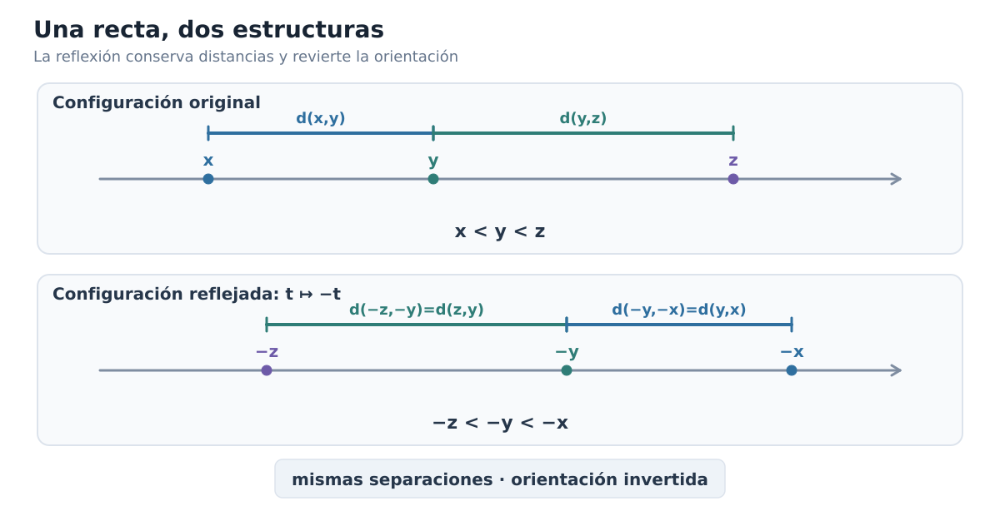
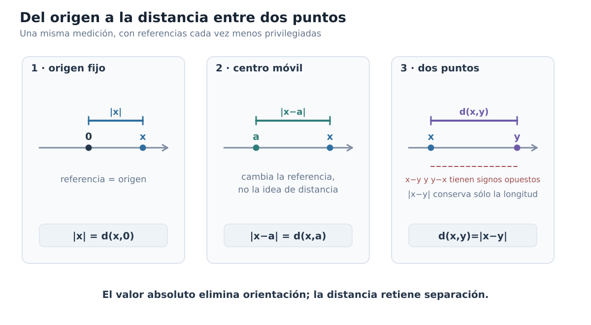
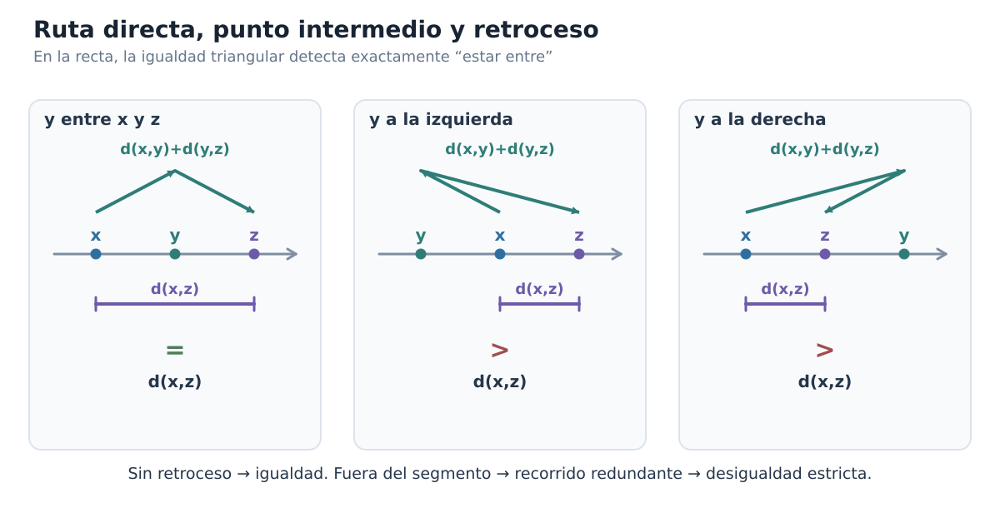
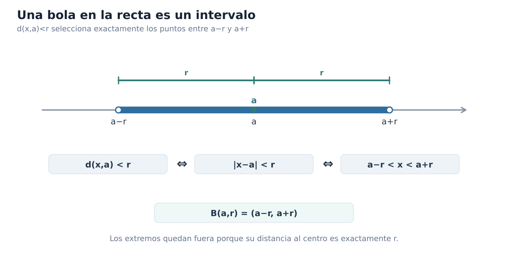
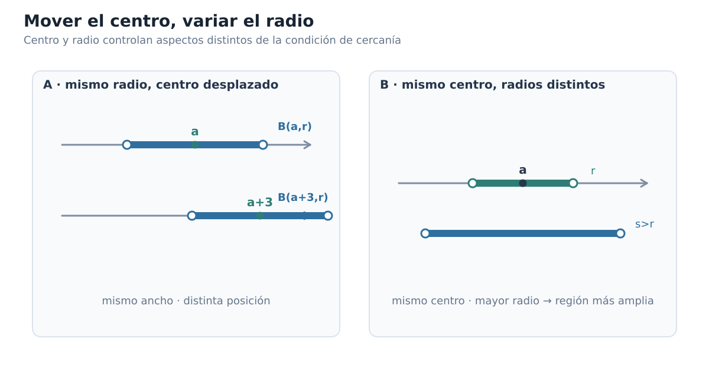
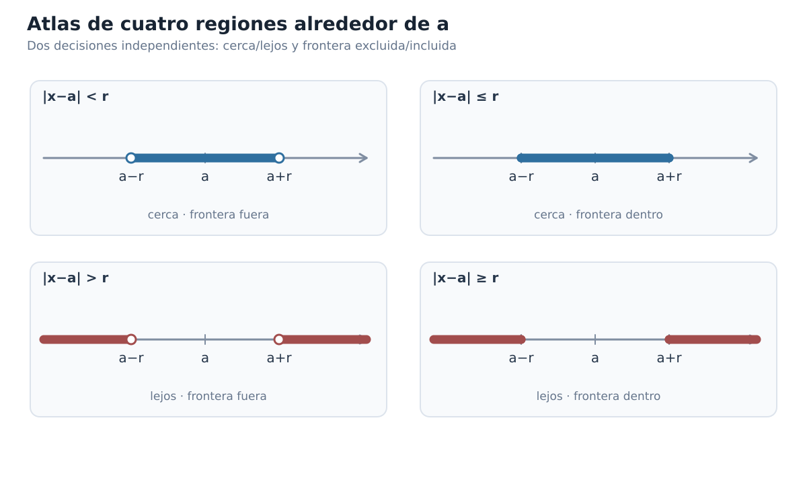
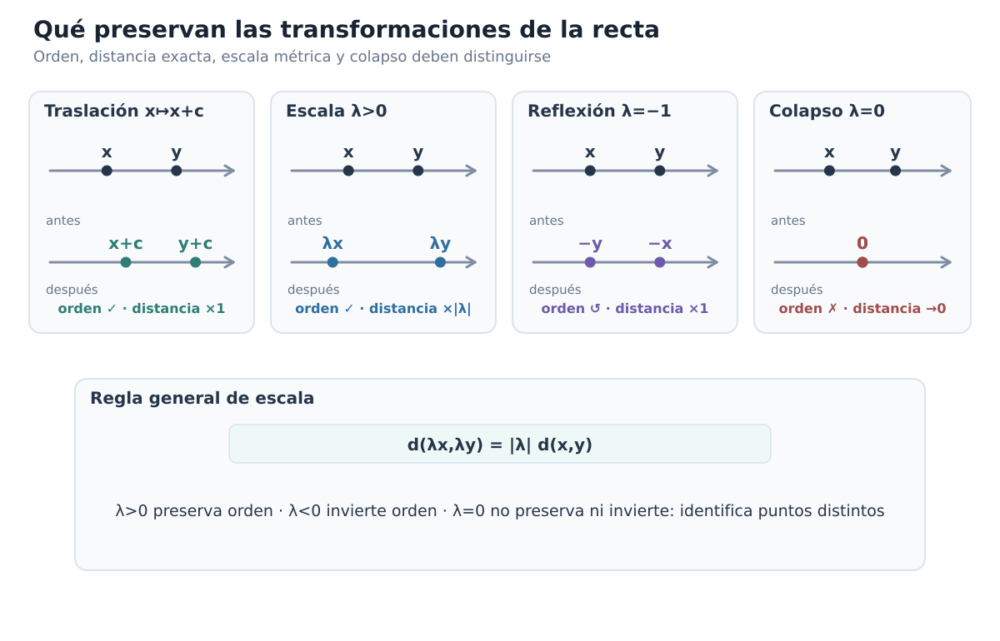

[Índice del libro](../para-matematicos/analisis-para-matematicos.md) · [Ejercicios](analisis-para-matematicos-capitulo-1-recta-real-ordenada-y-metrica-ejercicios.md) · [Soluciones](analisis-para-matematicos-capitulo-1-recta-real-ordenada-y-metrica-soluciones.md) · [Soluciones de microcontroles](analisis-para-matematicos-capitulo-1-recta-real-ordenada-y-metrica-microcontroles.md)

A esta altura ya hemos usado la recta real tantas veces que cuesta verla como un objeto que merezca explicación. Dibujamos puntos sobre ella, resolvemos desigualdades, hablamos de intervalos, seguimos el movimiento de una variable y, si alguien escribe $x<y$, casi sentimos que la posición de ambos números está delante de nosotros. La recta se ha vuelto tan familiar que muchas ideas distintas terminan fundiéndose en una sola imagen.

Pero justamente ahí aparece una buena pregunta: **¿qué estamos usando realmente cada vez que razonamos sobre la recta?**

A veces necesitamos saber qué número está antes que otro; otras veces no nos importa quién está a la izquierda, sino cuánto separa a dos puntos; en otros argumentos hacemos operaciones algebraicas y sólo después interpretamos geométricamente lo que obtuvimos. Todo ocurre sobre los mismos números reales, pero no todo pertenece a la misma estructura.

Ese será nuestro punto de partida. No vamos a reconstruir $\mathbb R$ desde sus fundamentos ni a repetir las técnicas elementales que ya manejamos. Vamos a hacer algo más útil para el análisis: tomar la recta que ya conocemos y preguntarnos qué información contiene cada una de las maneras habituales de mirarla.

La pregunta que guiará el capítulo es:

> **¿Qué información obtenemos al saber dónde está un punto en el orden de la recta y qué información obtenemos al saber a qué distancia está de otro?**

No intentemos responderla demasiado rápido. Si lo hiciéramos, probablemente diríamos que ambas cosas son más o menos lo mismo, porque en la recta los intervalos, las desigualdades y las distancias parecen encajar de manera casi automática. Y es verdad que encajan extraordinariamente bien; lo interesante será descubrir **por qué** encajan y, antes de eso, aprender a distinguir las piezas.

Empezaremos separando las distintas estructuras que solemos superponer en un mismo dibujo. Después veremos cómo el orden produce intervalos, cómo el valor absoluto deja de ser una regla algebraica algo misteriosa cuando lo leemos como distancia y, finalmente, por qué una condición métrica puede transformarse en una condición de intervalo. Ese ir y venir entre lenguajes será una de las herramientas básicas del análisis.

## 1.1. La misma recta, varias estructuras

Escribamos simplemente $\mathbb R$ y hagamos una pausa. ¿Qué hemos escrito?

La respuesta obvia es «los números reales», pero eso todavía deja abierta la pregunta importante. Sobre esos números podemos sumar y multiplicar; podemos decidir si uno es menor que otro; podemos colocarlos sobre una recta y medir separaciones. El conjunto de puntos es el mismo, pero las preguntas que hacemos no lo son.

Desde el punto de vista **algebraico**, nos interesan operaciones como $x+y$, $xy$ o $x-y$. Desde el punto de vista **ordenado**, nos interesan relaciones como $x<y$ o $x\le y$. Y desde el punto de vista **métrico**, la pregunta típica ya no es «¿cuál viene antes?», sino «¿qué tan lejos están?».

Pensemos en tres puntos reales $x$, $y$ y $z$ y supongamos que sabemos que

$$
x<y<z.
$$

¿Qué hemos aprendido exactamente? Sabemos que $y$ queda entre $x$ y $z$ en la orientación habitual de la recta; sabemos cuál aparece primero y cuál después. Pero no sabemos si $x$ y $y$ están casi pegados o enormemente separados, ni tampoco si $y$ está mucho más cerca de $x$ que de $z$. El orden nos ha dado bastante información, pero no esa información.

Probemos ahora el experimento contrario. Imaginemos que conocemos las separaciones entre los tres puntos, pero ocultamos las etiquetas «izquierda» y «derecha». Podemos seguir diciendo qué pares están más cerca, cuáles más lejos e incluso comparar longitudes, pero algo se ha perdido: la distancia, por sí sola, no nos dice hacia qué lado está cada punto.

Una reflexión hace esta diferencia especialmente visible. Partamos otra vez de

$$
x<y<z.
$$

y reflejemos toda la configuración respecto del origen. La orientación cambia: lo que estaba a la izquierda pasa a la derecha y viceversa. Sin embargo, las separaciones permanecen iguales. Más adelante demostraremos este hecho con una fórmula muy sencilla; ahora lo que nos interesa es la idea que el experimento descubre.

La figura C01-F01 concentra esta lectura en una sola comparación.

*Figura C01-F01. La reflexión conserva todas las separaciones pero invierte la orientación; orden y métrica interactúan sin contener exactamente la misma información.*

Así aparece nuestra primera conclusión estructural: **el orden sabe algo que la distancia no sabe**, porque distingue una orientación. Pero conviene no exagerar la separación. En $\mathbb R$, orden y distancia están tan bien coordinados que muchas veces podremos traducir exactamente una descripción en la otra. Los intervalos surgirán del orden y, unas páginas después, veremos que ciertas condiciones de distancia describen precisamente esos mismos intervalos.

Ésa es una de las razones por las que la recta real es un lugar tan cómodo para aprender análisis: varias estructuras distintas cooperan de una manera excepcionalmente estrecha.

### ¿Qué pregunta estamos haciendo?

Podemos convertir todo esto en un pequeño hábito. Cuando aparezca una afirmación sobre números reales, antes de manipular símbolos preguntémonos qué clase de información está pidiendo.

Si escribimos

$$
x<y,
$$

estamos comparando posiciones: la estructura relevante es el **orden**.

Si preguntamos cuánto separa a $x$ de $y$, estamos haciendo una pregunta **métrica**.

Si calculamos $x+y$, $xy$ o $x-y$, estamos usando la estructura **algebraica**.

Por supuesto, los argumentos interesantes empiezan cuando estas capas se mezclan. Una expresión algebraica puede aparecer dentro de una desigualdad; esa desigualdad puede describir una región de la recta; y esa misma región podrá terminar siendo descrita por una condición de distancia. Cuando lleguemos a ese punto, la traducción parecerá natural, pero será natural porque habremos entendido qué aporta cada estructura.

### Una precaución con los dibujos

Hay otra cuestión que vale la pena aclarar desde ahora. Dibujamos la recta horizontalmente y colocamos los números crecientes de izquierda a derecha; después de años de hacerlo, casi parece que «izquierda» y «derecha» pertenecieran físicamente a $\mathbb R$. Pero no es así: forman parte de nuestra representación de su orden.

Esto no vuelve engañosos a los dibujos. Al contrario, los vuelve más interesantes, porque obliga a preguntar qué está haciendo exactamente cada elemento de una figura. Si una reflexión conserva las separaciones pero invierte la orientación, el dibujo puede hacernos ver el fenómeno de inmediato; lo que no puede hacer, por sí solo, es convertir esa observación en una afirmación universal demostrada.

Usaremos muchas figuras de esta manera. Primero nos permitirán ver algo; después preguntaremos qué es exactamente lo que estamos viendo; finalmente buscaremos una formulación que pueda demostrarse. Una buena figura no reemplaza el argumento: nos ayuda a encontrarlo y, una vez encontrado, nos ayuda a comprender por qué funciona.

### Probemos la distinción

Antes de avanzar, hagamos una pequeña prueba de lectura. En cada una de las afirmaciones siguientes, intentemos reconocer qué estructura está actuando en primer plano —aunque en algunos casos aparezca más de una—:

1. $x<y$.
2. «$y$ está entre $x$ y $z$».
3. «$x$ y $y$ están separados por la misma cantidad que $u$ y $v$».
4. $x+y=z$.
5. «al reflejar una configuración, cambian izquierda y derecha pero no las separaciones».

No hace falta formalizar todavía todas estas frases. Si logramos distinguir qué pregunta corresponde al orden, cuál a la distancia y cuál al álgebra, ya hemos conseguido lo que necesitábamos de esta primera sección.

Ahora sí podemos empezar a estudiar una de esas estructuras por separado. En la sección siguiente nos concentraremos en el orden: veremos qué significa estar a la izquierda, a la derecha o entre dos puntos, y de esa relación tan elemental surgirán los intervalos que utilizaremos una y otra vez en el resto del libro.

## 1.2. Orden: izquierda, derecha y estar entre

En la sección anterior vimos que el orden y la distancia responden preguntas distintas. Ahora vamos a concentrarnos, por un momento, sólo en el orden. Esto significa que todavía no preguntaremos cuánto separa a dos puntos; nos bastará con saber cuál aparece antes, cuál después y qué significa que uno quede entre otros dos.

Empecemos con algo que parece demasiado sencillo para merecer atención. Si escribimos

$$
x<y,
$$

decimos que $x$ es menor que $y$. En la representación habitual de la recta real, esto significa que $x$ queda a la izquierda de $y$. Si escribimos $x\le y$, permitimos además el caso $x=y$.

Hasta aquí no hay ninguna novedad técnica. Lo importante es advertir que estas relaciones ya organizan la recta: en cuanto fijamos dos números distintos, uno queda antes que el otro, y esa comparación nos permite comenzar a hablar de regiones delimitadas por puntos.

### ¿Qué significa realmente «estar entre»?

Tomemos tres números reales. Si escribimos

$$
x\le y\le z,
$$

es natural decir que $y$ está entre $x$ y $z$. Pero hay un pequeño problema escondido en esa frase: hemos supuesto que $x$ está a la izquierda de $z$. ¿Qué ocurriría si los extremos aparecieran en el orden contrario?

No queremos que la expresión «$y$ está entre $x$ y $z$» dependa del orden en que decidamos nombrar los extremos. Por eso conviene formularla de una manera que no privilegie ninguna orientación.

Diremos que **$y$ está entre $x$ y $z$** cuando

$$
\min\{x,z\}\le y\le \max\{x,z\}.
$$

Esta fórmula hace exactamente lo que necesitamos. Si $x\le z$, se reduce a

$$
x\le y\le z;
$$

si $z\le x$, se convierte en

$$
z\le y\le x.
$$

En ambos casos expresa la misma idea geométrica: $y$ pertenece al tramo de la recta delimitado por $x$ y $z$, y permitimos que coincida con uno de los extremos.

¿Por qué molestarnos en escribirlo así? Porque más adelante aparecerá una caracterización de «estar entre» que ya no estará formulada con desigualdades, sino con distancias. Cuando comparemos ambas formulaciones necesitaremos una definición de «entre» que no haya incorporado accidentalmente una orientación.

### De dos fronteras a un intervalo

Supongamos ahora que elegimos dos números $a$ y $b$ con

$$
a<b.
$$

¿Qué puntos quedan estrictamente entre ellos? Exactamente aquellos $x$ que satisfacen

$$
a<x<b.
$$

A este conjunto lo llamamos **intervalo abierto** de extremos $a$ y $b$, y escribimos

$$
(a,b)=\{x\in\mathbb R:a<x<b\}.
$$

Los paréntesis nos recuerdan que los extremos no pertenecen al conjunto. En efecto, $a$ no satisface $a<a<b$, y $b$ tampoco satisface $a<b<b$.

Pero quizá queramos incluir ambos extremos. Entonces cambiamos las desigualdades estrictas por desigualdades no estrictas:

$$
[a,b]=\{x\in\mathbb R:a\le x\le b\}.
$$

Éste es el **intervalo cerrado** de extremos $a$ y $b$.

Entre ambas posibilidades quedan dos casos mixtos:

$$
[a,b)=\{x\in\mathbb R:a\le x<b\},
$$

y

$$
(a,b]=\{x\in\mathbb R:a<x\le b\}.
$$

No hay que memorizar cuatro dibujos separados. La notación está diciendo exactamente qué ocurre en cada frontera: un corchete incluye el extremo correspondiente; un paréntesis lo excluye.

La figura C01-F02 concentra esta lectura en una sola comparación.

![Cuatro rectas alineadas muestran (a,b), [a,b], (a,b] y [a,b), con extremos abiertos o cerrados y sus desigualdades equivalentes.](../../assets/books/anm/C01/C01-F02.svg)

*Figura C01-F02. Paréntesis y corchetes registran exactamente si cada frontera satisface una desigualdad estricta o no estricta.*

Conviene detenernos en una posible confusión. Acabamos de usar las palabras «abierto» y «cerrado», pero todavía no estamos hablando de conjuntos abiertos y cerrados en sentido topológico. Por ahora son simplemente los nombres tradicionales de estos tipos de intervalo. La teoría general que explica esas palabras vendrá más adelante.

### Traducir en ambos sentidos

La notación de intervalos es útil porque comprime información, pero no queremos que se convierta en un código que sólo sepamos leer de izquierda a derecha. Debemos poder pasar con soltura de desigualdades a intervalos y de intervalos a desigualdades.

Por ejemplo,

$$
x\in(-2,5]
$$

significa exactamente

$$
-2<x\le 5.
$$

Y si sabemos que

$$
3\le x<7,
$$

podemos expresar la misma condición diciendo

$$
x\in[3,7).
$$

Parece una traducción elemental, y lo es, pero tiene una importancia que irá creciendo. Muy pronto aparecerán condiciones expresadas mediante valor absoluto y distancia, y querremos reconocer qué región de la recta describen. Si la traducción entre orden e intervalo no es automática, la traducción posterior entre distancia e intervalo tampoco lo será.

Probemos un caso ligeramente menos inmediato. ¿Qué conjunto describe la condición

$$
x<4?
$$

No hay una frontera izquierda finita. Queremos todos los reales que quedan a la izquierda de $4$, de modo que escribimos

$$
(-\infty,4).
$$

Del mismo modo,

$$
x\ge -1
$$

describe la semirrecta

$$
[-1,\infty).
$$

Los símbolos $-\infty$ y $\infty$ no representan puntos reales que puedan incluirse en el conjunto. Por eso siempre aparecen acompañados por paréntesis, nunca por corchetes.

### Los intervalos nacen del orden

Ya podemos ver la idea estructural de esta sección. Un intervalo no es, en primer lugar, una figura sombreada sobre una recta; es el conjunto de puntos que satisfacen ciertas relaciones de orden respecto de una o dos fronteras.

Por eso

$$
(a,b)
$$

no es una notación independiente de

$$
a<x<b.
$$

Ambas expresiones dicen lo mismo en lenguajes distintos: la primera nombra el conjunto; la segunda describe mediante el orden qué significa pertenecer a él.

Éste es nuestro primer puente sistemático entre dos representaciones de una misma condición. Más adelante añadiremos una tercera. Cuando aprendamos a interpretar $|x-a|$ como una distancia, veremos que algunas regiones que ahora describimos mediante desigualdades también pueden describirse diciendo simplemente que un punto está suficientemente cerca de otro.

Antes de llegar allí, conviene conservar una imagen muy sencilla: **el orden coloca fronteras; los intervalos reúnen los puntos que quedan entre ellas**.

### Antes de seguir

Comprobemos que la traducción funciona en ambas direcciones. Sin resolver nada nuevo, intentemos leer cada expresión en el otro lenguaje:

1. $x\in(-3,2)$.
2. $x\in[0,5)$.
3. $-1<x\le 4$.
4. $x>6$.
5. $x\le 0$.

El objetivo no es practicar mecánicamente desigualdades. Queremos que intervalo y condición de orden empiecen a sentirse como dos maneras de mirar el mismo objeto.

Con esto tenemos preparada la siguiente pregunta. El orden nos permite decir que un punto queda entre dos fronteras, pero todavía no hemos introducido una manera sistemática de hablar de **cuánto** se separa de ellas o de un punto elegido. Para eso necesitaremos reinterpretar una operación que ya conocemos bien: el valor absoluto.

## 1.3. Valor absoluto: distancia al origen

Hasta ahora hemos usado el orden para decidir dónde queda un punto respecto de otros. Pero al final de la sección anterior dejamos abierta una pregunta distinta: una vez que sabemos que un punto está a la izquierda o a la derecha, ¿cómo expresamos **cuánto** se ha alejado de un punto de referencia?

Comencemos por el punto de referencia más familiar: el origen.

El valor absoluto ya no es nuevo para nosotros. Sabemos calcular, por ejemplo,

$$
|5|=5
\qquad\text{y}\qquad
|-5|=5.
$$

Lo que nos interesa ahora no es repetir esa regla, sino preguntarnos qué está midiendo. Los números $5$ y $-5$ ocupan lados opuestos del origen, de modo que el orden distingue perfectamente sus posiciones; sin embargo, ambos están a la misma separación de $0$. El valor absoluto conserva justamente esa información y deja de lado la orientación.

Ésta es la lectura que queremos fijar:

$$
|x|=\text{distancia de }x\text{ al origen}.
$$

Dicho de otro modo, $x$ nos dice a qué lado del origen estamos y cuánto nos hemos desplazado con signo; $|x|$ conserva únicamente el tamaño de ese desplazamiento.

### La definición por casos, vista de nuevo

Recordemos brevemente la definición conocida:

$$
|x|=
\begin{cases}
x,&x\ge 0,\\
-x,&x<0.
\end{cases}
$$

¿Por qué aparecen exactamente esos dos casos? Si $x\ge0$, el número $x$ ya expresa una separación no negativa respecto de $0$, así que no hay nada que corregir. Si $x<0$, en cambio, el número $x$ lleva incorporada la orientación hacia el lado negativo; para obtener solamente la magnitud de la separación necesitamos cambiar su signo, y por eso aparece $-x$.

Así, la definición por casos deja de parecer una receta arbitraria. Está haciendo una tarea geométrica muy precisa: producir siempre una cantidad no negativa que mida cuán lejos está $x$ de $0$.

Esto explica inmediatamente por qué

$$
|x|\ge0
$$

para todo $x\in\mathbb R$, y también por qué

$$
|x|=0
$$

sólo cuando $x=0$. No son propiedades desconectadas que haya que memorizar; son exactamente lo que esperaríamos de una medida de separación respecto del origen.

### Una misma distancia, dos posiciones

Tomemos ahora un número $r>0$ y preguntemos qué significa

$$
|x|=r.
$$

Si pensamos sólo algebraicamente, podemos resolver la ecuación y obtener

$$
x=r
\qquad\text{o}\qquad
x=-r.
$$

Pero la lectura geométrica dice algo más sencillo: buscamos los puntos cuya distancia al origen es exactamente $r$. En una recta hay dos, uno a cada lado de $0$.

La orientación distingue esos dos puntos; la distancia al origen no.

Lo mismo ocurre si cambiamos la igualdad por una desigualdad. La condición

$$
|x|<r
$$

pide todos los puntos cuya separación del origen es menor que $r$. Si miramos la recta, esos puntos son precisamente los que quedan entre $-r$ y $r$:

$$
-r<x<r.
$$

En cambio,

$$
|x|>r
$$

selecciona los puntos que quedan a más de $r$ unidades del origen, es decir,

$$
x<-r
\qquad\text{o}\qquad
x>r.
$$

Aquí reaparece el puente que comenzamos a construir en §1.2. Una expresión con valor absoluto puede describir una región de la recta, y esa misma región puede expresarse mediante relaciones de orden. Por ahora estamos trabajando con el origen como centro; más adelante haremos esta traducción de manera sistemática para un centro cualquiera.

### ¿Tiene algo especial el origen?

Ésta es una buena pregunta, porque hasta este momento podría parecer que el valor absoluto estuviera esencialmente ligado a $0$. Pero supongamos que queremos medir la separación entre un punto $x$ y otro punto fijo $a$.

La cantidad

$$
x-a
$$

nos dice el desplazamiento de $a$ hacia $x$ con orientación: es positiva si $x$ queda a la derecha de $a$, negativa si queda a la izquierda y cero si ambos puntos coinciden. Si queremos conservar sólo el tamaño de ese desplazamiento, hacemos exactamente lo mismo que antes:

$$
|x-a|.
$$

Así, $|x-a|$ mide la distancia de $x$ al punto $a$.

Esta observación es sencilla, pero cambia bastante nuestra manera de leer el valor absoluto. El origen deja de ocupar una posición privilegiada. La expresión $|x|$ no es más que el caso $a=0$ de una idea más general:

$$
|x-a|=\text{distancia de }x\text{ al centro }a.
$$

La figura C01-F03 concentra esta lectura en una sola comparación.

*Figura C01-F03. El paso |x| → |x−a| → d(x,y)=|x−y| elimina gradualmente una referencia privilegiada y conserva la idea de medir separación.*

Probemos con un ejemplo. Si elegimos $a=3$, entonces los puntos $7$ y $-1$ están en lados distintos de $3$, pero

$$
|7-3|=4
\qquad\text{y}\qquad
|-1-3|=4.
$$

Ambos están a cuatro unidades del centro elegido. De nuevo, la expresión sin valor absoluto recuerda la orientación —$7-3=4$ mientras que $-1-3=-4$—, pero el valor absoluto retiene solamente la separación.

### Cambiar el centro no cambia la idea

Podemos mirar esta operación como una especie de recentrado conceptual. Cuando trabajamos con $|x|$, preguntamos por la posición de $x$ respecto de $0$; cuando trabajamos con $|x-a|$, hacemos exactamente la misma pregunta, pero tomando $a$ como referencia.

Conviene ser precisos aquí: no estamos afirmando que restar $a$ mueva físicamente el punto $x$ sobre la recta. Lo que cambia es la referencia desde la que describimos su posición. El número $x-a$ es el desplazamiento orientado desde $a$ hasta $x$; el número $|x-a|$ es el tamaño de ese desplazamiento.

Este modo de leer las barras de valor absoluto será mucho más útil en análisis que recordarlas sólo como una definición por casos. Cuando aparezca una condición como

$$
|x-a|<r,
$$

querremos leerla primero en palabras: «$x$ está a menos de $r$ unidades de $a$». Después podremos preguntarnos qué intervalo describe. Esa traducción completa llegará en §1.7; por ahora basta con reconocer qué está midiendo la expresión.

### Antes de seguir

Detengámonos en cuatro preguntas rápidas.

1. Si $|x|=6$, ¿qué sabemos sobre la posición de $x$?
2. Si $|x|<2$, ¿en qué parte de la recta puede estar $x$?
3. ¿Qué diferencia de información hay entre $x-a$ y $|x-a|$?
4. Si $|x-a|=0$, ¿qué debe ocurrir?

La idea que necesitamos conservar es simple: **el valor absoluto convierte un desplazamiento orientado en una separación no negativa**. En el origen esto aparece como $|x|$; respecto de un centro arbitrario aparece como $|x-a|$.

En la siguiente sección daremos un paso pequeño pero decisivo: dejaremos de hablar informalmente de «la distancia entre dos puntos» y convertiremos esta idea en una función con nombre y propiedades precisas.

## 1.4. Distancia entre dos puntos reales

En §1.3 dejamos de pensar el valor absoluto únicamente como una regla por casos y empezamos a leer $|x-a|$ como la separación entre $x$ y un centro elegido $a$. El paso siguiente es casi inevitable: si el punto de referencia puede ser cualquiera, ¿por qué seguir tratándolo como un centro fijo? Tomemos dos puntos reales $x$ e $y$ y hagamos que ambos puedan variar.

La resta

$$
x-y
$$

sigue registrando un desplazamiento orientado: es positiva si $x$ queda a la derecha de $y$, negativa si queda a la izquierda y cero si coinciden. Pero si queremos medir solamente cuánto separa a los dos puntos, la orientación vuelve a ser información sobrante. Por eso definimos

$$
d(x,y)=|x-y|.
$$

Llamaremos a $d$ la **distancia estándar** —o **métrica estándar**— de la recta real. Por ahora este nombre sólo se refiere a esta función concreta sobre $\mathbb R$; la teoría abstracta de espacios métricos llegará mucho más adelante.

La definición merece una primera comprobación. Si intercambiamos los puntos, la resta cambia de signo:

$$
y-x=-(x-y),
$$

pero su valor absoluto no cambia. Así que

$$
d(x,y)=|x-y|=|y-x|=d(y,x).
$$

Esto coincide con la geometría que esperamos: recorrer el segmento desde $x$ hasta $y$ o desde $y$ hasta $x$ cambia el sentido del recorrido, no su longitud.

La tercera escena de la figura C01-F03 ya anticipaba esta simetría: $x-y$ y $y-x$ cambian de signo al invertir el sentido, mientras $|x-y|$ conserva la misma longitud.

### ¿Qué debe cumplir una distancia?

Antes de seguir calculando ejemplos, conviene preguntarnos por qué esta función merece realmente el nombre de distancia. En la recta hay cuatro propiedades que esperamos de cualquier medición razonable entre puntos: que nunca produzca longitudes negativas, que sólo dé cero cuando los puntos coinciden, que no dependa del sentido en que medimos y que ir directamente de un punto a otro nunca sea más largo que obligarnos a pasar por un tercero.

Para $x,y,z\in\mathbb R$, la función

$$
d(x,y)=|x-y|
$$

satisface:

1. **No negatividad:**
   $$
   d(x,y)\ge0.
   $$
2. **Identidad de los puntos a distancia cero:**
   $$
   d(x,y)=0\iff x=y.
   $$
3. **Simetría:**
   $$
   d(x,y)=d(y,x).
   $$
4. **Desigualdad triangular:**
   $$
   d(x,z)\le d(x,y)+d(y,z).
   $$

Las tres primeras casi se leen directamente en la definición, pero vale la pena justificar las cuatro porque serán parte de la infraestructura del análisis posterior.

**Demostración.** La no negatividad sigue de $|x-y|\ge0$. Además,

$$
d(x,y)=0
\iff |x-y|=0
\iff x-y=0
\iff x=y,
$$

de modo que la distancia sólo se anula cuando los dos puntos coinciden. La simetría ya la vimos:

$$
d(x,y)=|x-y|=|-(y-x)|=|y-x|=d(y,x).
$$

Queda la cuarta propiedad. Aquí necesitamos una propiedad elemental del valor absoluto. Para cualquier número real $u$,

$$
-|u|\le u\le |u|.
$$

Si escribimos esta desigualdad para $u$ y para $v$ y sumamos miembro a miembro, obtenemos

$$
-(|u|+|v|)\le u+v\le |u|+|v|.
$$

Como $|u|+|v|\ge0$, estas dos desigualdades dicen precisamente que

$$
|u+v|\le |u|+|v|.
$$

Ahora basta elegir

$$
u=x-y,
\qquad
v=y-z.
$$

Entonces $u+v=x-z$, y por tanto

$$
|x-z|\le |x-y|+|y-z|,
$$

o, en el lenguaje que acabamos de introducir,

$$
d(x,z)\le d(x,y)+d(y,z).
$$

Eso demuestra las cuatro propiedades. $\square$

La última desigualdad es tan importante que recibirá atención propia en la sección siguiente. Allí dejaremos de verla sólo como una consecuencia algebraica de las barras de valor absoluto y preguntaremos qué dice geométricamente sobre una ruta que va de $x$ a $z$ pasando por $y$.

### Una primera estimación: cuánto puede cambiar una distancia

La desigualdad triangular permite obtener casi de inmediato otra estimación muy útil. Escribamos

$$
x=(x-y)+y.
$$

Aplicando la desigualdad triangular al valor absoluto,

$$
|x|\le |x-y|+|y|,
$$

de donde

$$
|x|-|y|\le |x-y|.
$$

Si intercambiamos $x$ e $y$, obtenemos también

$$
|y|-|x|\le |x-y|.
$$

Las dos desigualdades juntas equivalen a

$$
\bigl||x|-|y|\bigr|\le |x-y|.
$$

Ésta es la **desigualdad triangular inversa**. Su lectura es especialmente instructiva: la diferencia entre las distancias de $x$ e $y$ al origen nunca puede ser mayor que la distancia entre $x$ e $y$.

Por ejemplo, si dos puntos están separados por apenas $0.01$, sus distancias al origen no pueden diferir en $3$ ni en $100$; a lo sumo pueden diferir en $0.01$. La desigualdad convierte una intuición geométrica bastante natural en una estimación exacta.

No conviene memorizarla como una segunda fórmula independiente. Lo importante es reconocer de dónde salió: tomamos la desigualdad triangular, aislamos una diferencia y repetimos el argumento con los puntos intercambiados. Ese patrón de razonamiento —obtener control sobre una diferencia a partir de una desigualdad ya conocida— reaparecerá muchas veces en análisis.

### La orientación desaparece, la separación permanece

Volvamos por un momento a la definición

$$
d(x,y)=|x-y|.
$$

La resta $x-y$ distingue orientación; la distancia no. Si $x<y$, entonces $x-y<0$ y $y-x>0$, pero

$$
|x-y|=|y-x|.
$$

Esto nos permite precisar una idea que apareció ya en §1.1: conocer una distancia no nos dice cuál de los dos puntos está a la izquierda. La métrica registra **separación**, mientras que el orden registra **orientación y posición relativa**. En la recta ambas estructuras cooperan estrechamente, pero no contienen la misma información.

### Antes de seguir

Comprobemos que la nueva notación está haciendo trabajo conceptual y no sólo abreviando barras de valor absoluto.

1. ¿Por qué $d(2,7)=d(7,2)$ aunque $2-7$ y $7-2$ tengan signos distintos?
2. Si $d(x,y)=0$, ¿qué podemos concluir y qué propiedad acabamos de usar?
3. ¿Qué afirma en palabras $d(x,z)\le d(x,y)+d(y,z)$?
4. ¿Qué controla la desigualdad $\bigl||x|-|y|\bigr|\le |x-y|$?

Con esto ya tenemos una noción de distancia suficientemente precisa para empezar a razonar geométricamente con ella. En §1.5 volveremos a la desigualdad triangular, pero la pregunta será distinta: **¿cuándo el camino que pasa por un tercer punto no añade ninguna longitud?** La respuesta nos devolverá, de manera inesperadamente exacta, a la noción de «estar entre» que formulamos usando el orden.

## 1.5. La desigualdad triangular y la geometría de «estar entre»

En §1.4 demostramos que la distancia estándar satisface

$$
d(x,z)\le d(x,y)+d(y,z).
$$

Algebraicamente, la desigualdad ya está resuelta. Pero si nos quedáramos sólo con la demostración, perderíamos una parte importante de lo que esta fórmula está diciendo. En la recta, podemos leer los dos lados como longitudes de dos recorridos distintos: el lado izquierdo mide el trayecto directo de $x$ a $z$; el lado derecho mide lo que recorremos si obligamos al camino a pasar primero por $y$.

La pregunta interesante ya no es entonces «¿por qué el camino directo no es más largo?», sino otra más fina:

> **¿Cuándo pasar por $y$ no añade ninguna longitud?**

Tomemos un ejemplo sencillo. Si $x=1$, $y=4$ y $z=7$, entonces

$$
d(1,7)=6
$$

y, al mismo tiempo,

$$
d(1,4)+d(4,7)=3+3=6.
$$

No hemos pagado ninguna longitud extra por pasar por $4$, porque $4$ ya estaba en el trayecto entre $1$ y $7$. En cambio, si obligamos al recorrido a pasar por $y=10$, obtenemos

$$
d(1,10)+d(10,7)=9+3=12,
$$

que es estrictamente mayor que la distancia directa $d(1,7)=6$. Para visitar $10$ tenemos que sobrepasar $7$ y luego retroceder.

Esta diferencia entre **avanzar sin retroceso** y **salirse del segmento para volver** contiene toda la geometría del caso de igualdad.

La figura C01-F05 concentra esta lectura en una sola comparación.

*Figura C01-F05. En la recta hay igualdad triangular exactamente cuando $y$ está entre los extremos; fuera del segmento aparece recorrido redundante.*

### Cuando $y$ está entre los extremos

Recordemos nuestra definición de §1.2: $y$ está entre $x$ y $z$ cuando

$$
\min\{x,z\}\le y\le \max\{x,z\}.
$$

Supongamos primero que $x\le y\le z$. Entonces las diferencias $y-x$ y $z-y$ son no negativas, de modo que

$$
d(x,y)=y-x
$$

y

$$
d(y,z)=z-y.
$$

Al sumarlas,

$$
d(x,y)+d(y,z)=(y-x)+(z-y)=z-x=d(x,z).
$$

Si el orden de los extremos es el contrario, $z\le y\le x$, ocurre exactamente lo mismo con los papeles de $x$ y $z$ intercambiados. Por tanto, siempre que $y$ esté entre los extremos,

$$
d(x,z)=d(x,y)+d(y,z).
$$

Los casos $y=x$ o $y=z$ están incluidos. Si, por ejemplo, $y=x$, entonces $d(x,y)=0$ y la igualdad se reduce simplemente a $d(x,z)=d(x,z)$. Esto importa porque nuestra noción de «estar entre» permite coincidir con los extremos.

### ¿Y si aparece la igualdad?

La dirección anterior era la más fácil de imaginar: si $y$ está entre $x$ y $z$, las longitudes se concatenan sin retroceso. Lo más interesante es la conversa. Supongamos ahora que sabemos que

$$
d(x,z)=d(x,y)+d(y,z).
$$

¿Estamos obligados a concluir que $y$ está entre $x$ y $z$? En la recta real, sí.

Como la afirmación no cambia si intercambiamos $x$ y $z$, podemos estudiar el caso $x\le z$. Queremos ver dónde puede estar $y$. Hay tres posibilidades: a la izquierda de $x$, entre $x$ y $z$, o a la derecha de $z$.

Ya sabemos qué ocurre en el caso intermedio. Veamos qué pasa si $y<x$. Entonces

$$
d(x,y)=x-y,
\qquad
d(y,z)=z-y,
$$

y por tanto

$$
d(x,y)+d(y,z)=x+z-2y.
$$

Como $y<x$, tenemos $x-y>0$, y de hecho

$$
d(x,y)+d(y,z)=(z-x)+2(x-y)>z-x=d(x,z).
$$

Aparece longitud extra: para ir de $x$ a $z$ pasando por un punto situado a la izquierda de $x$, primero debemos retroceder y luego desandar ese retroceso.

Si, en cambio, $y>z$, obtenemos de manera análoga

$$
d(x,y)+d(y,z)=(z-x)+2(y-z)>z-x=d(x,z).
$$

También aquí aparece un recorrido redundante, ahora por haber sobrepasado $z$.

Así que la igualdad sólo puede ocurrir en el caso que quedaba: $x\le y\le z$. Al devolver la simetría entre los extremos, obtenemos la caracterización completa:

$$
\boxed{
 d(x,z)=d(x,y)+d(y,z)
 \iff
 \min\{x,z\}\le y\le \max\{x,z\}.
}
$$

Éste es uno de los primeros lugares del capítulo donde orden y distancia se encuentran de manera exacta. La frase «$y$ está entre $x$ y $z$» pertenece al lenguaje del orden; la igualdad de distancias pertenece al lenguaje métrico. En la recta real, ambas descripciones expresan la misma situación.

### Desigualdad estricta fuera del segmento

La caracterización anterior nos permite decir algo un poco más fuerte sin hacer una nueva demostración. Si $y$ **no** está entre $x$ y $z$, entonces la igualdad es imposible y la desigualdad triangular se vuelve estricta:

$$
d(x,z)<d(x,y)+d(y,z).
$$

En la recta, por tanto, la desigualdad triangular no es sólo una cota. También detecta si el punto intermedio pertenece o no al tramo determinado por los extremos.

Conviene advertir desde ahora que esta lectura tan precisa depende de la geometría unidimensional de $\mathbb R$. Más adelante, cuando trabajemos con espacios métricos abstractos, no podremos suponer sin demostración que la igualdad triangular caracteriza una noción única de «estar entre». Aquí sí podemos hacerlo porque el orden lineal de la recta controla completamente la posición relativa de tres puntos.

### Qué nos enseñó realmente la igualdad

Volvamos a la pregunta inicial. ¿Cuándo pasar por $y$ no añade longitud? Exactamente cuando $y$ ya se encuentra entre los extremos. En cualquier otro caso, el recorrido contiene una ida y vuelta innecesaria.

Podemos resumirlo así:

- **orden:** $y$ está entre $x$ y $z$;
- **métrica:** $d(x,z)=d(x,y)+d(y,z)$;
- **geometría:** el recorrido $x\to y\to z$ no contiene retroceso.

Tres lenguajes distintos, una misma configuración.

### Antes de seguir

Probemos si la caracterización ya resulta natural.

1. Si $x=-2$, $z=5$ y $y=1$, ¿esperamos igualdad o desigualdad estricta?
2. Si $x=-2$, $z=5$ y $y=8$, ¿dónde aparece el recorrido extra?
3. Si $d(x,z)=d(x,y)+d(y,z)$, ¿qué podemos afirmar sobre la posición de $y$ sin saber cuál de $x$ o $z$ está a la izquierda?
4. ¿Por qué los casos $y=x$ y $y=z$ deben formar parte de la caracterización?

La desigualdad triangular comenzó como una propiedad algebraica de la distancia. Ahora vemos que, en la recta, también es una afirmación sobre **posición**. En la sección siguiente cambiaremos de pregunta una vez más: fijaremos un centro y un margen positivo, y estudiaremos qué conjunto de puntos queda a una distancia menor que ese margen.

## 1.6. Bolas métricas: ventanas alrededor de un punto

En la sección anterior dejamos tres puntos libres y preguntamos qué ocurría al obligar a una ruta a pasar por uno de ellos. Ahora fijaremos sólo uno. Elegimos un punto $a\in\mathbb R$ y queremos reunir todos los puntos que estén **suficientemente cerca** de él.

La palabra «suficientemente» necesita, naturalmente, una medida. Elijamos un número $r>0$ y exijamos que la distancia desde $x$ hasta $a$ sea menor que $r$. Esto conduce a la definición

$$
B(a,r)=\{x\in\mathbb R:d(x,a)<r\}.
$$

Llamaremos a $B(a,r)$ la **bola abierta de centro $a$ y radio $r$** en la recta real.

Hay dos datos que conviene mantener separados desde el comienzo. El **centro** $a$ decide alrededor de qué punto estamos midiendo; el **radio** $r$ decide cuánta separación estamos dispuestos a admitir. La condición $r>0$ no es decorativa: un radio positivo expresa un margen real de cercanía alrededor del centro.

### ¿Qué forma tiene una bola en la recta?

El nombre «bola» puede sugerir un disco o una esfera, pero aquí nuestros puntos viven en $\mathbb R$. No deberíamos adivinar la forma del conjunto a partir de la palabra; debemos leer la definición.

Un punto $x$ pertenece a $B(a,r)$ exactamente cuando

$$
d(x,a)<r.
$$

Como la distancia estándar es $d(x,a)=|x-a|$, esto equivale a

$$
|x-a|<r.
$$

En §1.3 vimos que una desigualdad de valor absoluto centrada en el origen describe todos los puntos situados entre dos fronteras simétricas. Aplicando esa misma lectura al desplazamiento $x-a$, obtenemos

$$
-r<x-a<r.
$$

Sumando $a$ en los tres miembros,

$$
a-r<x<a+r.
$$

Pero ésta es precisamente la condición de pertenencia al intervalo $(a-r,a+r)$. Hemos demostrado, por tanto, que

$$
\boxed{B(a,r)=(a-r,a+r)}.
$$

La igualdad de conjuntos merece leerse en ambas direcciones. Si $x$ está a menos de $r$ unidades de $a$, entonces queda entre $a-r$ y $a+r$; y si queda entre esas dos fronteras, entonces su distancia a $a$ es menor que $r$.

La figura C01-F06 concentra esta lectura en una sola comparación.

*Figura C01-F06. En ℝ, d(x,a)<r selecciona exactamente los puntos del intervalo abierto (a−r,a+r); las fronteras quedan fuera porque están a distancia r.*

### El centro localiza; el radio controla el margen

La identidad

$$
B(a,r)=(a-r,a+r)
$$

nos permite ver con mucha claridad qué hace cada parámetro.

Si mantenemos fijo $r$ y cambiamos $a$, ambos extremos se desplazan en la misma cantidad. La bola se traslada a lo largo de la recta sin cambiar su tamaño. Por ejemplo,

$$
B(0,2)=(-2,2)
$$

mientras que

$$
B(5,2)=(3,7).
$$

El radio sigue siendo $2$; sólo hemos cambiado el punto alrededor del cual medimos.

Si, en cambio, mantenemos fijo el centro y variamos $r$, ocurre otra cosa. Con centro $a$,

$$
B(a,1)=(a-1,a+1),
$$

$$
B(a,2)=(a-2,a+2),
$$

y, más generalmente, un radio mayor permite una separación mayor en ambos sentidos. El intervalo se ensancha simétricamente respecto del centro.

La figura C01-F07 concentra esta lectura en una sola comparación.

*Figura C01-F07. Mover el centro traslada la bola sin cambiar su anchura; aumentar el radio ensancha la región simétricamente alrededor del mismo centro.*

Por eso resulta útil pensar en la bola como una **ventana** alrededor de $a$: mover $a$ desplaza la ventana; aumentar $r$ la abre; disminuir $r$ la estrecha. Pero conviene conservar la jerarquía correcta. «Ventana» es una imagen; la definición matemática es

$$
B(a,r)=\{x\in\mathbb R:d(x,a)<r\}.
$$

### Por qué exigimos $r>0$

Podría parecer que la condición $r>0$ es una formalidad. Veamos qué ocurre si la abandonamos.

Si $r=0$, la condición sería

$$
d(x,a)<0,
$$

que ningún punto puede satisfacer porque las distancias nunca son negativas. Si $r<0$, con mayor razón tampoco existe ningún $x$ cuya distancia no negativa a $a$ sea menor que ese número negativo.

Así, los radios no positivos no producen una región de cercanía alrededor del centro. Para la noción que queremos usar, el radio debe ser estrictamente positivo.

### Una primera lectura de tolerancia

La notación de bolas nos permite condensar una idea que aparecerá una y otra vez en análisis. Supongamos que $a$ es un valor de referencia y que aceptamos un error menor que $r$. Decir

$$
x\in B(a,r)
$$

significa que $x$ permanece dentro de ese margen:

$$
d(x,a)<r.
$$

En la recta, ya sabemos además que esto equivale a quedar entre las dos fronteras $a-r$ y $a+r$. Todavía no vamos a sistematizar todas las traducciones posibles —eso será precisamente el trabajo de §1.7—, pero ya podemos ver la idea que las sostiene: **una tolerancia positiva alrededor de un centro define una región precisa de puntos admitidos**.

### Antes de seguir

Comprobemos que centro, radio y conjunto no se mezclen entre sí.

1. ¿Qué cambia en $B(a,r)$ si sustituimos $a$ por $a+3$ y mantenemos fijo $r$?
2. ¿Qué cambia si dejamos fijo $a$ y duplicamos $r$?
3. ¿Por qué $a-r$ y $a+r$ quedan a la misma distancia del centro?
4. ¿Por qué esos dos puntos no pertenecen a $B(a,r)$?
5. ¿Qué falla si intentamos usar $r=0$ como radio de una bola abierta?

Hemos llegado así a una primera traducción exacta entre dos estructuras de la recta:

$$
\text{distancia menor que }r
\quad\longleftrightarrow\quad
\text{estar entre }a-r\text{ y }a+r.
$$

En la sección siguiente convertiremos esta observación en un pequeño sistema de traducción. Compararemos no sólo $<$, sino también $\le$, $>$ y $\ge$, y aprenderemos a pasar deliberadamente entre distancia, valor absoluto, desigualdad e intervalo.

## 1.7. Traducir entre orden, distancia y tolerancia

En §1.6 apareció una equivalencia que merece algo más que una mirada pasajera. Para $r>0$ vimos que

$$
B(a,r)=\{x\in\mathbb R:d(x,a)<r\}=(a-r,a+r).
$$

Esta igualdad reúne varias maneras de describir exactamente el mismo conjunto. Una habla de **distancia**; otra, de **valor absoluto**; otra, de **orden**; y otra, de **pertenencia a una región de la recta**. A partir de ahora conviene aprender a cambiar de una a otra deliberadamente.

La cadena fundamental es

$$
\boxed{
|x-a|<r
\iff d(x,a)<r
\iff a-r<x<a+r
\iff x\in(a-r,a+r)
}
$$

para todo $a,x\in\mathbb R$ y todo $r>0$.

No hay cuatro hechos distintos aquí. Hay una sola condición expresada en cuatro lenguajes.

### Leer la cadena de izquierda a derecha

Supongamos que comenzamos con

$$
|x-a|<r.
$$

La expresión $|x-a|$ mide la separación entre $x$ y $a$, de modo que podemos leer inmediatamente

$$
d(x,a)<r.
$$

La desigualdad dice que $x$ está a menos de $r$ unidades del centro. En la recta, esto significa que no ha alcanzado ninguna de las dos fronteras situadas exactamente a distancia $r$:

$$
a-r<x<a+r.
$$

Y esa condición de orden es precisamente la pertenencia al intervalo

$$
x\in(a-r,a+r).
$$

Cada paso cambia la representación, no el conjunto de puntos admitidos.

### Leerla también de derecha a izquierda

La traducción sólo está realmente dominada cuando podemos recorrerla en sentido contrario. Si sabemos que

$$
x\in(a-r,a+r),
$$

entonces

$$
a-r<x<a+r.
$$

Restando $a$ en los tres miembros obtenemos

$$
-r<x-a<r,
$$

que equivale a

$$
|x-a|<r,
$$

y, por definición de la distancia estándar,

$$
d(x,a)<r.
$$

La utilidad de este recorrido inverso aparecerá constantemente: a veces un problema estará formulado mediante una región de la recta, pero lo que necesitaremos para argumentar será una estimación de distancia; otras veces ocurrirá exactamente al revés.

### ¿Qué cambia si admitimos la frontera?

Consideremos ahora

$$
|x-a|\le r.
$$

La única diferencia es que permitimos que la separación sea exactamente $r$. Las dos fronteras $a-r$ y $a+r$ pasan entonces a formar parte del conjunto. La cadena correspondiente es

$$
\boxed{
|x-a|\le r
\iff d(x,a)\le r
\iff a-r\le x\le a+r
\iff x\in[a-r,a+r]
}
$$

De $<$ a $\le$ no cambia el centro ni cambia el radio: cambia únicamente la decisión sobre la frontera.

Esta observación parece elemental, pero conviene hacerla explícita porque en análisis la diferencia entre «menor que» y «menor o igual que» puede determinar qué puntos pertenecen a un conjunto y cuáles quedan fuera.

### De puntos cercanos a puntos lejanos

¿Qué ocurre si invertimos la comparación y preguntamos por puntos cuya distancia al centro sea **mayor** que $r$?

La condición

$$
|x-a|>r
$$

ya no selecciona los puntos situados entre las dos fronteras, sino los que quedan fuera de ellas. Algebraicamente,

$$
|x-a|>r
\iff x<a-r\quad\text{o}\quad x>a+r.
$$

En términos métricos y de regiones,

$$
\boxed{
|x-a|>r
\iff d(x,a)>r
\iff x<a-r\ \text{o}\ x>a+r
\iff x\in(-\infty,a-r)\cup(a+r,\infty)
}
$$

Aquí aparece una diferencia geométrica importante: la región ya no es un único intervalo, sino la unión de dos semirrectas. Para estar a más de $r$ unidades de $a$, el punto debe haber cruzado una de las dos fronteras.

Si permitimos además la igualdad, obtenemos

$$
\boxed{
|x-a|\ge r
\iff d(x,a)\ge r
\iff x\le a-r\ \text{o}\ x\ge a+r
\iff x\in(-\infty,a-r]\cup[a+r,\infty)
}
$$

De nuevo, la diferencia entre $>$ y $\ge$ sólo decide si los puntos frontera —aquellos cuya distancia a $a$ es exactamente $r$— quedan excluidos o incluidos.

La figura C01-F08 concentra esta lectura en una sola comparación.

*Figura C01-F08. Las condiciones <, ≤, > y ≥ combinan dos decisiones: cerca o lejos del centro y frontera excluida o incluida.*

### Dos decisiones que conviene separar

Las cuatro condiciones anteriores pueden organizarse mediante dos preguntas independientes.

La primera es:

> **¿Queremos puntos más cercanos que $r$ o puntos más lejanos que $r$?**

La segunda es:

> **¿Admitimos los puntos situados exactamente a distancia $r$?**

La primera decisión determina si seleccionamos la región entre $a-r$ y $a+r$ o la región situada fuera de esas dos marcas. La segunda determina si las marcas mismas se incluyen.

Por eso las cuatro posibilidades no forman una lista arbitraria que haya que memorizar. Surgen al combinar dos elecciones conceptuales muy simples:

- cerca / lejos;
- frontera excluida / frontera incluida.

### La tolerancia como lenguaje de análisis

La palabra **tolerancia** permite anticipar por qué estas traducciones serán útiles más adelante. Si $a$ es un valor de referencia y $r>0$ es el error máximo que estamos dispuestos a tolerar estrictamente, entonces

$$
d(x,a)<r
$$

significa que $x$ está dentro de ese margen. En la recta podemos decir exactamente lo mismo escribiendo

$$
a-r<x<a+r.
$$

La primera formulación enfatiza **cuánto puede separarse** $x$ de $a$; la segunda muestra **dónde puede estar** $x$ en el orden de la recta.

Esta dualidad será central cuando aparezcan definiciones de aproximación y límite. No necesitamos introducirlas todavía. Lo importante aquí es reconocer la infraestructura que esas definiciones utilizarán: una condición de cercanía puede leerse como una desigualdad, como una distancia o como una región alrededor de un punto.

### Traducir sin perder información

Probemos algunas traducciones en ambas direcciones. Supongamos siempre que $r>0$.

1. Si $d(x,a)\le r$, ¿qué intervalo describe la condición?
2. Si $x\in(a-r,a+r)$, ¿qué desigualdad de distancia satisface $x$?
3. Si $x\in(-\infty,a-r)\cup(a+r,\infty)$, ¿qué podemos afirmar sobre $|x-a|$?
4. Si $|x-a|\ge r$, ¿qué ocurre con los puntos $a-r$ y $a+r$?
5. Si reemplazamos $r$ por un número mayor, ¿qué sucede con la región descrita por $d(x,a)<r$? ¿Y con la descrita por $d(x,a)>r$?

La pregunta que debe acompañar cada traducción es siempre la misma: **¿qué conjunto de puntos describe realmente esta expresión?** Si podemos responderla sin depender de una regla memorizada, hemos adquirido la herramienta que necesitamos.

Podemos condensar toda la sección en este pequeño diccionario:

$$
\begin{array}{ccl}
 d(x,a)<r &\longleftrightarrow& a-r<x<a+r,\\
 d(x,a)\le r &\longleftrightarrow& a-r\le x\le a+r,\\
 d(x,a)>r &\longleftrightarrow& x<a-r\ \text{o}\ x>a+r,\\
 d(x,a)\ge r &\longleftrightarrow& x\le a-r\ \text{o}\ x\ge a+r.
\end{array}
$$

Pero el diccionario es sólo el resultado final. La idea importante es más estructural: **en la recta real, orden y distancia pueden traducirse uno en otro con una precisión excepcional**.

En §1.8 utilizaremos esta compatibilidad para cerrar el capítulo con una pregunta distinta: cuando trasladamos, escalamos o reflejamos la recta, ¿qué parte de la información de orden y qué parte de la información métrica permanece intacta?

## 1.8. Qué ve el orden y qué ve la distancia

Hemos pasado buena parte del capítulo traduciendo entre dos maneras de describir la recta. El orden nos dice qué punto queda antes, después o entre otros; la distancia nos dice cuánto separa a dos puntos. En $\mathbb R$ ambas estructuras cooperan tan bien que es fácil olvidar que no contienen exactamente la misma información.

Para cerrar el capítulo vamos a someter la recta a algunas transformaciones muy simples y preguntar, en cada caso, qué permanece y qué cambia.

Partamos de dos puntos con

$$
x<y.
$$

Nos interesarán dos datos distintos:

- su orden relativo;
- su distancia $d(x,y)$.

La pregunta será siempre la misma: **después de transformar ambos puntos, ¿qué ha ocurrido con cada uno de esos datos?**

### Trasladar la recta

Empecemos sumando el mismo número $c$ a todos los puntos:

$$
x\longmapsto x+c.
$$

Si $x<y$, entonces

$$
x+c<y+c.
$$

La traslación preserva, por tanto, el orden. Pero también preserva exactamente la distancia, porque

$$
\begin{aligned}
d(x+c,y+c)
&=|(x+c)-(y+c)|\\
&=|x-y|\\
&=d(x,y).
\end{aligned}
$$

Nada se ha estirado, comprimido ni reflejado. Toda la configuración se ha desplazado como un bloque rígido a lo largo de la recta.

Esta primera transformación conserva simultáneamente las dos estructuras que hemos estudiado: conserva la orientación del orden y conserva todas las distancias.

### Escalar la recta

Consideremos ahora

$$
x\longmapsto \lambda x,
$$

donde $\lambda\in\mathbb R$. Para la distancia obtenemos una fórmula que vale para cualquier $\lambda$:

$$
\begin{aligned}
d(\lambda x,\lambda y)
&=|\lambda x-\lambda y|\\
&=|\lambda(x-y)|\\
&=|\lambda|\,|x-y|\\
&=|\lambda|\,d(x,y).
\end{aligned}
$$

La consecuencia es clara: una escala no conserva necesariamente las distancias, pero las transforma de una manera perfectamente controlada. Todas se multiplican por el mismo factor $|\lambda|$.

¿Qué ocurre con el orden? Aquí el signo de $\lambda$ sí importa.

Si $\lambda>0$, de $x<y$ obtenemos

$$
\lambda x<\lambda y.
$$

La orientación se conserva, mientras que las distancias se multiplican por $\lambda$.

Si $\lambda<0$, en cambio,

$$
\lambda x>\lambda y.
$$

La orientación se invierte, aunque las distancias siguen escalándose por el factor positivo $|\lambda|$.

Este contraste merece atención: el signo de $\lambda$ es decisivo para el orden, pero la distancia sólo registra su valor absoluto.

### La reflexión como caso decisivo

Tomemos ahora $\lambda=-1$. La transformación es

$$
x\longmapsto -x.
$$

Por la fórmula anterior,

$$
d(-x,-y)=|-1|\,d(x,y)=d(x,y).
$$

Así que la reflexión preserva **exactamente** todas las distancias.

Sin embargo, si

$$
x<y,
$$

entonces

$$
-x>-y.
$$

La izquierda y la derecha se intercambian.

La figura C01-F09 concentra esta lectura en una sola comparación.

*Figura C01-F09. Traslación, escala positiva, reflexión y λ=0 afectan de manera distinta orden y métrica; preservar distancia exacta no es lo mismo que escalarla uniformemente.*

Éste es el ejemplo que termina de separar las dos estructuras. Si conociéramos únicamente todas las distancias entre los puntos de una configuración, no podríamos distinguir esa configuración de su imagen reflejada. Las separaciones serían idénticas, aunque la orientación hubiese cambiado por completo.

La aplicación $x\mapsto -x$ es, por ello, una **isometría** de la recta: preserva todas las distancias. Pero es una isometría que invierte la orientación.

### El caso degenerado $\lambda=0$

Queda un caso que conviene no esconder dentro de la fórmula general. Si $\lambda=0$, todos los puntos son enviados al mismo lugar:

$$
x\longmapsto 0.
$$

La ley métrica sigue siendo algebraicamente correcta:

$$
d(0,0)=0=|0|\,d(x,y).
$$

Pero ahora todas las distancias han colapsado a cero.

Tampoco podemos decir que el orden se preserve o se invierta. Si $x<y$, ambos puntos tienen la misma imagen, $0$. Por tanto, ya no aparece ninguna desigualdad estricta entre sus imágenes: no tenemos ni $0<0$ ni $0>0$.

El caso $\lambda=0$ no es una inversión del orden: es un **colapso**. Puntos distintos dejan de distinguirse después de la transformación.

Esta distinción será útil cada vez que interpretemos una fórmula de transformación. Una identidad algebraica puede seguir siendo válida en un caso degenerado aunque la interpretación geométrica cambie radicalmente.

### Tres preguntas diferentes

Podemos ahora organizar lo aprendido sin confundir tres preguntas que parecen similares.

La primera es:

> **¿Se preservan exactamente las distancias?**

Para una traslación, sí. Para una escala $x\mapsto\lambda x$, esto ocurre exactamente cuando

$$
|\lambda|=1.
$$

En la recta real, los casos son $\lambda=1$ y $\lambda=-1$: identidad y reflexión.

La segunda pregunta es:

> **¿Cómo cambian las distancias?**

Para cualquier escala,

$$
d(\lambda x,\lambda y)=|\lambda|d(x,y).
$$

Si $|\lambda|>1$, se amplían; si $0<|\lambda|<1$, se contraen; si $\lambda=0$, colapsan a cero.

La tercera pregunta es:

> **¿Qué ocurre con el orden?**

- una traslación lo preserva;
- una escala con $\lambda>0$ lo preserva;
- una escala con $\lambda<0$ lo invierte;
- una escala con $\lambda=0$ no lo preserva ni lo invierte: destruye toda distinción estricta entre los puntos.

Estas respuestas no son intercambiables. Saber qué sucede con las distancias no determina por sí solo qué sucede con la orientación.

### Volvamos al comienzo

En §1.1 empezamos con una observación: sobre la misma recta podemos hacer preguntas algebraicas, de orden y métricas. Después fuimos construyendo puentes entre ellas. Los intervalos surgieron del orden; el valor absoluto se convirtió en distancia; la desigualdad triangular relacionó distancia y posición; las bolas resultaron ser intervalos; y una condición de tolerancia pudo escribirse indistintamente mediante distancia o desigualdades.

Ahora podemos precisar la conclusión que entonces apenas intuíamos.

La métrica estándar de $\mathbb R$ permite decir **cuánto separa** a los puntos. El orden permite decir **cómo están orientados y situados unos respecto de otros**. En la recta ambas estructuras son extraordinariamente compatibles, pero una no se reduce a la otra.

La reflexión lo muestra de la manera más limpia:

$$
d(-x,-y)=d(x,y),
$$

mientras que

$$
x<y\iff -x>-y.
$$

La distancia permanece; la orientación cambia.

### Antes de cerrar el capítulo

Comprobemos que las distinciones estén claras.

1. Si trasladamos todos los puntos por $c$, ¿qué ocurre con el orden y con las distancias?
2. Si $\lambda=3$, ¿qué ocurre con una distancia de longitud $2$? ¿Y con el orden?
3. Si $\lambda=-3$, ¿qué cambia respecto del caso anterior?
4. ¿Por qué $x\mapsto -x$ preserva distancias y, sin embargo, invierte el orden?
5. ¿Por qué $\lambda=0$ no debe clasificarse como una transformación que «invierte» el orden?
6. ¿Qué información podemos perder aunque conozcamos todas las distancias de una configuración?

Con esto queda establecida la infraestructura que necesitábamos al comienzo del análisis: intervalos, valor absoluto, distancia, bolas y traducciones de tolerancia viven sobre una misma recta, pero pertenecen a estructuras que conviene distinguir incluso cuando trabajan juntas.

El resto del libro explotará una y otra vez esa cooperación. En particular, muchas afirmaciones analíticas podrán expresarse como condiciones de orden, como condiciones de distancia o como restricciones sobre regiones de la recta. Saber cambiar de lenguaje sin confundir qué información aporta cada uno será una de nuestras herramientas permanentes.

[Índice del libro](../para-matematicos/analisis-para-matematicos.md) · [Capítulo 2 →](analisis-para-matematicos-capitulo-2-cotas-extremos-y-barreras.md)
