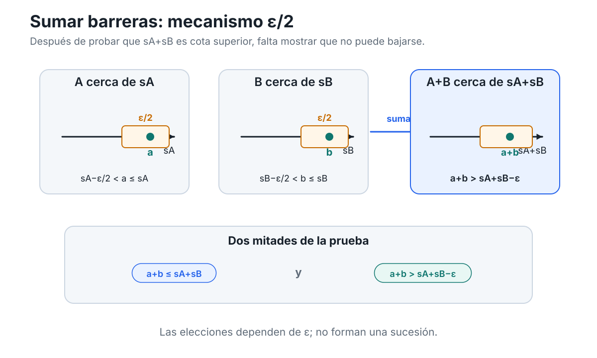
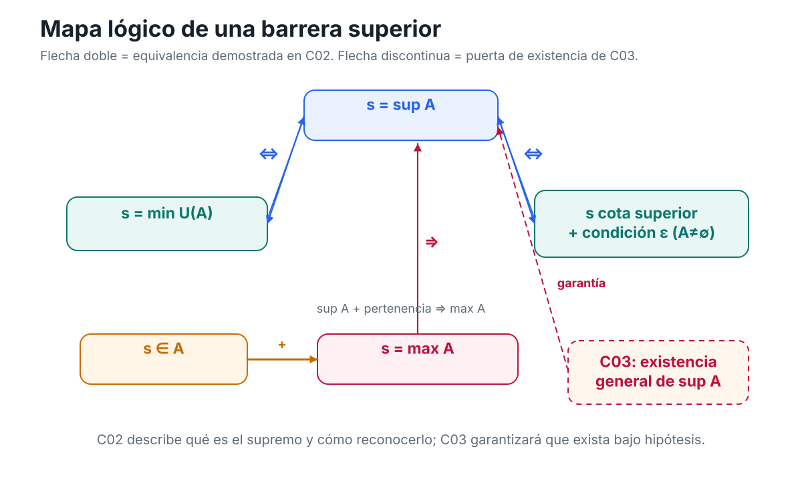

[Capítulo 2](analisis-para-matematicos-capitulo-2-cotas-extremos-y-barreras.md) · [Índice del libro](../para-matematicos/analisis-para-matematicos.md) · [Ejercicios](analisis-para-matematicos-capitulo-2-cotas-extremos-y-barreras-ejercicios.md) · [Soluciones](analisis-para-matematicos-capitulo-2-cotas-extremos-y-barreras-soluciones.md) · [Soluciones de microcontroles](analisis-para-matematicos-capitulo-2-cotas-extremos-y-barreras-microcontroles.md)

# Soluciones — Capítulo 2

## §2.1. Controlar un conjunto desde arriba y desde abajo

[]{#MA-SOL-ANM-01-002-001}

### 1. Barreras válidas e inválidas

Tenemos

$$
A=(-2,3).
$$

El número $-2$ es una cota inferior, porque todo $a\in A$ satisface

$$
-2<a,
$$

y por tanto también $-2\le a$. No es cota superior, pues por ejemplo $0\in A$ y

$$
0>-2.
$$

El número $3$ es una cota superior, porque todo $a\in A$ satisface

$$
a<3,
$$

y por tanto $a\le3$. No es cota inferior, pues $0\in A$ y

$$
0<3.
$$

El número $0$ no es cota superior ni inferior. Por ejemplo,

$$
1\in A
\quad\text{y}\quad
1>0,
$$

de modo que $0$ falla como cota superior; además,

$$
-1\in A
\quad\text{y}\quad
-1<0,
$$

así que falla como cota inferior.

Finalmente, $4$ es una cota superior, porque para todo $a\in A$,

$$
a<3<4.
$$

No es cota inferior, ya que $0\in A$ y $0<4$.

La clasificación es, por tanto:

- $-2$: cota inferior solamente;
- $3$: cota superior solamente;
- $0$: ninguna;
- $4$: cota superior solamente.

Obsérvese que $-2$ y $3$ no pertenecen a $A$ y, sin embargo, sí son cotas. La definición exige una relación de orden con todos los elementos del conjunto, no pertenencia.

[]{#MA-SOL-ANM-01-002-002}

### 2. Cuatro formas de estar acotado

Para

$$
A=(-1,2),
$$

el número $2$ es cota superior y $-1$ es cota inferior. Por tanto, $A$ está acotado superior e inferiormente y, en consecuencia, está acotado.

Para

$$
B=[3,\infty),
$$

el número $3$ es cota inferior. También lo es cualquier número menor que $3$. En cambio, $B$ no está acotado superiormente. Dado cualquier candidato $u\in\mathbb R$, podemos elegir

$$
b=\max\{3,u+1\}.
$$

Entonces $b\in B$ y $b>u$, de modo que $u$ no es cota superior. Así, $B$ está acotado inferiormente, pero no superiormente.

Para

$$
C=(-\infty,5),
$$

el número $5$ es cota superior. No existe cota inferior: dado cualquier candidato $l\in\mathbb R$, el número

$$
c=\min\{4,l-1\}
$$

pertenece a $C$ y satisface $c<l$. Por tanto, $l$ no puede ser cota inferior. Así, $C$ está acotado superiormente, pero no inferiormente.

Finalmente,

$$
D=\mathbb R
$$

no está acotado en ninguna dirección. Si $u\in\mathbb R$ fuese un candidato a cota superior, entonces $u+1\in\mathbb R$ y

$$
u+1>u.
$$

Si $l\in\mathbb R$ fuese un candidato a cota inferior, entonces $l-1\in\mathbb R$ y

$$
l-1<l.
$$

Por tanto, $\mathbb R$ no posee cotas superiores ni inferiores.

En resumen:

- $A$: acotado;
- $B$: sólo acotado inferiormente;
- $C$: sólo acotado superiormente;
- $D$: no acotado en ninguna dirección.

[]{#MA-SOL-ANM-01-002-003}

### 3. Del conjunto a todas sus cotas

El conjunto puede escribirse como

$$
A=(-4,7].
$$

Afirmamos primero que

$$
U(A)=[7,\infty).
$$

Si $u\ge7$, entonces para todo $a\in A$ tenemos

$$
a\le7\le u,
$$

por lo que $u$ es cota superior. Así,

$$
[7,\infty)\subseteq U(A).
$$

Recíprocamente, si $u<7$, el propio número $7$ pertenece a $A$ y satisface

$$
7>u.
$$

Por tanto, $u$ no puede ser cota superior. De aquí,

$$
U(A)\subseteq[7,\infty).
$$

Las dos inclusiones dan

$$
\boxed{U(A)=[7,\infty).}
$$

Ahora afirmamos que

$$
L(A)=(-\infty,-4].
$$

Si $l\le-4$, entonces todo $a\in A$ satisface

$$
l\le-4<a,
$$

así que $l$ es cota inferior. Por tanto,

$$
(-\infty,-4]\subseteq L(A).
$$

Para la inclusión contraria, sea $l>-4$. Necesitamos encontrar un elemento de $A$ menor que $l$.

Si $l\le7$, tomemos

$$
a=\frac{l-4}{2}.
$$

Como $l>-4$,

$$
-4<\frac{l-4}{2}<l,
$$

y además, puesto que $l\le7$,

$$
a=\frac{l-4}{2}\le\frac32<7.
$$

Por tanto $a\in A$ y $a<l$, de modo que $l$ no es cota inferior.

Si $l>7$, basta tomar $a=0$, pues $0\in A$ y $0<l$.

Así, ningún $l>-4$ pertenece a $L(A)$, y obtenemos

$$
\boxed{L(A)=(-\infty,-4].}
$$

El extremo $-4$ no pertenece a $A$, pero sí es cota inferior. Esto vuelve a mostrar que la condición de ser cota no exige pertenencia.

[]{#MA-SOL-ANM-01-002-004}

### 4. Mover una barrera en la dirección equivocada

La afirmación es falsa.

Tomemos, por ejemplo,

$$
A=(0,1).
$$

El número

$$
u=5
$$

es una cota superior de $A$. Si elegimos

$$
v=2,
$$

entonces $v<u$, pero $2$ sigue siendo cota superior, porque todo $a\in(0,1)$ satisface

$$
a<1<2.
$$

Por tanto, de

$$
u\in U(A)
\quad\text{y}\quad
v<u
$$

no se puede concluir que $v\notin U(A)$.

El error consiste en tratar una cota superior cualquiera como si fuese una frontera que ya no pudiera desplazarse hacia la izquierda. La definición de cota superior no dice eso.

La afirmación correcta es:

> si $u$ es cota superior de $A$ y $v\ge u$, entonces $v$ también es cota superior de $A$.

En efecto, para todo $a\in A$,

$$
a\le u\le v,
$$

y por transitividad,

$$
a\le v.
$$

Dualmente, si $l$ es cota inferior de $A$ y $m\le l$, entonces $m$ también es cota inferior. Para todo $a\in A$,

$$
m\le l\le a,
$$

de donde

$$
m\le a.
$$

La dirección importa: una cota superior puede desplazarse con seguridad hacia la derecha; una cota inferior, hacia la izquierda. En la dirección contraria puede seguir siendo válida o puede dejar de serlo, y la información disponible no basta para decidirlo.

[]{#MA-SOL-ANM-01-002-005}

### 5. Trasladar un conjunto traslada sus barreras

**Estrategia.** Una traslación suma la misma constante a todos los elementos del conjunto y a la barrera. Como sumar la misma cantidad a ambos lados de una desigualdad preserva el orden, esperamos que la familia completa de cotas se traslade rígidamente.

Demostremos primero que

$$
U(A+c)=U(A)+c.
$$

Sea $u\in U(A)$. Entonces

$$
a\le u
\qquad
\text{para todo }a\in A.
$$

Al sumar $c$,

$$
a+c\le u+c
\qquad
\text{para todo }a\in A.
$$

Pero los números $a+c$ son precisamente los elementos de $A+c$. Por tanto,

$$
u+c\in U(A+c).
$$

Esto demuestra

$$
U(A)+c\subseteq U(A+c).
$$

Para la inclusión contraria, sea $v\in U(A+c)$. Entonces

$$
a+c\le v
\qquad
\text{para todo }a\in A.
$$

Restando $c$,

$$
a\le v-c
\qquad
\text{para todo }a\in A,
$$

de modo que

$$
v-c\in U(A).
$$

Así, $v=(v-c)+c\in U(A)+c$. Por tanto,

$$
U(A+c)\subseteq U(A)+c.
$$

Concluimos que

$$
\boxed{U(A+c)=U(A)+c.}
$$

El argumento inferior es dual. Si $l\in L(A)$, entonces

$$
l\le a
\qquad
\text{para todo }a\in A.
$$

Sumando $c$,

$$
l+c\le a+c,
$$

por lo que $l+c\in L(A+c)$. Esto da una inclusión. Recíprocamente, si $m\in L(A+c)$, entonces

$$
m\le a+c
$$

para todo $a\in A$, y al restar $c$ obtenemos

$$
m-c\le a.
$$

Así, $m-c\in L(A)$ y $m\in L(A)+c$. En consecuencia,

$$
\boxed{L(A+c)=L(A)+c.}
$$

Apliquemos ahora estas identidades a

$$
A=(-2,5].
$$

Como $5\in A$ y todos los elementos de $A$ son menores o iguales que $5$,

$$
U(A)=[5,\infty).
$$

Además,

$$
L(A)=(-\infty,-2].
$$

Aunque $-2\notin A$, sigue siendo cota inferior.

Con $c=3$,

$$
A+3=(1,8].
$$

Por las identidades demostradas,

$$
U(A+3)=U(A)+3=[8,\infty)
$$

y

$$
L(A+3)=L(A)+3=(-\infty,1].
$$

La estructura no cambia: las familias de cotas siguen siendo semirrectas del mismo tipo; sólo se desplazan exactamente la misma cantidad que el conjunto.

## §2.2. Extremos alcanzados: máximo y mínimo

[]{#MA-SOL-ANM-01-002-006}

### 6. Cota, pertenencia y extremo

Tenemos

$$
A=(-3,2]\cup\{5\}.
$$

El número $-3$ no pertenece a $A$, pero es cota inferior: todo $a\in A$ satisface

$$
-3<a
$$

y, por tanto, $-3\le a$. Como no pertenece al conjunto, no puede ser mínimo.

El número $2$ sí pertenece a $A$. También cumple $-3<2$, pero no es cota superior porque

$$
5\in A
\qquad\text{y}\qquad
5>2.
$$

Tampoco es cota inferior, pues por ejemplo $0\in A$ y $0<2$. Por tanto, $2$ no es máximo ni mínimo.

El número $5$ pertenece a $A$ y domina a todos sus elementos. En efecto, los elementos de $(-3,2]$ son menores o iguales que $2<5$, y el único punto adicional es el propio $5$. Así,

$$
5\in A
\qquad\text{y}\qquad
\forall a\in A,\ a\le5.
$$

Por definición,

$$
\boxed{\max A=5}.
$$

El número $6$ es cota superior de $A$, porque todo $a\in A$ satisface $a\le5<6$, pero

$$
6\notin A.
$$

Por tanto, $6$ no es máximo.

Finalmente, $A$ no tiene mínimo. El único candidato natural a barrera inferior extrema sería $-3$, pero $-3\notin A$. Más directamente, dado cualquier $x\in(-3,2]\subseteq A$, el número

$$
y=\frac{x-3}{2}
$$

satisface

$$
-3<y<x,
$$

de modo que $y\in A$ y $x$ no puede ser mínimo. El punto $5$ tampoco puede serlo porque hay elementos menores en $A$.

En resumen:

- $\max A=5$;
- $A$ no tiene mínimo;
- una cota puede no pertenecer al conjunto;
- pertenecer al conjunto no basta para ser máximo o mínimo.

[]{#MA-SOL-ANM-01-002-007}

### 7. Quitar un extremo cambia la respuesta

Partimos de

$$
A=[-2,3].
$$

Como ambos extremos pertenecen al conjunto,

$$
\boxed{\min A=-2,\qquad \max A=3}.
$$

Ahora,

$$
B=A\setminus\{3\}=[-2,3).
$$

El número $-2$ sigue perteneciendo a $B$ y está por debajo de todos sus elementos, así que

$$
\boxed{\min B=-2}.
$$

En cambio, $B$ no tiene máximo. Si $x\in B$, entonces $x<3$ y el número

$$
y=\frac{x+3}{2}
$$

satisface

$$
x<y<3.
$$

Por tanto $y\in B$ y es mayor que $x$. Ningún elemento de $B$ puede ser máximo.

De manera dual,

$$
C=A\setminus\{-2\}=(-2,3].
$$

El número $3$ pertenece a $C$ y domina a todos sus elementos, de modo que

$$
\boxed{\max C=3}.
$$

Pero $C$ no tiene mínimo. Dado $x\in C$, tenemos $x>-2$. Si tomamos

$$
y=\frac{x-2}{2},
$$

entonces

$$
-2<y<x.
$$

Así, $y\in C$ y ningún $x\in C$ puede ser mínimo.

Finalmente,

$$
D=A\setminus\{-2,3\}=(-2,3).
$$

El argumento usado para $B$ muestra que $D$ no tiene máximo: para cada $x\in D$, $(x+3)/2$ sigue en $D$ y es mayor que $x$.

El argumento usado para $C$ muestra que $D$ no tiene mínimo: para cada $x\in D$, $(x-2)/2$ sigue en $D$ y es menor que $x$.

Por tanto:

$$
\begin{array}{c|c|c}
\text{conjunto} & \text{mínimo} & \text{máximo}\\
\hline
A=[-2,3] & -2 & 3\\
B=[-2,3) & -2 & \text{no existe}\\
C=(-2,3] & \text{no existe} & 3\\
D=(-2,3) & \text{no existe} & \text{no existe}
\end{array}
$$

Eliminar un extremo alcanzado puede destruir exactamente el extremo correspondiente sin alterar por ello la existencia del otro.

[]{#MA-SOL-ANM-01-002-008}

### 8. La intersección que contiene al máximo

Supongamos que

$$
A\cap U(A)\ne\varnothing.
$$

Sea

$$
M\in A\cap U(A).
$$

Entonces se cumplen simultáneamente

$$
M\in A
$$

y

$$
M\in U(A).
$$

La segunda condición significa que

$$
a\le M
\qquad
\text{para todo }a\in A.
$$

Por tanto, $M$ pertenece a $A$ y es cota superior de $A$. Ésas son exactamente las dos condiciones que definen al máximo. Luego

$$
M=\max A.
$$

Veamos ahora que la intersección no puede contener dos elementos distintos. Supongamos que

$$
M,N\in A\cap U(A).
$$

Como $M\in U(A)$ y $N\in A$,

$$
N\le M.
$$

Como $N\in U(A)$ y $M\in A$,

$$
M\le N.
$$

Por antisimetría,

$$
M=N.
$$

Así, $A\cap U(A)$ contiene a lo sumo un elemento. Como por hipótesis es no vacío, contiene exactamente uno. En consecuencia,

$$
\boxed{A\cap U(A)=\{\max A\}}.
$$

El argumento inferior es dual. Si

$$
m\in A\cap L(A),
$$

entonces $m\in A$ y $m$ es cota inferior, de modo que

$$
m=\min A.
$$

Si $m,n\in A\cap L(A)$, como $m\in L(A)$ y $n\in A$ tenemos $m\le n$, mientras que $n\in L(A)$ y $m\in A$ implican $n\le m$. Por antisimetría,

$$
m=n.
$$

Por tanto, si $A\cap L(A)$ es no vacío,

$$
\boxed{A\cap L(A)=\{\min A\}}.
$$

La unicidad de máximo y mínimo aparece aquí como consecuencia directa de la interacción entre **pertenencia**, **cota** y **antisimetría**.

[]{#MA-SOL-ANM-01-002-009}

### 9. Dos conjuntos no vacíos no tienen por qué encontrarse

**Diagnóstico.** El paso inválido es

$$
A\ne\varnothing,\qquad U(A)\ne\varnothing
\quad\Longrightarrow\quad
A\cap U(A)\ne\varnothing.
$$

Dos subconjuntos no vacíos de $\mathbb R$ pueden ser disjuntos. La no vaciedad de cada uno no garantiza que compartan elementos.

Consideremos

$$
A=(-\infty,0).
$$

El conjunto es no vacío y está acotado superiormente; por ejemplo, $0$ es una cota superior.

Calculemos $U(A)$. Si $u\ge0$, entonces todo $a<0$ satisface

$$
a<0\le u,
$$

así que $u$ es cota superior. Por tanto,

$$
[0,\infty)\subseteq U(A).
$$

Recíprocamente, si $u<0$, el número

$$
a=\frac{u}{2}
$$

satisface

$$
u<a<0.
$$

Luego $a\in A$ y $a>u$, de modo que $u$ no es cota superior. Por consiguiente,

$$
\boxed{U(A)=[0,\infty)}.
$$

Ahora

$$
A=(-\infty,0)
\qquad\text{y}\qquad
U(A)=[0,\infty),
$$

por lo que

$$
\boxed{A\cap U(A)=\varnothing}.
$$

Así, $A$ está acotado superiormente pero no tiene máximo. El ejemplo no contradice ninguna definición: simplemente muestra que

> **tener alguna cota superior no obliga a que una de esas cotas pertenezca al conjunto.**

Ésa es precisamente la información adicional que exigiría un máximo.

[]{#MA-SOL-ANM-01-002-010}

### 10. Qué hacen las transformaciones afines con máximo y mínimo

**Cómo pensar este problema.** Un máximo o un mínimo combina dos datos: el candidato debe pertenecer al conjunto transformado y debe dominar —o quedar por debajo de— todos sus elementos. La pertenencia se obtiene transformando $M$ o $m$; la desigualdad depende del signo de $\alpha$.

Sabemos que

$$
m\le a\le M
\qquad
\text{para todo }a\in A,
$$

con $m,M\in A$.

#### Caso 1: $\alpha>0$

Multiplicar por $\alpha$ preserva el orden:

$$
\alpha m\le\alpha a\le\alpha M.
$$

Al sumar $\beta$,

$$
\alpha m+\beta
\le
\alpha a+\beta
\le
\alpha M+\beta.
$$

Todo elemento de $T(A)$ tiene la forma $\alpha a+\beta$. Además, como $m,M\in A$,

$$
\alpha m+\beta\in T(A),
\qquad
\alpha M+\beta\in T(A).
$$

Por definición,

$$
\boxed{
\min T(A)=\alpha m+\beta,
\qquad
\max T(A)=\alpha M+\beta
}.
$$

#### Caso 2: $\alpha<0$

Multiplicar por un número negativo invierte el orden:

$$
\alpha M\le\alpha a\le\alpha m.
$$

Después de sumar $\beta$,

$$
\alpha M+\beta
\le
\alpha a+\beta
\le
\alpha m+\beta.
$$

Los dos extremos transformados pertenecen a $T(A)$. Por tanto,

$$
\boxed{
\min T(A)=\alpha M+\beta,
\qquad
\max T(A)=\alpha m+\beta
}.
$$

El máximo original se convierte en mínimo y el mínimo original se convierte en máximo porque la multiplicación por $\alpha<0$ invierte el orden.

#### Caso 3: $\alpha=0$

Entonces, para todo $a\in A$,

$$
\alpha a+\beta=\beta.
$$

Así,

$$
T(A)=\{\beta\}.
$$

El único elemento es simultáneamente mínimo y máximo:

$$
\boxed{
\min T(A)=\max T(A)=\beta
}.
$$

En conjunto, la clasificación es:

$$
\begin{array}{c|c|c}
 & \min T(A) & \max T(A)\\
\hline
\alpha>0 & \alpha m+\beta & \alpha M+\beta\\
\alpha<0 & \alpha M+\beta & \alpha m+\beta\\
\alpha=0 & \beta & \beta
\end{array}
$$

No hemos usado ninguna noción posterior. Todo depende de pertenencia al conjunto transformado y de cómo una transformación afín afecta las desigualdades que definen máximo y mínimo.

## §2.3. La mejor barrera: supremo e ínfimo

[]{#MA-SOL-ANM-01-002-011}

### 11. Cota no significa barrera extremal

Tenemos

$$
A=(-2,3)\cup\{6\}.
$$

Todo elemento de $A$ es menor o igual que $6$, y $6\in A$. Por tanto, cualquier número $u\ge6$ es cota superior. En particular,

$$
6,8\in U(A).
$$

En cambio, $5$ no es cota superior, porque

$$
6\in A
\qquad\text{y}\qquad
6>5.
$$

Así, entre los tres candidatos superiores:

- $8$ es cota superior, pero no es supremo, porque existe una cota superior menor, a saber $6$;
- $6$ es cota superior y además toda cota superior $u$ debe satisfacer $6\le u$, pues $6\in A$;
- $5$ ni siquiera es cota superior.

Luego

$$
\boxed{\sup A=6}.
$$

Para las cotas inferiores, todo elemento de $A$ es estrictamente mayor que $-2$. Por tanto, cualquier $l\le-2$ es cota inferior; en particular,

$$
-4,-2\in L(A).
$$

El número $-1$ no es cota inferior. Por ejemplo,

$$
-\frac32\in(-2,3)\subseteq A
$$

y

$$
-\frac32<-1.
$$

Entre los candidatos inferiores:

- $-4$ es cota inferior, pero no es ínfimo, porque existe una cota inferior mayor, a saber $-2$;
- $-2$ es cota inferior;
- todo $l>-2$ deja de ser cota inferior, pues existe un elemento de $(-2,3)$ situado entre $-2$ y $l$ si $l\le3$, y si $l>3$ basta elegir, por ejemplo, $0\in A$.

Por tanto,

$$
\boxed{\inf A=-2}.
$$

El punto decisivo es que una cota cualquiera sólo satisface la condición de **control**. Para ser supremo debe ser, además, la menor de todas las cotas superiores; para ser ínfimo, la mayor de todas las cotas inferiores.

[]{#MA-SOL-ANM-01-002-012}

### 12. Distintos conjuntos, las mismas familias de cotas

Sabemos que

$$
U(A)=[4,\infty).
$$

El mínimo de $U(A)$ es $4$. Por la caracterización estructural del supremo como extremo del conjunto de cotas,

$$
\boxed{\sup A=4}.
$$

Asimismo,

$$
L(A)=(-\infty,-2]
$$

tiene máximo $-2$, de modo que

$$
\boxed{\inf A=-2}.
$$

Ahora construyamos conjuntos distintos con las mismas familias de cotas. Por ejemplo,

$$
A_1=(-2,4),
$$

$$
A_2=[-2,4],
$$

y

$$
A_3=(-2,4].
$$

También podríamos usar

$$
A_4=[-2,4).
$$

Verifiquemos la estructura común. En cualquiera de estos conjuntos, todo elemento satisface

$$
-2\le a\le4.
$$

Así, todo $u\ge4$ es cota superior y todo $l\le-2$ es cota inferior.

Por otra parte, ningún $u<4$ puede ser cota superior: si $u<4$, hay elementos del intervalo correspondiente mayores que $u$. De manera dual, ningún $l>-2$ puede ser cota inferior.

Por tanto, para cada uno de los cuatro ejemplos,

$$
U(A_k)=[4,\infty)
$$

y

$$
L(A_k)=(-\infty,-2].
$$

Sin embargo, la pertenencia de las barreras cambia:

- en $A_1$, ni $-2$ ni $4$ pertenecen;
- en $A_2$, ambos pertenecen;
- en $A_3$, $4$ pertenece y $-2$ no;
- en $A_4$, $-2$ pertenece y $4$ no.

Así, las familias $U(A)$ y $L(A)$ determinan la posición de las barreras extremales y, por tanto, el supremo y el ínfimo. **No determinan por sí solas si esas barreras pertenecen al conjunto original.**

[]{#MA-SOL-ANM-01-002-013}

### 13. Por qué no puede haber dos supremos

Supongamos que $s$ y $t$ son ambos supremos de $A$.

Como $t$ es supremo, en particular es una cota superior de $A$. Como $s$ es la **menor** cota superior, debe satisfacer

$$
s\le t.
$$

Simétricamente, $s$ es una cota superior de $A$ y $t$ es la menor cota superior. Por tanto,

$$
t\le s.
$$

Las dos desigualdades dan

$$
s\le t
\qquad\text{y}\qquad
t\le s.
$$

Por antisimetría del orden,

$$
\boxed{s=t}.
$$

La prueba usa las dos piezas de la definición de manera distinta:

- necesitamos que cada candidato sea **cota superior** para que el otro pueda compararse con él;
- necesitamos la **minimalidad** para obtener cada desigualdad.

Para el ínfimo, supongamos que $i$ y $j$ satisfacen ambos la definición. Como $j$ es cota inferior e $i$ es la **mayor** cota inferior,

$$
j\le i.
$$

Como $i$ es cota inferior y $j$ es la mayor de ellas,

$$
i\le j.
$$

Por antisimetría,

$$
\boxed{i=j}.
$$

Así, supremo e ínfimo, cuando existen, son necesariamente únicos.

[]{#MA-SOL-ANM-01-002-014}

### 14. Una condición necesaria no basta

**Diagnóstico.** El estudiante ha verificado sólo la primera condición de la definición de supremo: que $2$ es una cota superior de

$$
A=(0,1).
$$

En efecto, todo $a\in A$ satisface

$$
a<1<2.
$$

Pero falta comprobar que $2$ sea la **menor** de todas las cotas superiores.

Calculemos directamente $U(A)$.

Si $u\ge1$, entonces para todo $a\in(0,1)$,

$$
a<1\le u,
$$

de modo que $u$ es cota superior. Por tanto,

$$
[1,\infty)\subseteq U(A).
$$

Si $u<1$, entonces $u$ no puede ser cota superior. Si $u<0$, por ejemplo $\frac12\in A$ y $\frac12>u$. Si $0\le u<1$, tomemos

$$
a=\frac{u+1}{2}.
$$

Entonces

$$
u<a<1,
$$

así que $a\in A$ y $u$ falla como cota superior.

Por consiguiente,

$$
\boxed{U(A)=[1,\infty)}.
$$

El mínimo de $U(A)$ es $1$, no $2$. Por tanto,

$$
\boxed{\sup A=1}.
$$

La frase «el supremo no tiene por qué pertenecer al conjunto» es verdadera, pero no convierte en supremo a cualquier cota exterior. La versión correcta del argumento es:

> primero se verifica que el candidato es cota superior; después se demuestra que ninguna cota superior puede ser menor.

Sólo cuando ambas condiciones se cumplen hemos identificado el supremo.

[]{#MA-SOL-ANM-01-002-015}

### 15. El intervalo de control más ajustado

**Estrategia.** El supremo y el ínfimo son, respectivamente, una cota superior y una cota inferior. Esto sitúa inmediatamente a $A$ dentro de $[i,s]$. Después compararemos esas barreras extremales con cualquier otro par de barreras $l,u$ que también contenga a $A$.

Como

$$
i=\inf A,
$$

el número $i$ es cota inferior de $A$. Por tanto,

$$
i\le a
\qquad
\text{para todo }a\in A.
$$

Como

$$
s=\sup A,
$$

el número $s$ es cota superior, así que

$$
a\le s
\qquad
\text{para todo }a\in A.
$$

Juntando ambas desigualdades,

$$
i\le a\le s
\qquad
\text{para todo }a\in A.
$$

Luego

$$
\boxed{A\subseteq[i,s]}.
$$

Ahora supongamos que

$$
A\subseteq[l,u].
$$

Entonces $l$ es una cota inferior de $A$ y $u$ es una cota superior de $A$.

Como $i$ es la **mayor** cota inferior,

$$
l\le i.
$$

Como $s$ es la **menor** cota superior,

$$
s\le u.
$$

Además, como $A$ es no vacío, podemos tomar algún $a\in A$. Puesto que $i$ es cota inferior y $s$ es cota superior,

$$
i\le a\le s,
$$

de donde

$$
i\le s.
$$

Así obtenemos la cadena completa

$$
\boxed{l\le i\le s\le u}.
$$

Ahora, si $x\in[i,s]$, entonces

$$
i\le x\le s.
$$

Usando $l\le i$ y $s\le u$,

$$
l\le x\le u.
$$

Por tanto,

$$
x\in[l,u].
$$

Hemos demostrado

$$
\boxed{[i,s]\subseteq[l,u]}.
$$

El resultado no afirma que las barreras extremales pertenezcan a $A$. Afirma algo diferente: cualquier intervalo $[l,u]$ que controle a todo el conjunto debe ser al menos tan amplio como $[i,s]$.

[]{#MA-SOL-ANM-01-002-016}

### 16. Trasladar y escalar una barrera extremal

**Cómo pensar este problema.** Para demostrar que un número es supremo debemos verificar dos cosas: que es cota superior y que es menor o igual que cualquier otra cota superior. La transformación

$$
x\mapsto\alpha x+\beta
$$

con $\alpha>0$ preserva el orden, de modo que podemos transportar ambas condiciones.

Sea

$$
s=\sup A.
$$

Primero probemos que $\alpha s+\beta$ es cota superior de $T(A)$.

Para todo $a\in A$,

$$
a\le s.
$$

Como $\alpha>0$,

$$
\alpha a\le\alpha s.
$$

Sumando $\beta$,

$$
\alpha a+\beta\le\alpha s+\beta.
$$

Todo elemento de $T(A)$ tiene la forma $\alpha a+\beta$. Por tanto,

$$
\alpha s+\beta\in U(T(A)).
$$

Falta demostrar minimalidad. Sea $v$ una cota superior cualquiera de $T(A)$. Entonces, para todo $a\in A$,

$$
\alpha a+\beta\le v.
$$

Restando $\beta$ y dividiendo por $\alpha>0$,

$$
a\le\frac{v-\beta}{\alpha}.
$$

Así,

$$
\frac{v-\beta}{\alpha}
$$

es cota superior de $A$. Como $s$ es la menor cota superior,

$$
s\le\frac{v-\beta}{\alpha}.
$$

Multiplicando por $\alpha>0$ y sumando $\beta$,

$$
\alpha s+\beta\le v.
$$

Por tanto, $\alpha s+\beta$ es menor o igual que toda cota superior de $T(A)$. Concluimos

$$
\boxed{\sup T(A)=\alpha s+\beta}.
$$

El argumento para el ínfimo es dual. Como

$$
i=\inf A,
$$

para todo $a\in A$ tenemos

$$
i\le a.
$$

Multiplicando por $\alpha>0$ y sumando $\beta$,

$$
\alpha i+\beta\le\alpha a+\beta.
$$

Así, $\alpha i+\beta$ es cota inferior de $T(A)$.

Sea ahora $w$ una cota inferior cualquiera de $T(A)$. Entonces

$$
w\le\alpha a+\beta
\qquad
\text{para todo }a\in A.
$$

Restando $\beta$ y dividiendo por $\alpha>0$,

$$
\frac{w-\beta}{\alpha}\le a
\qquad
\text{para todo }a\in A.
$$

Por tanto,

$$
\frac{w-\beta}{\alpha}
$$

es cota inferior de $A$. Como $i$ es la mayor cota inferior,

$$
\frac{w-\beta}{\alpha}\le i.
$$

Multiplicando por $\alpha$ y sumando $\beta$,

$$
w\le\alpha i+\beta.
$$

Entonces $\alpha i+\beta$ es la mayor cota inferior de $T(A)$. Por consiguiente,

$$
\boxed{\inf T(A)=\alpha i+\beta}.
$$

Todo el argumento usa únicamente las definiciones de cota, supremo e ínfimo y el hecho de que $\alpha>0$ preserva el orden. No se ha utilizado ninguna garantía general de existencia.

## §2.4. Alcanzado frente a no alcanzado

[]{#MA-SOL-ANM-01-002-017}

### 17. Cinco afirmaciones sobre alcanzar la barrera

**1. Verdadera.** Si $s=\sup A$, entonces $s$ es cota superior de $A$. Si además $s\in A$, se cumplen exactamente las dos condiciones de la definición de máximo:

$$
s\in A
\qquad\text{y}\qquad
\forall a\in A,\ a\le s.
$$

Por tanto,

$$
\boxed{\max A=s}.
$$

**2. Verdadera.** Supongamos que $s=\sup A$ y $s\notin A$. Si $A$ tuviera máximo $M$, entonces $M$ sería una cota superior y, por pertenecer a $A$, toda cota superior $u$ satisfaría $M\le u$. Así $M$ sería la menor cota superior, es decir,

$$
M=\sup A=s.
$$

Pero $M\in A$, de donde $s\in A$, contradicción. Luego $A$ no tiene máximo.

**3. Verdadera.** Si $M=\max A$, entonces $M$ es cota superior. Sea $u$ cualquier cota superior de $A$. Como $M\in A$, la definición de cota superior obliga a que

$$
M\le u.
$$

Por tanto, $M$ es la menor cota superior y

$$
\boxed{\sup A=M}.
$$

**4. Falsa.** Un contraejemplo es

$$
A=(0,1).
$$

El conjunto no tiene máximo, pero

$$
\sup A=1.
$$

**5. Falsa.** El mismo conjunto sirve: $(0,1)$ tiene supremo $1$, pero $1\notin A$, así que no tiene máximo.

La diferencia decisiva es, por tanto:

> el supremo responde a dónde está la menor cota superior; el máximo exige además que esa barrera pertenezca al conjunto.

[]{#MA-SOL-ANM-01-002-018}

### 18. El criterio de alcanzamiento

#### Lado superior

Supongamos primero que

$$
s=\sup A
$$

y que

$$
s\in A.
$$

Por ser supremo, $s$ es cota superior, de modo que

$$
a\le s
\qquad
\text{para todo }a\in A.
$$

Junto con $s\in A$, esto es exactamente la definición de máximo. Por tanto,

$$
\boxed{\max A=s}.
$$

Recíprocamente, supongamos que

$$
M=\max A.
$$

Entonces $M$ es cota superior. Sea $u\in U(A)$ una cota superior cualquiera. Como $M\in A$, necesariamente

$$
M\le u.
$$

Así, $M$ es menor o igual que toda cota superior. Por tanto es la menor cota superior y

$$
\boxed{M=\sup A}.
$$

Hemos demostrado que, siempre que el supremo exista,

$$
\boxed{
\max A\text{ existe}
\quad\Longleftrightarrow\quad
\sup A\in A
}
$$

y, cuando ocurre,

$$
\boxed{\max A=\sup A}.
$$

#### Lado inferior

Si

$$
i=\inf A
$$

y $i\in A$, entonces $i$ es cota inferior y pertenece a $A$. Luego

$$
\boxed{\min A=i}.
$$

Recíprocamente, si

$$
m=\min A,
$$

entonces $m$ es cota inferior. Para cualquier $l\in L(A)$, como $m\in A$ tenemos

$$
l\le m.
$$

Así, $m$ es la mayor cota inferior y

$$
\boxed{m=\inf A}.
$$

En consecuencia, siempre que el ínfimo exista,

$$
\boxed{
\min A\text{ existe}
\quad\Longleftrightarrow\quad
\inf A\in A
}.
$$

[]{#MA-SOL-ANM-01-002-019}

### 19. Misma barrera no significa mismo máximo

La afirmación del estudiante es falsa.

Tomemos

$$
A=[0,1]
$$

y

$$
B=[0,1).
$$

En ambos casos,

$$
U(A)=U(B)=[1,\infty),
$$

por lo que

$$
\boxed{\sup A=\sup B=1}.
$$

Sin embargo,

$$
1\in A
$$

y, como $1$ domina a todos los elementos de $A$,

$$
\boxed{\max A=1}.
$$

En cambio,

$$
1\notin B.
$$

Además, si $x\in B$, entonces $x<1$ y

$$
y=\frac{x+1}{2}
$$

satisface

$$
x<y<1.
$$

Así $y\in B$ y $x$ no puede ser máximo. Por tanto, $B$ no tiene máximo.

El dato que permanece igual es la **posición de la barrera extremal superior**. El dato que cambia es la **pertenencia de esa barrera al conjunto**.

Una versión verdadera es la siguiente:

> si dos conjuntos tienen el mismo máximo $M$, entonces ambos tienen supremo y ese supremo común es $M$.

En efecto, todo máximo es también el supremo del conjunto correspondiente.

[]{#MA-SOL-ANM-01-002-020}

### 20. Añadir la barrera o rebasarla

Tenemos

$$
s=\sup A,
\qquad
s\notin A.
$$

Por §2.3,

$$
U(A)=[s,\infty).
$$

Definamos

$$
B=A\cup\{s\}.
$$

Como $s$ ya era cota superior de $A$ y el nuevo punto añadido es precisamente $s$, sigue siendo cota superior de $B$. Toda cota superior de $B$ es también cota superior de $A$, porque $A\subseteq B$. Por tanto ninguna puede ser menor que $s$. Así,

$$
\boxed{\sup B=s}.
$$

Pero ahora

$$
s\in B,
$$

de modo que la barrera extremal está alcanzada y

$$
\boxed{\max B=s}.
$$

Además, una cota superior de $B$ debe dominar a $s$, así que

$$
U(B)=[s,\infty)=U(A).
$$

Ahora tomemos $c>s$ y definamos

$$
C=A\cup\{c\}.
$$

Como $c\in C$ y todos los elementos de $A$ satisfacen

$$
a\le s<c,
$$

el número $c$ domina a todo $C$. Por tanto,

$$
\boxed{\max C=c}.
$$

Todo máximo es supremo, luego

$$
\boxed{\sup C=c}.
$$

Finalmente, un número $u$ es cota superior de $C$ exactamente cuando domina al punto $c$, es decir, cuando

$$
u\ge c.
$$

Por tanto,

$$
\boxed{U(C)=[c,\infty)}.
$$

Las dos modificaciones tienen efectos distintos:

- añadir $s$ no cambia la posición de la barrera extremal; sólo hace que quede alcanzada;
- añadir $c>s$ obliga a mover la barrera extremal hasta $c$.

[]{#MA-SOL-ANM-01-002-021}

### 21. Intersecar el conjunto con sus propias cotas

**Cómo pensar este problema.** Como

$$
s=\sup A,
$$

tenemos

$$
U(A)=[s,\infty).
$$

Pero todo elemento de $A$ satisface $a\le s$. Por tanto, un número que pertenezca simultáneamente a $A$ y a $U(A)$ tendría que satisfacer

$$
a\le s
\qquad\text{y}\qquad
a\ge s.
$$

Luego necesariamente

$$
a=s.
$$

Así,

$$
A\cap U(A)\subseteq\{s\}.
$$

Si $s\in A$, entonces además $s\in U(A)$, por lo que

$$
\boxed{A\cap U(A)=\{s\}}.
$$

Si $s\notin A$, la única posible intersección desaparece y

$$
\boxed{A\cap U(A)=\varnothing}.
$$

En resumen,

$$
\boxed{
A\cap U(A)=
\begin{cases}
\{s\}, & s\in A,\\
\varnothing, & s\notin A.
\end{cases}
}
$$

La versión inferior es dual. Como

$$
i=\inf A,
$$

tenemos

$$
L(A)=(-\infty,i],
$$

mientras que todo $a\in A$ cumple $i\le a$. Por tanto,

$$
A\cap L(A)\subseteq\{i\},
$$

y exactamente

$$
\boxed{
A\cap L(A)=
\begin{cases}
\{i\}, & i\in A,\\
\varnothing, & i\notin A.
\end{cases}
}
$$

Ahora, §2.2 nos dice que $A\cap U(A)$ es no vacío exactamente cuando existe máximo, y que $A\cap L(A)$ es no vacío exactamente cuando existe mínimo. Así recuperamos

$$
\max A\text{ existe}
\quad\Longleftrightarrow\quad
s\in A
$$

y

$$
\min A\text{ existe}
\quad\Longleftrightarrow\quad
i\in A.
$$

Para realizar las cuatro posibilidades con

$$
\inf A=0,
\qquad
\sup A=1,
$$

podemos tomar:

$$
A_1=[0,1],
$$

que tiene mínimo y máximo;

$$
A_2=(0,1],
$$

que tiene máximo pero no mínimo;

$$
A_3=[0,1),
$$

que tiene mínimo pero no máximo;

$$
A_4=(0,1),
$$

que no tiene ni mínimo ni máximo.

Los cuatro conjuntos comparten las mismas barreras extremales $0$ y $1$. Lo único que cambia es cuáles de esas barreras pertenecen al conjunto original.

## §2.5. Acercarse a una barrera sin tocarla

[]{#MA-SOL-ANM-01-002-022}

### 22. Franjas pegadas a la barrera

Para ambos conjuntos la barrera superior extremal es $s=1$, de modo que las franjas dependen únicamente de $\varepsilon$.

Si

$$
\varepsilon=1,
$$

la franja es

$$
(0,1].
$$

En $A=(0,1)$ podemos elegir, por ejemplo,

$$
a=\frac12.
$$

En $B=(0,1]$ podemos elegir igualmente $1/2$, pero también podemos tomar

$$
a=1.
$$

Si

$$
\varepsilon=\frac12,
$$

la franja es

$$
\left(\frac12,1\right].
$$

En $A$ sirve, por ejemplo,

$$
a=\frac34,
$$

mientras que en $B$ podemos usar $3/4$ o nuevamente $a=1$.

Si

$$
\varepsilon=\frac1{10},
$$

la franja es

$$
\left(\frac9{10},1\right].
$$

En $A$ podemos elegir

$$
a=\frac{19}{20},
$$

y en $B$ sirven tanto $19/20$ como $1$.

La geometría de las franjas no cambia: siempre están pegadas por la izquierda a la misma barrera $s=1$. Lo que cambia es la pertenencia de esa barrera:

$$
1\notin A,
\qquad
1\in B.
$$

Por eso $a=1$ nunca puede ser testigo para $A$, pero funciona para **todo** $\varepsilon>0$ en $B$.

En $A$, en cambio, el testigo debe elegirse dentro del intervalo abierto y puede depender del valor de $\varepsilon$. Las tres elecciones anteriores son verificaciones independientes; no constituyen una sucesión.

[]{#MA-SOL-ANM-01-002-023}

### 23. Del supremo a la condición $\varepsilon$

Sea

$$
s=\sup A
$$

y fijemos un $\varepsilon>0$ arbitrario.

Como $\varepsilon>0$,

$$
s-\varepsilon<s.
$$

Ahora usamos la minimalidad del supremo. Si $s-\varepsilon$ fuera también cota superior de $A$, tendríamos una cota superior estrictamente menor que $s$, contradiciendo que $s$ es la menor cota superior.

Por tanto,

$$
s-\varepsilon\notin U(A).
$$

Negar que $s-\varepsilon$ sea cota superior significa negar

$$
\forall a\in A,\quad a\le s-\varepsilon.
$$

La negación correcta es

$$
\exists a\in A
\quad\text{tal que}\quad
a>s-\varepsilon.
$$

Así existe $a\in A$ con

$$
s-\varepsilon<a.
$$

Además, como $s$ sí es cota superior,

$$
a\le s.
$$

Juntando ambas desigualdades,

$$
s-\varepsilon<a\le s.
$$

Como $\varepsilon>0$ fue arbitrario,

$$
\boxed{
\forall\varepsilon>0\;\exists a\in A:
s-\varepsilon<a\le s
}.
$$

El argumento no construye una lista de puntos. Para cada margen positivo se afirma independientemente la existencia de un testigo adecuado.

[]{#MA-SOL-ANM-01-002-024}

### 24. De la condición $\varepsilon$ al supremo

Sabemos ya que $s$ es una cota superior de $A$. Falta probar que es la **menor** cota superior.

Sea $u$ una cota superior arbitraria de $A$. Queremos demostrar

$$
s\le u.
$$

Supongamos, buscando una contradicción, que

$$
u<s.
$$

Entonces

$$
\varepsilon=s-u>0.
$$

Por la hipótesis existe $a\in A$ tal que

$$
s-\varepsilon<a\le s.
$$

Pero

$$
s-\varepsilon
=
s-(s-u)
=
u.
$$

Así,

$$
u<a.
$$

Esto contradice que $u$ sea cota superior de $A$, pues una cota superior debe satisfacer

$$
a\le u
\qquad
\text{para todo }a\in A.
$$

Por tanto no puede ocurrir $u<s$. Como $u$ era una cota superior arbitraria,

$$
s\le u
\qquad
\text{para toda }u\in U(A).
$$

Junto con la hipótesis previa de que $s$ mismo es cota superior, obtenemos exactamente la definición de supremo:

$$
\boxed{s=\sup A}.
$$

La condición $\varepsilon$ por sí sola no reemplaza la primera parte de la definición: hemos usado explícitamente que $s$ ya era cota superior.

[]{#MA-SOL-ANM-01-002-025}

### 25. Cambiar el orden de los cuantificadores cambia la afirmación

Para

$$
A=(0,1),
\qquad
s=1,
$$

la afirmación (I) es verdadera:

$$
\forall\varepsilon>0\;\exists a\in A:
1-\varepsilon<a\le1.
$$

En efecto, si $0<\varepsilon<2$, podemos tomar

$$
a=1-\frac{\varepsilon}{2},
$$

y si $\varepsilon\ge2$ basta elegir $a=1/2$.

En cambio, (II) es falsa:

$$
\exists a\in A\;\forall\varepsilon>0:
1-\varepsilon<a\le1.
$$

Supongamos que existiera un punto fijo $a\in(0,1)$ que funcionara para todo $\varepsilon>0$. Como $a<1$, el número

$$
\varepsilon=\frac{1-a}{2}
$$

es positivo. Entonces

$$
1-\varepsilon
=
1-\frac{1-a}{2}
=
\frac{1+a}{2}.
$$

Pero, como $a<1$,

$$
a<\frac{1+a}{2}=1-\varepsilon.
$$

Esto contradice la desigualdad requerida

$$
1-\varepsilon<a.
$$

El error conceptual consiste en confundir

$$
\forall\varepsilon>0\;\exists a\in A
$$

con

$$
\exists a\in A\;\forall\varepsilon>0.
$$

En la primera afirmación, el testigo $a$ puede depender de $\varepsilon$. La segunda exige un único punto que funcione para todos los márgenes.

Ahora tomemos

$$
B=(0,1].
$$

Para $s=1$, ambas afirmaciones son verdaderas, porque el mismo punto

$$
a=1\in B
$$

satisface, para todo $\varepsilon>0$,

$$
1-\varepsilon<1\le1.
$$

Por tanto, (II) es una condición más fuerte: puede cumplirse cuando la barrera pertenece al conjunto, pero no es equivalente a la caracterización general del supremo.

[]{#MA-SOL-ANM-01-002-026}

### 26. La caracterización dual del ínfimo

#### Del ínfimo a la condición local

Supongamos que

$$
i=\inf A.
$$

Entonces $i$ es cota inferior. Sea $\varepsilon>0$.

Como

$$
i+\varepsilon>i,
$$

el número $i+\varepsilon$ no puede seguir siendo cota inferior: si lo fuera, sería una cota inferior estrictamente mayor que el ínfimo.

Por tanto existe $a\in A$ tal que

$$
a<i+\varepsilon.
$$

Como $i$ sí es cota inferior,

$$
i\le a.
$$

Luego

$$
\boxed{i\le a<i+\varepsilon}.
$$

Así,

$$
\forall\varepsilon>0\;\exists a\in A:
i\le a<i+\varepsilon.
$$

#### De la condición local al ínfimo

Supongamos ahora que $i$ es cota inferior y que la condición anterior se cumple para todo $\varepsilon>0$.

Sea $l$ una cota inferior cualquiera. Queremos probar

$$
l\le i.
$$

Si ocurriera

$$
l>i,
$$

entonces

$$
\varepsilon=l-i>0.
$$

La hipótesis daría un elemento $a\in A$ tal que

$$
i\le a<i+\varepsilon=l.
$$

Así,

$$
a<l,
$$

lo que contradice que $l$ sea cota inferior.

Por tanto toda cota inferior satisface $l\le i$, y como $i$ mismo es cota inferior,

$$
\boxed{i=\inf A}.
$$

#### Formulación con un punto $r>i$

Supongamos primero la condición con $\varepsilon$. Dado cualquier

$$
r>i,
$$

tomamos

$$
\varepsilon=r-i>0.
$$

Entonces existe $a\in A$ con

$$
i\le a<i+\varepsilon=r.
$$

Recíprocamente, supongamos que para todo $r>i$ existe $a\in A$ con

$$
i\le a<r.
$$

Dado $\varepsilon>0$, elegimos

$$
r=i+\varepsilon.
$$

Entonces

$$
i\le a<i+\varepsilon.
$$

Las dos formulaciones son, por tanto, equivalentes.

[]{#MA-SOL-ANM-01-002-027}

### 27. Sumar conjuntos suma sus barreras extremales

**Cómo pensar este problema.** La igualdad de supremos tiene dos partes distintas. Primero debemos mostrar que la suma de las dos barreras superiores sigue siendo una barrera superior para todas las sumas posibles. Después debemos mostrar que esa barrera no puede bajarse ni siquiera una cantidad positiva arbitraria. La caracterización $\varepsilon$ está diseñada precisamente para esa segunda tarea.

Definamos

$$
S=A+B.
$$

#### Supremo

Sean

$$
s_A=\sup A,
\qquad
s_B=\sup B.
$$

Para todo $a\in A$ y todo $b\in B$,

$$
a\le s_A,
\qquad
b\le s_B.
$$

Sumando,

$$
a+b\le s_A+s_B.
$$

Como todo elemento de $S$ tiene la forma $a+b$, concluimos que

$$
s_A+s_B
$$

es cota superior de $S$.

Ahora sea $\varepsilon>0$. Por la caracterización $\varepsilon$ del supremo aplicada a $A$ con margen $\varepsilon/2$, existe $a\in A$ tal que

$$
s_A-\frac{\varepsilon}{2}<a\le s_A.
$$

Análogamente, existe $b\in B$ tal que

$$
s_B-\frac{\varepsilon}{2}<b\le s_B.
$$

Al sumar,

$$
s_A+s_B-\varepsilon
<
a+b
\le
s_A+s_B.
$$

Además,

$$
a+b\in A+B=S.
$$

Por tanto, para todo $\varepsilon>0$ existe un elemento de $S$ en la franja

$$
(s_A+s_B-\varepsilon,\ s_A+s_B].
$$

Como $s_A+s_B$ ya es cota superior, la conversa de la caracterización $\varepsilon$ da

$$
\boxed{\sup(A+B)=s_A+s_B}.
$$

#### Ínfimo

Sean ahora

$$
i_A=\inf A,
\qquad
i_B=\inf B.
$$

Para todo $a\in A$ y $b\in B$,

$$
i_A\le a,
\qquad
i_B\le b,
$$

de modo que

$$
i_A+i_B\le a+b.
$$

Así, $i_A+i_B$ es cota inferior de $A+B$.

Sea $\varepsilon>0$. Aplicando la caracterización dual con margen $\varepsilon/2$, existen $a\in A$ y $b\in B$ tales que

$$
i_A\le a<i_A+\frac{\varepsilon}{2}
$$

y

$$
i_B\le b<i_B+\frac{\varepsilon}{2}.
$$

Sumando,

$$
i_A+i_B
\le
a+b
<
i_A+i_B+\varepsilon.
$$

Por tanto, cada franja

$$
[i_A+i_B,\ i_A+i_B+\varepsilon)
$$

contiene algún elemento de $A+B$. Como $i_A+i_B$ ya es cota inferior, la caracterización dual implica

$$
\boxed{\inf(A+B)=i_A+i_B}.
$$

No se ha invocado completitud: las existencias de $s_A,s_B,i_A,i_B$ estaban dadas como hipótesis, y la prueba sólo transporta sus propiedades extremales a la suma de conjuntos.

La figura C02-F09 sintetiza las dos mitades de la prueba del supremo y hace visible por qué se reparte el margen $\varepsilon$ en dos franjas de anchura $\varepsilon/2$.



*Figura C02-F09. La prueba de sup(A+B)=sup A+sup B combina una cota superior obvia con testigos a y b elegidos dentro de franjas epsilon sobre dos.*

## §2.6. Comparar conjuntos por sus barreras

[]{#MA-SOL-ANM-01-002-028}

### 28. Dos conjuntos, cuatro familias de cotas

Tenemos

$$
A=(-1,1)
\qquad\text{y}\qquad
B=[-2,3).
$$

Todo elemento de $A$ pertenece a $B$, pues

$$
-1<a<1
\quad\Longrightarrow\quad
-2\le a<3.
$$

Por tanto,

$$
A\subseteq B.
$$

Para $A$, las cotas superiores son exactamente los números $u\ge1$. En efecto, todo $a\in A$ satisface $a<1\le u$, mientras que si $u<1$ existe un punto de $(-1,1)$ mayor que $u$. Así,

$$
\boxed{U(A)=[1,\infty)}.
$$

Dualmente,

$$
\boxed{L(A)=(-\infty,-1]}.
$$

Para $B=[-2,3)$, todo $u\ge3$ es cota superior y ningún $u<3$ puede serlo, porque hay puntos de $B$ entre $u$ y $3$. Luego

$$
\boxed{U(B)=[3,\infty)}.
$$

Además, como $-2\in B$ y es su extremo inferior alcanzado,

$$
\boxed{L(B)=(-\infty,-2]}.
$$

Ahora se ve inmediatamente que

$$
[3,\infty)\subseteq[1,\infty),
$$

es decir,

$$
\boxed{U(B)\subseteq U(A)}.
$$

En el lado inferior,

$$
(-\infty,-2]\subseteq(-\infty,-1],
$$

por lo que

$$
\boxed{L(B)\subseteq L(A)}.
$$

Los extremos correspondientes son

$$
\sup A=1,
\qquad
\sup B=3,
$$

y

$$
\inf A=-1,
\qquad
\inf B=-2.
$$

Así,

$$
\sup A<\sup B
\qquad\text{e}\qquad
\inf B<\inf A.
$$

La representación en una misma escala muestra el fenómeno central: al pasar del conjunto pequeño al grande, las semirrectas de cotas se hacen más restrictivas y sus extremos pueden desplazarse hacia afuera.

[]{#MA-SOL-ANM-01-002-029}

### 29. De la inclusión de conjuntos a la monotonía de sus barreras

Supongamos

$$
A\subseteq B.
$$

#### Cotas superiores

Sea $u\in U(B)$. Entonces

$$
b\le u
\qquad
\text{para todo }b\in B.
$$

Como cada $a\in A$ pertenece también a $B$, se cumple

$$
a\le u
\qquad
\text{para todo }a\in A.
$$

Por tanto $u\in U(A)$ y hemos probado

$$
\boxed{U(B)\subseteq U(A)}.
$$

#### Cotas inferiores

Sea $l\in L(B)$. Entonces

$$
l\le b
\qquad
\text{para todo }b\in B.
$$

En particular,

$$
l\le a
\qquad
\text{para todo }a\in A,
$$

de modo que $l\in L(A)$. Luego

$$
\boxed{L(B)\subseteq L(A)}.
$$

#### Supremos

Supongamos que existen $\sup A$ y $\sup B$. Escribamos

$$
s_A=\sup A,
\qquad
s_B=\sup B.
$$

Como $s_B\in U(B)$ y $U(B)\subseteq U(A)$, tenemos

$$
s_B\in U(A).
$$

Pero $s_A$ es la menor cota superior de $A$. Por tanto,

$$
\boxed{s_A\le s_B},
$$

es decir,

$$
\boxed{\sup A\le\sup B}.
$$

#### Ínfimos

Si

$$
i_A=\inf A,
\qquad
i_B=\inf B,
$$

entonces $i_B\in L(B)\subseteq L(A)$. Como $i_A$ es la mayor cota inferior de $A$,

$$
i_B\le i_A.
$$

Así,

$$
\boxed{\inf B\le\inf A}.
$$

La lógica es, por tanto,

$$
A\subseteq B
\Longrightarrow
\begin{cases}
U(B)\subseteq U(A),\\
L(B)\subseteq L(A),
\end{cases}
$$

y sólo después, bajo las hipótesis de existencia de los extremos,

$$
\sup A\le\sup B,
\qquad
\inf B\le\inf A.
$$

[]{#MA-SOL-ANM-01-002-030}

### 30. Reflejar un conjunto intercambia arriba y abajo

Definimos

$$
-A=\{-a:a\in A\}.
$$

#### Primera identidad

Sea $u\in U(-A)$. Entonces para todo $a\in A$,

$$
-a\le u.
$$

Multiplicando por $-1$ e invirtiendo la desigualdad,

$$
-u\le a
\qquad
\text{para todo }a\in A.
$$

Por tanto,

$$
-u\in L(A),
$$

y de aquí

$$
u\in -L(A).
$$

Hemos demostrado

$$
U(-A)\subseteq -L(A).
$$

Recíprocamente, sea $u\in-L(A)$. Entonces existe $l\in L(A)$ tal que

$$
u=-l.
$$

Como $l\le a$ para todo $a\in A$, al multiplicar por $-1$ obtenemos

$$
-a\le-l=u
\qquad
\text{para todo }a\in A.
$$

Así $u\in U(-A)$ y concluimos

$$
\boxed{U(-A)=-L(A)}.
$$

#### Segunda identidad

El argumento dual da

$$
\boxed{L(-A)=-U(A)}.
$$

En efecto, $l\in L(-A)$ equivale a $l\le-a$ para todo $a\in A$, lo que equivale a $a\le-l$ para todo $a\in A$, es decir, a $-l\in U(A)$.

#### Extremos

Supongamos que

$$
i=\inf A.
$$

Entonces

$$
i=\max L(A).
$$

Al cambiar de signo, el mayor elemento de $L(A)$ se convierte en el menor elemento de $-L(A)$. Como

$$
-L(A)=U(-A),
$$

obtenemos

$$
\boxed{\sup(-A)=-i=-\inf A}.
$$

Análogamente, si

$$
s=\sup A,
$$

entonces $s=\min U(A)$. Al reflejar,

$$
-U(A)=L(-A),
$$

y el menor elemento de $U(A)$ se convierte en el mayor de $L(-A)$. Por tanto,

$$
\boxed{\inf(-A)=-s=-\sup A}.
$$

Las fórmulas son una consecuencia de la inversión del orden, no una convención algebraica independiente.

[]{#MA-SOL-ANM-01-002-031}

### 31. Inclusión estricta no obliga a desigualdad estricta

La afirmación es falsa.

Tomemos

$$
A=(0,1)
\qquad\text{y}\qquad
B=[0,1].
$$

Claramente,

$$
A\subsetneq B,
$$

porque $0,1\in B$ pero $0,1\notin A$.

Sin embargo,

$$
\sup A=\sup B=1
$$

y

$$
\inf A=\inf B=0.
$$

Por tanto,

$$
\sup A<\sup B
$$

y

$$
\inf B<\inf A
$$

son ambas falsas en este ejemplo.

La razón es que los puntos nuevos de $B$ no quedan más allá de las barreras extremales que ya controlaban a $A$; simplemente hacen que esas barreras pasen a pertenecer al conjunto.

Para obtener desigualdades estrictas podemos tomar

$$
C=[0,1]
\qquad\text{y}\qquad
D=[-2,3].
$$

Entonces

$$
C\subsetneq D,
$$

y además

$$
\sup C=1<3=\sup D
$$

y

$$
\inf D=-2<0=\inf C.
$$

La conclusión general correcta es sólo

$$
\boxed{\sup A\le\sup B}
$$

y

$$
\boxed{\inf B\le\inf A},
$$

cuando los extremos correspondientes existen. La inclusión estricta del conjunto no decide si estas desigualdades serán estrictas o no.

[]{#MA-SOL-ANM-01-002-032}

### 32. Dónde añadir un punto determina qué barrera se mueve

Sea

$$
i=\inf A,
\qquad
s=\sup A,
$$

y definamos

$$
B_c=A\cup\{c\}.
$$

#### Caso 1: $i\le c\le s$

Como $i$ es cota inferior de $A$ y además $i\le c$, sigue siendo cota inferior de $B_c$.

Análogamente, $s$ es cota superior de $A$ y $c\le s$, así que también es cota superior de $B_c$.

Por la inclusión $A\subseteq B_c$, la monotonía da

$$
\sup A\le\sup B_c
\qquad\text{y}\qquad
\inf B_c\le\inf A.
$$

Pero acabamos de comprobar que $s$ es cota superior de $B_c$, de modo que

$$
\sup B_c\le s=\sup A.
$$

Por tanto,

$$
\boxed{\sup B_c=s}.
$$

De manera dual, como $i$ es cota inferior de $B_c$,

$$
i\le\inf B_c.
$$

Junto con $\inf B_c\le i$, obtenemos

$$
\boxed{\inf B_c=i}.
$$

#### Caso 2: $c>s$

Todo elemento $a\in A$ satisface

$$
a\le s<c.
$$

Como además $c\in B_c$, el punto $c$ es máximo de $B_c$. En consecuencia,

$$
\boxed{\sup B_c=c}.
$$

En el lado inferior, $c>s\ge i$, de modo que añadir $c$ no crea ningún elemento por debajo de la barrera inferior. El número $i$ sigue siendo cota inferior de $B_c$, y la inclusión $A\subseteq B_c$ obliga a

$$
\inf B_c\le i.
$$

Como $i$ también es cota inferior de $B_c$,

$$
i\le\inf B_c.
$$

Por tanto,

$$
\boxed{\inf B_c=i}.
$$

#### Caso 3: $c<i$

Ahora $c$ queda por debajo de todo elemento de $A$, pues

$$
c<i\le a
\qquad
\text{para todo }a\in A.
$$

Así $c$ es mínimo de $B_c$, y por tanto

$$
\boxed{\inf B_c=c}.
$$

Como $c<i\le s$, el nuevo punto no rebasa la barrera superior. El número $s$ sigue siendo cota superior de $B_c$, y por la misma comparación que antes,

$$
\boxed{\sup B_c=s}.
$$

En resumen,

$$
\boxed{
\sup B_c=
\begin{cases}
s, & c\le s,\\
c, & c>s,
\end{cases}
}
$$

y

$$
\boxed{
\inf B_c=
\begin{cases}
c, & c<i,\\
i, & c\ge i.
\end{cases}
}
$$

El punto añadido sólo desplaza una barrera cuando cae fuera del intervalo de control $[i,s]$ por el lado correspondiente.

[]{#MA-SOL-ANM-01-002-033}

### 33. Cuándo la inclusión deja intactas todas las cotas

Supongamos

$$
A\subseteq B
$$

y que existen los extremos indicados.

#### Lado superior

Escribamos

$$
s_A=\sup A,
\qquad
s_B=\sup B.
$$

Por §2.3,

$$
U(A)=[s_A,\infty)
$$

y

$$
U(B)=[s_B,\infty).
$$

Si

$$
s_A=s_B,
$$

entonces las dos semirrectas tienen el mismo extremo y, por tanto,

$$
\boxed{U(A)=U(B)}.
$$

Recíprocamente, si

$$
U(A)=U(B),
$$

sus mínimos coinciden. Pero

$$
\min U(A)=\sup A
$$

y

$$
\min U(B)=\sup B.
$$

Así,

$$
\boxed{\sup A=\sup B}.
$$

Hemos probado

$$
\boxed{
\sup A=\sup B
\quad\Longleftrightarrow\quad
U(A)=U(B)
}.
$$

#### Lado inferior

Del mismo modo,

$$
L(A)=(-\infty,\inf A]
$$

y

$$
L(B)=(-\infty,\inf B].
$$

Por tanto,

$$
\boxed{
\inf A=\inf B
\quad\Longleftrightarrow\quad
L(A)=L(B)
}.
$$

Combinando ambas equivalencias,

$$
\sup A=\sup B
\quad\text{e}\quad
\inf A=\inf B
$$

si y sólo si

$$
U(A)=U(B)
\quad\text{y}\quad
L(A)=L(B).
$$

Un ejemplo de inclusión estricta con igualdad completa de familias de cotas es

$$
A=\{0,1\}
\qquad\text{y}\qquad
B=[0,1].
$$

Tenemos

$$
A\subsetneq B,
$$

pero

$$
\sup A=\sup B=1
$$

y

$$
\inf A=\inf B=0.
$$

En consecuencia,

$$
U(A)=U(B)=[1,\infty)
$$

y

$$
L(A)=L(B)=(-\infty,0].
$$

Sin embargo, $A$ contiene sólo dos puntos y $B$ contiene todo el intervalo entre ellos. Las familias de cotas registran las barreras extremales, pero **no reconstruyen la estructura interna del conjunto**.

## §2.7. Definir una barrera no garantiza que exista

[]{#MA-SOL-ANM-01-002-034}

### 34. Definir no es garantizar

**1. Se deduce de la definición.** Si

$$
s=\sup A,
$$

entonces $s$ es una cota superior de $A$. Por tanto,

$$
s\in U(A).
$$

**2. Se deduce de la definición.** La escritura estructural del supremo es

$$
\sup A=\min U(A)
$$

cuando el supremo existe. Así,

$$
\boxed{s=\min U(A)}.
$$

**3. Se deduce inmediatamente.** Si

$$
U(A)=\varnothing,
$$

no existe ninguna cota superior real. En particular, no puede existir una menor cota superior. Por tanto $A$ no posee supremo real en el marco de C02.

**4. No se deduce de las definiciones.** De

$$
U(A)\ne\varnothing
$$

sólo sabemos que existen cotas superiores. Para identificar un supremo todavía necesitamos que $U(A)$ posea un mínimo. La no vaciedad y la existencia de mínimo son propiedades distintas.

**5. Es una inferencia inválida.** Una definición especifica qué condiciones tendría que cumplir un objeto. No demuestra que exista un objeto que las satisfaga. Definir

$$
\sup A=\min U(A)
$$

no demuestra por sí mismo que $\min U(A)$ exista.

**6. Es verdadera.** Para cualquier $u\in\mathbb R$, la afirmación

$$
\forall a\in\varnothing,\qquad a\le u
$$

es verdadera porque no existe ningún $a\in\varnothing$ que pueda violarla. Así,

$$
\boxed{U(\varnothing)=\mathbb R}.
$$

El ejercicio separa dos preguntas:

- **qué significa** ser supremo;
- **si existe** un número que satisfaga esa definición.

C02 resuelve completamente la primera y deja abierta la garantía general de la segunda.

[]{#MA-SOL-ANM-01-002-035}

### 35. Un mapa de los dos obstáculos

#### Caso $A=(0,\infty)$

No existe ninguna cota superior real. Dado $u\in\mathbb R$, podemos tomar, por ejemplo,

$$
a=\max\{1,u+1\}\in A,
$$

y entonces $a>u$. Por tanto,

$$
\boxed{U(A)=\varnothing}.
$$

La falla ocurre en el **primer obstáculo**: no hay cotas superiores de las cuales buscar una menor.

#### Caso $B=(0,1)$

Sabemos que

$$
\boxed{U(B)=[1,\infty)}.
$$

Este conjunto es no vacío y posee mínimo:

$$
\min U(B)=1.
$$

Por tanto,

$$
\boxed{\sup B=1}.
$$

Aquí se superan ambos obstáculos mediante una verificación concreta.

#### Caso $C=\varnothing$

Para todo $u\in\mathbb R$, la condición universal que define una cota superior es verdadera vacíamente. Así,

$$
\boxed{U(C)=\mathbb R}.
$$

Por tanto $U(C)$ es no vacío, pero $\mathbb R$ no posee mínimo. La falla ocurre en el **segundo obstáculo**.

La tabla queda:

$$
\begin{array}{c|c|c|c|c}
X & U(X) & U(X)=\varnothing? & \min U(X) & \sup X\text{ real}\\
\hline
(0,\infty) & \varnothing & \text{sí} & \text{no aplica} & \text{no}\\
(0,1) & [1,\infty) & \text{no} & 1 & 1\\
\varnothing & \mathbb R & \text{no} & \text{no existe} & \text{no}
\end{array}
$$

El esquema lógico es entonces:

$$
X
\longrightarrow
U(X)
\longrightarrow
\begin{cases}
U(X)=\varnothing & \Rightarrow \text{falla 1},\\
U(X)\ne\varnothing & \Rightarrow \text{preguntar por }\min U(X).
\end{cases}
$$

Y, en la segunda rama,

$$
\begin{cases}
\min U(X)\text{ existe} & \Rightarrow \sup X=\min U(X),\\
\min U(X)\text{ no existe} & \Rightarrow \text{falla 2}.
\end{cases}
$$

No se necesita introducir $+\infty$ para describir ninguno de los tres casos.

[]{#MA-SOL-ANM-01-002-036}

### 36. Una conclusión correcta con una prueba incompleta

El argumento comienza correctamente. Si $A$ está acotado superiormente, entonces por definición existe al menos una cota superior, de modo que

$$
U(A)\ne\varnothing.
$$

El paso problemático es el siguiente:

> $U(A)$ es no vacío, luego $U(A)$ tiene mínimo.

La no vaciedad de un subconjunto de $\mathbb R$ no implica en general que posea mínimo. Por ejemplo,

$$
(0,1)
$$

es un subconjunto no vacío de $\mathbb R$ y no tiene mínimo: dado $x\in(0,1)$, el número $x/2$ sigue perteneciendo al conjunto y satisface

$$
0<\frac{x}{2}<x.
$$

Por tanto, del mero hecho de que

$$
U(A)\ne\varnothing
$$

no podemos obtener por definición

$$
\min U(A).
$$

El diagnóstico exige una precisión importante. No estamos demostrando que la conclusión

> todo subconjunto no vacío y acotado superiormente de $\mathbb R$ posee supremo

sea falsa. Estamos mostrando que **el razonamiento propuesto no la demuestra**. Para justificar el paso faltante se necesita una propiedad adicional de $\mathbb R$ que garantice la existencia de la barrera extremal bajo las hipótesis apropiadas.

En C02 esa garantía general todavía no está disponible. La prueba, por tanto, queda lógicamente incompleta aunque apunte hacia la afirmación que motivará C03.

[]{#MA-SOL-ANM-01-002-037}

### 37. El vacío tiene todas las cotas, pero ningún extremo real

Sea

$$
A=\varnothing.
$$

Un número $u$ es cota superior de $A$ si

$$
\forall a\in A,\qquad a\le u.
$$

Como $A$ no contiene elementos, no existe ningún contraejemplo a esa desigualdad. La afirmación universal es, por tanto, verdadera para todo $u\in\mathbb R$. Luego

$$
\boxed{U(\varnothing)=\mathbb R}.
$$

Exactamente el mismo argumento da

$$
\boxed{L(\varnothing)=\mathbb R}.
$$

Esto explica la **verdad vacía**: no se está verificando la desigualdad sobre algún punto especial del conjunto, sino constatando que no existe ningún punto que pueda hacerla falsa.

Ahora bien, para que existiera un supremo real necesitaríamos

$$
\min U(\varnothing)=\min\mathbb R.
$$

Pero $\mathbb R$ no tiene mínimo. Dado cualquier $x\in\mathbb R$,

$$
x-1\in\mathbb R
\qquad\text{y}\qquad
x-1<x.
$$

De manera dual, $\mathbb R$ no tiene máximo porque

$$
x+1>x.
$$

Por tanto,

$$
U(\varnothing)=\mathbb R
$$

no tiene mínimo y

$$
L(\varnothing)=\mathbb R
$$

no tiene máximo. Bajo las convenciones de C02,

$$
\boxed{\sup\varnothing\text{ no se define como número real}}
$$

y

$$
\boxed{\inf\varnothing\text{ no se define como número real}}.
$$

Comparemos con

$$
B=(0,\infty).
$$

Allí ocurre

$$
U(B)=\varnothing.
$$

Las fallas son distintas:

- para $B$, no existe ninguna cota superior;
- para $\varnothing$, existen **todas** las cotas superiores, pero el conjunto de cotas no tiene una menor.

Tener muchas cotas —incluso todas— no equivale a tener una cota extremal.

[]{#MA-SOL-ANM-01-002-038}

### 38. El hueco racional: cotas sin supremo en $\mathbb Q$

Consideremos

$$
S=\{q\in\mathbb Q:q>0\text{ y }q^2<2\}.
$$

#### 1. No vaciedad y una cota superior racional

Tenemos

$$
1\in S,
$$

pues $1>0$ y $1^2<2$. Así $S$ es no vacío.

Además, $2$ es cota superior de $S$. En efecto, si $q\in S$ y $q\ge2$, entonces

$$
q^2\ge4>2,
$$

contradicción. Por tanto todo $q\in S$ satisface $q<2$.

#### 2. No existe un racional cuyo cuadrado sea $2$

Supongamos que

$$
r=\frac{m}{n}\in\mathbb Q
$$

está escrito en términos irreducibles, con $n>0$, y que

$$
r^2=2.
$$

Entonces

$$
m^2=2n^2.
$$

Así $m^2$ es par, luego $m$ es par. Escribamos $m=2k$. Sustituyendo,

$$
4k^2=2n^2,
$$

de donde

$$
n^2=2k^2.
$$

Entonces $n$ también es par. Esto contradice que $m/n$ estuviera en términos irreducibles. Por tanto,

$$
\boxed{r^2\ne2\quad\text{para todo }r\in\mathbb Q}.
$$

#### 3. Si $r^2<2$, todavía podemos subir dentro de $S$

Sea $r\in\mathbb Q$, $r>0$, con

$$
r^2<2.
$$

Definamos

$$
h=\frac{2-r^2}{2r+2}.
$$

Como $r$ es racional, $h$ es racional; además $h>0$. También

$$
h<1,
$$

porque $2-r^2<2<2r+2$.

Tomemos

$$
r'=r+h.
$$

Entonces $r'>r$ y $r'\in\mathbb Q$. Calculemos:

$$
(r+h)^2
=r^2+2rh+h^2.
$$

Como $0<h<1$,

$$
h^2<h,
$$

de modo que

$$
2rh+h^2<h(2r+1).
$$

Pero

$$
h(2r+1)
=
(2-r^2)\frac{2r+1}{2r+2}
<2-r^2.
$$

Por tanto,

$$
(r+h)^2
<
r^2+(2-r^2)
=2.
$$

Así

$$
\boxed{r'=r+h\in S\quad\text{y}\quad r'>r}.
$$

En consecuencia, ningún racional con cuadrado menor que $2$ puede ser cota superior de $S$.

#### 4. Si $r^2>2$, existe una cota superior racional menor

Sea ahora $r\in\mathbb Q$ con

$$
r^2>2.
$$

Si $r$ es cota superior de $S$, necesariamente $r\ge1$, pues $1\in S$; en particular $r>0$.

Definamos

$$
h=\frac{r^2-2}{2r}>0
$$

y

$$
u=r-h.
$$

Los números $h$ y $u$ son racionales. Además,

$$
u
=r-\frac{r^2-2}{2r}
=\frac{r^2+2}{2r}>0.
$$

Y

$$
u^2
=(r-h)^2
=r^2-2rh+h^2
=2+h^2
>2.
$$

Afirmamos que $u$ es cota superior de $S$. Si existiera $q\in S$ con $q\ge u$, como $q>0$ y $u>0$ tendríamos

$$
q^2\ge u^2>2,
$$

contradicción con $q\in S$. Por tanto todo $q\in S$ satisface

$$
q<u.
$$

Luego $u$ es una cota superior racional de $S$. Como $h>0$,

$$
u=r-h<r.
$$

Así, ningún racional con cuadrado mayor que $2$ puede ser la **menor** cota superior.

#### 5. No existe supremo racional

Supongamos que existiera

$$
s=\sup_{\mathbb Q} S\in\mathbb Q.
$$

Por el paso 2,

$$
s^2\ne2.
$$

Entonces sólo hay dos posibilidades:

- si $s^2<2$, el paso 3 produce un elemento de $S$ mayor que $s$, contradiciendo que $s$ sea cota superior;
- si $s^2>2$, el paso 4 produce una cota superior racional menor que $s$, contradiciendo que $s$ sea la menor cota superior.

Ambos casos son imposibles. Por tanto,

$$
\boxed{S\text{ no posee supremo dentro de }\mathbb Q}.
$$

Este ejemplo separa tres niveles:

1. $\mathbb Q$ posee un orden;
2. $S$ posee cotas superiores dentro de $\mathbb Q$;
3. aun así, esas cotas superiores no poseen una menor dentro de $\mathbb Q$.

El orden y la acotación, por sí solos, no garantizan la existencia de la barrera extremal en el mismo sistema numérico. Ésa es exactamente la clase de problema de existencia que C02 deja identificada antes de pasar a la completitud.

## §2.8. De las barreras a la completitud

[]{#MA-SOL-ANM-01-002-039}

### 39. Un mapa de equivalencias alrededor de una barrera

Partimos de un conjunto no vacío $A\subseteq\mathbb R$ y un número real $s$.

#### 1. Conjunto de cotas y supremo

Por definición, decir

$$
s=\sup A
$$

significa que $s$ es la menor cota superior de $A$. Pero las cotas superiores de $A$ son precisamente los elementos de $U(A)$. Por tanto,

$$
\boxed{
s=\sup A
\quad\Longleftrightarrow\quad
s=\min U(A)
}.
$$

Así, (I) y (II) no son dos teoremas distintos: son dos escrituras de la misma definición estructural.

#### 2. Supremo y caracterización $\varepsilon$

Supongamos primero que

$$
s=\sup A.
$$

Entonces $s$ es cota superior, de modo que

$$
s\in U(A).
$$

Además, para todo $\varepsilon>0$, el número $s-\varepsilon$ es estrictamente menor que $s$. Si fuera todavía una cota superior, tendríamos una cota superior menor que la menor cota superior, contradicción. Por tanto

$$
s-\varepsilon\notin U(A).
$$

Negar que $s-\varepsilon$ sea cota superior significa que existe $a\in A$ con

$$
a>s-\varepsilon.
$$

Como $s$ sí es cota superior,

$$
a\le s.
$$

Luego

$$
\forall\varepsilon>0\;\exists a\in A:
\qquad
s-\varepsilon<a\le s.
$$

Así, (II) implica (III).

Recíprocamente, supongamos (III). Ya sabemos que $s$ es cota superior. Sea $u$ cualquier otra cota superior. Si ocurriera $u<s$, podríamos tomar

$$
\varepsilon=s-u>0.
$$

La condición local produciría $a\in A$ con

$$
s-\varepsilon<a\le s.
$$

Pero $s-\varepsilon=u$, así que $u<a$, contradiciendo que $u$ sea cota superior. Por tanto

$$
s\le u
\qquad
\text{para toda }u\in U(A).
$$

Como $s\in U(A)$, resulta

$$
\boxed{s=\min U(A)=\sup A}.
$$

Hemos probado

$$
\boxed{
\text{(I)}\Longleftrightarrow\text{(II)}\Longleftrightarrow\text{(III)}
}.
$$

#### 3. Añadir pertenencia produce el máximo

Supongamos cualquiera de las tres descripciones equivalentes anteriores. Entonces $s$ es una cota superior de $A$.

Si además

$$
s\in A,
$$

se cumplen exactamente las dos condiciones de la definición de máximo: $s$ pertenece a $A$ y domina a todos sus elementos. Por tanto,

$$
s=\max A.
$$

Recíprocamente, si

$$
s=\max A,
$$

entonces $s\in A$. Además, todo máximo es supremo, de modo que la descripción superior sigue siendo coherente con (I)–(III).

Así,

$$
\boxed{
s\in A
\quad\Longleftrightarrow\quad
s=\max A
}
$$

una vez fijado que $s$ es el supremo.

#### 4. Mapa lógico

La arquitectura puede escribirse como

$$
\boxed{
\min U(A)
\Longleftrightarrow
\sup A
\Longleftrightarrow
\bigl[\text{cota superior}+\text{condición }\varepsilon\bigr]
}
$$

y, añadiendo pertenencia,

$$
\boxed{
\sup A+s\in A
\Longleftrightarrow
\max A=s
}.
$$

En palabras:

```text
familia de cotas U(A)
        ↓ extremo mínimo
      supremo s
        ↕
caracterización ε
        + pertenencia s∈A
        ↓
      máximo
```

#### 5. Reconocer no es garantizar existencia

Todas las equivalencias anteriores comienzan con un candidato $s$ o con la hipótesis de que el supremo ya existe. Nos permiten:

- verificar que un número concreto es supremo;
- cambiar entre formulaciones equivalentes;
- decidir cuándo ese supremo es además máximo.

Pero ninguna de esas equivalencias produce por sí sola un número $s$ para un conjunto arbitrario acotado superiormente.

La diferencia lógica es ésta:

$$
\text{“si existe }s\text{, entonces…”}
$$

no equivale a

$$
\text{“existe }s\text{”.}
$$

Por eso el capítulo puede haber agotado la teoría de **reconocimiento** del supremo sin haber demostrado todavía una garantía general de **existencia**.

La figura C02-F10 reúne estas dependencias en un único mapa lógico y deja la garantía general de existencia como una puerta discontinua hacia C03.



*Figura C02-F10. Las relaciones de C02 forman un grafo: varias caracterizaciones del supremo son equivalentes; la pertenencia produce máximo; la garantía general de existencia pertenece a C03.*

[]{#MA-SOL-ANM-01-002-040}

### 40. Diseñar con precisión la pieza que falta

La afirmación hipotética es:

> si $A\subseteq\mathbb R$ es no vacío y está acotado superiormente, entonces existe $\sup A\in\mathbb R$.

No la probaremos. Sólo analizaremos su forma lógica y su relación con C02.

#### 1. Escritura mediante $U(A)$

Estar acotado superiormente significa

$$
U(A)\ne\varnothing.
$$

Decir que existe el supremo significa que el conjunto de cotas superiores posee un mínimo real. Por tanto (S) puede escribirse como

$$
\boxed{
A\ne\varnothing
\quad\text{y}\quad
U(A)\ne\varnothing
\quad\Longrightarrow\quad
\min U(A)\text{ existe en }\mathbb R
}.
$$

Cuando ese mínimo existe,

$$
\sup A=\min U(A).
$$

La conclusión de (S) no redefine el supremo: garantiza la existencia del objeto que la definición exige.

#### 2. Por qué hace falta acotación superior

Si retiramos la hipótesis de acotación superior, podemos tomar

$$
A=(0,\infty).
$$

Para cualquier $u\in\mathbb R$ existe $a\in A$ con $a>u$. Por tanto,

$$
U(A)=\varnothing.
$$

No existe una cota superior real y, bajo las convenciones de C02, tampoco existe un supremo real de $A$.

Así, una afirmación que pretendiera garantizar un supremo real para **todo** subconjunto no vacío de $\mathbb R$ sería incompatible con este ejemplo.

#### 3. Por qué hace falta no vaciedad

Tomemos ahora

$$
A=\varnothing.
$$

Por verdad vacía,

$$
U(\varnothing)=\mathbb R.
$$

El conjunto de cotas superiores no es vacío; de hecho contiene todos los reales. Pero

$$
\mathbb R
$$

no tiene mínimo. Por tanto, con las convenciones de C02,

$$
\sup\varnothing
$$

no se define como número real.

Así, la no vaciedad evita precisamente este caso límite.

#### 4. Formulación dual

La afirmación inferior correspondiente sería:

> **(I)** Si $A\subseteq\mathbb R$ es no vacío y está acotado inferiormente, entonces existe un número real $i$ tal que $i=\inf A$.

En términos de conjuntos de cotas:

$$
\boxed{
A\ne\varnothing
\quad\text{y}\quad
L(A)\ne\varnothing
\quad\Longrightarrow\quad
\max L(A)\text{ existe en }\mathbb R
}.
$$

Aquí sólo formulamos la versión dual. No demostramos (I), ni la derivamos de (S).

#### 5. Qué habilitaría (S) como caja negra

Supongamos ahora, únicamente para analizar dependencias, que (S) estuviera disponible.

**a. “$\sup A$ existe”.**

Quedaría automáticamente habilitada siempre que se verificaran las dos hipótesis de (S):

$$
A\ne\varnothing
\qquad\text{y}\qquad
A\text{ acotado superiormente}.
$$

**b. “$\sup A=\max A$”.**

No quedaría automáticamente habilitada. (S) garantizaría el supremo, pero para tener máximo todavía hace falta

$$
\sup A\in A.
$$

La pertenencia es información adicional.

**c. “$\sup A$ satisface la caracterización $\varepsilon$”.**

Sí quedaría habilitada para un conjunto no vacío una vez obtenido el supremo, porque C02 ya demostró que todo supremo de un conjunto no vacío satisface

$$
\forall\varepsilon>0\;\exists a\in A:
\qquad
\sup A-\varepsilon<a\le\sup A.
$$

(S) aportaría existencia; C02 aportaría la caracterización.

**d. “Si $A\subseteq B$, entonces $\sup A\le\sup B$”.**

El resultado de monotonía seguiría requiriendo que ambos supremos existan. Con (S), esa existencia quedaría garantizada cuando $A$ y $B$ fueran no vacíos y acotados superiormente. Una vez cumplidas esas hipótesis, la desigualdad ya está demostrada en C02.

Así, (S) no reemplazaría los teoremas de C02. Actuaría como una **fuente de existencia** que permitiría aplicar muchos de ellos sin tener que añadir cada vez “supongamos que el supremo existe”.

#### 6. Por qué el orden no basta

En $\mathbb Q$ consideramos

$$
S_{\mathbb Q}=\{q\in\mathbb Q:q>0\text{ y }q^2<2\}.
$$

§2.7 mostró que:

- $S_{\mathbb Q}$ es no vacío;
- posee cotas superiores racionales;
- no posee una menor cota superior dentro de $\mathbb Q$.

Por tanto, el esquema

$$
A\ne\varnothing
\quad+\quad
A\text{ acotado superiormente}
\quad\Longrightarrow\quad
\sup A\text{ existe en el mismo sistema}
$$

no puede deducirse del mero hecho de trabajar en un sistema ordenado.

Hace falta una propiedad adicional del sistema numérico. C02 ha identificado la necesidad; C03 estudiará esa propiedad para $\mathbb R$.

#### 7. Definición frente a garantía

La separación final puede expresarse así:

> **Definir el supremo dice qué condiciones debe satisfacer una menor cota superior; garantizar su existencia exige una propiedad adicional que asegure que, bajo las hipótesis apropiadas, tal menor cota superior está realmente presente en $\mathbb R$.**

Ésta es la frontera exacta entre C02 y C03.

La figura C02-F10, integrada tras la solución 39, puede releerse aquí como mapa de dependencias: las equivalencias de C02 permanecen activas, mientras la flecha discontinua hacia C03 representa únicamente la garantía de existencia que todavía falta.
