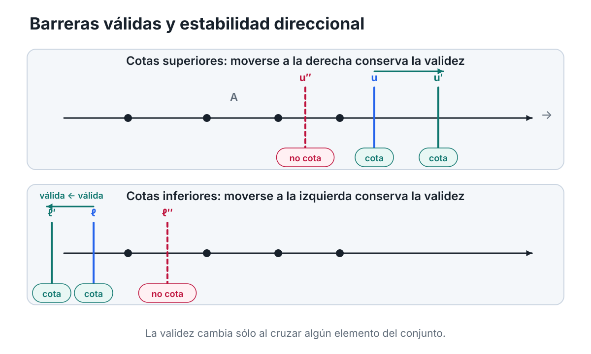
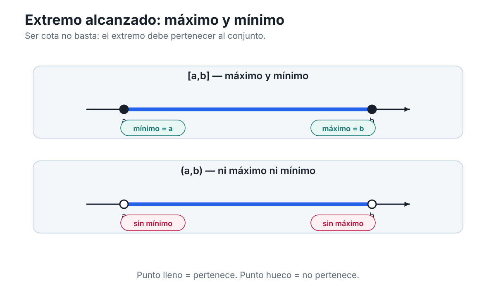
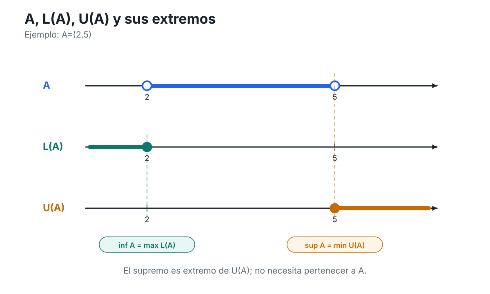
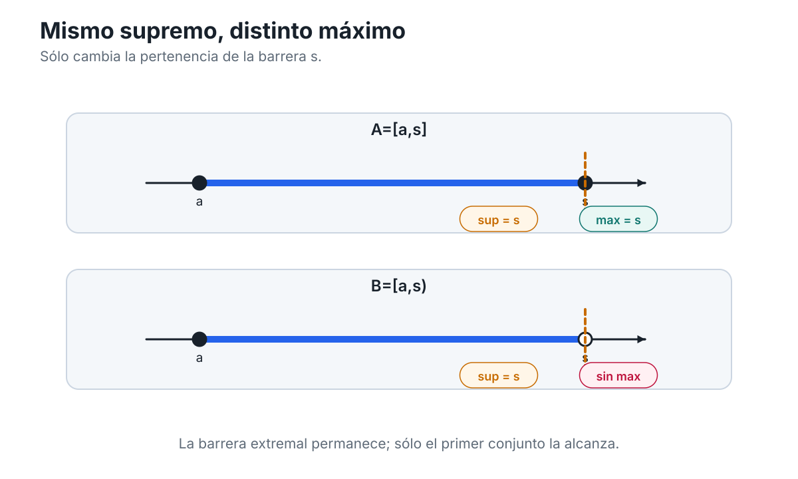
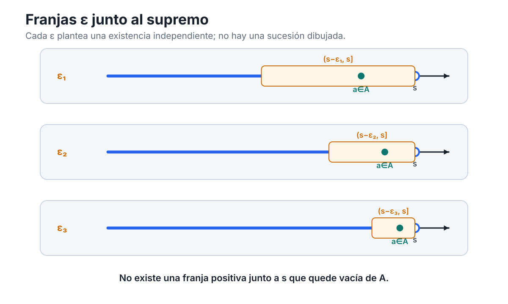
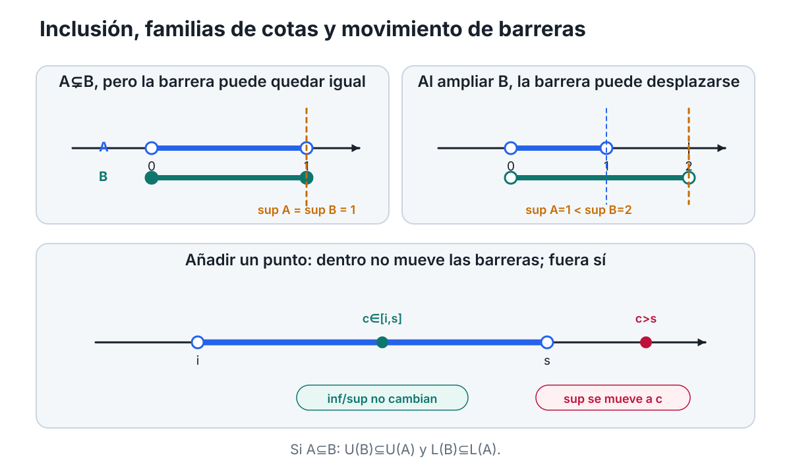
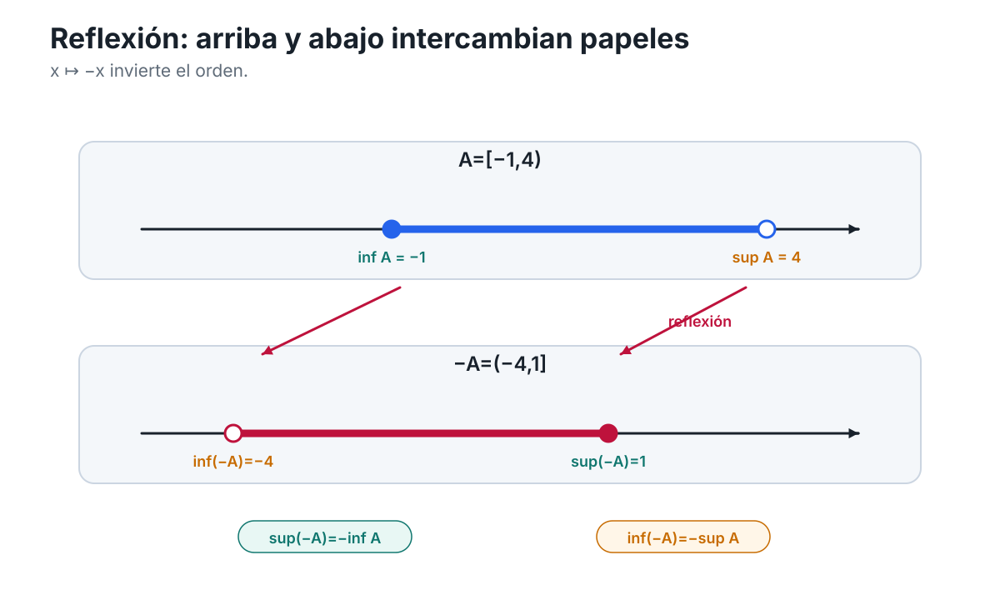
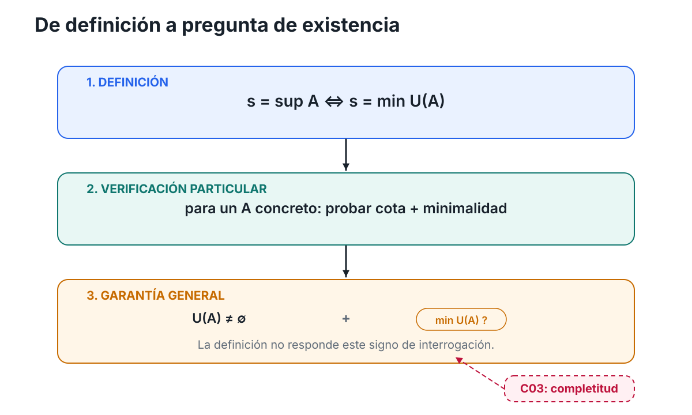

[Índice del libro](../para-matematicos/analisis-para-matematicos.md) · [Ejercicios](analisis-para-matematicos-capitulo-2-cotas-extremos-y-barreras-ejercicios.md) · [Soluciones](analisis-para-matematicos-capitulo-2-cotas-extremos-y-barreras-soluciones.md) · [Soluciones de microcontroles](analisis-para-matematicos-capitulo-2-cotas-extremos-y-barreras-microcontroles.md)

En el capítulo anterior aprendimos a mirar la recta real con un poco más de cuidado. Ya no era solamente el lugar donde colocamos números: distinguimos qué información pertenece al orden, qué información pertenece a la distancia y cómo ambas estructuras se coordinan en $\mathbb R$. Ahora vamos a usar sólo una parte de esa infraestructura —el orden— para plantear una pregunta nueva.

Supongamos que tenemos un conjunto de números reales. Puede ser un intervalo, una colección finita de puntos, una semirrecta o algún conjunto mucho menos regular. En lugar de comparar dos números concretos, queremos decir algo sobre **todo el conjunto a la vez**. ¿Cómo podemos expresar que ninguno de sus elementos sobrepasa cierto nivel? ¿Cómo registramos que todos permanecen por encima de una barrera inferior? Y, una vez que sabemos que existen muchas barreras posibles, ¿tiene sentido preguntar por la más ajustada?

La primera palabra que necesitaremos es **cota**.

La idea es elemental. Si todos los elementos de un conjunto $A$ quedan a la izquierda de un número $u$, entonces $u$ controla a $A$ desde arriba. Si todos quedan a la derecha de un número $l$, entonces $l$ lo controla desde abajo. Pero esa imagen tan sencilla contiene varias distinciones que en análisis se vuelven decisivas.

Una barrera que controla al conjunto no tiene por qué pertenecer a él. Tampoco tiene por qué ser única. Y, aunque podamos mover una barrera hasta hacerla cada vez más ajustada, todavía no sabemos si existirá una posición extremal que merezca llamarse «la mejor».

Ésa será la pregunta que guiará el capítulo:

> **¿Cómo se describe con precisión la barrera más ajustada que controla un conjunto, y qué diferencia hay entre que esa barrera exista y que además sea alcanzada por el conjunto?**

No intentaremos responder todo de una vez. Primero aprenderemos a hablar correctamente de barreras cualesquiera. Después distinguiremos las barreras que pertenecen al conjunto de las que sólo lo controlan; más adelante aislaremos las barreras extremales que reciben los nombres de supremo e ínfimo. Sólo al final podremos formular con precisión la pregunta que abrirá el capítulo siguiente: **¿qué propiedad especial de $\mathbb R$ garantiza que ciertas barreras extremales existan?**

Por ahora no necesitamos completitud, sucesiones ni topología. Nos basta el orden de la recta.

## 2.1. Controlar un conjunto desde arriba y desde abajo

Empecemos con un ejemplo concreto. Consideremos

$$
A=\{-2,0,1,3\}.
$$

Si colocamos estos cuatro puntos sobre la recta, el número $5$ queda a la derecha de todos ellos. También $4$, $10$ y $100$. Cualquiera de esos números sirve para decir:

> ningún elemento de $A$ está por encima de aquí.

En cambio, $2$ ya no sirve, porque $3\in A$ queda a su derecha.

Esta observación se formaliza de la manera siguiente.

Diremos que un número real $u$ es una **cota superior** de un conjunto $A\subseteq\mathbb R$ cuando

$$
a\le u
\qquad
\text{para todo }a\in A.
$$

En notación cuantificada:

$$
\forall a\in A,\qquad a\le u.
$$

De manera dual, diremos que un número real $l$ es una **cota inferior** de $A$ cuando

$$
l\le a
\qquad
\text{para todo }a\in A.
$$

Es decir,

$$
\forall a\in A,\qquad l\le a.
$$

Conviene detenernos aquí, porque estas dos definiciones son mucho más importantes de lo que aparentan.

Una cota superior no es «un número grande» en términos absolutos. Es un número grande **respecto del conjunto que estamos estudiando**. El número $10$ puede ser una cota superior de un conjunto y no serlo de otro. La propiedad depende siempre del par formado por el conjunto y la barrera.

Lo mismo ocurre con una cota inferior. No preguntamos si $l$ es pequeño en algún sentido universal, sino si todos los elementos de $A$ quedan por encima de él.

### Una cota no tiene por qué pertenecer al conjunto

Tomemos ahora

$$
B=(0,1).
$$

El número $1$ es una cota superior de $B$, porque todo $b\in B$ satisface

$$
b<1,
$$

y por tanto también $b\le1$.

Pero

$$
1\notin B.
$$

Esto no crea ninguna dificultad. La definición de cota superior exige que los elementos del conjunto no sobrepasen la barrera; **no exige que la barrera sea uno de esos elementos**.

Del mismo modo, $0$ es una cota inferior de $(0,1)$ aunque

$$
0\notin(0,1).
$$

Esta distinción será crucial durante todo el capítulo. Más adelante introduciremos nociones en las que la pertenencia al conjunto sí será obligatoria. Por ahora debemos resistir la tentación de incorporar esa condición antes de tiempo.

Podemos resumirlo así:

> **ser cota es una relación de control, no una relación de pertenencia.**

### Una cota casi nunca es única

Volvamos al conjunto

$$
B=(0,1).
$$

Ya vimos que $1$ es una cota superior. Pero también lo son $2$, $10$, $\pi$ y cualquier número real mayor que $1$.

¿Por qué?

Si $u$ es una cota superior de $A$ y $v\ge u$, entonces para todo $a\in A$ tenemos

$$
a\le u\le v.
$$

Por transitividad del orden,

$$
a\le v.
$$

Así que $v$ también es una cota superior.

Acabamos de obtener una primera propiedad estructural:

> si una barrera superior funciona, cualquier barrera colocada más a la derecha también funciona.

Dualmente, si $l$ es una cota inferior de $A$ y $m\le l$, entonces $m$ también es una cota inferior.

La figura C02-F01 hace visible precisamente esta movilidad de las barreras.

{fig-alt="Dos paneles muestran cotas superiores e inferiores válidas e inválidas alrededor de un conjunto finito sobre la recta. Las barreras válidas conservan su propiedad al moverse en la dirección exterior y pueden perderla al cruzar elementos del conjunto."}

*Figura C02-F01. La validez de una barrera depende de su posición respecto del conjunto: una cota superior sigue siéndolo al desplazarse a la derecha y una inferior al desplazarse a la izquierda.*

La idea visual no reemplaza la definición. Una barrera dibujada puede parecer válida en un caso particular; la afirmación matemática exige verificar la desigualdad para **todo** elemento del conjunto.

### El conjunto de todas las cotas

Como normalmente hay muchas cotas, resulta útil reunirlas en un conjunto.

Definiremos el **conjunto de cotas superiores** de $A$ por

$$
U(A)=\{u\in\mathbb R:\forall a\in A,\ a\le u\}.
$$

Y el **conjunto de cotas inferiores** por

$$
L(A)=\{l\in\mathbb R:\forall a\in A,\ l\le a\}.
$$

La letra $U$ puede recordarnos *upper bounds* y la letra $L$, *lower bounds*, pero lo importante no es la inicial sino la estructura.

Para

$$
A=\{-2,0,1,3\},
$$

tenemos

$$
U(A)=[3,\infty)
$$

y

$$
L(A)=(-\infty,-2].
$$

Aquí podemos verificar las fórmulas directamente: todo número $u\ge3$ domina a todos los elementos de $A$, mientras que cualquier número menor que $3$ falla al menos frente al elemento $3$. De modo dual, todo número $l\le-2$ queda por debajo de todos los elementos de $A$, y cualquier número mayor que $-2$ falla frente a $-2$.

No conviene extraer todavía una teoría general de los extremos de $U(A)$ y $L(A)$. Eso será precisamente el trabajo de las secciones siguientes. Por ahora sólo nos interesa advertir que las cotas forman ellas mismas conjuntos con una geometría muy simple en la recta: una vez que aparece una cota superior, todas las posiciones a su derecha también son cotas; una vez que aparece una cota inferior, todas las posiciones a su izquierda también lo son.

### Acotación superior, inferior y bilateral

Las definiciones de cota nos permiten clasificar conjuntos según exista o no alguna barrera válida.

Diremos que $A$ está **acotado superiormente** si posee al menos una cota superior. En símbolos,

$$
U(A)\ne\varnothing.
$$

Diremos que $A$ está **acotado inferiormente** si posee al menos una cota inferior:

$$
L(A)\ne\varnothing.
$$

Y diremos simplemente que $A$ está **acotado** si está acotado tanto superior como inferiormente.

Equivalente a esto, $A$ está acotado si existen números reales $l$ y $u$ tales que

$$
l\le a\le u
\qquad
\text{para todo }a\in A.
$$

Geométricamente, todo el conjunto queda contenido entre dos barreras:

$$
A\subseteq[l,u].
$$

Esta equivalencia es sencilla, pero conviene leerla en ambos sentidos.

Si sabemos que

$$
A\subseteq[l,u],
$$

entonces ningún elemento de $A$ puede quedar por debajo de $l$ ni por encima de $u$; por tanto, $l$ es cota inferior y $u$ es cota superior.

Recíprocamente, si $l$ es cota inferior y $u$ es cota superior, entonces cada $a\in A$ satisface

$$
l\le a\le u,
$$

de modo que

$$
a\in[l,u].
$$

Por tanto,

$$
A\subseteq[l,u].
$$

### Acotado no significa finito

Hay una confusión frecuente que conviene eliminar desde ahora.

El conjunto

$$
(0,1)
$$

tiene infinitos elementos, pero está acotado: $0$ es una cota inferior y $1$ es una cota superior.

Por tanto,

> **acotación y cantidad de elementos son conceptos distintos.**

Un conjunto puede ser infinito y estar perfectamente confinado entre dos barreras. El orden no está contando cuántos elementos hay; está controlando dónde pueden estar.

También puede ocurrir lo contrario: un conjunto puede extenderse indefinidamente en una dirección.

Por ejemplo,

$$
C=(0,\infty)
$$

está acotado inferiormente —por ejemplo, $0$ es una cota inferior—, pero no está acotado superiormente. Dado cualquier candidato $u\in\mathbb R$, siempre podemos encontrar un elemento de $C$ mayor que $u$. Por tanto,

$$
U(C)=\varnothing.
$$

Dualmente,

$$
D=(-\infty,5)
$$

está acotado superiormente, pero no inferiormente.

Y el conjunto completo de los reales,

$$
\mathbb R,
$$

no está acotado ni superior ni inferiormente.

### Cómo negar que un número sea cota

Las definiciones cuantificadas también nos enseñan a reconocer cuándo una barrera falla.

Decir que $u$ **no** es cota superior de $A$ significa negar

$$
\forall a\in A,\quad a\le u.
$$

La negación correcta es

$$
\exists a\in A
\quad\text{tal que}\quad
a>u.
$$

Es decir, para destruir la afirmación «$u$ controla a todo $A$ desde arriba» basta encontrar **un solo** elemento que cruce la barrera.

De manera dual, $l$ no es cota inferior de $A$ exactamente cuando existe algún $a\in A$ con

$$
a<l.
$$

Esta traducción lógica será útil una y otra vez. También explica por qué el dibujo de una barrera tiene valor matemático: moverla puede revelar el momento en que un elemento del conjunto pasa al lado prohibido. Pero la figura es sólo la representación; la condición exacta es cuantificada.

### Antes de seguir

Probemos las definiciones sin introducir todavía ninguna noción nueva.

1. Para $A=(-2,4)$, decide si $4$, $5$ y $3$ son cotas superiores.
2. Para el mismo conjunto, decide si $-2$, $-3$ y $0$ son cotas inferiores.
3. ¿Puede una cota superior pertenecer al conjunto? ¿Puede no pertenecer?
4. Si $u\in U(A)$ y $v>u$, ¿qué puedes afirmar sobre $v$?
5. Da un ejemplo de un conjunto infinito pero acotado.
6. Da un ejemplo de un conjunto acotado superiormente pero no inferiormente.

No necesitamos todavía una técnica especial para responder. Todo sale directamente de las definiciones.

La pregunta realmente nueva aparece cuando miramos el conjunto completo de barreras. Si existen muchas cotas superiores, unas más ajustadas que otras, parece natural preguntar si hay alguna que ocupe una posición especial. Pero antes de buscar «la mejor» cota necesitamos distinguir otra noción más elemental: ¿qué ocurre cuando una barrera no sólo controla al conjunto, sino que además es uno de sus propios elementos?

Ésa será la tarea de la sección siguiente.

## 2.2. Extremos alcanzados: máximo y mínimo

En la sección anterior vimos que una cota es una barrera que controla a todo el conjunto, pero no tiene por qué pertenecer a él. Ahora vamos a añadir justamente esa condición que habíamos dejado fuera.

Volvamos al conjunto

$$
A=\{-2,0,1,3\}.
$$

El número $5$ es una cota superior de $A$, pero no parece tener un vínculo especialmente estrecho con el conjunto: podríamos reemplazarlo por $6$, $10$ o $100$ y seguiría funcionando. El número $3$, en cambio, hace algo más. También controla a todos los elementos de $A$ desde arriba, pero además

$$
3\in A.
$$

La barrera ha sido **alcanzada por el propio conjunto**.

Esa diferencia motiva la siguiente definición.

Diremos que un número real $M$ es el **máximo** de un conjunto $A\subseteq\mathbb R$ cuando se cumplen simultáneamente dos condiciones:

$$
M\in A
$$

y

$$
\forall a\in A,\qquad a\le M.
$$

Cuando esto ocurre escribimos

$$
M=\max A.
$$

De manera dual, un número real $m$ es el **mínimo** de $A$ cuando

$$
m\in A
$$

y

$$
\forall a\in A,\qquad m\le a,
$$

y entonces escribimos

$$
m=\min A.
$$

Las definiciones tienen dos piezas que conviene mantener separadas. Ser máximo significa:

1. **ser cota superior** de $A$;
2. **pertenecer a $A$**.

Ser mínimo significa, de manera dual:

1. **ser cota inferior** de $A$;
2. **pertenecer a $A$**.

Por eso podemos condensar las definiciones usando los conjuntos de cotas introducidos en §2.1:

$$
M=\max A
\quad\Longleftrightarrow\quad
M\in A\cap U(A),
$$

mientras que

$$
m=\min A
\quad\Longleftrightarrow\quad
m\in A\cap L(A).
$$

Estas equivalencias no añaden una teoría nueva: sólo reúnen en una sola expresión las dos condiciones de la definición.

### Una cota superior no es automáticamente un máximo

Esta es la primera distinción que debemos fijar con absoluta claridad.

Para

$$
A=\{-2,0,1,3\},
$$

el número $5$ satisface

$$
5\in U(A),
$$

pero

$$
5\notin A.
$$

Por tanto, $5$ es una cota superior, pero **no** es el máximo.

En cambio,

$$
3\in U(A)
\quad\text{y}\quad
3\in A,
$$

así que

$$
\max A=3.
$$

Dualmente,

$$
\min A=-2.
$$

La figura C02-F02 hace visible esta diferencia sin convertirla en una mera cuestión de apariencia gráfica.

{fig-alt="Dos intervalos comparan extremos cerrados y abiertos. En el intervalo cerrado los extremos pertenecen y son mínimo y máximo; en el abierto las mismas fronteras no pertenecen y no son extremos alcanzados."}

*Figura C02-F02. Máximo y mínimo combinan dos condiciones: ser barrera y pertenecer al conjunto; los puntos llenos y huecos separan visualmente ambas condiciones.*

El dibujo puede ayudarnos a ver la diferencia entre una barrera exterior y una barrera alcanzada. Pero la condición matemática sigue siendo la conjunción exacta

$$
M\in A
\quad\text{y}\quad
\forall a\in A,\ a\le M.
$$

### Si existe, el máximo es único

Las definiciones permiten demostrar de inmediato una propiedad importante.

Supongamos que $M$ y $N$ fueran ambos máximos de un mismo conjunto $A$.

Como $M$ es máximo, domina a todos los elementos de $A$. Pero $N$ pertenece a $A$, de modo que

$$
N\le M.
$$

Por otra parte, como $N$ también es máximo y $M\in A$, tenemos

$$
M\le N.
$$

Las dos desigualdades juntas obligan a que

$$
M=N.
$$

Por tanto:

> **un conjunto no puede tener dos máximos distintos.**

La prueba para el mínimo es exactamente dual. Si $m$ y $n$ fueran mínimos de $A$, entonces $m\le n$ porque $m$ está por debajo de todo elemento de $A$, y $n\le m$ porque $n$ también está por debajo de todo elemento de $A$. Luego

$$
m=n.
$$

Así, máximo y mínimo, **cuando existen**, son únicos.

La expresión «cuando existen» importa. La definición nos dice qué tendría que cumplir un máximo; no nos promete que todo conjunto posea uno.

### Estar acotado no basta para tener máximo o mínimo

Comparemos ahora dos conjuntos muy parecidos:

$$
A=[0,1]
$$

y

$$
B=(0,1).
$$

Ambos están acotados. En los dos casos, $0$ es una cota inferior y $1$ es una cota superior.

Pero en $A=[0,1]$ los dos extremos pertenecen al conjunto. Por tanto,

$$
\min A=0,
\qquad
\max A=1.
$$

En $B=(0,1)$ ocurre algo distinto. El número $1$ sigue siendo cota superior, pero

$$
1\notin B,
$$

de modo que no puede ser máximo.

Podríamos preguntarnos si tal vez algún otro número de $(0,1)$ desempeña ese papel. Tomemos un elemento cualquiera

$$
x\in(0,1).
$$

El número

$$
y=\frac{x+1}{2}
$$

satisface

$$
x<y<1.
$$

Por tanto, $y\in(0,1)$ y además $y>x$. Esto demuestra que **ningún** $x\in(0,1)$ puede dominar a todos los elementos del conjunto. En consecuencia,

$$
(0,1)
\quad\text{no tiene máximo}.
$$

El argumento para el mínimo es dual. Dado cualquier $x\in(0,1)$, el número

$$
z=\frac{x}{2}
$$

satisface

$$
0<z<x,
$$

de modo que $z\in(0,1)$ y $z<x$. Por tanto, ningún elemento de $(0,1)$ puede ser mínimo.

Así obtenemos una advertencia fundamental:

> **un conjunto puede estar acotado superior e inferiormente y, sin embargo, no tener máximo ni mínimo.**

No conviene explicar todavía esta diferencia diciendo que un intervalo es «cerrado» y el otro «abierto» en sentido topológico. Esas nociones generales pertenecen a un capítulo posterior. Aquí todo se resuelve con las definiciones de orden y pertenencia.

### Cuatro comportamientos con los mismos extremos

Los intervalos con extremos $a<b$ permiten separar rápidamente las posibilidades:

- $[a,b]$ tiene mínimo $a$ y máximo $b$;
- $[a,b)$ tiene mínimo $a$ pero no máximo;
- $(a,b]$ tiene máximo $b$ pero no mínimo;
- $(a,b)$ no tiene ni máximo ni mínimo.

La diferencia no está en que las barreras $a$ y $b$ desaparezcan: siguen controlando a los cuatro conjuntos. Lo que cambia es si esas barreras pertenecen o no al conjunto.

Esta observación nos da una regla de lectura útil:

> para decidir si una cota es además un máximo o un mínimo, hay que comprobar **pertenencia**, no sólo posición.

### Antes de seguir

Probemos ahora la nueva distinción.

1. Para $A=\{-3,-1,2,7\}$, determina $\max A$ y $\min A$.
2. En $B=[-2,5)$, ¿existe máximo? ¿existe mínimo? Justifica usando las definiciones.
3. Si $u\in U(A)$ y además $u\in A$, ¿qué puedes concluir?
4. ¿Es correcta la afirmación «toda cota superior de un conjunto acotado es su máximo»? Explica el error.
5. Demuestra directamente que $(2,4)$ no tiene máximo.
6. ¿Puede un conjunto tener dos máximos distintos? ¿Qué parte de la prueba de unicidad lo impide?

Con esto hemos distinguido dos niveles de información. Una cota dice que el conjunto respeta una barrera; un máximo o un mínimo dicen, además, que esa barrera es alcanzada por el propio conjunto.

Pero el ejemplo $(0,1)$ deja una pregunta abierta. Sabemos que el conjunto está controlado desde arriba y que no tiene máximo. Aun así, entre todas sus cotas superiores parece haber algunas más ajustadas que otras. ¿Podemos precisar qué significa que una barrera sea la más ajustada posible, incluso cuando no pertenece al conjunto?

Ésa será la tarea de la sección siguiente.

## 2.3. La mejor barrera: supremo e ínfimo

Terminamos la sección anterior con un conjunto que estaba perfectamente controlado y, sin embargo, no tenía máximo. El ejemplo era

$$
A=(0,1).
$$

Sabemos que $1$ es una cota superior de $A$. También lo son $2$, $10$ y cualquier número mayor que $1$. Pero todas esas cotas no desempeñan el mismo papel: algunas dejan mucho espacio entre la barrera y el conjunto, mientras que $1$ parece ocupar una posición límite.

La pregunta ya no es si la barrera pertenece a $A$. Esa fue la cuestión del máximo. Ahora queremos preguntar algo distinto:

> **entre todas las cotas superiores, ¿hay una que sea menor que todas las demás?**

Si existe, esa barrera es el **supremo**.

Sea $A\subseteq\mathbb R$. Diremos que un número real $s$ es el **supremo** de $A$ cuando se cumplen dos condiciones:

1. $s$ es cota superior de $A$;
2. toda cota superior $u$ de $A$ satisface $s\le u$.

En símbolos,

$$
\forall a\in A,\quad a\le s,
$$

y

$$
\forall u\in U(A),\quad s\le u.
$$

Cuando existe tal número, escribimos

$$
s=\sup A.
$$

La segunda condición expresa la palabra decisiva: **menor**. No basta con que $s$ controle al conjunto desde arriba; debe ser la menor de todas las barreras superiores válidas.

Dualmente, diremos que un número real $i$ es el **ínfimo** de $A$ cuando

1. $i$ es cota inferior de $A$;
2. toda cota inferior $l$ de $A$ satisface $l\le i$.

Es decir,

$$
\forall a\in A,\quad i\le a,
$$

y

$$
\forall l\in L(A),\quad l\le i.
$$

Cuando existe, escribimos

$$
i=\inf A.
$$

Aquí la palabra decisiva es **mayor**: el ínfimo es la mayor de todas las cotas inferiores.

### El supremo es un extremo del conjunto de cotas

Las definiciones se vuelven especialmente transparentes si recordamos los conjuntos $U(A)$ y $L(A)$ introducidos en §2.1.

Decir que $s$ es supremo significa exactamente que $s$ pertenece a $U(A)$ y que no hay ningún elemento de $U(A)$ menor que él. Por tanto,

$$
\sup A=\min U(A),
$$

si ese mínimo existe.

Dualmente,

$$
\inf A=\max L(A),
$$

si ese máximo existe.

Esta reformulación merece atención. El supremo no se define, en primer lugar, como «el punto más a la derecha de $A$». Se define como un extremo del **conjunto de sus cotas superiores**. Del mismo modo, el ínfimo es un extremo del conjunto de cotas inferiores.

Eso explica por qué la pertenencia a $A$ no aparece en la definición. La pregunta relevante es si $s$ pertenece a $U(A)$ y es su mínimo; que además pertenezca o no a $A$ es una cuestión distinta, que estudiaremos en la sección siguiente.

### Un ejemplo: las cotas de $(0,1)$

Volvamos a

$$
A=(0,1).
$$

Afirmamos que

$$
U(A)=[1,\infty).
$$

Veámoslo en los dos sentidos.

Si $u\ge1$, entonces todo $a\in(0,1)$ satisface

$$
a<1\le u,
$$

por lo que $u$ es cota superior de $A$.

En cambio, si $u<1$, podemos elegir, por ejemplo,

$$
a=\frac{u+1}{2}.
$$

Cuando $0\le u<1$, se cumple $u<a<1$, así que $u$ no es cota superior. Si $u<0$, cualquier número de $(0,1)$ es mayor que $u$, de modo que tampoco es cota superior. Por tanto, no hay cotas superiores menores que $1$.

Así,

$$
U(A)=[1,\infty),
$$

y su mínimo es $1$. Luego

$$
\sup(0,1)=1.
$$

De manera dual,

$$
L(A)=(-\infty,0],
$$

de modo que

$$
\inf(0,1)=0.
$$

Observemos qué hemos hecho: no hemos usado sucesiones, límites ni completitud. Hemos verificado directamente, mediante el orden, cuál es el mínimo de $U(A)$ y cuál es el máximo de $L(A)$ para este conjunto concreto.

### Si el supremo existe, determina todas las cotas superiores

La descripción anterior no es especial de $(0,1)$. Supongamos que $s=\sup A$ existe.

Como $s$ es cota superior, sabemos que

$$
s\in U(A).
$$

Y como toda cota mayor que una cota superior sigue siendo cota superior, todo $u\ge s$ pertenece también a $U(A)$. Por tanto,

$$
[s,\infty)\subseteq U(A).
$$

Por otra parte, como $s$ es la menor cota superior, ningún número $u<s$ puede pertenecer a $U(A)$. De aquí obtenemos

$$
U(A)\subseteq[s,\infty).
$$

Las dos inclusiones dan

$$
\boxed{U(A)=[s,\infty)}.
$$

Dualmente, si $i=\inf A$ existe, entonces

$$
\boxed{L(A)=(-\infty,i]}.
$$

Estas identidades muestran que, cuando el extremo existe, toda la familia de barreras queda determinada por una sola posición crítica.

La figura C02-F03 separa visualmente los tres objetos que intervienen aquí: el conjunto original $A$, el conjunto $U(A)$ de cotas superiores y el conjunto $L(A)$ de cotas inferiores.

{fig-alt="Tres carriles alineados muestran A=(2,5), L(A)=(-infinito,2] y U(A)=[5,infinito). Las marcas 2 y 5 son respectivamente el máximo de L(A) y el mínimo de U(A), aunque sean puntos abiertos en A."}

*Figura C02-F03. El supremo y el ínfimo son extremos de las familias de cotas U(A) y L(A), no condiciones de pertenencia al conjunto original.*

La separación de carriles es matemáticamente importante: un punto puede ser extremo de $U(A)$ sin que eso diga todavía si pertenece a $A$.

### Si existe, el supremo es único

La palabra «el» en «el supremo» necesita justificación.

Supongamos que $s$ y $t$ fueran ambos supremos de $A$.

Como $s$ es supremo y $t$ es una cota superior, la minimalidad de $s$ implica

$$
s\le t.
$$

Pero, simétricamente, como $t$ es supremo y $s$ es una cota superior,

$$
t\le s.
$$

Por antisimetría del orden,

$$
s=t.
$$

Por tanto:

> **si un conjunto tiene supremo, éste es único.**

La prueba para el ínfimo es dual. Si $i$ y $j$ fueran ambos ínfimos de $A$, entonces, puesto que ambos son cotas inferiores y cada uno es la mayor de ellas,

$$
i\le j
\quad\text{y}\quad
j\le i,
$$

de donde

$$
i=j.
$$

Así, supremo e ínfimo son únicos **cuando existen**.

### Definir no es todavía demostrar existencia

Este punto merece quedar fijado desde ahora.

La definición de supremo nos dice cómo reconocer a un número $s$ **si existe**: debe ser una cota superior y debe estar por debajo de todas las demás cotas superiores. Pero la definición, por sí sola, no demuestra que tal número exista para cualquier conjunto.

Lo mismo vale para el ínfimo.

Por eso, en este libro escribiremos expresiones como

$$
\sup A
\qquad\text{o}\qquad
\inf A
$$

sólo cuando su existencia haya sido establecida o se haya supuesto explícitamente.

En ejemplos concretos, como $(0,1)$, podemos verificar la existencia directamente. La pregunta general —qué propiedad de $\mathbb R$ garantiza que ciertos conjuntos acotados posean siempre una barrera extremal— queda todavía abierta y no será respondida en esta sección.

### Antes de seguir

Probemos la nueva definición sin anticipar todavía la relación entre supremo y máximo.

1. Para $A=(2,5)$, determina $U(A)$ y $L(A)$ y, a partir de ellos, identifica $\sup A$ e $\inf A$.
2. Para $B=\{-4,1,7\}$, escribe $U(B)$ y $L(B)$ y localiza sus extremos.
3. Si $s=\sup A$, ¿por qué ningún número menor que $s$ puede pertenecer a $U(A)$?
4. Demuestra directamente que, si $s=\sup A$, entonces $U(A)=[s,\infty)$.
5. Formula y demuestra la afirmación dual para el ínfimo.
6. Explica por qué la definición de supremo no incluye la condición $s\in A$.

Con esto hemos añadido un tercer nivel a nuestra jerarquía de barreras. Una cota cualquiera controla; un máximo o mínimo controla y además pertenece al conjunto; un supremo o ínfimo selecciona, entre todas las cotas, la barrera extremal.

Queda ahora una comparación inevitable. A veces esa barrera extremal será también un elemento del conjunto y a veces no. ¿Qué cambia exactamente entre ambos casos?

Ésa será la tarea de la sección siguiente.

## 2.4. Alcanzado frente a no alcanzado

En las tres secciones anteriores hemos ido añadiendo información por capas. Primero apareció una **cota**, que simplemente controla al conjunto desde arriba o desde abajo. Después apareció un **máximo** o un **mínimo**, que además pertenece al conjunto. Finalmente introdujimos el **supremo** y el **ínfimo**, que seleccionan las barreras extremales entre todas las cotas.

Ahora podemos comparar esas nociones de manera exacta.

La pregunta central es muy simple:

> **si la mejor barrera existe, ¿qué cambia cuando el conjunto realmente la alcanza?**

La respuesta une máximo con supremo y mínimo con ínfimo.

### Cuando el supremo pertenece al conjunto

Supongamos que $\sup A$ existe y escribamos

$$
s=\sup A.
$$

Por definición, $s$ es una cota superior de $A$. Si además ocurre que

$$
s\in A,
$$

entonces se cumplen simultáneamente las dos condiciones que definen al máximo:

1. $s$ pertenece a $A$;
2. todo $a\in A$ satisface $a\le s$.

Por tanto,

$$
\max A=s=\sup A.
$$

Hemos probado una dirección:

$$
\sup A\in A
\quad\Longrightarrow\quad
\max A\text{ existe y }\max A=\sup A.
$$

La conversa es igualmente importante.

Supongamos ahora que $\max A$ existe. Escribamos

$$
M=\max A.
$$

Como $M$ domina a todos los elementos de $A$, es una cota superior. Pero, además, si $u$ es cualquier otra cota superior de $A$, entonces $M\in A$ obliga a que

$$
M\le u.
$$

Así que $M$ es menor o igual que toda cota superior. En otras palabras, $M$ es la menor cota superior de $A$.

Por tanto,

$$
M=\sup A.
$$

De este modo, siempre que el supremo exista,

$$
\boxed{
\max A\text{ existe}
\quad\Longleftrightarrow\quad
\sup A\in A
}
$$

y, cuando estas condiciones se cumplen,

$$
\boxed{\max A=\sup A.}
$$

La igualdad no es una coincidencia de notación. Expresa que una misma barrera puede verse de dos maneras: como **la menor de todas las cotas superiores** y, si además pertenece al conjunto, como **el mayor elemento del propio conjunto**.

### El dual inferior

Todo el argumento tiene una versión reflejada.

Si $\inf A$ existe y

$$
\inf A\in A,
$$

entonces ese número es una cota inferior que además pertenece al conjunto, así que es el mínimo.

Recíprocamente, si $\min A$ existe, entonces el mínimo es una cota inferior y, por pertenecer a $A$, queda por encima de cualquier otra cota inferior. Por tanto es la mayor cota inferior.

De este modo, siempre que el ínfimo exista,

$$
\boxed{
\min A\text{ existe}
\quad\Longleftrightarrow\quad
\inf A\in A
}
$$

y, cuando estas condiciones se cumplen,

$$
\boxed{\min A=\inf A.}
$$

Máximo y mínimo son, por tanto, **supremo e ínfimo alcanzados**.

### La misma barrera, distinta pertenencia

El contraste más limpio aparece al comparar

$$
A=[a,s]
$$

y

$$
B=[a,s),
$$

con $a<s$.

En ambos conjuntos, $s$ es cota superior. Además, ningún número menor que $s$ puede ser cota superior: si $u<s$, existe un punto del intervalo situado entre $u$ y $s$ que pertenece al conjunto correspondiente. Por tanto,

$$
\sup A=s
\qquad\text{y}\qquad
\sup B=s.
$$

La posición de la barrera extremal no cambia.

Pero la pertenencia sí cambia:

$$
s\in A,
\qquad
s\notin B.
$$

En consecuencia,

$$
\max A=s,
$$

mientras que $B$ no tiene máximo.

La figura C02-F04 hace visible exactamente esta invariancia de la barrera y el cambio de pertenencia.

{fig-alt="Dos intervalos alineados, uno cerrado en s y otro abierto en s, comparten el mismo supremo. Sólo el intervalo que contiene s tiene máximo."}

*Figura C02-F04. Cerrar o abrir la barrera extremal puede cambiar la existencia del máximo sin cambiar el supremo.*

El punto esencial no es que un extremo se dibuje lleno o hueco. Esa diferencia gráfica sólo codifica una afirmación lógica:

$$
s\in A
\quad\text{o}\quad
s\notin A.
$$

La existencia del supremo responde a una pregunta sobre el conjunto de cotas; la existencia del máximo añade una pregunta de pertenencia.

### Cuatro situaciones que no debemos confundir

Ya contamos con lenguaje suficiente para distinguir cuatro fenómenos diferentes.

**1. Una cota que no es extremal.**

Para

$$
A=(0,1),
$$

el número $2$ es cota superior, pero no es supremo porque existe una cota superior menor, por ejemplo $1$.

**2. Una barrera extremal no alcanzada.**

Para el mismo conjunto,

$$
\sup A=1,
$$

pero

$$
1\notin A.
$$

Existe supremo, pero no máximo.

**3. Una barrera extremal alcanzada.**

Para

$$
B=(0,1],
$$

tenemos

$$
\sup B=1
\quad\text{y}\quad
1\in B,
$$

por lo que

$$
\max B=1.
$$

**4. Ausencia de acotación.**

Para

$$
C=(0,\infty),
$$

no existe ninguna cota superior real. Por tanto, en el marco actual no hay un supremo real que comparar con un máximo.

Estas cuatro situaciones corresponden a preguntas distintas. Confundirlas hace parecer misteriosa una teoría que, en realidad, se organiza mediante comprobaciones muy precisas.

### Los cuatro intervalos vuelven a aparecer

Tomemos otra vez $a<b$.

Para los cuatro intervalos básicos tenemos:

- $[a,b]$: $\inf=a$ y $\sup=b$, ambos alcanzados; por tanto $\min=a$ y $\max=b$;
- $[a,b)$: $\inf=a$ está alcanzado y $\sup=b$ no; por tanto existe mínimo pero no máximo;
- $(a,b]$: $\inf=a$ no está alcanzado y $\sup=b$ sí; por tanto existe máximo pero no mínimo;
- $(a,b)$: $\inf=a$ y $\sup=b$, pero ninguno está alcanzado; no hay mínimo ni máximo.

La diferencia entre estos casos no exige todavía hablar de conjuntos abiertos o cerrados como nociones topológicas. Basta controlar dos datos:

1. dónde está la barrera extremal;
2. si esa barrera pertenece al conjunto.

### Semirrectas: cuando falta una de las barreras

La comparación también ayuda a leer conjuntos no acotados en una dirección.

Consideremos

$$
A=[0,\infty).
$$

El conjunto tiene mínimo:

$$
\min A=0,
$$

y por tanto

$$
\inf A=0.
$$

Pero no está acotado superiormente. No existe una cota superior real, así que en nuestro marco actual no escribimos $\sup A$.

Dualmente, para

$$
B=(-\infty,5],
$$

se cumple

$$
\max B=\sup B=5,
$$

pero el conjunto no está acotado inferiormente y no tiene ínfimo real en el sentido que estamos usando.

Esto ayuda a separar dos fallas muy diferentes:

- una barrera extremal puede existir pero no ser alcanzada;
- puede ocurrir que ni siquiera exista una cota en esa dirección.

### Antes de seguir

Probemos esta comparación sin introducir todavía ninguna herramienta nueva.

1. Para $A=[-1,3)$, determina $\inf A$, $\sup A$, $\min A$ y decide si existe $\max A$.
2. Para $B=(-2,4]$, identifica qué barrera extremal está alcanzada y cuál no.
3. Supón que $\sup A$ existe. Demuestra que, si $\sup A\in A$, entonces $\sup A=\max A$.
4. Demuestra directamente que, si $\max A$ existe, entonces también existe $\sup A$ y ambos coinciden.
5. Da un ejemplo de una cota superior que no sea el supremo.
6. Da un ejemplo de un conjunto con supremo pero sin máximo, y otro con máximo.

Con esto queda fijada la relación entre extremos alcanzados y barreras extremales. La pertenencia decide si el supremo o el ínfimo reciben además los nombres de máximo o mínimo.

Pero todavía podemos preguntar algo más fino. Si $s$ es el supremo y no pertenece a $A$, ¿cómo expresa la propia definición que los elementos de $A$ no pueden quedar separados de $s$ por un margen positivo fijo?

Ésa será la pregunta de la sección siguiente.

## 2.5. Acercarse a una barrera sin tocarla

Hasta ahora hemos descrito el supremo como la menor de todas las cotas superiores. Esa definición es exacta, pero todavía podemos extraer de ella una consecuencia que será muy útil en análisis.

Supongamos que $A\subseteq\mathbb R$ es **no vacío** y que

$$
s=\sup A.
$$

Ya sabemos dos cosas:

1. $s$ es cota superior de $A$;
2. ningún número menor que $s$ puede seguir siendo cota superior.

La segunda afirmación puede escribirse de una manera especialmente precisa. Tomemos cualquier número $\varepsilon>0$. Entonces

$$
s-\varepsilon<s.
$$

Como $s$ es la **menor** cota superior, el número $s-\varepsilon$ no puede ser una cota superior de $A$.

Pero en §2.1 aprendimos cómo se niega que un número sea cota superior. Decir que $s-\varepsilon$ no controla a todo $A$ desde arriba significa que existe algún elemento $a\in A$ para el cual

$$
a>s-\varepsilon.
$$

Y como $s$ sí es cota superior,

$$
a\le s.
$$

Por tanto,

$$
s-\varepsilon<a\le s.
$$

Como $\varepsilon>0$ era arbitrario, obtenemos:

$$
\boxed{
\forall\varepsilon>0\;\exists a\in A
\quad\text{tal que}\quad
s-\varepsilon<a\le s.
}
$$

Esta es la **caracterización $\varepsilon$ del supremo**.

### ¿Qué está diciendo realmente la condición?

La fórmula parece más complicada que la definición original, pero su contenido geométrico es sencillo.

El intervalo

$$
(s-\varepsilon,s]
$$

es una franja de anchura $\varepsilon$ pegada a la barrera superior $s$. La condición afirma que, por pequeña que elijamos esa anchura, la franja contiene al menos un elemento de $A$.

Dicho de otro modo:

> **no existe un margen positivo fijo que separe a todo el conjunto de su supremo por la izquierda.**

Esto no significa necesariamente que $s$ pertenezca a $A$. Si $s\in A$, podemos elegir simplemente $a=s$ para cualquier $\varepsilon>0$. Pero si $s\notin A$, la condición sigue siendo válida: cada franja $(s-\varepsilon,s]$ debe contener algún elemento del conjunto, aunque la propia barrera quede fuera de él.

Por eso esta formulación describe tanto extremos alcanzados como no alcanzados.

La figura C02-F05 hace visible exactamente esta idea, sin convertir las distintas elecciones de $\varepsilon$ en una sucesión.

{fig-alt="Tres franjas de distinto ancho junto a una misma barrera s muestran un testigo de A dentro de cada una. Las franjas son instancias independientes y no forman una sucesión."}

*Figura C02-F05. La caracterización epsilon dice que ninguna franja positiva inmediatamente bajo el supremo puede quedar vacía de puntos del conjunto.*

El dibujo puede mostrar varias anchuras posibles, pero la afirmación matemática no habla de una lista de anchuras ni de puntos elegidos de antemano. El orden de los cuantificadores es esencial:

$$
\forall\varepsilon>0\;\exists a\in A.
$$

Primero se fija un $\varepsilon$ cualquiera; **después** se afirma que existe algún elemento adecuado de $A$. El elemento puede depender de $\varepsilon$.

### La conversa: la condición $\varepsilon$ recupera el supremo

La implicación anterior salió directamente de la definición de supremo. Ahora probemos la dirección inversa.

Supongamos que $A$ es no vacío, que $s$ es una cota superior de $A$ y que

$$
\forall\varepsilon>0\;\exists a\in A
\quad\text{tal que}\quad
s-\varepsilon<a\le s.
$$

Queremos demostrar que

$$
s=\sup A.
$$

Como ya sabemos que $s$ es cota superior, sólo falta demostrar que es la **menor** de ellas.

Sea $u$ una cota superior cualquiera de $A$. Supongamos, buscando una contradicción, que

$$
u<s.
$$

Entonces el número

$$
\varepsilon=s-u
$$

es positivo. Por la condición $\varepsilon$, existe $a\in A$ tal que

$$
s-\varepsilon<a\le s.
$$

Pero

$$
s-\varepsilon
=
s-(s-u)
=
u.
$$

Así que

$$
u<a.
$$

Esto contradice que $u$ sea cota superior de $A$.

Por tanto, ninguna cota superior puede ser menor que $s$. Luego

$$
s\le u
$$

para toda cota superior $u$, y por definición

$$
s=\sup A.
$$

Hemos probado la equivalencia completa:

$$
\boxed{
s=\sup A
\quad\Longleftrightarrow\quad
\begin{cases}
s\text{ es cota superior de }A,\\[2mm]
\forall\varepsilon>0\;\exists a\in A:
s-\varepsilon<a\le s,
\end{cases}
}
$$

siempre que $A$ sea no vacío.

### ¿Por qué necesitamos decir que $A$ es no vacío?

La hipótesis no es decorativa.

La condición

$$
\forall\varepsilon>0\;\exists a\in A:\ s-\varepsilon<a\le s
$$

exige explícitamente la existencia de un elemento de $A$. Si $A=\varnothing$, esa afirmación es falsa para cualquier $s$.

Más adelante analizaremos con cuidado el conjunto vacío como caso límite. Por ahora basta registrar que esta caracterización $\varepsilon$ está formulada para conjuntos **no vacíos**.

### La versión para el ínfimo

Todo el argumento tiene un dual inferior.

Supongamos que $A$ es no vacío y que

$$
i=\inf A.
$$

Como $i$ es la mayor cota inferior, para cualquier $\varepsilon>0$ el número

$$
i+\varepsilon>i
$$

ya no puede ser cota inferior. Por tanto existe algún $a\in A$ tal que

$$
a<i+\varepsilon.
$$

Y como $i$ sí es cota inferior,

$$
i\le a.
$$

Luego

$$
i\le a<i+\varepsilon.
$$

Obtenemos:

$$
\boxed{
\forall\varepsilon>0\;\exists a\in A
\quad\text{tal que}\quad
i\le a<i+\varepsilon.
}
$$

Recíprocamente, si $i$ es una cota inferior de un conjunto no vacío $A$ y satisface esta condición para todo $\varepsilon>0$, entonces $i=\inf A$.

La prueba reproduce exactamente la lógica anterior. Si una cota inferior $l$ fuera mayor que $i$, tomaríamos

$$
\varepsilon=l-i>0.
$$

La condición proporcionaría un elemento $a\in A$ con

$$
i\le a<i+\varepsilon=l,
$$

lo que contradice que $l$ sea cota inferior.

Así,

$$
\boxed{
i=\inf A
\quad\Longleftrightarrow\quad
\begin{cases}
i\text{ es cota inferior de }A,\\[2mm]
\forall\varepsilon>0\;\exists a\in A:
i\le a<i+\varepsilon,
\end{cases}
}
$$

para $A\ne\varnothing$.

### Un ejemplo sin máximo

Consideremos otra vez

$$
A=(0,1).
$$

Sabemos que

$$
\sup A=1,
$$

aunque $1\notin A$.

Tomemos $\varepsilon>0$. Queremos encontrar un elemento $a\in(0,1)$ que satisfaga

$$
1-\varepsilon<a<1.
$$

Si $0<\varepsilon<2$, podemos elegir

$$
a=1-\frac{\varepsilon}{2},
$$

que cumple

$$
1-\varepsilon
<
1-\frac{\varepsilon}{2}
<
1.
$$

Si $\varepsilon\ge2$, basta elegir, por ejemplo,

$$
a=\frac12,
$$

pues entonces $1-\varepsilon\le-1<\frac12<1$.

Lo importante no es la fórmula particular usada para escoger $a$, sino el patrón lógico: **cada margen positivo que intentemos dejar por debajo de $1$ es atravesado por algún elemento del conjunto**.

No hemos construido una sucesión. Para cada $\varepsilon$ hemos respondido a una pregunta independiente de existencia.

### Una lectura alternativa

La caracterización puede expresarse también así.

Si $s=\sup A$, entonces para todo $r<s$ existe algún $a\in A$ con

$$
r<a\le s.
$$

En efecto, basta escribir

$$
\varepsilon=s-r>0.
$$

Recíprocamente, si $s$ es cota superior y todo $r<s$ deja de ser cota superior, entonces $s$ es la menor cota superior.

Esta formulación y la formulación con $\varepsilon$ dicen lo mismo. La segunda será especialmente útil porque convierte la idea de “barrera imposible de bajar” en una afirmación cuantificada mediante un **margen positivo**.

### Antes de seguir

Probemos la caracterización sin recurrir a sucesiones.

1. Para $A=(2,5)$ y $s=5$, verifica directamente la condición con $\varepsilon$.
2. Explica por qué, si existe $\varepsilon_0>0$ tal que ningún elemento de $A$ pertenece a $(s-\varepsilon_0,s]$, entonces $s$ no puede ser el supremo.
3. Supón que $A\ne\varnothing$, que $s$ es cota superior y que para todo $\varepsilon>0$ existe $a\in A$ con $s-\varepsilon<a\le s$. Demuestra que $s=\sup A$.
4. Formula y demuestra la versión dual para el ínfimo.
5. ¿Qué cambia en la condición cuando el supremo pertenece a $A$?
6. Explica por qué la expresión “hay puntos arbitrariamente cerca del supremo” no obliga todavía a introducir una sucesión.

La caracterización $\varepsilon$ traduce la extremalidad del supremo o del ínfimo en una afirmación local alrededor de la barrera: **ninguna mejora positiva de la cota sigue funcionando**.

En la sección siguiente cambiaremos otra variable del problema. En vez de modificar la barrera de un mismo conjunto, compararemos dos conjuntos relacionados por inclusión y preguntaremos cómo deben ordenarse sus barreras extremales.

## 2.6. Comparar conjuntos por sus barreras

Hasta ahora hemos estudiado un conjunto por vez. Fijábamos $A$, buscábamos sus cotas y, cuando existían, localizábamos sus barreras extremales. Ahora cambiaremos la pregunta: ¿qué ocurre con esas barreras cuando **cambiamos el conjunto**?

La situación básica será una inclusión

$$
A\subseteq B.
$$

Esto significa que todo elemento de $A$ pertenece también a $B$, aunque $B$ puede contener puntos adicionales. Intuitivamente, controlar al conjunto más grande debería imponer más restricciones. Conviene convertir esa intuición en una afirmación exacta.

### Las cotas se comparan antes que los supremos

Supongamos que $A\subseteq B$ y que $u$ es una cota superior de $B$. Entonces

$$
b\le u
\qquad
\text{para todo }b\in B.
$$

Pero cada elemento $a\in A$ es también un elemento de $B$. Por tanto,

$$
a\le u
\qquad
\text{para todo }a\in A.
$$

Así, toda cota superior de $B$ es automáticamente una cota superior de $A$. En términos de los conjuntos de cotas,

$$
\boxed{U(B)\subseteq U(A).}
$$

La dirección de la inclusión merece atención. Al **agrandar** el conjunto original, el conjunto de cotas superiores puede **reducirse**: una barrera que controlaba a $A$ puede dejar de controlar a $B$ si los nuevos puntos quedan a su derecha.

La afirmación dual es

$$
\boxed{L(B)\subseteq L(A).}
$$

En efecto, si $l$ es cota inferior de $B$, entonces $l\le b$ para todo $b\in B$ y, en particular, $l\le a$ para todo $a\in A$. Por tanto $l$ también es cota inferior de $A$.

Podemos resumir el efecto de la inclusión así:

> **más puntos en el conjunto significan más restricciones para sus barreras.**

### Monotonía del supremo

Supongamos ahora que $A\subseteq B$ y que existen ambos supremos.

Escribamos

$$
s_A=\sup A,
\qquad
s_B=\sup B.
$$

Como $s_B$ es una cota superior de $B$, la inclusión

$$
U(B)\subseteq U(A)
$$

nos dice que $s_B$ también es una cota superior de $A$.

Pero $s_A$ es la **menor** cota superior de $A$. Por tanto,

$$
s_A\le s_B.
$$

Es decir,

$$
\boxed{
A\subseteq B
\quad\Longrightarrow\quad
\sup A\le\sup B,
}
$$

siempre que ambos supremos existan.

Esta desigualdad expresa una forma de **monotonía**: al agregar puntos, la barrera superior extremal no puede desplazarse hacia la izquierda. Puede moverse hacia la derecha o permanecer donde estaba.

### Monotonía del ínfimo

El comportamiento inferior invierte la dirección.

Supongamos nuevamente que $A\subseteq B$ y que existen ambos ínfimos. Escribamos

$$
i_A=\inf A,
\qquad
i_B=\inf B.
$$

Como $i_B$ es cota inferior de $B$, también pertenece a $L(A)$. Y como $i_A$ es la **mayor** cota inferior de $A$, obtenemos

$$
i_B\le i_A.
$$

Por tanto,

$$
\boxed{
A\subseteq B
\quad\Longrightarrow\quad
\inf B\le\inf A,
}
$$

cuando ambos ínfimos existen.

Al agregar puntos, la barrera inferior extremal no puede desplazarse hacia la derecha. Puede moverse hacia la izquierda o permanecer fija.

La figura C02-F06 muestra primero la inclusión entre conjuntos de cotas y sólo después el movimiento posible de las barreras extremales.

{fig-alt="Tres paneles comparan una inclusión estricta con el mismo supremo, otra con supremo desplazado y la adición de un punto dentro o fuera del intervalo entre ínfimo y supremo."}

*Figura C02-F06. Al ampliar un conjunto, las familias de cotas se restringen; las barreras extremales pueden permanecer o desplazarse según dónde aparezcan los nuevos puntos.*

La secuencia lógica es importante. No estamos memorizando dos desigualdades aisladas: primero comprendemos cómo la inclusión modifica las **familias de cotas** y después leemos qué ocurre con sus extremos.

### Inclusión estricta no significa desplazamiento estricto

Aquí aparece una posible falsa intuición.

Podría parecer que si

$$
A\subsetneq B,
$$

entonces necesariamente

$$
\sup A<\sup B.
$$

Eso es falso.

Por ejemplo, tomemos

$$
A=(0,1)
$$

y

$$
B=[0,1].
$$

Tenemos una inclusión estricta,

$$
A\subsetneq B,
$$

pero

$$
\sup A=\sup B=1
$$

y también

$$
\inf A=\inf B=0.
$$

El conjunto $B$ contiene puntos que $A$ no contiene, pero esos puntos nuevos no empujan las barreras extremales más allá de sus posiciones anteriores.

Así que las conclusiones correctas son no estrictas:

$$
\sup A\le\sup B,
\qquad
\inf B\le\inf A.
$$

Puede haber igualdad incluso cuando $A\ne B$.

### Cuando las barreras sí se desplazan

Comparemos ahora

$$
A=[0,1]
$$

y

$$
B=[-2,3].
$$

Entonces

$$
A\subseteq B,
$$

pero los puntos adicionales de $B$ aparecen a ambos lados. Como consecuencia,

$$
\sup A=1<3=\sup B
$$

y

$$
\inf B=-2<0=\inf A.
$$

Este ejemplo muestra las dos direcciones posibles del desplazamiento: la barrera superior puede ser empujada hacia la derecha y la inferior hacia la izquierda.

Lo que nunca puede ocurrir, bajo $A\subseteq B$, es lo contrario:

$$
\sup B<\sup A
$$

o

$$
\inf A<\inf B,
$$

si los extremos correspondientes existen.

### La reflexión intercambia arriba y abajo

Hay otra comparación especialmente útil porque convierte las afirmaciones superiores en inferiores y viceversa.

Para un conjunto $A\subseteq\mathbb R$, definamos su reflejo respecto del origen por

$$
-A=\{-a:a\in A\}.
$$

El orden se invierte al cambiar de signo. Si $l$ es una cota inferior de $A$, entonces

$$
l\le a
\qquad
\text{para todo }a\in A.
$$

Al multiplicar por $-1$ se invierte la desigualdad:

$$
-a\le -l
\qquad
\text{para todo }a\in A.
$$

Por tanto, $-l$ es una cota superior de $-A$.

Recíprocamente, toda cota superior de $-A$ surge de esta manera. Así,

$$
U(-A)=-L(A),
$$

donde

$$
-L(A)=\{-l:l\in L(A)\}.
$$

Dualmente,

$$
L(-A)=-U(A).
$$

Ahora supongamos que $\inf A$ existe. Como

$$
\inf A=\max L(A),
$$

al cambiar de signo, el mayor elemento de $L(A)$ se convierte en el menor elemento de $-L(A)=U(-A)$. Por tanto existe $\sup(-A)$ y

$$
\boxed{\sup(-A)=-\inf A.}
$$

De manera dual, si $\sup A$ existe, entonces existe $\inf(-A)$ y

$$
\boxed{\inf(-A)=-\sup A.}
$$

Estas identidades no son reglas algebraicas independientes. Expresan simplemente que la reflexión invierte el orden y, con él, intercambia barreras superiores e inferiores.

La figura C02-F07 acompaña esta dualidad mediante la reflexión de la recta, sin sustituir la justificación algebraica de la inversión del orden.

{fig-alt="Dos rectas muestran A=[-1,4) y -A=(-4,1]. Flechas de reflexión relacionan inf A con sup(-A) y sup A con inf(-A)."}

*Figura C02-F07. La reflexión x↦−x invierte el orden y convierte cotas inferiores en superiores, intercambiando ínfimo y supremo con cambio de signo.*

### Qué no estamos haciendo todavía

Las comparaciones de esta sección son puramente estructurales. Hemos usado sólo:

- inclusión de conjuntos;
- definición de cota;
- minimalidad del supremo y maximalidad del ínfimo;
- inversión del orden bajo $x\mapsto -x$.

No estamos desarrollando todavía un cálculo general de expresiones como

$$
\sup(A+B),
\qquad
\sup(AB),
$$

o supremos de imágenes de funciones. Esas reglas requieren hipótesis y contextos adicionales que no necesitamos aquí.

### Antes de seguir

Probemos las relaciones obtenidas.

1. Si $A\subseteq B$, demuestra directamente que $U(B)\subseteq U(A)$.
2. Formula y demuestra la inclusión correspondiente para $L(A)$ y $L(B)$.
3. Supón que $A\subseteq B$ y que existen $\sup A$ y $\sup B$. Demuestra que $\sup A\le\sup B$.
4. Da un ejemplo con $A\subsetneq B$ pero $\sup A=\sup B$.
5. Si existen $\inf A$ y $\sup(-A)$, explica por qué la reflexión obliga a que $\sup(-A)=-\inf A$.
6. Para $A=[-1,4)$, determina $-A$ y compara sus extremos con los de $A$.

Hemos visto que las barreras no sólo describen un conjunto aislado: también registran cómo cambia el control por orden cuando el conjunto crece o se refleja.

Pero todo lo hecho hasta ahora tiene una cláusula recurrente: **cuando los extremos existen**. La definición nos permite compararlos una vez disponibles; todavía no nos ha dado una garantía general de existencia.

Ésa será la cuestión de la sección siguiente.

## 2.7. Definir una barrera no garantiza que exista

Durante casi todo el capítulo ha reaparecido una cláusula que conviene mirar de frente: **cuando el supremo existe**, **cuando el ínfimo existe**, **cuando ambos extremos existen**. No es una precaución estilística. Señala una separación lógica fundamental.

Hasta aquí hemos respondido con bastante detalle una pregunta:

> **¿qué tendría que cumplir un número para ser el supremo o el ínfimo de un conjunto?**

La respuesta está en las definiciones. Si $s=\sup A$, entonces $s$ debe ser una cota superior de $A$ y, entre todas las cotas superiores, debe ser la menor. De manera dual, $i=\inf A$ debe ser la mayor cota inferior.

Pero de una definición no se deduce automáticamente que exista un objeto que la satisfaga.

La pregunta distinta es:

> **¿bajo qué hipótesis podemos garantizar que esa barrera extremal existe?**

Ésta es una pregunta de existencia, y todavía no la hemos resuelto en general.

### Dos obstáculos diferentes

La escritura

$$
\sup A=\min U(A)
$$

muestra con claridad que para hablar de un supremo real deben superarse dos obstáculos lógicamente distintos.

Primero, el conjunto debe tener alguna cota superior:

$$
U(A)\ne\varnothing.
$$

Segundo, el conjunto de cotas superiores debe poseer un mínimo.

Por tanto, no basta con preguntar si hay barreras. Hay que preguntar además si entre ellas existe una **menor**.

Dualmente, para un ínfimo necesitamos que

$$
L(A)\ne\varnothing
$$

y que $L(A)$ posea un máximo.

Esta descomposición permite distinguir fallas que, a primera vista, podrían parecer iguales.

### Primer caso: no hay cotas en esa dirección

Consideremos

$$
A=(0,\infty).
$$

Ya sabemos que no está acotado superiormente. En símbolos,

$$
U(A)=\varnothing.
$$

Por tanto, en el marco de los números reales ordinarios no hay siquiera un conjunto no vacío de cotas superiores del cual buscar un mínimo. No escribimos $\sup A$ como número real.

La falla ocurre en el **primer** paso: no existen barreras superiores.

Dualmente, para

$$
B=(-\infty,0)
$$

tenemos

$$
L(B)=\varnothing,
$$

de modo que no hay ínfimo real en el sentido que estamos usando.

No introduciremos aquí las convenciones $+\infty$ o $-\infty$. En este capítulo, supremo e ínfimo son números reales cuando existen.

### Segundo caso: hay cotas, pero todavía falta justificar una extremal

Supongamos ahora que $A$ sí está acotado superiormente. Entonces

$$
U(A)\ne\varnothing.
$$

Esto elimina el primer obstáculo, pero la definición del supremo todavía exige algo más:

$$
\min U(A)\text{ debe existir}.
$$

En muchos ejemplos concretos del capítulo pudimos verificar ese mínimo directamente. Para $(0,1)$, por ejemplo,

$$
U((0,1))=[1,\infty),
$$

y el mínimo de ese conjunto es $1$.

Pero ese cálculo particular no demuestra una afirmación general sobre **todo** subconjunto no vacío y acotado superiormente de $\mathbb R$.

La figura C02-F08 fija precisamente esta separación entre definición y existencia.

{fig-alt="Diagrama vertical de tres niveles: definición, verificación particular y garantía general. En el último nivel permanece abierta la pregunta min U(A)?, conectada mediante una flecha discontinua con C03 completitud."}

*Figura C02-F08. Definir el supremo y verificarlo en un caso concreto no equivalen a disponer de una garantía general de existencia; esa última puerta queda para C03.*

El signo de interrogación es parte del contenido matemático: la figura no debe sugerir que toda familia de cotas posee automáticamente una barrera extremal.

### El conjunto vacío como control lógico

El conjunto vacío obliga a leer las definiciones con especial cuidado.

Sea

$$
A=\varnothing.
$$

Recordemos que $u$ es cota superior de $A$ cuando

$$
\forall a\in A,\qquad a\le u.
$$

Como no existe ningún elemento $a\in\varnothing$ que pueda violar la desigualdad, la afirmación universal es verdadera para **todo** $u\in\mathbb R$. Por tanto,

$$
U(\varnothing)=\mathbb R.
$$

Exactamente el mismo razonamiento da

$$
L(\varnothing)=\mathbb R.
$$

Ahora bien, $\mathbb R$ no tiene mínimo ni máximo. Dado cualquier $x\in\mathbb R$, el número $x-1$ es menor y $x+1$ es mayor.

Por consiguiente,

$$
U(\varnothing)=\mathbb R\quad\text{no tiene mínimo},
$$

y

$$
L(\varnothing)=\mathbb R\quad\text{no tiene máximo}.
$$

Así, con nuestras definiciones en $\mathbb R$ ordinario, **no introducimos $\sup\varnothing$ ni $\inf\varnothing$ como números reales**.

Este ejemplo es útil porque muestra una falla distinta de la de un conjunto no acotado. Para $(0,\infty)$ teníamos $U(A)=\varnothing$; para $A=\varnothing$ ocurre lo contrario: $U(A)=\mathbb R$. En ambos casos no aparece un mínimo de $U(A)$, pero por razones completamente distintas.

### El orden por sí solo no basta

Todavía queda una cuestión más profunda. Podría pensarse que, una vez que un sistema numérico está ordenado y un conjunto tiene cotas superiores, la menor de ellas debe aparecer automáticamente. Eso tampoco es una consecuencia del orden por sí solo.

Como contraste motivacional, consideremos el sistema ordenado $\mathbb Q$ y el conjunto

$$
S=\{q\in\mathbb Q:q>0\text{ y }q^2<2\}.
$$

Este conjunto posee cotas superiores racionales; por ejemplo, $2$ es una. Sin embargo, no posee una menor cota superior **dentro de $\mathbb Q$**.

No desarrollaremos aquí la demostración de este hecho. Su función en este punto es conceptual: muestra que disponer de un orden y de cotas no fuerza por sí solo la existencia del extremo requerido dentro del mismo sistema numérico.

Esto permite formular con precisión lo que todavía falta entender sobre $\mathbb R$.

### Definición, verificación local y garantía general

Conviene separar tres niveles que hasta ahora han aparecido entrelazados.

**Nivel 1: definición.**

Decimos qué significa que un número $s$ sea el supremo de $A$.

**Nivel 2: verificación en un ejemplo concreto.**

Para un conjunto particular podemos demostrar directamente que cierto número satisface la definición. Así hicimos con intervalos como $(0,1)$.

**Nivel 3: garantía general de existencia.**

Queremos saber si una clase completa de conjuntos posee siempre un supremo bajo ciertas hipótesis.

Los dos primeros niveles pertenecen plenamente a este capítulo. El tercero requiere una propiedad adicional de los números reales que todavía no hemos establecido.

Esta distinción evita una inferencia muy común:

> **haber definido el supremo no equivale a haber demostrado que todo conjunto acotado superiormente tenga uno.**

### Lo que podemos afirmar y lo que todavía no

A estas alturas podemos usar con seguridad enunciados condicionales como:

- si $\sup A$ existe y pertenece a $A$, entonces coincide con $\max A$;
- si $A\subseteq B$ y existen ambos supremos, entonces $\sup A\le\sup B$;
- si $\inf A$ existe, entonces $\sup(-A)=-\inf A$;
- si $s$ es una cota superior de un conjunto no vacío y satisface la caracterización $\varepsilon$, entonces $s=\sup A$.

Todos estos enunciados dicen qué ocurre **una vez asegurada la existencia** de los objetos que intervienen.

Lo que todavía no podemos usar como teorema disponible en C02 es la afirmación general de que todo subconjunto no vacío y acotado superiormente de $\mathbb R$ posee supremo.

Esa afirmación será precisamente la puerta del capítulo siguiente.

### Antes de seguir

Comprobemos que la separación lógica quedó clara.

1. Explica por qué la definición de $\sup A$ no demuestra por sí sola que $\sup A$ exista.
2. Para $A=(0,\infty)$, identifica cuál de los dos obstáculos para la existencia del supremo falla primero.
3. Demuestra que $U(\varnothing)=L(\varnothing)=\mathbb R$.
4. Explica por qué de la igualdad anterior no se obtiene un supremo o un ínfimo real del conjunto vacío.
5. ¿Qué muestra conceptualmente el contraste con $\mathbb Q$ respecto del papel del orden?
6. Distingue entre “verificar un supremo en un ejemplo” y “garantizar la existencia del supremo para toda una clase de conjuntos”.

La teoría de este capítulo ya nos dice qué forma debe tener una barrera extremal, cómo reconocerla y cómo se comporta cuando existe. La pregunta que queda abierta es exactamente la que necesitamos para avanzar:

> **¿qué propiedad de $\mathbb R$ garantiza la existencia de esas barreras extremales bajo las hipótesis adecuadas?**

La sección final de C02 formulará esa necesidad como transición hacia la completitud, sin demostrarla todavía.

## 2.8. De las barreras a la completitud

Llegamos al final del capítulo con una pregunta que no apareció de golpe. Fue surgiendo a medida que refinábamos la idea de barrera.

Al principio sólo necesitábamos controlar un conjunto desde arriba o desde abajo. Después aprendimos a reunir todas las barreras posibles en los conjuntos $U(A)$ y $L(A)$. Más tarde preguntamos por la mejor de esas barreras, distinguimos si el conjunto la alcanza o no y vimos cómo reconocerla mediante condiciones cuantificadas.

La cadena completa puede resumirse así:

```text
cota
→ conjunto de cotas
→ mejor cota
→ alcanzada / no alcanzada
→ existencia no garantizada por la definición
→ completitud
```

Las primeras cinco etapas pertenecen ya a nuestro lenguaje. La última palabra —**completitud**— nombra precisamente la propiedad adicional que necesitamos estudiar para transformar ciertas afirmaciones condicionales en garantías generales de existencia.

### Qué hemos aprendido a distinguir

Conviene reconstruir el recorrido sin perder las separaciones que lo hicieron posible.

Una **cota superior** de $A$ es simplemente un número que domina a todos sus elementos. No tiene por qué pertenecer al conjunto y, en general, no es única.

Un **máximo**, en cambio, añade pertenencia. Es una cota superior que además pertenece a $A$.

Un **supremo** hace otra cosa: no pregunta si la barrera pertenece al conjunto, sino si es la menor entre todas las cotas superiores.

Por eso las tres nociones responden a preguntas diferentes:

1. ¿controla al conjunto desde arriba?;
2. ¿la barrera pertenece al conjunto?;
3. ¿es la menor de todas las barreras superiores?

La misma separación aparece, reflejada, entre cota inferior, mínimo e ínfimo.

Esta distinción evita una confusión frecuente: que dos nociones coincidan en ciertos ejemplos no significa que sean la misma noción. Cuando un máximo existe, coincide con el supremo; pero un supremo puede existir sin que haya máximo.

### Por qué el supremo puede no pertenecer al conjunto

El ejemplo

$$
A=(0,1)
$$

resume bien esta diferencia.

Sabemos que

$$
\sup A=1,
$$

pero

$$
1\notin A.
$$

No hay contradicción. La definición de supremo exige que $1$ sea la menor cota superior, no que pertenezca al conjunto.

Lo que sí sabemos es que la barrera no puede quedar separada de $A$ por un margen positivo fijo. Para todo $\varepsilon>0$ existe $a\in A$ tal que

$$
1-\varepsilon<a\le1.
$$

La barrera puede no ser alcanzada y, sin embargo, ser imposible de mejorar.

Ésa es exactamente la información que codifica la caracterización $\varepsilon$: no afirma pertenencia; afirma **extremalidad**.

### Por qué un máximo ya es automáticamente el supremo

La situación cambia si $M=\max A$.

Como $M$ es máximo,

$$
M\in A
$$

y todo $a\in A$ satisface

$$
a\le M.
$$

Así, $M$ es una cota superior.

Pero si $u$ es cualquier otra cota superior, entonces, puesto que $M\in A$,

$$
M\le u.
$$

Por tanto $M$ es menor o igual que toda cota superior. Es decir, es la menor cota superior:

$$
M=\sup A.
$$

Así, el máximo no necesita una teoría independiente para convertirse en supremo. La pertenencia al conjunto hace que la condición extremal surja inmediatamente.

Dualmente, si $\min A$ existe, entonces

$$
\min A=\inf A.
$$

### Qué expresa realmente la condición con $\varepsilon$

La caracterización

$$
\forall\varepsilon>0\;\exists a\in A:
\qquad
s-\varepsilon<a\le s
$$

no debe leerse como una receta para construir una sucesión. En este capítulo no hemos hecho eso.

Su función es otra: traducir la afirmación

> $s$ es la menor cota superior

a una forma local alrededor de $s$.

Si existiera algún $\varepsilon_0>0$ tal que ningún elemento de $A$ entrara en

$$
(s-\varepsilon_0,s],
$$

entonces $s-\varepsilon_0$ seguiría siendo cota superior. En ese caso $s$ no sería la menor.

Por tanto, la condición con $\varepsilon$ expresa una imposibilidad:

> **ninguna disminución positiva de la barrera puede seguir controlando al conjunto completo.**

Ésta será una forma de razonamiento que reaparecerá más adelante en análisis, aunque aquí la hemos usado sin sucesiones ni límites.

### Lo que la definición todavía no puede hacer por nosotros

Hasta este punto podemos reconocer un supremo cuando lo tenemos delante. También podemos demostrar en ejemplos particulares que cierto número es el supremo.

Pero sigue existiendo una diferencia entre dos tipos de afirmaciones.

Podemos decir:

> si $s=\sup A$, entonces $s$ tiene determinadas propiedades.

Podemos decir también:

> para este conjunto concreto $A$, el número $s$ satisface la definición de supremo.

Lo que todavía no podemos afirmar como resultado disponible en C02 es:

> para todo conjunto de cierto tipo, existe necesariamente un número $s$ que satisface esa definición.

Ese salto es precisamente el problema de existencia.

La figura C02-F08, ya introducida en §2.7, sirve también como mapa de esta transición: primero hay que tener cotas y después hay que justificar que entre ellas aparezca una cota extremal.

El esquema debe seguir conservando el signo de interrogación en

$$
\min U(A)\;?
$$

porque ésa es justamente la pregunta que este capítulo no resuelve en general.

### La afirmación que falta

La sección anterior dejó claro que el orden por sí solo no basta. El contraste con $\mathbb Q$ muestra que un conjunto puede estar acotado superiormente dentro de un sistema ordenado y, aun así, carecer allí de una menor cota superior.

Por tanto, si queremos una garantía general en $\mathbb R$, necesitamos una propiedad específica de los números reales.

La afirmación que el capítulo siguiente deberá introducir y justificar puede formularse así:

> **Todo subconjunto no vacío de $\mathbb R$ que esté acotado superiormente posee un supremo en $\mathbb R$.**

En C02 esta frase no se usa como teorema ni se demuestra. Sólo identifica con precisión la pieza que falta.

Mediante la reflexión $A\mapsto -A$, una garantía correspondiente para ínfimos quedará vinculada a la misma estructura. Pero esa equivalencia y las distintas formulaciones de completitud pertenecen al desarrollo siguiente.

### Del «si existe» a la garantía

Podemos ahora ver con claridad qué cambiará cuando dispongamos de completitud.

Hasta aquí hemos trabajado muchas veces bajo hipótesis como

$$
\text{“supongamos que }\sup A\text{ existe”.}
$$

Eso nos permitió estudiar unicidad, pertenencia, caracterizaciones $\varepsilon$, monotonía y reflexión.

La completitud tendrá otra función: bajo hipótesis apropiadas, permitirá pasar de

$$
\text{“si existe”}
$$

a

$$
\text{“existe”.}
$$

Ése es un cambio lógico importante. No añade una nueva definición de supremo; añade una garantía de existencia.

Por eso la completitud no debe confundirse con la definición de supremo. Son piezas distintas:

- la definición dice **qué es** el supremo;
- la completitud dirá **cuándo podemos asegurar que existe**.

### Autoexplicación de cierre

Antes de abandonar el capítulo, conviene poder responder sin recurrir a una fórmula memorizada.

1. ¿Por qué $\sup A$ puede existir sin pertenecer a $A$?
2. ¿Por qué, si $\max A$ existe, entonces coincide necesariamente con $\sup A$?
3. ¿Qué niega exactamente la condición
   $$
   \forall\varepsilon>0\;\exists a\in A:
   \quad
   \sup A-\varepsilon<a\le\sup A?
   $$
4. ¿Qué nueva afirmación necesita C03 para convertir la teoría condicional de C02 en una garantía general de existencia dentro de $\mathbb R$?

Si estas cuatro preguntas pueden contestarse con claridad, la arquitectura conceptual del capítulo está completa.

### Cierre

Comenzamos preguntando cómo controlar un conjunto mediante barreras. Terminamos descubriendo que la pregunta verdaderamente profunda no era sólo cómo definir la mejor barrera, sino por qué esa barrera debería existir.

C02 nos entrega ahora el lenguaje necesario:

- cota superior e inferior;
- acotación;
- conjuntos $U(A)$ y $L(A)$;
- máximo y mínimo;
- supremo e ínfimo;
- extremos alcanzados y no alcanzados;
- caracterizaciones $\varepsilon$;
- monotonía bajo inclusión;
- dualidad por reflexión;
- separación entre definición y existencia.

Pero deja abierta, deliberadamente, una sola necesidad central:

> **¿qué propiedad distingue a $\mathbb R$ de sistemas ordenados incompletos y garantiza la existencia de las barreras extremales que el análisis necesita?**

Ésa es la puerta de C03.

C02 termina aquí. La respuesta comienza en el capítulo siguiente.

[← Capítulo 1](analisis-para-matematicos-capitulo-1-recta-real-ordenada-y-metrica.md) · [Índice del libro](../para-matematicos/analisis-para-matematicos.md) · [Capítulo 3 →](analisis-para-matematicos-capitulo-3-completitud.md)
