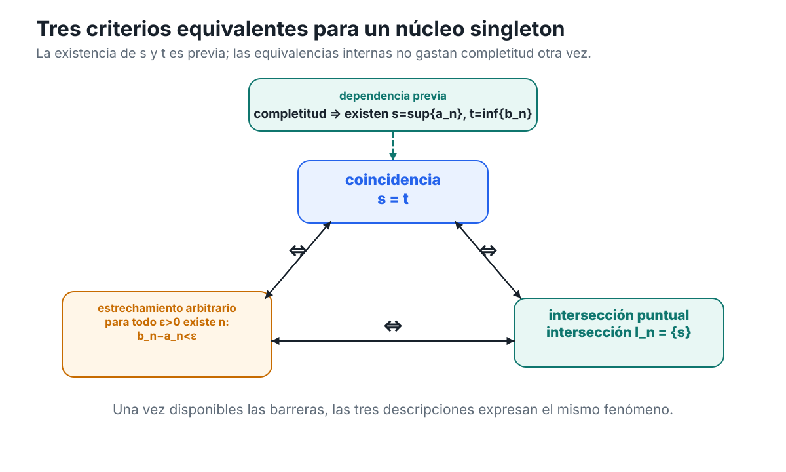
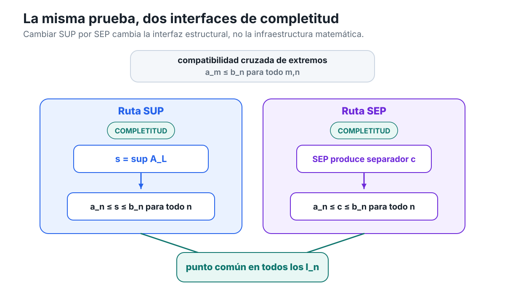

[Capítulo 3](analisis-para-matematicos-capitulo-3-completitud.md) · [Índice del libro](../para-matematicos/analisis-para-matematicos.md) · [Ejercicios](analisis-para-matematicos-capitulo-3-completitud-ejercicios.md) · [Soluciones](analisis-para-matematicos-capitulo-3-completitud-soluciones.md) · [Soluciones de microcontroles](analisis-para-matematicos-capitulo-3-completitud-microcontroles.md)

# Soluciones — Capítulo 3

## §3.1. El problema heredado: definir no basta

[]{#MA-SOL-ANM-01-003-001}

### 1. Qué permiten concluir las hipótesis

Partimos únicamente de

$$
A\ne\varnothing
\qquad\text{y}\qquad
U_X(A)\ne\varnothing.
$$

La primera afirmación está **forzada**. Decir que $U_X(A)\ne\varnothing$ significa precisamente que existe algún $u\in X$ tal que

$$
a\le u
\qquad\text{para todo }a\in A.
$$

Por tanto, $A$ posee al menos una cota superior.

La segunda afirmación **no está forzada**. Que $U_X(A)$ tenga elementos no implica que posea un elemento mínimo. El conjunto $S_2\subseteq\mathbb Q$ estudiado en §3.1 proporciona exactamente ese diagnóstico: tiene cotas superiores racionales, pero la familia de esas cotas no tiene mínimo racional.

La tercera afirmación tampoco está forzada. Bajo la convención del libro, escribir $\sup_X A$ como un objeto existente exige haber establecido que $U_X(A)$ posee mínimo. Las hipótesis sólo garantizan que $U_X(A)$ no es vacío.

La cuarta afirmación es **condicional y correcta**. Si existe

$$
s=\min U_X(A),
$$

entonces $s$ es una cota superior de $A$ y satisface

$$
s\le u
\qquad\text{para toda }u\in U_X(A).
$$

Ésa es justamente la definición de menor cota superior. Por tanto,

$$
s=\sup_X A.
$$

La quinta afirmación **no está forzada**. Por ejemplo, en $\mathbb Q$ consideremos

$$
B=\{q\in\mathbb Q:0<q<1\}.
$$

El número $1$ es su supremo racional, pero

$$
1\notin B.
$$

Así que la existencia de supremo no implica que la barrera sea alcanzada.

La sexta afirmación tampoco está forzada. El mismo conjunto $B$ es no vacío y está acotado superiormente, pero no tiene máximo: dado $q\in B$,

$$
r=\frac{q+1}{2}
$$

es racional y satisface

$$
q<r<1,
$$

de modo que $r\in B$ y $q$ no puede ser máximo.

La separación lógica es, por tanto:

$$
A\ne\varnothing,\quad U_X(A)\ne\varnothing
$$

garantiza la existencia de elementos de $A$ y de cotas superiores, pero no garantiza por sí sola ni

$$
\min U_X(A),
$$

ni un supremo existente, ni un máximo.

**Uso de completitud:** ninguno. El ejercicio distingue precisamente lo que puede concluirse antes de disponer de una garantía de completitud.

[]{#MA-SOL-ANM-01-003-002}

### 2. Densidad no fabrica una frontera

La densidad de $\mathbb Q$ afirma

$$
\forall p,q\in\mathbb Q,
\quad
p<q
\Longrightarrow
\exists r\in\mathbb Q:
p<r<q.
$$

Es una afirmación sobre **dos racionales ya dados**: si existe un intervalo no degenerado entre ellos, podemos insertar otro racional.

El argumento del estudiante cambia de problema sin justificarlo. De

$$
p<q
$$

y la densidad podemos obtener un racional intermedio. Pero la existencia de una menor cota superior exigiría un racional $s$ que satisficiera simultáneamente dos condiciones globales:

1. todo elemento de $S_2$ debe quedar por debajo de $s$;
2. toda cota superior racional debe quedar por encima de $s$.

La densidad no produce un número con esas dos propiedades.

Tampoco basta imaginar una cadena de cotas superiores

$$
u_1>u_2>u_3>\cdots.
$$

Incluso si cada $u_n$ puede mejorarse, de ello no se sigue que la familia completa posea un mínimo. De hecho, la posibilidad de mejorar **toda** cota candidata es compatible con que no exista una menor cota superior.

El segundo salto ilegítimo es la frase «al final debe aparecer». No se ha definido ningún proceso con una etapa final, ni se ha demostrado que el supuesto refinamiento produzca un elemento perteneciente a $\mathbb Q$. La expresión introduce precisamente la existencia que debía probarse.

La conclusión correcta derivada de la densidad es sólo local: entre dos racionales distintos hay otro racional. En particular, podemos refinar posiciones entre racionales ya conocidos. No podemos concluir por ello que todo subconjunto racional no vacío y acotado superiormente posea una frontera extremal racional.

**Uso de completitud:** ninguno. El objetivo es diagnosticar por qué densidad y completitud responden preguntas lógicamente distintas.

[]{#MA-SOL-ANM-01-003-003}

### 3. Probar el fallo racional sin nombrar la frontera

**Estrategia.** Si existiera un supremo racional $s$, cualquier modificación racional de $s$ que produjera o bien un elemento de $S_2$ mayor que $s$, o bien una cota superior menor que $s$, destruiría una de las dos propiedades que definen al supremo. La transformación

$$
T(s)=\frac{2(s+1)}{s+2}
$$

hace exactamente eso según el signo de $2-s^2$.

Supongamos

$$
s=\sup_{\mathbb Q}S_2.
$$

Como $1\in S_2$, toda cota superior de $S_2$ satisface $s\ge1$. En particular,

$$
s+2>0.
$$

Primero calculamos

$$
T(s)-s
=
\frac{2(s+1)-s(s+2)}{s+2}
=
\frac{2-s^2}{s+2}.
$$

Además,

$$
T(s)^2
=
\frac{4(s+1)^2}{(s+2)^2},
$$

de modo que

$$
2-T(s)^2
=
\frac{2(s+2)^2-4(s+1)^2}{(s+2)^2}.
$$

El numerador es

$$
2(s^2+4s+4)-4(s^2+2s+1)
=
4-2s^2
=
2(2-s^2).
$$

Por tanto,

$$
\boxed{
2-T(s)^2
=
\frac{2(2-s^2)}{(s+2)^2}.
}
$$

#### Caso 1: $s^2<2$

Entonces

$$
2-s^2>0.
$$

Como $s+2>0$,

$$
T(s)-s>0,
$$

por lo que

$$
T(s)>s.
$$

La segunda identidad da

$$
2-T(s)^2>0,
$$

así que

$$
T(s)^2<2.
$$

Además $T(s)>s\ge1$, por lo que $T(s)\ge0$. Como $T(s)$ es racional,

$$
T(s)\in S_2.
$$

Pero $T(s)>s$, contradiciendo que $s$ sea cota superior de $S_2$.

#### Caso 2: $s^2>2$

Ahora

$$
2-s^2<0.
$$

La primera identidad da

$$
T(s)<s.
$$

Como $s\ge1$,

$$
T(s)=\frac{2(s+1)}{s+2}>0.
$$

La segunda identidad produce

$$
2-T(s)^2<0,
$$

y por tanto

$$
T(s)^2>2.
$$

Mostremos que $T(s)$ sigue siendo cota superior de $S_2$. Sea $q\in S_2$. Si ocurriera $q\ge T(s)$, como ambos números son no negativos tendríamos

$$
q^2\ge T(s)^2>2,
$$

contradiciendo $q^2<2$. Luego

$$
q<T(s)
\qquad
\text{para todo }q\in S_2.
$$

Así, $T(s)$ es una cota superior racional de $S_2$ y satisface

$$
T(s)<s,
$$

lo cual contradice que $s$ sea la **menor** cota superior.

#### Caso 3: $s^2=2$

Como $s\in\mathbb Q$ y $s>0$, escribamos

$$
s=\frac{m}{n}
$$

con $m,n\in\mathbb N_{>0}$ coprimos. La igualdad $s^2=2$ implica

$$
m^2=2n^2.
$$

Entonces $m^2$ es par, y por tanto $m$ es par. Escribamos $m=2k$. Sustituyendo,

$$
4k^2=2n^2,
$$

de donde

$$
n^2=2k^2.
$$

Así, $n^2$ también es par y, por tanto, $n$ es par. Esto contradice que $m$ y $n$ fueran coprimos.

Los tres casos son imposibles. Por tanto no existe ningún racional $s$ tal que

$$
s=\sup_{\mathbb Q}S_2.
$$

Como $2$ es una cota superior racional, sabemos que

$$
U_{\mathbb Q}(S_2)\ne\varnothing.
$$

Pero acabamos de demostrar que ese conjunto de cotas superiores no posee mínimo racional:

$$
\boxed{
U_{\mathbb Q}(S_2)\ne\varnothing,
\qquad
\min U_{\mathbb Q}(S_2)\text{ no existe en }\mathbb Q.
}
$$

**Uso de completitud:** ninguno. Toda la prueba ocurre dentro de $\mathbb Q$ y exhibe precisamente el fracaso de la garantía de existencia que C03 estudiará después.

[]{#MA-SOL-ANM-01-003-004}

### 4. Cambiar el umbral cambia la existencia, no la densidad

**Estrategia.** Los tres conjuntos viven en el mismo sistema ordenado y denso, $\mathbb Q$. Por tanto, cualquier diferencia en la existencia o pertenencia de la barrera no puede explicarse por un cambio de densidad. Debemos examinar la familia de cotas y si la barrera relevante está disponible como racional.

Los tres conjuntos son no vacíos porque

$$
0
$$

pertenece a todos ellos. También están acotados superiormente: $2$ es cota superior de $S_2$, y también lo es de $S_4^{<}$ y $S_4^{\le}$.

Para $S_2$, el ejercicio anterior demostró que

$$
\sup_{\mathbb Q}S_2
$$

no existe.

Estudiemos ahora

$$
S_4^{<}=\{q\in\mathbb Q:0\le q,\ q^2<4\}.
$$

Primero, $2$ es cota superior. Si $q\in S_4^{<}$ y $q\ge2$, entonces

$$
q^2\ge4,
$$

contradicción. Por tanto,

$$
q<2
\qquad
\text{para todo }q\in S_4^{<}.
$$

Falta probar que ninguna cota superior puede ser menor que $2$. Sea $u\in\mathbb Q$ con $u<2$.

Si $u<0$, entonces $0\in S_4^{<}$ y

$$
0>u,
$$

de modo que $u$ no es cota superior.

Si $0\le u<2$, tomemos

$$
q=\frac{u+2}{2}.
$$

Entonces $q\in\mathbb Q$ y

$$
u<q<2.
$$

Como $q\ge0$ y $q<2$,

$$
q^2<4,
$$

por lo que $q\in S_4^{<}$. De nuevo $u$ no es cota superior.

Así, $2$ es la menor cota superior racional:

$$
\boxed{\sup_{\mathbb Q}S_4^{<}=2.}
$$

Sin embargo,

$$
2\notin S_4^{<}
$$

porque $2^2=4$ y la desigualdad definitoria es estricta. Más aún, ningún elemento de $S_4^{<}$ es máximo. Si $q\in S_4^{<}$, entonces $q<2$ y

$$
r=\frac{q+2}{2}
$$

satisface

$$
q<r<2.
$$

Por tanto $r\in S_4^{<}$ y es mayor que $q$.

Consideremos ahora

$$
S_4^{\le}=\{q\in\mathbb Q:0\le q,\ q^2\le4\}.
$$

El número $2$ pertenece al conjunto y todo elemento $q$ satisface $q\le2$. Luego

$$
\boxed{
\max S_4^{\le}=2.
}
$$

Todo máximo es, en particular, la menor cota superior, así que

$$
\boxed{
\sup_{\mathbb Q}S_4^{\le}=2.
}
$$

En ambos conjuntos con umbral $4$ las cotas superiores son exactamente

$$
\boxed{
U_{\mathbb Q}(S_4^{<})
=
U_{\mathbb Q}(S_4^{\le})
=
\{u\in\mathbb Q:u\ge2\}.
}
$$

En efecto, todo $u\ge2$ domina a ambos conjuntos, mientras que acabamos de demostrar que cualquier racional $u<2$ deja algún elemento del conjunto por encima de él.

La comparación final es:

$$
\begin{array}{c|c|c}
\text{conjunto} & \text{supremo en }\mathbb Q & \text{máximo}\\
\hline
S_2 & \text{no existe} & \text{no existe}\\
S_4^{<} & 2 & \text{no existe}\\
S_4^{\le} & 2 & 2
\end{array}
$$

Los tres conjuntos viven en el mismo sistema denso $\mathbb Q$. Por tanto, la densidad no decide ninguno de los dos cambios observados. Entre $S_2$ y $S_4^{<}$ cambia la disponibilidad racional de una barrera extremal; entre $S_4^{<}$ y $S_4^{\le}$ cambia si esa misma barrera pertenece al conjunto.

**Uso de completitud:** ninguno. Todas las conclusiones se obtienen desde el orden racional, las definiciones de cota, supremo y máximo, y el resultado racional del ejercicio anterior.

## §3.2. El principio del supremo

[]{#MA-SOL-ANM-01-003-005}

### 5. Antes de invocar el principio

El principio del supremo exige simultáneamente que el conjunto sea no vacío y esté acotado superiormente en $\mathbb R$.

Para

$$
A=(-2,5),
$$

tenemos $0\in A$, así que $A\ne\varnothing$. Además, $5$ es una cota superior porque todo $a\in A$ satisface $a<5$. Por tanto, el principio se aplica y garantiza que existe

$$
\sup A\in\mathbb R.
$$

Esta conclusión no afirma que exista máximo. De hecho, $5\notin A$ y, dado cualquier $a\in A$, el número

$$
\frac{a+5}{2}
$$

pertenece a $A$ y es mayor que $a$. Así, $A$ no tiene máximo.

Para

$$
B=[0,\infty),
$$

tenemos $0\in B$, de modo que $B$ es no vacío. Pero no está acotado superiormente: dado cualquier $u\in\mathbb R$, el número

$$
b=\max\{0,u+1\}
$$

pertenece a $B$ y satisface $b>u$. Por tanto, el principio del supremo no se aplica.

Para

$$
C=\varnothing,
$$

falla la hipótesis de no vaciedad. Aunque bajo las convenciones de C02 todo real es vacíamente una cota superior de $\varnothing$, el principio adoptado en C03 exige expresamente

$$
A\ne\varnothing.
$$

Por tanto, tampoco se aplica a $C$.

Finalmente,

$$
D=\{3\}
$$

es no vacío y está acotado superiormente, por ejemplo por $3$. El principio garantiza la existencia de $\sup D$. En este caso, además, $3\in D$ y domina a todos los elementos de $D$, por lo que $D$ sí tiene máximo.

La lectura correcta es:

$$
\begin{array}{c|c|c|c}
\text{conjunto} & \ne\varnothing & \text{acotado sup.} & \text{SUP aplicable}\\
\hline
A=(-2,5) & \text{sí} & \text{sí} & \text{sí}\\
B=[0,\infty) & \text{sí} & \text{no} & \text{no}\\
C=\varnothing & \text{no} & \text{sí, vacíamente} & \text{no}\\
D=\{3\} & \text{sí} & \text{sí} & \text{sí}
\end{array}
$$

**Uso de completitud:** únicamente en los casos $A$ y $D$, para pasar de «no vacío + acotado superiormente» a la existencia del supremo real. La existencia o inexistencia de máximo se decide después mediante pertenencia y orden.

[]{#MA-SOL-ANM-01-003-006}

### 6. El mismo conjunto, dos universos distintos

Tenemos

$$
S_2=\{q\in\mathbb Q:0\le q,\ q^2<2\}.
$$

El conjunto es no vacío porque

$$
1\in S_2.
$$

Además, $2$ es una cota superior racional: si $q\in S_2$ y $q\ge2$, entonces

$$
q^2\ge4>2,
$$

contradicción. Por tanto,

$$
S_2\ne\varnothing
\qquad\text{y}\qquad
U_{\mathbb Q}(S_2)\ne\varnothing.
$$

Como $\mathbb Q\subseteq\mathbb R$, el mismo conjunto puede verse como subconjunto de $\mathbb R$. Las dos verificaciones anteriores siguen siendo válidas: $1$ sigue perteneciendo al conjunto y $2$ sigue siendo una cota superior. Así,

$$
S_2\subseteq\mathbb R,
\qquad
S_2\ne\varnothing,
\qquad
S_2\text{ está acotado superiormente en }\mathbb R.
$$

Ahora importa el universo. El principio adoptado en §3.2 es una propiedad estructural de $\mathbb R$:

$$
A\subseteq\mathbb R,
\ A\ne\varnothing,
\ A\text{ acotado superiormente}
\Longrightarrow
\exists\sup_{\mathbb R}A\in\mathbb R.
$$

Por tanto podemos aplicarlo a $S_2$ considerado como subconjunto real y concluir que existe un número

$$
s=\sup_{\mathbb R}S_2.
$$

En cambio, no hemos postulado el principio del supremo para $\mathbb Q$. De hecho, el ejercicio 3 demostró que

$$
\sup_{\mathbb Q}S_2
$$

no existe.

Mostremos ahora que el supremo real $s$ no puede ser racional. Si ocurriera

$$
s\in\mathbb Q,
$$

entonces, como $s$ es cota superior real de $S_2$, también sería una cota superior racional. Además, por ser el menor entre **todas** las cotas superiores reales, satisfaría

$$
s\le u
$$

para toda cota superior racional $u\in U_{\mathbb Q}(S_2)$. Por tanto, $s$ sería la menor cota superior racional de $S_2$, contradiciendo el ejercicio 3. Luego

$$
\boxed{s\notin\mathbb Q.}
$$

La frase «$S_2$ tiene supremo» es, por tanto, incompleta si no se especifica el universo:

$$
\sup_{\mathbb Q}S_2\text{ no existe en }\mathbb Q,
\qquad
\sup_{\mathbb R}S_2\text{ sí existe en }\mathbb R.
$$

**Uso de completitud:** exactamente al afirmar la existencia de $s=\sup_{\mathbb R}S_2$. La conclusión $s\notin\mathbb Q$ combina esa existencia con el fallo racional demostrado previamente; no requiere una segunda aplicación de completitud.

[]{#MA-SOL-ANM-01-003-007}

### 7. La inclusión produce una desigualdad entre supremos existentes

**Estrategia.** Antes de comparar supremos debemos justificar que ambos existen. Sólo después podremos usar la propiedad de menor cota superior.

Tenemos

$$
A\ne\varnothing
\qquad\text{y}\qquad
A\subseteq B.
$$

Como $A$ contiene algún elemento y todo elemento de $A$ pertenece a $B$, se sigue que

$$
B\ne\varnothing.
$$

Por hipótesis, $B$ está acotado superiormente. Sea $u$ una cota superior de $B$. Entonces

$$
b\le u
\qquad\text{para todo }b\in B.
$$

Como $A\subseteq B$, para todo $a\in A$ también tenemos

$$
a\le u.
$$

Así, el mismo $u$ es cota superior de $A$, y por tanto $A$ también está acotado superiormente.

> **Paso de completitud 1.** Como $A$ es no vacío y está acotado superiormente, por el principio del supremo existe
>
> $$
> s=\sup A.
> $$

> **Paso de completitud 2.** Como $B$ es no vacío y está acotado superiormente, por el principio del supremo existe
>
> $$
> t=\sup B.
> $$

Ahora usamos sólo las propiedades definitorias de los supremos ya existentes. Como

$$
t=\sup B,
$$

el número $t$ es cota superior de $B$. Puesto que $A\subseteq B$, también es cota superior de $A$.

Pero $s=\sup A$ es la **menor** cota superior de $A$. Como $t$ es una de esas cotas,

$$
s\le t.
$$

Por tanto,

$$
\boxed{\sup A\le\sup B.}
$$

**Uso de completitud:** dos aplicaciones, una para garantizar la existencia de $\sup A$ y otra para garantizar la existencia de $\sup B$. La desigualdad final no consume nueva completitud; procede de inclusión, condición de cota superior y minimalidad.

[]{#MA-SOL-ANM-01-003-008}

### 8. Trasladar un conjunto sin gastar completitud dos veces

**Estrategia.** Usaremos completitud para obtener una sola frontera, $s=\sup A$. Después trasladaremos las dos propiedades que caracterizan a esa frontera. De ese modo, la existencia del supremo del conjunto trasladado quedará demostrada directamente, sin una segunda invocación del principio.

Como $A$ es no vacío y está acotado superiormente, podemos escribir:

> **Paso de completitud.** Por el principio del supremo existe
>
> $$
> s=\sup A.
> $$

Sea

$$
A+c=\{a+c:a\in A\}.
$$

Mostremos primero que $s+c$ es cota superior de $A+c$. Si $y\in A+c$, entonces existe $a\in A$ tal que

$$
y=a+c.
$$

Como $s$ es cota superior de $A$,

$$
a\le s.
$$

Sumando $c$,

$$
y=a+c\le s+c.
$$

Por tanto, $s+c$ es cota superior de $A+c$.

Ahora sea $v$ cualquier cota superior de $A+c$. Entonces para todo $a\in A$ tenemos

$$
a+c\le v.
$$

Restando $c$,

$$
a\le v-c
\qquad\text{para todo }a\in A.
$$

Así,

$$
v-c
$$

es una cota superior de $A$. Como $s=\sup A$ es la menor cota superior de $A$,

$$
s\le v-c.
$$

Sumando $c$,

$$
s+c\le v.
$$

Hemos demostrado que $s+c$ es una cota superior de $A+c$ y que está por debajo de toda cota superior de $A+c$. Por definición,

$$
\boxed{s+c=\sup(A+c).}
$$

No fue necesario aplicar de nuevo el principio del supremo: la existencia del nuevo supremo quedó establecida exhibiendo directamente un número que satisface su definición.

Finalmente, la caracterización $\varepsilon$ de C02 aplicada al supremo ya identificado de $A+c$ dice que para todo $\varepsilon>0$ existe $y\in A+c$ tal que

$$
(s+c)-\varepsilon<y\le s+c.
$$

Esto es exactamente

$$
\boxed{
\forall\varepsilon>0\;\exists y\in A+c:
\quad
s+c-\varepsilon<y\le s+c.
}
$$

La anatomía lógica queda así:

$$
\text{completitud}
\Longrightarrow
s=\sup A\text{ existe}
$$

y después

$$
\text{orden + traslación + definición de supremo}
\Longrightarrow
\sup(A+c)=s+c,
$$

seguido de

$$
\text{caracterización de C02}
\Longrightarrow
\text{aproximación }\varepsilon.
$$

**Uso de completitud:** una sola vez, al garantizar $s=\sup A$. Todo lo restante es orden, álgebra elemental y resultados de C02.

[]{#MA-SOL-ANM-01-003-009}

### 9. Un supremo real no vuelve completo a $\mathbb Q$

La primera parte del argumento del estudiante es correcta.

Sea $A\subseteq\mathbb Q$ no vacío y acotado superiormente en $\mathbb Q$. Como existe alguna cota superior racional $u\in\mathbb Q$, el mismo número $u$ pertenece a $\mathbb R$ y sigue satisfaciendo

$$
a\le u
\qquad\text{para todo }a\in A.
$$

Por tanto, al considerar $A$ como subconjunto de $\mathbb R$, sigue siendo no vacío y acotado superiormente.

Así, por la completitud de $\mathbb R$, existe

$$
s=\sup_{\mathbb R}A\in\mathbb R.
$$

Hasta aquí no hay error.

El error aparece en la conclusión «por tanto, $\mathbb Q$ satisface el principio del supremo». Para que $\mathbb Q$ satisficiera internamente ese principio, tendría que cumplirse:

$$
A\subseteq\mathbb Q,
\quad
A\ne\varnothing,
\quad
A\text{ acotado superiormente en }\mathbb Q
$$

implica

$$
\exists s\in\mathbb Q:
\quad
s=\sup_{\mathbb Q}A.
$$

La pertenencia

$$
s\in\mathbb Q
$$

es parte esencial de la afirmación interna. La completitud de $\mathbb R$ sólo entrega

$$
s\in\mathbb R.
$$

No hay ninguna razón para que ese número pertenezca al subsistema racional.

El conjunto

$$
S_2=\{q\in\mathbb Q:0\le q,\ q^2<2\}
$$

es el contraejemplo decisivo. Es no vacío y está acotado superiormente en $\mathbb Q$. La completitud de $\mathbb R$ garantiza que existe

$$
\sup_{\mathbb R}S_2.
$$

Pero el ejercicio 3 demostró que

$$
\sup_{\mathbb Q}S_2
$$

no existe. De hecho, el ejercicio 6 mostró que el supremo real de $S_2$ no puede ser racional.

Por tanto, la conclusión correcta es:

> todo subconjunto no vacío de $\mathbb Q$ que esté acotado superiormente por algún racional posee una menor cota superior **en $\mathbb R$** cuando se lo considera como subconjunto real;
> pero esa cota extremal no tiene por qué pertenecer a $\mathbb Q$.

El cambio ilegítimo ocurre al pasar de

$$
\exists s\in\mathbb R
$$

a

$$
\exists s\in\mathbb Q.
$$

Ese paso no está justificado.

**Uso de completitud:** la completitud de $\mathbb R$ sí se usa para producir el supremo real externo. Precisamente el diagnóstico muestra que esa existencia externa no puede confundirse con completitud interna de $\mathbb Q$.
## §3.3. La cara dual: el principio del ínfimo

[]{#MA-SOL-ANM-01-003-010}

### 10. Traducir una prueba superior a lenguaje inferior

La reflexión

$$
x\longmapsto -x
$$

es una biyección de $\mathbb R$ que invierte el orden. Ésa es la única regla de traducción que necesitamos, pero debe aplicarse sin saltos.

Sea

$$
B=-A
$$

y escribamos

$$
i=-s.
$$

**1. Cota superior de $B$.** Decir que $u$ es cota superior de $B$ significa

$$
\forall b\in B,\qquad b\le u.
$$

Cada $b\in B$ tiene la forma $b=-a$ con $a\in A$. Por tanto,

$$
-a\le u
\qquad\text{para todo }a\in A.
$$

Multiplicando por $-1$ se invierte el sentido:

$$
-u\le a
\qquad\text{para todo }a\in A.
$$

Así,

$$
\boxed{
u\in U(B)
\quad\Longleftrightarrow\quad
-u\in L(A).
}
$$

**2. Supremo de $B$.** Si

$$
s=\sup B,
$$

entonces $s$ es la menor cota superior de $B$. Reflejando esa afirmación, $-s$ será la mayor cota inferior de $A$. Es decir,

$$
\boxed{i=-s=\inf A.}
$$

Los dos apartados siguientes verifican las dos mitades de esa afirmación.

**3. La condición de cota.** Como $b\le s$ para todo $b\in B$, sustituyendo $b=-a$ obtenemos

$$
-a\le s.
$$

Al multiplicar por $-1$,

$$
-s\le a.
$$

Por tanto,

$$
i=-s\le a
\qquad\text{para todo }a\in A,
$$

de modo que $i$ es cota inferior de $A$.

**4. La optimalidad.** Si $u$ es cota superior de $B$, la minimalidad de $s$ dice

$$
s\le u.
$$

Multiplicando por $-1$,

$$
-u\le -s=i.
$$

Pero, por el primer apartado, $-u$ es una cota inferior de $A$. Así, toda cota inferior obtenida por reflexión queda por debajo de $i$; como toda cota inferior de $A$ surge de esta manera, $i$ es la mayor cota inferior.

**5. Caracterización $\varepsilon$.** Supongamos

$$
\forall\varepsilon>0\;\exists b\in B:
\quad
s-\varepsilon<b\le s.
$$

Escribimos $b=-a$. Entonces

$$
s-\varepsilon<-a\le s.
$$

Multiplicar toda la cadena por $-1$ invierte ambos signos:

$$
-s\le a<-s+\varepsilon.
$$

Como $i=-s$,

$$
\boxed{
\forall\varepsilon>0\;\exists a\in A:
\quad
i\le a<i+\varepsilon.
}
$$

Hemos traducido la caracterización $\varepsilon$ del supremo en la caracterización $\varepsilon$ del ínfimo.

El diccionario esencial es

$$
\begin{array}{c|c}
\text{lenguaje superior de }-A & \text{lenguaje inferior de }A\\
\hline
u\in U(-A) & -u\in L(A)\\
s=\sup(-A) & -s=\inf A\\
b\le s & -s\le a\\
s\le u & -u\le -s\\
s-\varepsilon<b\le s & -s\le a<-s+\varepsilon
\end{array}
$$

La reflexión no aporta una segunda completitud. Su papel es transportar, con inversión de orden, la información superior hacia la inferior.

**Uso de completitud:** ninguno nuevo en esta traducción. Si $s=\sup(-A)$ ya está disponible, todo el diccionario se obtiene por orden y reflexión. La existencia de $s$ será el paso de completitud cuando se derive el ínfimo a partir de SUP.

[]{#MA-SOL-ANM-01-003-011}

### 11. Las familias completas de cotas también se reflejan

Queremos probar

$$
U(-A)=-L(A).
$$

Hagamos las dos inclusiones.

Sea primero

$$
u\in U(-A).
$$

Entonces

$$
-a\le u
\qquad\text{para todo }a\in A.
$$

Al multiplicar por $-1$,

$$
-u\le a
\qquad\text{para todo }a\in A.
$$

Por definición,

$$
-u\in L(A).
$$

Entonces $u=-(-u)$ pertenece a $-L(A)$. Así,

$$
U(-A)\subseteq -L(A).
$$

Recíprocamente, sea

$$
u\in -L(A).
$$

Por definición de conjunto reflejado, existe $l\in L(A)$ tal que

$$
u=-l.
$$

Como $l$ es cota inferior de $A$,

$$
l\le a
\qquad\text{para todo }a\in A.
$$

Multiplicando por $-1$,

$$
-a\le -l=u
\qquad\text{para todo }a\in A.
$$

Esto dice que $u$ es cota superior de $-A$. Por tanto,

$$
-L(A)\subseteq U(-A).
$$

Concluimos

$$
\boxed{U(-A)=-L(A).}
$$

Ahora verifiquemos las hipótesis de completitud. Como $A\ne\varnothing$, existe $a_0\in A$, y entonces

$$
-a_0\in -A,
$$

de modo que $-A\ne\varnothing$.

Como $A$ está acotado inferiormente, existe $l_0\in\mathbb R$ tal que

$$
l_0\le a
\qquad\text{para todo }a\in A.
$$

Reflejando,

$$
-a\le -l_0
\qquad\text{para todo }a\in A,
$$

así que $-l_0$ es cota superior de $-A$.

> **Paso de completitud.** El conjunto $-A$ es no vacío y está acotado superiormente. Por el principio del supremo existe
>
> $$
> s=\sup(-A).
> $$

Por definición de supremo,

$$
s=\min U(-A).
$$

Usando la igualdad ya demostrada,

$$
s=\min(-L(A)).
$$

Queremos reflejar ahora esta minimalidad. Como $s\in -L(A)$, existe $l_*\in L(A)$ con

$$
s=-l_*.
$$

Por tanto,

$$
l_*=-s.
$$

Sea $l\in L(A)$ cualquiera. Entonces $-l\in -L(A)=U(-A)$. Como $s$ es el mínimo de ese conjunto,

$$
s\le -l.
$$

Multiplicando por $-1$,

$$
l\le -s=l_*.
$$

Así, $l_*$ pertenece a $L(A)$ y domina a toda cota inferior. Por definición,

$$
\boxed{-s=\max L(A).}
$$

Pero la mayor cota inferior es precisamente el ínfimo. Luego

$$
\boxed{
\inf A=-\sup(-A).
}
$$

**Uso de completitud:** exactamente una vez, al garantizar la existencia de $s=\sup(-A)$. La igualdad entre familias de cotas y la reflexión de mínimo a máximo son argumentos de orden.

[]{#MA-SOL-ANM-01-003-012}

### 12. El ínfimo de una unión

Como $A$ y $B$ son no vacíos, existen

$$
a_0\in A,
\qquad
b_0\in B.
$$

En particular,

$$
A\cup B\ne\varnothing.
$$

Como $A$ está acotado inferiormente, existe una cota inferior $l_A$ de $A$; como $B$ está acotado inferiormente, existe una cota inferior $l_B$ de $B$.

Definamos

$$
l=\min\{l_A,l_B\}.
$$

Si $x\in A\cup B$, entonces ocurre una de dos cosas.

Si $x\in A$, tenemos

$$
l\le l_A\le x.
$$

Si $x\in B$, tenemos

$$
l\le l_B\le x.
$$

Por tanto,

$$
l\le x
\qquad\text{para todo }x\in A\cup B,
$$

así que $A\cup B$ está acotado inferiormente.

Ahora usamos el principio del ínfimo derivado de §3.3. Como los tres conjuntos son no vacíos y están acotados inferiormente, existen

$$
i_A=\inf A,
\qquad
i_B=\inf B,
\qquad
i=\inf(A\cup B).
$$

Esta existencia hereda completitud del principio del supremo mediante la reflexión demostrada en §3.3.

Definamos

$$
m=\min\{i_A,i_B\}.
$$

Mostremos que $m$ es una cota inferior de $A\cup B$.

Si $x\in A$, entonces

$$
i_A\le x.
$$

Como $m\le i_A$,

$$
m\le x.
$$

Si $x\in B$, análogamente

$$
m\le i_B\le x.
$$

Así,

$$
m\in L(A\cup B).
$$

Falta demostrar que es la **mayor** cota inferior. Sea $l'$ una cota inferior cualquiera de $A\cup B$. Entonces, como

$$
A\subseteq A\cup B,
\qquad
B\subseteq A\cup B,
$$

el mismo $l'$ es cota inferior de $A$ y de $B$. Por la maximalidad de los ínfimos,

$$
l'\le i_A
\qquad\text{y}\qquad
l'\le i_B.
$$

Por tanto,

$$
l'\le \min\{i_A,i_B\}=m.
$$

Hemos demostrado que $m$ es cota inferior de $A\cup B$ y que toda otra cota inferior queda por debajo de $m$. Luego

$$
\boxed{
\inf(A\cup B)=\min\{\inf A,\inf B\}.
}
$$

**Uso de completitud:** en la justificación de existencia de los ínfimos. Una vez existentes, la igualdad se deduce exclusivamente de inclusión, condición de cota inferior y maximalidad. Si se abre cada aplicación del principio del ínfimo, su fundamento último es el principio del supremo aplicado a los conjuntos reflejados correspondientes.

[]{#MA-SOL-ANM-01-003-013}

### 13. Trasladar un ínfimo abriendo la caja negra

No invocaremos `INF` como una regla independiente. Reconstruiremos el ínfimo desde `SUP`.

Como $A\ne\varnothing$, también

$$
-A\ne\varnothing.
$$

Como $A$ está acotado inferiormente, existe $l\in\mathbb R$ tal que

$$
l\le a
\qquad\text{para todo }a\in A.
$$

Reflejando,

$$
-a\le -l
\qquad\text{para todo }a\in A,
$$

de modo que $-A$ está acotado superiormente.

> **Único Paso de completitud.** Por el principio del supremo existe
>
> $$
> s=\sup(-A).
> $$

Definimos

$$
i=-s.
$$

Demostremos brevemente, sin otra aplicación de completitud, que $i=\inf A$.

Si $a\in A$, entonces $-a\in -A$. Como $s$ es cota superior de $-A$,

$$
-a\le s,
$$

y al reflejar,

$$
i=-s\le a.
$$

Así, $i$ es cota inferior de $A$.

Si $q$ es cualquier cota inferior de $A$, entonces

$$
q\le a
\qquad\text{para todo }a\in A.
$$

Reflejando,

$$
-a\le -q,
$$

de modo que $-q$ es cota superior de $-A$. La minimalidad de $s$ da

$$
s\le -q,
$$

y por reflexión

$$
q\le -s=i.
$$

Por tanto,

$$
i=\inf A.
$$

Ahora estudiemos $A+c$.

Primero probemos que $i+c$ es cota inferior. Si $y\in A+c$, existe $a\in A$ tal que

$$
y=a+c.
$$

Como $i\le a$,

$$
i+c\le a+c=y.
$$

Así, $i+c$ es cota inferior de $A+c$.

Sea ahora $v$ cualquier cota inferior de $A+c$. Para todo $a\in A$ tenemos

$$
v\le a+c.
$$

Restando $c$,

$$
v-c\le a
\qquad\text{para todo }a\in A.
$$

Por tanto, $v-c$ es una cota inferior de $A$. Como $i=\inf A$ es la mayor cota inferior,

$$
v-c\le i.
$$

Sumando $c$,

$$
v\le i+c.
$$

Así, $i+c$ es la mayor cota inferior de $A+c$. En consecuencia,

$$
\boxed{
\inf(A+c)=i+c=\inf A+c.
}
$$

No fue necesario aplicar completitud a $A+c$. Una vez construido $i$ mediante la única aplicación de SUP a $-A$, la nueva frontera se obtuvo transportando directamente las dos propiedades definitorias del ínfimo.

La trazabilidad exacta es

$$
A\text{ inferiormente acotado}
\Longrightarrow
-A\text{ superiormente acotado}
\Longrightarrow_{\mathrm{SUP}}
\sup(-A)
\Longrightarrow
\inf A
\Longrightarrow
\inf(A+c).
$$

Sólo la flecha marcada `SUP` consume completitud.

**Uso de completitud:** exactamente una aplicación directa, al producir $s=\sup(-A)$. Todo lo posterior es reflexión, orden, traslación y definiciones.

[]{#MA-SOL-ANM-01-003-014}

### 14. Una transformación afín decreciente intercambia las fronteras

Como $A$ es no vacío y está acotado superior e inferiormente, §3.2 y §3.3 garantizan la existencia de

$$
S=\sup A,
\qquad
i=\inf A.
$$

Sea

$$
T(A)=\lambda A+c
$$

con $\lambda<0$.

#### Primera identidad: el supremo de la imagen

Queremos demostrar

$$
\sup T(A)=\lambda i+c.
$$

Sea $y\in T(A)$. Entonces existe $a\in A$ tal que

$$
y=\lambda a+c.
$$

Como $i=\inf A$,

$$
i\le a.
$$

Al multiplicar por $\lambda<0$, la desigualdad **se invierte**:

$$
\lambda a\le \lambda i.
$$

Sumando $c$,

$$
y=\lambda a+c\le \lambda i+c.
$$

Por tanto, $\lambda i+c$ es una cota superior de $T(A)$.

Ahora sea $u$ cualquier cota superior de $T(A)$. Para todo $a\in A$,

$$
\lambda a+c\le u.
$$

Restando $c$,

$$
\lambda a\le u-c.
$$

Al dividir por $\lambda<0$, la desigualdad vuelve a **invertirse**:

$$
a\ge \frac{u-c}{\lambda}.
$$

Así,

$$
\frac{u-c}{\lambda}
$$

es una cota inferior de $A$. Como $i$ es la mayor cota inferior,

$$
\frac{u-c}{\lambda}\le i.
$$

Multiplicar esta desigualdad por $\lambda<0$ invierte nuevamente el sentido:

$$
u-c\ge \lambda i.
$$

Por tanto,

$$
u\ge \lambda i+c.
$$

Hemos mostrado que $\lambda i+c$ es cota superior y que queda por debajo de toda cota superior. Luego

$$
\boxed{
\sup(\lambda A+c)=\lambda\inf A+c.
}
$$

#### Segunda identidad: el ínfimo de la imagen

Ahora partimos de

$$
a\le S
\qquad\text{para todo }a\in A.
$$

Multiplicando por $\lambda<0$,

$$
\lambda a\ge \lambda S.
$$

Sumando $c$,

$$
\lambda a+c\ge \lambda S+c.
$$

Así, $\lambda S+c$ es una cota inferior de $T(A)$.

Sea $v$ cualquier cota inferior de $T(A)$. Entonces

$$
v\le \lambda a+c
\qquad\text{para todo }a\in A.
$$

Restando $c$,

$$
v-c\le \lambda a.
$$

Dividiendo por $\lambda<0$ se invierte el sentido:

$$
\frac{v-c}{\lambda}\ge a
\qquad\text{para todo }a\in A.
$$

Por tanto,

$$
\frac{v-c}{\lambda}
$$

es una cota superior de $A$. Como $S=\sup A$ es la menor cota superior,

$$
S\le \frac{v-c}{\lambda}.
$$

Multiplicando por $\lambda<0$ se invierte la desigualdad:

$$
\lambda S\ge v-c,
$$

y entonces

$$
\lambda S+c\ge v.
$$

Es decir,

$$
v\le \lambda S+c.
$$

Así, $\lambda S+c$ es la mayor cota inferior de $T(A)$. Por tanto,

$$
\boxed{
\inf(\lambda A+c)=\lambda\sup A+c.
}
$$

La explicación conceptual es que una traslación

$$
x\mapsto x+c
$$

preserva el orden, mientras que una transformación con pendiente negativa

$$
x\mapsto \lambda x+c,
\qquad \lambda<0,
$$

lo invierte. Lo que estaba abajo pasa arriba y lo que estaba arriba pasa abajo. Por eso el ínfimo origina el supremo de la imagen y el supremo origina su ínfimo.

**Uso de completitud:** para garantizar inicialmente la existencia de $\sup A$ y $\inf A$ bajo las hipótesis dadas. Las dos identidades afines, una vez disponibles esos extremos, se prueban por orden, álgebra y las propiedades definitorias; no requieren un nuevo principio de existencia para el conjunto transformado.

## §3.4. Una consecuencia decisiva: la propiedad arquimediana

[]{#MA-SOL-ANM-01-003-015}

### 15. Un paso positivo repetido supera cualquier barrera

Como $h>0$, el cociente

$$
\frac{M}{h}
$$

es un número real. Por la propiedad arquimediana existe $n\in\mathbb N$ tal que

$$
n>\frac{M}{h}.
$$

Ahora multiplicamos por $h$. Como $h$ es positivo, el sentido de la desigualdad se conserva:

$$
nh>M.
$$

Por tanto,

$$
\boxed{
\forall h>0\;\forall M\in\mathbb R\;\exists n\in\mathbb N:
\quad nh>M.
}
$$

Si $M<0$, el argumento sigue siendo válido sin cambio alguno: $M/h$ continúa siendo un real y arquimedianidad proporciona un natural mayor. De hecho, en ese caso cualquier natural positivo ya produce $nh>0>M$, pero no necesitamos separar el caso para que la prueba general funcione.

La anatomía lógica es

$$
M/h\in\mathbb R
\Longrightarrow_{\text{arquimedianidad}}
\exists n:\ n>M/h
\Longrightarrow_{h>0}
nh>M.
$$

**Uso de completitud:** indirecto. No se invoca SUP en esta prueba. Se usa la propiedad arquimediana, que §3.4 ya derivó de completitud.

[]{#MA-SOL-ANM-01-003-016}

### 16. Construir una malla finita más fina que una tolerancia

Como $a<b$,

$$
b-a>0.
$$

Además $\varepsilon>0$, de modo que

$$
\frac{b-a}{\varepsilon}>0.
$$

Por la propiedad arquimediana existe $N\in\mathbb N$ tal que

$$
N>\frac{b-a}{\varepsilon}.
$$

Como el lado derecho es positivo, necesariamente $N>0$; por tanto,

$$
N\in\mathbb N_{>0}.
$$

Multiplicando la desigualdad por $\varepsilon>0$ obtenemos

$$
N\varepsilon>b-a.
$$

Como $N>0$, dividir por $N$ conserva el sentido:

$$
\varepsilon>\frac{b-a}{N}.
$$

Es decir,

$$
0<\frac{b-a}{N}<\varepsilon.
$$

Definamos ahora, para los enteros $k=0,1,\dots,N$,

$$
x_k=a+k\frac{b-a}{N}.
$$

En los extremos,

$$
x_0=a
$$

y

$$
x_N
=a+N\frac{b-a}{N}
=a+(b-a)
=b.
$$

Para $k=0,1,\dots,N-1$,

$$
\begin{aligned}
x_{k+1}-x_k
&=\left(a+(k+1)\frac{b-a}{N}\right)
 -\left(a+k\frac{b-a}{N}\right)\\
&=\frac{b-a}{N}.
\end{aligned}
$$

Por la elección de $N$,

$$
\boxed{
0<x_{k+1}-x_k<\varepsilon.
}
$$

La construcción contiene exactamente $N+1$ puntos. Es una subdivisión finita de $[a,b]$; no se ha definido una sucesión infinita ni se ha formulado ningún límite.

**Uso de completitud:** indirecto, a través de la propiedad arquimediana usada para elegir $N$. Todo lo posterior es álgebra finita.

[]{#MA-SOL-ANM-01-003-017}

### 17. Abrir toda la cadena: de SUP a una escala $L/N<\varepsilon$

Queremos partir del principio del supremo y mantener visible cada dependencia.

#### Capa A. Derivar arquimedianidad

Supongamos, buscando una contradicción, que

$$
\mathbb N
$$

está acotado superiormente en $\mathbb R$.

Como $\mathbb N\ne\varnothing$, quedan satisfechas las hipótesis de SUP.

> **Único Paso directo de completitud.** Por el principio del supremo existe
>
> $$
> s=\sup\mathbb N.
> $$

A partir de aquí no usamos de nuevo completitud.

Como

$$
s-1<s,
$$

el número $s-1$ no puede ser una cota superior de $\mathbb N$: si lo fuera, sería una cota superior estrictamente menor que el supremo.

Negar que $s-1$ sea cota superior significa que existe $n\in\mathbb N$ tal que

$$
n>s-1.
$$

Sumando $1$,

$$
n+1>s.
$$

Pero $n+1\in\mathbb N$, lo que contradice que $s$ sea cota superior de $\mathbb N$.

Por tanto,

$$
\mathbb N
$$

no está acotado superiormente. Equivalentemente,

$$
\forall x\in\mathbb R\;\exists n\in\mathbb N:
\quad n>x.
$$

#### Capa B. Producir la escala

Como $L>0$ y $\varepsilon>0$,

$$
\frac{L}{\varepsilon}>0.
$$

Aplicando la propiedad recién derivada, existe $N\in\mathbb N$ tal que

$$
N>\frac{L}{\varepsilon}.
$$

El lado derecho es positivo, de modo que $N>0$. Entonces

$$
N\varepsilon>L,
$$

y al dividir por $N>0$,

$$
\boxed{
\frac{L}{N}<\varepsilon.
}
$$

La cadena completa es

$$
\mathrm{SUP}
\Longrightarrow
\mathbb N\text{ no acotado}
\Longrightarrow
\exists N>\frac{L}{\varepsilon}
\Longrightarrow
\frac{L}{N}<\varepsilon.
$$

Clasificación:

- **uso directo de completitud:** únicamente la existencia de $s=\sup\mathbb N$ bajo la hipótesis contradictoria de acotación;
- **orden y aritmética:** $s-1$ no es cota, la negación de ser cota, $n+1>s$ y las manipulaciones con $L,\varepsilon,N$;
- **uso posterior de un resultado derivado:** una vez cerrada la capa A, escoger $N>L/\varepsilon$ usa arquimedianidad como consecuencia ya establecida.

Así, la desigualdad final no contiene un símbolo de supremo, pero su disponibilidad dentro de este desarrollo tiene una dependencia estructural precisa en completitud.

**Uso de completitud:** exactamente una aplicación directa, en la capa A.

[]{#MA-SOL-ANM-01-003-018}

### 18. «No tiene máximo» no significa «no está acotado»

La afirmación falsa del argumento es:

> todo conjunto sin máximo es no acotado superiormente.

No es cierto. Por ejemplo,

$$
A=(0,1)
$$

es no vacío y está acotado superiormente —$1$ es una cota superior—, pero no tiene máximo. Si $x\in(0,1)$, entonces

$$
y=\frac{x+1}{2}
$$

satisface

$$
x<y<1,
$$

de modo que ningún $x$ puede ser máximo.

Volvamos a $\mathbb N$. El hecho de que

$$
n+1\in\mathbb N,
\qquad
n+1>n,
$$

para todo $n\in\mathbb N$ prueba correctamente que $\mathbb N$ no tiene máximo. Pero eso sólo excluye una cota superior **alcanzada como mayor elemento**. No excluye una posible cota superior exterior o no alcanzada.

Para eliminar esa posibilidad necesitamos una información adicional.

Supongamos, buscando una contradicción, que $\mathbb N$ está acotado superiormente. Como es no vacío, el principio del supremo autoriza

> **Paso de completitud.** Existe
>
> $$
> s=\sup\mathbb N.
> $$

El número $s-1<s$ no puede ser cota superior. Por tanto existe $n\in\mathbb N$ con

$$
n>s-1.
$$

Entonces

$$
n+1>s,
$$

pero $n+1\in\mathbb N$, contradiciendo que $s$ sea cota superior.

La prueba reparada no contradice el ejemplo $(0,1)$. En ese conjunto, la existencia del supremo no genera un nuevo elemento del conjunto que cruce la barrera: de $s=1$ y $s-1=0$ sólo obtenemos algún elemento de $(0,1)$ mayor que $0$, lo cual no contradice que $1$ sea cota superior. En $\mathbb N$, en cambio, la estabilidad bajo $n\mapsto n+1$ transforma el testigo $n>s-1$ en un nuevo elemento $n+1>s$ que sí rompe la barrera.

**Uso de completitud:** directo y único al producir $s=\sup\mathbb N$. El diagnóstico muestra por qué “no tener máximo” no basta para obtener no acotación.

[]{#MA-SOL-ANM-01-003-019}

### 19. Arquimediano no implica completo

Debemos verificar dos propiedades distintas de $\mathbb Q$.

#### 1. $\mathbb Q$ es arquimediano

Sea

$$
q\in\mathbb Q.
$$

Escribamos

$$
q=\frac{m}{k},
\qquad
m\in\mathbb Z,
\quad
k\in\mathbb N_{>0}.
$$

Si $m\le0$, basta tomar $n=1$, pues

$$
1>q.
$$

Supongamos ahora $m>0$. Como $k\ge1$,

$$
\frac{m}{k}\le m.
$$

Tomando

$$
n=m+1\in\mathbb N,
$$

obtenemos

$$
n=m+1>m\ge\frac{m}{k}=q.
$$

Por tanto,

$$
\boxed{
\forall q\in\mathbb Q\;\exists n\in\mathbb N:
\quad n>q.
}
$$

Esta demostración es interna a la aritmética racional; no necesita el principio del supremo de $\mathbb R$.

#### 2. Recíprocos racionales arbitrariamente pequeños

Sea $\varepsilon\in\mathbb Q$ con $\varepsilon>0$. Escribamos

$$
\varepsilon=\frac{p}{r},
\qquad
p,r\in\mathbb N_{>0}.
$$

Tomemos

$$
n=r+1.
$$

Entonces

$$
\frac1n=\frac1{r+1}<\frac1r.
$$

Como $p\ge1$,

$$
\frac1r\le\frac{p}{r}=\varepsilon.
$$

Luego

$$
\boxed{
\frac1n<\varepsilon.
}
$$

Así, $\mathbb Q$ satisface también la formulación de escalas recíprocas de la propiedad arquimediana.

#### 3. $\mathbb Q$ no es completo

Consideremos

$$
S_2=\{q\in\mathbb Q:0\le q,\ q^2<2\}.
$$

El ejercicio 3 estableció dentro de $\mathbb Q$ que:

- $S_2\ne\varnothing$;
- $S_2$ está acotado superiormente en $\mathbb Q$;
- no existe $\sup_{\mathbb Q}S_2$.

Por tanto, $\mathbb Q$ no satisface el principio del supremo y no es completo en el sentido de orden usado en C03.

Tenemos entonces un sistema que cumple

$$
\text{arquimedianidad}
$$

pero falla

$$
\text{completitud}.
$$

En consecuencia,

$$
\boxed{
\text{completitud}
\Longrightarrow
\text{arquimedianidad},
\qquad
\text{arquimedianidad}
\not\Longrightarrow
\text{completitud}.
}
$$

**Uso de completitud:** ninguno en la demostración de que $\mathbb Q$ es arquimediano; para la incompletitud se reutiliza el contraejemplo racional ya probado en el ejercicio 3. Precisamente por eso $\mathbb Q$ funciona como contraejemplo a la conversa.

## §3.5. Intervalos encajados: conservar un punto al refinar

[]{#MA-SOL-ANM-01-003-020}

### 20. Antes de aplicar el teorema de intervalos encajados

El teorema de §3.5 exige simultáneamente, para cada $n$:

$$
I_n=[a_n,b_n]\ne\varnothing
$$

y

$$
I_{n+1}\subseteq I_n.
$$

Además, los intervalos deben ser cerrados.

#### Familia $I_n=[0,1+1/n]$

Cada intervalo es no vacío porque

$$
0\le1+\frac1n.
$$

Es cerrado por tener la forma $[a,b]$. Para el encajamiento observamos que

$$
\frac1{n+1}<\frac1n,
$$

y por tanto

$$
1+\frac1{n+1}<1+\frac1n.
$$

El extremo izquierdo permanece fijo en $0$ y el derecho se desplaza hacia la izquierda. Luego

$$
I_{n+1}\subseteq I_n.
$$

Las tres hipótesis están satisfechas. El teorema autoriza concluir

$$
\boxed{
\bigcap_{n=1}^{\infty}I_n\ne\varnothing.
}
$$

No es necesario calcular la intersección para obtener esta existencia.

#### Familia $J_n=(0,1/n]$

Cada $J_n$ es no vacío. Por ejemplo,

$$
\frac1{2n}\in J_n.
$$

También está encajada, pues

$$
0< x\le\frac1{n+1}
\Longrightarrow
0<x\le\frac1n.
$$

Sin embargo, $J_n$ no es un intervalo cerrado de $\mathbb R$: el extremo $0$ está excluido. Por tanto el teorema de §3.5 **no** puede invocarse directamente.

La lectura correcta no es “la intersección es vacía porque el teorema no se aplica”. La única conclusión lógica es que este teorema no decide el caso a partir de sus hipótesis, porque una de ellas falla.

#### Familia $K_n=[n,n+1]$

Cada $K_n$ es cerrado y no vacío. Pero no hay encajamiento. Por ejemplo,

$$
K_1=[1,2],
\qquad
K_2=[2,3],
$$

y

$$
K_2\not\subseteq K_1
$$

porque, por ejemplo, $3\in K_2$ y $3\notin K_1$.

Así, el teorema tampoco es aplicable a esta familia.

#### Familia $L_n=[-1,1]$

Cada intervalo es cerrado y no vacío. Además,

$$
L_{n+1}=L_n
$$

para todo $n$, de modo que ciertamente

$$
L_{n+1}\subseteq L_n.
$$

El teorema se aplica y garantiza

$$
\boxed{
\bigcap_{n=1}^{\infty}L_n\ne\varnothing.
}
$$

En este ejemplo la intersección es incluso el intervalo completo $[-1,1]$, lo que recuerda que §3.5 garantiza existencia, no unicidad.

La clasificación final es

$$
\begin{array}{c|c|c|c|c}
\text{familia} & \text{no vacía} & \text{cerrada} & \text{encajada} & \text{teorema aplicable}\\
\hline
I_n & \text{sí} & \text{sí} & \text{sí} & \text{sí}\\
J_n & \text{sí} & \text{no} & \text{sí} & \text{no}\\
K_n & \text{sí} & \text{sí} & \text{no} & \text{no}\\
L_n & \text{sí} & \text{sí} & \text{sí} & \text{sí}
\end{array}
$$

**Uso de completitud:** indirecto al invocar el teorema de intervalos cerrados encajados en las familias $I_n$ y $L_n$. La lectura de hipótesis no requiere una nueva aplicación del principio del supremo.

[]{#MA-SOL-ANM-01-003-021}

### 21. La misma existencia vista desde los extremos derechos

Tenemos intervalos

$$
I_n=[a_n,b_n]
$$

cerrados, no vacíos y encajados.

La compatibilidad cruzada demostrada en §3.5 afirma

$$
a_m\le b_n
\qquad
\text{para todos }m,n\ge1.
$$

Definamos

$$
B=\{b_n:n\ge1\}.
$$

El conjunto $B$ es no vacío porque

$$
b_1\in B.
$$

Fijemos ahora un índice $m$. Por compatibilidad cruzada,

$$
a_m\le b_n
\qquad
\text{para todo }n.
$$

Por definición, esto significa que $a_m$ es una cota inferior de $B$.

En particular, tomando $m=1$, obtenemos al menos una cota inferior de $B$. Así,

$$
B\ne\varnothing
\qquad\text{y}\qquad
B\text{ está acotado inferiormente}.
$$

> **Paso de completitud heredado por INF.** El principio del ínfimo de §3.3, derivado del principio del supremo, garantiza que existe
>
> $$
> y=\inf B.
> $$

A partir de aquí no necesitamos una nueva aplicación de completitud.

Fijemos $n$.

Como $a_n$ es una cota inferior de $B$ y $y=\inf B$ es la **mayor** cota inferior,

$$
a_n\le y.
$$

Por otra parte,

$$
b_n\in B.
$$

Como el ínfimo es una cota inferior de $B$,

$$
y\le b_n.
$$

Por tanto,

$$
a_n\le y\le b_n,
$$

lo que equivale a

$$
y\in[a_n,b_n]=I_n.
$$

Como $n$ era arbitrario,

$$
\boxed{
y\in\bigcap_{n=1}^{\infty}I_n.
}
$$

La anatomía lógica es dual a la prueba con supremos:

$$
\text{encajamiento}
\Longrightarrow
\text{compatibilidad cruzada}
\Longrightarrow
B\text{ no vacío y acotado inferiormente}
\Longrightarrow_{\mathrm{INF}}
y=\inf B
\Longrightarrow
\forall n:\ a_n\le y\le b_n.
$$

**Uso de completitud:** un único paso de existencia, expresado aquí mediante `INF`. Como §3.3 ya demostró `SUP \Rightarrow INF`, este uso hereda la completitud de `SUP`; las desigualdades posteriores son maximalidad y condición de cota inferior.

[]{#MA-SOL-ANM-01-003-022}

### 22. Describir toda la intersección, no sólo encontrar un punto

Definimos

$$
A=\{a_n:n\ge1\},
\qquad
B=\{b_n:n\ge1\}.
$$

Por el encajamiento y la no vaciedad de los intervalos tenemos la compatibilidad cruzada

$$
\boxed{
a_m\le b_n
\qquad\text{para todos }m,n\ge1.
}
$$

#### Existencia de $s$ y $t$

El conjunto $A$ es no vacío porque $a_1\in A$. Para cualquier $n$ fijo, $b_n$ es cota superior de $A$, pues

$$
a_m\le b_n
\qquad
\text{para todo }m.
$$

Así, por completitud, existe

$$
s=\sup A.
$$

Análogamente, $B$ es no vacío porque $b_1\in B$, y cualquier $a_m$ es cota inferior de $B$. Por el principio del ínfimo existe

$$
t=\inf B.
$$

#### Probar $s\le t$

Fijemos $n$. Ya sabemos que $b_n$ es cota superior de $A$. Como $s$ es la menor cota superior,

$$
s\le b_n
\qquad
\text{para todo }n.
$$

Esto significa que $s$ es una cota inferior del conjunto $B$. Como $t=\inf B$ es la mayor cota inferior de $B$,

$$
\boxed{s\le t.}
$$

Por tanto, el intervalo $[s,t]$ es no vacío.

#### Primera inclusión

Sea

$$
x\in\bigcap_{n=1}^{\infty}I_n.
$$

Entonces para todo $n$,

$$
a_n\le x\le b_n.
$$

La desigualdad izquierda para todos los $n$ dice que $x$ es una cota superior de $A$. Por la minimalidad de $s$,

$$
s\le x.
$$

La desigualdad derecha para todos los $n$ dice que $x$ es una cota inferior de $B$. Por la maximalidad de $t$,

$$
x\le t.
$$

Así,

$$
x\in[s,t],
$$

y por tanto

$$
\bigcap_{n=1}^{\infty}I_n\subseteq[s,t].
$$

#### Inclusión recíproca

Sea ahora

$$
x\in[s,t].
$$

Entonces

$$
s\le x\le t.
$$

Como $s=\sup A$ es cota superior de $A$,

$$
a_n\le s
\qquad
\text{para todo }n.
$$

Por tanto,

$$
a_n\le s\le x.
$$

Como $t=\inf B$ es cota inferior de $B$,

$$
t\le b_n
\qquad
\text{para todo }n.
$$

Entonces

$$
x\le t\le b_n.
$$

Juntando ambas cadenas,

$$
a_n\le x\le b_n
$$

para todo $n$. Así,

$$
x\in I_n
$$

para todo $n$, y por consiguiente

$$
[s,t]\subseteq\bigcap_{n=1}^{\infty}I_n.
$$

Concluimos

$$
\boxed{
\bigcap_{n=1}^{\infty}[a_n,b_n]
=
[\sup_n a_n,\inf_n b_n].
}
$$

La fórmula no fuerza $s=t$. Si $s<t$, la intersección contiene todo el intervalo no degenerado $[s,t]$.

**Uso de completitud:** para garantizar la existencia de $s=\sup A$ y de $t=\inf B$. Una vez existen, la identidad de conjuntos se obtiene por las propiedades definitorias de supremo e ínfimo y por la compatibilidad cruzada. No se usa ninguna hipótesis de §3.6.

[]{#MA-SOL-ANM-01-003-023}

### 23. Un solo gasto de completitud, tres usos del supremo

Partimos de una familia cerrada, no vacía y encajada

$$
I_n=[a_n,b_n].
$$

El encajamiento produce la compatibilidad cruzada

$$
a_m\le b_n
\qquad
\text{para todos }m,n.
$$

Formamos

$$
A=\{a_n:n\ge1\}.
$$

El conjunto $A$ es no vacío porque $a_1\in A$. Además, por ejemplo $b_1$ es una cota superior de $A$, pues

$$
a_m\le b_1
\qquad
\text{para todo }m.
$$

Sólo ahora aparece el paso estructural de existencia:

> **Único Paso directo de completitud.** Como $A$ es no vacío y está acotado superiormente, por el principio del supremo existe
>
> $$
> x=\sup A.
> $$

Examinemos las otras dos líneas.

#### Línea 2: $a_n\le x$

Como

$$
a_n\in A
$$

y $x=\sup A$, usamos la parte de la definición que afirma que el supremo es una **cota superior**:

$$
a_n\le x.
$$

No se produce aquí ningún objeto nuevo. Completitud ya hizo su trabajo al garantizar la existencia de $x$.

#### Línea 3: $x\le b_n$

La compatibilidad cruzada muestra que

$$
b_n
$$

es una cota superior de $A$. Como $x=\sup A$ es la **menor** cota superior,

$$
x\le b_n.
$$

De nuevo, esto es una propiedad definitoria del supremo ya existente, no una segunda aplicación de completitud.

Juntando ambas desigualdades,

$$
a_n\le x\le b_n.
$$

Para concluir

$$
x\in I_n
$$

usamos que

$$
I_n=[a_n,b_n]
$$

incluye sus extremos. Si tuviéramos un intervalo abierto, las desigualdades no estrictas no bastarían por sí solas para garantizar pertenencia.

La cadena completa es

$$
\begin{aligned}
I_{n+1}\subseteq I_n
&\Longrightarrow
\forall m,n:\ a_m\le b_n\\
&\Longrightarrow
A=\{a_n\}\ne\varnothing
\text{ y }A\text{ acotado superiormente}\\
&\Longrightarrow_{\mathrm{COMPLETITUD}}
\exists x=\sup A\\
&\Longrightarrow
\forall n:\ a_n\le x\le b_n\\
&\Longrightarrow
x\in\bigcap_n I_n.
\end{aligned}
$$

Sólo una flecha está marcada con `COMPLETITUD`.

**Uso de completitud:** exactamente uno y directo, al producir $x=\sup A$. Las líneas $a_n\le x$ y $x\le b_n$ consumen únicamente las propiedades de cota superior y minimalidad del supremo ya existente.

[]{#MA-SOL-ANM-01-003-024}

### 24. Qué ocurre al retirar una hipótesis

#### A. Encajamiento sin cierre

Consideremos

$$
J_n=\left(0,\frac1n\right).
$$

Cada intervalo es no vacío. Por ejemplo,

$$
\frac1{2n}
$$

satisface

$$
0<\frac1{2n}<\frac1n.
$$

Además,

$$
\frac1{n+1}<\frac1n.
$$

Por tanto, si $x\in J_{n+1}$, entonces

$$
0<x<\frac1{n+1}<\frac1n,
$$

de modo que $x\in J_n$. Así,

$$
J_{n+1}\subseteq J_n.
$$

Mostremos que la intersección es vacía. Supongamos que existe

$$
x\in\bigcap_{n=1}^{\infty}J_n.
$$

Entonces, en particular,

$$
x>0.
$$

Por la formulación arquimediana de §3.4 aplicada a la tolerancia $x>0$, existe $n\in\mathbb N_{>0}$ tal que

$$
\frac1n<x.
$$

Pero pertenecer a $J_n$ exigiría

$$
x<\frac1n,
$$

contradicción. Por tanto,

$$
\boxed{
\bigcap_{n=1}^{\infty}J_n=\varnothing.
}
$$

La hipótesis que falla es el **cierre**: $J_n$ es abierto y no contiene ninguno de sus extremos.

#### B. Cierre sin encajamiento

Consideremos

$$
K_n=[n,n+1].
$$

Cada $K_n$ es cerrado y no vacío. Sin embargo, la familia no está encajada. Por ejemplo,

$$
K_1=[1,2]
$$

y

$$
K_3=[3,4]
$$

son disjuntos. En particular,

$$
K_3\not\subseteq K_1.
$$

Si existiera un punto

$$
x\in\bigcap_{n=1}^{\infty}K_n,
$$

entonces tendría que pertenecer simultáneamente a $K_1$ y a $K_3$, lo cual es imposible. Luego

$$
\boxed{
\bigcap_{n=1}^{\infty}K_n=\varnothing.
}
$$

Estos dos ejemplos muestran que, si retiramos el cierre o si retiramos el encajamiento, la conclusión de no vaciedad **puede** fallar.

No muestran que toda familia no cerrada tenga intersección vacía ni que toda familia no encajada la tenga. Las hipótesis del teorema son condiciones suficientes para garantizar la conclusión; los contraejemplos muestran que no podemos simplemente eliminarlas del enunciado y conservar una garantía universal.

**Uso de completitud:** ninguno directo. En la parte A se usa indirectamente la propiedad arquimediana ya derivada de completitud; la parte B es puramente conjuntista y de orden.

[]{#MA-SOL-ANM-01-003-025}

### 25. Transportar intervalos encajados por una transformación afín

Sea

$$
T(x)=\lambda x+c,
\qquad
\lambda\ne0.
$$

Como $\lambda\ne0$, $T$ es biyectiva, con inversa

$$
T^{-1}(y)=\frac{y-c}{\lambda}.
$$

#### Caso $\lambda>0$

La transformación preserva el orden. Si

$$
a_n\le x\le b_n,
$$

entonces

$$
\lambda a_n+c
\le
\lambda x+c
\le
\lambda b_n+c.
$$

Recíprocamente, cualquier número entre esos dos extremos tiene una preimagen entre $a_n$ y $b_n$. Por tanto,

$$
\boxed{
T(I_n)=[\lambda a_n+c,\lambda b_n+c].
}
$$

#### Caso $\lambda<0$

Ahora la multiplicación por $\lambda$ invierte ambas desigualdades. De

$$
a_n\le x\le b_n
$$

obtenemos

$$
\lambda a_n\ge\lambda x\ge\lambda b_n,
$$

y, sumando $c$,

$$
\lambda b_n+c
\le
T(x)
\le
\lambda a_n+c.
$$

Así,

$$
\boxed{
T(I_n)=[\lambda b_n+c,\lambda a_n+c].
}
$$

En ambos casos $J_n=T(I_n)$ es un intervalo cerrado. También es no vacío, porque si $x_n\in I_n$, entonces

$$
T(x_n)\in J_n.
$$

El encajamiento se preserva por imagen de conjuntos: si

$$
I_{n+1}\subseteq I_n,
$$

entonces toda imagen de un elemento de $I_{n+1}$ es también imagen de un elemento de $I_n$. Por tanto,

$$
\boxed{J_{n+1}\subseteq J_n.}
$$

#### La intersección y la biyección

Para cualquier función se tiene siempre

$$
T\!\left(\bigcap_n I_n\right)
\subseteq
\bigcap_n T(I_n).
$$

En nuestro caso podemos probar la inclusión recíproca porque $T$ es inyectiva y, de hecho, biyectiva.

Sea

$$
y\in\bigcap_n T(I_n).
$$

Como $T$ es biyectiva, existe un único

$$
x=T^{-1}(y).
$$

Para cada $n$, la pertenencia $y\in T(I_n)$ implica que existe $x_n\in I_n$ con

$$
T(x_n)=y.
$$

Por inyectividad,

$$
x_n=x.
$$

Así,

$$
x\in I_n
$$

para todo $n$, y por tanto

$$
x\in\bigcap_n I_n.
$$

Entonces

$$
y=T(x)\in T\!\left(\bigcap_n I_n\right).
$$

Concluimos

$$
\boxed{
T\!\left(\bigcap_{n=1}^{\infty}I_n\right)
=
\bigcap_{n=1}^{\infty}T(I_n).
}
$$

El teorema de §3.5 garantiza que

$$
\bigcap_n I_n\ne\varnothing.
$$

Aplicar $T$ a un punto común produce un punto común de todos los $J_n$. Recíprocamente, cualquier punto común de los $J_n$ tiene por la biyección una única preimagen común a todos los $I_n$.

Así, la afirmación de no vaciedad de la intersección es transportada exactamente por $T$.

Conceptualmente, el signo de $\lambda$ modifica la **orientación** del intervalo: si $\lambda<0$, izquierda y derecha se intercambian. Pero una biyección no destruye la relación de inclusión entre conjuntos ni la existencia de un elemento común. Por eso el fenómeno de restricciones cerradas encajadas con punto común es estable bajo estas transformaciones afines.

**Uso de completitud:** indirecto al invocar el teorema de §3.5 para garantizar la existencia de un punto común en una de las familias. La igualdad de intersecciones bajo $T$ se demuestra sólo con teoría elemental de conjuntos y biyectividad.

## §3.6. Refinar hasta aislar un único punto

[]{#MA-SOL-ANM-01-003-026}

### 26. El estrechamiento controla la cardinalidad sin usar encajamiento

Supongamos que existen dos puntos distintos
$$
x,y\in\bigcap_{n=1}^{\infty}I_n.
$$
Como $x\ne y$,
$$
\delta=|x-y|>0.
$$
La hipótesis de estrechamiento puede aplicarse con la tolerancia positiva $\varepsilon=\delta$. Existe entonces un índice $n$ tal que
$$
b_n-a_n<\delta.
$$

Como $x,y$ pertenecen a la intersección, ambos pertenecen en particular a $I_n=[a_n,b_n]$. Por tanto,
$$
a_n\le x\le b_n,
\qquad
a_n\le y\le b_n.
$$

Si $x\le y$, entonces
$$
0\le y-x\le b_n-a_n,
$$
y como en este caso $|x-y|=y-x$,
$$
|x-y|\le b_n-a_n.
$$
Si $y\le x$, el mismo argumento con los nombres intercambiados da
$$
|x-y|=x-y\le b_n-a_n.
$$
En ambos casos,
$$
\delta=|x-y|\le b_n-a_n.
$$
Junto con la elección de $n$ obtenemos
$$
\delta\le b_n-a_n<\delta,
$$
contradicción.

Así no pueden existir dos puntos distintos en la intersección:
$$
\boxed{
\left|\bigcap_{n=1}^{\infty}I_n\right|\le1.
}
$$

Es importante notar qué **no** se usó. No usamos que la familia estuviera encajada. Tampoco usamos completitud ni el principio del supremo. El argumento sólo necesita que los dos candidatos hipotéticos pertenezcan simultáneamente a cada intervalo y que exista algún intervalo más estrecho que su distancia.

El cierre tampoco participa en la contradicción de unicidad en sí misma: incluso para intervalos abiertos o semiabiertos, si dos puntos pertenecen a un mismo intervalo de extremos $a_n<b_n$, su distancia no puede superar $b_n-a_n$. El cierre es crucial en §3.5 para la **garantía de existencia**, no para esta afirmación de cardinalidad máxima.

**Uso de completitud:** ninguno. Es una prueba puramente métrica y de orden.

[]{#MA-SOL-ANM-01-003-027}

### 27. Desmontar el teorema del singleton en piezas lógicas

La conclusión
$$
\bigcap_n I_n=\{x\}
$$
combina dos afirmaciones diferentes:

$$
\bigcap_n I_n\ne\varnothing
$$
y
$$
\left|\bigcap_n I_n\right|\le1.
$$

#### Ruta de existencia

Como los intervalos son cerrados, no vacíos y encajados, §3.5 forma
$$
A=\{a_n:n\ge1\}.
$$
El encajamiento produce la compatibilidad cruzada
$$
a_m\le b_n
\qquad\text{para todos }m,n,
$$
de modo que $A$ es no vacío y está acotado superiormente.

Entonces aparece el único paso **directo** de completitud de esta ruta:
$$
\boxed{
A\ne\varnothing,\ A\text{ acotado superiormente}
\Longrightarrow_{\mathrm{SUP}}
\exists x=\sup A.
}
$$
Después,
$$
a_n\le x\le b_n
$$
se deduce de que $x$ es cota superior de $A$ y de que es la menor de esas cotas. El cierre permite transformar esas desigualdades en
$$
x\in[a_n,b_n].
$$
Por tanto,
$$
x\in\bigcap_n I_n.
$$

Clasificación:

- compatibilidad cruzada: orden e inclusión;
- no vaciedad y acotación de $A$: teoría elemental de conjuntos y orden;
- existencia de $x=\sup A$: **completitud directa**;
- $a_n\le x\le b_n$: propiedades del supremo ya existente;
- $x\in I_n$: definición de intervalo cerrado.

#### Ruta de unicidad

Supongamos que
$$
x,y\in\bigcap_n I_n
$$
y que $x\ne y$. Entonces
$$
\delta=|x-y|>0.
$$
La **hipótesis adicional de estrechamiento** produce un índice $n$ con
$$
b_n-a_n<\delta.
$$
Pero la pertenencia simultánea de $x$ e $y$ a $I_n$ da
$$
\delta=|x-y|\le b_n-a_n,
$$
contradicción.

Esta ruta usa sólo:

- distancia;
- orden;
- pertenencia a intervalos;
- la hipótesis cuantificada de estrechamiento.

No hay una nueva aplicación de completitud.

#### Combinar las rutas

La primera ruta da
$$
\left|\bigcap_n I_n\right|\ge1.
$$
La segunda da
$$
\left|\bigcap_n I_n\right|\le1.
$$
Por tanto,
$$
\boxed{
\left|\bigcap_n I_n\right|=1.
}
$$

#### Si el estrechamiento proviene de bisección

En una bisección,
$$
\operatorname{anch}(J_k)=\frac{L}{2^k}.
$$
Para una tolerancia dada $\varepsilon>0$, la propiedad arquimediana permite escoger un natural $m>L/\varepsilon$. Junto con
$$
2^m\ge m+1>m
$$
obtenemos
$$
2^m>\frac{L}{\varepsilon},
$$
y por tanto
$$
\frac{L}{2^m}<\varepsilon.
$$

Aquí la propiedad arquimediana es una **consecuencia ya demostrada de completitud** en §3.4. Por eso la bisección tiene una dependencia indirecta adicional:

$$
\text{completitud}
\Longrightarrow
\text{arquimedianidad}
\Longrightarrow
\text{estrechamiento de bisección}.
$$

Las dos rutas básicas quedan así:
$$
\boxed{
\text{completitud}
\Longrightarrow
\text{existencia en intervalos cerrados encajados},
}
$$
y
$$
\boxed{
\text{estrechamiento arbitrario}
\Longrightarrow
\text{unicidad}.
}
$$

Fusionarlas en la frase “por completitud queda un único punto” borra una diferencia lógica importante: completitud produce aquí el **objeto existente**; el estrechamiento elimina la posibilidad de que haya dos objetos distintos.

**Uso de completitud:** directo en la ruta de existencia; ninguno nuevo en la prueba de unicidad; indirecto vía arquimedianidad cuando el estrechamiento se verifica por bisección.

[]{#MA-SOL-ANM-01-003-028}

### 28. «Se hace cada vez más pequeño» no es todavía una prueba

La frase “cada vez es más pequeño” sólo afirma, en el mejor de los casos, que
$$
\frac{L}{2^{k+1}}<\frac{L}{2^k}.
$$
Eso es una comparación entre etapas consecutivas. La afirmación que necesitamos es mucho más fuerte:
$$
\forall\varepsilon>0\;\exists k:
\quad
\frac{L}{2^k}<\varepsilon.
$$
La primera proposición no contiene por sí sola la cuantificación sobre **toda** tolerancia positiva.

Reparemos el argumento sin límites.

Sea $\varepsilon>0$. Como
$$
\frac{L}{\varepsilon}>0,
$$
la propiedad arquimediana proporciona
$$
m\in\mathbb N_{>0}
$$
tal que
$$
m>\frac{L}{\varepsilon}.
$$
Por inducción elemental sabemos que
$$
2^r\ge r+1
\qquad(r\ge1).
$$
Tomando $k=m$,
$$
2^k=2^m\ge m+1>m>\frac{L}{\varepsilon}.
$$
Todos los términos son positivos, así que
$$
\frac1{2^k}<\frac{\varepsilon}{L},
$$
y multiplicando por $L>0$,
$$
\boxed{
\frac{L}{2^k}<\varepsilon.
}
$$

Éste es un argumento **finito**: dada la tolerancia, produce un índice concreto cuya existencia está justificada por arquimedianidad.

Queda un segundo problema en el razonamiento del estudiante. Del estrechamiento sólo se deduce que la intersección contiene **a lo sumo un punto**. Para afirmar que contiene exactamente uno necesitamos antes una garantía de existencia.

En la construcción por bisección, los intervalos retenidos son:

- cerrados;
- no vacíos;
- encajados.

Por §3.5,
$$
\bigcap_k J_k\ne\varnothing.
$$
Esa existencia hereda el uso directo de completitud presente en la prueba de §3.5.

Una vez existe algún punto común, el estrechamiento demostrado arriba da unicidad:
$$
\left|\bigcap_k J_k\right|\le1.
$$
Combinando ambas afirmaciones,
$$
\boxed{
\left|\bigcap_k J_k\right|=1.
}
$$

La trazabilidad correcta es:

- **arquimedianidad:** produce un número finito de refinamientos suficiente para una tolerancia dada;
- **completitud vía §3.5:** garantiza que la intersección cerrada y encajada no es vacía;
- **orden y distancia:** prueban que el estrechamiento impide dos puntos distintos.

No se necesita ninguna afirmación sobre convergencia.

**Uso de completitud:** directo sólo detrás del teorema de existencia de §3.5; indirecto a través de arquimedianidad en la verificación cuantitativa de la bisección.

[]{#MA-SOL-ANM-01-003-029}

### 29. Estrechamiento arbitrario sin punto común

Consideremos
$$
J_k=\left(0,\frac1{2^k}\right].
$$

Cada intervalo es no vacío porque, por ejemplo,
$$
\frac1{2^{k+1}}\in J_k:
$$
en efecto,
$$
0<\frac1{2^{k+1}}<\frac1{2^k}.
$$

Además,
$$
\frac1{2^{k+1}}<\frac1{2^k},
$$
de modo que
$$
0<x\le\frac1{2^{k+1}}
\Longrightarrow
0<x\le\frac1{2^k}.
$$
Por tanto,
$$
\boxed{J_{k+1}\subseteq J_k.}
$$

Ahora sea $\varepsilon>0$. Por arquimedianidad existe
$$
m\in\mathbb N_{>0}
$$
tal que
$$
m>\frac1{\varepsilon}.
$$
Como
$$
2^m\ge m+1>m>\frac1{\varepsilon},
$$
al invertir obtenemos
$$
\boxed{
\frac1{2^m}<\varepsilon.
}
$$
Así la familia posee estrechamiento arbitrario.

Falta estudiar la intersección. Supongamos que
$$
x\in\bigcap_{k=0}^{\infty}J_k.
$$
Entonces, por pertenecer a todos los $J_k$,
$$
x>0.
$$
Aplicamos el argumento anterior con $\varepsilon=x$. Existe $k$ tal que
$$
\frac1{2^k}<x.
$$
Pero pertenecer a $J_k$ exigiría
$$
x\le\frac1{2^k},
$$
contradicción.

Luego
$$
\boxed{
\bigcap_{k=0}^{\infty}J_k=\varnothing.
}
$$

La familia es no vacía etapa por etapa, está encajada y puede hacerse arbitrariamente estrecha, pero excluye el punto fronterizo que sería necesario para conservar una intersección.

Por tanto es falsa la implicación universal
$$
\text{estrechamiento arbitrario}
\Longrightarrow
\text{existencia de punto común}.
$$
El estrechamiento controla **cuántos** puntos pueden sobrevivir, no garantiza que sobreviva alguno.

**Uso de completitud:** ninguno directo. Se usa indirectamente arquimedianidad para producir escalas pequeñas. El fallo de existencia proviene de que los intervalos no son cerrados.

[]{#MA-SOL-ANM-01-003-030}

### 30. Refinar en $p$ partes en vez de bisecar

Partimos de
$$
J_0=[a,b],
\qquad
L=b-a>0.
$$

En cada paso el intervalo retenido se divide en $p$ partes de igual ancho y se conserva una de ellas. Por tanto, cada refinamiento divide el ancho por $p$.

Demostremos por inducción que
$$
\operatorname{anch}(J_k)=\frac{L}{p^k}.
$$

Para $k=0$,
$$
\operatorname{anch}(J_0)=L=\frac{L}{p^0}.
$$
Si
$$
\operatorname{anch}(J_k)=\frac{L}{p^k},
$$
cada uno de los $p$ subintervalos tiene ancho
$$
\frac1p\frac{L}{p^k}
=
\frac{L}{p^{k+1}}.
$$
Así la fórmula vale para todo $k$.

Como $p\ge2$,
$$
p^r\ge2^r
$$
para todo $r\ge1$. Además, por la inducción ya usada en §3.6,
$$
2^r\ge r+1.
$$
Luego
$$
\boxed{
p^r\ge2^r\ge r+1.
}
$$

Sea ahora $\varepsilon>0$. La propiedad arquimediana da un natural positivo $m$ con
$$
m>\frac{L}{\varepsilon}.
$$
Tomemos
$$
k=m.
$$
Entonces
$$
p^k\ge2^k\ge k+1>k=m>\frac{L}{\varepsilon}.
$$
Al invertir y multiplicar por $L>0$,
$$
\boxed{
\frac{L}{p^k}<\varepsilon.
}
$$
Por tanto la familia se estrecha por debajo de cualquier tolerancia positiva.

Además, en cada etapa el intervalo retenido es uno de los subintervalos cerrados de $J_k$. Por construcción:

- $J_k$ es cerrado;
- $J_k\ne\varnothing$;
- $J_{k+1}\subseteq J_k$.

El teorema de §3.5 garantiza
$$
\bigcap_{k=0}^{\infty}J_k\ne\varnothing.
$$
El estrechamiento demostrado arriba garantiza
$$
\left|\bigcap_{k=0}^{\infty}J_k\right|\le1.
$$
En consecuencia existe un único real $x$ con
$$
\boxed{
\bigcap_{k=0}^{\infty}J_k=\{x\}.
}
$$

Respecto de la bisección sólo cambia la razón de reducción del ancho:
$$
\frac12
\quad\longrightarrow\quad
\frac1p.
$$
Permanece idéntica la arquitectura lógica:

$$
\text{familia cerrada y encajada}
\Longrightarrow_{\text{§3.5}}
\text{existencia},
$$
y
$$
\text{ancho arbitrariamente pequeño}
\Longrightarrow
\text{unicidad}.
$$

**Uso de completitud:** directo detrás de la existencia de §3.5 e indirecto a través de arquimedianidad para demostrar el estrechamiento finito.

[]{#MA-SOL-ANM-01-003-031}

### 31. Tres formas de reconocer que el núcleo es un solo punto

Por §3.5, para la familia cerrada, no vacía y encajada existen
$$
s=\sup A,
\qquad
t=\inf B,
$$
y además
$$
\boxed{
\bigcap_{n=1}^{\infty}I_n=[s,t].
}
$$
En particular,
$$
s\le t.
$$

Demostraremos
$$
1\Longleftrightarrow2\Longleftrightarrow3.
$$

#### $1\Rightarrow2$: estrechamiento implica coincidencia de barreras

Para cada $n$,
$$
a_n\le s\le t\le b_n.
$$
La primera desigualdad usa que $s$ es cota superior de $A$; la última, que $t$ es cota inferior de $B$.

Restando,
$$
0\le t-s\le b_n-a_n
$$
para todo $n$.

Supongamos que
$$
t-s>0.
$$
Podemos usar la hipótesis de estrechamiento con
$$
\varepsilon=t-s.
$$
Existe entonces $n$ tal que
$$
b_n-a_n<t-s.
$$
Pero ya sabemos que
$$
t-s\le b_n-a_n.
$$
Contradicción. Por tanto,
$$
\boxed{s=t.}
$$

#### $2\Rightarrow1$: coincidencia de barreras implica estrechamiento

Supongamos ahora
$$
s=t
$$
y sea $\varepsilon>0$.

Por la caracterización $\varepsilon$ del supremo de C02, existe un índice $m$ tal que
$$
s-\frac{\varepsilon}{2}<a_m\le s.
$$
Por la caracterización $\varepsilon$ del ínfimo, existe un índice $n$ tal que
$$
t\le b_n<t+\frac{\varepsilon}{2}.
$$

Como $s=t$, obtenemos
$$
a_m>s-\frac{\varepsilon}{2},
\qquad
b_n<s+\frac{\varepsilon}{2}.
$$

Tomemos
$$
r=\max\{m,n\}.
$$
El encajamiento implica que los extremos izquierdos no retroceden y los derechos no avanzan:
$$
a_m\le a_r,
\qquad
b_r\le b_n.
$$
Por tanto,
$$
a_r>s-\frac{\varepsilon}{2}
$$
y
$$
b_r<s+\frac{\varepsilon}{2}.
$$
Restando,
$$
b_r-a_r
<
\left(s+\frac{\varepsilon}{2}\right)
-
\left(s-\frac{\varepsilon}{2}\right)
=
\varepsilon.
$$
Así,
$$
\boxed{
\forall\varepsilon>0\;\exists r:
\quad b_r-a_r<\varepsilon.
}
$$

No hemos usado convergencia: sólo las caracterizaciones $\varepsilon$ del supremo e ínfimo y el encajamiento.

#### $2\Longleftrightarrow3$: barreras coincidentes e intersección puntual

Como
$$
\bigcap_n I_n=[s,t],
$$
si $s=t$ entonces
$$
\bigcap_n I_n=[s,s]=\{s\},
$$
de modo que la intersección contiene exactamente un punto.

Recíprocamente, si la intersección contiene exactamente un punto, el intervalo
$$
[s,t]
$$
contiene exactamente un punto. Como $s\le t$, esto sólo puede ocurrir si
$$
s=t.
$$

Concluimos la equivalencia completa:
$$
\boxed{
\begin{aligned}
&\forall\varepsilon>0\;\exists n:\ b_n-a_n<\varepsilon\\
&\qquad\Longleftrightarrow\qquad
\sup_n a_n=\inf_n b_n\\
&\qquad\Longleftrightarrow\qquad
\bigcap_n[a_n,b_n]\text{ es un singleton}.
\end{aligned}
}
$$

La trazabilidad es importante. La completitud se usa para garantizar que existen
$$
s=\sup A
\qquad\text{y}\qquad
t=\inf B
$$
bajo las hipótesis correspondientes. Una vez disponibles esas barreras, las implicaciones anteriores usan únicamente:

- orden;
- encajamiento;
- caracterizaciones $\varepsilon$ ya demostradas;
- teoría elemental de intervalos.

Por tanto, las equivalencias posteriores no son nuevas aplicaciones del principio del supremo.

**Uso de completitud:** en la existencia de $s$ y $t$; no hay gasto adicional de completitud en las equivalencias.

La figura C03-F11 comprime estas tres descripciones equivalentes y mantiene fuera del triángulo el único antecedente estructural: la existencia previa de $s$ y $t$.

*Figura C03-F11. Una vez existentes s y t, estrechamiento arbitrario, s=t e intersección puntual son tres descripciones equivalentes.*

## §3.7. Tres lenguajes para una recta sin huecos

[]{#MA-SOL-ANM-01-003-032}

### 32. El mismo objeto en tres lenguajes

Partimos de un conjunto

$$
A\subseteq\mathbb R,
\qquad
A\ne\varnothing,
$$

acotado superiormente. Por tanto,

$$
U(A)\ne\varnothing.
$$

La traducción debe conservar exactamente las dos propiedades que caracterizan a la menor cota superior.

#### Lenguaje SUP

Un número $s$ es el supremo de $A$ si y sólo si satisface simultáneamente:

1. **condición de cota superior**
   $$
   a\le s
   \qquad
   \forall a\in A;
   $$
2. **minimalidad entre las cotas superiores**
   $$
   s\le u
   \qquad
   \forall u\in U(A).
   $$

Juntas,

$$
\boxed{
\forall a\in A\;\forall u\in U(A):
\quad a\le s\le u.
}
$$

#### Lenguaje SEP

Un separador $c$ entre $A$ y $U(A)$ satisface, por definición,

$$
a\le c\le u
\qquad
\forall a\in A,\ \forall u\in U(A).
$$

La desigualdad izquierda dice que $c$ es cota superior de $A$:

$$
c\in U(A).
$$

La desigualdad derecha dice que $c$ queda por debajo de **toda** cota superior de $A$.

Por tanto, $c$ es la menor cota superior:

$$
\boxed{c=\sup A.}
$$

Recíprocamente, si $s=\sup A$, entonces por las dos propiedades definitorias anteriores

$$
a\le s\le u
\qquad
\forall a\in A,\ \forall u\in U(A),
$$

de modo que $s$ separa $A$ y $U(A)$.

Así,

$$
\boxed{
c\text{ separa }A\text{ y }U(A)
\Longleftrightarrow
c=\sup A.
}
$$

#### Lenguaje GCI

Consideremos

$$
\mathcal I_A
=
\{[a,u]:(a,u)\in A\times U(A)\}.
$$

Como $A\ne\varnothing$ y $U(A)\ne\varnothing$,

$$
A\times U(A)\ne\varnothing.
$$

Verifiquemos la condición cruzada. Tomemos dos índices cualesquiera

$$
(a,u),\ (a',u')\in A\times U(A).
$$

Como $u'$ es cota superior de $A$ y $a\in A$,

$$
a\le u'.
$$

Ésta es precisamente la condición cruzada entre el extremo izquierdo del primer intervalo y el extremo derecho del segundo.

Ahora sea $c$ un punto común a toda la familia. Entonces

$$
c\in[a,u]
\qquad
\forall(a,u)\in A\times U(A).
$$

Esto significa

$$
a\le c\le u
\qquad
\forall a\in A,\ \forall u\in U(A),
$$

porque, para fijar un $a$ cualquiera, podemos combinarlo con alguna cota superior $u_0\in U(A)$, y para fijar un $u$ cualquiera podemos combinarlo con algún $a_0\in A$.

Por tanto, un punto común de $\mathcal I_A$ es exactamente un separador entre $A$ y $U(A)$.

Recíprocamente, si $c$ separa $A$ y $U(A)$, entonces para todo par $(a,u)$ tenemos

$$
a\le c\le u,
$$

y por tanto

$$
c\in[a,u].
$$

Así,

$$
\boxed{
c\in\bigcap_{(a,u)\in A\times U(A)}[a,u]
\Longleftrightarrow
c\text{ separa }A\text{ y }U(A).
}
$$

Combinando las traducciones,

$$
\boxed{
\begin{aligned}
c=\sup A
&\Longleftrightarrow
c\text{ separa }A\text{ y }U(A)\\
&\Longleftrightarrow
c\in\bigcap_{(a,u)\in A\times U(A)}[a,u].
\end{aligned}
}
$$

No aparecen tres objetos distintos. Aparecen tres descripciones del mismo testigo.

La **traducción** entre las descripciones usa sólo definiciones, cuantificadores y orden. Otra cuestión es la **existencia** del testigo. Si no sabemos todavía que existe, necesitamos alguna formulación estructural de completitud —SUP, SEP o GCI— para producirlo.

**Uso de completitud:** ninguno en las equivalencias entre propiedades de un testigo ya dado. La completitud es necesaria únicamente para garantizar que algún testigo existe bajo las hipótesis generales.

[]{#MA-SOL-ANM-01-003-033}

### 33. De SUP a GCI sin pasar por SEP

Sea

$$
\bigl([a_i,b_i]\bigr)_{i\in I}
$$

una familia no vacía que satisface

$$
a_i\le b_j
\qquad
\forall i,j\in I.
$$

Definamos el conjunto de extremos izquierdos

$$
L=\{a_i:i\in I\}.
$$

#### No vaciedad de $L$

Como la familia es no vacía,

$$
I\ne\varnothing.
$$

Elegimos algún índice $i_0\in I$. Entonces

$$
a_{i_0}\in L,
$$

de modo que

$$
L\ne\varnothing.
$$

#### Acotación superior de $L$

Fijemos cualquier índice $j\in I$. La condición cruzada afirma que

$$
a_i\le b_j
\qquad
\forall i\in I.
$$

Por definición, eso significa que

$$
b_j
$$

es una cota superior de $L$.

Como al menos existe un índice $j$, hemos demostrado que $L$ está acotado superiormente.

> **Único Paso de completitud.** Como $L$ es no vacío y está acotado superiormente, SUP garantiza que existe
>
> $$
> s=\sup L.
> $$

A partir de aquí usamos sólo las propiedades definitorias del supremo ya existente.

#### El punto $s$ pertenece a todos los intervalos

Fijemos $i\in I$.

Como

$$
a_i\in L
$$

y $s$ es cota superior de $L$,

$$
a_i\le s.
$$

Por otra parte, acabamos de demostrar que **cada** $b_i$ es una cota superior de $L$. Como $s=\sup L$ es la menor cota superior,

$$
s\le b_i.
$$

Por tanto,

$$
a_i\le s\le b_i,
$$

y así

$$
s\in[a_i,b_i].
$$

Como $i$ era arbitrario,

$$
\boxed{
s\in\bigcap_{i\in I}[a_i,b_i].
}
$$

En particular,

$$
\boxed{
\bigcap_{i\in I}[a_i,b_i]\ne\varnothing.
}
$$

Hemos probado directamente

$$
\mathrm{SUP}\Longrightarrow\mathrm{GCI}.
$$

La ruta `SUP ⇒ SEP ⇒ GCI` y esta ruta directa comparten la misma estructura profunda. En ambas:

1. los extremos izquierdos forman una clase no vacía;
2. los extremos derechos proporcionan cotas superiores;
3. completitud produce una frontera real;
4. la minimalidad de esa frontera la coloca por debajo de todos los extremos derechos.

La ruta con SEP hace visible un vocabulario intermedio; la ruta directa comprime esas dos últimas lecturas en el conjunto $L$ de extremos izquierdos.

**Uso de completitud:** exactamente una aplicación directa, al producir $s=\sup L$. Las desigualdades $a_i\le s\le b_i$ usan sólo condición de cota y minimalidad del supremo ya existente.

[]{#MA-SOL-ANM-01-003-034}

### 34. «Intervalos encajados» no basta para decir «equivalente»

El argumento del estudiante mezcla dos enunciados distintos sólo porque ambos están formulados con intervalos cerrados.

#### GCI

GCI parte de una familia no vacía

$$
([a_i,b_i])_{i\in I}
$$

con un conjunto de índices $I$ **arbitrario y no vacío**. No exige que $I=\mathbb N$ ni que los intervalos formen una cadena.

Su hipótesis estructural es

$$
\boxed{
a_i\le b_j
\qquad
\forall i,j\in I.
}
$$

Su conclusión es

$$
\bigcap_{i\in I}[a_i,b_i]\ne\varnothing.
$$

#### Teorema numerable encajado de §3.5

Allí tenemos una familia

$$
I_n=[a_n,b_n],
\qquad
n\in\mathbb N_{>0},
$$

con tres rasgos explícitos:

1. cada intervalo es cerrado;
2. cada intervalo es no vacío;
3. existe una cadena de inclusiones
   $$
   I_{n+1}\subseteq I_n.
   $$

La conclusión es igualmente la no vaciedad de la intersección.

#### La dirección demostrada

Del encajamiento se deduce la compatibilidad cruzada. En efecto, dados $m,n$, si $m\ge n$, entonces

$$
I_m\subseteq I_n,
$$

y como $a_m\in I_m\subseteq I_n$,

$$
a_m\le b_n.
$$

Si $m<n$, entonces

$$
I_n\subseteq I_m,
$$

y como $a_m\le a_n\le b_n$, obtenemos otra vez

$$
a_m\le b_n.
$$

Por tanto,

$$
a_m\le b_n
\qquad
\forall m,n.
$$

Así la familia numerable encajada satisface las hipótesis de GCI. En consecuencia,

$$
\boxed{
\mathrm{GCI}
\Longrightarrow
\mathrm{NESTED\_INTERVALS}_{\mathbb N}.
}
$$

#### Por qué no podemos invertir automáticamente la flecha

De una implicación

$$
P\Longrightarrow Q
$$

no se deduce

$$
Q\Longrightarrow P.
$$

Para afirmar equivalencia necesitamos una demostración independiente de la conversa.

Aquí, además, el enunciado numerable encajado está restringido en dos sentidos:

- sólo trata una familia indexada por $\mathbb N$;
- sólo trata familias organizadas como una cadena por inclusión.

GCI permite un conjunto de índices arbitrario y familias que no tienen por qué estar linealmente organizadas por inclusión; sólo exige compatibilidad cruzada entre todos los extremos izquierdos y derechos.

Por eso el caso de §3.5 es una **especialización** del patrón general, no algo que pueda identificarse sin más con él.

#### El estrechamiento pertenece a otra capa

La condición

$$
\forall\varepsilon>0\;\exists n:
\quad b_n-a_n<\varepsilon
$$

no se necesita para la existencia de un punto común en §3.5 ni para GCI. Su función en §3.6 es producir **unicidad** una vez que la existencia ya está garantizada.

Incorporarla al ciclo

$$
\mathrm{SUP}\Longleftrightarrow\mathrm{INF}
\Longleftrightarrow\mathrm{SEP}
\Longleftrightarrow\mathrm{GCI}
$$

mezclaría dos cuestiones distintas: existencia estructural y control cuantitativo suficiente para unicidad.

La clasificación correcta es:

$$
\boxed{
\begin{array}{rcl}
\mathrm{SUP},\mathrm{INF},\mathrm{SEP},\mathrm{GCI}
&:& \text{formulaciones equivalentes};\\
\mathrm{NESTED\_INTERVALS}_{\mathbb N}
&:& \text{especialización/consecuencia de GCI};\\
\text{estrechamiento}
&:& \text{hipótesis adicional de unicidad}.
\end{array}
}
$$

**Uso de completitud:** GCI es una interfaz equivalente de completitud. El diagnóstico lógico de por qué una consecuencia no es automáticamente una equivalencia no usa una nueva aplicación de completitud.

[]{#MA-SOL-ANM-01-003-035}

### 35. El mismo fallo racional en tres idiomas

Trabajamos únicamente en $\mathbb Q$. Definimos

$$
A=S_2
$$

y

$$
B=U_{\mathbb Q}(A).
$$

Por los ejercicios anteriores,

$$
A\ne\varnothing,
\qquad
B\ne\varnothing,
$$

pero

$$
\sup_{\mathbb Q}A
$$

no existe.

#### Condición cruzada entre $A$ y $B$

Por definición, $b\in B$ significa que $b$ es una cota superior racional de $A$. Por tanto,

$$
a\le b
\qquad
\forall a\in A.
$$

Como $b$ era arbitrario,

$$
\boxed{
a\le b
\qquad
\forall a\in A,\ \forall b\in B.
}
$$

#### Separador racional y supremo racional

Supongamos que existe $c\in\mathbb Q$ tal que

$$
a\le c\le b
\qquad
\forall a\in A,\ \forall b\in B.
$$

La primera desigualdad dice que $c$ es una cota superior racional de $A$:

$$
c\in B.
$$

La segunda dice que $c$ es menor o igual que toda cota superior racional.

Por tanto,

$$
c=\min B=\sup_{\mathbb Q}A.
$$

Recíprocamente, si existiera $s=\sup_{\mathbb Q}A$, entonces

$$
a\le s
\qquad
\forall a\in A
$$

y

$$
s\le b
\qquad
\forall b\in B,
$$

de modo que $s$ sería un separador racional.

Así,

$$
\boxed{
\exists c\in\mathbb Q\text{ separador de }A,B
\Longleftrightarrow
\exists\sup_{\mathbb Q}A.
}
$$

Como el miembro derecho es falso, tampoco existe separador racional.

#### La familia de intervalos racionales

Para cada

$$
(a,b)\in A\times B
$$

definimos

$$
[a,b]_{\mathbb Q}
=
\{q\in\mathbb Q:a\le q\le b\}.
$$

La familia es no vacía porque $A$ y $B$ son no vacíos.

Tomemos dos índices

$$
(a,b),\ (a',b')\in A\times B.
$$

Como $b'$ es cota superior de $A$ y $a\in A$,

$$
a\le b'.
$$

Por tanto se satisface la condición cruzada racional.

Supongamos ahora que existe un punto común racional

$$
c\in\bigcap_{(a,b)\in A\times B}[a,b]_{\mathbb Q}.
$$

Entonces, para todo par $(a,b)$,

$$
a\le c\le b.
$$

Como $A$ y $B$ son no vacíos, podemos fijar un elemento de una clase mientras dejamos variar la otra. Así obtenemos

$$
a\le c
\qquad
\forall a\in A
$$

y

$$
c\le b
\qquad
\forall b\in B.
$$

Es decir, $c$ separa $A$ y $B$.

Recíprocamente, cualquier separador racional satisface

$$
a\le c\le b
$$

para todo $(a,b)$, y por tanto pertenece a todos los intervalos racionales.

Luego

$$
\boxed{
\bigcap_{(a,b)\in A\times B}[a,b]_{\mathbb Q}\ne\varnothing
\Longleftrightarrow
\exists c\in\mathbb Q\text{ separador de }A,B.
}
$$

Como no existe separador racional, la intersección general racional falla para esta familia.

La misma instancia queda entonces expresada en tres lenguajes:

$$
\boxed{
\begin{array}{c}
\sup_{\mathbb Q}A\text{ no existe}\[2mm]
\Updownarrow\\[2mm]
\text{no existe separador racional entre }A\text{ y }B\[2mm]
\Updownarrow\\[2mm]
\displaystyle
\bigcap_{(a,b)\in A\times B}[a,b]_{\mathbb Q}=\varnothing.
\end{array}
}
$$

No hemos identificado ninguna frontera real externa. El argumento describe exclusivamente el fallo interno de $\mathbb Q$.

**Uso de completitud:** ninguno. El ejercicio traduce un contraejemplo de incompletitud ya establecido dentro de $\mathbb Q$.

[]{#MA-SOL-ANM-01-003-036}

### 36. De intersecciones por pares a una intersección global

Sea

$$
\bigl([a_i,b_i]\bigr)_{i\in I}
$$

una familia no vacía de intervalos cerrados.

#### Intersección por pares implica condición cruzada

Supongamos que

$$
[a_i,b_i]\cap[a_j,b_j]\ne\varnothing
\qquad
\forall i,j\in I.
$$

Fijemos $i,j$. Existe algún real $x$ tal que

$$
x\in[a_i,b_i]\cap[a_j,b_j].
$$

Entonces

$$
a_i\le x\le b_i
$$

y

$$
a_j\le x\le b_j.
$$

De la primera desigualdad izquierda y la segunda desigualdad derecha obtenemos

$$
a_i\le x\le b_j,
$$

y por transitividad

$$
a_i\le b_j.
$$

Como $i,j$ eran arbitrarios,

$$
\boxed{
a_i\le b_j
\qquad
\forall i,j\in I.
}
$$

#### Condición cruzada implica intersección por pares

Supongamos ahora

$$
a_i\le b_j
\qquad
\forall i,j\in I.
$$

Fijemos $i,j$. Tenemos simultáneamente

$$
a_i\le b_j
$$

y, intercambiando los índices,

$$
a_j\le b_i.
$$

Definamos

$$
l=\max\{a_i,a_j\}.
$$

Queremos mostrar que $l$ pertenece a ambos intervalos.

Por definición,

$$
a_i\le l,
\qquad
a_j\le l.
$$

Además, como $a_i\le b_i$ y $a_j\le b_i$, ambos extremos izquierdos son menores o iguales que $b_i$, de modo que

$$
l\le b_i.
$$

Análogamente, de $a_i\le b_j$ y $a_j\le b_j$ obtenemos

$$
l\le b_j.
$$

Por tanto,

$$
l\in[a_i,b_i]\cap[a_j,b_j].
$$

Así,

$$
\boxed{
[a_i,b_i]\cap[a_j,b_j]\ne\varnothing
\qquad
\forall i,j.
}
$$

Hemos demostrado la equivalencia elemental

$$
\boxed{
\text{intersección por pares}
\Longleftrightarrow
\text{condición cruzada}.
}
$$

#### De la compatibilidad por pares al punto común global

Ahora sí usamos la infraestructura de completitud.

La condición cruzada es exactamente la hipótesis de GCI. Por tanto,

> **Paso de completitud en lenguaje GCI.** Existe un real $c$ tal que
> $$
> c\in[a_i,b_i]
> \qquad
> \forall i\in I.
> $$

En consecuencia,

$$
\boxed{
\bigcap_{i\in I}[a_i,b_i]\ne\varnothing.
}
$$

La separación de capas es esencial:

1. `intersección por pares ⇔ condición cruzada` usa sólo la geometría de intervalos en una recta ordenada;
2. `condición cruzada ⇒ intersección global` es GCI y, por §3.7, contiene toda la fuerza de completitud de orden.

¿Por qué importa la recta? Porque cada intervalo está determinado por dos extremos comparables. Un punto común a dos intervalos fuerza desigualdades entre el extremo izquierdo de uno y el extremo derecho del otro, y esas desigualdades cruzadas son suficientes para describir compatibilidad global. Esa reducción depende fuertemente del orden lineal de los intervalos reales.

**Uso de completitud:** exactamente en la aplicación de GCI para pasar de la condición cruzada a un punto común de toda la familia. La equivalencia previa con intersección por pares es elemental.

[]{#MA-SOL-ANM-01-003-037}

### 37. GCI más estrechamiento: unicidad sin numerabilidad ni encajamiento

Tenemos una familia no vacía

$$
([a_i,b_i])_{i\in I}
$$

que satisface la condición cruzada

$$
a_i\le b_j
\qquad
\forall i,j\in I,
$$

y además

$$
\forall\varepsilon>0\;\exists i\in I:
\quad b_i-a_i<\varepsilon.
$$

No suponemos que $I$ sea numerable ni que exista una cadena de inclusiones.

#### Ruta 1: existencia

La condición cruzada es exactamente la hipótesis de GCI. Por tanto,

> **Paso de completitud en lenguaje GCI.** Existe al menos un real $x$ tal que
> $$
> x\in[a_i,b_i]
> \qquad
> \forall i\in I.
> $$

Así,

$$
\bigcap_{i\in I}[a_i,b_i]\ne\varnothing.
$$

Ésta es toda la ruta de existencia. No necesitamos reconstruir una familia numerable encajada porque GCI proporciona directamente el objeto común bajo la compatibilidad general.

#### Ruta 2: unicidad

Supongamos, buscando una contradicción, que existen dos puntos distintos

$$
x,y\in\bigcap_{i\in I}[a_i,b_i].
$$

Como $x\ne y$,

$$
\delta=|x-y|>0.
$$

Aplicamos la hipótesis de estrechamiento a esta tolerancia positiva. Existe un índice $i_0\in I$ tal que

$$
b_{i_0}-a_{i_0}<\delta.
$$

Pero $x$ e $y$ pertenecen a **todos** los intervalos, en particular a

$$
[a_{i_0},b_{i_0}].
$$

Por tanto,

$$
a_{i_0}\le x,y\le b_{i_0}.
$$

Si $x\le y$, entonces

$$
|x-y|=y-x\le b_{i_0}-a_{i_0}.
$$

Si $y\le x$, análogamente

$$
|x-y|=x-y\le b_{i_0}-a_{i_0}.
$$

En cualquier caso,

$$
\delta=|x-y|
\le
b_{i_0}-a_{i_0}
<
\delta,
$$

contradicción.

Por tanto la intersección contiene a lo sumo un punto.

Como GCI ya garantizó que contiene al menos uno,

$$
\boxed{
\left|\bigcap_{i\in I}[a_i,b_i]\right|=1.
}
$$

Existe entonces un único real $x$ con

$$
\boxed{
\bigcap_{i\in I}[a_i,b_i]=\{x\}.
}
$$

#### Comparación con §3.6

En §3.6 trabajábamos con una familia numerable, cerrada y encajada. Allí esas hipótesis servían para activar el teorema de §3.5 y obtener **existencia** de un punto común. Después, el estrechamiento producía **unicidad**.

Aquí la existencia llega por otra interfaz:

$$
\text{condición cruzada}
\Longrightarrow_{\mathrm{GCI}}
\text{punto común}.
$$

Por eso ya no necesitamos:

- numerabilidad;
- una cadena encajada.

Sí mantenemos intervalos cerrados porque forman parte de la formulación GCI adoptada en §3.7, y mantenemos la condición cuantitativa de estrechamiento porque es la pieza que elimina la posibilidad de dos puntos distintos.

La arquitectura lógica general queda:

$$
\boxed{
\begin{aligned}
\mathrm{GCI}
&\Longrightarrow
\text{existencia},\\
\text{estrechamiento arbitrario}
&\Longrightarrow
\text{unicidad}.
\end{aligned}
}
$$

Este ejercicio conecta §3.6 y §3.7 sin confundir sus papeles: cambiar la interfaz de existencia no modifica la prueba elemental de unicidad.

**Uso de completitud:** directo en lenguaje GCI para garantizar la existencia del punto común; ninguno nuevo en la prueba de unicidad, que usa sólo distancia, orden y la hipótesis de estrechamiento.

## §3.8. Dónde se gasta la completitud

[]{#MA-SOL-ANM-01-003-038}

### 38. Auditar una prueba con tres capas de dependencia

La prueba combina tres tipos de dependencia distintos. Conviene clasificarlos línea por línea.

#### Línea 1: compatibilidad cruzada

Del encajamiento

$$
I_{n+1}\subseteq I_n
$$

se deduce que los extremos izquierdos no retroceden y los derechos no avanzan. En particular, para cualesquiera $m,n$,

$$
a_m\le b_n.
$$

Esta línea usa sólo inclusión de intervalos y orden.

**Clasificación:** elemental.

#### Línea 2: no vaciedad y acotación de $A$

Definimos

$$
A=\{a_n:n\ge1\}.
$$

Como $a_1\in A$,

$$
A\ne\varnothing.
$$

Además, fijado cualquier $n$, la compatibilidad cruzada da

$$
a_m\le b_n
\qquad
\forall m,
$$

de modo que $b_n$ es una cota superior de $A$.

No se ha producido todavía ninguna menor cota superior; sólo se verificaron las hipótesis que permitirán pedirla.

**Clasificación:** elemental.

#### Línea 3: producir $x=\sup A$

Ahora sí aparece la transición estructural:

$$
A\ne\varnothing,
\qquad
A\text{ acotado superiormente}
$$

implica

$$
\boxed{
\exists x=\sup A.
}
$$

Ésta no es una consecuencia de la definición de supremo. Es la garantía de existencia proporcionada por el principio del supremo.

**Clasificación:** uso directo de completitud.

Ésta es la única línea de la prueba donde se invoca directamente SUP.

#### Línea 4: poner el punto dentro de todos los intervalos

Como

$$
a_n\in A,
$$

y $x$ es una cota superior de $A$,

$$
a_n\le x.
$$

Por compatibilidad cruzada, $b_n$ es una cota superior de $A$. Como $x$ es la menor cota superior,

$$
x\le b_n.
$$

Así,

$$
a_n\le x\le b_n.
$$

Como $I_n=[a_n,b_n]$ contiene sus extremos,

$$
x\in I_n.
$$

Aquí no se produce un objeto nuevo. Se usan las propiedades definitorias del supremo ya existente y la definición de intervalo cerrado.

**Clasificación:** elemental una vez disponible $x$.

#### Línea 5: fijar la distancia entre dos candidatos

Si hubiera dos puntos comunes distintos $x$ e $y$, entonces

$$
\delta=|x-y|>0.
$$

Esta afirmación usa la métrica de la recta y la positividad de la distancia entre puntos distintos.

**Clasificación:** elemental.

#### Línea 6: encontrar un intervalo más estrecho que $\delta$

Por hipótesis sabemos que el procedimiento de refinamiento permite, dada una tolerancia positiva, elegir un índice $k$ con

$$
b_k-a_k<\delta.
$$

Si esa disponibilidad ha sido demostrada mediante la propiedad arquimediana, entonces la cadena histórica es

$$
\text{completitud}
\Longrightarrow
\text{arquimedianidad}
\Longrightarrow
\exists k:\ b_k-a_k<\delta.
$$

No se invoca aquí SUP de nuevo, pero se usa un resultado cuya demostración fundacional sí dependió de SUP.

**Clasificación:** uso indirecto o heredado de completitud.

Si, en otro contexto, el estrechamiento fuese una hipótesis dada directamente, esta línea sería simplemente una aplicación de esa hipótesis y no tendría por sí misma dependencia adicional de completitud.

#### Línea 7: contradicción métrica

Como $x,y\in I_k=[a_k,b_k]$,

$$
|x-y|\le b_k-a_k.
$$

Pero la elección de $k$ da

$$
b_k-a_k<\delta=|x-y|.
$$

Por tanto,

$$
|x-y|
\le
b_k-a_k
<
|x-y|,
$$

contradicción.

**Clasificación:** elemental, una vez elegido $k$.

#### Grafo de dependencias

La ruta de existencia es

$$
\boxed{
\text{encajamiento}
\Longrightarrow
\text{compatibilidad cruzada}
\Longrightarrow
A\ne\varnothing\text{ y acotado}
\Longrightarrow_{\mathrm{SUP}}
\exists x
\Longrightarrow
x\in\bigcap_n I_n.
}
$$

Sólo la flecha marcada `SUP` es uso directo de completitud.

La ruta de unicidad es

$$
\boxed{
\text{arquimedianidad}
\Longrightarrow
\text{estrechamiento disponible}
\Longrightarrow
\delta=|x-y|
\Longrightarrow
\text{contradicción si }x\ne y.
}
$$

Cuando la disponibilidad del estrechamiento procede de arquimedianidad, hay una dependencia heredada

$$
\text{completitud}
\Longrightarrow
\text{arquimedianidad}.
$$

Finalmente,

$$
\text{existencia}
+
\text{a lo sumo un punto}
\Longrightarrow
\text{exactamente un punto}.
$$

Esta última inferencia es lógica elemental.

**Uso de completitud:** directo una vez, en la existencia de $\sup A$; indirecto cuando el estrechamiento se obtiene a través de arquimedianidad; inexistente en las demás líneas.

[]{#MA-SOL-ANM-01-003-039}

### 39. Recompilar la prueba usando separación en lugar de SUP

Queremos probar la no vaciedad de

$$
\bigcap_{n=1}^{\infty}I_n
$$

sin introducir ningún supremo o ínfimo.

Partimos de

$$
I_n=[a_n,b_n]\ne\varnothing
$$

y

$$
I_{n+1}\subseteq I_n.
$$

#### 1. Formar las dos clases de extremos

Definimos

$$
A_L=\{a_n:n\ge1\},
\qquad
A_R=\{b_n:n\ge1\}.
$$

Como existe al menos un intervalo, tenemos

$$
a_1\in A_L,
\qquad
b_1\in A_R.
$$

Por tanto,

$$
A_L\ne\varnothing,
\qquad
A_R\ne\varnothing.
$$

#### 2. Obtener la condición cruzada

El encajamiento implica, como se demostró en §3.5,

$$
\boxed{
a_m\le b_n
\qquad
\forall m,n\ge1.
}
$$

En el nuevo lenguaje esto dice exactamente

$$
l\le r
\qquad
\forall l\in A_L,\ r\in A_R.
$$

Las dos clases satisfacen las hipótesis de SEP.

#### 3. El gasto estructural expresado con SEP

Aplicamos la propiedad de separación:

> **Paso de completitud, interfaz SEP.** Existe $c\in\mathbb R$ tal que
> $$
> l\le c\le r
> \qquad
> \forall l\in A_L,\ r\in A_R.
> $$

En particular, tomando

$$
l=a_n,
\qquad
r=b_n,
$$

obtenemos para cada $n$

$$
a_n\le c\le b_n.
$$

Por la definición de intervalo cerrado,

$$
c\in[a_n,b_n]=I_n
$$

para todo $n$.

Por tanto,

$$
\boxed{
c\in\bigcap_{n=1}^{\infty}I_n.}
$$

Así,

$$
\boxed{
\bigcap_{n=1}^{\infty}I_n\ne\varnothing.
}
$$

#### Comparación con la versión basada en SUP

La prueba original seguía el esquema

$$
\text{compatibilidad cruzada}
\Longrightarrow
A_L\text{ acotado superiormente}
\Longrightarrow_{\mathrm{SUP}}
\sup A_L
\Longrightarrow
\text{punto común}.
$$

La prueba recompilada sigue

$$
\text{compatibilidad cruzada}
\Longrightarrow_{\mathrm{SEP}}
\text{separador }c
\Longrightarrow
\text{punto común}.
$$

Las dos pruebas gastan la misma infraestructura en interfaces diferentes.

En §3.7 se demostró

$$
\mathrm{SUP}\Longleftrightarrow\mathrm{SEP}.
$$

Por eso no estamos añadiendo un segundo axioma ni obteniendo una existencia “gratis”. Cambiamos la **forma de invocar** la completitud.

En la versión SUP, el objeto estructural producido es

$$
\sup A_L.
$$

En la versión SEP, el objeto estructural producido es directamente un número

$$
c
$$

situado entre todos los extremos izquierdos y todos los derechos.

Después de producir ese objeto, las dos pruebas terminan con pasos elementales de orden y pertenencia a intervalos.

**Uso de completitud:** una sola vez en lenguaje SEP. Por la equivalencia establecida en §3.7, esta invocación es lógicamente una interfaz equivalente del mismo principio estructural representado originalmente por SUP.

La figura C03-F12 coloca ambas compilaciones en paralelo: cambia el objeto estructural intermedio, pero no aparece una segunda fuente de existencia.

*Figura C03-F12. SUP y SEP recompilan la misma prueba de existencia con distintos objetos intermedios, sin añadir una segunda infraestructura de completitud.*

[]{#MA-SOL-ANM-01-003-040}

### 40. Qué sobrevive sin completitud y qué debe exportar C03

La comparación decisiva no consiste en preguntar si $\mathbb Q$ “se parece” geométricamente a una recta, sino qué afirmaciones de existencia puede garantizar internamente.

#### Tabla estructural

| Afirmación | $\mathbb Q$ | $\mathbb R$ | Razón principal |
|---|---|---|---|
| Definir cotas, supremo e ínfimo condicionalmente | sí | sí | definiciones de orden |
| Unicidad del supremo, si existe | sí | sí | orden y minimalidad |
| Densidad | sí | sí | propiedad distinta de completitud |
| Arquimedianidad | sí | sí | en $\mathbb Q$ se prueba directamente; en C03 se derivó para $\mathbb R$ desde completitud |
| Todo no vacío acotado superiormente posee supremo interno | no | sí | falla en $\mathbb Q$ para $S_2$; en $\mathbb R$ es SUP |
| Toda pareja no vacía globalmente ordenada admite separador interno | no en general | sí | SEP es equivalente a SUP; el par $S_2,U_{\mathbb Q}(S_2)$ da el fallo racional |
| Toda familia GCI de intervalos cerrados posee punto común interno | no en general | sí | GCI es equivalente a SEP y SUP; la familia asociada a $S_2$ falla en $\mathbb Q$ |

Las cuatro primeras filas muestran que una gran parte del lenguaje y de la aritmética del capítulo sobrevive sin completitud.

Las tres últimas identifican el salto específico de existencia que distingue a la estructura completa.

#### Por qué densidad no basta

La densidad de $\mathbb Q$ dice que entre dos racionales distintos existe otro racional. Ésta es una propiedad local entre puntos ya disponibles.

Pero $S_2$ es no vacío y acotado superiormente en $\mathbb Q$ y, aun así,

$$
\sup_{\mathbb Q}S_2
$$

no existe.

Por tanto,

$$
\boxed{
\text{densidad}
\not\Longrightarrow
\text{completitud}.
}
$$

#### Por qué arquimedianidad tampoco basta

§3.4 y el ejercicio 19 mostraron que $\mathbb Q$ es arquimediano. Sin embargo sigue faltando el supremo racional de $S_2$.

Por tanto,

$$
\boxed{
\text{arquimedianidad}
\not\Longrightarrow
\text{completitud}.
}
$$

En $\mathbb R$ la dirección demostrada fue

$$
\text{completitud}
\Longrightarrow
\text{arquimedianidad},
$$

no la conversa.

#### SUP, SEP y GCI como interfaces

En §3.7 se estableció

$$
\mathrm{SUP}
\Longleftrightarrow
\mathrm{INF}
\Longleftrightarrow
\mathrm{SEP}
\Longleftrightarrow
\mathrm{GCI}.
$$

Esto no significa que $\mathbb R$ posea cuatro recursos independientes.

Significa que una misma infraestructura de existencia puede solicitarse en varios vocabularios:

- `SUP`: producir una mejor barrera superior;
- `SEP`: producir un real entre dos clases compatibles;
- `GCI`: producir un punto común de una familia general de intervalos cerrados compatible.

Una vez probadas las equivalencias, invocar una de estas interfaces es lógicamente utilizar la misma capacidad estructural.

#### Qué exporta C03 hacia C07, C10 y C23

La propia §3.8 sólo registra dependencias futuras; no demuestra todavía los resultados de esos capítulos.

**C07 — sucesiones monótonas acotadas.** El texto indica que una familia de valores tendrá una barrera extremal y que completitud proporcionará el candidato extremal necesario. Por tanto, el papel señalado es

$$
\boxed{\text{consumo de una garantía de existencia}.}
$$

No se demuestra aquí que la sucesión converja.

**C10 — Cauchy y convergencia en $\mathbb R$.** El texto dice que allí aparecerá otra formulación de completitud y que deberá compararse con la completitud de orden construida en C03. Por tanto, el papel señalado es

$$
\boxed{\text{comparación/reformulación de la noción de completitud}.}
$$

No se identifican ambas nociones por definición.

**C23 — Darboux.** §3.8 registra que las sumas inferiores y superiores usarán sistemáticamente supremos e ínfimos y que esas construcciones necesitan garantías de existencia bajo hipótesis adecuadas. Por tanto, el papel señalado es

$$
\boxed{\text{consumo de una garantía de existencia}.}
$$

Ninguna propiedad de la integral de Darboux se prueba aquí.

La clasificación no constituye una demostración futura porque sólo identifica qué infraestructura deberá estar disponible. Faltan todavía las definiciones, hipótesis y argumentos propios de C07, C10 y C23.

#### Síntesis final

Lo que falta en $\mathbb Q$ no es orden, densidad ni arquimedianidad. Falta una garantía general de que ciertas restricciones compatibles produzcan **dentro del propio sistema** el objeto extremal, separador o punto común requerido.

Una formulación final adecuada es:

$$
\boxed{
\text{en }\mathbb R,
\text{ ciertas familias compatibles de restricciones de orden}
\Longrightarrow
\text{existe en }\mathbb R\text{ el objeto que las realiza}.
}
$$

Ése es el contenido estructural de la frase “la completitud es infraestructura de existencia”.

**Uso de completitud:** el ejercicio no introduce una nueva aplicación del principio; organiza y conecta las dependencias ya establecidas en C03 y distingue lo que permanece válido en $\mathbb Q$ de las garantías generales que allí fallan.
