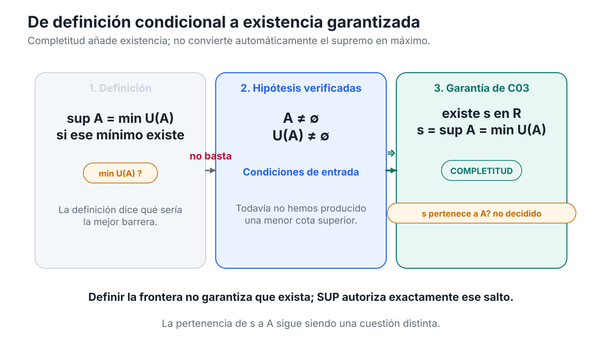
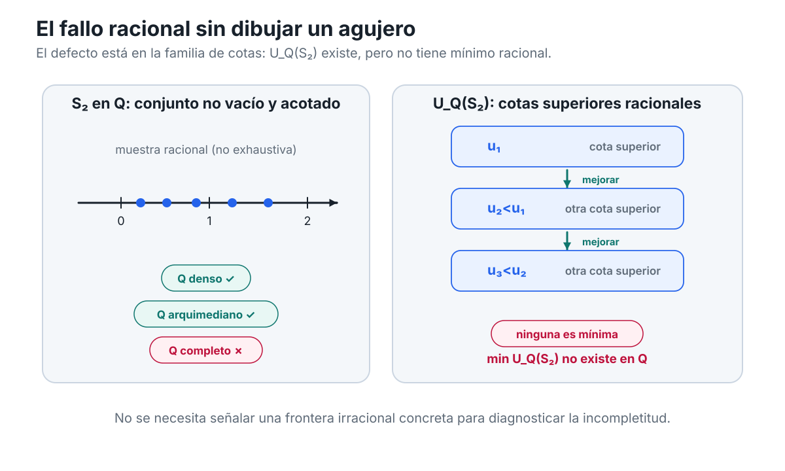
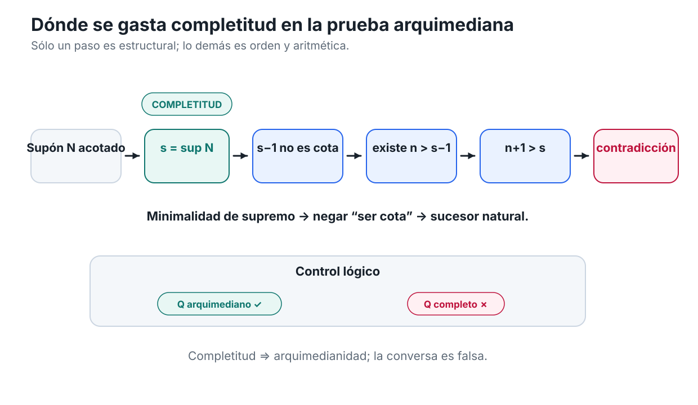
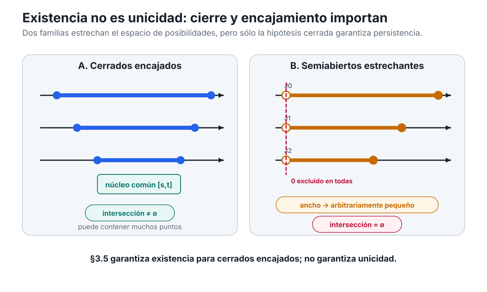
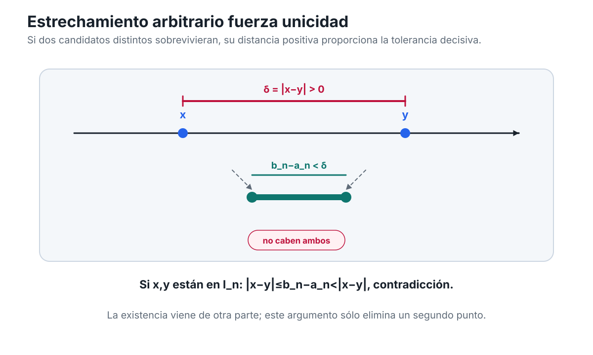
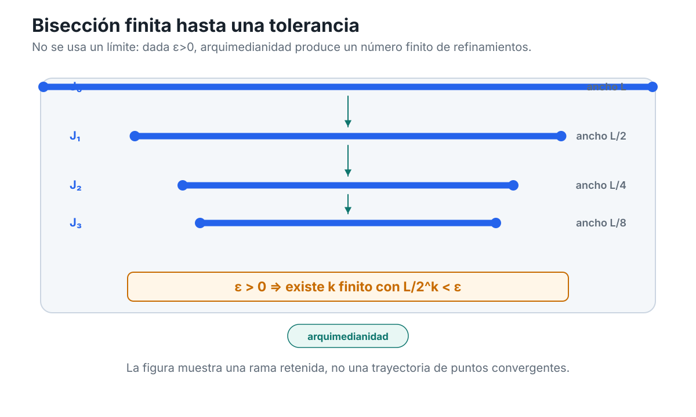
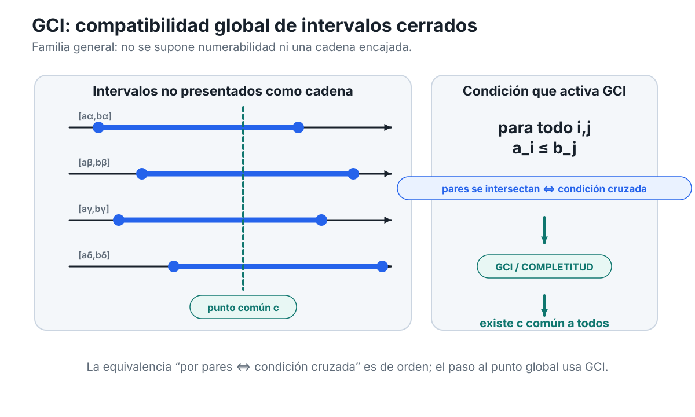
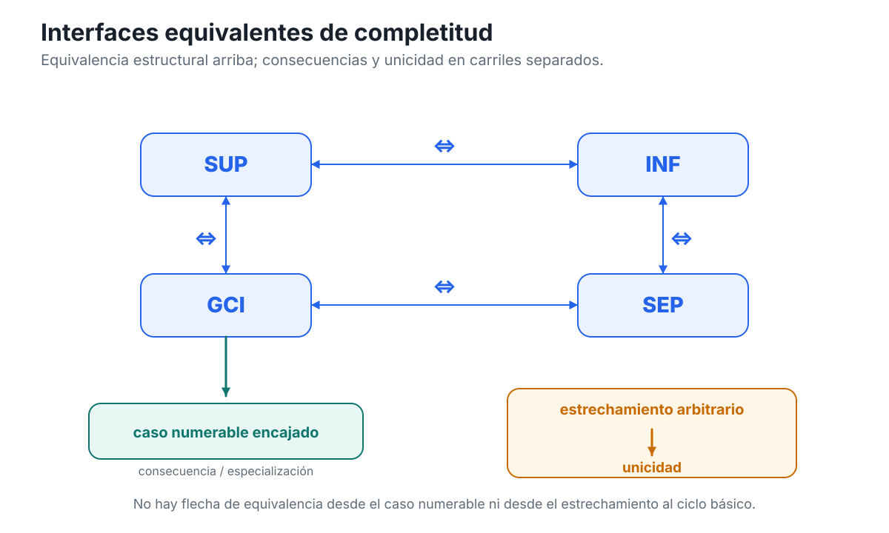

[Índice del libro](../para-matematicos/analisis-para-matematicos.md) · [Ejercicios](analisis-para-matematicos-capitulo-3-completitud-ejercicios.md) · [Soluciones](analisis-para-matematicos-capitulo-3-completitud-soluciones.md) · [Soluciones de microcontroles](analisis-para-matematicos-capitulo-3-completitud-microcontroles.md)

El capítulo anterior terminó en un punto muy preciso. Aprendimos a definir cotas, máximos, mínimos, supremos e ínfimos; aprendimos también a distinguir una barrera cualquiera de la mejor barrera posible y una barrera alcanzada de otra que no pertenece al conjunto. Pero quedó una pregunta abierta que ninguna definición puede resolver por sí sola.

Si escribimos

$$
\sup A=\min U(A),
$$

hemos dicho **qué tendría que ser** el supremo de $A$ en caso de existir. No hemos demostrado que el conjunto de cotas superiores $U(A)$ posea realmente un mínimo. Esa diferencia —entre describir un objeto y garantizar su existencia— es el punto de partida de este capítulo.

La recta real posee una propiedad adicional que permite cerrar ese hueco lógico. Esa propiedad recibe el nombre de **completitud**.

La palabra puede sugerir muchas cosas: que $\mathbb R$ tiene “todos los números”, que no le faltan puntos o que la recta dibujada parece continua. Ninguna de esas intuiciones basta como definición matemática. En análisis necesitamos algo más preciso: una afirmación que podamos usar dentro de una demostración y cuyo uso podamos localizar exactamente.

La pregunta rectora será:

> **¿Qué significa, con precisión, que la recta real no tenga huecos relevantes para el análisis?**

Y la responderemos siguiendo una idea que ya conocemos: las barreras.

C02 nos enseñó a trabajar con una familia de cotas. C03 añadirá una garantía de existencia. Más adelante veremos que esa misma garantía puede traducirse a otros lenguajes: separación, intervalos cerrados compatibles y refinamientos que conservan un punto. Por ahora no necesitamos sucesiones convergentes, compactidad ni criterios de Cauchy. Nuestro problema es anterior a todos ellos.

Conviene pensar en este capítulo como una investigación sobre **dónde aparece un objeto que el orden por sí solo no obliga a tener**.

## 3.1. El problema heredado: definir no basta

Volvamos al lenguaje de C02. Para un conjunto $A\subseteq\mathbb R$, el conjunto de sus cotas superiores es

$$
U(A)=\{u\in\mathbb R:\forall a\in A,\ a\le u\}.
$$

Si $A$ no es vacío y está acotado superiormente, entonces sabemos al menos dos cosas:

1. $A$ contiene algún elemento;
2. $U(A)$ no es vacío.

Eso todavía no implica que $U(A)$ tenga un mínimo.

Y precisamente ahí se encuentra la diferencia entre la teoría condicional del capítulo anterior y la nueva pregunta de existencia.

### Tener cotas no es tener una mejor cota

Supongamos que $A$ posee muchas cotas superiores. Podemos ordenarlas y preguntar cuáles están más cerca del conjunto. Podemos incluso escribir formalmente

$$
\sup A=\min U(A)
$$

**si ese mínimo existe**.

La cláusula final no es un detalle editorial. Es una hipótesis lógica.

Pensemos en una situación abstracta. Sabemos que

$$
U(A)\ne\varnothing.
$$

Quizá encontremos una cota $u_1$. Luego otra más pequeña $u_2<u_1$. Después otra $u_3<u_2$. Este proceso puede sugerir que las cotas se acercan a alguna frontera, pero ninguna colección de ejemplos, por larga que sea, demuestra que exista una cota mínima.

La pregunta correcta no es

> “¿podemos imaginar una barrera cada vez más ajustada?”

sino

> “¿existe dentro del sistema numérico una barrera que sea menor que todas las demás cotas superiores?”

La figura C03-F01 hace visible esta diferencia entre el estado lógico de C02 —`min U(A)?`— y la garantía de existencia que introduce C03.

{fig-alt="Tres paneles separan definición condicional, hipótesis verificadas y existencia garantizada del supremo; una etiqueta recuerda que no se decide si el supremo pertenece al conjunto."}

*Figura C03-F01. La definición describe la mejor barrera; completitud garantiza su existencia bajo las hipótesis, sin decidir si pertenece a A.*

La figura no sustituye el argumento lógico; la idea esencial sigue siendo:

> **una definición selecciona una propiedad; una completitud adecuada garantiza existencia.**

### Un contraste decisivo: $\mathbb Q$

Para entender qué está en juego conviene comparar $\mathbb R$ con un sistema muy parecido: los números racionales $\mathbb Q$.

Los racionales están ordenados. Entre dos racionales distintos siempre hay otro racional. Podemos sumar, restar, multiplicar y dividir —salvo por cero— sin salir de $\mathbb Q$. Desde muchos puntos de vista elementales, $\mathbb Q$ parece una recta numérica perfectamente rica.

Sin embargo, esa riqueza no basta para resolver todas las preguntas de existencia formuladas mediante cotas.

Consideremos el conjunto

$$
S_2=\{q\in\mathbb Q:0\le q,\ q^2<2\}.
$$

Este conjunto no es vacío, porque

$$
1\in S_2.
$$

También está acotado superiormente dentro de $\mathbb Q$. Por ejemplo, $2$ es una cota superior: si $q\ge2$, entonces $q^2\ge4>2$, de modo que ningún $q\in S_2$ puede satisfacer $q\ge2$.

Así que, trabajando sólo en $\mathbb Q$, tenemos

$$
S_2\ne\varnothing
$$

y

$$
U_{\mathbb Q}(S_2)\ne\varnothing.
$$

Hasta aquí no hay ningún problema.

El problema aparece cuando preguntamos si el conjunto de cotas superiores racionales tiene un **mínimo racional**.

La respuesta es no:

$$
\min U_{\mathbb Q}(S_2)
\quad\text{no existe en }\mathbb Q.
$$

Equivalentemente, $S_2$ no posee supremo racional.

Este hecho no debe representarse imaginando una recta racional con un agujero grande y visible. Los racionales son densos: por mucho que ampliemos una región de la recta, siempre podemos encontrar racionales entre racionales distintos. El defecto no es que falten puntos a una escala macroscópica.

El defecto es más sutil:

> hay conjuntos racionales no vacíos y acotados superiormente cuya familia de cotas superiores racionales **no tiene una menor cota superior racional**.

La figura C03-F02 representa precisamente este fenómeno: no mediante un punto irracional ya identificado, sino mostrando que $U_{\mathbb Q}(S_2)$ tiene cotas racionales mejorables y, sin embargo, ninguna de ellas es mínima.

{fig-alt="Dos paneles muestran S2 racional y una familia de cotas superiores racionales mejorables sin mínimo; Q aparece como denso y arquimediano, pero incompleto."}

*Figura C03-F02. En Q pueden existir cotas superiores racionales sin una menor cota superior racional; densidad y arquimedianidad no reparan ese defecto.*

La etiqueta «arquimediano» de la figura es una **anticipación explícita de §3.4**. No interviene en el diagnóstico de §3.1: aquí sólo usamos que la densidad de $\mathbb Q$ no garantiza la existencia de una menor cota superior racional.

### Por qué no diremos todavía “el hueco es $\sqrt2$”

Es tentador resumir el ejemplo anterior diciendo que a $\mathbb Q$ “le falta $\sqrt2$”. Esa frase puede ser intuitivamente útil más adelante, pero aquí sería lógicamente prematura.

En este momento estamos usando el ejemplo precisamente para estudiar **qué garantía de existencia distingue a $\mathbb R$ de $\mathbb Q$**. Si apeláramos desde el inicio a un número real concreto cuya existencia todavía no hemos relacionado con esa garantía, estaríamos escondiendo el problema dentro de la explicación.

Por eso formulamos el diagnóstico sólo con objetos racionales:

- el conjunto $S_2\subseteq\mathbb Q$;
- sus cotas superiores racionales;
- el hecho de que ninguna de esas cotas es la menor.

Eso basta para demostrar el defecto relevante.

Más adelante podremos interpretar dónde queda la frontera en $\mathbb R$. Pero la incompletitud de $\mathbb Q$ ya está visible antes de darle un nombre a ese punto.

### Densidad y completitud no son lo mismo

El ejemplo permite separar dos ideas que suelen confundirse.

Decir que $\mathbb Q$ es **denso** significa que, si $p<q$ son racionales, existe otro racional $r$ tal que

$$
p<r<q.
$$

Esta propiedad afirma que siempre podemos insertar nuevos puntos entre dos puntos dados.

Pero nuestro problema con $S_2$ no pregunta si podemos insertar otro racional entre dos racionales. Pregunta si una familia completa de restricciones de orden posee dentro de $\mathbb Q$ una frontera extremal requerida.

Son preguntas distintas.

Podemos resumir la diferencia así:

$$
\text{densidad}
\quad\Longrightarrow\quad
\text{hay puntos intermedios},
$$

mientras que la completitud que buscamos deberá garantizar algo del tipo

$$
\text{restricciones de orden adecuadas}
\quad\Longrightarrow\quad
\text{existe la frontera requerida dentro del sistema}.
$$

La primera afirmación puede ser verdadera y la segunda falsa. $\mathbb Q$ será nuestro ejemplo de control durante todo el capítulo.

### El problema ya está suficientemente aislado

Ya podemos formular con precisión qué falta.

En C02 aprendimos que, si un conjunto $A$ tiene supremo, entonces ese número es la menor cota superior. En C03 queremos saber cuándo podemos pasar de las hipótesis

$$
A\ne\varnothing,
\qquad
U(A)\ne\varnothing
$$

a la conclusión de que existe una frontera extremal dentro de $\mathbb R$.

Todavía no la enunciaremos formalmente como principio; ésa será la tarea de §3.2. Lo importante en este punto es reconocer que la nueva afirmación no puede extraerse sólo de la definición de supremo.

El salto lógico será de la forma

$$
\text{definición de la mejor barrera}
\quad\not\Rightarrow\quad
\text{existencia de la mejor barrera}.
$$

Necesitamos una propiedad adicional del sistema numérico.

Esa propiedad es la que llamaremos completitud de $\mathbb R$ en sentido de orden.

### Antes de seguir

1. ¿Qué información expresa la igualdad $\sup A=\min U(A)$ y qué información **no** expresa por sí sola?
2. Si $U(A)\ne\varnothing$, ¿por qué eso no obliga lógicamente a que $U(A)$ tenga un mínimo?
3. Verifica que $1\in S_2$ y que $2$ es una cota superior racional de $S_2$.
4. ¿Qué falla exactamente para $S_2$ dentro de $\mathbb Q$: la existencia de cotas superiores o la existencia de una menor cota superior racional?
5. ¿Por qué la densidad de $\mathbb Q$ no resuelve ese fallo?
6. ¿Qué tendría que añadir una propiedad de completitud para convertir la teoría condicional de C02 en una teoría de existencia?

La siguiente sección dará a esa propiedad una formulación precisa. Allí el principio del supremo dejará de aparecer como una pregunta pendiente y pasará a funcionar como la afirmación estructural que distingue, para nuestros fines, a la recta real de un sistema ordenado incompleto como $\mathbb Q$.

## 3.2. El principio del supremo

La sección anterior aisló el problema. Ahora podemos formular la propiedad que lo resuelve.

Partimos de un conjunto

$$
A\subseteq\mathbb R
$$

que satisface dos hipótesis:

1. $A\ne\varnothing$;
2. $A$ está acotado superiormente.

La segunda condición significa, como en C02, que

$$
U(A)\ne\varnothing.
$$

Hasta aquí sólo sabemos que existen cotas superiores. Lo que todavía no se deduce de las definiciones es que entre todas ellas exista una menor.

La propiedad estructural de $\mathbb R$ que añadiremos es precisamente ésa.

### El principio

Adoptaremos como **principio del supremo** la afirmación siguiente:

> **Principio del supremo.** Si $A\subseteq\mathbb R$ es no vacío y está acotado superiormente, entonces existe un número real $s$ tal que
>
> $$
> s=\sup A.
> $$

Es importante leer el enunciado sin comprimirlo demasiado.

Las hipótesis son

$$
A\subseteq\mathbb R,
\qquad
A\ne\varnothing,
\qquad
U(A)\ne\varnothing.
$$

La conclusión es una afirmación de existencia:

$$
\exists s\in\mathbb R
\qquad
s=\sup A.
$$

Y, porque en C02 ya definimos qué significa ser supremo, esta conclusión puede desplegarse como

$$
\exists s\in\mathbb R
\quad\text{tal que}\quad
\begin{cases}
\forall a\in A,\ a\le s,\\[1mm]
\forall u\in U(A),\ s\le u.
\end{cases}
$$

La primera línea dice que $s$ es una cota superior. La segunda dice que ninguna otra cota superior queda por debajo de $s$.

Por tanto, el principio no introduce una nueva definición de supremo. La definición ya existía. Lo nuevo es la garantía:

$$
\boxed{
A\ne\varnothing
\ \text{y}\ 
A\text{ acotado superiormente}
\quad\Longrightarrow\quad
\sup A\text{ existe en }\mathbb R.
}
$$

Éste es el primer lugar del libro donde la palabra **completitud** se convierte en una regla matemática operativa.

### Definición y existencia cumplen funciones distintas

Conviene mantener separadas dos afirmaciones que, escritas deprisa, pueden parecer una sola.

La definición de C02 dice:

> si $s$ es el supremo de $A$, entonces $s$ es la menor cota superior de $A$.

El principio de C03 dice:

> si $A$ es no vacío y está acotado superiormente, entonces existe ese $s$ dentro de $\mathbb R$.

La diferencia lógica es

$$
\text{caracterizar}
\qquad\neq\qquad
\text{garantizar existencia}.
$$

Una definición puede decirnos exactamente qué propiedades debe satisfacer un objeto sin obligar a que el objeto exista.

Por ejemplo, podemos describir el “mínimo de $U(A)$” mediante las condiciones que tendría que cumplir. Pero de esas condiciones no se sigue que $U(A)$ posea efectivamente un mínimo.

El principio del supremo añade justo el paso que faltaba:

$$
U(A)\ne\varnothing
\quad\text{y}\quad
A\ne\varnothing
\quad\Longrightarrow_{\text{completitud}}\quad
\min U(A)\text{ existe}.
$$

Como en C02 establecimos que

$$
\sup A=\min U(A)
$$

cuando ese mínimo existe, la formulación mediante $U(A)$ y la formulación mediante $\sup A$ expresan aquí la misma garantía.

### Por qué lo tratamos como principio estructural

Bajo la política adoptada para este libro, no intentaremos demostrar el principio del supremo a partir de los resultados de C01 y C02.

Lo tomaremos como una propiedad estructural de la recta real.

La razón no es que falte ingenio para hallar una demostración. La razón es lógica: las propiedades de orden y álgebra usadas hasta este punto no bastan, por sí solas, para producir la garantía general de existencia.

El contraste con $\mathbb Q$ ya lo mostró.

Dentro de $\mathbb Q$ podemos hablar de orden, cotas, densidad, suma y producto. Podemos definir también qué significaría que un racional fuera la menor cota superior de un conjunto racional. Sin embargo, para el conjunto

$$
S_2=\{q\in\mathbb Q:0\le q,\ q^2<2\},
$$

vimos que existen cotas superiores racionales pero no existe una menor cota superior racional.

Así que una teoría de orden puede contener la **definición** de supremo y, aun así, no satisfacer la **propiedad del supremo**.

En este capítulo, llamar a $\mathbb R$ completo en sentido de orden significará que aceptamos esta garantía de existencia para todos los subconjuntos no vacíos y acotados superiormente de $\mathbb R$.

No estamos construyendo aquí los números reales ni probando desde primeros principios que una construcción particular satisface completitud. Nuestro punto de partida es $\mathbb R$ como sistema numérico y el principio del supremo como su propiedad estructural fundamental para el análisis.

### Qué nos entrega el principio y qué no

El principio es fuerte, pero conviene no atribuirle más de lo que realmente afirma.

Si $A$ es no vacío y está acotado superiormente, obtenemos un número

$$
s=\sup A.
$$

Eso garantiza:

- que $s\in\mathbb R$;
- que $s$ es cota superior de $A$;
- que toda cota superior $u$ de $A$ satisface $s\le u$;
- que el supremo es único, por el resultado de C02.

Pero el principio **no** afirma, en general, que

$$
s\in A.
$$

Por tanto, no garantiza que $A$ tenga máximo.

Tampoco entrega una fórmula explícita para calcular $s$.

Y no dice que todo subconjunto de $\mathbb R$ tenga supremo. Las hipótesis importan.

Si

$$
A=\mathbb R,
$$

entonces $A$ no está acotado superiormente en $\mathbb R$, así que el principio no se aplica.

Si

$$
A=\varnothing,
$$

también queda fuera del enunciado.

La forma correcta de usar el principio exige verificar primero sus hipótesis.

### Primer uso: el conjunto racional visto dentro de $\mathbb R$

Volvamos a

$$
S_2=\{q\in\mathbb Q:0\le q,\ q^2<2\}.
$$

En §3.1 lo estudiamos como subconjunto de $\mathbb Q$ y vimos que no tiene supremo **racional**.

Ahora observemos que también podemos considerarlo simplemente como subconjunto de $\mathbb R$:

$$
S_2\subseteq\mathbb R.
$$

Sabemos además que

$$
S_2\ne\varnothing
$$

y que $2$ es una cota superior. Luego $S_2$ está acotado superiormente en $\mathbb R$.

Por el principio del supremo existe un número real $s$ tal que

$$
s=\sup_{\mathbb R} S_2.
$$

Ésta es una diferencia estructural concreta entre los dos sistemas:

$$
\boxed{
\sup_{\mathbb Q}S_2\text{ no existe en }\mathbb Q,
\qquad
\sup_{\mathbb R}S_2\text{ sí existe en }\mathbb R.
}
$$

Obsérvese lo que hemos ganado.

No hemos calculado $s$.

No hemos identificado todavía $s$ con ningún número concreto.

No hemos usado sucesiones.

No hemos usado límites.

La completitud nos ha proporcionado únicamente —y exactamente— la existencia de la frontera requerida dentro de $\mathbb R$.

Eso basta para el objetivo de esta sección.

### La caracterización por $\varepsilon$ cambia de estatus

En C02 demostramos que, **si** $s=\sup A$ existe y $A\ne\varnothing$, entonces

$$
\forall\varepsilon>0\;\exists a\in A
\quad\text{tal que}\quad
s-\varepsilon<a\le s.
$$

Allí la afirmación era condicional: primero suponíamos que el supremo existía y después deducíamos que ningún margen positivo podía separar completamente al conjunto de su barrera superior.

Ahora, si $A$ es no vacío y está acotado superiormente, el principio del supremo nos garantiza que existe $s=\sup A$. Por tanto podemos encadenar ambos resultados:

$$
\begin{aligned}
A\ne\varnothing,\ A\text{ acotado superiormente}
&\Longrightarrow_{\text{completitud}}
\exists s=\sup A\\
&\Longrightarrow
\forall\varepsilon>0\;\exists a\in A:
s-\varepsilon<a\le s.
\end{aligned}
$$

Es importante identificar qué parte de esta cadena usa completitud.

La existencia de $s$ sí la usa.

La conclusión con $\varepsilon$, una vez que $s$ ya existe, procede de la caracterización demostrada en C02 y no necesita una segunda aplicación de completitud.

Ésta será una regla de lectura importante durante todo el capítulo: una prueba puede contener muchos pasos, pero la completitud suele consumirse en un punto muy localizado.

### Convención de trazabilidad: señalar dónde se usa completitud

A partir de ahora, cuando una demostración dependa del principio del supremo, haremos explícito el paso exacto.

El patrón será éste:

1. construir un conjunto auxiliar $B$;
2. verificar que $B\ne\varnothing$;
3. verificar que $B$ está acotado superiormente;
4. escribir:

> **Paso de completitud.** Por el principio del supremo, existe
>
> $$
> s=\sup B.
> $$

5. continuar el argumento usando las propiedades de $s$.

La etiqueta “Paso de completitud” no añade una nueva noción matemática. Es una convención pedagógica para distinguir la **fuente de existencia** de las manipulaciones posteriores de orden, desigualdades o álgebra.

Esto nos permitirá contestar una pregunta que reaparecerá muchas veces:

> **¿qué paso del argumento dejaría de estar justificado si trabajáramos en un sistema incompleto?**

En el ejemplo de $S_2$, todas las verificaciones previas siguen siendo válidas en $\mathbb Q$:

- el conjunto no es vacío;
- hay cotas superiores racionales;
- podemos comparar cotas.

Lo que falla dentro de $\mathbb Q$ es precisamente el paso

$$
\text{“por completitud, existe }s=\sup S_2\text{”.}
$$

Así se localiza el hueco lógico.

### La figura de transición, releída

La figura C03-F01, introducida en §3.1 como puente entre C02 y C03, puede releerse ahora a la luz del principio del supremo.

Ahora podemos leer sus dos lados con precisión.

En el lado de C02 tenemos

$$
A,
\qquad
U(A),
\qquad
\min U(A)\ ?
$$

La pregunta es legítima, pero sigue abierta.

En el lado de C03 añadimos las hipótesis

$$
A\ne\varnothing,
\qquad
U(A)\ne\varnothing,
$$

y el principio del supremo autoriza el paso

$$
\exists s\in\mathbb R:
\qquad
s=\min U(A)=\sup A.
$$

La figura no debe sugerir que $s$ pertenece a $A$. Ese dato sigue sin decidirse. La completitud garantiza una frontera extremal, no que la frontera sea alcanzada.

Por eso máximo y supremo siguen siendo conceptos distintos.

### Una prueba mínima de lectura

Supongamos que $A\subseteq\mathbb R$ es no vacío y está acotado superiormente.

Queremos justificar la afirmación

$$
\forall r<\sup A\;\exists a\in A
\quad\text{tal que}\quad
r<a.
$$

Podemos escribir el argumento sin omitir el punto estructural.

**Paso 1. Existencia.** Como $A$ es no vacío y está acotado superiormente, por el principio del supremo existe

$$
s=\sup A.
$$

Éste es el único paso que usa completitud.

**Paso 2. Elegir una cota candidata menor.** Sea $r<s$.

**Paso 3. Usar minimalidad.** Como $r<s$ y $s$ es la menor cota superior, $r$ no puede ser cota superior de $A$.

**Paso 4. Negar la condición de cota superior.** Por tanto existe $a\in A$ tal que

$$
r<a.
$$

La conclusión queda demostrada.

Obsérvese la anatomía de la prueba. El principio del supremo no demuestra directamente que exista $a>r$. Primero entrega $s$. Después usamos la definición de supremo y la negación de “ser cota superior”.

Separar esos pasos evita atribuir a la completitud consecuencias que en realidad proceden del orden y de las definiciones ya establecidas.

### Una propiedad de existencia, no una técnica de cálculo

La forma del principio puede inducir una expectativa equivocada.

Podría parecer que, una vez garantizado $\sup A$, el análisis consiste en “encontrarlo”. Pero el papel fundacional de la completitud es anterior al cálculo explícito.

Muchas demostraciones futuras usarán un supremo sin disponer inicialmente de una fórmula cerrada para él. Lo esencial será saber que el objeto existe y que satisface las propiedades que lo caracterizan.

Éste es un patrón general del análisis:

$$
\text{hipótesis estructurales}
\quad\Longrightarrow\quad
\text{existencia de un objeto}
\quad\Longrightarrow\quad
\text{explotación de sus propiedades}.
$$

La completitud interviene en el primer salto.

El resto de la demostración puede ser orden, álgebra, estimaciones o argumentos locales.

### Antes de seguir

1. Separa, en el principio del supremo, las tres hipótesis escritas sobre $A$ de la conclusión de existencia.
2. ¿Por qué la definición $s=\min U(A)$ no basta para demostrar que $s$ existe?
3. Si $A$ es no vacío y está acotado superiormente, ¿qué garantiza la completitud sobre $U(A)$?
4. Explica por qué el principio del supremo no implica que $\sup A\in A$.
5. Para $S_2\subseteq\mathbb Q$, identifica el paso que falla en $\mathbb Q$ pero queda autorizado cuando consideramos $S_2\subseteq\mathbb R$.
6. En la cadena
   $$
   A\ne\varnothing,\ A\text{ acotado superiormente}
   \Longrightarrow
   s=\sup A
   \Longrightarrow
   \forall\varepsilon>0\;\exists a\in A:
   s-\varepsilon<a\le s,
   $$
   ¿qué flecha usa completitud y qué flecha usa resultados de C02?
7. ¿Por qué sería incorrecto aplicar el principio del supremo a $A=\mathbb R$ sin más?
8. En la prueba “si $r<\sup A$, entonces existe $a\in A$ con $r<a$”, localiza exactamente el único paso que depende de completitud.

Hemos obtenido la garantía superior. A partir de ahora, para todo conjunto real no vacío y acotado superiormente, la mejor barrera deja de ser una posibilidad condicional y se convierte en un objeto existente.

La siguiente cuestión será inevitable: si la completitud garantiza fronteras superiores, ¿podemos obtener de la misma propiedad una garantía correspondiente para fronteras inferiores sin introducir un segundo axioma independiente?

## 3.3. La cara dual: el principio del ínfimo

La sección anterior nos dio una garantía de existencia para fronteras superiores. Si un conjunto real es no vacío y está acotado superiormente, la completitud asegura que posee un supremo.

Pero el orden de la recta tiene dos direcciones. También podemos controlar un conjunto desde abajo, formar su familia de cotas inferiores y preguntar si existe una **mayor** cota inferior.

Sería posible introducir ahora un segundo principio independiente:

> “todo conjunto no vacío y acotado inferiormente posee ínfimo”.

No lo haremos.

La razón es que la garantía inferior ya está contenida en el principio del supremo. Para extraerla basta usar una transformación que conocemos desde C02: la reflexión

$$
A\longmapsto -A.
$$

La reflexión invierte el orden. Por eso convierte cotas inferiores en cotas superiores y permite transportar la existencia desde una dirección de la recta hacia la otra.

### Preparar la reflexión sin ocultar las hipótesis

Sea

$$
A\subseteq\mathbb R
$$

un conjunto no vacío y acotado inferiormente.

Queremos demostrar que existe

$$
\inf A.
$$

Como $A\ne\varnothing$, también

$$
-A=\{-a:a\in A\}
$$

es no vacío.

Ahora usemos la acotación inferior. Existe algún número $l\in\mathbb R$ tal que

$$
l\le a
\qquad\text{para todo }a\in A.
$$

Al multiplicar por $-1$, el sentido de la desigualdad se invierte:

$$
-a\le -l
\qquad\text{para todo }a\in A.
$$

Pero los números $-a$ son precisamente los elementos de $-A$. Por tanto,

$$
-l
$$

es una cota superior de $-A$.

Hemos verificado las dos hipótesis que necesitamos:

$$
-A\ne\varnothing,
\qquad
-A\text{ está acotado superiormente}.
$$

Sólo ahora estamos autorizados a invocar completitud.

> **Paso de completitud.** Por el principio del supremo, existe
>
> $$
> s=\sup(-A).
> $$

Éste será el único uso de completitud en la demostración. Todo lo que sigue procede del orden, de la reflexión y de la definición de supremo.

### Reflejar la mejor barrera

Definamos

$$
i=-s.
$$

Vamos a demostrar que

$$
i=\inf A.
$$

Para ello debemos verificar las dos propiedades que caracterizan al ínfimo:

1. $i$ es una cota inferior de $A$;
2. toda cota inferior de $A$ es menor o igual que $i$.

#### Paso 1. $i$ es cota inferior

Sea $a\in A$.

Entonces

$$
-a\in -A.
$$

Como $s=\sup(-A)$, el número $s$ es una cota superior de $-A$. Por tanto,

$$
-a\le s.
$$

Multiplicando otra vez por $-1$ se invierte la desigualdad:

$$
-s\le a.
$$

Pero $i=-s$, así que

$$
i\le a.
$$

Como esto vale para todo $a\in A$, concluimos que $i$ es una cota inferior de $A$.

#### Paso 2. ninguna cota inferior queda por encima de $i$

Sea $l$ una cota inferior cualquiera de $A$.

Entonces

$$
l\le a
\qquad\text{para todo }a\in A.
$$

Reflejando,

$$
-a\le -l
\qquad\text{para todo }a\in A.
$$

Así que $-l$ es una cota superior de $-A$.

Pero $s$ es la **menor** cota superior de $-A$. Luego

$$
s\le -l.
$$

Multiplicando por $-1$,

$$
l\le -s=i.
$$

Por tanto, ninguna cota inferior de $A$ puede quedar por encima de $i$.

Hemos demostrado que $i$ es la mayor cota inferior de $A$. En consecuencia,

$$
\boxed{\inf A=-\sup(-A).}
$$

Y, en particular, el ínfimo existe.

### Principio del ínfimo como teorema derivado

Podemos condensar el argumento anterior en un resultado.

> **Principio del ínfimo derivado.** Si $A\subseteq\mathbb R$ es no vacío y está acotado inferiormente, entonces existe un número real $i$ tal que
>
> $$
> i=\inf A.
> $$

La palabra **derivado** es importante.

En la arquitectura de este libro sólo adoptamos como principio estructural inicial el principio del supremo. La garantía del ínfimo no se añade como una segunda propiedad independiente de $\mathbb R$; se obtiene de la primera mediante la reflexión del orden.

La cadena lógica completa es

$$
\begin{aligned}
A\ne\varnothing,
\quad A\text{ acotado inferiormente}
&\Longrightarrow
-A\ne\varnothing,
\quad -A\text{ acotado superiormente}\\
&\Longrightarrow_{\text{completitud}}
\exists s=\sup(-A)\\
&\Longrightarrow
\exists i=-s=\inf A.
\end{aligned}
$$

La completitud se consume exactamente en la segunda flecha. Las otras dos pertenecen a la estructura del orden.

### La identidad de C02 cambia de estatus

En C02 ya habíamos demostrado, **cuando los extremos correspondientes existían**, que

$$
\sup(-A)=-\inf A.
$$

Aquella identidad era condicional. Decía cómo se relacionaban ambos extremos una vez disponibles.

Ahora podemos decir algo más fuerte.

Si $A$ es no vacío y está acotado inferiormente, entonces:

1. $-A$ es no vacío y está acotado superiormente;
2. por completitud existe $\sup(-A)$;
3. por la prueba anterior existe $\inf A$;
4. necesariamente

$$
\inf A=-\sup(-A).
$$

La misma fórmula ya no funciona sólo como comparación entre dos objetos supuestos existentes. Se convierte además en un **mecanismo de existencia**: el supremo garantizado de $-A$ produce el ínfimo de $A$.

La reflexión no crea completitud nueva. Transporta la completitud que ya tenemos.

### La otra identidad

Podemos aplicar exactamente el mismo razonamiento en la dirección opuesta.

Si $A$ es no vacío y está acotado superiormente, entonces $-A$ es no vacío y está acotado inferiormente. Como acabamos de derivar el principio del ínfimo, existe

$$
\inf(-A).
$$

Y la reflexión da

$$
\boxed{\sup A=-\inf(-A).}
$$

Así obtenemos el par de identidades

$$
\boxed{
\inf A=-\sup(-A),
\qquad
\sup A=-\inf(-A),
}
$$

siempre bajo las hipótesis que garantizan la existencia de los extremos correspondientes.

Estas fórmulas expresan una simetría real del orden: “arriba” y “abajo” no son dos teorías separadas. Una se transforma en la otra mediante $x\mapsto -x$.

### Reutilización visual: la reflexión ya estaba preparada

C02 produjo una figura para esta dualidad: `C02-F07`, donde la reflexión $x\mapsto -x$ intercambia supremo e ínfimo con cambio de signo.

En C03 no necesitamos crear un nuevo activo `C03-F03`. La misma figura recibe ahora una lectura más profunda.

En C02 la figura mostraba una relación **entre extremos que ya suponíamos existentes**.

En C03 la reflexión transporta además la **garantía de existencia**:

$$
\text{cota inferior de }A
\quad\longleftrightarrow\quad
\text{cota superior de }-A,
$$

y después

$$
\sup(-A)\text{ existe}
\quad\Longrightarrow\quad
\inf A\text{ existe}.
$$

{fig-alt="Dos rectas muestran A=[-1,4) y -A=(-4,1]. Flechas de reflexión relacionan inf A con sup(-A) y sup A con inf(-A)."}

*Figura C02-F07. La reflexión x↦−x invierte el orden y, en C03, transporta también la garantía de existencia: de sup(-A) existente obtenemos inf A=-sup(-A) sin un segundo principio de completitud.*

La figura reutilizada es geométricamente la misma que en C02; lo que cambia es la función lógica que ahora sabemos leer en ella.

### Un ejemplo unilateral

Consideremos

$$
A=(2,\infty).
$$

El conjunto no está acotado superiormente, de modo que el principio del supremo **no** puede aplicarse directamente a $A$.

Sin embargo, sí está acotado inferiormente. Por ejemplo, $2$ es una cota inferior.

Reflejemos:

$$
-A=(-\infty,-2).
$$

Este conjunto es no vacío y está acotado superiormente. Por completitud existe

$$
\sup(-A).
$$

En este caso concreto, por la teoría elemental de C02 podemos identificar directamente

$$
\sup(-A)=-2.
$$

Por tanto,

$$
\inf A=-\sup(-A)=2.
$$

El ejemplo muestra algo importante: la garantía inferior no exige que $A$ esté acotado por ambos lados. Basta la hipótesis adecuada a la dirección que estamos estudiando.

La completitud actúa de manera **unilateral**:

- acotación superior + no vaciedad garantiza supremo;
- acotación inferior + no vaciedad garantiza ínfimo.

No debemos fortalecer las hipótesis sin necesidad.

### ¿Necesitamos realmente los dos principios?

Ahora podemos formular una pregunta estructural más precisa.

Supongamos que olvidamos por un momento cuál de los dos principios elegimos como punto de partida.

Tenemos dos afirmaciones:

**SUP**

> Todo subconjunto no vacío de $\mathbb R$ acotado superiormente posee supremo.

**INF**

> Todo subconjunto no vacío de $\mathbb R$ acotado inferiormente posee ínfimo.

Acabamos de demostrar

$$
\mathrm{SUP}\Longrightarrow\mathrm{INF}.
$$

Pero la reflexión permite demostrar también la implicación inversa.

Supongamos que aceptáramos **INF** como principio inicial. Sea $A\subseteq\mathbb R$ no vacío y acotado superiormente.

Entonces $-A$ es no vacío y está acotado inferiormente. Por **INF** existe

$$
j=\inf(-A).
$$

Definimos

$$
s=-j.
$$

El mismo argumento reflejado demuestra que $s$ es la menor cota superior de $A$. Luego

$$
s=\sup A.
$$

Por tanto,

$$
\mathrm{INF}\Longrightarrow\mathrm{SUP}.
$$

Juntando ambas direcciones,

$$
\boxed{\mathrm{SUP}\Longleftrightarrow\mathrm{INF}.}
$$

Ésta es una equivalencia lógica de formulaciones de completitud en sentido de orden.

No significa que en nuestro desarrollo hayamos postulado ambas. Significa que cualquiera de las dos, tomada como principio, permite recuperar la otra.

### Equivalencia no significa duplicación

Este punto es metodológicamente útil.

Cuando dos formulaciones son equivalentes, podemos escoger una como base y demostrar la otra. Eso evita inflar innecesariamente el sistema de hipótesis.

En nuestro caso la elección fue:

$$
\text{principio básico: SUP},
$$

seguido de

$$
\text{teorema derivado: INF}.
$$

La razón de la elección es editorial y estructural: C02 terminó formulando el problema general mediante cotas superiores y supremos, de modo que C03 continúa desde ese punto. Pero matemáticamente la completitud no favorece una dirección de la recta.

La reflexión muestra que ambas direcciones contienen la misma información estructural.

### Una prueba mínima de trazabilidad inferior

Veamos cómo cambia ahora una demostración típica.

Supongamos que $A\subseteq\mathbb R$ es no vacío y está acotado inferiormente. Queremos justificar que, si

$$
r>\inf A,
$$

entonces existe $a\in A$ tal que

$$
a<r.
$$

Podemos separar los pasos.

**Paso 1. Existencia.** Como $A$ es no vacío y está acotado inferiormente, el principio del ínfimo derivado garantiza que existe

$$
i=\inf A.
$$

Si abrimos la caja negra, este paso contiene exactamente una aplicación del principio del supremo a $-A$.

**Paso 2. Elegir una cota candidata mayor.** Sea $r>i$.

**Paso 3. Usar maximalidad.** Como $i$ es la mayor cota inferior, $r$ no puede ser cota inferior de $A$.

**Paso 4. Negar la condición de cota inferior.** Por tanto existe $a\in A$ tal que

$$
a<r.
$$

Otra vez, la completitud no produce directamente el testigo $a$. Produce el extremo $i$. La existencia del elemento que atraviesa una barrera candidata procede después de la maximalidad del ínfimo y de la negación de “ser cota inferior”.

Esta anatomía es la imagen especular de la prueba final de §3.2.

### La caracterización por $\varepsilon$ también se dualiza

C02 demostró que, si $A\ne\varnothing$ y $i=\inf A$, entonces

$$
\forall\varepsilon>0\;\exists a\in A
\quad\text{tal que}\quad
i\le a<i+\varepsilon.
$$

Ahora la existencia de $i$ está garantizada siempre que $A$ sea no vacío y esté acotado inferiormente.

Por tanto podemos escribir la cadena completa:

$$
\begin{aligned}
A\ne\varnothing,
\ A\text{ acotado inferiormente}
&\Longrightarrow_{\text{completitud}}
\exists i=\inf A\\
&\Longrightarrow
\forall\varepsilon>0\;\exists a\in A:
i\le a<i+\varepsilon.
\end{aligned}
$$

La primera flecha usa completitud —a través de la reflexión y del principio del supremo—. La segunda usa únicamente la caracterización del ínfimo ya demostrada en C02.

Así queda perfectamente simétrica la pareja:

$$
\begin{array}{c@{\qquad}c}
\text{supremo} & \text{ínfimo}\\[1mm]
A\ne\varnothing & A\ne\varnothing\\
A\text{ acotado superiormente} & A\text{ acotado inferiormente}\\
\exists\sup A & \exists\inf A\\
\forall\varepsilon>0\;\exists a:\sup A-\varepsilon<a\le\sup A
&
\forall\varepsilon>0\;\exists a:\inf A\le a<\inf A+\varepsilon.
\end{array}
$$

La simetría no reemplaza las hipótesis; ayuda a verlas.

### Qué hemos ganado exactamente

Al terminar §3.2 teníamos una garantía superior.

Al terminar esta sección tenemos dos resultados adicionales:

$$
\boxed{
A\ne\varnothing,
\quad A\text{ acotado inferiormente}
\Longrightarrow
\inf A\text{ existe en }\mathbb R,
}
$$

y

$$
\boxed{\mathrm{SUP}\Longleftrightarrow\mathrm{INF}.}
$$

Además, las identidades de reflexión quedan disponibles con existencia garantizada bajo las hipótesis apropiadas:

$$
\boxed{
\inf A=-\sup(-A),
\qquad
\sup A=-\inf(-A).
}
$$

Nada de esto requiere sucesiones, límites, compactidad ni completitud métrica.

Toda la sección se apoya en cuatro piezas ya disponibles:

1. el principio del supremo;
2. la inversión del orden bajo $x\mapsto -x$;
3. las definiciones de supremo e ínfimo;
4. la dualidad preparada en C02.

### Antes de seguir

1. Si $A$ es no vacío y está acotado inferiormente, ¿por qué $-A$ está acotado superiormente?
2. En la prueba de existencia de $\inf A$, ¿cuál es exactamente el **Paso de completitud**?
3. Si $s=\sup(-A)$, demuestra sin omitir la inversión de desigualdades que $-s$ es una cota inferior de $A$.
4. Si $l$ es una cota inferior cualquiera de $A$, ¿por qué $-l$ es una cota superior de $-A$ y cómo conduce eso a $l\le -s$?
5. Explica por qué la identidad $\inf A=-\sup(-A)$ cumple ahora una función de existencia que no tenía en C02.
6. Demuestra la implicación `INF ⇒ SUP` usando sólo la reflexión.
7. ¿Por qué `SUP ⇔ INF` no significa que hayamos adoptado dos axiomas independientes?
8. Para $A=(2,\infty)$, identifica qué principio puede aplicarse, qué reflejo conviene estudiar y cuál es el ínfimo.
9. En la cadena que conduce a la caracterización $\varepsilon$ del ínfimo, distingue el paso que usa completitud del paso que usa C02.

La completitud de orden ya puede leerse desde ambas direcciones de la recta. Podemos garantizar la frontera superior de un conjunto acotado por arriba y la frontera inferior de uno acotado por abajo, sin duplicar nuestras hipótesis estructurales.

La siguiente pregunta cambiará de naturaleza. En vez de buscar otra formulación dual, usaremos la completitud para demostrar una propiedad aritmética decisiva de $\mathbb R$: que los números naturales no pueden quedar encerrados bajo una barrera real.

## 3.4. Una consecuencia decisiva: la propiedad arquimediana

Hasta aquí la completitud ha aparecido como una garantía de existencia para barreras extremales. Ahora veremos que esa garantía tiene una consecuencia aritmética muy concreta: los números naturales no pueden quedar todos por debajo de una misma barrera real.

La afirmación parece familiar. Intuitivamente esperamos que, dado cualquier número real $x$, siempre podamos encontrar un natural mayor. Pero en este capítulo no queremos tratar esa expectativa como una evidencia informal. Queremos saber **de qué propiedad estructural de $\mathbb R$ depende**.

La respuesta será precisa: la propiedad arquimediana se deduce del principio del supremo.

### El resultado central

Diremos que $\mathbb R$ satisface la **propiedad arquimediana** cuando

$$
\forall x\in\mathbb R\;\exists n\in\mathbb N
\quad\text{tal que}\quad
n>x.
$$

Esta formulación es equivalente a decir que $\mathbb N$ no está acotado superiormente en $\mathbb R$.

En efecto, si $\mathbb N$ tuviera una cota superior $M\in\mathbb R$, entonces ningún natural podría satisfacer $n>M$. Recíprocamente, si existiera algún real $M$ tal que ningún natural fuera mayor que $M$, entonces $M$ sería una cota superior de $\mathbb N$.

Así que podemos concentrarnos en demostrar:

> **Teorema.** El conjunto $\mathbb N$ no está acotado superiormente en $\mathbb R$.

La demostración será por contradicción y nos permitirá localizar con exactitud el único punto donde interviene la completitud.

### Suponer una barrera para los naturales

Supongamos, buscando una contradicción, que $\mathbb N$ sí está acotado superiormente en $\mathbb R$.

Como $\mathbb N$ no es vacío, las hipótesis del principio del supremo quedarían satisfechas.

Por tanto podemos escribir:

> **Paso de completitud.** Bajo la hipótesis de que $\mathbb N$ está acotado superiormente, existe
>
> $$
> s=\sup\mathbb N.
> $$

Éste es el único paso de la prueba que usa completitud.

A partir de aquí trabajaremos sólo con la minimalidad del supremo, el orden y la aritmética elemental.

### Bajar una unidad desde el supremo

Como

$$
s-1<s,
$$

el número $s-1$ no puede ser una cota superior de $\mathbb N$.

¿Por qué?

Porque $s$ es la **menor** cota superior. Si $s-1$ también fuera cota superior, tendríamos una cota superior estrictamente menor que $s$, contradiciendo la definición de supremo.

Negar que $s-1$ sea cota superior significa que existe algún natural $n$ tal que

$$
n>s-1.
$$

Sumando $1$ a ambos lados,

$$
n+1>s.
$$

Pero $n\in\mathbb N$ implica

$$
n+1\in\mathbb N.
$$

Y esto contradice que $s$ sea una cota superior de $\mathbb N$.

La contradicción muestra que nuestra suposición inicial era imposible.

Por tanto,

$$
\boxed{\mathbb N\text{ no está acotado superiormente en }\mathbb R.}
$$

Ésta es la propiedad arquimediana en la forma que necesitaremos.

### Anatomía lógica de la demostración

Conviene escribir la estructura de la prueba sin abreviarla:

$$
\begin{aligned}
\mathbb N\text{ acotado superiormente}
&\Longrightarrow_{\text{completitud}}
\exists s=\sup\mathbb N\\
&\Longrightarrow
s-1\text{ no es cota superior}\\
&\Longrightarrow
\exists n\in\mathbb N:\ n>s-1\\
&\Longrightarrow
n+1>s\\
&\Longrightarrow
\text{contradicción}.
\end{aligned}
$$

Sólo la primera flecha consume completitud.

Las demás dependen de:

- la minimalidad del supremo;
- la negación de la definición de cota superior;
- la estabilidad de $\mathbb N$ bajo $n\mapsto n+1$;
- las reglas elementales del orden.

Esta separación es importante. La completitud no dice directamente que los naturales sean ilimitados. Lo que hace es permitirnos formar el supuesto supremo de $\mathbb N$ bajo una hipótesis contradictoria. Una vez que ese objeto existe, la aritmética de los naturales destruye la posibilidad de que sea realmente una cota superior.

La figura C03-F04 representa exactamente esta anatomía: un único distintivo de **COMPLETITUD** sobre el paso $s=\sup\mathbb N$ y, después, sólo orden y aritmética.

{fig-alt="Cadena lógica desde suponer N acotado hasta la contradicción n+1>s; sólo el nodo s=sup N lleva la marca COMPLETITUD."}

*Figura C03-F04. La completitud se usa una sola vez para producir s=sup N bajo la hipótesis contradictoria; el resto es orden y aritmética.*

### La formulación cuantificada

Del teorema obtenemos inmediatamente la forma más habitual de la propiedad arquimediana:

$$
\boxed{
\forall x\in\mathbb R\;\exists n\in\mathbb N
\quad\text{tal que}\quad
n>x.
}
$$

La deducción es directa.

Sea $x\in\mathbb R$ cualquiera. Como $\mathbb N$ no está acotado superiormente, $x$ no puede ser una cota superior de $\mathbb N$. Por la negación de la condición de cota superior, existe entonces algún $n\in\mathbb N$ con

$$
n>x.
$$

Obsérvese que aquí ya no usamos otra vez completitud. La completitud fue necesaria para establecer una vez por todas que $\mathbb N$ no puede estar acotado superiormente. La formulación cuantificada se obtiene después por lógica de cotas.

### Escalas recíprocas arbitrariamente pequeñas

La propiedad arquimediana tiene una consecuencia que será especialmente útil para los refinamientos de las secciones siguientes.

Sea

$$
\varepsilon>0.
$$

Entonces

$$
\frac{1}{\varepsilon}\in\mathbb R.
$$

Por la propiedad arquimediana existe $n\in\mathbb N$ tal que

$$
n>\frac{1}{\varepsilon}.
$$

Como $1/\varepsilon>0$, necesariamente $n>0$. Por tanto podemos tomar recíprocos. Para números positivos, invertir revierte el orden, de modo que

$$
\frac{1}{n}<\varepsilon.
$$

Hemos demostrado:

$$
\boxed{
\forall\varepsilon>0\;\exists n\in\mathbb N_{>0}
\quad\text{tal que}\quad
\frac{1}{n}<\varepsilon.
}
$$

Esta afirmación dice que, dada cualquier tolerancia positiva, podemos encontrar una escala recíproca natural más pequeña que ella.

La implicación también puede leerse al revés. Supongamos que sabemos que, para todo $\varepsilon>0$, existe $n\in\mathbb N_{>0}$ con $1/n<\varepsilon$. Si $x>0$, tomamos $\varepsilon=1/x$. Entonces existe $n>0$ tal que

$$
\frac{1}{n}<\frac{1}{x}.
$$

Como $n$ y $x$ son positivos, al invertir otra vez la desigualdad obtenemos

$$
n>x.
$$

Si $x\le0$, cualquier natural positivo ya satisface $n>x$. Por tanto, la existencia de recíprocos arbitrariamente pequeños recupera la formulación arquimediana.

No estamos afirmando todavía que una sucesión converja.

No hemos escrito

$$
\frac{1}{n}\longrightarrow0.
$$

Ese lenguaje pertenece a capítulos posteriores.

Lo que hemos demostrado es una afirmación puramente cuantificada:

> **para cada tolerancia positiva existe algún natural suficientemente grande cuyo recíproco queda por debajo de esa tolerancia.**

Ésta es exactamente la forma que necesitaremos para justificar refinamientos finitos tan estrechos como queramos.

### Por qué esta consecuencia será útil

Supongamos, por ejemplo, que queremos obtener una longitud menor que una tolerancia $\varepsilon>0$ a partir de una longitud fija $L>0$.

La propiedad arquimediana permite elegir $n\in\mathbb N$ con

$$
n>\frac{L}{\varepsilon}.
$$

Entonces

$$
\frac{L}{n}<\varepsilon.
$$

El patrón es importante:

$$
\text{tolerancia dada}
\quad\Longrightarrow\quad
\text{natural suficientemente grande}
\quad\Longrightarrow\quad
\text{escala suficientemente pequeña}.
$$

En §3.6 aplicaremos esta idea a refinamientos por bisección, pero no necesitamos anticipar ahora ni sucesiones ni límites. Basta la existencia de un número finito de pasos adecuado a la tolerancia elegida.

### Arquimedianidad no es completitud

Llegados aquí aparece una posible confusión.

Hemos demostrado

$$
\text{completitud}
\quad\Longrightarrow\quad
\text{propiedad arquimediana}.
$$

Pero de esto **no** se sigue que ambas propiedades sean equivalentes.

El ejemplo de control es otra vez $\mathbb Q$.

Los racionales son arquimedianos: dado cualquier $q\in\mathbb Q$, la propiedad arquimediana de $\mathbb R$ proporciona un natural $n$ con

$$
n>q,
$$

y tanto $n$ como $q$ pertenecen a $\mathbb Q$.

Sin embargo, §3.1 mostró que $\mathbb Q$ no es completo. El conjunto

$$
S_2=\{q\in\mathbb Q:0\le q,\ q^2<2\}
$$

es no vacío y acotado superiormente en $\mathbb Q$, pero carece de supremo racional.

Por tanto,

$$
\boxed{
\mathbb Q:\quad
\text{arquimediano}\ \checkmark,
\qquad
\text{completo}\ \times.
}
$$

Así que la relación correcta es unilateral:

$$
\boxed{
\text{completitud}
\Longrightarrow
\text{arquimedianidad},
\qquad
\text{pero no recíprocamente}.
}
$$

Esta distinción será importante más adelante. Una propiedad puede ser una consecuencia muy potente de la completitud sin contener toda la información de la completitud.

### Qué fallaría sin completitud

La prueba del teorema nos permite responder otra vez nuestra pregunta de trazabilidad.

Supongamos que trabajáramos en un sistema ordenado donde conocemos la aritmética de los naturales pero no disponemos del principio del supremo.

Podríamos plantear por contradicción la hipótesis de que $\mathbb N$ está acotado superiormente.

Podríamos hablar de cotas superiores.

Podríamos observar que, **si** existiera un supremo $s$, entonces $s-1$ no sería cota superior y obtendríamos la contradicción.

Pero sin una propiedad de completitud no tendríamos derecho a pasar de

$$
\mathbb N\ne\varnothing,
\qquad
\mathbb N\text{ acotado superiormente}
$$

a

$$
\exists s=\sup\mathbb N.
$$

El hueco lógico está exactamente ahí.

Ésa es la utilidad de marcar el **Paso de completitud**: permite distinguir lo que el argumento sabe hacer por orden y aritmética de lo que necesita como infraestructura de existencia.

### Tres formulaciones que usaremos

Podemos conservar tres versiones equivalentes de la propiedad arquimediana para uso práctico en este libro:

1. $\mathbb N$ no está acotado superiormente en $\mathbb R$;
2. para todo $x\in\mathbb R$ existe $n\in\mathbb N$ con $n>x$;
3. para todo $\varepsilon>0$ existe $n\in\mathbb N_{>0}$ con
   $$
   \frac{1}{n}<\varepsilon.
   $$

La primera es la forma que surgió naturalmente de la prueba por supremo.

La segunda expresa que los naturales pueden superar cualquier barrera real propuesta.

La tercera convierte esa posibilidad de crecer en la existencia de escalas positivas arbitrariamente pequeñas.

En las secciones siguientes, la tercera forma será especialmente conveniente para controlar tamaños sin introducir todavía una teoría de convergencia.

### Antes de seguir

1. ¿Por qué la hipótesis “$\mathbb N$ está acotado superiormente” permite invocar el principio del supremo?
2. En la prueba de arquimedianidad, ¿cuál es exactamente el único **Paso de completitud**?
3. ¿Por qué $s-1$ no puede ser una cota superior si $s=\sup\mathbb N$?
4. Explica cuidadosamente cómo la negación de “$s-1$ es cota superior” produce un natural $n$ con $n>s-1$.
5. ¿Dónde se usa que $n+1$ vuelve a pertenecer a $\mathbb N$?
6. Demuestra que “$\mathbb N$ no está acotado superiormente” equivale a “para todo $x\in\mathbb R$ existe $n\in\mathbb N$ con $n>x$”.
7. Dado $\varepsilon>0$, justifica cada paso de la deducción
   $$
   n>\frac{1}{\varepsilon}
   \quad\Longrightarrow\quad
   \frac{1}{n}<\varepsilon.
   $$
8. ¿Por qué la afirmación $\forall\varepsilon>0\;\exists n:1/n<\varepsilon$ no necesita todavía el lenguaje de convergencia?
9. ¿Qué muestra $\mathbb Q$ acerca de la conversa “arquimediano $\Rightarrow$ completo”?
10. En una prueba futura que use $1/n<\varepsilon$, ¿qué dependencia estructural queda escondida detrás de esa elección de $n$?

Hemos obtenido de la completitud una herramienta aritmética decisiva: siempre podemos superar una barrera real con un natural y, equivalentemente, encontrar escalas recíprocas tan pequeñas como exija una tolerancia positiva.

La siguiente sección utilizará nuevamente el principio del supremo, pero ahora en un contexto geométrico: una familia de intervalos cerrados encajados conservará al menos un punto común aun cuando las restricciones se vayan refinando.

## 3.5. Intervalos encajados: conservar un punto al refinar

La sección anterior nos dio una herramienta para hacer escalas tan pequeñas como necesitemos. Antes de usarla para forzar unicidad, estudiaremos una cuestión más básica: **existencia**.

Supongamos que imponemos una restricción cerrada sobre la recta y después la refinamos, una y otra vez, sin perder compatibilidad. ¿Puede ocurrir que cada etapa individual sea posible y, sin embargo, al considerar todas las restricciones juntas no quede ningún punto real que las satisfaga?

La completitud responderá que, para una familia numerable de intervalos cerrados encajados, eso no ocurre.

### El objeto: una familia de intervalos cerrados encajados

Consideremos intervalos

$$
I_n=[a_n,b_n],
\qquad n\in\mathbb N_{>0},
$$

todos no vacíos, y supongamos que

$$
I_{n+1}\subseteq I_n
\qquad\text{para todo }n\in\mathbb N_{>0}.
$$

Decir que $I_n$ es no vacío significa que

$$
a_n\le b_n.
$$

Decir que los intervalos están encajados significa que cada nueva restricción queda contenida en la anterior:

$$
I_1\supseteq I_2\supseteq I_3\supseteq\cdots.
$$

No afirmamos que los intervalos se vuelvan arbitrariamente pequeños. Tampoco suponemos que sus extremos se aproximen a un único punto. Ésa será una cuestión distinta, reservada para §3.6.

Por ahora preguntamos sólo si

$$
\bigcap_{n=1}^{\infty} I_n
$$

es vacío o no.

### Qué información conserva el encajamiento

La inclusión

$$
I_{n+1}\subseteq I_n
$$

obliga a que los extremos izquierdos no retrocedan y los derechos no avancen.

En efecto, como

$$
a_{n+1}\in I_{n+1}\subseteq I_n=[a_n,b_n],
$$

tenemos

$$
a_n\le a_{n+1}.
$$

Y como

$$
b_{n+1}\in I_{n+1}\subseteq I_n,
$$

tenemos

$$
b_{n+1}\le b_n.
$$

Por tanto,

$$
a_1\le a_2\le a_3\le\cdots
$$

y

$$
b_1\ge b_2\ge b_3\ge\cdots.
$$

Estas cadenas son consecuencias del encajamiento. No las leeremos todavía como sucesiones convergentes; aquí sólo registran relaciones de orden entre extremos.

Hay una consecuencia todavía más importante.

> **Compatibilidad cruzada.** Para cualesquiera $m,n\in\mathbb N_{>0}$,
> $$
> a_m\le b_n.
> $$

Demostrémosla sin saltos.

Si $m\le n$, entonces por la monotonía de los extremos izquierdos,

$$
a_m\le a_n,
$$

y, como $I_n$ es no vacío,

$$
a_n\le b_n.
$$

Por transitividad,

$$
a_m\le b_n.
$$

Si $m>n$, entonces el encajamiento iterado da

$$
I_m\subseteq I_n.
$$

Como $a_m\in I_m$, también

$$
a_m\in I_n=[a_n,b_n],
$$

y por tanto otra vez

$$
a_m\le b_n.
$$

Así, cada extremo derecho $b_n$ queda a la derecha de **todos** los extremos izquierdos.

Ésta será la relación de orden que permita activar completitud.

### Construir el conjunto al que aplicaremos el supremo

Formemos el conjunto de extremos izquierdos

$$
A=\{a_n:n\in\mathbb N_{>0}\}.
$$

Antes de escribir $\sup A$ debemos verificar las hipótesis del principio del supremo.

Primero, $A$ no es vacío, porque

$$
a_1\in A.
$$

Segundo, $A$ está acotado superiormente.

Para verlo, fijemos un índice $n$. La compatibilidad cruzada demostrada arriba nos dice que

$$
a_m\le b_n
\qquad\text{para todo }m\in\mathbb N_{>0}.
$$

Pero los elementos de $A$ son precisamente los números $a_m$. Por tanto,

$$
b_n
$$

es una cota superior de $A$.

De hecho, hemos probado algo más fuerte:

$$
\boxed{
\text{cada }b_n\text{ es una cota superior de }A.
}
$$

En particular, existe al menos una cota superior, por ejemplo $b_1$.

Ya están verificadas las dos hipótesis necesarias:

$$
A\ne\varnothing,
\qquad
A\text{ está acotado superiormente}.
$$

Ahora, y sólo ahora, usamos completitud.

> **Paso de completitud.** Por el principio del supremo, existe
>
> $$
> x=\sup A.
> $$

Éste es el único paso de la demostración donde consumimos completitud.

### Probar que el supremo pertenece a todos los intervalos

Queremos demostrar que

$$
x\in I_n
\qquad\text{para todo }n.
$$

Como

$$
I_n=[a_n,b_n],
$$

esto equivale a demostrar simultáneamente

$$
a_n\le x\le b_n.
$$

Fijemos un índice $n$ cualquiera.

#### La desigualdad izquierda

Como

$$
a_n\in A
$$

y $x=\sup A$ es una cota superior de $A$, tenemos

$$
a_n\le x.
$$

Aquí no usamos nuevamente completitud. Usamos una propiedad incluida en la definición de supremo: el supremo es cota superior.

#### La desigualdad derecha

Ya demostramos que $b_n$ es una cota superior de $A$.

Como $x=\sup A$ es la **menor** cota superior de $A$, debe satisfacer

$$
x\le b_n.
$$

Tampoco aquí aparece una segunda aplicación de completitud. Una vez existente $x$, esta desigualdad procede de la minimalidad del supremo.

Juntando las dos desigualdades,

$$
a_n\le x\le b_n.
$$

Por tanto,

$$
x\in[a_n,b_n]=I_n.
$$

Y como $n$ era arbitrario,

$$
x\in I_n
\qquad\text{para todo }n\in\mathbb N_{>0}.
$$

En consecuencia,

$$
\boxed{
 x\in\bigcap_{n=1}^{\infty}I_n.
}
$$

Así hemos demostrado el resultado central de esta sección.

> **Teorema de intervalos cerrados encajados — forma numerable.** Si
> $$
> I_n=[a_n,b_n]
> $$
> es una familia numerable de intervalos cerrados no vacíos y
> $$
> I_{n+1}\subseteq I_n
> $$
> para todo $n$, entonces
> $$
> \bigcap_{n=1}^{\infty}I_n\ne\varnothing.
> $$

### Anatomía lógica de la prueba

Conviene condensar el argumento sin borrar sus dependencias:

$$
\begin{aligned}
I_{n+1}\subseteq I_n
&\Longrightarrow
\forall m,n:\ a_m\le b_n\\
&\Longrightarrow
A=\{a_n\}\ne\varnothing
\text{ y }A\text{ acotado superiormente}\\
&\Longrightarrow_{\text{completitud}}
\exists x=\sup A\\
&\Longrightarrow
\forall n:\ a_n\le x\le b_n\\
&\Longrightarrow
x\in\bigcap_{n=1}^{\infty}I_n.
\end{aligned}
$$

La tercera flecha —la existencia de $x=\sup A$— es el único gasto de completitud.

Todo lo demás usa:

- inclusión de intervalos;
- orden de los extremos;
- definición de cota superior;
- las dos propiedades características del supremo.

No usamos convergencia de $(a_n)$.

No usamos convergencia de $(b_n)$.

No usamos Bolzano–Weierstrass.

No usamos compactidad.

La prueba es anterior a todos esos resultados.

### Qué representa el punto $x$

Es importante no interpretar la construcción más allá de lo demostrado.

El número

$$
x=\sup\{a_n:n\ge1\}
$$

no ha aparecido como “límite de los extremos izquierdos”. En este capítulo todavía no necesitamos esa lectura.

Ha aparecido por otra vía:

1. los extremos izquierdos forman un conjunto real no vacío;
2. los extremos derechos suministran cotas superiores compatibles;
3. la completitud produce una frontera extremal $x$;
4. la propia estructura de las cotas obliga a que esa frontera quede dentro de cada intervalo.

La existencia del punto común es, por tanto, una consecuencia directa de completitud de orden.

### Por qué importa que los intervalos sean cerrados

La prueba terminó obteniendo

$$
a_n\le x\le b_n.
$$

Esas desigualdades permiten concluir

$$
x\in[a_n,b_n]
$$

precisamente porque los extremos están incluidos.

Con intervalos abiertos, el mismo tipo de control no bastaría.

Consideremos, por ejemplo,

$$
J_n=\left(0,\frac1n\right),
\qquad n\in\mathbb N_{>0}.
$$

Cada $J_n$ es no vacío y

$$
J_{n+1}\subseteq J_n.
$$

Sin embargo,

$$
\bigcap_{n=1}^{\infty}J_n=\varnothing.
$$

Podemos justificarlo sin usar convergencia.

Si un número $x$ perteneciera a todos los $J_n$, necesariamente $x>0$. Por la propiedad arquimediana demostrada en §3.4, existe $n$ tal que

$$
\frac1n<x.
$$

Pero entonces

$$
x\notin\left(0,\frac1n\right),
$$

contradicción.

Por tanto no hay ningún punto común.

Este ejemplo muestra que “encajado” y “no vacío en cada etapa” no bastan por sí solos. El cierre de los intervalos es una parte real de la hipótesis del teorema.

### Existencia no significa unicidad

Hay otra inferencia que debemos evitar.

El teorema demuestra

$$
\bigcap_{n=1}^{\infty}I_n\ne\varnothing.
$$

No demuestra que la intersección contenga exactamente un punto.

Por ejemplo, si

$$
I_n=[0,1]
\qquad\text{para todo }n,
$$

entonces los intervalos son cerrados, no vacíos y encajados, pero

$$
\bigcap_{n=1}^{\infty}I_n=[0,1].
$$

La intersección contiene infinitos puntos.

Así que debemos separar dos preguntas:

$$
\text{¿queda al menos un punto?}
$$

y

$$
\text{¿queda un único punto?}
$$

La primera queda resuelta en esta sección mediante completitud.

La segunda requerirá una hipótesis adicional de estrechamiento y será el problema de §3.6.

La figura C03-F06 hace visible esta distinción: una cadena de intervalos cerrados encajados puede conservar un núcleo común no degenerado, mientras una familia semiabierta puede estrecharse y perder todo punto común.

{fig-alt="Dos paneles contrastan cerrados encajados con núcleo no degenerado y semiabiertos estrechantes con intersección vacía."}

*Figura C03-F06. Los intervalos cerrados encajados garantizan existencia pero no unicidad; una familia semiabierta puede estrecharse y aun así perder todo punto común.*

### El estatus lógico de este teorema

Conviene registrar una precisión que será importante en §3.7.

El teorema que acabamos de demostrar es el **caso numerable de intervalos cerrados encajados**. En este libro lo usamos como consecuencia concreta y visualmente útil de la completitud.

No afirmaremos aquí que esta formulación numerable, tomada sin más, sea la formulación intervalar general equivalente al principio del supremo.

Más adelante introduciremos una propiedad más general basada en una familia de intervalos cerrados cuyos extremos satisfacen una condición cruzada. Esa formulación sí entrará en la cadena estructural de equivalencias de completitud.

La compatibilidad cruzada que apareció en nuestra prueba,

$$
a_m\le b_n
\qquad\text{para todos }m,n,
$$

es una primera señal de esa estructura general, pero no adelantaremos todavía su teoría completa.

La figura C03-F05 aparecerá en §3.7, donde la formulación general podrá compararse con este caso numerable; aquí basta registrar la condición cruzada que la prepara.

### Qué hemos ganado exactamente

Al finalizar esta sección tenemos una nueva consecuencia directa de completitud:

$$
\boxed{
\begin{gathered}
I_n=[a_n,b_n]\ne\varnothing,\\
I_{n+1}\subseteq I_n\ \forall n
\end{gathered}
\quad\Longrightarrow\quad
\bigcap_{n=1}^{\infty}I_n\ne\varnothing.
}
$$

Y sabemos exactamente dónde entra la propiedad estructural:

$$
\boxed{
A=\{a_n\}\ne\varnothing,
\quad A\text{ acotado superiormente}
\Longrightarrow_{\text{completitud}}
\exists x=\sup A.
}
$$

Después, las desigualdades

$$
a_n\le x\le b_n
$$

son consecuencias de la definición de supremo y de la compatibilidad de los intervalos.

La idea conceptual puede resumirse así:

> **refinar una familia de restricciones cerradas sin perder compatibilidad no obliga a salir de $\mathbb R$ para encontrar un punto que satisfaga todas las restricciones.**

En esta forma empieza a aparecer con claridad el motivo de una “recta sin huecos”.

### Antes de seguir

1. Si $I_{n+1}\subseteq I_n$, demuestra directamente que $a_n\le a_{n+1}$ y $b_{n+1}\le b_n$.
2. Demuestra por casos que $a_m\le b_n$ para cualesquiera $m,n\ge1$.
3. ¿Por qué el conjunto $A=\{a_n:n\ge1\}$ es no vacío?
4. ¿Por qué **cada** $b_n$ es una cota superior de $A$?
5. Localiza exactamente el único **Paso de completitud** en la prueba del teorema.
6. Una vez definido $x=\sup A$, ¿qué propiedad del supremo da $a_n\le x$?
7. ¿Qué propiedad del supremo da $x\le b_n$?
8. ¿Por qué esas dos desigualdades permiten concluir $x\in I_n$ sólo porque $I_n$ es cerrado?
9. Verifica sin lenguaje de límites que los intervalos $J_n=(0,1/n)$ están encajados y tienen intersección vacía.
10. Da un ejemplo de intervalos cerrados encajados cuya intersección contenga más de un punto.
11. ¿Por qué el teorema de esta sección garantiza existencia pero no unicidad?
12. ¿Qué diferencia de estatus lógico debemos conservar entre el caso numerable encajado de §3.5 y el principio general de intersección que aparecerá en §3.7?

Ya sabemos que una familia numerable de intervalos cerrados encajados conserva al menos un punto común. El siguiente problema será determinar qué condición adicional impide que sobrevivan dos puntos distintos.

## 3.6. Refinar hasta aislar un único punto

La sección anterior resolvió una pregunta de existencia: una familia numerable de intervalos cerrados, no vacíos y encajados conserva al menos un punto común.

Pero también vimos que ese punto no tiene por qué ser único. Si todos los intervalos son $[0,1]$, la intersección completa sigue siendo $[0,1]$.

Para aislar un único punto necesitamos añadir información distinta del mero encajamiento. La idea será cuantitativa: los intervalos deben poder hacerse **más estrechos que cualquier tolerancia positiva prescrita**.

### La hipótesis adicional: estrechamiento arbitrario

Sea

$$
I_n=[a_n,b_n],
\qquad n\in\mathbb N_{>0},
$$

una familia de intervalos cerrados no vacíos y encajados:

$$
I_{n+1}\subseteq I_n
\qquad\text{para todo }n.
$$

Añadamos ahora la condición

$$
\forall\varepsilon>0\;\exists n\in\mathbb N_{>0}
\quad\text{tal que}\quad
b_n-a_n<\varepsilon.
$$

Esta afirmación no dice que hayamos definido una sucesión convergente de longitudes.

Dice algo más elemental y completamente cuantificado:

> dada cualquier tolerancia positiva, existe al menos un intervalo de la familia cuyo ancho es menor que esa tolerancia.

El ancho de $I_n$ es simplemente

$$
\operatorname{anch}(I_n)=b_n-a_n.
$$

La pregunta es ahora:

> **¿pueden sobrevivir dos puntos distintos dentro de todos los intervalos si algunos intervalos pueden hacerse más estrechos que cualquier distancia positiva que fijemos?**

La respuesta es no.

### Primero: el estrechamiento da a lo sumo un punto

Conviene aislar la parte de unicidad antes de mezclarla con la existencia.

Supongamos que

$$
x,y\in\bigcap_{n=1}^{\infty}I_n.
$$

Queremos demostrar que necesariamente

$$
x=y.
$$

Supongamos, buscando una contradicción, que

$$
x\ne y.
$$

Entonces su distancia es positiva:

$$
\delta=|x-y|>0.
$$

Como los anchos pueden hacerse menores que cualquier tolerancia positiva, podemos aplicar la hipótesis de estrechamiento con

$$
\varepsilon=\delta.
$$

Por tanto existe un índice $n$ tal que

$$
b_n-a_n<\delta.
$$

Pero $x$ e $y$ pertenecen a **todos** los intervalos, en particular a $I_n=[a_n,b_n]$.

Así,

$$
a_n\le x\le b_n,
\qquad
a_n\le y\le b_n.
$$

Si, por ejemplo, $x<y$, entonces

$$
a_n\le x<y\le b_n,
$$

y al restar obtenemos

$$
y-x\le b_n-a_n.
$$

Pero en este caso

$$
|x-y|=y-x=\delta,
$$

así que

$$
\delta\le b_n-a_n<\delta,
$$

contradicción.

El caso $y<x$ es idéntico intercambiando los nombres de los puntos.

Por tanto no pueden existir dos puntos distintos en la intersección.

Hemos demostrado:

> **Lema de unicidad por estrechamiento.** Si una familia de intervalos $I_n=[a_n,b_n]$ satisface
> $$
> \forall\varepsilon>0\;\exists n:
> b_n-a_n<\varepsilon,
> $$
> entonces
> $$
> \bigcap_{n=1}^{\infty}I_n
> $$
> contiene **a lo sumo un punto**.

Obsérvese cuidadosamente el alcance del lema.

No garantiza que exista un punto común.

Sólo afirma que, **si existe**, no puede haber dos.

### Existencia y unicidad provienen de lugares distintos

Ahora recuperemos las hipótesis completas de §3.5:

1. cada $I_n$ es cerrado y no vacío;
2. $I_{n+1}\subseteq I_n$ para todo $n$.

Por el teorema de intervalos cerrados encajados ya demostrado, sabemos que

$$
\bigcap_{n=1}^{\infty}I_n\ne\varnothing.
$$

Éste es el componente de **existencia**, y su demostración en §3.5 contiene el paso de completitud

$$
x=\sup\{a_n:n\ge1\}.
$$

Si además suponemos el estrechamiento arbitrario

$$
\forall\varepsilon>0\;\exists n:
b_n-a_n<\varepsilon,
$$

el lema anterior muestra que la intersección contiene a lo sumo un punto.

Así tenemos simultáneamente:

$$
\text{al menos un punto}
\qquad\text{y}\qquad
\text{a lo sumo un punto}.
$$

Por tanto contiene exactamente uno.

> **Teorema de unicidad por estrechamiento.** Sea
> $$
> I_n=[a_n,b_n]
> \ne\varnothing
> $$
> una familia numerable de intervalos cerrados encajados. Si además
> $$
> \forall\varepsilon>0\;\exists n:
> b_n-a_n<\varepsilon,
> $$
> entonces existe un único $x\in\mathbb R$ tal que
> $$
> x\in I_n
> \qquad\text{para todo }n.
> $$
> Equivalentemente,
> $$
> \bigcap_{n=1}^{\infty}I_n=\{x\}.
> $$

Esta formulación separa rigurosamente dos mecanismos:

$$
\boxed{
\begin{aligned}
\text{cierre + encajamiento + completitud}
&\Longrightarrow \text{existencia},\\
\text{estrechamiento arbitrario}
&\Longrightarrow \text{unicidad}.
\end{aligned}
}
$$

La segunda línea no consume una nueva aplicación de completitud. Usa sólo distancia, orden y la hipótesis cuantificada sobre los anchos.

La completitud entra **indirectamente** porque ya fue necesaria para establecer en §3.5 que la intersección no era vacía.

### Una prueba que no necesita hablar de límites

Es tentador resumir la situación diciendo que “los intervalos se cierran sobre un punto” o que “sus extremos convergen”.

No necesitaremos ninguna de esas expresiones como argumento.

La prueba de unicidad usa únicamente una distancia fija entre dos candidatos hipotéticos:

$$
\delta=|x-y|>0.
$$

Después pide un intervalo de ancho menor que esa distancia:

$$
b_n-a_n<\delta.
$$

Eso es incompatible con que el mismo intervalo contenga simultáneamente a $x$ y a $y$.

La contradicción es completamente finita una vez elegido el índice $n$.

La figura C03-F07 representa esta estructura: dos candidatos $x<y$, la distancia fija $\delta=y-x$ y un intervalo cuyo ancho es menor que $\delta$.

{fig-alt="Dos puntos x e y determinan delta igual a su distancia; un intervalo de ancho menor que delta no puede contenerlos a ambos."}

*Figura C03-F07. Dos puntos distintos no pueden permanecer en intervalos cuyo ancho puede hacerse menor que su distancia positiva.*

La figura no reemplaza la prueba. Su función es hacer visible por qué una distancia positiva fija no puede sobrevivir dentro de restricciones cuyo ancho puede quedar por debajo de ella.

### Por qué la hipótesis adicional es realmente necesaria

El ejemplo constante

$$
I_n=[0,1]
$$

muestra que cierre y encajamiento no fuerzan unicidad.

En este caso

$$
b_n-a_n=1
$$

para todo $n$.

Si elegimos, por ejemplo,

$$
\varepsilon=\frac12,
$$

no existe ningún $n$ tal que

$$
b_n-a_n<\frac12.
$$

Por tanto falla exactamente la nueva hipótesis.

La intersección conserva un intervalo completo porque nunca exigimos una restricción más estrecha que la distancia entre muchos de sus puntos.

Esto muestra que el estrechamiento no es un adorno técnico añadido al teorema de §3.5. Es la pieza que elimina la posibilidad de que sobreviva un segmento de longitud positiva.

### Pero estrechamiento sin existencia tampoco basta

También conviene evitar el error opuesto.

En §3.5 consideramos los intervalos abiertos

$$
J_n=\left(0,\frac1n\right).
$$

Sus anchos pueden hacerse menores que cualquier tolerancia positiva: dado $\varepsilon>0$, la propiedad arquimediana permite elegir $n$ con

$$
\frac1n<\varepsilon.
$$

Sin embargo,

$$
\bigcap_{n=1}^{\infty}J_n=\varnothing.
$$

Así que el estrechamiento por sí solo no produce un punto.

La lógica correcta es:

$$
\boxed{
\text{existencia}
+\text{unicidad}
=\text{exactamente un punto}.
}
$$

En nuestro caso, la existencia proviene del teorema de intervalos **cerrados** encajados; la unicidad, del estrechamiento arbitrario.

### Bisección: un mecanismo concreto de estrechamiento

Veamos ahora un procedimiento que produce de manera explícita intervalos cada vez más estrechos sin invocar todavía teoría de convergencia.

Partamos de un intervalo cerrado no vacío

$$
J_0=[a,b],
\qquad a\le b.
$$

Si $a=b$, el intervalo ya contiene un único punto y no hay nada que refinar.

Supongamos entonces

$$
a<b
$$

y llamemos

$$
L=b-a>0
$$

a su ancho inicial.

Dividimos $J_0$ en dos mitades cerradas usando el punto medio

$$
m_0=\frac{a+b}{2}.
$$

Las dos mitades son

$$
\left[a,m_0\right]
\qquad\text{y}\qquad
\left[m_0,b\right].
$$

Elegimos una de ellas y la llamamos $J_1$.

Después repetimos el mismo procedimiento sobre $J_1$: lo dividimos en dos mitades cerradas y conservamos una como $J_2$.

Continuando de esta manera obtenemos

$$
J_0\supseteq J_1\supseteq J_2\supseteq\cdots,
$$

con todos los $J_k$ cerrados y no vacíos.

Cada bisección divide el ancho por $2$. Por tanto, después de $k$ refinamientos,

$$
\operatorname{anch}(J_k)=\frac{L}{2^k}.
$$

Esta igualdad se verifica por inducción:

- para $k=0$, el ancho es $L=L/2^0$;
- si el ancho de $J_k$ es $L/2^k$, cada mitad de $J_k$ tiene ancho
  $$
  \frac12\frac{L}{2^k}=\frac{L}{2^{k+1}}.
  $$

### Hacer el ancho menor que una tolerancia dada

Fijemos ahora una tolerancia

$$
\varepsilon>0.
$$

Queremos demostrar, sin escribir ningún límite, que existe un número **finito** de bisecciones $k$ tal que

$$
\frac{L}{2^k}<\varepsilon.
$$

Por la propiedad arquimediana de §3.4 existe

$$
m\in\mathbb N_{>0}
$$

tal que

$$
m>\frac{L}{\varepsilon}.
$$

Ahora necesitamos sólo una observación aritmética elemental: para todo $r\in\mathbb N_{>0}$,

$$
2^r\ge r+1.
$$

La demostramos por inducción.

Para $r=1$,

$$
2^1=2=1+1.
$$

Si

$$
2^r\ge r+1,
$$

entonces

$$
2^{r+1}=2\cdot2^r
\ge2(r+1)
\ge r+2.
$$

Así queda probada la desigualdad para todo $r\ge1$.

Tomemos ahora

$$
k=m.
$$

Entonces

$$
2^k=2^m\ge m+1>m>\frac{L}{\varepsilon}.
$$

Como todos los términos son positivos, al invertir obtenemos

$$
\frac1{2^k}<\frac{\varepsilon}{L}.
$$

Multiplicando por $L>0$,

$$
\boxed{
\frac{L}{2^k}<\varepsilon.
}
$$

Hemos demostrado exactamente lo que necesitábamos:

> para cada tolerancia positiva $\varepsilon$, un número finito de bisecciones produce un intervalo de ancho menor que $\varepsilon$.

No hemos usado ninguna afirmación de convergencia para la familia de anchos. No la necesitamos aquí.

La propiedad arquimediana transforma una tolerancia dada en una cota finita sobre el número de refinamientos necesarios.

### Bisección + completitud = un único punto retenido

La familia $(J_k)$ construida por bisección satisface ahora las dos piezas que hemos separado.

Primero, es una familia numerable de intervalos cerrados no vacíos y encajados. Por §3.5,

$$
\bigcap_{k=0}^{\infty}J_k\ne\varnothing.
$$

Éste es el componente que hereda completitud.

Segundo, acabamos de demostrar que

$$
\forall\varepsilon>0\;\exists k:
\operatorname{anch}(J_k)<\varepsilon.
$$

Por el teorema de unicidad de esta sección, la intersección contiene a lo sumo un punto.

Por tanto existe un único real $x$ tal que

$$
\boxed{
\bigcap_{k=0}^{\infty}J_k=\{x\}.
}
$$

Este punto no ha sido introducido como límite de una sucesión de extremos.

Ha sido obtenido mediante la cadena

$$
\text{bisección finita repetible}
\Longrightarrow
\text{estrechamiento arbitrario}
\Longrightarrow
\text{unicidad},
$$

combinada con

$$
\text{intervalos cerrados encajados}
\Longrightarrow_{\text{completitud}}
\text{existencia}.
$$

El mecanismo puede leerse en una rama de bisecciones retenidas con anchos

$$
L,\ \frac L2,\ \frac L4,\ \frac L8,\ldots
$$

y una tolerancia $\varepsilon$ que se supera después de un número finito de pasos.

La figura C03-F08 resume ese mecanismo finito sin introducir lenguaje de convergencia.

{fig-alt="Una rama de bisección muestra anchos L, L/2, L/4 y L/8 y una regla final para elegir k finito según epsilon."}

*Figura C03-F08. Dada una tolerancia positiva, arquimedianidad permite elegir un número finito de bisecciones con L/2^k menor que epsilon, sin lenguaje de límites.*

### Qué depende de qué

La sección contiene tres dependencias distintas que conviene no mezclar.

La **existencia** de un punto común depende de §3.5 y, detrás de ese teorema, del principio del supremo.

La **unicidad** bajo estrechamiento no necesita una nueva aplicación de completitud: es una contradicción entre una distancia positiva fija y un ancho disponible menor que esa distancia.

La **verificación de que la bisección estrecha arbitrariamente** usa la propiedad arquimediana de §3.4, que a su vez fue derivada de completitud.

Podemos resumir la arquitectura lógica así:

$$
\boxed{
\begin{array}{c}
\text{completitud}\\
\downarrow\\
\text{existencia en intervalos cerrados encajados}
\end{array}
\qquad
\begin{array}{c}
\text{estrechamiento arbitrario}\\
\downarrow\\
\text{unicidad}
\end{array}
}
$$

mientras que para la bisección tenemos

$$
\boxed{
\text{completitud}
\Longrightarrow
\text{arquimedianidad}
\Longrightarrow
\text{bisección arbitrariamente fina}.
}
$$

La completitud aparece así de manera directa en la existencia e indirecta, a través de la propiedad arquimediana, en el control cuantitativo de la bisección.

### Qué hemos ganado exactamente

Al terminar esta sección podemos distinguir tres niveles.

El encajamiento cerrado garantiza:

$$
\bigcap_n I_n\ne\varnothing.
$$

El estrechamiento arbitrario garantiza:

$$
\left|\bigcap_n I_n\right|\le1.
$$

Ambos juntos garantizan:

$$
\boxed{
\left|\bigcap_n I_n\right|=1.
}
$$

Y la bisección proporciona un mecanismo concreto para producir el estrechamiento requerido mediante un número finito de pasos dependiente de la tolerancia.

No hemos necesitado todavía definir convergencia de sucesiones.

### Antes de seguir

1. ¿Por qué el estrechamiento arbitrario, por sí solo, garantiza como máximo un punto pero no existencia?
2. Si $x\ne y$ pertenecieran a todos los intervalos, ¿por qué $\delta=|x-y|$ es una tolerancia legítima en la hipótesis de estrechamiento?
3. Si $x,y\in[a_n,b_n]$, demuestra que $|x-y|\le b_n-a_n$.
4. ¿Dónde aparece la contradicción al elegir $n$ con $b_n-a_n<|x-y|$?
5. ¿Qué parte del teorema “la intersección es un singleton” hereda completitud desde §3.5?
6. ¿Por qué la prueba de unicidad no necesita una segunda aplicación del principio del supremo?
7. Explica por qué $I_n=[0,1]$ viola exactamente la hipótesis de estrechamiento.
8. ¿Por qué los intervalos abiertos $(0,1/n)$ muestran que estrechamiento no sustituye a la hipótesis de existencia?
9. Verifica por inducción que tras $k$ bisecciones el ancho es $L/2^k$.
10. Demuestra por inducción que $2^r\ge r+1$ para todo $r\ge1$.
11. Dado $\varepsilon>0$, reconstruye el argumento finito que produce $k$ con $L/2^k<\varepsilon$ sin usar notación de límite.
12. Señala por separado dónde intervienen completitud, arquimedianidad, encajamiento y estrechamiento en el argumento de bisección.

Ya podemos pasar de “queda algún punto” a “queda exactamente uno” cuando las restricciones cerradas pueden estrecharse por debajo de cualquier tolerancia positiva. La siguiente sección comparará esta formulación de refinamiento con otros lenguajes de completitud, cuidando de distinguir equivalencias estructurales de consecuencias particulares.

## 3.7. Tres lenguajes para una recta sin huecos

Hasta ahora hemos usado la completitud de varias maneras distintas.

En §3.2 apareció como una garantía sobre **barreras**: un conjunto real no vacío y acotado superiormente posee una menor cota superior.

En §3.3 vimos que esa garantía puede reflejarse y expresarse igualmente mediante ínfimos.

En §§3.5–3.6 la misma infraestructura produjo una lectura geométrica: restricciones cerradas compatibles conservan un punto común y, si además pueden estrecharse arbitrariamente, ese punto es único.

Conviene preguntar ahora si estamos ante varios fenómenos independientes o ante distintas formas de expresar una misma propiedad estructural.

La respuesta exige distinguir con cuidado entre dos tipos de afirmaciones:

1. **formulaciones equivalentes de completitud**, que contienen la misma información lógica;
2. **consecuencias particulares de completitud**, que pueden ser útiles sin recuperar por sí solas toda la propiedad.

Esta distinción será el centro de la sección.

### Primer lenguaje: barreras extremales

Nuestra formulación básica es **SUP**:

> Todo subconjunto no vacío de $\mathbb R$ acotado superiormente posee supremo.

En §3.3 demostramos que esta afirmación es equivalente a **INF**:

> Todo subconjunto no vacío de $\mathbb R$ acotado inferiormente posee ínfimo.

Es decir,

$$
\boxed{\mathrm{SUP}\Longleftrightarrow\mathrm{INF}.}
$$

No repetiremos aquí aquella demostración. Lo importante ahora es recordar qué tipo de información expresa este lenguaje.

Dado un conjunto $A$ no vacío y acotado superiormente, **SUP** garantiza la existencia de un número $s$ tal que

$$
a\le s
\qquad\text{para todo }a\in A,
$$

y además

$$
s\le u
\qquad\text{para toda cota superior }u\text{ de }A.
$$

Por tanto, el lenguaje de barreras organiza la completitud alrededor de una frontera extremal.

Pero existe otra forma de leer exactamente la misma situación sin empezar hablando de “la menor cota superior”.

### Segundo lenguaje: separar dos clases compatibles

Sean

$$
A,B\subseteq\mathbb R
$$

dos conjuntos no vacíos y supongamos que todos los elementos de $A$ quedan a la izquierda de todos los elementos de $B$:

$$
a\le b
\qquad
\text{para todo }a\in A,\ b\in B.
$$

La **propiedad de separación** afirma que existe un real $c$ situado entre ambas clases:

$$
a\le c\le b
\qquad
\text{para todo }a\in A,\ b\in B.
$$

La situación puede condensarse como

$$
A
\quad\le\quad
c
\quad\le\quad
B,
$$

donde esta notación no representa una nueva operación, sino las dos familias de desigualdades anteriores.

La palabra “separación” puede resultar engañosa si se imagina un hueco positivo entre $A$ y $B$. No se exige tal hueco.

Puede ocurrir que ambos conjuntos se aproximen arbitrariamente a la misma frontera, o incluso que alguno contenga el propio separador.

Lo único supuesto es la **condición cruzada**

$$
\forall a\in A\;\forall b\in B:\quad a\le b.
$$

Queremos demostrar que esta propiedad contiene exactamente la misma información que el principio del supremo.

### De SUP a separación

Supongamos válida **SUP**.

Sean $A,B\subseteq\mathbb R$ no vacíos y tales que

$$
a\le b
\qquad
\text{para todo }a\in A,\ b\in B.
$$

Queremos producir un separador $c$.

Antes de invocar el principio del supremo debemos verificar sus hipótesis para $A$.

Primero,

$$
A\ne\varnothing
$$

por hipótesis.

Segundo, $A$ está acotado superiormente.

Para justificarlo, usemos que $B$ no es vacío. Existe al menos un elemento

$$
b_0\in B.
$$

La condición cruzada dice que

$$
a\le b_0
\qquad
\text{para todo }a\in A.
$$

Por tanto,

$$
b_0
$$

es una cota superior de $A$.

Ya podemos invocar la propiedad estructural.

> **Paso de completitud.** Por **SUP**, existe
>
> $$
> s=\sup A.
> $$

Ahora demostraremos que este mismo $s$ separa $A$ y $B$.

Como $s$ es cota superior de $A$,

$$
a\le s
\qquad
\text{para todo }a\in A.
$$

Por otra parte, sea $b\in B$ cualquiera.

La condición cruzada garantiza

$$
a\le b
\qquad
\text{para todo }a\in A.
$$

Luego $b$ es una cota superior de $A$.

Como $s=\sup A$ es la menor cota superior,

$$
s\le b.
$$

Y como $b$ era arbitrario,

$$
s\le b
\qquad
\text{para todo }b\in B.
$$

Por tanto,

$$
a\le s\le b
\qquad
\forall a\in A,\ \forall b\in B.
$$

Así, tomando

$$
c=s,
$$

obtenemos un separador.

Hemos demostrado

$$
\boxed{\mathrm{SUP}\Longrightarrow\mathrm{SEP}.}
$$

Obsérvese de nuevo dónde se consumió completitud: únicamente al garantizar la existencia de $\sup A$.

Todo lo demás procede de la condición cruzada y de la minimalidad del supremo.

### De separación a SUP

Ahora supongamos válida la propiedad de separación **SEP**.

Queremos recuperar el principio del supremo.

Sea

$$
A\subseteq\mathbb R
$$

no vacío y acotado superiormente.

Debemos demostrar que existe

$$
\sup A.
$$

Como $A$ está acotado superiormente, su conjunto de cotas superiores

$$
U(A)
$$

es no vacío.

Consideremos entonces las dos clases

$$
A
\qquad\text{y}\qquad
U(A).
$$

Por definición de cota superior, para todo

$$
a\in A
$$

y toda

$$
u\in U(A)
$$

tenemos

$$
a\le u.
$$

Así que las hipótesis de **SEP** se cumplen:

$$
A\ne\varnothing,
\qquad
U(A)\ne\varnothing,
\qquad
a\le u
\quad
\forall a\in A,\ u\in U(A).
$$

Por separación existe un real $c$ tal que

$$
a\le c\le u
\qquad
\forall a\in A,\ u\in U(A).
$$

Ahora debemos leer cuidadosamente las dos mitades de esta desigualdad.

De

$$
a\le c
\qquad
\forall a\in A
$$

se sigue que $c$ es una cota superior de $A$.

Por tanto,

$$
c\in U(A).
$$

De

$$
c\le u
\qquad
\forall u\in U(A)
$$

se sigue que $c$ es menor o igual que toda cota superior de $A$.

Luego $c$ es la menor cota superior:

$$
c=\sup A.
$$

Por tanto,

$$
\boxed{\mathrm{SEP}\Longrightarrow\mathrm{SUP}.}
$$

Juntando ambas direcciones,

$$
\boxed{\mathrm{SUP}\Longleftrightarrow\mathrm{SEP}.}
$$

Ésta es una equivalencia genuina.

No hemos demostrado sólo que completitud “ayuda” a separar conjuntos. Hemos demostrado que, si pudiéramos separar siempre clases no vacías que satisfacen la condición cruzada, recuperaríamos por completo el principio del supremo.

### Qué cambia al pasar de barreras a separación

La equivalencia anterior permite traducir el mismo mecanismo estructural entre dos vocabularios.

En el lenguaje de barreras partimos de

$$
A
$$

y de su familia de cotas superiores.

En el lenguaje de separación partimos de dos clases

$$
A,\ B
$$

ya ordenadas globalmente una respecto de la otra.

Si **SUP** es nuestra formulación básica, el separador natural es

$$
\sup A.
$$

Si **SEP** se toma como principio, aplicar separación a

$$
A
\quad\text{y}\quad
U(A)
$$

recupera exactamente

$$
\sup A.
$$

La figura conceptual es la misma:

$$
\text{clase izquierda}
\quad\le\quad
\text{frontera real}
\quad\le\quad
\text{clase derecha}.
$$

La diferencia es qué datos tomamos como punto de partida.

### Tercer lenguaje: intersección general de intervalos cerrados

Pasemos ahora al lenguaje intervalar.

Consideremos una familia no vacía de intervalos cerrados

$$
\bigl([a_i,b_i]\bigr)_{i\in I},
$$

donde $I$ es un conjunto de índices no vacío.

No suponemos que $I=\mathbb N$.

No suponemos que los intervalos estén encajados.

No suponemos una cadena

$$
I_1\supseteq I_2\supseteq I_3\supseteq\cdots.
$$

La hipótesis estructural será otra.

Exigimos la **condición cruzada**

$$
\boxed{
a_i\le b_j
\qquad
\text{para todos }i,j\in I.
}
$$

Esta condición dice que **todo extremo izquierdo queda a la izquierda de todo extremo derecho**, incluso si pertenecen a intervalos distintos.

Tomando $i=j$ obtenemos en particular

$$
a_i\le b_i,
$$

de modo que cada intervalo individual

$$
[a_i,b_i]
$$

es no vacío.

El **principio general de intersección de intervalos cerrados** afirma:

> Si una familia no vacía $\bigl([a_i,b_i]\bigr)_{i\in I}$ satisface
> $$
> a_i\le b_j
> \qquad
> \forall i,j\in I,
> $$
> entonces existe un real $c$ tal que
> $$
> c\in[a_i,b_i]
> \qquad
> \text{para todo }i\in I.
> $$

Equivalentemente,

$$
\boxed{
\bigcap_{i\in I}[a_i,b_i]\ne\varnothing.
}
$$

La diferencia con §3.5 es decisiva.

Allí trabajábamos con una **familia numerable encajada**.

Aquí trabajamos con una **familia general** cuya compatibilidad se expresa mediante la condición cruzada.

Ésta es la formulación intervalar que entra en la cadena de equivalencias de completitud.

### De separación a intersección general

Supongamos válida **SEP**.

Sea

$$
\bigl([a_i,b_i]\bigr)_{i\in I}
$$

una familia no vacía que satisface

$$
a_i\le b_j
\qquad
\forall i,j\in I.
$$

Formemos dos conjuntos de extremos:

$$
A=\{a_i:i\in I\}
$$

y

$$
B=\{b_i:i\in I\}.
$$

Como $I$ no es vacío, ambos conjuntos son no vacíos.

La condición cruzada de la familia dice exactamente que

$$
a\le b
\qquad
\forall a\in A,\ b\in B.
$$

Por **SEP** existe un real $c$ tal que

$$
a\le c\le b
\qquad
\forall a\in A,\ b\in B.
$$

En particular, para cada índice $i$,

$$
a_i\le c\le b_i.
$$

Por tanto,

$$
c\in[a_i,b_i]
\qquad
\forall i\in I.
$$

Luego

$$
c\in\bigcap_{i\in I}[a_i,b_i].
$$

Así,

$$
\boxed{\mathrm{SEP}\Longrightarrow\mathrm{GCI}.}
$$

donde **GCI** denota el principio general de intersección de intervalos cerrados.

### De intersección general a separación

Ahora supongamos válido **GCI**.

Sean $A,B\subseteq\mathbb R$ no vacíos y supongamos

$$
a\le b
\qquad
\forall a\in A,\ b\in B.
$$

Queremos obtener un separador.

Construiremos una familia de intervalos.

Para cada par

$$
(a,b)\in A\times B
$$

consideremos el intervalo cerrado

$$
I_{(a,b)}=[a,b].
$$

Como $A$ y $B$ son no vacíos,

$$
A\times B\ne\varnothing.
$$

Debemos verificar la condición cruzada de **GCI**.

Tomemos dos índices cualesquiera

$$
(a,b),\ (a',b')\in A\times B.
$$

El extremo izquierdo del primero es $a$ y el extremo derecho del segundo es $b'$.

Pero

$$
a\in A,
\qquad
b'\in B,
$$

así que por la hipótesis de separación potencial,

$$
a\le b'.
$$

Por tanto la familia

$$
\bigl([a,b]\bigr)_{(a,b)\in A\times B}
$$

satisface la condición cruzada.

Aplicando **GCI**, existe

$$
c\in\mathbb R
$$

tal que

$$
c\in[a,b]
\qquad
\text{para todo }(a,b)\in A\times B.
$$

Esto significa

$$
a\le c\le b
\qquad
\forall(a,b)\in A\times B.
$$

Ahora separemos otra vez los cuantificadores.

Como $B$ es no vacío, fijemos algún

$$
b_0\in B.
$$

Para cada $a\in A$, el par $(a,b_0)$ pertenece a $A\times B$. Luego

$$
c\in[a,b_0],
$$

y por tanto

$$
a\le c.
$$

Así,

$$
a\le c
\qquad
\forall a\in A.
$$

De manera dual, como $A$ es no vacío, fijemos algún

$$
a_0\in A.
$$

Para cada $b\in B$, el par $(a_0,b)$ pertenece a $A\times B$. Luego

$$
c\in[a_0,b],
$$

y por tanto

$$
c\le b.
$$

Así,

$$
c\le b
\qquad
\forall b\in B.
$$

Hemos obtenido

$$
a\le c\le b
\qquad
\forall a\in A,\ b\in B.
$$

Por tanto,

$$
\boxed{\mathrm{GCI}\Longrightarrow\mathrm{SEP}.}
$$

Junto con la implicación anterior,

$$
\boxed{\mathrm{SEP}\Longleftrightarrow\mathrm{GCI}.}
$$

### La misma estructura vista como extremos izquierdos y derechos

La equivalencia anterior explica por qué la condición cruzada es la hipótesis correcta.

Dada la familia

$$
([a_i,b_i])_{i\in I},
$$

formamos:

$$
A_L=\{a_i:i\in I\},
\qquad
A_R=\{b_i:i\in I\}.
$$

La condición

$$
a_i\le b_j
\qquad
\forall i,j
$$

equivale a afirmar que

$$
\text{todo elemento de }A_L
\text{ queda a la izquierda de todo elemento de }A_R.
$$

Un punto común $c$ a todos los intervalos satisface simultáneamente

$$
a_i\le c
\qquad
\forall i,
$$

y

$$
c\le b_i
\qquad
\forall i.
$$

Es decir, $c$ es exactamente un separador entre el conjunto de extremos izquierdos y el conjunto de extremos derechos.

Ésta es la razón estructural de que separación e intersección general sean equivalentes.

La figura C03-F05 hace visible esta lectura sin presentar la familia como una simple cadena numerable: la condición cruzada y la compatibilidad por pares preparan el paso global de GCI al punto común.

### La cadena completa de equivalencias

Ya tenemos todas las piezas.

En §3.3 demostramos

$$
\mathrm{SUP}\Longleftrightarrow\mathrm{INF}.
$$

En esta sección hemos demostrado

$$
\mathrm{SUP}\Longleftrightarrow\mathrm{SEP}
$$

y

$$
\mathrm{SEP}\Longleftrightarrow\mathrm{GCI}.
$$

Por transitividad lógica,

$$
\boxed{
\mathrm{SUP}
\Longleftrightarrow
\mathrm{INF}
\Longleftrightarrow
\mathrm{SEP}
\Longleftrightarrow
\mathrm{GCI}.
}
$$

Las cuatro formulaciones contienen, en este contexto, la misma información estructural.

Podemos leerlas así:

- **SUP:** toda clase no vacía acotada por arriba posee una mejor barrera superior;
- **INF:** toda clase no vacía acotada por abajo posee una mejor barrera inferior;
- **SEP:** dos clases no vacías globalmente ordenadas admiten un real entre ambas;
- **GCI:** una familia general de intervalos cerrados con extremos cruzadamente compatibles posee un punto común.

No son cuatro axiomas que debamos añadir simultáneamente.

Basta adoptar uno y demostrar los demás.

En nuestro desarrollo, el punto de partida sigue siendo **SUP**.

### Una ruta directa de control: GCI recupera el supremo

Aunque la equivalencia ya está demostrada, conviene comprobar directamente que el lenguaje intervalar puede recuperar una barrera extremal.

Sea

$$
A\subseteq\mathbb R
$$

no vacío y acotado superiormente.

Entonces

$$
U(A)\ne\varnothing.
$$

Para cada par

$$
(a,u)\in A\times U(A)
$$

consideremos

$$
[a,u].
$$

La familia no es vacía.

Además, dados

$$
(a,u),\ (a',u')\in A\times U(A),
$$

el número $u'$ es cota superior de $A$, y como $a\in A$,

$$
a\le u'.
$$

Así se cumple la condición cruzada.

Por **GCI** existe un punto común $c$ a todos los intervalos $[a,u]$.

Entonces

$$
a\le c
\qquad
\forall a\in A,
$$

de modo que $c$ es cota superior de $A$.

Y también

$$
c\le u
\qquad
\forall u\in U(A).
$$

Por tanto $c$ es la menor cota superior:

$$
c=\sup A.
$$

Esta ruta directa permite ver, sin pasar verbalmente por la propiedad de separación, cómo la intersección general contiene suficiente información para reconstruir **SUP**.

### El caso numerable encajado es una especialización

Ahora podemos ubicar correctamente el teorema de §3.5.

Supongamos que tenemos una familia numerable de intervalos cerrados no vacíos y encajados:

$$
I_n=[a_n,b_n],
$$

con

$$
I_{n+1}\subseteq I_n.
$$

En §3.5 demostramos que esta hipótesis implica la compatibilidad cruzada

$$
a_m\le b_n
\qquad
\forall m,n\in\mathbb N_{>0}.
$$

Por tanto, esa familia satisface las hipótesis de **GCI**.

Luego **GCI** implica inmediatamente

$$
\bigcap_{n=1}^{\infty}I_n\ne\varnothing.
$$

Así obtenemos la relación correcta:

$$
\boxed{
\mathrm{GCI}
\Longrightarrow
\mathrm{NESTED\_INTERVALS}_{\mathbb N}.
}
$$

El sentido de esta flecha importa.

El caso numerable encajado es una **especialización** de la formulación general.

En esta arquitectura no lo etiquetaremos, por sí solo y sin hipótesis adicionales, como una formulación general equivalente a **SUP**.

La razón editorial y lógica es evitar una frase demasiado comprimida como

> “el teorema de intervalos encajados es equivalente a completitud”

sin precisar exactamente **qué versión** del teorema y bajo **qué hipótesis**.

La formulación equivalente que queda canonizada en C03 es **GCI**, no cualquier enunciado informal sobre encajamiento.

### El estrechamiento pertenece a otra capa

La condición de §3.6,

$$
\forall\varepsilon>0\;\exists n:
b_n-a_n<\varepsilon,
$$

no forma parte de la equivalencia básica entre **SUP**, **INF**, **SEP** y **GCI**.

Su función era otra.

El encajamiento cerrado más completitud garantiza existencia.

El estrechamiento arbitrario garantiza unicidad.

Por eso, cuando una familia numerable cerrada y encajada además satisface estrechamiento, obtenemos

$$
\left|\bigcap_n I_n\right|=1.
$$

Pero esa afirmación de unicidad es una **consecuencia enriquecida** del mecanismo de refinamiento, no una quinta formulación que debamos añadir sin más al ciclo de equivalencias.

Esta separación evita mezclar:

$$
\text{existencia estructural}
$$

con

$$
\text{control cuantitativo suficiente para unicidad}.
$$

### El diagnóstico de $\mathbb Q$ reaparece en los tres lenguajes

Las equivalencias nos permiten releer la incompletitud de $\mathbb Q$ sin recurrir a un “agujero visible”.

Recordemos

$$
S_2=\{q\in\mathbb Q:0\le q,\ q^2<2\}.
$$

Sabemos que $S_2$ es no vacío y está acotado superiormente en $\mathbb Q$, pero no posee supremo racional.

Éste es el fallo en el lenguaje **SUP**.

Veamos qué significa en el lenguaje de separación.

Tomemos

$$
A=S_2
$$

y

$$
B=U_{\mathbb Q}(S_2),
$$

el conjunto de cotas superiores racionales de $S_2$.

Ambos son no vacíos.

Además,

$$
a\le b
\qquad
\forall a\in A,\ b\in B.
$$

Si existiera un separador racional $c\in\mathbb Q$ tal que

$$
a\le c\le b
\qquad
\forall a\in A,\ b\in B,
$$

entonces la primera mitad diría que $c$ es cota superior racional de $S_2$, y la segunda que $c$ es menor o igual que toda cota superior racional.

Por tanto,

$$
c=\sup_{\mathbb Q}S_2,
$$

contradicción.

Luego la propiedad de separación falla en $\mathbb Q$ para estas dos clases.

El mismo defecto puede escribirse en lenguaje intervalar.

Consideremos la familia racional

$$
[a,b]_{\mathbb Q}
=
\{q\in\mathbb Q:a\le q\le b\},
\qquad
(a,b)\in A\times B.
$$

La condición cruzada se cumple porque cada $b\in B$ es cota superior de $A$.

Si todos esos intervalos racionales tuvieran un punto común $c\in\mathbb Q$, entonces ese $c$ separaría $A$ y $B$, y por tanto sería el supremo racional inexistente.

Luego también falla el principio general de intersección dentro de $\mathbb Q$.

Así, el mismo defecto estructural aparece en tres vocabularios:

$$
\begin{array}{c}
\text{no hay supremo racional}\\
\Updownarrow\\
\text{no hay separador racional}\\
\Updownarrow\\
\text{falla una intersección general de cerrados racionales}.
\end{array}
$$

Esto explica con mayor precisión qué significa que $\mathbb Q$ sea incompleto.

El problema no es falta de densidad.

El problema es que ciertas familias de restricciones compatibles no poseen dentro de $\mathbb Q$ el objeto extremal o separador que la estructura exigiría.

### Dos figuras, dos funciones distintas

La figura `C03-F05` corresponde al contenido matemático local de **GCI**: representa una familia general, no necesariamente numerable ni encajada, cuyos extremos satisfacen la condición cruzada y que posee un punto común $c$.

{fig-alt="Varios intervalos cerrados no presentados como cadena comparten un punto; un panel lateral separa condición cruzada, compatibilidad por pares y el uso de GCI."}

*Figura C03-F05. La condición cruzada de una familia general de intervalos cerrados permite, mediante GCI, obtener un punto común; en la recta equivale a intersección por pares.*

La figura `C03-F09` tiene una función diferente: organiza el estatus lógico de las formulaciones.

{fig-alt="Cuatro nodos equivalentes forman un ciclo; una flecha unilateral baja al caso numerable encajado y un carril separado lleva del estrechamiento a unicidad."}

*Figura C03-F09. SUP, INF, SEP y GCI forman un ciclo de equivalencias; el caso numerable encajado es una consecuencia y el estrechamiento pertenece a la capa de unicidad.*

La distinción visual preserva exactamente los símbolos lógicos:

$$
\Longleftrightarrow
$$

para formulaciones equivalentes, y

$$
\Longrightarrow
$$

para especializaciones o consecuencias en la dirección demostrada.

Una figura que dibujara todas las afirmaciones con la misma flecha borraría precisamente la distinción conceptual que esta sección busca establecer.

### Mapa de traducción

Podemos resumir las traducciones fundamentales.

Desde **SUP** hacia **SEP**:

$$
A,\ B,\ A\le B
\quad\Longrightarrow\quad
\sup A
\text{ existe y separa }A\text{ de }B.
$$

Desde **SEP** hacia **SUP**:

$$
A,\ U(A)
\quad\Longrightarrow\quad
\text{un separador entre ambos}
=
\sup A.
$$

Desde **SEP** hacia **GCI**:

$$
A_L=\{a_i\},
\quad
A_R=\{b_i\},
\quad
A_L\le A_R
\quad\Longrightarrow\quad
c\in\bigcap_i[a_i,b_i].
$$

Desde **GCI** hacia **SEP**:

$$
A,\ B
\quad\Longrightarrow\quad
\{[a,b]:(a,b)\in A\times B\}
\quad\Longrightarrow\quad
\text{separador }c.
$$

Y desde **GCI** hacia el caso de §3.5:

$$
\text{encajamiento numerable}
\Longrightarrow
\text{condición cruzada}
\Longrightarrow
\text{intersección no vacía}.
$$

La ventaja de este mapa es que cada flecha conserva sus hipótesis.

No estamos usando la palabra “equivalente” como sinónimo informal de “relacionado”.

### Qué hemos ganado exactamente

Al finalizar esta sección podemos identificar tres lenguajes principales para la misma completitud de orden.

**Lenguaje de barreras:**

$$
\mathrm{SUP}\Longleftrightarrow\mathrm{INF}.
$$

**Lenguaje de separación:**

$$
\mathrm{SUP}\Longleftrightarrow\mathrm{SEP}.
$$

**Lenguaje intervalar general:**

$$
\mathrm{SEP}\Longleftrightarrow\mathrm{GCI}.
$$

Por tanto,

$$
\boxed{
\mathrm{SUP}
\Longleftrightarrow
\mathrm{INF}
\Longleftrightarrow
\mathrm{SEP}
\Longleftrightarrow
\mathrm{GCI}.
}
$$

Y, en una capa distinta,

$$
\boxed{
\mathrm{GCI}
\Longrightarrow
\text{intervalos cerrados numerables encajados tienen intersección no vacía}.
}
$$

Si además esos intervalos pueden estrecharse por debajo de cualquier tolerancia positiva, la intersección contiene exactamente un punto.

No hemos necesitado convergencia de sucesiones, compactidad ni completitud de Cauchy.

Las equivalencias se han obtenido únicamente mediante orden, cotas, intervalos cerrados y la garantía estructural de existencia que estamos estudiando.

### Antes de seguir

1. En la prueba `SUP ⇒ SEP`, ¿por qué la no vaciedad de $B$ permite demostrar que $A$ está acotado superiormente?
2. Una vez definido $s=\sup A$, ¿por qué cada $b\in B$ debe satisfacer $s\le b$?
3. En la prueba `SEP ⇒ SUP`, ¿por qué un separador entre $A$ y $U(A)$ es automáticamente una cota superior de $A$?
4. ¿Qué parte de la desigualdad $a\le c\le u$ demuestra que $c$ es la **menor** cota superior?
5. Formula con todos sus cuantificadores la condición cruzada de **GCI**.
6. ¿Por qué la condición cruzada implica que cada intervalo $[a_i,b_i]$ es no vacío?
7. En la prueba `SEP ⇒ GCI`, explica por qué separar los conjuntos de extremos izquierdos y derechos produce un punto perteneciente a **todos** los intervalos.
8. En la prueba `GCI ⇒ SEP`, ¿por qué usamos la familia indexada por $A\times B$?
9. Justifica cuidadosamente por qué un punto común a todos los intervalos $[a,b]$, con $(a,b)\in A\times B$, queda por encima de todo $A$ y por debajo de todo $B$.
10. ¿Cómo recupera directamente **GCI** el supremo de un conjunto $A$ usando la familia $[a,u]$ con $u\in U(A)$?
11. ¿Por qué el caso numerable encajado de §3.5 satisface la condición cruzada?
12. ¿Por qué en este libro escribimos `GCI ⇒ caso numerable encajado` y no cerramos automáticamente una equivalencia en sentido inverso?
13. Explica por qué el estrechamiento arbitrario pertenece a la capa de unicidad y no a la equivalencia básica `SUP ⇔ INF ⇔ SEP ⇔ GCI`.
14. Para $S_2\subseteq\mathbb Q$, demuestra que un separador racional entre $S_2$ y sus cotas superiores racionales sería necesariamente $\sup_{\mathbb Q}S_2$.
15. Explica cómo el mismo fallo de $\mathbb Q$ puede leerse como ausencia de supremo, ausencia de separador y fallo de una intersección general de intervalos cerrados racionales.

Hemos comprobado que “no tener huecos” no es una metáfora única, sino una estructura que puede reconocerse en varios lenguajes equivalentes. La última sección del capítulo ya no añadirá una nueva formulación: organizará **dónde se gasta la completitud**, qué resultados la usan directamente y cuáles la heredan a través de consecuencias ya demostradas.

## 3.8. Dónde se gasta la completitud

Durante este capítulo hemos repetido deliberadamente una pregunta:

> **¿en qué línea exacta de la demostración aparece la completitud?**

No era una manía de notación.

Una de las dificultades del análisis elemental es que, una vez acostumbrados a trabajar dentro de $\mathbb R$, ciertas existencias parecen inevitables. Si un conjunto tiene cotas superiores, parece natural que haya una mejor; si refinamos intervalos cerrados compatibles, parece natural que quede algún punto; si imponemos restricciones cada vez más finas, parece natural que la recta no «pierda» el objeto buscado.

Pero el contraste con $\mathbb Q$ mostró que esas expectativas no son consecuencias automáticas del orden, de la densidad ni de la aritmética.

Por eso cerraremos C03 haciendo un inventario de dependencias.

La pregunta ya no será

$$
\text{«¿qué afirma la completitud?»},
$$

sino

$$
\boxed{
\text{«¿qué parte de cada argumento necesita realmente completitud?»}
}
$$

### Tres niveles de dependencia

Conviene distinguir tres situaciones.

**Nivel 1 — orden, lógica y álgebra solamente.**

Un resultado puede usar definiciones, desigualdades, negaciones cuantificadas, reflexión, inclusión de conjuntos o aritmética sin necesitar una nueva garantía de existencia.

**Nivel 2 — uso directo de completitud.**

En algún punto de la prueba se invoca el principio del supremo —o una formulación equivalente ya demostrada— para producir un objeto cuya existencia no venía dada por las hipótesis elementales.

**Nivel 3 — uso indirecto o heredado.**

Una prueba posterior puede no invocar explícitamente el principio del supremo, pero utilizar un teorema que fue demostrado gracias a él. En ese caso la completitud sigue siendo una dependencia real, aunque ya esté encapsulada en un resultado previo.

Esta distinción permite leer las pruebas como un grafo de dependencias y no como una lista plana de manipulaciones.

### Qué era puramente de orden

Empecemos por lo que **no** requirió completitud.

En C02 ya podíamos definir cota superior, cota inferior, máximo, mínimo, supremo e ínfimo. Podíamos demostrar, siempre bajo las hipótesis de existencia correspondientes, propiedades como:

- unicidad del supremo y del ínfimo;
- minimalidad del supremo entre las cotas superiores;
- maximalidad del ínfimo entre las cotas inferiores;
- identidades por reflexión, una vez supuestos existentes los extremos;
- caracterizaciones del tipo «si $r<\sup A$, entonces $r$ no es cota superior»;
- traducciones por $\varepsilon$ una vez que el extremo ya existe.

La completitud no define ninguno de esos conceptos.

Tampoco convierte en verdaderas sus propiedades elementales.

Lo que añade es otra cosa: **garantiza que ciertos objetos descritos por esas definiciones efectivamente existen dentro de $\mathbb R$**.

La misma separación apareció más adelante.

En §3.5, una vez producido

$$
x=\sup\{a_n:n\ge1\},
$$

las desigualdades

$$
a_n\le x\le b_n
$$

procedieron de la definición de supremo y de la compatibilidad cruzada de los extremos. No consumieron completitud por segunda vez.

En §3.6, la unicidad bajo estrechamiento arbitrario se obtuvo comparando una distancia positiva fija

$$
\delta=|x-y|
$$

con un ancho menor que $\delta$. Esa contradicción usa orden y distancia, no una nueva aplicación del principio del supremo.

Así que una regla de lectura importante es:

> **que una prueba aparezca después de introducir completitud no significa que cada una de sus líneas use completitud.**

### Primer gasto directo: producir el supremo

El uso fundamental apareció en §3.2.

Partimos de

$$
A\ne\varnothing,
\qquad
A\text{ acotado superiormente}.
$$

Las definiciones permitían formar $U(A)$ y describir qué tendría que ser una menor cota superior.

El salto adicional fue

$$
\boxed{
A\ne\varnothing,
\quad
A\text{ acotado superiormente}
\Longrightarrow_{\text{completitud}}
\exists s=\sup A.
}
$$

Éste es el gasto primario de completitud en todo el capítulo.

Muchas aplicaciones posteriores pueden verse como distintas maneras de construir un conjunto adecuado y después usar exactamente esta garantía.

### §3.3: la existencia del ínfimo hereda el gasto

Para un conjunto $A$ no vacío y acotado inferiormente, la reflexión produjo

$$
-A\ne\varnothing
$$

y mostró que $-A$ está acotado superiormente.

Entonces apareció el paso estructural:

$$
\exists s=\sup(-A).
$$

A partir de ahí definimos

$$
i=-s
$$

y demostramos por orden que

$$
i=\inf A.
$$

Por tanto, la existencia del ínfimo no requirió un segundo axioma. Heredó el único principio estructural adoptado al comienzo.

La cadena fue

$$
\boxed{
\mathrm{SUP}
\Longrightarrow
\mathrm{INF},
}
$$

y después demostramos también la conversa.

### §3.4: arquimedianidad como consumo indirecto futuro

La propiedad arquimediana fue obtenida mediante una prueba por contradicción.

Bajo la hipótesis de que $\mathbb N$ estuviera acotado superiormente, la completitud produjo

$$
s=\sup\mathbb N.
$$

Ése fue el único gasto directo.

La contradicción posterior

$$
s-1\text{ no es cota}
\Longrightarrow
\exists n>s-1
\Longrightarrow
n+1>s
$$

fue aritmética y orden.

Sin embargo, una vez demostrado el teorema, podemos usar arquimedianidad sin volver a citar explícitamente el principio del supremo.

Por ejemplo,

$$
\forall\varepsilon>0\;\exists n\in\mathbb N_{>0}:
\frac1n<\varepsilon
$$

es ahora una herramienta disponible.

Cuando una prueba posterior elija un natural mediante esta propiedad, la completitud estará presente **indirectamente**:

$$
\boxed{
\text{completitud}
\Longrightarrow
\text{arquimedianidad}
\Longrightarrow
\text{escala suficientemente pequeña}.
}
$$

Éste fue exactamente el mecanismo utilizado en la bisección de §3.6.

### §3.5: existencia de un punto común

Para los intervalos cerrados encajados

$$
I_n=[a_n,b_n],
$$

la parte elemental de la prueba estableció la compatibilidad cruzada

$$
a_m\le b_n
\qquad
\forall m,n.
$$

Después formamos

$$
A=\{a_n:n\ge1\}.
$$

El encajamiento permitió demostrar que $A$ era no vacío y que cada $b_n$ era una cota superior de $A$.

Entonces ocurrió el gasto:

$$
\boxed{
\exists x=\sup A.
}
$$

Ese punto, producido por completitud, terminó perteneciendo a todos los intervalos.

Por eso la conclusión

$$
\bigcap_{n=1}^{\infty}I_n\ne\varnothing
$$

es una consecuencia de completitud, aunque muchas líneas de la demostración sean puramente de orden.

### §3.6: existencia y unicidad no gastan lo mismo

La sección de refinamiento permitió separar dos componentes que suelen mezclarse.

Para una familia cerrada y encajada:

$$
\text{completitud}
\Longrightarrow
\text{existencia de al menos un punto común}.
$$

Si además los anchos satisfacen

$$
\forall\varepsilon>0\;\exists n:
 b_n-a_n<\varepsilon,
$$

entonces

$$
\text{estrechamiento}
\Longrightarrow
\text{a lo sumo un punto común}.
$$

Por tanto,

$$
\boxed{
\text{existencia}
+
\text{unicidad}
\Longrightarrow
\text{exactamente un punto}.
}
$$

La segunda flecha no usa directamente completitud.

Pero cuando el estrechamiento se obtiene mediante bisección, entra otra dependencia indirecta:

$$
\text{completitud}
\Longrightarrow
\text{arquimedianidad}
\Longrightarrow
\exists k:\frac{L}{2^k}<\varepsilon.
$$

Así, dentro de una misma demostración pueden coexistir un uso **directo** y otro **heredado** de completitud, mientras que una tercera parte permanece puramente elemental.

### §3.7: cambiar de lenguaje no multiplica la infraestructura

La sección anterior mostró

$$
\mathrm{SUP}
\Longleftrightarrow
\mathrm{INF}
\Longleftrightarrow
\mathrm{SEP}
\Longleftrightarrow
\mathrm{GCI}.
$$

Estas equivalencias deben interpretarse con cuidado.

No significan que una prueba deba invocar cuatro principios distintos.

Significan que, en el contexto de $\mathbb R$, cada una de esas formulaciones puede servir como **interfaz equivalente** para la misma infraestructura de completitud.

En nuestro desarrollo escogimos **SUP** como punto de partida.

Por eso, cuando demostramos `SUP ⇒ SEP` o `SUP ⇒ GCI`, la existencia del supremo fue el punto donde se consumió la infraestructura. Una vez demostradas las equivalencias, una prueba futura podrá invocar separación o intersección general directamente; lógicamente, estará usando una formulación equivalente de la misma completitud.

Podemos expresarlo así:

$$
\boxed{
\text{una infraestructura}
\quad\longleftrightarrow\quad
\text{varias interfaces equivalentes}.
}
$$

### Mapa del capítulo: directo, indirecto o elemental

El balance puede organizarse de la siguiente manera.

| Resultado o paso | Tipo de dependencia | Lugar exacto |
|---|---|---|
| Definir supremo/ínfimo y probar unicidad, suponiendo existencia | orden / lógica | no usa completitud |
| Existencia de $\sup A$ para $A\ne\varnothing$ acotado superiormente | **directa** | principio del supremo |
| Existencia de $\inf A$ | **directa vía SUP** | $\sup(-A)$ |
| Propiedad arquimediana | **directa en la prueba fundacional** | $\sup\mathbb N$ bajo hipótesis contradictoria |
| Elegir $n$ con $1/n<\varepsilon$ | **indirecta** | usa arquimedianidad ya derivada |
| Intersección no vacía de intervalos cerrados encajados | **directa** | $\sup\{a_n\}$ |
| Unicidad bajo estrechamiento | orden + distancia | no usa nueva completitud |
| Bisección arbitrariamente fina | **indirecta** | usa arquimedianidad |
| Separación / intersección general | formulaciones equivalentes | pueden sustituir a SUP una vez probada la equivalencia |

Este cuadro es más informativo que rotular simplemente todo el capítulo como «dependiente de completitud».

La dependencia matemática tiene estructura interna.

### Qué sobrevive si quitamos completitud

El contraste con $\mathbb Q$ permite hacer una prueba mental útil.

Si retiramos la propiedad del supremo pero conservamos las operaciones de campo, el orden y la densidad, todavía podemos:

- comparar números;
- definir cotas;
- definir qué significaría ser supremo o ínfimo;
- demostrar unicidad **si** esos extremos existen;
- reflejar desigualdades;
- trabajar con intervalos;
- demostrar muchas implicaciones condicionales.

También puede sobrevivir la propiedad arquimediana: $\mathbb Q$ es el ejemplo decisivo.

Lo que ya no está garantizado es el salto general de **restricciones compatibles** a **objeto existente dentro del sistema**.

En $\mathbb Q$, el conjunto

$$
S_2=\{q\in\mathbb Q:0\le q,\ q^2<2\}
$$

es no vacío y está acotado superiormente, pero no posee supremo racional.

Por §3.7, el mismo fallo puede releerse como ausencia de un separador racional adecuado o como fallo de una intersección general de intervalos cerrados racionales.

Así que densidad y arquimedianidad no reparan por sí solas el defecto.

### Por qué esto importa para los capítulos futuros

C03 no es una unidad aislada.

Su función es proporcionar infraestructura que otros capítulos consumirán.

Pero esos resultados futuros **no se demuestran aquí**. Sólo dejamos registrada la dependencia que deberán hacer explícita cuando llegue su momento.

#### C07 — sucesiones monótonas acotadas

Cuando se estudie una sucesión monótona y acotada, aparecerá una familia de valores que posee una barrera extremal. La completitud permitirá garantizar el candidato extremal que la demostración necesitará.

No afirmamos todavía la convergencia ni usamos una definición $\varepsilon$–$N$ en esta sección. Sólo registramos la infraestructura que C07 deberá consumir.

#### C08 — extracción y Bolzano–Weierstrass

Bolzano–Weierstrass requerirá una garantía de existencia que no puede provenir únicamente de manipular un número finito de términos. La arquitectura del libro reserva para C08 el uso de la completitud que C03 ya ha hecho visible mediante barreras e intervalos/refinamientos.

La prueba concreta pertenece a C08.

#### C10 — Cauchy y convergencia en $\mathbb R$

Hasta aquí hemos trabajado con **completitud de orden**.

En C10 aparecerá otra formulación, expresada mediante sucesiones de Cauchy y convergencia. Allí deberá compararse la nueva noción con la infraestructura construida en C03.

No identificamos todavía ambas nociones por definición.

La comparación será un resultado posterior.

#### C16 — Heine–Borel y compacidad

Las afirmaciones de compacidad en $\mathbb R$ utilizarán resultados que, en último término, dependen de la imposibilidad de «perder» puntos bajo ciertas familias compatibles de restricciones.

C03 entrega el antecedente estructural; C16 desarrollará la teoría topológica correspondiente y sus consecuencias.

#### C23 — supremos, ínfimos y Darboux

Las sumas inferiores y superiores de Darboux utilizarán de manera sistemática supremos e ínfimos.

Allí no bastará con saber definirlos: las construcciones necesitan garantías de existencia bajo las hipótesis adecuadas.

Ésta es una de las razones por las que la completitud de orden no es un detalle fundacional aislado, sino una herramienta que reaparece en la integración.

#### C31 — comparar nociones de completitud

Más adelante, en espacios métricos, la palabra «completo» tendrá una formulación abstracta distinta de la propiedad del supremo que adoptamos aquí.

C31 deberá comparar esas nociones y aclarar qué parte de la estructura especial de $\mathbb R$ permite relacionarlas.

C03 proporciona el caso canónico de referencia: completitud de orden expresada mediante supremos, ínfimos, separación e intersección general de intervalos cerrados.

### La figura final: un mapa de infraestructura

La figura `C03-F10` representa estas dependencias futuras.

No es una cronología decorativa.

Distingue dos tipos de conexión:

- **uso directo o estructural previsto**, cuando un capítulo futuro necesita una garantía de existencia proveniente de C03;
- **comparación o reformulación posterior**, cuando el objetivo es relacionar la completitud de orden con otra noción de completitud.

{fig-alt="Grafo con C03 en el centro: C07, C08, C16 y C23 reciben flechas de consumo estructural; C10 y C31 flechas de comparación o reformulación; todos están marcados FUTURO."}

*Figura C03-F10. C03 exporta infraestructura de existencia a capítulos futuros y sirve de referencia para comparaciones posteriores de completitud.*

La lectura debe evitar un error importante: una flecha desde C03 hacia C07 o C16 no significa que esos teoremas ya estén demostrados. Significa únicamente que, cuando se demuestren, deberán declarar qué infraestructura reciben de completitud.

### El capítulo, comprimido en una cadena

Podemos ahora mirar C03 entero como una secuencia de transformaciones conceptuales:

$$
\begin{aligned}
\text{definir una frontera}
&\not\Rightarrow
\text{garantizar que exista},\\[1mm]
\text{completitud}
&\Longrightarrow
\text{existencia de supremos e ínfimos},\\[1mm]
\text{completitud}
&\Longrightarrow
\text{arquimedianidad},\\[1mm]
\text{completitud}
&\Longrightarrow
\text{persistencia de puntos bajo restricciones cerradas compatibles},\\[1mm]
\text{estrechamiento}
&\Longrightarrow
\text{unicidad},\\[1mm]
\text{SUP}
&\Longleftrightarrow
\text{INF}
\Longleftrightarrow
\text{SEP}
\Longleftrightarrow
\text{GCI}.
\end{aligned}
$$

La primera línea recuerda el problema heredado de C02.

Las líneas centrales muestran consecuencias de completitud.

La última línea identifica varias formulaciones equivalentes de la misma infraestructura.

### Qué significa finalmente «una recta sin huecos»

Ya estamos en condiciones de volver a la pregunta rectora del capítulo.

Decir que $\mathbb R$ es completo no significa simplemente que dibujemos una línea continua ni que entre dos reales haya muchos otros reales.

Tampoco significa sólo que los naturales puedan superar cualquier cota propuesta.

El diagnóstico de $\mathbb Q$ impide esas simplificaciones: $\mathbb Q$ es denso y arquimediano, pero incompleto.

En el lenguaje desarrollado aquí, la idea decisiva es otra:

> **determinadas familias compatibles de restricciones de orden no obligan a salir de $\mathbb R$ para encontrar la frontera, el separador o el punto común requerido.**

Ésta es la forma precisa en que la expresión «sin huecos» adquiere contenido matemático en C03.

Podemos condensarla todavía más:

$$
\boxed{
\text{restricciones compatibles}
\quad\Longrightarrow_{\text{completitud}}\quad
\text{objeto requerido dentro de }\mathbb R.
}
$$

Más adelante aparecerán objetos límite en sentido formal y otras nociones de completitud. Aquí la expresión «objeto límite» sólo puede usarse de manera anticipatoria: las definiciones de convergencia pertenecen a capítulos posteriores.

Por ahora, la conclusión es suficiente:

> **la completitud es infraestructura de existencia.**

### Antes de cerrar el capítulo

1. Da un ejemplo de una afirmación sobre supremos que use sólo la **definición** y no la garantía general de existencia.
2. En la prueba de existencia del ínfimo, ¿dónde se encuentra exactamente el uso heredado del principio del supremo?
3. En la prueba de arquimedianidad, separa el único paso que usa completitud de los pasos puramente aritméticos.
4. ¿Por qué usar después la afirmación $1/n<\varepsilon$ puede constituir un uso **indirecto** de completitud?
5. En el teorema de intervalos cerrados encajados, identifica las líneas de orden y la línea exacta de existencia proporcionada por completitud.
6. ¿Por qué la unicidad por estrechamiento no necesita otra aplicación del principio del supremo?
7. Explica cómo una sola prueba puede contener a la vez una dependencia directa, una dependencia indirecta y pasos puramente elementales.
8. ¿Por qué `SUP`, `INF`, `SEP` y `GCI` deben entenderse como interfaces equivalentes y no como cuatro axiomas acumulativos?
9. ¿Qué propiedades relevantes conserva $\mathbb Q$ y qué garantía de existencia general le falta?
10. ¿Por qué el hecho de que $\mathbb Q$ sea denso no repara su falta de completitud?
11. Distingue el papel futuro de C07, C10 y C23 respecto de C03 sin demostrar todavía ninguno de sus resultados.
12. Formula con tus propias palabras la idea de «recta sin huecos» sin usar como definición ni «recta continua» ni «tener muchísimos puntos».

Con esto se completa el recorrido del capítulo. La completitud ha dejado de ser una intuición gráfica vaga y se ha convertido en una dependencia matemática rastreable: sabemos qué garantiza, qué no garantiza, qué formulaciones equivalentes admite y qué resultados futuros deberán declarar cuándo la consumen.

[← Capítulo 2](analisis-para-matematicos-capitulo-2-cotas-extremos-y-barreras.md) · [Índice del libro](../para-matematicos/analisis-para-matematicos.md) · [Capítulo 4 →](analisis-para-matematicos-capitulo-4-mirar-localmente-un-conjunto.md)
