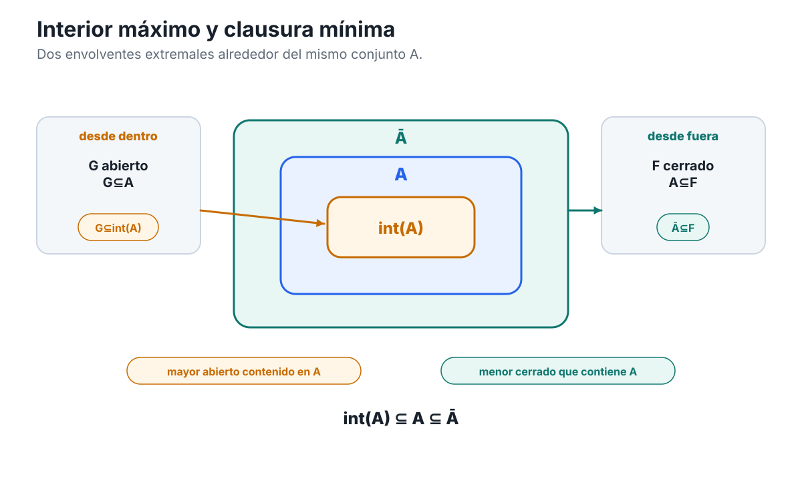

[Capítulo 4](analisis-para-matematicos-capitulo-4-mirar-localmente-un-conjunto.md) · [Índice del libro](../para-matematicos/analisis-para-matematicos.md) · [Ejercicios](analisis-para-matematicos-capitulo-4-mirar-localmente-un-conjunto-ejercicios.md) · [Soluciones](analisis-para-matematicos-capitulo-4-mirar-localmente-un-conjunto-soluciones.md) · [Soluciones de microcontroles](analisis-para-matematicos-capitulo-4-mirar-localmente-un-conjunto-microcontroles.md)

# Soluciones — Capítulo 4

## §4.1. Ventanas alrededor de un punto: vecindades

[]{#MA-SOL-ANM-01-004-001}

### 1. Una definición, varias formas lógicas

La primera afirmación dice

$$
\exists r>0:
B(x,r)\subseteq V.
$$

Por definición de bola,

$$
y\in B(x,r)
\iff
|y-x|<r.
$$

Por tanto la inclusión

$$
B(x,r)\subseteq V
$$

significa exactamente que todo $y\in\mathbb R$ que satisfaga $|y-x|<r$ pertenece a $V$. Así, 1 equivale a

$$
\exists r>0\ \forall y\in\mathbb R:
\bigl(|y-x|<r\Longrightarrow y\in V\bigr),
$$

que es la afirmación 2.

En $\mathbb R$ tenemos además

$$
B(x,r)=(x-r,x+r).
$$

Sustituir la bola por ese intervalo transforma 1 en

$$
\exists r>0:
(x-r,x+r)\subseteq V,
$$

que es 3. Por tanto,

$$
\boxed{1\iff2\iff3.}
$$

La afirmación 4 es distinta:

$$
\forall r>0\ \exists y\in V:
|y-x|<r.
$$

En 2 elegimos **un** radio y, una vez elegido, exigimos que **todo** punto de la bola pertenezca a $V$. En 4, en cambio, cada radio puede tener su propio testigo $y$, y sólo se exige encontrar al menos un punto de $V$ dentro de la bola.

Un contraejemplo simple es

$$
V=[0,\infty),
\qquad
x=0.
$$

Para cualquier $r>0$, el punto

$$
y=\frac r2
$$

satisface

$$
y\in V
\qquad\text{y}\qquad
|y|<r.
$$

Así, 4 es verdadera.

Sin embargo, ningún $r>0$ satisface

$$
B(0,r)\subseteq V,
$$

porque

$$
-\frac r2\in B(0,r)
$$

pero

$$
-\frac r2\notin[0,\infty).
$$

Por tanto 1 es falsa.

La diferencia conceptual es que encontrar puntos de $V$ arbitrariamente cerca de $x$ sólo exige **intersección**. Ser vecindad exige algo más fuerte: debe existir una ventana completa alrededor de $x$ cuyos puntos estén todos dentro de $V$.

[]{#MA-SOL-ANM-01-004-002}

### 2. El conjunto de radios que realmente sirven

Partimos de

$$
V=(-4,3)\cup\{100\}.
$$

Para $x=-1$ buscamos todos los $r>0$ tales que

$$
B(-1,r)=(-1-r,-1+r)
$$

quede contenido en $V$.

El obstáculo más cercano está a la izquierda, en $-4$. La distancia es

$$
|-1-(-4)|=3.
$$

Si $0<r\le3$, entonces

$$
-1-r\ge-4
$$

y, como la bola es abierta, el punto $-4$ no queda incluido cuando $r=3$. Además,

$$
-1+r\le2<3.
$$

Por tanto,

$$
B(-1,r)\subseteq(-4,3)\subseteq V.
$$

Si $r>3$, tomemos

$$
\varepsilon=\frac{r-3}{2}>0
$$

y definamos

$$
y=-4-\varepsilon.
$$

Entonces

$$
|y+1|
=
3+\varepsilon
=
\frac{r+3}{2}
<r,
$$

de modo que $y\in B(-1,r)$, pero $y\notin V$. Así,

$$
\boxed{
R_V(-1)=(0,3].
}
$$

Para $x=2$, la barrera más cercana es ahora el extremo derecho $3$, a distancia

$$
|3-2|=1.
$$

Si $0<r\le1$, entonces

$$
B(2,r)\subseteq(-4,3).
$$

Si $r>1$, tomando

$$
y=3+\frac{r-1}{2}
$$

obtenemos $|y-2|<r$ y $y\notin V$. Por tanto,

$$
\boxed{
R_V(2)=(0,1].
}
$$

Para $x=100$, cualquier bola positiva contiene puntos distintos de $100$. En particular, dado $r>0$,

$$
y=100+\frac r2
$$

pertenece a $B(100,r)$, pero no pertenece a $V$, porque el único punto de $V$ cerca de $100$ es el propio $100$. Por tanto,

$$
\boxed{
R_V(100)=\varnothing.
}
$$

El punto remoto $100$ no amplía los radios admisibles alrededor de $-1$ o $2$. Una bola centrada en uno de esos puntos debe contener **todos** sus puntos en $V$; no puede saltar sobre el hueco entre $3$ y $100$ para aprovechar un punto aislado lejano.

Finalmente,

$$
R_V(-1)=(0,3]
\qquad\text{y}\qquad
R_V(2)=(0,1].
$$

Ambos centros pertenecen a la misma componente intervalar de $V$, pero el margen disponible depende de su posición. El radio que certifica una vecindad es una información local ligada al par $(x,V)$, no una propiedad uniforme del conjunto.

[]{#MA-SOL-ANM-01-004-003}

### 3. Intersecciones finitas sí; intersecciones arbitrarias, no

**Estrategia.** Cada vecindad $V_k$ aporta algún radio $r_k>0$. Para satisfacer simultáneamente todas las inclusiones necesitamos un radio que no exceda ninguno de ellos. La finitud permite tomar un mínimo.

Para cada

$$
k\in\{1,\dots,n\},
$$

como $V_k$ es vecindad de $x$, existe $r_k>0$ tal que

$$
B(x,r_k)\subseteq V_k.
$$

Definimos

$$
\rho=\min\{r_1,\dots,r_n\}.
$$

Como se trata de un conjunto finito de números positivos,

$$
\rho>0.
$$

Además,

$$
\rho\le r_k
$$

para todo $k$, y por tanto

$$
B(x,\rho)\subseteq B(x,r_k)\subseteq V_k.
$$

La misma bola queda contenida en todos los $V_k$, de modo que

$$
B(x,\rho)
\subseteq
\bigcap_{k=1}^nV_k.
$$

Así,

$$
\boxed{
\bigcap_{k=1}^nV_k
\text{ es una vecindad de }x.
}
$$

La finitud interviene exactamente al permitirnos formar el mínimo de la lista

$$
r_1,\dots,r_n
$$

y conservar un número estrictamente positivo.

Veamos ahora qué ocurre con una familia arbitraria. Para cada $r>0$,

$$
V_r=(-r,r)=B(0,r),
$$

por lo que $V_r$ es una vecindad de $0$.

Afirmamos que

$$
\bigcap_{r>0}V_r=\{0\}.
$$

Primero,

$$
0\in(-r,r)
$$

para todo $r>0$, así que $0$ pertenece a la intersección.

Sea ahora $x\ne0$. Elegimos

$$
r=\frac{|x|}{2}>0.
$$

Entonces

$$
|x|>r,
$$

por lo que

$$
x\notin(-r,r)=V_r.
$$

Así, ningún $x\ne0$ pertenece a la intersección. Queda probado que

$$
\bigcap_{r>0}V_r=\{0\}.
$$

Pero $\{0\}$ no es una vecindad de $0$: para cualquier $\rho>0$, el punto $\rho/2$ pertenece a $B(0,\rho)$ y es distinto de $0$. Por tanto,

$$
B(0,\rho)\nsubseteq\{0\}.
$$

Concluimos que la estabilidad de las vecindades bajo intersección es una propiedad **finita**, no arbitraria.

[]{#MA-SOL-ANM-01-004-004}

### 4. Cuando «tocar» una ventana se confunde con «llenarla»

El estudiante demuestra correctamente que, para todo $r>0$,

$$
B(0,r)\cap V\ne\varnothing,
$$

donde

$$
V=[0,\infty).
$$

En forma desplegada, su argumento establece

$$
\forall r>0\ \exists y\in V:
|y|<r.
$$

De hecho, el testigo elegido es

$$
y=\frac r2.
$$

Pero para demostrar que $V$ es vecindad de $0$ tendría que probar

$$
\exists r_0>0\ \forall y\in\mathbb R:
\bigl(|y|<r_0\Longrightarrow y\in V\bigr),
$$

o, equivalentemente,

$$
\exists r_0>0:
B(0,r_0)\subseteq V.
$$

El salto ilegítimo cambia simultáneamente dos cosas. Primero, transforma

$$
\forall r\ \exists y
$$

en una afirmación con la forma

$$
\exists r\ \forall y.
$$

Segundo, sustituye una condición de **intersección no vacía** por una condición de **inclusión completa**.

La conclusión de vecindad es falsa. Sea $r>0$ arbitrario y tomemos

$$
z=-\frac r2.
$$

Entonces

$$
|z|=\frac r2<r,
$$

así que

$$
z\in B(0,r).
$$

Sin embargo,

$$
z<0,
$$

de modo que

$$
z\notin[0,\infty).
$$

Por tanto,

$$
B(0,r)\nsubseteq V
$$

para todo $r>0$. No existe ningún radio que certifique que $V$ sea una vecindad de $0$.

La reparación correcta consiste en conservar únicamente lo demostrado:

> para toda bola positiva centrada en $0$, existe al menos un punto de $V$ dentro de esa bola.

Esta afirmación describe una proximidad local real, pero es lógicamente más débil que contener una ventana completa alrededor del centro.

## §4.2. Interior y exterior: tener margen

[]{#MA-SOL-ANM-01-004-005}

### 5. Negar correctamente el margen

La negación de

$$
I(x,A):
\exists r>0:\ B(x,r)\subseteq A
$$

es

$$
\forall r>0:\ B(x,r)\not\subseteq A.
$$

Negar la inclusión significa que en cada bola existe al menos un punto fuera de $A$. Por tanto,

$$
\boxed{
\neg I(x,A)
\iff
\forall r>0:
B(x,r)\cap A^c\ne\varnothing.
}
$$

Del mismo modo,

$$
\boxed{
\neg E(x,A)
\iff
\forall r>0:
B(x,r)\cap A\ne\varnothing.
}
$$

Las afirmaciones $I(x,A)$ y $E(x,A)$ no pueden ser verdaderas simultáneamente. En efecto, la primera implica $x\in A$, mientras que la segunda implica $x\in A^c$, porque el centro pertenece a toda bola centrada en él. Eso obligaría a

$$
x\in A\cap A^c,
$$

lo cual es imposible.

Tomemos ahora

$$
A=[0,1],
\qquad
x=0.
$$

Dado $r>0$,

$$
-\frac r2\in B(0,r)\cap A^c,
$$

así que ninguna bola positiva centrada en $0$ queda contenida en $A$.

Por otro lado,

$$
0\in B(0,r)\cap A
$$

para todo $r>0$. Por tanto ninguna bola centrada en $0$ queda contenida en $A^c$.

Así,

$$
\neg I(0,A)
\qquad\text{y}\qquad
\neg E(0,A).
$$

Interior y exterior son incompatibles, pero no exhaustivos: puede haber puntos para los cuales no exista margen completo en ninguno de los dos lados.

[]{#MA-SOL-ANM-01-004-006}

### 6. Dos familias de radios alrededor del mismo conjunto

Sea

$$
A=(-3,-1]\cup(1,4).
$$

Para $x=-2$, una bola permanece dentro del primer intervalo exactamente mientras su radio no supere la distancia $1$ a los dos extremos relevantes. Por tanto,

$$
\boxed{
R_{\mathrm{in}}(-2)=(0,1].
}
$$

Si $r>1$, la bola contiene puntos de $(-1,1)$, que no pertenecen a $A$. Además, como $-2\in A$, ninguna bola centrada en $-2$ puede quedar contenida en $A^c$. Luego

$$
\boxed{
R_{\mathrm{out}}(-2)=\varnothing.
}
$$

Para $x=0$ tenemos

$$
B(0,1)=(-1,1)\subseteq A^c.
$$

Todo radio $0<r\le1$ sigue funcionando. Si $r>1$, entonces

$$
-1\in B(0,r)\cap A,
$$

de modo que el radio deja de ser exterior. Como $0\notin A$, ningún radio puede certificar interioridad. Así,

$$
\boxed{
R_{\mathrm{in}}(0)=\varnothing,
\qquad
R_{\mathrm{out}}(0)=(0,1].
}
$$

Para $x=-1$, el centro pertenece a $A$, así que

$$
R_{\mathrm{out}}(-1)=\varnothing.
$$

Pero tampoco existe radio interior. Dado $r>0$, el punto

$$
y=-1+\frac12\min\{r,1\}
$$

satisface $|y+1|<r$ y pertenece a $(-1,0]$, que está fuera de $A$. Por tanto,

$$
\boxed{
R_{\mathrm{in}}(-1)=R_{\mathrm{out}}(-1)=\varnothing.
}
$$

Finalmente, $4\notin A$, de modo que $R_{\mathrm{in}}(4)=\varnothing$. Para cualquier $r>0$, el punto

$$
y=4-\frac12\min\{r,1\}
$$

satisface $|y-4|<r$ y, además,

$$
3.5\le y<4,
$$

por lo que $y\in(1,4)\subseteq A$. Así ninguna bola centrada en $4$ queda contenida en $A^c$, y

$$
\boxed{
R_{\mathrm{in}}(4)=R_{\mathrm{out}}(4)=\varnothing.
}
$$

La clasificación es entonces:

- $-2$ es interior;
- $0$ es exterior;
- $-1$ y $4$ no son ni interiores ni exteriores.

Conocer toda la familia de radios aporta una escala local. Por ejemplo, $R_{\mathrm{in}}(-2)=(0,1]$ no sólo dice que $-2$ es interior: muestra exactamente hasta qué radio puede agrandarse una bola centrada allí sin salir del conjunto.

Los puntos $-1$ y $4$ tienen el mismo patrón de radios admisibles, aunque sólo el primero pertenece a $A$. Esto confirma que pertenencia y margen local son informaciones distintas.

[]{#MA-SOL-ANM-01-004-007}

### 7. Clasificar todo un conjunto por margen local

Sea

$$
A=[-2,-1)\cup\{0\}\cup(1,3].
$$

Si $-2<x<-1$, entonces

$$
r_x
=
\frac12\min\{x+2,-1-x\}>0
$$

satisface

$$
B(x,r_x)\subseteq(-2,-1)\subseteq A.
$$

Si $1<x<3$, entonces

$$
r_x
=
\frac12\min\{x-1,3-x\}>0
$$

satisface

$$
B(x,r_x)\subseteq(1,3)\subseteq A.
$$

Por tanto,

$$
(-2,-1)\cup(1,3)
\subseteq
\operatorname{int}(A).
$$

Ninguno de los cinco puntos $-2,-1,0,1,3$ es interior. En cada extremo de intervalo, toda bola sale inmediatamente de $A$ por uno de los lados; alrededor de $0$, toda bola contiene puntos distintos de $0$ que no pertenecen a $A$.

Así,

$$
\boxed{
\operatorname{int}(A)
=
(-2,-1)\cup(1,3).
}
$$

Calculemos el exterior.

Si $x<-2$, el radio

$$
r=\frac{-2-x}{2}
$$

produce una bola contenida en $(-\infty,-2)$.

Si $-1<x<0$, tomamos

$$
r=\frac12\min\{x+1,-x\},
$$

y la bola queda contenida en $(-1,0)$.

Si $0<x<1$, tomamos

$$
r=\frac12\min\{x,1-x\},
$$

y obtenemos una bola contenida en $(0,1)$.

Si $x>3$, el radio

$$
r=\frac{x-3}{2}
$$

produce una bola contenida en $(3,\infty)$.

Todas esas regiones están dentro de $A^c$, de modo que

$$
(-\infty,-2)\cup(-1,0)\cup(0,1)\cup(3,\infty)
\subseteq
\operatorname{ext}(A).
$$

No hay más puntos exteriores. Los puntos $-2,0,3$ pertenecen a $A$, así que no pueden ser exteriores. Toda bola alrededor de $-1$ encuentra puntos de $[-2,-1)$ y toda bola alrededor de $1$ encuentra puntos de $(1,3]$.

Por tanto,

$$
\boxed{
\operatorname{ext}(A)
=
(-\infty,-2)\cup(-1,0)\cup(0,1)\cup(3,\infty).
}
$$

Los únicos puntos que no quedaron en interior ni exterior son

$$
\boxed{
\{-2,-1,0,1,3\}.
}
$$

Con esto se han agotado todos los puntos de $\mathbb R$ sin usar ninguna noción posterior a §4.2.

[]{#MA-SOL-ANM-01-004-008}

### 8. Cómo se comporta el interior bajo operaciones de conjuntos

Para probar

$$
\operatorname{int}(A\cap B)
=
\operatorname{int}(A)\cap\operatorname{int}(B),
$$

demostramos ambas inclusiones.

Si

$$
x\in\operatorname{int}(A\cap B),
$$

existe $r>0$ tal que

$$
B(x,r)\subseteq A\cap B.
$$

La misma bola queda contenida en $A$ y en $B$. Por tanto,

$$
x\in\operatorname{int}(A)\cap\operatorname{int}(B).
$$

Recíprocamente, supongamos

$$
x\in\operatorname{int}(A)\cap\operatorname{int}(B).
$$

Existen $r,s>0$ tales que

$$
B(x,r)\subseteq A,
\qquad
B(x,s)\subseteq B.
$$

Tomamos

$$
\rho=\min\{r,s\}>0.
$$

Entonces

$$
B(x,\rho)\subseteq A\cap B,
$$

y por tanto $x\in\operatorname{int}(A\cap B)$.

Así,

$$
\boxed{
\operatorname{int}(A\cap B)
=
\operatorname{int}(A)\cap\operatorname{int}(B).
}
$$

Para el exterior usamos

$$
\operatorname{ext}(C)=\operatorname{int}(C^c).
$$

Por De Morgan y la identidad recién probada,

$$
\begin{aligned}
\operatorname{ext}(A\cup B)
&=
\operatorname{int}\bigl((A\cup B)^c\bigr)\\
&=
\operatorname{int}(A^c\cap B^c)\\
&=
\operatorname{int}(A^c)\cap\operatorname{int}(B^c)\\
&=
\operatorname{ext}(A)\cap\operatorname{ext}(B).
\end{aligned}
$$

Por tanto,

$$
\boxed{
\operatorname{ext}(A\cup B)
=
\operatorname{ext}(A)\cap\operatorname{ext}(B).
}
$$

Además,

$$
A\subseteq A\cup B
\qquad\text{y}\qquad
B\subseteq A\cup B.
$$

La monotonicidad del interior da

$$
\operatorname{int}(A)\subseteq\operatorname{int}(A\cup B)
$$

y

$$
\operatorname{int}(B)\subseteq\operatorname{int}(A\cup B).
$$

Luego

$$
\boxed{
\operatorname{int}(A)\cup\operatorname{int}(B)
\subseteq
\operatorname{int}(A\cup B).
}
$$

La inclusión puede ser estricta. Si

$$
A=[-1,0],
\qquad
B=[0,1],
$$

entonces

$$
\operatorname{int}(A)=(-1,0),
\qquad
\operatorname{int}(B)=(0,1),
$$

pero

$$
A\cup B=[-1,1]
$$

y

$$
\operatorname{int}(A\cup B)=(-1,1).
$$

El punto $0$ pertenece al interior de la unión, pero no al interior de ninguno de los dos conjuntos por separado.

[]{#MA-SOL-ANM-01-004-009}

### 9. Añadir puntos sin crear margen

Sea $t>1$.

Para cualquier $x\in(0,1)$, el radio

$$
r_x
=
\frac12\min\{x,1-x\}>0
$$

satisface

$$
B(x,r_x)\subseteq(0,1),
$$

de modo que $x$ es interior tanto a $A_t$ como a $B_t$.

El punto $0$ no es interior a $B_t$, porque toda bola centrada en $0$ contiene números negativos. El punto $t$ tampoco es interior a ninguno de los dos conjuntos: dado $r>0$, el punto

$$
t+\frac r2
$$

pertenece a $B(t,r)$ y queda fuera de ambos conjuntos.

Así,

$$
\boxed{
\operatorname{int}(A_t)
=
\operatorname{int}(B_t)
=
(0,1).
}
$$

Para el exterior, si $x<0$, el radio

$$
r=\frac{-x}{2}
$$

produce una bola disjunta de ambos conjuntos.

Si $1<x<t$, tomamos

$$
r
=
\frac12\min\{x-1,t-x\}>0,
$$

y entonces

$$
B(x,r)\subset(1,t).
$$

Si $x>t$, el radio

$$
r=\frac{x-t}{2}
$$

produce una bola contenida en $(t,\infty)$.

Así,

$$
(-\infty,0)\cup(1,t)\cup(t,\infty)
$$

está contenido en los dos exteriores.

No hay otros puntos exteriores. Los puntos de $(0,1)$ y el punto $t$ pertenecen a ambos conjuntos. Toda bola centrada en $0$ toca $(0,1)$, y toda bola centrada en $1$ toca puntos de $(0,1)$. Por tanto,

$$
\boxed{
\operatorname{ext}(A_t)
=
\operatorname{ext}(B_t)
=
(-\infty,0)\cup(1,t)\cup(t,\infty).
}
$$

Para

$$
C=(0,1),
$$

tenemos

$$
\operatorname{int}(C)=(0,1)
$$

y

$$
\operatorname{ext}(C)=(-\infty,0)\cup(1,\infty).
$$

Añadir el punto $t$ no crea margen interior alrededor de $t$, pero hace que ese punto deje de ser exterior. El resto de los puntos de $(1,\infty)$ conserva margen exterior.

Pasar de $A_t$ a $B_t$ añade únicamente el punto $0$. La pertenencia de $0$ cambia, pero no aparece una bola completa contenida en el conjunto ni una bola completa contenida en el complemento. Por eso interior y exterior permanecen iguales.

La familia muestra que cambiar la pertenencia de algunos puntos no equivale a cambiar el margen local. Interior y exterior registran cómo se comportan ventanas completas alrededor del centro, no sólo si el centro pertenece al conjunto.

## §4.3. Clausura: puntos que no pueden evitar al conjunto

[]{#MA-SOL-ANM-01-004-010}

### 10. Una clausura con intervalos y un punto separado

Sea

$$
A=(-2,-1)\cup\{0\}\cup(1,2).
$$

Todo punto de $A$ es adherente, porque siempre

$$
A\subseteq\overline A.
$$

Por tanto,

$$
(-2,-1)\cup\{0\}\cup(1,2)
\subseteq
\overline A.
$$

Quedan por estudiar los puntos que no pertenecen al conjunto.

Empecemos por los cuatro extremos intervalares.

Para $x=-2$ y un radio arbitrario $r>0$, tomemos

$$
a=-2+\min\left\{\frac r2,\frac14\right\}.
$$

Entonces

$$
-2<a<-1,
$$

de modo que $a\in A$, y además

$$
|a-(-2)|<r.
$$

Por tanto toda bola centrada en $-2$ intersecta $A$, así que

$$
-2\in\overline A.
$$

El mismo mecanismo funciona en $-1$. Dado $r>0$, podemos tomar

$$
a=-1-\min\left\{\frac r2,\frac14\right\}\in(-2,-1)\cap B(-1,r),
$$

y concluimos

$$
-1\in\overline A.
$$

Para $x=1$, tomamos

$$
a=1+\min\left\{\frac r2,\frac14\right\},
$$

y para $x=2$,

$$
a=2-\min\left\{\frac r2,\frac14\right\}.
$$

En ambos casos obtenemos puntos de $(1,2)$ dentro de la bola arbitraria correspondiente. Por tanto,

$$
1,2\in\overline A.
$$

El punto $0$ ya pertenece a $A$, de modo que es adherente automáticamente.

Así hemos demostrado

$$
[-2,-1]\cup\{0\}\cup[1,2]
\subseteq
\overline A.
$$

Falta excluir todos los demás puntos.

Si $x<-2$, el radio

$$
r=\frac{-2-x}{2}>0
$$

satisface

$$
B(x,r)\subset(-\infty,-2),
$$

y la bola es disjunta de $A$.

Si $-1<x<0$, tomemos

$$
r=\frac12\min\{x+1,-x\}>0.
$$

Entonces

$$
B(x,r)\subset(-1,0),
$$

que no contiene puntos de $A$.

Si $0<x<1$, el radio

$$
r=\frac12\min\{x,1-x\}>0
$$

produce una bola contenida en $(0,1)$ y disjunta de $A$.

Finalmente, si $x>2$, basta tomar

$$
r=\frac{x-2}{2}>0.
$$

No quedan más casos. Por tanto,

$$
\boxed{
\overline A
=
[-2,-1]\cup\{0\}\cup[1,2].
}
$$

La clausura añade los extremos de los dos intervalos, pero no rellena los huecos completos entre ellos: sólo incorpora los puntos que ninguna bola positiva puede separar del conjunto.

[]{#MA-SOL-ANM-01-004-011}

### 11. La clausura de una unión finita

Queremos probar

$$
\overline{A\cup B}
=
\overline A\cup\overline B.
$$

Como se trata de una igualdad de conjuntos, probaremos las dos inclusiones.

Primero, como

$$
A\subseteq A\cup B,
$$

la monotonicidad de la clausura da

$$
\overline A
\subseteq
\overline{A\cup B}.
$$

Del mismo modo,

$$
\overline B
\subseteq
\overline{A\cup B}.
$$

Por tanto,

$$
\overline A\cup\overline B
\subseteq
\overline{A\cup B}.
$$

Para la inclusión contraria, supongamos que

$$
x\notin\overline A\cup\overline B.
$$

Entonces

$$
x\notin\overline A
\qquad\text{y}\qquad
x\notin\overline B.
$$

Negando la definición de adherencia, existen $r>0$ y $s>0$ tales que

$$
B(x,r)\cap A=\varnothing
$$

y

$$
B(x,s)\cap B=\varnothing.
$$

Tomemos

$$
\rho=\min\{r,s\}>0.
$$

Entonces

$$
B(x,\rho)\subseteq B(x,r)
$$

y

$$
B(x,\rho)\subseteq B(x,s).
$$

Por tanto la misma bola evita simultáneamente a $A$ y a $B$:

$$
B(x,\rho)\cap A=\varnothing,
\qquad
B(x,\rho)\cap B=\varnothing.
$$

De aquí se sigue

$$
B(x,\rho)\cap(A\cup B)=\varnothing.
$$

Por tanto,

$$
x\notin\overline{A\cup B}.
$$

Hemos probado la contraposición de

$$
\overline{A\cup B}
\subseteq
\overline A\cup\overline B.
$$

Juntando ambas inclusiones,

$$
\boxed{
\overline{A\cup B}
=
\overline A\cup\overline B.
}
$$

La finitud aparece en la sincronización de radios. Para dos conjuntos basta tomar $\min\{r,s\}$. El mismo argumento funciona para cualquier familia finita, porque podemos tomar el mínimo de una lista finita de radios positivos.

[]{#MA-SOL-ANM-01-004-012}

### 12. La intersección se comporta de otra manera

Como

$$
A\cap B\subseteq A,
$$

la monotonicidad de la clausura da

$$
\overline{A\cap B}
\subseteq
\overline A.
$$

También

$$
A\cap B\subseteq B,
$$

por lo que

$$
\overline{A\cap B}
\subseteq
\overline B.
$$

Así,

$$
\boxed{
\overline{A\cap B}
\subseteq
\overline A\cap\overline B.
}
$$

La igualdad no tiene por qué cumplirse.

Tomemos

$$
A=(-1,0),
\qquad
B=(0,1).
$$

Entonces

$$
A\cap B=\varnothing,
$$

de modo que

$$
\overline{A\cap B}
=
\overline\varnothing
=
\varnothing.
$$

En cambio,

$$
\overline A=[-1,0]
$$

y

$$
\overline B=[0,1].
$$

Por tanto,

$$
\overline A\cap\overline B
=
\{0\}.
$$

Así,

$$
\boxed{
\overline{A\cap B}
\subsetneq
\overline A\cap\overline B.
}
$$

No hay contradicción con el ejercicio anterior. La clausura de una unión y la clausura de una intersección responden a formas lógicas distintas.

Para ser adherente a $A\cup B$, cada bola sólo necesita encontrar al menos un punto en **alguno** de los dos conjuntos. Si un punto deja de ser adherente a ambos por separado, podemos sincronizar dos bolas que los eviten y obtener una bola que evita la unión.

En cambio, un punto puede ser adherente a $A$ y a $B$ porque ambos conjuntos se acercan al mismo centro desde lados distintos, aunque ninguna bola contenga un punto que pertenezca simultáneamente a $A$ y a $B$. Eso ocurre exactamente en $0$ para el ejemplo anterior.

[]{#MA-SOL-ANM-01-004-013}

### 13. Reparar una prueba de idempotencia

La línea defectuosa es

> de $|a-x|<r+r$ se concluye $a\in B(x,r)$.

La estimación obtenida sólo permite afirmar

$$
|a-x|<2r,
$$

y por tanto

$$
a\in B(x,2r).
$$

Eso no basta para demostrar que la bola original $B(x,r)$ intersecta $A$.

La reparación consiste en reservar parte del radio para cada uno de los dos desplazamientos.

Sea

$$
x\in\overline{\overline A}
$$

y sea $r>0$ arbitrario.

Como $x$ es adherente a $\overline A$, la bola de radio $r/2$ alrededor de $x$ intersecta $\overline A$. Existe, pues,

$$
y\in
B\left(x,\frac r2\right)\cap\overline A.
$$

Como $y\in\overline A$, la bola de radio $r/2$ alrededor de $y$ intersecta $A$. Existe entonces

$$
a\in
B\left(y,\frac r2\right)\cap A.
$$

Ahora la desigualdad triangular produce

$$
|a-x|
\le
|a-y|+|y-x|
<
\frac r2+\frac r2
=
r.
$$

Por tanto,

$$
a\in B(x,r)\cap A.
$$

Como $r>0$ era arbitrario,

$$
B(x,r)\cap A\ne\varnothing
$$

para todo $r>0$, y así

$$
x\in\overline A.
$$

Hemos demostrado

$$
\overline{\overline A}
\subseteq
\overline A.
$$

La elección $r/2$ funciona porque divide de antemano el presupuesto total $r$ entre los dos desplazamientos que luego sumará la desigualdad triangular.

El mecanismo reutilizable es:

> cuando dos desplazamientos consecutivos deben caber dentro de un radio total, conviene repartir el margen antes de aplicar la desigualdad triangular.

[]{#MA-SOL-ANM-01-004-014}

### 14. Perforar, rellenar y añadir un punto separado

Sea $t\in(0,1)$ y

$$
A_t=(0,1)\setminus\{t\}.
$$

Demostraremos primero que

$$
\overline{A_t}=[0,1].
$$

Todo punto de $A_t$ es adherente automáticamente.

Veamos el punto perforado $t$. Sea $r>0$. Definimos

$$
\delta
=
\min\left\{
\frac r2,
\frac{1-t}{2}
\right\}>0
$$

y tomamos

$$
a=t+\delta.
$$

Entonces

$$
t<a<1,
$$

de modo que $a\in A_t$, y además

$$
|a-t|=\delta<r.
$$

Por tanto toda bola centrada en $t$ intersecta $A_t$, así que

$$
t\in\overline{A_t}.
$$

Para $x=0$, dado $r>0$, tomemos

$$
a=
\min\left\{
\frac r2,
\frac t2,
\frac14
\right\}.
$$

Como $t>0$, tenemos $a>0$, y además $a<t$, por lo que $a\ne t$. Así,

$$
a\in A_t\cap B(0,r).
$$

Luego

$$
0\in\overline{A_t}.
$$

Para $x=1$, tomemos

$$
a=
1-
\min\left\{
\frac r2,
\frac{1-t}{2},
\frac14
\right\}.
$$

Entonces

$$
t<a<1,
$$

por lo que $a\in A_t$, y además $|a-1|<r$. Así,

$$
1\in\overline{A_t}.
$$

Hemos probado

$$
[0,1]\subseteq\overline{A_t}.
$$

Falta excluir los puntos exteriores a $[0,1]$.

Si $x<0$, el radio

$$
r=\frac{-x}{2}
$$

produce una bola contenida en $(-\infty,0)$ y, por tanto, disjunta de $A_t$.

Si $x>1$, el radio

$$
r=\frac{x-1}{2}
$$

produce una bola contenida en $(1,\infty)$, también disjunta de $A_t$.

Así,

$$
\boxed{
\overline{A_t}=[0,1].
}
$$

Ahora

$$
B_t=A_t\cup\{t\}=(0,1).
$$

Por tanto, usando el cálculo ya conocido para un intervalo abierto,

$$
\boxed{
\overline{B_t}=[0,1].
}
$$

La perforación y su posterior relleno no cambian la clausura.

Consideremos finalmente

$$
C_t=A_t\cup\{2\}.
$$

Por el ejercicio 11,

$$
\overline{C_t}
=
\overline{A_t}\cup\overline{\{2\}}.
$$

Como

$$
\overline{A_t}=[0,1],
$$

sólo falta observar que

$$
\overline{\{2\}}=\{2\}.
$$

En efecto, $2$ es adherente al singleton porque pertenece a él. Si $x\ne2$, el radio

$$
r=\frac{|x-2|}{2}>0
$$

produce una bola que no contiene a $2$, de modo que $x$ no es adherente a $\{2\}$.

Por tanto,

$$
\boxed{
\overline{C_t}
=
[0,1]\cup\{2\}.
}
$$

La comparación final es instructiva.

Quitar $t$ no cambia la clausura porque, aunque $t$ deja de pertenecer al conjunto, siguen apareciendo puntos de $A_t$ dentro de **toda** bola centrada en $t$.

Volver a añadir $t$ tampoco cambia la clausura, porque $t$ ya era adherente.

En cambio, añadir el punto separado $2$ sí modifica la clausura: el nuevo punto pertenece al conjunto y, por ello, debe pertenecer a su clausura; además, existe una ventana suficientemente pequeña alrededor de $2$ que no toca la parte situada en $(0,1)$.

La clausura registra, por tanto, qué puntos son localmente imposibles de separar del conjunto. Esa información no coincide con la simple pertenencia: un punto puede salir del conjunto sin salir de su clausura, o puede entrar como un nuevo punto separado y ampliar efectivamente la clausura.

## §4.4. Frontera: toda ventana ve ambos lados

[]{#MA-SOL-ANM-01-004-015}

### 15. El espacio lógico de tres estados locales

Las dos preguntas son

$$
P_A(x):
\exists r>0:\ B(x,r)\subseteq A
$$

y

$$
Q_A(x):
\exists r>0:\ B(x,r)\subseteq A^c.
$$

El estado $(\text{sí},\text{sí})$ es imposible. Si existieran $r,s>0$ tales que

$$
B(x,r)\subseteq A
$$

y

$$
B(x,s)\subseteq A^c,
$$

entonces el centro $x$ pertenecería simultáneamente a $A$ y a $A^c$, porque

$$
x\in B(x,r)\cap B(x,s).
$$

Esto es imposible.

El estado

$$
(\text{sí},\text{no})
$$

significa que existe una bola contenida en $A$: $x$ es interior a $A$.

El estado

$$
(\text{no},\text{sí})
$$

significa que existe una bola contenida en $A^c$: $x$ es exterior a $A$.

Queda el estado

$$
(\text{no},\text{no}).
$$

La negación de $P_A(x)$ es

$$
\forall r>0:
B(x,r)\not\subseteq A.
$$

Esto equivale a

$$
\forall r>0:
B(x,r)\cap A^c\ne\varnothing.
$$

Análogamente, la negación de $Q_A(x)$ equivale a

$$
\forall r>0:
B(x,r)\cap A\ne\varnothing.
$$

Por tanto,

$$
(\text{no},\text{no})
$$

equivale exactamente a

$$
\forall r>0:
\bigl(B(x,r)\cap A\ne\varnothing\bigr)
\ \text{y}\
\bigl(B(x,r)\cap A^c\ne\varnothing\bigr).
$$

Ésta es la definición de punto de frontera.

La representación completa es:

| Estado | Condición local | Clase |
|---|---|---|
| $(\text{sí},\text{no})$ | alguna bola queda en $A$ | interior |
| $(\text{no},\text{sí})$ | alguna bola queda en $A^c$ | exterior |
| $(\text{no},\text{no})$ | toda bola toca ambos lados | frontera |

La cuarta combinación lógica no aparece porque interioridad y exterioridad son incompatibles.

[]{#MA-SOL-ANM-01-004-016}

### 16. Clasificar una configuración completa

Sea

$$
A=[-2,-1)\cup\{0\}\cup(1,2].
$$

Si

$$
-2<x<-1,
$$

podemos tomar

$$
r_x
=
\frac12\min\{x+2,-1-x\}>0,
$$

y entonces

$$
B(x,r_x)\subseteq(-2,-1)\subseteq A.
$$

Si

$$
1<x<2,
$$

el radio

$$
r_x
=
\frac12\min\{x-1,2-x\}>0
$$

satisface

$$
B(x,r_x)\subseteq(1,2)\subseteq A.
$$

Por tanto,

$$
\boxed{
\operatorname{int}(A)
=
(-2,-1)\cup(1,2).
}
$$

Calculemos el exterior.

Si $x<-2$, el radio

$$
r=\frac{-2-x}{2}
$$

produce una bola contenida en $(-\infty,-2)$.

Si $-1<x<0$, tomamos

$$
r=\frac12\min\{x+1,-x\}.
$$

Si $0<x<1$, tomamos

$$
r=\frac12\min\{x,1-x\}.
$$

Si $x>2$, tomamos

$$
r=\frac{x-2}{2}.
$$

En cada caso la bola queda contenida en $A^c$. Así,

$$
\boxed{
\operatorname{ext}(A)
=
(-\infty,-2)
\cup
(-1,0)
\cup
(0,1)
\cup
(2,\infty).
}
$$

Quedan los cinco puntos

$$
-2,\ -1,\ 0,\ 1,\ 2.
$$

Mostremos que todos son fronterizos.

Para $x=-2$, toda bola contiene al propio centro, que pertenece a $A$, y también contiene puntos menores que $-2$, que pertenecen a $A^c$.

Para $x=-1$, dado $r>0$, el punto

$$
-1-\frac12\min\{r,1\}
$$

pertenece a $A\cap B(-1,r)$, mientras que

$$
-1+\frac12\min\{r,1\}
$$

pertenece a $A^c\cap B(-1,r)$.

Para $x=0$, el centro pertenece a $A$, mientras que cualquier punto

$$
\frac12\min\{r,1\}>0
$$

suficientemente pequeño pertenece a $(0,1)\subseteq A^c$.

Para $x=1$, podemos elegir simétricamente puntos a izquierda y derecha de $1$: uno en $(0,1)\subseteq A^c$ y otro en $(1,2]\subseteq A$.

Para $x=2$, toda bola contiene al centro $2\in A$ y también puntos mayores que $2$, que están en $A^c$.

Así,

$$
\boxed{
\partial A
=
\{-2,-1,0,1,2\}.
}
$$

No hay más puntos fronterizos porque todos los demás puntos ya pertenecen al interior o al exterior, y esas clases son disjuntas de la frontera.

Por tanto,

$$
\mathbb R
=
\bigl((-2,-1)\cup(1,2)\bigr)
\,\dot\cup\,
\{-2,-1,0,1,2\}
\,\dot\cup\,
\bigl((-\infty,-2)\cup(-1,0)\cup(0,1)\cup(2,\infty)\bigr).
$$

La partición queda verificada directamente.

[]{#MA-SOL-ANM-01-004-017}

### 17. La frontera de una unión no puede aparecer de la nada

Queremos demostrar

$$
\partial(A\cup B)
\subseteq
\partial A\cup\partial B.
$$

Trabajaremos por contraposición.

Supongamos que

$$
x\notin\partial A\cup\partial B.
$$

Entonces

$$
x\notin\partial A
\qquad\text{y}\qquad
x\notin\partial B.
$$

Por la partición local de §4.4, respecto de cada conjunto el punto debe ser interior o exterior.

Hay cuatro combinaciones posibles.

Si $x$ es interior a $A$, entonces existe una bola contenida en $A$, y por tanto contenida en $A\cup B$. Así, $x$ es interior a la unión y no es fronterizo.

Lo mismo ocurre si $x$ es interior a $B$.

La única posibilidad restante es que $x$ sea exterior tanto a $A$ como a $B$. Entonces existen $r,s>0$ tales que

$$
B(x,r)\subseteq A^c
$$

y

$$
B(x,s)\subseteq B^c.
$$

Tomando

$$
\rho=\min\{r,s\},
$$

obtenemos

$$
B(x,\rho)
\subseteq
A^c\cap B^c
=
(A\cup B)^c.
$$

Por tanto $x$ es exterior a $A\cup B$ y tampoco es fronterizo.

En todos los casos,

$$
x\notin\partial(A\cup B).
$$

Queda demostrada la contraposición y, por tanto,

$$
\boxed{
\partial(A\cup B)
\subseteq
\partial A\cup\partial B.
}
$$

Para la intersección usamos complementos:

$$
A\cap B
=
(A^c\cup B^c)^c.
$$

Por la invariancia de la frontera bajo complemento,

$$
\partial(A\cap B)
=
\partial(A^c\cup B^c).
$$

Aplicando el resultado recién demostrado,

$$
\partial(A^c\cup B^c)
\subseteq
\partial(A^c)\cup\partial(B^c).
$$

Como

$$
\partial(A^c)=\partial A
\qquad\text{y}\qquad
\partial(B^c)=\partial B,
$$

obtenemos

$$
\boxed{
\partial(A\cap B)
\subseteq
\partial A\cup\partial B.
}
$$

La inclusión para la unión puede ser estricta. Si

$$
A=[-1,0],
\qquad
B=[0,1],
$$

entonces

$$
\partial A=\{-1,0\},
$$

y

$$
\partial B=\{0,1\}.
$$

Por tanto,

$$
\partial A\cup\partial B
=
\{-1,0,1\}.
$$

Pero

$$
A\cup B=[-1,1],
$$

de modo que

$$
\partial(A\cup B)=\{-1,1\}.
$$

El punto $0$ desaparece de la frontera porque, después de unir los dos intervalos, queda rodeado por una ventana completa contenida en $[-1,1]$. Una frontera interna de las piezas puede desaparecer al rellenarse localmente desde el otro conjunto.

[]{#MA-SOL-ANM-01-004-018}

### 18. Dos radios que no están sincronizados

El error está en afirmar que $b_r$ pertenece necesariamente a $B(x,r)$.

La hipótesis sólo garantiza

$$
|b_r-x|<2r,
$$

por lo que podemos concluir

$$
b_r\in B(x,2r).
$$

Eso no implica

$$
b_r\in B(x,r).
$$

Sin embargo, las hipótesis sí son suficientes para demostrar que $x$ es fronterizo.

Sea $R>0$ arbitrario. La primera hipótesis, aplicada directamente con $r=R$, proporciona un punto

$$
a_R\in A
$$

tal que

$$
|a_R-x|<R.
$$

Por tanto,

$$
a_R\in B(x,R)\cap A.
$$

Para el complemento no usamos el parámetro $R$ directamente. Aplicamos la segunda hipótesis con

$$
r=\frac R2.
$$

Existe entonces

$$
b_{R/2}\in A^c
$$

tal que

$$
|b_{R/2}-x|
<
2\left(\frac R2\right)
=
R.
$$

Así,

$$
b_{R/2}\in B(x,R)\cap A^c.
$$

Como $R>0$ era arbitrario, toda bola positiva centrada en $x$ intersecta simultáneamente $A$ y $A^c$. Por tanto,

$$
\boxed{
x\in\partial A.
}
$$

La reparación no cambia las hipótesis: sólo sincroniza las escalas mediante una reparametrización.

La lección es que, cuando una definición exige dos condiciones dentro de la misma bola, no basta con tener testigos «aproximadamente» cercanos. Hay que ajustar los radios para que ambos queden realmente dentro de la ventana que se está evaluando.

[]{#MA-SOL-ANM-01-004-019}

### 19. La frontera no es monótona

Sea

$$
A=\{c\},
\qquad
B=(c-R,c+R),
$$

con $R>0$.

Como

$$
c-R<c<c+R,
$$

tenemos

$$
c\in B,
$$

y por tanto

$$
A\subseteq B.
$$

Calculemos primero la frontera de $A$.

El punto $c$ es fronterizo: toda bola centrada en $c$ contiene al propio centro, que pertenece a $A$, y contiene también puntos distintos de $c$, que pertenecen a $A^c$.

Si $x\ne c$, tomemos

$$
r=\frac{|x-c|}{2}>0.
$$

Entonces

$$
B(x,r)
$$

no contiene a $c$, de modo que

$$
B(x,r)\subseteq A^c.
$$

Por tanto $x$ es exterior a $A$ y no es fronterizo.

Así,

$$
\boxed{
\partial A=\{c\}.
}
$$

Ahora consideremos

$$
B=(c-R,c+R).
$$

Los puntos estrictamente interiores al intervalo son interiores a $B$, y los puntos fuera de

$$
[c-R,c+R]
$$

son exteriores.

En los extremos

$$
c-R
\qquad\text{y}\qquad
c+R,
$$

toda bola positiva contiene puntos del intervalo y puntos de su complemento. Por tanto,

$$
\boxed{
\partial B=\{c-R,c+R\}.
}
$$

Como $R>0$,

$$
c\ne c-R
\qquad\text{y}\qquad
c\ne c+R.
$$

Por ello,

$$
\partial A=\{c\}
\not\subseteq
\{c-R,c+R\}
=
\partial B.
$$

También,

$$
\partial B
\not\subseteq
\partial A.
$$

Más aún,

$$
\boxed{
\partial A\cap\partial B=\varnothing.
}
$$

Este ejemplo muestra que la operación frontera no es monótona respecto de la inclusión. Al agrandar el singleton hasta convertirlo en un intervalo abierto, el punto $c$ deja de ser fronterizo porque adquiere margen interior. A la vez aparecen dos fronteras nuevas en los extremos del intervalo.

Agrandar un conjunto puede, por tanto, destruir fronteras existentes y crear otras en posiciones diferentes.

## §4.5. Acumulación: el conjunto reaparece alrededor del punto

[]{#MA-SOL-ANM-01-004-020}

### 20. Negar una bola perforada

Por definición,
$$
x\in\operatorname{Acc}(A)
\iff
\forall r>0:
\bigl(B(x,r)\setminus\{x\}\bigr)\cap A\ne\varnothing.
$$

Negar la afirmación cambia el cuantificador universal por uno existencial y la intersección no vacía por una intersección vacía:
$$
x\notin\operatorname{Acc}(A)
\iff
\exists r>0:
\bigl(B(x,r)\setminus\{x\}\bigr)\cap A=\varnothing.
$$

En cambio,
$$
x\notin\overline A
\iff
\exists r>0:
B(x,r)\cap A=\varnothing.
$$

La diferencia está en el centro. Para negar acumulación, la bola puede tocar a $A$ únicamente en $x$; para negar adherencia, ni siquiera el centro puede aportar un punto de $A$.

Si $A=\{0\}$ y $x=0$, entonces $0\in\overline A$ porque pertenece a $A$, pero
$$
\bigl(B(0,r)\setminus\{0\}\bigr)\cap A=\varnothing
$$
para todo $r>0$. Así, $0\notin\operatorname{Acc}(A)$.

Si $A=(0,1)$ y $x=0$, dado $r>0$ tomamos
$$
a=\min\left\{\frac r2,\frac12\right\}.
$$
Entonces $a\in A$, $a\ne0$ y $|a|<r$, de modo que
$$
a\in\bigl(B(0,r)\setminus\{0\}\bigr)\cap A.
$$
Por tanto, $0\in\operatorname{Acc}(A)$ aunque $0\notin A$.

[]{#MA-SOL-ANM-01-004-021}

### 21. Calcular todos los puntos de acumulación

Sea
$$
A=(-2,-1)\cup\{0\}\cup(1,2].
$$

Afirmamos que
$$
\operatorname{Acc}(A)
=
[-2,-1]\cup[1,2].
$$

Si $x\in(-2,-1)$, dado $r>0$ tomamos
$$
\delta=\min\left\{\frac r2,\frac{-1-x}{2}\right\}>0
$$
y $a=x+\delta$. Entonces $a\in A$, $a\ne x$ y $|a-x|<r$. El mismo argumento funciona para $x\in(1,2)$.

En los extremos usamos desplazamientos hacia el interior de los intervalos. Por ejemplo, para $x=-2$ tomamos
$$
a=-2+\min\left\{\frac r2,\frac14\right\},
$$
y para $x=-1$,
$$
a=-1-\min\left\{\frac r2,\frac14\right\}.
$$
Los casos $1$ y $2$ son análogos. Por tanto,
$$
[-2,-1]\cup[1,2]
\subseteq
\operatorname{Acc}(A).
$$

Para $x=0$, la bola $B(0,1/2)$ sólo encuentra a $A$ en el centro:
$$
B\left(0,\frac12\right)\cap A=\{0\}.
$$
Al perforar el centro, la intersección queda vacía; por tanto, $0\notin\operatorname{Acc}(A)$.

Si $-1<x<0$, tomamos
$$
r=\frac12\min\{x+1,-x\}>0.
$$
Entonces $B(x,r)\subset(-1,0)$ y no toca a $A$. Para $0<x<1$ usamos
$$
r=\frac12\min\{x,1-x\}.
$$
Si $x<-2$ o $x>2$, basta tomar la mitad de la distancia al extremo más cercano del intervalo $[-2,2]$.

Así no hay otros puntos de acumulación, y
$$
\boxed{
\operatorname{Acc}(A)
=
[-2,-1]\cup[1,2].
}
$$

[]{#MA-SOL-ANM-01-004-022}

### 22. La acumulación de una unión finita

Por monotonicidad,
$$
\operatorname{Acc}(A)\cup\operatorname{Acc}(B)
\subseteq
\operatorname{Acc}(A\cup B).
$$

Para la inclusión contraria trabajamos por contraposición. Supongamos
$$
x\notin\operatorname{Acc}(A)
\qquad\text{y}\qquad
x\notin\operatorname{Acc}(B).
$$

Existen $r,s>0$ tales que
$$
\bigl(B(x,r)\setminus\{x\}\bigr)\cap A=\varnothing
$$
y
$$
\bigl(B(x,s)\setminus\{x\}\bigr)\cap B=\varnothing.
$$

Tomemos
$$
\rho=\min\{r,s\}>0.
$$
Entonces la bola perforada $B(x,\rho)\setminus\{x\}$ evita simultáneamente a $A$ y a $B$, de modo que
$$
\bigl(B(x,\rho)\setminus\{x\}\bigr)\cap(A\cup B)=\varnothing.
$$

Por tanto,
$$
x\notin\operatorname{Acc}(A\cup B).
$$

Queda demostrada la contraposición y, en consecuencia,
$$
\boxed{
\operatorname{Acc}(A\cup B)
=
\operatorname{Acc}(A)\cup\operatorname{Acc}(B).
}
$$

La finitud interviene al sincronizar los radios. Para una familia finita, el mínimo de los radios positivos sigue siendo positivo; para una familia arbitraria no existe una garantía semejante.

[]{#MA-SOL-ANM-01-004-023}

### 23. Dos testigos distintos no producen un testigo común

La falla está en confundir dos testigos potencialmente distintos con un único testigo común.

Tomemos
$$
A=(-1,0),
\qquad
B=(0,1).
$$

Para todo $r>0$ existen puntos de $A$ y de $B$ distintos de $0$ dentro de $B(0,r)$; por tanto,
$$
0\in\operatorname{Acc}(A)\cap\operatorname{Acc}(B).
$$

Pero
$$
A\cap B=\varnothing,
$$
de modo que
$$
\operatorname{Acc}(A\cap B)
=
\varnothing.
$$

Así, la igualdad propuesta es falsa.

La inclusión correcta se obtiene por monotonicidad:
$$
A\cap B\subseteq A
\quad\Longrightarrow\quad
\operatorname{Acc}(A\cap B)\subseteq\operatorname{Acc}(A),
$$
y también
$$
A\cap B\subseteq B
\quad\Longrightarrow\quad
\operatorname{Acc}(A\cap B)\subseteq\operatorname{Acc}(B).
$$
Por tanto,
$$
\boxed{
\operatorname{Acc}(A\cap B)
\subseteq
\operatorname{Acc}(A)\cap\operatorname{Acc}(B).
}
$$

La conclusión correcta es que un punto de acumulación de la intersección debe ser de acumulación de cada conjunto por separado; la conversa puede fallar porque los testigos locales pueden ser diferentes.

[]{#MA-SOL-ANM-01-004-024}

### 24. Quitar un punto, añadirlo y colocar otro lejos

Para
$$
A=(0,1)
$$
ya sabemos que
$$
\operatorname{Acc}(A)=[0,1].
$$

Sea ahora
$$
B=(0,1)\setminus\{s\},
\qquad s\in(0,1).
$$

El punto $s$ sigue siendo de acumulación. Dado $r>0$, tomemos
$$
\delta=\min\left\{\frac r2,\frac{1-s}{2}\right\}>0
$$
y $b=s+\delta$. Entonces $b\in B$, $b\ne s$ y $|b-s|<r$.

Si $x\in(0,1)$ y $x\ne s$, definimos
$$
\eta=
\frac12\min\{r,1-x,|x-s|\}>0
$$
y $y=x+\eta$. Entonces $y\in(0,1)$, $y\ne x$, $y\ne s$ y $|y-x|<r$. Así, todo punto interior sigue siendo de acumulación.

Los extremos $0$ y $1$ también siguen siendo de acumulación, eligiendo puntos de $B$ suficientemente cercanos desde el interior. Ningún punto fuera de $[0,1]$ puede ser de acumulación porque admite una bola disjunta de $(0,1)$. Por tanto,
$$
\operatorname{Acc}(B)=[0,1].
$$

Consideremos
$$
C=(0,1)\cup\{t\},
\qquad t>1.
$$

Como $A\subseteq C$, la monotonicidad da
$$
[0,1]\subseteq\operatorname{Acc}(C).
$$

El punto $t$ no es de acumulación. Con
$$
r=\frac{t-1}{2}>0
$$
la bola $B(t,r)$ no toca $(0,1)$; tras perforar el centro, tampoco toca a $\{t\}$.

Si $x>1$ y $x\ne t$, el radio
$$
r=\frac12\min\{x-1,|x-t|\}>0
$$
evita tanto al intervalo como al punto $t$. Si $x<0$, podemos tomar
$$
r=\frac12\min\{-x,t-x\}>0.
$$

Así no aparecen nuevos puntos de acumulación fuera de $[0,1]$, y
$$
\operatorname{Acc}(C)=[0,1].
$$

En conclusión,
$$
\boxed{
\operatorname{Acc}(A)
=
\operatorname{Acc}(B)
=
\operatorname{Acc}(C)
=
[0,1].
}
$$

Quitar $s$ cambia la pertenencia de ese punto, pero no elimina la presencia de otros puntos del conjunto arbitrariamente cerca. Añadir $t$ también cambia la pertenencia, pero el nuevo punto queda separado del intervalo por un margen positivo.

El operador $\operatorname{Acc}$ registra repetición local alrededor de un centro, no la mera pertenencia. Por eso puede permanecer inalterado bajo ciertas modificaciones finitas.

## §4.6. Puntos aislados y descomposición local

[]{#MA-SOL-ANM-01-004-025}

### 25. Dos comportamientos dentro del mismo conjunto

Sea

$$
A=(-2,-1)\cup\{0,2\}.
$$

Consideremos primero

$$
x\in(-2,-1).
$$

Sea $r>0$. Definimos

$$
\delta
=
\min\left\{
\frac r2,
\frac{-1-x}{2}
\right\}>0
$$

y tomamos

$$
a=x+\delta.
$$

Entonces

$$
x<a<-1,
$$

por lo que

$$
a\in(-2,-1)\subseteq A.
$$

Además,

$$
a\ne x
$$

y

$$
|a-x|=\delta<r.
$$

Así,

$$
a\in
\bigl(B(x,r)\setminus\{x\}\bigr)\cap A.
$$

Como $r>0$ era arbitrario,

$$
x\in\operatorname{Acc}(A).
$$

Por tanto,

$$
(-2,-1)\subseteq A\cap\operatorname{Acc}(A).
$$

Veamos ahora el punto $0$. La bola

$$
B\left(0,\frac12\right)
=
\left(-\frac12,\frac12\right)
$$

no alcanza ni el intervalo $(-2,-1)$ ni el punto $2$. Por tanto,

$$
B\left(0,\frac12\right)\cap A=\{0\},
$$

y $0$ es aislado en $A$.

Para $2$ sirve, por ejemplo,

$$
r=\frac12.
$$

En efecto,

$$
B\left(2,\frac12\right)
=
\left(\frac32,\frac52\right)
$$

no contiene ningún punto de $A$ distinto de $2$. Así,

$$
B\left(2,\frac12\right)\cap A=\{2\},
$$

y $2$ también es aislado.

Dentro del conjunto $A$ no hay más puntos. Por tanto,

$$
A\cap\operatorname{Acc}(A)
=
(-2,-1)
$$

y

$$
A\setminus\operatorname{Acc}(A)
=
\{0,2\}.
$$

La descomposición queda

$$
\boxed{
A
=
(-2,-1)
\,\dot\cup\,
\{0,2\}.
}
$$

La primera parte está formada por puntos de $A$ que son de acumulación; la segunda, por puntos aislados.

La inclusión

$$
A\subseteq\overline A
$$

sólo dice que todo punto del conjunto es adherente. La descomposición anterior añade una información más fina: distingue si esa adherencia se sostiene gracias a otros puntos del conjunto arbitrariamente cerca o únicamente gracias al propio centro.

[]{#MA-SOL-ANM-01-004-026}

### 26. Aislamiento expresado mediante vecindades

Supongamos primero que $x$ es aislado en $A$.

Por definición,

$$
x\in A
$$

y existe $r>0$ tal que

$$
B(x,r)\cap A=\{x\}.
$$

La propia bola

$$
V=B(x,r)
$$

es una vecindad de $x$. Además,

$$
V\cap A=\{x\}.
$$

Por tanto existe una vecindad con la propiedad requerida.

Recíprocamente, supongamos que existe una vecindad $V$ de $x$ tal que

$$
V\cap A=\{x\}.
$$

Como $V$ es vecindad de $x$, por definición existe $r>0$ con

$$
B(x,r)\subseteq V.
$$

Entonces

$$
B(x,r)\cap A
\subseteq
V\cap A
=
\{x\}.
$$

Pero

$$
x\in A
$$

por hipótesis y, además,

$$
x\in B(x,r).
$$

Así,

$$
x\in B(x,r)\cap A.
$$

Por ambas inclusiones,

$$
B(x,r)\cap A=\{x\}.
$$

Por tanto $x$ es aislado en $A$.

Hemos demostrado

$$
\boxed{
x\text{ aislado en }A
\iff
\exists V\text{ vecindad de }x:
V\cap A=\{x\}.
}
$$

La formulación con vecindades no cambia el contenido matemático. Sólo oculta temporalmente el radio concreto: en cuanto necesitamos verificar la definición, volvemos a desplegar la vecindad como un conjunto que contiene alguna bola centrada en $x$.

[]{#MA-SOL-ANM-01-004-027}

### 27. No ser de acumulación no basta para ser aislado

Tomemos

$$
A=(0,1)
$$

y

$$
x=2.
$$

Mostremos primero que

$$
2\notin\operatorname{Acc}(A).
$$

La distancia desde $2$ al intervalo $(0,1)$ es al menos $1$. Por ejemplo,

$$
B\left(2,\frac12\right)
=
\left(\frac32,\frac52\right)
$$

es disjunta de $A$. En particular,

$$
\left(
B\left(2,\frac12\right)\setminus\{2\}
\right)
\cap A
=
\varnothing.
$$

Por tanto,

$$
2\notin\operatorname{Acc}(A).
$$

Sin embargo, $2$ no puede ser aislado en $A$, porque la definición de punto aislado exige en primer lugar

$$
x\in A,
$$

y aquí

$$
2\notin(0,1).
$$

El contraejemplo refuta la afirmación propuesta.

La hipótesis que faltaba era precisamente la pertenencia del centro al conjunto. La equivalencia correcta es

$$
\boxed{
x\text{ aislado en }A
\iff
x\in A
\ \text{y}\
x\notin\operatorname{Acc}(A).
}
$$

O, de forma equivalente,

$$
\boxed{
x\text{ aislado en }A
\iff
x\in A\setminus\operatorname{Acc}(A).
}
$$

La diferencia es lógica: «no ser de acumulación» sólo describe el fracaso de la bola perforada; para hablar de aislamiento debemos además saber que el centro pertenece al conjunto.

[]{#MA-SOL-ANM-01-004-028}

### 28. El aislamiento no se conserva al agrandar el conjunto

Tomemos

$$
A=\{0\},
\qquad
B=(-1,1).
$$

Es claro que

$$
A\subseteq B.
$$

El punto $0$ es aislado en $A$. De hecho, para cualquier $r>0$,

$$
B(0,r)\cap A=\{0\}.
$$

En particular, podemos tomar $r=1$.

En cambio, $0$ no es aislado en $B$. Sea $r>0$. El punto

$$
y=\frac12\min\{r,1\}
$$

satisface

$$
0<y<1,
$$

de modo que

$$
y\in B.
$$

Además,

$$
y\ne0
$$

y

$$
|y|<r.
$$

Así,

$$
y\in
\bigl(B(0,r)\setminus\{0\}\bigr)\cap B.
$$

Como $r>0$ era arbitrario,

$$
0\in\operatorname{Acc}(B).
$$

Por tanto $0$ no es aislado en $B$.

Esto refuta la supuesta monotonicidad ascendente del aislamiento.

Sí existe una propiedad válida en la dirección opuesta. Supongamos

$$
C\subseteq A,
\qquad
x\in C,
$$

y que $x$ es aislado en $A$.

Entonces existe $r>0$ tal que

$$
B(x,r)\cap A=\{x\}.
$$

Como

$$
C\subseteq A,
$$

tenemos

$$
B(x,r)\cap C
\subseteq
B(x,r)\cap A
=
\{x\}.
$$

Pero $x\in C$ y $x\in B(x,r)$, así que $x$ pertenece a la intersección. Por tanto,

$$
B(x,r)\cap C=\{x\}.
$$

Luego $x$ es aislado en $C$.

La explicación local es clara: añadir puntos puede introducir nuevos puntos del conjunto dentro de toda ventana alrededor de $x$ y destruir el aislamiento. Retirar puntos, en cambio, no puede crear nuevos vecinos del centro.

[]{#MA-SOL-ANM-01-004-029}

### 29. Qué modificaciones puede ignorar un punto aislado

Supongamos que $x$ es aislado en $A$ y que

$$
B(x,r_0)\cap A=\{x\}.
$$

Sea primero $C\subseteq\mathbb R$ tal que

$$
C\cap B(x,r_0)=\varnothing.
$$

Entonces

$$
B(x,r_0)\cap(A\cup C)
=
\bigl(B(x,r_0)\cap A\bigr)
\cup
\bigl(B(x,r_0)\cap C\bigr).
$$

Por las hipótesis,

$$
B(x,r_0)\cap A=\{x\}
$$

y

$$
B(x,r_0)\cap C=\varnothing.
$$

Por tanto,

$$
B(x,r_0)\cap(A\cup C)=\{x\}.
$$

Así, el mismo radio $r_0$ demuestra que $x$ sigue siendo aislado en $A\cup C$.

Ahora sea

$$
D\subseteq A\setminus\{x\}.
$$

Como $x\notin D$, tenemos

$$
x\in A\setminus D.
$$

Además,

$$
B(x,r_0)\cap(A\setminus D)
\subseteq
B(x,r_0)\cap A
=
\{x\}.
$$

Y como el centro pertenece a $A\setminus D$, la intersección no es vacía. Por tanto,

$$
B(x,r_0)\cap(A\setminus D)=\{x\}.
$$

Así, $x$ sigue siendo aislado después de quitar cualquier colección de puntos de $A$ distinta del centro.

Combinemos ambos pasos. Definamos

$$
E=(A\setminus D)\cup C.
$$

Entonces

$$
B(x,r_0)\cap E
=
\bigl(B(x,r_0)\cap(A\setminus D)\bigr)
\cup
\bigl(B(x,r_0)\cap C\bigr)
=
\{x\}\cup\varnothing
=
\{x\}.
$$

Por tanto el mismo radio $r_0$ sigue certificando aislamiento.

La condición sobre $C$ sí es necesaria para este argumento. Tomemos

$$
A=\{0\},
\qquad
x=0,
\qquad
C=(0,1).
$$

El punto $0$ es aislado en $A$. Sin embargo,

$$
A\cup C=[0,1).
$$

Para cualquier $r>0$, el punto

$$
y=\frac12\min\{r,1\}
$$

pertenece a $(0,1)$, es distinto de $0$ y satisface $|y|<r$. Por tanto,

$$
0\in\operatorname{Acc}(A\cup C),
$$

y $0$ deja de ser aislado.

La conclusión es estrictamente local: una vez encontrada una ventana que aísla a $x$, cualquier modificación del conjunto que ocurra completamente fuera de esa ventana es invisible para el aislamiento de $x$. Sólo las modificaciones que introducen o eliminan puntos dentro de una ventana relevante pueden cambiar ese comportamiento local.

## §4.7. Abiertos y cerrados: de lo local a lo global

[]{#MA-SOL-ANM-01-004-030}

### 30. Un radio por punto no es un radio para todos

Sea

$$
A=(0,1).
$$

Fijemos

$$
x\in(0,1).
$$

Las cantidades

$$
x
\qquad\text{y}\qquad
1-x
$$

son positivas. Por tanto,

$$
r_x
=
\frac12\min\{x,1-x\}>0
$$

satisface

$$
B(x,r_x)\subseteq(0,1).
$$

Así hemos demostrado

$$
\forall x\in A\ \exists r_x>0:
B(x,r_x)\subseteq A.
$$

Veamos ahora que no existe un radio único que funcione para todos los puntos.

Sea $r>0$ arbitrario. Tomemos

$$
x=\min\left\{\frac r2,\frac12\right\}.
$$

Entonces

$$
0<x<1,
$$

así que $x\in A$.

Pero el punto

$$
y=x-\frac{3x}{2}
=
-\frac x2
$$

satisface

$$
|y-x|=\frac{3x}{2}.
$$

Como $x\le r/2$, tenemos

$$
\frac{3x}{2}\le\frac{3r}{4}<r,
$$

de modo que

$$
y\in B(x,r).
$$

Sin embargo,

$$
y=-\frac x2<0,
$$

por lo que

$$
y\notin(0,1).
$$

Así,

$$
B(x,r)\not\subseteq(0,1).
$$

Como $r>0$ era arbitrario, no existe un radio positivo común para todos los puntos del intervalo.

La diferencia lógica es fundamental:

$$
\forall x\in A\ \exists r_x>0
$$

permite que el radio dependa del punto. En cambio,

$$
\exists r>0\ \forall x\in A
$$

exige una única escala que funcione simultáneamente en todos los centros.

Un conjunto para el cual la afirmación fuerte sí es verdadera es

$$
A=\mathbb R.
$$

Cualquier radio fijo, por ejemplo $r=1$, satisface

$$
B(x,1)\subseteq\mathbb R
$$

para todo $x\in\mathbb R$.

[]{#MA-SOL-ANM-01-004-031}

### 31. Del margen local al complemento cerrado

Partimos de

$$
U=(-2,0)\cup(1,\infty).
$$

Su complemento es

$$
\boxed{
F=(-\infty,-2]\cup[0,1].
}
$$

Demostremos que $U$ es abierto.

Si

$$
x\in(-2,0),
$$

podemos tomar

$$
r_x
=
\frac12\min\{x+2,-x\}>0.
$$

Entonces

$$
B(x,r_x)\subseteq(-2,0)\subseteq U.
$$

Si

$$
x>1,
$$

tomamos

$$
r_x=\frac{x-1}{2}>0.
$$

Entonces

$$
B(x,r_x)\subseteq(1,\infty)\subseteq U.
$$

Todo punto de $U$ posee así una bola contenida en $U$, por lo que $U$ es abierto.

Como

$$
F=U^c,
$$

la definición de conjunto cerrado da inmediatamente:

$$
\boxed{
F\text{ es cerrado.}
}
$$

La misma información puede leerse desde $F$. Si $x\notin F$, entonces $x\in U$. Los radios construidos arriba producen una bola contenida en $U=F^c$, y por tanto

$$
B(x,r_x)\cap F=\varnothing.
$$

Así, todo punto exterior a $F$ puede separarse localmente de $F$.

Los radios dependen del centro. Cerca de $-2$, $0$ o $1$ el margen disponible puede hacerse tan pequeño como sea necesario. Por eso unas pocas ventanas dibujadas sólo ilustran casos concretos: la afirmación de apertura exige controlar **cada** punto de $U$, aunque el radio elegido pueda cambiar de un punto a otro.

[]{#MA-SOL-ANM-01-004-032}

### 32. Interior e intersecciones: qué sobrevive para familias arbitrarias

Sea

$$
x\in
\operatorname{int}\left(\bigcap_{i\in I}A_i\right).
$$

Existe $r>0$ tal que

$$
B(x,r)\subseteq\bigcap_{i\in I}A_i.
$$

Por definición de intersección, esto implica

$$
B(x,r)\subseteq A_i
$$

para todo $i\in I$. Por tanto,

$$
x\in\operatorname{int}(A_i)
$$

para todo $i$, y así

$$
x\in
\bigcap_{i\in I}\operatorname{int}(A_i).
$$

Hemos demostrado

$$
\boxed{
\operatorname{int}\left(\bigcap_{i\in I}A_i\right)
\subseteq
\bigcap_{i\in I}\operatorname{int}(A_i).
}
$$

Supongamos ahora que

$$
I=\{1,\dots,n\}
$$

es finito y que

$$
x\in
\bigcap_{k=1}^n\operatorname{int}(A_k).
$$

Para cada $k$ existe $r_k>0$ con

$$
B(x,r_k)\subseteq A_k.
$$

Tomamos

$$
\rho=\min\{r_1,\dots,r_n\}>0.
$$

Entonces

$$
B(x,\rho)\subseteq A_k
$$

para todo $k$, y por tanto

$$
B(x,\rho)
\subseteq
\bigcap_{k=1}^nA_k.
$$

Así,

$$
x\in
\operatorname{int}\left(\bigcap_{k=1}^nA_k\right).
$$

En el caso finito obtenemos la igualdad

$$
\boxed{
\operatorname{int}\left(\bigcap_{k=1}^nA_k\right)
=
\bigcap_{k=1}^n\operatorname{int}(A_k).
}
$$

Veamos el fallo para una familia arbitraria. Sea

$$
A_r=(-r,r),
\qquad
r>0.
$$

Cada $A_r$ es abierto, así que

$$
\operatorname{int}(A_r)=A_r.
$$

Además,

$$
\bigcap_{r>0}A_r=\{0\}.
$$

Como el singleton no contiene ninguna bola positiva alrededor de $0$,

$$
\operatorname{int}(\{0\})=\varnothing.
$$

Por tanto,

$$
\operatorname{int}\left(\bigcap_{r>0}A_r\right)
=
\varnothing,
$$

mientras que

$$
\bigcap_{r>0}\operatorname{int}(A_r)
=
\bigcap_{r>0}A_r
=
\{0\}.
$$

La inclusión es estricta.

El paso finito que falla es la elección de un único radio positivo menor o igual que todos los radios disponibles. Para una familia arbitraria de radios positivos no tiene por qué existir un mínimo positivo.

[]{#MA-SOL-ANM-01-004-033}

### 33. La frontera siempre es cerrada

Partimos de

$$
\partial A
=
\overline A\cap\overline{A^c}.
$$

Primero mostraremos que $\overline A$ es cerrado. Por idempotencia,

$$
\overline{\overline A}
=
\overline A.
$$

Y por la caracterización de §4.7,

$$
F\text{ cerrado}
\iff
F=\overline F.
$$

Aplicada a $F=\overline A$, esta igualdad muestra que

$$
\overline A
$$

es cerrado.

El mismo argumento aplicado a $A^c$ demuestra que

$$
\overline{A^c}
$$

también es cerrado.

La intersección de dos cerrados es cerrada, porque las intersecciones arbitrarias de cerrados son cerradas. Por tanto,

$$
\overline A\cap\overline{A^c}
$$

es cerrado.

Como este conjunto es precisamente $\partial A$, concluimos

$$
\boxed{
\partial A
\text{ es cerrado.}
}
$$

El resultado habla del comportamiento topológico de la frontera, no de su tamaño ni de su pertenencia al conjunto original. Una frontera puede contener puntos que pertenecen a $A$ y puntos que no pertenecen a $A$; además, nada en la demostración exige que sea finita.

[]{#MA-SOL-ANM-01-004-034}

### 34. El mínimo de infinitos radios puede desaparecer

La línea no justificada es

$$
r=\min_{i\in I}r_i>0.
$$

Que cada $r_i$ sea positivo no implica que una familia arbitraria de ellos posea un mínimo positivo.

El ejemplo canónico es

$$
U_t=(-t,t),
\qquad
t>0.
$$

Cada $U_t$ es abierto.

El punto $0$ pertenece a todos los $U_t$. Para cada $t>0$, podemos certificar el margen en $0$ con, por ejemplo,

$$
r_t=\frac t2>0.
$$

Pero la familia

$$
\left\{\frac t2:t>0\right\}
$$

no posee mínimo positivo: dado cualquier candidato $a>0$, el número $a/2$ es un elemento positivo menor.

Calculemos la intersección. El punto $0$ pertenece a todos los intervalos. Si $x\ne0$, elegimos

$$
t=\frac{|x|}{2}>0.
$$

Entonces

$$
|x|>t,
$$

por lo que

$$
x\notin(-t,t).
$$

Así,

$$
\bigcap_{t>0}U_t=\{0\}.
$$

Pero $\{0\}$ no es abierto: ninguna bola positiva centrada en $0$ queda contenida en el singleton.

Por tanto, una intersección arbitraria de abiertos puede no ser abierta.

La reparación correcta del enunciado es:

> **una intersección finita de conjuntos abiertos es abierta.**

En ese caso sólo intervienen finitísimos radios positivos y su mínimo sí existe y sigue siendo positivo.

[]{#MA-SOL-ANM-01-004-035}

### 35. Una unión arbitraria de cerrados puede dejar de ser cerrada

Para cada $r>0$, sea

$$
F_r=[r,\infty).
$$

Su complemento es

$$
F_r^c=(-\infty,r),
$$

que es abierto. Por tanto,

$$
F_r
$$

es cerrado.

Afirmamos que

$$
\bigcup_{r>0}F_r=(0,\infty).
$$

Si $x$ pertenece a la unión, existe $r>0$ tal que $x\ge r$, de modo que $x>0$.

Recíprocamente, si $x>0$, elegimos, por ejemplo,

$$
r=\frac x2>0.
$$

Entonces

$$
x\ge r,
$$

así que $x\in F_r$ y, por tanto, pertenece a la unión.

Queda demostrada la igualdad.

El conjunto

$$
(0,\infty)
$$

no es cerrado. Su clausura contiene a $0$, porque toda bola positiva centrada en $0$ intersecta $(0,\infty)$, pero

$$
0\notin(0,\infty).
$$

Equivalentemente, su complemento

$$
(-\infty,0]
$$

no es abierto.

Así, una unión arbitraria de cerrados puede dejar de ser cerrada.

No hay contradicción con el teorema de §4.7, que sólo garantiza estabilidad bajo **uniones finitas** de cerrados.

Al pasar a complementos,

$$
F_r^c=(-\infty,r),
$$

y por De Morgan,

$$
\left(\bigcup_{r>0}F_r\right)^c
=
\bigcap_{r>0}F_r^c
=
(-\infty,0].
$$

Esta intersección arbitraria de abiertos no es abierta. El mismo fenómeno aparece así en su forma dual.

[]{#MA-SOL-ANM-01-004-036}

### 36. Dos envolventes extremales de un conjunto

Sea $A\subseteq\mathbb R$.

#### El interior es abierto

Tomemos

$$
x\in\operatorname{int}(A).
$$

Por definición, existe $r>0$ tal que

$$
B(x,r)\subseteq A.
$$

Queremos demostrar que $x$ es interior también a $\operatorname{int}(A)$.

Sea

$$
y\in B(x,r).
$$

Como

$$
|y-x|<r,
$$

queda un margen positivo

$$
\delta_y=r-|y-x|>0.
$$

Por el margen interno de una bola,

$$
B(y,\delta_y)\subseteq B(x,r)\subseteq A.
$$

Así,

$$
y\in\operatorname{int}(A).
$$

Como esto vale para todo $y\in B(x,r)$,

$$
B(x,r)\subseteq\operatorname{int}(A).
$$

Por tanto cada punto de $\operatorname{int}(A)$ es interior a $\operatorname{int}(A)$, y concluimos que

$$
\boxed{
\operatorname{int}(A)
\text{ es abierto.}
}
$$

#### El interior es el mayor abierto contenido en $A$

Sea $G$ abierto y supongamos

$$
G\subseteq A.
$$

Tomemos

$$
x\in G.
$$

Como $G$ es abierto, existe $r>0$ tal que

$$
B(x,r)\subseteq G.
$$

Y como $G\subseteq A$,

$$
B(x,r)\subseteq A.
$$

Por tanto

$$
x\in\operatorname{int}(A).
$$

Así,

$$
G\subseteq\operatorname{int}(A).
$$

Como además

$$
\operatorname{int}(A)\subseteq A,
$$

obtenemos la propiedad extremal:

$$
\boxed{
\operatorname{int}(A)
=
\text{el mayor conjunto abierto contenido en }A.
}
$$

#### La clausura es cerrada

Por idempotencia,

$$
\overline{\overline A}
=
\overline A.
$$

Como un conjunto $F$ es cerrado si y sólo si

$$
F=\overline F,
$$

se sigue que

$$
\boxed{
\overline A
\text{ es cerrado.}
}
$$

#### La clausura es el menor cerrado que contiene a $A$

Sea $F$ cerrado y supongamos

$$
A\subseteq F.
$$

Por monotonicidad de la clausura,

$$
\overline A\subseteq\overline F.
$$

Como $F$ es cerrado,

$$
\overline F=F.
$$

Por tanto,

$$
\overline A\subseteq F.
$$

Y como siempre

$$
A\subseteq\overline A,
$$

concluimos que

$$
\boxed{
\overline A
=
\text{el menor conjunto cerrado que contiene a }A.
}
$$

Las dos operaciones enmarcan al conjunto:

$$
\boxed{
\operatorname{int}(A)
\subseteq
A
\subseteq
\overline A.
}
$$

El interior aproxima $A$ desde dentro mediante el mayor conjunto abierto que puede conservarse sin salir de $A$. La clausura aproxima $A$ desde fuera mediante el menor conjunto cerrado que debe contenerlo.

Para

$$
A=[0,1),
$$

tenemos

$$
\boxed{
\operatorname{int}(A)=(0,1)
}
$$

y

$$
\boxed{
\overline A=[0,1].
}
$$

Así, en este ejemplo las dos envolventes se obtienen retirando el extremo sin margen interior y añadiendo el extremo adherente que faltaba.

*Figura C04-F09. Interior y clausura envuelven a A desde lados opuestos: el interior es el mayor abierto contenido y la clausura el menor cerrado que contiene.*

## §4.8. Un diccionario local para leer conjuntos

[]{#MA-SOL-ANM-01-004-037}

### 37. Reconstruir el diccionario desde tres decisiones

Partimos siempre de una bola

$$
B(x,r).
$$

Las seis nociones aparecen al cambiar el cuantificador, el lado observado y el tratamiento del centro.

Para interior buscamos **algún** radio cuya bola completa quede dentro de $A$:

$$
x\in\operatorname{int}(A)
\iff
\exists r>0:
B(x,r)\subseteq A.
$$

Para exterior usamos el mismo cuantificador, pero miramos el complemento:

$$
x\in\operatorname{ext}(A)
\iff
\exists r>0:
B(x,r)\subseteq A^c.
$$

Para adherencia cambiamos a cuantificador universal y sólo exigimos intersección:

$$
x\in\overline A
\iff
\forall r>0:
B(x,r)\cap A\ne\varnothing.
$$

Para frontera controlamos simultáneamente ambos lados:

$$
x\in\partial A
\iff
\forall r>0:
B(x,r)\cap A\ne\varnothing
$$

y

$$
B(x,r)\cap A^c\ne\varnothing.
$$

Para acumulación perforamos el centro:

$$
x\in\operatorname{Acc}(A)
\iff
\forall r>0:
\bigl(B(x,r)\setminus\{x\}\bigr)\cap A\ne\varnothing.
$$

Finalmente, aislamiento exige pertenencia del centro y una ventana en la cual no aparezca ningún otro punto de $A$:

$$
x\text{ aislado en }A
\iff
x\in A
\ \text{y}\
\exists r>0:
B(x,r)\cap A=\{x\}.
$$

Las inclusiones

$$
\operatorname{int}(A)\subseteq A\subseteq\overline A
$$

son inmediatas desde las definiciones. Si una bola queda contenida en $A$, su centro pertenece a $A$. Y si $x\in A$, toda bola centrada en $x$ intersecta $A$ al menos en el propio centro.

La dualidad exterior–interior es

$$
\operatorname{ext}(A)
=
\operatorname{int}(A^c),
$$

porque ambas condiciones significan exactamente que existe una bola centrada en $x$ contenida en $A^c$.

Para la frontera,

$$
x\in\partial A
$$

equivale a ser adherente a $A$ y adherente a $A^c$. Por tanto,

$$
\partial A
=
\overline A\cap\overline{A^c}.
$$

Por último, si $x\in A$, negar la acumulación significa que existe $r>0$ tal que

$$
\bigl(B(x,r)\setminus\{x\}\bigr)\cap A
=
\varnothing.
$$

Como el centro sí pertenece a $A$, esto equivale a

$$
B(x,r)\cap A=\{x\}.
$$

Así,

$$
x\text{ aislado en }A
\iff
x\in A\setminus\operatorname{Acc}(A).
$$

La noción que exige explícitamente una bola perforada es la acumulación. Precisamente allí debemos impedir que el centro se use como testigo automático.

[]{#MA-SOL-ANM-01-004-038}

### 38. Radiografía completa de un conjunto mixto

Sea

$$
A=(-2,-1]\cup
\left((0,1)\setminus\left\{\frac12\right\}\right)
\cup\{2\}.
$$

#### Interior

Los puntos con margen interior son exactamente los que quedan dentro de los dos intervalos, lejos de extremos y de la perforación:

$$
\boxed{
\operatorname{int}(A)
=
(-2,-1)
\cup
\left(0,\frac12\right)
\cup
\left(\frac12,1\right).
}
$$

El punto $-1$ pertenece a $A$ pero carece de margen por la derecha. El punto $2$ está aislado y tampoco posee una bola completa contenida en $A$.

#### Clausura

La primera componente aporta

$$
[-2,-1].
$$

La componente perforada aporta todo

$$
[0,1],
$$

porque los extremos y el punto $1/2$ son adherentes. El singleton $\{2\}$ aporta el propio punto.

Por tanto,

$$
\boxed{
\overline A
=
[-2,-1]\cup[0,1]\cup\{2\}.
}
$$

#### Acumulación

En la primera componente, todos los puntos de

$$
[-2,-1]
$$

son de acumulación.

En la parte perforada, todos los puntos de

$$
[0,1]
$$

son de acumulación. En particular, para $x=1/2$ y $r>0$ podemos tomar

$$
a=
\frac12
+
\min\left\{
\frac r2,\frac14
\right\}.
$$

Entonces

$$
a\in A,
\qquad
a\ne\frac12,
\qquad
\left|a-\frac12\right|<r.
$$

Así,

$$
\frac12\in\operatorname{Acc}(A).
$$

El punto $2$ no es de acumulación. Por ejemplo,

$$
B\left(2,\frac12\right)\cap A=\{2\},
$$

de modo que la bola perforada no encuentra ningún punto de $A$.

Por tanto,

$$
\boxed{
\operatorname{Acc}(A)
=
[-2,-1]\cup[0,1].
}
$$

El único punto aislado es

$$
\boxed{\{2\}.}
$$

#### Frontera

Usamos

$$
\partial A
=
\overline A\setminus\operatorname{int}(A).
$$

Sustituyendo los cálculos anteriores,

$$
\boxed{
\partial A
=
\left\{
-2,-1,0,\frac12,1,2
\right\}.
}
$$

El punto $-1$ ilustra que frontera y pertenencia son independientes. Aunque

$$
-1\in A,
$$

toda bola alrededor de $-1$ contiene puntos de $(-2,-1)\subseteq A$ y puntos a la derecha de $-1$ que no pertenecen a $A$. Por tanto,

$$
-1\in\partial A.
$$

#### Exterior

Como

$$
\operatorname{ext}(A)
=
\mathbb R\setminus\overline A,
$$

obtenemos

$$
\boxed{
\operatorname{ext}(A)
=
(-\infty,-2)
\cup
(-1,0)
\cup
(1,2)
\cup
(2,\infty).
}
$$

#### Abierto y cerrado

El conjunto no es abierto porque

$$
-1\in A
$$

pero

$$
-1\notin\operatorname{int}(A).
$$

Tampoco es cerrado porque, por ejemplo,

$$
0\in\overline A
$$

pero

$$
0\notin A.
$$

Así,

$$
\boxed{
A\text{ no es abierto ni cerrado.}
}
$$

[]{#MA-SOL-ANM-01-004-039}

### 39. Cinco formas de reconocer que un conjunto es cerrado

Las dos primeras afirmaciones son equivalentes por definición:

$$
A\text{ cerrado}
\iff
A^c\text{ abierto}.
$$

Por §4.7 sabemos además que

$$
A\text{ cerrado}
\iff
A=\overline A.
$$

Así,

$$
1\iff2\iff3.
$$

También sabemos que

$$
\overline A
=
A\cup\operatorname{Acc}(A).
$$

Por tanto,

$$
A=\overline A
$$

equivale a

$$
A=A\cup\operatorname{Acc}(A),
$$

lo cual ocurre exactamente cuando

$$
\operatorname{Acc}(A)\subseteq A.
$$

Así,

$$
3\iff4.
$$

Falta incorporar la frontera.

Supongamos primero que

$$
A=\overline A.
$$

Como

$$
\partial A\subseteq\overline A,
$$

obtenemos inmediatamente

$$
\partial A\subseteq A.
$$

Por tanto,

$$
3\Rightarrow5.
$$

Ahora supongamos

$$
\partial A\subseteq A.
$$

Partimos de

$$
\partial A
=
\overline A\setminus\operatorname{int}(A).
$$

Como

$$
\operatorname{int}(A)\subseteq\overline A,
$$

la clausura se descompone como

$$
\overline A
=
\operatorname{int}(A)\cup\partial A.
$$

Además,

$$
\operatorname{int}(A)\subseteq A
$$

y, por hipótesis,

$$
\partial A\subseteq A.
$$

Por tanto,

$$
\overline A\subseteq A.
$$

Pero siempre

$$
A\subseteq\overline A.
$$

Luego

$$
A=\overline A.
$$

Así,

$$
5\Rightarrow3.
$$

Concluimos

$$
\boxed{
1\iff2\iff3\iff4\iff5.
}
$$

La quinta caracterización ofrece una lectura especialmente local: un conjunto es cerrado exactamente cuando todos los puntos donde toda ventana ve simultáneamente al conjunto y a su complemento ya pertenecen al conjunto. Ninguna frontera queda excluida.

[]{#MA-SOL-ANM-01-004-040}

### 40. Reconstrucción inversa a partir de datos locales

Se nos da

$$
\operatorname{int}(A)
=
(-3,-1)\cup(0,1),
$$

$$
\operatorname{Acc}(A)
=
[-3,-1]\cup[0,1],
$$

y el conjunto de puntos aislados de $A$ es

$$
\{2\}.
$$

Además,

$$
-3\in A,
\qquad
-1,0,1\notin A.
$$

La descomposición interna del conjunto es

$$
A
=
\bigl(A\cap\operatorname{Acc}(A)\bigr)
\,\dot\cup\,
\{\text{puntos aislados de }A\}.
$$

Como todo punto interior pertenece a $A$,

$$
(-3,-1)\cup(0,1)
\subseteq A.
$$

Además,

$$
-3\in A.
$$

Los puntos

$$
-1,\quad0,\quad1
$$

son de acumulación, pero se nos dice explícitamente que no pertenecen a $A$.

No hay otros puntos de

$$
\operatorname{Acc}(A)
=
[-3,-1]\cup[0,1].
$$

que puedan añadirse a $A$ sin estar ya forzados por el interior o por la pertenencia de $-3$.

La parte de $A$ formada por puntos de acumulación es, por tanto,

$$
A\cap\operatorname{Acc}(A)
=
[-3,-1)\cup(0,1).
$$

Añadimos ahora el único punto aislado:

$$
\boxed{
A
=
[-3,-1)\cup(0,1)\cup\{2\}.
}
$$

Verifiquemos los datos.

El interior de $[-3,-1)$ es

$$
(-3,-1),
$$

el interior de $(0,1)$ es el propio intervalo y el singleton $\{2\}$ no aporta interior. Así,

$$
\operatorname{int}(A)
=
(-3,-1)\cup(0,1).
$$

Los puntos de acumulación de la primera componente forman

$$
[-3,-1],
$$

los de la segunda forman

$$
[0,1],
$$

y el punto $2$ es aislado. Por tanto,

$$
\operatorname{Acc}(A)
=
[-3,-1]\cup[0,1].
$$

Además, $2$ es aislado porque, por ejemplo,

$$
B\left(2,\frac12\right)\cap A=\{2\}.
$$

La clausura se obtiene mediante

$$
\overline A
=
A\cup\operatorname{Acc}(A),
$$

de modo que

$$
\boxed{
\overline A
=
[-3,-1]\cup[0,1]\cup\{2\}.
}
$$

La frontera es

$$
\partial A
=
\overline A\setminus\operatorname{int}(A),
$$

y por tanto

$$
\boxed{
\partial A
=
\{-3,-1,0,1,2\}.
}
$$

El exterior es el complemento de la clausura:

$$
\boxed{
\operatorname{ext}(A)
=
(-\infty,-3)
\cup
(-1,0)
\cup
(1,2)
\cup
(2,\infty).
}
$$

El conjunto no es abierto porque

$$
-3\in A
$$

pero $-3$ no es interior. Tampoco es cerrado porque, por ejemplo,

$$
-1\in\overline A
$$

y

$$
-1\notin A.
$$

Así,

$$
\boxed{
A\text{ no es abierto ni cerrado.}
}
$$

Queda demostrar unicidad.

Sea $A'$ cualquier conjunto que satisfaga los mismos datos. Por la descomposición

$$
A'
=
\bigl(A'\cap\operatorname{Acc}(A')\bigr)
\,\dot\cup\,
\{\text{puntos aislados de }A'\},
$$

todo punto de $A'$ debe pertenecer o bien a

$$
[-3,-1]\cup[0,1]
$$

o bien al singleton aislado $\{2\}$.

Dentro del conjunto de acumulación, los puntos interiores

$$
(-3,-1)\cup(0,1)
$$

deben pertenecer a $A'$, y también debe pertenecer $-3$ por el dato adicional. Los puntos $-1$, $0$ y $1$ están excluidos explícitamente.

No queda ningún otro punto posible dentro de $\operatorname{Acc}(A')$. Fuera de él, el único punto permitido de $A'$ es el único punto aislado prescrito, $2$.

Por tanto,

$$
A'
=
[-3,-1)\cup(0,1)\cup\{2\}
=
A.
$$

La reconstrucción es única.
