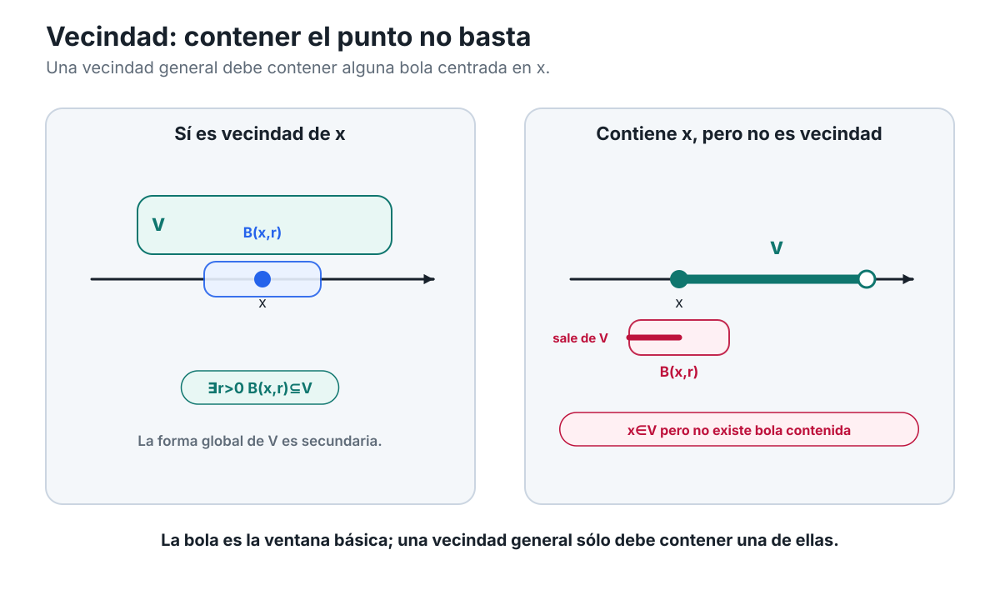
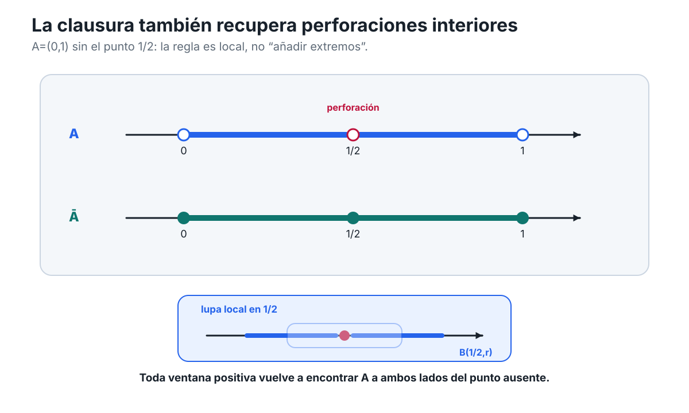
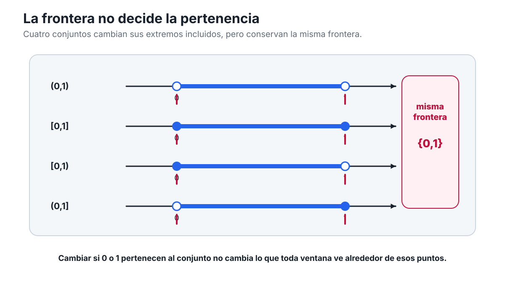
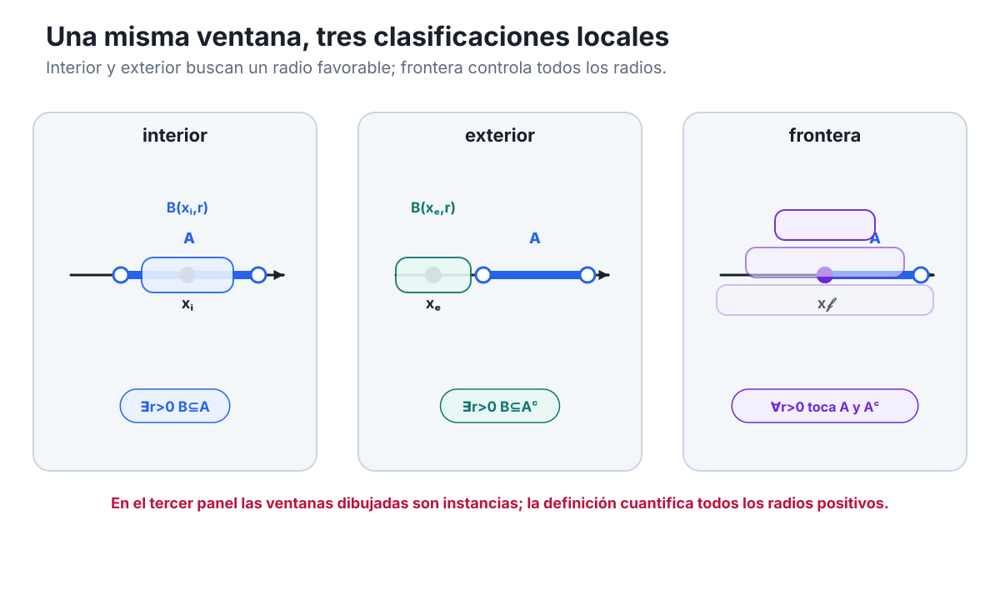
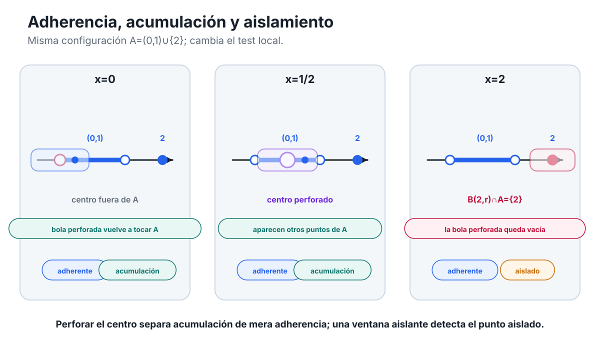
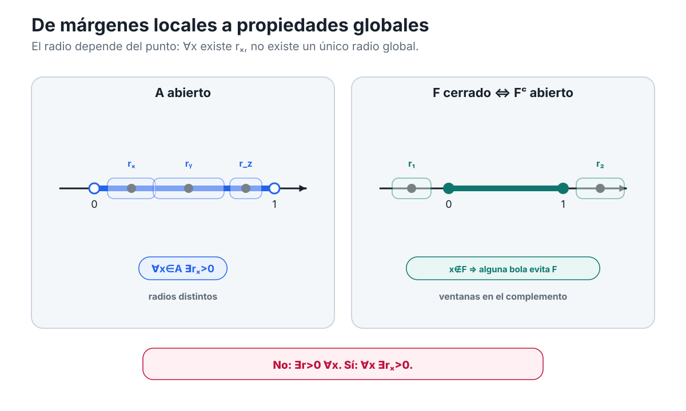
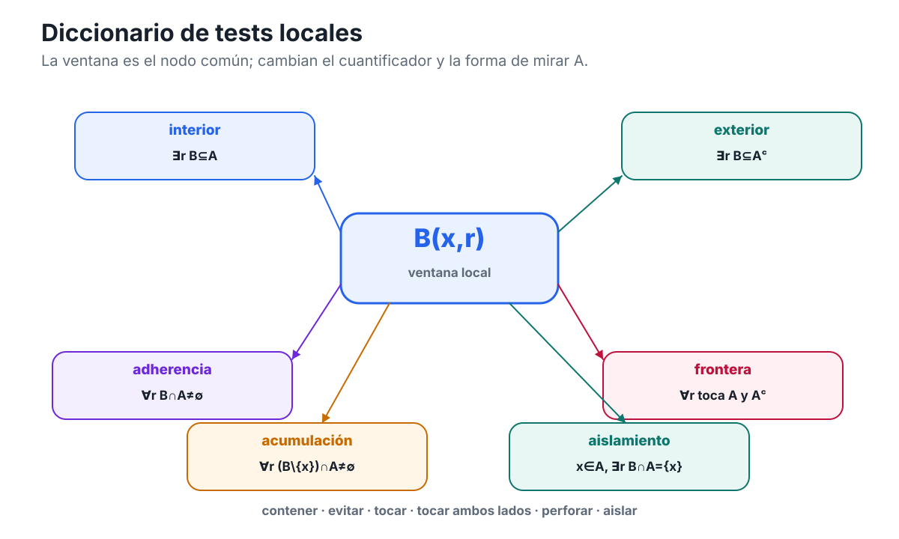

[Índice del libro](../para-matematicos/analisis-para-matematicos.md) · [Ejercicios](analisis-para-matematicos-capitulo-4-mirar-localmente-un-conjunto-ejercicios.md) · [Soluciones](analisis-para-matematicos-capitulo-4-mirar-localmente-un-conjunto-soluciones.md) · [Soluciones de microcontroles](analisis-para-matematicos-capitulo-4-mirar-localmente-un-conjunto-microcontroles.md)

Hasta ahora hemos mirado la recta real desde tres escalas distintas. En C01 aprendimos a reconocer su orden y su geometría métrica: intervalos, distancia, valor absoluto y bolas. En C02 usamos el orden para describir barreras de conjuntos, y en C03 añadimos la completitud que garantiza ciertas fronteras extremales. Ahora cambiaremos otra vez el punto de vista.

Esta vez no preguntaremos primero qué ocurre en todo un conjunto ni cuáles son sus mejores cotas. Fijaremos un punto $x$ y miraremos solamente lo que sucede **alrededor de él**.

La pregunta rectora del capítulo será:

> **¿Qué puede saberse de un conjunto mirando ventanas cada vez más pequeñas alrededor de un punto?**

La palabra «ventana» será sólo una metáfora visual. El objeto matemático ya lo conocemos. En C01 definimos, para $x\in\mathbb R$ y $r>0$, la bola abierta

$$
B(x,r)=\{y\in\mathbb R:|y-x|<r\}=(x-r,x+r).
$$

Una bola nos permite decidir qué parte de la recta estamos observando alrededor de $x$. Cambiar el radio cambia la escala de observación.

La novedad de C04 consistirá en usar sistemáticamente esas ventanas para clasificar la relación entre un punto y un conjunto $A\subseteq\mathbb R$.

Más adelante aparecerán preguntas de este tipo:

- ¿hay alguna ventana alrededor de $x$ que quede completamente dentro de $A$?;
- ¿puede alguna ventana evitar por completo a $A$?;
- ¿toda ventana, por pequeña que sea, vuelve a encontrar puntos de $A$?;
- ¿toda ventana encuentra simultáneamente puntos de $A$ y puntos que no pertenecen a $A$?;
- ¿qué cambia si, al mirar alrededor de $x$, excluimos el propio centro?

Estas preguntas darán origen a las nociones de interior, exterior, clausura, frontera, acumulación y aislamiento. Después veremos cómo ciertas condiciones locales, verificadas punto por punto, se convierten en propiedades globales como ser abierto o cerrado.

Pero no conviene introducir todos esos nombres a la vez. Primero necesitamos fijar con precisión el lenguaje de las ventanas.

Hay además una decisión metodológica importante. En este capítulo no usaremos sucesiones para definir ninguna de estas nociones. No necesitaremos escribir $x_n\to x$, ni invocar límites, compactidad o Bolzano–Weierstrass. Todo el lenguaje fundamental de C04 puede construirse directamente a partir de las bolas de C01 y de los cuantificadores «existe» y «para todo».

Eso hará visible una idea que reaparecerá durante todo el análisis:

$$
\boxed{
\text{muchas propiedades globales}
\quad\text{se reconocen mediante pruebas locales.}
}
$$

Empecemos entonces por el objeto que permitirá comprimir esas pruebas locales sin ocultar su contenido: la **vecindad** de un punto.

## 4.1. Ventanas alrededor de un punto: vecindades

En C01 una bola servía para traducir entre distancia, valor absoluto e intervalos. Si $x\in\mathbb R$ y $r>0$, las cuatro expresiones

$$
y\in B(x,r),
$$

$$
|y-x|<r,
$$

$$
d(x,y)<r,
$$

y

$$
x-r<y<x+r
$$

describen la misma condición.

Ahora nos interesa una lectura distinta. La bola $B(x,r)$ será una región de observación alrededor del centro $x$. El radio $r$ mide cuánto margen admitimos a ambos lados.

### Una ventana básica

Llamaremos **vecindad básica** de $x$ a cualquier bola abierta centrada en $x$:

> **Vecindad básica.** Si $x\in\mathbb R$ y $r>0$, la bola
>
> $$
> B(x,r)=(x-r,x+r)
> $$
>
> es una vecindad básica de $x$.

La palabra «básica» es importante. No queremos que «vecindad» sea simplemente otro nombre para «bola».

Por ejemplo,

$$
B(2,3)=(-1,5)
$$

es una vecindad básica de $2$, y

$$
B\left(2,\frac12\right)=\left(\frac32,\frac52\right)
$$

también lo es. Ninguna de las dos tiene privilegio sobre la otra. Alrededor del mismo punto hay infinitas ventanas básicas, una para cada radio positivo.

Si disminuimos el radio, la bola sólo puede hacerse más pequeña. En efecto, si

$$
0<s\le r,
$$

entonces

$$
B(x,s)\subseteq B(x,r).
$$

La demostración es inmediata a partir de la distancia. Si $y\in B(x,s)$, entonces

$$
|y-x|<s\le r,
$$

por lo que $y\in B(x,r)$.

Esta observación, elemental en apariencia, será decisiva: una vez que cierta propiedad es válida en una bola alrededor de $x$, también lo será en todas las bolas centradas en $x$ suficientemente pequeñas que queden dentro de ella.

### Una vecindad no tiene por qué ser una bola

Supongamos ahora que tenemos un conjunto $V\subseteq\mathbb R$ que rodea a $x$ de una manera menos regular. Quizá $V$ sea un intervalo grande; quizá tenga componentes alejadas que no nos importan; quizá contenga puntos aislados muy lejos del centro.

Para estudiar el comportamiento **local** alrededor de $x$, todo eso es secundario. Lo único que necesitamos saber es si dentro de $V$ cabe al menos una bola completa centrada en $x$.

Ésa será nuestra definición general.

> **Vecindad de un punto.** Sea $x\in\mathbb R$. Un conjunto $V\subseteq\mathbb R$ es una **vecindad de $x$** si existe un radio $r>0$ tal que
>
> $$
> B(x,r)\subseteq V.
> $$

En símbolos,

$$
V\text{ es vecindad de }x
\iff
\exists r>0:\ B(x,r)\subseteq V.
$$

Conviene mirar con cuidado el cuantificador. La definición dice

$$
\exists r>0,
$$

no

$$
\forall r>0.
$$

Basta encontrar **una** bola positiva centrada en $x$ que quede contenida en $V$.

Por supuesto, una vez encontrada una, obtenemos automáticamente muchas más. Si

$$
B(x,r_0)\subseteq V,
$$

y $0<s\le r_0$, entonces

$$
B(x,s)\subseteq B(x,r_0)\subseteq V.
$$

Así que la existencia de un radio admisible implica la existencia de ventanas arbitrariamente pequeñas alrededor de $x$ contenidas en $V$.

Éste es el sentido local de la definición.

### Un ejemplo: información lejana que no importa

Consideremos

$$
V=(-1,1)\cup\{3\}.
$$

¿Es $V$ una vecindad de $0$?

Sí. Por ejemplo,

$$
B\left(0,\frac12\right)=\left(-\frac12,\frac12\right)
\subseteq(-1,1)
\subseteq V.
$$

Por tanto,

$$
V\text{ es vecindad de }0.
$$

El punto $3$ no cumple ninguna función en esta verificación. Podríamos quitarlo, añadir otros puntos lejanos o modificar $V$ fuera de una región pequeña alrededor de $0$ sin cambiar el hecho esencial.

La definición de vecindad está diseñada precisamente para ignorar la información remota cuando queremos estudiar lo que ocurre localmente.

Esto permite formular una primera regla conceptual:

> **Para decidir si $V$ es vecindad de $x$, no necesitamos comprender todo $V$; necesitamos encontrar margen alrededor de $x$.**

Ese margen queda expresado por algún $r>0$ con

$$
(x-r,x+r)\subseteq V.
$$

### Pertenecer no basta

Hay una confusión que conviene eliminar desde el comienzo:

$$
x\in V
$$

no implica, por sí solo, que $V$ sea una vecindad de $x$.

Tomemos

$$
W=[0,1].
$$

Es cierto que

$$
0\in W.
$$

Pero $W$ no es una vecindad de $0$.

¿Por qué?

Para que lo fuera tendría que existir $r>0$ tal que

$$
B(0,r)=(-r,r)\subseteq[0,1].
$$

Eso es imposible. Para cualquier $r>0$, el número

$$
-\frac r2
$$

satisface

$$
-\frac r2\in(-r,r)=B(0,r),
$$

pero

$$
-\frac r2\notin[0,1].
$$

Por tanto ninguna bola positiva centrada en $0$ cabe dentro de $W$.

Tenemos entonces

$$
0\in W,
$$

pero

$$
W\text{ no es vecindad de }0.
$$

Esta diferencia será una de las ideas centrales del capítulo. Una cosa es que un punto pertenezca a un conjunto; otra, mucho más fuerte, es que el conjunto deje **margen en todas las direcciones de la recta** alrededor de ese punto.

En una dimensión, «todas las direcciones» significa simplemente izquierda y derecha. Si $x$ queda pegado a un borde del conjunto, la pertenencia puede mantenerse aunque desaparezca el margen.

### Toda vecindad contiene a su centro

La implicación contraria sí es automática:

> Si $V$ es una vecindad de $x$, entonces $x\in V$.

En efecto, si $V$ es vecindad de $x$, existe $r>0$ tal que

$$
B(x,r)\subseteq V.
$$

Pero

$$
|x-x|=0<r,
$$

de modo que

$$
x\in B(x,r).
$$

Por inclusión,

$$
x\in V.
$$

Así obtenemos una implicación que no puede invertirse:

$$
V\text{ vecindad de }x
\Longrightarrow
x\in V,
$$

pero, en general,

$$
x\in V
\centernot\Longrightarrow
V\text{ vecindad de }x.
$$

El conjunto $[0,1]$ en el punto $0$ proporciona ya un contraejemplo.

### La diferencia entre «estar cerca» y «ser una vecindad»

En lenguaje cotidiano decimos que un punto está «cerca» de otro sin especificar cuánto. En análisis, esa frase por sí sola no expresa una condición matemática completa.

Si queremos decir que $y$ está dentro de una tolerancia $r$ respecto de $x$, escribimos

$$
|y-x|<r
$$

o equivalentemente

$$
y\in B(x,r).
$$

Una vecindad, en cambio, no describe la relación entre dos puntos particulares. Describe un **conjunto que deja margen alrededor de un centro**.

Por eso son preguntas distintas:

1. ¿está $y$ dentro de la bola $B(x,r)$?;
2. ¿es $V$ una vecindad de $x$?

La primera se responde verificando una desigualdad de distancia.

La segunda se responde encontrando algún radio positivo cuya bola completa quede dentro de $V$.

En forma lógica:

$$
y\in B(x,r)
\iff
|y-x|<r,
$$

mientras que

$$
V\text{ vecindad de }x
\iff
\exists r>0\ \forall y\in\mathbb R:
\bigl(|y-x|<r\Rightarrow y\in V\bigr).
$$

La segunda expresión despliega la inclusión

$$
B(x,r)\subseteq V
$$

en cuantificadores. Es más larga, pero deja ver exactamente la estructura de la definición.

Hay un radio que debemos encontrar; una vez fijado ese radio, **todo** punto suficientemente cercano al centro debe pertenecer a $V$.

### Dos propiedades elementales de las vecindades

La definición contiene ya algunas consecuencias útiles. No necesitaremos axiomas de topología para obtenerlas; basta trabajar directamente con bolas e inclusiones.

#### Ampliar una vecindad conserva la vecindad

Supongamos que $V$ es vecindad de $x$ y que

$$
V\subseteq W.
$$

Como $V$ es vecindad, existe $r>0$ tal que

$$
B(x,r)\subseteq V.
$$

Entonces

$$
B(x,r)\subseteq V\subseteq W,
$$

por lo que $W$ también es vecindad de $x$.

La idea es sencilla: una vez que un conjunto contiene una ventana completa alrededor de $x$, añadirle puntos no puede destruir esa ventana.

#### Intersectar dos vecindades conserva una vecindad

Supongamos ahora que $V$ y $W$ son vecindades de $x$.

Entonces existen $r>0$ y $s>0$ tales que

$$
B(x,r)\subseteq V
$$

y

$$
B(x,s)\subseteq W.
$$

Tomemos

$$
\rho=\min\{r,s\}.
$$

Como $\rho>0$ y $\rho\le r,s$, tenemos

$$
B(x,\rho)\subseteq B(x,r)
$$

y

$$
B(x,\rho)\subseteq B(x,s).
$$

Por tanto,

$$
B(x,\rho)\subseteq V\cap W.
$$

Así que

$$
V\cap W
$$

también es una vecindad de $x$.

El argumento es importante porque muestra un patrón que veremos muchas veces: cuando dos condiciones locales vienen acompañadas de dos radios distintos, podemos satisfacer ambas a la vez tomando el menor de los dos.

La operación

$$
\rho=\min\{r,s\}
$$

funciona como un mecanismo de **sincronización de tolerancias**.

No estamos formulando todavía axiomas abstractos de una topología. Simplemente estamos leyendo lo que la definición de vecindad ya obliga a cumplir en $\mathbb R$.

### La figura que necesitaremos

La figura `C04-F01` distingue una vecindad básica de una vecindad general. La matemática no depende de la figura, pero el contraste hace visible el margen exigido por la definición.

{fig-alt="Dos paneles comparan un conjunto que contiene una bola centrada en x con otro que contiene a x sólo como punto de borde y no es vecindad."}

*Figura C04-F01. La bola es la ventana básica. Una vecindad general puede ser mayor, pero debe contener alguna bola centrada en el punto.*

La idea que la figura hace visible puede expresarse también sin dibujo:

$$
\boxed{
V\text{ es vecindad de }x
\iff
\text{alguna bola centrada en }x\text{ cabe dentro de }V.
}
$$

El aspecto exterior de $V$ puede ser complicado. Lo decisivo es el pequeño núcleo de margen alrededor de $x$.

La misma figura muestra también un contraste: un conjunto puede contener a $x$ y, sin embargo, no contener ninguna bola centrada en $x$. El ejemplo $[0,1]$ alrededor de $0$ ya nos proporciona ese caso.

### Una precisión sobre «arbitrariamente pequeño»

A veces se dice informalmente que una vecindad permite mirar «tan cerca de $x$ como queramos». Esa frase es correcta, pero debe interpretarse con cuidado.

La definición de vecindad exige solamente

$$
\exists r_0>0:
B(x,r_0)\subseteq V.
$$

A partir de ahí, para cualquier $s$ con

$$
0<s\le r_0,
$$

obtenemos

$$
B(x,s)\subseteq V.
$$

Por tanto podemos escoger radios positivos tan pequeños como deseemos **dentro del margen ya garantizado por $r_0$**.

Lo que no podemos afirmar es que todas las bolas, cualquiera sea su radio, estén contenidas en $V$.

Por ejemplo, para

$$
V=(-1,1)
$$

y $x=0$, tenemos

$$
B\left(0,\frac12\right)\subseteq V,
$$

pero

$$
B(0,2)=(-2,2)\not\subseteq V.
$$

Así que la lógica correcta es

$$
\exists r_0>0
\quad\Longrightarrow\quad
\forall s\in(0,r_0],
$$

no

$$
\forall r>0.
$$

Esta diferencia entre «existe un radio» y «para todo radio» será una de las principales fuentes de estructura en C04. Algunas nociones exigirán encontrar una ventana favorable; otras exigirán que **ninguna** ventana positiva pueda escapar de cierta condición.

Todavía no introduciremos esas nociones. Por ahora basta con aprender a leer correctamente el cuantificador de vecindad.

### Un margen que puede cambiar con el punto

También conviene evitar otra interpretación excesiva. El radio que certifica una vecindad pertenece al par formado por el punto y el conjunto.

Si $V$ es vecindad de distintos puntos, no existe razón para que el mismo radio funcione en todos ellos.

Por ejemplo, consideremos

$$
V=(-2,2).
$$

Para $x=0$ podemos tomar, entre muchas posibilidades,

$$
r=1.
$$

Pero si elegimos

$$
x=\frac{19}{10},
$$

el radio $1$ ya no sirve: la bola

$$
B\left(\frac{19}{10},1\right)
$$

se extiende más allá de $2$.

Sin embargo, un radio pequeño sí funciona. Por ejemplo,

$$
B\left(\frac{19}{10},\frac1{20}\right)
\subseteq(-2,2).
$$

El margen disponible depende de la posición del punto.

Esta observación será importante más adelante cuando pasemos de una afirmación local a una propiedad de todo un conjunto. La forma típica será

$$
\forall x\in A\ \exists r_x>0:
\text{cierta condición local se cumple alrededor de }x.
$$

El subíndice $x$ en $r_x$ recuerda que el radio puede depender del punto. No debemos transformarlo indebidamente en un único radio global.

### Una prueba geométrica útil: margen dentro de una bola

Las propias bolas tienen una estabilidad local especialmente clara. Si

$$
y\in B(x,r),
$$

entonces $y$ no está sobre la frontera de la bola: por definición,

$$
|y-x|<r.
$$

Queda por tanto un margen positivo

$$
\delta=r-|y-x|>0.
$$

Ese margen permite colocar una nueva bola centrada en $y$ completamente dentro de la bola original:

$$
B(y,\delta)\subseteq B(x,r).
$$

Veámoslo.

Si $z\in B(y,\delta)$, entonces

$$
|z-y|<\delta.
$$

Por la desigualdad triangular,

$$
|z-x|
\le |z-y|+|y-x|
<\delta+|y-x|.
$$

Como

$$
\delta=r-|y-x|,
$$

se obtiene

$$
|z-x|<r.
$$

Por tanto

$$
z\in B(x,r).
$$

Hemos demostrado:

> **Margen interno de una bola.** Si $y\in B(x,r)$, existe $\delta>0$ tal que
>
> $$
> B(y,\delta)\subseteq B(x,r).
> $$

La demostración no usa completitud. Sólo usa la desigualdad triangular y el hecho de que pertenecer a una bola abierta deja una diferencia positiva entre la distancia al centro y el radio.

Este pequeño resultado anticipa una idea que volverá a aparecer cuando estudiemos conjuntos con margen alrededor de cada uno de sus puntos. Por ahora lo importante es reconocer el mecanismo:

$$
\text{distancia al borde}
\quad\longrightarrow\quad
\text{radio local disponible}.
$$

### Qué hemos ganado al introducir vecindades

Podríamos formular todo el capítulo usando únicamente bolas. De hecho, cuando haya riesgo de ambigüedad, volveremos a ellas.

Entonces, ¿para qué introducir «vecindad»?

Porque el término nos permite separar dos niveles:

1. la **infraestructura métrica concreta**,
   $$
   B(x,r)=(x-r,x+r);
   $$
2. la **idea local abstractada sólo lo necesario**: un conjunto que contiene alguna de esas bolas.

Así podemos decir, por ejemplo, que $V$ es vecindad de $x$ sin tener que especificar de antemano la forma completa de $V$.

Pero no perderemos de vista qué significa esa frase. Cada vez que sea necesario podremos desplegarla como

$$
\exists r>0:\ B(x,r)\subseteq V.
$$

Ésta será una regla de lectura durante todo C04:

> **Cuando un término topológico comprima una condición local, debemos poder volver a escribir los cuantificadores y las bolas que contiene.**

De ese modo evitaremos aprender una lista de nombres desconectados de la geometría que los origina.

### Antes de seguir

1. Escribe $B(2,1/3)$ como intervalo abierto y explica qué desigualdad de valor absoluto describe sus puntos.
2. Para $V=(-1,1)\cup\{3\}$, exhibe dos radios distintos que certifiquen que $V$ es vecindad de $0$.
3. Decide si $[0,2)$ es una vecindad de $0$. No basta responder sí o no: debes justificarlo directamente a partir de la definición.
4. Demuestra que si $V$ es vecindad de $x$, entonces $x\in V$. Da después un contraejemplo que muestre que la conversa es falsa.
5. Supón que $V$ es vecindad de $x$ y que $V\subseteq W$. Demuestra que $W$ también es vecindad de $x$.
6. Si $V$ y $W$ son vecindades de $x$, demuestra que $V\cap W$ es vecindad de $x$ indicando explícitamente qué radio eliges.
7. Si $B(x,r)\subseteq V$ y $0<s\le r$, demuestra que $B(x,s)\subseteq V$. ¿Qué te dice esto sobre la frase «podemos mirar con ventanas arbitrariamente pequeñas»?
8. Sea $y\in B(x,r)$. Construye un $\delta>0$ en función de $r$ y $|y-x|$ tal que $B(y,\delta)\subseteq B(x,r)$, y señala exactamente dónde usas la desigualdad triangular.

Ya tenemos el lenguaje mínimo para empezar a clasificar puntos. En la siguiente sección la pregunta cambiará de «¿es $V$ una vecindad de $x$?» a «¿qué ocurre cuando el propio conjunto $A$ deja —o no deja— margen alrededor del punto?». Ese cambio dará la primera clasificación local propiamente dicha.

## 4.2. Interior y exterior: tener margen

En §4.1 introdujimos una forma precisa de decir que un conjunto deja espacio alrededor de un punto. Si $V$ es vecindad de $x$, existe algún radio positivo para el cual

$$
B(x,r)\subseteq V.
$$

Ahora aplicaremos esa misma idea al propio conjunto que queremos estudiar.

Fijemos

$$
A\subseteq\mathbb R.
$$

La primera pregunta local será:

> **¿Puede colocarse alrededor de $x$ una ventana completa que permanezca dentro de $A$?**

Si la respuesta es afirmativa, entonces $x$ no sólo pertenece al conjunto: dispone de un margen positivo antes de encontrar puntos exteriores a él.

### Punto interior: pertenecer con margen

Diremos que $x$ es un **punto interior** de $A$ si existe $r>0$ tal que

$$
B(x,r)\subseteq A.
$$

En símbolos,

$$
x\text{ es interior a }A
\iff
\exists r>0:\ B(x,r)\subseteq A.
$$

La definición es exactamente la noción de vecindad de §4.1 aplicada a $A$:

$$
\boxed{
x\text{ es interior a }A
\iff
A\text{ es vecindad de }x.
}
$$

Esto permite leer la palabra «interior» geométricamente. No basta saber que el punto está dentro del conjunto. Debemos poder movernos una distancia positiva hacia ambos lados de $x$ sin salir de $A$.

El radio no es parte del punto interior. Es un **certificado** de interioridad. Puede haber muchos radios que funcionen.

Por ejemplo, si

$$
A=(0,4)
$$

y

$$
x=1,
$$

entonces

$$
B\left(1,\frac12\right)
=\left(\frac12,\frac32\right)
\subseteq(0,4).
$$

Por tanto $1$ es interior a $A$.

También serviría cualquier radio menor o igual que $1$; lo único que exige la definición es la existencia de al menos uno.

### Pertenecer no basta

La distinción entre pertenencia e interioridad es fundamental.

Consideremos

$$
A=[0,1].
$$

El punto

$$
0\in A.
$$

Sin embargo, $0$ no es interior a $A$.

En efecto, tomemos cualquier $r>0$. El número

$$
-\frac r2
$$

satisface

$$
\left|-\frac r2-0\right|=\frac r2<r,
$$

por lo que

$$
-\frac r2\in B(0,r).
$$

Pero

$$
-\frac r2\notin[0,1].
$$

Así, para todo $r>0$,

$$
B(0,r)\not\subseteq[0,1].
$$

Luego $0$ pertenece al conjunto, pero carece de margen interior.

En cambio, si

$$
0<x<1,
$$

podemos tomar, por ejemplo,

$$
r=\frac12\min\{x,1-x\}>0.
$$

Entonces

$$
B(x,r)\subseteq(0,1)\subseteq[0,1].
$$

Por tanto todos los puntos estrictamente comprendidos entre $0$ y $1$ son interiores a $[0,1]$.

El contraste es:

$$
0\in[0,1]
\quad\text{pero}\quad
0\text{ no es interior},
$$

mientras que

$$
\frac12\in[0,1]
\quad\text{y}\quad
\frac12\text{ sí es interior}.
$$

La diferencia no está en la pertenencia. Está en la existencia de margen.

### El interior como conjunto de puntos

Reunimos ahora todos los puntos interiores de $A$ en un nuevo conjunto.

Definimos el **interior de $A$** por

$$
\operatorname{int}(A)
=
\{x\in\mathbb R:\exists r>0,\ B(x,r)\subseteq A\}.
$$

La definición implica inmediatamente

$$
\boxed{\operatorname{int}(A)\subseteq A.}
$$

La demostración es mínima pero importante.

Si

$$
x\in\operatorname{int}(A),
$$

existe $r>0$ con

$$
B(x,r)\subseteq A.
$$

Como el centro pertenece a toda bola centrada en él,

$$
x\in B(x,r).
$$

Por tanto

$$
x\in A.
$$

Así, ser interior implica pertenecer.

La conversa, como acabamos de ver con $0\in[0,1]$, es falsa en general.

### Qué ocurre con los intervalos

Los intervalos permiten ver con claridad qué elimina la operación interior.

Supongamos

$$
a<b.
$$

Para cualquiera de los cuatro intervalos acotados usuales,

$$
(a,b),\qquad [a,b],\qquad [a,b),\qquad (a,b],
$$

los puntos interiores son exactamente los puntos estrictamente comprendidos entre $a$ y $b$.

Por tanto,

$$
\operatorname{int}((a,b))=(a,b),
$$

$$
\operatorname{int}([a,b])=(a,b),
$$

$$
\operatorname{int}([a,b))=(a,b),
$$

y

$$
\operatorname{int}((a,b])=(a,b).
$$

El motivo es siempre el mismo.

Si

$$
a<x<b,
$$

entonces las dos cantidades

$$
x-a
\qquad\text{y}\qquad
b-x
$$

son positivas. Podemos elegir

$$
r=\frac12\min\{x-a,b-x\}>0,
$$

y obtenemos una bola que queda completamente entre $a$ y $b$.

En cambio, si un extremo está incluido en el conjunto, pertenecer al conjunto no le proporciona margen por el lado exterior.

Así, el interior no pregunta qué símbolos de corchete aparecen en una representación concreta. Pregunta qué puntos admiten una ventana completa dentro del conjunto.

### Punto exterior: tener margen fuera del conjunto

Existe una pregunta dual.

En lugar de pedir una ventana completamente contenida en $A$, podemos pedir una ventana que quede completamente fuera de $A$.

Diremos que $x$ es un **punto exterior** de $A$ si existe $r>0$ tal que

$$
B(x,r)\subseteq A^c.
$$

Equivalentemente,

$$
B(x,r)\cap A=\varnothing.
$$

Las dos formulaciones dicen exactamente lo mismo:

$$
B(x,r)\subseteq A^c
\iff
B(x,r)\cap A=\varnothing.
$$

Por tanto,

$$
x\text{ es exterior a }A
\iff
\exists r>0:\ B(x,r)\cap A=\varnothing.
$$

Reunimos todos esos puntos en el **exterior de $A$**:

$$
\operatorname{ext}(A)
=
\{x\in\mathbb R:\exists r>0,\ B(x,r)\subseteq A^c\}.
$$

Pero esta definición es exactamente la definición de interior aplicada al complemento. Luego

$$
\boxed{
\operatorname{ext}(A)=\operatorname{int}(A^c).
}
$$

Esta identidad no es una coincidencia de notación. Expresa la dualidad local:

> estar exterior a $A$ significa estar interior al complemento de $A$.

Como todo punto interior de $A^c$ pertenece a $A^c$, obtenemos además

$$
\operatorname{ext}(A)\subseteq A^c.
$$

Así como interioridad implica pertenencia, exterioridad implica no pertenencia.

Pero, otra vez, la conversa falla.

### No pertenecer tampoco basta

Tomemos ahora

$$
A=(0,1)
$$

y consideremos el punto

$$
x=0.
$$

Es claro que

$$
0\notin A.
$$

Sin embargo, $0$ no es exterior a $A$.

Para que lo fuera debería existir $r>0$ tal que

$$
B(0,r)\cap(0,1)=\varnothing.
$$

Pero para cualquier $r>0$ podemos elegir

$$
y=\min\left\{\frac r2,\frac12\right\}>0.
$$

Entonces

$$
y<r,
$$

de modo que

$$
y\in B(0,r),
$$

y además

$$
0<y<1,
$$
por lo que

$$
y\in A.
$$

Así,

$$
B(0,r)\cap A\ne\varnothing
$$

para todo $r>0$. No existe ninguna ventana alrededor de $0$ que evite por completo al conjunto.

Por tanto,

$$
0\notin A
\quad\text{pero}\quad
0\notin\operatorname{ext}(A).
$$

Este ejemplo es el dual exacto del extremo incluido de $[0,1]$:

- pertenecer a $A$ no garantiza ser interior;
- no pertenecer a $A$ no garantiza ser exterior.

El lenguaje local es más fino que la sola pregunta de pertenencia.

### Interior, exterior y una tercera posibilidad todavía sin nombre

Ya podemos distinguir dos comportamientos locales:

1. **interior:** alguna bola queda completamente dentro de $A$;
2. **exterior:** alguna bola queda completamente dentro de $A^c$.

Un punto no puede ser ambas cosas a la vez.

En efecto,

$$
\operatorname{int}(A)\subseteq A
$$

y

$$
\operatorname{ext}(A)\subseteq A^c,
$$

por lo que

$$
\boxed{
\operatorname{int}(A)\cap\operatorname{ext}(A)=\varnothing.
}
$$

Pero esto no significa que todo punto real deba ser interior o exterior.

Para

$$
A=[0,1],
$$

los puntos $0$ y $1$ no son interiores. Tampoco son exteriores, porque pertenecen a $A$ y toda bola centrada en ellos contiene al propio centro.

Para

$$
A=(0,1),
$$

los mismos puntos $0$ y $1$ tampoco son interiores ni exteriores: ahora no pertenecen a $A$, pero toda bola centrada en ellos alcanza puntos del intervalo.

Por tanto existe una tercera clase de comportamiento local que todavía no hemos nombrado.

No la definiremos aquí. Lo importante por ahora es reconocer que

$$
\mathbb R
\ne
\operatorname{int}(A)\cup\operatorname{ext}(A)
$$

en general.

Hay puntos para los cuales ninguna ventana queda completamente dentro de $A$ y ninguna ventana queda completamente fuera de $A$.

### Un ejemplo completo: $A=[0,1)$

Consideremos

$$
A=[0,1).
$$

Su interior es

$$
\operatorname{int}(A)=(0,1).
$$

Su exterior es

$$
\operatorname{ext}(A)=(-\infty,0)\cup(1,\infty).
$$

Quedan dos puntos especiales:

$$
0
\qquad\text{y}\qquad
1.
$$

El punto $0$ pertenece a $A$ pero no es interior.

El punto $1$ no pertenece a $A$ pero no es exterior.

En ambos casos toda ventana alrededor del punto contiene puntos de $A$ y puntos que no pertenecen a $A$.

Todavía no convertiremos esta observación en definición. Sólo la registramos como problema pendiente.

Este ejemplo resume una distinción que conviene conservar:

$$
\begin{array}{c|c|c}
\text{tipo de punto} & \text{pertenencia} & \text{margen local}\\
\hline
\text{interior} & x\in A & \exists r>0:\ B(x,r)\subseteq A\\
\text{exterior} & x\notin A & \exists r>0:\ B(x,r)\subseteq A^c\\
\text{ni interior ni exterior} & \text{puede ocurrir cualquiera} & \text{ninguno de los dos márgenes existe}
\end{array}
$$

La pertenencia del centro y el comportamiento de las ventanas son datos distintos.

### La figura de comparación local

La figura `C04-F02`, integrada físicamente en §4.4 una vez definida la frontera, compara con una misma gramática de ventanas los distintos comportamientos locales. En esta sección anticipamos sólo sus dos primeros casos: interior y exterior.

La parte ya disponible puede escribirse sin dibujo como

$$
\begin{aligned}
x_I\text{ interior a }A
&\iff
\exists r>0:\ B(x_I,r)\subseteq A,\\
x_E\text{ exterior a }A
&\iff
\exists r>0:\ B(x_E,r)\subseteq A^c.
\end{aligned}
$$

En ambos casos aparece el mismo cuantificador:

$$
\exists r>0.
$$

Lo que cambia es el lado en el cual debe caber la ventana.

### Monotonicidad del interior

La noción de interior responde de manera natural a la inclusión de conjuntos.

Supongamos que

$$
A\subseteq B.
$$

Si $x$ es interior a $A$, existe $r>0$ tal que

$$
B(x,r)\subseteq A.
$$

Como

$$
A\subseteq B,
$$

se sigue que

$$
B(x,r)\subseteq B.
$$

Por tanto $x$ también es interior a $B$.

Hemos demostrado la **monotonicidad del interior**:

$$
\boxed{
A\subseteq B
\quad\Longrightarrow\quad
\operatorname{int}(A)\subseteq\operatorname{int}(B).
}
$$

La lectura geométrica es inmediata: agrandar un conjunto no destruye una ventana que ya cabía dentro de él.

La exterioridad se comporta en sentido contrario. Si

$$
A\subseteq B,
$$

entonces

$$
B^c\subseteq A^c.
$$

Aplicando la monotonicidad del interior,

$$
\operatorname{int}(B^c)
\subseteq
\operatorname{int}(A^c).
$$

Por la identidad entre exterior e interior del complemento,

$$
\boxed{
A\subseteq B
\quad\Longrightarrow\quad
\operatorname{ext}(B)\subseteq\operatorname{ext}(A).
}
$$

Agrandar $A$ puede crear nuevos puntos interiores, pero puede destruir puntos exteriores, porque queda menos espacio disponible para que una ventana evite al conjunto.

### El radio depende del punto

Hay una sutileza de cuantificadores que conviene fijar antes de seguir.

Supongamos que cada punto de un conjunto $A$ tiene margen interior. La forma lógica de esa afirmación sería

$$
\forall x\in A\ \exists r_x>0:
B(x,r_x)\subseteq A.
$$

El radio puede depender de $x$.

No debemos reemplazar indebidamente esa afirmación por

$$
\exists r>0\ \forall x\in A:
B(x,r)\subseteq A.
$$

La segunda es mucho más fuerte.

El intervalo

$$
A=(0,1)
$$

muestra la diferencia. Cada $x\in(0,1)$ posee algún margen positivo. Por ejemplo,

$$
r_x=\frac12\min\{x,1-x\}
$$

funciona.

Pero no existe un único $r>0$ que sirva simultáneamente para todos los puntos del intervalo. Cerca de $0$ o de $1$, el margen disponible puede hacerse tan pequeño como sea necesario.

Éste será un patrón recurrente en análisis:

$$
\forall x\ \exists r_x
$$

no significa

$$
\exists r\ \forall x.
$$

La geometría local obliga a respetar el orden de los cuantificadores.

### Casos extremos

Las definiciones funcionan también para los dos conjuntos extremos de la recta.

Para

$$
A=\mathbb R,
$$

cada punto real admite cualquier bola positiva dentro de $\mathbb R$. Por tanto

$$
\operatorname{int}(\mathbb R)=\mathbb R.
$$

Y como

$$
\mathbb R^c=\varnothing,
$$

ningún punto puede ser exterior a toda la recta:

$$
\operatorname{ext}(\mathbb R)=\varnothing.
$$

Por otro lado,

$$
\operatorname{int}(\varnothing)=\varnothing,
$$

porque ninguna bola contiene cero puntos: siempre contiene, al menos, su centro.

Como

$$
\varnothing^c=\mathbb R,
$$

se obtiene

$$
\operatorname{ext}(\varnothing)=\mathbb R.
$$

Estos ejemplos confirman la dualidad

$$
\operatorname{ext}(A)=\operatorname{int}(A^c)
$$

en los casos más extremos posibles.

### Qué hemos aprendido del margen

La idea central de esta sección puede resumirse en dos tests:

$$
\boxed{
\begin{aligned}
x\in\operatorname{int}(A)
&\iff
\exists r>0:\ B(x,r)\subseteq A,\\
x\in\operatorname{ext}(A)
&\iff
\exists r>0:\ B(x,r)\subseteq A^c.
\end{aligned}
}
$$

Ambos preguntan por la existencia de una ventana favorable.

La diferencia entre ellos no es cuánto vale el radio, sino **qué lado puede ocupar toda la ventana**.

También hemos separado dos niveles de información:

$$
\text{pertenencia}
\qquad\text{y}\qquad
\text{comportamiento local alrededor del punto}.
$$

La primera sólo dice dónde está el centro. La segunda pregunta qué ocurre en una región completa alrededor de él.

Esa distinción permitirá tratar los puntos para los cuales ninguna de las dos ventanas favorables existe.

### Antes de seguir

1. Para $A=[-2,3]$, determina cuáles de los puntos $-2$, $0$ y $3$ son interiores. En cada caso interior, exhibe un radio que funcione; en cada caso no interior, demuestra que ningún radio puede funcionar.
2. Demuestra directamente desde la definición que $\operatorname{int}(A)\subseteq A$ para todo $A\subseteq\mathbb R$.
3. Sea $A=(a,b)$ con $a<b$ y $x\in(a,b)$. Construye un radio explícito en función de $x-a$ y $b-x$ que certifique que $x$ es interior.
4. Para $A=(0,1)$, explica por qué $0\notin A$ pero $0$ no es exterior a $A$. Tu argumento debe comenzar con un radio arbitrario $r>0$.
5. Demuestra que $x$ es exterior a $A$ si y sólo si $A^c$ es vecindad de $x$.
6. Prueba la identidad $\operatorname{ext}(A)=\operatorname{int}(A^c)$ sin usar ninguna noción posterior de este capítulo.
7. Si $A\subseteq B$, demuestra $\operatorname{int}(A)\subseteq\operatorname{int}(B)$ y deriva después $\operatorname{ext}(B)\subseteq\operatorname{ext}(A)$.
8. Para $A=[0,1)$, verifica que
   $$
   \operatorname{int}(A)=(0,1)
   $$
   y
   $$
   \operatorname{ext}(A)=(-\infty,0)\cup(1,\infty).
   $$
   ¿Qué ocurre localmente en $0$ y en $1$ que impide clasificarlos en cualquiera de esos dos conjuntos?

Hasta aquí hemos estudiado dos maneras de disponer de margen: quedar completamente dentro de $A$ o completamente fuera de él. Pero el ejemplo de los extremos muestra una tercera situación: puede ocurrir que **ninguna** ventana alrededor del punto logre evitar al conjunto, aunque el punto mismo no pertenezca a él.

La siguiente sección aislará precisamente esa condición. En lugar de preguntar si existe una ventana favorable, preguntaremos qué sucede cuando **toda** ventana positiva alrededor de un punto está obligada a tocar el conjunto.

## 4.3. Clausura: puntos que no pueden evitar al conjunto

La sección anterior distinguió dos situaciones locales mediante un cuantificador existencial. Un punto era interior cuando **alguna** bola quedaba completamente dentro de $A$, y era exterior cuando **alguna** bola evitaba por completo a $A$.

Ahora cambiaremos el cuantificador.

En vez de preguntar si existe una ventana favorable, preguntaremos qué sucede cuando ninguna ventana positiva centrada en $x$ consigue evitar al conjunto.

La condición es

$$
\forall r>0:
B(x,r)\cap A\ne\varnothing.
$$

Esta afirmación no exige que una bola completa quede dentro de $A$. Sólo exige que, por pequeña que sea la bola, aparezca al menos un punto de $A$ en su interior.

### Punto adherente y clausura

Sea $A\subseteq\mathbb R$.

Diremos que $x\in\mathbb R$ es un **punto adherente** de $A$ si

$$
\boxed{
\forall r>0:\ B(x,r)\cap A\ne\varnothing.
}
$$

La **clausura** de $A$ es el conjunto de todos sus puntos adherentes y se denota por

$$
\boxed{
\overline A
=
\{x\in\mathbb R:\forall r>0,\ B(x,r)\cap A\ne\varnothing\}.
}
$$

Conviene separar desde el principio los dos niveles terminológicos:

- **punto adherente** describe a un punto $x$;
- **clausura** describe al conjunto formado por todos esos puntos.

En este capítulo no usaremos «punto de clausura» como término principal. La notación

$$
x\in\overline A
$$

se leerá como «$x$ es adherente a $A$».

La pregunta diagnóstica es:

> **¿puede alguna ventana positiva alrededor de $x$ evitar por completo al conjunto?**

Si la respuesta es no, entonces $x$ es adherente.

### Adherencia como negación exacta de exterioridad

En §4.2 definimos que $x$ es exterior a $A$ cuando

$$
\exists r>0:\ B(x,r)\cap A=\varnothing.
$$

Neguemos esa afirmación.

La negación de

$$
\exists r>0:\ B(x,r)\cap A=\varnothing
$$

es

$$
\forall r>0:\ B(x,r)\cap A\ne\varnothing.
$$

Pero ésta es exactamente la definición de punto adherente.

Por tanto,

$$
\boxed{
x\in\overline A
\iff
x\notin\operatorname{ext}(A).
}
$$

Como igualdad de conjuntos,

$$
\boxed{
\overline A
=
\bigl(\operatorname{ext}(A)\bigr)^c.
}
$$

Y como en §4.2 demostramos que

$$
\operatorname{ext}(A)=\operatorname{int}(A^c),
$$

obtenemos la dualidad

$$
\boxed{
\overline A
=
\bigl(\operatorname{int}(A^c)\bigr)^c.
}
$$

Esta identidad es importante porque muestra que clausura e interior no son conceptos independientes colocados arbitrariamente uno al lado del otro. Se transforman uno en otro al pasar al complemento.

No hemos usado todavía la noción de conjunto cerrado. Esa lectura aparecerá más adelante, después de definirla en §4.7.

### Todo punto del conjunto es adherente

La definición tiene una consecuencia inmediata.

Supongamos que

$$
x\in A.
$$

Sea $r>0$ cualquiera. Como toda bola contiene a su centro,

$$
x\in B(x,r).
$$

Y como también $x\in A$, tenemos

$$
x\in B(x,r)\cap A.
$$

Por tanto

$$
B(x,r)\cap A\ne\varnothing
$$

para todo $r>0$.

Así,

$$
x\in\overline A.
$$

Hemos demostrado:

$$
\boxed{
A\subseteq\overline A.
}
$$

Este resultado explica por qué la clausura nunca elimina puntos del conjunto original.

Pero no dice que

$$
\overline A=A.
$$

La clausura puede contener puntos que no pertenecen a $A$.

### Un punto adherente puede quedar fuera del conjunto

Consideremos

$$
A=(0,1)
$$

y el punto

$$
x=0.
$$

Sabemos que

$$
0\notin A.
$$

Sin embargo, para todo $r>0$ podemos tomar

$$
a=\min\left\{\frac r2,\frac12\right\}.
$$

Entonces

$$
0<a<1
$$

y

$$
|a-0|=a<r.
$$

Por tanto

$$
a\in B(0,r)\cap A.
$$

Como el radio $r>0$ era arbitrario,

$$
0\in\overline A.
$$

Así obtenemos el contraste

$$
\boxed{
0\notin(0,1)
\qquad\text{pero}\qquad
0\in\overline{(0,1)}.
}
$$

Lo mismo ocurre con $1$.

La adherencia no pregunta si el centro pertenece al conjunto. Pregunta si el conjunto puede ser evitado localmente.

Ésta es una diferencia fundamental:

$$
\text{pertenencia}
\quad\neq\quad
\text{adherencia}.
$$

Todo punto perteneciente es adherente, pero un punto adherente puede estar fuera del conjunto.

### Clausura no significa «añadir los extremos»

Los intervalos pueden producir una intuición engañosa. Si miramos sólo

$$
A=(0,1),
$$

vemos que su clausura será

$$
[0,1],
$$

y podríamos concluir demasiado deprisa que clausurar un conjunto significa simplemente «añadir los extremos que faltan».

Esa regla no es la definición y falla incluso en ejemplos muy elementales.

Consideremos

$$
A=(0,1)\setminus\left\{\frac12\right\}.
$$

El conjunto tiene dos extremos ausentes, $0$ y $1$, pero además posee una perforación en un punto que está estrictamente entre ellos.

Mostraremos que

$$
\boxed{
\overline A=[0,1].
}
$$

Los puntos de $A$ son adherentes automáticamente porque

$$
A\subseteq\overline A.
$$

Quedan por comprobar

$$
0,
\qquad
\frac12,
\qquad
1.
$$

Para $x=0$ y un radio arbitrario $r>0$, tomemos

$$
a_0=\min\left\{\frac r2,\frac14\right\}.
$$

Entonces

$$
0<a_0\le\frac14,
$$

de modo que $a_0\in A$, y además

$$
|a_0|<r.
$$

Por tanto toda bola centrada en $0$ intersecta $A$.

Para $x=1$, tomemos

$$
a_1=1-\min\left\{\frac r2,\frac14\right\}.
$$

Así

$$
\frac34\le a_1<1,
$$

de modo que $a_1\in A$, y

$$
|a_1-1|<r.
$$

Por último, para el punto perforado $x=1/2$, tomemos

$$
a_{1/2}
=
\frac12+\min\left\{\frac r2,\frac14\right\}.
$$

Entonces

$$
\frac12<a_{1/2}\le\frac34,
$$

de modo que $a_{1/2}\in A$, y

$$
\left|a_{1/2}-\frac12\right|<r.
$$

Así, los tres puntos faltantes son adherentes.

Ahora veamos que ningún punto exterior a $[0,1]$ es adherente.

Si $x<0$, tomemos

$$
r=\frac{-x}{2}>0.
$$

Entonces

$$
B(x,r)\subset(-\infty,0),
$$

y por tanto

$$
B(x,r)\cap A=\varnothing.
$$

Si $x>1$, tomemos

$$
r=\frac{x-1}{2}>0.
$$

Entonces

$$
B(x,r)\subset(1,\infty),
$$

y otra vez

$$
B(x,r)\cap A=\varnothing.
$$

No hay más puntos adherentes. Por tanto

$$
\overline{(0,1)\setminus\{1/2\}}=[0,1].
$$

El punto $1/2$ muestra por qué la imagen «añadir extremos» es insuficiente. La regla verdadera es local:

> **un punto pertenece a la clausura exactamente cuando ninguna bola positiva centrada en él logra evitar al conjunto.**

### La figura de clausura

La figura `C04-F03` rompe precisamente la falsa identificación entre clausura y «cerrar extremos».

{fig-alt="Dos rectas muestran un intervalo abierto perforado en un medio y su clausura; una lupa local muestra que toda ventana alrededor de la perforación vuelve a encontrar el conjunto."}

*Figura C04-F03. La clausura no se define añadiendo extremos: también recupera puntos interiores ausentes cuando ninguna ventana logra evitar al conjunto.*

La figura usa el ejemplo

$$
A=(0,1)\setminus\left\{\frac12\right\}
$$

junto con

$$
\overline A=[0,1].
$$

Debe leerse con una precaución obligatoria: ninguna cantidad finita de ventanas dibujadas demuestra una afirmación de la forma

$$
\forall r>0.
$$

Los radios visibles serán sólo **instancias** del test local. La demostración sigue siendo el argumento cuantificado que acabamos de dar.

### Reformulación mediante vecindades

La definición de adherencia puede expresarse también usando el lenguaje de §4.1.

Afirmamos que

$$
\boxed{
x\in\overline A
\iff
\text{toda vecindad de }x\text{ intersecta }A.
}
$$

Demostremos ambas direcciones.

Supongamos primero que

$$
x\in\overline A.
$$

Sea $V$ una vecindad de $x$. Por definición de vecindad, existe $r>0$ tal que

$$
B(x,r)\subseteq V.
$$

Como $x$ es adherente,

$$
B(x,r)\cap A\ne\varnothing.
$$

Por la inclusión anterior,

$$
V\cap A\ne\varnothing.
$$

Recíprocamente, supongamos que toda vecindad de $x$ intersecta $A$. Cada bola $B(x,r)$ con $r>0$ es una vecindad de $x$. Por tanto

$$
B(x,r)\cap A\ne\varnothing
$$

para todo $r>0$.

Así,

$$
x\in\overline A.
$$

La versión con vecindades comprime la definición, pero no cambia su contenido. Siempre podemos volver al test explícito con bolas.

### Monotonicidad de la clausura

La clausura también respeta la inclusión de conjuntos.

Supongamos que

$$
A\subseteq B.
$$

Sea

$$
x\in\overline A.
$$

Entonces para todo $r>0$,

$$
B(x,r)\cap A\ne\varnothing.
$$

Como $A\subseteq B$, cualquier punto que pertenezca a $B(x,r)\cap A$ pertenece también a $B(x,r)\cap B$. Por tanto

$$
B(x,r)\cap B\ne\varnothing
$$

para todo $r>0$.

Así,

$$
x\in\overline B.
$$

Hemos demostrado:

$$
\boxed{
A\subseteq B
\quad\Longrightarrow\quad
\overline A\subseteq\overline B.
}
$$

La lectura geométrica es natural: si un conjunto pequeño es imposible de evitar alrededor de cierto punto, un conjunto que lo contiene tampoco puede ser evitado allí.

### Clausurar dos veces no añade nada nuevo

La operación de clausura es **idempotente**:

$$
\boxed{
\overline{\overline A}=\overline A.
}
$$

Una inclusión es inmediata. Como

$$
A\subseteq\overline A,
$$

la monotonicidad da

$$
\overline A\subseteq\overline{\overline A}.
$$

La dirección contraria contiene la idea interesante.

Supongamos que

$$
x\in\overline{\overline A}.
$$

Queremos demostrar que

$$
x\in\overline A.
$$

Sea $r>0$ arbitrario.

Como $x$ es adherente a $\overline A$, la bola de radio $r/2$ alrededor de $x$ intersecta $\overline A$. Existe, por tanto,

$$
y\in B\left(x,\frac r2\right)\cap\overline A.
$$

Como $y\in\overline A$, la bola de radio $r/2$ alrededor de $y$ intersecta $A$. Existe entonces

$$
a\in B\left(y,\frac r2\right)\cap A.
$$

Por la desigualdad triangular,

$$
|a-x|
\le
|a-y|+|y-x|
<
\frac r2+\frac r2
=r.
$$

Por tanto

$$
a\in B(x,r)\cap A.
$$

Como $r>0$ era arbitrario,

$$
x\in\overline A.
$$

Así obtenemos la inclusión

$$
\overline{\overline A}\subseteq\overline A,
$$

y por ambas direcciones,

$$
\overline{\overline A}=\overline A.
$$

Esta demostración es completamente local. No hemos usado la noción de conjunto cerrado, sucesiones ni completitud. Sólo hemos usado bolas, la definición de adherencia y la desigualdad triangular.

### Casos extremos

Las definiciones se comportan como cabe esperar en los extremos.

Para el conjunto vacío,

$$
\overline\varnothing=\varnothing.
$$

En efecto, para cualquier $x\in\mathbb R$ y cualquier $r>0$,

$$
B(x,r)\cap\varnothing=\varnothing,
$$

así que ningún punto es adherente a $\varnothing$.

Para toda la recta,

$$
\overline{\mathbb R}=\mathbb R,
$$

porque cada bola centrada en un punto real contiene al menos al propio centro y, por tanto, intersecta $\mathbb R$.

Estas dos identidades son compatibles con

$$
A\subseteq\overline A
$$

y con la idempotencia.

### Qué información añade la clausura

Podemos resumir lo aprendido mediante tres niveles:

$$
\boxed{
\begin{array}{c|c}
\text{pregunta} & \text{test local}\\
\hline
x\in A & \text{¿el centro pertenece a }A?\\
x\in\operatorname{ext}(A) & \exists r>0:\ B(x,r)\cap A=\varnothing\\
x\in\overline A & \forall r>0:\ B(x,r)\cap A\ne\varnothing
\end{array}
}
$$

La segunda y la tercera fila son negaciones exactas.

Por eso

$$
\mathbb R
=
\overline A\,\dot\cup\,\operatorname{ext}(A).
$$

Todo punto real pertenece exactamente a una de esas dos clases: o existe una ventana que evita $A$, o ninguna ventana positiva puede evitarlo.

Esto todavía no nos dice si una ventana alrededor de un punto adherente ve también puntos del complemento. Esa pregunta será distinta y exigirá considerar simultáneamente a $A$ y a $A^c$.

### Antes de seguir

1. Despliega la negación lógica de
   $$
   \exists r>0:\ B(x,r)\cap A=\varnothing
   $$
   y explica por qué produce exactamente la definición de punto adherente.
2. Demuestra directamente que $A\subseteq\overline A$ para todo $A\subseteq\mathbb R$.
3. Para $A=(0,1)$, prueba con un radio arbitrario que $0,1\in\overline A$, aunque ninguno de los dos pertenezca a $A$.
4. Demuestra
   $$
   \overline A=(\operatorname{ext}(A))^c=(\operatorname{int}(A^c))^c.
   $$
5. Si $A\subseteq B$, demuestra la monotonicidad
   $$
   \overline A\subseteq\overline B.
   $$
6. Reproduce la prueba de
   $$
   \overline{\overline A}=\overline A
   $$
   indicando por qué se usan radios $r/2$ y dónde interviene la desigualdad triangular.
7. Sea
   $$
   A=(0,1)\setminus\left\{\frac12\right\}.
   $$
   Demuestra sin usar sucesiones que $1/2\in\overline A$ y que ningún punto de $(-\infty,0)\cup(1,\infty)$ pertenece a $\overline A$.
8. Demuestra que $x\in\overline A$ si y sólo si toda vecindad de $x$ intersecta $A$. Tu prueba debe volver explícitamente a una bola contenida en la vecindad.

La clausura responde a una pregunta unilateral: **¿puede la ventana evitar a $A$?** Para un punto adherente la respuesta es no.

Pero todavía puede ocurrir que alguna ventana quede completamente dentro de $A$. En ese caso el punto es interior. También puede ocurrir que toda ventana toque a $A$ y, al mismo tiempo, toque a su complemento.

La siguiente sección aislará esta segunda situación. Allí la ventana deberá mirar obligatoriamente **ambos lados**.

## 4.4. Frontera: toda ventana ve ambos lados

En §4.2 aparecieron puntos para los cuales no existe margen interior ni margen exterior. En §4.3 aprendimos a describir una de las razones posibles: un punto puede ser imposible de separar localmente del conjunto, es decir, puede pertenecer a su clausura.

Ahora queremos una condición más exigente.

No basta con que toda ventana toque a $A$. Queremos que ninguna ventana pueda quedarse completamente de un solo lado.

La pregunta local es:

> **¿Qué puntos obligan a toda ventana a ver simultáneamente al conjunto y a su complemento?**

### Punto de frontera

Sea

$$
A\subseteq\mathbb R.
$$

Diremos que $x\in\mathbb R$ es un **punto de frontera de $A$** si para todo $r>0$ se cumplen simultáneamente

$$
B(x,r)\cap A\ne\varnothing
$$

y

$$
B(x,r)\cap A^c\ne\varnothing.
$$

El conjunto de todos los puntos de frontera de $A$ se llama **frontera de $A$** y se denota por

$$
\partial A.
$$

Por tanto,

$$
\boxed{
x\in\partial A
\iff
\forall r>0:
\bigl(B(x,r)\cap A\ne\varnothing\bigr)
\ \text{y}\
\bigl(B(x,r)\cap A^c\ne\varnothing\bigr).
}
$$

La definición contiene dos condiciones universales al mismo tiempo.

Un punto fronterizo no permite encontrar:

- una bola que evite a $A$;
- ni una bola que evite a $A^c$.

Toda ventana positiva ve ambos lados.

### La frontera como intersección de dos clausuras

La definición puede leerse inmediatamente con el lenguaje de §4.3.

Recordemos que

$$
x\in\overline A
\iff
\forall r>0:\ B(x,r)\cap A\ne\varnothing.
$$

Aplicando la misma definición al complemento,

$$
x\in\overline{A^c}
\iff
\forall r>0:\ B(x,r)\cap A^c\ne\varnothing.
$$

Por tanto, exigir ambas condiciones simultáneamente equivale a exigir

$$
x\in\overline A
\quad\text{y}\quad
x\in\overline{A^c}.
$$

Hemos demostrado:

$$
\boxed{
\partial A
=
\overline A\cap\overline{A^c}.
}
$$

Esta identidad explica por qué la frontera es perfectamente simétrica respecto de $A$ y su complemento.

En efecto,

$$
\partial(A^c)
=
\overline{A^c}\cap\overline{(A^c)^c}
=
\overline{A^c}\cap\overline A,
$$

de modo que

$$
\boxed{
\partial(A^c)=\partial A.
}
$$

Cambiar qué lado llamamos «conjunto» y qué lado llamamos «complemento» no cambia los puntos donde toda ventana ve ambos.

### La pertenencia no decide la frontera

La definición de frontera no contiene la condición

$$
x\in A
$$

ni la condición

$$
x\notin A.
$$

Sólo pregunta qué ocurre dentro de todas las bolas centradas en $x$.

Por eso un punto de frontera puede pertenecer al conjunto o quedar fuera de él.

Consideremos primero

$$
A=[0,1].
$$

Mostremos que $0$ es fronterizo.

Sea $r>0$. Como $0\in A$,

$$
0\in B(0,r)\cap A,
$$

de modo que la bola intersecta $A$.

Además,

$$
-\frac r2\in B(0,r)
$$

y

$$
-\frac r2\notin[0,1],
$$

por lo que

$$
B(0,r)\cap A^c\ne\varnothing.
$$

Así,

$$
0\in\partial[0,1].
$$

Aquí el punto de frontera **pertenece** al conjunto.

Ahora tomemos

$$
A=(0,1).
$$

Otra vez $0$ es fronterizo.

Para cualquier $r>0$, el punto

$$
-\frac r2
$$

pertenece a $A^c\cap B(0,r)$.

Para encontrar un punto de $A$ dentro de la misma bola, podemos tomar

$$
a=\min\left\{\frac r2,\frac12\right\}.
$$

Entonces

$$
0<a<1
$$

y

$$
a<r,
$$

de modo que

$$
a\in A\cap B(0,r).
$$

Por tanto,

$$
0\in\partial(0,1),
$$

aunque

$$
0\notin(0,1).
$$

La conclusión es esencial:

$$
\boxed{
x\in\partial A
\quad\text{no decide}\quad
x\in A.
}
$$

La frontera es una propiedad del **entorno local del punto**, no de la pertenencia del centro considerada aisladamente.

### Cuatro intervalos, una misma frontera

La independencia anterior puede verse de manera especialmente limpia comparando

$$
(0,1),\qquad
[0,1],\qquad
[0,1),\qquad
(0,1].
$$

En los cuatro casos,

$$
\boxed{
\partial A=\{0,1\}.
}
$$

La razón es la misma en cada variante.

Si

$$
0<x<1,
$$

entonces existe margen interior. Por ejemplo,

$$
r_x=\frac12\min\{x,1-x\}>0
$$

satisface

$$
B(x,r_x)\subseteq(0,1),
$$

y por tanto la bola queda dentro de cualquiera de los cuatro conjuntos en los que $x$ pertenece. Ese punto no puede ser fronterizo porque hemos encontrado una ventana que no toca el complemento.

Si

$$
x<0,
$$

podemos escoger una bola suficientemente pequeña contenida en $(-\infty,0)$; si

$$
x>1,
$$

podemos escoger una bola suficientemente pequeña contenida en $(1,\infty)$. En ambos casos existe margen exterior, de modo que esos puntos tampoco son fronterizos.

Quedan únicamente

$$
0
\qquad\text{y}\qquad
1.
$$

Alrededor de cada uno, toda bola positiva contiene puntos del intervalo $(0,1)$ y también puntos exteriores a $[0,1]$. Por tanto ambos son fronterizos, independientemente de que el extremo concreto haya sido incluido o excluido del conjunto.

La figura `C04-F05` hace visible exactamente esta independencia.

{fig-alt="Cuatro filas muestran los intervalos (0,1), [0,1], [0,1) y (0,1]; la pertenencia de los extremos cambia pero la frontera permanece igual a {0,1}."}

*Figura C04-F05. La frontera describe lo que ve toda ventana, no si el centro pertenece al conjunto.*

La figura no define frontera mediante «extremos». Muestra sólo un ejemplo donde modificar la pertenencia de los extremos deja inalterado el test local de frontera.

### La frontera no significa «los extremos»

Los intervalos anteriores pueden inducir otra falsa regla:

> «la frontera de un conjunto está formada por sus extremos».

Eso es cierto para esos intervalos, pero no constituye una definición general.

Volvamos al conjunto perforado de §4.3:

$$
A=(0,1)\setminus\left\{\frac12\right\}.
$$

Ya sabemos que

$$
\overline A=[0,1].
$$

El punto

$$
x=\frac12
$$

no es un extremo de $(0,1)$.

Sin embargo, es fronterizo.

Sea $r>0$. El propio centro satisface

$$
\frac12\in A^c\cap B\left(\frac12,r\right).
$$

Por otro lado, como demostramos en §4.3, existe un punto de $A$ arbitrariamente cerca de $1/2$. Por ejemplo,

$$
a=
\frac12+
\min\left\{\frac r2,\frac14\right\}
$$

satisface

$$
a\in A\cap B\left(\frac12,r\right).
$$

Por tanto toda bola centrada en $1/2$ intersecta ambos lados:

$$
\frac12\in\partial A.
$$

Los puntos $0$ y $1$ son fronterizos por el mismo argumento usado para los extremos de los intervalos anteriores. Si, en cambio,

$$
x\in(0,1)\setminus\left\{\frac12\right\},
$$

podemos elegir un radio menor que las tres distancias positivas

$$
x,\qquad 1-x,\qquad \left|x-\frac12\right|,
$$

y obtener una bola contenida en $A$; por tanto $x$ no es fronterizo. Los puntos exteriores a $[0,1]$ admiten una bola disjunta de $A$ y tampoco son fronterizos.

Así hemos agotado todos los casos y podemos concluir:

$$
\boxed{
\partial\left((0,1)\setminus\left\{\frac12\right\}\right)
=
\left\{0,\frac12,1\right\}.
}
$$

La frontera detecta cambios locales entre $A$ y $A^c$, aunque esos cambios ocurran en una perforación interior y no en un extremo global.

### Una segunda identidad: clausura menos interior

La frontera también puede describirse usando solamente clausura e interior.

Partimos de

$$
\partial A
=
\overline A\cap\overline{A^c}.
$$

Por la dualidad de §4.3 aplicada a $A^c$,

$$
\overline{A^c}
=
\bigl(\operatorname{int}((A^c)^c)\bigr)^c
=
\bigl(\operatorname{int}(A)\bigr)^c.
$$

Sustituyendo,

$$
\partial A
=
\overline A
\cap
\bigl(\operatorname{int}(A)\bigr)^c.
$$

Y, por definición de diferencia de conjuntos,

$$
\boxed{
\partial A
=
\overline A\setminus\operatorname{int}(A).
}
$$

Esta identidad tiene una lectura geométrica precisa.

Los puntos de $\overline A$ son aquellos para los cuales ninguna ventana puede evitar a $A$.

Entre ellos, los puntos de $\operatorname{int}(A)$ son los que sí admiten alguna ventana completamente contenida en $A$.

Al quitar esos puntos interiores de la clausura quedan exactamente aquellos para los cuales:

- ninguna ventana evita a $A$;
- ninguna ventana queda completamente dentro de $A$.

Es decir, quedan los puntos donde toda ventana ve los dos lados.

### Interior, frontera y exterior agotan la recta

Ya disponemos de tres clases locales:

$$
\operatorname{int}(A),
\qquad
\partial A,
\qquad
\operatorname{ext}(A).
$$

Mostraremos ahora que son disjuntas dos a dos y que juntas cubren toda la recta.

Primero,

$$
\operatorname{int}(A)\cap\operatorname{ext}(A)=\varnothing
$$

por §4.2.

Además, si $x\in\partial A$, toda bola centrada en $x$ intersecta $A^c$. Por tanto no puede existir una bola contenida en $A$, y así

$$
x\notin\operatorname{int}(A).
$$

Análogamente, toda bola centrada en un punto fronterizo intersecta $A$, de modo que ninguna puede quedar contenida en $A^c$. Por tanto

$$
x\notin\operatorname{ext}(A).
$$

Así, las tres clases son disjuntas dos a dos.

Falta demostrar que no queda ningún punto fuera de ellas.

Sea

$$
x\in\mathbb R.
$$

Hay dos posibilidades.

Si

$$
x\in\operatorname{ext}(A),
$$

ya está clasificado.

Si

$$
x\notin\operatorname{ext}(A),
$$

entonces, por §4.3,

$$
x\in\overline A.
$$

Dentro de $\overline A$ hay nuevamente dos posibilidades:

- si $x\in\operatorname{int}(A)$, queda clasificado como interior;
- si $x\notin\operatorname{int}(A)$, entonces
  $$
  x\in\overline A\setminus\operatorname{int}(A)
  =
  \partial A.
  $$

Por tanto todo punto real pertenece a exactamente una de las tres clases:

$$
\boxed{
\mathbb R
=
\operatorname{int}(A)
\,\dot\cup\,
\partial A
\,\dot\cup\,
\operatorname{ext}(A).
}
$$

El símbolo $\dot\cup$ recuerda que la unión es disjunta.

Esta partición resume geométricamente las tres respuestas posibles al test de ventanas:

1. **interior:** alguna ventana queda enteramente en $A$;
2. **exterior:** alguna ventana queda enteramente en $A^c$;
3. **frontera:** ninguna de las dos cosas ocurre; toda ventana ve ambos lados.

### Relectura de la figura central de ventanas

`C04-F02`, registrada en §4.2, estaba deliberadamente incompleta en su primera lectura. Allí usamos sólo los casos interior y exterior.

Ahora ya puede leerse su tercer panel.

{fig-alt="Tres paneles muestran interior, exterior y frontera con la misma gramática de ventanas; el tercer panel recuerda que la definición cuantifica todos los radios."}

*Figura C04-F02. Interior y exterior requieren que exista margen; en la frontera toda ventana positiva ve ambos lados. Las ventanas dibujadas son sólo instancias.*

La comparación lógica completa es

$$
\begin{aligned}
x_I\in\operatorname{int}(A)
&\iff
\exists r>0:\ B(x_I,r)\subseteq A,\\
x_E\in\operatorname{ext}(A)
&\iff
\exists r>0:\ B(x_E,r)\subseteq A^c,\\
x_F\in\partial A
&\iff
\forall r>0:
\begin{cases}
B(x_F,r)\cap A\ne\varnothing,\\
B(x_F,r)\cap A^c\ne\varnothing.
\end{cases}
\end{aligned}
$$

La diferencia fundamental no consiste solamente en cambiar $A$ por $A^c$.

En los dos primeros casos buscamos **algún** radio favorable:

$$
\exists r>0.
$$

En la frontera debemos controlar **todos** los radios positivos:

$$
\forall r>0.
$$

Por eso una cantidad finita de ventanas dibujadas nunca puede demostrar que un punto sea fronterizo. La figura mostrará instancias; la definición y la prueba contienen el cuantificador universal.

### Casos extremos y simetría

Para el conjunto vacío,

$$
\partial\varnothing=\varnothing.
$$

En efecto, ninguna bola puede intersectar $\varnothing$.

Para toda la recta,

$$
\partial\mathbb R=\varnothing,
$$

porque ninguna bola puede intersectar el complemento vacío.

Estos dos casos son compatibles con la simetría

$$
\partial(A^c)=\partial A.
$$

También muestran que la frontera no debe entenderse como una colección de «puntos extremos» que todo conjunto necesariamente posee. Puede ser vacía.

### Qué hemos ganado con la frontera

Las nociones introducidas hasta aquí forman ya un pequeño sistema.

Para cada $x\in\mathbb R$ podemos preguntar:

$$
\text{¿existe una ventana enteramente en }A?
$$

Si la respuesta es sí, $x$ es interior.

Podemos preguntar:

$$
\text{¿existe una ventana enteramente en }A^c?
$$

Si la respuesta es sí, $x$ es exterior.

Y si ambas respuestas son no, entonces toda ventana toca simultáneamente $A$ y $A^c$, de modo que $x$ es fronterizo.

La frontera puede leerse de tres maneras equivalentes:

$$
\boxed{
\begin{aligned}
x\in\partial A
&\iff
\forall r>0:\ 
B(x,r)\cap A\ne\varnothing
\ \text{y}\
B(x,r)\cap A^c\ne\varnothing,\\
&\iff
x\in\overline A\cap\overline{A^c},\\
&\iff
x\in\overline A\setminus\operatorname{int}(A).
\end{aligned}
}
$$

Cada forma ilumina una relación distinta:

- la primera muestra el test local;
- la segunda muestra la simetría entre $A$ y $A^c$;
- la tercera sitúa la frontera dentro de la clausura, después de retirar el margen interior.

### Antes de seguir

1. Demuestra directamente desde la definición que
   $$
   \partial(A^c)=\partial A.
   $$
2. Para $A=[-1,2)$, demuestra que
   $$
   \partial A=\{-1,2\},
   $$
   indicando en cada extremo cómo encuentras, para un radio arbitrario, un punto de $A$ y uno de $A^c$ dentro de la bola.
3. Demuestra
   $$
   \partial A=\overline A\cap\overline{A^c}
   $$
   desplegando ambos lados únicamente mediante cuantificadores sobre bolas.
4. Deduce de la identidad anterior que
   $$
   \partial A=\overline A\setminus\operatorname{int}(A).
   $$
5. Para
   $$
   A=(0,1)\setminus\left\{\frac12\right\},
   $$
   demuestra que
   $$
   \partial A=\left\{0,\frac12,1\right\}.
   $$
   Explica por qué este ejemplo impide definir frontera como «conjunto de extremos».
6. Demuestra que ningún punto interior y ningún punto exterior puede pertenecer a $\partial A$.
7. Prueba la partición disjunta
   $$
   \mathbb R
   =
   \operatorname{int}(A)
   \,\dot\cup\,
   \partial A
   \,\dot\cup\,
   \operatorname{ext}(A).
   $$
8. Compara $(0,1)$, $[0,1]$, $[0,1)$ y $(0,1]$. ¿Qué cambia al incluir o excluir los extremos y qué permanece invariante respecto de la frontera?

La frontera exige que toda ventana encuentre puntos de $A$ y de $A^c$. Pero todavía no hemos preguntado si, al buscar puntos de $A$ cerca de $x$, está permitido usar siempre el propio centro.

Esa diferencia será decisiva en la siguiente sección. Allí perforaremos la ventana en $x$ y preguntaremos si el conjunto **reaparece** alrededor del punto incluso después de excluir el centro.

## 4.5. Acumulación: el conjunto reaparece alrededor del punto

La clausura responde a una pregunta muy precisa:

> **¿puede alguna ventana alrededor de $x$ evitar completamente al conjunto $A$?**

Si la respuesta es no, entonces $x$ es adherente a $A$.

Pero esa definición permite un caso que ahora debemos separar.

Si

$$
x\in A,
$$

entonces toda bola centrada en $x$ intersecta automáticamente a $A$, porque contiene al propio centro:

$$
x\in B(x,r)\cap A
$$

para todo $r>0$.

Por tanto, para un punto perteneciente al conjunto, la adherencia puede estar garantizada por un único testigo que se repite siempre: el propio $x$.

Si queremos detectar que $A$ **reaparece alrededor de $x$**, necesitamos impedir que el centro se use como testigo.

La modificación es mínima, pero cambia la noción.

### Perforar el centro

Sea

$$
A\subseteq\mathbb R.
$$

Diremos que $x\in\mathbb R$ es un **punto de acumulación de $A$** si para todo $r>0$,

$$
\bigl(B(x,r)\setminus\{x\}\bigr)\cap A\ne\varnothing.
$$

Denotaremos por

$$
\operatorname{Acc}(A)
$$

el conjunto de todos los puntos de acumulación de $A$.

Así,

$$
\boxed{
x\in\operatorname{Acc}(A)
\iff
\forall r>0:
\bigl(B(x,r)\setminus\{x\}\bigr)\cap A\ne\varnothing.
}
$$

La única diferencia formal respecto de la adherencia es la perforación del centro:

$$
B(x,r)
\qquad\longrightarrow\qquad
B(x,r)\setminus\{x\}.
$$

Pero esa diferencia impide que $x$ pueda justificar por sí solo la intersección con $A$.

La frase «$A$ se acumula en $x$» significa precisamente que, por pequeña que sea la ventana, aparece algún punto de $A$ **distinto de $x$**.

### Adherencia y acumulación no son lo mismo

Comparemos las dos condiciones:

$$
x\in\overline A
\iff
\forall r>0:\ B(x,r)\cap A\ne\varnothing,
$$

mientras que

$$
x\in\operatorname{Acc}(A)
\iff
\forall r>0:
\bigl(B(x,r)\setminus\{x\}\bigr)\cap A\ne\varnothing.
$$

Como

$$
B(x,r)\setminus\{x\}
\subseteq
B(x,r),
$$

toda intersección no vacía del primer conjunto perforado con $A$ produce también una intersección no vacía de la bola completa con $A$.

Por tanto,

$$
\boxed{
\operatorname{Acc}(A)\subseteq\overline A.
}
$$

Todo punto de acumulación es adherente.

La conversa, sin embargo, puede fallar.

Tomemos

$$
A=(0,1)\cup\{2\}.
$$

Como

$$
2\in A,
$$

sabemos automáticamente que

$$
2\in\overline A.
$$

Pero $2$ no es punto de acumulación.

En efecto, si tomamos por ejemplo

$$
r=\frac12,
$$

entonces

$$
B\left(2,\frac12\right)
=
\left(\frac32,\frac52\right).
$$

Dentro de esa bola, el único punto de $A$ es $2$:

$$
B\left(2,\frac12\right)\cap A=\{2\}.
$$

Al perforar el centro queda

$$
\left(B\left(2,\frac12\right)\setminus\{2\}\right)\cap A
=
\varnothing.
$$

Así,

$$
2\in\overline A
\qquad\text{pero}\qquad
2\notin\operatorname{Acc}(A).
$$

La perforación ha separado dos comportamientos que la clausura por sí sola no distingue.

### Un punto de acumulación no necesita pertenecer al conjunto

La acumulación tampoco implica pertenencia.

Con el mismo conjunto

$$
A=(0,1)\cup\{2\},
$$

consideremos

$$
x=0.
$$

Tenemos

$$
0\notin A.
$$

Sin embargo, $0$ es punto de acumulación de $A$.

Sea $r>0$. Tomemos

$$
a=
\min\left\{\frac r2,\frac12\right\}.
$$

Entonces

$$
0<a<1,
$$

de modo que

$$
a\in A.
$$

Además,

$$
a\ne0
$$

y

$$
|a-0|=a<r.
$$

Por tanto,

$$
a\in
\bigl(B(0,r)\setminus\{0\}\bigr)\cap A.
$$

Como $r>0$ era arbitrario,

$$
0\in\operatorname{Acc}(A).
$$

Así obtenemos una segunda distinción fundamental:

$$
\boxed{
x\in\operatorname{Acc}(A)
\quad\text{no decide}\quad
x\in A.
}
$$

Un punto de acumulación puede pertenecer al conjunto o no pertenecer a él.

Por ejemplo, todavía para

$$
A=(0,1)\cup\{2\},
$$

el punto

$$
x=\frac12
$$

sí pertenece a $A$ y también es de acumulación.

Dado $r>0$, tomemos

$$
\delta=\min\left\{\frac r2,\frac14\right\}
$$

y definamos

$$
a=\frac12+\delta.
$$

Entonces

$$
\frac12<a\le\frac34<1,
$$

por lo que

$$
a\in A,
$$

mientras que

$$
a\ne\frac12
$$

y

$$
\left|a-\frac12\right|=\delta<r.
$$

Por tanto,

$$
\frac12\in\operatorname{Acc}(A).
$$

La misma configuración contiene así tres situaciones distintas:

$$
\begin{array}{c|c|c}
x & x\in\overline A? & x\in\operatorname{Acc}(A)?\\
\hline
0 & \text{sí} & \text{sí}\\
1/2 & \text{sí} & \text{sí}\\
2 & \text{sí} & \text{no}
\end{array}
$$

La pertenencia a $A$ cambia entre los casos, pero no es el criterio que decide la acumulación.

### La figura de la bola perforada

La figura `C04-F04`, integrada físicamente en §4.6, compara adherencia, acumulación y el fenómeno representado por el punto $2$ en el ejemplo anterior.

La figura hace visible que la diferencia matemática no consiste en cambiar el radio, sino en cambiar el **conjunto que se inspecciona**:

$$
B(x,r)
\qquad\text{frente a}\qquad
B(x,r)\setminus\{x\}.
$$

Como siempre, varios radios dibujados serán sólo instancias. La condición de acumulación sigue cuantificando

$$
\forall r>0.
$$

### Ningún punto exterior puede ser de acumulación

La relación entre exterior y acumulación es inmediata, pero importante.

Supongamos que

$$
x\in\operatorname{ext}(A).
$$

Entonces existe $r>0$ tal que

$$
B(x,r)\cap A=\varnothing.
$$

Por tanto también

$$
\bigl(B(x,r)\setminus\{x\}\bigr)\cap A=\varnothing.
$$

Ese único radio basta para negar la condición universal de acumulación.

Así,

$$
x\notin\operatorname{Acc}(A).
$$

Hemos demostrado

$$
\boxed{
\operatorname{Acc}(A)\cap\operatorname{ext}(A)=\varnothing.
}
$$

Equivalentemente,

$$
\operatorname{Acc}(A)
\subseteq
\overline A,
$$

como ya sabíamos.

La lectura geométrica es directa: si existe una ventana que no ve ningún punto de $A$, mucho menos puede la ventana perforada estar obligada a encontrar puntos de $A$ distintos del centro.

### La clausura se descompone en puntos del conjunto y puntos de acumulación

Ahora podemos afinar la relación entre adherencia y acumulación.

Afirmamos que

$$
\boxed{
\overline A
=
A\cup\operatorname{Acc}(A).
}
$$

Demostremos ambas inclusiones.

Primero,

$$
A\subseteq\overline A
$$

por §4.3, y

$$
\operatorname{Acc}(A)\subseteq\overline A
$$

por lo demostrado al comienzo de esta sección.

Por tanto,

$$
A\cup\operatorname{Acc}(A)
\subseteq
\overline A.
$$

Para la inclusión contraria, sea

$$
x\in\overline A.
$$

Si

$$
x\in A,
$$

entonces inmediatamente

$$
x\in A\cup\operatorname{Acc}(A).
$$

Queda el caso

$$
x\notin A.
$$

Como $x$ es adherente, para todo $r>0$,

$$
B(x,r)\cap A\ne\varnothing.
$$

Pero $x\notin A$. Por tanto cualquier punto de

$$
B(x,r)\cap A
$$

es necesariamente distinto de $x$.

Así,

$$
\bigl(B(x,r)\setminus\{x\}\bigr)\cap A\ne\varnothing
$$

para todo $r>0$.

Luego

$$
x\in\operatorname{Acc}(A).
$$

Por tanto,

$$
\overline A
\subseteq
A\cup\operatorname{Acc}(A),
$$

y queda demostrada la igualdad.

Esta fórmula muestra exactamente qué información puede añadir la clausura:

> todo punto adherente que no pertenece ya a $A$ tiene que ser un punto de acumulación.

Lo que queda sin clasificar dentro de $A$ son precisamente aquellos puntos que pertenecen al conjunto pero no son de acumulación. Esa será la cuestión de §4.6.

### Monotonicidad de la acumulación

El operador de acumulación también respeta la inclusión.

Supongamos que

$$
A\subseteq B.
$$

Sea

$$
x\in\operatorname{Acc}(A).
$$

Entonces, para todo $r>0$,

$$
\bigl(B(x,r)\setminus\{x\}\bigr)\cap A\ne\varnothing.
$$

Como

$$
A\subseteq B,
$$

el mismo testigo pertenece a $B$. Por tanto,

$$
\bigl(B(x,r)\setminus\{x\}\bigr)\cap B\ne\varnothing
$$

para todo $r>0$.

Así,

$$
x\in\operatorname{Acc}(B).
$$

Hemos demostrado:

$$
\boxed{
A\subseteq B
\quad\Longrightarrow\quad
\operatorname{Acc}(A)\subseteq\operatorname{Acc}(B).
}
$$

Agrandar el conjunto no puede destruir puntos que ya reaparecían arbitrariamente cerca del centro.

### Conjuntos finitos: adherencia sin acumulación

El contraste más extremo aparece en un conjunto finito.

Sea, por ejemplo,

$$
F=\{-2,1,4\}.
$$

Cada punto de $F$ es adherente a $F$, porque

$$
F\subseteq\overline F.
$$

Pero ninguno es punto de acumulación.

Consideremos $x=1$. La distancia desde $1$ a los otros dos puntos es

$$
|1-(-2)|=3,
\qquad
|1-4|=3.
$$

Por tanto, con cualquier radio

$$
0<r<3,
$$

tenemos

$$
B(1,r)\cap F=\{1\}.
$$

Al perforar el centro,

$$
\bigl(B(1,r)\setminus\{1\}\bigr)\cap F=\varnothing.
$$

El mismo argumento funciona en los otros puntos tomando un radio menor que la distancia al punto diferente más cercano.

Así,

$$
\operatorname{Acc}(F)=\varnothing.
$$

Este ejemplo muestra que un conjunto puede tener puntos y, sin embargo, no acumularse en ninguno de ellos.

No introduciremos todavía el nombre formal para estos puntos separados del resto del conjunto. Ese será exactamente el objeto de §4.6.

### El caso de un intervalo

En el extremo opuesto, un intervalo abierto no contiene puntos separados de los demás.

Sea

$$
A=(a,b),
\qquad
a<b.
$$

Si

$$
x\in(a,b),
$$

queremos demostrar que $x$ es punto de acumulación de $A$.

Sea $r>0$. Definamos

$$
\delta
=
\min\left\{
\frac r2,
\frac{b-x}{2}
\right\}.
$$

Como $x<b$, tenemos $\delta>0$.

Tomemos

$$
y=x+\delta.
$$

Entonces

$$
y>x,
$$

de modo que

$$
y\ne x.
$$

Además,

$$
y
\le
x+\frac{b-x}{2}
=
\frac{x+b}{2}
<b,
$$

y como $x>a$,

$$
y>a.
$$

Por tanto

$$
y\in(a,b).
$$

Finalmente,

$$
|y-x|=\delta<r.
$$

Así,

$$
y\in
\bigl(B(x,r)\setminus\{x\}\bigr)\cap A.
$$

Como $r>0$ era arbitrario,

$$
x\in\operatorname{Acc}(A).
$$

Los extremos $a$ y $b$, aunque no pertenecen al intervalo, también son puntos de acumulación. El argumento es análogo al usado en §4.3 para adherencia, con la ventaja de que el punto encontrado pertenece siempre al intervalo y es distinto del centro.

Por tanto,

$$
[a,b]\subseteq\operatorname{Acc}((a,b)).
$$

De hecho, ningún punto fuera de $[a,b]$ puede acumular puntos de $(a,b)$ porque posee margen exterior. Así,

$$
\boxed{
\operatorname{Acc}((a,b))=[a,b].
}
$$

Este ejemplo muestra otra vez que acumulación y pertenencia son preguntas independientes.

### No hemos usado sucesiones

Existe una caracterización muy conocida de los puntos de acumulación mediante sucesiones de puntos distintos que convergen al centro.

No la usaremos aquí.

En la arquitectura de este libro, C05 introduce sucesiones y C06 estudia convergencia. Por eso la definición operativa de C04 permanece enteramente local:

$$
\forall r>0:
\bigl(B(x,r)\setminus\{x\}\bigr)\cap A\ne\varnothing.
$$

Todas las pruebas de esta sección se han construido con:

- bolas;
- radios positivos;
- intersecciones;
- complementos;
- desigualdades elementales.

No necesitamos completitud ni ninguna teoría secuencial.

Esta restricción no debilita la noción. Al contrario, deja visible su contenido geométrico antes de traducirlo a otros lenguajes.

### Qué cambia al perforar una ventana

Podemos resumir la diferencia entre adherencia y acumulación así:

$$
\boxed{
\begin{aligned}
x\in\overline A
&\iff
\forall r>0:\ B(x,r)\cap A\ne\varnothing,\\
x\in\operatorname{Acc}(A)
&\iff
\forall r>0:\
\bigl(B(x,r)\setminus\{x\}\bigr)\cap A\ne\varnothing.
\end{aligned}
}
$$

La segunda condición es más fuerte porque elimina el testigo automático proporcionado por el centro cuando $x\in A$.

De ahí se obtienen las relaciones

$$
\operatorname{Acc}(A)\subseteq\overline A
$$

y

$$
\overline A=A\cup\operatorname{Acc}(A).
$$

Estas dos fórmulas separan exactamente las dos maneras en que un punto puede pertenecer a la clausura:

1. pertenecer ya al conjunto;
2. ser alcanzado arbitrariamente de cerca por puntos del conjunto distintos del centro.

En §4.6 estudiaremos lo que queda cuando ocurre la primera condición pero falla la segunda.

### Antes de seguir

1. Escribe en cuantificadores la diferencia exacta entre
   $$
   x\in\overline A
   $$
   y
   $$
   x\in\operatorname{Acc}(A).
   $$
   ¿Qué único conjunto cambia dentro de la intersección?
2. Demuestra directamente que
   $$
   \operatorname{Acc}(A)\subseteq\overline A.
   $$
3. Para
   $$
   A=(0,1)\cup\{2\},
   $$
   demuestra que $0$ y $1/2$ son puntos de acumulación, mientras que $2$ no lo es.
4. Da un ejemplo de un punto de acumulación que no pertenezca al conjunto y otro de un punto de acumulación que sí pertenezca.
5. Demuestra que ningún punto exterior a $A$ puede pertenecer a $\operatorname{Acc}(A)$.
6. Prueba
   $$
   \overline A=A\cup\operatorname{Acc}(A)
   $$
   sin usar sucesiones.
7. Si $A\subseteq B$, demuestra
   $$
   \operatorname{Acc}(A)\subseteq\operatorname{Acc}(B).
   $$
8. Para $a<b$, demuestra directamente mediante bolas perforadas que
   $$
   \operatorname{Acc}((a,b))=[a,b].
   $$

Ya podemos distinguir dos formas de pertenecer a la clausura. Un punto puede estar acompañado por otros puntos del conjunto arbitrariamente cerca, o puede quedar solo dentro de alguna ventana suficientemente pequeña.

La siguiente sección dará nombre y estructura a este segundo comportamiento.

## 4.6. Puntos aislados y descomposición local

En §4.5 vimos que un punto puede pertenecer a la clausura de un conjunto por dos razones distintas:

- porque pertenece al propio conjunto;
- porque, aunque quizá no pertenezca, el conjunto reaparece arbitrariamente cerca de él.

La identidad

$$
\overline A=A\cup\operatorname{Acc}(A)
$$

resume esa situación.

Pero dentro del primer grupo queda todavía una distinción importante. Un punto de $A$ puede estar rodeado por otros puntos de $A$ arbitrariamente cerca, o puede quedar solo cuando miramos con una ventana suficientemente pequeña.

Ésta es la noción que ahora aislaremos.

### Punto aislado

Sea

$$
A\subseteq\mathbb R.
$$

Diremos que $x$ es un **punto aislado de $A$** si

$$
x\in A
$$

y existe $r>0$ tal que

$$
B(x,r)\cap A=\{x\}.
$$

En símbolos,

$$
\boxed{
x\text{ es aislado en }A
\iff
x\in A
\ \text{y}\
\exists r>0:\ B(x,r)\cap A=\{x\}.
}
$$

La condición contiene dos partes.

Primero, el centro debe pertenecer al conjunto.

Segundo, debe existir una ventana suficientemente pequeña que no contenga ningún otro punto de $A$.

Por eso «aislado» es una propiedad de un punto **respecto de un conjunto**.

No significa que el punto esté aislado de toda la recta real.

### Aislado no significa que el singleton sea abierto en $\mathbb R$

Este punto merece una separación explícita.

Volvamos a

$$
A=(0,1)\cup\{2\}.
$$

En §4.5 comprobamos que

$$
B\left(2,\frac12\right)\cap A=\{2\}.
$$

Por tanto $2$ es aislado en $A$.

Pero eso no significa que exista $r>0$ tal que

$$
B(2,r)\subseteq\{2\}.
$$

De hecho, toda bola abierta centrada en $2$ contiene infinitos números reales distintos de $2$.

Así,

$$
\{2\}
$$

no contiene ninguna bola alrededor de $2$.

La afirmación correcta es solamente

$$
B\left(2,\frac12\right)\cap A=\{2\}.
$$

La ventana sigue conteniendo muchos puntos de $\mathbb R$; lo que ocurre es que, entre los puntos de $A$, sólo sobrevive el centro.

Ésta es la lectura geométrica adecuada:

> **un punto aislado no está solo en la recta; está solo respecto del conjunto que estamos observando.**

### Aislamiento y acumulación son exactamente opuestos dentro de $A$

La definición de acumulación decía

$$
x\in\operatorname{Acc}(A)
\iff
\forall r>0:
\bigl(B(x,r)\setminus\{x\}\bigr)\cap A\ne\varnothing.
$$

Negar esta condición produce

$$
x\notin\operatorname{Acc}(A)
\iff
\exists r>0:
\bigl(B(x,r)\setminus\{x\}\bigr)\cap A=\varnothing.
$$

Ahora supongamos además que

$$
x\in A.
$$

Como el centro pertenece tanto a $B(x,r)$ como a $A$, la igualdad anterior equivale a

$$
B(x,r)\cap A=\{x\}.
$$

Por tanto,

$$
\boxed{
x\text{ es aislado en }A
\iff
x\in A
\ \text{y}\
x\notin\operatorname{Acc}(A).
}
$$

O, de manera más compacta,

$$
\boxed{
x\text{ es aislado en }A
\iff
x\in A\setminus\operatorname{Acc}(A).
}
$$

Ésta es la relación estructural central de la sección.

Dentro del propio conjunto, acumulación y aislamiento se excluyen mutuamente:

- si $x\in A\cap\operatorname{Acc}(A)$, otros puntos de $A$ reaparecen arbitrariamente cerca;
- si $x\in A\setminus\operatorname{Acc}(A)$, alguna ventana deja al centro como único punto de $A$.

No hay una tercera posibilidad para un punto que ya sabemos que pertenece a $A$.

### Descomposición de los puntos de un conjunto

La equivalencia anterior permite escribir

$$
A
=
\bigl(A\cap\operatorname{Acc}(A)\bigr)
\,\dot\cup\,
\bigl(A\setminus\operatorname{Acc}(A)\bigr).
$$

La primera parte contiene los puntos de $A$ que son también puntos de acumulación.

La segunda parte contiene exactamente los puntos aislados de $A$.

Así, todo punto del conjunto cae en una y sólo una de dos clases:

$$
\boxed{
\text{punto de }A
\quad\Longrightarrow\quad
\begin{cases}
\text{punto de acumulación de }A,\\
\text{o}\\
\text{punto aislado de }A.
\end{cases}
}
$$

La disyunción es exclusiva.

Esta descomposición no clasifica todos los puntos de la recta. Un punto de acumulación puede estar fuera de $A$, como ocurrió con $0$ para

$$
A=(0,1)\cup\{2\}.
$$

Lo que clasifica exhaustivamente es el comportamiento de los **puntos pertenecientes a $A$** frente al test de la bola perforada.

### La configuración canónica: $(0,1)\cup\{2\}$

Reunamos ahora las observaciones dispersas de las secciones anteriores para

$$
A=(0,1)\cup\{2\}.
$$

Consideremos tres puntos:

$$
0,
\qquad
\frac12,
\qquad
2.
$$

Para $x=0$:

- $0\notin A$;
- $0\in\overline A$;
- $0\in\operatorname{Acc}(A)$;
- por no pertenecer a $A$, no puede ser un punto aislado de $A$.

Para $x=1/2$:

- $1/2\in A$;
- $1/2\in\overline A$;
- $1/2\in\operatorname{Acc}(A)$;
- por tanto no es aislado.

Para $x=2$:

- $2\in A$;
- $2\in\overline A$;
- $2\notin\operatorname{Acc}(A)$;
- por tanto es aislado.

Podemos resumir:

$$
\begin{array}{c|c|c|c|c}
x & x\in A & x\in\overline A & x\in\operatorname{Acc}(A) & \text{aislado en }A\\
\hline
0 & \text{no} & \text{sí} & \text{sí} & \text{no}\\
1/2 & \text{sí} & \text{sí} & \text{sí} & \text{no}\\
2 & \text{sí} & \text{sí} & \text{no} & \text{sí}
\end{array}
$$

Esta configuración separa cuatro preguntas distintas:

1. ¿pertenece el centro a $A$?
2. ¿toda ventana toca a $A$?
3. ¿toda ventana perforada toca a $A$?
4. ¿alguna ventana deja al centro como único punto de $A$?

Confundir cualquiera de ellas con otra destruye la clasificación local.

### Relectura de `C04-F04`

La figura `C04-F04`, anticipada en §4.5, puede leerse ahora con su tercer concepto.

{fig-alt="Tres paneles para x igual a cero, un medio y dos comparan bola completa, bola perforada y ventana aislante en A igual a (0,1) unido con el punto 2."}

*Figura C04-F04. Perforar el centro cambia el test: un punto aislado puede ser adherente sin ser de acumulación, y un punto de acumulación puede quedar fuera del conjunto.*

En $x=2$ la figura muestra una ventana con

$$
B(2,r)\cap A=\{2\}.
$$

La misma ventana, al perforarse en el centro, satisface

$$
\bigl(B(2,r)\setminus\{2\}\bigr)\cap A=\varnothing.
$$

En cambio, para $x=1/2$, toda ventana perforada sigue encontrando puntos de $(0,1)$.

El contraste visual no es entonces «muchos puntos frente a pocos puntos», sino

$$
\exists r>0:
B(x,r)\cap A=\{x\}
$$

frente a

$$
\forall r>0:
\bigl(B(x,r)\setminus\{x\}\bigr)\cap A\ne\varnothing.
$$

Una sola ventana favorable demuestra aislamiento.

Para demostrar acumulación debemos controlar todas las ventanas positivas.

### Los enteros: todos los puntos son aislados

El conjunto

$$
\mathbb Z
$$

proporciona un ejemplo canónico de aislamiento sistemático.

Sea

$$
n\in\mathbb Z.
$$

Tomemos

$$
r=\frac12.
$$

Si

$$
m\in\mathbb Z
$$

y

$$
m\ne n,
$$

entonces

$$
|m-n|\ge1.
$$

Por tanto ningún entero distinto de $n$ pertenece a

$$
B\left(n,\frac12\right).
$$

Así,

$$
B\left(n,\frac12\right)\cap\mathbb Z=\{n\}.
$$

Como $n$ era arbitrario, **todo entero es un punto aislado de $\mathbb Z$**.

En particular,

$$
\mathbb Z\cap\operatorname{Acc}(\mathbb Z)=\varnothing.
$$

Esta conclusión es exactamente la que necesitamos aquí: ninguno de los puntos pertenecientes a $\mathbb Z$ es punto de acumulación de $\mathbb Z$.

No necesitamos clasificar en esta sección todos los centros reales que quedan fuera de $\mathbb Z$. Hacerlo requeriría añadir infraestructura global sobre la localización de un real entre enteros consecutivos, mientras que el objetivo actual es únicamente reconocer el aislamiento de los puntos del propio conjunto.

La imagen geométrica relevante es suficiente: alrededor de cada entero hay un margen uniforme de separación respecto de los demás enteros.

### Todo conjunto finito tiene únicamente puntos aislados

La misma idea funciona para cualquier conjunto finito no vacío.

Sea

$$
F=\{x_1,\dots,x_n\}
$$

con puntos distintos.

Fijemos

$$
x_k\in F.
$$

Si $F$ tiene un solo punto, cualquier radio positivo sirve.

Si tiene al menos dos, consideremos las distancias positivas

$$
|x_k-x_j|,
\qquad
j\ne k.
$$

Como hay sólo un número finito de ellas, existe una mínima:

$$
d_k
=
\min_{j\ne k}|x_k-x_j|
>0.
$$

Tomemos

$$
r=\frac{d_k}{2}.
$$

Entonces ningún $x_j$ con $j\ne k$ puede pertenecer a $B(x_k,r)$.

Por tanto,

$$
B(x_k,r)\cap F=\{x_k\}.
$$

Así, cada punto de $F$ es aislado.

Para concluir que $F$ no posee ningún punto de acumulación falta excluir también los centros que no pertenecen a $F$. Sea, pues,

$$
x\notin F.
$$

Las distancias

$$
|x-x_1|,\dots,|x-x_n|
$$

son todas positivas. Como la lista es finita, existe

$$
d=\min_{1\le j\le n}|x-x_j|>0.
$$

Si tomamos

$$
r=\frac d2,
$$

entonces

$$
B(x,r)\cap F=\varnothing.
$$

Así, $x$ tampoco puede ser punto de acumulación de $F$.

Hemos controlado tanto los centros pertenecientes a $F$ como los exteriores a él. Por tanto,

$$
\boxed{
F\text{ finito}
\quad\Longrightarrow\quad
\operatorname{Acc}(F)=\varnothing.
}
$$

La finitud interviene exactamente al garantizar un mínimo positivo entre un número finito de distancias.

No estamos afirmando que todo conjunto infinito tenga puntos de acumulación. El aislamiento de cada entero en $\mathbb Z$ ya muestra que infinitud y acumulación local son nociones distintas.

### Infinito no significa acumulado

La comparación entre un intervalo y $\mathbb Z$ permite evitar otra falsa intuición.

El conjunto

$$
(0,1)
$$

es infinito y cada uno de sus puntos es de acumulación.

El conjunto

$$
\mathbb Z
$$

también es infinito, pero ninguno de sus propios puntos es de acumulación:

$$
\mathbb Z\cap\operatorname{Acc}(\mathbb Z)=\varnothing.
$$

Por tanto,

$$
\text{infinito}
\quad\not\Rightarrow\quad
\text{tener puntos de acumulación}.
$$

La acumulación no mide cuántos puntos posee globalmente el conjunto. Mide cómo se distribuyen **localmente** alrededor de un centro.

Un conjunto puede tener infinitos puntos y mantenerlos separados unos de otros por ventanas individuales.

### Un punto aislado sigue siendo adherente

Si $x$ es aislado en $A$, entonces

$$
x\in A.
$$

Y desde §4.3 sabemos que

$$
A\subseteq\overline A.
$$

Por tanto,

$$
x\in\overline A.
$$

Así,

$$
\boxed{
x\text{ aislado en }A
\quad\Longrightarrow\quad
x\in\overline A
\ \text{y}\
x\notin\operatorname{Acc}(A).
}
$$

Esto muestra por qué adherencia es una condición más débil que acumulación.

Para un punto aislado, toda bola toca a $A$, pero puede hacerlo únicamente en el propio centro.

La clausura no distingue ese caso de uno donde aparecen infinitamente muchos puntos del conjunto cada vez más cerca. La bola perforada sí lo distingue.

### Un diagnóstico local completo para puntos de $A$

Ya podemos realizar un pequeño árbol de decisión.

Supongamos que

$$
x\in A.
$$

Automáticamente,

$$
x\in\overline A.
$$

Ahora preguntamos:

> ¿toda bola perforada centrada en $x$ intersecta $A$?

Si la respuesta es sí,

$$
x\in\operatorname{Acc}(A).
$$

Si la respuesta es no, existe $r>0$ con

$$
\bigl(B(x,r)\setminus\{x\}\bigr)\cap A=\varnothing.
$$

Como $x\in A$, esto equivale a

$$
B(x,r)\cap A=\{x\},
$$

y entonces $x$ es aislado.

Por tanto, para puntos pertenecientes al conjunto,

$$
\boxed{
x\in A
\quad\Longrightarrow\quad
\text{acumulación o aislamiento, exactamente uno de los dos}.
}
$$

Este principio de clasificación será útil cuando pasemos de tipos de puntos a propiedades globales del conjunto.

### Antes de seguir

1. Demuestra directamente que si $x$ es aislado en $A$, entonces
   $$
   x\in\overline A
   $$
   pero
   $$
   x\notin\operatorname{Acc}(A).
   $$
2. Prueba la equivalencia
   $$
   x\text{ aislado en }A
   \iff
   x\in A\setminus\operatorname{Acc}(A).
   $$
3. Para
   $$
   A=(0,1)\cup\{2\},
   $$
   clasifica $0$, $1/2$ y $2$ respecto de pertenencia, adherencia, acumulación y aislamiento.
4. Demuestra que todo $n\in\mathbb Z$ es aislado en $\mathbb Z$ usando un radio que pueda elegirse igual para todos los enteros.
5. Demuestra directamente que
   $$
   \mathbb Z\cap\operatorname{Acc}(\mathbb Z)=\varnothing.
   $$
6. Sea $F\subseteq\mathbb R$ finito. Demuestra que cada punto de $F$ es aislado. Separa explícitamente el caso en que $F$ tiene un solo elemento.
7. Explica por qué el hecho de que $x$ sea aislado en $A$ no implica que $\{x\}$ contenga una bola abierta de $\mathbb R$ alrededor de $x$.
8. Demuestra la descomposición disjunta
   $$
   A
   =
   \bigl(A\cap\operatorname{Acc}(A)\bigr)
   \,\dot\cup\,
   \bigl(A\setminus\operatorname{Acc}(A)\bigr),
   $$
   e interpreta matemáticamente ambas partes.

Hasta ahora hemos clasificado puntos mediante ventanas. El siguiente cambio de escala será convertir estas condiciones locales, verificadas punto por punto, en propiedades de conjuntos completos.

En particular, preguntaremos qué significa que **cada** punto de un conjunto posea margen interior y qué significa, dualmente, que todo punto exterior pueda separarse del conjunto mediante una ventana.

## 4.7. Abiertos y cerrados: de lo local a lo global

Hasta ahora todas nuestras definiciones han comenzado fijando un punto y examinando qué ocurre dentro de las bolas centradas en él.

Ahora invertiremos la perspectiva.

En lugar de clasificar un punto particular, preguntaremos si **todos los puntos de un conjunto** satisfacen cierto comportamiento local. Ese cambio convierte una colección de condiciones puntuales en una propiedad global del conjunto.

La primera de esas propiedades nace directamente de la interioridad.

### Conjuntos abiertos

Sea

$$
A\subseteq\mathbb R.
$$

Diremos que $A$ es **abierto** si cada punto de $A$ es interior a $A$.

En cuantificadores,

$$
\boxed{
A\text{ es abierto}
\iff
\forall x\in A\ \exists r_x>0:
B(x,r_x)\subseteq A.
}
$$

El subíndice en $r_x$ es importante: el radio puede depender del punto.

Por §4.2 sabemos siempre que

$$
\operatorname{int}(A)\subseteq A.
$$

Si $A$ es abierto, cada punto de $A$ es interior, de modo que también

$$
A\subseteq\operatorname{int}(A).
$$

Por ambas inclusiones,

$$
A=\operatorname{int}(A).
$$

Recíprocamente, si

$$
A=\operatorname{int}(A),
$$

entonces todo punto de $A$ pertenece a su interior y, por definición, dispone de una bola contenida en $A$.

Por tanto,

$$
\boxed{
A\text{ es abierto}
\iff
A=\operatorname{int}(A).
}
$$

La igualdad no debe leerse como una nueva definición independiente. Es la forma global de decir que **todos** los puntos del conjunto poseen margen interior.

### Una bola abierta es abierta

El resultado de margen interno demostrado en §4.1 adquiere ahora una interpretación global inmediata.

Tomemos una bola

$$
B(a,R),
\qquad
R>0.
$$

Sea

$$
x\in B(a,R).
$$

Entonces

$$
|x-a|<R.
$$

Definimos

$$
\delta=R-|x-a|>0.
$$

Como demostramos en §4.1,

$$
B(x,\delta)\subseteq B(a,R).
$$

Así, cada punto $x$ de la bola es interior a la propia bola.

Por tanto,

$$
\boxed{
B(a,R)\text{ es un conjunto abierto.}
}
$$

En la recta real esto implica, en particular, que todo intervalo abierto

$$
(a,b)
$$

es abierto.

La prueba no usa completitud. Usa únicamente la desigualdad triangular y el margen positivo que queda entre un punto interior de la bola y su frontera.

### El radio es local, no global

El intervalo

$$
A=(0,1)
$$

es abierto.

Para cada

$$
x\in(0,1)
$$

podemos tomar, por ejemplo,

$$
r_x
=
\frac12\min\{x,1-x\}>0.
$$

Entonces

$$
B(x,r_x)\subseteq(0,1).
$$

Pero no existe un único radio positivo que funcione simultáneamente para todos los puntos de $(0,1)$.

Por eso la forma lógica correcta es

$$
\forall x\in A\ \exists r_x>0,
$$

y no

$$
\exists r>0\ \forall x\in A.
$$

Ser abierto es una propiedad global construida a partir de márgenes **locales**.

### Uniones arbitrarias de abiertos

Sea $\{A_i\}_{i\in I}$ una familia cualquiera de conjuntos abiertos y definamos

$$
A=\bigcup_{i\in I}A_i.
$$

Queremos demostrar que $A$ es abierto.

Sea

$$
x\in A.
$$

Por definición de unión, existe al menos un índice $j\in I$ tal que

$$
x\in A_j.
$$

Como $A_j$ es abierto, existe $r>0$ con

$$
B(x,r)\subseteq A_j.
$$

Pero

$$
A_j\subseteq\bigcup_{i\in I}A_i=A.
$$

Por tanto,

$$
B(x,r)\subseteq A.
$$

Así, $x$ es interior a $A$.

Como $x$ era arbitrario,

$$
\boxed{
\bigcup_{i\in I}A_i
\text{ es abierto.}
}
$$

La familia puede ser finita o infinita. La razón es lógica: para demostrar que un punto de la unión tiene margen, basta encontrar **uno** de los conjuntos abiertos de la familia al que pertenezca.

### Intersecciones finitas de abiertos

El comportamiento de las intersecciones es distinto.

Sean $A$ y $B$ abiertos y tomemos

$$
x\in A\cap B.
$$

Como $A$ es abierto, existe $r>0$ tal que

$$
B(x,r)\subseteq A.
$$

Como $B$ es abierto, existe $s>0$ tal que

$$
B(x,s)\subseteq B.
$$

Tomemos

$$
\rho=\min\{r,s\}>0.
$$

Entonces

$$
B(x,\rho)\subseteq A
$$

y

$$
B(x,\rho)\subseteq B.
$$

Por tanto,

$$
B(x,\rho)\subseteq A\cap B.
$$

Así, $A\cap B$ es abierto.

Repitiendo el mismo argumento un número finito de veces obtenemos:

$$
\boxed{
A_1,\dots,A_n\text{ abiertos}
\quad\Longrightarrow\quad
\bigcap_{k=1}^n A_k\text{ abierto}.
}
$$

Aquí reaparece el mecanismo de sincronización de tolerancias de §4.1: para satisfacer simultáneamente un número finito de condiciones locales, tomamos el mínimo de un número finito de radios positivos.

No afirmamos lo mismo para intersecciones arbitrarias.

Para cada $r>0$, consideremos el abierto

$$
A_r=(-r,r).
$$

Entonces

$$
\bigcap_{r>0}A_r=\{0\}.
$$

En efecto, $0$ pertenece a todos los $A_r$. Si $x\ne0$, basta elegir

$$
r=\frac{|x|}{2}>0.
$$

Entonces

$$
|x|>r,
$$

de modo que

$$
x\notin(-r,r)=A_r.
$$

Sin embargo, $\{0\}$ no es abierto en $\mathbb R$: ninguna bola positiva centrada en $0$ queda contenida en el singleton.

Así vemos, usando sólo la estructura métrica disponible desde C01, por qué la palabra **finita** en el teorema de intersecciones no puede borrarse.

### Los dos conjuntos extremos

El conjunto vacío es abierto.

En efecto, la afirmación

$$
\forall x\in\varnothing\ \exists r_x>0:
B(x,r_x)\subseteq\varnothing
$$

es verdadera porque no existe ningún $x\in\varnothing$ que pueda violarla.

También $\mathbb R$ es abierto. Si $x\in\mathbb R$, cualquier radio positivo satisface

$$
B(x,r)\subseteq\mathbb R.
$$

Por tanto,

$$
\boxed{
\varnothing\text{ y }\mathbb R\text{ son abiertos.}
}
$$

### Conjuntos cerrados

La segunda propiedad global se define por dualidad.

Diremos que

$$
F\subseteq\mathbb R
$$

es **cerrado** si su complemento

$$
F^c
$$

es abierto.

Así,

$$
\boxed{
F\text{ es cerrado}
\iff
F^c\text{ es abierto}.
}
$$

Desplegando la definición de abierto,

$$
F\text{ es cerrado}
\iff
\forall x\notin F\ \exists r_x>0:
B(x,r_x)\subseteq F^c.
$$

Equivalentemente,

$$
\boxed{
F\text{ es cerrado}
\iff
\forall x\notin F\ \exists r_x>0:
B(x,r_x)\cap F=\varnothing.
}
$$

La interpretación es clara:

> **un conjunto es cerrado cuando todo punto que queda fuera de él puede separarse localmente del conjunto mediante alguna ventana.**

Esta formulación conecta directamente «cerrado» con el exterior:

$$
F\text{ cerrado}
\iff
F^c=\operatorname{ext}(F).
$$

### La figura local → global

La figura `C04-F06` muestra el cambio de escala de esta sección.

{fig-alt="Dos paneles muestran varios radios locales distintos en un abierto y ventanas exteriores que evitan un cerrado; una banda inferior contrasta el orden correcto de cuantificadores con un radio global falso."}

*Figura C04-F06. Ser abierto es global, pero se construye con radios locales que pueden depender del punto; cerrado se lee dualmente en el complemento.*

El panel de abierto representa varios puntos

$$
x\in A
$$

con radios potencialmente distintos $r_x$ tales que

$$
B(x,r_x)\subseteq A.
$$

El panel de cerrado muestra puntos

$$
x\notin F
$$

con ventanas contenidas en $F^c$, o equivalentemente disjuntas de $F$.

La figura evita sugerir que exista un radio global común.

La condición es

$$
\forall x\in A\ \exists r_x>0,
$$

no

$$
\exists r>0\ \forall x\in A.
$$

### Cerrado significa contener todos sus puntos adherentes

Ahora que «cerrado» ya está definido, podemos relacionarlo con la clausura.

Afirmamos:

$$
\boxed{
F\text{ es cerrado}
\iff
F=\overline F.
}
$$

Demostremos primero la dirección de izquierda a derecha.

Supongamos que $F$ es cerrado.

Entonces $F^c$ es abierto.

Si

$$
x\notin F,
$$

tenemos

$$
x\in F^c.
$$

Como $F^c$ es abierto, existe $r>0$ tal que

$$
B(x,r)\subseteq F^c.
$$

Por tanto,

$$
B(x,r)\cap F=\varnothing.
$$

Así, $x$ no es adherente a $F$:

$$
x\notin\overline F.
$$

Hemos demostrado

$$
\overline F\subseteq F.
$$

Pero siempre

$$
F\subseteq\overline F.
$$

Luego

$$
F=\overline F.
$$

Recíprocamente, supongamos que

$$
F=\overline F.
$$

Tomemos

$$
x\in F^c.
$$

Entonces

$$
x\notin\overline F.
$$

Por la caracterización de §4.3, existe $r>0$ tal que

$$
B(x,r)\cap F=\varnothing.
$$

Equivalentemente,

$$
B(x,r)\subseteq F^c.
$$

Así, cada punto de $F^c$ es interior a $F^c$.

Por tanto $F^c$ es abierto, y en consecuencia $F$ es cerrado.

La igualdad

$$
F=\overline F
$$

expresa entonces que clausurar $F$ no obliga a añadir ningún punto nuevo.

### Cerrado significa contener todos los puntos de acumulación

En §4.5 demostramos

$$
\overline A
=
A\cup\operatorname{Acc}(A).
$$

Combinemos esa identidad con la caracterización recién obtenida.

Si $A$ es cerrado,

$$
A=\overline A
=
A\cup\operatorname{Acc}(A).
$$

Eso sólo puede ocurrir si

$$
\operatorname{Acc}(A)\subseteq A.
$$

Recíprocamente, si

$$
\operatorname{Acc}(A)\subseteq A,
$$

entonces

$$
\overline A
=
A\cup\operatorname{Acc}(A)
=
A.
$$

Por la caracterización anterior, $A$ es cerrado.

Así,

$$
\boxed{
A\text{ es cerrado}
\iff
\operatorname{Acc}(A)\subseteq A.
}
$$

Esta afirmación no dice que todo punto de un conjunto cerrado sea de acumulación.

Un conjunto cerrado puede contener puntos aislados.

Por ejemplo, cualquier singleton

$$
\{a\}
$$

es cerrado, aunque su único punto sea aislado y no sea punto de acumulación.

Lo que cerrado exige es otra cosa:

> **si el conjunto acumula puntos alrededor de algún centro, ese centro no puede quedar fuera del conjunto.**

### La clausura es el menor cerrado que contiene al conjunto

Ahora podemos justificar una descripción global de la clausura que deliberadamente no usamos antes de introducir «cerrado».

Ya sabemos que

$$
A\subseteq\overline A.
$$

Además, por la idempotencia demostrada en §4.3,

$$
\overline{\overline A}=\overline A.
$$

Aplicando la caracterización de cerrados,

$$
\overline A
$$

es cerrado.

Por tanto la clausura es un conjunto cerrado que contiene a $A$.

Falta demostrar que es el menor de todos ellos respecto de la inclusión.

Sea $F$ cerrado y supongamos

$$
A\subseteq F.
$$

Por monotonicidad de la clausura,

$$
\overline A\subseteq\overline F.
$$

Como $F$ es cerrado,

$$
\overline F=F.
$$

Por tanto,

$$
\overline A\subseteq F.
$$

Hemos demostrado:

$$
\boxed{
\overline A
=
\text{el menor conjunto cerrado que contiene a }A.
}
$$

Ahora sí esta descripción es legítima, porque «cerrado» ya ha sido definido y caracterizado.

La definición fundamental de clausura sigue siendo local:

$$
x\in\overline A
\iff
\forall r>0:\ B(x,r)\cap A\ne\varnothing.
$$

La caracterización como menor cerrado es un teorema derivado, no el punto de partida.

### Intersecciones arbitrarias de cerrados

Sea $\{F_i\}_{i\in I}$ una familia de conjuntos cerrados.

Queremos demostrar que

$$
F=\bigcap_{i\in I}F_i
$$

es cerrado.

Usamos complementos.

Por las leyes de De Morgan,

$$
F^c
=
\left(\bigcap_{i\in I}F_i\right)^c
=
\bigcup_{i\in I}F_i^c.
$$

Cada $F_i$ es cerrado, por lo que cada $F_i^c$ es abierto.

Como las uniones arbitrarias de abiertos son abiertas,

$$
\bigcup_{i\in I}F_i^c
$$

es abierto.

Por tanto $F^c$ es abierto y, en consecuencia,

$$
\boxed{
\bigcap_{i\in I}F_i
\text{ es cerrado.}
}
$$

### Uniones finitas de cerrados

Sean ahora $F_1,\dots,F_n$ cerrados.

Entonces

$$
\left(\bigcup_{k=1}^nF_k\right)^c
=
\bigcap_{k=1}^nF_k^c.
$$

Cada $F_k^c$ es abierto.

Como una intersección finita de abiertos es abierta,

$$
\bigcap_{k=1}^nF_k^c
$$

es abierto.

Por tanto,

$$
\boxed{
\bigcup_{k=1}^nF_k
\text{ es cerrado.}
}
$$

La restricción a familias finitas es dual a la restricción que ya apareció para intersecciones de abiertos.

### Vacío y recta: abiertos y cerrados a la vez

Ya sabemos que

$$
\varnothing
\qquad\text{y}\qquad
\mathbb R
$$

son abiertos.

Como son complementos uno del otro,

$$
\varnothing^c=\mathbb R,
\qquad
\mathbb R^c=\varnothing,
$$

también son cerrados.

Por tanto,

$$
\boxed{
\varnothing\text{ y }\mathbb R
\text{ son simultáneamente abiertos y cerrados.}
}
$$

Esto muestra que «abierto» y «cerrado» no son palabras opuestas en el sentido ordinario de que una excluya necesariamente a la otra.

Tampoco debemos interpretar «cerrado» como «no abierto».

La relación correcta es por complemento:

$$
A\text{ cerrado}
\iff
A^c\text{ abierto}.
$$

### Ejemplos básicos

Para $a<b$,

$$
(a,b)
$$

es abierto.

En cambio,

$$
[a,b]
$$

es cerrado.

Una manera de verlo es calcular su complemento:

$$
[a,b]^c
=
(-\infty,a)\cup(b,\infty),
$$

que es unión de dos conjuntos abiertos.

Los intervalos semiabiertos

$$
[a,b)
\qquad\text{y}\qquad
(a,b]
$$

no son abiertos ni cerrados en $\mathbb R$.

Por ejemplo, en $[a,b)$ el punto $a$ pertenece al conjunto pero no es interior, de modo que el conjunto no es abierto.

Además,

$$
b\in\overline{[a,b)}
$$

pero

$$
b\notin[a,b),
$$

de modo que

$$
[a,b)\ne\overline{[a,b)}
$$

y el conjunto no es cerrado.

Estos ejemplos vuelven a mostrar que inclusión o exclusión de extremos no determina por sí sola una etiqueta formal. Lo decisivo son los tests locales.

### El diccionario local–global

La sección puede resumirse mediante cuatro equivalencias:

$$
\boxed{
\begin{aligned}
A\text{ abierto}
&\iff
A=\operatorname{int}(A),\\
A\text{ cerrado}
&\iff
A^c\text{ abierto},\\
A\text{ cerrado}
&\iff
A=\overline A,\\
A\text{ cerrado}
&\iff
\operatorname{Acc}(A)\subseteq A.
\end{aligned}
}
$$

Las cuatro expresiones hablan del mismo objeto desde ángulos distintos:

- margen interior de cada punto;
- margen exterior de cada punto del complemento;
- ausencia de puntos adherentes nuevos;
- captura de todos los puntos de acumulación.

No hemos introducido una topología abstracta ni sus axiomas.

Hemos demostrado directamente estas propiedades en $\mathbb R$ utilizando las bolas y el lenguaje local desarrollado desde §4.1.

### Antes de seguir

1. Demuestra directamente, usando la definición, que todo intervalo abierto $(a,b)$ es un conjunto abierto.
2. Prueba
   $$
   A\text{ abierto}
   \iff
   A=\operatorname{int}(A).
   $$
3. Sea $\{A_i\}_{i\in I}$ una familia arbitraria de abiertos. Demuestra que
   $$
   \bigcup_{i\in I}A_i
   $$
   es abierto, identificando exactamente dónde se elige un índice de la familia.
4. Demuestra que la intersección de dos abiertos es abierta y explica por qué aparece el radio
   $$
   \min\{r,s\}.
   $$
5. Prueba
   $$
   F\text{ cerrado}
   \iff
   F=\overline F
   $$
   únicamente con las definiciones y la dualidad entre exterior y clausura.
6. Deduce
   $$
   A\text{ cerrado}
   \iff
   \operatorname{Acc}(A)\subseteq A.
   $$
7. Demuestra que $\overline A$ es el menor conjunto cerrado que contiene a $A$.
8. Usa complementos y las leyes de De Morgan para demostrar que las intersecciones arbitrarias de cerrados son cerradas y las uniones finitas de cerrados son cerradas.
9. Clasifica $(0,1)$, $[0,1]$, $[0,1)$, $\varnothing$ y $\mathbb R$ como abiertos, cerrados, ambos o ninguno, justificando cada respuesta mediante los criterios de esta sección.

Ya disponemos de todas las nociones locales fundamentales de C04.

La última sección no introducirá una nueva clase de puntos. Su función será comprimir el capítulo en un **diccionario de tests locales**, comparar qué cambia entre las definiciones y preparar los lugares del análisis donde cada una volverá a aparecer.

## 4.8. Un diccionario local para leer conjuntos

Llegados a este punto, ya no necesitamos otra clase de puntos. Lo que necesitamos es ver la estructura común que las definiciones anteriores estaban construyendo.

Todas parten del mismo gesto: fijamos un punto $x$, abrimos una ventana $B(x,r)$ y preguntamos qué ocurre cuando variamos tres decisiones:

1. si buscamos **algún** radio o controlamos **todos** los radios;
2. si miramos $A$, su complemento $A^c$ o ambos;
3. si permitimos usar el centro como testigo o lo retiramos.

Éste es el diccionario local del capítulo.

### Un mismo objeto, seis tests

Para $A\subseteq\mathbb R$ y $x\in\mathbb R$, las nociones fundamentales pueden colocarse lado a lado:

| Noción | Test local |
|---|---|
| $x$ interior a $A$ | $\exists r>0:\ B(x,r)\subseteq A$ |
| $x$ exterior a $A$ | $\exists r>0:\ B(x,r)\subseteq A^c$ |
| $x$ adherente a $A$ | $\forall r>0:\ B(x,r)\cap A\ne\varnothing$ |
| $x$ de frontera de $A$ | $\forall r>0:\ B(x,r)\cap A\ne\varnothing$ y $B(x,r)\cap A^c\ne\varnothing$ |
| $x$ de acumulación de $A$ | $\forall r>0:\ (B(x,r)\setminus\{x\})\cap A\ne\varnothing$ |
| $x$ aislado en $A$ | $x\in A$ y $\exists r>0:\ B(x,r)\cap A=\{x\}$ |

La tabla no debe memorizarse como seis fórmulas independientes. Conviene leer qué cambia de una fila a otra.

Interior y exterior buscan un **radio favorable**. Adherencia, frontera y acumulación exigen controlar **todo radio positivo**. La frontera mira simultáneamente los dos lados. La acumulación perfora el centro. El aislamiento vuelve a un cuantificador existencial, pero ahora exige que el centro sea el único punto de $A$ visible dentro de cierta ventana.

Esta comparación revela la economía del capítulo: no hemos acumulado definiciones arbitrarias; hemos variado de manera controlada un mismo mecanismo local.

### El mapa de inclusiones y dualidades

Las relaciones principales pueden comprimirse en

$$
\boxed{
\operatorname{int}(A)
\subseteq
A
\subseteq
\overline A.
}
$$

La primera inclusión expresa que un punto interior pertenece al conjunto. La segunda expresa que todo punto del conjunto es adherente.

El complemento intercambia interior y exterior:

$$
\boxed{
\operatorname{ext}(A)
=
\operatorname{int}(A^c).
}
$$

Y, al negar exterioridad, obtenemos la dualidad entre clausura e interior:

$$
\boxed{
\overline A
=
\bigl(\operatorname{int}(A^c)\bigr)^c.
}
$$

La frontera puede leerse desde cualquiera de los dos lados:

$$
\boxed{
\partial A
=
\overline A\cap\overline{A^c}
=
\overline A\setminus\operatorname{int}(A).
}
$$

Por eso la recta se descompone en tres regiones locales disjuntas:

$$
\boxed{
\mathbb R
=
\operatorname{int}(A)
\,\dot\cup\,
\partial A
\,\dot\cup\,
\operatorname{ext}(A).
}
$$

Finalmente, la bola perforada separa acumulación de mera adherencia:

$$
\boxed{
\overline A
=
A\cup\operatorname{Acc}(A),
}
$$

mientras que, dentro del conjunto,

$$
\boxed{
x\text{ aislado en }A
\iff
x\in A\setminus\operatorname{Acc}(A).
}
$$

Cada fórmula responde a una pregunta diferente. Juntas forman una red de traducciones entre pertenencia, margen, imposibilidad de separación y repetición local del conjunto.

### Interior y clausura como operadores estables

Ya demostramos en §4.3 que clausurar dos veces no añade información:

$$
\overline{\overline A}=\overline A.
$$

El interior posee la propiedad dual:

$$
\boxed{
\operatorname{int}(\operatorname{int}(A))
=
\operatorname{int}(A).
}
$$

La inclusión

$$
\operatorname{int}(\operatorname{int}(A))
\subseteq
\operatorname{int}(A)
$$

se sigue de la propiedad general $\operatorname{int}(B)\subseteq B$, aplicada a $B=\operatorname{int}(A)$.

Para la inclusión inversa, sea $x\in\operatorname{int}(A)$. Existe $r>0$ tal que

$$
B(x,r)\subseteq A.
$$

Por §4.7, la bola $B(x,r)$ es abierta, de modo que

$$
B(x,r)=\operatorname{int}(B(x,r)).
$$

Como $B(x,r)\subseteq A$, la monotonicidad del interior da

$$
B(x,r)
\subseteq
\operatorname{int}(A).
$$

Por tanto $x$ es interior a $\operatorname{int}(A)$, y así

$$
\operatorname{int}(A)
\subseteq
\operatorname{int}(\operatorname{int}(A)).
$$

Quedan demostradas ambas inclusiones.

La idea estructural es sencilla: el interior ya contiene sólo puntos con margen interior, y la clausura ya contiene todos los puntos imposibles de separar localmente del conjunto. Repetir cualquiera de las dos operaciones no descubre una capa nueva.

### De puntos a conjuntos

Las nociones globales de §4.7 también pueden leerse desde el diccionario local.

Un conjunto $A$ es abierto exactamente cuando todos sus puntos pasan el test de interioridad:

$$
\boxed{
A\text{ abierto}
\iff
A=\operatorname{int}(A).
}
$$

Un conjunto $A$ es cerrado exactamente cuando ya contiene todos sus puntos adherentes:

$$
\boxed{
A\text{ cerrado}
\iff
A=\overline A.
}
$$

Como

$$
\overline A=A\cup\operatorname{Acc}(A),
$$

la misma condición puede leerse en términos de acumulación:

$$
\boxed{
A\text{ cerrado}
\iff
\operatorname{Acc}(A)\subseteq A.
}
$$

Estas equivalencias muestran el cambio de escala que recorrió el capítulo:

$$
\text{test en una ventana}
\longrightarrow
\text{clasificación de un punto}
\longrightarrow
\text{propiedad del conjunto entero}.
$$

### Seis conjuntos para probar el diccionario

Una síntesis es útil sólo si permite leer ejemplos sin confundir las nociones. Revisemos los conjuntos que han acompañado el capítulo, pero preguntando en cada caso qué rasgo es decisivo.

#### 1. El intervalo abierto $(a,b)$

Para $a<b$,

$$
\operatorname{int}((a,b))=(a,b),
\qquad
\overline{(a,b)}=[a,b],
$$

y

$$
\partial(a,b)=\{a,b\}.
$$

En §4.5 vimos además que

$$
\operatorname{Acc}((a,b))=[a,b].
$$

Los extremos no pertenecen al intervalo, pero toda ventana alrededor de ellos vuelve a encontrar puntos del conjunto.

#### 2. El intervalo cerrado $[a,b]$

Ahora los extremos sí pertenecen al conjunto, pero su condición fronteriza no cambia:

$$
\operatorname{int}([a,b])=(a,b),
\qquad
\overline{[a,b]}=[a,b],
$$

y

$$
\partial[a,b]=\{a,b\}.
$$

Por tanto $[a,b]$ es cerrado y, cuando $a<b$, no es abierto. Sus extremos son puntos de acumulación además de pertenecer al conjunto.

El contraste con $(a,b)$ vuelve a separar pertenencia y frontera.

#### 3. El intervalo semiabierto $[a,b)$

Aquí,

$$
\operatorname{int}([a,b))=(a,b),
\qquad
\overline{[a,b)}=[a,b],
$$

y por tanto

$$
\partial[a,b)=\{a,b\}.
$$

El conjunto no coincide ni con su interior ni con su clausura. Para $a<b$, no es abierto ni cerrado.

Así, «no abierto» no significa «cerrado», ni «no cerrado» significa «abierto».

#### 4. Los enteros $\mathbb Z$

En §4.6 demostramos que cada $n\in\mathbb Z$ es aislado en $\mathbb Z$, porque

$$
B\left(n,\frac12\right)\cap\mathbb Z=\{n\}.
$$

Por tanto ningún entero pertenece a $\operatorname{Acc}(\mathbb Z)$.

Éste es el papel de $\mathbb Z$ en nuestro diccionario: recordar que un conjunto puede ser infinito y, aun así, poseer puntos separados localmente de todos los demás puntos del propio conjunto. No necesitamos aquí una clasificación global adicional; el rasgo relevante es el aislamiento.

#### 5. Un intervalo acompañado por un punto aislado

Sea

$$
A=(0,1)\cup\{2\}.
$$

Entonces

$$
\operatorname{int}(A)=(0,1),
\qquad
\overline A=[0,1]\cup\{2\},
$$

mientras que

$$
\operatorname{Acc}(A)=[0,1].
$$

Por tanto $2\in A\setminus\operatorname{Acc}(A)$ y es aislado.

La frontera es

$$
\partial A=\{0,1,2\}.
$$

Este único ejemplo muestra por qué clausura, acumulación y frontera no pueden identificarse entre sí.

#### 6. Un intervalo con una perforación interior

Sea

$$
A=(0,1)\setminus\left\{\frac12\right\}.
$$

Aunque falta el punto $1/2$, el conjunto sigue siendo abierto, pues

$$
A=
\left(0,\frac12\right)
\cup
\left(\frac12,1\right),
$$

unión de dos abiertos.

Su clausura es

$$
\overline A=[0,1],
$$

y su frontera,

$$
\partial A=
\left\{0,\frac12,1\right\}.
$$

La perforación muestra algo que un simple intervalo no deja ver: un punto puede quedar en la frontera sin ser un extremo global del conjunto.

### La figura de síntesis

La figura `C04-F08` representa el diccionario anterior sin convertirlo en una tabla para memorizar.

{fig-alt="Mapa lógico con B(x,r) en el centro y seis nodos para interior, exterior, adherencia, frontera, acumulación y aislamiento."}

*Figura C04-F08. Las nociones de C04 reutilizan la misma ventana y cambian el cuantificador o la forma de intersectar el conjunto.*

La figura conserva como objeto común la ventana $B(x,r)$ y hace visibles sólo las modificaciones estructurales: contener $A$ o $A^c$, tocar $A$, tocar simultáneamente ambos lados, perforar el centro o aislarlo.

Su propósito no es reemplazar las definiciones, sino mostrar qué permanece invariante cuando pasamos de una noción a otra.

### Leer la forma lógica antes de probar

El capítulo deja también una herramienta de trabajo reutilizable. Cuando aparezca una nueva afirmación local, antes de intentar demostrarla conviene preguntar:

- ¿el enunciado comienza con $\exists r>0$ o con $\forall r>0$?;
- ¿el radio depende del punto?;
- ¿se exige inclusión o sólo intersección no vacía?;
- ¿aparece el complemento?;
- ¿hay que excluir el centro?;
- ¿queremos probar una igualdad de conjuntos y, por tanto, necesitamos dos inclusiones?

Estas preguntas determinan la arquitectura de la prueba.

Para demostrar

$$
\partial A
=
\overline A\cap\overline{A^c},
$$

por ejemplo, la igualdad de conjuntos obliga a controlar pertenencia en ambos sentidos, mientras que las dos clausuras hacen visibles las dos condiciones universales contenidas en la definición de frontera.

Del mismo modo, para negar que un punto sea de acumulación basta encontrar **un** radio para el cual la bola perforada no toque a $A$. La negación correcta del cuantificador universal decide la estrategia.

La lección es transferible: antes de manipular símbolos, conviene identificar qué obligación lógica impone realmente el enunciado.

### Qué queda disponible para los capítulos siguientes

C04 ha construido un vocabulario que reaparecerá con funciones nuevas.

En C06, la convergencia se reinterpretará mediante captura eventual dentro de vecindades del límite. En C08, los puntos de acumulación volverán en el estudio de Bolzano–Weierstrass. En C13 y C14, las vecindades servirán para formular límites y continuidad. En C15 y C16, interior, clausura, frontera, abiertos y cerrados formarán parte de los argumentos sobre conexidad y compacidad. Finalmente, C30 abstraerá esta lógica de bolas y vecindades desde $\mathbb R$ hacia espacios métricos generales.

Nada de eso ha sido necesario para construir C04. El trabajo del capítulo queda contenido en una idea elemental:

> **para comprender un conjunto, fijamos un punto, reducimos la escala y preguntamos qué sigue apareciendo dentro de cada ventana.**

A partir de esa pregunta obtuvimos interior, exterior, clausura, frontera, acumulación, aislamiento y las nociones de conjunto abierto y cerrado, sin recurrir a sucesiones, límites ni completitud.

### Antes de cerrar el capítulo

1. Completa, sin consultar las secciones anteriores, los seis tests locales para interior, exterior, adherencia, frontera, acumulación y aislamiento. Después verifica cada cuantificador.
2. Demuestra de nuevo
   $$
   \operatorname{int}(A)\subseteq A\subseteq\overline A,
   $$
   indicando qué definición justifica cada inclusión.
3. Prueba
   $$
   \operatorname{int}(\operatorname{int}(A))
   =
   \operatorname{int}(A)
   $$
   y compara su mecanismo con la prueba de
   $$
   \overline{\overline A}=\overline A.
   $$
4. Para $a<b$, construye una tabla con interior, clausura, frontera y condición abierto/cerrado de $(a,b)$, $[a,b]$ y $[a,b)$.
5. Para
   $$
   A=(0,1)\cup\{2\},
   $$
   determina $\operatorname{int}(A)$, $\overline A$, $\partial A$ y $\operatorname{Acc}(A)$, y explica qué propiedad local distingue al punto $2$.
6. Para
   $$
   A=(0,1)\setminus\left\{\frac12\right\},
   $$
   explica por qué $1/2$ pertenece simultáneamente a $\overline A$, $\partial A$ y $\operatorname{Acc}(A)$, pero no a $A$.
7. Decide cuál es la negación correcta de cada afirmación:
   $$
   \exists r>0:\ B(x,r)\subseteq A,
   $$
   $$
   \forall r>0:\ B(x,r)\cap A\ne\varnothing,
   $$
   y
   $$
   \forall r>0:\ (B(x,r)\setminus\{x\})\cap A\ne\varnothing.
   $$
   Explica qué noción del capítulo aparece al interpretar cada negación.
8. Resume en dos o tres frases el mecanismo común de C04 sin enumerar definiciones. Tu resumen debe explicar qué papel cumplen la ventana, el cuantificador y el conjunto observado.

Con esto termina la arquitectura conceptual del capítulo. Lo que comenzó como una bola

$$
B(x,r)
$$

heredada de C01 se ha convertido en un lenguaje para leer la estructura local de los subconjuntos de la recta real.

[← Capítulo 3](analisis-para-matematicos-capitulo-3-completitud.md) · [Índice del libro](../para-matematicos/analisis-para-matematicos.md)
