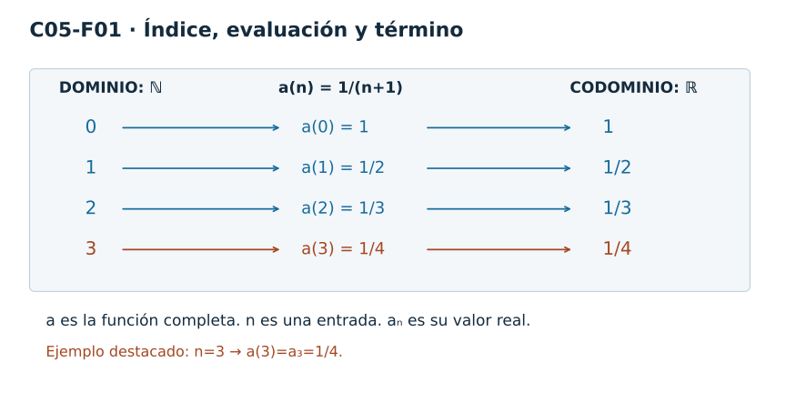
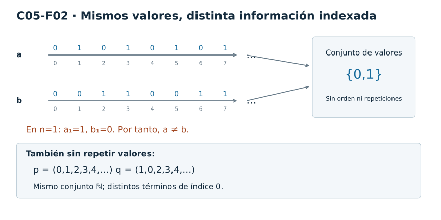
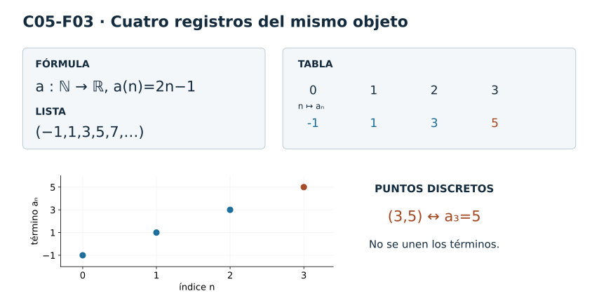
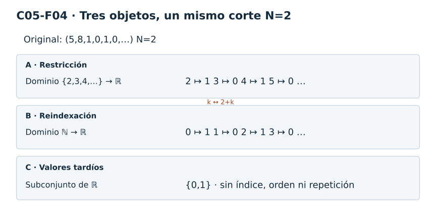
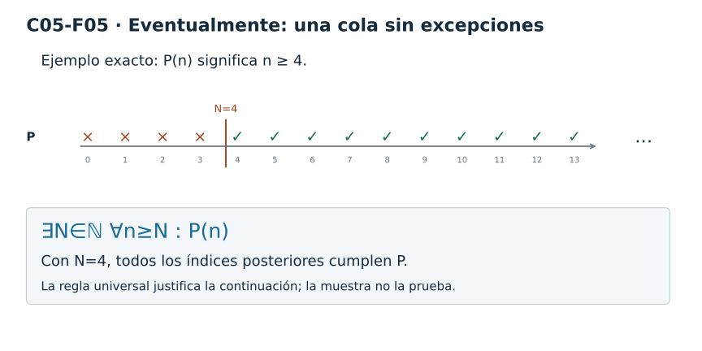
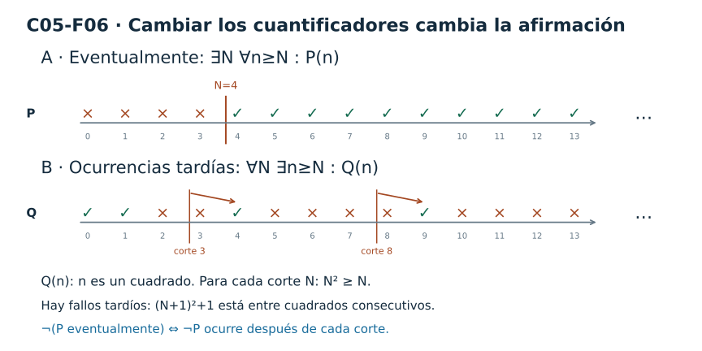
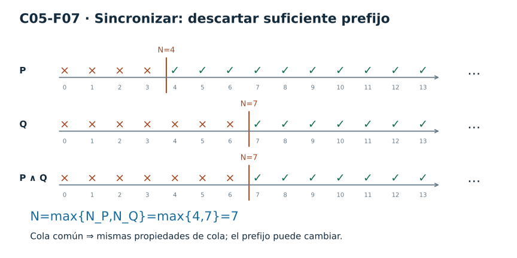
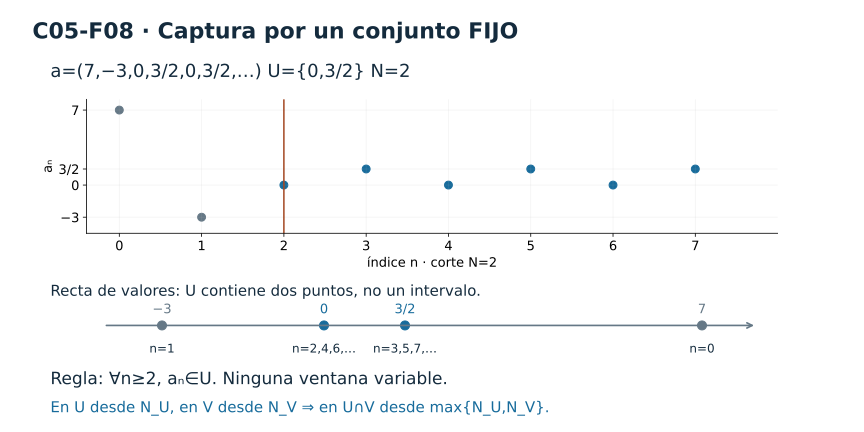

[Índice del libro](../para-matematicos/analisis-para-matematicos.md) · [Capítulo 5](analisis-para-matematicos-capitulo-5-sucesiones-y-comportamiento-eventual.md) · [Ejercicios](analisis-para-matematicos-capitulo-5-sucesiones-y-comportamiento-eventual-ejercicios.md) · [Soluciones](analisis-para-matematicos-capitulo-5-sucesiones-y-comportamiento-eventual-soluciones.md) · [Soluciones de microcontroles](analisis-para-matematicos-capitulo-5-sucesiones-y-comportamiento-eventual-microcontroles.md)

Con C05 comienza la Parte II — *El infinito bajo control*. Hasta ahora el objeto principal de estudio había sido, casi siempre, estático: la recta real, sus subconjuntos, sus cotas, sus regiones locales. A partir de aquí aparecerá una nueva clase de objeto. Ya no miraremos solamente **qué puntos hay**, sino también **en qué orden aparecen**.

Pensemos, por ejemplo, en la escritura

$$
2,\,-1,\,2,\,0,\,2,\,-1,\ldots
$$

No es sólo una colección de números reales. El primer $2$ ocupa una posición, el $-1$ aparece después, el $2$ vuelve a aparecer, y cada nueva entrada tiene un lugar preciso. Si olvidáramos las posiciones y conserváramos únicamente los valores que alguna vez aparecen, perderíamos parte de la información.

El capítulo se dedicará a hacer rigurosa esa idea. La pregunta no será todavía si una sucesión «se acerca» a algún número. Esa pregunta pertenece a C06. Antes necesitamos construir el lenguaje que permitirá formularla sin que los cuantificadores aparezcan de golpe.

La columna conceptual será:

$$
\boxed{
\text{sucesión}
\longrightarrow
\text{índice y término}
\longrightarrow
\text{cola}
\longrightarrow
\text{eventualidad}
\longrightarrow
\text{captura eventual}.
}
$$

La noción decisiva será que una propiedad puede no cumplirse al principio y, sin embargo, hacerse estable **desde cierto índice en adelante**. Más adelante aprenderemos a expresar esto con precisión. Por ahora conviene empezar por una cuestión más elemental: ¿qué clase de objeto es, exactamente, una sucesión?

Hay una convención que fijaremos desde el comienzo. En este capítulo,

$$
\mathbb N=\{0,1,2,\ldots\}.
$$

Por tanto, una sucesión real comenzará en el índice $0$ y podrá escribirse

$$
a=(a_0,a_1,a_2,\ldots).
$$

Esta notación parece una lista, y esa imagen será útil. Pero la definición formal será más precisa: una sucesión es una **función**.

## 5.1. Una sucesión es una función: índice y término

Ya conocemos funciones. Si

$$
f:D\to Y,
$$

entonces a cada elemento $x\in D$ la función le asigna un único valor $f(x)\in Y$.

Una sucesión real es un caso particular de esa idea en el que el dominio es discreto y está ordenado por los números naturales.

> **Sucesión real.** Una **sucesión real** es una función
>
> $$
> a:\mathbb N\to\mathbb R.
> $$
>
> Para cada $n\in\mathbb N$, escribimos
>
> $$
> a_n=a(n)
> $$
>
> y llamamos $a_n$ al **término de índice $n$** de la sucesión.

La definición contiene tres objetos que conviene mantener separados:

$$
\boxed{
a:\mathbb N\to\mathbb R,
\qquad
n\in\mathbb N,
\qquad
a_n\in\mathbb R.
}
$$

El símbolo $a$ designa la función completa. El símbolo $n$ designa un índice. El símbolo $a_n$ designa el valor que la función toma en ese índice.

Esta distinción parece pequeña, pero será una de las piezas más importantes del capítulo.

### La notación $a_n$ es notación de función

Cuando escribimos

$$
a_n,
$$

no estamos introduciendo un objeto distinto de $a(n)$. Estamos usando una notación especialmente cómoda para funciones cuyo dominio es $\mathbb N$:

$$
a_n=a(n).
$$

Por ejemplo, si definimos

$$
a_n=\frac{1}{n+1},
\qquad n\in\mathbb N,
$$

entonces la afirmación completa es que existe una función

$$
a:\mathbb N\to\mathbb R
$$

dada por

$$
a(n)=\frac{1}{n+1}.
$$

Sus primeros valores son

| $n$ | $a_n$ |
|---:|---:|
| $0$ | $1$ |
| $1$ | $\frac12$ |
| $2$ | $\frac13$ |
| $3$ | $\frac14$ |
| $4$ | $\frac15$ |

La primera columna pertenece al dominio. La segunda contiene valores de la función.

Si fijamos, por ejemplo, $n=3$, entonces

$$
a_3=a(3)=\frac14.
$$

Aquí aparecen dos números, $3$ y $\frac14$, pero desempeñan papeles diferentes:

$$
3\in\mathbb N
\qquad\text{es un índice},
$$

mientras que

$$
\frac14\in\mathbb R
\qquad\text{es el término seleccionado}.
$$

No debemos confundir el lugar con el valor que ocupa ese lugar.

### El dominio forma parte del objeto

Una misma expresión algebraica puede definir funciones distintas si cambia el dominio.

Compárese

$$
f:\mathbb R\to\mathbb R,
\qquad
f(x)=x^2,
$$

con

$$
a:\mathbb N\to\mathbb R,
\qquad
a_n=n^2.
$$

La fórmula visible es casi la misma, pero los objetos no lo son. En el primer caso la variable de entrada puede recorrer todos los números reales. En el segundo, sólo se evalúa en

$$
0,1,2,3,\ldots
$$

y obtenemos

$$
a=(0,1,4,9,16,\ldots).
$$

Entre $n=2$ y $n=3$ no hay índices como $2.1$ o $2.7$. La sucesión no contiene términos $a_{2.1}$ ni $a_{2.7}$, porque esos números no pertenecen al dominio que hemos fijado.

Éste es el diagnóstico que debemos conservar durante todo C05:

> **En $a_n$, el símbolo $n$ es un índice discreto. No es una coordenada real que se recorra continuamente y tampoco es el valor del término.**

La diferencia de tipos puede expresarse de forma muy breve:

$$
n\in\mathbb N
\quad\overset{a}{\longmapsto}\quad
a_n\in\mathbb R.
$$

La flecha es la evaluación de la función.

### Una lista ordenada es una representación de la función

Como el dominio natural está ordenado,

$$
0<1<2<3<\cdots,
$$

podemos escribir los valores de $a$ en ese mismo orden:

$$
(a_0,a_1,a_2,a_3,\ldots).
$$

Esta lista ordenada es una representación muy útil de la sucesión. Pero la definición formal sigue siendo la función

$$
a:\mathbb N\to\mathbb R.
$$

La lista no debe hacernos olvidar el dominio que la organiza.

Por ejemplo, la sucesión

$$
b_n=(-1)^n
$$

puede escribirse

$$
b=(1,-1,1,-1,1,-1,\ldots).
$$

El mismo valor puede aparecer muchas veces. Una función no tiene prohibido enviar distintos índices al mismo número real. En este caso,

$$
b_0=b_2=b_4=\cdots=1
$$

y

$$
b_1=b_3=b_5=\cdots=-1.
$$

Las repeticiones no son un defecto ni una redundancia que debamos borrar. Son parte de la información indexada.

Todavía no analizaremos qué sucede si conservamos sólo los valores $1$ y $-1$ y olvidamos cuándo aparecen. Ése será precisamente el problema de §5.2.

### Índice y término no son intercambiables

Consideremos ahora

$$
c_n=2n-3.
$$

Entonces

$$
c_0=-3,\qquad
c_1=-1,\qquad
c_2=1,\qquad
c_3=3.
$$

La igualdad

$$
c_3=3
$$

puede resultar engañosa porque el índice y el término tienen el mismo valor numérico. Sin embargo, siguen siendo objetos con papeles distintos dentro de la función:

$$
3\in\mathbb N
\quad\text{es la entrada},
$$

y

$$
c_3=3\in\mathbb R
\quad\text{es la salida}.
$$

Que coincidan numéricamente no elimina la diferencia de tipo.

Si cambiamos ligeramente el ejemplo,

$$
d_n=2n,
$$

tenemos

$$
d_3=6.
$$

Ahora la separación vuelve a ser visible: el índice es $3$ y el término es $6$.

Una buena práctica será preguntar siempre:

1. ¿cuál es la función?;
2. ¿cuál es el índice?;
3. ¿cuál es el término correspondiente?;
4. ¿en qué conjunto vive cada objeto?

Este control de tipos será una regla de lectura durante todo el capítulo.

### Igualdad de sucesiones

Como las sucesiones son funciones, su igualdad es igualdad de funciones.

Sean

$$
a,b:\mathbb N\to\mathbb R.
$$

Entonces

$$
a=b
$$

significa que ambas funciones asignan el mismo valor a cada índice:

$$
\boxed{
a=b
\iff
\forall n\in\mathbb N,\ a_n=b_n.
}
$$

No basta con que coincidan algunos términos. Tampoco basta con que ambas sucesiones utilicen los mismos números reales en posiciones distintas.

Por ejemplo,

$$
a=(0,1,0,1,0,1,\ldots)
$$

y

$$
b=(1,0,1,0,1,0,\ldots)
$$

no son la misma sucesión, porque ya en el índice $0$ tenemos

$$
a_0=0\ne1=b_0.
$$

No desarrollaremos todavía la comparación entre los conjuntos de valores de $a$ y $b$. Lo importante aquí es que la igualdad de sucesiones se decide **índice por índice**.

### El orden de los índices añade estructura

Una función con dominio $\mathbb N$ no sólo posee entradas discretas. Esas entradas vienen con un orden natural:

$$
0<1<2<3<\cdots.
$$

Eso nos permite hablar de «antes» y «después» sin introducir tiempo físico. Decir que $a_5$ aparece después de $a_2$ significa simplemente que

$$
2<5.
$$

Esta estructura de orden será esencial cuando definamos colas. Una cola no será una colección arbitraria de términos: será lo que queda al conservar todos los índices desde cierto $N$ en adelante.

Todavía no necesitamos esa definición. Por ahora basta observar que el orden de $\mathbb N$ hace posible distinguir un comienzo, una posición posterior y una región de índices tardíos.

La sucesión contiene, por tanto, más que valores reales:

$$
\boxed{
\text{valor}
+
\text{índice}
+
\text{orden de los índices}.
}
$$

Esa tercera pieza será la puerta de entrada a todo el lenguaje eventual.

### Leer la figura

**Figura C05-F01.** El índice 3 selecciona el término 1/4; índice, evaluación y valor pertenecen a niveles distintos.

La figura permite seguir un mismo término en tres niveles:

$$
n
\quad\longmapsto\quad
a(n)
\quad=\quad
a_n.
$$

A la izquierda aparece el índice en $\mathbb N$; en el centro, la evaluación de la función; a la derecha, el valor correspondiente en la recta real.

La lectura tipológica distingue además cuatro objetos:

$$
\begin{aligned}
n &:\ \text{índice},\\
a_n &:\ \text{término},\\
a &:\ \text{función }\mathbb N\to\mathbb R,\\
\{a_n:n\in\mathbb N\} &:\ \text{conjunto de valores}.
\end{aligned}
$$

El cuarto objeto sólo queda anunciado aquí. En §5.2 estudiaremos qué información se pierde cuando una sucesión se reemplaza por ese conjunto.

### No hay una curva escondida entre los términos

La fórmula de una sucesión puede recordar la fórmula de una función real de variable real. Eso no autoriza a rellenar los espacios entre índices.

Si

$$
a_n=\frac{1}{n+1},
$$

los términos están definidos para

$$
n=0,1,2,\ldots
$$

No forman, por definición, una curva continua.

Podemos dibujar los puntos

$$
(n,a_n)
$$

en el plano. Pero una línea que los una sería una representación adicional elegida por nosotros, no parte del objeto matemático original.

Esta observación será desarrollada con más detalle en §5.3. Aquí cumple una función diagnóstica: recordar que el dominio de la sucesión sigue siendo $\mathbb N$ incluso cuando una fórmula pueda evaluarse también en números reales.

### Qué hemos fijado

La definición de sucesión real puede comprimirse en una línea:

$$
a:\mathbb N\to\mathbb R.
$$

Pero leerla correctamente exige desplegar varias distinciones:

$$
\boxed{
\begin{aligned}
&a &&\text{es la sucesión completa},\\
&n &&\text{es un índice natural},\\
&a_n=a(n) &&\text{es un término real},\\
&0<1<2<\cdots &&\text{ordena las posiciones}.
\end{aligned}
}
$$

Nada de esto requiere completitud de $\mathbb R$. Tampoco hemos introducido límites, convergencia, subsucesiones o propiedades asintóticas. Hemos fijado solamente el objeto sobre el que construiremos esas ideas más adelante.

El siguiente paso será someter a prueba una intuición muy común: pensar que una sucesión queda determinada por «los valores que contiene». Veremos que no. El orden de las visitas y las repeticiones también son información matemática.

### Antes de seguir

[]{#MA-MIC-ANM-01-005-001}

1. Sea $a_n=3n-2$. Identifica el dominio, el codominio, el índice y el término cuando $n=4$.
[]{#MA-MIC-ANM-01-005-002}

2. Escribe los primeros cinco términos de $a_n=1/(n+1)$ usando la convención $\mathbb N=\{0,1,2,\ldots\}$.
[]{#MA-MIC-ANM-01-005-003}

3. Explica por qué las expresiones $f(x)=x^2$ con $f:\mathbb R\to\mathbb R$ y $a_n=n^2$ con $a:\mathbb N\to\mathbb R$ no definen el mismo objeto matemático.
[]{#MA-MIC-ANM-01-005-004}

4. Decide si la frase «$a_3$ es el tercer índice de la sucesión» es correcta. Si no lo es, reescríbela con los tipos adecuados.
[]{#MA-MIC-ANM-01-005-005}

5. Sean $a,b:\mathbb N\to\mathbb R$ tales que $a_n=b_n$ para todo $n\in\mathbb N$. Justifica, usando la definición de igualdad de funciones, por qué $a=b$.
[]{#MA-MIC-ANM-01-005-006}

6. Construye una sucesión real en la que el mismo valor aparezca en infinitos índices distintos. Explica por qué esto no contradice que una sucesión sea una función.
[]{#MA-MIC-ANM-01-005-007}

7. En una gráfica de puntos $(n,a_n)$ alguien une todos los puntos con una curva y afirma que esa curva «es la sucesión». Localiza el error.
[]{#MA-MIC-ANM-01-005-008}

8. En la notación $\{a_n:n\in\mathbb N\}$ se ha olvidado parte de la información de la sucesión. Sin desarrollar todavía §5.2, indica qué clase de información sospechas que ya no puede recuperarse.

La definición ya está en su sitio. En §5.2 veremos por qué conservar solamente los valores no basta: una sucesión también recuerda **en qué orden** fueron visitados.

## 5.2. El orden de las visitas importa

En §5.1 fijamos el objeto completo: una sucesión real es una función

$$
a:\mathbb N\to\mathbb R.
$$

De una función podemos extraer un conjunto más pequeño de información: su **conjunto de valores**,

$$
\{a_n:n\in\mathbb N\}=a(\mathbb N)\subseteq\mathbb R.
$$

Este conjunto responde a una pregunta sencilla:

> **¿Qué números reales aparecen alguna vez como términos de la sucesión?**

Pero no responde a otra pregunta igualmente importante:

> **¿En qué índices aparecen y en qué orden se producen esas visitas?**

Al pasar de la sucesión al conjunto de valores conservamos los números visitados y descartamos la organización de esas visitas.

### Mismo conjunto de valores, sucesiones distintas

Consideremos

$$
a=(0,1,0,1,0,1,\ldots)
$$

y

$$
b=(0,0,1,1,0,0,1,1,\ldots).
$$

Ambas sucesiones sólo toman los valores $0$ y $1$. Por tanto,

$$
\{a_n:n\in\mathbb N\}
=
\{b_n:n\in\mathbb N\}
=
\{0,1\}.
$$

Sin embargo, no son la misma sucesión. Basta mirar el índice $1$:

$$
a_1=1,
\qquad
b_1=0.
$$

Como la igualdad de sucesiones exige igualdad en **cada** índice, se sigue que

$$
a\ne b.
$$

El conjunto de valores ha olvidado exactamente la información que permite distinguirlas.

Podemos formular la situación de manera general:

> **La sucesión determina su conjunto de valores, pero el conjunto de valores no determina la sucesión.**

En símbolos, para sucesiones reales $a$ y $b$,

$$
a=b
\Longrightarrow
\{a_n:n\in\mathbb N\}
=
\{b_n:n\in\mathbb N\},
$$

pero la conversa es falsa.

La implicación directa no requiere ningún teorema nuevo. Si $a=b$, entonces $a_n=b_n$ para todo $n\in\mathbb N$; por tanto, todo valor tomado por una sucesión es tomado también por la otra. El ejemplo anterior destruye la conversa.

### Un conjunto tampoco recuerda las repeticiones

La pérdida de información no se limita al orden.

Compárese

$$
c=(0,1,1,1,1,1,\ldots)
$$

con

$$
d=(0,1,0,1,0,1,\ldots).
$$

De nuevo,

$$
\{c_n:n\in\mathbb N\}
=
\{d_n:n\in\mathbb N\}
=
\{0,1\}.
$$

Pero el valor $0$ ocupa papeles muy distintos. En $c$ aparece en el índice $0$ y no vuelve a aparecer; en $d$ aparece en todos los índices pares:

$$
d_0=d_2=d_4=\cdots=0.
$$

El conjunto $\{0,1\}$ no registra ninguna de esas diferencias. En un conjunto, escribir un elemento una vez o muchas veces no cambia el conjunto.

Ésta es una distinción de tipos tan importante como la de §5.1:

$$
\boxed{
\text{sucesión indexada}
\ne
\text{conjunto de valores}.
}
$$

La sucesión conserva qué valor corresponde a cada índice. El conjunto conserva únicamente cuáles valores aparecen al menos una vez.

### Cambiar el orden puede cambiar la sucesión sin cambiar sus valores

La pérdida de orden no es un fenómeno particular de sucesiones periódicas. Consideremos

$$
p_n=n,
\qquad n\in\mathbb N,
$$

de modo que

$$
p=(0,1,2,3,4,\ldots).
$$

Definamos otra sucesión intercambiando sólo los dos primeros términos:

$$
q_0=1,
\qquad
q_1=0,
\qquad
q_n=n\quad(n\ge2).
$$

Entonces

$$
q=(1,0,2,3,4,\ldots).
$$

Sus conjuntos de valores coinciden:

$$
\{p_n:n\in\mathbb N\}
=
\{q_n:n\in\mathbb N\}
=
\mathbb N,
$$

donde $\mathbb N$ se considera, como siempre en este capítulo, contenido en $\mathbb R$ mediante la copia habitual.

No obstante,

$$
p_0=0\ne1=q_0,
$$

así que $p\ne q$.

Este ejemplo elimina una posible distracción: incluso cuando cada valor aparece una sola vez, el conjunto de valores sigue sin recordar el orden de aparición.

### Permutar los índices: conservar los valores, cambiar la organización

La idea anterior admite una formulación compacta. Supongamos que

$$
\sigma:\mathbb N\to\mathbb N
$$

es una biyección y definimos

$$
b_n=a_{\sigma(n)}.
$$

La aplicación $\sigma$ sólo reorganiza los índices: como es biyectiva, utiliza todos los índices originales exactamente una vez. Por ello,

$$
\{b_n:n\in\mathbb N\}
=
\{a_n:n\in\mathbb N\}.
$$

Pero no tiene por qué ocurrir $a=b$. Para que ambas sucesiones fueran iguales necesitaríamos

$$
a_n=a_{\sigma(n)}
$$

para todo $n$, condición que puede fallar.

No convertiremos esta observación en una teoría de permutaciones. Su función aquí es diagnóstica: el orden de los índices forma parte del objeto, mientras que el conjunto de valores lo descarta.

### Qué información sobrevive al colapso

Podemos pensar el paso

$$
a:\mathbb N\to\mathbb R
\quad\longmapsto\quad
\{a_n:n\in\mathbb N\}
$$

como un **colapso de información**.

Sobrevive:

- qué valores reales aparecen.

Se pierde, en general:

- en qué índice aparece cada valor;
- qué valor aparece antes o después de otro;
- qué patrones de repetición presenta la sucesión;
- qué cambios de posición distinguen dos sucesiones con el mismo conjunto de valores.

Esto explica por qué el lenguaje de conjuntos, aunque indispensable, no puede sustituir al lenguaje de sucesiones. Un conjunto no tiene memoria del recorrido que lo produjo.

La distinción puede resumirse así:

$$
\boxed{
\begin{aligned}
\text{sucesión }a&:\quad n\longmapsto a_n,\\
\text{conjunto de valores}&:\quad \text{olvida }n\text{ y conserva sólo }a_n.
\end{aligned}
}
$$

### Leer la figura

**Figura C05-F02.** El conjunto {0,1} no distingue los dos patrones de visitas. También cambia el orden al intercambiar dos valores sin repeticiones.

La figura muestra, en carriles de índices paralelos, las sucesiones

$$
a=(0,1,0,1,\ldots)
$$

y

$$
b=(0,0,1,1,\ldots),
$$

junto a su colapso al mismo conjunto

$$
\{0,1\}.
$$

La flecha de colapso tiene una función precisa: recordar que reemplazar una sucesión por su conjunto de valores **pierde orden y repeticiones**. El intercambio de los dos primeros términos de $(0,1,2,3,\ldots)$ muestra que el fenómeno también aparece sin repeticiones.

### Una advertencia sobre la palabra «comportamiento»

Decir que dos sucesiones con el mismo conjunto de valores pueden tener comportamientos distintos no significa todavía que hayamos definido una noción asintótica de comportamiento. No hemos introducido convergencia, colas, eventualidad ni subsucesiones.

Por ahora la afirmación es más elemental: dos funciones $\mathbb N\to\mathbb R$ pueden visitar exactamente los mismos valores y, aun así, asignarlos a los índices de maneras diferentes.

Esa diferencia será precisamente la materia prima que las secciones siguientes aprenderán a representar y, más tarde, a analizar desde índices suficientemente tardíos.

### Antes de seguir

[]{#MA-MIC-ANM-01-005-009}

1. Para $a_n=(-1)^n$, determina el conjunto de valores y explica qué información de la sucesión no queda registrada en ese conjunto.
[]{#MA-MIC-ANM-01-005-010}

2. Sean $a=(0,1,0,1,\ldots)$ y $b=(0,0,1,1,0,0,1,1,\ldots)$. Demuestra que tienen el mismo conjunto de valores pero que $a\ne b$.
[]{#MA-MIC-ANM-01-005-011}

3. Construye dos sucesiones distintas con conjunto de valores $\{0,1,2\}$ y con órdenes de aparición diferentes.
[]{#MA-MIC-ANM-01-005-012}

4. Construye dos sucesiones con el mismo conjunto de valores en las que el valor $0$ tenga patrones de repetición distintos. Describe la diferencia usando índices concretos.
[]{#MA-MIC-ANM-01-005-013}

5. Demuestra que si $a=b$ como sucesiones, entonces $\{a_n:n\in\mathbb N\}=\{b_n:n\in\mathbb N\}$. Explica por qué el recíproco falla.
[]{#MA-MIC-ANM-01-005-014}

6. Sea $p_n=n$ y define $q=(1,0,2,3,4,\ldots)$. Verifica que $p$ y $q$ tienen el mismo conjunto de valores y localiza un índice que pruebe que son distintas.
[]{#MA-MIC-ANM-01-005-015}

7. Si $\sigma:\mathbb N\to\mathbb N$ es biyectiva y $b_n=a_{\sigma(n)}$, demuestra directamente que $a$ y $b$ tienen el mismo conjunto de valores. ¿Por qué eso no prueba que $a=b$?
[]{#MA-MIC-ANM-01-005-016}

8. Explica con tus propias palabras qué información conserva la lista ordenada $(a_0,a_1,a_2,\ldots)$ que desaparece al pasar al conjunto $\{a_n:n\in\mathbb N\}$.

Ya sabemos qué se pierde cuando borramos los índices. En §5.3 haremos lo contrario: compararemos varias representaciones de una sucesión y exigiremos que cada una conserve, de una forma u otra, la información indexada que ahora sabemos que es esencial.

## 5.3. Ver una sucesión sin perder el índice

En §5.2 vimos que reemplazar una sucesión por su conjunto de valores borra información. El problema no estaba en los números mismos, sino en haber eliminado los índices que los organizaban.

Ahora haremos la pregunta inversa:

> **¿Cómo podemos representar una sucesión de manera que el índice siga visible?**

No hay una única respuesta. Una misma sucesión puede escribirse mediante una fórmula, una lista ordenada, una tabla o una colección discreta de puntos. Cada registro destaca algo distinto, pero todos deben ser compatibles con el mismo objeto matemático:

$$
a:\mathbb N\to\mathbb R.
$$

La regla de control será simple:

> **Una representación adecuada puede cambiar la apariencia de la sucesión, pero no debe borrar la correspondencia $n\mapsto a_n$.**

### Un mismo ejemplo en varios registros

Consideremos la sucesión

$$
a_n=2n-1,
\qquad n\in\mathbb N.
$$

Ésta es su **fórmula**. Permite calcular cualquier término a partir del índice. Por ejemplo,

$$
a_0=-1,
\qquad
a_1=1,
\qquad
a_2=3,
\qquad
a_3=5.
$$

Podemos registrar esos mismos valores como **lista ordenada**:

$$
a=(-1,1,3,5,7,\ldots).
$$

La lista hace visible el orden de aparición, pero comprime la escritura del índice: sabemos que el primer lugar corresponde a $0$, el segundo a $1$, y así sucesivamente, porque ya hemos fijado la convención de indexación.

También podemos usar una **tabla**:

| $n$ | $a_n$ |
|---:|---:|
| $0$ | $-1$ |
| $1$ | $1$ |
| $2$ | $3$ |
| $3$ | $5$ |
| $4$ | $7$ |

Aquí la correspondencia funcional queda completamente explícita. Cada fila registra una entrada y su salida:

$$
n\longmapsto a_n.
$$

Finalmente podemos representar la sucesión mediante los puntos

$$
(0,-1),\ (1,1),\ (2,3),\ (3,5),\ (4,7),\ldots
$$

en el plano.

La gráfica de la sucesión es, por tanto, el conjunto discreto

$$
\{(n,a_n):n\in\mathbb N\}\subseteq\mathbb N\times\mathbb R.
$$

Si identificamos los naturales con sus posiciones habituales en el eje horizontal, podemos verla como una nube de puntos en el plano. La coordenada horizontal conserva el índice; la vertical registra el término.

### La gráfica conserva dos datos a la vez

La representación por puntos tiene una ventaja especial. En un mismo objeto visual podemos leer simultáneamente

$$
\boxed{
\text{cuándo: }n
\qquad\text{y}\qquad
\text{dónde: }a_n.
}
$$

La palabra «cuándo» no introduce tiempo físico. Significa únicamente **en qué posición del dominio ordenado $\mathbb N$** aparece el término.

Por ejemplo, para

$$
b_n=(-1)^n,
$$

los valores $1$ y $-1$ se repiten. Sobre la recta real sólo hay dos posiciones posibles, pero en la gráfica aparecen puntos distintos:

$$
(0,1),\ (1,-1),\ (2,1),\ (3,-1),\ldots
$$

Los puntos $(0,1)$ y $(2,1)$ tienen la misma altura, pero no son el mismo punto del plano. La diferencia horizontal recuerda que el valor $1$ fue visitado en índices distintos.

Ésta es exactamente la información que se perdía en §5.2 al colapsar la sucesión al conjunto

$$
\{-1,1\}.
$$

### Unir los puntos inventa información nueva

Aquí aparece un error gráfico muy frecuente. Supongamos nuevamente que

$$
a_n=2n-1.
$$

Los puntos de la sucesión están definidos para

$$
n=0,1,2,3,\ldots
$$

Nada en la definición proporciona términos entre $a_2$ y $a_3$. En particular, expresiones como

$$
a_{2.4}
$$

no pertenecen a la sucesión, porque $2.4\notin\mathbb N$.

Si dibujamos segmentos o una curva que una los puntos, hemos añadido valores para posiciones horizontales que no forman parte del dominio original. Esa curva puede ser útil como adorno o como construcción auxiliar en otro contexto, pero no es la sucesión.

Por eso la regla visual de C05 es vinculante:

$$
\boxed{
\text{gráfica de sucesión}
=
\text{puntos discretos, no curva intermedia}.
}
$$

No estamos prohibiendo que una persona trace una línea para guiar la vista. Estamos diciendo algo más preciso: **la línea no pertenece al objeto matemático definido por $a:\mathbb N\to\mathbb R$**.

### La fórmula tampoco es la sucesión

También conviene evitar el error opuesto: identificar una sucesión con una fórmula particular.

La escritura

$$
a_n=2n-1
$$

es una manera compacta de especificar esta sucesión. Pero el objeto matemático es la función $a:\mathbb N\to\mathbb R$, no la cadena de símbolos que usamos para describirla.

La misma función podría especificarse mediante una tabla que registre todos los pares $(n,a_n)$ o, cuando exista, mediante otra regla exacta que determine un único valor real para cada índice natural. No toda sucesión necesita admitir una fórmula cerrada o una descripción finita sencilla; una fórmula es muy cómoda, pero no forma parte de la definición general de sucesión.

Podemos separar así dos niveles:

$$
\boxed{
\begin{aligned}
\text{objeto} &:\quad a:\mathbb N\to\mathbb R,\\
\text{representaciones} &:\quad \text{fórmula, lista, tabla, puntos, etiquetas.}
\end{aligned}
}
$$

Confundir ambos niveles sería como confundir un número con una de sus escrituras decimales.

### Qué gana y qué pierde cada registro

Ninguna representación es siempre la mejor. Depende de qué queramos leer.

La **fórmula** suele ser compacta y permite calcular términos lejanos, pero puede ocultar el aspecto de los primeros valores.

La **lista ordenada** hace visibles rápidamente repeticiones y alternancias, aunque deja implícita la columna de índices.

La **tabla** expone sin ambigüedad cada asociación $n\mapsto a_n$, pero ocupa mucho espacio.

La **gráfica discreta** combina índice y valor en una misma imagen y permite comparar posiciones, alturas y repeticiones.

Una representación sobre la **recta real** puede ser útil para ver dónde caen los valores, pero exige etiquetas de índice si queremos conservar la información secuencial. Si quitamos esas etiquetas y dejamos sólo las posiciones visitadas, volvemos al conjunto de valores estudiado en §5.2.

Por tanto, mirar una sucesión sobre la recta real exige una precaución:

$$
\boxed{
\text{posición del valor sin etiqueta de índice}
\quad\text{puede borrar la sucesión}. 
}
$$

### Traducir entre registros

Volvamos al ejemplo

$$
a_n=2n-1.
$$

Podemos recorrer una cadena de traducciones:

$$
\text{fórmula}
\longrightarrow
\text{tabla}
\longrightarrow
\text{lista}
\longrightarrow
\text{puntos }(n,a_n).
$$

En cada paso cambia la apariencia, pero deben preservarse afirmaciones como

$$
a_3=5.
$$

En la fórmula, se obtiene sustituyendo $n=3$.

En la tabla, aparece en la fila cuyo primer componente es $3$.

En la lista, $5$ ocupa la posición correspondiente al índice $3$.

En la gráfica, aparece el punto

$$
(3,5).
$$

Esta compatibilidad es una prueba práctica de que estamos mirando cuatro representaciones del mismo objeto y no cuatro objetos distintos.

### Leer la figura

**Figura C05-F03.** Fórmula, lista, tabla y puntos conservan el mismo par (3,5). No se añaden valores entre índices.

La figura muestra pocos términos explícitos y destaca un mismo término. Su función no es añadir contenido matemático, sino permitir que el lector siga un mismo par

$$
(n,a_n)
$$

a través de varios registros.

El panel gráfico obedece la regla ya fijada:

> **Los puntos pueden compartir alturas, pero no se unirán mediante una curva que sugiera valores intermedios de la sucesión.**

### Qué hemos ganado

Después de §§5.1–5.3 podemos leer una sucesión sin confundir sus componentes ni sus representaciones.

Sabemos distinguir

$$
\boxed{
\begin{aligned}
&a:\mathbb N\to\mathbb R &&\text{sucesión},\\
&n\in\mathbb N &&\text{índice},\\
&a_n\in\mathbb R &&\text{término},\\
&\{a_n:n\in\mathbb N\} &&\text{conjunto de valores},\\
&\{(n,a_n):n\in\mathbb N\} &&\text{gráfica discreta}.
\end{aligned}
}
$$

La siguiente pregunta ya no será cómo representar **toda** la sucesión. Preguntaremos qué significa conservar sólo la parte situada desde cierto índice en adelante. Esa operación abrirá el lenguaje de las colas en §5.4.

### Antes de seguir

[]{#MA-MIC-ANM-01-005-017}

1. Para $a_n=3-2n$, escribe los primeros cinco términos, una tabla con índices $0$ a $4$ y los cinco puntos correspondientes de la gráfica discreta.
[]{#MA-MIC-ANM-01-005-018}

2. En la sucesión $b_n=(-1)^n$, explica por qué los puntos $(0,1)$ y $(2,1)$ contienen más información que la sola marca $1$ sobre la recta real.
[]{#MA-MIC-ANM-01-005-019}

3. Un estudiante dibuja los puntos de $a_n=n^2$ y los une con la parábola $y=x^2$. Explica qué parte del dibujo representa la sucesión y qué parte es información adicional.
[]{#MA-MIC-ANM-01-005-020}

4. Decide si una lista ordenada puede representar correctamente una sucesión sin escribir explícitamente todos los índices. ¿Qué convención permite hacerlo?
[]{#MA-MIC-ANM-01-005-021}

5. Da un ejemplo de una representación sobre la recta real que pierda información de índice y explica cómo repararla mediante etiquetas.
[]{#MA-MIC-ANM-01-005-022}

6. Para $a_n=2n-1$, localiza la afirmación $a_3=5$ en la fórmula, la lista, la tabla y la gráfica discreta.
[]{#MA-MIC-ANM-01-005-023}

7. Explica por qué una fórmula cerrada no forma parte de la definición de sucesión, aunque muchas sucesiones de ejemplo se presenten mediante fórmulas.
[]{#MA-MIC-ANM-01-005-024}

8. Compara el conjunto $\{a_n:n\in\mathbb N\}$ con la gráfica $\{(n,a_n):n\in\mathbb N\}$. ¿Cuál de los dos conserva necesariamente el índice?

Ya podemos cambiar de representación sin perder de vista el objeto. En §5.4 introduciremos la primera operación estructural nueva sobre una sucesión: conservar sólo los términos cuyos índices están desde cierto punto en adelante.

## 5.4. Colas: olvidar un comienzo finito

Hasta ahora hemos mirado la sucesión completa,

$$
a=(a_0,a_1,a_2,\ldots),
$$

con todos sus índices visibles desde $0$ en adelante. Pero muchas preguntas posteriores no dependerán de los primeros términos. Para preparar ese lenguaje necesitamos una operación muy simple: **descartar un comienzo finito y conservar todo lo que viene después**.

Fijemos un índice

$$
N\in\mathbb N.
$$

El conjunto de índices que sobreviven es

$$
\mathbb N_{\ge N}
=
\{n\in\mathbb N:n\ge N\}
=
\{N,N+1,N+2,\ldots\}.
$$

Lo llamaremos **segmento final** de $\mathbb N$ a partir de $N$.

Los índices que hemos eliminado forman el prefijo finito

$$
\{0,1,\ldots,N-1\},
$$

cuando $N>0$. Si $N=0$, ese prefijo es vacío y no hemos eliminado nada.

La idea central de esta sección será:

$$
\boxed{
\text{pasar a una cola}
=
\text{olvidar sólo un prefijo finito}.
}
$$

Pero hay que precisar qué objeto llamamos «cola», porque aparecen tres construcciones relacionadas que no son idénticas.

### Primera construcción: restringir la función

Como una sucesión es una función

$$
a:\mathbb N\to\mathbb R,
$$

la manera más directa de conservar sólo los índices desde $N$ en adelante es restringir su dominio:

$$
a|_{\mathbb N_{\ge N}}
:
\mathbb N_{\ge N}\to\mathbb R.
$$

Esta función conserva exactamente las asignaciones

$$
N\mapsto a_N,\qquad
N+1\mapsto a_{N+1},\qquad
N+2\mapsto a_{N+2},\ldots
$$

y recuerda los **índices originales**.

Llamaremos a este objeto la **cola restringida desde $N$**.

Obsérvese el tipo:

$$
\boxed{
a|_{\mathbb N_{\ge N}}
:
\mathbb N_{\ge N}\to\mathbb R.
}
$$

Su dominio ya no es todo $\mathbb N$. Empieza literalmente en $N$.

Esto importa porque dos funciones sólo pueden identificarse como la misma función si también coincide su dominio. La cola restringida no debe confundirse, por tanto, con una sucesión real escrita nuevamente con índices $0,1,2,\ldots$.

### Segunda construcción: reindexar la cola

A veces queremos que la parte tardía vuelva a presentarse como una sucesión real con dominio $\mathbb N$.

Para ello definimos el corrimiento

$$
\tau_N:\mathbb N\to\mathbb N_{\ge N},
\qquad
\tau_N(k)=N+k.
$$

Esta función simplemente renombra los índices:

$$
0\mapsto N,\qquad
1\mapsto N+1,\qquad
2\mapsto N+2,\ldots
$$

Conviene verificar directamente que no estamos perdiendo ni duplicando índices.

> **Lema de reindexación.** Para cada $N\in\mathbb N$, la aplicación
>
> $$
> \tau_N(k)=N+k
> $$
>
> es una biyección de $\mathbb N$ sobre $\mathbb N_{\ge N}$.

**Demostración.** Si

$$
\tau_N(k)=\tau_N(\ell),
$$

entonces

$$
N+k=N+\ell,
$$

y por cancelación,

$$
k=\ell.
$$

Así, $\tau_N$ es inyectiva.

Por otra parte, si $n\in\mathbb N_{\ge N}$, entonces $n\ge N$ y existe un natural

$$
k=n-N.
$$

Para ese $k$,

$$
\tau_N(k)=N+(n-N)=n.
$$

Por tanto, $\tau_N$ es sobreyectiva. Luego es biyectiva. $\square$

Este pequeño lema será reutilizable: permite trasladar una cola cuyo dominio empieza en $N$ a una sucesión que vuelve a empezar en $0$.

Definimos entonces la **cola reindexada desde $N$** por

$$
a^{\langle N\rangle}
=
a\circ\tau_N
:
\mathbb N\to\mathbb R.
$$

En términos de sus términos,

$$
\boxed{
a^{\langle N\rangle}_k
=
a_{N+k},
\qquad k\in\mathbb N.
}
$$

Así,

$$
a^{\langle N\rangle}
=
(a_N,a_{N+1},a_{N+2},\ldots).
$$

La cola restringida y la cola reindexada contienen la misma información ordenada, pero no son literalmente el mismo objeto:

$$
a|_{\mathbb N_{\ge N}}
:
\mathbb N_{\ge N}\to\mathbb R,
$$

mientras que

$$
a^{\langle N\rangle}
:
\mathbb N\to\mathbb R.
$$

La primera conserva los índices originales. La segunda los vuelve a numerar desde $0$.

### Una correspondencia que conviene mantener visible

La relación entre ambas colas puede escribirse como

$$
k
\longleftrightarrow
N+k
\longmapsto
a_{N+k}.
$$

Aquí aparecen tres objetos distintos:

$$
\boxed{
k\in\mathbb N,
\qquad
N+k\in\mathbb N_{\ge N},
\qquad
a_{N+k}\in\mathbb R.
}
$$

El índice $k$ pertenece a la cola reindexada. El índice $N+k$ pertenece a la sucesión original. El valor real es el mismo en ambas representaciones.

Por ejemplo,

$$
a^{\langle N\rangle}_3
=
a_{N+3}.
$$

No significa que el término de índice $3$ de la sucesión original haya cambiado. Significa que el antiguo término $a_{N+3}$ ocupa ahora la posición $3$ de la cola reindexada.

Este control de tipos será indispensable más adelante, cuando varias colas aparezcan simultáneamente.

### Tercera construcción: conservar sólo los valores tardíos

Existe todavía un tercer objeto, más pobre en información:

$$
\{a_n:n\ge N\}\subseteq\mathbb R.
$$

Éste es el **conjunto de valores tardíos desde $N$**.

Contiene todos los números reales que aparecen en algún índice $n\ge N$, pero ha olvidado otra vez la indexación:

$$
\boxed{
\text{conjunto de valores tardíos}
\ne
\text{cola restringida}
\ne
\text{cola reindexada}.
}
$$

La diferencia es la misma que ya vimos en §5.2. Un conjunto no registra en qué índice aparece cada valor, no conserva el orden y tampoco registra repeticiones.

### Un ejemplo con los tres objetos

Consideremos la sucesión

$$
a=(7,-2,4,1,4,1,4,1,\ldots)
$$

y fijemos

$$
N=2.
$$

La cola restringida es la función

$$
a|_{\mathbb N_{\ge2}}
:
\mathbb N_{\ge2}\to\mathbb R,
$$

con

$$
2\mapsto4,\qquad
3\mapsto1,\qquad
4\mapsto4,\qquad
5\mapsto1,\ldots
$$

La cola reindexada es

$$
a^{\langle2\rangle}
=
(4,1,4,1,4,1,\ldots),
$$

de modo que

$$
a^{\langle2\rangle}_0=a_2=4,
\qquad
a^{\langle2\rangle}_1=a_3=1.
$$

En cambio, el conjunto de valores tardíos es simplemente

$$
\{a_n:n\ge2\}
=
\{1,4\}.
$$

En ese último paso han desaparecido las posiciones y las repeticiones.

Este ejemplo permite ver con claridad qué significa «olvidar el comienzo». Los valores $7$ y $-2$ han quedado fuera de la cola desde $2$, pero el resto de la sucesión conserva su orden.

### Aumentar el umbral descarta más información inicial

Supongamos ahora que

$$
M\ge N.
$$

Entonces

$$
\mathbb N_{\ge M}
\subseteq
\mathbb N_{\ge N}.
$$

Por tanto, la cola restringida desde $M$ es una restricción adicional de la cola desde $N$:

$$
a|_{\mathbb N_{\ge M}}
=
\left(
a|_{\mathbb N_{\ge N}}
\right)\Big|_{\mathbb N_{\ge M}}.
$$

La misma relación puede expresarse con colas reindexadas. Como $M-N\in\mathbb N$,

$$
a^{\langle M\rangle}_k
=
a_{M+k}
=
a_{N+(M-N)+k}
=
a^{\langle N\rangle}_{(M-N)+k}.
$$

Es decir,

$$
\boxed{
a^{\langle M\rangle}
=
\left(a^{\langle N\rangle}\right)^{\langle M-N\rangle}.
}
$$

Tomar una cola más tardía equivale a tomar una nueva cola de una cola anterior.

Para los conjuntos de valores tardíos obtenemos además la inclusión

$$
\{a_n:n\ge M\}
\subseteq
\{a_n:n\ge N\}.
$$

Al desplazar el umbral hacia la derecha podemos perder valores que sólo aparecían antes de $M$, pero no podemos crear valores nuevos que no estuvieran ya presentes desde $N$.

### Qué preserva una cola

Pasar de $a$ a una cola desde $N$ elimina exactamente el prefijo

$$
a_0,a_1,\ldots,a_{N-1}.
$$

Todo lo que sucede desde $N$ en adelante permanece disponible.

La cola restringida preserva:

- los términos tardíos;
- sus índices originales;
- su orden;
- sus repeticiones.

La cola reindexada preserva:

- los mismos términos tardíos;
- el mismo orden relativo;
- las mismas repeticiones;

pero reemplaza cada índice original $N+k$ por el nuevo índice $k$.

El conjunto de valores tardíos preserva únicamente:

- cuáles valores aparecen desde $N$ en adelante.

Esta separación puede resumirse así:

$$
\boxed{
\begin{aligned}
a|_{\mathbb N_{\ge N}}
&:\ \text{mismos índices tardíos},\\
a^{\langle N\rangle}
&:\ \text{mismos términos, índices reiniciados},\\
\{a_n:n\ge N\}
&:\ \text{sólo valores tardíos}.
\end{aligned}
}
$$

### Leer la figura

**Figura C05-F04.** Con N=2, la restricción conserva los índices originales; la reindexación empieza en 0; el conjunto de valores elimina la indexación.

La figura muestra tres carriles coordinados:

$$
a|_{\mathbb N_{\ge N}},
\qquad
a^{\langle N\rangle},
\qquad
\{a_n:n\ge N\}.
$$

Entre los dos primeros carriles aparece explícitamente la correspondencia

$$
k
\longleftrightarrow
N+k
\longleftrightarrow
a_{N+k}.
$$

El tercer carril reúne los términos en un conjunto de valores reales para hacer visible qué información desaparece al pasar del objeto indexado al conjunto.

### Todavía no hemos definido «eventualmente»

Hablar de colas nos permite separar un comienzo finito de todo lo que queda después. Eso todavía no es una propiedad eventual.

En esta sección sólo hemos construido los objetos sobre los que podrá formularse esa idea. No hemos definido convergencia, no hemos introducido tolerancias $\varepsilon$ y tampoco hemos fijado todavía el patrón cuantificado que significa «a partir de cierto momento».

La caja de herramientas que sale de §5.4 es más elemental:

$$
\boxed{
\text{segmento final}
+
\text{restricción}
+
\text{reindexación}
+
\text{valores tardíos}.
}
$$

En §5.5 usaremos esta infraestructura para precisar qué significa que una propiedad sea verdadera desde algún índice en adelante.

### Antes de seguir

[]{#MA-MIC-ANM-01-005-025}

1. Para $a_n=2n+1$ y $N=3$, escribe la cola restringida desde $3$ indicando su dominio y calcula sus primeros cuatro valores.
[]{#MA-MIC-ANM-01-005-026}

2. Para la misma sucesión, escribe la cola reindexada $a^{\langle3\rangle}$ y verifica que $a^{\langle3\rangle}_2=a_5$.
[]{#MA-MIC-ANM-01-005-027}

3. Explica por qué $a|_{\mathbb N_{\ge3}}$ y $a^{\langle3\rangle}$ contienen la misma información ordenada pero no son la misma función.
[]{#MA-MIC-ANM-01-005-028}

4. Sea $a=(5,8,1,0,1,0,1,0,\ldots)$. Para $N=2$, determina la cola reindexada y el conjunto de valores tardíos. ¿Qué información pierde el segundo objeto?
[]{#MA-MIC-ANM-01-005-029}

5. Demuestra directamente que $\tau_N(k)=N+k$ es biyectiva de $\mathbb N$ sobre $\mathbb N_{\ge N}$.
[]{#MA-MIC-ANM-01-005-030}

6. Si $M\ge N$, demuestra que $\{a_n:n\ge M\}\subseteq\{a_n:n\ge N\}$.
[]{#MA-MIC-ANM-01-005-031}

7. Verifica la identidad $a^{\langle M\rangle}=(a^{\langle N\rangle})^{\langle M-N\rangle}$ cuando $M\ge N$.
[]{#MA-MIC-ANM-01-005-032}

8. Explica qué sucede cuando $N=0$: ¿cuál es el prefijo eliminado, qué es la cola restringida y qué es la cola reindexada?

Ahora ya podemos hablar con precisión de «lo que ocurre después de cierto índice». En §5.5 convertiremos esa intuición en lenguaje lógico y definiremos qué significa que una propiedad sea **eventual**.

## 5.5. «A partir de cierto momento»: propiedades eventuales

En §5.4 aprendimos a cortar una sucesión en un índice $N$ y conservar todo lo que ocurre desde allí en adelante. Esa operación permite formalizar una expresión que aparecerá una y otra vez en análisis:

> **a partir de cierto momento.**

La frase parece informal, pero tiene una estructura lógica muy precisa. Supongamos que $P(n)$ es una propiedad que puede ser verdadera o falsa para cada índice $n\in\mathbb N$. Por ejemplo:

- $a_n>0$;
- $a_n\in I$, donde $I\subseteq\mathbb R$ es un intervalo fijo;
- $a_n\ne0$.

Diremos que la propiedad $P(n)$ ocurre **eventualmente** si existe un índice a partir del cual ya no vuelve a fallar.

> **Propiedad eventual.** La propiedad $P(n)$ ocurre **eventualmente** si
>
> $$
> \boxed{
> \exists N\in\mathbb N\;\forall n\ge N:\ P(n).
> }
> $$

El índice $N$ se llama un **umbral** o **testigo de eventualidad**.

La definición contiene dos cuantificadores y el orden importa. Primero debemos encontrar **un** índice $N$. Después de fijarlo, la propiedad debe cumplirse para **todos** los índices posteriores:

$$
N
\quad\text{elegido primero},
\qquad
n\ge N
\quad\text{arbitrario después}.
$$

La lectura verbal completa es:

> **Existe un umbral $N$ tal que, para todo índice $n$ situado desde $N$ en adelante, se cumple $P(n)$.**

### Cómo verificar un testigo

Consideremos

$$
a_n=2n-7.
$$

Queremos comprobar que

$$
a_n>0
$$

eventualmente.

Un candidato natural es

$$
N=4.
$$

En efecto, si $n\ge4$, entonces

$$
2n\ge8,
$$

y por tanto

$$
a_n=2n-7\ge1>0.
$$

Hemos probado

$$
\forall n\ge4:\ a_n>0.
$$

Luego

$$
\boxed{
a_n>0\text{ eventualmente}.
}
$$

La prueba no consiste en calcular muchos términos positivos. Consiste en exhibir un testigo $N$ y demostrar que **todo** índice posterior satisface la propiedad.

El esquema de verificación será siempre:

$$
\boxed{
\text{proponer }N
\longrightarrow
\text{tomar }n\ge N
\longrightarrow
\text{deducir }P(n).
}
$$

Este patrón será una pieza básica de nuestra caja de herramientas.

### Un testigo no tiene que ser el primero

La definición exige encontrar **algún** umbral que funcione. No exige localizar el menor.

En el ejemplo anterior, $N=4$ es un testigo. Pero también lo son

$$
5,\ 6,\ 7,\ldots
$$

porque, una vez que la propiedad vale para todos los índices desde $4$ en adelante, seguirá valiendo si empezamos todavía más tarde.

Esta observación merece registrarse.

> **Persistencia de los testigos.** Si $N$ es un testigo de que $P(n)$ ocurre eventualmente y $M\ge N$, entonces $M$ también es un testigo.

**Demostración.** Supongamos que

$$
\forall n\ge N:\ P(n)
$$

y que $M\ge N$.

Tomemos un índice cualquiera $n\ge M$. Entonces

$$
n\ge M\ge N,
$$

de modo que $n\ge N$. Por la propiedad del testigo $N$, se sigue que

$$
P(n).
$$

Como esto vale para todo $n\ge M$,

$$
\forall n\ge M:\ P(n).
$$

Por tanto, $M$ también es un testigo. $\square$

Este resultado explica por qué normalmente no buscaremos un «primer instante» exacto. Para demostrar eventualidad basta encontrar un umbral cómodo.

### Global no es lo mismo que eventual

Una propiedad puede cumplirse en todos los índices o sólo después de cierto comienzo.

La afirmación global

$$
\forall n\in\mathbb N:\ P(n)
$$

implica inmediatamente la afirmación eventual: basta elegir

$$
N=0.
$$

Por tanto,

$$
\boxed{
P(n)\text{ para todo }n
\Longrightarrow
P(n)\text{ eventualmente}.
}
$$

La conversa es falsa.

Para

$$
a_n=2n-7,
$$

la propiedad $a_n>0$ es eventual, pero no es global. Por ejemplo,

$$
a_0=-7<0.
$$

Así, la eventualidad permite un número finito de excepciones iniciales.

Ésta es la diferencia estructural que debemos conservar:

$$
\boxed{
\text{global}
=
\text{sin excepciones},
\qquad
\text{eventual}
=
\text{sin excepciones después de algún umbral}.
}
$$

### La misma definición vista mediante colas

La infraestructura de §5.4 permite reformular la eventualidad.

Decir

$$
\exists N\;\forall n\ge N:\ P(n)
$$

significa que existe una cola restringida de la sucesión en la que la propiedad vale en cada índice del dominio.

Si usamos la cola reindexada, la misma información se expresa como

$$
\exists N\;\forall k\in\mathbb N:\ P(N+k).
$$

La equivalencia es directa porque

$$
n\ge N
\iff
n=N+k
\quad\text{para algún }k\in\mathbb N.
$$

Así, la frase «$P$ ocurre eventualmente» puede leerse como:

> **alguna cola completa de la sucesión satisface $P$.**

Esta lectura conecta exactamente las dos herramientas nuevas del capítulo:

$$
\boxed{
\text{cola}
\longrightarrow
\text{eventualidad}.
}
$$

### Un intervalo fijo

Consideremos ahora

$$
b_n=\frac{1}{n+1}
$$

y el intervalo fijo

$$
I=\left(0,\frac13\right).
$$

Queremos decidir si

$$
b_n\in I
$$

eventualmente.

Tomemos

$$
N=3.
$$

Si $n\ge3$, entonces

$$
n+1\ge4,
$$

de modo que

$$
0<\frac{1}{n+1}\le\frac14<\frac13.
$$

Por tanto,

$$
b_n\in\left(0,\frac13\right)
$$

para todo $n\ge3$.

Así,

$$
\boxed{
b_n\in I\text{ eventualmente}.
}
$$

Lo importante es que el intervalo $I$ está fijado **antes** de buscar el umbral. No estamos cambiando la región a medida que cambia $n$.

En términos del conjunto de valores tardíos,

$$
\{b_n:n\ge3\}
\subseteq
\left(0,\frac13\right).
$$

Esta formulación usa la misma cola, pero ahora sólo necesitamos la información de pertenencia a una región fija.

### Los parámetros se fijan antes de elegir el umbral

La notación $P(n)$ puede ocultar otros datos. Por ejemplo, si $I$ es un intervalo fijo, podemos considerar

$$
P_I(n):
\quad
a_n\in I.
$$

En una afirmación de eventualidad, $I$ permanece fijo mientras buscamos $N$:

$$
I\text{ fijo}
\quad\longrightarrow\quad
\exists N
\quad\longrightarrow\quad
\forall n\ge N.
$$

Del mismo modo, si $c\in\mathbb R$ está fijado y estudiamos

$$
a_n>c,
$$

el número $c$ se considera elegido antes del umbral.

Esta disciplina será crucial más adelante. Por ahora basta fijar la regla:

> **Dentro de una afirmación de eventualidad, sólo el índice $n$ recorre la cola. Los demás parámetros ya han sido fijados antes de elegir el testigo $N$.**

No introducimos todavía ninguna dependencia $N(\varepsilon)$ ni tolerancias variables. Ese nivel pertenece a C06.

### Un ejemplo de eventual no nulidad

Definamos

$$
c_n=
\begin{cases}
0, & n=0,1,2,\\
1, & n\ge3.
\end{cases}
$$

La afirmación

$$
c_n\ne0
$$

no es verdadera para todos los índices. Sin embargo, si elegimos

$$
N=3,
$$

entonces

$$
\forall n\ge3:\ c_n=1\ne0.
$$

Por tanto,

$$
c_n\ne0
$$

eventualmente.

Este ejemplo muestra que el prefijo eliminado puede contener fallos reales de la propiedad. La eventualidad no los borra del objeto original; simplemente afirma que, desde alguna cola en adelante, ya no aparecen nuevos fallos.

### Qué no basta para probar eventualidad

Una tabla finita nunca puede, por sí sola, demostrar una afirmación del tipo

$$
\forall n\ge N:\ P(n).
$$

Ver que

$$
P(N),\ P(N+1),\ldots,P(N+100)
$$

son verdaderas sólo controla cien o ciento un índices concretos. La definición exige todos los índices posteriores, sin final.

Por eso necesitamos una razón general: una desigualdad, una identidad, una definición por casos o cualquier argumento que abarque el segmento final completo.

Este punto será visible también en la figura de la sección: una flecha hacia la derecha debe representar que la cola continúa indefinidamente, pero la prueba matemática seguirá estando en la fórmula cuantificada.

### Leer la figura

**Figura C05-F05.** Para P(n): n≥4, N=4 deja una cola sin excepciones. La regla universal justifica la continuación más allá del dibujo.

La figura muestra un prefijo en el que pueden aparecer aciertos y fallos y, después de un umbral $N$, una cola completa en la que todos los índices satisfacen $P$.

La fórmula

$$
\exists N\in\mathbb N\;\forall n\ge N:\ P(n)
$$

forma parte inseparable de la lectura visual. Una sucesión finita de marcas correctas no debe sugerir por sí sola el cuantificador universal.

### Lo que hemos añadido a la caja de herramientas

La nueva herramienta no depende de completitud, de límites ni de tolerancias.

Hemos aprendido a reconocer la estructura

$$
\boxed{
\exists N\;\forall n\ge N
}
$$

como el lenguaje preciso de «a partir de cierto momento».

También sabemos:

- qué significa que $N$ sea un testigo;
- cómo verificar un testigo;
- que cualquier umbral posterior también funciona;
- que una propiedad global es, en particular, eventual;
- que una propiedad eventual puede fallar en un prefijo finito;
- que la eventualidad equivale a que alguna cola completa satisfaga la propiedad.

Todavía no hemos comparado esta estructura con otras formas de repetición tardía. Esa diferencia exige cambiar el orden de los cuantificadores y será el tema de §5.6.

### Antes de seguir

[]{#MA-MIC-ANM-01-005-033}

1. Sea $a_n=3n-10$. Encuentra un testigo $N$ de que $a_n>0$ eventualmente y verifica tu elección para todo $n\ge N$.
[]{#MA-MIC-ANM-01-005-034}

2. Explica por qué, si $N$ es un testigo de eventualidad, todo $M\ge N$ también lo es.
[]{#MA-MIC-ANM-01-005-035}

3. Construye una propiedad de una sucesión que sea eventual pero no verdadera para todos los índices.
[]{#MA-MIC-ANM-01-005-036}

4. Para $b_n=1/(n+1)$, demuestra que $b_n\in(0,1/5)$ eventualmente usando un intervalo fijo y un testigo explícito.
[]{#MA-MIC-ANM-01-005-037}

5. Reescribe $\exists N\,\forall n\ge N:P(n)$ usando la cola reindexada y la variable $k$.
[]{#MA-MIC-ANM-01-005-038}

6. Decide si comprobar $P(10),P(11),\ldots,P(1000)$ basta para demostrar que $P(n)$ ocurre eventualmente. Justifica.
[]{#MA-MIC-ANM-01-005-039}

7. Si una propiedad vale para todo $n\in\mathbb N$, ¿qué testigo de eventualidad puede elegirse inmediatamente?
[]{#MA-MIC-ANM-01-005-040}

8. En la afirmación «eventualmente $a_n\in I$», explica qué objeto debe estar fijado antes de elegir $N$ y qué variable continúa recorriendo la cola.

Ya tenemos el operador lógico que expresa «desde algún punto en adelante». En §5.6 veremos por qué cambiar el orden de los cuantificadores produce una noción distinta.

## 5.6. Eventualmente no significa infinitas veces

En §5.5 fijamos una forma cuantificada para decir que una propiedad termina por estabilizarse:

$$
\exists N\in\mathbb N\;\forall n\ge N:\ P(n).
$$

Hay otra idea que, en lenguaje cotidiano, puede parecer cercana: que $P(n)$ siga ocurriendo una y otra vez, sin importar cuánto avancemos en los índices. Esa idea es distinta. No exige una cola completa en la que $P$ sea siempre verdadera; exige únicamente que nunca podamos cortar la sucesión tan tarde como para impedir nuevas apariciones de $P$.

La diferencia está en el orden de los cuantificadores.

> **Ocurrir infinitas veces.** Diremos que la propiedad $P(n)$ ocurre **infinitas veces** si
>
> $$
> \boxed{
> \forall N\in\mathbb N\;\exists n\ge N:\ P(n).
> }
> $$

La lectura verbal es:

> **Sea cual sea el umbral $N$ que elijamos, existe algún índice $n\ge N$ en el que $P(n)$ vuelve a cumplirse.**

No estamos definiendo esta expresión por una intuición cardinal vaga como «hay muchos índices». La definición operativa es el patrón cuantificado

$$
\forall N\;\exists n\ge N.
$$

Su contenido es temporal sólo en sentido ordinal: siempre puede encontrarse una nueva ocurrencia **más allá de cualquier corte finito**.

### Dos patrones que no deben confundirse

Pongamos las dos formas una junto a la otra:

$$
\boxed{
\begin{aligned}
P\text{ eventualmente}
&\iff
\exists N\;\forall n\ge N:\ P(n),\\[2mm]
P\text{ infinitas veces}
&\iff
\forall N\;\exists n\ge N:\ P(n).
\end{aligned}
}
$$

La diferencia no es tipográfica. En la primera afirmación buscamos **un solo corte** después del cual ya no hay excepciones. En la segunda, alguien puede proponernos **cualquier corte**, y sólo debemos encontrar una nueva ocurrencia de $P$ después de él.

Podemos resumir la geometría lógica así:

$$
\begin{array}{ccl}
\text{eventualmente} &:& \text{una cola completa de éxitos},\\
\text{infinitas veces} &:& \text{éxitos arbitrariamente tardíos, con posibles fallos entre ellos}.
\end{array}
$$

En particular, que $P$ ocurra infinitas veces no impide que $P$ falle también infinitas veces.

### El ejemplo alternante

Consideremos

$$
a_n=(-1)^n
$$

y la propiedad

$$
P(n):\quad a_n=1.
$$

Los primeros términos son

$$
1,-1,1,-1,1,-1,\ldots
$$

La propiedad $P$ ocurre infinitas veces. En efecto, tomemos un umbral arbitrario $N$.

- Si $N$ es par, elegimos $n=N$.
- Si $N$ es impar, elegimos $n=N+1$.

En ambos casos $n\ge N$ y $n$ es par, luego

$$
a_n=1.
$$

Como esto puede hacerse para **todo** $N$,

$$
\forall N\;\exists n\ge N:\ a_n=1.
$$

Sin embargo, $a_n=1$ no ocurre eventualmente. Para cualquier umbral propuesto siguen existiendo índices impares posteriores, y en ellos

$$
a_n=-1.
$$

Por tanto, nunca aparece una cola completa formada sólo por términos iguales a $1$.

Este ejemplo destruye la posible identificación

$$
\text{infinitas veces}
\stackrel{?}{=}
\text{eventualmente}.
$$

### Eventual implica infinitas veces

Aunque las dos nociones no sean equivalentes, sí existe una implicación en una dirección.

> **Proposición.** Si $P(n)$ ocurre eventualmente, entonces $P(n)$ ocurre infinitas veces.

**Demostración.** Supongamos que existe $N_0\in\mathbb N$ tal que

$$
\forall n\ge N_0:\ P(n).
$$

Debemos probar que

$$
\forall N\;\exists n\ge N:\ P(n).
$$

Tomemos un $N\in\mathbb N$ arbitrario y elijamos

$$
n=N+N_0.
$$

Entonces

$$
n\ge N
\qquad\text{y}\qquad
n\ge N_0.
$$

Como $n\ge N_0$, la eventualidad de $P$ nos da $P(n)$. Hemos encontrado, para el umbral arbitrario $N$, un índice $n\ge N$ donde vale $P$. Por tanto, $P$ ocurre infinitas veces. $\square$

La conversa es falsa, como muestra la sucesión alternante.

Así obtenemos la relación correcta:

$$
\boxed{
P\text{ eventualmente}
\Longrightarrow
P\text{ infinitas veces},
}
$$

pero no al revés.

### Negar eventualidad: los fallos reaparecen arbitrariamente tarde

La diferencia entre ambas nociones se vuelve especialmente clara cuando negamos la definición de eventualidad.

Partimos de

$$
P\text{ eventualmente}
\iff
\exists N\;\forall n\ge N:\ P(n).
$$

Negar esta afirmación produce

$$
\neg\bigl(\exists N\;\forall n\ge N:\ P(n)\bigr).
$$

Aplicamos las reglas de negación de cuantificadores, respetando el orden:

$$
\begin{aligned}
\neg\bigl(\exists N\;\forall n\ge N:\ P(n)\bigr)
&\iff
\forall N\;\neg\bigl(\forall n\ge N:\ P(n)\bigr)\\
&\iff
\forall N\;\exists n\ge N:\ \neg P(n).
\end{aligned}
$$

Pero la última expresión es exactamente la definición de que $\neg P$ ocurra infinitas veces. Por tanto,

$$
\boxed{
\neg\bigl(P\text{ ocurre eventualmente}\bigr)
\iff
\neg P\text{ ocurre infinitas veces}.
}
$$

Esta equivalencia es más informativa que decir simplemente «$P$ no se estabiliza». Afirma algo preciso: **por tarde que cortemos, todavía encontraremos un fallo de $P$ después del corte**.

En el ejemplo $a_n=(-1)^n$ con $P(n):a_n=1$, los fallos de $P$ son exactamente los índices impares. Esos fallos aparecen arbitrariamente lejos, y por eso $P$ no es eventual.

### Una propiedad y su negación pueden ocurrir infinitas veces

El ejemplo alternante muestra un fenómeno que vale la pena aislar. Para

$$
P(n):\quad a_n=1,
$$

tenemos simultáneamente

$$
P\text{ ocurre infinitas veces}
$$

y

$$
\neg P\text{ ocurre infinitas veces}.
$$

No hay contradicción. Cada afirmación pide sólo una ocurrencia posterior a cada umbral; ninguna exige que todos los índices posteriores tengan el mismo comportamiento.

Esto contrasta con la eventualidad. Si $P$ ocurre eventualmente, entonces $\neg P$ no puede ocurrir infinitas veces, porque a partir de algún umbral ya no queda ningún fallo.

La oposición correcta es, por tanto,

$$
\boxed{
P\text{ eventual}
\quad\Longleftrightarrow\quad
\neg P\text{ no ocurre infinitas veces}.
}
$$

Ésta es la misma equivalencia anterior, escrita desde el otro lado.

### Un ejemplo con apariciones irregulares

No debemos asociar «infinitas veces» con periodicidad. Definamos una propiedad sólo en los índices cuadrados:

$$
P(n):\quad n=m^2\text{ para algún }m\in\mathbb N.
$$

La propiedad ocurre infinitas veces en el sentido cuantificado. Dado cualquier $N\in\mathbb N$, podemos tomar

$$
m=N+1
$$

y entonces

$$
n=m^2=(N+1)^2\ge N.
$$

Por construcción, $P(n)$ es verdadera.

Pero $P$ no es eventual: entre cuadrados consecutivos aparecen índices que no son cuadrados, y esos fallos continúan arbitrariamente lejos.

La separación entre apariciones puede crecer; eso no importa. La definición sólo exige que después de cada umbral exista **alguna** nueva aparición.

### Tres situaciones distintas

Conviene distinguir tres patrones que una tabla corta puede confundir:

1. **$P$ ocurre eventualmente.** Desde algún umbral, todos los índices satisfacen $P$.
2. **$P$ ocurre infinitas veces pero no eventualmente.** Hay apariciones arbitrariamente tardías de $P$, pero también hay fallos arbitrariamente tardíos.
3. **$P$ no ocurre infinitas veces.** Existe algún umbral después del cual $P$ no vuelve a aparecer.

El tercer caso puede escribirse negando la definición de «infinitas veces»:

$$
\begin{aligned}
\neg\bigl(\forall N\;\exists n\ge N:\ P(n)\bigr)
&\iff
\exists N\;\forall n\ge N:\ \neg P(n).
\end{aligned}
$$

Es decir,

$$
\boxed{
P\text{ no ocurre infinitas veces}
\iff
\neg P\text{ ocurre eventualmente}.
}
$$

Las dos negaciones encajan exactamente:

$$
\begin{array}{ccc}
P\text{ eventual}
&\Longleftrightarrow&
\neg P\text{ no infinitas veces},\\[1mm]
P\text{ no eventual}
&\Longleftrightarrow&
\neg P\text{ infinitas veces}.
\end{array}
$$

### Leer la figura

**Figura C05-F06.** Una cola de éxitos y ocurrencias posteriores a cada corte tienen cuantificadores distintos. Los cuadrados reaparecen sin llenar ninguna cola.

La figura tiene dos paneles. En el primero, un único corte $N$ deja a su derecha sólo marcas que satisfacen $P$. En el segundo, varios cortes muestran que después de cada uno aparece alguna nueva marca que satisface $P$, aunque entre esas apariciones puedan seguir existiendo fallos.

Las ocurrencias en los cuadrados tienen espaciado irregular para que el lector no confunda la estructura lógica con una frecuencia determinada.

La comparación simbólica central es

$$
\exists N\;\forall n\ge N
\qquad\text{frente a}\qquad
\forall N\;\exists n\ge N.
$$

### Qué hemos aprendido a diagnosticar

A estas alturas podemos leer una afirmación sobre índices tardíos y preguntar inmediatamente qué cuantificador aparece primero.

Si encontramos

$$
\exists N\;\forall n\ge N,
$$

estamos ante estabilización en una cola.

Si encontramos

$$
\forall N\;\exists n\ge N,
$$

estamos ante reapariciones arbitrariamente tardías.

Una sola permutación de cuantificadores cambia el contenido matemático. Esta diferencia será importante más adelante cuando estudiemos fenómenos de oscilación y acumulación; en C05 no introduciremos todavía esas teorías.

### Antes de seguir

[]{#MA-MIC-ANM-01-005-041}

1. Para $a_n=(-1)^n$ y $P(n):a_n=1$, demuestra desde la definición que $P$ ocurre infinitas veces y que no ocurre eventualmente.
[]{#MA-MIC-ANM-01-005-042}

2. Escribe con palabras la afirmación $\forall N\in\mathbb N\,\exists n\ge N:P(n)$ sin usar la expresión «infinitas veces».
[]{#MA-MIC-ANM-01-005-043}

3. Demuestra directamente que si $P$ ocurre eventualmente, entonces ocurre infinitas veces, sin usar todavía el lema de sincronización de §5.7.
[]{#MA-MIC-ANM-01-005-044}

4. Niega paso a paso la afirmación $\exists N\,\forall n\ge N:P(n)$ y explica por qué el resultado significa que $\neg P$ ocurre infinitas veces.
[]{#MA-MIC-ANM-01-005-045}

5. Construye una propiedad $P$ tal que tanto $P$ como $\neg P$ ocurran infinitas veces.
[]{#MA-MIC-ANM-01-005-046}

6. Decide si «$P$ ocurre en cien mil índices distintos» basta para concluir que $P$ ocurre infinitas veces en el sentido de esta sección. Justifica.
[]{#MA-MIC-ANM-01-005-047}

7. Para $P(n):n$ es un cuadrado perfecto, demuestra que $P$ ocurre infinitas veces pero no eventualmente.
[]{#MA-MIC-ANM-01-005-048}

8. Completa y justifica las equivalencias: «$P$ no ocurre infinitas veces» $\iff$ ______ ocurre eventualmente; «$P$ no ocurre eventualmente» $\iff$ ______ ocurre infinitas veces.

Ya distinguimos estabilización de reaparición arbitrariamente tardía. En §5.7 volveremos a las propiedades eventuales para aprender a combinar varios umbrales y para precisar qué aspectos del comportamiento tardío sobreviven a una modificación finita del comienzo.

## 5.7. Sincronizar colas y olvidar perturbaciones finitas

En §§5.5–5.6 aprendimos a reconocer dos patrones distintos de comportamiento tardío. Volvamos ahora al primero: una propiedad eventual dispone de algún umbral a partir del cual ya no falla.

Supongamos que tenemos **dos** propiedades, $P(n)$ y $Q(n)$, y que cada una se vuelve verdadera a partir de un momento posiblemente distinto. Es decir, existen índices

$$
N_P,N_Q\in\mathbb N
$$

tales que

$$
\forall n\ge N_P:\ P(n)
$$

y

$$
\forall n\ge N_Q:\ Q(n).
$$

Si queremos utilizar ambas condiciones al mismo tiempo, necesitamos una sola cola en la que las dos estén ya activas. La pregunta es sencilla:

> **¿qué corte garantiza simultáneamente todas las obligaciones que ya sabemos verdaderas eventualmente?**

La respuesta es tomar el corte más tardío.

### El lema de sincronización

> **Lema de sincronización de umbrales.** Si $P(n)$ ocurre eventualmente y $Q(n)$ ocurre eventualmente, entonces $P(n)\land Q(n)$ ocurre eventualmente. Más precisamente, si $N_P$ es un testigo para $P$ y $N_Q$ es un testigo para $Q$, entonces
>
> $$
> \boxed{
> N=\max\{N_P,N_Q\}
> }
> $$
>
> es un testigo común para ambas propiedades.

**Demostración.** Definamos

$$
N=\max\{N_P,N_Q\}.
$$

Entonces

$$
N\ge N_P
\qquad\text{y}\qquad
N\ge N_Q.
$$

Tomemos ahora un índice cualquiera $n\ge N$. Por transitividad,

$$
n\ge N\ge N_P,
$$

de modo que $P(n)$ es verdadera. Del mismo modo,

$$
n\ge N\ge N_Q,
$$

y por tanto $Q(n)$ es verdadera. Así,

$$
P(n)\land Q(n)
$$

para todo $n\ge N$. Luego $P\land Q$ ocurre eventualmente. $\square$

La función del máximo no es mejorar ninguna estimación. Su papel es **sincronizar** dos colas: descartamos suficiente prefijo para entrar en una región de índices donde las dos condiciones ya pueden utilizarse a la vez.

Esta idea se registrará como nuestro **lema de compresión**: en lugar de arrastrar dos frases distintas —«desde $N_P$» y «desde $N_Q$»—, podemos reemplazarlas por una sola —«desde $N$»—.

### Un ejemplo con dos cortes distintos

Consideremos una sucesión $a$ para la cual sabemos que

$$
a_n>0
\qquad\text{para todo }n\ge 4,
$$

y también que

$$
a_n<10
\qquad\text{para todo }n\ge 7.
$$

La primera condición está disponible desde $4$ y la segunda desde $7$. Si necesitamos ambas simultáneamente, elegimos

$$
N=\max\{4,7\}=7.
$$

Entonces, para todo $n\ge7$,

$$
0<a_n<10.
$$

No hemos demostrado que $7$ sea el menor umbral posible. Tampoco lo necesitamos. Como vimos en §5.5, un testigo de eventualidad sólo tiene que funcionar.

### Sincronizar un número finito de condiciones

El mismo argumento no depende de que haya exactamente dos propiedades. Supongamos que

$$
P_1(n),P_2(n),\ldots,P_k(n)
$$

son propiedades eventuales y que disponemos de testigos

$$
N_1,N_2,\ldots,N_k.
$$

Como la familia es finita, podemos formar

$$
N=\max\{N_1,N_2,\ldots,N_k\}.
$$

Para cada $i\in\{1,\ldots,k\}$ tenemos $N\ge N_i$. Por tanto, si $n\ge N$, entonces $n\ge N_i$ para todos los $i$, y se cumplen simultáneamente

$$
P_1(n),P_2(n),\ldots,P_k(n).
$$

En consecuencia,

$$
\boxed{
P_1,\ldots,P_k\text{ eventuales}
\Longrightarrow
P_1\land\cdots\land P_k\text{ eventual}.
}
$$

La finitud es importante para este argumento concreto: estamos tomando el máximo de **una lista finita de umbrales**. No abriremos aquí el problema de sincronizar familias infinitas de condiciones.

### Coincidencia eventual de dos sucesiones

La misma perspectiva permite precisar una frase que utilizaremos con cautela: dos sucesiones pueden diferir al comienzo y, sin embargo, coincidir desde cierto índice en adelante.

> **Coincidencia eventual.** Dos sucesiones reales
>
> $$
> a,b:\mathbb N\to\mathbb R
> $$
>
> **coinciden eventualmente** si
>
> $$
> \boxed{
> \exists N\in\mathbb N\;\forall n\ge N:\ a_n=b_n.
> }
> $$

Preferiremos hablar de **coincidencia eventual** y no de «igualdad eventual». La razón es tipológica: la igualdad de funciones

$$
a=b
$$

significa

$$
\forall n\in\mathbb N:\ a_n=b_n,
$$

desde el índice $0$. La coincidencia eventual permite diferencias en un prefijo finito.

No introduciremos una notación especial como $a\sim_{\mathrm{ev}}b$: en este capítulo la expresión verbal y la fórmula cuantificada bastan, y no desarrollaremos una teoría de clases de equivalencia ni cocientes.

### Tener una cola común

Si $a$ y $b$ coinciden desde un umbral $N_E$, entonces sus colas restringidas desde $N_E$ son literalmente la misma función sobre el mismo dominio:

$$
a|_{\mathbb N_{\ge N_E}}
=
b|_{\mathbb N_{\ge N_E}}.
$$

Equivalentemente, sus colas reindexadas desde $N_E$ coinciden término a término:

$$
a^{\langle N_E\rangle}_k
=
b^{\langle N_E\rangle}_k
\qquad\text{para todo }k\in\mathbb N.
$$

Ésta es la interpretación estructural de la coincidencia eventual:

$$
\boxed{
\text{dos sucesiones pueden tener prefijos distintos y una cola común}.
}
$$

### Transferir una propiedad eventual término a término

Supongamos que $a$ y $b$ coinciden desde $N_E$ y que, para un predicado fijo $R(x)$ sobre números reales,

$$
R(a_n)
$$

ocurre eventualmente. Sea $N_R$ un testigo, de modo que

$$
\forall n\ge N_R:\ R(a_n).
$$

Tomemos

$$
M=\max\{N_E,N_R\}.
$$

Si $n\ge M$, entonces $n\ge N_E$, así que

$$
a_n=b_n,
$$

y además $n\ge N_R$, por lo que

$$
R(a_n)
$$

es verdadera. Como $a_n=b_n$, obtenemos

$$
R(b_n).
$$

Por tanto, $R(b_n)$ ocurre eventualmente.

La afirmación es simétrica: las propiedades **término a término** formuladas sobre una cola común y con parámetros ya fijados se transfieren entre sucesiones que coinciden eventualmente.

Este argumento pertenece todavía a la construcción de la herramienta de §5.7. El primer uso posterior del lema de sincronización como resultado ya comprimido quedará para §5.8.

### Qué significa «cambiar sólo un comienzo finito»

Consideremos ahora una sucesión $a$ y construyamos otra sucesión $b$ modificando únicamente los primeros términos. Por ejemplo,

$$
a=(3,-1,5,2,2,2,2,\ldots)
$$

y

$$
b=(100,7,-8,2,2,2,2,\ldots).
$$

Las dos sucesiones difieren en los índices $0,1,2$, pero coinciden desde $3$:

$$
\forall n\ge3:\ a_n=b_n.
$$

Por tanto, cualquier afirmación que dependa exclusivamente de una cola suficientemente tardía verá exactamente el mismo objeto después de ese corte.

La idea se extiende a cualquier modificación en un número finito de índices. Si sólo se han cambiado finitísimos índices, todos ellos quedan contenidos en algún prefijo

$$
\{0,1,\ldots,N-1\}.
$$

Desde $N$ en adelante, las dos sucesiones vuelven a coincidir.

### La restricción que no debemos olvidar

Sería incorrecto concluir:

> «Modificar finitos términos no cambia las propiedades de una sucesión».

Esa frase es demasiado fuerte.

Por ejemplo, la propiedad

$$
a_0=0
$$

puede destruirse cambiando un único término. También pueden cambiar el primer término, el máximo de un conjunto finito de valores iniciales o cualquier otra propiedad que mire explícitamente el prefijo modificado.

La afirmación correcta es más precisa:

> **Las propiedades que dependen exclusivamente de una cola suficientemente tardía —en particular, los predicados eventuales término a término— son invariantes frente a modificaciones finitas del comienzo.**

Podemos representarlo como

$$
\boxed{
\text{cambio finito en el prefijo}
\quad\Longrightarrow\quad
\text{misma cola suficientemente tardía}
\quad\Longrightarrow\quad
\text{mismas propiedades de cola}.
}
$$

La primera flecha no dice que las sucesiones sean iguales. La segunda no autoriza transferir propiedades que dependan del prefijo. Cada conclusión está limitada a la parte de la estructura que realmente se ha preservado.

### Un ejemplo de transferencia correcta y otro incorrecto

Tomemos

$$
a=(0,-5,1,1,1,1,\ldots)
$$

y

$$
b=(9,12,1,1,1,1,\ldots).
$$

Ambas sucesiones coinciden desde $N=2$.

La propiedad

$$
a_n>0
$$

ocurre eventualmente: desde $2$ todos sus términos valen $1$. Como $a$ y $b$ tienen una cola común desde ese mismo índice, también

$$
b_n>0
$$

ocurre eventualmente.

En cambio, la afirmación

$$
a_0=0
$$

es verdadera y

$$
b_0=0
$$

es falsa. No hay contradicción: esa afirmación no es una propiedad de cola.

Esta pareja de ejemplos fija exactamente el alcance de la invariancia.

### Leer la figura

**Figura C05-F07.** Desde el máximo de los cortes ambas obligaciones están activas. La coincidencia de colas sólo permite transferir propiedades de cola.

La figura principal tiene tres carriles alineados. Los dos primeros muestran las condiciones $P$ y $Q$ activas desde umbrales distintos; el tercero usa

$$
N=\max\{N_P,N_Q\}
$$

como un único corte después del cual ambas obligaciones están disponibles.

La extensión a una familia finita usa

$$
N=\max\{N_1,\ldots,N_k\}
$$

para la extensión finita. La nota sobre invariancia se refiere a dos sucesiones con prefijos diferentes y una cola común, descritas por la fórmula

$$
\exists N\;\forall n\ge N:\ a_n=b_n.
$$

La figura no afirma que toda propiedad sea invariante bajo cambios finitos. El rótulo recuerda explícitamente que sólo se transfieren las propiedades que dependen de la cola común.

### Lo que hemos comprimido

Hasta aquí, una demostración con dos propiedades eventuales podía obligarnos a recordar dos umbrales. El lema de sincronización permite reemplazarlos por uno solo:

$$
\boxed{
N_P,\ N_Q
\quad\longmapsto\quad
\max\{N_P,N_Q\}.
}
$$

Con un número finito de condiciones hacemos lo mismo mediante el máximo de todos los testigos disponibles.

También hemos precisado una segunda regla:

$$
\boxed{
\text{coincidencia eventual}
\Longrightarrow
\text{transferencia de propiedades de cola, no de propiedades arbitrarias}.
}
$$

Nada de esto utiliza completitud de $\mathbb R$, límites, subsucesiones, Cauchy o resultados posteriores. La herramienta es lógica y estructural: organizar colas, umbrales y el alcance exacto de lo que permanece verdadero después de ignorar información inicial finita.

En §5.8 la reutilizaremos por primera vez fuera de su construcción: dos capturas eventuales por conjuntos fijos producirán una captura eventual por su intersección.

### Antes de seguir

[]{#MA-MIC-ANM-01-005-049}

1. Supón que $P(n)$ vale para todo $n\ge5$ y $Q(n)$ para todo $n\ge9$. Encuentra un testigo común y demuestra que $P(n)\land Q(n)$ vale desde ese índice.
[]{#MA-MIC-ANM-01-005-050}

2. Sean $P_1,P_2,P_3$ propiedades eventuales con testigos $4$, $11$ y $7$. ¿Qué umbral común produce el lema de sincronización? Justifica por qué funciona.
[]{#MA-MIC-ANM-01-005-051}

3. Explica por qué el máximo de los umbrales no necesita ser el menor testigo posible para la conjunción.
[]{#MA-MIC-ANM-01-005-052}

4. Sean $a=(3,4,5,6,7,\ldots)$ y $b=(-100,4,5,6,7,\ldots)$. Determina desde qué índice coinciden eventualmente y explica por qué no son iguales como funciones.
[]{#MA-MIC-ANM-01-005-053}

5. Demuestra que si $a$ y $b$ coinciden eventualmente y $a_n>0$ eventualmente, entonces $b_n>0$ eventualmente. Haz visible el umbral común que utilizas.
[]{#MA-MIC-ANM-01-005-054}

6. Da un contraejemplo a la frase «toda propiedad de una sucesión es invariante al modificar finitos términos» y explica qué parte de la formulación correcta falta en esa frase.
[]{#MA-MIC-ANM-01-005-055}

7. Dos sucesiones difieren sólo en los índices $2$, $8$ y $13$. Encuentra un índice a partir del cual necesariamente coinciden y explica qué tipo de propiedades pueden transferirse desde allí.
[]{#MA-MIC-ANM-01-005-056}

8. Sin desarrollar todavía §5.8, explica por qué disponer de un único umbral común será útil cuando una misma cola deba satisfacer simultáneamente dos condiciones de pertenencia.

Ya sabemos combinar obligaciones eventuales y separar con precisión lo que depende de una cola de lo que depende del comienzo. En §5.8 usaremos esta herramienta para expresar geométricamente que una cola completa queda capturada dentro de un conjunto fijo.

## 5.8. Captura eventual: la puerta a $\varepsilon$–$N$

En §5.7 aprendimos a combinar obligaciones eventuales que empiezan en umbrales distintos. Ahora aplicaremos esa herramienta a una situación geométrica muy simple: pedir que, desde cierto índice en adelante, todos los términos de una sucesión pertenezcan a un mismo conjunto de números reales.

Fijemos una sucesión

$$
a:\mathbb N\to\mathbb R
$$

y un conjunto **fijo**

$$
U\subseteq\mathbb R.
$$

La palabra «fijo» es esencial: primero elegimos $U$; sólo después preguntamos si existe una cola completa de la sucesión contenida en él.

> **Captura eventual por un conjunto fijo.** Diremos que la sucesión $a$ está **eventualmente en $U$** si
>
> $$
> \boxed{
> \exists N\in\mathbb N\;\forall n\ge N:\ a_n\in U.
> }
> $$

No hemos introducido una noción nueva de lógica. Ésta es exactamente la definición de propiedad eventual de §5.5 aplicada al predicado

$$
P_U(n):\quad a_n\in U.
$$

Lo nuevo es la lectura geométrica: una vez fijado $U$, buscamos un corte $N$ después del cual **toda la cola** queda dentro de ese conjunto.

### La misma afirmación vista de tres maneras

La condición

$$
\exists N\;\forall n\ge N:\ a_n\in U
$$

puede leerse en tres registros equivalentes.

En lenguaje de índices:

$$
\exists N\;\forall n\ge N:\ a_n\in U.
$$

En lenguaje de cola restringida:

> existe un segmento final $\mathbb N_{\ge N}$ cuya imagen por $a$ queda contenida en $U$.

En lenguaje de valores tardíos:

$$
\boxed{
\exists N:\ \{a_n:n\ge N\}\subseteq U.
}
$$

La última escritura descarta la indexación porque, para esta pregunta concreta, sólo necesitamos saber si **todos** los valores de la cola pertenecen a $U$. Sin embargo, el testigo $N$ sigue siendo una afirmación sobre índices.

### Un conjunto fijo no tiene que ser un intervalo

No imponemos ninguna forma especial a $U$.

Puede ser un intervalo, una unión de conjuntos, un conjunto finito o cualquier subconjunto de $\mathbb R$.

Por ejemplo, consideremos

$$
a=(7,-3,0,\tfrac32,0,\tfrac32,0,\tfrac32,\ldots)
$$

y el conjunto fijo

$$
U=\left\{0,\frac32\right\}.
$$

Los dos primeros términos quedan fuera de $U$, pero desde el índice $2$ tenemos

$$
a_2=0,\quad a_3=\frac32,\quad a_4=0,\quad a_5=\frac32,\ldots
$$

y, de hecho,

$$
\forall n\ge2:\ a_n\in U.
$$

Por tanto,

$$
\boxed{
a\text{ está eventualmente en }U.
}
$$

Este ejemplo elimina una posible asociación incorrecta: la captura eventual no exige que $U$ sea un intervalo ni una banda alrededor de un punto.

Tampoco exige que $U$ sea abierto o cerrado. Esas propiedades pueden ser importantes en otros problemas, pero no forman parte de esta definición.

### «Captura» es una metáfora, no una estructura adicional

Visualmente podemos imaginar que el conjunto $U$ forma una región en la recta real y que, desde cierto índice $N$, todos los términos quedan dentro de ella.

La imagen es útil, pero la afirmación matemática completa sigue siendo

$$
\exists N\;\forall n\ge N:\ a_n\in U.
$$

Nada obliga a que los términos tardíos permanezcan cerca unos de otros dentro de $U$. Pueden alternar, repetirse o recorrer partes muy distintas del conjunto.

En el ejemplo anterior, los términos tardíos saltan permanentemente entre $0$ y $3/2$. La captura dice sólo que ya no salen de $U$.

Por eso conviene separar dos ideas:

$$
\boxed{
\text{estar eventualmente en un conjunto fijo}
\ne
\text{haber definido convergencia}.
}
$$

C05 sólo ha construido la primera.

### Por qué el conjunto debe estar fijado antes del umbral

Si permitiéramos que el conjunto cambiara libremente con el índice, la afirmación podría perder todo contenido.

Por ejemplo, para cualquier sucesión podríamos definir

$$
U_n=\{a_n\}.
$$

Entonces, trivialmente,

$$
a_n\in U_n
$$

para todo $n$.

Eso no expresa ninguna estabilización de la sucesión dentro de una región previamente elegida. Por eso la arquitectura lógica correcta es

$$
\boxed{
U\text{ fijo}
\quad\longrightarrow\quad
\exists N
\quad\longrightarrow\quad
\forall n\ge N:\ a_n\in U.
}
$$

El conjunto se decide primero; el umbral puede depender de ese conjunto fijo; después todos los índices de la cola deben obedecer la condición.

Esta disciplina anticipa la importancia del orden de elecciones que aparecerá en C06, pero todavía no añadiremos allí ningún cuantificador nuevo dentro de C05.

### Primer reuso del lema de compresión

En §5.7 demostramos que dos propiedades eventuales pueden sincronizarse tomando el máximo de sus umbrales. Éste es el primer momento en que utilizaremos ese resultado como una herramienta ya disponible, sin reconstruirlo desde cero.

Supongamos que $U,V\subseteq\mathbb R$ son dos conjuntos fijos y que la sucesión está eventualmente en ambos.

Entonces existen $N_U,N_V\in\mathbb N$ tales que

$$
\forall n\ge N_U:\ a_n\in U
$$

y

$$
\forall n\ge N_V:\ a_n\in V.
$$

Aplicamos el lema de sincronización y elegimos

$$
N=\max\{N_U,N_V\}.
$$

Si $n\ge N$, entonces simultáneamente

$$
n\ge N_U
\qquad\text{y}\qquad
n\ge N_V.
$$

Por tanto,

$$
a_n\in U
\qquad\text{y}\qquad
a_n\in V,
$$

de donde

$$
a_n\in U\cap V.
$$

Hemos probado:

> **Intersección de capturas eventuales.** Si una sucesión está eventualmente en dos conjuntos fijos $U$ y $V$, entonces está eventualmente en $U\cap V$.

El testigo producido es

$$
\boxed{
N=\max\{N_U,N_V\}.
}
$$

Aquí se ve la función real del lema de compresión: dos obligaciones con dos cortes distintos se convierten en una sola obligación sobre una cola común.

### Una consecuencia de compatibilidad

El resultado anterior también sirve como control de coherencia.

Si

$$
U\cap V=\varnothing,
$$

una sucesión real no puede estar eventualmente en ambos conjuntos a la vez. Si lo estuviera, el lema anterior produciría un umbral $N$ tal que

$$
\forall n\ge N:\ a_n\in\varnothing,
$$

lo cual es imposible porque todo segmento final de $\mathbb N$ contiene índices.

Así, dos capturas eventuales simultáneas imponen una compatibilidad geométrica sobre las regiones que pretenden contener la misma cola.

### Intersecciones finitas

La extensión finita de §5.7 da inmediatamente una versión más general.

Supongamos que, para cada $j=1,\ldots,k$, la sucesión está eventualmente en un conjunto fijo $U_j$, con testigo $N_j$.

Tomamos

$$
N=\max\{N_1,\ldots,N_k\}.
$$

Entonces, para todo $n\ge N$,

$$
a_n\in U_j
$$

para cada $j$, y por tanto

$$
a_n\in\bigcap_{j=1}^k U_j.
$$

De modo que

$$
\boxed{
a\text{ eventualmente en cada }U_j
\Longrightarrow
a\text{ eventualmente en }\bigcap_{j=1}^k U_j.
}
$$

No necesitamos convertir este hecho en una teoría independiente. Su función es mostrar que la caja de herramientas de C05 ya permite combinar varias restricciones tardías sin volver a gestionar manualmente todos sus umbrales.

### Una bola fija es sólo un caso particular

La geometría de capítulos anteriores nos permite reconocer un ejemplo importante de conjunto fijo. Si fijamos un punto $L\in\mathbb R$ y un radio $r>0$, entonces

$$
B(L,r)
$$

es un subconjunto fijo de la recta real.

Preguntar si

$$
\exists N\;\forall n\ge N:\ a_n\in B(L,r)
$$

es, dentro de C05, una sola pregunta de captura eventual: el centro y el radio ya han sido fijados antes de buscar el umbral.

Esta observación aún no define que la sucesión «tienda» a $L$. Controlar una sola ventana fija no basta para formular esa idea.

Lo que cambia en C06 será la **arquitectura de elecciones**. Ya no habrá una sola región elegida de una vez para siempre. Aparecerá una tolerancia que podrá exigirse más pequeña, y el umbral tendrá que responder a esa exigencia.

La nueva secuencia conceptual será

$$
\boxed{
\text{tolerancia}
\longrightarrow
\text{umbral}
\longrightarrow
\text{todos los índices posteriores}.
}
$$

C05 se detiene aquí. La formalización completa de ese nuevo juego de cuantificadores pertenece a C06.

### Leer la figura

**Figura C05-F08.** El conjunto fijo U={0,3/2} contiene toda la cola desde 2 y no es un intervalo. Dos capturas se sincronizan para U∩V.

La figura combina dos registros sincronizados. En la gráfica discreta $(n,a_n)$ aparece un corte vertical en $N$; en la recta real aparece el conjunto fijo $U$ con todos los términos tardíos dentro de él.

La fórmula inferior reutiliza el lema de compresión:

$$
N_U,\ N_V
\quad\longmapsto\quad
\max\{N_U,N_V\}
$$

para mostrar que dos capturas simultáneas producen captura en $U\cap V$.

El contraste curricular que acompaña la figura distingue:

$$
\begin{array}{ccl}
\text{C05} &:& \text{un conjunto fijo }U,\\
\text{C06} &:& \text{una exigencia de tolerancia que puede variar}.
\end{array}
$$

No aparece ninguna flecha $a_n\to L$ ni se rotula la escena como convergencia.

### La caja de herramientas que sale de C05

El capítulo comenzó distinguiendo índice y término. Ahora disponemos de una infraestructura completa para hablar de comportamiento tardío sin haber definido todavía límites.

Podemos reconocer y usar:

$$
\boxed{
\begin{aligned}
&a:\mathbb N\to\mathbb R &&\text{sucesión},\\
&a|_{\mathbb N_{\ge N}},\ a^{\langle N\rangle} &&\text{colas},\\
&\exists N\;\forall n\ge N &&\text{eventualidad},\\
&\forall N\;\exists n\ge N &&\text{ocurre infinitas veces},\\
&\max\{N_1,\ldots,N_k\} &&\text{sincronización finita},\\
&\exists N\;\forall n\ge N:\ a_n=b_n &&\text{coincidencia eventual},\\
&\exists N\;\forall n\ge N:\ a_n\in U &&\text{captura eventual en }U.
\end{aligned}
}
$$

También sabemos exactamente qué afirmaciones sobreviven a cambios finitos del comienzo: las que dependen exclusivamente de una cola suficientemente tardía.

Nada de esta caja de herramientas ha utilizado completitud de $\mathbb R$, la propiedad arquimediana, convergencia, subsucesiones, Cauchy, Bolzano–Weierstrass o $\limsup/\liminf$.

El capítulo entrega, por tanto, una sola pieza nueva y reutilizable al resto del libro: **el lenguaje de las colas y de la eventualidad**.

### Antes de seguir

[]{#MA-MIC-ANM-01-005-057}

1. Sea $a=(5,-2,1,1,1,\ldots)$ y $U=\{1\}$. Encuentra un testigo explícito de que $a$ está eventualmente en $U$.
[]{#MA-MIC-ANM-01-005-058}

2. Reescribe «$a$ está eventualmente en $U$» usando el conjunto de valores tardíos $\{a_n:n\ge N\}$.
[]{#MA-MIC-ANM-01-005-059}

3. Da un ejemplo de un conjunto fijo $U$ que no sea un intervalo y de una sucesión que esté eventualmente en él.
[]{#MA-MIC-ANM-01-005-060}

4. Explica por qué permitir $U_n=\{a_n\}$ para cada índice destruiría el contenido de la noción de captura eventual.
[]{#MA-MIC-ANM-01-005-061}

5. Supón que $a$ está eventualmente en $U$ desde $N_U=4$ y eventualmente en $V$ desde $N_V=9$. Demuestra que está eventualmente en $U\cap V$ e identifica un testigo.
[]{#MA-MIC-ANM-01-005-062}

6. Si $U\cap V=\varnothing$, explica por qué una sucesión no puede estar eventualmente en ambos conjuntos.
[]{#MA-MIC-ANM-01-005-063}

7. Fija $L\in\mathbb R$ y $r>0$. Explica por qué «eventualmente $a_n\in B(L,r)$» sigue siendo sólo una captura por un conjunto fijo y no constituye todavía la definición de convergencia.
[]{#MA-MIC-ANM-01-005-064}

8. Describe con palabras el cambio de arquitectura entre C05 y C06 usando el esquema «tolerancia → umbral → todos los índices posteriores», sin escribir aún la definición formal de convergencia.

Con esto queda completa la preparación lógica de C05. Sabemos hablar de colas, propiedades eventuales, reapariciones arbitrariamente tardías, umbrales comunes y capturas por conjuntos fijos. C06 añadirá la exigencia que aquí hemos dejado deliberadamente fuera: permitir que la tolerancia se ajuste y pedir que la cola responda a cada elección.

[Índice del libro](../para-matematicos/analisis-para-matematicos.md) · [Capítulo 5](analisis-para-matematicos-capitulo-5-sucesiones-y-comportamiento-eventual.md) · [Ejercicios](analisis-para-matematicos-capitulo-5-sucesiones-y-comportamiento-eventual-ejercicios.md) · [Soluciones](analisis-para-matematicos-capitulo-5-sucesiones-y-comportamiento-eventual-soluciones.md) · [Soluciones de microcontroles](analisis-para-matematicos-capitulo-5-sucesiones-y-comportamiento-eventual-microcontroles.md)
