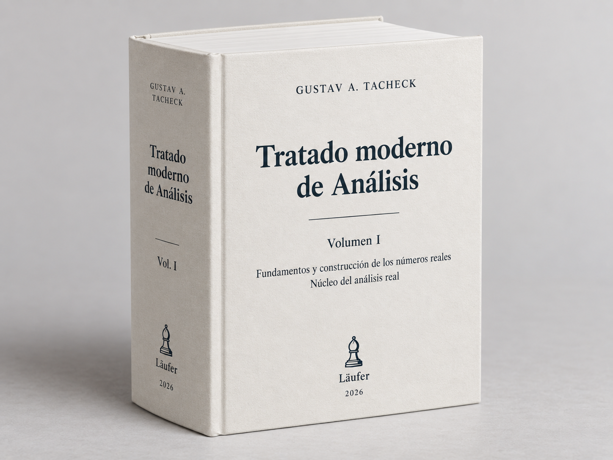

# Tratado de análisis

**Gustav A. Tacheck**

Este tratado desarrolla el análisis matemático desde fundamentos explícitos y construye progresivamente los sistemas numéricos que el análisis utiliza. La edición web se publica por etapas: cada parte se incorpora cuando ha superado su revisión matemática y editorial.

::: {.row .g-4 .align-items-center}

::: {.col-12 .col-md-5}

{fig-alt="Ficticio del volumen I del Tratado moderno de Análisis: libro blanco de tapa dura, lomo ancho y sello Läufer." width="100%"}

<small class="text-muted">Ficticio editorial. Representación de una posible edición impresa.</small>

:::

::: {.col-12 .col-md-7}

El tratado está concebido principalmente como una obra para la web, con navegación entre capítulos, referencias internas y una publicación abierta y progresiva. La edición en PDF se ofrece como formato complementario para quienes prefieran leer el texto de manera continua o deseen imprimirlo.

[**Descargar el volumen I en PDF (edición A5)**](tratado-de-analisis-volumen-i.pdf){download="tratado-de-analisis-volumen-i.pdf"}

:::

:::

## Prefacio

Este tratado nace de una intención sencilla de formular, aunque exigente de llevar a cabo: **desarrollar el análisis matemático desde fundamentos explícitos, con todo el rigor necesario, sin renunciar por ello a la claridad, la continuidad del pensamiento y el placer de comprender**.

No queremos presentar los conceptos fundamentales del análisis como objetos ya terminados que el lector deba aceptar antes de comenzar. Preferimos reconstruir el camino que conduce hasta ellos. Los números naturales, enteros, racionales y reales no aparecerán simplemente porque sean familiares: serán construidos; sus operaciones serán definidas; sus propiedades, demostradas. Sólo después podremos utilizarlos con la libertad que habitualmente damos por supuesta.

Este principio guía toda la obra:

> **Nada debe utilizarse antes de haber sido definido, construido o demostrado, salvo aquello que haya sido declarado explícitamente como fundamento.**

Pero rigor no tiene por qué significar aridez. Cada construcción importante procurará comenzar por el problema que la hace necesaria. Los enteros aparecen porque en los naturales la sustracción no siempre es posible; los racionales, porque los enteros no bastan para resolver toda división; los números reales surgirán, a su vez, de una insuficiencia más profunda de los racionales. Queremos que el lector pueda reconocer no sólo **cómo** se construye un objeto matemático, sino también **por qué vale la pena construirlo**.

Las demostraciones seguirán el mismo criterio. Aspiramos a que sean completas, pero también legibles: que indiquen su estrategia, hagan visibles sus pasos esenciales y permitan reconstruir la razón de cada argumento. La notación deberá servir al pensamiento en vez de enmascararlo.

Detrás del texto existe además una infraestructura de control: registramos dependencias entre resultados, revisamos la coherencia de las definiciones y, cuando resulta apropiado, contrastamos partes del desarrollo mediante herramientas de verificación formal. Estos mecanismos son auxiliares. **La prueba destinada al lector seguirá siendo siempre una demostración matemática humana, completa y comprensible.**

La publicación abierta y progresiva de este tratado forma parte de la misma filosofía. El texto irá creciendo capítulo a capítulo, y las versiones publicadas podrán ser corregidas, ampliadas y perfeccionadas. No queremos ocultar que una obra matemática extensa también se construye: esperamos que la web permita conservar esa condición viva sin sacrificar la estabilidad y el rigor de aquello que ya ha sido establecido.

Nuestro ideal podría resumirse en una fórmula:

$$
\boxed{\text{claridad de una conversación matemática seria}
\; + \;
\text{rigor de una formalización moderna}}
$$

Si este tratado consigue que una demostración rigurosa no se sienta como un obstáculo para comprender, sino como una forma más profunda de comprensión, habrá cumplido una parte esencial de su propósito.

---

## Cómo leer este libro

Este libro ha sido escrito como un **tratado**. Esa palabra no designa aquí simplemente un libro extenso, sino una forma particular de organizar el conocimiento matemático: cada concepto debe aparecer cuando existen ya los elementos necesarios para definirlo; cada resultado debe apoyarse únicamente en aquello que ha sido establecido antes; y cada nueva estructura debe construirse, en la medida de lo posible, a partir de las anteriores.

El principio que gobierna toda la obra puede formularse así:

> **Nada se utiliza antes de haber sido definido, construido o demostrado, salvo aquello que pertenezca expresamente al fundamento declarado del libro.**

Esta elección tiene consecuencias para la lectura.

En muchos textos de análisis se comienza dando por conocidos los números reales, sus operaciones, su orden y sus propiedades fundamentales. Aquí el camino es diferente. Partimos mucho antes. Construiremos sucesivamente los objetos y las estructuras que harán posible el análisis: conjuntos, relaciones, funciones, números naturales, enteros, racionales y, finalmente, los números reales por más de un procedimiento.

Esto significa que ciertos capítulos iniciales pueden parecer alejados de aquello que habitualmente se entiende por análisis. No lo están. Cada uno prepara una parte del lenguaje que después utilizaremos sin ambigüedad. Cuando aparezca una cortadura de Dedekind, una sucesión de Cauchy, un supremo, una función continua o una derivada, las nociones necesarias para comprender exactamente qué clase de objeto estamos manipulando ya habrán sido construidas.

No es necesario, sin embargo, leer todas las páginas con la misma intensidad.

Una **primera lectura** puede seguir el hilo principal: las motivaciones que abren cada construcción, las definiciones, los enunciados de los resultados fundamentales y los comentarios que explican qué se ha ganado después de demostrarlos. Esta lectura permite comprender la arquitectura de la teoría sin detenerse necesariamente en cada detalle técnico de cada demostración.

Una **segunda lectura**, más lenta, puede concentrarse en las demostraciones. En ella conviene preguntarse no sólo por qué el argumento es correcto, sino también por qué las hipótesis son necesarias, qué resultados anteriores están siendo utilizados y qué cambiaría si alguna de esas piezas faltara. Buena parte del contenido matemático profundo de un tratado se encuentra precisamente en esas relaciones.

Existe también una tercera forma de lectura, más cercana a la verificación: reconstruir la cadena deductiva completa. La edición web facilita esta lectura mediante encabezados estables, enlaces internos y el [glosario matemático](tratado-de-analisis-glosario.md), que permiten regresar al lugar exacto donde una noción fue introducida o un resultado quedó establecido.

Estas herramientas de navegación no sustituyen a la exposición matemática. Su función es hacer más visible una estructura deductiva que en muchos libros permanece implícita.

Algunas partes de la obra poseen además una verificación formal complementaria mediante asistentes de prueba. Esta capa tampoco reemplaza las demostraciones destinadas al lector humano. Una prueba formal certifica que cierta cadena de inferencias puede ser verificada dentro de un sistema preciso; una demostración matemática debe, además, mostrar por qué la idea funciona, cuáles son sus puntos decisivos y cómo se relaciona con el resto de la teoría. Ambas tareas son valiosas, pero no son idénticas.

Por esta razón, las demostraciones de este libro procuran no reducirse a una sucesión de manipulaciones simbólicas. Antes de las construcciones importantes se explicará qué problema intentamos resolver y por qué las herramientas anteriores todavía no bastan. Después de los resultados principales se señalará qué nueva posibilidad matemática ha quedado abierta.

Hay también una precaución terminológica importante. Los distintos sistemas numéricos que aparecen en el libro son **objetos construidos**. Por ello no identificaremos silenciosamente, por ejemplo, un número racional con el real que posteriormente lo representa. Primero construiremos una aplicación canónica

$$
\mathbb Q\longrightarrow\mathbb R,
$$

demostraremos las propiedades pertinentes de esa aplicación y sólo entonces utilizaremos, cuando sea conveniente, las identificaciones habituales. Esta insistencia puede parecer excesiva al principio, pero evita una de las fuentes más comunes de circularidad cuando se intenta construir rigurosamente los números reales.

Algo semejante sucede con resultados conocidos. Que un teorema sea familiar no significa que pueda utilizarse antes de que sus hipótesis y conceptos estén disponibles. El orden de exposición importa. En este tratado, una afirmación elemental situada demasiado pronto puede ser lógicamente más problemática que un teorema difícil situado en el lugar correcto.

Esto no significa que el lector deba retener en la memoria todas las definiciones y todos los lemas anteriores. El libro está pensado también como obra de consulta. Cuando un término técnico, una construcción o una propiedad no resulte inmediata, las referencias internas y el glosario permiten regresar al lugar exacto donde fue introducido.

Conviene, por último, no confundir **lentitud** con **dificultad**.

Algunas páginas avanzarán despacio porque estaremos construyendo cuidadosamente los cimientos. Otras recorrerán grandes distancias con relativa rapidez porque esos cimientos ya estarán disponibles. La paciencia invertida al comienzo produce economía más adelante: una vez demostrado un resultado estructural, podrá reutilizarse sin reconstruir continuamente sus detalles.

El objetivo de este libro no es que el lector acepte que los números reales existen, ni que aprenda solamente a operar con ellos. Es mostrar cómo puede levantarse, desde fundamentos explícitos, la estructura sobre la cual descansa el análisis.

Por eso la pregunta que acompaña toda la obra no es únicamente

$$
\text{«¿es verdadero?»}
$$

sino también

$$
\boxed{\text{«¿de dónde viene, de qué depende y por qué podemos usarlo aquí?»}}
$$

Leer este tratado consiste, en buena medida, en aprender a seguir esa pregunta.

## Contenido disponible

### Parte I — Fundamentos y construcción de los reales

1. [**Capítulo 0 — Fundamento lógico y conjuntista**](../capitulos/tratado-de-analisis-capitulo-0-fundamento-logico-y-conjuntista.md) (`MA-BCH-0005`) — Fija la lógica ambiente y los axiomas conjuntistas; desarrolla conjuntos, relaciones, cocientes, funciones, familias indexadas y órdenes, y establece el lenguaje deductivo necesario para construir los sistemas numéricos.

2. [**Capítulo 1 — Los números naturales**](../capitulos/tratado-de-analisis-capitulo-1-los-numeros-naturales.md) (`MA-BCH-0007`) — Construye $\mathbb N=\omega$ y desarrolla inducción, recursión, suma, producto y orden natural; demuestra la estructura de Peano, la tricotomía decidible, el buen orden y la inducción fuerte.

3. [**Capítulo 2 — Los números enteros**](../capitulos/tratado-de-analisis-capitulo-2-los-numeros-enteros.md) (`MA-BCH-0019`) — Construye $\mathbb Z$ como cociente de diferencias formales; define sus operaciones y su orden, demuestra que es un dominio íntegro ordenado y establece la incrustación canónica de $\mathbb N$.

4. [**Capítulo 3 — Los números racionales**](../capitulos/tratado-de-analisis-capitulo-3-los-numeros-racionales.md) (`MA-BCH-0020`) — Construye $\mathbb Q$ mediante fracciones de enteros; demuestra su estructura de cuerpo ordenado, densidad y arquimedianidad, y exhibe una falla concreta de completitud que conduce a los números reales.

5. [**Capítulo 4 — Cuerpos ordenados y el problema de la completitud**](../capitulos/tratado-de-analisis-capitulo-4-cuerpos-ordenados-y-el-problema-de-la-completitud.md) (`MA-BCH-0029`) — Desarrolla cuerpos ordenados, valor absoluto, intervalos, densidad y arquimedianidad; formula con precisión el problema de la completitud y prepara la construcción de los reales mediante cortaduras de Dedekind.

6. [**Capítulo 5 — Cortaduras de Dedekind**](../capitulos/tratado-de-analisis-capitulo-5-cortaduras-de-dedekind.md) (`MA-BCH-0051`) — Construye las cortaduras como subconjuntos de $\mathbb Q$, caracteriza sus propiedades, ordena el nuevo sistema por inclusión e incorpora canónicamente los racionales en el futuro cuerpo de los reales.

7. [**Capítulo 6 — Aritmética de las cortaduras**](../capitulos/tratado-de-analisis-capitulo-6-aritmetica-de-las-cortaduras.md) (`MA-BCH-0052`) — Define la suma, el cero y las operaciones fundamentales sobre cortaduras; verifica su buena definición y compatibilidad con el orden, avanzando desde la estructura ordenada hacia la estructura algebraica real.

8. [**Capítulo 7 — Completitud de los reales de Dedekind**](../capitulos/tratado-de-analisis-capitulo-7-completitud-de-los-reales-de-dedekind.md) (`MA-BCH-0053`) — Construye el supremo de todo conjunto no vacío y acotado de cortaduras, demuestra la completitud del modelo de Dedekind y cierra la primera construcción rigurosa del cuerpo de los reales.

9. [**Capítulo 8 — Sucesiones racionales y aproximación**](../capitulos/tratado-de-analisis-capitulo-8-sucesiones-racionales-y-aproximacion.md) (`MA-BCH-0054`) — Introduce sucesiones en $\mathbb Q$, distancia racional, convergencia y condición de Cauchy; muestra la incompletitud secuencial de los racionales y prepara una segunda construcción de los números reales.

10. [**Capítulo 9 — El cuerpo de Cauchy**](../capitulos/tratado-de-analisis-capitulo-9-el-cuerpo-de-cauchy.md) (`MA-BCH-0055`) — Construye el cociente de las sucesiones racionales de Cauchy por las sucesiones nulas; define operaciones y orden sobre clases y establece la estructura algebraica del nuevo modelo real.

11. [**Capítulo 10 — Completitud del cuerpo de Cauchy**](../capitulos/tratado-de-analisis-capitulo-10-completitud-del-cuerpo-de-cauchy.md) (`MA-BCH-0056`) — Desarrolla sucesiones de Cauchy en el nuevo cuerpo, construye aproximantes racionales y una diagonal convergente, y demuestra que la completación de Cauchy de $\mathbb Q$ es secuencialmente completa.

12. [**Capítulo 11 — Dedekind y Cauchy**](../capitulos/tratado-de-analisis-capitulo-11-dedekind-y-cauchy.md) (`MA-BCH-0057`) — Construye la correspondencia entre clases de sucesiones de Cauchy y cortaduras de Dedekind; prueba su buena definición y demuestra que preserva el orden y las operaciones fundamentales.

13. [**Capítulo 12 — Unicidad**](../capitulos/tratado-de-analisis-capitulo-12-unicidad.md) (`MA-BCH-0058`) — Pasa de los dos modelos concretos a la caracterización abstracta de los cuerpos ordenados completos; construye la copia racional canónica y demuestra la unicidad esencial del sistema de los reales.

### Parte II — Núcleo del análisis real

14. [**Capítulo 13 — Sucesiones reales**](../capitulos/tratado-de-analisis-capitulo-13-sucesiones-reales.md) (`MA-BCH-0059`) — Inicia el análisis sobre $\mathbb R$ mediante sucesiones como funciones; estudia colas, propiedades eventuales, convergencia, subsucesiones y límites inferior y superior, apoyándose en la completitud previamente construida.

15. [**Capítulo 14 — Series numéricas**](../capitulos/tratado-de-analisis-capitulo-14-series-numericas.md) (`MA-BCH-0060`) — Define series y sumas parciales; desarrolla el criterio de Cauchy, convergencia absoluta, comparación, series geométricas y armónicas, y criterios basados en raíces y límites superiores.

16. [**Capítulo 15 — Topología de la recta real**](../capitulos/tratado-de-analisis-capitulo-15-topologia-de-la-recta-real.md) (`MA-BCH-0061`) — Construye la topología de $\mathbb R$ mediante bolas y vecindades; estudia interior, exterior, adherencia, conjuntos abiertos y cerrados, densidad e intervalos como preparación para límites y continuidad.

17. [**Capítulo 16 — Límites de funciones**](../capitulos/tratado-de-analisis-capitulo-16-limites-de-funciones.md) (`MA-BCH-0067`) — Define el límite funcional y demuestra su unicidad; establece el criterio secuencial, el álgebra de límites, la composición y los límites laterales con dominios e hipótesis explícitos.

18. [**Capítulo 17 — Continuidad**](../capitulos/tratado-de-analisis-capitulo-17-continuidad.md) (`MA-BCH-0068`) — Desarrolla continuidad puntual y global, su caracterización secuencial y el álgebra de funciones continuas; estudia restricciones, composiciones y continuidad sobre intervalos dentro de la recta real.

19. [**Capítulo 18 — Compacidad y conexidad en la recta**](../capitulos/tratado-de-analisis-capitulo-18-compacidad-y-conexidad-en-la-recta.md) (`MA-BCH-0069`) — Caracteriza compacidad y conexidad en $\mathbb R$; demuestra Heine–Borel, la existencia de extremos y el teorema del valor intermedio, explicitando las dependencias fundacionales de cada equivalencia.

20. [**Capítulo 19 — Diferenciación**](../capitulos/tratado-de-analisis-capitulo-19-diferenciacion.md) (`MA-BCH-0070`) — Introduce la derivada como límite y desarrolla sus reglas algebraicas, la regla de la cadena, derivadas laterales y aproximación lineal, manteniendo explícitos dominios, puntos de acumulación e hipótesis.

21. [**Capítulo 20 — Teoremas fundamentales del cálculo diferencial**](../capitulos/tratado-de-analisis-capitulo-20-teoremas-fundamentales-del-calculo-diferencial.md) (`MA-BCH-0071`) — Estudia los extremos locales y demuestra los teoremas de Rolle y del valor medio; deriva consecuencias sobre monotonía, convexidad, constancia y la regla de L’Hôpital.

22. [**Capítulo 21 — Integral de Riemann**](../capitulos/tratado-de-analisis-capitulo-21-integral-de-riemann.md) (`MA-BCH-0072`) — Construye la integral mediante particiones, refinamientos y sumas de Darboux; caracteriza la integrabilidad de Riemann y demuestra sus propiedades de linealidad, monotonía, aditividad y estimación.

23. [**Capítulo 22 — Teorema fundamental del cálculo**](../capitulos/tratado-de-analisis-capitulo-22-teorema-fundamental-del-calculo.md) (`MA-BCH-0073`) — Relaciona integración y diferenciación mediante funciones de acumulación; demuestra las dos formas del teorema fundamental del cálculo, la fórmula de Newton–Leibniz y el cambio de variable.

24. [**Capítulo 23 — Sucesiones y series de funciones**](../capitulos/tratado-de-analisis-capitulo-23-sucesiones-y-series-de-funciones.md) (`MA-BCH-0074`) — Distingue convergencia puntual y uniforme; estudia continuidad, integración y diferenciación de límites, y desarrolla series de funciones, el criterio uniforme de Cauchy y el criterio de Weierstrass.

25. [**Capítulo 24 — Series de potencias**](../capitulos/tratado-de-analisis-capitulo-24-series-de-potencias.md) (`MA-BCH-0075`) — Desarrolla conjunto y radio de convergencia, comportamiento en los extremos y fórmula de Cauchy–Hadamard; justifica operaciones término a término y conecta derivadas, series de Taylor y analiticidad.

26. [**Glosario matemático**](tratado-de-analisis-glosario.md) (`MA-BCH-0006`) — glosario vivo con enlaces a las nociones publicadas.

Las **Partes I y II** están completas en la edición web: **25 de 25 capítulos cerrados y publicados**. La Parte I comprende los Capítulos 0–12; la Parte II, los Capítulos 13–24. Las Partes III–VI permanecen como reservas estructurales y no se abrirán hasta que se apruebe su arquitectura.

Cada capítulo conservará la continuidad deductiva del tratado, mientras la infraestructura interna de dependencias, auditoría y verificación permanecerá al servicio de la obra sin invadir la superficie de lectura.

Esta edición es abierta y progresiva. El contenido textual original se publica bajo **GNU Free Documentation License 1.3 o posterior**.