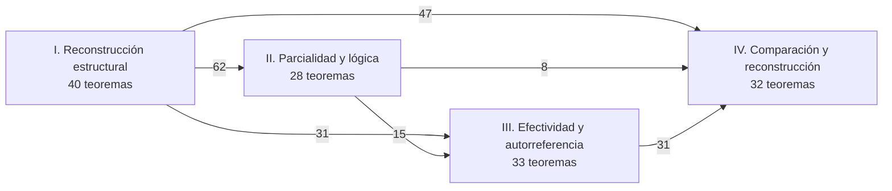
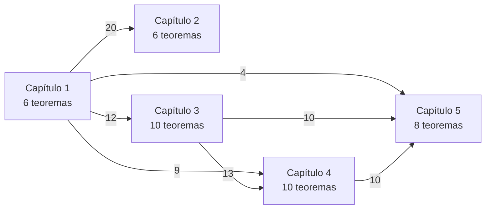
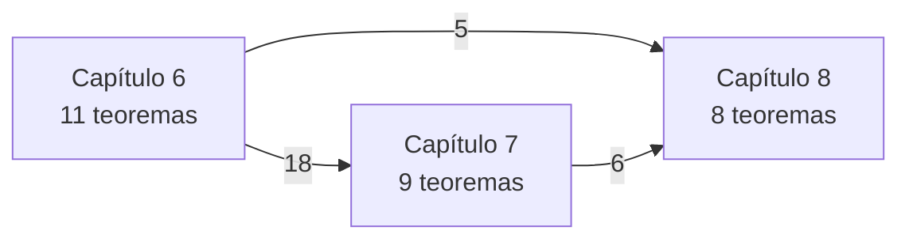
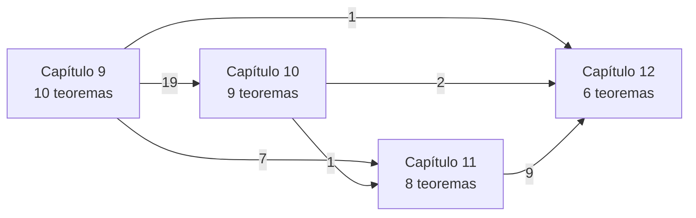
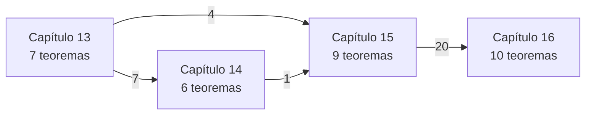

[Índice del tratado](index.qmd)

Este atlas permite encontrar cada uno de los 133 teoremas, volver a su demostración y recorrer sus dependencias directas declaradas. Las vistas por partes resumen el grafo canónico de 269 nodos; no cambian resultados ni crean un orden deductivo alternativo.

::: {.callout-note}
## Estado auditado del grafo
La revisión mecánica contra los capítulos 1–16 confirma **269 nodos** —9 axiomas, 73 definiciones, 133 teoremas, 32 ejemplos y 22 contraejemplos— y **800 aristas únicas** de dependencia. No hay ciclos, autoaristas ni referencias a IDs matemáticos inexistentes. Las 133 filas del atlas coinciden con el localizador y las dependencias declaradas en los capítulos.
:::

## B.1. Cómo leer el atlas y sus flechas

El registro distingue nueve axiomas, 73 definiciones, 133 teoremas, 32 ejemplos y 22 contraejemplos. El grafo conserva 800 enlaces declarados entre esos nodos. Incluye prerrequisitos de formulación y referencias cuyo sentido exige leer el texto; no todos sus enlaces son implicaciones lógicas.

::: {.tf-table role="region" tabindex="0" aria-label="Tabla matemática desplazable"}

| Elemento | Lectura |
|---|---|
| ID estable | Identidad conservada al cambiar paginación o edición |
| Localizador enlazado | Capítulo y número editorial; conduce al manuscrito que contiene la prueba |
| Título canónico | Reproduce el rótulo del teorema en su capítulo; no sustituye el enunciado completo ni sus hipótesis |
| Dependencias directas | Lista del grafo contrastada con el comentario del resultado; no contiene automáticamente toda la clausura transitiva |
| Flecha de los diagramas | Prerrequisito registrado → nodo que lo cita; orientación inversa a la tabla canónica “resultado → dependencias” |
| Número en una flecha agregada | Cantidad de enlaces entre nodos de los capítulos o partes indicados; no cantidad de teoremas demostrados ni peso de la dependencia |

:::

Las tablas reproducen todas las dependencias directas de los teoremas, incluidos otros tipos de nodo cuando constan en el grafo. Para localizarlos se consulta el registro y, para contraejemplos, [el apéndice A](apendice-a.qmd).

**Cautela lógica.** TF-DEF-00014 remite a las leyes categóricas como prerrequisitos de formulación. TF-CEX-00002 cita el axioma de clasificador que el modelo refuta; TF-CEX-00003 cita elección regular para delimitar su fallo. No se interpreta por ello que esos modelos satisfagan el axioma negado. Las vistas agregan enlaces registrados sin convertirlos en premisas verdaderas de cada modelo.

## B.2. Vista de conjunto

::: {.tf-table role="region" tabindex="0" aria-label="Tabla matemática desplazable"}

| Parte | Capítulos | Teoremas propios |
|---|---|---|
| I. Reconstrucción estructural | 1–5 | 40 |
| II. Parcialidad y lógica | 6–8 | 28 |
| III. Efectividad y autorreferencia | 9–12 | 33 |
| IV. Comparación y reconstrucción | 13–16 | 32 |
| V. Síntesis fundacional | 17–18 | 0 |

:::

Los capítulos 17 y 18 reorganizan y aplican resultados existentes; su ausencia de nodos nuevos no significa falta de contenido matemático. Las remisiones de síntesis no se incorporan como aristas nuevas.

Esta vista omite enlaces interiores a una misma parte y la navegación editorial de la parte V. Los números son agregaciones de los enlaces canónicos, no relaciones nuevas entre axiomas globales.

## B.3. Parte I: Reconstrucción estructural

### Vista entre capítulos de la parte

Esta parte no registra entradas desde otras partes. Esto no significa ausencia de metateoría o de fuentes externas.

Los enlaces dentro de un mismo capítulo quedan en las tablas y en el grafo canónico. El diagrama omite ese detalle para mantener legibilidad.

### Capítulo 1: [manuscrito fuente](capitulo-01.qmd)

::: {.tf-table role="region" tabindex="0" aria-label="Tabla matemática desplazable"}

| ID | Localizador | Título canónico | Dependencias directas registradas |
|---|---|---|---|
| [TF-THM-00001](capitulo-01.qmd#TF-THM-00001) | [1.1.3](capitulo-01.qmd#TF-THM-00001) | Unicidad de la identidad | [TF-AX-00002](capitulo-01.qmd#TF-AX-00002) |
| [TF-THM-00002](capitulo-01.qmd#TF-THM-00002) | [1.1.5](capitulo-01.qmd#TF-THM-00002) | Unicidad de la inversa | [TF-DEF-00001](capitulo-01.qmd#TF-DEF-00001), [TF-AX-00001](capitulo-01.qmd#TF-AX-00001), [TF-AX-00002](capitulo-01.qmd#TF-AX-00002) |
| [TF-THM-00003](capitulo-01.qmd#TF-THM-00003) | [1.2.3](capitulo-01.qmd#TF-THM-00003) | Los objetos terminales son únicos salvo isomorfismo único | [TF-AX-00003](capitulo-01.qmd#TF-AX-00003), [TF-DEF-00001](capitulo-01.qmd#TF-DEF-00001), [TF-AX-00002](capitulo-01.qmd#TF-AX-00002) |
| [TF-THM-00004](capitulo-01.qmd#TF-THM-00004) | [1.3.3](capitulo-01.qmd#TF-THM-00004) | La gráfica es un monomorfismo | [TF-AX-00002](capitulo-01.qmd#TF-AX-00002), [TF-AX-00004](capitulo-01.qmd#TF-AX-00004), [TF-DEF-00003](capitulo-01.qmd#TF-DEF-00003) |
| [TF-THM-00005](capitulo-01.qmd#TF-THM-00005) | [1.3.4](capitulo-01.qmd#TF-THM-00005) | Caracterización estructural de las gráficas | [TF-THM-00004](capitulo-01.qmd#TF-THM-00004), [TF-AX-00004](capitulo-01.qmd#TF-AX-00004), [TF-DEF-00001](capitulo-01.qmd#TF-DEF-00001) |
| [TF-THM-00006](capitulo-01.qmd#TF-THM-00006) | [1.4.2](capitulo-01.qmd#TF-THM-00006) | Las aplicaciones como elementos del exponencial | [TF-AX-00002](capitulo-01.qmd#TF-AX-00002), [TF-AX-00003](capitulo-01.qmd#TF-AX-00003), [TF-AX-00004](capitulo-01.qmd#TF-AX-00004), [TF-AX-00005](capitulo-01.qmd#TF-AX-00005) |

:::

### Capítulo 2: [manuscrito fuente](capitulo-02.qmd)

::: {.tf-table role="region" tabindex="0" aria-label="Tabla matemática desplazable"}

| ID | Localizador | Título canónico | Dependencias directas registradas |
|---|---|---|---|
| [TF-THM-00007](capitulo-02.qmd#TF-THM-00007) | [2.1.3](capitulo-02.qmd#TF-THM-00007) | Extensionalidad por puntos | [TF-DEF-00004](capitulo-02.qmd#TF-DEF-00004), [TF-DEF-00005](capitulo-02.qmd#TF-DEF-00005) |
| [TF-THM-00008](capitulo-02.qmd#TF-THM-00008) | [2.2.2](capitulo-02.qmd#TF-THM-00008) | Criterio de fidelidad | [TF-DEF-00005](capitulo-02.qmd#TF-DEF-00005), [TF-DEF-00006](capitulo-02.qmd#TF-DEF-00006) |
| [TF-THM-00009](capitulo-02.qmd#TF-THM-00009) | [2.4.2](capitulo-02.qmd#TF-THM-00009) | Separación por todos los elementos generalizados | [TF-DEF-00007](capitulo-02.qmd#TF-DEF-00007), [TF-AX-00002](capitulo-01.qmd#TF-AX-00002) |
| [TF-THM-00010](capitulo-02.qmd#TF-THM-00010) | [2.5.2](capitulo-02.qmd#TF-THM-00010) | Ecuación de evaluación en un punto | [TF-DEF-00008](capitulo-02.qmd#TF-DEF-00008), [TF-AX-00004](capitulo-01.qmd#TF-AX-00004), [TF-AX-00005](capitulo-01.qmd#TF-AX-00005) |
| [TF-THM-00011](capitulo-02.qmd#TF-THM-00011) | [2.5.3](capitulo-02.qmd#TF-THM-00011) | Extensionalidad de las transpuestas | [TF-DEF-00008](capitulo-02.qmd#TF-DEF-00008), [TF-THM-00006](capitulo-01.qmd#TF-THM-00006), [TF-AX-00005](capitulo-01.qmd#TF-AX-00005) |
| [TF-THM-00012](capitulo-02.qmd#TF-THM-00012) | [2.5.4](capitulo-02.qmd#TF-THM-00012) | Extensionalidad de la evaluación parametrizada | [TF-AX-00004](capitulo-01.qmd#TF-AX-00004), [TF-AX-00005](capitulo-01.qmd#TF-AX-00005) |

:::

### Capítulo 3: [manuscrito fuente](capitulo-03.qmd)

::: {.tf-table role="region" tabindex="0" aria-label="Tabla matemática desplazable"}

| ID | Localizador | Título canónico | Dependencias directas registradas |
|---|---|---|---|
| [TF-THM-00013](capitulo-03.qmd#TF-THM-00013) | [3.1.2](capitulo-03.qmd#TF-THM-00013) | Orden de los subobjetos | [TF-DEF-00009](capitulo-03.qmd#TF-DEF-00009), [TF-DEF-00003](capitulo-01.qmd#TF-DEF-00003) |
| [TF-THM-00014](capitulo-03.qmd#TF-THM-00014) | [3.1.4](capitulo-03.qmd#TF-THM-00014) | Toda aplicación determina una relación gráfica | [TF-DEF-00010](capitulo-03.qmd#TF-DEF-00010), [TF-THM-00004](capitulo-01.qmd#TF-THM-00004) |
| [TF-THM-00015](capitulo-03.qmd#TF-THM-00015) | [3.2.3](capitulo-03.qmd#TF-THM-00015) | Una preimagen es un subobjeto | [TF-AX-00006](capitulo-03.qmd#TF-AX-00006), [TF-DEF-00003](capitulo-01.qmd#TF-DEF-00003), [TF-DEF-00011](capitulo-03.qmd#TF-DEF-00011) |
| [TF-THM-00016](capitulo-03.qmd#TF-THM-00016) | [3.2.4](capitulo-03.qmd#TF-THM-00016) | Leyes de la preimagen | [TF-DEF-00011](capitulo-03.qmd#TF-DEF-00011), [TF-THM-00015](capitulo-03.qmd#TF-THM-00015), [TF-AX-00006](capitulo-03.qmd#TF-AX-00006) |
| [TF-THM-00017](capitulo-03.qmd#TF-THM-00017) | [3.2.5](capitulo-03.qmd#TF-THM-00017) | Intersección como producto fibrado | [TF-DEF-00009](capitulo-03.qmd#TF-DEF-00009), [TF-AX-00006](capitulo-03.qmd#TF-AX-00006), [TF-THM-00015](capitulo-03.qmd#TF-THM-00015) |
| [TF-THM-00018](capitulo-03.qmd#TF-THM-00018) | [3.3.2](capitulo-03.qmd#TF-THM-00018) | Representación de los subobjetos | [TF-AX-00007](capitulo-03.qmd#TF-AX-00007), [TF-DEF-00009](capitulo-03.qmd#TF-DEF-00009), [TF-AX-00006](capitulo-03.qmd#TF-AX-00006) |
| [TF-THM-00019](capitulo-03.qmd#TF-THM-00019) | [3.3.3](capitulo-03.qmd#TF-THM-00019) | Naturalidad de las características | [TF-THM-00018](capitulo-03.qmd#TF-THM-00018), [TF-THM-00016](capitulo-03.qmd#TF-THM-00016), [TF-AX-00007](capitulo-03.qmd#TF-AX-00007) |
| [TF-THM-00020](capitulo-03.qmd#TF-THM-00020) | [3.4.1](capitulo-03.qmd#TF-THM-00020) | Igualdad de funciones por sus características gráficas | [TF-THM-00005](capitulo-01.qmd#TF-THM-00005), [TF-THM-00018](capitulo-03.qmd#TF-THM-00018), [TF-THM-00014](capitulo-03.qmd#TF-THM-00014) |
| [TF-THM-00021](capitulo-03.qmd#TF-THM-00021) | [3.4.3](capitulo-03.qmd#TF-THM-00021) | El objeto potencia representa familias de relaciones | [TF-DEF-00012](capitulo-03.qmd#TF-DEF-00012), [TF-THM-00018](capitulo-03.qmd#TF-THM-00018), [TF-AX-00005](capitulo-01.qmd#TF-AX-00005) |
| [TF-THM-00022](capitulo-03.qmd#TF-THM-00022) | [3.5.3](capitulo-03.qmd#TF-THM-00022) | Asociatividad de la composición conjuntista | [TF-DEF-00013](capitulo-03.qmd#TF-DEF-00013) |

:::

### Capítulo 4: [manuscrito fuente](capitulo-04.qmd)

::: {.tf-table role="region" tabindex="0" aria-label="Tabla matemática desplazable"}

| ID | Localizador | Título canónico | Dependencias directas registradas |
|---|---|---|---|
| [TF-THM-00023](capitulo-04.qmd#TF-THM-00023) | [4.1.1](capitulo-04.qmd#TF-THM-00023) | Los axiomas anteriores dan límites finitos | [TF-AX-00003](capitulo-01.qmd#TF-AX-00003), [TF-AX-00004](capitulo-01.qmd#TF-AX-00004), [TF-AX-00006](capitulo-03.qmd#TF-AX-00006) |
| [TF-THM-00024](capitulo-04.qmd#TF-THM-00024) | [4.2.2](capitulo-04.qmd#TF-THM-00024) | Ortogonalidad y composición de cubrimientos | [TF-DEF-00014](capitulo-04.qmd#TF-DEF-00014), [TF-AX-00008](capitulo-04.qmd#TF-AX-00008), [TF-DEF-00003](capitulo-01.qmd#TF-DEF-00003) |
| [TF-THM-00025](capitulo-04.qmd#TF-THM-00025) | [4.2.3](capitulo-04.qmd#TF-THM-00025) | Unicidad, propiedad de imagen y estabilidad | [TF-AX-00008](capitulo-04.qmd#TF-AX-00008), [TF-THM-00024](capitulo-04.qmd#TF-THM-00024), [TF-DEF-00009](capitulo-03.qmd#TF-DEF-00009), [TF-AX-00006](capitulo-03.qmd#TF-AX-00006) |
| [TF-THM-00026](capitulo-04.qmd#TF-THM-00026) | [4.3.2](capitulo-04.qmd#TF-THM-00026) | Independencia de representantes | [TF-DEF-00015](capitulo-04.qmd#TF-DEF-00015), [TF-THM-00025](capitulo-04.qmd#TF-THM-00025), [TF-AX-00006](capitulo-03.qmd#TF-AX-00006) |
| [TF-THM-00027](capitulo-04.qmd#TF-THM-00027) | [4.3.3](capitulo-04.qmd#TF-THM-00027) | Identidades relacionales | [TF-DEF-00015](capitulo-04.qmd#TF-DEF-00015), [TF-THM-00025](capitulo-04.qmd#TF-THM-00025), [TF-AX-00004](capitulo-01.qmd#TF-AX-00004), [TF-AX-00006](capitulo-03.qmd#TF-AX-00006) |
| [TF-THM-00028](capitulo-04.qmd#TF-THM-00028) | [4.3.4](capitulo-04.qmd#TF-THM-00028) | Asociatividad | [TF-DEF-00015](capitulo-04.qmd#TF-DEF-00015), [TF-THM-00025](capitulo-04.qmd#TF-THM-00025), [TF-THM-00024](capitulo-04.qmd#TF-THM-00024), [TF-AX-00006](capitulo-03.qmd#TF-AX-00006) |
| [TF-THM-00029](capitulo-04.qmd#TF-THM-00029) | [4.3.5](capitulo-04.qmd#TF-THM-00029) | Inclusión fiel de aplicaciones como gráficas | [TF-THM-00004](capitulo-01.qmd#TF-THM-00004), [TF-THM-00005](capitulo-01.qmd#TF-THM-00005), [TF-DEF-00015](capitulo-04.qmd#TF-DEF-00015), [TF-THM-00027](capitulo-04.qmd#TF-THM-00027), [TF-THM-00025](capitulo-04.qmd#TF-THM-00025) |
| [TF-THM-00030](capitulo-04.qmd#TF-THM-00030) | [4.3.6](capitulo-04.qmd#TF-THM-00030) | Totalidad más unicidad sin elección | [TF-THM-00005](capitulo-01.qmd#TF-THM-00005), [TF-THM-00024](capitulo-04.qmd#TF-THM-00024), [TF-DEF-00010](capitulo-03.qmd#TF-DEF-00010), [TF-THM-00029](capitulo-04.qmd#TF-THM-00029) |
| [TF-THM-00031](capitulo-04.qmd#TF-THM-00031) | [4.4.2](capitulo-04.qmd#TF-THM-00031) | Adjunción imagen/preimagen | [TF-DEF-00016](capitulo-04.qmd#TF-DEF-00016), [TF-THM-00025](capitulo-04.qmd#TF-THM-00025), [TF-DEF-00011](capitulo-03.qmd#TF-DEF-00011), [TF-AX-00006](capitulo-03.qmd#TF-AX-00006) |
| [TF-THM-00032](capitulo-04.qmd#TF-THM-00032) | [4.4.3](capitulo-04.qmd#TF-THM-00032) | Beck–Chevalley para imágenes | [TF-DEF-00016](capitulo-04.qmd#TF-DEF-00016), [TF-THM-00025](capitulo-04.qmd#TF-THM-00025), [TF-AX-00006](capitulo-03.qmd#TF-AX-00006) |

:::

### Capítulo 5: [manuscrito fuente](capitulo-05.qmd)

::: {.tf-table role="region" tabindex="0" aria-label="Tabla matemática desplazable"}

| ID | Localizador | Título canónico | Dependencias directas registradas |
|---|---|---|---|
| [TF-THM-00033](capitulo-05.qmd#TF-THM-00033) | [5.1.3](capitulo-05.qmd#TF-THM-00033) | Criterio estructural de función total | [TF-DEF-00017](capitulo-05.qmd#TF-DEF-00017), [TF-DEF-00018](capitulo-05.qmd#TF-DEF-00018), [TF-THM-00024](capitulo-04.qmd#TF-THM-00024), [TF-THM-00005](capitulo-01.qmd#TF-THM-00005), [TF-THM-00029](capitulo-04.qmd#TF-THM-00029) |
| [TF-THM-00034](capitulo-05.qmd#TF-THM-00034) | [5.2.2](capitulo-05.qmd#TF-THM-00034) | Selector si y sólo si sección | [TF-DEF-00019](capitulo-05.qmd#TF-DEF-00019), [TF-DEF-00017](capitulo-05.qmd#TF-DEF-00017), [TF-AX-00004](capitulo-01.qmd#TF-AX-00004), [TF-DEF-00009](capitulo-03.qmd#TF-DEF-00009) |
| [TF-THM-00035](capitulo-05.qmd#TF-THM-00035) | [5.2.4](capitulo-05.qmd#TF-THM-00035) | Caracterización relacional de los objetos proyectivos | [TF-DEF-00020](capitulo-05.qmd#TF-DEF-00020), [TF-THM-00034](capitulo-05.qmd#TF-THM-00034), [TF-DEF-00017](capitulo-05.qmd#TF-DEF-00017), [TF-DEF-00010](capitulo-03.qmd#TF-DEF-00010) |
| [TF-THM-00036](capitulo-05.qmd#TF-THM-00036) | [5.2.6](capitulo-05.qmd#TF-THM-00036) | Equivalencias del axioma de elección regular | [TF-AX-00009](capitulo-05.qmd#TF-AX-00009), [TF-THM-00035](capitulo-05.qmd#TF-THM-00035), [TF-THM-00034](capitulo-05.qmd#TF-THM-00034), [TF-DEF-00020](capitulo-05.qmd#TF-DEF-00020) |
| [TF-THM-00037](capitulo-05.qmd#TF-THM-00037) | [5.3.1](capitulo-05.qmd#TF-THM-00037) | Elección única y naturalidad por cambio de base | [TF-THM-00033](capitulo-05.qmd#TF-THM-00033), [TF-THM-00016](capitulo-03.qmd#TF-THM-00016), [TF-AX-00006](capitulo-03.qmd#TF-AX-00006) |
| [TF-THM-00038](capitulo-05.qmd#TF-THM-00038) | [5.3.2](capitulo-05.qmd#TF-THM-00038) | Tres formulaciones equivalentes de AC en ZF | [TF-DEF-00019](capitulo-05.qmd#TF-DEF-00019), [TF-THM-00034](capitulo-05.qmd#TF-THM-00034), [TF-DEF-00017](capitulo-05.qmd#TF-DEF-00017) |
| [TF-THM-00039](capitulo-05.qmd#TF-THM-00039) | [5.3.3](capitulo-05.qmd#TF-THM-00039) | La existencia única define una función en ZF, sin AC | [TF-THM-00033](capitulo-05.qmd#TF-THM-00033), [TF-DEF-00010](capitulo-03.qmd#TF-DEF-00010) |
| [TF-THM-00040](capitulo-05.qmd#TF-THM-00040) | [5.4.1](capitulo-05.qmd#TF-THM-00040) | La elección ya realizada es estable por sustitución | [TF-THM-00034](capitulo-05.qmd#TF-THM-00034), [TF-AX-00006](capitulo-03.qmd#TF-AX-00006), [TF-AX-00008](capitulo-04.qmd#TF-AX-00008) |

:::

## B.4. Parte II: Parcialidad y lógica

### Vista entre capítulos de la parte

**Entradas desde otras partes.** Sólo se cuentan enlaces directos entre nodos, orientados de prerrequisito a resultado.

::: {.tf-table role="region" tabindex="0" aria-label="Tabla matemática desplazable"}

| Capítulo de origen | Capítulo de destino | Enlaces |
|---|---|---|
| 1 | 6 | 8 |
| 1 | 7 | 4 |
| 2 | 7 | 1 |
| 3 | 6 | 10 |
| 3 | 7 | 19 |
| 3 | 8 | 4 |
| 4 | 7 | 6 |
| 4 | 8 | 2 |
| 5 | 6 | 7 |
| 5 | 7 | 1 |

:::

Los enlaces dentro de un mismo capítulo quedan en las tablas y en el grafo canónico. El diagrama omite ese detalle para mantener legibilidad.

### Capítulo 6: [manuscrito fuente](capitulo-06.qmd)

::: {.tf-table role="region" tabindex="0" aria-label="Tabla matemática desplazable"}

| ID | Localizador | Título canónico | Dependencias directas registradas |
|---|---|---|---|
| [TF-THM-00041](capitulo-06.qmd#TF-THM-00041) | [6.1.2](capitulo-06.qmd#TF-THM-00041) | Caracterización por relaciones univaluadas | [TF-DEF-00021](capitulo-06.qmd#TF-DEF-00021), [TF-DEF-00010](capitulo-03.qmd#TF-DEF-00010), [TF-DEF-00018](capitulo-05.qmd#TF-DEF-00018), [TF-AX-00004](capitulo-01.qmd#TF-AX-00004), [TF-DEF-00009](capitulo-03.qmd#TF-DEF-00009) |
| [TF-THM-00042](capitulo-06.qmd#TF-THM-00042) | [6.1.4](capitulo-06.qmd#TF-THM-00042) | Recuperación de las flechas totales | [TF-DEF-00022](capitulo-06.qmd#TF-DEF-00022), [TF-DEF-00021](capitulo-06.qmd#TF-DEF-00021), [TF-DEF-00001](capitulo-01.qmd#TF-DEF-00001), [TF-THM-00005](capitulo-01.qmd#TF-THM-00005) |
| [TF-THM-00043](capitulo-06.qmd#TF-THM-00043) | [6.2.2](capitulo-06.qmd#TF-THM-00043) | La categoría $\mathbf{Par}(\mathcal C)$ | [TF-DEF-00023](capitulo-06.qmd#TF-DEF-00023), [TF-DEF-00021](capitulo-06.qmd#TF-DEF-00021), [TF-AX-00006](capitulo-03.qmd#TF-AX-00006), [TF-AX-00001](capitulo-01.qmd#TF-AX-00001), [TF-AX-00002](capitulo-01.qmd#TF-AX-00002) |
| [TF-THM-00044](capitulo-06.qmd#TF-THM-00044) | [6.2.3](capitulo-06.qmd#TF-THM-00044) | Inclusión fiel de aplicaciones totales | [TF-THM-00042](capitulo-06.qmd#TF-THM-00042), [TF-THM-00043](capitulo-06.qmd#TF-THM-00043), [TF-DEF-00023](capitulo-06.qmd#TF-DEF-00023) |
| [TF-THM-00045](capitulo-06.qmd#TF-THM-00045) | [6.3.2](capitulo-06.qmd#TF-THM-00045) | Orden y compatibilidad con composición | [TF-DEF-00024](capitulo-06.qmd#TF-DEF-00024), [TF-DEF-00023](capitulo-06.qmd#TF-DEF-00023), [TF-AX-00006](capitulo-03.qmd#TF-AX-00006), [TF-DEF-00009](capitulo-03.qmd#TF-DEF-00009) |
| [TF-THM-00046](capitulo-06.qmd#TF-THM-00046) | [6.3.4](capitulo-06.qmd#TF-THM-00046) | Leyes de la restricción | [TF-DEF-00025](capitulo-06.qmd#TF-DEF-00025), [TF-DEF-00023](capitulo-06.qmd#TF-DEF-00023), [TF-THM-00043](capitulo-06.qmd#TF-THM-00043), [TF-DEF-00024](capitulo-06.qmd#TF-DEF-00024), [TF-DEF-00022](capitulo-06.qmd#TF-DEF-00022) |
| [TF-THM-00047](capitulo-06.qmd#TF-THM-00047) | [6.4.2](capitulo-06.qmd#TF-THM-00047) | Caracterización mediante aplicaciones parciales | [TF-DEF-00026](capitulo-06.qmd#TF-DEF-00026), [TF-DEF-00024](capitulo-06.qmd#TF-DEF-00024), [TF-THM-00042](capitulo-06.qmd#TF-THM-00042) |
| [TF-THM-00048](capitulo-06.qmd#TF-THM-00048) | [6.4.3](capitulo-06.qmd#TF-THM-00048) | Criterio exacto de extensión en ZF | [TF-DEF-00024](capitulo-06.qmd#TF-DEF-00024), [TF-THM-00042](capitulo-06.qmd#TF-THM-00042), [TF-THM-00039](capitulo-05.qmd#TF-THM-00039) |
| [TF-THM-00049](capitulo-06.qmd#TF-THM-00049) | [6.4.4](capitulo-06.qmd#TF-THM-00049) | Objetos inyectivos de $\mathbf{Set}$ | [TF-DEF-00026](capitulo-06.qmd#TF-DEF-00026), [TF-THM-00047](capitulo-06.qmd#TF-THM-00047), [TF-THM-00048](capitulo-06.qmd#TF-THM-00048) |
| [TF-THM-00050](capitulo-06.qmd#TF-THM-00050) | [6.4.5](capitulo-06.qmd#TF-THM-00050) | Extensiones sujetas a valores permitidos y elección | [TF-THM-00038](capitulo-05.qmd#TF-THM-00038), [TF-DEF-00019](capitulo-05.qmd#TF-DEF-00019), [TF-THM-00048](capitulo-06.qmd#TF-THM-00048) |
| [TF-THM-00051](capitulo-06.qmd#TF-THM-00051) | [6.6.1](capitulo-06.qmd#TF-THM-00051) | Clasificador de funciones parciales en $\mathbf{Set}$ | [TF-DEF-00021](capitulo-06.qmd#TF-DEF-00021), [TF-THM-00041](capitulo-06.qmd#TF-THM-00041), [TF-DEF-00022](capitulo-06.qmd#TF-DEF-00022) |

:::

### Capítulo 7: [manuscrito fuente](capitulo-07.qmd)

::: {.tf-table role="region" tabindex="0" aria-label="Tabla matemática desplazable"}

| ID | Localizador | Título canónico | Dependencias directas registradas |
|---|---|---|---|
| [TF-THM-00052](capitulo-07.qmd#TF-THM-00052) | [7.1.2](capitulo-07.qmd#TF-THM-00052) | Verdad parametrizada y equivalencia de dominios | [TF-DEF-00027](capitulo-07.qmd#TF-DEF-00027), [TF-THM-00018](capitulo-03.qmd#TF-THM-00018), [TF-THM-00019](capitulo-03.qmd#TF-THM-00019), [TF-DEF-00007](capitulo-02.qmd#TF-DEF-00007) |
| [TF-THM-00053](capitulo-07.qmd#TF-THM-00053) | [7.2.2](capitulo-07.qmd#TF-THM-00053) | Leyes de restricción y maximalidad | [TF-DEF-00028](capitulo-07.qmd#TF-DEF-00028), [TF-THM-00017](capitulo-03.qmd#TF-THM-00017), [TF-DEF-00024](capitulo-06.qmd#TF-DEF-00024), [TF-THM-00045](capitulo-06.qmd#TF-THM-00045) |
| [TF-THM-00054](capitulo-07.qmd#TF-THM-00054) | [7.2.3](capitulo-07.qmd#TF-THM-00054) | Dominio exacto de una composición parcial | [TF-DEF-00023](capitulo-06.qmd#TF-DEF-00023), [TF-DEF-00022](capitulo-06.qmd#TF-DEF-00022), [TF-DEF-00028](capitulo-07.qmd#TF-DEF-00028), [TF-THM-00016](capitulo-03.qmd#TF-THM-00016) |
| [TF-THM-00055](capitulo-07.qmd#TF-THM-00055) | [7.2.4](capitulo-07.qmd#TF-THM-00055) | Sustitución por una aplicación total | [TF-DEF-00027](capitulo-07.qmd#TF-DEF-00027), [TF-DEF-00023](capitulo-06.qmd#TF-DEF-00023), [TF-THM-00016](capitulo-03.qmd#TF-THM-00016), [TF-THM-00019](capitulo-03.qmd#TF-THM-00019) |
| [TF-THM-00056](capitulo-07.qmd#TF-THM-00056) | [7.3.2](capitulo-07.qmd#TF-THM-00056) | Igualdad de aplicaciones parciales por dominio y valores | [TF-DEF-00021](capitulo-06.qmd#TF-DEF-00021), [TF-DEF-00022](capitulo-06.qmd#TF-DEF-00022), [TF-DEF-00029](capitulo-07.qmd#TF-DEF-00029), [TF-THM-00042](capitulo-06.qmd#TF-THM-00042) |
| [TF-THM-00057](capitulo-07.qmd#TF-THM-00057) | [7.3.3](capitulo-07.qmd#TF-THM-00057) | La conjunción clasifica la intersección | [TF-AX-00007](capitulo-03.qmd#TF-AX-00007), [TF-AX-00004](capitulo-01.qmd#TF-AX-00004), [TF-THM-00017](capitulo-03.qmd#TF-THM-00017), [TF-THM-00019](capitulo-03.qmd#TF-THM-00019) |
| [TF-THM-00058](capitulo-07.qmd#TF-THM-00058) | [7.4.2](capitulo-07.qmd#TF-THM-00058) | Cuantificación existencial sucesiva | [TF-DEF-00030](capitulo-07.qmd#TF-DEF-00030), [TF-THM-00031](capitulo-04.qmd#TF-THM-00031), [TF-THM-00016](capitulo-03.qmd#TF-THM-00016) |
| [TF-THM-00059](capitulo-07.qmd#TF-THM-00059) | [7.4.3](capitulo-07.qmd#TF-THM-00059) | El dominio es la proyección existencial de la gráfica | [TF-THM-00041](capitulo-06.qmd#TF-THM-00041), [TF-DEF-00030](capitulo-07.qmd#TF-DEF-00030), [TF-THM-00025](capitulo-04.qmd#TF-THM-00025), [TF-DEF-00022](capitulo-06.qmd#TF-DEF-00022) |
| [TF-THM-00060](capitulo-07.qmd#TF-THM-00060) | [7.4.4](capitulo-07.qmd#TF-THM-00060) | Totalidad y comparación lógica de dominios | [TF-DEF-00027](capitulo-07.qmd#TF-DEF-00027), [TF-DEF-00022](capitulo-06.qmd#TF-DEF-00022), [TF-THM-00052](capitulo-07.qmd#TF-THM-00052), [TF-DEF-00024](capitulo-06.qmd#TF-DEF-00024), [TF-THM-00042](capitulo-06.qmd#TF-THM-00042) |

:::

### Capítulo 8: [manuscrito fuente](capitulo-08.qmd)

::: {.tf-table role="region" tabindex="0" aria-label="Tabla matemática desplazable"}

| ID | Localizador | Título canónico | Dependencias directas registradas |
|---|---|---|---|
| [TF-THM-00061](capitulo-08.qmd#TF-THM-00061) | [8.1.2](capitulo-08.qmd#TF-THM-00061) | Unicidad esencial del clasificador | [TF-DEF-00032](capitulo-08.qmd#TF-DEF-00032) |
| [TF-THM-00062](capitulo-08.qmd#TF-THM-00062) | [8.2.2](capitulo-08.qmd#TF-THM-00062) | Existencia y universalidad de $L(B)$ en todo topos elemental | [TF-DEF-00033](capitulo-08.qmd#TF-DEF-00033), [TF-DEF-00032](capitulo-08.qmd#TF-DEF-00032), [TF-THM-00021](capitulo-03.qmd#TF-THM-00021), [TF-THM-00041](capitulo-06.qmd#TF-THM-00041), [TF-THM-00023](capitulo-04.qmd#TF-THM-00023) |
| [TF-THM-00063](capitulo-08.qmd#TF-THM-00063) | [8.2.3](capitulo-08.qmd#TF-THM-00063) | $L(1)$ es el clasificador de subobjetos | [TF-THM-00062](capitulo-08.qmd#TF-THM-00062), [TF-THM-00018](capitulo-03.qmd#TF-THM-00018), [TF-DEF-00032](capitulo-08.qmd#TF-DEF-00032) |
| [TF-THM-00064](capitulo-08.qmd#TF-THM-00064) | [8.3.1](capitulo-08.qmd#TF-THM-00064) | Modelo clásico $L(B)\cong B\sqcup1$ | [TF-THM-00051](capitulo-06.qmd#TF-THM-00051), [TF-DEF-00032](capitulo-08.qmd#TF-DEF-00032) |
| [TF-THM-00065](capitulo-08.qmd#TF-THM-00065) | [8.4.2](capitulo-08.qmd#TF-THM-00065) | En un topos booleano, $c_B$ es isomorfismo | [TF-DEF-00034](capitulo-08.qmd#TF-DEF-00034), [TF-DEF-00031](capitulo-07.qmd#TF-DEF-00031), [TF-THM-00062](capitulo-08.qmd#TF-THM-00062) |
| [TF-THM-00066](capitulo-08.qmd#TF-THM-00066) | [8.4.3](capitulo-08.qmd#TF-THM-00066) | Caracterización lógica por $c_1$ | [TF-THM-00063](capitulo-08.qmd#TF-THM-00063), [TF-DEF-00034](capitulo-08.qmd#TF-DEF-00034), [TF-THM-00065](capitulo-08.qmd#TF-THM-00065), [TF-DEF-00031](capitulo-07.qmd#TF-DEF-00031) |
| [TF-THM-00067](capitulo-08.qmd#TF-THM-00067) | [8.5.1](capitulo-08.qmd#TF-THM-00067) | Funtorialidad del levantamiento | [TF-THM-00062](capitulo-08.qmd#TF-THM-00062), [TF-DEF-00032](capitulo-08.qmd#TF-DEF-00032) |
| [TF-THM-00068](capitulo-08.qmd#TF-THM-00068) | [8.5.2](capitulo-08.qmd#TF-THM-00068) | Composición parcial como composición de mapas totales levantados | [TF-THM-00067](capitulo-08.qmd#TF-THM-00067), [TF-THM-00062](capitulo-08.qmd#TF-THM-00062), [TF-THM-00043](capitulo-06.qmd#TF-THM-00043) |

:::

## B.5. Parte III: Efectividad y autorreferencia

### Vista entre capítulos de la parte

**Entradas desde otras partes.** Sólo se cuentan enlaces directos entre nodos, orientados de prerrequisito a resultado.

::: {.tf-table role="region" tabindex="0" aria-label="Tabla matemática desplazable"}

| Capítulo de origen | Capítulo de destino | Enlaces |
|---|---|---|
| 1 | 9 | 1 |
| 1 | 11 | 9 |
| 1 | 12 | 5 |
| 2 | 9 | 3 |
| 2 | 11 | 5 |
| 2 | 12 | 3 |
| 3 | 10 | 1 |
| 3 | 11 | 2 |
| 3 | 12 | 1 |
| 4 | 11 | 1 |
| 6 | 9 | 8 |
| 6 | 10 | 1 |
| 7 | 9 | 1 |
| 7 | 10 | 2 |
| 8 | 9 | 2 |
| 8 | 10 | 1 |

:::

Los enlaces dentro de un mismo capítulo quedan en las tablas y en el grafo canónico. El diagrama omite ese detalle para mantener legibilidad.

### Capítulo 9: [manuscrito fuente](capitulo-09.qmd)

::: {.tf-table role="region" tabindex="0" aria-label="Tabla matemática desplazable"}

| ID | Localizador | Título canónico | Dependencias directas registradas |
|---|---|---|---|
| [TF-THM-00069](capitulo-09.qmd#TF-THM-00069) | [9.1.3](capitulo-09.qmd#TF-THM-00069) | Dominio semidecidible | [TF-DEF-00035](capitulo-09.qmd#TF-DEF-00035), [TF-DEF-00036](capitulo-09.qmd#TF-DEF-00036) |
| [TF-THM-00070](capitulo-09.qmd#TF-THM-00070) | [9.1.4](capitulo-09.qmd#TF-THM-00070) | Criterio efectivo por la gráfica | [TF-DEF-00035](capitulo-09.qmd#TF-DEF-00035), [TF-DEF-00036](capitulo-09.qmd#TF-DEF-00036), [TF-THM-00069](capitulo-09.qmd#TF-THM-00069), [TF-THM-00004](capitulo-01.qmd#TF-THM-00004) |
| [TF-THM-00071](capitulo-09.qmd#TF-THM-00071) | [9.1.5](capitulo-09.qmd#TF-THM-00071) | Cualquier conjunto c.e. puede ser un dominio | [TF-DEF-00036](capitulo-09.qmd#TF-DEF-00036), [TF-DEF-00035](capitulo-09.qmd#TF-DEF-00035) |
| [TF-THM-00072](capitulo-09.qmd#TF-THM-00072) | [9.2.2](capitulo-09.qmd#TF-THM-00072) | Dominio decidible permite extensión computable | [TF-DEF-00037](capitulo-09.qmd#TF-DEF-00037), [TF-DEF-00036](capitulo-09.qmd#TF-DEF-00036), [TF-DEF-00035](capitulo-09.qmd#TF-DEF-00035), [TF-THM-00048](capitulo-06.qmd#TF-THM-00048) |
| [TF-THM-00073](capitulo-09.qmd#TF-THM-00073) | [9.2.4](capitulo-09.qmd#TF-THM-00073) | Criterio exacto para la totalización etiquetada | [TF-DEF-00035](capitulo-09.qmd#TF-DEF-00035), [TF-DEF-00036](capitulo-09.qmd#TF-DEF-00036), [TF-DEF-00037](capitulo-09.qmd#TF-DEF-00037), [TF-THM-00064](capitulo-08.qmd#TF-THM-00064), [TF-CEX-00009](capitulo-09.qmd#TF-CEX-00009) |
| [TF-THM-00074](capitulo-09.qmd#TF-THM-00074) | [9.3.1](capitulo-09.qmd#TF-THM-00074) | Composición de funciones parciales computables | [TF-DEF-00035](capitulo-09.qmd#TF-DEF-00035), [TF-DEF-00023](capitulo-06.qmd#TF-DEF-00023), [TF-THM-00054](capitulo-07.qmd#TF-THM-00054), [TF-THM-00069](capitulo-09.qmd#TF-THM-00069) |
| [TF-THM-00075](capitulo-09.qmd#TF-THM-00075) | [9.4.2](capitulo-09.qmd#TF-THM-00075) | Los nombres pueden diferir sin alterar el valor | [TF-DEF-00038](capitulo-09.qmd#TF-DEF-00038), [TF-THM-00009](capitulo-02.qmd#TF-THM-00009), [TF-DEF-00004](capitulo-02.qmd#TF-DEF-00004) |
| [TF-THM-00076](capitulo-09.qmd#TF-THM-00076) | [9.4.4](capitulo-09.qmd#TF-THM-00076) | Transporte correcto de computabilidad | [TF-DEF-00038](capitulo-09.qmd#TF-DEF-00038), [TF-DEF-00039](capitulo-09.qmd#TF-DEF-00039), [TF-THM-00075](capitulo-09.qmd#TF-THM-00075) |
| [TF-THM-00077](capitulo-09.qmd#TF-THM-00077) | [9.4.5](capitulo-09.qmd#TF-THM-00077) | Puente para los naturales discretamente representados, con una advertencia | [TF-DEF-00038](capitulo-09.qmd#TF-DEF-00038), [TF-DEF-00035](capitulo-09.qmd#TF-DEF-00035), [TF-THM-00075](capitulo-09.qmd#TF-THM-00075) |
| [TF-THM-00078](capitulo-09.qmd#TF-THM-00078) | [9.4.7](capitulo-09.qmd#TF-THM-00078) | Los programas parciales de parada forman una categoría efectiva | [TF-DEF-00035](capitulo-09.qmd#TF-DEF-00035), [TF-THM-00074](capitulo-09.qmd#TF-THM-00074), [TF-THM-00043](capitulo-06.qmd#TF-THM-00043), [TF-THM-00044](capitulo-06.qmd#TF-THM-00044) |

:::

### Capítulo 10: [manuscrito fuente](capitulo-10.qmd)

::: {.tf-table role="region" tabindex="0" aria-label="Tabla matemática desplazable"}

| ID | Localizador | Título canónico | Dependencias directas registradas |
|---|---|---|---|
| [TF-THM-00079](capitulo-10.qmd#TF-THM-00079) | [10.1.2](capitulo-10.qmd#TF-THM-00079) | Cociente extensional y composición | [TF-DEF-00040](capitulo-10.qmd#TF-DEF-00040), [TF-THM-00078](capitulo-09.qmd#TF-THM-00078), [TF-THM-00074](capitulo-09.qmd#TF-THM-00074) |
| [TF-THM-00080](capitulo-10.qmd#TF-THM-00080) | [10.2.2](capitulo-10.qmd#TF-THM-00080) | La equivalencia parcial no es c.e. ni co-c.e. | [TF-DEF-00041](capitulo-10.qmd#TF-DEF-00041), [TF-CEX-00008](capitulo-09.qmd#TF-CEX-00008), [TF-DEF-00035](capitulo-09.qmd#TF-DEF-00035) |
| [TF-THM-00081](capitulo-10.qmd#TF-THM-00081) | [10.2.3](capitulo-10.qmd#TF-THM-00081) | Ninguna batería finita de entradas certifica la igualdad universal | [TF-DEF-00040](capitulo-10.qmd#TF-DEF-00040), [TF-DEF-00035](capitulo-09.qmd#TF-DEF-00035) |
| [TF-THM-00082](capitulo-10.qmd#TF-THM-00082) | [10.3.1](capitulo-10.qmd#TF-THM-00082) | Igualdad de programas totales bajo promesa | [TF-DEF-00041](capitulo-10.qmd#TF-DEF-00041), [TF-CEX-00008](capitulo-09.qmd#TF-CEX-00008), [TF-THM-00081](capitulo-10.qmd#TF-THM-00081) |
| [TF-THM-00083](capitulo-10.qmd#TF-THM-00083) | [10.3.3](capitulo-10.qmd#TF-THM-00083) | Rice, reconstrucción con la función vacía | [TF-DEF-00042](capitulo-10.qmd#TF-DEF-00042), [TF-CEX-00008](capitulo-09.qmd#TF-CEX-00008), [TF-THM-00080](capitulo-10.qmd#TF-THM-00080) |
| [TF-THM-00084](capitulo-10.qmd#TF-THM-00084) | [10.4.2](capitulo-10.qmd#TF-THM-00084) | Decisión por comparación exhaustiva certificada | [TF-DEF-00043](capitulo-10.qmd#TF-DEF-00043), [TF-DEF-00040](capitulo-10.qmd#TF-DEF-00040), [TF-THM-00073](capitulo-09.qmd#TF-THM-00073), [TF-THM-00056](capitulo-07.qmd#TF-THM-00056) |
| [TF-THM-00085](capitulo-10.qmd#TF-THM-00085) | [10.5.2](capitulo-10.qmd#TF-THM-00085) | Desigualdad semidecidible, igualdad real indecidible | [TF-DEF-00044](capitulo-10.qmd#TF-DEF-00044), [TF-CEX-00008](capitulo-09.qmd#TF-CEX-00008), [TF-DEF-00036](capitulo-09.qmd#TF-DEF-00036) |
| [TF-THM-00086](capitulo-10.qmd#TF-THM-00086) | [10.5.4](capitulo-10.qmd#TF-THM-00086) | No existe normalizador computable universal de índices extensionales | [TF-THM-00080](capitulo-10.qmd#TF-THM-00080), [TF-DEF-00040](capitulo-10.qmd#TF-DEF-00040), [TF-DEF-00041](capitulo-10.qmd#TF-DEF-00041) |
| [TF-THM-00087](capitulo-10.qmd#TF-THM-00087) | [10.6.1](capitulo-10.qmd#TF-THM-00087) | Clasificar igualdad no equivale a decidirla | [TF-THM-00018](capitulo-03.qmd#TF-THM-00018), [TF-DEF-00029](capitulo-07.qmd#TF-DEF-00029), [TF-THM-00062](capitulo-08.qmd#TF-THM-00062), [TF-THM-00080](capitulo-10.qmd#TF-THM-00080), [TF-THM-00085](capitulo-10.qmd#TF-THM-00085) |

:::

### Capítulo 11: [manuscrito fuente](capitulo-11.qmd)

::: {.tf-table role="region" tabindex="0" aria-label="Tabla matemática desplazable"}

| ID | Localizador | Título canónico | Dependencias directas registradas |
|---|---|---|---|
| [TF-THM-00088](capitulo-11.qmd#TF-THM-00088) | [11.1.2](capitulo-11.qmd#TF-THM-00088) | Lema diagonal sin hipótesis de computabilidad | [TF-DEF-00045](capitulo-11.qmd#TF-DEF-00045), [TF-THM-00009](capitulo-02.qmd#TF-THM-00009) |
| [TF-THM-00089](capitulo-11.qmd#TF-THM-00089) | [11.1.3](capitulo-11.qmd#TF-THM-00089) | Principio de punto fijo, forma conjuntista | [TF-DEF-00045](capitulo-11.qmd#TF-DEF-00045), [TF-THM-00088](capitulo-11.qmd#TF-THM-00088) |
| [TF-THM-00090](capitulo-11.qmd#TF-THM-00090) | [11.1.4](capitulo-11.qmd#TF-THM-00090) | Cantor desde la diagonal | [TF-THM-00088](capitulo-11.qmd#TF-THM-00088), [TF-DEF-00012](capitulo-03.qmd#TF-DEF-00012), [TF-EXA-00002](capitulo-03.qmd#TF-EXA-00002) |
| [TF-THM-00091](capitulo-11.qmd#TF-THM-00091) | [11.2.2](capitulo-11.qmd#TF-THM-00091) | Punto fijo de Lawvere, con hipótesis exactas | [TF-DEF-00046](capitulo-11.qmd#TF-DEF-00046), [TF-AX-00003](capitulo-01.qmd#TF-AX-00003), [TF-AX-00004](capitulo-01.qmd#TF-AX-00004), [TF-AX-00005](capitulo-01.qmd#TF-AX-00005), [TF-THM-00010](capitulo-02.qmd#TF-THM-00010) |
| [TF-THM-00092](capitulo-11.qmd#TF-THM-00092) | [11.3.2](capitulo-11.qmd#TF-THM-00092) | Existencia de un evaluador universal parcial | [TF-DEF-00047](capitulo-11.qmd#TF-DEF-00047), [TF-DEF-00035](capitulo-09.qmd#TF-DEF-00035), [TF-THM-00069](capitulo-09.qmd#TF-THM-00069) |
| [TF-THM-00093](capitulo-11.qmd#TF-THM-00093) | [11.3.3](capitulo-11.qmd#TF-THM-00093) | No hay enumerador universal total computable de las funciones totales computables | [TF-THM-00088](capitulo-11.qmd#TF-THM-00088), [TF-DEF-00047](capitulo-11.qmd#TF-DEF-00047), [TF-DEF-00035](capitulo-09.qmd#TF-DEF-00035) |
| [TF-THM-00094](capitulo-11.qmd#TF-THM-00094) | [11.3.4](capitulo-11.qmd#TF-THM-00094) | Qué ocurre con la diagonal parcial | [TF-THM-00092](capitulo-11.qmd#TF-THM-00092), [TF-DEF-00047](capitulo-11.qmd#TF-DEF-00047), [TF-THM-00093](capitulo-11.qmd#TF-THM-00093) |
| [TF-THM-00095](capitulo-11.qmd#TF-THM-00095) | [11.3.5](capitulo-11.qmd#TF-THM-00095) | Ningún algoritmo decide la diagonal de parada | [TF-THM-00092](capitulo-11.qmd#TF-THM-00092), [TF-DEF-00047](capitulo-11.qmd#TF-DEF-00047), [TF-CEX-00008](capitulo-09.qmd#TF-CEX-00008), [TF-THM-00094](capitulo-11.qmd#TF-THM-00094) |

:::

### Capítulo 12: [manuscrito fuente](capitulo-12.qmd)

::: {.tf-table role="region" tabindex="0" aria-label="Tabla matemática desplazable"}

| ID | Localizador | Título canónico | Dependencias directas registradas |
|---|---|---|---|
| [TF-THM-00096](capitulo-12.qmd#TF-THM-00096) | [12.1.2](capitulo-12.qmd#TF-THM-00096) | La autoaplicación de una variable no se tipa en el cálculo simple | [TF-DEF-00048](capitulo-12.qmd#TF-DEF-00048) |
| [TF-THM-00097](capitulo-12.qmd#TF-THM-00097) | [12.1.5](capitulo-12.qmd#TF-THM-00097) | La diagonal categórica está bien formada sin autoaplicación | [TF-AX-00004](capitulo-01.qmd#TF-AX-00004), [TF-DEF-00049](capitulo-12.qmd#TF-DEF-00049) |
| [TF-THM-00098](capitulo-12.qmd#TF-THM-00098) | [12.2.2](capitulo-12.qmd#TF-THM-00098) | Barrera diagonal bajo reindexación sobreyectiva | [TF-DEF-00050](capitulo-12.qmd#TF-DEF-00050), [TF-DEF-00045](capitulo-11.qmd#TF-DEF-00045), [TF-THM-00009](capitulo-02.qmd#TF-THM-00009) |
| [TF-THM-00099](capitulo-12.qmd#TF-THM-00099) | [12.3.2](capitulo-12.qmd#TF-THM-00099) | El cociente extensional clasifica exactamente las secciones | [TF-DEF-00051](capitulo-12.qmd#TF-DEF-00051), [TF-DEF-00045](capitulo-11.qmd#TF-DEF-00045) |
| [TF-THM-00100](capitulo-12.qmd#TF-THM-00100) | [12.4.2](capitulo-12.qmd#TF-THM-00100) | Punto fijo extensional de programas (teorema de recursión) | [TF-DEF-00052](capitulo-12.qmd#TF-DEF-00052), [TF-DEF-00051](capitulo-12.qmd#TF-DEF-00051), [TF-THM-00092](capitulo-11.qmd#TF-THM-00092) |
| [TF-THM-00101](capitulo-12.qmd#TF-THM-00101) | [12.5.2](capitulo-12.qmd#TF-THM-00101) | Russell: no existe un conjunto universal en ZF | [TF-DEF-00053](capitulo-12.qmd#TF-DEF-00053) |

:::

## B.6. Parte IV: Comparación y reconstrucción

### Vista entre capítulos de la parte

**Entradas desde otras partes.** Sólo se cuentan enlaces directos entre nodos, orientados de prerrequisito a resultado.

::: {.tf-table role="region" tabindex="0" aria-label="Tabla matemática desplazable"}

| Capítulo de origen | Capítulo de destino | Enlaces |
|---|---|---|
| 1 | 13 | 9 |
| 1 | 14 | 5 |
| 1 | 15 | 9 |
| 2 | 13 | 5 |
| 2 | 14 | 3 |
| 2 | 15 | 5 |
| 3 | 13 | 3 |
| 4 | 13 | 2 |
| 5 | 13 | 6 |
| 6 | 13 | 1 |
| 6 | 14 | 5 |
| 8 | 14 | 2 |
| 9 | 13 | 3 |
| 9 | 14 | 7 |
| 10 | 13 | 3 |
| 10 | 14 | 6 |
| 11 | 13 | 3 |
| 11 | 14 | 1 |
| 12 | 13 | 6 |
| 12 | 14 | 2 |

:::

Los enlaces dentro de un mismo capítulo quedan en las tablas y en el grafo canónico. El diagrama omite ese detalle para mantener legibilidad.

### Capítulo 13: [manuscrito fuente](capitulo-13.qmd)

::: {.tf-table role="region" tabindex="0" aria-label="Tabla matemática desplazable"}

| ID | Localizador | Título canónico | Dependencias directas registradas |
|---|---|---|---|
| [TF-THM-00102](capitulo-13.qmd#TF-THM-00102) | [13.1.2](capitulo-13.qmd#TF-THM-00102) | Compatibilidad exacta de gráficas con sustitución y composición | [TF-THM-00004](capitulo-01.qmd#TF-THM-00004), [TF-THM-00005](capitulo-01.qmd#TF-THM-00005), [TF-THM-00016](capitulo-03.qmd#TF-THM-00016), [TF-THM-00029](capitulo-04.qmd#TF-THM-00029), [TF-DEF-00013](capitulo-03.qmd#TF-DEF-00013) |
| [TF-THM-00103](capitulo-13.qmd#TF-THM-00103) | [13.2.2](capitulo-13.qmd#TF-THM-00103) | Ley beta categórica para la abstracción y la aplicación | [TF-DEF-00055](capitulo-13.qmd#TF-DEF-00055), [TF-DEF-00049](capitulo-12.qmd#TF-DEF-00049), [TF-AX-00005](capitulo-01.qmd#TF-AX-00005), [TF-THM-00010](capitulo-02.qmd#TF-THM-00010) |
| [TF-THM-00104](capitulo-13.qmd#TF-THM-00104) | [13.2.3](capitulo-13.qmd#TF-THM-00104) | Ley eta categórica y recuperación de la abstracción | [TF-THM-00103](capitulo-13.qmd#TF-THM-00103), [TF-AX-00005](capitulo-01.qmd#TF-AX-00005), [TF-DEF-00055](capitulo-13.qmd#TF-DEF-00055) |
| [TF-THM-00105](capitulo-13.qmd#TF-THM-00105) | [13.3.2](capitulo-13.qmd#TF-THM-00105) | Recuperación natural de una flecha (Yoneda elemental) | [TF-DEF-00056](capitulo-13.qmd#TF-DEF-00056), [TF-THM-00009](capitulo-02.qmd#TF-THM-00009), [TF-AX-00002](capitulo-01.qmd#TF-AX-00002) |
| [TF-THM-00106](capitulo-13.qmd#TF-THM-00106) | [13.4.2](capitulo-13.qmd#TF-THM-00106) | Secciones y selección de valores: correspondencia sin elección | [TF-DEF-00057](capitulo-13.qmd#TF-DEF-00057), [TF-THM-00034](capitulo-05.qmd#TF-THM-00034), [TF-THM-00039](capitulo-05.qmd#TF-THM-00039) |
| [TF-THM-00107](capitulo-13.qmd#TF-THM-00107) | [13.4.4](capitulo-13.qmd#TF-THM-00107) | Extraer un selector de un testigo dependiente explícito | [TF-DEF-00058](capitulo-13.qmd#TF-DEF-00058), [TF-DEF-00057](capitulo-13.qmd#TF-DEF-00057), [TF-THM-00106](capitulo-13.qmd#TF-THM-00106) |
| [TF-THM-00108](capitulo-13.qmd#TF-THM-00108) | [13.5.2](capitulo-13.qmd#TF-THM-00108) | El olvido de la computabilidad es fiel pero no pleno | [TF-DEF-00059](capitulo-13.qmd#TF-DEF-00059), [TF-THM-00095](capitulo-11.qmd#TF-THM-00095), [TF-THM-00074](capitulo-09.qmd#TF-THM-00074), [TF-THM-00079](capitulo-10.qmd#TF-THM-00079) |

:::

### Capítulo 14: [manuscrito fuente](capitulo-14.qmd)

::: {.tf-table role="region" tabindex="0" aria-label="Tabla matemática desplazable"}

| ID | Localizador | Título canónico | Dependencias directas registradas |
|---|---|---|---|
| [TF-THM-00109](capitulo-14.qmd#TF-THM-00109) | [14.1.2](capitulo-14.qmd#TF-THM-00109) | Criterio de equivalencia categórica con representantes suministrados | [TF-DEF-00060](capitulo-14.qmd#TF-DEF-00060), [TF-DEF-00054](capitulo-13.qmd#TF-DEF-00054), [TF-AX-00001](capitulo-01.qmd#TF-AX-00001), [TF-AX-00002](capitulo-01.qmd#TF-AX-00002), [TF-DEF-00001](capitulo-01.qmd#TF-DEF-00001) |
| [TF-THM-00110](capitulo-14.qmd#TF-THM-00110) | [14.2.2](capitulo-14.qmd#TF-THM-00110) | Correspondencia exacta entre aplicaciones parciales y flechas etiquetadas | [TF-DEF-00061](capitulo-14.qmd#TF-DEF-00061), [TF-THM-00043](capitulo-06.qmd#TF-THM-00043), [TF-THM-00051](capitulo-06.qmd#TF-THM-00051), [TF-THM-00064](capitulo-08.qmd#TF-THM-00064) |
| [TF-THM-00111](capitulo-14.qmd#TF-THM-00111) | [14.3.3](capitulo-14.qmd#TF-THM-00111) | Las equivalencias de nombres transportan la computabilidad | [TF-DEF-00062](capitulo-14.qmd#TF-DEF-00062), [TF-DEF-00063](capitulo-14.qmd#TF-DEF-00063), [TF-THM-00076](capitulo-09.qmd#TF-THM-00076), [TF-THM-00074](capitulo-09.qmd#TF-THM-00074) |
| [TF-THM-00112](capitulo-14.qmd#TF-THM-00112) | [14.4.2](capitulo-14.qmd#TF-THM-00112) | No existe un cociente universal efectivo con igualdad decidible | [TF-DEF-00064](capitulo-14.qmd#TF-DEF-00064), [TF-THM-00080](capitulo-10.qmd#TF-THM-00080), [TF-THM-00086](capitulo-10.qmd#TF-THM-00086) |
| [TF-THM-00113](capitulo-14.qmd#TF-THM-00113) | [14.5.2](capitulo-14.qmd#TF-THM-00113) | Criterio exacto de recuperación por observadores | [TF-DEF-00065](capitulo-14.qmd#TF-DEF-00065), [TF-DEF-00003](capitulo-01.qmd#TF-DEF-00003), [TF-THM-00009](capitulo-02.qmd#TF-THM-00009), [TF-THM-00105](capitulo-13.qmd#TF-THM-00105) |
| [TF-THM-00114](capitulo-14.qmd#TF-THM-00114) | [14.5.4](capitulo-14.qmd#TF-THM-00114) | El cambio de coordenadas transporta funciones, pero no por sí solo algoritmos | [TF-DEF-00060](capitulo-14.qmd#TF-DEF-00060), [TF-THM-00102](capitulo-13.qmd#TF-THM-00102), [TF-THM-00111](capitulo-14.qmd#TF-THM-00111), [TF-CEX-00019](capitulo-14.qmd#TF-CEX-00019) |

:::

### Capítulo 15: [manuscrito fuente](capitulo-15.qmd)

::: {.tf-table role="region" tabindex="0" aria-label="Tabla matemática desplazable"}

| ID | Localizador | Título canónico | Dependencias directas registradas |
|---|---|---|---|
| [TF-THM-00115](capitulo-15.qmd#TF-THM-00115) | [15.1.3](capitulo-15.qmd#TF-THM-00115) | Categoría de funtores y transformaciones naturales | [TF-DEF-00066](capitulo-15.qmd#TF-DEF-00066), [TF-DEF-00067](capitulo-15.qmd#TF-DEF-00067), [TF-AX-00001](capitulo-01.qmd#TF-AX-00001), [TF-AX-00002](capitulo-01.qmd#TF-AX-00002) |
| [TF-THM-00116](capitulo-15.qmd#TF-THM-00116) | [15.1.4](capitulo-15.qmd#TF-THM-00116) | Invertibilidad componente a componente | [TF-DEF-00067](capitulo-15.qmd#TF-DEF-00067), [TF-THM-00115](capitulo-15.qmd#TF-THM-00115), [TF-DEF-00001](capitulo-01.qmd#TF-DEF-00001) |
| [TF-THM-00117](capitulo-15.qmd#TF-THM-00117) | [15.2.2](capitulo-15.qmd#TF-THM-00117) | Lema de Yoneda contravariante con reconstrucción explícita | [TF-DEF-00068](capitulo-15.qmd#TF-DEF-00068), [TF-DEF-00067](capitulo-15.qmd#TF-DEF-00067), [TF-THM-00105](capitulo-13.qmd#TF-THM-00105) |
| [TF-THM-00118](capitulo-15.qmd#TF-THM-00118) | [15.2.3](capitulo-15.qmd#TF-THM-00118) | Yoneda covariante | [TF-DEF-00068](capitulo-15.qmd#TF-DEF-00068), [TF-DEF-00067](capitulo-15.qmd#TF-DEF-00067), [TF-THM-00117](capitulo-15.qmd#TF-THM-00117) |
| [TF-THM-00119](capitulo-15.qmd#TF-THM-00119) | [15.2.4](capitulo-15.qmd#TF-THM-00119) | Naturalidad de la biyección de Yoneda | [TF-THM-00117](capitulo-15.qmd#TF-THM-00117), [TF-THM-00118](capitulo-15.qmd#TF-THM-00118), [TF-DEF-00067](capitulo-15.qmd#TF-DEF-00067) |
| [TF-THM-00120](capitulo-15.qmd#TF-THM-00120) | [15.2.5](capitulo-15.qmd#TF-THM-00120) | El encaje de Yoneda es pleno y fiel | [TF-THM-00117](capitulo-15.qmd#TF-THM-00117), [TF-THM-00119](capitulo-15.qmd#TF-THM-00119), [TF-DEF-00068](capitulo-15.qmd#TF-DEF-00068), [TF-DEF-00054](capitulo-13.qmd#TF-DEF-00054) |
| [TF-THM-00121](capitulo-15.qmd#TF-THM-00121) | [15.3.2](capitulo-15.qmd#TF-THM-00121) | Criterio de fidelidad por sondas | [TF-DEF-00069](capitulo-15.qmd#TF-DEF-00069), [TF-DEF-00068](capitulo-15.qmd#TF-DEF-00068), [TF-THM-00007](capitulo-02.qmd#TF-THM-00007), [TF-THM-00120](capitulo-15.qmd#TF-THM-00120) |
| [TF-THM-00122](capitulo-15.qmd#TF-THM-00122) | [15.3.4](capitulo-15.qmd#TF-THM-00122) | Monomorfismos de diagramas conjuntistas detectados por componentes | [TF-THM-00115](capitulo-15.qmd#TF-THM-00115), [TF-THM-00118](capitulo-15.qmd#TF-THM-00118), [TF-DEF-00067](capitulo-15.qmd#TF-DEF-00067), [TF-DEF-00003](capitulo-01.qmd#TF-DEF-00003) |
| [TF-THM-00123](capitulo-15.qmd#TF-THM-00123) | [15.4.1](capitulo-15.qmd#TF-THM-00123) | Las transformaciones naturales entre productos son funciones | [TF-DEF-00067](capitulo-15.qmd#TF-DEF-00067), [TF-THM-00121](capitulo-15.qmd#TF-THM-00121), [TF-AX-00004](capitulo-01.qmd#TF-AX-00004), [TF-AX-00003](capitulo-01.qmd#TF-AX-00003) |

:::

### Capítulo 16: [manuscrito fuente](capitulo-16.qmd)

::: {.tf-table role="region" tabindex="0" aria-label="Tabla matemática desplazable"}

| ID | Localizador | Título canónico | Dependencias directas registradas |
|---|---|---|---|
| [TF-THM-00124](capitulo-16.qmd#TF-THM-00124) | [16.1.2](capitulo-16.qmd#TF-THM-00124) | Los colímites pequeños de prehaces se calculan por componentes | [TF-DEF-00070](capitulo-16.qmd#TF-DEF-00070), [TF-THM-00115](capitulo-15.qmd#TF-THM-00115), [TF-DEF-00067](capitulo-15.qmd#TF-DEF-00067) |
| [TF-THM-00125](capitulo-16.qmd#TF-THM-00125) | [16.1.4](capitulo-16.qmd#TF-THM-00125) | Categoría bien definida, pequeña y proyectada | [TF-DEF-00071](capitulo-16.qmd#TF-DEF-00071), [TF-DEF-00066](capitulo-15.qmd#TF-DEF-00066), [TF-DEF-00070](capitulo-16.qmd#TF-DEF-00070) |
| [TF-THM-00126](capitulo-16.qmd#TF-THM-00126) | [16.2.2](capitulo-16.qmd#TF-THM-00126) | Compatibilidad del cocono | [TF-DEF-00072](capitulo-16.qmd#TF-DEF-00072), [TF-DEF-00071](capitulo-16.qmd#TF-DEF-00071), [TF-THM-00117](capitulo-15.qmd#TF-THM-00117), [TF-THM-00120](capitulo-15.qmd#TF-THM-00120) |
| [TF-THM-00127](capitulo-16.qmd#TF-THM-00127) | [16.2.3](capitulo-16.qmd#TF-THM-00127) | Densidad de Yoneda: todo prehaz es un colímite canónico de representables | [TF-DEF-00072](capitulo-16.qmd#TF-DEF-00072), [TF-THM-00124](capitulo-16.qmd#TF-THM-00124), [TF-THM-00126](capitulo-16.qmd#TF-THM-00126), [TF-THM-00117](capitulo-15.qmd#TF-THM-00117) |
| [TF-THM-00128](capitulo-16.qmd#TF-THM-00128) | [16.2.4](capitulo-16.qmd#TF-THM-00128) | Fórmula puntual, clases y forma normal de cada elemento | [TF-THM-00124](capitulo-16.qmd#TF-THM-00124), [TF-THM-00127](capitulo-16.qmd#TF-THM-00127), [TF-DEF-00071](capitulo-16.qmd#TF-DEF-00071) |
| [TF-THM-00129](capitulo-16.qmd#TF-THM-00129) | [16.3.2](capitulo-16.qmd#TF-THM-00129) | Fórmula co-Yoneda sin elección | [TF-DEF-00073](capitulo-16.qmd#TF-DEF-00073), [TF-THM-00128](capitulo-16.qmd#TF-THM-00128), [TF-THM-00127](capitulo-16.qmd#TF-THM-00127) |
| [TF-THM-00130](capitulo-16.qmd#TF-THM-00130) | [16.4.1](capitulo-16.qmd#TF-THM-00130) | La reconstrucción es natural respecto del prehaz | [TF-THM-00127](capitulo-16.qmd#TF-THM-00127), [TF-DEF-00071](capitulo-16.qmd#TF-DEF-00071), [TF-DEF-00072](capitulo-16.qmd#TF-DEF-00072), [TF-DEF-00067](capitulo-15.qmd#TF-DEF-00067) |
| [TF-THM-00131](capitulo-16.qmd#TF-THM-00131) | [16.4.2](capitulo-16.qmd#TF-THM-00131) | Los representables detectan conjuntamente transformaciones | [TF-THM-00127](capitulo-16.qmd#TF-THM-00127), [TF-THM-00117](capitulo-15.qmd#TF-THM-00117), [TF-THM-00121](capitulo-15.qmd#TF-THM-00121) |
| [TF-THM-00132](capitulo-16.qmd#TF-THM-00132) | [16.4.3](capitulo-16.qmd#TF-THM-00132) | Criterio exacto de representabilidad por objeto terminal de elementos | [TF-DEF-00071](capitulo-16.qmd#TF-DEF-00071), [TF-THM-00117](capitulo-15.qmd#TF-THM-00117), [TF-THM-00127](capitulo-16.qmd#TF-THM-00127), [TF-DEF-00068](capitulo-15.qmd#TF-DEF-00068) |
| [TF-THM-00133](capitulo-16.qmd#TF-THM-00133) | [16.4.4](capitulo-16.qmd#TF-THM-00133) | Correspondencia entre transformaciones y familias compatibles | [TF-THM-00127](capitulo-16.qmd#TF-THM-00127), [TF-THM-00117](capitulo-15.qmd#TF-THM-00117), [TF-THM-00130](capitulo-16.qmd#TF-THM-00130), [TF-DEF-00071](capitulo-16.qmd#TF-DEF-00071) |

:::

## B.7. Parte V: Síntesis fundacional

Los capítulos [17](capitulo-17.qmd) y [18](capitulo-18.qmd) no añaden teoremas. El primero organiza hipótesis y condiciones de comparación; el segundo desarrolla la raíz exacta como ejemplo transversal y responde a la pregunta fundacional. Ambos remiten al corpus anterior y conservan los 269 nodos.

## B.8. Dependencias entre tratados y marcos importados

El grafo canónico consultado contiene exclusivamente IDs de este tratado, TF-AX/DEF/THM/EXA/CEX. No contiene aristas verificadas hacia IDs de resultados de otros tratados. Por tanto este atlas no dibuja una red entre obras que las fuentes no registran. Esto no equivale a afirmar independencia fundacional respecto de conjuntos, lógica, tipos o computabilidad.

::: {.tf-table role="region" tabindex="0" aria-label="Tabla matemática desplazable"}

| Marco o desarrollo relacionado | Uso localizado en este tratado | Alcance que puede afirmarse |
|---|---|---|
| Conjuntos y lógica clásica | TF-THM-00039; correspondencias conjuntistas del capítulo 13; capítulo 18 | Marco declarado de formación de conjuntos y existencia única; no reconstrucción completa de ZF |
| Categorías, regularidad y topoi | Capítulos 1–8 y rutas del capítulo 17 | Hipótesis locales y resultados internos; el puente topos → regularidad conserva condición de referencia externa |
| Teorías de tipos | Capítulos 12–13 y §18.2.4 | Reglas e interpretaciones especificadas; no equivalencia automática de fundaciones completas |
| Computabilidad y representaciones | Capítulos 9–12 y 14 | Modelos y contratos declarados; no computabilidad deducida de la mera existencia de una flecha |
| Continuo y análisis | §10.5 y §18.6.2 | Frontera entre aproximaciones y decisión de igualdad; conexión temática, sin certificar resultados de otro tratado |

:::

La distinción procede de [las convenciones](convenciones.qmd), los enunciados locales y la síntesis del capítulo 18. Para añadir una dependencia entre tratados debe identificarse resultado fuente e ID, versión, hipótesis utilizadas y resultado receptor. Una afinidad temática, una referencia bibliográfica o un nombre de archivo no bastan.

## B.9. Rutas editoriales y rutas del grafo

El atlas de continuidad organiza cuatro recorridos: elementos y reconstrucción (2, 13, 15, 16), parcialidad y levantamiento (6, 8, 14), códigos y representaciones (10, 12, 14), y diagonalización (11, 12). Esas secuencias son remisiones editoriales. No afirman que cada capítulo dependa deductivamente del inmediatamente anterior de la ruta.

Para preparar la lectura de un teorema, use su fila y el enunciado completo. Consulte después las dependencias directas y continúe recursivamente si falta un prerrequisito. El grafo es acíclico, pero no fija una única ruta pedagógica ni calcula los axiomas mínimos de una demostración. Un camino hasta un axioma no elimina la necesidad de revisar si se usa, se compara o se niega en el nodo pertinente.

::: {.tf-navigation}
[← Anterior](apendice-a.qmd) · [Índice del tratado](index.qmd) · [Siguiente →](apendice-d.qmd)
:::
