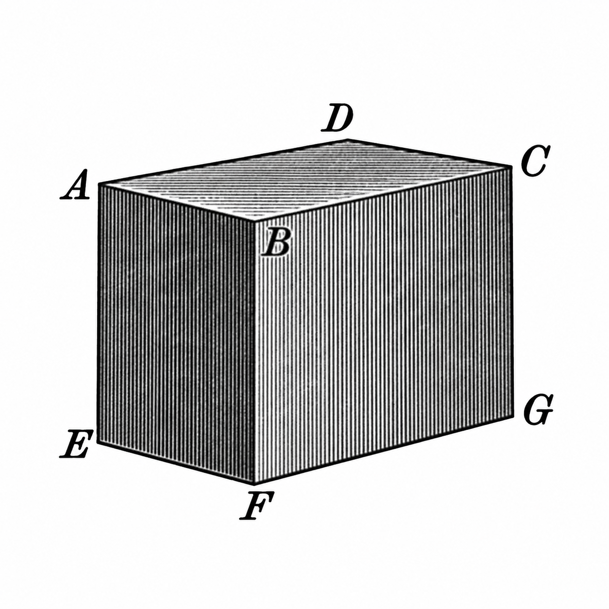
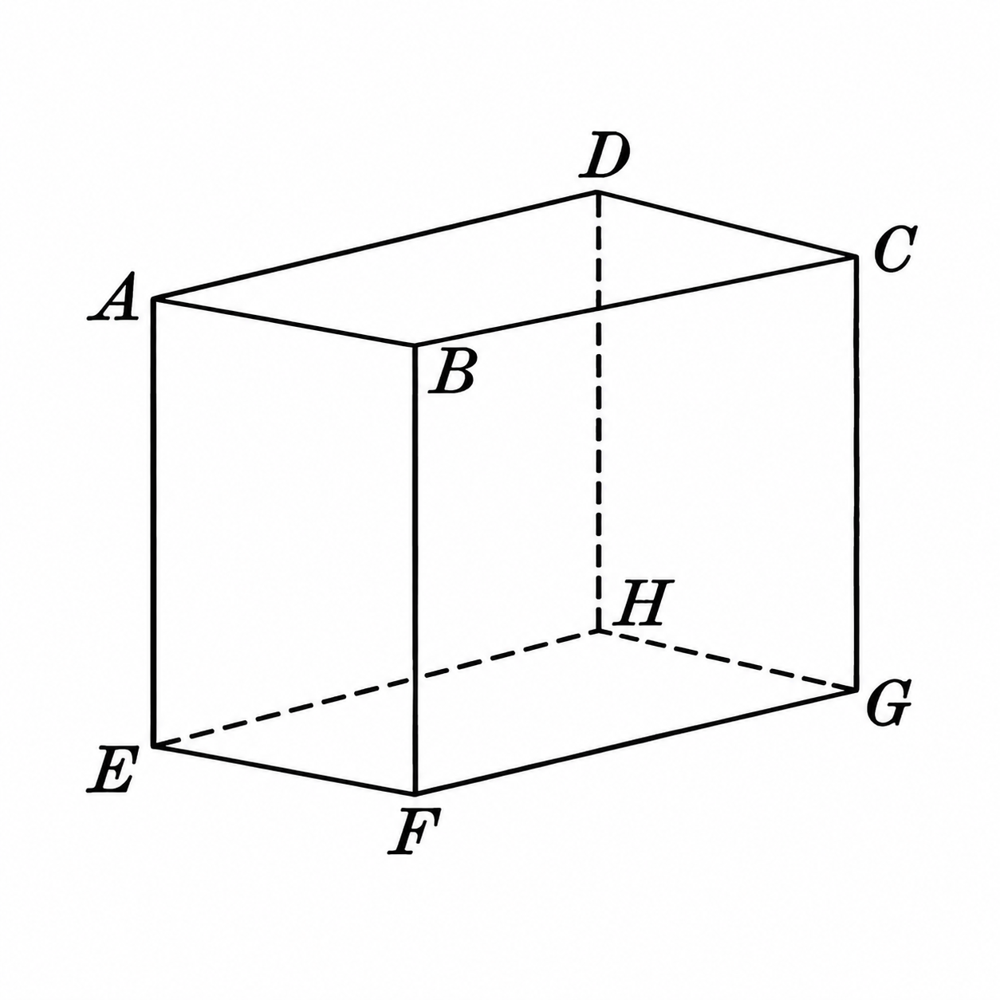
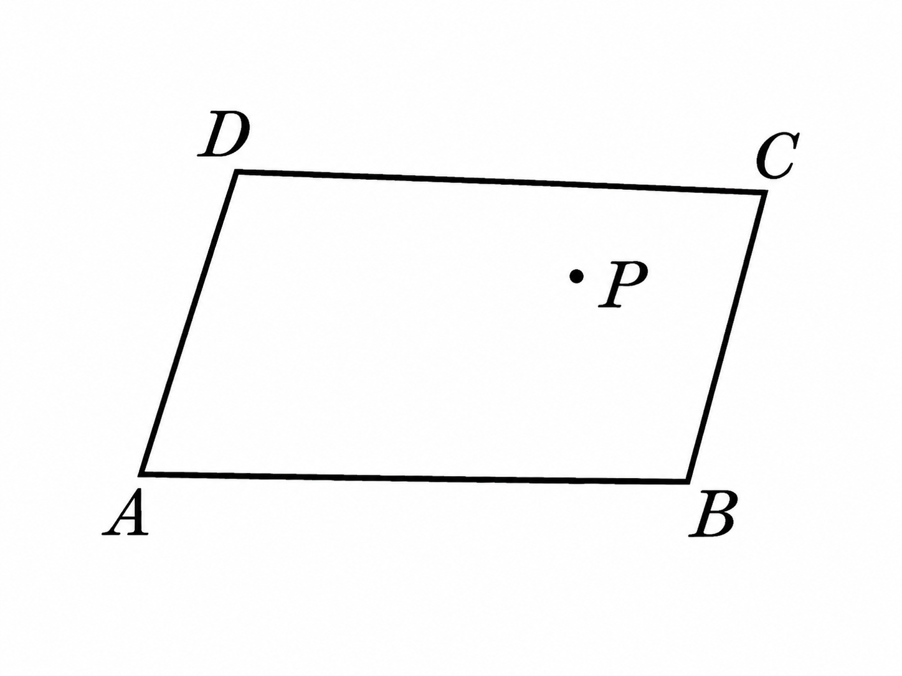
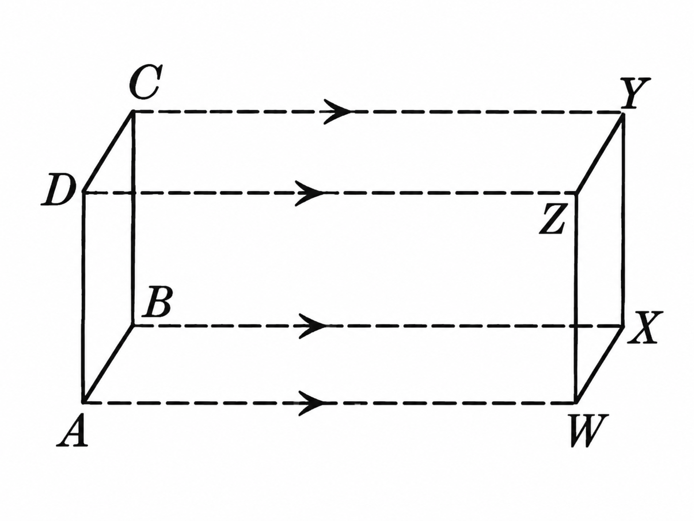

# Geometría plana y del espacio

**Jorge Wentworth y David Eugenio Smith**

**Edición digital abierta en curso.** Esta página reproduce de manera literal los fragmentos ya transcritos y cotejados del ejemplar físico de 1915. La ortografía, la puntuación, las grafías históricas y la notación del impreso se conservan; las fotografías del ejemplar funcionan como autoridad visual.

## Sobre esta edición

**Serie:** *Serie Matemática Wentworth y Smith*  
**Editorial:** Ginn y Compañía  
**Ciudades impresas:** Boston · Nueva York · Chicago · Londres  
**Copyright impreso:** 1915  
**Estado de la transcripción:** preliminares e Introducción, pp. 1–4

La edición de Matemática Abierta parte del ejemplar físico fotografiado. El texto se transcribe literalmente: no se modernizan formas históricas, no se corrigen silenciosamente erratas y no se reconstruye texto que no sea visible.

Las ilustraciones se incorporan aisladas dentro del texto, en el punto donde cumplen una función matemática. La página pública no muestra facsímiles completos: se conserva una lectura limpia y las figuras se presentan separadas del resto de la página original.

## Criterio de edición

1. Se preservan literalmente palabras, ortografía, acentuación, puntuación, mayúsculas y formas históricas.
2. No se moderniza la lengua ni se corrigen silenciosamente las erratas del impreso.
3. Las dudas de lectura se registran fuera del texto transcrito.
4. En la edición web se muestran únicamente las ilustraciones aisladas del resto de la página; los facsímiles completos se conservan como fuente de control, pero no forman parte de la lectura ordinaria.
5. Los saltos de línea puramente tipográficos pueden recomponerse en párrafos; los guiones de partición se resuelven únicamente cuando son inequívocos.

## Preliminares

### Portada

SERIE MATEMÁTICA WENTWORTH Y SMITH

# GEOMETRÍA

# PLANA Y DEL ESPACIO

POR

JORGE WENTWORTH

Y

DAVID EUGENIO SMITH

GINN Y COMPAÑÍA

BOSTON · NUEVA YORK · CHICAGO · LONDRES

### Página de copyright

COPYRIGHT, 1915, BY GEORGE WENTWORTH

AND DAVID EUGENE SMITH

PRINTED IN THE UNITED STATES OF AMERICA

625.11

**ES PROPIEDAD**

Quedan hechos el depósito y el correspondiente registro que ordena la ley para la protección de esta obra. En todos los países los autores se reservan todos los derechos, incluso el de traducción.

### Prefacio

Al preparar la edición de que se ha hecho la presente traducción, nos hemos guiado por ciertos principios generales y por las conclusiones a que, tras detenido estudio de los mejores textos y métodos de enseñanza empleados en los varios países de lengua castellana, hemos llegado respecto a las necesidades de sus escuelas. Bueno será exponer sucintamente los rasgos distintivos de esta obra.

Hoy se reconoce universalmente que los estudios geométricos son de importancia tal, que deben formar parte de todo plan racional de enseñanza. No es ya la geometría ciencia que sólo estudian los eruditos ni que se enseña sólo a alumnos de inteligencia privilegiada o de excepcionales aspiraciones. Mas, por lo mismo que debe enseñarse a mayor número de alumnos y a alumnos de toda condición, es preciso exponerla de conformidad con los últimos principios de la pedagogía moderna. Ha sido nuestro propósito, que nos hemos esmerado en llevar a cabo, juntar al rigor de la lógica la sencillez que la claridad exige, y hemos dado a la página una forma especial que no sólo presenta mejor apariencia sino que pone de manifiesto al alumno los diferentes pasos que ordenadamente se van dando, sea en la demostración de un principio general, sea en la resolución de un problema.

Para que el discípulo adquiera el hábito de dar las demostraciones en toda su plenitud, se ha adoptado el plan de darlas al principio en esa forma. No hay peligro de que esto produzca la idea de que basta aprenderlas de memoria, ni es ése su objeto. El gran número de ejercicios diseminados en todo el texto sirven para poner a prueba los conocimientos é inteligencia del alumno, quien no podrá resolverlos sin haber comprendido bien los teoremas en que se fundan o las operaciones que exigen. Estos ejercicios son al principio de suma sencillez, y aumentan en dificultad de manera tan gradual, que el alumno apenas si se da cuenta de los grandes progresos que va haciendo. Se ha dado gran número de ellos, no para que se estudien todos, sino para que el maestro tenga dónde escoger los que mejor se adapten a su plan de enseñanza y a las necesidades de sus alumnos.

Las definiciones se van dando a medida que se van necesitando. La introducción contiene algunos problemas sencillos, cuyo objeto es acostumbrar al estudiante al uso de los instrumentos principales de dibujo. Hácese también uso frecuente del álgebra elemental, para hacer ver las útiles aplicaciones de esta ciencia.

El arreglo de las proposiciones está fundado en el de los textos mejores de todos los países. La experiencia de muchos años y de millares de escuelas ha demostrado sus grandes ventajas.

El traductor ha adoptado algunos términos y expresiones, como *perpendicular bisectriz* y *bisectar* (la Academia trae *bisecar*), que, si bien inusitados o poco usados en castellano, son de indisputable utilidad y no pueden tacharse de incorrectos. También ha seguido el sistema inglés y norteamericano de escribir las abreviaturas referentes a decimales después del número completo y no después de los enteros : 4,36 km., y no 4km, 36.

Abrigamos la esperanza de que nuestra humilde obra reciba en los países de lengua castellana la buena acogida que ha tenido en los de lengua inglesa.

JORGE WENTWORTH  
DAVID EUGENIO SMITH

### Tabla general de materias

#### GEOMETRÍA PLANA

INTRODUCCIÓN ........................................ 1  
LIBRO I. FIGURAS RECTILÍNEAS ........................ 25  
TRIÁNGULOS .......................................... 26  
PARALELAS ........................................... 46  
CUADRILÁTEROS ....................................... 59  
POLÍGONOS ........................................... 68  
LUGARES GEOMÉTRICOS ................................. 73  
LIBRO II. EL CÍRCULO ................................ 93  
TEOREMAS ............................................ 94  
PROBLEMAS ........................................... 126  
LIBRO III. PROPORCIONES Y POLÍGONOS SEMEJANTES ...... 151  
TEOREMAS ............................................ 152  
PROBLEMAS ........................................... 182  
LIBRO IV. ÁREA DE LOS POLÍGONOS ..................... 191  
TEOREMAS ............................................ 192  
PROBLEMAS ........................................... 214  
LIBRO V. POLÍGONOS REGULARES Y CÍRCULOS ............. 227  
TEOREMAS ............................................ 228  
PROBLEMAS ........................................... 242  
APÉNDICE ............................................ 261  
SIMETRÍA ............................................ 261  
MÁXIMOS Y MÍNIMOS ................................... 265

#### GEOMETRÍA DEL ESPACIO

LIBRO VI. RECTAS Y PLANOS EN EL ESPACIO ............. 273  
RECTAS Y PLANOS ...................................... 273  
ÁNGULOS DIEDROS ...................................... 293  
ÁNGULOS POLIEDROS .................................... 306  
EJERCICIOS ........................................... 314  
LIBRO VII. POLIEDROS, CILINDROS Y CONOS .............. 317  
POLIEDROS ............................................ 317  
PRISMAS .............................................. 317  
PARALELEPÍPEDOS ...................................... 325  
PIRÁMIDES ............................................ 337  
POLIEDROS REGULARES .................................. 350  
CILINDROS ............................................ 353  
CONOS ................................................ 362  
EJERCICIOS ........................................... 375  
LIBRO VIII. LA ESFERA ................................ 381  
LA ESFERA ............................................ 381  
SECCIONES PLANAS Y PLANOS TANGENTES .................. 382  
POLÍGONOS ESFÉRICOS .................................. 392  
ÁREA DE LAS SUPERFICIES ESFÉRICAS .................... 410  
VOLUMEN DE LOS SÓLIDOS ESFÉRICOS ..................... 421  
EJERCICIOS ........................................... 424  
APÉNDICE ............................................. 431  
POLIEDROS ............................................ 432  
SEGMENTOS ESFÉRICOS .................................. 444  
SOFISMAS RECREATIVOS ................................. 449  
BOSQUEJO HISTÓRICO DE LA GEOMETRÍA ................... 453  
FÓRMULAS COMUNES ..................................... 458  
ÍNDICE ALFABÉTICO .................................... 461

### Abreviaturas y símbolos

<table class="ws-symbol-table" aria-label="Abreviaturas">
<tbody>
<tr><td>Circumf.</td><td>circunferencia.</td></tr>
<tr><td>Constr.</td><td>construcción.</td></tr>
<tr><td>Fig.</td><td>figura.</td></tr>
<tr><td>Hipót.</td><td>hipótesis.</td></tr>
<tr><td>Ident.</td><td>identidad.</td></tr>
<tr><td>L.C.D.D.</td><td>lo cual debíamos demostrar.</td></tr>
<tr><td>N.º</td><td>número.</td></tr>
<tr><td>Prop.</td><td>proposición.</td></tr>
<tr><td>rt.</td><td>recto, rectos.</td></tr>
</tbody>
</table>

<table class="ws-symbol-table" aria-label="Símbolos geométricos">
<tbody>
<tr><td class="ws-sign">&gt;</td><td>mayor que.</td></tr>
<tr><td class="ws-sign">&lt;</td><td>menor que.</td></tr>
<tr><td class="ws-sign">&#8741;</td><td>paralelo, paralela.</td></tr>
<tr><td class="ws-sign">&#8869;</td><td>perpendicular.</td></tr>
<tr><td class="ws-sign">&#8736;</td><td>ángulo, el ángulo.</td></tr>
<tr><td class="ws-sign">&#9651;</td><td>triángulo, el triángulo.</td></tr>
<tr><td class="ws-sign">&#9649;</td><td>paralelogramo.</td></tr>
<tr><td class="ws-sign">&#9645;</td><td>rectángulo.</td></tr>
<tr><td class="ws-sign">&#8857;</td><td>círculo.</td></tr>
<tr><td class="ws-sign">&#8756;</td><td>luego, de donde.</td></tr>
</tbody>
</table>

El plural de una palabra representada por un símbolo se indica poniendo una *s* al símbolo : ∠s, *ángulos, los ángulos* ; ⊥s, *perpendiculares* ; ∥s, *paralelos, paralelas* ; △s, *triángulos, los triángulos*.

## Geometría plana — Introducción

### 1. Carácter de la aritmética

En la aritmética se estudian los cálculos numéricos. Hácese a veces uso de las fórmulas ; mas el objeto de la aritmética no es tanto el establecerlas como el enseñar a ejecutar las operaciones necesarias para aplicarlas.

### 2. Carácter del álgebra

En el álgebra se generalizan las cuestiones de aritmética, y por lo común se expresan las reglas y teoremas por medio de fórmulas. Así, en vez de decir que el área de un rectángulo es igual al producto de la base por la altura, se establece la fórmula

$$
A = bh.
$$

Aun cuando la aritmética se vale algunas veces de las ecuaciones, no lo hace tan a menudo como el álgebra, que resuelve casi todo problema por medio de ellas. En resumen, el álgebra es una extensión y generalización de la aritmética.

### 3. Carácter de la geometría

Vamos ahora a entrar en un ramo de las matemáticas que difiere radicalmente de la aritmética y el álgebra ; ramo que, si bien hace uso frecuente de cálculos numéricos, ecuaciones y fórmulas, tiene por objeto principal el estudio de las *formas o figuras*, tales como rectángulos, triángulos y círculos, de que la aritmética y el álgebra no dan más que ideas muy generales, y cuyas propiedades se enuncian en estas ciencias, pero no se demuestran. Toca a la geometría dar demostraciones de tales propiedades : así, ella demuestra rigurosamente que el cuadrado construído sobre la hipotenusa de un triángulo rectángulo es igual a la suma de los cuadrados construídos sobre los catetos.

### 4. Cuerpo

El bloque que aquí se representa es un *cuerpo*; es una porción limitada de materia. La geometría, sin embargo, no tiene nada que ver con la sustancia de que los cuerpos se componen; ella se ocupa únicamente de la *forma* y el *tamaño* de los cuerpos, tales como los representa la segunda de estas dos figuras. Considerados desde este punto de vista, los cuerpos se llaman *cuerpos geométricos*, o *sólidos geométricos*.

::: {.columns .column-gap-3 .ws-illustration-pair}
::: {.column width="50%"}

::: {.ws-illustration}
{fig-alt="Cuerpo físico representado como un bloque prismático, con vértices rotulados A, B, C, D, E, F y G." width="100%"}
:::

:::
::: {.column width="50%"}

::: {.ws-illustration}
{fig-alt="Sólido geométrico representado como un prisma transparente, con vértices A, B, C, D, E, F, G y H." width="100%"}
:::

:::
:::

Figuras del n.º 4: cuerpo físico y sólido geométrico.

Por ejemplo, una varilla es un cuerpo físico: si se introduce en greda, el agujero que deja, aun cuando esté vacío, es un cuerpo o sólido geométrico.

#### 5. Sólido geométrico

Llámase pues *sólido geométrico*, o *sólido* brevemente, un espacio limitado cualquiera. El nombre, como se dijo en el número anterior, se aplica con igual propiedad sea que este espacio esté del todo vacío, sea que esté ocupado por alguna sustancia.

#### 6. Dimensiones

El sólido del n.º 4 tiene tres *dimensiones* bien definidas, a saber :

1) la *longitud*, que puede medirse de *A* a *D*;

2) la *anchura*, que puede medirse de *A* a *B*;

3) la *profundidad* o *altura*, que puede medirse de *A* a *E*.

Dícese en general que todo sólido tiene tres dimensiones, aunque en algunos, como en una bola (esfera) o en un sólido de la forma de una manzana, no puede con propiedad decirse que tienen longitud, anchura y profundidad. Sin embargo, de todo sólido puede cortarse o sacarse un bloque de la forma representada en el n.º 4, en que las tres dimensiones se ven con toda claridad.

### 7. Superficie

El sólido del n.º 4 tiene seis caras, cada una de las cuales es una *superficie*. Si estas caras se pulen y alisan de modo que una regla puesta sobre una de ellas toque todos sus puntos en contacto con la superficie, las caras se llaman *superficies planas*, o *planos*.

Estas superficies son los límites del sólido. Carecen de espesor, lo mismo que la sombra de un objeto. El espesor de una lámina de oro puede ser tan pequeño que no sea posible ni percibirlo ; sin embargo, la lámina es un sólido limitado por superficies y que tiene por tanto tres dimensiones. Reduciendo el espesor hasta hacerlo casi nulo nos aproximamos a lo que en geometría se entiende por superficie, esto es, a algo que carece en absoluto de espesor.

En general, dase el nombre de *superficie* al límite de los sólidos. Para expresar que las superficies carecen de espesor, se dice que *tienen sólo dos dimensiones*.

### 8. Línea

Vese en el sólido del n.º 4 que cada dos superficies contiguas se cortan en una *línea*. Así pues, se da el nombre de *línea* al límite de una superficie.

La línea tiene sólo una dimensión, a saber: longitud. No tiene ni espesor ni anchura.

Un hilo, por delgado que sea, tiene tres dimensiones, y es por tanto un sólido, no una línea. Si el grueso del hilo se reduce sin cesar, el hilo se aproxima más y más a lo que la geometría llama línea, si bien nunca puede llegar a ser una verdadera línea.

### 9. Magnitudes geométricas

Los sólidos, las superficies y las líneas se llaman *magnitudes geométricas*.

### 10. Punto

En el sólido del n.º 4, las líneas que se encuentran se encuentran en *puntos*. Como se ve, un *punto* es el límite de una línea, y carece a la vez de longitud, anchura y espesor.

Defínese también el punto diciendo que es lo que tiene posición solamente y carece de dimensiones.

El punto puede siempre concebirse o imaginarse, sea como el extremo de una línea, sea como la intersección de dos líneas. Asimismo, la intersección de dos superficies es una línea.

### 11. Representación del punto y de las magnitudes geométricas

El punto y las magnitudes geométricas se representan en el papel por medio de dibujos, o *figuras*.

Un punto se representa por una ligera marca, como indica *P* en esta figura.

Una línea se representa por una raya. Nómbrase por letras escritas en sus extremos, como *AB*.

Una superficie se representa por las líneas que la limitan, y se nombra por letras puestas en puntos convenientes de esas líneas, como se ve en *ABCD*.

::: {.ws-illustration}
{fig-alt="Superficie ABCD con un punto P representado en su interior." width="58%"}
:::

Los sólidos se representan por las superficies que los limitan, como se ve en las figuras del n.º 4.

#### 12. Generación de las magnitudes geométricas

Las magnitudes geométricas pueden suponerse engendradas así:

1) la línea por el movimiento de un punto;

2) la superficie por el movimiento de una línea;

3) el sólido por el movimiento de una superficie.

Supóngase que la superficie *ABCD* se mueve a la posición *WXYZ*, según indican las puntas de flecha. En este movimiento,

::: {.ws-illustration}
{fig-alt="Diagrama de la superficie ABCD desplazándose hasta WXYZ; las flechas muestran la generación de línea, superficie y sólido." width="76%"}
:::

1) *A* engendra la línea *AW*;

2) *AB* engendra la superficie *AWXB*;

3) *ABCD* engendra el sólido *AY*.

Una línea no puede engendrar una superficie si sólo se desliza sobre sí misma, ni una superficie engendrar un sólido moviéndose de igual manera.

#### 13. Figura geométrica

Llámase *figura geométrica*, o brevemente *figura*, todo punto, línea, superficie o sólido, o en general, toda combinación de puntos.

#### 14. Definición y divisiones de la geometría

La *geometría* es la ciencia que trata de las figuras geométricas.

La *geometría plana* trata de las *figuras planas*, o sea de las figuras cuyas partes están todas en un mismo plano.

La *geometría del espacio* trata de las figuras que no son planas.

## Estado de la publicación

Esta primera entrada pública incorpora todo lo transcrito y cotejado hasta la **página 4 de la Introducción**. La obra continuará creciendo de forma progresiva a medida que se incorporen nuevas páginas del ejemplar.
