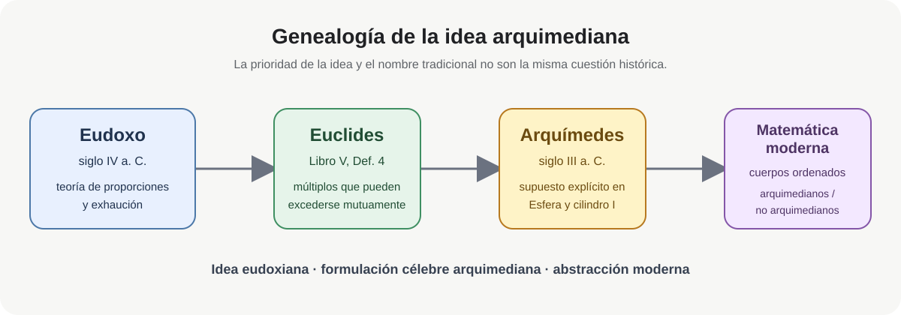
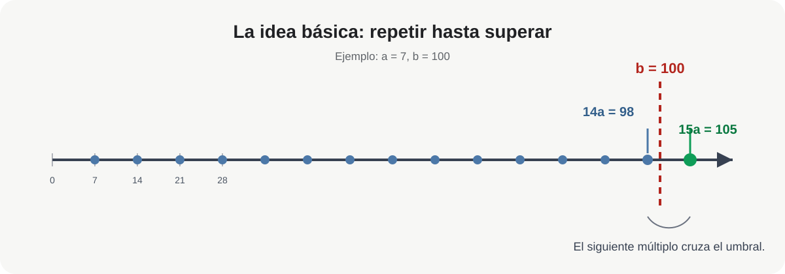
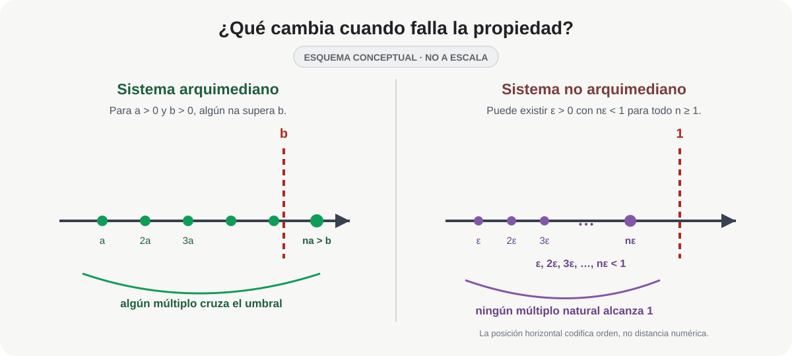

# La propiedad arquimediana

## De Eudoxo a Arquímedes y al análisis moderno

La **propiedad arquimediana** expresa una idea muy sencilla: por pequeña que sea una cantidad positiva, si la repetimos suficientes veces acabará superando cualquier cantidad positiva fijada de antemano.

En el lenguaje moderno, para dos números positivos $a$ y $b$,

$$
\boxed{
\exists n\in\mathbb N_{>0}\qquad na>b.
}
$$

Por ejemplo, si

$$
a=7,
\qquad
b=100,
$$

entonces

$$
14a=98<100,
\qquad
15a=105>100.
$$

No importa que $a$ sea mucho menor que $b$: algún múltiplo natural de $a$ terminará sobrepasando a $b$.

El nombre, sin embargo, plantea una pregunta histórica inmediata. Si la idea aparece ya en la teoría de las proporciones vinculada a **Eudoxo de Cnido**, ¿por qué hablamos de una propiedad *arquimediana*?

La respuesta exige distinguir tres momentos: la teoría eudoxiana conservada por Euclides, la formulación explícita de Arquímedes y la abstracción moderna de la propiedad.

<picture class="ma-art-0013-figure">
  <source media="(max-width: 600px)" srcset="../../assets/articles/ma-art-0013-propiedad-arquimediana/MA-ART-0013-F01_genealogia-eudoxo-arquimedes-mobile.svg">
  
</picture>

*Figura MA-ART-0013-F01. **Pregunta visual:** ¿cómo puede una idea tener antecedente eudoxiano y, sin embargo, llevar el nombre de Arquímedes? El diagrama separa genealogía conceptual, formulación conservada y denominación posterior.*

---

## 1. El antecedente eudoxiano: Euclides V.4

El Libro V de los *Elementos* contiene la teoría general de las proporciones que la tradición antigua y la historiografía matemática asocian estrechamente a Eudoxo. Allí Euclides introduce una condición para que dos magnitudes tengan razón entre sí.

La Definición V.4 dice, en traducción libre:

> Dos magnitudes tienen razón entre sí cuando, multiplicadas suficientemente, pueden excederse una a otra.

La idea es que, para magnitudes comparables $A$ y $B$, algún múltiplo de $A$ puede superar a $B$, y algún múltiplo de $B$ puede superar a $A$.[^euclides]

Es importante no modernizar demasiado rápido el texto. Euclides no está hablando de un **cuerpo ordenado**, ni de números reales en nuestro sentido, ni formula allí un axioma con cuantificadores. Habla de magnitudes geométricas y de las condiciones bajo las cuales puede establecerse una razón entre ellas.

Sin embargo, la estructura matemática que reconocemos detrás de la definición es inequívoca:

$$
A>0,\ B>0
\quad\Longrightarrow\quad
\text{algún múltiplo de }A\text{ supera a }B.
$$

Por eso la literatura moderna habla también del **axioma de Eudoxo**.

::: {.callout-important title="Precisión histórica"}
Decir que «Eudoxo descubrió la propiedad arquimediana» es útil como abreviatura, pero no debe ocultar la diferencia de contextos. Lo que podemos afirmar con seguridad es que la teoría eudoxiana de las proporciones, transmitida en el Libro V de Euclides, contiene el antecedente estructural directo de lo que hoy llamamos propiedad arquimediana.
:::

---

## 2. ¿Qué añade Arquímedes?

En *Sobre la esfera y el cilindro*, Arquímedes comienza su exposición estableciendo varios supuestos. El quinto afirma, en esencia, que si dos magnitudes son desiguales, la diferencia entre la mayor y la menor puede repetirse suficientes veces hasta superar cualquier magnitud comparable dada.[^arquimedes]

Esquemáticamente, si

$$
A>B,
\qquad
d=A-B>0,
$$

entonces, para cualquier magnitud positiva comparable $C$, existe un natural $n$ tal que

$$
nd>C.
$$

Ésta es ya una formulación explícita de la idea que la tradición posterior convirtió en el **axioma de Arquímedes**. Thomas Heath calificó el supuesto como «prácticamente equivalente» a Euclides V.4 y estrechamente relacionado con *Elementos* X.1.[^heath]

Conviene, sin embargo, no identificarlos literalmente. **Euclides V.4 formula una condición de comparabilidad entre dos magnitudes**: sus múltiplos pueden excederse mutuamente. **Arquímedes parte de dos magnitudes desiguales y exige que su diferencia** sea capaz, al repetirse, de exceder cualquier magnitud comparable del mismo tipo. En el marco moderno de un cuerpo ordenado ambas condiciones conducen a la misma estructura arquimediana, pero sus formulaciones y funciones en los textos antiguos son distintas.[^clagett]

La diferencia histórica decisiva no es, por tanto, que Arquímedes haya sido necesariamente el primero en conocer la idea. Es que **la aísla explícitamente como supuesto y la convierte en una pieza visible de su maquinaria demostrativa**.

Esa explicitación, unida al lugar central que el supuesto ocupa en sus argumentos de medición, **ayuda a explicar** la asociación posterior de la condición con su nombre. Históricamente conviene hablar, por tanto, de una genealogía Eudoxo–Euclides–Arquímedes y no de una prioridad simple.

---

## 3. La definición moderna

Sea $F$ un cuerpo ordenado. Decimos que $F$ es **arquimediano** si, para cualesquiera $a,b\in F$ con $a>0$ y $b>0$, existe $n\in\mathbb N_{>0}$ tal que

$$
\boxed{na>b.}
$$

Ésta es probablemente la formulación que mejor conserva la intuición antigua: una magnitud positiva, repetida suficientemente, supera a cualquier otra.

::: {.callout-tip title="Cómo leer los cuantificadores"}
La definición tiene el orden

$$
\forall a>0\;\forall b>0\;\exists n\in\mathbb N_{>0}:\;na>b.
$$

Primero se fijan $a$ y $b$; **después** se permite escoger un $n$, que puede depender de esa pareja. No afirma que exista un único natural que funcione simultáneamente para todas las parejas positivas. De hecho, si fijáramos de antemano un $n$ y tomáramos $a=1$ y $b=n+1$, tendríamos $na=n<b$. El orden de los cuantificadores forma parte del contenido matemático.
:::

Para $x>0$, tomar $a=1$ y $b=x$ produce una forma todavía más conocida; si $x\le0$, basta observar que $1>x$:

$$
\boxed{
\forall x\in F\quad \exists n\in\mathbb N_{>0}:\ n>x.
}
$$

Es decir, **los números naturales no están acotados superiormente** dentro de un cuerpo arquimediano.

En los números reales,

$$
1,2,3,4,\ldots
$$

terminan superando cualquier número real prefijado, por grande que éste sea.

<picture class="ma-art-0013-figure">
  <source media="(max-width: 600px)" srcset="../../assets/articles/ma-art-0013-propiedad-arquimediana/MA-ART-0013-F02_multiplos-superan-mobile.svg">
  
</picture>

*Figura MA-ART-0013-F02. **Pregunta visual:** ¿qué significa exactamente el cuantificador «existe $n$»? No exige que todos los múltiplos superen a $b$: basta uno. En el ejemplo, $14\cdot7=98$ todavía no alcanza a $100$, pero $15\cdot7=105$ ya lo supera.*

---

## 4. Tres formulaciones equivalentes

En un cuerpo ordenado, las siguientes afirmaciones son equivalentes. En lo que sigue identificamos cada entero positivo $n$ con $n\cdot 1_F$.

### Forma A — comparación de dos positivos

Para todo $a,b>0$, existe $n\in\mathbb N_{>0}$ tal que

$$
na>b.
$$

### Forma B — los naturales no están acotados

Para todo $x\in F$, existe $n\in\mathbb N_{>0}$ tal que

$$
n>x.
$$

### Forma C — los recíprocos llegan por debajo de cualquier tolerancia

Para todo $\varepsilon>0$, existe $n\in\mathbb N_{>0}$ tal que

$$
\frac1n<\varepsilon.
$$

La equivalencia permite cambiar de lenguaje según el problema.

**A implica B.** Sea $x\in F$. Si $x\le 0$, basta tomar $n=1$. Si $x>0$, aplicamos A con $a=1$ y $b=x$; existe entonces $n\in\mathbb N_{>0}$ tal que

$$
n>x.
$$

**B implica A.** Dados $a,b>0$, aplicamos B a $b/a$. Existe $n\in\mathbb N_{>0}$ con

$$
n>\frac ba,
$$

y al multiplicar por $a>0$ obtenemos

$$
na>b.
$$

**B implica C.** Si $\varepsilon>0$, aplicamos B a $1/\varepsilon$ y obtenemos $n\in\mathbb N_{>0}$ con

$$
n>\frac1\varepsilon.
$$

Como ambos lados son positivos, al invertir se invierte la desigualdad:

$$
\frac1n<\varepsilon.
$$

**C implica B.** Sea $x\in F$. Si $x\le0$, nuevamente sirve $n=1$. Si $x>0$, aplicamos C a

$$
\varepsilon=\frac1x>0.
$$

Existe $n\in\mathbb N_{>0}$ tal que

$$
\frac1n<\frac1x.
$$

Como $n$ y $x$ son positivos, al invertir obtenemos

$$
n>x.
$$

Queda así demostrada la equivalencia

$$
\boxed{\mathrm{A}\iff\mathrm{B}\iff\mathrm{C}}.
$$

La forma C es la que aparece constantemente en análisis. Así, una afirmación que en la geometría griega hablaba de repetir magnitudes aparece en el análisis moderno como la posibilidad de hacer

$$
\frac1n
$$

tan pequeño como necesitemos.

::: {.callout-tip title="Prueba de estrés"}
¿Qué cambia si intercambiamos los cuantificadores y pedimos un único $n$ que funcione para **todos** los $a,b>0$? La afirmación se vuelve falsa: fijado cualquier $n$, la elección $a=1$ y $b=n+1$ produce $na=n<b$. Esta comparación muestra por qué la dependencia de $n$ respecto de $a$ y $b$ no es un detalle de notación.
:::

---

## 5. Ejemplos

### Ejemplo 1. Una magnitud pequeña frente a una grande

Sea

$$
a=0.03,
\qquad
b=100.
$$

Buscamos un natural $n$ con

$$
0.03n>100.
$$

Esto equivale a

$$
n>\frac{100}{0.03}=3333.\overline3.
$$

Por tanto sirve

$$
\boxed{n=3334},
$$

pues

$$
3334(0.03)=100.02>100.
$$

La diferencia de escala puede ser enorme, pero sigue siendo finita en el sentido arquimediano.

### Ejemplo 2. Hacer $1/n$ menor que una tolerancia

Supongamos que queremos

$$
\frac1n<10^{-6}.
$$

Basta escoger

$$
n>10^6.
$$

Por ejemplo,

$$
\boxed{n=1\,000\,001}
$$

satisface

$$
\frac1{1\,000\,001}<10^{-6}.
$$

Este patrón aparece una y otra vez en demostraciones de límites.

### Ejemplo 3. Los racionales también son arquimedianos

La propiedad arquimediana **no caracteriza por sí sola a los números reales**. El cuerpo $\mathbb Q$ también es arquimediano.

Si $q\in\mathbb Q$, siempre existe un natural $n$ con

$$
n>q.
$$

Pero $\mathbb Q$ no es completo: por ejemplo, el conjunto

$$
S=\{q\in\mathbb Q:q^2<2\}
$$

está acotado superiormente en $\mathbb Q$ y no posee supremo racional.

Por tanto conviene separar dos propiedades:

$$
\boxed{
\text{arquimedianidad}\neq\text{completitud}.
}
$$

Los reales poseen ambas; los racionales sólo la primera.

::: {.callout-note title="Conexión con otro artículo"}
La relación entre orden, completitud y la caracterización de $\mathbb R$ se desarrolla en [Existencia y unicidad del cuerpo ordenado completo](existencia-unicidad-cuerpo-ordenado-completo.qmd).
:::

---

## 6. ¿Qué significa que la propiedad falle?

La mejor manera de comprender una propiedad estructural es imaginar qué ocurriría sin ella.

Supongamos que en cierto cuerpo ordenado existe un elemento positivo $\varepsilon$ tan pequeño que

$$
\varepsilon<\frac1n
$$

para **todo** $n\in\mathbb N_{>0}$.

Entonces

$$
n\varepsilon<1
$$

para todo natural $n$.

Por muchas veces que repitamos $\varepsilon$, nunca alcanzaremos $1$. La propiedad arquimediana falla.

Un elemento de este tipo se llama **infinitesimal positivo**. De manera dual, su recíproco

$$
H=\frac1\varepsilon
$$

sería mayor que todo natural:

$$
H>n
\qquad
\text{para todo }n\in\mathbb N_{>0}.
$$

Sería un elemento **infinitamente grande**.

<picture class="ma-art-0013-figure">
  <source media="(max-width: 600px)" srcset="../../assets/articles/ma-art-0013-propiedad-arquimediana/MA-ART-0013-F03_arquimediano-vs-infinitesimal-mobile.svg">
  
</picture>

*Figura MA-ART-0013-F03. **Pregunta visual:** ¿qué falla cuando existe un infinitesimal? En un sistema arquimediano algún múltiplo $na$ supera a $b$; en uno no arquimediano puede existir $\varepsilon>0$ con $n\varepsilon<1$ para todo $n\in\mathbb N_{>0}$. La figura es **conceptual y no está a escala**: en el panel derecho la posición horizontal representa únicamente el orden relativo.*

Esto permite una caracterización muy intuitiva:

$$
\boxed{
\text{un cuerpo ordenado es arquimediano}
\iff
\text{no contiene infinitesimales positivos no nulos.}
}
$$

**Demostración de la equivalencia.** Si existe un infinitesimal $\varepsilon>0$, entonces $n\varepsilon<1$ para todo $n\in\mathbb N_{>0}$; por tanto falla la forma A de la propiedad arquimediana al tomar $a=\varepsilon$ y $b=1$. Recíprocamente, si $F$ no es arquimediano, falla la forma B: existe $x\in F$ tal que $n\le x$ para todo $n\in\mathbb N_{>0}$. Entonces $H=x+1$ satisface $H>n$ para todo natural positivo, y

$$
\varepsilon=\frac1H>0
$$

satisface

$$
\varepsilon<\frac1n
\qquad
\text{para todo }n\in\mathbb N_{>0}.
$$

Así, la no arquimedianidad equivale exactamente a la existencia de infinitesimales positivos no nulos. Tomando recíprocos, equivale también a la existencia de un elemento positivo mayor que todos los naturales.

Los sistemas no arquimedianos no son contradicciones ni objetos ilegítimos. Existen estructuras matemáticas perfectamente rigurosas que contienen infinitesimales. Lo importante es que **no son isomorfas, como cuerpos ordenados, al cuerpo usual de los números reales**.

---

## 7. Por qué importa en análisis

La propiedad arquimediana suele trabajar en silencio. Muchas demostraciones la utilizan sin nombrarla.

Cuando escribimos

$$
\text{«elijamos }n\text{ suficientemente grande para que }\frac1n<\varepsilon\text{»},
$$

estamos utilizando arquimedianidad.

Por ejemplo, si

$$
a_n=\frac1n,
$$

y queremos demostrar que

$$
a_n\longrightarrow0,
$$

debemos probar que para todo $\varepsilon>0$ existe $N$ tal que, si $n\ge N$,

$$
\left|\frac1n-0\right|<\varepsilon.
$$

La propiedad arquimediana garantiza la existencia de un $N$ con

$$
N>\frac1\varepsilon.
$$

Entonces, para $n\ge N$,

$$
\frac1n\le\frac1N<\varepsilon.
$$

Así, una idea que nació en el contexto de magnitudes y proporciones se encuentra en el corazón de la definición moderna de límite.

---

## 8. Eudoxo, agotamiento y el control del error

La conexión histórica se vuelve todavía más clara en el **método de agotamiento**, también llamado **método de exhaución**.

Los geómetras griegos no expresaban sus argumentos diciendo que una sucesión «tiende a cero». En cambio, necesitaban demostrar que una diferencia positiva podía hacerse menor que una magnitud previamente fijada mediante suficientes subdivisiones.

Ese tipo de argumento necesita precisamente impedir que exista una diferencia positiva que permanezca, por principio, fuera del alcance de todas las repeticiones o subdivisiones finitas.

La tradición atribuye a Eudoxo tanto la teoría general de las proporciones del Libro V como la estructura del método de agotamiento utilizada en el Libro XII de Euclides. Arquímedes llevó posteriormente esa técnica a un nivel excepcional en sus demostraciones de áreas y volúmenes.[^exhaucion]

Por eso la genealogía conceptual puede resumirse así:

$$
\boxed{
\text{comparabilidad de magnitudes}
\longrightarrow
\text{control del error}
\longrightarrow
\text{agotamiento}
\longrightarrow
\text{lenguaje moderno de límites}.
}
$$

No debemos identificar sin más el método de agotamiento con el cálculo moderno; sus lenguajes y fundamentos son distintos. Pero existe una continuidad estructural genuina: la posibilidad de vencer cualquier margen positivo mediante un procedimiento suficientemente avanzado.

---

## 9. Entonces, ¿por qué «arquimediana»?

Podemos responder ahora con precisión.

**Primero**, la idea es anterior a Arquímedes. Su antecedente directo aparece en la teoría de las proporciones asociada a Eudoxo y conservada por Euclides en el Libro V.

**Segundo**, Arquímedes la formula explícitamente entre los supuestos con los que construye su geometría de áreas y volúmenes. Esa formulación se volvió especialmente visible en la tradición matemática posterior.

**Tercero**, la terminología aparece ya explícitamente asentada en la axiomatización moderna. En la traducción inglesa de 1902 de *The Foundations of Geometry*, David Hilbert presenta el §8, Grupo V, como el axioma de continuidad o **axioma arquimediano**.[^hilbert] Esto no prueba por sí solo cuándo se acuñó el nombre, pero sí documenta que a comienzos del siglo XX la asociación con Arquímedes era ya convencional.

Por eso no hay una contradicción entre decir

$$
\boxed{\text{la idea es eudoxiana}}
$$

y decir

$$
\boxed{\text{la propiedad se llama arquimediana}.}
$$

Son afirmaciones sobre aspectos diferentes de la historia: una se refiere a la genealogía de la idea; la otra, a la denominación que terminó estabilizándose.

Una expresión históricamente muy informativa sería

$$
\boxed{\text{principio de Eudoxo--Arquímedes}.}
$$

No es el nombre estándar, pero recuerda algo importante: los nombres matemáticos rara vez funcionan como certificados exactos de prioridad.

---

## 10. Resumen

La propiedad arquimediana puede leerse de varias maneras equivalentes:

$$
\forall a,b>0\quad\exists n\in\mathbb N_{>0}:\ na>b,
$$

$$
\forall x\quad\exists n\in\mathbb N_{>0}:\ n>x,
$$

y

$$
\forall\varepsilon>0\quad\exists n\in\mathbb N_{>0}:\ \frac1n<\varepsilon.
$$

En su forma antigua, la idea asegura que magnitudes positivas comparables no quedan separadas por una barrera infranqueable de escala. En su forma moderna, excluye infinitesimales y elementos infinitamente grandes dentro de un cuerpo ordenado arquimediano.

Su historia, por último, recuerda que detrás de una fórmula elemental puede esconderse una continuidad intelectual de más de dos mil años:

$$
\boxed{
\text{Eudoxo}
\longrightarrow
\text{Euclides}
\longrightarrow
\text{Arquímedes}
\longrightarrow
\text{análisis moderno}.
}
$$

---

## Referencias

### Fuentes primarias y ediciones

- **Euclides**, *Elementos*, Libro V, Definición 4, y Libro X, Proposición 1; véase T. L. Heath, *The Thirteen Books of Euclid's Elements*, 3 vols., Cambridge University Press, 1908 (Libro V en el vol. II; Libro X en el vol. III).
- **Arquímedes**, *Sobre la esfera y el cilindro*, Libro I, supuestos iniciales; en T. L. Heath, *The Works of Archimedes*, Cambridge University Press, 1897, especialmente el supuesto 5.
- **Hilbert, David**, *The Foundations of Geometry*, trad. E. J. Townsend, Open Court, 1902, §8, Grupo V.

### Estudios y controles modernos

- **Clagett, Marshall**, «Archimedes», en Charles C. Gillispie (ed.), *Dictionary of Scientific Biography*, vol. 1, Charles Scribner's Sons, 1970, pp. 213–231.
- **Encyclopedia of Mathematics**, «Archimedean axiom» y «Exhaustion, method of».

[^euclides]: *Elementos* V.4 establece que las magnitudes tienen razón entre sí cuando, tomadas como múltiplos, pueden excederse mutuamente. La interpretación moderna como condición de comparabilidad debe distinguirse del vocabulario original de magnitudes.

[^arquimedes]: En *Sobre la esfera y el cilindro* I, Arquímedes incluye entre sus supuestos la condición de que la diferencia entre magnitudes desiguales, repetida suficientemente, pueda exceder cualquier magnitud comparable asignada.

[^heath]: Heath describe el quinto supuesto de Arquímedes como el célebre «axioma de Arquímedes», lo llama «prácticamente equivalente» a *Elementos* V.4 y subraya su estrecha conexión con X.1.

[^clagett]: Clagett advierte que la identificación entre V.4 y el supuesto de Arquímedes no debe tomarse literalmente: en Arquímedes la condición recae sobre la diferencia entre dos magnitudes desiguales. Esta distinción es histórica y conceptual; en la formalización moderna de cuerpos ordenados ambas conducen a la condición arquimediana usual.

[^hilbert]: En la traducción de E. J. Townsend (1902), el §8 de *The Foundations of Geometry* encabeza el Grupo V como «Axiom of Continuity (Archimedean Axiom)» y formula el axioma mediante la repetición de segmentos iguales sobre una recta.

[^exhaucion]: El procedimiento se conoce en español como **método de agotamiento** y también como **método de exhaución**. Su invención o sistematización se atribuye tradicionalmente a Eudoxo; Euclides lo utiliza de modo decisivo en el Libro XII y Arquímedes lo desarrolla extensamente en sus investigaciones geométricas.
